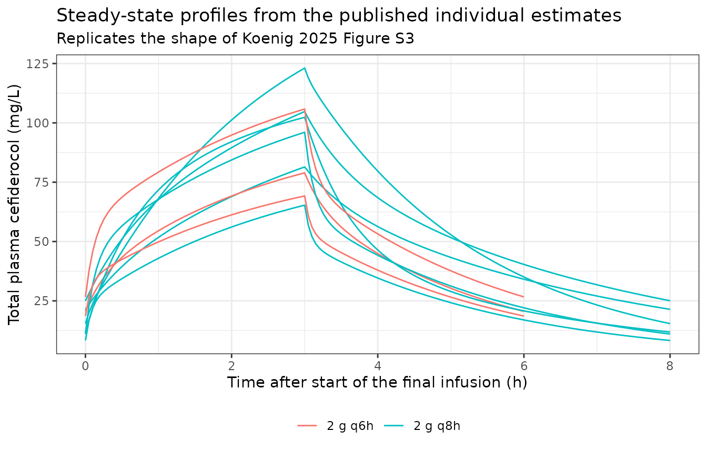
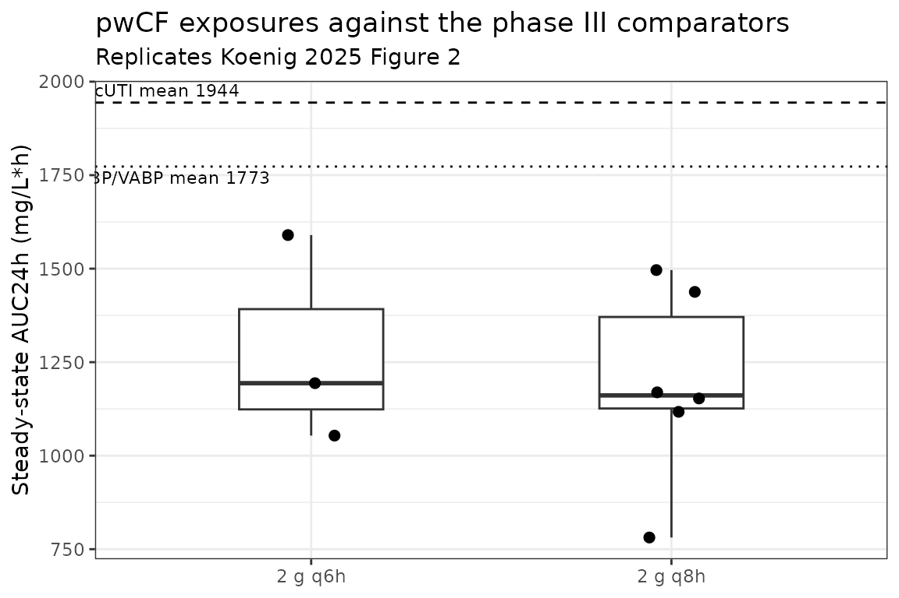
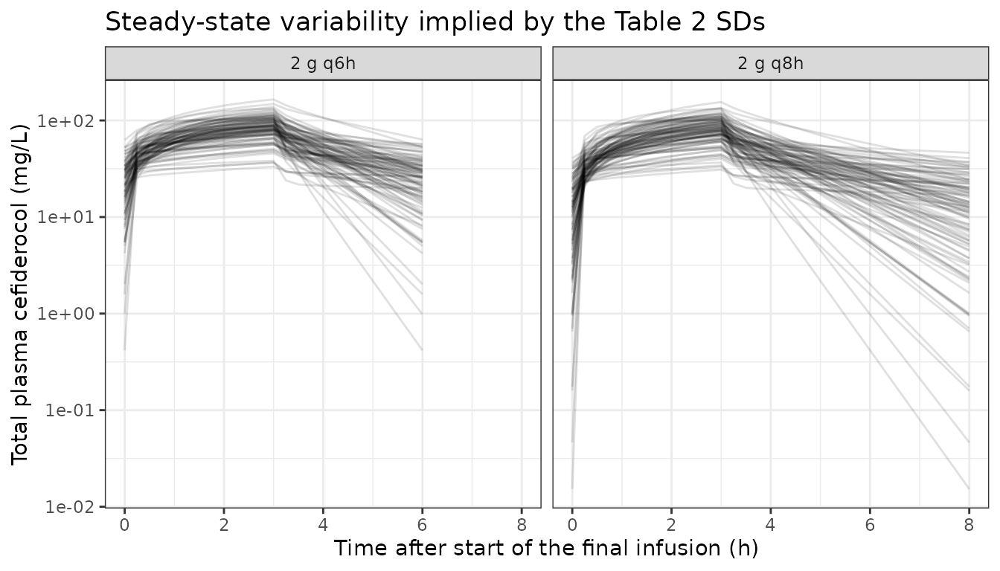

# Cefiderocol (Koenig 2025)

## Model and source

- Citation: Koenig C, Monogue ML, Shields RK, Sakon CM, Fratoni AJ,
  Roenfanz HF, Finklea JD, Pope JS, Nicolau DP, Kuti JL. Cefiderocol
  pharmacokinetics during acute pulmonary exacerbations in hospitalized
  adult persons with cystic fibrosis. Antimicrob Agents Chemother.
  2025;69(1):e01539-24. <doi:10.1128/aac.01539-24>
- Description: Two-compartment population PK model for cefiderocol in
  hospitalized adults with cystic fibrosis during an acute pulmonary
  exacerbation, fitted nonparametrically with the Pmetrics NPAG
  algorithm and parameterised by clearance, central volume and the
  intercompartmental micro-rate constants k12 and k21
- Article: <https://doi.org/10.1128/aac.01539-24> (PMC11784235; open
  access, CC BY)
- Supplement: `aac.01539-24-s0001.docx` (APE criteria, Cockcroft-Gault
  formula, LC/MS-MS method, Figures S1-S3, the model-development AIC
  table and the covariance matrix of the final model)

Cefiderocol is a siderophore cephalosporin with activity against
multidrug-resistant Gram-negative bacilli, including the *Pseudomonas
aeruginosa*, *Achromobacter* spp. and *Burkholderia cepacia* complex
isolates that drive acute pulmonary exacerbations (APE) in people with
cystic fibrosis (pwCF). Koenig and colleagues report the first
description of cefiderocol pharmacokinetics in adult pwCF hospitalized
with an APE, fitting plasma concentrations nonparametrically with the
adaptive grid (NPAG) algorithm in Pmetrics. The two-compartment
disposition model they selected is the model packaged here.

The analysis was presented in preliminary form as poster P-1227 at
IDWeek 2024 (abstract `ofae631.1409`, Open Forum Infect Dis
2025;12(Suppl 1):S784). The poster’s parameter estimates differ from the
final publication’s and are superseded by them; see the Errata section.

## Population

Ten pwCF were enrolled in a prospective study across four United States
sites; one was excluded for a positive pregnancy test before receiving
study drug, so nine completed. Koenig 2025 Table 1 publishes every
participant individually: mean age 33 years (SD 11, range 22-58), mean
weight 62 kg (SD 10, range 45-78), mean height 170 cm (SD 7, range
157-180) and mean Cockcroft-Gault eGFR 117 mL/min (SD 24, range 71-164).
Eight of nine were male. Six of nine were receiving CFTR modulator
therapy during the study, which the Discussion proposes as the reason
both renal clearance and protein binding resembled non-CF cohorts rather
than the pre-modulator CF literature.

Every participant received 2 g of cefiderocol as a 3 h prolonged
intravenous infusion, with the frequency set by the approved label
according to eGFR: six received q8h and the three with augmented renal
function (eGFR \> 120 mL/min) received q6h. Sampling followed at least
three prior doses, so all observations are at steady state, and was
drawn at 0 (pre-dose), 1.5, 3, 3.25, 3.5, 4, 5, 6 and 8 h after the
start of the final dose (80 samples in total).

Moderate-to-severe renal dysfunction (eGFR \< 60 mL/min), any renal
replacement therapy and haemodialysis were exclusion criteria, so **this
model carries no information about renal impairment**, and the observed
weight range is narrow. The Discussion cautions explicitly against
extrapolating to pwCF of higher body weight or reduced eGFR.

``` r

knitr::kable(
  data.frame(
    Characteristic = c("Subjects", "Age (years)", "Weight (kg)", "Height (cm)",
                       "eGFR, Cockcroft-Gault (mL/min)", "Female", "CFTR modulator",
                       "Regimen", "Samples"),
    Value = c("9 (10 enrolled, 1 excluded)", "33 +/- 11 (22-58)",
              "62 +/- 10 (45-78)", "170 +/- 7 (157-180)", "117 +/- 24 (71-164)",
              "1 of 9", "6 of 9",
              "2 g over 3 h; q8h (n = 6) or q6h (n = 3) by eGFR", "80")
  ),
  caption = "Koenig 2025 Table 1 and Methods."
)
```

| Characteristic | Value |
|:---|:---|
| Subjects | 9 (10 enrolled, 1 excluded) |
| Age (years) | 33 +/- 11 (22-58) |
| Weight (kg) | 62 +/- 10 (45-78) |
| Height (cm) | 170 +/- 7 (157-180) |
| eGFR, Cockcroft-Gault (mL/min) | 117 +/- 24 (71-164) |
| Female | 1 of 9 |
| CFTR modulator | 6 of 9 |
| Regimen | 2 g over 3 h; q8h (n = 6) or q6h (n = 3) by eGFR |
| Samples | 80 |

Koenig 2025 Table 1 and Methods. {.table}

## Source trace

Every `ini()` value and every `model()` equation, with its location in
the source.

``` r

knitr::kable(
  data.frame(
    Item = c("lcl", "lvc", "lk12", "lk21",
             "etalcl / etalvc / etalk12 / etalk21",
             "addSd", "propSd",
             "Two-compartment ODE structure",
             "q, vp", "Cc", "Cfree", "FU",
             "CRCL (excluded)", "WT (excluded)"),
    Value = c("log(5.66) L/h", "log(5.81) L", "log(4.29) 1/h", "log(2.25) 1/h",
              "0.05013 / 0.31306 / 0.50089 / 0.91615",
              "0.01224 mg/L", "0.10530",
              "central + peripheral1, micro-constants",
              "k12 * vc; q / k21", "central / vc", "FU * Cc",
              "1 - protein binding / 100",
              "slope 0.0399 L/h per mL/min, p = 0.0248",
              "slope 0.0427 L/kg, p = 0.764"),
    Source = c(rep("Table 2, population estimate (mean)", 4),
               "Table 2 SD column, via omega^2 = log(CV^2 + 1)",
               "Methods: C0 = 0.0068 x fitted gamma 1.8",
               "Methods: C1 = 0.0585 x fitted gamma 1.8",
               "Results: 'a two-compartment model (AIC 501) fitted the data better than a one-compartment model (AIC 548)'",
               "Algebraic identity of the Table 2 micro-constants",
               "Units declaration: dose mg, vc L",
               "Methods, individual target attainment analysis",
               "Table 3, protein binding column",
               "Supplement Figure S1 regression table; AIC table",
               "Supplement Figure S2 regression table")
  )
)
```

| Item | Value | Source |
|:---|:---|:---|
| lcl | log(5.66) L/h | Table 2, population estimate (mean) |
| lvc | log(5.81) L | Table 2, population estimate (mean) |
| lk12 | log(4.29) 1/h | Table 2, population estimate (mean) |
| lk21 | log(2.25) 1/h | Table 2, population estimate (mean) |
| etalcl / etalvc / etalk12 / etalk21 | 0.05013 / 0.31306 / 0.50089 / 0.91615 | Table 2 SD column, via omega^2 = log(CV^2 + 1) |
| addSd | 0.01224 mg/L | Methods: C0 = 0.0068 x fitted gamma 1.8 |
| propSd | 0.10530 | Methods: C1 = 0.0585 x fitted gamma 1.8 |
| Two-compartment ODE structure | central + peripheral1, micro-constants | Results: ‘a two-compartment model (AIC 501) fitted the data better than a one-compartment model (AIC 548)’ |
| q, vp | k12 \* vc; q / k21 | Algebraic identity of the Table 2 micro-constants |
| Cc | central / vc | Units declaration: dose mg, vc L |
| Cfree | FU \* Cc | Methods, individual target attainment analysis |
| FU | 1 - protein binding / 100 | Table 3, protein binding column |
| CRCL (excluded) | slope 0.0399 L/h per mL/min, p = 0.0248 | Supplement Figure S1 regression table; AIC table |
| WT (excluded) | slope 0.0427 L/kg, p = 0.764 | Supplement Figure S2 regression table |

## Published individual estimates

Koenig 2025 publishes the maximum a posteriori (MAP) Bayesian parameter
estimates for all nine participants (Table 2) together with each
participant’s measured protein binding and simulated AUC24h (Table 3).
That makes the paper unusually verifiable: the whole validation below is
a **deterministic** reconstruction driven by the published per-subject
parameters, with no random draws, so every check is reproducible on any
machine and tight tolerances are appropriate.

``` r

subj <- data.frame(
  id        = c(1, 2, 3, 5, 6, 7, 4, 8, 9),
  regimen   = c(rep("2 g q8h", 6), rep("2 g q6h", 3)),
  tau       = c(rep(8, 6), rep(6, 3)),
  cl        = c(4.17, 4.01, 5.20, 5.13, 7.68, 5.37, 6.70, 5.03, 7.59),
  vc        = c(9.09, 5.60, 13.21, 6.05, 2.88, 2.25, 7.93, 2.41, 2.87),
  k12       = c(0.64, 7.11, 0.58, 0.50, 8.96, 4.72, 1.63, 4.82, 9.60),
  k21       = c(0.92, 9.95, 1.06, 0.50, 1.74, 1.15, 1.77, 1.30, 1.85),
  pb        = c(54, 45, 55, 47, 57, 56, 38, 49, 35),
  auc24_pub = c(1430, 1496, 1153, 1170, 781, 1117, 1194, 1590, 1054)
)
subj$FU <- 1 - subj$pb / 100

# The published population estimates are the arithmetic mean of these nine
# individual estimates, which confirms the Table 2 transcription.
chk_pop <- data.frame(
  Parameter = c("CL (L/h)", "Vc (L)", "k12 (1/h)", "k21 (1/h)"),
  Published = c(5.66, 5.81, 4.29, 2.25),
  `Mean of individuals` = round(
    c(mean(subj$cl), mean(subj$vc), mean(subj$k12), mean(subj$k21)), 3
  ),
  check.names = FALSE
)
knitr::kable(chk_pop)
```

| Parameter | Published | Mean of individuals |
|:----------|----------:|--------------------:|
| CL (L/h)  |      5.66 |               5.653 |
| Vc (L)    |      5.81 |               5.810 |
| k12 (1/h) |      4.29 |               4.284 |
| k21 (1/h) |      2.25 |               2.249 |

``` r

stopifnot(max(abs(chk_pop$Published - chk_pop$`Mean of individuals`)) < 0.01)
```

## Simulation of the published regimens

Each participant is simulated on their own regimen for four doses, which
is the protocol Koenig 2025 used for its own target-attainment
simulations (“profiles were generated for four doses to achieve steady
state”), and evaluated over the final dosing interval.

``` r

mod <- rxode2::zeroRe(ui)

DOSE  <- 2000   # mg
DUR   <- 3      # h prolonged infusion
NDOSE <- 4
GRID  <- 0.05   # h

mkEvents <- function(d, grid = GRID) {
  do.call(rbind, lapply(seq_len(nrow(d)), function(i) {
    s <- d[i, ]
    dos <- data.frame(
      id = s$id, time = seq(0, (NDOSE - 1) * s$tau, by = s$tau),
      amt = DOSE, evid = 1, rate = DOSE / DUR, cmt = "central"
    )
    obs <- data.frame(
      id = s$id, time = seq(0, NDOSE * s$tau, by = grid),
      amt = NA_real_, evid = 0, rate = NA_real_, cmt = "central"
    )
    out <- rbind(dos, obs)
    out$FU <- s$FU
    out[order(out$time, -out$evid), ]
  }))
}

pars <- data.frame(
  id = subj$id, lcl = log(subj$cl), lvc = log(subj$vc),
  lk12 = log(subj$k12), lk21 = log(subj$k21)
)
sim <- rxode2::rxSolve(
  mod, params = pars, events = mkEvents(subj), returnType = "data.frame"
)
#> ℹ omega/sigma items treated as zero: 'etalcl', 'etalvc', 'etalk12', 'etalk21'
#> Warning: multi-subject simulation without without 'omega'
sim <- dplyr::left_join(
  sim, subj[, c("id", "regimen", "tau", "auc24_pub")], by = "id"
)
sim$ss_start <- (NDOSE - 1) * sim$tau
```

### Structural check: the peripheral compartment is actually being solved

This is the load-bearing structural gate for this model, and it is not
decoration. rxode2 5.1.7 inspects an `rxUi` model for a recognisable
linear compartment parameterisation and, when it finds one, replaces the
`d/dt()` right-hand sides with its analytic kernel. A version of this
model that defined `cl` and `vc` but not `q` and `vp` was recognised as
a **one**-compartment system, and the peripheral compartment was
silently discarded: `peripheral1` vanished from the solve output and the
concentration decayed mono-exponentially at `kel` with no distribution
phase.

Critically, **an AUC-based check cannot detect this**, because AUC over
a dosing interval equals dose/CL for any linear model at steady state,
so the collapsed model reproduces every published AUC24h exactly. The
trough is what discriminates: under the correct two-compartment solve
the lowest pre-dose concentration in the cohort is about 8 mg/L, whereas
the collapsed one-compartment solve puts it at essentially zero.

``` r

trough <- sim %>%
  dplyr::filter(abs(time - NDOSE * tau) < 1e-9) %>%
  dplyr::transmute(id, regimen, Ctrough = Cc, Ctrough_free = Cfree)
knitr::kable(trough, digits = 2,
             caption = "Steady-state trough at the end of the final interval.")
```

|  id | regimen | Ctrough | Ctrough_free |
|----:|:--------|--------:|-------------:|
|   1 | 2 g q8h |   25.07 |        11.53 |
|   2 | 2 g q8h |   15.44 |         8.49 |
|   3 | 2 g q8h |   21.44 |         9.65 |
|   5 | 2 g q8h |   11.88 |         6.30 |
|   6 | 2 g q8h |    8.32 |         3.58 |
|   7 | 2 g q8h |   11.03 |         4.85 |
|   4 | 2 g q6h |   20.57 |        12.75 |
|   8 | 2 g q6h |   26.68 |        13.60 |
|   9 | 2 g q6h |   18.62 |        12.10 |

Steady-state trough at the end of the final interval. {.table}

``` r


stopifnot(
  # The peripheral state must survive into the solve.
  "peripheral1" %in% names(sim),
  # A genuine distribution phase. Realised minimum 8.32 mg/L; the collapsed
  # one-compartment solve gives < 0.01 mg/L, so this has a ~800-fold margin
  # and still goes red the moment the ODE is bypassed.
  min(trough$Ctrough) > 4
)
```

## PKNCA validation

Noncompartmental analysis over the final dosing interval, grouped by
regimen and participant.

``` r

sim_nca <- sim %>%
  dplyr::filter(time >= ss_start, !is.na(Cc)) %>%
  dplyr::select(id, regimen, time, Cc)

dose_df <- subj %>%
  dplyr::transmute(id, regimen, time = (NDOSE - 1) * tau, amt = DOSE)

intervals <- data.frame(
  regimen = c("2 g q8h", "2 g q6h"),
  start   = c(3 * 8, 3 * 6),
  end     = c(4 * 8, 4 * 6),
  cmax    = TRUE,
  cmin    = TRUE,
  tmax    = TRUE,
  auclast = TRUE,
  cav     = TRUE
)

nca_res <- PKNCA::pk.nca(PKNCA::PKNCAdata(
  PKNCA::PKNCAconc(sim_nca, Cc ~ time | regimen + id,
                   concu = "mg/L", timeu = "h"),
  PKNCA::PKNCAdose(dose_df, amt ~ time | regimen + id,
                   doseu = "mg", duration = DUR),
  intervals = intervals
))
nca <- as.data.frame(nca_res)
```

### Per-participant AUC24h against Koenig 2025 Table 3

The interval AUC is scaled to 24 h (x 24/tau) to match the paper’s
AUC24h.

``` r

auc <- nca %>%
  dplyr::filter(PPTESTCD == "auclast") %>%
  dplyr::transmute(id, regimen, auc_tau = PPORRES) %>%
  dplyr::left_join(subj[, c("id", "tau", "auc24_pub")], by = "id") %>%
  dplyr::mutate(
    auc24 = auc_tau * 24 / tau,
    pct   = 100 * (auc24 - auc24_pub) / auc24_pub
  ) %>%
  dplyr::arrange(id)

knitr::kable(
  auc %>%
    dplyr::transmute(
      id, regimen,
      `Published AUC24h (mg/L*h)` = auc24_pub,
      `Simulated AUC24h (mg/L*h)` = round(auc24, 1),
      `% diff` = round(pct, 2)
    ),
  caption = "Koenig 2025 Table 3, AUC24h column."
)
```

|  id | regimen | Published AUC24h (mg/L\*h) | Simulated AUC24h (mg/L\*h) | % diff |
|----:|:--------|---------------------------:|---------------------------:|-------:|
|   1 | 2 g q8h |                       1430 |                     1437.9 |   0.55 |
|   2 | 2 g q8h |                       1496 |                     1496.2 |   0.02 |
|   3 | 2 g q8h |                       1153 |                     1152.9 |  -0.01 |
|   4 | 2 g q6h |                       1194 |                     1193.8 |  -0.01 |
|   5 | 2 g q8h |                       1170 |                     1169.4 |  -0.05 |
|   6 | 2 g q8h |                        781 |                      781.2 |   0.03 |
|   7 | 2 g q8h |                       1117 |                     1117.2 |   0.02 |
|   8 | 2 g q6h |                       1590 |                     1589.9 |  -0.01 |
|   9 | 2 g q6h |                       1054 |                     1053.7 |  -0.03 |

Koenig 2025 Table 3, AUC24h column. {.table}

``` r


sprintf("max |%% diff| in AUC24h: %.2f%%", max(abs(auc$pct)))
#> [1] "max |% diff| in AUC24h: 0.55%"
stopifnot(
  # Deterministic reconstruction, so this is tight by design. Realised 0.55%,
  # driven by subject 1 alone; the residual is the paper's own trapezoidal
  # integration of a 15-min grid, which slightly understates the peak, plus
  # rounding of CL to three significant figures. A mis-transcribed clearance,
  # dose or unit moves this by tens of percent.
  max(abs(auc$pct)) < 1.5
)
```

### Group-mean AUC24h against the abstract and Results text

``` r

auc_group <- auc %>%
  dplyr::group_by(regimen) %>%
  dplyr::summarise(auclast = mean(auc24), .groups = "drop")

auc_ref <- data.frame(
  regimen = c("2 g q8h", "2 g q6h"),
  auclast = c(1191, 1279)   # Koenig 2025 Abstract and Table 3 "Mean" rows
)

cmp <- nlmixr2lib::ncaComparisonTable(
  auc_group, auc_ref,
  by     = "regimen",
  params = "auclast",
  units  = c(auclast = "mg/L*h, AUC24h at steady state")
)
knitr::kable(cmp, caption = attr(cmp, "footnote"))
```

| NCA parameter                             | regimen | Reference | Simulated | % diff |
|:------------------------------------------|:--------|:----------|:----------|:-------|
| AUClast (mg/L\*h, AUC24h at steady state) | 2 g q8h | 1190      | 1190      | +0.1%  |
| AUClast (mg/L\*h, AUC24h at steady state) | 2 g q6h | 1280      | 1280      | +0.0%  |

``` r


overall <- mean(auc$auc24)
sprintf("overall mean AUC24h: simulated %.0f vs published 1221 mg/L*h", overall)
#> [1] "overall mean AUC24h: simulated 1221 vs published 1221 mg/L*h"
stopifnot(abs(overall - 1221) / 1221 < 0.02)
```

### Per-participant %fT \> MIC against Koenig 2025 Table 3

The paper evaluated free-drug time above the MIC on a 15-minute grid
(“one data point every 15 min”). That discretisation is recoverable from
the published values themselves: every q8h entry is an exact multiple of
1/32 (81% = 26/32, 69% = 22/32, 41% = 13/32) and every q6h entry an
exact multiple of 1/24 (88% = 21/24, 92% = 22/24, 83% = 20/24).
Reproducing the method exactly, rather than integrating a finer grid,
therefore lets the 45 published cells be checked against their own
arithmetic.

``` r

MICS <- c(2, 4, 8, 16, 32)

ftmic <- do.call(rbind, lapply(subj$id, function(i) {
  s <- subj[subj$id == i, ]
  grid15 <- seq((NDOSE - 1) * s$tau, NDOSE * s$tau - 0.25, by = 0.25)
  d <- sim[sim$id == i, ]
  cf <- stats::approx(d$time, d$Cfree, xout = grid15)$y
  data.frame(
    id = i, regimen = s$regimen, MIC = MICS,
    ft = vapply(MICS, function(m) 100 * mean(cf > m), numeric(1))
  )
}))

# Koenig 2025 Table 3, %fT > MIC block, transcribed per participant.
ftmic_pub <- data.frame(
  id  = rep(c(1, 2, 3, 5, 6, 7, 4, 8, 9), each = 5),
  MIC = rep(MICS, 9),
  ft_pub = c(100, 100, 100,  81, 34,
             100, 100, 100,  78, 50,
             100, 100, 100,  69, 16,
             100, 100,  88,  59, 38,
             100,  94,  69,  41,  0,
             100, 100,  81,  56, 22,
             100, 100, 100,  88, 46,
             100, 100, 100,  92, 54,
             100, 100, 100,  83, 42)
)

ftmic <- ftmic %>%
  dplyr::left_join(ftmic_pub, by = c("id", "MIC")) %>%
  dplyr::mutate(diff = ft - ft_pub)

# Guard against a silently empty comparison (pattern: all(logical(0)) is TRUE).
stopifnot(nrow(ftmic) == 45L, !anyNA(ftmic$ft_pub), !anyNA(ftmic$ft))

knitr::kable(
  ftmic %>%
    dplyr::mutate(cell = paste0(round(ft, 1), " / ", ft_pub)) %>%
    dplyr::select(id, regimen, MIC, cell) %>%
    tidyr::pivot_wider(names_from = MIC, values_from = cell,
                       names_prefix = "MIC "),
  caption = paste("Simulated / published %fT > MIC per participant",
                  "(Koenig 2025 Table 3).")
)
```

|  id | regimen | MIC 2     | MIC 4     | MIC 8     | MIC 16    | MIC 32    |
|----:|:--------|:----------|:----------|:----------|:----------|:----------|
|   1 | 2 g q8h | 100 / 100 | 100 / 100 | 100 / 100 | 81.2 / 81 | 34.4 / 34 |
|   2 | 2 g q8h | 100 / 100 | 100 / 100 | 100 / 100 | 78.1 / 78 | 50 / 50   |
|   3 | 2 g q8h | 100 / 100 | 100 / 100 | 100 / 100 | 68.8 / 69 | 15.6 / 16 |
|   5 | 2 g q8h | 100 / 100 | 100 / 100 | 87.5 / 88 | 59.4 / 59 | 37.5 / 38 |
|   6 | 2 g q8h | 100 / 100 | 93.8 / 94 | 68.8 / 69 | 40.6 / 41 | 0 / 0     |
|   7 | 2 g q8h | 100 / 100 | 100 / 100 | 81.2 / 81 | 56.2 / 56 | 21.9 / 22 |
|   4 | 2 g q6h | 100 / 100 | 100 / 100 | 100 / 100 | 87.5 / 88 | 45.8 / 46 |
|   8 | 2 g q6h | 100 / 100 | 100 / 100 | 100 / 100 | 91.7 / 92 | 54.2 / 54 |
|   9 | 2 g q6h | 100 / 100 | 100 / 100 | 100 / 100 | 83.3 / 83 | 41.7 / 42 |

Simulated / published %fT \> MIC per participant (Koenig 2025 Table 3).
{.table}

``` r


sprintf("max |difference| across %d cells: %.2f percentage points",
        nrow(ftmic), max(abs(ftmic$diff)))
#> [1] "max |difference| across 45 cells: 0.50 percentage points"
sprintf("cells reproduced exactly: %d of %d",
        sum(abs(ftmic$diff) < 1e-9), nrow(ftmic))
#> [1] "cells reproduced exactly: 25 of 45"
stopifnot(
  # Deterministic. Realised 0.5 pp, which is exactly the paper's rounding of
  # its own n/32 and n/24 grid fractions to whole percent, so 1 pp is the
  # tightest bound that is arithmetically achievable here.
  max(abs(ftmic$diff)) <= 1
)
```

The group means also reproduce the Abstract and Results narrative: at
MICs of 4, 8 and 16 mg/L the q8h arm attains a mean %fT \> MIC that the
paper reports as 99%, 90% and 64%, and the q6h arm 100%, 100% and 87%.

``` r

ftmic_group <- ftmic %>%
  dplyr::group_by(regimen, MIC) %>%
  dplyr::summarise(simulated = mean(ft), published = mean(ft_pub),
                   .groups = "drop") %>%
  dplyr::mutate(dplyr::across(c(simulated, published), ~ round(.x, 1)))
knitr::kable(
  ftmic_group %>%
    dplyr::rename("Simulated mean %fT > MIC" = simulated,
                  "Published mean %fT > MIC" = published),
  caption = "Group means, Koenig 2025 Table 3 'Mean' rows."
)
```

| regimen | MIC | Simulated mean %fT \> MIC | Published mean %fT \> MIC |
|:--------|----:|--------------------------:|--------------------------:|
| 2 g q6h |   2 |                     100.0 |                     100.0 |
| 2 g q6h |   4 |                     100.0 |                     100.0 |
| 2 g q6h |   8 |                     100.0 |                     100.0 |
| 2 g q6h |  16 |                      87.5 |                      87.7 |
| 2 g q6h |  32 |                      47.2 |                      47.3 |
| 2 g q8h |   2 |                     100.0 |                     100.0 |
| 2 g q8h |   4 |                      99.0 |                      99.0 |
| 2 g q8h |   8 |                      89.6 |                      89.7 |
| 2 g q8h |  16 |                      64.1 |                      64.0 |
| 2 g q8h |  32 |                      26.6 |                      26.7 |

Group means, Koenig 2025 Table 3 ‘Mean’ rows. {.table}

``` r

stopifnot(max(abs(ftmic_group$simulated - ftmic_group$published)) <= 1)
```

## Replicating the published figures

### Individual steady-state profiles (Figure S3)

``` r

prof <- sim %>%
  dplyr::filter(time >= ss_start) %>%
  dplyr::mutate(t_rel = time - ss_start)

ggplot2::ggplot(prof, ggplot2::aes(t_rel, Cc, group = id, colour = regimen)) +
  ggplot2::geom_line() +
  ggplot2::labs(
    x = "Time after start of the final infusion (h)",
    y = "Total plasma cefiderocol (mg/L)", colour = NULL,
    title = "Steady-state profiles from the published individual estimates",
    subtitle = "Replicates the shape of Koenig 2025 Figure S3"
  ) +
  ggplot2::theme_bw() +
  ggplot2::theme(legend.position = "bottom")
```



### AUC24h in pwCF against the phase III trials (Figure 2)

Koenig 2025 Figure 2 compares steady-state AUC24h in pwCF with the phase
III cUTI and HABP/VABP populations. The Discussion supplies the
comparator values: cUTI 1944 (SD 1097) and HABP/VABP 1773 (SD 1503)
mg/L*h. The paper’s point is that pwCF exposures are* lower\*, which it
attributes to the deliberately narrow eGFR range studied here (71-164
mL/min) against 7-540 mL/min in the phase III trials, which enrolled
patients with renal dysfunction.

``` r

ggplot2::ggplot(auc, ggplot2::aes(regimen, auc24)) +
  ggplot2::geom_boxplot(width = 0.4, outlier.shape = NA) +
  ggplot2::geom_jitter(width = 0.08, height = 0, size = 2) +
  ggplot2::geom_hline(yintercept = 1944, linetype = "dashed") +
  ggplot2::geom_hline(yintercept = 1773, linetype = "dotted") +
  ggplot2::annotate("text", x = 0.6, y = 1944, vjust = -0.5, size = 3,
                    label = "cUTI mean 1944") +
  ggplot2::annotate("text", x = 0.6, y = 1773, vjust = 1.4, size = 3,
                    label = "HABP/VABP mean 1773") +
  ggplot2::labs(x = NULL, y = "Steady-state AUC24h (mg/L*h)",
                title = "pwCF exposures against the phase III comparators",
                subtitle = "Replicates Koenig 2025 Figure 2") +
  ggplot2::theme_bw()
```



``` r


stopifnot(
  # The paper's own conclusion: pwCF exposures sit below both phase III means.
  mean(auc$auc24) < 1773
)
```

## Interindividual variability

The packaged `ini()` carries the Table 2 SD column as lognormal
variances. Two consequences are worth making explicit, because both are
visible in a simulated cohort.

``` r

cohort_arm <- function(regimen, tau, n = 100, seed = 20250124) {
  # Re-seed inside the loop so the two arms share common random numbers.
  rxode2::rxSetSeed(seed)
  set.seed(seed)
  d <- data.frame(
    id = seq_len(n), regimen = regimen, tau = tau,
    # FU is a measured per-subject input; resampled from the nine observed
    # values, since the paper reports no distribution for it.
    FU = sample(subj$FU, n, replace = TRUE)
  )
  s <- rxode2::rxSolve(ui, events = mkEvents(d, grid = 0.25),
                       returnType = "data.frame")
  s$regimen <- regimen
  s$tau <- tau
  s
}
cohort <- rbind(cohort_arm("2 g q8h", 8), cohort_arm("2 g q6h", 6))

cohort_summary <- cohort %>%
  dplyr::distinct(regimen, id, cl, vc, k12, k21) %>%
  dplyr::group_by(regimen) %>%
  dplyr::summarise(
    n = dplyr::n(),
    `median CL` = round(median(cl), 2),
    `mean CL`   = round(mean(cl), 2),
    `median Vc` = round(median(vc), 2),
    .groups = "drop"
  )
knitr::kable(cohort_summary,
             caption = "Simulated cohort, 100 participants per arm.")
```

| regimen |   n | median CL | mean CL | median Vc |
|:--------|----:|----------:|--------:|----------:|
| 2 g q6h | 100 |      5.93 |    6.02 |      5.21 |
| 2 g q8h | 100 |      5.93 |    6.02 |      5.21 |

Simulated cohort, 100 participants per arm. {.table}

``` r


ggplot2::ggplot(
  cohort %>% dplyr::filter(time >= (NDOSE - 1) * tau) %>%
    dplyr::mutate(t_rel = time - (NDOSE - 1) * tau),
  ggplot2::aes(t_rel, Cc, group = id)
) +
  ggplot2::geom_line(alpha = 0.12) +
  ggplot2::facet_wrap(~ regimen) +
  ggplot2::scale_y_log10() +
  ggplot2::labs(x = "Time after start of the final infusion (h)",
                y = "Total plasma cefiderocol (mg/L)",
                title = "Steady-state variability implied by the Table 2 SDs") +
  ggplot2::theme_bw()
```



``` r


stopifnot(
  nrow(cohort_summary) == 2L,
  all(cohort_summary$n == 100L)
)
```

First, because the published central estimates are encoded as lognormal
*medians* while the paper reports arithmetic *means*, a simulated
cohort’s mean sits above the published value by a factor of
`exp(omega^2 / 2)`:

``` r

om2 <- c(cl = 0.05013, vc = 0.31306, k12 = 0.50089, k21 = 0.91615)
knitr::kable(
  data.frame(
    Parameter = names(om2),
    `Published mean` = c(5.66, 5.81, 4.29, 2.25),
    `Encoded median` = c(5.66, 5.81, 4.29, 2.25),
    `Implied cohort mean` = round(c(5.66, 5.81, 4.29, 2.25) * exp(om2 / 2), 2),
    `Offset (%)` = round(100 * (exp(om2 / 2) - 1), 1),
    check.names = FALSE
  ),
  caption = "Consequence of encoding a reported mean as a lognormal median."
)
```

|     | Parameter | Published mean | Encoded median | Implied cohort mean | Offset (%) |
|:----|:----------|---------------:|---------------:|--------------------:|-----------:|
| cl  | cl        |           5.66 |           5.66 |                5.80 |        2.5 |
| vc  | vc        |           5.81 |           5.81 |                6.79 |       16.9 |
| k12 | k12       |           4.29 |           4.29 |                5.51 |       28.5 |
| k21 | k21       |           2.25 |           2.25 |                3.56 |       58.1 |

Consequence of encoding a reported mean as a lognormal median. {.table}

Second, the encoded variances come from the diagonal of the supplement
covariance matrix rather than from the Table 2 SD column, because the
matrix carries the unrounded variances while Table 2 rounds their square
roots to three significant figures. The check below pins both halves of
that claim: the encoded `omega^2` values are exactly
`log(1 + var/mean^2)` from the matrix diagonal, and the matrix diagonal
reproduces the printed SDs to their stated precision.

``` r

means      <- c(cl = 5.66, vc = 5.81, k12 = 4.29, k21 = 2.25)
cov_diag   <- c(cl = 1.647, vc = 12.409, k12 = 11.966, k21 = 7.592)
printed_sd <- c(cl = 1.28, vc = 3.52, k12 = 3.46, k21 = 2.76)
implied    <- log(1 + cov_diag / means^2)

cv_chk <- data.frame(
  Parameter = names(om2),
  `Table 2 SD` = printed_sd,
  `sqrt(diag(cov))` = round(sqrt(cov_diag), 3),
  `Encoded omega^2` = om2,
  `omega^2 from cov` = round(implied, 5),
  `Encoded CV (%)` = round(100 * sqrt(exp(om2) - 1), 1),
  check.names = FALSE
)
knitr::kable(cv_chk, row.names = FALSE)
```

| Parameter | Table 2 SD | sqrt(diag(cov)) | Encoded omega^2 | omega^2 from cov | Encoded CV (%) |
|:---|---:|---:|---:|---:|---:|
| cl | 1.28 | 1.283 | 0.05013 | 0.05013 | 22.7 |
| vc | 3.52 | 3.523 | 0.31306 | 0.31306 | 60.6 |
| k12 | 3.46 | 3.459 | 0.50089 | 0.50089 | 80.6 |
| k21 | 2.76 | 2.755 | 0.91615 | 0.91615 | 122.5 |

``` r


stopifnot(
  # The encoded variances ARE the covariance-diagonal values.
  max(abs(om2 - implied)) < 1e-5,
  # And the covariance diagonal reproduces Table 2's printed SDs to the three
  # significant figures they are given to (realised max 0.005).
  max(abs(sqrt(cov_diag) - printed_sd)) < 0.0055
)
```

## Assumptions and deviations

- **The published estimates are arithmetic means, encoded as lognormal
  medians.** Koenig 2025 Table 2 reports “Population estimate (mean +/-
  SD)”, and each value is the mean of the nine published individual MAP
  estimates (verified above). They are encoded as `log(mean)`, following
  the convention used for the other nonparametric (NPAG) models in this
  library, so that a typical-value simulation returns the published
  number. The medians of the nine individual estimates are lower (CL
  5.20, Vc 5.60, k12 4.72, k21 1.30); a user who wants the cohort *mean*
  to match the paper should subtract `omega^2 / 2` from each
  `l`-parameter.

- **The published covariance matrix is not transferable to a lognormal
  block, so the etas are independent.** The supplement publishes the
  full 4x4 covariance matrix of the nonparametric joint density, and its
  `sqrt(diag)` reproduces all four Table 2 SDs to three significant
  figures, so it is certainly the matrix behind Table 2:

  |         | CL     | Vc     | k12    | k21   |
  |---------|--------|--------|--------|-------|
  | **CL**  | 1.647  |        |        |       |
  | **Vc**  | -1.586 | 12.409 |        |       |
  | **k12** | 2.322  | -8.819 | 11.966 |       |
  | **k21** | -1.184 | -0.704 | 3.721  | 7.592 |

  It cannot be carried over, because no multivariate lognormal has these
  means and this covariance. The implied Vc-k12 correlation is -0.724,
  but at these CVs (60.6% and 80.6%) the lognormal-feasible range for
  that pair is only -0.669 to 0.994. The moment-matched log-scale matrix
  is therefore indefinite (smallest eigenvalue -0.085) and
  [`chol()`](https://rdrr.io/r/base/chol.html) fails on it, which would
  abort every stochastic solve. The other five pairs are individually
  feasible, but a block OMEGA must be jointly positive definite, so the
  diagonal is the only faithful option. The matrix is reproduced here so
  a user can apply their own nearest-positive-definite projection if
  they want the correlation structure.

- **The residual error folds the fitted gamma into the assay
  polynomial.** Pmetrics weights observations by an assay SD polynomial
  `C0 + C1*[obs] + C2*[obs]^2 + C3*[obs]^3` scaled by a fitted gamma.
  Koenig 2025 gives C0 = 0.0068, C1 = 0.0585, C2 = C3 = 0 and a fitted
  gamma of 1.8, so the encoded SD is `1.8 * (0.0068 + 0.0585 * Cc)`.
  Because C2 = C3 = 0 the polynomial is linear in the observation, which
  is `combined1()` (a direct sum) and not nlmixr2’s default quadrature
  combination. The two terms are left estimable rather than `fixed()`
  because, although C0 and C1 are stated assay constants, the gamma
  multiplying both of them was fitted.

- **Vp and Q are derived, not estimated.** The paper’s parameterisation
  is CL, Vc, k12 and k21, so the peripheral volume is identified only
  implicitly as `Vp = Vc * k12 / k21` (11.1 L at the population
  estimates, with Q = 24.9 L/h). Defining `q` and `vp` in `model()` is
  also required for rxode2 5.1.7 to solve the two-compartment system at
  all – see the structural check above.

- **The final model has no covariates.** eGFR was the one significant
  correlate of clearance (supplement Figure S1: slope 0.0399 L/h per
  mL/min, p = 0.0248) but no eGFR model reduced the AIC by more than 2,
  and body weight was not significant for Vc (p = 0.764). Both are
  recorded in `covariatesDataExcluded` with their regression statistics
  rather than being silently dropped. Because eGFR \< 60 mL/min was an
  exclusion criterion, the model must not be used to predict renal
  impairment.

- **`FU` is measured data, converted from the reported protein
  binding.** Koenig 2025 reports protein binding, so `FU = 1 - PB/100`;
  the Table 3 per-subject values give FU 0.43-0.65 (mean 0.52). `FU`
  scales only the free concentration `Cfree` that drives target
  attainment; it does not scale any disposition parameter. In the
  simulated cohort above, `FU` is resampled from the nine measured
  values because the paper reports no distribution for it.

- **The Methods protein-binding formula is missing a bracket.** It is
  printed as `protein binding [%] = 1 - CPFF/CPlasma * 100`, which is
  dimensionally inconsistent; it means `(1 - CPFF/CPlasma) * 100`, as
  the Table 3 values between 35 and 57 confirm.

- **The cohort simulation is illustrative, not a VPC.** The paper
  publishes no observed concentrations, so there is nothing to overlay;
  the cohort exists only to show the spread implied by the Table 2 SDs.
  Its assertions are deliberately structural (arm sizes) rather than
  numeric, because a cohort-derived statistic is not reproducible across
  solver thread counts.

## Errata and provenance notes

- **The IDWeek 2024 poster is superseded.** This analysis was first
  presented as poster P-1227 (abstract `ofae631.1409`, Open Forum Infect
  Dis 2025;12(Suppl 1):S784), whose estimates differ materially from the
  final paper’s. The peer-reviewed values are used throughout; the
  poster’s are recorded here only so that a reader who finds the
  abstract first can tell the two apart.

  | Quantity           | Poster P-1227   | Final paper      |
  |--------------------|-----------------|------------------|
  | CL (L/h)           | 5.69 +/- 1.45   | 5.66 +/- 1.28    |
  | Vc (L)             | 7.42 +/- 3.74   | 5.81 +/- 3.52    |
  | k12 (1/h)          | 2.54 +/- 1.76   | 4.29 +/- 3.46    |
  | k21 (1/h)          | 2.72 +/- 3.04   | 2.25 +/- 2.76    |
  | Protein binding    | 45% (38-51)     | 48% (35-57)      |
  | AIC, 2-compartment | 514             | 501              |
  | AUC24h, q8h        | 1210 (790-1460) | 1191 (781-1496)  |
  | AUC24h, q6h        | 1241 (950-1578) | 1279 (1054-1590) |

  The poster also describes renal dosing by “creatinine clearance (CrCL)
  by Cockroft-Gault” while the paper says “estimated glomerular
  filtration rate (eGFR) … by Cockcroft-Gault”. These are the same
  quantity under two names; the supplement’s formula is the standard
  Cockcroft-Gault creatinine clearance, computed on ideal (or adjusted)
  body weight.

- **The supplement’s table captions are offset by one.** In
  `aac.01539-24-s0001.docx` the caption “Table S1: Performance of tested
  models” is attached to the Figure S1 eGFR-versus-CL regression table,
  and “Table S2: Covariance matrix …” to the Figure S2 weight-versus-Vc
  regression table. The captioned content actually appears in the two
  unlabelled tables that follow, under the headings “Model development
  process” and “Covariance Matrix of final pharmacokinetic model”.
  Values in this vignette are taken from the content, not the captions.

- **The eGFR regression slope is quoted twice with different
  precision.** The Discussion says “the slope (0.039)”; the supplement
  regression table gives 0.0399. The tabulated value is used.

- **Subject numbering in Table 3 is not sequential.** Table 3 lists the
  six q8h participants (IDs 1, 2, 3, 5, 6, 7) before the three q6h
  participants (IDs 4, 8, 9), whereas Tables 1 and 2 run 1 through 9.
  The join above is by participant ID, not row order.
