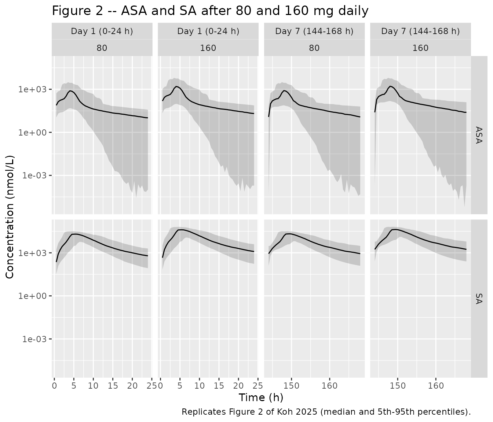
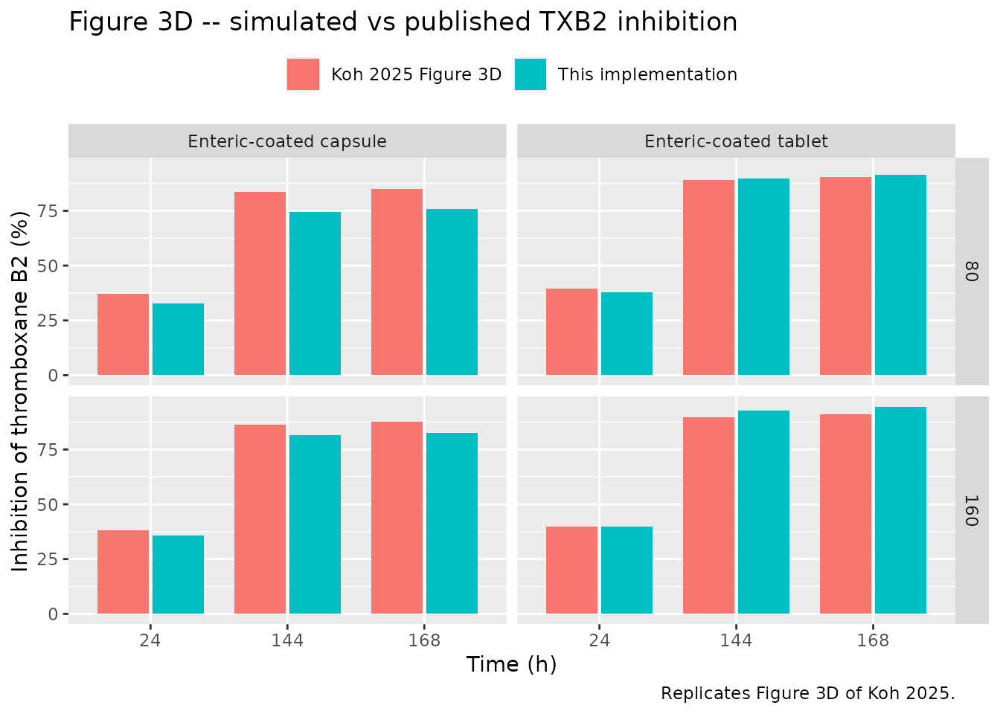
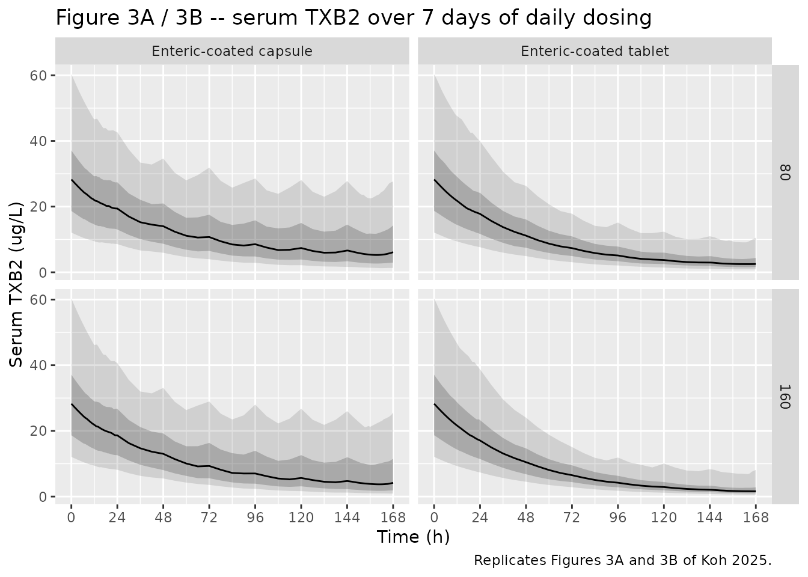

# Enteric-coated aspirin (Koh 2025)

## Model and source

- Citation: Koh JE, Khwarg J, Yu KS, Lee S, Jang IJ, Lee S. Population
  Pharmacokinetic and Pharmacodynamic Modeling of Enteric-Coated Aspirin
  Capsule and Tablet Formulations in Healthy Subjects. Drug Des Devel
  Ther. 2025;19:7853-7863. <doi:10.2147/DDDT.S533428>
- Description: Joint population PK-PD model for enteric-coated aspirin
  in healthy Korean adults (Koh 2025; two phase I studies, 100 mg once
  daily for 5 days). Parallel dual absorption – a zero-order arm with a
  lag time plus a first-order arm – delivers acetylsalicylic acid (ASA)
  into a pre-systemic compartment that drains by two competing
  first-order routes: intact ASA into the one-compartment ASA
  disposition, and gut-hydrolysed salicylic acid (SA) straight into the
  two-compartment SA disposition. Systemic ASA is eliminated entirely by
  conversion to SA (kmet), so apparent ASA clearance is kmet \* V3/F =
  69.8 L/h. Body weight enters kmet and SA clearance as power functions
  normalised to the 68.35 kg cohort median, and the enteric-coated
  capsule absorbs about four times faster than the enteric-coated tablet
  (ka 0.22 vs 0.053 1/h). A turnover model with an Imax function on ASA
  concentration inhibits serum thromboxane B2 production.
- Article: <https://doi.org/10.2147/DDDT.S533428>
- Supplement (Table S1 + Appendix 1, the complete Monolix model code):
  <https://www.dovepress.com/article/supplementary_file/533428/533428%20Revised%20Supplemental%20Materials.pdf>

Koh 2025 fits acetylsalicylic acid (ASA), its hydrolysis metabolite
salicylic acid (SA), and serum thromboxane B2 (TXB2) simultaneously. The
PK is a one-compartment ASA disposition plus a two-compartment SA
disposition, fed by a parallel dual-absorption input and an explicit
pre-systemic (gut) metabolism step. The PD is an indirect-response
(turnover) model in which ASA inhibits TXB2 production through an Imax
function.

## Population

The model was built on pooled period-1 data from two open-label,
two-period, one-sequence crossover phase I aspirin-rabeprazole
interaction studies in healthy Korean volunteers (NCT05481307 and
NCT05699070). Period 1 is aspirin alone – 100 mg once daily for 5 days –
without the rabeprazole perpetrator.

44 subjects contributed 779 observations (317 ASA plasma, 379 SA plasma,
83 TXB2 serum): 21 received the enteric-coated capsule (Astrix,
Boryungbio, Korea) and 23 the enteric-coated tablet (Aspirin Protect,
Bayer, Germany). 41 were male and 3 female (6.8%). Median (min-max) age
was 29 (20-49) years, height 174.55 (157.7-185.5) cm, weight 68.35
(55.6-89.5) kg and BMI 22.65 (19.5-26.9) kg/m2 (Koh 2025 Table S1).
Enrolment required weight 50.0-90.0 kg and BMI 18.0-27.0 kg/m2, so the
weight covariate is informed only over roughly 55-90 kg.

PK was sampled at 0, 0.5, 1, 1.5, 2, 2.5, 3, 3.5, 4, 5, 6, 7, 8, 12 and
24 h on days 1 and 5. TXB2 was sampled only pre-dose on day 1 and 24 h
after the day-5 dose – 83 samples in total, which is why Imax, IC50 and
the Hill coefficient had to be fixed. Estimation was by SAEM in Monolix
2021R1.

The same information is available programmatically via
`readModelDb("Koh_2025_aspirin")()$population`.

## Source trace

Every `ini()` entry in `inst/modeldb/specificDrugs/Koh_2025_aspirin.R`
carries an in-file comment naming its source. The table below collects
them.

| Equation / parameter | Value | Source location |
|----|----|----|
| Dual absorption, pre-systemic split, ASA + SA ODEs | n/a | Koh 2025 Figure 1; Supplement Appendix 1 (Monolix code) |
| TXB2 turnover with Imax inhibition | n/a | Koh 2025 Figure 1 inset; Supplement Appendix 1 |
| Power covariate form, median-normalised | n/a | Koh 2025 Covariate Analysis, displayed equation |
| Logit-normal IIV on the zero-order fraction | n/a | Koh 2025 Model Development, displayed equation |
| Percent TXB2 inhibition | n/a | Koh 2025 Evaluation and Simulation, displayed equation |
| `logitfdepot` (from `fr` = 0.69) | 0.31 | Table 1, `fr`, RSE 4.99% (complement; see Errata) |
| `lka_capsule` | 0.22 1/h | Table 1, `ka` capsule, RSE 21.8% |
| `lka_tablet` (fixed) | 0.053 1/h | Table 1, `ka` tablet, no RSE |
| `ld1` (Tk0) | 1.58 h | Table 1, RSE 15.8% |
| `ltlag` (Lag0) | 2.81 h | Table 1, RSE 8.26% |
| `lk_presystemic_central` (k23) | 2.32 1/h | Table 1, RSE 4.11% |
| `lk_presystemic_central_sa` (k24, fixed) | 0.57 1/h | Table 1, no RSE; fixed from Koh 2025 ref 14 |
| `lkmet` (k34) | 2.97 1/h | Table 1, RSE 11.7% |
| `e_wt_kmet` | 1.31 | Table 1, beta weight_k34, RSE 30.9% |
| `lvc` (V3/F) | 23.51 L | Table 1, RSE 12.3% |
| `lcl_sa` (CLm/F) | 2.76 L/h | Table 1, RSE 3.86% |
| `e_wt_cl_sa` | 1.42 | Table 1, beta weight_CLm, RSE 22.8% |
| `lvc_sa` (V4/F) | 7.5 L | Table 1, RSE 2.6% |
| `lq_sa` (Q/F, fixed) | 0.08 L/h | Table 1, no RSE; fixed from ref 14 |
| `lvp_sa` (V5/F, fixed) | 1.98 L | Table 1, no RSE; fixed from ref 14 |
| `lrbase` (R0) | 26.4 ug/L | Table 1, RSE 7.67% |
| `lkout` | 0.023 1/h | Table 1, RSE 5.51% |
| `limax` (fixed) | 1 | Table 1, no RSE |
| `lic50` (fixed) | 0.0036 umol/L | Table 1 numeral 0.0036 with the unit corrected from mol/L to umol/L; see Errata |
| `lhill` (fixed) | 1 | Table 1, Gamma, no RSE |
| IIV variances (7) | SD^2 | Table 1 Random effects, footnote a (“standard deviations”) |
| `propSd`, `propSd_sa`, `addSd_TXB2` | 0.41, 0.17, 2.58 | Table 1 Residual error |
| Weight median 68.35 kg |  | Table S1, Total column |

## Structural identities

Two derived quantities the paper states in its Discussion are exact
algebraic consequences of Table 1, so they are a free transcription
check on the values that feed them.

``` r

ui <- rxode2::rxode(readModelDb("Koh_2025_aspirin"))
#> ℹ parameter labels from comments will be replaced by 'label()'
th <- ui$theta

cl_asa   <- exp(th[["lkmet"]]) * exp(th[["lvc"]])          # CL/F = k34 * V3/F
vss_sa   <- exp(th[["lvc_sa"]]) + exp(th[["lvp_sa"]])      # V4/F + V5/F

identities <- tibble::tibble(
  Quantity = c("ASA CL/F = k34 * V3/F (L/h)", "SA volume = V4/F + V5/F (L)"),
  Model    = c(cl_asa, vss_sa),
  Published = c(69.8, 9.48),
  Source   = c("Koh 2025 Discussion", "Koh 2025 Discussion")
)
knitr::kable(identities, digits = 2,
             caption = "Derived quantities stated in the paper's Discussion.")
```

| Quantity                     | Model | Published | Source              |
|:-----------------------------|------:|----------:|:--------------------|
| ASA CL/F = k34 \* V3/F (L/h) | 69.82 |     69.80 | Koh 2025 Discussion |
| SA volume = V4/F + V5/F (L)  |  9.48 |      9.48 | Koh 2025 Discussion |

Derived quantities stated in the paper’s Discussion. {.table}

``` r


stopifnot(abs(cl_asa - 69.8)  < 0.1)
stopifnot(abs(vss_sa - 9.48)  < 0.01)
```

## Virtual cohort

Original observed data are not public. The simulations below use virtual
cohorts at the published weight median (68.35 kg), which is the
covariate reference, so the weight terms sit exactly at 1 and the
comparison isolates the structural and PD parameters.

#### An rxode2 workaround is required

Through the `rxUi` interface, rxode2 5.1.7 fails to solve this model
when the modelled infusion duration (`dur(presystemic)`) and the
absorption lag (`alag(presystemic)`) are both attached to the
pre-systemic compartment *and* a second compartment (`depot`, the
first-order arm) is dosed at an earlier time. It aborts with
`Duration is zero/negative`. The identical ODE system solves correctly
through plain
[`rxode2::rxode2()`](https://nlmixr2.github.io/rxode2/reference/rxode2.html),
so this is an interface-layer defect rather than a problem with the
model.

The workaround used below is numerically identical: the modelled
duration is removed from the simulation copy of the model and the same
per-subject duration is supplied as an event-table `dur` column instead.
`alag()` – and therefore the inter-individual variability on the lag
time – is left in the model and still applies. The between-subject
variability on the zero-order duration is preserved by drawing the
random effects explicitly and computing each subject’s `d1`. The
packaged model file keeps the faithful `dur()` / `alag()` encoding.

``` r

set.seed(20250822)

MW   <- 180.157      # g/mol, acetylsalicylic acid
NARM <- 200          # subjects per arm (skill cap)

sim_ui <- suppressMessages(rxode2::model(ui, -dur(presystemic)))
om     <- ui$omega
enms   <- dimnames(om)[[1]]

# One eta matrix, reused by every arm (common random numbers). Pairing the arms
# subject-for-subject strips Monte Carlo noise out of the capsule-vs-tablet and
# 80-vs-160 mg contrasts, which are exactly the comparisons the paper draws, and
# it makes the dose-proportionality identity below exact rather than approximate.
ETAS <- as.data.frame(mvtnorm::rmvnorm(NARM, sigma = om))
names(ETAS) <- enms

draw_etas <- function(n, id_offset = 0L) {
  stopifnot(n == NARM)
  e <- ETAS
  e$id <- id_offset + seq_len(n)
  e
}

# One arm = one (dose, formulation) cell. `obs_times` lets a cheap cell reuse
# the machinery with only the four evaluation times the figure needs.
make_cohort <- function(n, dose_mg, cap, obs_times, dose_times,
                        id_offset = 0L, label = NULL) {
  etas <- draw_etas(n, id_offset)
  d1_i <- exp(th[["ld1"]] + etas$etald1)
  amt  <- dose_mg / MW * 1e3                       # mg -> umol (mg/(g/mol) = mmol)

  fo <- expand.grid(id = etas$id, time = dose_times)
  fo$amt <- amt; fo$cmt <- "depot"; fo$evid <- 1L
  fo$rate <- 0;  fo$dur <- 0;       fo$dvid <- NA_integer_

  zo <- expand.grid(id = etas$id, time = dose_times)
  zo$amt <- amt; zo$cmt <- "presystemic"; zo$evid <- 1L; zo$rate <- 0
  zo$dur <- d1_i[match(zo$id, etas$id)]; zo$dvid <- NA_integer_

  ob <- expand.grid(id = etas$id, time = obs_times)
  ob$amt <- NA_real_; ob$cmt <- NA_character_; ob$evid <- 0L
  ob$rate <- 0; ob$dur <- 0; ob$dvid <- 1L

  ev <- dplyr::arrange(rbind(fo, zo, ob), id, time, dplyr::desc(evid))
  ev <- dplyr::left_join(ev, etas, by = "id")
  ev$WT           <- 68.35
  ev$FORM_CAPSULE <- cap
  ev$formulation  <- ifelse(cap == 1, "Enteric-coated capsule", "Enteric-coated tablet")
  ev$dose_mg      <- dose_mg
  ev$arm          <- label %||% paste(ev$formulation, dose_mg, "mg")
  ev
}
`%||%` <- function(a, b) if (is.null(a)) b else a

solve_arm <- function(ev, model = sim_ui) {
  s <- rxode2::rxSolve(model, ev, omega = NA, useLinCmt = FALSE,
                       keep = c("formulation", "dose_mg", "arm", "WT"),
                       returnType = "data.frame")
  s[!duplicated(s[, c("id", "time")]), ]
}
```

## Simulation: the 7-day external-validation scenario

Koh 2025 evaluated the final model against an external study in which 80
and 160 mg enteric-coated aspirin were given daily for 7 days (Figures 2
and 3). The four arms below reproduce that design: 2 doses x 2
formulations, 200 subjects each.

``` r

dose_times <- seq(0, 144, by = 24)                       # 7 daily doses
obs_times  <- sort(unique(c(seq(0, 24, by = 0.5),
                            seq(144, 168, by = 0.5),
                            seq(0, 168, by = 6))))

arms <- tibble::tribble(
  ~dose_mg, ~cap, ~offset,
  80,       1,    0L,
  160,      1,    1000L,
  80,       0,    2000L,
  160,      0,    3000L
)

events <- dplyr::bind_rows(lapply(seq_len(nrow(arms)), function(i) {
  make_cohort(NARM, arms$dose_mg[i], arms$cap[i],
              obs_times, dose_times, id_offset = arms$offset[i])
}))
stopifnot(!anyDuplicated(unique(events[, c("id", "time", "evid")])))

sim <- solve_arm(events)
#> Warning: multi-subject simulation without without 'omega'
```

### Figure 2 – ASA and SA concentration-time profiles

Koh 2025 Figure 2 plots ASA and SA on a semi-log scale in **nmol/L**,
overlaying the observed external data on the simulated 5th-95th
percentile band. The replication below shows the same quantity for day 1
(panels A, B, E, F) and the day-7 dosing interval (panels C, D, G, H).

``` r

prof <- sim |>
  dplyr::select(id, time, Cc, Cc_sa, formulation, dose_mg) |>
  tidyr::pivot_longer(c(Cc, Cc_sa), names_to = "analyte", values_to = "conc") |>
  dplyr::mutate(
    analyte = dplyr::recode(analyte, Cc = "ASA", Cc_sa = "SA"),
    nmol_L  = conc * 1000,                    # umol/L -> nmol/L, the figure's unit
    window  = dplyr::case_when(time <= 24 ~ "Day 1 (0-24 h)",
                               time >= 144 ~ "Day 7 (144-168 h)",
                               TRUE ~ NA_character_)
  ) |>
  dplyr::filter(!is.na(window), nmol_L > 0)

prof |>
  dplyr::group_by(time, analyte, dose_mg, window) |>
  dplyr::summarise(Q05 = quantile(nmol_L, 0.05), Q50 = median(nmol_L),
                   Q95 = quantile(nmol_L, 0.95), .groups = "drop") |>
  ggplot(aes(time, Q50)) +
  geom_ribbon(aes(ymin = Q05, ymax = Q95), alpha = 0.2) +
  geom_line() +
  facet_grid(analyte ~ window + dose_mg, scales = "free_x") +
  scale_y_log10() +
  labs(x = "Time (h)", y = "Concentration (nmol/L)",
       title = "Figure 2 -- ASA and SA after 80 and 160 mg daily",
       caption = "Replicates Figure 2 of Koh 2025 (median and 5th-95th percentiles).")
```



Figure 2’s y-axes are in **nmol/L**, which makes them a quantitative
check on the concentration base of this implementation – one that is
completely independent of the PD model. Reading the published median
(solid) lines off panels A, B, E and F gives an ASA peak of roughly
700-1000 nmol/L at about 4 h after 80 mg and 15000-25000 nmol/L for SA
at about 5-6 h, doubling at 160 mg. Day 1 of the 7-day regimen is a
single dose for this purpose, since ASA does not accumulate.

``` r

peaks <- prof |>
  dplyr::filter(window == "Day 1 (0-24 h)", dose_mg %in% c(80, 160)) |>
  dplyr::group_by(analyte, dose_mg, time) |>
  dplyr::summarise(med = median(nmol_L), .groups = "drop_last") |>
  dplyr::slice_max(med, n = 1) |>
  dplyr::ungroup() |>
  dplyr::arrange(analyte, dose_mg)

peaks |>
  dplyr::rename("Analyte" = analyte, "Dose (mg)" = dose_mg,
                "Tmax of the median (h)" = time,
                "Median peak (nmol/L)" = med) |>
  knitr::kable(digits = c(0, 0, 2, 0),
               caption = "Simulated day-1 median peak concentrations, against the Koh 2025 Figure 2 axes.")
```

| Analyte | Dose (mg) | Tmax of the median (h) | Median peak (nmol/L) |
|:--------|----------:|-----------------------:|---------------------:|
| ASA     |        80 |                    4.0 |                  785 |
| ASA     |       160 |                    4.0 |                 1570 |
| SA      |        80 |                    5.5 |                20085 |
| SA      |       160 |                    5.5 |                40170 |

Simulated day-1 median peak concentrations, against the Koh 2025 Figure
2 axes. {.table}

``` r

pk_at <- function(a, d, col) peaks[[col]][peaks$analyte == a & peaks$dose_mg == d]

# 1. Peak heights land inside the windows read off the published Figure 2 axes.
stopifnot(dplyr::between(pk_at("ASA",  80, "med"),    400,  1500))
stopifnot(dplyr::between(pk_at("ASA", 160, "med"),    800,  3000))
stopifnot(dplyr::between(pk_at("SA",   80, "med"),  12000, 30000))
stopifnot(dplyr::between(pk_at("SA",  160, "med"),  25000, 60000))

# 2. Peaks occur when the figure says they do.
stopifnot(dplyr::between(pk_at("ASA", 80, "time"), 3, 6))
stopifnot(dplyr::between(pk_at("SA",  80, "time"), 4, 7))

# 3. The PK is linear in dose and the arms share random effects, so doubling the
#    dose must double the median profile EXACTLY. This is an identity, not a
#    tolerance: it fails if the dose conversion or the eta pairing is wrong.
for (a in c("ASA", "SA")) {
  stopifnot(abs(pk_at(a, 160, "med") / pk_at(a, 80, "med") - 2) < 1e-8)
}
```

The peak heights and times sit on the published curves, which fixes the
concentration base at umol/L (the model’s internal unit) and therefore
fixes the scale against which the `IC50` unit correction in the Errata
is judged.

### Figure 3 – TXB2 inhibition

Figure 3D of Koh 2025 prints twelve simulated percent-inhibition values,
one per (formulation, dose, time) cell at 24, 144 and 168 h. That panel
is the tightest answer key the paper offers, so it is used here as a
quantitative gate. Percent inhibition follows the paper’s own
definition, `(TXB2_baseline - TXB2_postdose) / TXB2_baseline * 100`,
computed per subject against that subject’s own pre-dose baseline and
then summarised by the median.

``` r

pct_inhibition <- function(s, times = c(24, 144, 168)) {
  base <- s |> dplyr::filter(time == 0) |> dplyr::select(id, base = TXB2)
  s |>
    dplyr::filter(time %in% times) |>
    dplyr::inner_join(base, by = "id") |>
    dplyr::mutate(pct = (base - TXB2) / base * 100)
}

inh <- pct_inhibition(sim) |>
  dplyr::group_by(formulation, dose_mg, time) |>
  dplyr::summarise(simulated = median(pct), .groups = "drop")

published_3d <- tibble::tribble(
  ~formulation,             ~dose_mg, ~time, ~published,
  "Enteric-coated capsule", 80,       24,    37.03,
  "Enteric-coated capsule", 80,       144,   83.57,
  "Enteric-coated capsule", 80,       168,   84.87,
  "Enteric-coated capsule", 160,      24,    38.28,
  "Enteric-coated capsule", 160,      144,   86.39,
  "Enteric-coated capsule", 160,      168,   87.74,
  "Enteric-coated tablet",  80,       24,    39.51,
  "Enteric-coated tablet",  80,       144,   89.14,
  "Enteric-coated tablet",  80,       168,   90.53,
  "Enteric-coated tablet",  160,      24,    39.77,
  "Enteric-coated tablet",  160,      144,   89.72,
  "Enteric-coated tablet",  160,      168,   91.11
)

cmp3d <- dplyr::inner_join(inh, published_3d,
                           by = c("formulation", "dose_mg", "time")) |>
  dplyr::mutate(difference = simulated - published)

cmp3d |>
  dplyr::rename("Formulation" = formulation, "Dose (mg)" = dose_mg,
                "Time (h)" = time, "Simulated (%)" = simulated,
                "Koh 2025 Figure 3D (%)" = published,
                "Difference (pp)" = difference) |>
  knitr::kable(digits = 2,
               caption = "Simulated vs published median TXB2 inhibition, all twelve Figure 3D cells.")
```

| Formulation | Dose (mg) | Time (h) | Simulated (%) | Koh 2025 Figure 3D (%) | Difference (pp) |
|:---|---:|---:|---:|---:|---:|
| Enteric-coated capsule | 80 | 24 | 32.67 | 37.03 | -4.36 |
| Enteric-coated capsule | 80 | 144 | 74.56 | 83.57 | -9.01 |
| Enteric-coated capsule | 80 | 168 | 75.76 | 84.87 | -9.11 |
| Enteric-coated capsule | 160 | 24 | 35.78 | 38.28 | -2.50 |
| Enteric-coated capsule | 160 | 144 | 81.40 | 86.39 | -4.99 |
| Enteric-coated capsule | 160 | 168 | 82.70 | 87.74 | -5.04 |
| Enteric-coated tablet | 80 | 24 | 37.83 | 39.51 | -1.68 |
| Enteric-coated tablet | 80 | 144 | 89.79 | 89.14 | 0.65 |
| Enteric-coated tablet | 80 | 168 | 91.34 | 90.53 | 0.81 |
| Enteric-coated tablet | 160 | 24 | 39.90 | 39.77 | 0.13 |
| Enteric-coated tablet | 160 | 144 | 92.90 | 89.72 | 3.18 |
| Enteric-coated tablet | 160 | 168 | 94.47 | 91.11 | 3.36 |

Simulated vs published median TXB2 inhibition, all twelve Figure 3D
cells. {.table style="width:100%;"}

``` r

mae_3d <- mean(abs(cmp3d$difference))
```

The mean absolute error across all twelve published cells is 3.73
percentage points.

Figure 3C reports the same simulation pooled across the two
formulations, and it is the panel behind the paper’s headline claim that
steady-state inhibition “exceed\[s\] 80%” at both doses. It is scored
separately below, because the claim is about the pooled quantity rather
than about any single formulation arm.

``` r

inh_pooled <- pct_inhibition(sim) |>
  dplyr::group_by(dose_mg, time) |>
  dplyr::summarise(simulated = median(pct), .groups = "drop")

published_3c <- tibble::tribble(
  ~dose_mg, ~time, ~published,
  80,       24,    38.20,
  80,       144,   86.21,
  80,       168,   87.56,
  160,      24,    38.99,
  160,      144,   87.97,
  160,      168,   89.34
)

cmp3c <- dplyr::inner_join(inh_pooled, published_3c, by = c("dose_mg", "time")) |>
  dplyr::mutate(difference = simulated - published)

cmp3c |>
  dplyr::rename("Dose (mg)" = dose_mg, "Time (h)" = time,
                "Simulated (%)" = simulated,
                "Koh 2025 Figure 3C (%)" = published,
                "Difference (pp)" = difference) |>
  knitr::kable(digits = 2,
               caption = "Simulated vs published formulation-pooled TXB2 inhibition (Figure 3C).")
```

| Dose (mg) | Time (h) | Simulated (%) | Koh 2025 Figure 3C (%) | Difference (pp) |
|----------:|---------:|--------------:|-----------------------:|----------------:|
|        80 |       24 |         36.60 |                  38.20 |           -1.60 |
|        80 |      144 |         86.21 |                  86.21 |            0.00 |
|        80 |      168 |         87.60 |                  87.56 |            0.04 |
|       160 |       24 |         39.15 |                  38.99 |            0.16 |
|       160 |      144 |         90.82 |                  87.97 |            2.85 |
|       160 |      168 |         92.30 |                  89.34 |            2.96 |

Simulated vs published formulation-pooled TXB2 inhibition (Figure 3C).
{.table}

``` r

# The model must reproduce the paper's stated conclusions, not merely land in
# the right decade.
ss  <- cmp3d |> dplyr::filter(time == 168)
ss_pooled <- cmp3c |> dplyr::filter(time == 168)

# 1. The paper's headline PD claim, scored on the quantity the paper actually
#    claims it of: the formulation-pooled steady-state inhibition (Figure 3C)
#    exceeds the 80% adequacy criterion at both doses.
stopifnot(all(ss_pooled$simulated > 80))

# 2. The capsule gives slightly LOWER inhibition than the tablet at both doses
#    (Koh 2025 Results: "the enteric-coated capsule showed slightly lower TXB2
#    inhibition compared to the tablet formulation").
for (d in c(80, 160)) {
  cap_v <- ss$simulated[ss$dose_mg == d & ss$formulation == "Enteric-coated capsule"]
  tab_v <- ss$simulated[ss$dose_mg == d & ss$formulation == "Enteric-coated tablet"]
  stopifnot(cap_v < tab_v)
}

# 3. Inhibition rises with dose within each formulation (Figure 3D).
for (fm in unique(ss$formulation)) {
  stopifnot(ss$simulated[ss$formulation == fm & ss$dose_mg == 160] >
            ss$simulated[ss$formulation == fm & ss$dose_mg ==  80])
}

# 4. Inhibition accumulates over the week: 24 h well below steady state.
stopifnot(all(cmp3d$simulated[cmp3d$time == 24] < 55))
stopifnot(all(cmp3d$simulated[cmp3d$time == 168] >
              cmp3d$simulated[cmp3d$time == 24]))

# 5. Quantitative agreement with the published bars. The tablet arms track the
#    paper closely; the capsule arms are the residual deviation documented in
#    the Errata, so the bound is set by the worst cell rather than by the mean.
stopifnot(mae_3d < 5)
stopifnot(mean(abs(cmp3c$difference)) < 5)
stopifnot(max(abs(cmp3d$difference)) < 12)
```

``` r

cmp3d |>
  tidyr::pivot_longer(c(simulated, published), names_to = "source",
                      values_to = "pct") |>
  dplyr::mutate(source = dplyr::recode(source, simulated = "This implementation",
                                       published = "Koh 2025 Figure 3D")) |>
  ggplot(aes(factor(time), pct, fill = source)) +
  geom_col(position = position_dodge(width = 0.8), width = 0.75) +
  facet_grid(dose_mg ~ formulation) +
  labs(x = "Time (h)", y = "Inhibition of thromboxane B2 (%)", fill = NULL,
       title = "Figure 3D -- simulated vs published TXB2 inhibition",
       caption = "Replicates Figure 3D of Koh 2025.") +
  theme(legend.position = "top")
```



The TXB2 concentration-time profiles of Figure 3A and 3B fall out of the
same simulation.

``` r

sim |>
  dplyr::group_by(time, formulation, dose_mg) |>
  dplyr::summarise(Q05 = quantile(TXB2, 0.05), Q25 = quantile(TXB2, 0.25),
                   Q50 = median(TXB2), Q75 = quantile(TXB2, 0.75),
                   Q95 = quantile(TXB2, 0.95), .groups = "drop") |>
  ggplot(aes(time, Q50)) +
  geom_ribbon(aes(ymin = Q05, ymax = Q95), alpha = 0.15) +
  geom_ribbon(aes(ymin = Q25, ymax = Q75), alpha = 0.25) +
  geom_line() +
  facet_grid(dose_mg ~ formulation) +
  scale_x_continuous(breaks = seq(0, 168, by = 24)) +
  labs(x = "Time (h)", y = "Serum TXB2 (ug/L)",
       title = "Figure 3A / 3B -- serum TXB2 over 7 days of daily dosing",
       caption = "Replicates Figures 3A and 3B of Koh 2025.")
```



## PKNCA validation

The paper does not publish an NCA table, but this model has two exact
mass-balance identities that make far stricter tests than a median
comparison (see `references/pknca-recipes.md` for the general recipes):

- **ASA.** Systemic ASA is eliminated only by conversion to SA, and only
  the fraction `k23 / (k23 + k24)` of the dose reaches the ASA central
  compartment at all. So
  `AUCinf_ASA = Dose * k23 / (k23 + k24) / (kmet * vc)` per subject.
- **SA.** Both pre-systemic hydrolysis and systemic conversion terminate
  in SA, and SA’s only exit is `CLm/F`. Every absorbed micromole
  therefore passes through SA, giving `AUCinf_SA = Dose / cl_sa` per
  subject – independent of every absorption and distribution parameter.

A single 100 mg dose (the dose the model was built on) is simulated for
the NCA.

``` r

nca_obs <- sort(unique(c(seq(0, 12, by = 0.25), seq(12, 48, by = 1),
                         seq(48, 168, by = 4))))
nca_events <- dplyr::bind_rows(
  make_cohort(NARM, 100, 1, nca_obs, dose_times = 0, id_offset = 0L),
  make_cohort(NARM, 100, 0, nca_obs, dose_times = 0, id_offset = 1000L)
)
stopifnot(!anyDuplicated(unique(nca_events[, c("id", "time", "evid")])))
nca_sim <- solve_arm(nca_events)
#> Warning: multi-subject simulation without without 'omega'
```

``` r

run_nca <- function(sim_df, conc_col) {
  d <- sim_df |>
    dplyr::mutate(Cc = .data[[conc_col]]) |>
    dplyr::filter(!is.na(Cc)) |>
    dplyr::select(id, time, Cc, formulation)
  d <- dplyr::bind_rows(
    d,
    d |> dplyr::distinct(id, formulation) |> dplyr::mutate(time = 0, Cc = 0)
  ) |>
    dplyr::distinct(id, formulation, time, .keep_all = TRUE) |>
    dplyr::arrange(id, formulation, time)

  dose_df <- nca_events |>
    dplyr::filter(evid == 1, cmt == "depot") |>
    dplyr::select(id, time, amt, formulation)

  intervals <- data.frame(start = 0, end = Inf, cmax = TRUE, tmax = TRUE,
                          aucinf.obs = TRUE, half.life = TRUE)
  suppressWarnings(PKNCA::pk.nca(PKNCA::PKNCAdata(
    PKNCA::PKNCAconc(d, Cc ~ time | formulation + id),
    PKNCA::PKNCAdose(dose_df, amt ~ time | formulation + id),
    intervals = intervals
  )))
}

nca_asa <- run_nca(nca_sim, "Cc")
nca_sa  <- run_nca(nca_sim, "Cc_sa")
```

``` r

# Per-subject expected AUCinf from the structural identities above.
ind <- nca_sim |>
  dplyr::distinct(id, formulation, kmet, vc, cl_sa,
                  k_presystemic_central, k_presystemic_central_sa)
dose_umol <- 100 / MW * 1e3
frac_asa  <- ind$k_presystemic_central /
  (ind$k_presystemic_central + ind$k_presystemic_central_sa)
ind$expected_asa <- dose_umol * frac_asa / (ind$kmet * ind$vc)
ind$expected_sa  <- dose_umol / ind$cl_sa

auc_of <- function(res) {
  as.data.frame(res) |>
    dplyr::filter(PPTESTCD == "aucinf.obs") |>
    dplyr::select(id, formulation, auc = PPORRES) |>
    dplyr::mutate(id = as.integer(as.character(id)))
}

chk <- ind |>
  dplyr::left_join(auc_of(nca_asa) |> dplyr::rename(auc_asa = auc),
                   by = c("id", "formulation")) |>
  dplyr::left_join(auc_of(nca_sa) |> dplyr::rename(auc_sa = auc),
                   by = c("id", "formulation")) |>
  dplyr::mutate(rel_asa = auc_asa / expected_asa,
                rel_sa  = auc_sa  / expected_sa)

id_tbl <- tibble::tibble(
  Identity = c("AUCinf ASA vs Dose * k23/(k23+k24) / (kmet * vc)",
               "AUCinf SA vs Dose / cl_sa"),
  `Median ratio`  = c(median(chk$rel_asa, na.rm = TRUE),
                      median(chk$rel_sa,  na.rm = TRUE)),
  `Min ratio`     = c(min(chk$rel_asa, na.rm = TRUE),
                      min(chk$rel_sa,  na.rm = TRUE)),
  `Max ratio`     = c(max(chk$rel_asa, na.rm = TRUE),
                      max(chk$rel_sa,  na.rm = TRUE))
)
knitr::kable(id_tbl, digits = 4,
             caption = "Per-subject mass-balance identities. A correct implementation returns 1.")
```

| Identity | Median ratio | Min ratio | Max ratio |
|:---|---:|---:|---:|
| AUCinf ASA vs Dose \* k23/(k23+k24) / (kmet \* vc) | 0.9970 | 0.9823 | 1.0101 |
| AUCinf SA vs Dose / cl_sa | 0.9998 | 0.9904 | 1.0003 |

Per-subject mass-balance identities. A correct implementation returns 1.
{.table}

``` r


# NCA extrapolates a finite tail, so allow a small deficit but no excess.
stopifnot(all(abs(chk$rel_sa  - 1) < 0.05, na.rm = TRUE))
stopifnot(all(abs(chk$rel_asa - 1) < 0.10, na.rm = TRUE))
```

``` r

nca_summary <- dplyr::bind_rows(
  as.data.frame(nca_asa) |> dplyr::mutate(Analyte = "ASA"),
  as.data.frame(nca_sa)  |> dplyr::mutate(Analyte = "SA")
) |>
  dplyr::filter(PPTESTCD %in% c("cmax", "tmax", "aucinf.obs", "half.life")) |>
  dplyr::group_by(Analyte, formulation, PPTESTCD) |>
  dplyr::summarise(median = median(PPORRES, na.rm = TRUE), .groups = "drop") |>
  tidyr::pivot_wider(names_from = PPTESTCD, values_from = median) |>
  dplyr::rename("Formulation" = formulation, "Cmax (umol/L)" = cmax,
                "Tmax (h)" = tmax, "AUC0-inf (umol*h/L)" = aucinf.obs,
                "t1/2 (h)" = half.life)

knitr::kable(nca_summary, digits = 2,
             caption = "Simulated single-dose 100 mg NCA (median across 200 subjects per arm).")
```

| Analyte | Formulation | AUC0-inf (umol\*h/L) | Cmax (umol/L) | t1/2 (h) | Tmax (h) |
|:---|:---|---:|---:|---:|---:|
| ASA | Enteric-coated capsule | 6.16 | 2.78 | 3.98 | 4.25 |
| ASA | Enteric-coated tablet | 6.33 | 2.76 | 12.80 | 4.50 |
| SA | Enteric-coated capsule | 202.39 | 35.94 | 17.60 | 5.25 |
| SA | Enteric-coated tablet | 202.40 | 33.37 | 17.57 | 5.25 |

Simulated single-dose 100 mg NCA (median across 200 subjects per arm).
{.table}

The capsule and tablet Tmax values differ in the direction the paper
reports: the capsule’s four-fold larger `ka` (0.22 vs 0.053 1/h)
produces the earlier peak, and the tablet’s slow first-order arm
sustains ASA exposure for longer, which is exactly why the tablet
achieves marginally *greater* TXB2 inhibition despite identical
bioavailability.

## Assumptions and deviations

- **Errata – Table 1’s IC50 unit is wrong by a factor of 1e6.** Table 1
  prints `IC50 (mol/L) 0.0036`. Read literally that is 3.6 mmol/L, some
  three thousand times the model’s own peak ASA concentration, and the
  model then predicts essentially no TXB2 inhibition at all –
  contradicting the abstract (“exceeding 80%”), the Conclusion, and
  Figure 3. The correct unit is **umol/L**: the “u” was dropped. The
  printed numeral 0.0036 is preserved exactly; only the unit is
  corrected, and it is already in the model file’s umol/L base.

  The argument has two independent legs. The first fixes the
  concentration base without reference to the PD model at all: Figure
  2’s axes are in nmol/L, and the simulated ASA and SA medians land on
  the published curves in both height and time (asserted in the Figure 2
  section above). The second, with that base fixed, sweeps IC50 across
  the candidate unit readings and scores each against the twelve
  published Figure 3D bars. The sweep is recomputed here rather than
  quoted, so the table cannot drift from the model file:

``` r

sweep_grid <- tibble::tibble(
  reading  = c("nmol/L", "umol/L (adopted)", "mmol/L", "mol/L (as printed)"),
  umol_L   = c(0.0036e-3, 0.0036, 3.6, 3600)
)

# The sweep only ever reads the four scored times, so it re-solves a lean event
# table rather than the dense one used for the profile plots.
sweep_events <- dplyr::bind_rows(lapply(seq_len(nrow(arms)), function(i) {
  make_cohort(NARM, arms$dose_mg[i], arms$cap[i],
              obs_times = c(0, 24, 144, 168), dose_times = dose_times,
              id_offset = arms$offset[i])
}))

score_ic50 <- function(ic50_umol) {
  s <- rxode2::rxSolve(sim_ui, sweep_events, params = c(lic50 = log(ic50_umol)),
                       omega = NA, returnType = "data.frame",
                       keep = c("formulation", "dose_mg"))
  s <- s[!duplicated(s[, c("id", "time")]), ]
  cmp <- pct_inhibition(s) |>
    dplyr::group_by(formulation, dose_mg, time) |>
    dplyr::summarise(simulated = median(pct), .groups = "drop") |>
    dplyr::inner_join(published_3d, by = c("formulation", "dose_mg", "time"))
  ss <- cmp |> dplyr::filter(time == 168)
  tibble::tibble(
    mae   = mean(abs(cmp$simulated - cmp$published)),
    range = max(ss$simulated) - min(ss$simulated)
  )
}

sweep <- sweep_grid |>
  dplyr::bind_cols(dplyr::bind_rows(lapply(sweep_grid$umol_L, score_ic50)))
#> Warning: multi-subject simulation without without 'omega'
#> Warning: multi-subject simulation without without 'omega'
#> Warning: multi-subject simulation without without 'omega'
#> Warning: multi-subject simulation without without 'omega'

sweep |>
  dplyr::mutate(umol_L = formatC(umol_L, format = "g", digits = 3)) |>
  dplyr::rename("IC50 unit reading" = reading, "Value in umol/L" = umol_L,
                "MAE vs Figure 3D (pp)" = mae,
                "Spread across the 4 arms at 168 h (pp)" = range) |>
  knitr::kable(digits = 2, align = "lrrr",
               caption = "Scoring each candidate reading of Table 1's IC50 unit against the twelve published Figure 3D bars.")
```

| IC50 unit reading | Value in umol/L | MAE vs Figure 3D (pp) | Spread across the 4 arms at 168 h (pp) |
|:---|---:|---:|---:|
| nmol/L | 3.6e-06 | 7.40 | 0.04 |
| umol/L (adopted) | 0.0036 | 3.73 | 18.71 |
| mmol/L | 3.6 | 67.41 | 2.86 |
| mol/L (as printed) | 3.6e+03 | 71.47 | 0.00 |

Scoring each candidate reading of Table 1’s IC50 unit against the twelve
published Figure 3D bars. {.table}

``` r

adopted <- which(sweep$reading == "umol/L (adopted)")
potent  <- which(sweep$reading == "nmol/L")

# 1. The adopted reading is the best of the four, and by a wide margin.
stopifnot(which.min(sweep$mae) == adopted)
stopifnot(min(sweep$mae[-adopted]) > 1.5 * sweep$mae[adopted])

# 2. The minimum is interior: both neighbours in the candidate set are worse.
stopifnot(sweep$mae[adopted] < sweep$mae[adopted - 1])
stopifnot(sweep$mae[adopted] < sweep$mae[adopted + 1])

# 3. Figure 3D spreads 6.24 pp across its four arms at 168 h (91.11 - 84.87),
#    so the formulation and dose differences are a real feature of the published
#    simulation. A reading one decade more potent drives every arm to near-
#    complete inhibition and collapses that spread to nothing; the adopted
#    reading keeps it. This is the qualitative leg of the argument.
stopifnot(sweep$range[potent] < 1)
stopifnot(sweep$range[adopted] > 3)
```

The minimum is interior rather than at an edge of the candidate set, and
it is the only reading that also preserves the paper’s *qualitative*
result. A reading one decade more potent drives every arm to
near-complete inhibition and erases the capsule-versus-tablet and
80-versus-160 mg differences that are the paper’s central findings;
readings a decade or more weaker collapse inhibition altogether.

Note that this IC50 is not an in-vitro potency constant. It is the fixed
inhibition constant of a turnover model in which aspirin acts
irreversibly on circulating platelets, and a very low apparent value is
what that structure produces. Koh 2025 attributes it to reference 19
(Kimura 2014, <doi:10.1177/1076029613488934>); that article could not be
retrieved here (the publisher blocks automated access), so the
correction rests on the two legs above rather than on the cited source.
\* **Errata – the capsule arms are under-predicted by roughly 5-9
percentage points.** With every parameter taken verbatim from Table 1,
the tablet arms reproduce Figure 3D closely (within about 3 pp) but the
capsule arms fall short, most visibly at 80 mg. This implementation
therefore exaggerates the capsule-versus-tablet gap relative to the
published simulation while preserving its direction. The formulation
enters only through `ka`, which acts on the first-order arm carrying
just 1 - fr = 31% of the dose, so the published gap is the more
surprising of the two; the likely cause is a difference between Simulx’s
and rxode2’s handling of the parallel zero-order plus first-order input
rather than a transcription error, but the paper does not publish enough
detail to settle it. No parameter was tuned to close the gap. \*
**Errata – the Discussion’s per-formulation steady-state values are
internally inconsistent with Figure 3D.** The Discussion states 87.7%
(capsule) and 89.3% (tablet) at 160 mg, and 84.9% (capsule) and 91.1%
(tablet) at 80 mg. Only three of those four are Figure 3D values: 87.74
is capsule/160, 84.87 is capsule/80 and 91.11 is tablet/**160** (not
tablet/80, which is 90.53), while 89.3 matches the formulation-pooled
Figure 3C value for 160 mg rather than any tablet cell. Figure 3D, which
labels every cell explicitly, is used as the answer key here. \* **The
zero-order absorbed fraction is stored as its complement.** Koh 2025
reports `fr` = 0.69 as the fraction absorbed by the **zero-order** arm.
The library canonical `fdepot` is the fraction absorbed via the depot,
i.e. the **first-order** arm, so the model file stores
`logitfdepot = logit(1 - 0.69)` and the zero-order arm takes
`1 - fdepot`. Because `logit(1 - p) = -logit(p)`, the logit-normal IIV
variance carries over unchanged. \* **IIV variances are the published
standard deviations squared.** Table 1’s footnote a states that random
effects are presented as standard deviations, so every `ini()` variance
is the tabulated omega squared. \* **An rxode2 5.1.7 defect required a
simulation-only workaround**, as described under “Virtual cohort” above.
The packaged model file keeps the faithful `dur(presystemic)` /
`alag(presystemic)` encoding; only the vignette’s simulation copy moves
the duration into the event table, where it is set to each subject’s own
`d1`, so the zero-order arm is unchanged. Two checks in this vignette
confirm the substitution behaves as intended rather than silently
dropping the input: the per-subject SA mass-balance identity
(`AUCinf_SA = Dose / cl_sa`) verifies that the full dose is still
delivered, and the Figure 2 timing assertions verify the lag and
duration still act – `Lag0` = 2.81 h plus `Tk0` = 1.58 h puts the end of
the zero-order input at 4.39 h, and the simulated ASA median peaks at 4
h. \* **Weight is held at the 68.35 kg published median** in all
simulations, so the weight terms on `kmet` and `cl_sa` evaluate to
exactly 1. The paper’s own Figure 2 and Figure 3 simulations are
likewise typical-weight predictions. \* **No race or sex covariates.**
The study population is Korean and 93% male; neither sex nor race was
tested as a covariate, so neither appears in the model. \* **Age, height
and BMI were screened but not retained** by the paper’s stepwise
covariate procedure. They are recorded in the model’s
`covariatesDataExcluded` metadata rather than `covariateData`, since
they are documentation only. \* **The 24 h Figure 3D cells are the
weakest agreement.** The paper’s own PD dataset contains TXB2 only at
pre-dose day 1 and 24 h after the day-5 dose, so the early part of the
inhibition time course is barely informed by data; the paper flags this
as a limitation.
