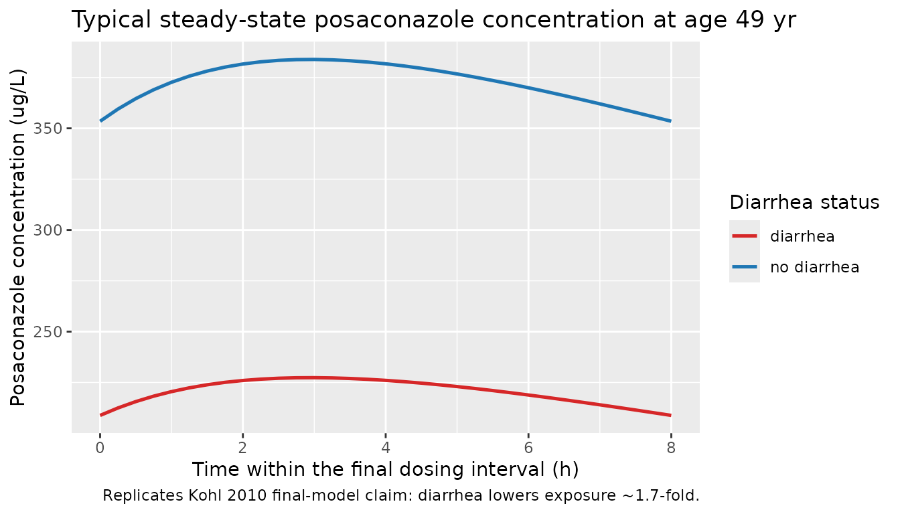
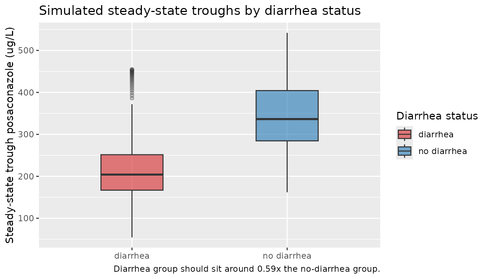

# Posaconazole (Kohl 2010)

## Model and source

- Citation: Kohl V, Muller C, Cornely OA, Abduljalil K, Fuhr U,
  Vehreschild JJ, Scheid C, Hallek M, Ruping MJGT. Factors Influencing
  Pharmacokinetics of Prophylactic Posaconazole in Patients Undergoing
  Allogeneic Stem Cell Transplantation. Antimicrob Agents Chemother.
  2010;54(1):207-212. <doi:10.1128/AAC.01027-09>
- Description: One-compartment population PK model for prophylactic oral
  posaconazole in adult allogeneic stem cell transplant recipients with
  hematological malignancies (Kohl 2010); ka fixed, age and concurrent
  diarrhea as covariates.
- Article: <https://doi.org/10.1128/AAC.01027-09>

## Population

The model was developed from therapeutic drug monitoring (TDM) data
collected between May 2007 and November 2008 at the University Hospital
of Cologne, on adult allogeneic hematopoietic stem cell transplant (SCT)
recipients with hematological malignancies receiving prophylactic oral
posaconazole (200 mg t.i.d.). A total of 149 trough serum posaconazole
concentrations from 32 patients (median 5 samples per patient, range
1-12) were analysed by NONMEM ADVAN2 with FOCE-INTER (Kohl 2010 Methods,
“Pharmacokinetic analysis”).

Baseline demographics (Kohl 2010 Table 1):

- Age: median 49.5 years (range 17-66).
- Body weight: median 68.5 kg (range 49-115).
- Height: median 172 cm (range 156-188).
- Sex: 16/32 (50%) female.
- Race: 30/32 (93.8%) Caucasian, 2/32 (6.2%) Asian.
- Underlying disease: acute myelogenous leukemia 53.1%, lymphoma 18.8%,
  chronic lymphocytic leukemia 12.5%, chronic myelogenous leukemia 6.2%,
  acute lymphocytic leukemia / idiopathic thrombocytopenia / plasma cell
  leukemia 3.1% each.
- Concurrent conditions and concomitant medications: diarrhea 22/32
  (68.6%), febrile 16/32 (50.0%), cyclosporine 81.3%, pantoprazole
  81.3%, ranitidine 50.0%, tacrolimus 25.0%.

The overall mean of all measured posaconazole concentrations was 411
ug/L (SD 333; range 25 to 1,871), and the mean of per-patient maxima was
654 ug/L (SD 443; range 90 to 1,871) – Kohl 2010 Results, “Patient
data”.

The same information is available programmatically via
`readModelDb("Kohl_2010_posaconazole")$population`.

## Source trace

The per-parameter origin is recorded as an in-file comment next to each
`ini()` entry in `inst/modeldb/specificDrugs/Kohl_2010_posaconazole.R`.
The table below collects them in one place for review.

| Equation / parameter | Value | Source location |
|----|----|----|
| One-compartment, first-order absorption + elimination (NONMEM ADVAN2) | n/a | Kohl 2010 Methods, “Pharmacokinetic analysis”, paragraph 1 |
| ka (fixed) | 0.4 /h | Methods, “Pharmacokinetic analysis”, assumption (iii); fixed from reference 5 |
| CL/F (basic model) | 75.8 L/h | Table 4 |
| V/F (basic model) | 835 L | Table 4 |
| CL/F (final model, no diarrhea) | 67.0 L/h | Table 4 |
| CL/F (final model, with diarrhea) | 113.2 L/h | Table 4 |
| V/F (final model, no diarrhea, age 49 yr) | 2,250 L | Table 4 |
| V/F (final model, with diarrhea, age 49 yr) | 3,802.5 L | Table 4 |
| Age effect on V/F | -123 L per year above 49 | Table 4 |
| Diarrhea multiplier on CL/F and V/F (theta_Di) | 1.69 (113.2/67.0 = 3802.5/2250) | Derived from Table 4 |
| Final model equation: CL_j = theta_CL \* theta_Di^Diarrhea \* exp(eta_CL) | n/a | Table 3 model 2 |
| Final model equation: V_j = \[theta_V + (Age - 49) \* theta_Age\] \* theta_Di^Diarrhea | n/a | Table 3 model 2 |
| IIV on CL/F (CV%) | 26.9% | Table 4 |
| Residual variability (CV%) | 42.0% | Table 4 |

## Virtual cohort

Original observed data are not publicly available. The simulation below
uses a virtual cohort of N = 200 SCT recipients whose covariate
distributions approximate the published trial demographics: age
uniformly distributed over 17-66 years, diarrhea prevalence 68.6%. Body
weight is held at the cohort median (68.5 kg) because the final model
does not include a weight effect on either CL/F or V/F (weight was
screened in the basic model but did not retain significance in the final
model – Kohl 2010 Table 2).

``` r

set.seed(2010) # Kohl_2010
n_subj <- 200L

pop <- tibble::tibble(
  id       = seq_len(n_subj),
  AGE      = runif(n_subj, min = 17, max = 66),
  DIARRHEA = as.integer(runif(n_subj) < 0.686),
  WT       = 68.5
) |>
  mutate(treatment = ifelse(DIARRHEA == 1L,
                             "diarrhea",
                             "no diarrhea"))

# Dosing: 200 mg t.i.d. (q8h) for 14 days = 42 doses. This is the prophylactic
# dose used in Kohl 2010 Methods (and the second phase III trial cited in the
# Introduction). At steady state (about 5 elimination half-lives of ~23 h ~=
# 5 days for a typical no-diarrhea subject), the trough concentration mirrors
# the trough samples that fed the TDM analysis.
tau         <- 8                              # hours between doses
n_doses     <- 42L
dose_times  <- seq(from = 0, by = tau, length.out = n_doses)
end_time    <- dose_times[n_doses] + tau     # cover the final dosing interval

# Sampling grid: dense near the last (steady-state) dosing interval for NCA,
# coarse over the loading phase to keep the simulation small.
loading_times <- seq(0, dose_times[n_doses], by = 8)
nca_grid      <- seq(dose_times[n_doses],
                     dose_times[n_doses] + tau,
                     length.out = 33L)
obs_times     <- sort(unique(c(loading_times, nca_grid)))

# Dose rows
d_dose <- tidyr::expand_grid(
  pop,
  time = dose_times
) |>
  mutate(amt = 200, evid = 1L, cmt = "depot")

# Observation rows
d_obs <- tidyr::expand_grid(
  pop,
  time = obs_times
) |>
  mutate(amt = 0, evid = 0L, cmt = "central")

events <- bind_rows(d_dose, d_obs) |>
  arrange(id, time, desc(evid)) |>
  select(id, time, amt, evid, cmt, AGE, DIARRHEA, WT, treatment)

# Defensive ID-uniqueness check (per skill template)
stopifnot(!anyDuplicated(unique(events[, c("id", "time", "evid")])))
```

## Simulation

``` r

mod <- readModelDb("Kohl_2010_posaconazole")

# Carry the diarrhea treatment label through rxSolve via keep = so we can
# stratify the PKNCA results without a post-hoc join.
set.seed(2010)
sim <- rxode2::rxSolve(mod, events = events,
                       keep = c("treatment", "AGE", "DIARRHEA")) |>
  as.data.frame()
#> ℹ parameter labels from comments will be replaced by 'label()'
```

For deterministic replication (reproducing the typical trajectory
without between-subject variability), zero out the random effects:

``` r

mod_typical <- rxode2::zeroRe(readModelDb("Kohl_2010_posaconazole"))
#> ℹ parameter labels from comments will be replaced by 'label()'
sim_typical <- rxode2::rxSolve(mod_typical, events = events,
                               keep = c("treatment", "AGE", "DIARRHEA")) |>
  as.data.frame()
#> ℹ omega/sigma items treated as zero: 'etalcl'
#> Warning: multi-subject simulation without without 'omega'
```

## Replicate the published clinical claim

The headline clinical finding of Kohl 2010 is that diarrhea is
associated with substantially lower posaconazole exposure (apparent F
about 1.7-fold reduced, equivalent to F_with / F_without ~= 0.59). We
replicate this by plotting typical steady-state trajectories at the
cohort median age (49 yr) with and without diarrhea, and by stratifying
simulated trough quantiles by diarrhea status.

``` r

# Typical (zeroRe) trajectories restricted to the final dosing interval, at
# age 49 yr in each diarrhea stratum.
ss_typical <- sim_typical |>
  filter(time >= dose_times[n_doses],
         time <= dose_times[n_doses] + tau,
         AGE >= 48, AGE <= 50) |>
  mutate(time_in_tau = time - dose_times[n_doses]) |>
  group_by(treatment, time_in_tau) |>
  summarise(Cc_typical = median(Cc), .groups = "drop")

ggplot(ss_typical, aes(time_in_tau, Cc_typical, colour = treatment)) +
  geom_line(linewidth = 0.9) +
  scale_colour_manual(values = c("no diarrhea" = "#1f77b4",
                                  "diarrhea"    = "#d62728")) +
  labs(x = "Time within the final dosing interval (h)",
       y = "Posaconazole concentration (ug/L)",
       colour = "Diarrhea status",
       title = "Typical steady-state posaconazole concentration at age 49 yr",
       caption = "Replicates Kohl 2010 final-model claim: diarrhea lowers exposure ~1.7-fold.")
```



``` r

# Trough samples = concentration at the end of each dosing interval.
trough <- sim |>
  filter(time %in% (dose_times + tau)) |>
  filter(time >= dose_times[ceiling(n_doses / 2)])  # treat as steady state from day 7 onward

ggplot(trough, aes(treatment, Cc, fill = treatment)) +
  geom_boxplot(width = 0.4, alpha = 0.6, outlier.alpha = 0.3) +
  scale_fill_manual(values = c("no diarrhea" = "#1f77b4",
                                "diarrhea"    = "#d62728")) +
  labs(x = NULL, y = "Steady-state trough posaconazole (ug/L)",
       fill = "Diarrhea status",
       title = "Simulated steady-state troughs by diarrhea status",
       caption = "Diarrhea group should sit around 0.59x the no-diarrhea group.")
```



## PKNCA validation

Posaconazole at 200 mg t.i.d. reaches steady state within several days
(elimination half-life t1/2 = ln(2) \* V/CL ~= 23 h for a typical
no-diarrhea subject; about 5 half-lives gives steady state at ~5 days,
well within the 14-day simulation window). Steady-state NCA is computed
over the final dosing interval (Recipe 3 in `pknca-recipes.md`).

``` r

# Build a PKNCA-friendly long table, anchoring a time = start_ss row at the
# beginning of the SS dosing interval (concentration just before the final
# dose is the per-subject trough at the previous interval).
start_ss <- dose_times[n_doses]
end_ss   <- start_ss + tau

sim_nca <- sim |>
  filter(!is.na(Cc), time >= start_ss, time <= end_ss) |>
  select(id, time, Cc, treatment)

# Time-zero guarantee for PKNCA (here: a row at start_ss for every subject;
# PKNCA interprets the interval as [start_ss, end_ss]).
sim_nca <- bind_rows(
  sim_nca,
  sim_nca |> distinct(id, treatment) |>
    mutate(time = start_ss,
           Cc   = NA_real_)  # filled below from the simulated value if present
) |>
  arrange(id, treatment, time) |>
  group_by(id, treatment, time) |>
  summarise(Cc = first(stats::na.omit(Cc)), .groups = "drop") |>
  arrange(id, treatment, time)

# Dose rows -- only the final dose at start_ss (PKNCA needs a dose anchor for
# the steady-state interval).
dose_df <- events |>
  filter(evid == 1, time == start_ss) |>
  select(id, time, amt, treatment)

conc_obj <- PKNCA::PKNCAconc(sim_nca,
                             Cc ~ time | treatment + id,
                             concu = "ug/L", timeu = "hr")
dose_obj <- PKNCA::PKNCAdose(dose_df,
                             amt ~ time | treatment + id,
                             doseu = "mg")

intervals <- data.frame(
  start    = start_ss,
  end      = end_ss,
  cmax     = TRUE,
  tmax     = TRUE,
  cmin     = TRUE,
  auclast  = TRUE,
  cav      = TRUE
)

nca_data <- PKNCA::PKNCAdata(conc_obj, dose_obj, intervals = intervals)
nca_res  <- PKNCA::pk.nca(nca_data)

# Per-treatment-group medians of the simulated NCA values.
nca_tbl <- as.data.frame(nca_res$result) |>
  group_by(treatment, PPTESTCD) |>
  summarise(median_value = median(PPORRES, na.rm = TRUE),
            .groups = "drop") |>
  tidyr::pivot_wider(names_from = PPTESTCD, values_from = median_value)

knitr::kable(nca_tbl, digits = 2,
             caption = "Simulated steady-state NCA by diarrhea status (medians across N = 200).")
```

| treatment   | auclast |    cav |   cmax |   cmin | tmax |
|:------------|--------:|-------:|-------:|-------:|-----:|
| diarrhea    | 1799.40 | 224.92 | 232.54 | 206.60 |    3 |
| no diarrhea | 2881.16 | 360.14 | 374.15 | 338.79 |    3 |

Simulated steady-state NCA by diarrhea status (medians across N = 200).
{.table}

### Comparison against published descriptive statistics

Kohl 2010 does not publish a separate NCA-style table per diarrhea
stratum; the parameter estimates in Table 4 are the only quantitative
outputs. As a cross-check, the population-wide simulated mean trough
should sit in the neighbourhood of the paper’s overall observed mean
(411 ug/L, predominantly trough samples), with the diarrhea stratum
sitting at roughly 0.59 times the no-diarrhea stratum (i.e., the inverse
of the 1.69 multiplier on apparent CL/F).

``` r

mean_trough_overall <- mean(trough$Cc, na.rm = TRUE)
mean_trough_by_grp  <- trough |>
  group_by(treatment) |>
  summarise(mean_trough_ug_per_L = mean(Cc, na.rm = TRUE),
            sd_trough_ug_per_L   = sd(Cc, na.rm = TRUE),
            n = dplyr::n(),
            .groups = "drop")

knitr::kable(
  mean_trough_by_grp,
  digits = 1,
  caption = paste0(
    "Simulated steady-state troughs (ug/L) by diarrhea status. ",
    "Overall simulated mean: ",
    sprintf("%.1f", mean_trough_overall),
    " ug/L; Kohl 2010 observed mean (all samples) 411 ug/L."
  )
)
```

| treatment   | mean_trough_ug_per_L | sd_trough_ug_per_L |    n |
|:------------|---------------------:|-------------------:|-----:|
| diarrhea    |                210.6 |               61.6 | 3404 |
| no diarrhea |                343.3 |               79.7 | 1196 |

Simulated steady-state troughs (ug/L) by diarrhea status. Overall
simulated mean: 245.1 ug/L; Kohl 2010 observed mean (all samples) 411
ug/L. {.table}

``` r


ratio_diarrhea_vs_no <- with(mean_trough_by_grp,
  mean_trough_ug_per_L[treatment == "diarrhea"] /
    mean_trough_ug_per_L[treatment == "no diarrhea"]
)
```

The diarrhea/no-diarrhea ratio of simulated mean troughs is 0.61, to be
compared against the paper’s algebraic prediction of 1/1.69 = 0.59 (a
1.7-fold reduction).

## Assumptions and deviations

- **Age distribution**: sampled uniformly between 17 and 66 years (the
  reported range from Table 1). Kohl 2010 reports only the median (49.5)
  and the range; the underlying distribution is not given.
- **Diarrhea prevalence**: set to 68.6% (22 of 32 patients per Table 1).
  The per-patient time profile of diarrhea is not provided; the binary
  covariate is treated as time-fixed within subject, consistent with the
  way the paper’s NONMEM model applies it.
- **Body weight**: held at the cohort median (68.5 kg) because the final
  model does not retain a weight effect (Table 2: WT was screened on
  both CL/F and V/F but only the diarrhea + age covariate combination
  was retained, Table 3 model 2).
- **Concomitant medications**: not used as covariates. Tacrolimus,
  cyclosporine, pantoprazole, and ranitidine were screened by Kohl 2010
  (Table 2) and individually showed reductions in OFV when added in
  isolation, but only diarrhea + age were retained in the final model;
  the effect estimates for the comedications in the paper’s intermediate
  models (Table 3 models 3-5) were not stable in the jackknife
  evaluation.
- **Inter-individual variability**: the final model carries IIV only on
  CL/F (no IIV on V/F or ka). Apparent V/F variability in simulated
  trajectories therefore comes entirely from the age covariate plus
  whatever propagation arises through `kel = cl / vc`.
- **Sampling scheme**: the original analysis was based on trough samples
  during routine TDM (median 5 per patient, range 1-12). The simulation
  uses a denser grid over the final dosing interval to enable a
  meaningful steady-state NCA, then condenses to per-subject median
  trough for the cross-check against the paper’s observed mean.
- **Bioavailability**: F is not separately identifiable from the TDM
  data; all structural estimates are apparent (CL/F and V/F). The
  diarrhea effect enters as a shared multiplier on both apparent
  parameters, which is algebraically equivalent to a change in F (Kohl
  2010 Methods, “Assumption (ii)”: “modification of both CL/F and V/F
  was interpreted as a change in F”).
