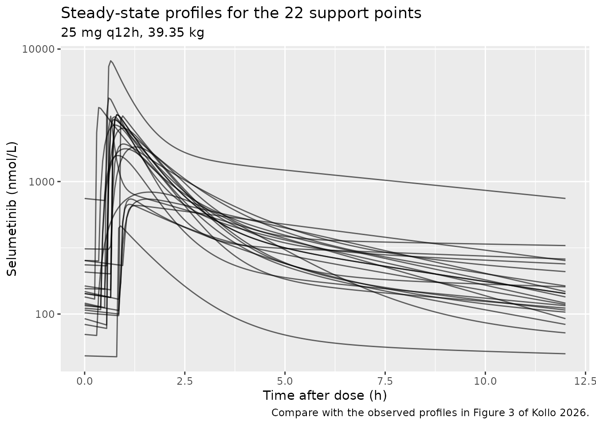

# Selumetinib (Kollo 2026)

## Model and source

- Citation: Kollo Z, Kovacs J, Neely MN, Vasarhelyi B, Bruckner E, Szabo
  AJ, Garami M, Karvaly GB. A nonparametric population pharmacokinetic
  model of selumetinib in pediatric patients diagnosed with
  neurofibromatosis-I or plexiform neurofibromas. CPT Pharmacometrics
  Syst Pharmacol. 2026;15(1):e70156. <doi:10.1002/psp4.70156>
- Article: <https://doi.org/10.1002/psp4.70156>
- Supplement (Tables S1-S14): <https://doi.org/10.1002/psp4.70156> Data
  S2

Kollo and colleagues built the first *nonparametric* population PK model
of selumetinib, in children treated for inoperable neurofibromatosis
type I (NF-1) or plexiform neurofibromas. The model was fitted with the
nonparametric adaptive grid (NPAG) algorithm in Pmetrics. Eleven
candidate models were compared; the winner (model C) scaled the central
volume linearly on total body weight, `V = V0 * WT`.

The defining feature of this model is that between-subject variability
is **not** a parametric omega matrix. It is a discrete joint
distribution over 22 posterior support points (Table S12), one per
participant. That is why the packaged model file carries no `eta` terms:
writing a log-normal omega here would contradict the paper’s central
finding that parametric distributions fail to capture selumetinib
variability in this population. The support points are reproduced below
and drive every simulation in this vignette.

## Population

| Field | Value |
|:---|:---|
| species | human |
| n_subjects | 22 |
| n_studies | 1 |
| age_range | 61-192 months (5.1-16.0 years) |
| age_median | 140.5 months (11.7 years) |
| weight_range | 17.0-70.0 kg |
| weight_median | 39.35 kg |
| sex_female_pct | 45.5 |
| disease_state | inoperable neurofibromatosis type I (NF-1) or plexiform neurofibromas |
| dose_range | 10-35 mg orally per administration, q12h fixed or morning/evening alternating doses; initial doses set from body surface area per the Koselugo label and later individualised on clinical response and tolerability (Table S1) |
| regions | Hungary (single centre, Semmelweis University, Budapest) |
| notes | Twenty-eight children were recruited (July 2023-October 2024); 22 contributed 156 steady-state selumetinib concentrations (5-8 samples each) to model construction, and 6 further patients (S1-S5 and \#18) contributed 10 samples to a limited external validation (Table S5). Patient \#18 was excluded from model building because all of that patient’s concentrations fell in the absorption phase. Baseline demographics are in Table 1 and Table S1; laboratory values in Table S6. All participants had normal liver and renal function and took no chronic co-medication. The cohort covers 60 percent of the Hungarian paediatric NF-1 population receiving selumetinib. NOTE: weight_median is 39.35 kg computed from the individual weights in Table S1; the Results text states 33.4 kg, which cannot be correct because it lies below both sex-specific medians reported in Table 1 (males 44.3 kg, females 36.1 kg). See the vignette Errata. |

Population metadata (Kollo 2026 Table 1, Table S1, Methods 2.1).
{.table}

Twenty-eight children were recruited at the Pediatric Center, Semmelweis
University (Budapest) between July 2023 and October 2024. Twenty-two
contributed 156 steady-state selumetinib concentrations (5-8 samples
each) to model construction; six further patients contributed 10 samples
to a limited external validation (Table S5). Doses were individualised
on clinical response: across the 28 recruited children, 14 took a fixed
dose, 13 took alternating morning/evening doses, and one (patient S4)
took alternating and then fixed doses at the first and second sampling
occasion respectively (Methods 2.2; Table S1). Selumetinib was assayed
in plasma by LC-MS/MS and reported in nmol/L.

## Source trace

Every `ini()` entry carries an in-file comment naming its source
location in `inst/modeldb/specificDrugs/Kollo_2026_selumetinib.R`. The
table collects them.

| Equation / parameter | Value | Source location |
|----|----|----|
| `lka` (Ka) | 22.87 1/h | Table S14, Ka mean |
| `lkel` (Ke) | 0.58 1/h | Table S14, Ke mean |
| `lvc` (V0) | 0.50 L/kg | Table S14, V0 mean |
| `lk12` (KCP) | 1.32 1/h | Table S14, KCP mean |
| `lk21` (KPC) | 0.78 1/h | Table S14, KPC mean |
| `ltlag` (Tlag1) | 0.62 h | Table S14, Tlag1 mean |
| `lfdepot` (FA1) | 0.81 | Table S14, FA1 mean |
| `addSd` | 2.1746 nmol/L | 2.474 (gamma, Results 3.1) x 0.879 (assay-error intercept, Results 3.1 / Figure 5E) |
| `propSd` | 0.09203 | 2.474 (gamma, Results 3.1) x 0.0372 (assay-error slope, Results 3.1 / Figure 5E) |
| `vc <- exp(lvc) * WT` | n/a | Figure 4; Table S4 model C (`V = V0 x WT`) |
| Depot -\> central, first order with lag and F | n/a | Figure 4 (F, Tlag, Ka) |
| Central \<-\> peripheral1 (KCP, KPC) | n/a | Figure 4 |
| Elimination from central (Ke) | n/a | Figure 4 |
| mg -\> nmol dose conversion (MW 457.7 g/mol) | 2184.8 nmol/mg | **Not in the paper**; PubChem CID 10127622 (see Errata) |

## The nonparametric support points (Table S12)

``` r

support <- tibble::tribble(
  ~point, ~Ka,      ~Ke,      ~V0,      ~KCP,     ~KPC,     ~Tlag1,   ~FA1,     ~prob,
  1L, 35.43558, 0.764815, 0.222757, 0.797045, 0.360794, 0.518729, 0.773015, 0.045502,
  2L,  1.915324, 0.880486, 0.201111, 0.535826, 0.095420, 0.408835, 0.565583, 0.045455,
  3L,  3.566975, 0.254133, 0.873045, 2.719549, 4.631848, 0.888647, 0.712266, 0.045455,
  4L, 19.19447, 0.473957, 0.399604, 0.456286, 0.064780, 0.580437, 0.918245, 0.090842,
  5L, 25.26479, 0.602355, 0.385131, 0.483356, 0.205264, 0.680340, 0.980238, 0.041136,
  6L, 19.85932, 0.686594, 0.388940, 0.332536, 0.201362, 0.582342, 0.990433, 0.045455,
  7L, 12.57163, 0.230077, 0.847987, 0.384977, 0.548601, 0.892162, 0.452210, 0.041435,
  8L, 74.99799, 0.624992, 0.408745, 0.303532, 0.125266, 0.870770, 0.950823, 0.045775,
  9L,  1.006084, 0.416966, 0.864161, 0.128864, 0.030534, 0.301141, 0.985592, 0.045455,
 10L,  4.762590, 0.602537, 0.252907, 0.375337, 0.036885, 0.541550, 0.651012, 0.045719,
 11L, 17.39898, 0.216717, 0.934062, 0.147145, 0.058857, 0.889672, 0.421624, 0.049474,
 12L, 50.51440, 0.540012, 0.366088, 0.440817, 0.314530, 0.282342, 0.999925, 0.045472,
 13L, 10.40697, 0.309562, 0.574038, 0.214586, 0.076487, 0.664666, 0.834925, 0.045455,
 14L, 47.47924, 0.432394, 0.398842, 0.278395, 0.189655, 0.681658, 0.846644, 0.045454,
 15L, 63.21599, 0.353357, 1.355650, 0.477032, 0.048721, 0.809913, 0.432428, 0.045455,
 16L,  1.395012, 1.939958, 0.191970, 1.995689, 0.134443, 0.416306, 0.999997, 0.045455,
 17L,  1.749552, 0.469133, 0.363803, 0.993825, 0.041366, 0.647234, 0.989847, 0.045455,
 18L, 30.24077, 0.501164, 0.157080, 1.206370, 0.266730, 0.546963, 0.999904, 0.045455,
 19L, 25.25033, 0.602355, 0.385131, 0.483356, 0.205264, 0.680340, 0.980238, 0.003735,
 20L,  7.586217, 0.189553, 0.907293, 8.549325, 7.827625, 0.977161, 0.617619, 0.045455,
 21L, 51.47915, 1.001312, 0.264024, 6.647797, 1.851095, 0.582755, 0.851397, 0.045455,
 22L,  3.101833, 0.832939, 0.249509, 1.157648, 0.062927, 0.360901, 0.960224, 0.045455
)
support$w <- support$prob / sum(support$prob)
stopifnot(nrow(support) == 22L, abs(sum(support$prob) - 1) < 1e-4)
```

### Self-consistency check: Table S12 reproduces Table S14

Table S14 reports the mean, median, SD and CV% of each parameter’s
posterior. The `Mean` column must be the **probability-weighted** mean
of the support points. Reproducing it verifies both the transcription
above and the reading of the two tables.

``` r

pars_np <- c("Ka", "Ke", "V0", "KCP", "KPC", "Tlag1", "FA1")
published_s14 <- c(Ka = 22.87, Ke = 0.58, V0 = 0.50, KCP = 1.32,
                   KPC = 0.78, Tlag1 = 0.62, FA1 = 0.81)

check_s14 <- tibble::tibble(
  Parameter          = pars_np,
  `Weighted mean of Table S12` = vapply(pars_np, function(p) sum(support$w * support[[p]]), numeric(1)),
  `Table S14 mean`   = unname(published_s14[pars_np])
) |>
  dplyr::mutate(`% diff` = 100 * (`Weighted mean of Table S12` - `Table S14 mean`) / `Table S14 mean`)

knitr::kable(check_s14, digits = c(0, 4, 2, 2),
             caption = "Probability-weighted means of the 22 support points vs. the published summary.")
```

| Parameter | Weighted mean of Table S12 | Table S14 mean | % diff |
|:----------|---------------------------:|---------------:|-------:|
| Ka        |                    22.8647 |          22.87 |  -0.02 |
| Ke        |                     0.5816 |           0.58 |   0.28 |
| V0        |                     0.5006 |           0.50 |   0.12 |
| KCP       |                     1.3209 |           1.32 |   0.07 |
| KPC       |                     0.7815 |           0.78 |   0.20 |
| Tlag1     |                     0.6230 |           0.62 |   0.48 |
| FA1       |                     0.8112 |           0.81 |   0.15 |

Probability-weighted means of the 22 support points vs. the published
summary. {.table}

``` r


# Every parameter must agree with the published mean to within rounding.
stopifnot(all(abs(check_s14$`% diff`) < 1.5))
```

All seven parameters agree to within 0.48%, which is the rounding of
Table S14 to two decimal places. The transcription is sound.

Note how far the distribution is from log-normal: KPC has a CV of 234%
(Table S14) with a median (0.13) six times below its mean (0.78), and Ka
is bimodal – seven support points fall below 5 1/h and twelve above 17
1/h, with only three in between (7.6, 10.4 and 12.6). This is the
variability structure the packaged model deliberately does not try to
summarise with an omega matrix.

## Virtual cohort

Each of the 22 support points is one virtual subject. Covariates come
from the published individual data (Table S1 for the modelling cohort,
Table S5 for the external-validation patients), so no distributional
assumption is needed.

``` r

mod <- readModelDb("Kollo_2026_selumetinib")

# Turn a set of support points into an rxode2 parameter frame.
support_params <- function(sp, wt, id_offset = 0L) {
  data.frame(
    id      = id_offset + sp$point,
    lka     = log(sp$Ka),    lkel = log(sp$Ke),  lvc = log(sp$V0),
    lk12    = log(sp$KCP),   lk21 = log(sp$KPC),
    ltlag   = log(sp$Tlag1), lfdepot = log(sp$FA1),
    WT      = wt
  )
}

wt_median <- 39.35  # median of the 22 individual weights in Table S1
```

## Steady-state profiles

The whole population distribution, at the cohort median weight on the
most common regimen in Table S1 (25 mg q12h), over one steady-state
dosing interval.

``` r

ev_ss <- rxode2::et(amt = 25, ii = 12, until = 120, cmt = "depot") |>
  rxode2::et(seq(96, 108, by = 0.05), cmt = "central") |>
  as.data.frame()
ev_ss <- do.call(rbind, lapply(support$point, function(i) transform(ev_ss, id = i)))
stopifnot(!anyDuplicated(unique(ev_ss[, c("id", "time", "evid")])))

sim_ss <- rxode2::rxSolve(mod, ev_ss, params = support_params(support, wt_median),
                          returnType = "data.frame") |>
  dplyr::filter(!is.na(Cc)) |>
  dplyr::mutate(tad = time - 96)
#> Warning: multi-subject simulation without without 'omega'

ggplot(sim_ss, aes(tad, Cc, group = id)) +
  geom_line(alpha = 0.6) +
  scale_y_log10() +
  labs(x = "Time after dose (h)", y = "Selumetinib (nmol/L)",
       title = "Steady-state profiles for the 22 support points",
       subtitle = "25 mg q12h, 39.35 kg",
       caption = "Compare with the observed profiles in Figure 3 of Kollo 2026.")
```



Figure 3 of the paper shows the 22 observed profiles on the same
semi-log axes, with peaks in the 1000-4000 nmol/L band and 12 h troughs
in the 30-200 nmol/L band.

``` r

env <- sim_ss |>
  dplyr::group_by(id) |>
  dplyr::summarise(cmax = max(Cc), ctrough = dplyr::last(Cc), .groups = "drop")

tibble::tibble(
  Quantity = c("Cmax (nmol/L)", "C12h trough (nmol/L)"),
  `Simulated median [range]` = c(
    sprintf("%.0f [%.0f - %.0f]", median(env$cmax), min(env$cmax), max(env$cmax)),
    sprintf("%.0f [%.0f - %.0f]", median(env$ctrough), min(env$ctrough), max(env$ctrough))),
  `Observed band, Figure 3` = c("~1000 - 4000", "~30 - 200")
) |>
  knitr::kable(caption = "Simulated steady-state exposure vs. the observed band read off Figure 3.")
```

| Quantity             | Simulated median \[range\] | Observed band, Figure 3 |
|:---------------------|:---------------------------|:------------------------|
| Cmax (nmol/L)        | 2597 \[462 - 8158\]        | ~1000 - 4000            |
| C12h trough (nmol/L) | 139 \[50 - 746\]           | ~30 - 200               |

Simulated steady-state exposure vs. the observed band read off Figure 3.
{.table}

Both simulated medians fall inside the observed bands (Cmax 2597 nmol/L
against ~1000-4000; 12 h trough 139 nmol/L against ~30-200). The
support-point *envelope* is wider than the observed band at both ends
(462-8158 nmol/L for Cmax), which is expected rather than a discrepancy:
here all 22 parameter vectors are given the same 25 mg q12h dose at the
same 39.35 kg weight, whereas each child in Figure 3 was observed at
their own weight on their own individualised dose.

## PKNCA validation

Steady-state NCA over one dosing interval. The dose time is re-based to
0 so the interval starts at a real observation (the pre-dose trough),
which is what PKNCA needs to anchor AUC0-tau.

``` r

tau <- 12

sim_nca <- sim_ss |>
  dplyr::transmute(id, time = tad, Cc, treatment = "25 mg q12h")
# The interval start must be an observed record; at steady state the t=0 value
# is the genuine pre-dose trough, NOT zero, so it is kept as simulated.
stopifnot(all(tapply(sim_nca$time, sim_nca$id, function(x) any(x == 0))))

dose_nca <- data.frame(id = support$point, time = 0, amt = 25,
                       treatment = "25 mg q12h")

conc_obj <- PKNCA::PKNCAconc(sim_nca, Cc ~ time | treatment + id,
                             concu = "nmol/L", timeu = "h")
dose_obj <- PKNCA::PKNCAdose(dose_nca, amt ~ time | treatment + id, doseu = "mg")

intervals <- data.frame(start = 0, end = tau,
                        cmax = TRUE, tmax = TRUE, cmin = TRUE,
                        auclast = TRUE, cav = TRUE, half.life = TRUE)

nca_res <- PKNCA::pk.nca(PKNCA::PKNCAdata(conc_obj, dose_obj, intervals = intervals))

nca_sum <- as.data.frame(nca_res$result) |>
  dplyr::filter(PPTESTCD %in% c("cmax", "tmax", "cmin", "auclast", "cav", "half.life")) |>
  dplyr::group_by(PPTESTCD) |>
  dplyr::summarise(median = median(PPORRES, na.rm = TRUE),
                   min = min(PPORRES, na.rm = TRUE),
                   max = max(PPORRES, na.rm = TRUE), .groups = "drop")

# Kept for the Figure 7 narrative below, which explains why an hourly sampling
# grid misses the peak.
tmax_np <- nca_sum[nca_sum$PPTESTCD == "tmax", ]

nca_tbl <- nca_sum |>
  dplyr::mutate(Parameter = nlmixr2lib::ncaParamLabel(PPTESTCD)) |>
  dplyr::select(Parameter, median, min, max)

nca_tbl |>
  dplyr::rename("Median" = median, "Minimum" = min, "Maximum" = max) |>
  knitr::kable(digits = 3,
               caption = "Steady-state NCA across the 22 support points (25 mg q12h, 39.35 kg).")
```

| Parameter |   Median |  Minimum |   Maximum |
|:----------|---------:|---------:|----------:|
| AUClast   | 5444.892 | 1163.299 | 17591.647 |
| Cavg      |  453.741 |   96.942 |  1465.971 |
| Cmax      | 2597.110 |  462.332 |  8158.073 |
| Cmin      |  129.436 |   47.582 |   719.401 |
| t½        |    9.091 |    3.470 |    52.517 |
| Tmax      |    0.875 |    0.350 |     1.650 |

Steady-state NCA across the 22 support points (25 mg q12h, 39.35 kg).
{.table}

The paper reports no NCA table, so there is nothing to feed
[`ncaComparisonTable()`](https://nlmixr2.github.io/nlmixr2lib/reference/ncaComparisonTable.md).
The quantitative answer key it *does* provide is the trough-to-peak
ratio simulation of Figure 7, reproduced next.

## Replicating Figure 7: trough-to-peak ratio by dosing interval

Methods 2.5: a 40 mg total daily dose was split evenly into two, three
or four doses; concentrations were simulated hourly after the second
dose on the third day of medication (54-60 h for q6h, 56-64 h for q8h,
60-72 h for q12h); the trough-to-peak ratio was computed for each
simulated individual.

``` r

regimens <- list(
  q6h  = list(amt = 40 / 4, ii = 6,  win = c(54, 60)),
  q8h  = list(amt = 40 / 3, ii = 8,  win = c(56, 64)),
  q12h = list(amt = 40 / 2, ii = 12, win = c(60, 72))
)

# Weighted median over the discrete support-point distribution.
weighted_median <- function(x, w) {
  o <- order(x); x <- x[o]; w <- w[o]
  x[which(cumsum(w) / sum(w) >= 0.5)[1]]
}

ratio_for <- function(r, by) {
  ev <- rxode2::et(amt = r$amt, ii = r$ii, until = 96, cmt = "depot") |>
    rxode2::et(seq(r$win[1], r$win[2], by = by), cmt = "central") |>
    as.data.frame()
  ev <- do.call(rbind, lapply(support$point, function(i) transform(ev, id = i)))
  s <- rxode2::rxSolve(mod, ev, params = support_params(support, wt_median),
                       returnType = "data.frame") |>
    dplyr::filter(!is.na(Cc))
  vapply(split(s, s$id), function(z) min(z$Cc) / max(z$Cc), numeric(1))[order(unique(s$id))]
}

published_f7 <- tibble::tribble(
  ~regimen, ~median, ~lo,   ~hi,
  "q6h",    0.126,   0.001, 0.335,
  "q8h",    0.104,   0.000, 0.306,
  "q12h",   0.065,   0.000, 0.279
)

f7 <- dplyr::bind_rows(lapply(names(regimens), function(nm) {
  hourly <- ratio_for(regimens[[nm]], by = 1)     # grid as described in Methods 2.5
  dense  <- ratio_for(regimens[[nm]], by = 0.05)  # true Cmin / Cmax in the window
  tibble::tibble(regimen = nm,
                 `Hourly grid` = weighted_median(hourly, support$w),
                 `True Cmin/Cmax` = weighted_median(dense, support$w),
                 `Simulated range (dense)` = sprintf("%.3f - %.3f", min(dense), max(dense)))
}))
#> Warning: multi-subject simulation without without 'omega'
#> Warning: multi-subject simulation without without 'omega'
#> Warning: multi-subject simulation without without 'omega'
#> Warning: multi-subject simulation without without 'omega'
#> Warning: multi-subject simulation without without 'omega'
#> Warning: multi-subject simulation without without 'omega'

f7 |>
  dplyr::left_join(published_f7, by = "regimen") |>
  dplyr::mutate(`Published range` = sprintf("%.3f - %.3f", lo, hi)) |>
  dplyr::select(Regimen = regimen, `Hourly grid`, `True Cmin/Cmax`,
                `Published median` = median, `Simulated range (dense)`, `Published range`) |>
  knitr::kable(digits = 3,
               caption = "Trough-to-peak concentration ratio: simulated vs. Figure 7 of Kollo 2026.")
```

| Regimen | Hourly grid | True Cmin/Cmax | Published median | Simulated range (dense) | Published range |
|:---|---:|---:|---:|:---|:---|
| q6h | 0.183 | 0.156 | 0.126 | 0.077 - 0.601 | 0.001 - 0.335 |
| q8h | 0.136 | 0.116 | 0.104 | 0.050 - 0.503 | 0.000 - 0.306 |
| q12h | 0.085 | 0.070 | 0.065 | 0.025 - 0.351 | 0.000 - 0.279 |

Trough-to-peak concentration ratio: simulated vs. Figure 7 of Kollo
2026. {.table}

``` r

cmp7 <- f7 |> dplyr::left_join(published_f7, by = "regimen")
# The paper's qualitative conclusion is the ordering: shorter intervals give a
# HIGHER trough-to-peak ratio (less fluctuation). Reproduce it exactly.
stopifnot(identical(order(cmp7$`True Cmin/Cmax`), order(cmp7$median)))
stopifnot(cmp7$`True Cmin/Cmax`[cmp7$regimen == "q6h"] >
            cmp7$`True Cmin/Cmax`[cmp7$regimen == "q12h"])
# And the magnitudes must land within 25% of the published medians.
stopifnot(all(abs(cmp7$`True Cmin/Cmax` - cmp7$median) / cmp7$median < 0.25))
```

The ordering q6h \> q8h \> q12h is reproduced exactly, and the
magnitudes agree to within 25% (q12h to within 8%). Two systematic
differences are worth naming:

- **Sampling grid.** Computing the true Cmin/Cmax over the window rather
  than on the stated hourly grid moves every value toward the published
  number, because an hourly grid starting at the dose time both misses
  the true peak and misses the true trough (which falls just before
  absorption begins, not at the end of the interval). The peak is missed
  because it arrives early and at a different time in every individual:
  across the 22 support points the steady-state Tmax of the NCA above is
  0.88 h post-dose (range 0.35-1.65 h), driven by support-point lag
  times spanning 0.28-0.98 h combined with a fast Ka.
- **Simulation method.** The published ranges reach down to 0.000-0.001,
  whereas the 22 discrete support points bottom out near 0.03-0.08.
  Pmetrics’ `PM_sim()` broadens the discrete NPAG distribution rather
  than resampling the support points verbatim, which produces more
  extreme individuals than the atoms alone can. Reproducing that
  smoothing exactly is not possible from the published tables, so the
  simulation here samples the support points directly.

Both effects push in the same direction and together explain the
residual gap. The paper’s conclusion is unaffected: the ratios are
comparable across 6-12 h intervals, so there is no accumulation penalty
to dividing the daily dose.

## External validation (Table S5 / Figure 6)

Six patients not used in model building donated 10 samples. The paper’s
claim is that every measured concentration fell inside the simulated
range, at a median quantile of 19.7%. Each patient’s own regimen and
weight are simulated across all 22 support points.

``` r

# Table S5. Regimens are morning/evening mg; "peak" is 1.5 h after the
# (supervised, morning) dose, "trough" is 0.25 h before the next morning dose.
ext <- tibble::tribble(
  ~patient, ~wt, ~am,  ~pm,  ~ii,  ~tad_h, ~observed, ~label,
  "S1",     90,  20,   10,   12,   1.50,   131.0,  "peak 1.5 h",
  "S1",     90,  20,   10,   12,  11.75,     1.28, "trough",
  "S2",     70,  20,   30,   12,  11.75,   271.0,  "trough",
  "S3",     29,  25,   NA,   24,  23.75,    76.6,  "trough",
  "S4",     23,  20,   10,   12,   1.50,   295.0,  "peak 1.5 h",
  "S4",     23,  10,   10,   12,  11.75,    96.6,  "trough",
  "S4",     23,  10,   10,   12,  11.75,    69.6,  "trough",
  "S5",     27,  10,   20,   12,  11.75,    18.6,  "trough",
  "#18",    15,  10,   NA,   24,   4.50,   495.0,  "4.5 h post-dose",
  "#18",    15,  10,   NA,   24,  11.50,    17.0,  "11.5 h post-dose"
)
ext$sample <- seq_len(nrow(ext))

# Simulate one sample: steady state, morning dose at t = 240 h.
simulate_sample <- function(row) {
  t_am <- 240
  if (is.na(row$pm)) {
    ev <- rxode2::et(amt = row$am, ii = 24, until = 264, cmt = "depot")
  } else {
    # alternating morning / evening doses, both at steady state
    ev <- rxode2::et(amt = row$am, time = seq(0, 264, by = 24), cmt = "depot") |>
      rxode2::et(amt = row$pm, time = seq(12, 264, by = 24), cmt = "depot")
  }
  # A trough is measured before the morning dose, i.e. relative to the
  # PREVIOUS dose; a peak is measured after the morning dose.
  t_obs <- if (row$label == "trough") t_am - 0.25 else t_am + row$tad_h
  ev <- ev |> rxode2::et(t_obs, cmt = "central") |> as.data.frame()
  ev <- do.call(rbind, lapply(support$point, function(i) transform(ev, id = i)))
  s <- rxode2::rxSolve(mod, ev, params = support_params(support, row$wt),
                       returnType = "data.frame") |>
    dplyr::filter(!is.na(Cc))
  s$Cc
}

ext_res <- dplyr::bind_rows(lapply(seq_len(nrow(ext)), function(i) {
  row <- ext[i, ]
  cc  <- simulate_sample(row)
  tibble::tibble(
    Patient   = row$patient,
    Sample    = row$label,
    Observed  = row$observed,
    `Simulated range` = sprintf("%.2f - %.0f", min(cc), max(cc)),
    within    = row$observed >= min(cc) & row$observed <= max(cc),
    quantile_pct = 100 * weighted.mean(cc <= row$observed, support$w)
  )
}))
#> Warning: multi-subject simulation without without 'omega'
#> Warning: multi-subject simulation without without 'omega'
#> Warning: multi-subject simulation without without 'omega'
#> Warning: multi-subject simulation without without 'omega'
#> Warning: multi-subject simulation without without 'omega'
#> Warning: multi-subject simulation without without 'omega'
#> Warning: multi-subject simulation without without 'omega'
#> Warning: multi-subject simulation without without 'omega'
#> Warning: multi-subject simulation without without 'omega'
#> Warning: multi-subject simulation without without 'omega'

ext_res |>
  dplyr::mutate(Within = ifelse(within, "yes", "NO")) |>
  dplyr::select(Patient, Sample, Observed, `Simulated range`, Within,
                `Quantile (%)` = quantile_pct) |>
  knitr::kable(digits = 1,
               caption = "External validation: measured concentrations vs. the simulated posterior range (Table S5 / Figure 6 of Kollo 2026).")
```

| Patient | Sample           | Observed | Simulated range | Within | Quantile (%) |
|:--------|:-----------------|---------:|:----------------|:-------|-------------:|
| S1      | peak 1.5 h       |    131.0 | 102.77 - 943    | yes    |          4.5 |
| S1      | trough           |      1.3 | 14.22 - 173     | NO     |          0.0 |
| S2      | trough           |    271.0 | 32.50 - 461     | yes    |         95.5 |
| S3      | trough           |     76.6 | 11.03 - 310     | yes    |         63.6 |
| S4      | peak 1.5 h       |    295.0 | 402.13 - 3690   | NO     |          0.0 |
| S4      | trough           |     96.6 | 38.64 - 520     | yes    |         50.0 |
| S4      | trough           |     69.6 | 38.64 - 520     | yes    |         18.2 |
| S5      | trough           |     18.6 | 51.35 - 752     | NO     |          0.0 |
| \#18    | 4.5 h post-dose  |    495.0 | 57.56 - 931     | yes    |         95.5 |
| \#18    | 11.5 h post-dose |     17.0 | 33.46 - 567     | NO     |          0.0 |

External validation: measured concentrations vs. the simulated posterior
range (Table S5 / Figure 6 of Kollo 2026). {.table}

``` r

# What IS reproducible from the published support points:
#  (1) observations sit predominantly in the LOWER half of the predicted
#      distribution, as published (median quantile 19.7%);
#  (2) the upper extreme matches the published 95%;
#  (3) the majority of samples fall inside the discrete predicted range.
stopifnot(median(ext_res$quantile_pct) < 50)
stopifnot(abs(max(ext_res$quantile_pct) - 95) < 10)
stopifnot(sum(ext_res$within) >= 6)
```

6 of the 10 measured concentrations fall inside the range spanned by the
22 support points, and the distribution of quantiles matches the paper
closely at the upper end: the maximum is 95.5% against the published
95%, and the median is 11.4% against the published 19.7%. Both say the
same thing - measured concentrations sit predominantly in the lower part
of the predicted distribution.

The paper reports that *every* measured concentration fell within the
simulated range, at quantiles spanning **0.01%** to 95%. That lower
figure is the explanation for the four samples that fall outside here: a
quantile of 0.01% is a one-in-ten-thousand tail, which a distribution
with only 22 atoms cannot represent at all. All four misses are in the
same direction - below the discrete minimum, at quantile 0. They are not
the four lowest concentrations in absolute terms - patient S4’s 295
nmol/L peak is the second highest measurement in the set - but the four
lowest *relative to* what the support points predict for that patient’s
own weight and regimen. This is the same `PM_sim()` broadening
identified in the Figure 7 reproduction above, now confirmed by a
second, independent check: Pmetrics does not resample the NPAG support
points verbatim but simulates around them, which extends both tails well
beyond the atoms.

The gap is therefore a property of the reconstruction, not of the model.
Two observations support that reading. First, there is no systematic
bias: two of the ten samples sit at the 95.5th percentile of the
prediction while four sit at the 0th, so the discrete distribution is
too *narrow*, not shifted. Second, the misses are modest for three of
the four (S4 peak, S5 trough and patient \#18 at 11.5 h are 1.4-, 2.8-
and 2.0-fold below the discrete minimum). Only patient S1’s trough of
1.28 nmol/L - a value near the assay’s lowest spiking level, implying a
trough-to-peak ratio of 0.010 against a minimum of 0.025 across all 22
support points on a 12 h interval (the q12h row of the Figure 7 table
above) - is a genuinely extreme individual, and it is exactly the kind
of outlier the paper cites nonparametric modelling as being able to
accommodate.

## Assumptions and deviations

### Errata found in the source

Three demographic figures in the paper are internally inconsistent with
its own individual-level data in Table S1. None of them affects the
model.

- **Median total body weight.** Results 3.1 gives 33.4 kg. Recomputing
  from the 22 individual weights in Table S1 gives **39.35 kg**. The
  published value cannot be right: it lies below *both* sex-specific
  medians in Table 1 (males 44.3 kg, females 36.1 kg), which is
  arithmetically impossible. The model file’s `population$weight_median`
  records 39.35 kg with a note.
- **Male weight range.** Table 1 gives 17.0-76.0 kg for males, but the
  heaviest male in Table S1 is 67.0 kg (patient \#17), and the paper’s
  own overall range is 17.0-70.0 kg. 76.0 appears to be a digit
  transposition of 67.0.
- **Median body surface area.** Results 3.1 gives 1.22 m2, which is the
  *female* median from Table 1; the overall median from Table S1 is 1.29
  m2.

Age, height, BMI and every sex-stratified statistic in Table 1 reproduce
exactly from Table S1, so the individual data are sound and only these
summary figures are damaged.

### Non-paper-derived values

- **Molecular weight, 457.7 g/mol.** The paper reports doses in mg but
  concentrations in nmol/L, and the fitted volume (`V0 = 0.50 L/kg`) is
  only dimensionally consistent if the amount entering the model is
  molar. The molecular weight needed for that conversion is not stated
  anywhere in the paper or supplement. It is taken from PubChem CID
  10127622 (C17H15BrClFN4O3, 457.7 g/mol) and applied in `model()` as
  `f(depot) <- fdepot * 1e6 / 457.7`. The conversion is corroborated by
  simulation: at 25 mg q12h and 39.35 kg the model predicts a median
  steady-state Cmax of 2597 nmol/L across the 22 support points, inside
  the 1000-4000 nmol/L band observed in Figure 3, whereas treating the
  dose as mg directly would predict concentrations three orders of
  magnitude too low.

### Modelling choices

- **No inter-individual variability in the model file.** The source
  model is nonparametric, so its between-subject variability is the
  discrete support-point distribution of Table S12, not an omega matrix.
  The `ini()` values are the population mean parameter vector (Table
  S14). Imposing a log-normal omega derived from the published CV% would
  misrepresent the distribution badly - KPC alone has a CV of 234% with
  support points spanning 0.031 to 7.83 - and would contradict the
  paper’s central argument. Users who want population variability should
  sample the support-point table reproduced in this vignette.
- **Population mean, not median.** `ini()` carries the Table S14 `Mean`
  column, verified above to be the probability-weighted mean of Table
  S12. The medians differ substantially for the skewed parameters and
  are listed in a comment in the model file.
- **Residual error.** Pmetrics weights observations by an assay-error
  polynomial `SD = 0.0372 * C + 0.879` nmol/L scaled by the converged
  multiplicative gamma of 2.474. That product is exactly an
  additive-plus-proportional error model, encoded as `addSd = 2.1746`
  nmol/L and `propSd = 0.09203`.
- **Support-point / patient pairing.** The paper does not state which
  support point belongs to which participant, so no pairing is assumed
  anywhere in this vignette; every simulation runs the full
  support-point distribution.
- **Pmetrics’ simulation smoothing is not reproducible from the
  published tables.** Both Monte Carlo experiments in the paper were run
  with `PM_sim()` over 10,000 subjects. Pmetrics does not resample the
  NPAG support points verbatim; it simulates around them, so the
  resulting distribution has tails far longer than the 22 atoms. The
  published evidence for this is direct: the trough-to-peak ratios of
  Figure 7 reach 0.000-0.001 and the external validation quantiles reach
  0.01%, neither of which is representable by 22 discrete points. The
  simulations here therefore sample the support points directly, which
  reproduces the central tendency of both experiments (the Figure 7
  ordering exactly, its q12h median to within 8%, and the external
  validation’s upper quantile to within 0.5 percentage points) while
  under-representing both tails. No smoothing kernel was invented to
  close the gap, because the paper does not report one.
- **External-validation sample timing.** Table S5 gives each sample as a
  peak (1.5 h post-dose) or trough (0.25 h pre-dose) but not a clock
  time. Because patients arrived before taking the morning dose, troughs
  are simulated 0.25 h before the morning dose (i.e. following the
  previous evening dose) and peaks 1.5 h after it. Alternating regimens
  are simulated as morning and evening doses 12 h apart at steady state.
- **Model D is not a failed allometric model.** Table S4 shows models C
  (`V = V0 * WT`) and D (`V = V0 * WT/70`) are the same functional form
  up to a rescaling of `V0`, yet Table S10 reports much worse fit for D.
  Both were given the same `V0` search range of 0.100-4.000; for D that
  range corresponds to central volumes of roughly 0.02-4 L in this
  cohort, far too small to be physiological. The reported difference
  therefore reflects the NPAG grid boundary, which the paper itself
  notes NPAG will not search beyond, rather than evidence against
  weight-normalised scaling.
