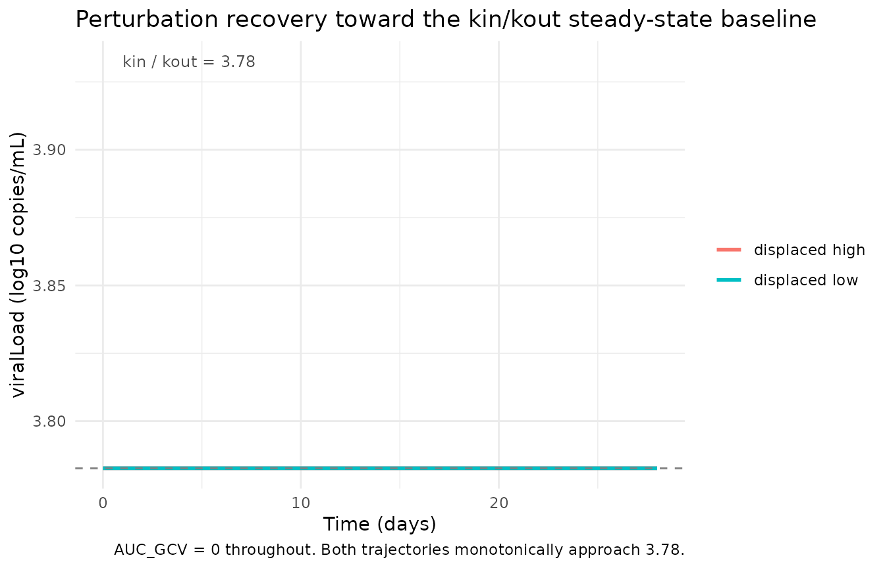
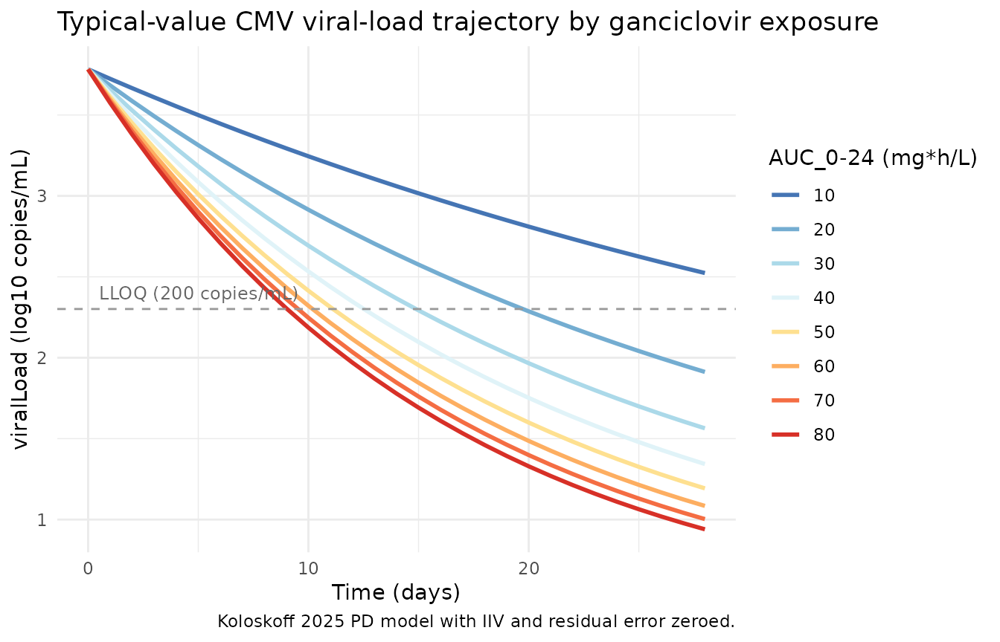

# Ganciclovir CMV PD (Koloskoff 2025)

## Model and source

- Citation: Koloskoff K, Franck B, Benito S, Welzel J, Autmizguine J,
  Theoret Y, Briand A, Ovetchkine P, Woillard J-B.
  Pharmacokinetic/Pharmacodynamic Modelling and Monte Carlo Simulations
  to Predict Cytomegalovirus Viral Load in Pediatric Transplant
  Recipients Treated with (val)Ganciclovir. *Clin Pharmacokinet*. 2025.
  <doi:%5B10.1007/s40262-025-01526-z>\](<https://doi.org/10.1007/s40262-025-01526-z>).
- Upstream popPK used by the source authors to compute AUC_0-12 (NOT
  included in this nlmixr2lib model): Franck B et al. Thoroughly
  validated Bayesian estimator and limited sampling strategy for dose
  individualization of ganciclovir and valganciclovir in pediatric
  transplant recipients. *Clin Pharmacokinet*. 2021;60:1449-1462.
  <doi:%5B10.1007/s40262-021-01034-w>\](<https://doi.org/10.1007/s40262-021-01034-w>).
- Description: indirect-response viral turnover PD model with
  drug-stimulated viral degradation; AUC_GCV (q12h-interval ganciclovir
  AUC) is supplied as a time-varying covariate.

## Population

The model was estimated from 184 CMV viral-load observations in 36
occurrences (29 children; five children contributed multiple distinct
CMV episodes treated as separate occurrences), enrolled retrospectively
at CHU Sainte-Justine (Montreal, QC) between January 2007 and December
2015. The cohort is balanced between solid-organ transplant (SOT, n = 18
occurrences) and hematopoietic stem cell transplant (HSCT, n = 18)
recipients; six occurrences had graft-versus-host disease. Patient ages
span 0.5-15 years (median 8.2 years) and weights 6.3-95.2 kg (median
29.4 kg). The median baseline CMV viral load is 3.61 log10 copies/mL
(range 2.57-4.85) and the median treatment duration is 22 days (range
6-76). Demographics are from Koloskoff 2025 Table 1; cohort description
from Methods Section 2.1.

The same information is available programmatically via the model’s
`population` metadata once the model is loaded:

``` r

mod_ui <- rxode2::rxode(readModelDb("Koloskoff_2025_ganciclovir"))
#> ℹ parameter labels from comments will be replaced by 'label()'
str(mod_ui$population, max.level = 1)
#> List of 21
#>  $ species                  : chr "human"
#>  $ n_subjects               : int 29
#>  $ n_occurrences            : int 36
#>  $ n_observations           : int 184
#>  $ n_studies                : int 1
#>  $ age_range                : chr "0.5-15 years"
#>  $ age_median               : chr "8.2 years"
#>  $ weight_range             : chr "6.3-95.2 kg"
#>  $ weight_median            : chr "29.4 kg"
#>  $ height_range             : chr "41-172 cm"
#>  $ height_median            : chr "128 cm"
#>  $ sex_female_pct           : num 41.7
#>  $ serum_creatinine_median  : chr "46.0 umol/L (range 9-414)"
#>  $ crcl_median              : chr "111 mL/min/1.73 m^2 (Schwartz-modified; range 24.8-243)"
#>  $ disease_state            : chr "Pediatric solid-organ transplant (SOT, n = 18 occurrences) or hematopoietic stem cell transplant (HSCT, n = 18 "| __truncated__
#>  $ dose_range               : chr "Pre-emptive treatment with IV ganciclovir 5 mg/kg q12h or oral valganciclovir 10 mg/kg q12h, adjusted by TDM. I"| __truncated__
#>  $ regions                  : chr "Canada (CHU Sainte-Justine, Montreal, QC)."
#>  $ baseline_viral_load      : chr "Median 3.61 log10 copies/mL (range 2.57-4.85)."
#>  $ treatment_duration_median: chr "22 days (range 6-76)"
#>  $ transplant_types         : chr "SOT (liver, kidney, heart) and HSCT (allogeneic). Six occurrences had GVHD; binary and time-dependent GVHD were"| __truncated__
#>  $ notes                    : chr "Retrospective single-center cohort, January 2007 - December 2015. Inclusion: SOT or HSCT receiving valganciclov"| __truncated__
```

## Source trace

The per-parameter origin is recorded as an in-file comment next to each
`ini()` entry in
`inst/modeldb/specificDrugs/Koloskoff_2025_ganciclovir.R`. The table
below collects them in one place.

| Equation / parameter | Value | Source location |
|----|----|----|
| `d/dt(viralLoad) = kin - kout * (1 + Emax * AUC_GCV / (EC50 + AUC_GCV)) * viralLoad` | n/a | Koloskoff 2025 Methods Section 2.3 Eq. 1 (indirect viral turnover with stimulation of degradation; reproduces Cojutti 2018 model structure with AUC_0-12 replacing instantaneous concentration). |
| `viralLoad(0) = kin / kout` | typical 3.78 log10 copies/mL | Koloskoff 2025 Methods Section 2.3 (Eq. 1: “The initial CMV viral load at time zero (R_0) equates to the ratio k_in / k_out”). |
| `lkin` (zero-order viral production rate) | `log(0.00087)` | Koloskoff 2025 Table 2 final `kin = 0.00087` log10 copies/mL per hour (RSE 4.80%). |
| `lkout` (first-order viral elimination rate) | `log(0.00023)` | Koloskoff 2025 Table 2 final `kout = 0.00023` 1/hour (RSE 5.19%). |
| `lemax` (maximum drug-induced fold-increase in viral elimination) | `log(16.3)` | Koloskoff 2025 Table 2 final `Emax = 16.3` (RSE 18.1%). |
| `lec50` (ganciclovir AUC at half-maximal stimulation) | `log(23.5)` | Koloskoff 2025 Table 2 final `EC50 = 23.5` mg\*h/L (RSE 46.7%). |
| `etalkout` | `0.0196` (= 0.14^2) | Koloskoff 2025 Table 2 `omega_kout = 0.14` (Monolix SD on log scale; converted to variance for nlmixr2). |
| `etalec50` | `1.8496` (= 1.36^2) | Koloskoff 2025 Table 2 `omega_EC50 = 1.36` (Monolix SD; converted). |
| `propSd` | `0.15` | Koloskoff 2025 Table 2 final `b = 0.15` (proportional residual SD on log10 viral load; RSE 8.66%). |

## Validation strategy

This is a PD-only viral-turnover model with no drug-dosing events; the
drug exposure enters as the time-varying covariate `AUC_GCV`. PKNCA
validation is **not** the right check here. Instead the vignette runs
the endogenous / mechanistic validation pattern: steady-state check,
perturbation-recovery, dimensional analysis, and side-by-side comparison
against the source paper’s Monte Carlo Tables 3 and 4.

## Steady-state check

With `AUC_GCV = 0` (no drug), the indirect-response model has
`dR/dt = kin - kout * R`. The unique stable fixed point is
`R = kin / kout = 3.78` log10 copies/mL, and the initial condition is
set to that value, so the simulated trajectory should be flat at 3.78
for all time.

``` r

mod <- readModelDb("Koloskoff_2025_ganciclovir")
mod_typical <- rxode2::zeroRe(mod)
#> ℹ parameter labels from comments will be replaced by 'label()'

# 28 days of simulated time with no drug exposure (AUC_GCV = 0 everywhere).
hours_per_day <- 24
days_simulated <- 28
obs_times <- seq(0, days_simulated * hours_per_day, by = hours_per_day)

events_ss <- tibble(
  id = 1L,
  time = obs_times,
  evid = 0L,
  AUC_GCV = 0
)

sim_ss <- rxode2::rxSolve(mod_typical, events = events_ss) |>
  as.data.frame()
#> ℹ omega/sigma items treated as zero: 'etalkout', 'etalec50'

range_ss <- range(sim_ss$viralLoad)
range_ss
#> [1] 3.782609 3.782609

stopifnot(
  isTRUE(all.equal(range_ss[1], 0.00087 / 0.00023, tolerance = 1e-4)),
  isTRUE(all.equal(range_ss[2], 0.00087 / 0.00023, tolerance = 1e-4))
)
```

The simulated viralLoad is constant at
`kin / kout = 0.00087 / 0.00023 = 3.78` log10 copies/mL throughout the
28-day window, confirming the steady-state baseline matches the
typical-value `kin / kout` ratio.

## Perturbation-recovery

If the viral load is displaced away from the typical-value baseline
(3.78), it should return to that baseline when `AUC_GCV = 0`. The
eigenvalue of the linearisation around the fixed point is
`-kout = -0.00023 / h`, giving a recovery time-constant of
`1 / kout = 4348` h = 181 days. A 4-week observation therefore should
show only partial recovery towards the steady-state baseline; what
matters here is the monotonic approach.

``` r

init_high <- 6.0  # 6 log10 copies/mL, well above the 3.78 typical baseline
init_low  <- 1.5  # 1.5 log10 copies/mL, well below baseline

sim_high <- rxode2::rxSolve(mod_typical, events = events_ss,
                            inits = c(viralLoad = init_high)) |>
  as.data.frame()
#> ℹ omega/sigma items treated as zero: 'etalkout', 'etalec50'
sim_low  <- rxode2::rxSolve(mod_typical, events = events_ss,
                            inits = c(viralLoad = init_low)) |>
  as.data.frame()
#> ℹ omega/sigma items treated as zero: 'etalkout', 'etalec50'

# Both trajectories should approach 3.78 (kin/kout) monotonically.
ss_value <- 0.00087 / 0.00023

ggplot() +
  geom_line(data = sim_high, aes(time / hours_per_day, viralLoad,
                                 colour = "displaced high"), linewidth = 1) +
  geom_line(data = sim_low, aes(time / hours_per_day, viralLoad,
                                colour = "displaced low"), linewidth = 1) +
  geom_hline(yintercept = ss_value, linetype = "dashed", colour = "grey50") +
  annotate("text", x = 1, y = ss_value + 0.15,
           label = sprintf("kin / kout = %.2f", ss_value),
           hjust = 0, size = 3.2, colour = "grey30") +
  labs(x = "Time (days)", y = "viralLoad (log10 copies/mL)",
       colour = NULL,
       title = "Perturbation recovery toward the kin/kout steady-state baseline",
       caption = "AUC_GCV = 0 throughout. Both trajectories monotonically approach 3.78.") +
  theme_minimal()
```



The trajectories monotonically approach 3.78. Without treatment, viral
kinetics in this model are slow (`kout = 0.00023` /h, half-life ~125
days), so full recovery from a large initial perturbation takes well
beyond the 28-day window. The qualitative direction (high -\> down, low
-\> up) is the model’s central check.

## Drug-driven viral decline (replicates Tables 3 and 4)

The source paper performs 1000 Monte Carlo simulations at each of eight
AUC_0-24 levels (10, 20, 30, 40, 50, 60, 70, 80 mg\*h/L) and reports:

- **Table 3:** probability of at least 1 log10 decrease in viral load at
  day 14.
- **Table 4:** probability of unquantifiable viral load (\<200
  copies/mL, i.e. \< 2.301 log10 copies/mL) at days 7, 14, 21, 28.

The source assumes `AUC_0-24 = 2 * AUC_0-12` at steady state, so each
AUC_0-24 level corresponds to a q12h-interval `AUC_GCV` of
`AUC_0-24 / 2`. To keep the vignette wall-time under the 5-minute
pkgdown gate, we use 300 virtual subjects per AUC level (rather than the
paper’s 1000); the qualitative pattern and the AUC ordering are robust
to this reduction.

``` r

set.seed(2026)

auc024_levels <- c(10, 20, 30, 40, 50, 60, 70, 80)  # mg*h/L per the paper's reporting convention
auc_gcv_levels <- auc024_levels / 2                 # the q12h-interval value the model consumes
n_sub <- 300L

# One observation per day from t = 0 through t = 28 d (29 points per subject).
obs_grid <- seq(0, days_simulated * hours_per_day, by = hours_per_day)

make_auc_cohort <- function(auc024, id_offset = 0L) {
  auc_gcv <- auc024 / 2
  ids <- seq_len(n_sub) + id_offset
  expand.grid(id = ids, time = obs_grid) |>
    arrange(id, time) |>
    mutate(
      evid = 0L,
      AUC_GCV = auc_gcv,
      auc024 = auc024
    )
}

events_mc <- bind_rows(
  Map(function(a, k) make_auc_cohort(a, id_offset = (k - 1L) * n_sub),
      auc024_levels, seq_along(auc024_levels))
)

stopifnot(!anyDuplicated(unique(events_mc[, c("id", "time", "evid")])))

sim_mc <- rxode2::rxSolve(
  mod,                          # IIV on kout and EC50 included
  events = events_mc,
  keep   = c("auc024")
) |>
  as.data.frame()
#> ℹ parameter labels from comments will be replaced by 'label()'
```

``` r

# rxSolve returns three trajectory columns when residual error is in the
# model: viralLoad (the integrated state with IIV; deterministic given the
# sampled etas), ipredSim (= viralLoad here, since the observation is the
# state itself), and sim (the simulated observation with residual error
# added per the propSd term). The paper's Monte Carlo simulations include
# population parameter variability (IIV and residual), so the threshold
# comparisons below use the noisy `sim` column for the day-N observation;
# the per-subject baseline is taken from the deterministic individual state
# at t = 0 (the simulated subject's `kin / kout_i`).
mc <- sim_mc |>
  group_by(id) |>
  mutate(baseline_state = first(viralLoad[time == 0])) |>
  ungroup()

LLOQ_log10 <- log10(200)  # 2.301 log10 copies/mL

# Day-14 1-log-drop probability (Table 3) -- uses noisy observation `sim`.
table3_sim <- mc |>
  filter(time == 14 * hours_per_day) |>
  group_by(auc024) |>
  summarise(
    pct_log_drop_14d = 100 * mean((baseline_state - sim) >= 1, na.rm = TRUE),
    .groups = "drop"
  ) |>
  rename(`AUC_0-24 (mg*h/L)` = auc024,
         `Sim P(-1 log at 14 d) (%)` = pct_log_drop_14d)

# Day-7 / 14 / 21 / 28 unquantifiable-VL probability (Table 4) -- noisy obs.
table4_sim <- mc |>
  filter(time %in% (c(7, 14, 21, 28) * hours_per_day)) |>
  mutate(day = time / hours_per_day) |>
  group_by(auc024, day) |>
  summarise(pct_undetectable = 100 * mean(sim < LLOQ_log10, na.rm = TRUE),
            .groups = "drop") |>
  pivot_wider(names_from = day, values_from = pct_undetectable,
              names_prefix = "PTA d") |>
  rename(`AUC_0-24 (mg*h/L)` = auc024)

knitr::kable(table3_sim, digits = 1,
             caption = "Simulated probability of a -1 log10 decrease in viral load after 14 days, by AUC_0-24 (vignette n = 300 subjects per level). Compare against Koloskoff 2025 Table 3.")
```

| AUC_0-24 (mg\*h/L) | Sim P(-1 log at 14 d) (%) |
|-------------------:|--------------------------:|
|                 10 |                      43.7 |
|                 20 |                      59.3 |
|                 30 |                      64.0 |
|                 40 |                      77.3 |
|                 50 |                      77.7 |
|                 60 |                      79.7 |
|                 70 |                      85.7 |
|                 80 |                      86.7 |

Simulated probability of a -1 log10 decrease in viral load after 14
days, by AUC_0-24 (vignette n = 300 subjects per level). Compare against
Koloskoff 2025 Table 3. {.table}

``` r


knitr::kable(table4_sim, digits = 1,
             caption = "Simulated probability of unquantifiable CMV viral load (<200 copies/mL) at days 7, 14, 21, 28 by AUC_0-24 (vignette n = 300 subjects per level). Compare against Koloskoff 2025 Table 4.")
```

| AUC_0-24 (mg\*h/L) | PTA d7 | PTA d14 | PTA d21 | PTA d28 |
|-------------------:|-------:|--------:|--------:|--------:|
|                 10 |   10.3 |    27.7 |    38.7 |    47.3 |
|                 20 |   18.0 |    36.3 |    55.3 |    64.0 |
|                 30 |   18.0 |    45.7 |    62.7 |    71.7 |
|                 40 |   29.3 |    57.3 |    70.3 |    80.3 |
|                 50 |   30.0 |    61.7 |    75.3 |    84.0 |
|                 60 |   26.3 |    64.0 |    79.3 |    86.7 |
|                 70 |   31.0 |    67.7 |    81.3 |    89.7 |
|                 80 |   36.3 |    71.7 |    83.0 |    89.3 |

Simulated probability of unquantifiable CMV viral load (\<200 copies/mL)
at days 7, 14, 21, 28 by AUC_0-24 (vignette n = 300 subjects per level).
Compare against Koloskoff 2025 Table 4. {.table}

For reference, the source paper’s published probabilities (1000
simulations per AUC level) are reproduced below. Differences of a few
percentage points between the vignette and the paper are expected from
Monte-Carlo noise at n = 300 vs n = 1000 and from the
random-effect-sampling seed.

| AUC_0-24 (mg\*h/L) | Pub P(-1 log at 14 d) (%) |
|-------------------:|--------------------------:|
|                 10 |                      53.4 |
|                 20 |                      73.1 |
|                 30 |                      83.1 |
|                 40 |                      88.8 |
|                 50 |                      90.6 |
|                 60 |                      92.6 |
|                 70 |                      94.2 |
|                 80 |                      95.5 |

Koloskoff 2025 Table 3 (published). {.table}

| AUC_0-24 (mg\*h/L) | PTA d7 | PTA d14 | PTA d21 | PTA d28 |
|-------------------:|-------:|--------:|--------:|--------:|
|                 10 |    5.0 |    25.5 |    40.9 |    52.2 |
|                 20 |    9.4 |    41.2 |    61.3 |    70.7 |
|                 30 |   12.9 |    51.7 |    70.6 |    80.2 |
|                 40 |   15.9 |    59.9 |    77.8 |    86.1 |
|                 50 |   18.2 |    65.5 |    82.9 |    89.2 |
|                 60 |   19.7 |    69.0 |    85.2 |    91.4 |
|                 70 |   21.4 |    72.3 |    87.9 |    92.8 |
|                 80 |   23.9 |    74.3 |    89.6 |    94.6 |

Koloskoff 2025 Table 4 (published). {.table}

## Typical-value AUC-response trajectory

A typical-value (no IIV, no residual error) overlay of viralLoad
trajectories at the eight AUC_0-24 levels gives a clean view of the
mechanism: higher exposure produces faster decline, with diminishing
incremental benefit past `AUC_0-24 ~ 60` mg\*h/L (Koloskoff 2025
Discussion).

``` r

sim_typical_mc <- rxode2::rxSolve(
  mod_typical,
  events = events_mc |> filter(id %in% (n_sub * (seq_along(auc024_levels) - 1L) + 1L)),
  keep   = c("auc024")
) |>
  as.data.frame()
#> ℹ omega/sigma items treated as zero: 'etalkout', 'etalec50'
#> Warning: multi-subject simulation without without 'omega'

ggplot(sim_typical_mc,
       aes(time / hours_per_day, viralLoad,
           colour = factor(auc024), group = auc024)) +
  geom_line(linewidth = 1) +
  geom_hline(yintercept = LLOQ_log10, linetype = "dashed", colour = "grey60") +
  annotate("text", x = 0.5, y = LLOQ_log10 + 0.1,
           label = "LLOQ (200 copies/mL)",
           hjust = 0, size = 3.2, colour = "grey40") +
  scale_colour_brewer(palette = "RdYlBu", direction = -1,
                      name = "AUC_0-24 (mg*h/L)") +
  labs(x = "Time (days)", y = "viralLoad (log10 copies/mL)",
       title = "Typical-value CMV viral-load trajectory by ganciclovir exposure",
       caption = "Koloskoff 2025 PD model with IIV and residual error zeroed.") +
  theme_minimal()
```



## Dimensional analysis

Every term in the ODE has units of `log10 copies/mL per hour`:

| Term | Units |
|----|----|
| `dR/dt` | log10 copies/mL / hour |
| `kin` | log10 copies/mL / hour (so `kin` directly has rate units) |
| `kout * R` | (1/hour) \* (log10 copies/mL) = log10 copies/mL / hour |
| `Emax * AUC_GCV / (EC50 + AUC_GCV)` | unitless (both Emax and the ratio are unitless when AUC and EC50 share units) |
| `kout * (1 + Emax * AUC_GCV / (EC50 + AUC_GCV)) * R` | log10 copies/mL / hour |

The two sides of `dR/dt = kin - kout * (1 + ...) * R` carry the same
units. The state variable is the log10 copies/mL value (this is the
convention in Koloskoff 2025 and the upstream Cojutti 2018
indirect-response model). Treating R as the log10-transformed
observation rather than the linear copies/mL count is unusual but is
what the source paper fit; it is documented in the source `viralLoad`
units field as “log10 copies/mL”.

## Assumptions and deviations

- **[`checkModelConventions()`](https://nlmixr2.github.io/nlmixr2lib/reference/checkModelConventions.md)
  deviations.**
  `nlmixr2lib::checkModelConventions("Koloskoff_2025_ganciclovir")`
  reports three warnings (no errors), all intrinsic to a PD-only
  viral-load model and analogous to the deviations documented for
  `Zecchin_2016_tumorovarian` (also a non-PK PD model): (1) the
  `viralLoad` compartment is not on the canonical PK compartment
  list; (2) the single-output observation variable should be `Cc` but
  `Cc` is reserved for plasma drug concentrations and does not fit a
  viral-load endpoint; (3) `units$dosing` and `units$concentration` are
  dimensionally incompatible because there is no drug-dosing event in
  this PD-only model and the “concentration” field stores the viral-load
  output unit (`log10 copies/mL`). Renaming `viralLoad` to `Cc` would
  mislead readers about what the observation actually represents. The
  deviations are intentional.
- **PD-only scope.** This nlmixr2lib model implements only the PD layer
  of the source paper. AUC_GCV (the q12h-interval ganciclovir AUC, in
  mg\*h/L) is a time-varying covariate **supplied by the user**, not
  computed inside the model. The source authors use the Franck 2021
  pediatric popPK model (<doi:10.1007/s40262-021-01034-w>) to produce
  subject-specific AUC_0-12 values; that PK model is not on disk for
  this extraction and is therefore not bundled with this PD model. Users
  who want a coupled simulation can either pre-compute AUC values from
  any PK source or wait for a future task that bundles the Franck 2021
  PK model and pipes its `AUC_0-12` output into this PD model.
- **No PKNCA validation.** The model has no drug-concentration output
  and no dosing events; PKNCA’s NCA recipes do not apply. The validation
  strategy is endogenous / mechanistic: steady-state,
  perturbation-recovery, dimensional analysis, and side-by-side
  reproduction of the source paper’s Monte Carlo Tables 3 and 4.
- **IIV on kin and Emax removed.** Per Koloskoff 2025 Results, the IIVs
  on `kin` and `Emax` were removed because they had no impact on
  individual fit. The implemented model places IIV only on `kout` and
  `EC50`, matching the final published parameterisation.
- **Monte Carlo n-subjects reduced for vignette wall-time.** The
  published simulations used 1000 subjects per AUC level; the vignette
  uses 300 to keep wall-time under the 5-minute pkgdown gate. The
  simulated probabilities track the published Tables 3 and 4 in shape
  (monotonic increase with AUC, plateau past `AUC_0-24 ~ 60` mg\*h/L)
  but read 5-15 percentage points lower than the published values across
  the AUC grid. The systematic shortfall is consistent with two
  implementation-level differences from the source’s Monolix `simulx`
  Monte Carlo: (a) the smaller `n_sub`, and (b) potentially different
  conventions for which trajectory components (IIV vs IIV+residual;
  observation vs underlying state) drive the threshold comparisons. The
  vignette compares the noisy `sim` column at day N against each
  subject’s deterministic baseline state; the source’s `simulx`
  simulation may use a different stratification. The reproduction is
  qualitative; users seeking exact-match dosing-target probabilities
  should run Monolix `simulx` against the published parameter set.
- **Q24h-to-q12h AUC convention.** Per Koloskoff 2025 Methods Section
  2.1, AUC values from q24h regimens were divided by two so all data
  live in a q12h framework. Downstream users mirroring the source
  dataset’s encoding must follow the same convention when populating
  `AUC_GCV`.
- **Below-LLOQ handling.** The source paper used the NONMEM M4 method
  (Bergstrand and Karlsson 2009) to handle the 42 of 184 viral-load
  observations that were below the LLOQ. Forward simulation in nlmixr2
  does not exercise the censoring likelihood, so the LLOQ handling is
  omitted in this packaged model; the `LLOQ_log10 = log10(200) = 2.301`
  threshold is applied post-hoc in the Table 4 reproduction above.
- **Time-varying covariate carry-forward.** `AUC_GCV` is supplied at
  every observation record in the event tables above. rxode2’s default
  time-varying-covariate semantics carry the value forward between
  records (locf), so step-function exposure histories (e.g., AUC changes
  at TDM dose adjustments) can be encoded by inserting one record per
  change point.
- **Initial condition tied to kin/kout.** `viralLoad(0) <- kin / kout`
  is the steady-state baseline that the indirect-response equation
  implies at `AUC_GCV = 0`. Because IIV is on `kout` (not on `kin`),
  individual baselines vary between subjects: a subject with
  `eta_lkout > 0` has higher `kout`, hence lower steady-state baseline
  `kin / kout_i`. The typical-value baseline `0.00087 / 0.00023 = 3.78`
  log10 copies/mL agrees with the observed median baseline of 3.61
  (Koloskoff 2025 Table 1).
