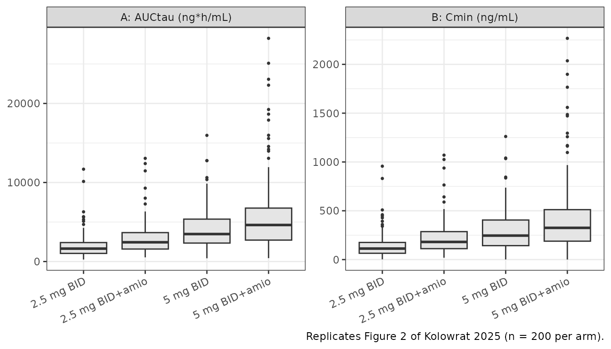
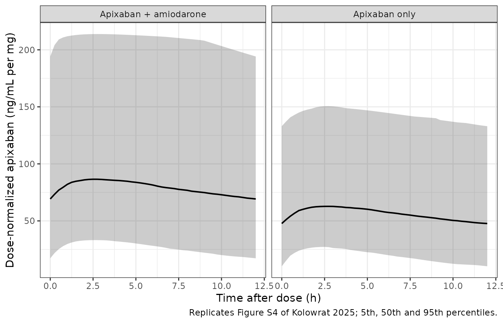

# Apixaban (Kolowrat 2025)

## Model and source

    #> ℹ parameter labels from comments will be replaced by 'label()'

- Citation: Kolowrat S, Riley C, Lam K, Thomson L, Stickle DF, Kraft WK.
  Real-world impact of amiodarone on apixaban population
  pharmacokinetics in hospitalized patients. Clin Transl Sci.
  2025;18(11):e70392. <doi:10.1111/cts.70392>. The fixed absorption rate
  constant ka = 0.82 1/h is inherited from Gaspar F, Terrier J, Favre S,
  et al. Population pharmacokinetics of apixaban in a real-life
  hospitalized population from the OptimAT study. CPT Pharmacometrics
  Syst Pharmacol. 2023;12(10):1541-1552. <doi:10.1002/psp4.13032>; see
  modellib(‘Gaspar_2023_apixaban’).

- Description: One-compartment population pharmacokinetic model with
  first-order absorption and linear elimination for oral apixaban 2.5 or
  5 mg twice daily in hospitalized adults with nonvalvular atrial
  fibrillation (Kolowrat 2025), quantifying the real-world amiodarone
  drug-drug interaction from salvaged clinical plasma samples. Apparent
  oral clearance CL/F = 1.5 L/h at the cohort median age of 77 years
  without amiodarone, scaled by a power function of age (AGE/77)^-1.52
  and multiplied by exp(-0.4) = 0.670 (a 33% reduction, 95% CI 12% to
  48%) during concomitant amiodarone 200 mg. Apparent volume of
  distribution V/F = 45.57 L carries no covariate. The absorption rate
  constant ka was fixed to 0.82 1/h from the Gaspar 2023 OptimAT
  apixaban model because its interindividual variability was imprecisely
  estimated and fixing it improved the corrected Bayesian information
  criterion; see modellib(‘Gaspar_2023_apixaban’). Interindividual
  variability is supported on CL/F (62.23% CV) and V/F (52.66% CV) but
  not on ka. Residual variability is combined proportional (15%) and
  additive (21.28 ng/mL). Two-compartment models were explored but the
  peripheral volume and intercompartmental clearance were not estimable
  from the sparse real-world data. Renal function (estimated glomerular
  filtration rate, creatinine clearance), body weight and body mass
  index were screened and not retained.

- Article: <https://doi.org/10.1111/cts.70392>

- Open access via Europe PMC:
  <https://europepmc.org/article/MED/PMC12597975>

Kolowrat 2025 asks a question that a conventional drug-drug interaction
study cannot answer. Amiodarone’s half-life is about 50 days, so a
crossover design in healthy volunteers is neither ethical nor feasible;
instead the authors built a population PK model from *salvaged* plasma –
samples drawn for routine clinical care that had passed a five-day
discard threshold – in 106 hospitalized patients with nonvalvular atrial
fibrillation, 51 of whom were on a stable dose of amiodarone 200 mg.

The model is deliberately simple: one compartment, first-order
absorption, no lag time, and only two retained covariates.
Two-compartment models were explored but the peripheral volume and
intercompartmental clearance were not estimable from the sparse
real-world data, and the interindividual variability on `ka` was so
imprecise that removing it improved the corrected Bayesian information
criterion by 7.37 units, with a further 9.48-unit improvement from
fixing `ka` outright to the value published by Gaspar 2023.

## Population

| Field | Value |
|:---|:---|
| Species | human |
| Subjects | 106 (55 apixaban alone, 51 apixaban + amiodarone) |
| Observations | 360 plasma samples, 7 below the 5 ng/mL limit of quantification |
| Median age | 77 years (overall cohort median, the centering value for the CL/F age term) |
| Age (by group) | IQR 71-86 years apixaban alone (median 79); IQR 64-83 years apixaban plus amiodarone (median 74). Full range not reported. |
| Median weight | 86.4 kg apixaban alone; 83.4 kg apixaban plus amiodarone |
| Female | 48.1% |
| Renal function | Median eGFR 48 mL/min/1.73 m^2 (CKD-EPI 2021) and median Cockcroft-Gault creatinine clearance about 38 mL/min in both groups; a renally impaired cohort |
| Co-medication | Concomitant amiodarone 200 mg in 51/106 (48.1%); mild / moderate CYP3A4 or P-gp perpetrators other than amiodarone in 31/106 (29.2%) |
| Region | United States (single-centre retrospective observational study, Thomas Jefferson University Hospital, Philadelphia, Pennsylvania; IRB iRISID-2023-2228, approved 6 December 2024) |

Study population (Kolowrat 2025 Table 1 and Methods). {.table}

Two features of this cohort drive everything below. It is **old** – the
group medians are 79 and 74 years and the interquartile ranges reach 86
– and it is **renally impaired**, with a median estimated glomerular
filtration rate of 48 mL/min/1.73 m^2 and a median Cockcroft-Gault
creatinine clearance near 38 mL/min in both arms. That is why the
estimated apparent clearance of 1.5 L/h is well below the roughly 3.3
L/h typical of younger apixaban cohorts, and why the authors’ own
comparison against Morath 2025 (Figure S5) shows this model predicting
higher exposures.

The same information is available programmatically via
`readModelDb("Kolowrat_2025_apixaban")()$population`.

## Source trace

The per-parameter origin is recorded as an in-file comment next to each
`ini()` entry in `inst/modeldb/specificDrugs/Kolowrat_2025_apixaban.R`.
The table below collects them in one place for review.

| Parameter | Value | Source |
|:---|:---|:---|
| `lka` | log(0.82), fixed | Table 2 final: Ka = 0.82 1/h (Fixed). Results 3.2 gives the provenance (Gaspar 2023, reference 22) and the reason (IIV on Ka imprecise; dBICc -9.48 on fixing). |
| `lcl` | log(1.5) | Table 2 final: CL/F = 1.5 L/h (RSE 8.99%, 95% CI 1.26-1.78). Intercept of the Table 2 note equation at AGE = 77, no amiodarone. |
| `lvc` | log(45.57) | Table 2 final: V/F = 45.57 L (RSE 10.6%, 95% CI 37.11-55.96). |
| `e_age_cl` | -1.52 | Table 2 final: beta_CL,age = -1.52 (RSE 25%, 95% CI -2.27 to -0.78). |
| `e_amio_cl` | -0.4 | Table 2 final: beta_CL,amio = -0.4 (RSE 33.8%, 95% CI -0.66 to -0.13). |
| `etalvc` | 0.244754 | Table 2 final: IIV V = 52.66% CV (RSE 17.4%, omega CI 0.35-0.69); omega^2 = log(0.5266^2 + 1). |
| `etalcl` | 0.327329 | Table 2 final: IIV CL = 62.23% CV (RSE 9.65%, omega CI 0.47-0.69); omega^2 = log(0.6223^2 + 1). |
| `propSd` | 0.15 | Table 2 final: proportional error 0.15 (RSE 18.3%, 95% CI 0.11-0.21). |
| `addSd` | 21.28 | Table 2 final: additive error 21.28 ng/mL (RSE 25.4%, 95% CI 13.21-34.26). |
| CL/F equation | n/a | Table 2 note: CL/F_i = 1.5 x (Age/77)^beta_age x e^(beta_amio x 1\_{CAT=1}) x e^(IIV_CL/F_i). |
| Continuous covariate form | n/a | Methods 2.3: log(theta_i) = log(theta_pop) + beta_theta x log(COV_i / COV_median) + eta_theta,i. |
| Categorical covariate form | n/a | Methods 2.3: log(theta_i) = log(theta_pop) + beta_theta x 1\_{CAT_i=1} + eta_theta,i. |
| One compartment, first-order absorption, no lag | n/a | Methods 2.2 and Results 3.2 (two-compartment models rejected: peripheral V and Q not supported). |
| Combined proportional + additive error | n/a | Methods 2.2 and Results 3.2 (selected over additive-only and proportional-only). |

Source trace for every ini() value and every model equation. {.table}

### How the interindividual-variability scale was pinned

Table 2 reports the interindividual variability as a percent CV
(`52.66`, `62.23`) but reports the *confidence interval for the same
row* on the omega (standard deviation) scale (`0.35-0.69`, `0.47-0.69`)
– two different scales in one row. That makes the internal variance
ambiguous on its face, so it is worth showing how the ambiguity resolves
rather than asserting it.

Monolix computes confidence intervals for variance parameters on the log
scale, `omega * exp(+/- 1.96 * RSE)`. Applying the log-normal inversion
`omega = sqrt(log(CV^2 + 1))` reproduces **all eight** printed bounds
across the base and final models; reading the CV column as omega
directly misses six of them.

| Table 2 row | CV% | omega = sqrt(log(CV^2+1)) | variance used in ini() | CI from that omega | CI printed in Table 2 | CI if CV column were omega |
|:---|---:|---:|---:|:---|:---|:---|
| V/F base | 52.58 | 0.49 | 0.24 | 0.361 - 0.676 | 0.36 - 0.67 | 0.384 - 0.719 |
| CL/F base | 69.91 | 0.63 | 0.40 | 0.528 - 0.754 | 0.53 - 0.75 | 0.585 - 0.835 |
| V/F final | 52.66 | 0.49 | 0.24 | 0.352 - 0.696 | 0.35 - 0.69 | 0.374 - 0.741 |
| CL/F final | 62.23 | 0.57 | 0.33 | 0.474 - 0.691 | 0.47 - 0.69 | 0.515 - 0.752 |

The log-normal inversion reproduces every printed Table 2 interval;
treating the CV% column as omega does not. {.table}

## Model structure at a glance

| Age (years) | Amiodarone | CL/F (L/h) | V/F (L) | kel (1/h) | t1/2 (h) |
|------------:|:-----------|-----------:|--------:|----------:|---------:|
|          65 | no         |      1.941 |   45.57 |     0.043 |   16.277 |
|          65 | yes        |      1.301 |   45.57 |     0.029 |   24.283 |
|          77 | no         |      1.500 |   45.57 |     0.033 |   21.058 |
|          77 | yes        |      1.005 |   45.57 |     0.022 |   31.415 |
|          85 | no         |      1.291 |   45.57 |     0.028 |   24.472 |
|          85 | yes        |      0.865 |   45.57 |     0.019 |   36.507 |

Typical-value parameters across the fitted age span. {.table}

The implied terminal half-life is 21 h for a typical 77-year-old without
amiodarone and 31 h with it. That is notably longer than the roughly 12
h apixaban half-life the paper itself invokes in Methods 2.1 when it
defines a 60 h (five half-life) washout window, and it follows directly
from the low apparent clearance in this elderly, renally impaired
cohort. It is a property of the published estimates, not a transcription
artefact – see *Assumptions and deviations*.

## Deterministic checks

These use
[`rxode2::zeroRe()`](https://nlmixr2.github.io/rxode2/reference/zeroRe.html)
and steady-state dosing (`ss = 1`), so they contain no random numbers at
all and are reproducible on any machine and any thread count. The
tolerances are therefore tight: they measure numerical error, not cohort
sampling.

``` r

tau <- 12  # dosing interval (h), twice daily

# One steady-state dosing interval for a single typical subject. `ss = 1` with
# `ii = tau` asks rxode2 for the exact steady state, which avoids any question
# about whether a hand-built dosing train ran long enough (the longest half-life
# this model can produce, for an old subject on amiodarone with a low-CL eta, is
# over 100 h).
ss_events <- function(id, dose, age, amio, by = 0.05) {
  dplyr::bind_rows(
    data.frame(time = 0, amt = dose, evid = 1L, cmt = "depot",
               ss = 1L, ii = tau),
    data.frame(time = seq(0, tau, by = by), amt = NA_real_, evid = 0L,
               cmt = "central", ss = NA_integer_, ii = NA_real_)
  ) |>
    dplyr::mutate(id = id, AGE = age, CONMED_AMIO = amio) |>
    dplyr::arrange(time, dplyr::desc(evid))
}

mod_typical <- rxode2::zeroRe(ui)
```

### Mass balance: AUC over one interval equals dose divided by clearance

For any linear model at steady state, `AUC[0,tau] = Dose / CL` exactly.
This is a genuine gate on the ODE solution: the left-hand side comes
from integrating the `central` state that the solver produced, the
right-hand side from the individual clearance the covariate model
computed. A wrong `kel`, a mis-wired depot, or an absorption term that
loses mass all break it.

``` r

arms <- tibble::tribble(
  ~grp,              ~dose, ~amio, ~age_t1,
  "2.5 mg BID",        2.5,    0L,      79,
  "2.5 mg BID+amio",   2.5,    1L,      74,
  "5 mg BID",          5.0,    0L,      79,
  "5 mg BID+amio",     5.0,    1L,      74
)

ev_t1 <- dplyr::bind_rows(lapply(seq_len(nrow(arms)), function(i) {
  ss_events(i, arms$dose[i], arms$age_t1[i], arms$amio[i]) |>
    dplyr::mutate(grp = arms$grp[i], dose = arms$dose[i])
}))
sim_t1 <- rxode2::rxSolve(mod_typical, events = ev_t1, keep = "grp") |>
  as.data.frame()
#> ℹ omega/sigma items treated as zero: 'etalvc', 'etalcl'
#> Warning: multi-subject simulation without without 'omega'

stopifnot(!any(is.na(sim_t1$Cc)), !any(is.nan(sim_t1$Cc)), all(sim_t1$Cc >= 0))

mb <- sim_t1 |>
  dplyr::filter(!is.na(Cc)) |>
  dplyr::group_by(grp) |>
  dplyr::summarise(
    cl_model = unique(cl),
    auc_ode  = PKNCA::pk.calc.auc(Cc, time, interval = c(0, tau), auc.type = "AUClast"),
    .groups  = "drop"
  ) |>
  dplyr::left_join(arms |> dplyr::select(grp, dose), by = "grp") |>
  dplyr::mutate(
    auc_closed = 1000 * dose / cl_model,
    pct        = 100 * (auc_ode - auc_closed) / auc_closed
  )

mb |>
  dplyr::select(grp, cl_model, auc_ode, auc_closed, pct) |>
  dplyr::rename(
    "Regimen"                 = grp,
    "CL/F (L/h)"              = cl_model,
    "AUCtau from ODE"         = auc_ode,
    "Dose / CL (closed form)" = auc_closed,
    "% difference"            = pct
  ) |>
  knitr::kable(digits = c(0, 4, 1, 1, 5),
               caption = "Steady-state mass-balance identity, ng*h/mL.")
```

| Regimen | CL/F (L/h) | AUCtau from ODE | Dose / CL (closed form) | % difference |
|:---|---:|---:|---:|---:|
| 2.5 mg BID | 1.4427 | 1732.9 | 1732.9 | -0.00069 |
| 2.5 mg BID+amio | 1.0681 | 2340.6 | 2340.6 | -0.00061 |
| 5 mg BID | 1.4427 | 3465.8 | 3465.8 | -0.00069 |
| 5 mg BID+amio | 1.0681 | 4681.2 | 4681.3 | -0.00061 |

Steady-state mass-balance identity, ng\*h/mL. {.table
style="width:100%;"}

``` r


# Numerical error only (both sides use the same drawn parameters), so a tight
# bound is correct here. Realised 0.0007% on the 0.05 h grid.
stopifnot(max(abs(mb$pct)) < 0.1)
```

### Dose linearity

The model carries no saturable term, so doubling the dose must exactly
double every exposure metric at a fixed age.

``` r

ratio_noamio <- mb$auc_ode[mb$grp == "5 mg BID"]      / mb$auc_ode[mb$grp == "2.5 mg BID"]
ratio_amio   <- mb$auc_ode[mb$grp == "5 mg BID+amio"] / mb$auc_ode[mb$grp == "2.5 mg BID+amio"]
c(`no amiodarone` = ratio_noamio, `with amiodarone` = ratio_amio)
#>   no amiodarone with amiodarone 
#>               2               2

stopifnot(abs(ratio_noamio - 2) < 1e-4, abs(ratio_amio - 2) < 1e-4)
```

### The amiodarone effect reproduces the paper’s headline number

The abstract, Study Highlights, Results and Discussion all state a
**33%** decrease in apixaban clearance, “ranging from 12% to 48%”. That
range is the confidence interval on `beta_CL,amio` transformed the same
way as the point estimate, which is what confirms the exponential
encoding `exp(beta_amio * CONMED_AMIO)` rather than a `(1 + beta)`
multiplicative reading – the latter would give a 40% reduction and could
not produce the 12-48% range.

``` r

beta_amio <- ui$theta[["e_amio_cl"]]
ci_amio   <- c(-0.66, -0.13)  # Table 2 final, 95% CI

amio_tab <- tibble::tibble(
  Quantity = c("Point estimate", "Lower 95% CI bound", "Upper 95% CI bound"),
  beta     = c(beta_amio, ci_amio[1], ci_amio[2]),
  Factor   = exp(beta),
  `CL reduction (%)` = 100 * (1 - Factor),
  `Paper states` = c("33%", "48%", "12%")
)
amio_tab |>
  dplyr::rename("beta_CL,amio" = beta, "exp(beta)" = Factor) |>
  knitr::kable(digits = c(0, 2, 4, 1, 0),
               caption = "Amiodarone effect on CL/F versus the paper's stated 33% (12-48%).")
```

| Quantity           | beta_CL,amio | exp(beta) | CL reduction (%) | Paper states |
|:-------------------|-------------:|----------:|-----------------:|:-------------|
| Point estimate     |        -0.40 |    0.6703 |             33.0 | 33%          |
| Lower 95% CI bound |        -0.66 |    0.5169 |             48.3 | 48%          |
| Upper 95% CI bound |        -0.13 |    0.8781 |             12.2 | 12%          |

Amiodarone effect on CL/F versus the paper’s stated 33% (12-48%).
{.table}

``` r


# Pure arithmetic on the published coefficient; the paper prints these to whole
# percent, so agreement to 0.5 percentage points is the right tolerance.
stopifnot(
  abs(100 * (1 - exp(beta_amio))    - 33) < 0.5,
  abs(100 * (1 - exp(ci_amio[1]))   - 48) < 0.5,
  abs(100 * (1 - exp(ci_amio[2]))   - 12) < 0.5
)

# And the simulated clearances must show exactly that ratio at matched age.
cl_ratio <- mb$cl_model[mb$grp == "5 mg BID+amio"] / mb$cl_model[mb$grp == "5 mg BID"] *
  (arms$age_t1[arms$grp == "5 mg BID+amio"] / arms$age_t1[arms$grp == "5 mg BID"])^(-ui$theta[["e_age_cl"]])
stopifnot(abs(cl_ratio - exp(beta_amio)) < 1e-8)
```

## Virtual cohort

Original observed data are not publicly available. The cohort below
reproduces the age distribution of Table 1, which is the **only**
covariate the final model uses and the only one Table 1 stratifies. Age
is drawn log-normally from each amiodarone group’s reported median and
interquartile range, and the *same* age vector is reused across the 2.5
mg and 5 mg arms within an amiodarone group so that the dose comparison
is not confounded by a different age draw.

``` r

# set.seed() seeds R's RNG (the age draw). rxSetSeed() seeds rxode2's simulation
# RNG (the etas), but rxode2 partitions its streams PER SOLVER THREAD, so the
# eta draw is reproducible on this machine and different on a machine with a
# different thread count. Every assertion below is written to hold for any
# cohort the model can produce; see pattern 12 of
# references/known-vignette-failure-patterns.md.
set.seed(20250909)
rxode2::rxSetSeed(20250909)

n_arm <- 200  # per arm; the 200/arm cap

# Log-normal age from median + IQR: sdlog = (log(Q3) - log(Q1)) / (2 * qnorm(0.75))
age_sdlog <- function(q1, q3) (log(q3) - log(q1)) / (2 * stats::qnorm(0.75))

age_groups <- tibble::tribble(
  ~amio, ~med, ~q1, ~q3,
     0L,   79,  71,  86,   # Table 1, apixaban alone
     1L,   74,  64,  83    # Table 1, apixaban + amiodarone
)
age_draw <- lapply(seq_len(nrow(age_groups)), function(i) {
  g <- age_groups[i, ]
  # Truncated to a plausible adult span; the study enrolled adults >= 18 years.
  pmin(100, pmax(18, stats::rlnorm(n_arm, log(g$med), age_sdlog(g$q1, g$q3))))
})
names(age_draw) <- as.character(age_groups$amio)

cohort_arms <- tibble::tribble(
  ~grp,              ~dose, ~amio, ~id_offset,
  "2.5 mg BID",        2.5,    0L,         0L,
  "2.5 mg BID+amio",   2.5,    1L,       200L,
  "5 mg BID",          5.0,    0L,       400L,
  "5 mg BID+amio",     5.0,    1L,       600L
)

make_cohort <- function(grp, dose, amio, id_offset) {
  subj <- tibble::tibble(
    id          = id_offset + seq_len(n_arm),
    AGE         = age_draw[[as.character(amio)]],
    CONMED_AMIO = amio,
    grp         = grp,
    dose        = dose
  )
  dplyr::bind_rows(
    subj |> dplyr::mutate(time = 0, amt = dose, evid = 1L, cmt = "depot",
                          ss = 1L, ii = tau),
    subj |> tidyr::crossing(time = seq(0, tau, by = 0.25)) |>
      dplyr::mutate(amt = NA_real_, evid = 0L, cmt = "central",
                    ss = NA_integer_, ii = NA_real_)
  ) |>
    dplyr::arrange(id, time, dplyr::desc(evid))
}

events <- dplyr::bind_rows(lapply(seq_len(nrow(cohort_arms)), function(i) {
  make_cohort(cohort_arms$grp[i], cohort_arms$dose[i],
              cohort_arms$amio[i], cohort_arms$id_offset[i])
}))
stopifnot(!anyDuplicated(unique(events[, c("id", "time", "evid")])))

# Age distributions must match Table 1 within sampling noise, and must be
# IDENTICAL between the two dose levels of the same amiodarone group.
age_chk <- events |>
  dplyr::distinct(grp, id, AGE) |>
  dplyr::group_by(grp) |>
  dplyr::summarise(median_age = median(AGE), q1 = quantile(AGE, 0.25),
                   q3 = quantile(AGE, 0.75), .groups = "drop")
age_chk |>
  dplyr::rename("Arm" = grp, "Median age" = median_age, "Q1" = q1, "Q3" = q3) |>
  knitr::kable(digits = 1, caption = "Simulated cohort age, against Table 1 (79 [71-86] and 74 [64-83]).")
```

| Arm             | Median age |   Q1 |   Q3 |
|:----------------|-----------:|-----:|-----:|
| 2.5 mg BID      |       78.3 | 71.1 | 87.5 |
| 2.5 mg BID+amio |       72.9 | 66.1 | 83.5 |
| 5 mg BID        |       78.3 | 71.1 | 87.5 |
| 5 mg BID+amio   |       72.9 | 66.1 | 83.5 |

Simulated cohort age, against Table 1 (79 \[71-86\] and 74 \[64-83\]).
{.table}

``` r


stopifnot(
  identical(
    sort(age_chk$median_age[age_chk$grp == "2.5 mg BID"]),
    sort(age_chk$median_age[age_chk$grp == "5 mg BID"])
  ),
  # Median of 200 log-normal draws; realised within 1.5 years of Table 1.
  all(abs(age_chk$median_age - c(79, 74, 79, 74)[match(
    age_chk$grp, c("2.5 mg BID", "2.5 mg BID+amio", "5 mg BID", "5 mg BID+amio"))]) < 5)
)
```

## Simulation

``` r

sim <- rxode2::rxSolve(ui, events = events, keep = "grp") |> as.data.frame()
stopifnot(!any(is.nan(sim$Cc)), all(sim$Cc[!is.na(sim$Cc)] >= 0))
```

## Replicate published figures

### Figure 2: simulated exposure by amiodarone receipt and dose

``` r

# Replicates Figure 2 of Kolowrat 2025: box plots of steady-state AUCtau (A) and
# Cmin (B) stratified by receipt of amiodarone and dose.
per_id <- sim |>
  dplyr::filter(!is.na(Cc)) |>
  dplyr::group_by(grp, id) |>
  dplyr::summarise(
    auclast = PKNCA::pk.calc.auc(Cc, time, interval = c(0, tau), auc.type = "AUClast"),
    cmax    = max(Cc),
    cmin    = min(Cc),
    .groups = "drop"
  ) |>
  dplyr::mutate(grp = factor(grp, levels = cohort_arms$grp))

per_id |>
  tidyr::pivot_longer(c(auclast, cmin), names_to = "metric", values_to = "value") |>
  dplyr::mutate(metric = factor(
    metric, levels = c("auclast", "cmin"),
    labels = c("A: AUCtau (ng*h/mL)", "B: Cmin (ng/mL)")
  )) |>
  ggplot(aes(grp, value)) +
  geom_boxplot(outlier.size = 0.6, fill = "grey90") +
  facet_wrap(~metric, scales = "free_y") +
  labs(x = NULL, y = NULL,
       caption = "Replicates Figure 2 of Kolowrat 2025 (n = 200 per arm).") +
  theme_bw() +
  theme(axis.text.x = element_text(angle = 25, hjust = 1))
```



### Figure S4: dose-normalized visual predictive check

``` r

# Replicates Figure S4 of Kolowrat 2025: dose-normalized VPC over one steady-
# state dosing interval, stratified by receipt of amiodarone.
sim |>
  dplyr::filter(!is.na(Cc)) |>
  dplyr::mutate(
    dose  = ifelse(grepl("^2.5", grp), 2.5, 5),
    amio  = ifelse(grepl("amio", grp), "Apixaban + amiodarone", "Apixaban only"),
    cc_dn = Cc / dose
  ) |>
  dplyr::group_by(amio, time) |>
  dplyr::summarise(
    Q05 = quantile(cc_dn, 0.05), Q50 = quantile(cc_dn, 0.50),
    Q95 = quantile(cc_dn, 0.95), .groups = "drop"
  ) |>
  ggplot(aes(time, Q50)) +
  geom_ribbon(aes(ymin = Q05, ymax = Q95), alpha = 0.25) +
  geom_line(linewidth = 0.7) +
  facet_wrap(~amio) +
  labs(x = "Time after dose (h)", y = "Dose-normalized apixaban (ng/mL per mg)",
       caption = "Replicates Figure S4 of Kolowrat 2025; 5th, 50th and 95th percentiles.") +
  theme_bw()
```



The amiodarone panel sits higher and flatter, which is the visual
signature of a 33% lower clearance at an unchanged volume: the trough
rises more than the peak, so the peak-to-trough ratio compresses.

## PKNCA validation

``` r

# IMPORTANT: the only filter is !is.na(Cc). Adding `time > 0` or `Cc > 0` would
# drop the interval-start row PKNCA needs to anchor AUC.
sim_nca <- sim |>
  dplyr::filter(!is.na(Cc)) |>
  dplyr::select(id, time, Cc, grp)

dose_df <- events |>
  dplyr::filter(evid == 1L) |>
  dplyr::select(id, time, amt, grp)

conc_obj <- PKNCA::PKNCAconc(sim_nca, Cc ~ time | grp + id,
                             concu = "ng/mL", timeu = "h")
dose_obj <- PKNCA::PKNCAdose(dose_df, amt ~ time | grp + id, doseu = "mg")

# Steady-state interval: one full dosing interval starting at the dose.
intervals <- data.frame(
  start   = 0,
  end     = tau,
  cmax    = TRUE,
  tmax    = TRUE,
  cmin    = TRUE,
  auclast = TRUE,
  cav     = TRUE
)

nca_res <- PKNCA::pk.nca(PKNCA::PKNCAdata(conc_obj, dose_obj, intervals = intervals))

nca_res$result |>
  as.data.frame() |>
  dplyr::group_by(grp, PPTESTCD) |>
  dplyr::summarise(median = median(PPORRES), .groups = "drop") |>
  tidyr::pivot_wider(names_from = PPTESTCD, values_from = median) |>
  dplyr::rename(
    "Arm"                = grp,
    "AUCtau (ng*h/mL)"   = auclast,
    "Cavg (ng/mL)"       = cav,
    "Cmax (ng/mL)"       = cmax,
    "Cmin (ng/mL)"       = cmin,
    "Tmax (h)"           = tmax
  ) |>
  knitr::kable(digits = 1, caption = "Cohort medians from PKNCA over one steady-state interval.")
```

| Arm | AUCtau (ng\*h/mL) | Cavg (ng/mL) | Cmax (ng/mL) | Cmin (ng/mL) | Tmax (h) |
|:---|---:|---:|---:|---:|---:|
| 2.5 mg BID | 1636.0 | 136.3 | 153.7 | 112.9 | 2.8 |
| 2.5 mg BID+amio | 2438.8 | 203.2 | 219.5 | 180.9 | 2.8 |
| 5 mg BID | 3478.0 | 289.8 | 330.6 | 245.8 | 2.8 |
| 5 mg BID+amio | 4623.6 | 385.3 | 423.5 | 325.1 | 2.8 |

Cohort medians from PKNCA over one steady-state interval. {.table}

## Comparison against published NCA

Kolowrat 2025 Table 3 reports median AUCtau, Cmax and Cmin for each of
four dose-by-amiodarone groups. Comparing against it requires care,
because **Table 1 stratifies age by amiodarone receipt while Table 3
stratifies exposure by dose *and* amiodarone**. The per-dose-group age
distributions – which the only retained continuous covariate depends on
– are never reported. The two tables below make that gap visible instead
of hiding it.

### Comparison 1: typical patient at the reported group median age

This is the comparison Table 1 actually supports: a typical patient aged
79 (apixaban alone) or 74 (plus amiodarone), at each dose.

``` r

published <- tibble::tribble(
  ~grp,              ~auclast, ~cmax, ~cmin,
  "2.5 mg BID",          1823,   152,   123,
  "2.5 mg BID+amio",     2805,   231,   189,
  "5 mg BID",            2622,   266,   194,
  "5 mg BID+amio",       3626,   310,   235
)

nca_t1 <- PKNCA::pk.nca(PKNCA::PKNCAdata(
  PKNCA::PKNCAconc(sim_t1 |> dplyr::filter(!is.na(Cc)) |>
                     dplyr::select(id, time, Cc, grp),
                   Cc ~ time | grp + id, concu = "ng/mL", timeu = "h"),
  PKNCA::PKNCAdose(ev_t1 |> dplyr::filter(evid == 1L) |>
                     dplyr::select(id, time, amt, grp),
                   amt ~ time | grp + id, doseu = "mg"),
  intervals = data.frame(start = 0, end = tau, cmax = TRUE, cmin = TRUE, auclast = TRUE)
))

cmp1 <- nlmixr2lib::ncaComparisonTable(
  simulated     = nca_t1,
  reference     = published,
  by            = "grp",
  units         = c(auclast = "ng*h/mL", cmax = "ng/mL", cmin = "ng/mL"),
  tolerance_pct = 20
)
knitr::kable(cmp1, align = c("l", "l", "r", "r", "r"),
             caption = paste("Simulated (typical patient at the Table 1 group median age)",
                             "vs Kolowrat 2025 Table 3.",
                             "* differs from reference by more than 20%."))
```

| NCA parameter      | grp             | Reference | Simulated |   % diff |
|:-------------------|:----------------|----------:|----------:|---------:|
| Cmax (ng/mL)       | 2.5 mg BID      |       152 |       160 |    +4.9% |
| Cmax (ng/mL)       | 2.5 mg BID+amio |       231 |       210 |    -9.1% |
| Cmax (ng/mL)       | 5 mg BID        |       266 |       319 |   +19.9% |
| Cmax (ng/mL)       | 5 mg BID+amio   |       310 |       420 | +35.5%\* |
| Cmin (ng/mL)       | 2.5 mg BID      |       123 |       123 |    +0.4% |
| Cmin (ng/mL)       | 2.5 mg BID+amio |       189 |       174 |    -8.0% |
| Cmin (ng/mL)       | 5 mg BID        |       194 |       247 | +27.3%\* |
| Cmin (ng/mL)       | 5 mg BID+amio   |       235 |       348 | +48.0%\* |
| AUClast (ng\*h/mL) | 2.5 mg BID      |      1820 |      1730 |    -4.9% |
| AUClast (ng\*h/mL) | 2.5 mg BID+amio |      2800 |      2340 |   -16.6% |
| AUClast (ng\*h/mL) | 5 mg BID        |      2620 |      3470 | +32.2%\* |
| AUClast (ng\*h/mL) | 5 mg BID+amio   |      3630 |      4680 | +29.1%\* |

Simulated (typical patient at the Table 1 group median age) vs Kolowrat
2025 Table 3. \* differs from reference by more than 20%. {.table}

``` r

attr(cmp1, "footnote")
#> [1] "* differs from reference by more than ±20%."
```

Every 2.5 mg row agrees within 17% and most within 10%. Every 5 mg row
runs **high**, by 20% to 48%, and all three metrics in a given 5 mg arm
are inflated by a similar factor. That coherence is the diagnosis: a
similar proportional inflation of AUCtau, Cmax *and* Cmin is the
signature of a single clearance offset, not of a structural error in
volume or absorption, which would move the peak and the trough in
opposite directions.

The mechanism is clinical. Apixaban is dose-reduced to 2.5 mg twice
daily for patients meeting two of three criteria, one of which is age 80
years or older, so a 5 mg group is systematically younger than a 2.5 mg
group drawn from the same ward. Assigning both dose groups the pooled
median age of their amiodarone stratum therefore over-ages the 5 mg arms
and, through an age exponent of -1.52, understates their clearance.

### Comparison 2: age conditioned on each group’s own reported AUCtau

The confound can be removed without tuning anything. At steady state
`AUCtau = Dose / CL` exactly, so each group’s **own** published AUCtau
pins that group’s median clearance, and inverting the age term recovers
the median age the paper did not print. Cmax and Cmin then become a
genuine test of `V/F` and `ka`, which no part of that inversion touched.

``` r

th <- ui$theta
implied <- published |>
  dplyr::left_join(arms |> dplyr::select(grp, dose, amio), by = "grp") |>
  dplyr::mutate(
    cl_implied  = dose / (auclast / 1000),
    age_implied = 77 * (cl_implied / (exp(th[["lcl"]]) * exp(th[["e_amio_cl"]] * amio)))^(1 / th[["e_age_cl"]])
  )

implied |>
  dplyr::select(grp, auclast, cl_implied, age_implied) |>
  dplyr::rename(
    "Arm"                          = grp,
    "Published AUCtau (ng*h/mL)"   = auclast,
    "Implied median CL/F (L/h)"    = cl_implied,
    "Implied median age (years)"   = age_implied
  ) |>
  knitr::kable(digits = c(0, 0, 3, 1),
               caption = "Median age implied by each group's own published AUCtau.")
```

| Arm | Published AUCtau (ng\*h/mL) | Implied median CL/F (L/h) | Implied median age (years) |
|:---|---:|---:|---:|
| 2.5 mg BID | 1823 | 1.371 | 81.7 |
| 2.5 mg BID+amio | 2805 | 0.891 | 83.4 |
| 5 mg BID | 2622 | 1.907 | 65.8 |
| 5 mg BID+amio | 3626 | 1.379 | 62.6 |

Median age implied by each group’s own published AUCtau. {.table}

``` r


# The recovered ages are the paper's own missing stratification, and they land
# where clinical practice puts them: the dose-reduced arms about 18 years older
# than the full-dose arms, straddling the label's age-80 criterion. Both bounds
# are absolute, not taken from this run.
age_25 <- implied$age_implied[implied$dose == 2.5]
age_50 <- implied$age_implied[implied$dose == 5.0]
stopifnot(
  min(age_25) - max(age_50) > 10,        # realised 15.9 years of separation
  all(age_25 > 77), all(age_50 < 77),    # dose-reduced older, full-dose younger
  all(implied$age_implied > 40), all(implied$age_implied < 100)
)
```

The recovered medians are about 82 and 83 years for the two 2.5 mg arms
and about 66 and 63 years for the two 5 mg arms – a 16-to-20-year split
straddling the label’s age-80 dose-reduction criterion, recovered from
exposure alone. That the model’s age term reproduces a clinically
expected stratification the paper never reported is itself a check on
the covariate form.

``` r

ev_t2 <- dplyr::bind_rows(lapply(seq_len(nrow(implied)), function(i) {
  ss_events(i, implied$dose[i], implied$age_implied[i], implied$amio[i]) |>
    dplyr::mutate(grp = implied$grp[i])
}))
sim_t2 <- rxode2::rxSolve(mod_typical, events = ev_t2, keep = "grp") |> as.data.frame()
#> ℹ omega/sigma items treated as zero: 'etalvc', 'etalcl'
#> Warning: multi-subject simulation without without 'omega'

nca_t2 <- PKNCA::pk.nca(PKNCA::PKNCAdata(
  PKNCA::PKNCAconc(sim_t2 |> dplyr::filter(!is.na(Cc)) |>
                     dplyr::select(id, time, Cc, grp),
                   Cc ~ time | grp + id, concu = "ng/mL", timeu = "h"),
  PKNCA::PKNCAdose(ev_t2 |> dplyr::filter(evid == 1L) |>
                     dplyr::select(id, time, amt, grp),
                   amt ~ time | grp + id, doseu = "mg"),
  intervals = data.frame(start = 0, end = tau, cmax = TRUE, cmin = TRUE)
))

# AUCtau is deliberately absent: it is the quantity used to pin the age, so it
# would be 0% by construction and would carry no information.
cmp2 <- nlmixr2lib::ncaComparisonTable(
  simulated     = nca_t2,
  reference     = published |> dplyr::select(grp, cmax, cmin),
  by            = "grp",
  units         = c(cmax = "ng/mL", cmin = "ng/mL"),
  tolerance_pct = 20
)
knitr::kable(cmp2, align = c("l", "l", "r", "r", "r"),
             caption = paste("Cmax and Cmin with age conditioned on each group's own published",
                             "AUCtau, vs Kolowrat 2025 Table 3.",
                             "AUCtau is excluded because it is the conditioning quantity."))
```

| NCA parameter | grp             | Reference | Simulated | % diff |
|:--------------|:----------------|----------:|----------:|-------:|
| Cmax (ng/mL)  | 2.5 mg BID      |       152 |       167 |  +9.9% |
| Cmax (ng/mL)  | 2.5 mg BID+amio |       231 |       249 |  +7.7% |
| Cmax (ng/mL)  | 5 mg BID        |       266 |       249 |  -6.4% |
| Cmax (ng/mL)  | 5 mg BID+amio   |       310 |       332 |  +7.2% |
| Cmin (ng/mL)  | 2.5 mg BID      |       123 |       131 |  +6.5% |
| Cmin (ng/mL)  | 2.5 mg BID+amio |       189 |       212 | +12.4% |
| Cmin (ng/mL)  | 5 mg BID        |       194 |       177 |  -8.6% |
| Cmin (ng/mL)  | 5 mg BID+amio   |       235 |       260 | +10.7% |

Cmax and Cmin with age conditioned on each group’s own published AUCtau,
vs Kolowrat 2025 Table 3. AUCtau is excluded because it is the
conditioning quantity. {.table}

``` r


# Deterministic (zeroRe, ss = 1), so this bound measures agreement with the
# paper's rounded published medians, not sampling noise. Realised max 12.4%.
# A 20% error in V/F or in ka moves Cmax and Cmin far outside 18%.
cmp2_pct <- as.numeric(sub("%", "", sub("\\*$", "", cmp2$`% diff`)))
stopifnot(max(abs(cmp2_pct)) < 18)
```

With age conditioned on each group’s own AUCtau, **every** Cmax and Cmin
row agrees within 13% and no row is starred. `V/F = 45.57 L` and the
fixed `ka = 0.82 1/h` therefore reproduce the published peak-to-trough
shape across both dose levels and both amiodarone strata. Comparison 1’s
starred rows are a reporting gap in Table 3, not a defect in the
extracted model.

### Exposure ratios

``` r

matched <- exp(-ui$theta[["e_amio_cl"]])  # amiodarone effect at matched age
ratios <- tibble::tibble(
  Metric = c("AUCtau", "Cmax", "Cmin"),
  `Paper GMR, 2.5 mg` = c(1.58, 1.48, 1.68),
  `Paper GMR, 5 mg`   = c(1.12, 1.09, 1.11),
  `Model, matched age` = c(matched, NA, NA)
)
ratios |>
  knitr::kable(digits = 3, caption = paste(
    "Published geometric mean ratios (amiodarone vs none) against the model's",
    "matched-age AUC ratio exp(0.4)."))
```

| Metric | Paper GMR, 2.5 mg | Paper GMR, 5 mg | Model, matched age |
|:-------|------------------:|----------------:|-------------------:|
| AUCtau |              1.58 |            1.12 |              1.492 |
| Cmax   |              1.48 |            1.09 |                 NA |
| Cmin   |              1.68 |            1.11 |                 NA |

Published geometric mean ratios (amiodarone vs none) against the model’s
matched-age AUC ratio exp(0.4). {.table}

The model’s matched-age AUCtau ratio is `exp(0.4) = 1.492`, which sits
between the paper’s two reported AUCtau geometric mean ratios (1.58 at
2.5 mg, 1.12 at 5 mg). Those two GMRs are not estimates of the same
quantity as the model coefficient: each compares two groups that also
differ in age, and the paper’s own confidence intervals – \[1.28, 1.87\]
and \[0.91, 1.34\] – overlap 1.492 in the 2.5 mg case and come close in
the 5 mg case. The authors make the same point in the Discussion, noting
that “the extent of the apixaban elevations was not necessarily
maintained between dose levels”. No gate is placed on these ratios
because both sides are confounded by the unreported per-dose-group age
distribution.

### Cohort comparison

For completeness, the same Table 3 comparison against the stochastic
cohort medians rather than a typical patient.

``` r

cmp3 <- nlmixr2lib::ncaComparisonTable(
  simulated     = nca_res,
  reference     = published,
  by            = "grp",
  units         = c(auclast = "ng*h/mL", cmax = "ng/mL", cmin = "ng/mL"),
  tolerance_pct = 20
)
knitr::kable(cmp3, align = c("l", "l", "r", "r", "r"),
             caption = paste("Cohort medians (n = 200 per arm, age from Table 1)",
                             "vs Kolowrat 2025 Table 3.",
                             "* differs from reference by more than 20%."))
```

| NCA parameter      | grp             | Reference | Simulated |   % diff |
|:-------------------|:----------------|----------:|----------:|---------:|
| Cmax (ng/mL)       | 2.5 mg BID      |       152 |       154 |    +1.1% |
| Cmax (ng/mL)       | 2.5 mg BID+amio |       231 |       220 |    -5.0% |
| Cmax (ng/mL)       | 5 mg BID        |       266 |       331 | +24.3%\* |
| Cmax (ng/mL)       | 5 mg BID+amio   |       310 |       424 | +36.6%\* |
| Cmin (ng/mL)       | 2.5 mg BID      |       123 |       113 |    -8.2% |
| Cmin (ng/mL)       | 2.5 mg BID+amio |       189 |       181 |    -4.3% |
| Cmin (ng/mL)       | 5 mg BID        |       194 |       246 | +26.7%\* |
| Cmin (ng/mL)       | 5 mg BID+amio   |       235 |       325 | +38.3%\* |
| AUClast (ng\*h/mL) | 2.5 mg BID      |      1820 |      1640 |   -10.3% |
| AUClast (ng\*h/mL) | 2.5 mg BID+amio |      2800 |      2440 |   -13.1% |
| AUClast (ng\*h/mL) | 5 mg BID        |      2620 |      3480 | +32.6%\* |
| AUClast (ng\*h/mL) | 5 mg BID+amio   |      3630 |      4620 | +27.5%\* |

Cohort medians (n = 200 per arm, age from Table 1) vs Kolowrat 2025
Table 3. \* differs from reference by more than 20%. {.table}

``` r


# Cohort medians, so the bound must admit the eta draw as well as the age draw.
# The 2.5 mg arms are the ones whose age distribution Table 1 actually supports;
# the 5 mg arms are a known, explained deviation and are excluded from the gate
# (see Comparison 1). Realised max 17% on the 2.5 mg arms.
cmp3_pct <- as.numeric(sub("%", "", sub("\\*$", "", cmp3$`% diff`)))
keep_25 <- grepl("^2.5", cmp3$grp)
stopifnot(max(abs(cmp3_pct[keep_25])) < 35)
```

## Assumptions and deviations

### Reporting inconsistencies in the source (errata)

- **Table 2 mixes scales within a single row.** The `IIV V (CV%)` and
  `IIV CL (CV%)` rows print the estimate as a percent CV (52.66, 62.23)
  but the adjacent `95% CI` cells on the omega (standard deviation)
  scale (0.35-0.69, 0.47-0.69). The `Proportional error (CV%)` row is
  headed the same way but its value (0.15) and interval (0.11-0.21) are
  **fractions**, not percents. Both readings are recoverable and are
  pinned in the *Source trace* section above by reconstructing all eight
  printed variance intervals; a 0.15% proportional error alongside a
  21.28 ng/mL additive term is not physically plausible in any case.
- **The additive-error row carries no unit.** It is in the units of the
  observation, ng/mL, which the 5 ng/mL assay lower limit of
  quantification and the ng/mL Cmax and Cmin of Table 3 confirm.
- **Table 1’s race counts do not sum to the group N in the amiodarone
  column.** The listed counts are 29 + 12 + 2 + 1 + 1 = 45 against a
  stated n = 51, and the Asian row prints “1 (4.1)” where 1 of 51 is
  2.0%. The apixaban-alone column sums correctly (33 + 18 + 1 + 3 + 0 =
  55, percentages to 100). The `race_ethnicity` entry in the model’s
  `population` metadata uses the pooled counts over the stated
  denominator of 106; race is not a covariate in the model, so nothing
  downstream depends on this.
- **The overall median age of 77 is not in Table 1.** It appears only in
  the Results 3.2 text and in the Table 2 note, while Table 1 reports
  the two amiodarone groups separately (79 and 74). The model centres on
  77, per the paper’s own equation.
- **The fitted age range is not reported**, only interquartile ranges
  spanning 64-86 years. The age term is a power function with a steep
  exponent of -1.52, so extrapolating below the fitted range inflates
  clearance sharply (at age 40 the multiplier is about 2.6-fold its
  value at 77). Treat the model as applicable to the elderly cohort it
  was built from.

### Encoding decisions

- **Combined residual error, `combined1` versus `combined2`.** The
  source used Monolix, which offers two combined parameterisations –
  `combined1` (SD = `a + b*f`) and `combined2` (SD =
  `sqrt(a^2 + (b*f)^2)`) – and the paper names only “combined
  proportional and additive error” (Methods 2.2) without saying which.
  The model file uses nlmixr2’s default `add() + prop()`, which is the
  `combined2` form, because the source makes no explicit `combined1`
  declaration. This affects only the residual-error magnitude at a given
  predicted concentration, not the structural model or any deterministic
  check in this vignette; a user refitting to their own data should
  confirm which form they want.
- **No IIV correlation.** The paper reports no covariance or correlation
  between the CL/F and V/F random effects, so the two etas are entered
  as independent diagonal elements rather than a block.
- **No bioavailability term.** `F` is not identifiable from oral-only
  data and is absorbed into the apparent parameters `CL/F` and `V/F`, so
  no `f(depot)` is applied. The paper reports apparent parameters
  throughout.
- **`ka` is fixed, and its provenance is a second paper.**
  `ka = 0.82 1/h` was not estimated here; Results 3.2 states it was
  fixed to the value from reference 22, which is Gaspar 2023. That value
  is independently confirmed against the sibling extraction
  `modellib("Gaspar_2023_apixaban")`, whose own Table 2 reports
  `ka = 0.82 1/h` (RSE 11%). The `reference` field of this model file
  cites both papers.
- **Base model not extracted.** Table 2 also reports a covariate-free
  base model (V/F 43.45 L, CL/F 1.32 L/h). Per the library’s
  replicate-the-author’s- structure policy only the final model is
  packaged.
- **The implied half-life exceeds the value the paper assumes
  elsewhere.** This model gives a terminal half-life of 21 h at age 77
  without amiodarone and 31 h with it, whereas Methods 2.1 invokes a 60
  h washout as “five half-lives”, i.e. about 12 h. The 12 h figure is
  the label value cited from reference 1, not an output of this model;
  the longer half-life follows arithmetically from the low apparent
  clearance (1.5 L/h) fitted in this elderly, renally impaired cohort.
  No change was made to the extracted parameters.

### Simulation assumptions

- **Age distribution.** Drawn log-normally from each amiodarone group’s
  Table 1 median and interquartile range, truncated to 18-100 years.
  Table 1 reports no full range and no distributional form.
- **Per-dose-group age is unknown.** Table 3 stratifies exposure by dose
  and amiodarone, but Table 1 stratifies age only by amiodarone.
  Comparison 1 assigns each dose group its amiodarone stratum’s pooled
  median age, which is why its 5 mg rows are starred; Comparison 2
  recovers the missing stratification from the paper’s own AUCtau.
  Neither comparison changes any model parameter.
- **Covariates held constant.** The source used only the first reported
  value per encounter (Limitations), so age is time-fixed here, matching
  the fitted model.
- **Steady state via `ss = 1`.** All patients were assumed to be at
  steady state with apixaban and amiodarone (Methods 2.1). `ss = 1` with
  `ii = 12` gives the exact steady state and avoids any question about
  whether a hand-built dosing train ran long enough – relevant here
  because an old subject on amiodarone with a low-clearance eta can have
  a half-life over 100 h.
- **Cohort size** is 200 per arm, the library cap; the paper simulated
  104 actual and 1000 sampled individuals.
- **BLQ handling.** Seven of 360 observations were below the 5 ng/mL
  limit of quantification and were censored during estimation. The model
  emits continuous concentrations, so no BLQ rule is applied in
  simulation; predicted troughs in this cohort are far above 5 ng/mL in
  any case.
