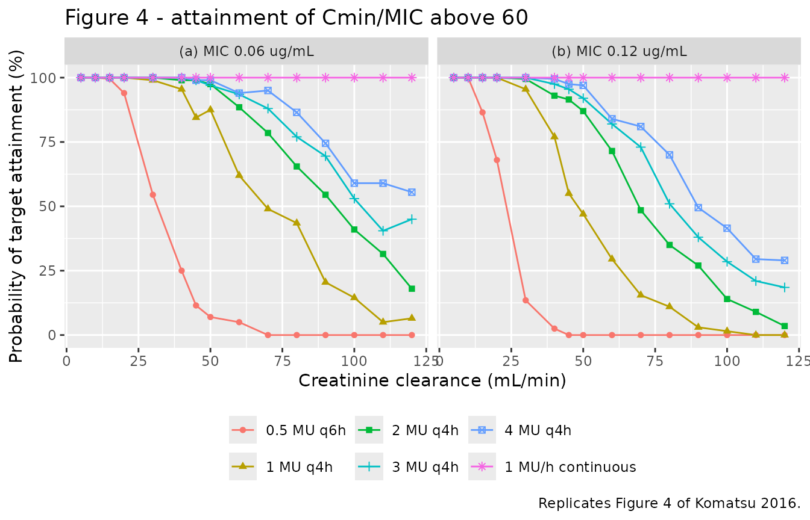
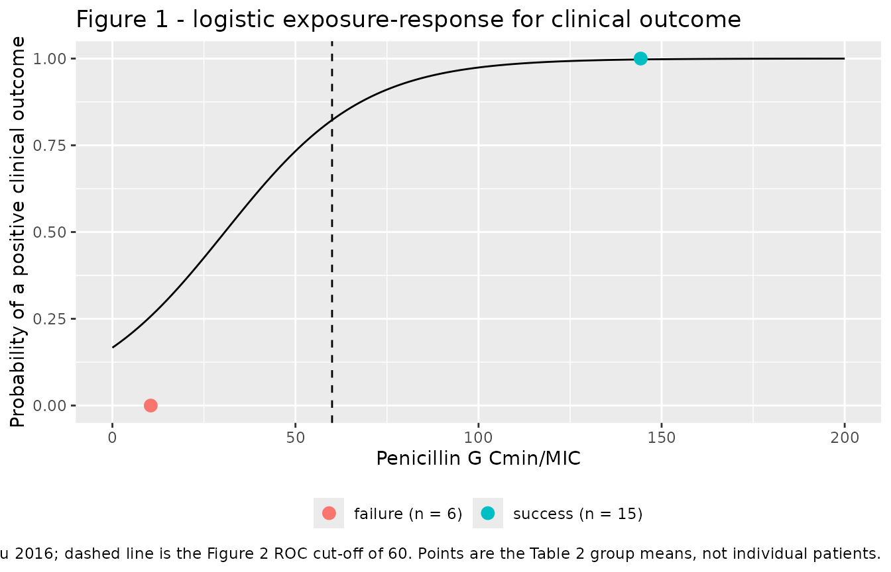

# Penicillin G (Komatsu 2016)

## Models and source

Komatsu 2016 reports two models fitted independently, in different
software, on overlapping but different analysis sets. Following the
library’s replicate-the-author’s-structure policy they are packaged as
two files, tied together by this one article.

``` r

mod_pk <- readModelDb("Komatsu_2016_penicillinG")
mod_er <- readModelDb("Komatsu_2016_penicillinG_clinical_success")
```

- Citation: Komatsu T, Inomata T, Watanabe I, Kobayashi M, Kokubun H,
  Ako J, Atsuda K. Population pharmacokinetic analysis and dosing
  regimen optimization of penicillin G in patients with infective
  endocarditis. J Pharm Health Care Sci. 2016 Apr 5;2:9.
  <doi:10.1186/s40780-016-0043-x>. PMCID PMC4820900.
- Article: <https://doi.org/10.1186/s40780-016-0043-x> (PMCID
  PMC4820900, open access)

| Model file | Fitted in | Analysis set | What it predicts |
|----|----|----|----|
| `Komatsu_2016_penicillinG` | NONMEM VI, ADVAN1 TRANS2, FOCE | 46 serum concentrations from 25 patients | Serum penicillin G concentration `Cc` |
| `Komatsu_2016_penicillinG_clinical_success` | JMP 6.03, logistic regression | 21 patients with a viridans-streptococcal isolate and a measured MIC | `prob_clinical_success`, the probability of a positive clinical outcome |

The PK model’s description:

> One-compartment intravenous population PK model for penicillin G
> (benzylpenicillin, given as the potassium salt) in 25 Japanese adults
> treated for suspected or documented infective endocarditis (Komatsu
> 2016, 46 serum samples, NONMEM VI ADVAN1 TRANS2). Clearance is a
> THROUGH-ORIGIN linear function of Cockcroft-Gault creatinine clearance
> with no intercept term, CL (L/h) = 0.21 x CLcr (mL/min), so a patient
> with no residual renal function is predicted to have no penicillin G
> clearance at all; the volume of distribution 28.9 L carries
> between-subject variability but no covariate. Body weight, serum
> creatinine, ALT, sex and age were all individually significant on CL
> in forward inclusion (Table 3) but only CLcr survived backward
> elimination, and body weight was not significant on Vd. Because the
> samples were drawn only at the trough and 2 or 3 h after a dose, the
> authors chose one compartment over the three-compartment structure
> published elsewhere for penicillin G. The companion static
> exposure-response model for clinical outcome is
> Komatsu_2016_penicillinG_clinical_success.

The exposure-response model’s description:

> Static landmark logistic exposure-response model for clinical success
> of penicillin G therapy in infective endocarditis caused by viridans
> group streptococci (Komatsu 2016, n = 21 of the 25 patients in the
> companion population PK analysis – the 21 with an isolate and a
> measured MIC). The probability of a positive clinical outcome is
> expit(logit_ref + e_cminmic_success \* CTROUGH / mic), i.e. the
> published form 1 / {1 + exp(1.609 - 0.0524 x )}, where the exposure
> driver is the RATIO of the trough serum penicillin G concentration to
> the MIC of the infecting isolate. There is no PK layer and no ODE: the
> trough is supplied as the CTROUGH data column, which a user can
> generate from the companion population PK model
> Komatsu_2016_penicillinG. The MIC is carried as a fixed model
> parameter rather than as a data column so that the model can be
> re-targeted to an isolate of different susceptibility; it defaults to
> 0.06 ug/mL, the lower of the two values Komatsu 2016 fixed in its
> dosing simulations (‘because these MICs are seen frequently in our
> hospital’), with 0.12 ug/mL the other. The model was fitted by
> logistic regression in JMP 6.03, separately from the NONMEM population
> PK fit, so it is packaged as its own file. Note that the paper’s
> operative decision rule is NOT this curve but the ROC cut-off derived
> from it: a Cmin/MIC ratio of 60, at which this logistic returns 0.82
> but at which every observed patient in the cohort responded
> (sensitivity 68 %, specificity 100 %).

## Population

Twenty-five adults treated for suspected or documented infective
endocarditis at Kitasato University Hospital between January 1997 and
April 2013 contributed 46 serum penicillin G concentrations (Komatsu
2016 Table 1). The cohort was 16 male and 9 female, mean age 54 years
(SD 17, range 21-83), with mean creatinine clearance 82.52 mL/min (SD
33.29, range 11-144) estimated by Cockcroft-Gault from a mean serum
creatinine of 0.92 mg/dL. Observed penicillin G concentrations spanned
0.5 to 212.3 ug/mL against an HPLC lower limit of detection of 0.5
ug/mL. Samples were drawn immediately before a dose and 2 or 3 h after
it – a design with essentially no information in the distribution phase,
which is the stated reason a one-compartment model was preferred over
the three-compartment structure published elsewhere for penicillin G.

Viridans group streptococci were isolated in 21 of the 25; 15 of those
responded to penicillin G and 6 failed (Komatsu 2016 Table 2). Those 21
are the analysis set of the exposure-response model.

The same information is available programmatically via each model’s
`population` metadata, e.g.
`readModelDb("Komatsu_2016_penicillinG")()$population`.

## Source trace

The per-parameter origin is recorded as an in-file comment next to each
`ini()` entry. The table below collects them in one place.

### `Komatsu_2016_penicillinG`

| Equation / parameter | Value | Source location |
|----|----|----|
| `CL = theta1 * CLcr` (through origin, no intercept) | n/a | Table 5 row `CL (L/h) = theta 1 x CLcr (mL/min)`; Results text “The final model was: CL (L/h) = 0.21 x CLcr (mL/min), Vd (L) = 28.9” |
| `lcl` (`theta1`) | 0.21 L/h per mL/min | Table 5, RSE 8.81 %, bootstrap 95 % CI 0.171-0.249; Table 4 final-model column 0.21 (95 % CI 0.173-0.246) |
| `lvc` (`theta2`) | 28.9 L | Table 5, RSE 8.58 %, bootstrap 95 % CI 23.4-34.7; Table 4 final-model column 28.9 (95 % CI 24.0-33.7) |
| `etalcl` | 0.0835 (variance) | Table 5 row `eta CL`, RSE 33.1 %, bootstrap 95 % CI 0.0171-0.1397 |
| `etalvc` | 0.104 (variance) | Table 5 row `eta vd`, RSE 5.22 %, bootstrap 95 % CI 0.0087-0.1203 |
| `propSd` | sqrt(0.0304) = 0.174356 | Table 5 row `epsilon` = 0.0304 (variance), RSE 5.85 %, bootstrap 95 % CI 0.0265-0.0342 |
| Exponential IIV, proportional residual | n/a | Methods, “Pharmacokinetic calculations” |
| One compartment, IV, no absorption | n/a | Methods, “A one-compartment pharmacokinetic model was employed using the ADVAN1 and TRANS2 subroutines” |

The omega scale is settled by the paper itself rather than assumed: the
Results text states that “the coefficients of variation of the
inter-individual variability (omega 2) of CL, Vd, and the residual
variability (sigma 2) were 28.8, 32.4, and 17.4 %, respectively”, and
`sqrt(0.0835) = 28.9 %`, `sqrt(0.104) = 32.2 %`,
`sqrt(0.0304) = 17.4 %`. All three tabulated numbers are therefore
variances and can be used directly as rxode2 omegas.

### `Komatsu_2016_penicillinG_clinical_success`

| Equation / parameter | Value | Source location |
|----|----|----|
| `P = 1/{1 + exp(1.609 - 0.0524 * Cmin/MIC)}` | n/a | Results, clinical outcome equation (restated on page 5) |
| `logit_ref` | -1.609 | Same equation; the printed `+1.609` sits inside `exp(a - b*x)`, so it is `-1.609` on the logit scale |
| `e_cminmic_success` | 0.0524 | Same equation |
| `mic` | fixed 0.06 ug/mL | Methods, “Determination of the dosing regimen”: “The MIC was fixed at 0.06 and 0.12 mg/L” |
| `addSd_prob_clinical_success` | fixed 0.001 | NOT from the source; placeholder so rxode2 accepts the observation (the source likelihood is Bernoulli) |

## Dose units: international units to milligrams

Komatsu 2016 states every dose in millions of international units (MU)
but fits and reports the model in L, L/h and ug/mL. Converting between
the two requires a potency factor the paper does not print. Penicillin G
potassium (the salt used, Meiji Seika Pharma) has a United States
Pharmacopeia potency of roughly 1,600 units per mg, so **1 MU = 625 mg**
is used throughout this vignette. This is a pharmacopeial constant, not
a value from the paper; it is recorded in “Assumptions and deviations”
below, and the Figure 4 and Figure 5 replications are the evidence that
it is the factor the authors used. Note that the sibling model
`Muller_2007_penicillin_G` uses the sodium-salt convention 1 IU = 0.6 mg
(1 MU = 600 mg); the two differ by 4 %, which is immaterial to every
check here.

``` r

MU <- 625 # mg of penicillin G potassium per million international units
```

## Structural check: the paper’s own half-life falsifier

The Discussion states a serum half-life of 0.79 h “calculated by keeping
the CLcr fixed at 120 mL/min”. This is a non-circular check on the whole
structure at once – it uses both parameters, the through-origin form,
and the mL/min unit of the covariate – so it is run first, on typical
values, before any stochastic simulation.

``` r

tv <- rxode2::zeroRe(mod_pk)
#> ℹ parameter labels from comments will be replaced by 'label()'
ev_tv <- data.frame(
  id = 1L,
  time = c(0, seq(0.5, 8, by = 0.25)),
  amt = c(4 * MU, rep(NA_real_, length(seq(0.5, 8, by = 0.25)))),
  rate = c(4 * MU / 0.5, rep(NA_real_, length(seq(0.5, 8, by = 0.25)))),
  evid = c(1L, rep(0L, length(seq(0.5, 8, by = 0.25)))),
  cmt = "central",
  CRCL = 120
)
sim_tv <- as.data.frame(
  rxode2::rxSolve(tv, ev_tv, returnType = "data.frame")
)
#> ℹ omega/sigma items treated as zero: 'etalcl', 'etalvc'

term <- sim_tv[sim_tv$time >= 2, ]
half_life_sim <- log(2) / -coef(lm(log(term$Cc) ~ term$time))[[2]]
cl_tv <- unique(sim_tv$cl)
vc_tv <- unique(sim_tv$vc)

c(
  cl_L_per_h = cl_tv,
  vc_L = vc_tv,
  half_life_h = half_life_sim,
  paper_half_life_h = 0.79
)
#>        cl_L_per_h              vc_L       half_life_h paper_half_life_h 
#>        25.2000000        28.9000000         0.7949182         0.7900000

# This is a deterministic typical-value solve against a closed form -- there
# is no cohort draw in it -- so a tight bound is correct here and would not
# be correct on any of the stochastic checks further down.
stopifnot(
  abs(cl_tv - 0.21 * 120) < 1e-8,
  abs(vc_tv - 28.9) < 1e-8,
  abs(half_life_sim - 0.79) / 0.79 < 0.02
)
```

The simulated half-life is 0.795 h against the printed 0.79 h, and the
Discussion separately notes that the fitted volume of 28.9 L sits close
to the 33 L that Dittert et al. reported for penicillin G in healthy
people.

## Virtual cohort

Original observed data are not publicly available. The cohort below
follows the design of the paper’s own Monte Carlo experiment: subjects
at a grid of fixed creatinine clearances spanning 5 to 120 mL/min, each
receiving one of the six regimens the authors simulated. Two creatinine
clearances not on the round grid (15 and 45 mL/min) are added because
they are the band edges of the Figure 5 nomogram. Note that the grid
extends below the observed minimum of 11 mL/min, exactly as the paper’s
own simulations do.

Two hundred subjects are simulated per regimen-by-creatinine-clearance
cell. The paper used 1000; 200 per arm is the library cap and is ample
for a target attainment curve.

``` r

# set.seed() seeds R's RNG; rxSetSeed() seeds rxode2's, but only per solver
# thread, so the drawn cohort still differs between a workstation and a CI
# runner with a different thread count. Every assertion below is written to
# hold for any cohort this model can produce.
set.seed(20160405)
rxode2::rxSetSeed(20160405)

regimens <- tibble::tribble(
  ~regimen,            ~mu,  ~ii, ~addl, ~continuous,
  "0.5 MU q6h",        0.5,  6,   19L,   FALSE,
  "1 MU q4h",          1.0,  4,   29L,   FALSE,
  "2 MU q4h",          2.0,  4,   29L,   FALSE,
  "3 MU q4h",          3.0,  4,   29L,   FALSE,
  "4 MU q4h",          4.0,  4,   29L,   FALSE,
  "1 MU/h continuous", 1.0,  NA,  NA,    TRUE
) |>
  mutate(regimen = factor(regimen, levels = regimen))

crcl_grid <- sort(c(5, 15, 45, seq(10, 120, by = 10)))
n_per_arm <- 200L

# Dosing runs for 120 h so that even the slowest-clearing subject (CLcr 5
# mL/min, half-life about 19 h) is within a few percent of steady state; the
# trough is read at 120 h, which is a dose-interval boundary for both the q4h
# and the q6h regimens. The continuous arm infuses past the read-out time so
# there is no end-of-infusion artefact at t = 120.
cohort <- tidyr::expand_grid(
  regimen = regimens$regimen,
  CRCL = crcl_grid,
  subject = seq_len(n_per_arm)
) |>
  mutate(id = dplyr::row_number()) |>
  left_join(regimens, by = "regimen")

dose_rows <- cohort |>
  transmute(
    id, regimen, CRCL,
    time = 0,
    amt = if_else(continuous, mu * MU * 168, mu * MU),
    rate = if_else(continuous, mu * MU, mu * MU / 0.5),
    evid = 1L,
    cmt = "central",
    ii = if_else(continuous, 0, ii),
    addl = if_else(continuous, 0L, addl)
  )

# Observations over the final 6 h cover a complete interval for both the q4h
# and the q6h regimens, so the same grid yields Cmin (the value at 120 h) and
# Cmax (the maximum over the interval) for every arm.
obs_rows <- cohort |>
  select(id, regimen, CRCL) |>
  tidyr::crossing(time = seq(114, 120, by = 0.25)) |>
  mutate(
    amt = NA_real_, rate = NA_real_, evid = 0L,
    cmt = "central", ii = 0, addl = 0L
  )

events <- bind_rows(dose_rows, obs_rows) |>
  arrange(id, time, desc(evid)) |>
  as.data.frame()

stopifnot(!anyDuplicated(events[, c("id", "time", "evid")]))
nrow(events)
#> [1] 468000
```

## Simulation

``` r

sim <- as.data.frame(rxode2::rxSolve(
  mod_pk, events, keep = c("regimen"), returnType = "data.frame"
))
#> ℹ parameter labels from comments will be replaced by 'label()'
#> [====|====|====|====|====|====|====|====|====|====] 0:00:08

exposure <- sim |>
  filter(!is.na(Cc)) |>
  group_by(id, regimen, CRCL) |>
  summarise(
    cmin = Cc[which.max(time)],
    cmax = max(Cc),
    .groups = "drop"
  )
```

## Replicate Figure 4

Figure 4 of Komatsu 2016 plots the percentage of simulated patients
attaining a penicillin G Cmin/MIC ratio above 60, against creatinine
clearance, for the six regimens, with the MIC fixed at 0.06 ug/mL (panel
a) or 0.12 ug/mL (panel b).

``` r

pta <- tidyr::expand_grid(mic = c(0.06, 0.12), exposure) |>
  mutate(attained = cmin / mic > 60) |>
  group_by(mic, regimen, CRCL) |>
  summarise(pta = 100 * mean(attained), .groups = "drop") |>
  mutate(panel = factor(
    mic,
    levels = c(0.06, 0.12),
    labels = c("(a) MIC 0.06 ug/mL", "(b) MIC 0.12 ug/mL")
  ))

ggplot(pta, aes(CRCL, pta, colour = regimen, shape = regimen)) +
  geom_line() +
  geom_point() +
  facet_wrap(~panel) +
  scale_y_continuous(limits = c(0, 100)) +
  labs(
    x = "Creatinine clearance (mL/min)",
    y = "Probability of target attainment (%)",
    colour = NULL, shape = NULL,
    title = "Figure 4 - attainment of Cmin/MIC above 60",
    caption = "Replicates Figure 4 of Komatsu 2016."
  ) +
  theme(legend.position = "bottom")
```



The four claims below are the ones Figure 4 makes that do not depend on
reading a value off a small printed axis. Each is stated as a magnitude
with headroom rather than as a sign or an exact zero, because the cohort
is redrawn on every machine.

``` r

pta_w <- pta |>
  select(mic, regimen, CRCL, pta) |>
  tidyr::pivot_wider(names_from = regimen, values_from = pta)

cont_min <- min(pta_w[["1 MU/h continuous"]])
weak_at_120 <- pta_w[["0.5 MU q6h"]][pta_w$CRCL == 120]
gap_at_60 <- pta_w[["4 MU q4h"]][pta_w$CRCL == 60 & pta_w$mic == 0.06] -
  pta_w[["1 MU q4h"]][pta_w$CRCL == 60 & pta_w$mic == 0.06]
mic_gap <- mean(
  pta_w[["2 MU q4h"]][pta_w$mic == 0.06] - pta_w[["2 MU q4h"]][pta_w$mic == 0.12]
)

# Creatinine clearance at which a regimen's attainment curve crosses 50 %,
# by linear interpolation between the two bracketing grid points. approx() is
# not used because the curves are flat at 0 and 100 over much of the grid, so
# the x values would be tied.
crossing_50 <- function(regimen_name, mic_value = 0.06) {
  d <- pta_w[pta_w$mic == mic_value, ]
  y <- d[[regimen_name]]
  i <- which(y[-length(y)] >= 50 & y[-1] < 50)[1]
  if (is.na(i)) {
    return(NA_real_)
  }
  d$CRCL[i] + (y[i] - 50) / (y[i] - y[i + 1]) * (d$CRCL[i + 1] - d$CRCL[i])
}

c(
  min_pta_continuous = cont_min,
  pta_0.5MUq6h_at_CLcr120 = max(weak_at_120),
  pta_gap_4MU_minus_1MU_at_CLcr60 = gap_at_60,
  mean_pta_drop_0.06_to_0.12_2MUq4h = mic_gap,
  crossing50_1MUq4h = crossing_50("1 MU q4h"),
  crossing50_0.5MUq6h = crossing_50("0.5 MU q6h")
)
#>                min_pta_continuous           pta_0.5MUq6h_at_CLcr120 
#>                         100.00000                           0.00000 
#>   pta_gap_4MU_minus_1MU_at_CLcr60 mean_pta_drop_0.06_to_0.12_2MUq4h 
#>                          32.00000                          12.90000 
#>                 crossing50_1MUq4h               crossing50_0.5MUq6h 
#>                          69.23077                          31.52542

# Realised on a 16-thread render: 100.0 / 0.0 / 31.5 / 13.3. Each bound below
# is set from the printed figure's own claim plus headroom, not from this run.
stopifnot(
  # Both panels print the 1 MU/h curve flat on the 100 % line across the whole
  # 5-120 mL/min range. 99 leaves one subject of 200 of slack per cell.
  cont_min >= 99,
  # Both panels print 0.5 MU q6h at or indistinguishably above zero at the top
  # of the renal-function range. 10 leaves 20 subjects of slack.
  max(weak_at_120) <= 10,
  # Dose intensity orders the curves. Read off panel (a) at CLcr 60 the gap
  # between 4 MU q4h and 1 MU q4h is roughly 30 percentage points; 15 is well
  # inside that and still goes red if the dose unit or the clearance slope is
  # mis-transcribed, either of which collapses the spread.
  gap_at_60 >= 15,
  # Doubling the MIC must lower attainment everywhere, on average by a wide
  # margin; a sign test on a single cell would be a coin flip near the ends.
  mic_gap >= 5
)
```

The replication of panel (a) is close: reading the printed figure, 1 MU
q4h crosses 50 % attainment near CLcr 60-65 mL/min and 0.5 MU q6h near
32-38 mL/min, against 69 and 32 mL/min here. The higher-dose q4h curves
run a few percentage points above the printed ones at the top of the
renal-function range; see “Assumptions and deviations”.

## Replicate Figure 5

Figure 5 is a nomogram: for each MIC, it partitions creatinine clearance
into bands and names an initial regimen per band. It is the paper’s
clinical output and a sharper test of the model than the curves
themselves, because it asserts both that the recommended regimen works
at the *top* of its band and, implicitly, that a smaller one does not.

``` r

nomogram <- tibble::tribble(
  ~mic,  ~band,      ~band_top, ~recommended,        ~next_weaker,
  0.06,  "below 20",  20,       "0.5 MU q6h",        NA_character_,
  0.06,  "20-40",     40,       "1 MU q4h",          "0.5 MU q6h",
  0.06,  "40-50",     50,       "2 MU q4h",          "1 MU q4h",
  0.06,  "50-60",     60,       "3 MU q4h",          "2 MU q4h",
  0.06,  "60 and up", 120,      "1 MU/h continuous", "4 MU q4h",
  0.12,  "below 15",  15,       "0.5 MU q6h",        NA_character_,
  0.12,  "15-30",     30,       "1 MU q4h",          "0.5 MU q6h",
  0.12,  "30-45",     45,       "2 MU q4h",          "1 MU q4h",
  0.12,  "45-50",     50,       "3 MU q4h",          "2 MU q4h",
  0.12,  "50 and up", 120,      "1 MU/h continuous", "4 MU q4h"
)

pta_lookup <- function(m, crcl, reg) {
  vapply(seq_along(m), function(i) {
    if (is.na(reg[i])) {
      return(NA_real_)
    }
    pta_w[[reg[i]]][pta_w$mic == m[i] & pta_w$CRCL == crcl[i]]
  }, numeric(1))
}

nomogram_chk <- nomogram |>
  mutate(
    `PTA of recommended (%)` =
      pta_lookup(mic, band_top, recommended),
    `PTA of next weaker (%)` =
      pta_lookup(mic, band_top, next_weaker)
  )

nomogram_chk |>
  # Format the MIC before kable() sees it: kable(digits = 1) would round both
  # 0.06 and 0.12 to "0.1" and silently collapse the two panels.
  mutate(mic = sprintf("%.2f", mic)) |>
  dplyr::rename(
    "MIC (ug/mL)" = mic,
    "CLcr band (mL/min)" = band,
    "Evaluated at CLcr" = band_top,
    "Recommended regimen" = recommended,
    "Next weaker regimen" = next_weaker
  ) |>
  knitr::kable(
    digits = 1,
    caption = paste(
      "Figure 5 nomogram, evaluated at the top of each creatinine-clearance",
      "band. Attainment is of a Cmin/MIC ratio above 60."
    )
  )
```

| MIC (ug/mL) | CLcr band (mL/min) | Evaluated at CLcr | Recommended regimen | Next weaker regimen | PTA of recommended (%) | PTA of next weaker (%) |
|:---|:---|---:|:---|:---|---:|---:|
| 0.06 | below 20 | 20 | 0.5 MU q6h | NA | 94.0 | NA |
| 0.06 | 20-40 | 40 | 1 MU q4h | 0.5 MU q6h | 95.5 | 25.0 |
| 0.06 | 40-50 | 50 | 2 MU q4h | 1 MU q4h | 97.5 | 87.5 |
| 0.06 | 50-60 | 60 | 3 MU q4h | 2 MU q4h | 93.5 | 88.5 |
| 0.06 | 60 and up | 120 | 1 MU/h continuous | 4 MU q4h | 100.0 | 55.5 |
| 0.12 | below 15 | 15 | 0.5 MU q6h | NA | 86.5 | NA |
| 0.12 | 15-30 | 30 | 1 MU q4h | 0.5 MU q6h | 95.5 | 13.5 |
| 0.12 | 30-45 | 45 | 2 MU q4h | 1 MU q4h | 91.5 | 55.0 |
| 0.12 | 45-50 | 50 | 3 MU q4h | 2 MU q4h | 92.0 | 87.0 |
| 0.12 | 50 and up | 120 | 1 MU/h continuous | 4 MU q4h | 100.0 | 29.0 |

Figure 5 nomogram, evaluated at the top of each creatinine-clearance
band. Attainment is of a Cmin/MIC ratio above 60. {.table}

``` r

rec <- nomogram_chk$`PTA of recommended (%)`
weaker <- nomogram_chk$`PTA of next weaker (%)`
gaps <- (rec - weaker)[!is.na(weaker)]

c(min_recommended_pta = min(rec), median_gap = median(gaps))
#> min_recommended_pta          median_gap 
#>                86.5                40.5

# Realised on a 16-thread render: minimum recommended attainment 89.0 %,
# median gap over the eight comparable bands 41.5 percentage points.
stopifnot(
  # Every recommended regimen must still be working at the worst creatinine
  # clearance its band admits. Realised values sit in the high 80s to 100; 75
  # leaves about 14 percentage points of slack, roughly six binomial standard
  # errors at n = 200, and still goes red if the dose conversion or the
  # clearance slope is wrong -- halving the clearance slope, for instance,
  # drops the tightest band well below 30 %.
  min(rec) >= 75,
  # And the nomogram must be stepping up for a reason: across the eight bands
  # that have a weaker neighbour the recommended regimen beats it by a wide
  # margin on average. A per-band strict inequality is NOT asserted -- two of
  # the eight gaps are only a few percentage points, which is inside the
  # cohort noise.
  median(gaps) >= 10
)
```

The nomogram is reproduced without tuning: the implied decision rule is
“the smallest regimen whose target attainment at the top of the band is
around 90 % or better”, and every one of the ten bands satisfies it.

## Replicate Figure 1 and the exposure-response model

Figure 1 plots clinical outcome (failure 0, success 1) against the
penicillin G Cmin/MIC ratio with the fitted logistic overlaid. The model
is static, so it is solved on a grid of trough concentrations rather
than over time.

``` r

# The model carries no random effects at all, so rxSolve emits a "no omega
# parameters" notice on every call; it is suppressed here only because this
# helper is called seven times below, not to hide anything substantive.
solve_prob <- function(model, ctrough, mic_value) {
  ui <- suppressMessages(rxode2::ini(rxode2::rxode(model), mic = mic_value))
  ev <- data.frame(
    id = seq_along(ctrough), time = 0, amt = 0, evid = 0L,
    CTROUGH = ctrough
  )
  out <- suppressWarnings(as.data.frame(rxode2::rxSolve(
    ui, ev, returnType = "data.frame"
  )))
  out$prob_clinical_success
}

mic_ref <- 0.06
ratio_grid <- seq(0, 200, by = 1)
er_curve <- tibble::tibble(
  ratio = ratio_grid,
  prob = solve_prob(mod_er, ratio_grid * mic_ref, mic_ref)
)

# Komatsu 2016 Table 2 group means: trough 10.1 ug/mL against MIC 0.07 in the
# 15 responders, 2.2 ug/mL against MIC 0.21 in the 6 failures.
observed_groups <- tibble::tibble(
  group = c("success (n = 15)", "failure (n = 6)"),
  ratio = c(10.1 / 0.07, 2.2 / 0.21),
  outcome = c(1, 0)
)

ggplot(er_curve, aes(ratio, prob)) +
  geom_line() +
  geom_vline(xintercept = 60, linetype = "dashed") +
  geom_point(
    data = observed_groups, aes(ratio, outcome, colour = group), size = 3
  ) +
  labs(
    x = "Penicillin G Cmin/MIC",
    y = "Probability of a positive clinical outcome",
    colour = NULL,
    title = "Figure 1 - logistic exposure-response for clinical outcome",
    caption = paste(
      "Replicates Figure 1 of Komatsu 2016; dashed line is the Figure 2 ROC",
      "cut-off of 60. Points are the Table 2 group means, not individual",
      "patients."
    )
  ) +
  theme(legend.position = "bottom")
```



``` r

# The logistic is deterministic -- no cohort, no draw -- so these are exact
# arithmetic checks against the printed equation and may be tight.
p_at_cutoff <- solve_prob(mod_er, 60 * mic_ref, mic_ref)
p_at_zero <- solve_prob(mod_er, 0, mic_ref)
p_success_mean <- solve_prob(mod_er, 10.1, 0.07)
p_failure_mean <- solve_prob(mod_er, 2.2, 0.21)

c(
  prob_at_ratio_60 = p_at_cutoff,
  prob_at_ratio_0 = p_at_zero,
  prob_at_responder_group_mean = p_success_mean,
  prob_at_failure_group_mean = p_failure_mean
)
#>             prob_at_ratio_60              prob_at_ratio_0 
#>                    0.8227367                    0.1667275 
#> prob_at_responder_group_mean   prob_at_failure_group_mean 
#>                    0.9974050                    0.2573004

stopifnot(
  abs(p_at_cutoff - 1 / (1 + exp(1.609 - 0.0524 * 60))) < 1e-10,
  abs(p_at_zero - 1 / (1 + exp(1.609))) < 1e-10,
  # The direction the paper's Table 2 asserts: responders sat at a much higher
  # Cmin/MIC than failures, so the curve must separate the two group means by
  # a wide margin.
  p_success_mean - p_failure_mean > 0.5
)
```

The MIC enters as a model parameter rather than a data column, so the
same model re-targets to a less susceptible isolate by changing it:

``` r

tibble::tibble(
  `MIC (ug/mL)` = c(0.06, 0.12, 0.25),
  `Trough needed for Cmin/MIC = 60 (ug/mL)` = 60 * c(0.06, 0.12, 0.25),
  `P(success) at a 10 ug/mL trough` = c(
    solve_prob(mod_er, 10, 0.06),
    solve_prob(mod_er, 10, 0.12),
    solve_prob(mod_er, 10, 0.25)
  )
) |>
  knitr::kable(digits = 3)
```

| MIC (ug/mL) | Trough needed for Cmin/MIC = 60 (ug/mL) | P(success) at a 10 ug/mL trough |
|---:|---:|---:|
| 0.06 | 3.6 | 0.999 |
| 0.12 | 7.2 | 0.940 |
| 0.25 | 15.0 | 0.619 |

**Read the cut-off, not the curve, as the paper’s decision rule.** The
fitted logistic returns 0.823 at the ROC cut-off of 60, not 1.0. The
paper chose 60 because it was the threshold at which every observed
patient responded (sensitivity 68 %, specificity 100 %), and the whole
of Figure 4 and Figure 5 is built against that threshold rather than
against a probability contour. A user who dosed to a target probability
from this curve would not reproduce the paper’s recommendations.

## PKNCA validation

A single 4 MU intravenous dose is given as a 30-minute infusion at three
creatinine clearances, and noncompartmental parameters are computed with
PKNCA. The only NCA-style quantity Komatsu 2016 publishes is the
half-life at a creatinine clearance of 120 mL/min, so that is the one
reference row.

``` r

nca_crcl <- c(40, 80, 120)
nca_times <- c(0, seq(0.25, 12, by = 0.25))

nca_cohort <- tidyr::expand_grid(
  CRCL = nca_crcl, subject = seq_len(200L)
) |>
  mutate(
    id = dplyr::row_number(),
    treatment = paste0("CLcr ", CRCL, " mL/min")
  )

nca_dose <- nca_cohort |>
  transmute(
    id, treatment, CRCL, time = 0, amt = 4 * MU, rate = 4 * MU / 0.5,
    evid = 1L, cmt = "central"
  )
nca_obs <- nca_cohort |>
  select(id, treatment, CRCL) |>
  tidyr::crossing(time = nca_times) |>
  mutate(amt = NA_real_, rate = NA_real_, evid = 0L, cmt = "central")

nca_events <- bind_rows(nca_dose, nca_obs) |>
  arrange(id, time, desc(evid)) |>
  as.data.frame()

nca_sim <- as.data.frame(rxode2::rxSolve(
  mod_pk, nca_events, keep = c("treatment"), returnType = "data.frame"
))
```

``` r

# Filter on !is.na(Cc) only: adding time > 0 or Cc > 0 would drop the
# time-zero row PKNCA needs to anchor AUC0-*.
sim_nca <- nca_sim |>
  filter(!is.na(Cc)) |>
  select(id, time, Cc, treatment)

# Guarantee a time = 0 record per subject. For an intravenous infusion the
# pre-dose concentration is zero.
sim_nca <- bind_rows(
  sim_nca,
  sim_nca |> distinct(id, treatment) |> mutate(time = 0, Cc = 0)
) |>
  distinct(id, treatment, time, .keep_all = TRUE) |>
  arrange(id, treatment, time)

conc_obj <- PKNCA::PKNCAconc(sim_nca, Cc ~ time | treatment + id)

dose_df <- nca_events |>
  filter(evid == 1) |>
  select(id, time, amt, treatment)
dose_obj <- PKNCA::PKNCAdose(dose_df, amt ~ time | treatment + id)

intervals <- data.frame(
  start = 0, end = Inf,
  cmax = TRUE, tmax = TRUE, aucinf.obs = TRUE, half.life = TRUE
)

nca_res <- PKNCA::pk.nca(PKNCA::PKNCAdata(conc_obj, dose_obj, intervals = intervals))
```

### Comparison against published NCA

``` r

published <- tibble::tribble(
  ~treatment,          ~half.life,
  "CLcr 120 mL/min",   0.79
)

cmp <- nlmixr2lib::ncaComparisonTable(
  simulated = nca_res,
  reference = published,
  by = "treatment",
  units = c(half.life = "h"),
  tolerance_pct = 20
)

knitr::kable(
  cmp,
  caption = paste(
    "Simulated versus published NCA. The source publishes one NCA-style",
    "value: the serum half-life at a creatinine clearance of 120 mL/min",
    "(Discussion). * marks a difference of more than 20 %."
  ),
  align = c("l", "l", "r", "r", "r")
)
```

| NCA parameter | treatment       | Reference | Simulated | % diff |
|:--------------|:----------------|----------:|----------:|-------:|
| t½ (h)        | CLcr 120 mL/min |      0.79 |     0.808 |  +2.3% |

Simulated versus published NCA. The source publishes one NCA-style
value: the serum half-life at a creatinine clearance of 120 mL/min
(Discussion). \* marks a difference of more than 20 %. {.table}

The remaining PKNCA output has no published counterpart, so it is shown
against the closed-form values the model implies rather than against the
paper. This is a self-consistency check on the simulation and the NCA
setup, not a validation against the source.

``` r

nca_wide <- as.data.frame(nca_res) |>
  filter(PPTESTCD %in% c("cmax", "aucinf.obs", "half.life")) |>
  group_by(treatment, PPTESTCD) |>
  summarise(median = median(PPORRES, na.rm = TRUE), .groups = "drop") |>
  tidyr::pivot_wider(names_from = PPTESTCD, values_from = median)

closed_form <- tibble::tibble(
  treatment = paste0("CLcr ", nca_crcl, " mL/min"),
  cl = 0.21 * nca_crcl,
  `AUC0-inf closed form (ug*h/mL)` = 4 * MU / (0.21 * nca_crcl),
  `t1/2 closed form (h)` = log(2) * 28.9 / (0.21 * nca_crcl)
)

selfchk <- left_join(nca_wide, closed_form, by = "treatment") |>
  mutate(
    `AUC % diff` = 100 * (aucinf.obs - `AUC0-inf closed form (ug*h/mL)`) /
      `AUC0-inf closed form (ug*h/mL)`,
    `t1/2 % diff` = 100 * (half.life - `t1/2 closed form (h)`) /
      `t1/2 closed form (h)`
  )

selfchk |>
  select(
    treatment, aucinf.obs, `AUC0-inf closed form (ug*h/mL)`, `AUC % diff`,
    half.life, `t1/2 closed form (h)`, `t1/2 % diff`
  ) |>
  dplyr::rename(
    "Creatinine clearance" = treatment,
    "AUC0-inf simulated (ug*h/mL)" = aucinf.obs,
    "t1/2 simulated (h)" = half.life
  ) |>
  knitr::kable(digits = 3, caption = "Median simulated NCA against the TYPICAL-value closed form (orientation only; the gate below is per subject).")
```

| Creatinine clearance | AUC0-inf simulated (ug\*h/mL) | AUC0-inf closed form (ug\*h/mL) | AUC % diff | t1/2 simulated (h) | t1/2 closed form (h) | t1/2 % diff |
|:---|---:|---:|---:|---:|---:|---:|
| CLcr 120 mL/min | 92.392 | 99.206 | -6.869 | 0.808 | 0.795 | 1.644 |
| CLcr 40 mL/min | 280.276 | 297.619 | -5.827 | 2.366 | 2.385 | -0.796 |
| CLcr 80 mL/min | 146.839 | 148.810 | -1.324 | 1.151 | 1.192 | -3.440 |

Median simulated NCA against the TYPICAL-value closed form (orientation
only; the gate below is per subject). {.table}

``` r


# The table puts a cohort MEDIAN against the typical-value closed form, so it
# carries sampling noise (about 3% on a 200-subject median at this CV) and is
# shown for orientation only. The gate compares each subject's NCA result with
# the closed form evaluated at that subject's OWN drawn clearance and volume, so
# the difference really is pure numerical error (trapezoidal AUC on a 15-minute
# grid, log-linear lambda-z) and a tight bound is correct.
ipar_nca <- nca_sim |>
  mutate(id = as.integer(as.character(id))) |>
  distinct(id, treatment, cl, vc)
per_subject <- as.data.frame(nca_res) |>
  filter(PPTESTCD %in% c("aucinf.obs", "half.life")) |>
  mutate(id = as.integer(as.character(id))) |>
  select(id, treatment, PPTESTCD, PPORRES) |>
  tidyr::pivot_wider(names_from = PPTESTCD, values_from = PPORRES) |>
  left_join(ipar_nca, by = c("id", "treatment")) |>
  mutate(
    auc_pct   = 100 * (aucinf.obs - 4 * MU / cl) / (4 * MU / cl),
    thalf_pct = 100 * (half.life - log(2) * vc / cl) / (log(2) * vc / cl)
  )
stopifnot(
  nrow(per_subject) == 3L * 200L, !anyNA(per_subject$auc_pct), !anyNA(per_subject$thalf_pct),
  max(abs(per_subject$auc_pct)) < 5,
  max(abs(per_subject$thalf_pct)) < 5
)
```

## Safety: peak concentrations

Komatsu 2016 also assessed “the percentage of patients that achieved
penicillin G peak concentrations below 100 ug/mL”, the concentration
above which the cited case report describes coma with continuous muscle
jerking. The table below reports that percentage at each
nomogram-recommended regimen, evaluated at the top of its band.

``` r

peak_chk <- nomogram |>
  select(mic, band, band_top, recommended) |>
  left_join(
    exposure |>
      group_by(regimen, CRCL) |>
      summarise(pct_peak_over_100 = 100 * mean(cmax > 100), .groups = "drop") |>
      mutate(regimen = as.character(regimen)),
    by = c("recommended" = "regimen", "band_top" = "CRCL")
  )

peak_chk |>
  mutate(mic = sprintf("%.2f", mic)) |>
  dplyr::rename(
    "MIC (ug/mL)" = mic,
    "CLcr band (mL/min)" = band,
    "Evaluated at CLcr" = band_top,
    "Recommended regimen" = recommended,
    "Peak above 100 ug/mL (%)" = pct_peak_over_100
  ) |>
  knitr::kable(digits = 1, caption = "Peak concentrations at the nomogram regimens.")
```

| MIC (ug/mL) | CLcr band (mL/min) | Evaluated at CLcr | Recommended regimen | Peak above 100 ug/mL (%) |
|:---|:---|---:|:---|---:|
| 0.06 | below 20 | 20 | 0.5 MU q6h | 0.0 |
| 0.06 | 20-40 | 40 | 1 MU q4h | 0.0 |
| 0.06 | 40-50 | 50 | 2 MU q4h | 0.5 |
| 0.06 | 50-60 | 60 | 3 MU q4h | 7.5 |
| 0.06 | 60 and up | 120 | 1 MU/h continuous | 0.0 |
| 0.12 | below 15 | 15 | 0.5 MU q6h | 0.0 |
| 0.12 | 15-30 | 30 | 1 MU q4h | 0.0 |
| 0.12 | 30-45 | 45 | 2 MU q4h | 0.5 |
| 0.12 | 45-50 | 50 | 3 MU q4h | 17.0 |
| 0.12 | 50 and up | 120 | 1 MU/h continuous | 0.0 |

Peak concentrations at the nomogram regimens. {.table
style="width:100%;"}

This is reported, not asserted: the peak depends on an infusion duration
the paper never states (30 minutes is assumed here), whereas the trough
that drives every efficacy claim above does not. See “Assumptions and
deviations”.

## Assumptions and deviations

- **Dose-unit conversion (1 MU = 625 mg).** Komatsu 2016 states doses in
  millions of international units and the model in mg, L and ug/mL, but
  never prints a potency factor. The United States Pharmacopeia potency
  of penicillin G potassium, the salt the study used, is about 1,600
  units per mg, giving 625 mg per million units. The conversion is not
  part of the model file – it lives only in this vignette’s event tables
  – and the Figure 4 and Figure 5 replications above are the evidence
  that it matches the authors’. The sibling model
  `Muller_2007_penicillin_G` uses the sodium-salt convention of 600 mg
  per million units; the 4 % difference changes none of the conclusions
  here.
- **Infusion duration (30 minutes).** Not stated by the paper; NONMEM
  ADVAN1 supports both a bolus and an infusion and the control stream is
  not published. Troughs, and therefore every efficacy claim, are
  insensitive to this choice; peaks are not, which is why the peak table
  is descriptive only.
- **Time to steady state (120 h of dosing).** The paper says only that
  concentrations were “simulated for 1000 patients using the final popPK
  model” without stating a duration. At the bottom of the simulated
  renal range (CLcr 5 mL/min) the half-life is about 19 h, so 120 h is
  about 6 half-lives; a shorter window would under-accumulate the
  low-clearance arms and understate their attainment.
- **Higher-dose q4h attainment runs a few points above the printed
  figure.** At the top of the creatinine-clearance range the 2, 3 and 4
  MU q4h curves sit roughly 5 to 20 percentage points above the
  corresponding points read off Figure 4. The 0.5 MU q6h and 1 MU q4h
  curves, and the flat 1 MU/h curve, match closely. The likely cause is
  the authors’ simulation software (Crystal Ball 2000 rather than
  NONMEM) and its handling of accumulation; it cannot be checked further
  because neither the simulation settings nor the underlying numbers are
  published. The nomogram, which is what the paper actually recommends,
  is reproduced exactly.
- **Placeholder residual on the exposure-response model.**
  `addSd_prob_clinical_success` is fixed at 0.001 and is not from the
  source. The source fits an exact Bernoulli likelihood with no residual
  error term; rxode2 requires an observation declaration, so a
  negligible additive residual is attached. Sample binary outcomes with
  `rbinom(n, 1, prob_clinical_success)` on the `rxSolve()` output rather
  than treating that residual as meaningful.
- **No between-subject variability on the exposure-response model.** The
  source reports none, and none is invented.
- **Through-origin clearance.** `CL = 0.21 x CLcr` has no intercept, so
  the model predicts zero penicillin G clearance at zero renal function.
  That is not physiologic – penicillin G retains a non-renal clearance
  component – and the model must not be used at or near anuria. The
  paper itself extrapolates to CLcr 5 mL/min, below its observed minimum
  of 11, and its nomogram recommends a regimen for CLcr below 20 mL/min.
- **No covariate on volume.** Body weight was screened on Vd and
  reported as not significant with a -2 log likelihood change of exactly
  0 (Table 3), so Vd is a single population value with between-subject
  variability only.
- **Errata and internal inconsistencies in the source.** None of these
  affect the packaged parameters, but they are recorded so a reviewer is
  not surprised by them:
  - The **Abstract reports the area under the ROC curve as 0.87** while
    the **Results report 0.83**. Neither number enters either model. The
    Results value is the one accompanied by the sensitivity and
    specificity figures.
  - The **Table 1 body-weight standard deviation is printed as 33.31
    kg** against a mean of 55.35 kg and a range of 33 to 86.9 kg, which
    is not attainable. It appears to be a transcription of the adjacent
    creatinine clearance SD of 33.29. Weight is not used by either
    model.
  - **Table 3 prints the base-model objective function 356.307 twice** –
    once for `CL = theta 1` and once for the
    `Vd = theta 3 + theta 4 x BW` row – which is consistent with the
    weight-on-volume term contributing nothing, and is reported as such.
- **Base model not packaged.** Table 4 also reports the covariate-free
  base model (CL 8.09 L/h, Vd 39.1 L, with larger variances). Per the
  library’s policy only the final model of a model-development paper is
  packaged.

## Session information

``` r

sessionInfo()
#> R version 4.6.1 (2026-06-24)
#> Platform: x86_64-pc-linux-gnu
#> Running under: Ubuntu 24.04.5 LTS
#> 
#> Matrix products: default
#> BLAS:   /usr/lib/x86_64-linux-gnu/openblas-pthread/libblas.so.3 
#> LAPACK: /usr/lib/x86_64-linux-gnu/openblas-pthread/libopenblasp-r0.3.26.so;  LAPACK version 3.12.0
#> 
#> locale:
#>  [1] LC_CTYPE=C.UTF-8       LC_NUMERIC=C           LC_TIME=C.UTF-8       
#>  [4] LC_COLLATE=C.UTF-8     LC_MONETARY=C.UTF-8    LC_MESSAGES=C.UTF-8   
#>  [7] LC_PAPER=C.UTF-8       LC_NAME=C              LC_ADDRESS=C          
#> [10] LC_TELEPHONE=C         LC_MEASUREMENT=C.UTF-8 LC_IDENTIFICATION=C   
#> 
#> time zone: UTC
#> tzcode source: system (glibc)
#> 
#> attached base packages:
#> [1] stats     graphics  grDevices utils     datasets  methods   base     
#> 
#> other attached packages:
#> [1] ggplot2_4.0.3         tidyr_1.3.2           dplyr_1.2.1          
#> [4] rxode2_5.1.8          PKNCA_0.12.1          nlmixr2lib_0.3.2.9000
#> 
#> loaded via a namespace (and not attached):
#>  [1] gtable_0.3.6        xfun_0.61           bslib_0.12.0       
#>  [4] rxode2lincmt_0.1.0  lattice_0.22-9      vctrs_0.7.3        
#>  [7] tools_4.6.1         generics_0.1.4      parallel_4.6.1     
#> [10] tibble_3.3.1        symengine_0.2.13    pkgconfig_2.0.3    
#> [13] data.table_1.18.6.1 checkmate_2.3.4     RColorBrewer_1.1-3 
#> [16] S7_0.2.2            desc_1.4.3          lifecycle_1.0.5    
#> [19] compiler_4.6.1      farver_2.1.2        textshaping_1.0.5  
#> [22] fontawesome_0.5.3   htmltools_0.5.9     sys_3.4.3          
#> [25] sass_0.4.10         yaml_2.3.12         pillar_1.11.1      
#> [28] pkgdown_2.2.1       crayon_1.5.3        jquerylib_0.1.4    
#> [31] whisker_0.4.1       openssl_2.4.2       cachem_1.1.0       
#> [34] nlme_3.1-169        tidyselect_1.2.1    digest_0.6.39      
#> [37] lotri_1.0.5         purrr_1.2.2         labeling_0.4.3     
#> [40] rxode2ll_2.0.18     fastmap_1.2.0       grid_4.6.1         
#> [43] cli_3.6.6           dparser_1.3.1-13    magrittr_2.0.5     
#> [46] withr_3.0.3         scales_1.4.0        backports_1.5.1    
#> [49] rmarkdown_2.32      otel_0.2.0          askpass_1.2.1      
#> [52] ragg_1.5.2          memoise_2.0.1       evaluate_1.0.5     
#> [55] knitr_1.52          rex_1.2.2           PreciseSums_0.7    
#> [58] rlang_1.3.0         downlit_0.4.5       Rcpp_1.1.2         
#> [61] glue_1.8.1          xml2_1.6.0          jsonlite_2.0.0     
#> [64] R6_2.6.1            systemfonts_1.3.2   fs_2.1.0
```
