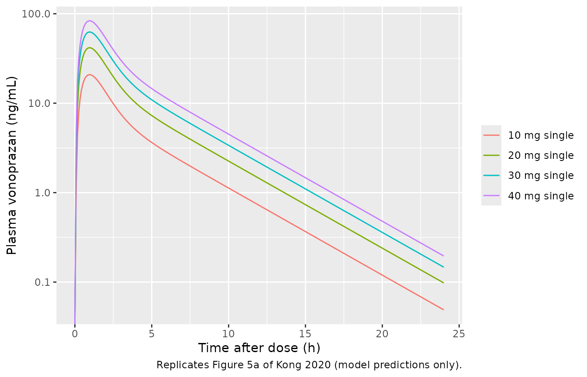
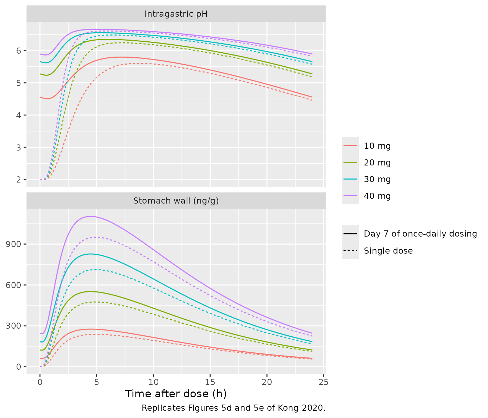
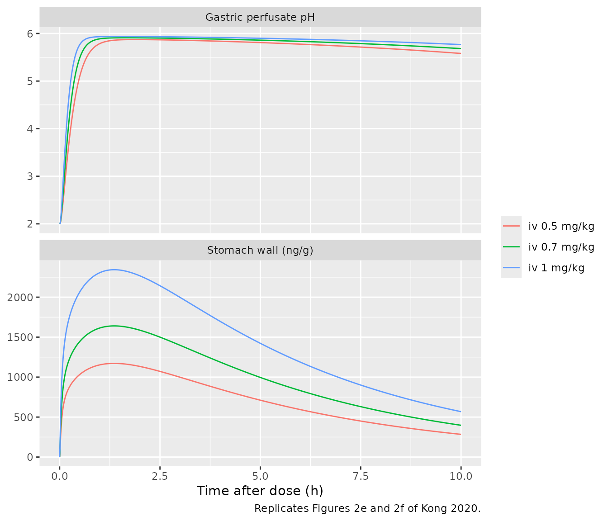
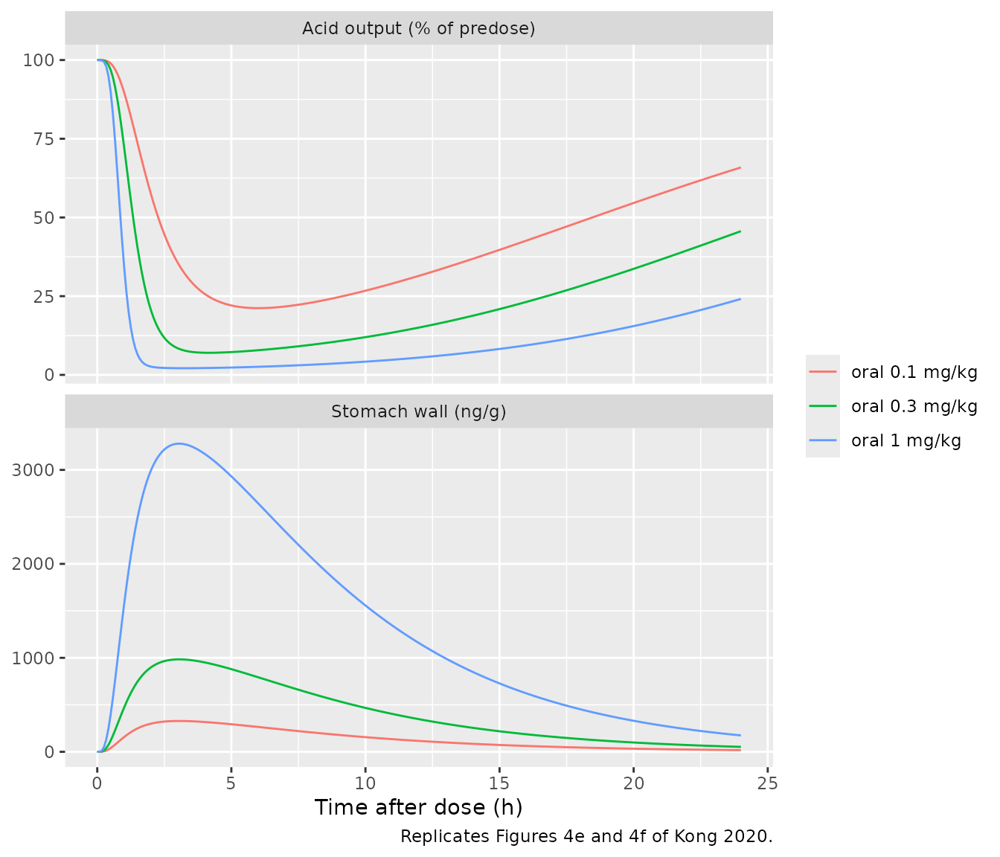

# Vonoprazan PBPK-PD in rats, dogs and humans (Kong 2020)

## Model and source

Kong et al. (2020) built one whole-body physiologically based
pharmacokinetic-pharmacodynamic (PBPK-PD) structure for vonoprazan, a
potassium-competitive acid blocker. They parameterised it from in vitro
data for the rat, extrapolated it to the dog, and then to a 70-kg human.
nlmixr2lib carries the three species as three models that share an
identical `model()` block and differ only in `ini()` values:

``` r

mod_rat   <- readModelDb("Kong_2020_vonoprazan_rat_pbpk")
mod_dog   <- readModelDb("Kong_2020_vonoprazan_dog_pbpk")
mod_human <- readModelDb("Kong_2020_vonoprazan_human_pbpk")
```

- Citation: Kong WM, Sun BB, Wang ZJ, Zheng XK, Zhao KJ, Chen Y, Zhang
  JX, Liu PH, Zhu L, Xu RJ, Li P, Liu L, Liu XD. Physiologically based
  pharmacokinetic-pharmacodynamic modeling for prediction of vonoprazan
  pharmacokinetics and its inhibition on gastric acid secretion
  following intravenous/oral administration to rats, dogs and humans.
  Acta Pharmacol Sin. 2020;41(6):852-865.
  <doi:10.1038/s41401-019-0353-2>. Equations 2-22 of the paper;
  physiology from Table 1; drug-specific values from the Methods and
  Results text; ODE routing from the WinNonlin ‘Mode code of human
  following oral administration’ listing in the Supplementary
  Information.
- Article: <https://doi.org/10.1038/s41401-019-0353-2> (open access,
  PMC7468366)
- Description (human): PBPK-PD (whole-body, perfusion-limited, WinNonlin
  8.1). Vonoprazan disposition and gastric-acid antisecretory effect in
  a typical 70-kg adult after oral dosing, extrapolated by Kong et
  al. (2020) from in vitro metabolism (hepatic microsomes), permeability
  (Caco-2) and rat tissue-distribution data. Thirteen perfusion-limited
  tissues plus venous and arterial blood pools; the stomach wall (the
  target organ) is permeability-limited with a vascular and an
  extravascular space. Oral doses enter the stomach lumen and transit a
  five-segment gut lumen (duodenum, jejunum, ileum absorb; cecum and
  colon do not) into per-segment gut-wall compartments. Hepatic
  Michaelis-Menten metabolism of unbound drug is scaled from microsomes
  by a physiologically based scaling factor, and an allometrically
  scaled linear ‘other’ clearance acts on venous blood. The PD layer
  drives an H+/K+-ATPase inhibition state from the unbound extravascular
  stomach concentration (dI/dt = k \* fu \* C2 \* (Imax - I) - kd \* I)
  and reports intragastric pH as basal pH + I. Deterministic
  typical-value model with no IIV. Companion rat and dog models:
  modellib(‘Kong_2020_vonoprazan_rat_pbpk’) and
  modellib(‘Kong_2020_vonoprazan_dog_pbpk’).

Structure (paper Figure 1 and Equations 2-22):

- Thirteen tissues (lung, heart, brain, muscle, adipose, skin, kidney,
  spleen, liver, rest of body, and the gut-wall segments) are
  perfusion-limited (Eq 2), with venous (Eq 3) and arterial (Eq 6) blood
  pools and the lung between them (Eq 7).
- The liver (Eqs 8-11) receives hepatic-artery flow plus portal inflow.
  It clears unbound drug by Michaelis-Menten M-I formation, which is
  scaled from liver microsomes by the physiologically based scaling
  factor (PBSF). A separate linear `CLother` (Eqs 4-5) acts on venous
  blood.
- The stomach wall, which is the target organ, is permeability-limited
  (Eqs 12-13). It has a vascular space `V1` and an extravascular space
  `V2`, exchanging through the permeability-surface product `PS` (Eq
  14).
- Oral doses enter the stomach lumen (Eq 15), transit five gut-lumen
  segments (Eq 16) and are absorbed from the duodenum, jejunum and ileum
  at `ka,i = 2 Peff / r_i` (Eqs 17-19) into gut-wall compartments (Eq
  20).
- PD (Eq 22): `dI/dt = k * fu * C2 * (Imax - I) - kd * I`, with
  `k = kd / KI`. `I` is the increase in gastric pH (rat, human) or the
  percent inhibition of acid output (dog).

## Population

- **Rat**: female Sprague-Dawley rats of 200-250 g (0.25 kg reference).
  There were 25 animals in five pharmacokinetic groups (intravenous 0.5,
  1 and 2 mg/kg; oral 2 mg/kg; intravenous 1 mg/kg daily for 7 days) and
  15 in a tissue-distribution study. The gastric-pH comparison data came
  from the literature (histamine-stimulated anaesthetised rats).
- **Dog**: eight beagles (4 female, 4 male, 7-10 kg; 8.5 kg reference)
  in a four-period crossover (intravenous 0.15, 0.3 and 0.6 mg/kg; oral
  0.6 mg/kg) followed by 7 days of intravenous dosing. The acid-output
  comparison data came from the literature (histamine-stimulated
  Heidenhain-pouch dogs).
- **Human**: a 70-kg reference adult. The comparison data are published
  healthy-volunteer studies from Japan and the UK (single oral doses of
  5-40 mg and 10-40 mg once daily for 7 days).

This is a bottom-up prediction model rather than a population fit. The
only parameter fitted to in vivo data is the rat stomach `PS` (0.6
mL/min), which was fitted to rat stomach concentrations. The model has
no between-subject variability. The paper’s human visual predictive
check estimated variances on CLliver, fu and k but did not report them.
The same information is available programmatically as
`rxode2::rxode(mod_human)$population`.

## Source trace

Every `ini()` value carries an in-file comment that points to its
source. The table below collects the drug-specific values. The organ
volumes, blood flows and `Kt:p` values are transcribed column by column
from Table 1 (rat 0.25 kg, dog 8.5 kg, human 70 kg).

| Parameter | Rat | Dog | Human | Source |
|----|----|----|----|----|
| Organ volumes, blood flows, `Kt:p`, radii `r1-r3`, transit `k0-k5` | Table 1 | Table 1 | Table 1 | Table 1 |
| `fu` | 0.32 | 0.17 | 0.15 | Methods, `Kt:p` scaling paragraph |
| `bp` (Rb) | 0.91 | 0.91 | 0.91 | Methods, Eq 2 text |
| `vmax` (nmol/min/mg) | 1.50 | 0.16 | 0.24 | Results, microsomal M-I formation |
| `km` (uM) | 12.94 | 90.97 | 13.60 | Results, microsomal M-I formation |
| `pbsf` (mg protein/body) | 409.92 | 16592.7 | 82472 | Methods, Eq 4 text |
| `cl_other` (mL/min) | 25 | 150 | 616 | Methods, Eq 5 text; Results |
| `ps_stomach` (mL/min) | 0.6 (fitted) | 6.37 | 26.17 | Results; Eq 14 |
| `v_vp_stomach` / `v_ev_stomach` (mL) | 0.2 / 0.9 | 4.6 / 19.4 | 25.6 / 134.4 | Methods, Eqs 12-13 text |
| `peff` (cm/min) | 0.002 | 0.008 | 0.008 | Methods, Eqs 18-19 text; Results |
| `kd` (1/min) | 0.00246 | 0.00246 | 0.00246 | Methods, Eq 22 text (dissociation t1/2 4.7 h) |
| `ki` (uM) | 0.035 | 0.035 | 0.035 | Methods, Eq 21 text (KI = 35 nM) |
| `imax` | 4.0 pH | 100 % | 5.0 pH | Results, per species |
| `ph_basal` (pH) | 2.0 | n/a | 2.0 | Results, per species |
| `mw` (g/mol) | 345.08 | 345.08 | 345.08 | Supplement code `tvKm = 4693.14` ng/mL divided by Km 13.60 uM |
| ODE routing into liver and venous blood |  |  |  | Supplementary “Mode code of human following oral administration” |

The derived hepatic-artery flow is
`q_ha = q_liver - q_stomach - q_spleen - sum(q_gw)`. It gives 300 mL/min
for the human, which is the supplement’s `tvQliver`. The Table 1 liver
`Kt:p` values already include the Eq 11 extraction-ratio correction:
applying Eqs 10-11 to the rat value scaled by `fu` returns the tabulated
dog and human 2.89.

## Human: oral single and multiple doses (Table 4, Figure 5)

``` r

# One typical 70-kg adult per regimen; deterministic model, no IIV.
human_regimen <- function(dose, n_doses, id) {
  ev <- if (n_doses == 1) {
    rxode2::et(amt = dose, cmt = "stomach")
  } else {
    rxode2::et(amt = dose, cmt = "stomach", ii = 1440, addl = n_doses - 1)
  }
  ev <- rxode2::et(ev, seq(0, 1440 * n_doses, by = 5))
  d <- as.data.frame(ev)
  d$id <- id
  d$treatment <- sprintf("%g mg %s", dose, if (n_doses == 1) "single" else "x 7 days")
  d
}
human_events <- bind_rows(
  human_regimen(10, 1, 1), human_regimen(20, 1, 2),
  human_regimen(30, 1, 3), human_regimen(40, 1, 4),
  human_regimen(10, 7, 5), human_regimen(20, 7, 6),
  human_regimen(30, 7, 7), human_regimen(40, 7, 8)
)
stopifnot(!anyDuplicated(unique(human_events[, c("id", "time", "evid")])))
sim_human <- rxode2::rxSolve(mod_human, events = human_events, keep = "treatment") |>
  as.data.frame()
#> Warning: multi-subject simulation without without 'omega'
```

``` r

sim_human |>
  filter(grepl("single", treatment), time <= 1440) |>
  ggplot(aes(time / 60, Cc, colour = treatment)) +
  geom_line() +
  scale_y_log10() +
  labs(
    x = "Time after dose (h)", y = "Plasma vonoprazan (ng/mL)", colour = NULL,
    caption = "Replicates Figure 5a of Kong 2020 (model predictions only)."
  )
#> Warning in scale_y_log10(): log-10 transformation introduced infinite values.
```



``` r

sim_human |>
  filter(grepl("single", treatment) | time >= 1440 * 6) |>
  mutate(
    tad = ifelse(grepl("single", treatment), time, time - 1440 * 6),
    regimen = ifelse(grepl("single", treatment), "Single dose", "Day 7 of once-daily dosing"),
    dose = sub(" .*", " mg", treatment)
  ) |>
  filter(tad <= 1440) |>
  select(tad, regimen, dose, `Stomach wall (ng/g)` = Cstomach, `Intragastric pH` = gastric_ph) |>
  pivot_longer(c(`Stomach wall (ng/g)`, `Intragastric pH`)) |>
  ggplot(aes(tad / 60, value, colour = dose, linetype = regimen)) +
  geom_line() +
  facet_wrap(~name, scales = "free_y", ncol = 1) +
  labs(
    x = "Time after dose (h)", y = NULL, colour = NULL, linetype = NULL,
    caption = "Replicates Figures 5d and 5e of Kong 2020."
  )
```



### PKNCA against the paper’s predicted Table 4 values

Table 4 prints both the observed human NCA and the paper’s own model
predictions. The packaged model is compared with the **predicted**
columns, because those are the output of the same model structure.
`AUC0-tn` is taken over 0-24 h after the (last) dose. Table 4 prints AUC
in min*ug/mL; it is converted to min*ng/mL here.

``` r

nca_conc <- sim_human |>
  filter(!is.na(Cc)) |>
  mutate(
    day7 = !grepl("single", treatment),
    time_nca = ifelse(day7, time - 1440 * 6, time)
  ) |>
  filter(time_nca >= 0, time_nca <= 1440) |>
  select(id, treatment, time = time_nca, Cc)
nca_dose <- human_events |>
  filter(evid == 1) |>
  mutate(time = ifelse(grepl("single", treatment), time, time - 1440 * 6)) |>
  filter(time == 0) |>
  select(id, treatment, time, amt)

human_nca <- PKNCA::pk.nca(PKNCA::PKNCAdata(
  PKNCA::PKNCAconc(nca_conc, Cc ~ time | treatment + id),
  PKNCA::PKNCAdose(nca_dose, amt ~ time | treatment + id),
  intervals = data.frame(start = 0, end = 1440, cmax = TRUE, tmax = TRUE, auclast = TRUE)
))

human_pub <- tibble::tribble(
  ~treatment,        ~cmax, ~tmax, ~auclast,
  "10 mg single",    20.79, 55,    4.01 * 1000,
  "20 mg single",    41.59, 55,    8.02 * 1000,
  "30 mg single",    62.40, 55,    12.04 * 1000,
  "40 mg single",    83.22, 55,    16.05 * 1000,
  "10 mg x 7 days",  20.83, 55,    4.02 * 1000,
  "20 mg x 7 days",  41.67, 55,    8.04 * 1000,
  "30 mg x 7 days",  62.52, 55,    12.06 * 1000,
  "40 mg x 7 days",  83.38, 55,    16.09 * 1000
)
human_cmp <- nlmixr2lib::ncaComparisonTable(
  human_nca, human_pub,
  by = "treatment",
  units = c(cmax = "ng/mL", tmax = "min", auclast = "min*ng/mL"),
  tolerance_pct = 20
)
knitr::kable(human_cmp, caption = "Human: simulated vs. Kong 2020 Table 4 predicted values. * > 20% difference.")
```

| NCA parameter        | treatment      | Reference | Simulated | % diff |
|:---------------------|:---------------|:----------|:----------|:-------|
| Cmax (ng/mL)         | 10 mg single   | 20.8      | 20.8      | +0.1%  |
| Cmax (ng/mL)         | 20 mg single   | 41.6      | 41.6      | +0.1%  |
| Cmax (ng/mL)         | 30 mg single   | 62.4      | 62.5      | +0.1%  |
| Cmax (ng/mL)         | 40 mg single   | 83.2      | 83.3      | +0.1%  |
| Cmax (ng/mL)         | 10 mg x 7 days | 20.8      | 20.9      | +0.1%  |
| Cmax (ng/mL)         | 20 mg x 7 days | 41.7      | 41.7      | +0.1%  |
| Cmax (ng/mL)         | 30 mg x 7 days | 62.5      | 62.6      | +0.1%  |
| Cmax (ng/mL)         | 40 mg x 7 days | 83.4      | 83.5      | +0.1%  |
| Tmax (min)           | 10 mg single   | 55        | 55        | +0.0%  |
| Tmax (min)           | 20 mg single   | 55        | 55        | +0.0%  |
| Tmax (min)           | 30 mg single   | 55        | 55        | +0.0%  |
| Tmax (min)           | 40 mg single   | 55        | 55        | +0.0%  |
| Tmax (min)           | 10 mg x 7 days | 55        | 55        | +0.0%  |
| Tmax (min)           | 20 mg x 7 days | 55        | 55        | +0.0%  |
| Tmax (min)           | 30 mg x 7 days | 55        | 55        | +0.0%  |
| Tmax (min)           | 40 mg x 7 days | 55        | 55        | +0.0%  |
| AUClast (min\*ng/mL) | 10 mg single   | 4010      | 4010      | -0.1%  |
| AUClast (min\*ng/mL) | 20 mg single   | 8020      | 8010      | -0.1%  |
| AUClast (min\*ng/mL) | 30 mg single   | 12000     | 12000     | -0.1%  |
| AUClast (min\*ng/mL) | 40 mg single   | 16000     | 16000     | -0.1%  |
| AUClast (min\*ng/mL) | 10 mg x 7 days | 4020      | 4020      | -0.0%  |
| AUClast (min\*ng/mL) | 20 mg x 7 days | 8040      | 8040      | -0.0%  |
| AUClast (min\*ng/mL) | 30 mg x 7 days | 12100     | 12100     | +0.0%  |
| AUClast (min\*ng/mL) | 40 mg x 7 days | 16100     | 16100     | -0.0%  |

Human: simulated vs. Kong 2020 Table 4 predicted values. \* \> 20%
difference. {.table}

``` r


human_diff <- as.numeric(gsub("[^0-9.eE-]", "", human_cmp[["% diff"]]))
# Deterministic model with the same structure as the paper's: the paper's
# predictions are reproduced to within 0.1% (the 5-min grid limits Tmax
# resolution, which lands exactly on the paper's 55 min).
stopifnot(all(abs(human_diff) < 2))
```

The published human predictions are reproduced. The paper reports its
own model’s predicted `Cmax` as roughly twice the observed values, and
underpredicts `t1/2` (about 191 min predicted against 350-500 min
observed) throughout Table 4. That is a property of the published model,
not of this implementation.

## Rat: oral pharmacokinetics, intravenous stomach concentration and gastric pH (Table 2, Figure 2)

``` r

rat_wt <- 0.25
rat_regimen <- function(dose_mgkg, route, id, tend) {
  cmt <- if (route == "iv") "venous" else "stomach"
  ev <- rxode2::et(amt = dose_mgkg * rat_wt, cmt = cmt) |> rxode2::et(seq(0, tend, by = 0.5))
  d <- as.data.frame(ev)
  d$id <- id
  d$treatment <- sprintf("%s %g mg/kg", route, dose_mgkg)
  d
}
rat_events <- bind_rows(
  rat_regimen(2, "oral", 1, 240),
  rat_regimen(0.5, "iv", 2, 600),
  rat_regimen(0.7, "iv", 3, 600),
  rat_regimen(1.0, "iv", 4, 600)
)
sim_rat <- rxode2::rxSolve(mod_rat, events = rat_events, keep = "treatment") |> as.data.frame()
#> Warning: multi-subject simulation without without 'omega'

rat_oral_nca <- PKNCA::pk.nca(PKNCA::PKNCAdata(
  PKNCA::PKNCAconc(filter(sim_rat, treatment == "oral 2 mg/kg", !is.na(Cc)) |>
    select(id, treatment, time, Cc), Cc ~ time | treatment + id),
  PKNCA::PKNCAdose(filter(rat_events, evid == 1, treatment == "oral 2 mg/kg") |>
    select(id, treatment, time, amt), amt ~ time | treatment + id),
  intervals = data.frame(start = 0, end = 240, cmax = TRUE, tmax = TRUE, auclast = TRUE)
))
rat_cmp <- nlmixr2lib::ncaComparisonTable(
  rat_oral_nca,
  tibble::tibble(treatment = "oral 2 mg/kg", cmax = 35.52, tmax = 55.5, auclast = 3.90 * 1000),
  by = "treatment",
  units = c(cmax = "ng/mL", tmax = "min", auclast = "min*ng/mL")
)
knitr::kable(rat_cmp, caption = "Rat oral 2 mg/kg: simulated vs. Kong 2020 Table 2 predicted values (AUC0-240 min).")
```

| NCA parameter        | treatment    | Reference | Simulated | % diff |
|:---------------------|:-------------|:----------|:----------|:-------|
| Cmax (ng/mL)         | oral 2 mg/kg | 35.5      | 35.6      | +0.2%  |
| Tmax (min)           | oral 2 mg/kg | 55.5      | 55.5      | +0.0%  |
| AUClast (min\*ng/mL) | oral 2 mg/kg | 3900      | 3910      | +0.1%  |

Rat oral 2 mg/kg: simulated vs. Kong 2020 Table 2 predicted values
(AUC0-240 min). {.table}

``` r

stopifnot(all(abs(as.numeric(gsub("[^0-9.eE-]", "", rat_cmp[["% diff"]]))) < 3))
```

``` r

sim_rat |>
  filter(grepl("iv", treatment)) |>
  select(time, treatment, `Stomach wall (ng/g)` = Cstomach, `Gastric perfusate pH` = gastric_ph) |>
  pivot_longer(-c(time, treatment)) |>
  ggplot(aes(time / 60, value, colour = treatment)) +
  geom_line() +
  facet_wrap(~name, scales = "free_y", ncol = 1) +
  labs(
    x = "Time after dose (h)", y = NULL, colour = NULL,
    caption = "Replicates Figures 2e and 2f of Kong 2020."
  )
```



The Results text prints stomach and plasma concentrations 5 h after
intravenous dosing:

``` r

rat_5h <- sim_rat |>
  filter(time == 300, treatment %in% c("iv 0.7 mg/kg", "iv 1 mg/kg")) |>
  transmute(treatment,
    stomach_sim = Cstomach, stomach_paper = c(1043, 1490),
    plasma_sim = Cc, plasma_paper = c(0.25, 0.35)
  )
knitr::kable(rat_5h, digits = 3, caption = "Rat, 5 h after intravenous dosing: simulated vs. Results text.")
```

| treatment    | stomach_sim | stomach_paper | plasma_sim | plasma_paper |
|:-------------|------------:|--------------:|-----------:|-------------:|
| iv 0.7 mg/kg |     995.698 |          1043 |      0.202 |         0.25 |
| iv 1 mg/kg   |    1422.488 |          1490 |      0.289 |         0.35 |

Rat, 5 h after intravenous dosing: simulated vs. Results text. {.table}

``` r

# Known deviation, see Assumptions: the paper's rat intravenous simulations
# are not reproduced exactly. Stomach is ~5% and plasma ~18% below the
# printed values; the gate pins the size of that gap so a regression shows.
stopifnot(
  all(abs(rat_5h$stomach_sim / rat_5h$stomach_paper - 1) < 0.10),
  all(abs(rat_5h$plasma_sim / rat_5h$plasma_paper - 1) < 0.25)
)
```

## Dog: oral pharmacokinetics and Heidenhain-pouch acid output (Table 3, Figure 4)

``` r

dog_wt <- 8.5
dog_regimen <- function(dose_mgkg, id, tend, by) {
  ev <- rxode2::et(amt = dose_mgkg * dog_wt, cmt = "stomach") |> rxode2::et(seq(0, tend, by = by))
  d <- as.data.frame(ev)
  d$id <- id
  d$treatment <- sprintf("oral %g mg/kg", dose_mgkg)
  d
}
dog_events <- bind_rows(
  dog_regimen(0.6, 1, 300, 0.5),
  dog_regimen(0.1, 2, 1440, 5),
  dog_regimen(0.3, 3, 1440, 5),
  dog_regimen(1.0, 4, 1440, 5)
)
sim_dog <- rxode2::rxSolve(mod_dog, events = dog_events, keep = "treatment") |> as.data.frame()
#> Warning: multi-subject simulation without without 'omega'

dog_oral_nca <- PKNCA::pk.nca(PKNCA::PKNCAdata(
  PKNCA::PKNCAconc(filter(sim_dog, treatment == "oral 0.6 mg/kg", !is.na(Cc)) |>
    select(id, treatment, time, Cc), Cc ~ time | treatment + id),
  PKNCA::PKNCAdose(filter(dog_events, evid == 1, treatment == "oral 0.6 mg/kg") |>
    select(id, treatment, time, amt), amt ~ time | treatment + id),
  intervals = data.frame(start = 0, end = 300, cmax = TRUE, tmax = TRUE, auclast = TRUE)
))
dog_cmp <- nlmixr2lib::ncaComparisonTable(
  dog_oral_nca,
  tibble::tibble(treatment = "oral 0.6 mg/kg", cmax = 145.73, tmax = 43, auclast = 16.26 * 1000),
  by = "treatment",
  units = c(cmax = "ng/mL", tmax = "min", auclast = "min*ng/mL")
)
knitr::kable(dog_cmp, caption = "Dog oral 0.6 mg/kg: simulated vs. Kong 2020 Table 3 predicted values (AUC0-300 min).")
```

| NCA parameter        | treatment      | Reference | Simulated | % diff |
|:---------------------|:---------------|:----------|:----------|:-------|
| Cmax (ng/mL)         | oral 0.6 mg/kg | 146       | 146       | -0.0%  |
| Tmax (min)           | oral 0.6 mg/kg | 43        | 43        | +0.0%  |
| AUClast (min\*ng/mL) | oral 0.6 mg/kg | 16300     | 16300     | -0.0%  |

Dog oral 0.6 mg/kg: simulated vs. Kong 2020 Table 3 predicted values
(AUC0-300 min). {.table}

``` r

stopifnot(all(abs(as.numeric(gsub("[^0-9.eE-]", "", dog_cmp[["% diff"]]))) < 3))
```

``` r

sim_dog |>
  filter(treatment != "oral 0.6 mg/kg") |>
  select(time, treatment, `Stomach wall (ng/g)` = Cstomach, `Acid output (% of predose)` = acid_output) |>
  pivot_longer(-c(time, treatment)) |>
  ggplot(aes(time / 60, value, colour = treatment)) +
  geom_line() +
  facet_wrap(~name, scales = "free_y", ncol = 1) +
  labs(
    x = "Time after dose (h)", y = NULL, colour = NULL,
    caption = "Replicates Figures 4e and 4f of Kong 2020."
  )
```



The Results text prints the 24-h values after 0.3 and 1.0 mg/kg:

``` r

dog_24h <- sim_dog |>
  filter(time == 1440, treatment %in% c("oral 0.3 mg/kg", "oral 1 mg/kg")) |>
  transmute(treatment,
    stomach_sim = Cstomach, stomach_paper = c(52.31, 174.39),
    plasma_sim = Cc, plasma_paper = c(0.0016, 0.0055),
    acid_sim = acid_output, acid_paper = c(48, 26)
  )
knitr::kable(dog_24h, digits = 4, caption = "Dog, 24 h after oral dosing: simulated vs. Results text.")
```

| treatment | stomach_sim | stomach_paper | plasma_sim | plasma_paper | acid_sim | acid_paper |
|:---|---:|---:|---:|---:|---:|---:|
| oral 0.3 mg/kg | 52.3110 | 52.31 | 0.0016 | 0.0016 | 45.6426 | 48 |
| oral 1 mg/kg | 174.3744 | 174.39 | 0.0055 | 0.0055 | 24.1253 | 26 |

Dog, 24 h after oral dosing: simulated vs. Results text. {.table
style="width:100%;"}

``` r

stopifnot(
  # Stomach concentrations are printed to 4-5 significant figures and match.
  all(abs(dog_24h$stomach_sim / dog_24h$stomach_paper - 1) < 0.01),
  # Plasma is printed to 2 significant figures.
  all(abs(dog_24h$plasma_sim / dog_24h$plasma_paper - 1) < 0.05),
  # Acid output: 2-3 percentage points below the printed values (see Assumptions).
  all(abs(dog_24h$acid_sim - dog_24h$acid_paper) < 5)
)
```

## Intravenous predictions (Tables 2 and 3)

``` r

iv_auc <- function(mod, wt, dose_mgkg, tn) {
  # Log-spaced grid: the bolus lands in a small venous volume, so a coarse
  # linear grid overstates the trapezoidal AUC over the first minute.
  ev <- rxode2::et(amt = dose_mgkg * wt, cmt = "venous") |>
    rxode2::et(c(0, exp(seq(log(1e-3), log(tn), length.out = 3000))))
  s <- as.data.frame(rxode2::rxSolve(mod, events = ev))
  sum(diff(s$time) * (head(s$Cc, -1) + tail(s$Cc, -1)) / 2) / 1000
}
iv_tab <- tibble::tribble(
  ~species, ~dose_mgkg, ~auc_paper,
  "rat", 0.5, 3.21,
  "rat", 1.0, 6.42,
  "dog", 0.15, 7.31,
  "dog", 0.3, 14.62
) |>
  rowwise() |>
  mutate(auc_sim = if (species == "rat") {
    iv_auc(mod_rat, rat_wt, dose_mgkg, 240)
  } else {
    iv_auc(mod_dog, dog_wt, dose_mgkg, 300)
  }) |>
  ungroup() |>
  mutate(ratio = auc_sim / auc_paper)
iv_tab |>
  rename(
    "Species" = species, "IV dose (mg/kg)" = dose_mgkg,
    "Paper predicted AUC0-tn (min*ug/mL)" = auc_paper,
    "Simulated AUC0-tn (min*ug/mL)" = auc_sim, "Simulated / paper" = ratio
  ) |>
  knitr::kable(digits = 2, caption = "Intravenous AUC: simulated vs. the paper's predicted values (known deviation).")
```

| Species | IV dose (mg/kg) | Paper predicted AUC0-tn (min\*ug/mL) | Simulated AUC0-tn (min\*ug/mL) | Simulated / paper |
|:---|---:|---:|---:|---:|
| rat | 0.50 | 3.21 | 4.06 | 1.26 |
| rat | 1.00 | 6.42 | 8.12 | 1.26 |
| dog | 0.15 | 7.31 | 4.28 | 0.59 |
| dog | 0.30 | 14.62 | 8.55 | 0.59 |

Intravenous AUC: simulated vs. the paper’s predicted values (known
deviation). {.table}

``` r

# Known deviation (see Assumptions): pinned so that the size of the gap is
# monitored. Rat ~1.26x high, dog ~0.58x low.
stopifnot(
  all(abs(iv_tab$ratio[iv_tab$species == "rat"] - 1.26) < 0.05),
  all(abs(iv_tab$ratio[iv_tab$species == "dog"] - 0.58) < 0.05)
)
```

## Assumptions and deviations

- **ODE routing follows the supplement code, not a mass-conserving
  reading of Eq 8.** The supplementary WinNonlin listing for the human
  oral model does two things that a textbook PBPK would not. First, it
  passes the stomach vascular outflow to the liver as
  `Qstomach * C1 / (Kp,stomach / Rb)` rather than `Qstomach * C1`.
  Second, it routes only the three absorbing gut-wall segments
  (duodenum, jejunum, ileum) to the liver, so the venous outflow of the
  cecum and colon walls is not returned to the circulation. Both lose
  drug and so act as additional elimination pathways. The maintainers
  kept this routing because it reproduces the paper’s published oral
  predictions for all three species exactly: human Table 4, rat and dog
  Tables 2 and 3, and the dog 24-h stomach and plasma values. A
  mass-conserving variant, with stomach outflow `Qstomach * C1` and
  cecum and colon routed to the liver, gives a human 20 mg AUC of about
  11.0 rather than the published 8.02 min*ug/mL, and a dog oral AUC of
  about 27.5 rather than 16.26 min*ug/mL. The same routing is applied to
  the rat and dog models, for which no code was published.
- **Intravenous predictions are not reproduced.** The rat intravenous
  AUCs are about 26% above Table 2’s predictions, the rat 5-h plasma
  values about 18% below the Results text, and the dog intravenous AUCs
  about 42% below Table 3’s. The maintainers found that the dog
  intravenous predictions (AUC 14.42 vs. 14.62 min\*ug/mL at 0.3 mg/kg;
  CL 17.6 vs. 18.04 mL/min/kg) are reproduced if the cecum and colon
  walls drain to the liver. That same change breaks the exact match of
  the dog oral prediction, which suggests the authors ran intravenous
  simulations with a differently routed model. No single routing
  reproduces both routes, and no rat variant tried reproduced Table 2’s
  intravenous values. The packaged models therefore follow the one
  published code listing, and the intravenous gap is pinned in the check
  above rather than tuned away.
- **The paper’s summary “predicted CL 874 mL/min and Vss 228 L” for the
  human** is not reproduced by any routing variant. The code-literal
  model has an intravenous plasma clearance of about 1020 mL/min. The
  paper does not say how these two summary numbers were computed. They
  are not used as a gate.
- **Molecular weight.** The paper does not print one. The supplement
  code expresses `Km` as 4693.14 ng/mL against the printed 13.60 uM,
  which implies 345.08 g/mol; that value converts uM to ng/mL for both
  the hepatic Michaelis-Menten term and the PD binding term. The formula
  weight of vonoprazan free base (C17H16FN3O2S) is 345.39 g/mol, 0.09%
  different.
- **Vmax.** The supplement code carries `Vmax = 83.54` ng/min/mg
  protein, which is 0.242 nmol/min/mg at 345.08 g/mol. The packaged
  human model uses the 0.24 nmol/min/mg printed in the Results, and the
  0.8% difference has no visible effect on the Table 4 comparison. `PS`
  is 26.17 mL/min from the Results text; the code carries the rounded
  26.2.
- **Liver `Kt:p`.** Table 1 liver values already include the Eq 11
  extraction-ratio correction (they are internally consistent with Eqs
  10-11 applied to the rat value), so they are used as printed, as the
  supplement code does.
- **Rat and dog cecum and colon transit** (`k4`, `k5`) are “ND” in Table
  1 and are set to zero. Drug reaching those segments stays in the
  lumen, which has no effect on plasma because neither segment absorbs.
- **Stomach concentration output.** `Cstomach` is the extravascular
  stomach-wall concentration `C2`, which drives the PD. It reproduces
  the dog’s printed 24-h stomach concentrations (52.31 and 174.39 ng/g)
  exactly.
- **Dog acid output** at 24 h is 2-3 percentage points below the printed
  48% and 26%, although the underlying stomach concentrations match
  exactly. The paper does not give the PD integration details (for
  example, a pre-dose histamine run-in), so the gap is recorded rather
  than tuned.
- **No variability.** The human visual predictive check estimated
  variances on CLliver, fu and k that the paper does not report, so all
  three models are typical-value only. The proportional residual error
  is fixed at zero.
- **Dosing.** Oral doses go into the `stomach` lumen compartment, and
  intravenous doses are a bolus into `venous` blood. Rat and dog doses
  in mg/kg are converted with the 0.25 kg and 8.5 kg reference weights.
- No erratum or correction notice for this article was found as of
  2026-09-27.
