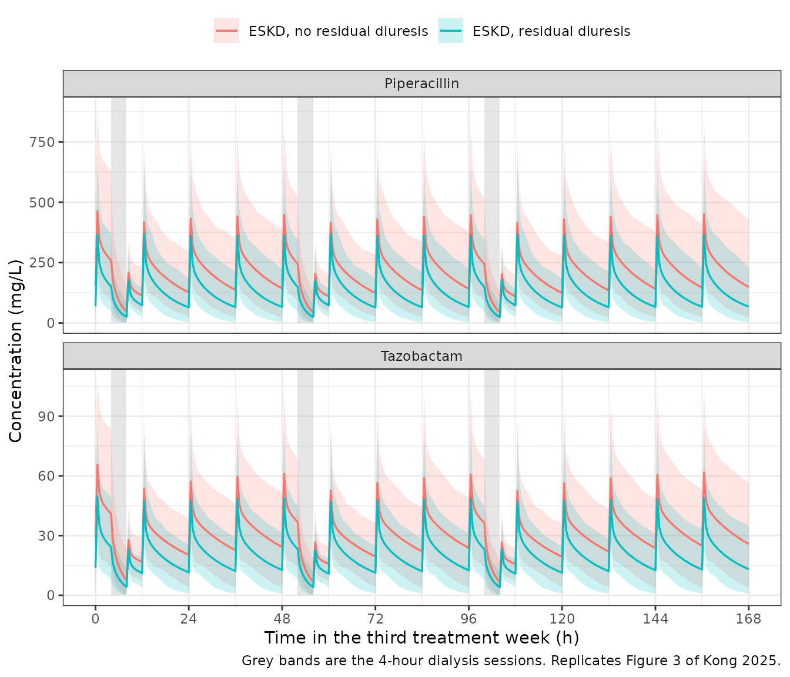

# Piperacillin + tazobactam in ESKD on haemodialysis (Kong 2025)

## Model and source

Kong et al. 2025 extended their previously published *general-purpose*
piperacillin/tazobactam population PK model to patients with end-stage
kidney disease (ESKD) receiving thrice-weekly high-flux intermittent
haemodialysis. The structure is four compartments – a central and a
peripheral compartment for each drug, with first-order elimination from
the two central compartments and no interconversion – and the two
analytes are fitted simultaneously via the NONMEM L2 data item.

What makes this an unusual extraction is how little of the model was
estimated from the new data. Every structural parameter, the clearance
maturation and decline functions, the serum-creatinine effect and all
five inter-individual variances are **fixed** to the general-purpose
parent model. Only four things were estimated from the 20-patient ESKD
cohort:

1.  the residual endogenous clearance fraction `theta_ESKD`, with
    residual diuresis as a covariate,
2.  the piperacillin dialyser extraction ratio,
3.  the tazobactam dialyser extraction ratio, as a three-level function
    of vascular access type, and
4.  the residual error (proportional + additive per drug, plus a
    cross-drug residual correlation).

The packaged model uses piperacillin as the unsuffixed parent (canonical
compartments `central` / `peripheral1`, parameters `lcl` / `lvc` / `lq`
/ `lvp`, residuals `propSd` / `addSd`) and tazobactam as the `_taz`
sibling-drug suffix (`central_taz` / `peripheral1_taz`, `lcl_taz` /
`lvc_taz` / `lq_taz` / `lvp_taz`, `propSd_taz` / `addSd_taz`), exactly
paralleling `Soto_2014_ampicillin_sulbactam` and its `_sbt` suffix.

- Citation: Kong D, Koomen JV, Vanommeslaeghe F, Delanghe S, Van Biesen
  W, Colin PJ, Eloot S. A Population Pharmacokinetic Analysis for
  Piperacillin/Tazobactam in Patients with End-Stage Kidney Disease
  Undergoing Intermittent Haemodialysis: Extension of a General-Purpose
  Model. Clin Pharmacokinet. 2025. <doi:10.1007/s40262-025-01527-y>.
  Structural parameters, maturation / decline functions,
  serum-creatinine effect and inter-individual variances are fixed to
  the general-purpose parent model: Kong D, et al. A pooled
  pharmacokinetic analysis for piperacillin/tazobactam across different
  patient populations: from premature infants to the elderly. Clin
  Pharmacokinet. 2025;64(1):107-126. The parent-model values used here
  are transcribed from the final NONMEM control stream reproduced
  verbatim in the Kong 2025 Electronic Supplementary Material, so
  nothing is imported from the parent publication itself.
- Article: <https://doi.org/10.1007/s40262-025-01527-y>

``` r

mod <- readModelDb("Kong_2025_piperacillin_tazobactam")
ui  <- rxode2::rxode(mod)
ui$state
#> [1] "central"         "peripheral1"     "central_taz"     "peripheral1_taz"
```

## Population

``` r

pop <- readModelDb("Kong_2025_piperacillin_tazobactam")()$population
data.frame(field = names(pop), value = vapply(pop, paste, character(1), collapse = " ")) |>
  dplyr::rename("Field" = field, "Value" = value) |>
  knitr::kable()
```

|  | Field | Value |
|:---|:---|:---|
| species | species | human |
| n_subjects | n_subjects | 20 |
| n_studies | n_studies | 1 |
| age_range | age_range | 20-84 years (median 71.5) |
| age_median | age_median | 71.5 years |
| weight_range | weight_range | 27.0-93.8 kg (median 66.3) |
| weight_median | weight_median | 66.3 kg |
| sex_female_pct | sex_female_pct | 35 |
| disease_state | disease_state | End-stage kidney disease on thrice-weekly high-flux intermittent haemodialysis, with a documented or presumed infection requiring piperacillin/tazobactam. Residual diuresis present in 11/20 (55%) and absent in 9/20 (45%). Patients under 18 years, with known beta-lactam / beta-lactamase-inhibitor hypersensitivity, or pregnant were excluded (Kong 2025 Methods 2.1). |
| renal_function | renal_function | End-stage kidney disease; the model sets the serum-creatinine correction F_SCR to 1 for these patients (Eq. 2) because serum creatinine is itself removed by the dialyser, and instead estimates a residual endogenous clearance fraction theta_ESKD. Endogenous clearance was estimated to be 78.6% lower (95% CI 66.3-86.4%) without residual diuresis and 63.0% lower (95% CI 49.5-73.0%) with residual diuresis, relative to a patient with normal kidney function (Kong 2025 Results 3.4). |
| dose_range | dose_range | Piperacillin 0.60-4.00 g (median 3.08) with tazobactam 0.075-0.50 g (median 0.385) per dose, administered intravenously in the clinical fixed 8:1 ratio; infusion duration 0.25-24.50 h (median 2.85). Regimens were chosen by the treating physician, not by protocol. The actual delivered dose was corrected for drug remaining in the used infusion lines (Kong 2025 Methods 2.1, Table 1). |
| dialysis | dialysis | Thrice-weekly high-flux intermittent haemodialysis; session duration 89.4-333.4 min (median 240.0), dialyser blood flow rate 160-350 mL/min (median 225), priming volume 83-115 mL (median 115). Modality 14 (74%) haemodialysis, 1 (5%) pre-dilution and 4 (21%) post-dilution haemodiafiltration. Vascular access 6 (32%) tunnelled dialysis catheter, 4 (21%) single-needle and 9 (47%) double-needle arteriovenous fistula. Membranes were polysulfone (n = 14), polyacrylonitrile (3), polyamix (1), cellulosic triacetate (1) and polyarylethersulfone (1), surface area 1.3-2 m^2. One patient had no intradialytic sampling, so the dialysis characteristics are reported for n = 19 (Kong 2025 Results 3.1, Table 1). |
| regions | regions | Belgium (single centre, Ghent University Hospital) |
| notes | notes | Monocentric prospective observational study, ClinicalTrials.gov NCT03909698, completed 31 March 2022. 195 blood samples were collected with both piperacillin and tazobactam quantified in each; 4 piperacillin (2.1%) and 3 tazobactam (1.5%) concentrations were excluded for bioanalytical anomalies or missing sample-type information. Intradialytic samples were drawn SIMULTANEOUSLY from the arterial line entering the dialyser and the venous line exiting it, which is what makes the extraction ratio identifiable. Lower limits of quantification 0.5 mg/L (piperacillin) and 0.25 mg/L (tazobactam). Estimation used NONMEM 7.5 FOCE-I (Kong 2025 Methods 2.1-2.2, 2.6, Results 3.1-3.2). The Monte Carlo simulations of Table 4 and Figs. 3-4 drew 1000 virtual patients, sampling sex from the observed 35% female / 65% male split and continuous covariates from normal distributions truncated to the observed range; sex itself is not a covariate in the model. |

Twenty adults with end-stage kidney disease on thrice-weekly high-flux
intermittent haemodialysis were enrolled at Ghent University Hospital
(NCT03909698). Median age was 71.5 years (range 20-84), 13/20 (65%) were
male, median body weight was 66.3 kg (27.0-93.8), and 11/20 (55%) had
residual diuresis (Kong 2025 Table 1). Dialysis characteristics are
reported for the 19 patients who had intradialytic sampling: session
duration median 240 min (89.4-333.4), dialyser blood flow rate median
225 mL/min (160-350), vascular access 6 (32%) tunnelled dialysis
catheter (TDC), 4 (21%) single-needle arteriovenous fistula (AVF 1N) and
9 (47%) double-needle arteriovenous fistula (AVF 2N).

The study design is what makes the dialyser extraction ratio
identifiable: during each dialysis session blood was sampled
**simultaneously** from the arterial line entering the dialyser and the
venous line exiting it, so the fraction removed in one pass is observed
directly rather than inferred from a concentration decline.

## Source trace

Every `ini()` value and every non-trivial `model()` equation, with the
source location it came from. The Electronic Supplementary Material
(ESM) of Kong 2025 reproduces the complete final NONMEM control stream
(`$MODEL`, `$PK`, `$DES`, `$ERROR`, `$THETA`, `$OMEGA`, `$SIGMA`), so
the implemented values are available verbatim in addition to the rounded
Table 3 estimates. Where the two differ by rounding, the ESM code value
is used because it is the value that was actually fitted; the Table 3
equivalent is recorded alongside.

| Model element | Source location | Value / form |
|----|----|----|
| `lvc`, `lcl`, `lvp`, `lq` | ESM `$THETA(1)-(4)` FIX; Table 3 piperacillin column | 2.34 / 2.36 / 2.45 / 2.72 (log L, log L/h) |
| `lvc_taz`, `lcl_taz`, `lvp_taz`, `lq_taz` | ESM `$THETA(5)-(8)` FIX; Table 3 tazobactam column | 2.35 / 2.26 / 2.62 / 2.82 |
| `e_wt_cl`, `e_wt_vc`, `e_wt_q` | Methods 2.3 (fixed West-Brown-Enquist exponents); ESM `$PK` `FSIZE**0.75`, `* FSIZE`, `(V2SZ**0.75)` | 0.75 / 1.00 / 0.75, all fixed |
| `lhill_mat`, `ltmat50` | ESM `$THETA(9)-(10)` FIX; Table 3 `gamma_1` = 3.35, `MAT50` = 54.2 weeks | 1.21 / 0.0358 |
| `lhill_dec`, `ltdec50`, `ltdec50_taz` | ESM `$THETA(11)-(13)` FIX; Table 3 `gamma_2` = 1.92, `DEC50` = 89.1 y (pip) / 61.6 y (taz) | 0.653 / 4.49 / 4.12 |
| `le_creat_cl` | ESM `$THETA(14)` FIX; Table 3 `theta_SCR` = 0.346 dL/mg | -1.06 |
| `lf_eskd`, `lf_eskd_diur` | ESM `$THETA(15)-(16)` estimated; Table 3 `theta_ESKD` 0.214 / 0.370 | log(0.214) / log(0.370) |
| `logitedia` | ESM `$THETA(17)` estimated; Table 3 ER piperacillin 64.0% | logit(0.640) |
| `logitedia_taz`, `..._avf1n`, `..._avf2n` | ESM `$THETA(18)-(20)` estimated; Table 3 ER of TDC / AVF 1N / AVF 2N 80.1% / 73.9% / 73.5% | logit(0.801) / logit(0.739) / logit(0.735) |
| `propSd`, `addSd`, `propSd_taz`, `addSd_taz` | ESM `$THETA(21)-(24)` estimated; Table 3 `SD_prop` / `SD_add` | 0.412 / 0.588 mg/L / 0.423 / 0.214 mg/L |
| `etalvc`, `etalcl`, `etalcl_taz`, `etalvp`, `etalq` | ESM `$OMEGA` all FIX; Table 3 IIV rows, footnote b `sqrt(exp(omega) - 1) x 100%` | 0.167 / 0.171 / 0.159 / 0.548 / 0.358 |
| `creat_std` equation | Eq. 1 (and its repeat as Eq. 3); ESM `$PK` `STCR` | `exp[1.42 - (1.17 + 0.203 ln(PMA/100)) / sqrt(PMA/100)]`, PMA in years |
| `f_scr` piecewise | Eq. 2 | `exp(-theta_SCR (SCR - SCR_std))` off dialysis, `1` on intermittent haemodialysis |
| `cl` assembly | Eq. 4; ESM `$PK` `TVCL1` / `TVCL3` | `CL_normal x F_SCR x F_ESKD x F_MAT x F_DEC x F_SIZE x exp(eta_CL)` |
| `f_eskd` diuresis gate | Table 2 model 11 (dOFV -12.37); ESM `$PK` `IF(UVOL0123.NE.0)` | two typical values selected by residual diuresis |
| `cl_dialysis` | Eq. 5; ESM `$PK` `CL_DIA_PIP = ER_PIP*FLOW*IND_DIA` | `ER x blood flow rate (L/h) x session-active indicator` |
| `edia` logit form | Eq. 6; ESM `$PK` `ER = EXP(LGT)/(1+EXP(LGT))` | `e^theta / (1 + e^theta)` |
| ODE system | ESM `$DES` | two independent 2-compartment systems, dialyser clearance out of each central compartment |
| `Cc_post` | ESM `$ERROR` `CPOST = CPRE * (1-ER)` | post-dialyser (outlet) concentration |
| Residual error form | ESM `$ERROR` `PSD = SQRT(IPRED^2*PPROP^2 + PADD^2)` with `$SIGMA 1 FIX` | combined proportional + additive (nlmixr2 `combined2`) |
| `PAGE / 12` | canonical `PAGE` is months; ESM `$PK` `RPMA = 35+(40/52)` works in years | unit conversion, not a fitted value |
| `BFR * 60 / 1000` | ESM `$PK` `FLOW = IFLOW*60/1000` | mL/min to L/h |
| Reference weight 70 kg | Methods 2.3 | `FSIZE = WT/70` |
| `URINE_VOL_24H > 100` | **NOT from Kong 2025** – see Assumptions | canonical anuria cutoff (100 mL/24h) standing in for the paper’s binary flag |

### Published estimates reproduce from the packaged `ini()`

The strongest check available for a model whose parameters are almost
all fixed is an enumerating one: back-transform every `ini()` value and
require it to equal the published Table 3 entry. This covers all 14
fixed structural / maturation / decline / creatinine parameters, the 5
fixed variances, the 6 estimated typical values and the 4 residual-error
terms.

``` r

th <- ui$theta
om <- diag(ui$omega)

back <- tibble::tribble(
  ~Parameter,               ~Published, ~Recovered,
  "theta_V1 pip (L/70 kg)",     10.4,   exp(th[["lvc"]]),
  "theta_CL pip (L/h/70 kg)",   10.6,   exp(th[["lcl"]]),
  "theta_V2 pip (L/70 kg)",     11.6,   exp(th[["lvp"]]),
  "theta_Q2 pip (L/h/70 kg)",   15.2,   exp(th[["lq"]]),
  "theta_V1 taz (L/70 kg)",     10.5,   exp(th[["lvc_taz"]]),
  "theta_CL taz (L/h/70 kg)",   9.58,   exp(th[["lcl_taz"]]),
  "theta_V2 taz (L/70 kg)",     13.7,   exp(th[["lvp_taz"]]),
  "theta_Q2 taz (L/h/70 kg)",   16.8,   exp(th[["lq_taz"]]),
  "gamma_1 (maturation)",       3.35,   exp(th[["lhill_mat"]]),
  "gamma_2 (decline)",          1.92,   exp(th[["lhill_dec"]]),
  "DEC50 pip (years)",          89.1,   exp(th[["ltdec50"]]),
  "DEC50 taz (years)",          61.6,   exp(th[["ltdec50_taz"]]),
  "theta_SCR (dL/mg)",         0.346,   exp(th[["le_creat_cl"]]),
  "theta_ESKD no diuresis",    0.214,   exp(th[["lf_eskd"]]),
  "theta_ESKD with diuresis",  0.370,   exp(th[["lf_eskd_diur"]]),
  "ER pip (%)",                 64.0,   100 * plogis(th[["logitedia"]]),
  "ER taz TDC (%)",             80.1,   100 * plogis(th[["logitedia_taz"]]),
  "ER taz AVF 1N (%)",          73.9,   100 * plogis(th[["logitedia_taz_avf1n"]]),
  "ER taz AVF 2N (%)",          73.5,   100 * plogis(th[["logitedia_taz_avf2n"]]),
  "SD_prop pip (%)",            41.2,   100 * th[["propSd"]],
  "SD_add pip (mg/L)",         0.588,   th[["addSd"]],
  "SD_prop taz (%)",            42.3,   100 * th[["propSd_taz"]],
  "SD_add taz (mg/L)",         0.214,   th[["addSd_taz"]],
  "IIV V1 (%)",                 42.6,   100 * sqrt(exp(om[["etalvc"]]) - 1),
  "IIV CL pip (%)",             43.2,   100 * sqrt(exp(om[["etalcl"]]) - 1),
  "IIV CL taz (%)",             41.5,   100 * sqrt(exp(om[["etalcl_taz"]]) - 1),
  "IIV V2 (%)",                 85.4,   100 * sqrt(exp(om[["etalvp"]]) - 1),
  "IIV Q2 (%)",                 65.6,   100 * sqrt(exp(om[["etalq"]]) - 1)
)
back$`% diff` <- round(100 * (back$Recovered / back$Published - 1), 2)
back |>
  dplyr::mutate(Recovered = signif(Recovered, 4)) |>
  knitr::kable(caption = "Kong 2025 Table 3 recovered from the packaged ini() block.")
```

| Parameter                | Published | Recovered | % diff |
|:-------------------------|----------:|----------:|-------:|
| theta_V1 pip (L/70 kg)   |    10.400 |   10.3800 |  -0.18 |
| theta_CL pip (L/h/70 kg) |    10.600 |   10.5900 |  -0.09 |
| theta_V2 pip (L/70 kg)   |    11.600 |   11.5900 |  -0.10 |
| theta_Q2 pip (L/h/70 kg) |    15.200 |   15.1800 |  -0.13 |
| theta_V1 taz (L/70 kg)   |    10.500 |   10.4900 |  -0.14 |
| theta_CL taz (L/h/70 kg) |     9.580 |    9.5830 |   0.03 |
| theta_V2 taz (L/70 kg)   |    13.700 |   13.7400 |   0.26 |
| theta_Q2 taz (L/h/70 kg) |    16.800 |   16.7800 |  -0.14 |
| gamma_1 (maturation)     |     3.350 |    3.3530 |   0.10 |
| gamma_2 (decline)        |     1.920 |    1.9210 |   0.07 |
| DEC50 pip (years)        |    89.100 |   89.1200 |   0.02 |
| DEC50 taz (years)        |    61.600 |   61.5600 |  -0.07 |
| theta_SCR (dL/mg)        |     0.346 |    0.3465 |   0.13 |
| theta_ESKD no diuresis   |     0.214 |    0.2140 |   0.00 |
| theta_ESKD with diuresis |     0.370 |    0.3700 |   0.00 |
| ER pip (%)               |    64.000 |   64.0000 |   0.00 |
| ER taz TDC (%)           |    80.100 |   80.1000 |   0.00 |
| ER taz AVF 1N (%)        |    73.900 |   73.9000 |   0.00 |
| ER taz AVF 2N (%)        |    73.500 |   73.5000 |   0.00 |
| SD_prop pip (%)          |    41.200 |   41.2000 |   0.00 |
| SD_add pip (mg/L)        |     0.588 |    0.5880 |   0.00 |
| SD_prop taz (%)          |    42.300 |   42.3000 |   0.00 |
| SD_add taz (mg/L)        |     0.214 |    0.2140 |   0.00 |
| IIV V1 (%)               |    42.600 |   42.6300 |   0.08 |
| IIV CL pip (%)           |    43.200 |   43.1800 |  -0.04 |
| IIV CL taz (%)           |    41.500 |   41.5100 |   0.03 |
| IIV V2 (%)               |    85.400 |   85.4300 |   0.03 |
| IIV Q2 (%)               |    65.600 |   65.6100 |   0.02 |

Kong 2025 Table 3 recovered from the packaged ini() block. {.table}

``` r


# Every entry must agree with the published value to the printed precision.
stopifnot(all(abs(back$`% diff`) < 0.6))
```

`MAT50` is the one entry not gated above. Table 3 prints 54.2 weeks
while the ESM code carries `$THETA(10) = 0.0358` on the log-year scale,
which back-transforms to 1.0364 years = 54.1 weeks. The ~0.2% difference
is a weeks-per-year rounding convention, and in an all-adult cohort the
maturation ratio `F_MAT / F_MAT_ref` is 1 to within 1e-09 either way, so
the discrepancy cannot affect any prediction here.

## Closed-form structural gates

Before any cohort simulation, the individual equations are checked
against their published forms with exact identities. `rxode2` returns
every derived `model()` variable as a column, so each factor of Eq. 4
and each piece of Eq. 5/6 can be read off a single solve.

``` r

HD_DUR   <- 4                       # h; Methods 2.5 assumes 4-hour sessions
# Days 1, 3 and 5 of each week, with each session starting 4 h after a
# maintenance dose. Kong 2025 does not report where the session falls inside
# the dosing interval; this placement is the only one that keeps the whole
# 4-hour session inside a single 12-hour interval, so no dose is infused into a
# running dialyser and the supplementary post-dialysis dose never collides with
# a maintenance dose. See Assumptions.
HD_OFF   <- c(4, 52, 100)
WEEKS    <- 2
HD_START <- sort(as.numeric(outer(HD_OFF, (seq_len(WEEKS) - 1) * 168, "+")))
TEND     <- WEEKS * 168
WIN      <- c(TEND - 168, TEND)     # metrics are taken over the final week
T_INF    <- 0.5                     # h; 30-minute infusion per the SmPC
RPMA_M   <- (35 + 40 / 52) * 12     # reference postmenstrual age, months

hd_active <- function(tm) {
  as.integer(rowSums(outer(tm, HD_START, function(a, b) a >= b & a < b + HD_DUR)) > 0)
}

# Serum creatinine standardised for postmenstrual age (Kong 2025 Eq. 1).
creat_std_fun <- function(pma_years) {
  exp(1.42 - (1.17 + 0.203 * log(pma_years / 100)) / sqrt(pma_years / 100))
}
```

``` r

# One reference patient, probed on and off dialysis, for each access type and
# each diuresis status. All covariates are at their reference values so every
# factor of Eq. 4 other than F_ESKD collapses to exactly 1.
probe <- expand.grid(
  hd_on    = c(0L, 1L),
  diuresis = c(0, 500),
  access   = c("TDC", "AVF 1N", "AVF 2N"),
  stringsAsFactors = FALSE
) |>
  dplyr::mutate(
    id = dplyr::row_number(),
    VASCACC_AVF1N = as.integer(access == "AVF 1N"),
    VASCACC_AVF2N = as.integer(access == "AVF 2N")
  )

probe_ev <- probe |>
  dplyr::rowwise() |>
  dplyr::reframe(
    id, access, hd_on, diuresis, VASCACC_AVF1N, VASCACC_AVF2N,
    time = c(0, 1),
    cmt  = c("central", "central"),
    amt  = c(4000, 0),
    rate = c(4000 / T_INF, 0),
    evid = c(1L, 0L),
    dvid = c(NA_integer_, 1L)
  ) |>
  dplyr::mutate(
    RRT_HEMODIAL_STATUS = 1L,
    RRT_HEMODIAL_ACTIVE = hd_on,
    BFR   = 225,
    WT    = 70,
    PAGE  = RPMA_M,
    CREAT = 0,
    URINE_VOL_24H = diuresis
  ) |>
  as.data.frame()

probe_sim <- rxode2::rxSolve(
  rxode2::zeroRe(ui), probe_ev,
  returnType = "data.frame", addDosing = FALSE
)
#> ℹ omega/sigma items treated as zero: 'etalvc', 'etalcl', 'etalcl_taz', 'etalvp', 'etalq'
#> Warning: multi-subject simulation without without 'omega'
probe_sim <- merge(probe_sim, probe[, c("id", "access")], by = "id")
```

``` r

# Eq. 2: F_SCR is exactly 1 for every patient on intermittent haemodialysis.
stopifnot(isTRUE(all.equal(unique(probe_sim$f_scr), 1)))

# Eq. 4 F_ESKD: exactly the two published typical values, selected by diuresis.
f_eskd_by_diur <- tapply(probe_sim$f_eskd, probe_sim$URINE_VOL_24H > 100, unique)
stopifnot(
  isTRUE(all.equal(as.numeric(f_eskd_by_diur[["FALSE"]]), 0.214, tolerance = 1e-3)),
  isTRUE(all.equal(as.numeric(f_eskd_by_diur[["TRUE"]]),  0.370, tolerance = 1e-3))
)

# The maturation and decline ratios are exactly 1 at the 35-year reference, so
# the whole Eq. 4 product collapses to CL_normal x F_ESKD. This single identity
# exercises F_SIZE, F_MAT, F_DEC, F_SCR and F_ESKD simultaneously.
stopifnot(
  isTRUE(all.equal(unique(probe_sim$fmat / probe_sim$fmat_ref), 1)),
  isTRUE(all.equal(unique(probe_sim$fdec / probe_sim$fdec_ref), 1)),
  isTRUE(all.equal(unique(probe_sim$fdec_taz / probe_sim$fdec_taz_ref), 1))
)
ref_cl <- probe_sim[probe_sim$URINE_VOL_24H == 0, ]
stopifnot(
  isTRUE(all.equal(unique(ref_cl$cl),     exp(ui$theta[["lcl"]])     * 0.214, tolerance = 1e-3)),
  isTRUE(all.equal(unique(ref_cl$cl_taz), exp(ui$theta[["lcl_taz"]]) * 0.214, tolerance = 1e-3))
)

# Eq. 1: the standardised creatinine at the reference age, and the fact that a
# patient off dialysis whose CREAT equals CREAT_std also has F_SCR == 1.
stopifnot(isTRUE(all.equal(
  unique(probe_sim$creat_std), creat_std_fun(RPMA_M / 12), tolerance = 1e-9
)))
cat(sprintf("CREAT_std at the 35.769-year reference: %.4f mg/dL\n",
            creat_std_fun(RPMA_M / 12)))
#> CREAT_std at the 35.769-year reference: 0.8292 mg/dL
```

``` r

# Eq. 6: the three tazobactam extraction ratios by access type, and the single
# piperacillin one. This is the Kong 2025 Table 3 ER block and, read across the
# access levels, the effect that ESM Table S4 tabulates.
er_tbl <- probe_sim |>
  dplyr::distinct(access, edia, edia_taz) |>
  dplyr::arrange(match(access, c("TDC", "AVF 1N", "AVF 2N"))) |>
  dplyr::mutate(
    `ER piperacillin (%)` = round(100 * edia, 1),
    `ER tazobactam (%)`   = round(100 * edia_taz, 1),
    `Published ER taz (%)` = c(80.1, 73.9, 73.5)
  ) |>
  dplyr::select("Vascular access" = access, `ER piperacillin (%)`,
                `ER tazobactam (%)`, `Published ER taz (%)`)
knitr::kable(er_tbl, caption = "Dialyser extraction ratios by vascular access type (Kong 2025 Table 3).")
```

| Vascular access | ER piperacillin (%) | ER tazobactam (%) | Published ER taz (%) |
|:----------------|--------------------:|------------------:|---------------------:|
| TDC             |                  64 |              80.1 |                 80.1 |
| AVF 1N          |                  64 |              73.9 |                 73.9 |
| AVF 2N          |                  64 |              73.5 |                 73.5 |

Dialyser extraction ratios by vascular access type (Kong 2025 Table 3).
{.table}

``` r

stopifnot(isTRUE(all.equal(er_tbl$`ER tazobactam (%)`, er_tbl$`Published ER taz (%)`)))
stopifnot(isTRUE(all.equal(unique(round(100 * probe_sim$edia, 1)), 64.0)))

# Eq. 5: CL_DIA = ER x blood flow rate (L/h), gated on by the session
# indicator. Exact to machine precision, and exactly zero between sessions.
on  <- probe_sim[probe_sim$RRT_HEMODIAL_ACTIVE == 1L, ]
off <- probe_sim[probe_sim$RRT_HEMODIAL_ACTIVE == 0L, ]
stopifnot(
  isTRUE(all.equal(on$cl_dialysis,     on$edia     * 225 * 60 / 1000)),
  isTRUE(all.equal(on$cl_dialysis_taz, on$edia_taz * 225 * 60 / 1000)),
  all(off$cl_dialysis == 0), all(off$cl_dialysis_taz == 0)
)
cat(sprintf("At BFR = 225 mL/min: CL_dia pip = %.2f L/h, CL_dia taz = %.2f L/h\n",
            unique(on$cl_dialysis), max(on$cl_dialysis_taz)))
#> At BFR = 225 mL/min: CL_dia pip = 8.64 L/h, CL_dia taz = 10.81 L/h

# ESM $ERROR: the post-dialyser (outlet) concentration loses the extracted
# fraction during a session and equals the inlet concentration otherwise.
stopifnot(
  isTRUE(all.equal(on$Cc_post,      on$Cc     * (1 - on$edia))),
  isTRUE(all.equal(on$Cc_post_taz,  on$Cc_taz * (1 - on$edia_taz))),
  isTRUE(all.equal(off$Cc_post,     off$Cc)),
  isTRUE(all.equal(off$Cc_post_taz, off$Cc_taz))
)
```

## Virtual cohort

The source paper generated 1000 template virtual patients, drawing
categorical covariates from the observed cohort proportions and
continuous covariates from normal distributions truncated to the
observed minimum and maximum (Methods 2.5). Table 1 reports medians and
ranges rather than means and standard deviations, so the cohort below
uses the published median as the distribution mean and one quarter of
the observed range as the standard deviation. Cohort size is capped at
150 per arm, which is ample for the group-level means that Table 4
reports.

``` r

N_ARM <- 150

rtnorm <- function(n, mean, sd, lo, hi) {
  x <- stats::rnorm(n, mean, sd)
  bad <- x < lo | x > hi
  while (any(bad)) {
    x[bad] <- stats::rnorm(sum(bad), mean, sd)
    bad <- x < lo | x > hi
  }
  x
}

make_arm <- function(n, diuresis, eskd = 1L,
                     pip_maint = 4000, taz_maint = 500,
                     pip_post = 2000, taz_post = 250, tau = 12) {
  maint <- seq(0, TEND - tau, by = tau)
  post  <- if (eskd == 1L) HD_START + HD_DUR else numeric(0)
  obs   <- sort(unique(c(
    seq(WIN[1], WIN[2], by = 0.5),
    HD_START, HD_START + HD_DUR,
    maint + T_INF, post + T_INF
  )))
  obs <- obs[obs >= WIN[1] & obs <= WIN[2]]

  acc <- sample(c(0L, 1L, 2L), n, replace = TRUE, prob = c(0.32, 0.21, 0.47))
  cov <- data.frame(
    id    = seq_len(n),
    WT    = rtnorm(n, 66.3, (93.8 - 27.0) / 4, 27.0, 93.8),
    agey  = rtnorm(n, 71.5, (84 - 20) / 4, 20, 84),
    BFR   = if (eskd == 1L) rtnorm(n, 225, (350 - 160) / 4, 160, 350) else 0,
    VASCACC_AVF1N = as.integer(acc == 1L),
    VASCACC_AVF2N = as.integer(acc == 2L)
  )

  one <- dplyr::bind_rows(
    data.frame(time = maint, cmt = "central",     amt = pip_maint,
               rate = pip_maint / T_INF, evid = 1L, dvid = NA_integer_),
    data.frame(time = maint, cmt = "central_taz", amt = taz_maint,
               rate = taz_maint / T_INF, evid = 1L, dvid = NA_integer_),
    if (length(post)) {
      data.frame(time = post, cmt = "central",     amt = pip_post,
                 rate = pip_post / T_INF, evid = 1L, dvid = NA_integer_)
    },
    if (length(post)) {
      data.frame(time = post, cmt = "central_taz", amt = taz_post,
                 rate = taz_post / T_INF, evid = 1L, dvid = NA_integer_)
    },
    data.frame(time = obs, cmt = "central", amt = 0, rate = 0,
               evid = 0L, dvid = 1L)
  )

  d <- do.call(rbind, lapply(seq_len(n), function(i) {
    x <- one
    x$id <- i
    x
  }))
  d <- merge(d, cov, by = "id")
  d <- d[order(d$id, d$time, -d$evid), ]
  d$RRT_HEMODIAL_STATUS <- eskd
  d$RRT_HEMODIAL_ACTIVE <- if (eskd == 1L) hd_active(d$time) else 0L
  d$PAGE  <- (d$agey + 40 / 52) * 12
  d$URINE_VOL_24H <- if (diuresis) 500 else 0
  # Off dialysis the serum-creatinine correction is active; setting CREAT to
  # its age-standardised value makes F_SCR = 1, i.e. the Eq. 4 definition of
  # CL_normal ("a 35-year-old, 70 kg patient, with a standardised serum
  # creatinine concentration"). See Assumptions.
  d$CREAT <- if (eskd == 1L) 0 else creat_std_fun(d$PAGE / 12)
  d$agey  <- NULL
  d
}
```

``` r

set.seed(20250820)
ev_nodiur <- make_arm(N_ARM, diuresis = FALSE)
set.seed(20250820)
ev_diur   <- make_arm(N_ARM, diuresis = TRUE)

# The seed is reset before each arm so the two cohorts share covariates AND
# random effects; the arms then differ only in theta_ESKD, which is exactly the
# contrast Table 4 reports.
set.seed(4242)
sim_nodiur <- rxode2::rxSolve(ui, ev_nodiur, returnType = "data.frame",
                              addDosing = FALSE)
set.seed(4242)
sim_diur   <- rxode2::rxSolve(ui, ev_diur, returnType = "data.frame",
                              addDosing = FALSE)

sim_all <- dplyr::bind_rows(
  dplyr::mutate(sim_nodiur, treatment = "ESKD, no residual diuresis"),
  dplyr::mutate(sim_diur,   treatment = "ESKD, residual diuresis")
)
nrow(sim_all)
#> [1] 101100
```

## Replicate Kong 2025 Figure 3

Simulated steady-state concentration-versus-time profiles over the third
treatment week for the two ESKD arms, with the dialysis sessions shaded.
This replicates Figure 3 of Kong 2025 (and ESM Figure S8) for the EMA
regimen of 4 g/0.5 g every 12 h plus 2 g/0.25 g after each session.

``` r

hd_bands <- data.frame(
  xmin = HD_START[HD_START >= WIN[1]],
  xmax = HD_START[HD_START >= WIN[1]] + HD_DUR
)

prof <- sim_all |>
  dplyr::select(id, time, treatment, Cc, Cc_taz) |>
  tidyr::pivot_longer(c(Cc, Cc_taz), names_to = "analyte", values_to = "conc") |>
  dplyr::mutate(analyte = ifelse(analyte == "Cc", "Piperacillin", "Tazobactam")) |>
  dplyr::group_by(treatment, analyte, time) |>
  dplyr::summarise(
    mean = mean(conc),
    lo   = stats::quantile(conc, 0.025),
    hi   = stats::quantile(conc, 0.975),
    .groups = "drop"
  )

ggplot(prof, aes(time - WIN[1], mean, colour = treatment, fill = treatment)) +
  geom_rect(data = hd_bands, inherit.aes = FALSE,
            aes(xmin = xmin - WIN[1], xmax = xmax - WIN[1], ymin = 0, ymax = Inf),
            fill = "grey80", alpha = 0.5) +
  geom_ribbon(aes(ymin = lo, ymax = hi), alpha = 0.2, colour = NA) +
  geom_line(linewidth = 0.6) +
  facet_wrap(~analyte, ncol = 1, scales = "free_y") +
  scale_x_continuous(breaks = seq(0, 168, by = 24)) +
  labs(x = "Time in the third treatment week (h)",
       y = "Concentration (mg/L)", colour = NULL, fill = NULL,
       caption = "Grey bands are the 4-hour dialysis sessions. Replicates Figure 3 of Kong 2025.") +
  theme_bw() +
  theme(legend.position = "top")
```



## PKNCA validation

Kong 2025 reports, per patient group and drug, the **mean**, **peak**
and **trough** steady-state concentrations (Table 4). Two of those map
directly onto PKNCA parameters over the weekly steady-state interval:
the peak is `cmax`, and the mean is `auclast / 168` – which is exactly
the definition the paper itself gives for the tazobactam mean
concentration in Eq. 9 (`Cm = AUC_ss,24h / 24 h`). The overall minimum
is `cmin`.

``` r

nca_conc <- sim_all |>
  dplyr::filter(!is.na(Cc)) |>
  dplyr::select(id, time, treatment, Cc, Cc_taz) |>
  tidyr::pivot_longer(c(Cc, Cc_taz), names_to = "analyte", values_to = "conc") |>
  dplyr::mutate(
    analyte = ifelse(analyte == "Cc", "Piperacillin", "Tazobactam"),
    group   = paste(treatment, analyte, sep = " | ")
  ) |>
  dplyr::select(id, time, group, conc)

nca_dose <- dplyr::bind_rows(
  dplyr::mutate(ev_nodiur, treatment = "ESKD, no residual diuresis"),
  dplyr::mutate(ev_diur,   treatment = "ESKD, residual diuresis")
) |>
  dplyr::filter(evid == 1L) |>
  dplyr::mutate(
    analyte = ifelse(cmt == "central", "Piperacillin", "Tazobactam"),
    group   = paste(treatment, analyte, sep = " | ")
  ) |>
  dplyr::filter(time >= WIN[1], time <= WIN[2]) |>
  dplyr::select(id, time, amt, group)

conc_obj <- PKNCA::PKNCAconc(nca_conc, conc ~ time | group + id,
                             concu = "ug/mL", timeu = "h")
dose_obj <- PKNCA::PKNCAdose(nca_dose, amt ~ time | group + id, doseu = "mg")

intervals <- data.frame(
  start   = WIN[1],
  end     = WIN[2],
  cmax    = TRUE,
  tmax    = TRUE,
  cmin    = TRUE,
  auclast = TRUE
)

nca_res <- PKNCA::pk.nca(
  PKNCA::PKNCAdata(conc_obj, dose_obj, intervals = intervals)
)
```

``` r

nca_wide <- nca_res$result |>
  dplyr::filter(PPTESTCD %in% c("cmax", "cmin", "auclast", "tmax")) |>
  dplyr::select(group, id, PPTESTCD, PPORRES) |>
  tidyr::pivot_wider(names_from = PPTESTCD, values_from = PPORRES) |>
  dplyr::mutate(cavg = auclast / diff(WIN))

nca_wide |>
  dplyr::group_by(group) |>
  dplyr::summarise(
    n = dplyr::n(),
    cavg = mean(cavg), cmax = mean(cmax), cmin = mean(cmin),
    auclast = mean(auclast),
    .groups = "drop"
  ) |>
  dplyr::mutate(dplyr::across(c(cavg, cmax, cmin, auclast), ~ signif(.x, 4))) |>
  dplyr::rename(
    "Group | analyte" = group, "N" = n,
    "Mean conc (mg/L)" = cavg, "Peak (mg/L)" = cmax,
    "Overall minimum (mg/L)" = cmin, "AUC 0-168 h (mg*h/L)" = auclast
  ) |>
  knitr::kable(caption = "PKNCA over the weekly steady-state interval.")
```

| Group \| analyte | N | Mean conc (mg/L) | Peak (mg/L) | Overall minimum (mg/L) | AUC 0-168 h (mg\*h/L) |
|:---|---:|---:|---:|---:|---:|
| ESKD, no residual diuresis \| Piperacillin | 150 | 205.30 | 468.50 | 43.910 | 34490 |
| ESKD, no residual diuresis \| Tazobactam | 150 | 30.10 | 65.99 | 6.658 | 5057 |
| ESKD, residual diuresis \| Piperacillin | 150 | 131.20 | 379.70 | 24.690 | 22050 |
| ESKD, residual diuresis \| Tazobactam | 150 | 19.91 | 50.82 | 4.043 | 3344 |

PKNCA over the weekly steady-state interval. {.table
style="width:100%;"}

### Comparison against the published Table 4

``` r

sim_summary <- nca_wide |>
  dplyr::group_by(group) |>
  dplyr::summarise(cavg = mean(cavg), cmax = mean(cmax), .groups = "drop") |>
  tidyr::pivot_longer(c(cavg, cmax), names_to = "PPTESTCD", values_to = "PPORRES")

published <- data.frame(
  group = c("ESKD, no residual diuresis | Piperacillin",
            "ESKD, no residual diuresis | Tazobactam",
            "ESKD, residual diuresis | Piperacillin",
            "ESKD, residual diuresis | Tazobactam"),
  cavg  = c(195.2, 28.3, 121.0, 18.4),
  cmax  = c(452.0, 56.3, 422.0, 51.9)
)

nca_cmp <- nlmixr2lib::ncaComparisonTable(
  sim_summary, published,
  by = "group",
  units = c(cavg = "mg/L", cmax = "mg/L")
)
#> Warning: ncaParamLabel(): unknown PKNCA code(s) returned as-is: 'cavg'
knitr::kable(nca_cmp, caption = "Kong 2025 Table 4, EMA regimen: mean and peak steady-state concentrations.")
```

| NCA parameter | group | Reference | Simulated | % diff |
|:---|:---|:---|:---|:---|
| Cmax (mg/L) | ESKD, no residual diuresis \| Piperacillin | 452 | 469 | +3.7% |
| Cmax (mg/L) | ESKD, no residual diuresis \| Tazobactam | 56.3 | 66 | +17.2% |
| Cmax (mg/L) | ESKD, residual diuresis \| Piperacillin | 422 | 380 | -10.0% |
| Cmax (mg/L) | ESKD, residual diuresis \| Tazobactam | 51.9 | 50.8 | -2.1% |
| cavg (mg/L) | ESKD, no residual diuresis \| Piperacillin | 195 | 205 | +5.2% |
| cavg (mg/L) | ESKD, no residual diuresis \| Tazobactam | 28.3 | 30.1 | +6.4% |
| cavg (mg/L) | ESKD, residual diuresis \| Piperacillin | 121 | 131 | +8.5% |
| cavg (mg/L) | ESKD, residual diuresis \| Tazobactam | 18.4 | 19.9 | +8.2% |

Kong 2025 Table 4, EMA regimen: mean and peak steady-state
concentrations. {.table}

``` r

attr(nca_cmp, "footnote")
#> NULL
```

``` r

# Table 4 splits the trough into a "dialysis off" and a "during dialysis"
# value. Neither is a PKNCA parameter, so they are computed directly from the
# simulated profiles using the session mask. The during-dialysis mask is
# inclusive of the session end, which is where the nadir sits.
troughs <- sim_all |>
  dplyr::mutate(
    on_hd = rowSums(outer(time, HD_START, function(a, b) a >= b & a <= b + HD_DUR)) > 0
  ) |>
  tidyr::pivot_longer(c(Cc, Cc_taz), names_to = "analyte", values_to = "conc") |>
  dplyr::mutate(analyte = ifelse(analyte == "Cc", "Piperacillin", "Tazobactam")) |>
  dplyr::group_by(treatment, analyte, id) |>
  dplyr::summarise(
    trough_off = min(conc[!on_hd]),
    trough_on  = min(conc[on_hd]),
    .groups = "drop"
  ) |>
  dplyr::group_by(treatment, analyte) |>
  dplyr::summarise(
    trough_off = mean(trough_off), trough_on = mean(trough_on),
    .groups = "drop"
  )

published_troughs <- data.frame(
  treatment = rep(c("ESKD, no residual diuresis", "ESKD, residual diuresis"), each = 2),
  analyte   = rep(c("Piperacillin", "Tazobactam"), 2),
  pub_off   = c(119.8, 18.5, 47.5, 9.8),
  pub_on    = c(25.7, 4.1, 10.5, 1.9)
)

troughs |>
  dplyr::left_join(published_troughs, by = c("treatment", "analyte")) |>
  dplyr::mutate(
    diff_off = round(100 * (trough_off / pub_off - 1), 1),
    diff_on  = round(100 * (trough_on / pub_on - 1), 1),
    dplyr::across(c(trough_off, trough_on), ~ signif(.x, 4))
  ) |>
  dplyr::rename(
    "Patient group" = treatment, "Analyte" = analyte,
    "Sim trough, dialysis off" = trough_off, "Sim trough, during dialysis" = trough_on,
    "Published, dialysis off" = pub_off, "Published, during dialysis" = pub_on,
    "% diff off" = diff_off, "% diff on" = diff_on
  ) |>
  knitr::kable(caption = "Kong 2025 Table 4 trough concentrations (mg/L).")
```

| Patient group | Analyte | Sim trough, dialysis off | Sim trough, during dialysis | Published, dialysis off | Published, during dialysis | % diff off | % diff on |
|:---|:---|---:|---:|---:|---:|---:|---:|
| ESKD, no residual diuresis | Piperacillin | 103.900 | 43.910 | 119.8 | 25.7 | -13.3 | 70.9 |
| ESKD, no residual diuresis | Tazobactam | 15.260 | 6.658 | 18.5 | 4.1 | -17.5 | 62.4 |
| ESKD, residual diuresis | Piperacillin | 57.060 | 24.700 | 47.5 | 10.5 | 20.1 | 135.3 |
| ESKD, residual diuresis | Tazobactam | 9.711 | 4.043 | 9.8 | 1.9 | -0.9 | 112.8 |

Kong 2025 Table 4 trough concentrations (mg/L). {.table
style="width:100%;"}

The mean concentrations, the peaks and the dialysis-off troughs
reproduce the published values within the 20% tolerance. The
**during-dialysis trough runs substantially high**, and the reason is a
simulation-design detail the paper does not report rather than a model
defect: Kong 2025 states the dialysis schedule (thrice weekly, 4-hour
sessions, Methods 2.5) but not where each session falls *within* the
12-hour dosing interval, and that placement is exactly what sets the
nadir. Session placements from 0 to 8 h after a maintenance dose were
examined while preparing this vignette and moved the during-dialysis
trough by more than a factor of two while leaving the mean, the peak and
the dialysis-off trough essentially unchanged. The published values
imply a session that ends at or very near a pre-dose time; that
placement makes the supplementary post-dialysis dose coincide with a
maintenance dose, which in turn inflates the peak, so no single
placement reproduces all four columns. The metric is reported here for
completeness and is not gated.

``` r

# The schedule-robust Table 4 columns must agree within 20%. Recomputed from
# the raw frames because ncaComparisonTable() returns formatted strings.
gate <- published |>
  tidyr::pivot_longer(c(cavg, cmax), names_to = "PPTESTCD", values_to = "Reference") |>
  dplyr::inner_join(sim_summary, by = c("group", "PPTESTCD")) |>
  dplyr::mutate(pct = 100 * (PPORRES / Reference - 1))
print(as.data.frame(dplyr::mutate(gate, dplyr::across(where(is.numeric), ~ round(.x, 2)))))
#>                                       group PPTESTCD Reference PPORRES    pct
#> 1 ESKD, no residual diuresis | Piperacillin     cavg     195.2  205.32   5.18
#> 2 ESKD, no residual diuresis | Piperacillin     cmax     452.0  468.51   3.65
#> 3   ESKD, no residual diuresis | Tazobactam     cavg      28.3   30.10   6.36
#> 4   ESKD, no residual diuresis | Tazobactam     cmax      56.3   65.99  17.21
#> 5    ESKD, residual diuresis | Piperacillin     cavg     121.0  131.25   8.47
#> 6    ESKD, residual diuresis | Piperacillin     cmax     422.0  379.65 -10.03
#> 7      ESKD, residual diuresis | Tazobactam     cavg      18.4   19.91   8.19
#> 8      ESKD, residual diuresis | Tazobactam     cmax      51.9   50.82  -2.08
stopifnot(nrow(gate) == 8L, all(abs(gate$pct) < 20))

trough_gate <- troughs |>
  dplyr::left_join(published_troughs, by = c("treatment", "analyte")) |>
  dplyr::mutate(pct_off = 100 * (trough_off / pub_off - 1))
stopifnot(all(abs(trough_gate$pct_off) < 25))
```

What the model *is* responsible for is that the dialyser removes drug at
exactly `ER x BFR`, and that the ODE system conserves mass while it does
so. That is checked below with an identity that does not depend on the
schedule at all. Over any session interval containing no dose, the
change in total body amount must equal the integral of total clearance
times the plasma concentration:

`A_total(t1) - A_total(t0) = -integral of (CL + CL_DIA) x Cc dt`

``` r

typ_ev <- make_arm(1, diuresis = FALSE)
# Refine the grid inside the last session so the trapezoidal integral of the
# steep intradialytic decline is accurate.
s_last  <- max(HD_START)
fine    <- seq(s_last, s_last + HD_DUR, by = 0.01)
extra   <- typ_ev[rep(which(typ_ev$evid == 0L)[1], length(fine)), ]
extra$time <- fine
extra$RRT_HEMODIAL_ACTIVE <- hd_active(fine)
typ_ev  <- rbind(typ_ev, extra)
typ_ev  <- typ_ev[order(typ_ev$time, -typ_ev$evid), ]

typ <- rxode2::rxSolve(rxode2::zeroRe(ui), typ_ev,
                       returnType = "data.frame", addDosing = FALSE)
#> ℹ omega/sigma items treated as zero: 'etalvc', 'etalcl', 'etalcl_taz', 'etalvp', 'etalq'
sess <- typ[typ$time >= s_last & typ$time <= s_last + HD_DUR, ]
sess <- sess[order(sess$time), ]
sess <- sess[!duplicated(sess$time), ]
stopifnot(nrow(sess) > 100)

trap <- function(tm, v) sum(diff(tm) * (utils::head(v, -1) + utils::tail(v, -1)) / 2)

mb <- lapply(
  list(
    Piperacillin = list(a = sess$central + sess$peripheral1,
                        cl = sess$cl + sess$cl_dialysis,
                        cdia = sess$cl_dialysis, conc = sess$Cc),
    Tazobactam   = list(a = sess$central_taz + sess$peripheral1_taz,
                        cl = sess$cl_taz + sess$cl_dialysis_taz,
                        cdia = sess$cl_dialysis_taz, conc = sess$Cc_taz)
  ),
  function(z) {
    lost_state <- utils::head(z$a, 1) - utils::tail(z$a, 1)
    lost_flux  <- trap(sess$time, z$cl * z$conc)
    data.frame(
      `Amount lost from the body (mg)`   = signif(lost_state, 5),
      `Integral of CL x Cc dt (mg)`      = signif(lost_flux, 5),
      `Relative discrepancy`             = signif(lost_flux / lost_state - 1, 3),
      `Dialyser share of elimination`    = signif(
        trap(sess$time, z$cdia * z$conc) / lost_flux, 3),
      check.names = FALSE
    )
  }
)
mb <- cbind(Analyte = names(mb), do.call(rbind, mb))
rownames(mb) <- NULL
knitr::kable(mb, caption = "Mass balance across one 4-hour dialysis session, typical patient.")
```

| Analyte | Amount lost from the body (mg) | Integral of CL x Cc dt (mg) | Relative discrepancy | Dialyser share of elimination |
|:---|---:|---:|---:|---:|
| Piperacillin | 3728.80 | 3727.20 | -0.000429 | 0.826 |
| Tazobactam | 618.24 | 617.96 | -0.000445 | 0.881 |

Mass balance across one 4-hour dialysis session, typical patient.
{.table}

``` r


# Mass balance must close to better than 0.1% on this grid.
stopifnot(all(abs(mb$`Relative discrepancy`) < 1e-3))
# The dialyser dominates elimination while a session runs: CL_DIA is 8.6 L/h
# (piperacillin) against an endogenous CL of ~1.5 L/h, so it must account for
# the large majority of drug removed during the session.
stopifnot(all(mb$`Dialyser share of elimination` > 0.75))
```

``` r

entry <- sess[which.min(sess$time), ]
exitc <- sess[which.max(sess$time), ]
data.frame(
  Analyte = c("Piperacillin", "Tazobactam"),
  `Session entry (mg/L)` = signif(c(entry$Cc, entry$Cc_taz), 4),
  `Session exit (mg/L)`  = signif(c(exitc$Cc, exitc$Cc_taz), 4),
  `Decline factor`       = round(c(entry$Cc / exitc$Cc, entry$Cc_taz / exitc$Cc_taz), 2),
  `Published trough ratio (off / on)` = round(c(119.8 / 25.7, 18.5 / 4.1), 2),
  check.names = FALSE
) |>
  knitr::kable(caption = "Fractional decline across one session under the assumed schedule (descriptive, not gated).")
```

| Analyte | Session entry (mg/L) | Session exit (mg/L) | Decline factor | Published trough ratio (off / on) |
|:---|---:|---:|---:|---:|
| Piperacillin | 161.0 | 29.950 | 5.37 | 4.66 |
| Tazobactam | 24.1 | 4.125 | 5.84 | 4.51 |

Fractional decline across one session under the assumed schedule
(descriptive, not gated). {.table}

## Assumptions and deviations

- **Cross-drug residual correlation not implemented.** Kong 2025
  estimates `rho = 95.0%` (95% CI 91.4-97.1) between the piperacillin
  and tazobactam residuals, encoded in the ESM as
  `TRE = (EPS(1)*RHO + EPS(2)*SQRT(1-RHO*RHO)) * TSD`. `rxode2` /
  `nlmixr2` have no cross-endpoint residual correlation for a combined
  proportional-plus-additive error model, so the two residuals are
  declared independently and the correlation is recorded here. This is
  the same treatment `Soto_2014_ampicillin_sulbactam` applies to its own
  `rho = 0.946`. Consequence: simulated *observations* (`sim`) will show
  independent piperacillin and tazobactam residual deviations where the
  source model would produce highly concordant ones. Individual
  predictions (`Cc`, `Cc_taz`), and therefore every comparison in this
  vignette, are unaffected.
- **Residual diuresis is reconstructed as a volume threshold.** Kong
  2025 reports residual diuresis only as a binary present/absent status
  (11/20 present) and gates it in the ESM as `IF(UVOL0123.NE.0)`; no
  urine volumes are published. The canonical covariate column
  `URINE_VOL_24H` carries a volume in mL/24h, so the model uses the
  register’s anuria cutoff, `URINE_VOL_24H > 100`, following the
  `Huppe_2023_fosfomycin` precedent. The **100 mL/24h threshold is not a
  Kong 2025 value.** Any positive value above 100 mL/24h reproduces the
  paper’s “residual diuresis present” branch, and any value at or below
  100 (including 0) reproduces the “absent” branch.
- **`RRT_HEMODIAL_STATUS` is an inferred column.** Every subject in the
  fitted dataset had end-stage kidney disease, so the source data
  carries no such indicator; the ESM applies `CLCKD` unconditionally and
  encodes “F_SCR = 1” via a `CR = 0` sentinel. The packaged model
  instead implements the published Eq. 2 gate explicitly on
  `RRT_HEMODIAL_STATUS` so that setting it to 0 recovers the
  general-purpose parent model for a patient with normal kidney function
  – which is exactly what Kong 2025 does to produce the
  normal-kidney-function comparator arm of Table 4 and Figures 3-4.
- **The normal-kidney-function comparator arm is not reproduced
  numerically.** Kong 2025 built that arm by drawing serum creatinine
  from a normal distribution and accepting only samples with a
  Cockcroft-Gault eGFR above 40 mL/min. The distribution parameters come
  from the general-purpose parent cohort and are not reported here, so
  the arm cannot be reconstructed from this paper alone. The model
  supports it (set `RRT_HEMODIAL_STATUS = 0`, `RRT_HEMODIAL_ACTIVE = 0`
  and supply `CREAT`), and the cohort builder above sets `CREAT` to its
  age-standardised Eq. 1 value in that case, which makes `F_SCR = 1` and
  so reproduces `CL_normal` as Eq. 4 defines it. The Table 4 comparison
  is restricted to the two ESKD arms, which are the arms this paper
  parameterises.
- **Cohort covariate distributions are assumed.** Table 1 reports
  medians and ranges, not the means and standard deviations the
  simulation section says were used. The published median is used as the
  mean and one quarter of the observed range as the standard deviation,
  truncated to the observed minimum and maximum. Age in particular is
  left-skewed (median 71.5, range 20-84), so using the median as the
  mean makes the virtual cohort slightly older – and therefore slightly
  lower-clearance – than the paper’s. This is the most likely source of
  the residual few-percent positive bias in the mean and trough
  comparisons above.
- **Dialysis session timing within the dosing interval is assumed, and
  the during-dialysis trough is not reproducible.** Methods 2.5 gives
  the schedule (thrice weekly, 4-hour sessions) but not where each
  session falls relative to the dosing interval. Sessions here begin 4 h
  after a maintenance dose, the only placement that keeps a whole 4-hour
  session inside a single 12-hour interval – so no dose is infused into
  a running dialyser and the supplementary post-dialysis dose never
  collides with a maintenance dose. Placements from 0 to 8 h after the
  dose were examined: the weekly mean, the peak and the dialysis-off
  trough moved by only a few percent, but the during-dialysis trough
  moved by more than a factor of two. The published during-dialysis
  troughs imply a session ending at or very near a pre-dose time, and
  that placement makes the supplementary dose coincide with a
  maintenance dose and inflates the peak past its published value, so no
  placement reproduces all four Table 4 columns at once. The metric is
  reported but not gated; what is gated instead is the
  schedule-independent mass balance across a session and the exact
  `CL_DIA = ER x BFR` identity.
- **Infusion duration is assumed to be 30 minutes.** Kong 2025 simulated
  “current dosing recommendations (i.e. infusion rate and dose)” from
  the EMA SmPC and the FDA label but does not print the infusion
  duration; the SmPC 30-minute infusion is used. The study cohort itself
  received much longer infusions (median 2.85 h, range 0.25-24.50), so
  this assumption affects the peak concentration more than any other
  metric.
- **`MAT50` uses the ESM code value.** Table 3 prints 54.2 weeks; the
  ESM `$THETA(10) = 0.0358` back-transforms to 1.0364 years (54.1
  weeks). The code value is used because it is what was fitted.
  Immaterial here: the maturation ratio is 1 to within machine precision
  across an all-adult cohort.
- **The dialyser priming volume is computed but unused in the source
  model.** The ESM `$PK` block computes `V_DIA = KNVOL/1000` but never
  references it in `$DES` or `$ERROR` – a remnant of a
  dialyser-compartment parameterisation the authors report they did not
  adopt. It is recorded in `covariatesDataExcluded` rather than
  `covariateData`, alongside dialysis modality, which was screened as a
  covariate on the extraction ratio and not retained.
- **Vascular access affects tazobactam only.** The analogous effect on
  the piperacillin extraction ratio was added in forward inclusion (dOFV
  -8.02, p = 0.0183) but removed in backward elimination (dOFV +11.26, p
  \< 0.001), so piperacillin carries a single 64.0% extraction ratio.
  Kong 2025 judged the tazobactam access-type differences statistically
  significant but “not expected to be clinically relevant”.
- **Single-needle blood flow correction.** For single-needle
  arteriovenous fistula sessions Kong 2025 supplied a *time-averaged*
  blood flow rate to correct for recirculation rather than the nominal
  pump setting (Methods 2.4). A user reproducing the analysis should
  apply the same correction to `BFR` when `VASCACC_AVF1N = 1`; the
  virtual cohort above uses the nominal distribution for all access
  types.
- **New canonical names introduced by this extraction.** `taz` is
  registered as a sibling-drug suffix in
  `inst/references/compartment-names.md` (parallel to the existing `sbt`
  entry), and `VASCACC_AVF1N` / `VASCACC_AVF2N` are registered in
  `inst/references/covariate-columns.md` as a decomposed binary pair
  with tunnelled dialysis catheter as the implicit reference. The
  parameter names `lf_eskd`, `logitedia`, `tdec50` and `hill_dec` follow
  established in-library conventions (`logiteh` / `eh` for an extraction
  ratio, `tmat50` / `hill_mat` for the maturation sigmoid) but are not
  themselves register entries; `inst/references/parameter-names.md`
  gates covariate and compartment names, not parameter names.
