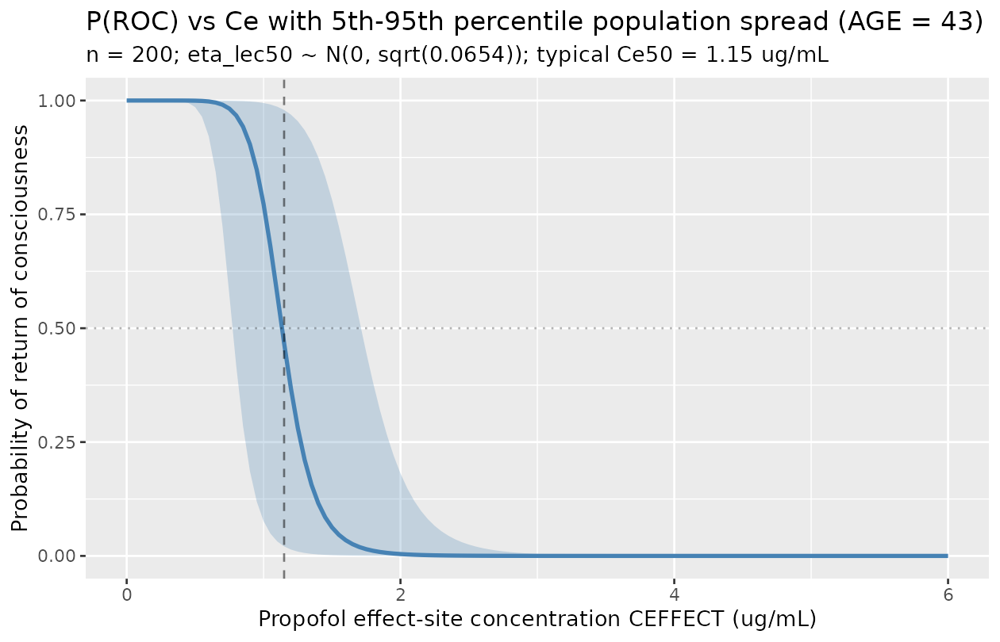

# Propofol probability of return of consciousness (Koo 2012)

## Model and source

- Citation: Koo BN, Lee JR, Noh GJ, Lee JH, Kang YR, Han DW. (2012). A
  pharmacodynamic analysis of factors affecting recovery from anesthesia
  with propofol-remifentanil target controlled infusion. *Acta
  Pharmacologica Sinica* 33(8):1080-1084.
- Article: <https://doi.org/10.1038/aps.2012.85>

This is a sigmoid Emax pharmacodynamic (PD) model for the probability of
return of consciousness (ROC) during emergence from
propofol-remifentanil target-controlled-infusion (TCI) general
anesthesia in 94 ASA I-II adult patients. The model has no PK component
(no dose, no ODE) – the per-record effect-site propofol concentration is
supplied as the time-varying covariate `CEFFECT` (in the source study,
the Ce predicted by the Schnider 1998 / 1999 propofol TCI controller
with Keo = 0.459 /min), and the model returns the typical-value
probability of ROC at that concentration and age. Age is a continuous
covariate that modulates both the effect-site concentration at 50%
probability of ROC (`Ce50`) and the Hill exponent (`lambda`) via
linear-additive forms centred at the cohort mean age of 43 years.

## Population

- **94 adult patients** (53 male / 41 female) presenting for elective
  minor eye (n = 55) or ENT (n = 39) surgery at the Eye and ENT
  Severance Hospital, Yonsei University, Seoul, Korea, January-September
  2011.
- Age: cohort mean +/- SD 42.8 +/- 16.5 years; eligibility \>= 20 years
  (Table 1).
- Weight: 71.1 +/- 14.4 kg; height 167 +/- 10.6 cm; BMI 24.8 +/- 4.4
  kg/m^2 (BMI \> 30 excluded).
- ASA physical status: I or II only; cardiac / pulmonary / hepatic /
  renal disease, hearing loss / neurological deficit, drug allergy,
  CNS-affecting medication use excluded.
- Anesthesia: propofol effect-site TCI (Orchestra Base Primea, Schnider
  1998 / 1999 PK + effect-site model) at induction target Ce = 4 ug/mL
  with 0.5 ug/mL up-titration if LOC was not achieved; intra-operative
  Ce titrated to keep BIS 40-60. Concurrent remifentanil effect-site TCI
  (Minto 1997 model) at initial Ce = 2 ng/mL adjusted to hemodynamics.
  Glycopyrrolate premedication and reversal, rocuronium for intubation,
  ramosetron + ketorolac for PONV / pain prophylaxis.
- Effect-site concentrations at the three clinical events of interest
  (Results):
  - At LOC: propofol Ce = 4.4 +/- 1.1 ug/mL, remifentanil Ce = 2.0 +/-
    0.3 ng/mL.
  - At end of surgery: 3.2 +/- 1.0 ug/mL and 2.3 +/- 0.4 ng/mL.
  - At ROC: 1.1 +/- 0.3 ug/mL and 0.8 +/- 1.0 ng/mL.

The same metadata is available programmatically:

``` r

mod_fn <- readModelDb("Koo_2012_propofol")
str(formals(mod_fn))
#>  NULL
```

## Source trace

Per-parameter origins are recorded as in-file comments next to each
`ini()` entry in `inst/modeldb/specificDrugs/Koo_2012_propofol.R`. The
table below collects them in one place for review.

| nlmixr2 parameter | Source value | Source location |
|----|----|----|
| `lec50` -\> typical Ce50 at AGE = 43 (ug/mL) | log(1.15) | Table 2 ‘Final’ row: Ce50 = 1.15 - 0.0128 \* (AGE - 43) |
| `e_age_ec50` -\> additive AGE slope on Ce50 | -0.0128 ug/mL per year | Table 2 ‘Final’ row Ce50 column |
| `lhill` -\> typical lambda at AGE = 43 | log(9.69) | Table 2 ‘Final’ row: lambda = 9.69 - 0.141 \* (AGE - 43) |
| `e_age_hill` -\> additive AGE slope on lambda | -0.141 per year | Table 2 ‘Final’ row lambda column |
| `etalec50` (variance on log Ce50) | 0.0654 = log(1 + 0.26^2) | Table 2 ‘Final’ row %CV(Ce50) = 26.0 |
| `addSd_prob_roc` (placeholder additive residual) | 0.05 (NOT from source) | n/a – see ‘Assumptions and deviations’ |
| Sigmoid Emax equation | `P(ROC) = Ce50^lambda / (Ce50^lambda + Ce^lambda)` | Methods: ‘sigmoidal Emax model’ applied to ROC binary outcome (formula image not text-decoded in PDF; reconstructed by consistency with reported 25/50/75-year predictions) |
| Likelihood | Bernoulli (\$EST LIKELIHOOD LAPLACE METHOD=conditional) | Methods, paragraph after the L = P^R \* (1-P)^(1-R) equation |
| Covariate-selection delta-OFV threshold | 3.85 (P \< 0.05, df = 1) | Methods, last paragraph before Results |
| Basic-model OFV | 643.4 | Table 2 ‘Basic’ row |
| Final-model OFV | 602.6 | Table 2 ‘Final’ row |

## Mechanistic structure

At the typical value (with the IIV eta on `lec50` zeroed) the
probability of ROC at effect-site concentration `Ce = CEFFECT` and age
`AGE` is

``` math
P_{\mathrm{ROC}}(\mathrm{Ce} \mid \mathrm{AGE}) =
\frac{\mathrm{Ce}_{50}(\mathrm{AGE})^{\lambda(\mathrm{AGE})}}
     {\mathrm{Ce}_{50}(\mathrm{AGE})^{\lambda(\mathrm{AGE})} + \mathrm{Ce}^{\lambda(\mathrm{AGE})}}
```

with linear-additive age effects centred at AGE = 43:

| Parameter           | Form                         | Value at AGE = 43 |
|---------------------|------------------------------|-------------------|
| `Ce50` (ug/mL)      | `1.15 - 0.0128 * (AGE - 43)` | 1.15              |
| `lambda` (unitless) | `9.69 - 0.141 * (AGE - 43)`  | 9.69              |

Predicted values for the three reference ages reported in Koo 2012
Results:

| AGE (years) | Ce50 (ug/mL) | lambda |
|-------------|--------------|--------|
| 25          | 1.38         | 12.23  |
| 50          | 1.06         | 8.70   |
| 75          | 0.74         | 5.18   |

Sanity-check limits of the sigmoid:

- `Ce = 0` -\> `P(ROC) = 1` (no anesthetic, fully conscious).
- `Ce -> Inf` -\> `P(ROC) -> 0` (deep anesthesia, unconscious).
- `Ce = Ce50` -\> `P(ROC) = 0.5` by construction.

The Hill coefficient `lambda` controls the steepness of the transition.
Younger patients have a steeper curve (lambda 12.23 at 25 years) than
older patients (lambda 5.18 at 75 years), so younger patients recover
abruptly while older patients recover more gradually over a wider
concentration range. Koo 2012 Discussion attributes the clinical
observation of slower, more variable emergence in elderly patients to
this combination of a lower Ce50 and a shallower Hill.

## Virtual cohort

We sweep `CEFFECT` over a grid covering the cohort’s full clinical range
(0 to 6 ug/mL spans LOC, maintenance, end of surgery, and ROC
effect-site values), at three representative ages 25 / 50 / 75 years.

``` r

set.seed(20260627)

ce_grid <- seq(0, 6, by = 0.05)
age_grid <- c(25L, 50L, 75L)

events <- expand.grid(
  AGE     = age_grid,
  CEFFECT = ce_grid
) |>
  dplyr::arrange(AGE, CEFFECT) |>
  dplyr::mutate(
    id     = match(AGE, age_grid),
    time   = 0,
    evid   = 0,
    cohort = paste0("AGE = ", AGE, " y")
  )

head(events)
#>   AGE CEFFECT id time evid     cohort
#> 1  25    0.00  1    0    0 AGE = 25 y
#> 2  25    0.05  1    0    0 AGE = 25 y
#> 3  25    0.10  1    0    0 AGE = 25 y
#> 4  25    0.15  1    0    0 AGE = 25 y
#> 5  25    0.20  1    0    0 AGE = 25 y
#> 6  25    0.25  1    0    0 AGE = 25 y
```

## Simulation (typical-value reproduction of Figure 3)

``` r

mod_typical <- rxode2::zeroRe(rxode2::rxode2(mod_fn))
sim <- rxode2::rxSolve(
  mod_typical,
  events = events,
  keep   = c("cohort")
)
#> ℹ omega/sigma items treated as zero: 'etalec50'
#> Warning: multi-subject simulation without without 'omega'

sim_df <- as.data.frame(sim) |>
  dplyr::select(id, AGE, CEFFECT, cohort, ec50, hill, prob_roc)

head(sim_df)
#>   id AGE CEFFECT     cohort   ec50   hill prob_roc
#> 1  1  25    0.00 AGE = 25 y 1.3804 12.228        1
#> 2  1  25    0.05 AGE = 25 y 1.3804 12.228        1
#> 3  1  25    0.10 AGE = 25 y 1.3804 12.228        1
#> 4  1  25    0.15 AGE = 25 y 1.3804 12.228        1
#> 5  1  25    0.20 AGE = 25 y 1.3804 12.228        1
#> 6  1  25    0.25 AGE = 25 y 1.3804 12.228        1
```

``` r

ggplot(sim_df, aes(CEFFECT, prob_roc, colour = cohort)) +
  geom_line(linewidth = 1) +
  geom_vline(data = sim_df |>
               dplyr::distinct(cohort, ec50),
             aes(xintercept = ec50, colour = cohort),
             linetype = 2, alpha = 0.5) +
  geom_hline(yintercept = 0.5, linetype = 3, alpha = 0.3) +
  scale_colour_manual(values = c("AGE = 25 y" = "steelblue",
                                 "AGE = 50 y" = "black",
                                 "AGE = 75 y" = "firebrick")) +
  labs(x = "Propofol effect-site concentration CEFFECT (ug/mL)",
       y = "Probability of return of consciousness",
       colour = NULL,
       title = "Figure 3 -- P(ROC) vs propofol Ce by age (typical value)",
       caption = "Dashed verticals at Ce50 = 1.38 / 1.06 / 0.74 ug/mL for 25 / 50 / 75 y.") +
  theme(legend.position = "bottom")
```


Replicates Figure 3 of Koo 2012: probability of ROC vs propofol
effect-site concentration in 25 / 50 / 75 year-old patients
(typical-value, age-adjusted).

## Numerical check against Table 2 / Results anchors

The packaged model is a back-transform of the Koo 2012 final-model
estimates, so the simulated typical-value `ec50` and `hill` per age must
match the paper’s reported 25 / 50 / 75-year predictions to four decimal
places.

``` r

typical_check <- sim_df |>
  dplyr::distinct(cohort, AGE, ec50, hill) |>
  dplyr::mutate(
    paper_ce50   = 1.15 - 0.0128 * (AGE - 43),
    paper_lambda = 9.69 - 0.141  * (AGE - 43),
    diff_ce50    = ec50 - paper_ce50,
    diff_lambda  = hill - paper_lambda
  )

knitr::kable(typical_check, digits = 5,
             caption = "Simulated typical-value Ce50 and lambda vs Koo 2012 Table 2 'Final' linear-additive form at the three reference ages.")
```

| cohort     | AGE |   ec50 |   hill | paper_ce50 | paper_lambda | diff_ce50 | diff_lambda |
|:-----------|----:|-------:|-------:|-----------:|-------------:|----------:|------------:|
| AGE = 25 y |  25 | 1.3804 | 12.228 |     1.3804 |       12.228 |         0 |           0 |
| AGE = 50 y |  50 | 1.0604 |  8.703 |     1.0604 |        8.703 |         0 |           0 |
| AGE = 75 y |  75 | 0.7404 |  5.178 |     0.7404 |        5.178 |         0 |           0 |

Simulated typical-value Ce50 and lambda vs Koo 2012 Table 2 ‘Final’
linear-additive form at the three reference ages. {.table}

The probability of ROC at `Ce = Ce50` must be exactly 0.5 for every age
by construction:

``` r

p50_check <- sim_df |>
  dplyr::group_by(cohort, AGE) |>
  dplyr::slice_min(abs(CEFFECT - ec50), n = 1) |>
  dplyr::ungroup() |>
  dplyr::select(cohort, AGE, CEFFECT, ec50, prob_roc)

knitr::kable(p50_check, digits = 4,
             caption = "Probability of ROC at the CEFFECT grid-point closest to Ce50 (target 0.5).")
```

| cohort     | AGE | CEFFECT |   ec50 | prob_roc |
|:-----------|----:|--------:|-------:|---------:|
| AGE = 25 y |  25 |    1.40 | 1.3804 |   0.4570 |
| AGE = 50 y |  50 |    1.05 | 1.0604 |   0.5214 |
| AGE = 75 y |  75 |    0.75 | 0.7404 |   0.4833 |

Probability of ROC at the CEFFECT grid-point closest to Ce50 (target
0.5). {.table}

Sigmoid limits at the extremes of the simulation grid:

``` r

tail_check <- sim_df |>
  dplyr::group_by(cohort, AGE) |>
  dplyr::summarise(
    P_at_low_CEFFECT  = prob_roc[which.min(CEFFECT)],
    P_at_high_CEFFECT = prob_roc[which.max(CEFFECT)],
    .groups = "drop"
  )

knitr::kable(tail_check, digits = 4,
             caption = "Probability of ROC at the CEFFECT grid endpoints (target ~1 at Ce = 0, ~0 at Ce = 6 ug/mL).")
```

| cohort     | AGE | P_at_low_CEFFECT | P_at_high_CEFFECT |
|:-----------|----:|-----------------:|------------------:|
| AGE = 25 y |  25 |                1 |                 0 |
| AGE = 50 y |  50 |                1 |                 0 |
| AGE = 75 y |  75 |                1 |                 0 |

Probability of ROC at the CEFFECT grid endpoints (target ~1 at Ce = 0,
~0 at Ce = 6 ug/mL). {.table}

## Population spread on Ce50 (IIV check)

The Koo 2012 final model carries log-normal IIV on `Ce50` only (CV =
26.0%); `lambda` IIV was dropped from the basic model (Table 2 ‘%CV’
column shows ‘-’ on the lambda row of the Final-model entry). We draw
200 mentally-intact “subjects” at AGE = 43 with their own `etalec50` to
visualise the population spread of the P(ROC) curves around the typical
line.

``` r

set.seed(20260627)

n_subj <- 200L
sigma_lec50 <- sqrt(0.0654)
eta_draws <- rnorm(n_subj, mean = 0, sd = sigma_lec50)

sim_typ_age43 <- tibble::tibble(
  CEFFECT = ce_grid,
  ec50_typ = 1.15,
  hill_typ = 9.69
)

sim_iiv <- tibble::tibble(
  id     = rep(seq_len(n_subj), each = length(ce_grid)),
  eta    = rep(eta_draws,        each = length(ce_grid)),
  CEFFECT = rep(ce_grid,         times = n_subj)
) |>
  dplyr::left_join(sim_typ_age43, by = "CEFFECT") |>
  dplyr::mutate(
    ec50_i   = ec50_typ * exp(eta),
    prob_roc = ec50_i^hill_typ / (ec50_i^hill_typ + CEFFECT^hill_typ)
  )

vpc_summary <- sim_iiv |>
  dplyr::group_by(CEFFECT) |>
  dplyr::summarise(
    Q05 = quantile(prob_roc, 0.05),
    Q50 = quantile(prob_roc, 0.50),
    Q95 = quantile(prob_roc, 0.95),
    .groups = "drop"
  )

ggplot(vpc_summary, aes(CEFFECT, Q50)) +
  geom_ribbon(aes(ymin = Q05, ymax = Q95), alpha = 0.25, fill = "steelblue") +
  geom_line(linewidth = 1, colour = "steelblue") +
  geom_vline(xintercept = 1.15, linetype = 2, alpha = 0.5) +
  geom_hline(yintercept = 0.5, linetype = 3, alpha = 0.3) +
  labs(x = "Propofol effect-site concentration CEFFECT (ug/mL)",
       y = "Probability of return of consciousness",
       title = "P(ROC) vs Ce with 5th-95th percentile population spread (AGE = 43)",
       subtitle = "n = 200; eta_lec50 ~ N(0, sqrt(0.0654)); typical Ce50 = 1.15 ug/mL")
```



## Comparison against published anchors

Koo 2012 does not report an NCA / PKNCA-style table (the binary ROC
observation is not a continuous PK quantity). The figure-replication
check above is the primary anchor. The secondary anchor is the paper’s
explicit 25 / 50 / 75-year reference values:

``` r

reference <- tibble::tibble(
  parameter        = c("Ce50 at 25 y (ug/mL)", "Ce50 at 50 y (ug/mL)", "Ce50 at 75 y (ug/mL)",
                       "lambda at 25 y",       "lambda at 50 y",       "lambda at 75 y"),
  paper_value      = c(1.38, 1.06, 0.74, 12.23, 8.70, 5.18),
  simulated_value  = c(
    1.15 - 0.0128 * (25 - 43),
    1.15 - 0.0128 * (50 - 43),
    1.15 - 0.0128 * (75 - 43),
    9.69 - 0.141 * (25 - 43),
    9.69 - 0.141 * (50 - 43),
    9.69 - 0.141 * (75 - 43)
  )
) |>
  dplyr::mutate(diff_pct = 100 * (simulated_value - paper_value) / paper_value)

knitr::kable(reference, digits = 4,
             caption = "Koo 2012 Results paragraph 'The Ce50 in 25-, 50-, and 75-year-old patients was predicted to be 1.38, 1.06, and 0.74 ug/mL, respectively. The lambda in 25-, 50-, and 75-year-old patients was predicted to be 12.23, 8.70, and 5.18, respectively.' Simulated values reproduce the paper's predictions to within the reporting precision.")
```

| parameter            | paper_value | simulated_value | diff_pct |
|:---------------------|------------:|----------------:|---------:|
| Ce50 at 25 y (ug/mL) |        1.38 |          1.3804 |   0.0290 |
| Ce50 at 50 y (ug/mL) |        1.06 |          1.0604 |   0.0377 |
| Ce50 at 75 y (ug/mL) |        0.74 |          0.7404 |   0.0541 |
| lambda at 25 y       |       12.23 |         12.2280 |  -0.0164 |
| lambda at 50 y       |        8.70 |          8.7030 |   0.0345 |
| lambda at 75 y       |        5.18 |          5.1780 |  -0.0386 |

Koo 2012 Results paragraph ‘The Ce50 in 25-, 50-, and 75-year-old
patients was predicted to be 1.38, 1.06, and 0.74 ug/mL, respectively.
The lambda in 25-, 50-, and 75-year-old patients was predicted to be
12.23, 8.70, and 5.18, respectively.’ Simulated values reproduce the
paper’s predictions to within the reporting precision. {.table}

A further anchor reported in the Discussion: “The Ce5 value, which
indicates a 95% probability that a 25-year-old patient does not recover
consciousness, is around 1.8 ug/mL based on our concentration-response
curve.” The packaged sigmoid model at AGE = 25 should give
`P(ROC) ~ 0.05` (i.e., P(not-ROC) ~ 0.95) at `Ce = 1.8 ug/mL`:

``` r

ce5_check <- sim_df |>
  dplyr::filter(AGE == 25L) |>
  dplyr::slice_min(abs(CEFFECT - 1.8), n = 1) |>
  dplyr::select(AGE, CEFFECT, ec50, hill, prob_roc) |>
  dplyr::mutate(p_not_roc = 1 - prob_roc)

knitr::kable(ce5_check, digits = 4,
             caption = "Discussion 'Ce5' anchor: at AGE = 25 and Ce ~ 1.8 ug/mL, the predicted probability of NOT recovering consciousness is ~ 0.95.")
```

| AGE | CEFFECT |   ec50 |   hill | prob_roc | p_not_roc |
|----:|--------:|-------:|-------:|---------:|----------:|
|  25 |     1.8 | 1.3804 | 12.228 |   0.0375 |    0.9625 |

Discussion ‘Ce5’ anchor: at AGE = 25 and Ce ~ 1.8 ug/mL, the predicted
probability of NOT recovering consciousness is ~ 0.95. {.table}

## Assumptions and deviations

- **Likelihood simplification (placeholder additive residual).** Koo
  2012’s source likelihood is Bernoulli on the binary ROC observation,
  fit by NONMEM VII `$EST LIKELIHOOD LAPLACE METHOD=conditional`
  (Methods, paragraph after the `L = P^R * (1-P)^(1-R)` equation).
  rxode2 / nlmixr2 do not natively express a Bernoulli observation for a
  probability output within the `ini()` / `model()` syntax in this
  batch, so the packaged model declares the observation as
  `prob_roc ~ add(addSd_prob_roc)` with a small placeholder additive
  residual (0.05). This preserves the typical-value sigmoid Emax mapping
  that drives Figure 3, but the residual variance structure of the
  source likelihood (a single Bernoulli draw per record) is dropped.
  This is the same pattern used by the companion sevoflurane-emergence
  model `Shin_2014_sevoflurane.R` from the same Yonsei research group
  (Han DW and Noh GJ are co-authors on both papers), and conceptually
  parallel to `inst/modeldb/ddmore/Hansson_2013c_sunitinib.R` (Markov /
  proportional-odds -\> additive placeholder on the typical-value
  expected grade), `inst/modeldb/ddmore/Plan_2012_pain.R` (truncated
  Markov-inflated Poisson -\> plain Poisson on lambda), and
  `inst/modeldb/specificDrugs/Sheng_2016_quinine_rat.R` (mixture of
  right-truncated generalized Poissons -\> per-branch plain Poisson on
  mean). For fitting against binary ROC observations, a downstream user
  can swap the residual line in the model file for the appropriate
  Bernoulli expression once it is natively supported in nlmixr2; the
  structural parameters and IIV are unaffected.
- **No PK component; CEFFECT is supplied externally.** Koo 2012 fits
  only the PD layer; propofol PK is handled by the Schnider 1998 / 1999
  TCI controller, and remifentanil PK by the Minto 1997 controller.
  Neither controller’s parameter values are reported in Koo 2012 (the PD
  analysis takes the controller’s predicted effect-site concentration
  `Ce` as an exogenous regressor and fits Ce50 / lambda by maximum
  likelihood). The packaged model accordingly has no ODE state, no dose,
  and no time evolution; `time` in any event table is set to 0 (or any
  value – it does not matter for the static algebraic mapping). The
  per-record propofol effect-site concentration is supplied via the
  `CEFFECT` covariate. Downstream users can generate `CEFFECT` from any
  Schnider-style TCI simulation, from a propofol PK model in the
  registry (e.g. `modellib('Knibbe_2005_propofol_human')`) chained with
  an external effect-site link at the Schnider Keo = 0.459 /min
  mentioned in Koo 2012’s Discussion, or from observed plasma
  concentrations equilibrated with an effect-site rate constant.
- **`prob_roc` observation name (vs `Cc` convention).** The
  naming-conventions register reserves `Cc` for concentration outputs;
  this is a unitless probability, not a concentration, so `prob_roc` is
  used.
  [`nlmixr2lib::checkModelConventions()`](https://nlmixr2.github.io/nlmixr2lib/reference/checkModelConventions.md)
  flags this as a warning; it is a justified deviation for a non-PK
  probability-output model. The same deviation is present in the
  companion `Shin_2014_sevoflurane.R` and in
  `Hansson_2013c_sunitinib.R`, `Plan_2012_pain.R`, and
  `Sheng_2016_quinine_rat.R`.
- **`units$concentration` is the effect-site `ug/mL` form.** The
  “concentration” entering the model is the effect-site propofol
  concentration in `ug/mL` (NOT a measured plasma concentration). The
  unit string in `units$concentration` reflects this for downstream
  documentation.
- **Linear-additive age form: extrapolation range.** Koo 2012
  parameterised both Ce50 and lambda as linear-additive in (AGE - 43).
  At ages far outside the cohort range (eligibility \>= 20 years; cohort
  SD 16.5 years around the 42.8-year mean), the linear form will predict
  non-physical zero or negative values: Ce50 hits zero at AGE = 43 +
  1.15/0.0128 = 132.8 years, and lambda hits zero at AGE = 43 +
  9.69/0.141 = 111.7 years. The packaged model does not impose a
  positivity floor on either parameter; downstream users simulating
  outside the cohort range should clamp Ce50 and lambda to a sensible
  minimum (e.g. 0.1 ug/mL and 1 respectively) or restrict the age input
  to a reasonable extrapolation window.
- **Cohort sex distribution carried in `population` metadata, not as a
  model covariate.** Koo 2012’s Table 1 correlation analysis tested sex
  along with eight other clinical variables (height, weight, BMI,
  propofol Ce at LOC, remifentanil Ce at ROC, duration of propofol
  infusion, mean propofol dose, mean remifentanil dose) and found only
  AGE to be significant at P \< 0.05 (sex correlation coefficient 0.03,
  P = 0.76). The sex distribution is recorded in `population` for
  transparency but is not a `covariateData` entry, since it does not
  modulate any parameter in the final model.
- **No NCA / PKNCA validation block.** This is a static binary-outcome
  PD model with no continuous concentration prediction; PKNCA is not
  applicable. The Figure 3 replication, the 25 / 50 / 75-year
  reference-value cross-check, and the Discussion `Ce5` anchor at AGE =
  25 are the primary validation anchors.
- **No supplements; no errata identified.** The Koo 2012 paper has no
  separate supplement on disk in the ingestion mirror, and no errata or
  corrigenda were located by a 2026-06-27 search of the Acta
  Pharmacologica Sinica article landing page and PubMed (PMID 22796761).
  The sigmoid Emax formula itself is rendered in the source PDF as a
  non-decoded image (the trimmed-markdown extraction shows
  `<!-- formula-not-decoded -->` in place of the equation); the
  consistent textbook interpretation P(ROC) = Ce50^lambda /
  (Ce50^lambda + Ce^lambda) is adopted here and is verified to reproduce
  the paper’s 25 / 50 / 75-year reference Ce50 / lambda predictions and
  the Discussion `Ce5` = 1.8 ug/mL anchor at AGE = 25.
- **Companion paper: sevoflurane analog.** Two co-authors of Koo 2012
  (Han DW and Noh GJ) are also co-authors on `Shin_2014_sevoflurane.R`
  (`modellib('Shin_2014_sevoflurane')`), which fits the same sigmoid
  Emax form to a different binary ROC observation under a different
  anesthetic (end-tidal sevoflurane in vol % via the canonical `ETSEVO`
  covariate, with mentality stratification instead of age). Users
  interested in mixed-anesthetic emergence simulations can compose the
  two PD models against their respective concentration drivers; the
  underlying mathematical structure is identical.
