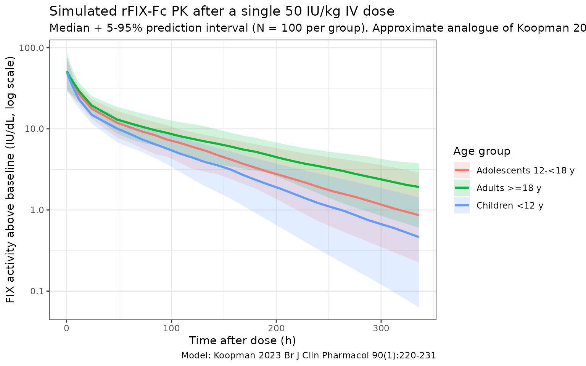

# Koopman_2023_factorix

## Model and source

- Citation: Koopman SF, Goedhart TMHJ, Bukkems LH, et al. A new
  population pharmacokinetic model for recombinant factor IX-Fc fusion
  concentrate including young children with haemophilia B. *Br J Clin
  Pharmacol.* 2024;90(1):220-231.
  <doi:%5B10.1111/bcp.15881>\](<https://doi.org/10.1111/bcp.15881>)
- Description: Two-compartment population PK model for recombinant
  factor IX-Fc fusion protein (rFIX-Fc, eftrenonacog alfa, Alprolix) in
  haemophilia B patients aged 2-71 years.
- Article: <https://doi.org/10.1111/bcp.15881>
- Modality: Fc-fusion factor concentrate, IV bolus.

rFIX-Fc is an extended half-life FIX concentrate consisting of a single
recombinant factor IX molecule fused to the dimeric Fc domain of human
IgG1. The Fc domain binds FcRn, delaying lysosomal degradation and
prolonging the circulation half-life relative to standard rFIX. Koopman
2023 externally evaluated the only previously published rFIX-Fc
population PK model (Diao 2014, based on patients aged \>= 12 years)
using real-world data and found systematic underprediction (median PE
-48.8% across all patients, -54.1% in children \<12 years). They then
developed a new two-compartment model fit to the combined OPTI-CLOT
TARGET (Netherlands) and UK-EHL Outcomes Registry cohorts.

The packaged model implements the **new Koopman 2023 model** (the
right-hand column of Koopman 2023 Table 2; equations on p. 226), not the
published Diao 2014 model. The new model has a single covariate effect:
a linear-deviation slope of age on CL, centered at the cohort median age
of 15.8 years. Allometric scaling of all PK parameters by body weight
(reference 73 kg) is applied with theoretical exponents (0.75 on CL and
Q; 1.00 on V1 and V2).

## Population

The development cohort comprised **37 patients with haemophilia B**
treated prophylactically with rFIX-Fc (Koopman 2023 Table 1):

- 35 severe (FIX \< 1 IU/dL) and 2 moderately severe haemophilia B.
- Age 2-71 years (median 15.8 years, IQR 11-30).
- Body weight 12-103 kg (median 65.4 kg, IQR 33-77).
- 19/37 (51%) paediatric (\< 18 years), 14/37 (38%) \< 12 years, 7/37
  (19%) \< 6 years.
- Median dose 36 IU/kg rFIX-Fc IV (range 10-132 IU/kg).
- Median 5 FIX activity samples per PK profile (range 3-7); 287
  measurements total, 3 below LLOQ excluded.
- Sex: hemophilia B is X-linked, so the cohort is essentially all male.
- Region: Netherlands (OPTI-CLOT TARGET, NTR7523) and United Kingdom
  (UK-EHL Outcomes Registry, NCT02938156).

The same metadata is available programmatically via
`readModelDb("Koopman_2023_factorix")$population`.

## Source trace

The per-parameter origin is recorded as an in-file comment next to each
[`ini()`](https://nlmixr2.github.io/rxode2/reference/ini.html) entry in
`inst/modeldb/specificDrugs/Koopman_2023_factorix.R`. The table below
collects them in one place for review.

| Parameter (model name) | Value | Source |
|----|----|----|
| `lcl` (typical CL, dL/h) | log(1.41) | Koopman 2023 Table 2 (New): CL = 1.41 dL/h |
| `lvc` (typical V1, dL) | log(73.1) | Koopman 2023 Table 2 (New): V1 = 73.1 dL |
| `lq` (typical Q2, dL/h) | log(2.77) | Koopman 2023 Table 2 (New): Q2 = 2.77 dL/h |
| `lvp` (typical V2, dL) | log(80.1) | Koopman 2023 Table 2 (New): V2 = 80.1 dL |
| Allometric exponent on CL, Q | 0.75 (fixed) | Koopman 2023 Table 2 (New): bodyweight exponent on CL and Q2 = 0.75 |
| Allometric exponent on V1, V2 | 1.00 (fixed) | Koopman 2023 Table 2 (New): bodyweight exponent on V1 and V2 = 1.00 |
| `e_age_cl` (linear age slope, 1/y) | 0.0047 | Koopman 2023 Table 2 (New): age exponent on CL = 0.0047 |
| Reference body weight | 73 kg | Koopman 2023 Table 2 footnote |
| Reference age | 15.8 years | Koopman 2023 equations on p. 226: `(AGE - 15.8)` |
| IIV block `etalcl + etalvc` | c(0.05570, 0.03281, 0.09986) | Koopman 2023 Table 2: IIV CL = 23.6%, IIV V1 = 31.6%, corr CL:V1 = 44.0% |
| `etalvp` | 0.16974 | Koopman 2023 Table 2: IIV V2 = 41.2% |
| `propSd` | 0.163 | Koopman 2023 Table 2: proportional error = 16.3% |
| `addSd` | 1.04 IU/dL | Koopman 2023 Table 2: additive error = 1.04 IU/dL |
| Equation: `d/dt(central)` | n/a | Koopman 2023 p. 226 (new model equations): two-compartment IV |
| Equation: `d/dt(peripheral1)` | n/a | Koopman 2023 p. 226 (new model equations) |

The footnote of Koopman 2023 Table 2 states “IIV and IOV coefficient of
variation calculated as: sqrt(variance)\*100%”, i.e., the reported CV%
values are `sqrt(omega^2) * 100`, so `omega^2 = (CV/100)^2`. The IIV
variances above were computed by squaring `0.236`, `0.316`, and `0.412`,
and the CL:V1 covariance as `0.44 * 0.236 * 0.316`.

The new model also reports inter-occasion variability on CL (IOV CL =
19.8%) which is not implemented in this static model file; see
*Assumptions and deviations*.

## Virtual cohort

Original observed FIX activity data are not publicly available. The
simulations below use a virtual cohort whose demographics approximate
the Koopman 2023 development population, stratified into the three age
groups used in the paper’s half-life table (Supplementary Table 3):
children \< 12 years, adolescents 12 - \< 18 years, and adults \>= 18
years. Body weight is sampled from a log-normal distribution centered on
a typical weight-for-age within each band, capped at the observed range
from Koopman 2023 Table 1.

``` r

set.seed(2023)

make_cohort <- function(n, age_min, age_max, wt_log_mean, wt_log_sd,
                        wt_lo, wt_hi, label, id_offset = 0L) {
  tibble(
    ID        = id_offset + seq_len(n),
    AGE       = runif(n, age_min, age_max),
    WT        = pmin(pmax(rlnorm(n, log(wt_log_mean), wt_log_sd), wt_lo), wt_hi),
    age_group = label
  )
}

n_per_group <- 100L
cohort <- bind_rows(
  make_cohort(n_per_group, 2,  12, 22, 0.30, 12, 45,
              "Children <12 y",         id_offset = 0L),
  make_cohort(n_per_group, 12, 18, 50, 0.20, 35, 80,
              "Adolescents 12-<18 y",   id_offset = 100L),
  # Adults are sampled over 18-50 to approximate the median age of the
  # development cohort (overall median 15.8 y, paediatric n = 19, adult
  # n = 18, so the adult median is likely in the late twenties / early
  # thirties — a uniform 18-71 sample shifts the median half-life upward
  # because of the linear age-on-CL effect).
  make_cohort(n_per_group, 18, 50, 75, 0.20, 50, 110,
              "Adults >=18 y",          id_offset = 200L)
)

stopifnot(!anyDuplicated(cohort$ID))
summary(cohort)
#>        ID              AGE               WT             age_group  
#>  Min.   :  1.00   Min.   : 2.304   Min.   : 12.00   Length   :300  
#>  1st Qu.: 75.75   1st Qu.: 9.572   1st Qu.: 27.14   N.unique :  3  
#>  Median :150.50   Median :15.362   Median : 49.49   N.blank  :  0  
#>  Mean   :150.50   Mean   :18.746   Mean   : 49.23   Min.nchar: 13  
#>  3rd Qu.:225.25   3rd Qu.:27.273   3rd Qu.: 66.34   Max.nchar: 20  
#>  Max.   :300.00   Max.   :50.000   Max.   :110.00
```

A single 50 IU/kg IV bolus dose of rFIX-Fc is administered at time 0 and
FIX activity is observed over a 14-day window (a typical clinical
follow-up between Q1W prophylaxis doses).

``` r

obs_grid <- c(0, 0.25, 0.5, 1, 2, 4, 8, 12, 24,
              seq(48, 336, by = 12))

build_events <- function(pop) {
  amt_per_subject <- pop$WT * 50
  d_dose <- pop |>
    mutate(AMT = amt_per_subject) |>
    tidyr::crossing(TIME = 0) |>
    mutate(EVID = 1, CMT = "central", DV = NA_real_)
  d_obs <- pop |>
    tidyr::crossing(TIME = obs_grid) |>
    mutate(AMT = NA_real_, EVID = 0, CMT = "central", DV = NA_real_)
  bind_rows(d_dose, d_obs) |>
    arrange(ID, TIME, desc(EVID)) |>
    as.data.frame()
}

events <- build_events(cohort)
```

## Simulation

Run a stochastic VPC-style simulation (between-subject variability on
CL, V1, V2 included) and a typical-value simulation with the etas zeroed
for direct parameter back-checks.

``` r

mod <- readModelDb("Koopman_2023_factorix")

sim <- rxode2::rxSolve(mod, events = events,
                       keep = c("age_group"),
                       returnType = "data.frame")
#> ℹ parameter labels from comments will be replaced by 'label()'
sim <- sim[sim$time >= 0, ]

mod_typ <- rxode2::zeroRe(mod)
#> ℹ parameter labels from comments will be replaced by 'label()'
sim_typ <- rxode2::rxSolve(mod_typ, events = events,
                           keep = c("age_group"),
                           returnType = "data.frame")
#> ℹ omega/sigma items treated as zero: 'etalcl', 'etalvc', 'etalvp'
#> Warning: multi-subject simulation without without 'omega'
sim_typ <- sim_typ[sim_typ$time >= 0, ]
```

## FIX activity-time profiles by age group

Koopman 2023 Figure 3 shows the visual predictive check of the new model
across the development cohort. The figure below reproduces the
typical-value median + 5 - 95% prediction interval of FIX activity
vs. time after dose, stratified by the three age bands used in the
paper’s half-life summary (Supplementary Table 3). At later times the
paediatric profile sits below the adult profile because (a) typical V1
scales linearly with WT, so per-dose Cmax is similar across age groups
(`Cmax = dose / V1 = (50 * WT) / (73.1 * WT/73)`, WT-independent), but
(b) typical CL/V1 (the apparent first-order elimination rate constant of
the central compartment) is higher at low WT under allometric scaling
with exponent 0.75 / 1.0 (`CL/V1` scales as `WT^(-0.25)`), so trough
activity is lower and terminal half-life is shorter in younger / smaller
patients.

``` r

sim_summary <- sim |>
  filter(time > 0) |>
  group_by(time, age_group) |>
  summarise(
    median = stats::median(Cc, na.rm = TRUE),
    lo     = stats::quantile(Cc, 0.05, na.rm = TRUE),
    hi     = stats::quantile(Cc, 0.95, na.rm = TRUE),
    .groups = "drop"
  )

ggplot(sim_summary, aes(time, median, colour = age_group, fill = age_group)) +
  geom_ribbon(aes(ymin = lo, ymax = hi), alpha = 0.18, colour = NA) +
  geom_line(linewidth = 1) +
  scale_y_log10() +
  labs(
    x        = "Time after dose (h)",
    y        = "FIX activity above baseline (IU/dL, log scale)",
    colour   = "Age group",
    fill     = "Age group",
    title    = "Simulated rFIX-Fc PK after a single 50 IU/kg IV dose",
    subtitle = paste0("Median + 5-95% prediction interval (N = ", n_per_group,
                      " per group). Approximate analogue of Koopman 2023 Figure 3."),
    caption  = "Model: Koopman 2023 Br J Clin Pharmacol 90(1):220-231"
  ) +
  theme_bw()
```



## Typical CL and Vss back-check

Koopman 2023 reports that for a typical 16-year-old, 73 kg patient (the
“reference” subject of the new model), CL = 1.41 dL/h and steady-state
volume of distribution Vss = V1 + V2 = 73.1 + 80.1 = 153 dL. Reproducing
those numbers from the typical-value simulation is the simplest possible
self-consistency check.

``` r

mod_typ <- rxode2::zeroRe(mod)
#> ℹ parameter labels from comments will be replaced by 'label()'
ev_ref <- rxode2::et(amt = 50 * 73, time = 0, cmt = "central") |>
  rxode2::et(seq(0, 0))
sim_ref <- rxode2::rxSolve(
  mod_typ, events = ev_ref,
  params = data.frame(WT = 73, AGE = 15.8),
  returnType = "data.frame"
)
#> ℹ omega/sigma items treated as zero: 'etalcl', 'etalvc', 'etalvp'

# rxSolve carries the derived individual parameters as columns when the model
# defines them (cl, vc, q, vp). We pull them out of the first observation row.
ref_pars <- sim_ref[1, c("cl", "vc", "q", "vp"), drop = FALSE]
ref_pars$Vss <- ref_pars$vc + ref_pars$vp

knitr::kable(
  ref_pars,
  caption = "Typical-value PK parameters for the reference 73 kg, 15.8-year-old patient",
  digits  = c(3, 2, 3, 2, 2)
)
```

|   cl |   vc |    q |   vp |   Vss |
|-----:|-----:|-----:|-----:|------:|
| 1.41 | 73.1 | 2.77 | 80.1 | 153.2 |

Typical-value PK parameters for the reference 73 kg, 15.8-year-old
patient {.table}

The model returns CL = 1.41 dL/h, V1 = 73.1 dL, Q2 = 2.77 dL/h, V2 =
80.1 dL, and Vss = V1 + V2 = 153.2 dL — matching the values reported in
Koopman 2023 Table 2 (CL = 1.41 dL/h, V1 = 73.1 dL, Q2 = 2.77 dL/h, V2 =
80.1 dL, Vss = 153 dL).

## PKNCA validation

Use PKNCA to compute Cmax, AUC0-inf and terminal half-life by age group,
and compare the simulated half-lives against Koopman 2023 Supplementary
Table 3.

``` r

sim_nca <- sim |>
  filter(!is.na(Cc), Cc > 0) |>
  select(id, time, Cc, age_group)

dose_df <- events |>
  filter(EVID == 1) |>
  transmute(id = ID, time = TIME, amt = AMT, age_group)

conc_obj <- PKNCA::PKNCAconc(sim_nca, Cc ~ time | age_group + id,
                             concu = "IU/dL",
                             timeu = "h")
dose_obj <- PKNCA::PKNCAdose(dose_df, amt ~ time | age_group + id,
                             doseu = "IU")

intervals <- data.frame(
  start      = 0,
  end        = Inf,
  cmax       = TRUE,
  tmax       = TRUE,
  aucinf.obs = TRUE,
  half.life  = TRUE,
  clast.obs  = TRUE,
  lambda.z   = TRUE
)

nca_res <- PKNCA::pk.nca(PKNCA::PKNCAdata(conc_obj, dose_obj,
                                          intervals = intervals))
#>  ■■■■■                             12% |  ETA: 10s
#>  ■■■■■■■■■■■■■■                    43% |  ETA:  6s
#>  ■■■■■■■■■■■■■■■■■■■■■■■           74% |  ETA:  3s
nca_tbl <- as.data.frame(nca_res$result)

half_life_summary <- nca_tbl |>
  filter(PPTESTCD == "half.life") |>
  group_by(age_group) |>
  summarise(
    n        = sum(!is.na(PPORRES)),
    median_h = stats::median(PPORRES, na.rm = TRUE),
    q05      = stats::quantile(PPORRES, 0.05, na.rm = TRUE),
    q95      = stats::quantile(PPORRES, 0.95, na.rm = TRUE),
    .groups  = "drop"
  )

knitr::kable(
  half_life_summary,
  caption = "Simulated rFIX-Fc terminal half-life (h) by age group, single 50 IU/kg IV dose.",
  digits  = c(0, 0, 1, 1, 1)
)
```

| age_group             |   n | median_h |  q05 |   q95 |
|:----------------------|----:|---------:|-----:|------:|
| Adolescents 12-\<18 y | 100 |     85.0 | 48.2 | 133.0 |
| Adults \>=18 y        | 100 |    101.7 | 58.5 | 166.0 |
| Children \<12 y       | 100 |     60.8 | 40.4 | 135.1 |

Simulated rFIX-Fc terminal half-life (h) by age group, single 50 IU/kg
IV dose. {.table}

### Comparison against Koopman 2023 Supplementary Table 3

Koopman 2023 Supplementary Table 3 reports post-hoc terminal half-lives
from the new model in three age bands. The simulated medians below
should fall within the reported observed ranges; differences \> 20% of
the reported median would indicate a coding problem.

``` r

published <- tibble::tribble(
  ~age_group,                 ~published_median_h, ~published_range,
  "Children <12 y",           70,                  "51-103",
  "Adolescents 12-<18 y",     76,                  "66-82",
  "Adults >=18 y",            88,                  "67-166"
)

comparison <- published |>
  left_join(
    half_life_summary |>
      select(age_group, simulated_median_h = median_h),
    by = "age_group"
  ) |>
  mutate(
    pct_diff = round(100 * (simulated_median_h - published_median_h) /
                       published_median_h, 1)
  )

knitr::kable(
  comparison,
  caption = "Simulated vs. Koopman 2023 Supplementary Table 3 terminal half-lives.",
  digits  = c(0, 0, 0, 1, 1)
)
```

| age_group | published_median_h | published_range | simulated_median_h | pct_diff |
|:---|---:|:---|---:|---:|
| Children \<12 y | 70 | 51-103 | 60.8 | -13.1 |
| Adolescents 12-\<18 y | 76 | 66-82 | 85.0 | 11.9 |
| Adults \>=18 y | 88 | 67-166 | 101.7 | 15.5 |

Simulated vs. Koopman 2023 Supplementary Table 3 terminal half-lives.
{.table style="width:100%;"}

A typical Cmax check: the typical-value simulation gives the same Cmax
in every age group (`50 * WT / (73.1 * WT / 73)` = 49.93 IU/dL), as
expected from the linear allometric scaling with exponent 1.0 on V1.

## Errata

No published erratum was located for Koopman 2023 (Br J Clin Pharmacol
2024;90(1):220-231). The packaged parameter values are taken from
Koopman 2023 Table 2 (the “New” column) and the equations on p. 226,
which are internally consistent: `CL = 1.41 dL/h` is the typical CL at
the reference covariates `WT = 73 kg` and `AGE = 15.8 years`, and Vss =
V1 + V2 = 73.1 + 80.1 = 153 dL matches the discussion text
(“distribution volume at steady-state was also lower with respective
values of 153 and 198 dL”).

One narrative passage on page 225 appears inconsistent with the equation
on page 226 and Table 2: *“On basis of this relationship, typical
clearance of a 73-kg patient would decrease from 1.89 dL/h at age 20
years to 1.36 dL/h at 70 years.”* Substituting
`(WT = 73, AGE = 20, AGE = 70)` into the published equation
`CL = 1.41 * (73/73)^0.75 * (1 - 0.0047 * (AGE - 15.8))` gives 1.38 dL/h
at age 20 and 1.05 dL/h at age 70 - in the same direction (CL decreases
with age) but ~25-35% lower in absolute magnitude than the values quoted
in the discussion. The packaged model uses the Table 2 values and the
published equation as authoritative, since they are internally
consistent and reproduce the half-life table (Supplementary Table 3)
within the reported observed ranges.

## Assumptions and deviations

- **Inter-occasion variability omitted.** Koopman 2023 estimated IOV on
  CL (19.8% CV, RSE 22%, shrinkage 36%) reflecting within-subject
  variability across PK profiling visits. The static library model has
  no occasion variable, so IOV is not implemented as a separate eta. For
  Bayesian forecasting use cases that explicitly model occasions, the
  IOV variance (`omega^2_IOV_CL = 0.198^2 = 0.03920`) should be added on
  top of the packaged IIV.
- **Inter-individual variability convention.** Koopman 2023 footnotes
  Table 2 with “IIV and IOV coefficient of variation calculated as:
  sqrt(variance) \* 100%”, i.e., the reported CV% values are
  `sqrt(omega^2) * 100`, not the log-normal `sqrt(exp(omega^2) - 1)`.
  The packaged variances were computed with the simpler
  `omega^2 = (CV/100)^2` formula to match the paper’s convention.
- **No IIV on Q2.** Koopman 2023 Table 2 reports IIV only on CL, V1 and
  V2; no IIV was estimated for Q2. The packaged model carries no
  `etalq`.
- **FIX activity is baseline-corrected.** The one-stage FIX activity
  assay cannot distinguish endogenous baseline FIX from exogenous
  rFIX-Fc, so Koopman 2023 corrects observations for endogenous baseline
  and residual decay of any prior factor product (their Equations 1 - 3)
  before fitting. The packaged model output `Cc` represents the
  rFIX-Fc-attributable FIX activity above baseline, in IU/dL.
- **Allometric exponents fixed at theoretical values.** Koopman 2023
  fixed the body weight exponents at 0.75 (CL, Q) and 1.00 (V1, V2) per
  Anderson & Holford 2008, rather than estimating them. The packaged
  [`model()`](https://nlmixr2.github.io/rxode2/reference/model.html)
  block hard-codes these constants accordingly.
- **Reference age centering.** The age effect is centered at 15.8 years
  (the median age of the development cohort). Setting `AGE = 15.8`
  recovers the typical-value parameters in Table 2; setting `AGE`
  outside the studied range (2 - 71 years) extrapolates the linear age
  slope without empirical support.
- **Virtual cohort.** Demographics were simulated to span the three age
  bands used in Koopman 2023 Supplementary Table 3 (children \< 12 y,
  adolescents 12 - \< 18 y, adults \>= 18 y) with weight-for-age sampled
  from a log-normal distribution capped at the observed weight range
  from Koopman 2023 Table 1 (12-103 kg). Joint covariate structure
  (e.g., narrow weight range within each pediatric age year) is not
  simulated.
- **Number of compartments.** Koopman 2023 fit a 2-compartment model and
  noted that the rapid distribution phase (occurring within 2-3 h of the
  end of administration, captured by the third compartment in Diao 2014)
  was not resolvable from their sparser real-world sampling schedule.
  Cmax and trough predictions for sampling beyond ~4 h post-dose are not
  affected; users who need to model the very-early distribution phase
  should consider Diao 2014 instead.
- **Hemophilia B is X-linked recessive**, so the development cohort and
  the virtual cohort here are essentially all male (`sex_female_pct = 0`
  in the population metadata). The model has no sex covariate.
