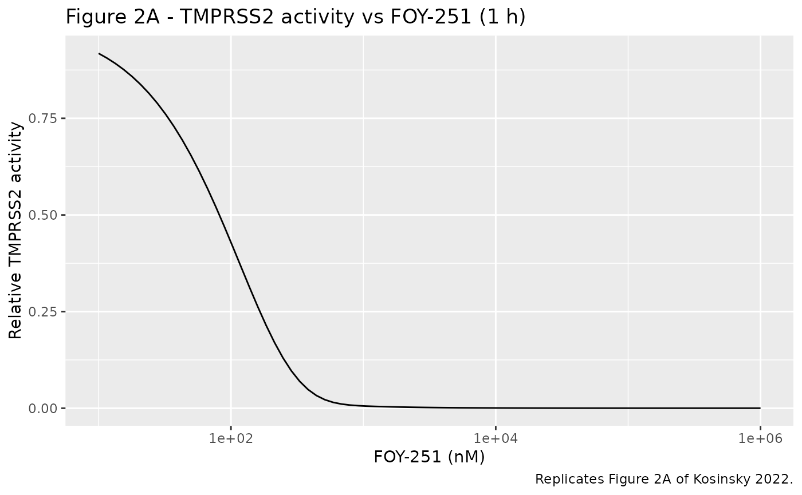
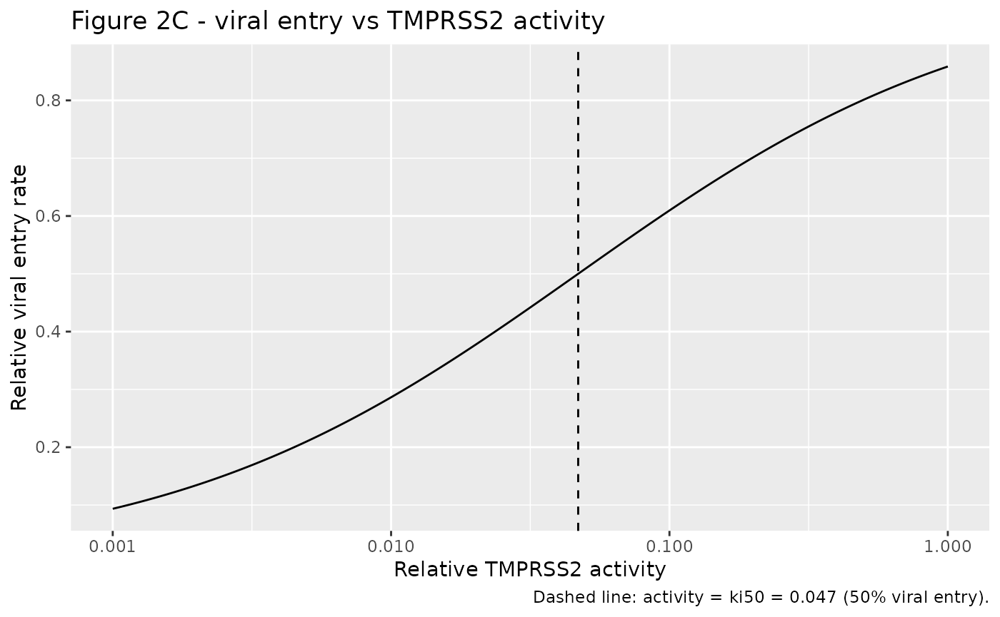
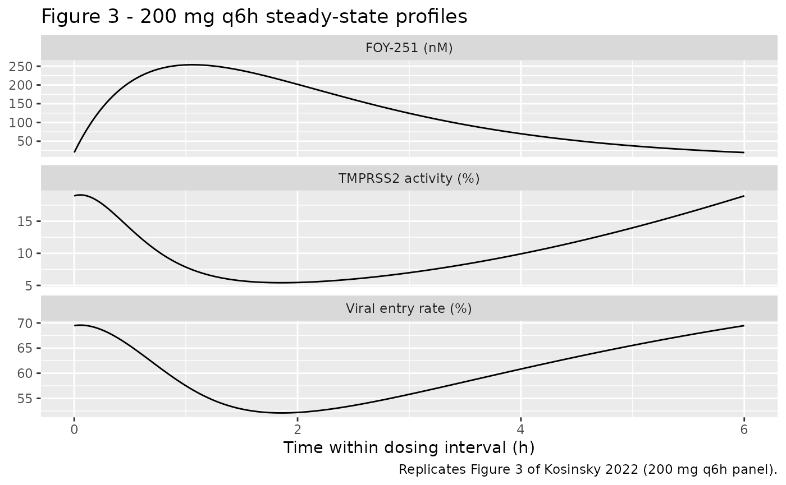

# Camostat / FOY-251 TMPRSS2 PK/PD against SARS-CoV-2 (Kosinsky 2022)

## Model and source

Kosinsky et al. (2022) built a semi-mechanistic PK/PD model for the oral
serine protease inhibitor camostat mesylate and its active metabolite
FOY-251, to predict inhibition of host TMPRSS2 and, through it, of
SARS-CoV-2 cell entry. The paper contributes two packaged models:

- **`Kosinsky_2022_camostat_invitro`** – the in-vitro PD model fit to
  cell-free recombinant TMPRSS2 activity and SARS-2-S pseudovirus entry
  (Hoffmann et al. 2020 data). It estimates the inhibition constant
  `ki`, the half-maximal activity `ki50`, and the Hill coefficient.
- **`Kosinsky_2022_camostat_pkpd`** – the in-vivo semi-mechanistic PK/PD
  model: one-compartment FOY-251 PK driving a TMPRSS2
  covalent-inhibition turnover model, with the PD parameters carried
  from the in-vitro fit. It is used for the dose-regimen simulations.

``` r

inv <- readModelDb("Kosinsky_2022_camostat_invitro")
pkpd <- readModelDb("Kosinsky_2022_camostat_pkpd")
```

- Citation: Kosinsky Y, Peskov K, Stanski DR, Wetmore D, Vinetz J.
  Semi-Mechanistic Pharmacokinetic-Pharmacodynamic Model of Camostat
  Mesylate-Predicted Efficacy against SARS-CoV-2 in COVID-19. Microbiol
  Spectr. 2022;10(2):e02167-21. <doi:10.1128/spectrum.02167-21>. PK
  parameters in Table 1; PD parameters in Table 2; the in-vivo PK/PD
  ODEs are Equations 1 and 5 of Materials and Methods.
- Article: <https://doi.org/10.1128/spectrum.02167-21> (open access, CC
  BY 4.0)
- Supplement: publisher supplementary PDF (ELF-compartment extension,
  Figures S1-S4).

## Population

The PK model was fit to **digitised human FOY-251 plasma profiles**: a
12-h intravenous infusion of camostat (Midgley et al. 1994,
*Xenobiotica* 24:79-92) and a single oral dose from the FOIPAN package
insert (Kosinsky 2022 Results, Figure S1). Because camostat is
hydrolysed by plasma esterases too rapidly to quantify, FOY-251 is the
only measured analyte. The FOY-251 volume of distribution (22.4 L)
approximates the extracellular water space and the terminal half-life is
about 0.6 h.

The PD parameters come from **in-vitro experiments** of Hoffmann et
al. (2020): recombinant TMPRSS2 enzymatic activity after 1 h incubation
with FOY-251, and SARS-2-S-driven pseudovirus entry after 2 h
incubation. No subject-level cohort or between-subject variability was
reported; the model is deterministic and used for dose-regimen
simulations.

Both models expose this provenance through their `population` metadata,
e.g. `readModelDb("Kosinsky_2022_camostat_pkpd")()$population`.

## Source trace

In-vivo PK/PD model (`Kosinsky_2022_camostat_pkpd`):

| Equation / parameter | Value | Source location |
|----|----|----|
| `lka` (ka) | 0.67 1/h | Table 1 (RSE 5.78%) |
| `lfdepot` (F) | 0.051 | Table 1 (RSE 4.66%) |
| `lvc` (Vd) | 22.36 L | Table 1 (RSE 7.07%) |
| `lkel` (kel) | 1.22 1/h | Table 1 (RSE 4.70%) |
| `propSd` | 0.14 | Table 1 (RSE 17.3%) |
| `lki` (ki) | 45638.51 nM | Table 2 (RSE 7.46%) |
| `kcat` (fixed) | 400 1/h | Table 2 (fixed) |
| `kdis` (fixed) | 0.049 1/h | Table 2 (fixed; 14 h complex half-life) |
| `kdeg` (fixed) | 0.0575 1/h | Methods = log(2)/12 h (assumed enzyme half-life) |
| `lki50` (Ksp) | 0.047 | Table 2 (RSE 42.4%) |
| `hill` (h) | 0.59 | Table 2 (RSE 16.6%) |
| `d/dt(depot)`, `d/dt(central)` | n/a | Equation 1 |
| `d/dt(target)`, `d/dt(complex)` | n/a | Equation 5 |
| `viralentry` (Hill) | n/a | Equation 4 |

In-vitro model (`Kosinsky_2022_camostat_invitro`): the same `ki`
(estimated), `kcat`/`kdis` (fixed), `ki50`, and `hill`, with additive
residual error `addSd_tmprss2` = 0.0346 (Table 2 a1 = 3.46%) and
`addSd_viralentry` = 0.0758 (Table 2 a2 = 7.58%); in-vitro ODEs are
Equation 3 and the viral-entry link is Equation 4.

## In-vitro model: TMPRSS2 inhibition and viral entry

The in-vitro model integrates the covalent-inhibition ODEs at a fixed
applied FOY-251 concentration (`CONC_FOY251_NM`), reading TMPRSS2
activity at 1 h and viral entry at 2 h. We sweep the applied
concentration to reproduce the dose-response relationships of Figure 2.

``` r

conc_grid <- 10^seq(1, 6, length.out = 80) # nM
obs_times <- c(0, 0.5, 1, 1.5, 2)
# This model has two `~` residual endpoints (TMPRSS2 activity and viral entry),
# so observation rows carry `cmt = "target"` (a real ODE state) with an explicit
# `dvid`, and `useLinCmt = FALSE` keeps the dvid mapping intact. rxSolve returns
# both `tmprss2` and `viralentry` as columns regardless. No dose is needed --
# the model sets target(0) = 1 internally.
ev_inv <- lapply(seq_along(conc_grid), function(i) {
  data.frame(
    id = i, time = obs_times, amt = NA_real_, cmt = "target",
    evid = 0L, dvid = 1L, CONC_FOY251_NM = conc_grid[i]
  )
}) |>
  dplyr::bind_rows()

sim_inv <- rxode2::rxSolve(inv, ev_inv, keep = "CONC_FOY251_NM", useLinCmt = FALSE) |>
  as.data.frame()
#> Warning: multi-subject simulation without without 'omega'

act_1h <- sim_inv |>
  dplyr::filter(abs(time - 1) < 1e-6) |>
  dplyr::transmute(conc = CONC_FOY251_NM, tmprss2_activity = tmprss2)
ve_2h <- sim_inv |>
  dplyr::filter(abs(time - 2) < 1e-6) |>
  dplyr::transmute(conc = CONC_FOY251_NM, viral_entry = viralentry)
```

``` r

# Replicates Figure 2A of Kosinsky 2022: recombinant TMPRSS2 activity (relative
# to control) versus FOY-251 concentration after 1 h incubation.
ggplot(act_1h, aes(conc, tmprss2_activity)) +
  geom_line() +
  scale_x_log10() +
  labs(
    x = "FOY-251 (nM)", y = "Relative TMPRSS2 activity",
    title = "Figure 2A - TMPRSS2 activity vs FOY-251 (1 h)",
    caption = "Replicates Figure 2A of Kosinsky 2022."
  )
```



``` r

# Replicates Figure 2C of Kosinsky 2022: viral entry rate as a function of the
# model-predicted remaining TMPRSS2 activity (Hill-Langmuir link, Equation 4).
act_grid <- tibble::tibble(sp = 10^seq(-3, 0, length.out = 200))
ksp <- 0.047
h <- 0.59
act_grid$viral_entry <- act_grid$sp^h / (act_grid$sp^h + ksp^h)
ggplot(act_grid, aes(sp, viral_entry)) +
  geom_line() +
  geom_vline(xintercept = ksp, linetype = "dashed") +
  scale_x_log10() +
  labs(
    x = "Relative TMPRSS2 activity", y = "Relative viral entry rate",
    title = "Figure 2C - viral entry vs TMPRSS2 activity",
    caption = "Dashed line: activity = ki50 = 0.047 (50% viral entry)."
  )
```



The key published claim is that **about 95% inhibition of TMPRSS2 is
required for 50% inhibition of the viral entry rate**. By construction
of the Hill-Langmuir half-maximum, viral entry equals 50% exactly when
remaining TMPRSS2 activity equals `ki50` = 0.047 (i.e. 95.3% TMPRSS2
inhibition).

``` r

ve_at_ki50 <- ksp^h / (ksp^h + ksp^h)
tmprss2_inhibition_at_half_entry <- 1 - ksp
stopifnot(
  # Half-maximal viral entry is at activity = ki50 (structural identity).
  abs(ve_at_ki50 - 0.5) < 1e-8,
  # which corresponds to ~95% TMPRSS2 inhibition.
  abs(tmprss2_inhibition_at_half_entry - 0.953) < 1e-3
)
ve_at_ki50
#> [1] 0.5
tmprss2_inhibition_at_half_entry
#> [1] 0.953
```

## In-vivo PK/PD: dose-regimen simulations

The in-vivo model is simulated to steady state for each camostat dosing
regimen. Camostat mesylate doses in mg are converted to
FOY-251-equimolar nmol using the camostat mesylate molecular weight
(494.52 g/mol; see Assumptions).

``` r

mw_camostat_mesylate <- 494.52 # g/mol (camostat mesylate salt, PubChem CID 5284360)
to_nmol <- function(mg) mg / mw_camostat_mesylate * 1e6

regimens <- tibble::tribble(
  ~regimen,    ~mg,  ~tau,
  "200 q8h",   200,  8,
  "200 q6h",   200,  6,
  "400 q6h",   400,  6,
  "600 q6h",   600,  6
)

sim_one <- function(mg, tau) {
  horizon <- 24 * 10
  t0 <- horizon - tau
  ev <- rxode2::et() |>
    rxode2::et(amt = to_nmol(mg), ii = tau, until = horizon, cmt = "depot") |>
    rxode2::et(seq(t0, horizon, length.out = 400))
  s <- rxode2::rxSolve(pkpd, ev, atol = 1e-10, rtol = 1e-8, maxsteps = 1e6)
  s[s$time >= t0, ]
}

time_avg <- function(x, t) {
  sum(diff(t) * (head(x, -1) + tail(x, -1)) / 2) / (max(t) - min(t))
}

ss_tab <- regimens |>
  rowwise() |>
  mutate(
    .sim = list(sim_one(mg, tau)),
    Cc_avg = time_avg(.sim$Cc, .sim$time),
    TMPRSS2_pct = time_avg(.sim$tmprss2, .sim$time),
    ViralEntry_pct = time_avg(.sim$viralentry, .sim$time)
  ) |>
  ungroup() |>
  select(regimen, Cc_avg, TMPRSS2_pct, ViralEntry_pct)
```

``` r

# Table 3 of Kosinsky 2022 (time-averaged model outcomes at steady state).
published3 <- tibble::tribble(
  ~regimen,  ~Cc_avg_pub, ~TMPRSS2_pub, ~ViralEntry_pub,
  "200 q8h",  96.6,        14.9,         64.2,
  "200 q6h",  129,         10.3,         59.9,
  "400 q6h",  258,         6.06,         51.5,
  "600 q6h",  386,         4.38,         46.4
)

cmp3 <- ss_tab |>
  left_join(published3, by = "regimen") |>
  mutate(
    Cc_pct_diff = 100 * (Cc_avg - Cc_avg_pub) / Cc_avg_pub,
    TMPRSS2_abs_diff = TMPRSS2_pct - TMPRSS2_pub,
    VE_abs_diff = ViralEntry_pct - ViralEntry_pub
  )

cmp3 |>
  transmute(
    Regimen = regimen,
    `Cc_avg sim (nM)` = round(Cc_avg, 1),
    `Cc_avg pub (nM)` = Cc_avg_pub,
    `TMPRSS2% sim` = round(TMPRSS2_pct, 2),
    `TMPRSS2% pub` = TMPRSS2_pub,
    `ViralEntry% sim` = round(ViralEntry_pct, 1),
    `ViralEntry% pub` = ViralEntry_pub
  ) |>
  knitr::kable(caption = "Table 3 reproduction: time-averaged steady-state outcomes.")
```

| Regimen | Cc_avg sim (nM) | Cc_avg pub (nM) | TMPRSS2% sim | TMPRSS2% pub | ViralEntry% sim | ViralEntry% pub |
|:---|---:|---:|---:|---:|---:|---:|
| 200 q8h | 94.5 | 96.6 | 15.17 | 14.90 | 64.4 | 64.2 |
| 200 q6h | 126.0 | 129.0 | 10.43 | 10.30 | 60.2 | 59.9 |
| 400 q6h | 252.0 | 258.0 | 6.18 | 6.06 | 51.8 | 51.5 |
| 600 q6h | 378.0 | 386.0 | 4.48 | 4.38 | 46.7 | 46.4 |

Table 3 reproduction: time-averaged steady-state outcomes. {.table}

``` r

# Deterministic model (no IIV): TMPRSS2 activity and viral entry reproduce the
# published values to within a fraction of a percentage point; Cc_avg is within
# a few percent (the residual is absorption-phase averaging detail not in the
# closed form). These are numerical bounds on a deterministic solve, so they
# are tight on purpose.
stopifnot(
  max(abs(cmp3$TMPRSS2_abs_diff)) < 0.5,
  max(abs(cmp3$VE_abs_diff)) < 0.5,
  max(abs(cmp3$Cc_pct_diff)) < 5
)
```

``` r

# Replicates Figure 3 of Kosinsky 2022: FOY-251 concentration, TMPRSS2 activity
# and viral entry rate over one steady-state dosing interval for 200 mg q6h.
prof <- sim_one(200, 6)
prof$t_rel <- prof$time - min(prof$time)
prof |>
  select(t_rel, Cc, tmprss2, viralentry) |>
  tidyr::pivot_longer(c(Cc, tmprss2, viralentry)) |>
  mutate(name = recode(name,
    Cc = "FOY-251 (nM)",
    tmprss2 = "TMPRSS2 activity (%)",
    viralentry = "Viral entry rate (%)"
  )) |>
  ggplot(aes(t_rel, value)) +
  geom_line() +
  facet_wrap(~name, scales = "free_y", ncol = 1) +
  labs(
    x = "Time within dosing interval (h)", y = NULL,
    title = "Figure 3 - 200 mg q6h steady-state profiles",
    caption = "Replicates Figure 3 of Kosinsky 2022 (200 mg q6h panel)."
  )
```



## PKNCA validation (FOY-251 PK)

The published FOY-251 terminal **elimination** half-life of about 0.6 h
is the `kel`-governed disposition half-life derived from the intravenous
data. Because absorption is slower than elimination (`ka` = 0.67 \<
`kel` = 1.22 1/h), an oral profile shows flip-flop kinetics and its
apparent terminal slope reflects `ka`, not `kel`; so NCA is run here on
an intravenous bolus, which exposes the true elimination half-life.

``` r

ev_iv <- rxode2::et() |>
  rxode2::et(amt = to_nmol(200), cmt = "central") |>
  rxode2::et(seq(0, 8, length.out = 300))
sim_iv <- rxode2::rxSolve(pkpd, ev_iv)

sim_nca <- as.data.frame(sim_iv) |>
  dplyr::filter(!is.na(Cc)) |>
  dplyr::mutate(id = 1L, treatment = "200 mg IV bolus") |>
  dplyr::select(id, time, Cc, treatment)

conc_obj <- PKNCA::PKNCAconc(sim_nca, Cc ~ time | treatment + id)
dose_df <- data.frame(id = 1L, time = 0, amt = to_nmol(200), treatment = "200 mg IV bolus")
dose_obj <- PKNCA::PKNCAdose(dose_df, amt ~ time | treatment + id)
intervals <- data.frame(
  start = 0, end = Inf,
  cmax = TRUE, tmax = TRUE, aucinf.obs = TRUE, half.life = TRUE
)
nca_res <- PKNCA::pk.nca(PKNCA::PKNCAdata(conc_obj, dose_obj, intervals = intervals))
nca_wide <- tidyr::pivot_wider(
  as.data.frame(nca_res$result),
  id_cols = treatment, names_from = PPTESTCD, values_from = PPORRES
)
nca_wide |>
  dplyr::rename(
    "Treatment" = treatment,
    "Cmax (nM)" = cmax,
    "Tmax (h)" = tmax,
    "AUCinf (nM*h)" = aucinf.obs,
    "t1/2 (h)" = half.life
  ) |>
  knitr::kable(caption = "PKNCA summary for a single 200 mg intravenous bolus.")
```

| Treatment | Cmax (nM) | Tmax (h) | tlast | clast.obs | lambda.z | r.squared | adj.r.squared | lambda.z.time.first | lambda.z.time.last | lambda.z.n.points | clast.pred | t1/2 (h) | span.ratio | AUCinf (nM\*h) |
|:---|---:|---:|---:|---:|---:|---:|---:|---:|---:|---:|---:|---:|---:|---:|
| 200 mg IV bolus | 18087.32 | 0 | 8 | 1.043906 | 1.22 | 1 | 1 | 0.0267559 | 8 | 299 | 1.043906 | 0.5681535 | 14.03361 | 14825.69 |

PKNCA summary for a single 200 mg intravenous bolus. {.table
style="width:100%;"}

``` r

thalf <- nca_wide$half.life[nca_wide$treatment == "200 mg IV bolus"]
# Published elimination half-life "about 0.6 h" (= log(2)/kel = log(2)/1.22).
stopifnot(abs(thalf - log(2) / 1.22) < 0.05)
thalf
#> [1] 0.5681535
```

## Assumptions and deviations

- **Camostat mesylate molecular weight (494.52 g/mol).** The paper
  treats the camostat dose as equimolar to FOY-251 (Methods) but reports
  only the FOY-251 molecular weight (313 g/mol). To convert clinical mg
  doses of camostat mesylate to the model’s nmol dose, the maintainers
  used the camostat mesylate (salt) molecular weight of 494.52 g/mol (a
  standard chemical constant, PubChem CID 5284360). This value
  reproduces the published Table 3 Cc_avg to within a few percent across
  all simulated regimens, confirming the salt (rather than free-base)
  molecular weight is the correct one.
- **In-vitro residual error scale.** Table 2 reports the constant
  residual error parameters a1 (3.46%) and a2 (7.58%) as percentages.
  The maintainers encoded them as additive error on the
  fraction-of-baseline scale (0.0346 and 0.0758), matching the in-vitro
  readouts, which are relative activities.
- **TMPRSS2 enzyme half-life (12 h).** The in-vivo degradation rate
  `kdeg` = 0.0575 1/h was computed by the authors from an assumed 12 h
  enzyme half-life (no literature estimate was available); `ksynt` =
  `kdeg` follows from the baseline activity being 1 (Equation 5).
- **PD parameters shared across the two models.** `ki`, `kcat`, `kdis`,
  `ki50`, and `hill` were estimated (or fixed) in the in-vitro model and
  reused as fixed inputs in the in-vivo PK/PD model, exactly as the
  authors did.
- **No between-subject variability.** The model was fit to digitised
  literature profiles and used for deterministic simulations; no IIV or
  subject cohort was reported, so none was introduced.
- **ELF-compartment extension excluded.** The supplement adds an
  epithelial lining fluid compartment (parameters `ktr_elf`, `kel_elf`)
  explored over four hypothetical scenarios (Figures S2-S4) rather than
  estimated from data. As a sensitivity exploration with no fitted
  parameters, it is not part of the packaged models.
- No correction notice for this article was found as of 2026-10-01.
