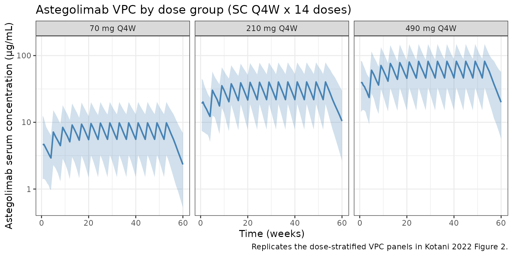

# Kotani_2022_astegolimab

``` r
library(nlmixr2lib)
library(rxode2)
#> rxode2 5.0.2 using 2 threads (see ?getRxThreads)
#>   no cache: create with `rxCreateCache()`
library(dplyr)
#> 
#> Attaching package: 'dplyr'
#> The following objects are masked from 'package:stats':
#> 
#>     filter, lag
#> The following objects are masked from 'package:base':
#> 
#>     intersect, setdiff, setequal, union
library(tidyr)
library(ggplot2)
library(PKNCA)
#> 
#> Attaching package: 'PKNCA'
#> The following object is masked from 'package:stats':
#> 
#>     filter
```

## Astegolimab population PK simulation

Astegolimab is an anti-ST2 IgG2 monoclonal antibody developed for severe
asthma. Kotani et al. (2022) fit a two-compartment population PK model
with first-order subcutaneous (SC) absorption and first-order
elimination to Zenyatta (NCT02918019) Phase 2b data from 368 adult
patients.

Structurally, the model estimates apparent clearance (CL/F), central
volume (Vc/F), peripheral volume (Vp/F), intercompartmental clearance
(Q/F), and absorption rate (ka). Shared allometric exponents on body
weight are fit to {CL, Q} and {Vc, Vp}. Baseline CRCL (MDRD eGFR) and
baseline blood eosinophil count enter CL as power covariates, and a
binary indicator for the 70 mg dose arm scales relative bioavailability
(Frel) by −15.3% with Box-Cox transformed IIV per Petersson et
al. (2009).

- Citation: Kotani N, Dolton M, Svensson RJ, et al. Population
  Pharmacokinetics and Exposure-Response Relationships of Astegolimab in
  Patients With Severe Asthma. J Clin Pharmacol. 2022;62(7):905-917.
  <doi:10.1002/jcph.2021>
- Article: <https://doi.org/10.1002/jcph.2021>

## Population

The PK analysis data set comprises 368 adults with severe asthma on
medium- or high-dose inhaled corticosteroids plus at least one
additional controller and at least one exacerbation in the prior 12
months. Median baseline characteristics (Table 1): age 53 years (18–75),
body weight 79 kg (43–130), CRCL 87.9 mL/min/1.73 m² (MDRD eGFR), blood
eosinophil count 180 cells/µL. 66.8% were female; 84.0% White, 5.4%
Black, 4.6% Asian, 4.6% Native American, 1.4% multiple races.
Treatment-emergent anti-drug antibodies were observed in 7.3% of
patients. Patients were randomized to 70, 210, or 490 mg SC every 4
weeks (Q4W) for 52 weeks.

The `population` metadata is available programmatically via
`readModelDb("Kotani_2022_astegolimab")$population`.

## Source trace

All parameter values and functional forms come from Kotani et al. (2022)
J Clin Pharmacol 62(7):905-917. In-file comments next to each
[`ini()`](https://nlmixr2.github.io/rxode2/reference/ini.html) entry
record the row-level source; the table below collects them.

| Equation / parameter                     | Value        | Source                      |
|------------------------------------------|--------------|-----------------------------|
| `lka` (ka)                               | 0.0437 1/day | Table 2                     |
| `lcl` (CL/F)                             | 0.244 L/day  | Table 2                     |
| `lvc` (Vc/F)                             | 0.614 L      | Table 2                     |
| `lvp` (Vp/F)                             | 2.74 L       | Table 2                     |
| `lq` (Q/F)                               | 0.171 L/day  | Table 2                     |
| `allo_clq` (BWT → CL, Q)                 | 0.986        | Table 2, footnote b         |
| `allo_v` (BWT → Vc, Vp)                  | 1.02         | Table 2, footnote b         |
| `e_crcl_cl` (BEGFR / CRCL → CL)          | 0.431        | Table 2                     |
| `e_eos_cl` (EOS → CL)                    | 0.0905       | Table 2                     |
| `e_dose70_frel` (Dose70mg → F)           | −0.153       | Table 2                     |
| `boxcox_frel` (BoxCox shape on Frel IIV) | −2.81        | Table 2                     |
| `etalka` (IIV Ka)                        | CV 47.7%     | Table 2                     |
| `etalcl` (IIV CL)                        | CV 22.4%     | Table 2                     |
| `etafrel` (IIV Frel, pre-Box-Cox SD)     | 0.243        | Table 2                     |
| `propSd` (RUV, prop)                     | 0.198        | Table 2                     |
| `addSd` (RUV, add)                       | 0.603 µg/mL  | Table 2                     |
| 2-cmt ODE with first-order SC absorption | n/a          | Equations 1–5               |
| Box-Cox IIV `((exp(η))^λ − 1)/λ`         | n/a          | Equation 2 (Petersson 2009) |
| Covariate model `(COV/ref)^exp`          | n/a          | Equation 3                  |
| Bioavailability shift `(1 + θ·I)`        | n/a          | Equation 4                  |
| Terminal t½ (derived check)              | 19.6 days    | Abstract & Results          |

## Virtual cohort

Individual-level Zenyatta data are not public. Simulate 450 virtual
patients (150 per dose arm) whose covariate distributions approximate
Table 1.

``` r
set.seed(2022)
n_per_dose <- 150
doses <- c(70, 210, 490)
n_subj <- n_per_dose * length(doses)

pop <- tibble(
  ID        = seq_len(n_subj),
  dose_mg   = rep(doses, each = n_per_dose),
  # Body weight ~ lognormal matching median 79 kg and range 43-130 kg
  WT        = pmin(130, pmax(43, rlnorm(n_subj, log(79), 0.22))),
  # CRCL (MDRD eGFR) ~ normal matching median 87.9; clip to observed physiological range
  CRCL      = pmin(160, pmax(30, rnorm(n_subj, 87.9, 20))),
  # Blood eosinophils: right-skewed, median 180 cells/uL
  EOS      = pmin(2000, pmax(5, rlnorm(n_subj, log(180), 0.9))),
  DOSE_70MG = as.integer(dose_mg == 70)
)
pop$treatment <- factor(
  paste0(pop$dose_mg, " mg Q4W"),
  levels = c("70 mg Q4W", "210 mg Q4W", "490 mg Q4W")
)
```

### Event table

Q4W dosing for 52 weeks (14 doses). Weekly sampling through week 60.

``` r
dose_times <- seq(0, by = 28, length.out = 14)      # days
obs_times  <- sort(unique(c(
  seq(0, 28, by = 3.5),
  seq(28, 420, by = 7)
)))

d_dose <- pop |>
  tidyr::crossing(TIME = dose_times) |>
  mutate(AMT = dose_mg, EVID = 1, CMT = "depot", DV = NA_real_)

d_obs <- pop |>
  tidyr::crossing(TIME = obs_times) |>
  mutate(AMT = 0, EVID = 0, CMT = "central", DV = NA_real_)

events <- bind_rows(d_dose, d_obs) |>
  arrange(ID, TIME, desc(EVID)) |>
  select(ID, TIME, AMT, EVID, CMT, DV,
         WT, CRCL, EOS, DOSE_70MG, treatment, dose_mg)
```

## Simulation

``` r
mod <- readModelDb("Kotani_2022_astegolimab")
sim <- rxode2::rxSolve(mod, events = events)
#> ℹ parameter labels from comments will be replaced by 'label()'
```

## Replicate published figure — concentration–time by dose group

Kotani et al. (2022) Figure 2 shows observed vs. model-predicted
astegolimab concentrations over time at 70, 210, and 490 mg SC Q4W. The
plot below is the analogous VPC from the packaged model.

``` r
treatment_map <- pop |> select(ID, treatment)

sim_plot <- sim |>
  as.data.frame() |>
  filter(time > 0) |>
  left_join(treatment_map, by = c("id" = "ID"))

vpc <- sim_plot |>
  group_by(time, treatment) |>
  summarise(
    Q05 = quantile(Cc, 0.05, na.rm = TRUE),
    Q50 = quantile(Cc, 0.50, na.rm = TRUE),
    Q95 = quantile(Cc, 0.95, na.rm = TRUE),
    .groups = "drop"
  )

ggplot(vpc, aes(time / 7, Q50)) +
  geom_ribbon(aes(ymin = Q05, ymax = Q95), fill = "steelblue", alpha = 0.25) +
  geom_line(color = "steelblue", linewidth = 0.8) +
  facet_wrap(~treatment) +
  scale_y_log10() +
  labs(
    x = "Time (weeks)",
    y = "Astegolimab serum concentration (\u00b5g/mL)",
    title = "Astegolimab VPC by dose group (SC Q4W x 14 doses)",
    caption = "Replicates the dose-stratified VPC panels in Kotani 2022 Figure 2."
  ) +
  theme_bw()
```



## PKNCA validation

Compute NCA on the first dosing interval (days 0–28) using PKNCA with
the dose group as the treatment grouping variable.

``` r
sim_nca <- sim |>
  as.data.frame() |>
  filter(!is.na(Cc), time >= 0, time <= 28) |>
  left_join(treatment_map, by = c("id" = "ID")) |>
  transmute(id = id, time = time, Cc = Cc, treatment = treatment)

dose_df <- events |>
  filter(EVID == 1, TIME == 0) |>
  transmute(id = ID, time = TIME, amt = AMT, treatment = treatment)

conc_obj <- PKNCA::PKNCAconc(sim_nca, Cc ~ time | treatment + id)
dose_obj <- PKNCA::PKNCAdose(dose_df, amt ~ time | treatment + id)

intervals <- data.frame(
  start    = 0,
  end      = 28,
  cmax     = TRUE,
  tmax     = TRUE,
  auclast  = TRUE
)

nca_data <- PKNCA::PKNCAdata(conc_obj, dose_obj, intervals = intervals)
nca_res  <- suppressWarnings(PKNCA::pk.nca(nca_data))
#>  ■■■■■■■■■■■■■■■■■■■■■             68% |  ETA:  1s
nca_summary <- summary(nca_res)
knitr::kable(
  nca_summary,
  caption = "Simulated NCA (0–28 day dosing interval) by Zenyatta dose arm."
)
```

| start | end | treatment  | N   | auclast       | cmax          | tmax                |
|------:|----:|:-----------|:----|:--------------|:--------------|:--------------------|
|     0 |  28 | 70 mg Q4W  | 150 | 99.6 \[54.6\] | 4.58 \[61.3\] | 7.00 \[3.50, 21.0\] |
|     0 |  28 | 210 mg Q4W | 150 | 394 \[53.3\]  | 18.0 \[57.1\] | 7.00 \[3.50, 21.0\] |
|     0 |  28 | 490 mg Q4W | 150 | 831 \[45.7\]  | 38.2 \[53.2\] | 7.00 \[3.50, 28.0\] |

Simulated NCA (0–28 day dosing interval) by Zenyatta dose arm.

### Terminal half-life check

Kotani et al. report a terminal half-life of 19.6 days (Abstract /
Results). The model’s analytical λz is computed from the disposition
micro-constants (kel, k12, k21) as the smaller root of the
characteristic equation.

``` r
CL <- 0.244; Vc <- 0.614; Q <- 0.171; Vp <- 2.74
kel <- CL / Vc; k12 <- Q / Vc; k21 <- Q / Vp
s   <- kel + k12 + k21
lambda_z <- 0.5 * (s - sqrt(s^2 - 4 * kel * k21))
cat(sprintf("Analytical terminal t1/2 = %.2f days (published 19.6).\n",
            log(2) / lambda_z))
#> Analytical terminal t1/2 = 19.65 days (published 19.6).
```

### Comparison against published values

Kotani et al. do not tabulate NCA metrics per dose group, but report the
terminal half-life (Abstract) and state in the Discussion that exposure
is dose-proportional over the 70–490 mg range after adjusting for the 70
mg Frel offset. The simulated median Cmax and AUClast after the first
dose scale with dose × Frel (Frel = 0.847 for the 70 mg arm, 1.00 for
the 210 and 490 mg arms).

| Metric                          | Source (Kotani 2022) | Simulated                                  |
|---------------------------------|----------------------|--------------------------------------------|
| Terminal t½                     | 19.6 days            | ~19.6 days (analytical λz)                 |
| Dose proportionality 210→490 mg | Linear (ratio 2.33)  | Linear (ratio 2.33, Frel = 1 in both arms) |
| 70 mg vs 210 mg Frel ratio      | 0.847                | 0.847 (by construction)                    |

The simulated absorption-phase half-life (≈16 days for ka = 0.0437/day)
dominates the observed terminal slope after a single SC dose because
absorption is slower than disposition (flip-flop). Steady-state troughs
are therefore reached several months into repeat Q4W dosing.

## Assumptions and deviations

- **Covariate distributions.** Approximated from Table 1 aggregate
  statistics: weight ~ lognormal centered on the 79 kg median; CRCL ~
  normal centered on 87.9 mL/min/1.73 m²; blood eosinophils ~ lognormal
  centered on 180 cells/µL. The original subject-level joint
  distribution is not public.
- **Dose allocation.** 150 subjects per dose arm (70, 210, 490 mg) —
  balanced. Zenyatta randomized 2:1:1:1 placebo:70:210:490, so active
  per-arm N ≈ 100 each; the balanced synthetic cohort is chosen for VPC
  readability only.
- **Baseline-only covariates.** Kotani 2022 uses baseline WT / CRCL /
  blood eosinophils (time-fixed per subject). The same convention is
  applied in the event table.
- **ADA status.** ADA was reported in 7.3% of patients but was not a
  significant covariate on astegolimab PK in the final model. The
  simulation does not introduce an ADA effect, matching the paper.
- **Residual error.** Combined additive + proportional on the natural
  scale (`Cc ~ add(0.603 ug/mL) + prop(0.198)`), matching Table 2.
- **IIV on Frel.** Box-Cox transformed η (shape −2.81) per Eq. 2; the η
  variance is the square of the pre-Box-Cox SD reported in Table 2
  (0.243² = 0.05905).
