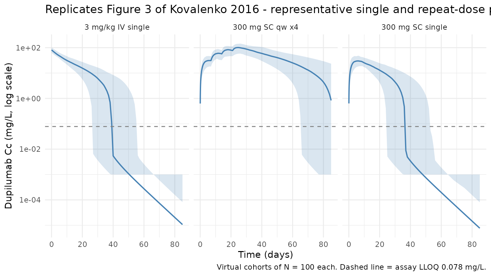

# Kovalenko_2016_dupilumab

## Model and source

- Citation: Kovalenko P, DiCioccio AT, Davis JD, et al. Exploratory
  Population PK Analysis of Dupilumab, a Fully Human Monoclonal Antibody
  Against IL-4Ralpha, in Atopic Dermatitis Patients and Normal
  Volunteers. CPT Pharmacometrics Syst Pharmacol. 2016;5(11):617-624.
  <doi:10.1002/psp4.12136>
- Description: Dupilumab exploratory population PK model (Kovalenko
  2016; 2-cmt with parallel linear + Michaelis-Menten elimination)
- Article: [CPT Pharmacometrics Syst Pharmacol.
  2016;5(11):617-624](https://doi.org/10.1002/psp4.12136) (open access
  via [PMC5655850](https://pmc.ncbi.nlm.nih.gov/articles/PMC5655850/))

## Population

Kovalenko 2016 pooled two Phase 1 studies of healthy volunteers and four
Phase 2 studies of patients with moderate-to-severe atopic dermatitis
(AD). The analysis dataset comprised 197 participants (96 female / 101
male; mean age 37 years; mean weight 76 kg) contributing 2,518 serum
dupilumab measurements. Source studies were NCT01015027 (R668-AS-0907;
single IV at 1, 3, 8, 12 mg/kg and single SC at 150 or 300 mg),
NCT01259323 (R668-AD-0914; 4x weekly SC at 75, 150, or 300 mg),
NCT01385657 (R668-AD-1026; 4x weekly SC at 150 or 300 mg), NCT01484600
(R668-HV-1108; single SC 300 mg), NCT01548404 (R668-AD-1117; 12x weekly
SC 300 mg), and NCT01639040 (R668-AD-1121; 4x weekly SC at 100 or 300 mg
with topical corticosteroids). Baseline demographics are in the Results
\> Data subsection (page 619); per-study dosing and sampling designs are
in Table 1.

The same information is available programmatically via
`readModelDb("Kovalenko_2016_dupilumab")$population`.

## Source trace

Every structural parameter, covariate effect, IIV variance, and
residual-error term below comes from Kovalenko 2016 Table 2, column
*“BLQ data included”* (the primary model; the *“BLQ data excluded”*
column is an explicitly-labelled sensitivity analysis).

| Equation / parameter                        | Value                                    | Source location                                                                           |
|---------------------------------------------|------------------------------------------|-------------------------------------------------------------------------------------------|
| `lvc` (V2, central volume at 75 kg)         | `log(2.74)` L                            | Table 2 row “V2 (L)”                                                                      |
| `lke` (ke, linear elimination rate)         | `log(0.0459)` 1/day                      | Table 2 row “ke (1/d)”                                                                    |
| `lk23` (k23, central-to-peripheral rate)    | `log(0.0652)` 1/day                      | Table 2 row “k23 (1/d)”                                                                   |
| `lk32` (k32, peripheral-to-central rate)    | `log(0.129)` 1/day                       | Table 2 row “k32 (1/d)”                                                                   |
| `lka` (ka, first-order absorption rate)     | `log(0.254)` 1/day                       | Table 2 row “ka (1/d)”                                                                    |
| `lvm` (Vm, maximum MM elimination rate)     | `log(0.968)` mg/L/day                    | Table 2 row “Vm (mg/L/d)”                                                                 |
| `Km` (Michaelis-Menten constant)            | `fixed(0.01)` mg/L                       | Table 2 row “Km (mg/L)”; fixed because OFV insensitive below ~0.01 mg/L                   |
| `lfdepot` (F, SC bioavailability)           | `log(0.607)`                             | Table 2 row “F (unitless)”                                                                |
| `e_wt_vc` (weight exponent on V2)           | `0.705`                                  | Table 2 row “V2 ~ weight”; Eq. 1 gives the form V2 = theta1 \* (WT/75)^theta2             |
| `var(etalvc)`                               | `0.0225`                                 | Table 2 row “omega^2 (V2)”                                                                |
| `var(etalke)`                               | `0.131`                                  | Table 2 row “omega^2 (ke)”                                                                |
| `var(etalka)`                               | `0.251`                                  | Table 2 row “omega^2 (ka)”                                                                |
| `var(etalvm)`                               | `0.0428`                                 | Table 2 row “omega^2 (Vm)”                                                                |
| `CcpropSd` (proportional SD)                | `0.242` (= 24.2 %CV on the linear scale) | Table 2 row “sigma^2 proportional (CV%)”                                                  |
| `CcaddSd` (additive SD)                     | `fixed(0.03)` mg/L                       | Table 2 row “sigma^2 additive (mg/L)”; fixed when BLQ data included                       |
| Structure: 2-cmt + parallel linear/MM elim. | n/a                                      | Figure 1 schematic; Methods p. 619 (“two-compartment model with parallel linear and MM…”) |
| BLQ treatment                               | Beal M3                                  | Methods p. 619 (“BLQ … utilized … applying the M3 method”)                                |

The column header “omega^2” in Table 2 indicates that the tabulated
values are variances of the log-scale random effects, which matches what
nlmixr2 stores on the right-hand side of the `~` operator. They are
therefore inserted verbatim (no squaring) in
[`ini()`](https://nlmixr2.github.io/rxode2/reference/ini.html). The
“sigma^2 proportional (CV%)” row reports the coefficient of variation of
the proportional residual, so 24.2 % maps to an SD of 0.242 on the
linear scale, which is what `CcpropSd` stores.

### Parameterization notes

Kovalenko 2016 uses a rate-based parameterization (`ke`, `k23`, `k32`)
rather than the `CL`/`Q`/`Vp` parameterization that is canonical in
nlmixr2lib. The model file preserves the paper’s parameterization
verbatim. Derived quantities agree with Table 2’s “Derived parameters”
footnote:

- Linear clearance: `CL = ke * V2 = 0.0459 * 2.74 = 0.126 L/day` (Table
  2: 0.126).
- Intercompartmental clearance:
  `Q = k23 * V2 = 0.0652 * 2.74 = 0.179 L/day` (Table 2: 0.179).
- Peripheral volume:
  `V3 = V2 * k23 / k32 = 2.74 * 0.0652 / 0.129 = 1.385 L` (Table 2:
  1.38).

The MM elimination term `central * Vm / (Km + central/vc)` is the
mass-rate form consistent with `Vm` reported in mg/L/day (see Methods:
“the unit of maximum target-mediated elimination rate (Vm) was mg/L/d,
which can be interpreted as an assumption of a proportional relationship
between the production rate of the target and the volume of the central
compartment”).

## Virtual cohort

Three single-dose cohorts are simulated, each covering one
representative regimen from Table 1: 3 mg/kg single IV infusion (FIH
rich-sampling cohort), 300 mg single SC injection (healthy-volunteer FIH
/ HV-1108 cohort), and the labelled-adjacent 300 mg SC weekly x4
(AD-0914 / AD-1026 style regimen). Body weight is drawn from a truncated
normal centred on the paper’s 75 kg reference weight.

``` r
set.seed(20260424)
n_subj <- 100

make_cohort <- function(n, cohort_label, id_offset = 0L) {
  tibble::tibble(
    id      = id_offset + seq_len(n),
    WT      = pmin(pmax(rnorm(n, mean = 76, sd = 15), 45), 130),
    cohort  = cohort_label
  )
}

cohort_iv   <- make_cohort(n_subj, "3 mg/kg IV single",  id_offset = 0L)
cohort_sc   <- make_cohort(n_subj, "300 mg SC single",   id_offset = 100L)
cohort_qwx4 <- make_cohort(n_subj, "300 mg SC qw x4",    id_offset = 200L)

# Observation grid - dense early, sparse out to ~85 days (FIH sampling horizon)
obs_times <- sort(unique(c(
  seq(0, 2, by = 1/24),         # hours 0-48
  seq(2.5, 14, by = 0.5),        # early phase
  seq(15, 85, by = 1)            # long tail
)))

# IV cohort: 3 mg/kg as an instantaneous "bolus" to central at day 0
ev_iv <- cohort_iv |>
  dplyr::mutate(time = 0, amt = 3 * WT, cmt = "central", evid = 1L) |>
  dplyr::bind_rows(
    tidyr::crossing(cohort_iv, time = obs_times) |>
      dplyr::mutate(amt = 0, cmt = NA_character_, evid = 0L)
  )

# SC single cohort: 300 mg to depot at day 0
ev_sc <- cohort_sc |>
  dplyr::mutate(time = 0, amt = 300, cmt = "depot", evid = 1L) |>
  dplyr::bind_rows(
    tidyr::crossing(cohort_sc, time = obs_times) |>
      dplyr::mutate(amt = 0, cmt = NA_character_, evid = 0L)
  )

# SC weekly x4 cohort
dose_times_qw <- c(0, 7, 14, 21)
ev_qwx4 <- cohort_qwx4 |>
  tidyr::crossing(time = dose_times_qw) |>
  dplyr::mutate(amt = 300, cmt = "depot", evid = 1L) |>
  dplyr::bind_rows(
    tidyr::crossing(cohort_qwx4, time = obs_times) |>
      dplyr::mutate(amt = 0, cmt = NA_character_, evid = 0L)
  )

events <- dplyr::bind_rows(ev_iv, ev_sc, ev_qwx4) |>
  dplyr::arrange(id, time, dplyr::desc(evid)) |>
  dplyr::select(id, time, amt, cmt, evid, WT, cohort)

stopifnot(!anyDuplicated(unique(events[, c("id", "time", "evid")])))
```

## Simulation

``` r
mod <- rxode2::rxode2(readModelDb("Kovalenko_2016_dupilumab"))
#> ℹ parameter labels from comments will be replaced by 'label()'
sim <- rxode2::rxSolve(mod, events = events, keep = c("WT", "cohort"))
```

## Figure replication - concentration-time profiles by regimen

Kovalenko 2016 Figure 3 shows examples of log-scaled dupilumab
concentration- time profiles under different single- and multiple-dose
regimens, spanning the target-mediated phase as concentrations approach
the LLOQ (0.078 mg/L). The plot below reproduces the 5-50-95 percentile
envelopes for the three virtual cohorts above.

``` r
vpc <- sim |>
  dplyr::filter(!is.na(Cc), time > 0) |>
  dplyr::group_by(cohort, time) |>
  dplyr::summarise(
    Q05 = stats::quantile(Cc, 0.05, na.rm = TRUE),
    Q50 = stats::quantile(Cc, 0.50, na.rm = TRUE),
    Q95 = stats::quantile(Cc, 0.95, na.rm = TRUE),
    .groups = "drop"
  )

ggplot(vpc, aes(time, Q50)) +
  geom_ribbon(aes(ymin = pmax(Q05, 1e-3), ymax = Q95), alpha = 0.2, fill = "#4682b4") +
  geom_line(colour = "#4682b4", linewidth = 0.7) +
  geom_hline(yintercept = 0.078, linetype = "dashed", colour = "grey50") +
  facet_wrap(~cohort, scales = "fixed") +
  scale_y_log10() +
  labs(
    x = "Time (days)",
    y = "Dupilumab Cc (mg/L, log scale)",
    title = "Replicates Figure 3 of Kovalenko 2016 - representative single and repeat-dose profiles",
    caption = "Virtual cohorts of N = 100 each. Dashed line = assay LLOQ 0.078 mg/L."
  ) +
  theme_minimal()
```



The characteristic target-mediated terminal phase (sharp decline below
~1 mg/L) reproduces the shape reported in Kovalenko 2016 Figure 3.

## PKNCA validation

NCA on the 300 mg single SC cohort. This is the cohort most comparable
to the single-dose FIH SC arm (NCT01015027) in Table 1 of the paper.

``` r
nca_conc <- sim |>
  dplyr::filter(cohort == "300 mg SC single", !is.na(Cc), time > 0) |>
  dplyr::mutate(treatment = cohort) |>
  dplyr::select(id, time, Cc, treatment)

nca_dose <- cohort_sc |>
  dplyr::mutate(time = 0, amt = 300, treatment = cohort) |>
  dplyr::select(id, time, amt, treatment)

conc_obj <- PKNCA::PKNCAconc(nca_conc, Cc ~ time | treatment + id)
dose_obj <- PKNCA::PKNCAdose(nca_dose, amt ~ time | treatment + id)

intervals <- data.frame(
  start       = 0,
  end         = 85,
  cmax        = TRUE,
  tmax        = TRUE,
  auclast     = TRUE,
  half.life   = TRUE
)

nca_res <- PKNCA::pk.nca(PKNCA::PKNCAdata(conc_obj, dose_obj, intervals = intervals))
#> Warning: Requesting an AUC range starting (0) before the first measurement (0.0416667) is not allowed
#> Requesting an AUC range starting (0) before the first measurement (0.0416667) is not allowed
#> Requesting an AUC range starting (0) before the first measurement (0.0416667) is not allowed
#> Requesting an AUC range starting (0) before the first measurement (0.0416667) is not allowed
#> Requesting an AUC range starting (0) before the first measurement (0.0416667) is not allowed
#> Requesting an AUC range starting (0) before the first measurement (0.0416667) is not allowed
#> Requesting an AUC range starting (0) before the first measurement (0.0416667) is not allowed
#> Requesting an AUC range starting (0) before the first measurement (0.0416667) is not allowed
#> Requesting an AUC range starting (0) before the first measurement (0.0416667) is not allowed
#> Requesting an AUC range starting (0) before the first measurement (0.0416667) is not allowed
#> Requesting an AUC range starting (0) before the first measurement (0.0416667) is not allowed
#> Requesting an AUC range starting (0) before the first measurement (0.0416667) is not allowed
#> Requesting an AUC range starting (0) before the first measurement (0.0416667) is not allowed
#> Requesting an AUC range starting (0) before the first measurement (0.0416667) is not allowed
#> Requesting an AUC range starting (0) before the first measurement (0.0416667) is not allowed
#> Requesting an AUC range starting (0) before the first measurement (0.0416667) is not allowed
#> Requesting an AUC range starting (0) before the first measurement (0.0416667) is not allowed
#> Requesting an AUC range starting (0) before the first measurement (0.0416667) is not allowed
#> Requesting an AUC range starting (0) before the first measurement (0.0416667) is not allowed
#> Requesting an AUC range starting (0) before the first measurement (0.0416667) is not allowed
#> Requesting an AUC range starting (0) before the first measurement (0.0416667) is not allowed
#> Requesting an AUC range starting (0) before the first measurement (0.0416667) is not allowed
#> Requesting an AUC range starting (0) before the first measurement (0.0416667) is not allowed
#> Requesting an AUC range starting (0) before the first measurement (0.0416667) is not allowed
#> Requesting an AUC range starting (0) before the first measurement (0.0416667) is not allowed
#>  ■■■■■■■■■                         25% |  ETA:  6s
#> Warning: Requesting an AUC range starting (0) before the first measurement (0.0416667) is not allowed
#> Requesting an AUC range starting (0) before the first measurement (0.0416667) is not allowed
#> Requesting an AUC range starting (0) before the first measurement (0.0416667) is not allowed
#> Requesting an AUC range starting (0) before the first measurement (0.0416667) is not allowed
#> Requesting an AUC range starting (0) before the first measurement (0.0416667) is not allowed
#> Requesting an AUC range starting (0) before the first measurement (0.0416667) is not allowed
#> Requesting an AUC range starting (0) before the first measurement (0.0416667) is not allowed
#> Requesting an AUC range starting (0) before the first measurement (0.0416667) is not allowed
#> Requesting an AUC range starting (0) before the first measurement (0.0416667) is not allowed
#> Requesting an AUC range starting (0) before the first measurement (0.0416667) is not allowed
#> Requesting an AUC range starting (0) before the first measurement (0.0416667) is not allowed
#> Requesting an AUC range starting (0) before the first measurement (0.0416667) is not allowed
#> Requesting an AUC range starting (0) before the first measurement (0.0416667) is not allowed
#> Requesting an AUC range starting (0) before the first measurement (0.0416667) is not allowed
#> Requesting an AUC range starting (0) before the first measurement (0.0416667) is not allowed
#> Requesting an AUC range starting (0) before the first measurement (0.0416667) is not allowed
#> Requesting an AUC range starting (0) before the first measurement (0.0416667) is not allowed
#> Requesting an AUC range starting (0) before the first measurement (0.0416667) is not allowed
#> Requesting an AUC range starting (0) before the first measurement (0.0416667) is not allowed
#> Requesting an AUC range starting (0) before the first measurement (0.0416667) is not allowed
#> Requesting an AUC range starting (0) before the first measurement (0.0416667) is not allowed
#> Requesting an AUC range starting (0) before the first measurement (0.0416667) is not allowed
#> Requesting an AUC range starting (0) before the first measurement (0.0416667) is not allowed
#> Requesting an AUC range starting (0) before the first measurement (0.0416667) is not allowed
#> Requesting an AUC range starting (0) before the first measurement (0.0416667) is not allowed
#> Requesting an AUC range starting (0) before the first measurement (0.0416667) is not allowed
#> Requesting an AUC range starting (0) before the first measurement (0.0416667) is not allowed
#> Requesting an AUC range starting (0) before the first measurement (0.0416667) is not allowed
#> Requesting an AUC range starting (0) before the first measurement (0.0416667) is not allowed
#> Requesting an AUC range starting (0) before the first measurement (0.0416667) is not allowed
#> Requesting an AUC range starting (0) before the first measurement (0.0416667) is not allowed
#> Requesting an AUC range starting (0) before the first measurement (0.0416667) is not allowed
#> Requesting an AUC range starting (0) before the first measurement (0.0416667) is not allowed
#> Requesting an AUC range starting (0) before the first measurement (0.0416667) is not allowed
#> Requesting an AUC range starting (0) before the first measurement (0.0416667) is not allowed
#> Requesting an AUC range starting (0) before the first measurement (0.0416667) is not allowed
#> Requesting an AUC range starting (0) before the first measurement (0.0416667) is not allowed
#> Requesting an AUC range starting (0) before the first measurement (0.0416667) is not allowed
#> Requesting an AUC range starting (0) before the first measurement (0.0416667) is not allowed
#> Requesting an AUC range starting (0) before the first measurement (0.0416667) is not allowed
#> Requesting an AUC range starting (0) before the first measurement (0.0416667) is not allowed
#> Requesting an AUC range starting (0) before the first measurement (0.0416667) is not allowed
#> Requesting an AUC range starting (0) before the first measurement (0.0416667) is not allowed
#> Requesting an AUC range starting (0) before the first measurement (0.0416667) is not allowed
#> Requesting an AUC range starting (0) before the first measurement (0.0416667) is not allowed
#>  ■■■■■■■■■■■■■■■■■■■■■■            70% |  ETA:  2s
#> Warning: Requesting an AUC range starting (0) before the first measurement (0.0416667) is not allowed
#> Requesting an AUC range starting (0) before the first measurement (0.0416667) is not allowed
#> Requesting an AUC range starting (0) before the first measurement (0.0416667) is not allowed
#> Requesting an AUC range starting (0) before the first measurement (0.0416667) is not allowed
#> Requesting an AUC range starting (0) before the first measurement (0.0416667) is not allowed
#> Requesting an AUC range starting (0) before the first measurement (0.0416667) is not allowed
#> Requesting an AUC range starting (0) before the first measurement (0.0416667) is not allowed
#> Requesting an AUC range starting (0) before the first measurement (0.0416667) is not allowed
#> Requesting an AUC range starting (0) before the first measurement (0.0416667) is not allowed
#> Requesting an AUC range starting (0) before the first measurement (0.0416667) is not allowed
#> Requesting an AUC range starting (0) before the first measurement (0.0416667) is not allowed
#> Requesting an AUC range starting (0) before the first measurement (0.0416667) is not allowed
#> Requesting an AUC range starting (0) before the first measurement (0.0416667) is not allowed
#> Requesting an AUC range starting (0) before the first measurement (0.0416667) is not allowed
#> Requesting an AUC range starting (0) before the first measurement (0.0416667) is not allowed
#> Requesting an AUC range starting (0) before the first measurement (0.0416667) is not allowed
#> Requesting an AUC range starting (0) before the first measurement (0.0416667) is not allowed
#> Requesting an AUC range starting (0) before the first measurement (0.0416667) is not allowed
#> Requesting an AUC range starting (0) before the first measurement (0.0416667) is not allowed
#> Requesting an AUC range starting (0) before the first measurement (0.0416667) is not allowed
#> Requesting an AUC range starting (0) before the first measurement (0.0416667) is not allowed
#> Requesting an AUC range starting (0) before the first measurement (0.0416667) is not allowed
#> Requesting an AUC range starting (0) before the first measurement (0.0416667) is not allowed
#> Requesting an AUC range starting (0) before the first measurement (0.0416667) is not allowed
#> Requesting an AUC range starting (0) before the first measurement (0.0416667) is not allowed
#> Requesting an AUC range starting (0) before the first measurement (0.0416667) is not allowed
#> Requesting an AUC range starting (0) before the first measurement (0.0416667) is not allowed
#> Requesting an AUC range starting (0) before the first measurement (0.0416667) is not allowed
#> Requesting an AUC range starting (0) before the first measurement (0.0416667) is not allowed
#> Requesting an AUC range starting (0) before the first measurement (0.0416667) is not allowed
knitr::kable(summary(nca_res), caption = "Simulated NCA (300 mg SC single dose).")
```

| start | end | treatment        | N   | auclast | cmax          | tmax                | half.life      |
|------:|----:|:-----------------|:----|:--------|:--------------|:--------------------|:---------------|
|     0 |  85 | 300 mg SC single | 100 | NC      | 30.5 \[31.5\] | 6.00 \[2.50, 12.5\] | 5.33 \[0.279\] |

Simulated NCA (300 mg SC single dose).

### Comparison against published observations

Kovalenko 2016 does not tabulate NCA parameters per regimen - Figure 3
is qualitative and the Results section focuses on the population PK
estimates in Table 2 rather than on compartmental NCA. A typical-value
(“population typical”) prediction with IIV zeroed out is therefore used
as a self-consistency check against the published derived quantities (CL
= 0.126 L/day; half-life approaches zero as concentrations drop into the
target- mediated phase):

``` r
mod_typical <- mod |> rxode2::zeroRe()

ev_typical_sc <- tibble::tibble(
  id = 1L, time = 0, amt = 300, cmt = "depot", evid = 1L, WT = 75, cohort = "typical"
) |>
  dplyr::bind_rows(
    tibble::tibble(
      id = 1L, time = obs_times, amt = 0, cmt = NA_character_, evid = 0L,
      WT = 75, cohort = "typical"
    )
  ) |>
  dplyr::arrange(time, dplyr::desc(evid))

sim_typical <- rxode2::rxSolve(mod_typical, events = ev_typical_sc, keep = "WT") |>
  as.data.frame() |>
  dplyr::filter(!is.na(Cc), time > 0)
#> ℹ omega/sigma items treated as zero: 'etalvc', 'etalke', 'etalka', 'etalvm'

typical_summary <- tibble::tibble(
  metric = c(
    "Cmax (mg/L)",
    "Tmax (day)",
    "Cc at day 14 (mg/L)",
    "Cc at day 28 (mg/L)",
    "Cc at day 57 (mg/L)"
  ),
  typical_value = c(
    max(sim_typical$Cc),
    sim_typical$time[which.max(sim_typical$Cc)],
    stats::approx(sim_typical$time, sim_typical$Cc, xout = 14)$y,
    stats::approx(sim_typical$time, sim_typical$Cc, xout = 28)$y,
    stats::approx(sim_typical$time, sim_typical$Cc, xout = 57)$y
  )
)
knitr::kable(typical_summary, digits = 3,
  caption = "Typical-subject single 300 mg SC profile (WT = 75 kg; IIV zeroed).")
```

| metric              | typical_value |
|:--------------------|--------------:|
| Cmax (mg/L)         |        32.630 |
| Tmax (day)          |         6.000 |
| Cc at day 14 (mg/L) |        22.580 |
| Cc at day 28 (mg/L) |         6.685 |
| Cc at day 57 (mg/L) |         0.000 |

Typical-subject single 300 mg SC profile (WT = 75 kg; IIV zeroed).

## Assumptions and deviations

- Kovalenko 2016 Table 2 presents two columns of parameter estimates:
  the primary fit with BLQ data included (using the M3 method) and a
  sensitivity analysis with BLQ data excluded. This model uses the
  **BLQ-included** column, as that is the model the paper presents as
  primary (diagnostic plots, Results narrative, and abstract all
  reference the BLQ-included estimates).
- The model preserves the paper’s rate-based parameterization (`ke`,
  `k23`, `k32`) rather than reparameterizing to `CL`/`Q`/`Vp`. The
  `lke`/`lk23`/`lk32`/`lvm` names deviate from the nlmixr2lib canonical
  `lcl`/`lq` naming; the sister model `Kovalenko_2020_dupilumab.R`
  adopts the same convention because IIV in the source is defined on the
  rates, not on clearances.
- `Km` was fixed at 0.01 mg/L in the paper because the OFV was
  insensitive to values below ~0.01 mg/L (Results section, page 620);
  `CcaddSd` was fixed at 0.03 mg/L for the BLQ-included analysis
  (Methods section).
- The virtual cohort uses a single body-weight distribution centred on
  the paper’s reported mean (76 kg). Age, sex, race, and study-site
  effects are not explicitly reproduced - the published model does not
  use them as covariates (only WT enters the structural model, through
  V2).
- Kovalenko 2016 does not tabulate observed NCA values or individual
  Cmax/AUC summaries, so the PKNCA block here is a self-consistency
  check of the implemented model rather than a numerical comparison
  against published NCA.
- No unit conversion is required between dose (mg) and concentration
  (mg/L) because `central/vc` has the natural unit mg/L.
