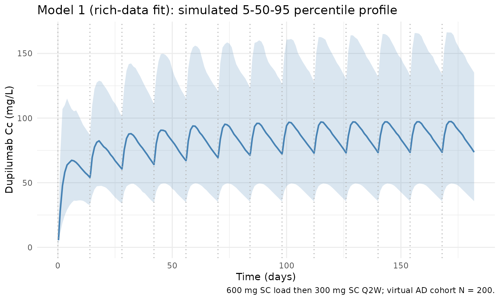
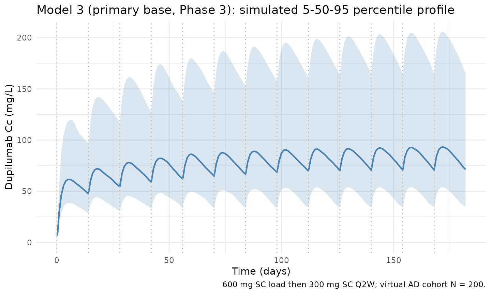
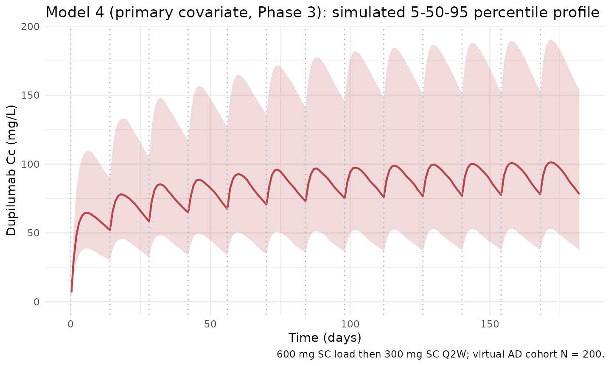
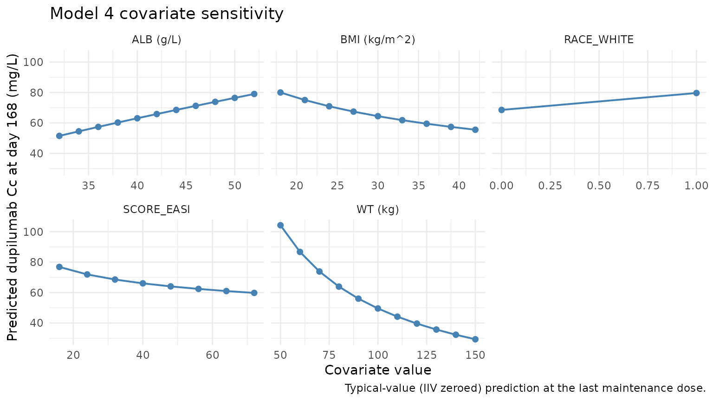

# Dupilumab (Kovalenko 2020)

## Model and source

- Citation: Kovalenko P, Davis JD, Li M, et al. Base and Covariate
  Population Pharmacokinetic Analyses of Dupilumab Using Phase 3 Data.
  Clinical Pharmacology in Drug Development. 2020;9(6):756-767.
  <doi:10.1002/cpdd.780>
- Article: [Clin Pharmacol Drug Dev.
  2020;9(6):756-767](https://doi.org/10.1002/cpdd.780) (open access via
  [PMC7496533](https://pmc.ncbi.nlm.nih.gov/articles/PMC7496533/))

Kovalenko 2020 reports four sequential popPK models for dupilumab built
using a stepwise approach:

- **Model 1** – rich Phase 1/2 data with all structural parameters
  estimated. Available as `readModelDb("Kovalenko_2020_dupilumab")`.
- **Model 2** – 12 Phase 1/2 studies, used to test population (healthy
  vs AD) and assay-version covariates; neither was retained. Not
  packaged separately.
- **Model 3** – primary BASE model fit to Phase 3 atopic-dermatitis data
  with most structural parameters FIXED to Model 1/2 values; only body
  weight enters as a covariate of central volume. Available as
  `readModelDb("Kovalenko_2020_dupilumab_base")`.
- **Model 4** – primary COVARIATE model on the same Phase 3 data, adding
  albumin to Vc and BMI / EASI / race (White) to the linear elimination
  rate ke. Available as
  `readModelDb("Kovalenko_2020_dupilumab_covariate")`.

This vignette walks all three packaged models (1, 3, 4) and validates
simulated typical-subject steady-state exposure against PKNCA-derived
metrics.

## Population

Kovalenko 2020 pooled 16 clinical studies (N = 2115 participants; 202
healthy volunteers and 1913 patients with moderate-to-severe atopic
dermatitis (AD)). Of these, 2041 participants on active treatment
contributed 18,243 of 20,809 samples to the population PK analysis.
Source studies include the Phase 3 AD trials R668-AD-1334 (LIBERTY AD
SOLO 1), R668-AD-1416 (LIBERTY AD SOLO 2), and R668-AD-1224 (LIBERTY AD
CHRONOS). The Phase 1 studies R668-AS-0907, TDU12265, PKM14161, and
R668-AD-1117 were used to fit Model 1; the Phase 3 trials alone were
used for Models 3 and 4. The paper’s main text does not tabulate
detailed baseline demographics for the pooled cohort; per-study
geographic locations and dosing regimens appear in Supplementary Table
S1.

The approved adult AD maintenance regimen is 600 mg SC loading dose on
day 0 followed by 300 mg SC every 2 weeks (Q2W); the Kovalenko 2016
precursor publication used **75 kg** as the reference body weight for
the allometric effect on central volume, and the 2020 paper reuses the
same equation without re-stating the reference weight.

The same information is available programmatically via
`readModelDb("Kovalenko_2020_dupilumab")$population`,
`readModelDb("Kovalenko_2020_dupilumab_base")$population`, and
`readModelDb("Kovalenko_2020_dupilumab_covariate")$population`.

## Source trace

Every structural parameter, covariate effect, IIV element, and
residual-error term in the three packaged models is taken from Kovalenko
2020 Table 1 (Model 1 column), Supplementary Table S2 (Model 1 IIV /
residual error), and Supplementary Table S3 (Models 3 and 4). The
per-parameter origin is recorded as an in-file comment next to each
`ini()` entry in the three model files; the cross-walks below collect
them in one place for review.

### Model 1 – rich-data exploratory fit (`Kovalenko_2020_dupilumab`)

| Equation / parameter | Value | Source location |
|----|----|----|
| `lvc` (Vc, central volume) | `log(2.48)` L | Table 1, Model 1 |
| `lkel` (ke, linear elimination rate) | `log(0.0534)` 1/day | Table 1, Model 1 |
| `lkcp` (kcp) | `log(0.213)` 1/day | Table 1, Model 1 |
| `Mpc` (kcp/kpc) | `0.686` | Table 1, Model 1 (kpc derived: 0.213 / 0.686 = 0.310 1/day) |
| `lka` (ka, absorption rate) | `log(0.256)` 1/day | Table 1, Model 1 |
| `lmtt` (MTT) | `log(0.105)` day | Table 1, Model 1 |
| `lvmax` (Vmax) | `log(1.07)` mg/L/day | Table 1, Model 1 |
| `Km` | `fixed(0.01)` mg/L | Table 1, Model 1 (fixed, carried over from Kovalenko 2016) |
| `lfdepot` (F) | `log(0.643)` | Table 1, Model 1 |
| `e_wt_vc` (WT exponent on Vc) | `0.711` | Table 1, Model 1 (“Vc ~ weight”) |
| `var(etalvc)` | `0.192^2 = 0.036864` | Supp. Table S2: omega_Vc (SD) = 0.192 |
| `var(etalkel)` | `0.285^2 = 0.081225` | Supp. Table S2: omega_ke (SD) = 0.285 |
| `var(etalka)` | `0.474^2 = 0.224676` | Supp. Table S2: omega_ka (SD) = 0.474 |
| `var(etalvmax)` | `0.236^2 = 0.055696` | Supp. Table S2: omega_Vm (SD) = 0.236 |
| `var(etalmtt)` | `0.525^2 = 0.275625` | Supp. Table S2: omega_MTT (SD) = 0.525, applied on `log(MTT)` here |
| `propSd` (proportional sigma) | `0.15` | Supp. Table S2 |
| `addSd` (additive sigma) | `fixed(0.03)` mg/L | Supp. Table S2 (fixed, carried over from Kovalenko 2016) |
| Structure | 2-cmt + 3 transit + parallel linear/MM elimination | p. 758 Methods, Figure 1 |

### Model 3 – primary base model on Phase 3 data (`Kovalenko_2020_dupilumab_base`)

| Equation / parameter | Value | Source location |
|----|----|----|
| `lvc` (Vc) | `log(2.76)` L | Supp. Table S3 Model 3 / Table 1 |
| `lkel` (ke) | `log(0.0448)` 1/day | Supp. Table S3 Model 3 / Table 1 |
| `lkcp` | `fixed(log(0.211))` 1/day | Supp. Table S3 Model 3 (fixed) |
| `lkpc` | `fixed(log(0.310))` 1/day | Supp. Table S3 Model 3 (fixed) |
| `lka` | `fixed(log(0.306))` 1/day | Supp. Table S3 Model 3 (fixed) |
| `lmtt` | `fixed(log(0.105))` day | Supp. Table S3 Model 3 (fixed) |
| `lvmax` | `fixed(log(1.07))` mg/L/day | Supp. Table S3 Model 3 (fixed) |
| `Km` | `fixed(0.01)` mg/L | Supp. Table S3 Model 3 (fixed) |
| `lfdepot` | `fixed(log(0.642))` | Supp. Table S3 Model 3 (fixed) |
| `e_wt_vc` (WT exponent on Vc) | `0.919` | Supp. Table S3 Model 3 (“Vc ~ weight”) |
| `var(etalvc)` | `0.216^2 = 0.046656` | Supp. Table S3: sigma(ln Vc) = 0.216 |
| `var(etalkel)` | `0.301^2 = 0.090601` | Supp. Table S3: sigma(ln ke) = 0.301 |
| `cov(etalvc, etalkel)` | `-0.373 * 0.216 * 0.301 = -0.024254` | Supp. Table S3: Corr(ln ke, ln Vc) = -0.373 |
| `propSd` | `0.124` | Supp. Table S3: sigma_prop (CV%) = 12.4 |
| `addSd` | `6.17` mg/L | Supp. Table S3: sigma_add = 6.17 mg/L |

### Model 4 – primary covariate model on Phase 3 data (`Kovalenko_2020_dupilumab_covariate`)

| Equation / parameter | Value | Source location |
|----|----|----|
| `lvc` (Vc) | `log(2.74)` L | Supp. Table S3 Model 4 / Table 1 |
| `lkel` (ke) | `log(0.0477)` 1/day | Supp. Table S3 Model 4 / Table 1 |
| Fixed parameters (kcp, kpc, ka, MTT, Vm, Km, F) | same as Model 3 | Supp. Table S3 Model 4 |
| `e_wt_vc` (WT exponent on Vc) | `0.817` | Supp. Table S3 Model 4 / Table 3 |
| `e_alb_vc` (ALB exponent on Vc) | `-0.653` | Supp. Table S3 Model 4 / Table 3 |
| `e_bmi_kel` (BMI exponent on ke) | `0.368` | Supp. Table S3 Model 4 / Table 3 |
| `e_score_easi_kel` (EASI exponent on ke) | `0.143` | Supp. Table S3 Model 4 / Table 3 |
| `e_race_white_kel` (race White on ke) | `-0.123` | Supp. Table S3 Model 4 / Table 3 |
| `var(etalvc)` | `0.206^2 = 0.042436` | Supp. Table S3: sigma(ln Vc) = 0.206 |
| `var(etalkel)` | `0.293^2 = 0.085849` | Supp. Table S3: sigma(ln ke) = 0.293 |
| `cov(etalvc, etalkel)` | `-0.450 * 0.206 * 0.293 = -0.0271611` | Supp. Table S3: Corr(ln ke, ln Vc) = -0.450 |
| `propSd` | `0.125` | Supp. Table S3: sigma_prop (CV%) = 12.5 |
| `addSd` | `6.06` mg/L | Supp. Table S3: sigma_add = 6.06 mg/L |

The paper’s Methods explicitly define omega as *“omega (omega, standard
deviation \[SD\] of between-subject variability)”* and sigma as *“sigma
(sigma, SD of measurement error)”*. nlmixr2’s `etalxxx ~ value` syntax
stores the **variance** (omega^2), so the SDs from Table S2 / S3 are
squared in `ini()`. For Models 3 and 4 the IIV is a correlated block on
(ln Vc, ln ke); the covariance is computed from the published
correlation inline in each model file’s `ini()`.

### Parameterization notes

All three models share the same structural form: a 2-compartment PK with
parallel linear (`kel * central`) and Michaelis-Menten
(`vmax * central / (Km + central/vc)`) elimination, fed by a 3-transit-
compartment SC absorption chain (`ktr = 4 / MTT`). Intercompartmental
transport is parameterized as direct rate constants `kcp` and `kpc`
(equivalently `k12`, `k21`) rather than as Q / Vp. IV doses bypass the
depot via the event record; the SC bioavailability `fdepot` applies on
the depot compartment only.

## Virtual cohort

Detailed observed demographics for the pooled cohort are not publicly
reproduced in the paper’s main text. The virtual cohort below targets
the labelled adult AD population using covariate distributions
consistent with the LIBERTY AD SOLO 1/2 (Simpson 2016
<doi:10.1056/NEJMoa1610020> Table 1) and CHRONOS (Blauvelt 2017
<doi:10.1016/S0140-6736(17)31191-1> Table 1) Phase 3 publications. All
five covariates needed by Model 4 are drawn for every subject so the
same event table can be reused for Models 1, 3, and 4.

``` r

set.seed(20260621)
n_subj <- 200

draw_trunc_norm <- function(n, mean, sd, lo, hi) {
  pmin(pmax(rnorm(n, mean = mean, sd = sd), lo), hi)
}

cohort <- tibble::tibble(
  id         = seq_len(n_subj),
  WT         = draw_trunc_norm(n_subj, mean = 75, sd = 18, lo = 40, hi = 165),
  ALB        = draw_trunc_norm(n_subj, mean = 44, sd =  4, lo = 30, hi =  55),
  BMI        = draw_trunc_norm(n_subj, mean = 27, sd =  5, lo = 18, hi =  45),
  SCORE_EASI = draw_trunc_norm(n_subj, mean = 32, sd = 12, lo = 16, hi =  72),
  RACE_WHITE = as.integer(runif(n_subj) < 0.67)
)

# Labelled AD regimen: 600 mg SC loading dose on day 0, 300 mg SC Q2W for
# 12 additional doses -> study window 0-182 days.  By dose 10+ the profile
# is close to steady state (typical half-life ~2-3 weeks).
load_dose  <- 600
maint_dose <- 300
tau        <- 14
n_maint    <- 12
dose_days  <- c(0, seq(tau, tau * n_maint, by = tau))
amt_vec    <- c(load_dose, rep(maint_dose, n_maint))

ev_dose <- cohort |>
  tidyr::crossing(time = dose_days) |>
  dplyr::arrange(id, time) |>
  dplyr::group_by(id) |>
  dplyr::mutate(amt = amt_vec, cmt = "depot", evid = 1L) |>
  dplyr::ungroup()

obs_days <- sort(unique(c(
  seq(0, tau * (n_maint + 1), by = 1),
  dose_days + 0.25,
  dose_days + 1,
  dose_days + 3
)))

# Observation rows reference the ODE state "central" (not the observable
# "Cc") to avoid the rxode2 slot-renumbering bug; the observable Cc is
# returned automatically alongside the central amount.
ev_obs <- cohort |>
  tidyr::crossing(time = obs_days) |>
  dplyr::mutate(amt = 0, cmt = "central", evid = 0L)

events <- dplyr::bind_rows(ev_dose, ev_obs) |>
  dplyr::arrange(id, time, dplyr::desc(evid)) |>
  dplyr::select(id, time, amt, cmt, evid, WT, ALB, BMI, SCORE_EASI, RACE_WHITE)
```

## Model 1 – rich-data exploratory fit

``` r

mod_m1 <- rxode2::rxode2(readModelDb("Kovalenko_2020_dupilumab"))
#> ℹ parameter labels from comments will be replaced by 'label()'
conc_unit <- mod_m1$units[["concentration"]]
sim_m1 <- rxode2::rxSolve(mod_m1, events = events,
                          keep = c("WT", "ALB", "BMI", "SCORE_EASI", "RACE_WHITE"))
```

### Figure replication – Cc vs time (Model 1)

Reproduces the labelled adult AD regimen (600 mg SC loading + 300 mg SC
Q2W) as 5th / 50th / 95th percentile bands across the virtual cohort,
spanning ~13 dosing cycles (cf. Kovalenko 2020 Figure 5).

``` r

vpc_m1 <- sim_m1 |>
  dplyr::filter(!is.na(Cc), time > 0) |>
  dplyr::group_by(time) |>
  dplyr::summarise(
    Q05 = quantile(Cc, 0.05, na.rm = TRUE),
    Q50 = quantile(Cc, 0.50, na.rm = TRUE),
    Q95 = quantile(Cc, 0.95, na.rm = TRUE),
    .groups = "drop"
  )

ggplot(vpc_m1, aes(time, Q50)) +
  geom_ribbon(aes(ymin = Q05, ymax = Q95), alpha = 0.2, fill = "#4682b4") +
  geom_line(colour = "#4682b4", linewidth = 0.8) +
  geom_vline(xintercept = dose_days, linetype = "dotted", colour = "grey70") +
  scale_y_continuous(limits = c(0, NA)) +
  labs(
    x = "Time (days)",
    y = paste0("Dupilumab Cc (", conc_unit, ")"),
    title = "Model 1 (rich-data fit): simulated 5-50-95 percentile profile",
    caption = "600 mg SC load then 300 mg SC Q2W; virtual AD cohort N = 200."
  ) +
  theme_minimal()
```



## Model 3 – primary base model on Phase 3 data

``` r

mod_m3 <- rxode2::rxode2(readModelDb("Kovalenko_2020_dupilumab_base"))
sim_m3 <- rxode2::rxSolve(mod_m3, events = events,
                          keep = c("WT", "ALB", "BMI", "SCORE_EASI", "RACE_WHITE"))
```

### VPC profile (Model 3)

``` r

vpc_m3 <- sim_m3 |>
  dplyr::filter(!is.na(Cc), time > 0) |>
  dplyr::group_by(time) |>
  dplyr::summarise(
    Q05 = quantile(Cc, 0.05, na.rm = TRUE),
    Q50 = quantile(Cc, 0.50, na.rm = TRUE),
    Q95 = quantile(Cc, 0.95, na.rm = TRUE),
    .groups = "drop"
  )

ggplot(vpc_m3, aes(time, Q50)) +
  geom_ribbon(aes(ymin = Q05, ymax = Q95), alpha = 0.2, fill = "#4682b4") +
  geom_line(colour = "#4682b4", linewidth = 0.8) +
  geom_vline(xintercept = dose_days, linetype = "dotted", colour = "grey70") +
  scale_y_continuous(limits = c(0, NA)) +
  labs(
    x = "Time (days)",
    y = paste0("Dupilumab Cc (", conc_unit, ")"),
    title = "Model 3 (primary base, Phase 3): simulated 5-50-95 percentile profile",
    caption = "600 mg SC load then 300 mg SC Q2W; virtual AD cohort N = 200."
  ) +
  theme_minimal()
```



## Model 4 – primary covariate model on Phase 3 data

``` r

mod_m4 <- rxode2::rxode2(readModelDb("Kovalenko_2020_dupilumab_covariate"))
sim_m4 <- rxode2::rxSolve(mod_m4, events = events,
                          keep = c("WT", "ALB", "BMI", "SCORE_EASI", "RACE_WHITE"))
```

### VPC profile (Model 4)

``` r

vpc_m4 <- sim_m4 |>
  dplyr::filter(!is.na(Cc), time > 0) |>
  dplyr::group_by(time) |>
  dplyr::summarise(
    Q05 = quantile(Cc, 0.05, na.rm = TRUE),
    Q50 = quantile(Cc, 0.50, na.rm = TRUE),
    Q95 = quantile(Cc, 0.95, na.rm = TRUE),
    .groups = "drop"
  )

ggplot(vpc_m4, aes(time, Q50)) +
  geom_ribbon(aes(ymin = Q05, ymax = Q95), alpha = 0.2, fill = "#b4464b") +
  geom_line(colour = "#b4464b", linewidth = 0.8) +
  geom_vline(xintercept = dose_days, linetype = "dotted", colour = "grey70") +
  scale_y_continuous(limits = c(0, NA)) +
  labs(
    x = "Time (days)",
    y = paste0("Dupilumab Cc (", conc_unit, ")"),
    title = "Model 4 (primary covariate, Phase 3): simulated 5-50-95 percentile profile",
    caption = "600 mg SC load then 300 mg SC Q2W; virtual AD cohort N = 200."
  ) +
  theme_minimal()
```



### Covariate-effect cross-section (Model 4)

Model 4 attributes a modest fraction of inter-individual exposure
variability to body weight (Vc), albumin (Vc), BMI (ke), SCORE_EASI
(ke), and race White (ke). The plot below sweeps each covariate one at a
time across its virtual-cohort range while holding the others at the
typical reference values (75 kg, 44 g/L, 26 kg/m^2, EASI 32, non-White),
and reports the predicted steady-state Cc at day 168 (the final
maintenance dose) under each scenario. IIV is zeroed
([`rxode2::zeroRe()`](https://nlmixr2.github.io/rxode2/reference/zeroRe.html))
so the curves are typical-value predictions.

``` r

mod_m4_typ <- mod_m4 |> rxode2::zeroRe()

ss_time <- tau * n_maint # day 168 (time of dose 13 = last maintenance dose)

ev_template <- events |>
  dplyr::filter(id == 1L)

sweep_one <- function(cov_name, cov_values, scenario_label) {
  rows <- lapply(cov_values, function(val) {
    ev <- ev_template
    ev[[cov_name]] <- val
    if (cov_name != "WT")         ev[["WT"]]         <- 75
    if (cov_name != "ALB")        ev[["ALB"]]        <- 44
    if (cov_name != "BMI")        ev[["BMI"]]        <- 26
    if (cov_name != "SCORE_EASI") ev[["SCORE_EASI"]] <- 32
    if (cov_name != "RACE_WHITE") ev[["RACE_WHITE"]] <- 0L
    s <- rxode2::rxSolve(mod_m4_typ, events = ev) |> as.data.frame()
    tibble::tibble(
      scenario = scenario_label,
      cov      = val,
      Cc_ss    = approx(s$time, s$Cc, xout = ss_time)$y
    )
  })
  dplyr::bind_rows(rows)
}

sweep_results <- dplyr::bind_rows(
  sweep_one("WT",         seq(50, 150, by = 10), "WT (kg)"),
  sweep_one("ALB",        seq(32, 52,  by =  2), "ALB (g/L)"),
  sweep_one("BMI",        seq(18, 42,  by =  3), "BMI (kg/m^2)"),
  sweep_one("SCORE_EASI", seq(16, 72,  by =  8), "SCORE_EASI"),
  sweep_one("RACE_WHITE", c(0L, 1L),             "RACE_WHITE")
)
#> ℹ omega/sigma items treated as zero: 'etalvc', 'etalkel'
#> ℹ omega/sigma items treated as zero: 'etalvc', 'etalkel'
#> ℹ omega/sigma items treated as zero: 'etalvc', 'etalkel'
#> ℹ omega/sigma items treated as zero: 'etalvc', 'etalkel'
#> ℹ omega/sigma items treated as zero: 'etalvc', 'etalkel'
#> ℹ omega/sigma items treated as zero: 'etalvc', 'etalkel'
#> ℹ omega/sigma items treated as zero: 'etalvc', 'etalkel'
#> ℹ omega/sigma items treated as zero: 'etalvc', 'etalkel'
#> ℹ omega/sigma items treated as zero: 'etalvc', 'etalkel'
#> ℹ omega/sigma items treated as zero: 'etalvc', 'etalkel'
#> ℹ omega/sigma items treated as zero: 'etalvc', 'etalkel'
#> ℹ omega/sigma items treated as zero: 'etalvc', 'etalkel'
#> ℹ omega/sigma items treated as zero: 'etalvc', 'etalkel'
#> ℹ omega/sigma items treated as zero: 'etalvc', 'etalkel'
#> ℹ omega/sigma items treated as zero: 'etalvc', 'etalkel'
#> ℹ omega/sigma items treated as zero: 'etalvc', 'etalkel'
#> ℹ omega/sigma items treated as zero: 'etalvc', 'etalkel'
#> ℹ omega/sigma items treated as zero: 'etalvc', 'etalkel'
#> ℹ omega/sigma items treated as zero: 'etalvc', 'etalkel'
#> ℹ omega/sigma items treated as zero: 'etalvc', 'etalkel'
#> ℹ omega/sigma items treated as zero: 'etalvc', 'etalkel'
#> ℹ omega/sigma items treated as zero: 'etalvc', 'etalkel'
#> ℹ omega/sigma items treated as zero: 'etalvc', 'etalkel'
#> ℹ omega/sigma items treated as zero: 'etalvc', 'etalkel'
#> ℹ omega/sigma items treated as zero: 'etalvc', 'etalkel'
#> ℹ omega/sigma items treated as zero: 'etalvc', 'etalkel'
#> ℹ omega/sigma items treated as zero: 'etalvc', 'etalkel'
#> ℹ omega/sigma items treated as zero: 'etalvc', 'etalkel'
#> ℹ omega/sigma items treated as zero: 'etalvc', 'etalkel'
#> ℹ omega/sigma items treated as zero: 'etalvc', 'etalkel'
#> ℹ omega/sigma items treated as zero: 'etalvc', 'etalkel'
#> ℹ omega/sigma items treated as zero: 'etalvc', 'etalkel'
#> ℹ omega/sigma items treated as zero: 'etalvc', 'etalkel'
#> ℹ omega/sigma items treated as zero: 'etalvc', 'etalkel'
#> ℹ omega/sigma items treated as zero: 'etalvc', 'etalkel'
#> ℹ omega/sigma items treated as zero: 'etalvc', 'etalkel'
#> ℹ omega/sigma items treated as zero: 'etalvc', 'etalkel'
#> ℹ omega/sigma items treated as zero: 'etalvc', 'etalkel'
#> ℹ omega/sigma items treated as zero: 'etalvc', 'etalkel'
#> ℹ omega/sigma items treated as zero: 'etalvc', 'etalkel'
#> ℹ omega/sigma items treated as zero: 'etalvc', 'etalkel'

ggplot(sweep_results, aes(cov, Cc_ss)) +
  geom_line(colour = "#4682b4", linewidth = 0.7) +
  geom_point(colour = "#4682b4", size = 1.8) +
  facet_wrap(~scenario, scales = "free_x") +
  labs(
    x = "Covariate value",
    y = paste0("Predicted dupilumab Cc at day 168 (", conc_unit, ")"),
    title = "Model 4 covariate sensitivity",
    caption = "Typical-value (IIV zeroed) prediction at the last maintenance dose."
  ) +
  theme_minimal()
```



## PKNCA validation

Non-compartmental analysis (NCA) of the steady-state Q2W interval (days
168-182) across the three packaged models. For each model, compute Cmax,
Cmin (trough at end of tau), AUC over tau, and average concentration per
simulated subject; compare the median across subjects against the others
to confirm that Models 3 and 4 give similar typical-subject exposures
and that Model 1’s rich-data parameterisation is broadly consistent.

``` r

ss_start <- tau * n_maint # day 168 (time of dose 13)
ss_end   <- ss_start + tau # day 182

pknca_per_model <- function(sim_df, model_label) {
  nca_conc <- sim_df |>
    dplyr::filter(time >= ss_start, time <= ss_end, !is.na(Cc)) |>
    dplyr::mutate(time_nom = time - ss_start, treatment = model_label) |>
    dplyr::select(id, time = time_nom, Cc, treatment)

  # Guarantee a time=0 row per (id, treatment); for extravascular pre-dose
  # the steady-state trough is the right anchor, but the AUC interval begins
  # at the dosing event, where Cc just after dose 13 == Cc just before
  # dose 14.  Defensively bind a Cc(0) row using the first available
  # observation per subject; PKNCA's AUC routines need a t=0 anchor.
  first_per_id <- nca_conc |>
    dplyr::group_by(id, treatment) |>
    dplyr::slice_min(time, n = 1L, with_ties = FALSE) |>
    dplyr::ungroup() |>
    dplyr::mutate(time = 0)
  nca_conc <- dplyr::bind_rows(nca_conc, first_per_id) |>
    dplyr::distinct(id, treatment, time, .keep_all = TRUE) |>
    dplyr::arrange(id, treatment, time)

  nca_dose <- cohort |>
    dplyr::mutate(time = 0, amt = maint_dose, treatment = model_label) |>
    dplyr::select(id, time, amt, treatment)

  conc_obj <- PKNCA::PKNCAconc(nca_conc, Cc ~ time | treatment + id)
  dose_obj <- PKNCA::PKNCAdose(nca_dose, amt ~ time | treatment + id)

  intervals <- data.frame(
    start   = 0,
    end     = tau,
    cmax    = TRUE,
    cmin    = TRUE,
    auclast = TRUE,
    cav     = TRUE
  )

  PKNCA::pk.nca(PKNCA::PKNCAdata(conc_obj, dose_obj, intervals = intervals))
}

nca_m1 <- pknca_per_model(sim_m1, "Model 1 (rich-data fit)")
nca_m3 <- pknca_per_model(sim_m3, "Model 3 (Phase 3 base)")
nca_m4 <- pknca_per_model(sim_m4, "Model 4 (Phase 3 covariate)")
```

``` r

summary(nca_m4)
#>  start end                   treatment   N     auclast       cmax        cmin
#>      0  14 Model 4 (Phase 3 covariate) 200 1280 [41.8] 101 [39.8] 76.6 [45.7]
#>          cav
#>  91.3 [41.8]
#> 
#> Caption: auclast, cmax, cmin, cav: geometric mean and geometric coefficient of variation; N: number of subjects
```

### Typical-subject steady-state exposure (cross-model comparison)

Kovalenko 2020 does not tabulate point estimates for steady-state Cmax,
Ctrough, or AUC_tau in the main text; Figure 5 shows simulated medians
qualitatively, and dupilumab FDA labelling reports typical steady-state
trough concentrations of ~70-80 mg/L for a 75-kg adult on the
600-mg-load + 300-mg-Q2W SC regimen. The typical-value (“population
typical”) prediction with IIV zeroed out provides a direct cross-model
self-consistency check.

``` r

typical_one <- function(mod, model_label) {
  mod_typ <- mod |> rxode2::zeroRe()
  ev_typical <- events |>
    dplyr::filter(id == 1L) |>
    dplyr::mutate(WT = 75, ALB = 44, BMI = 26, SCORE_EASI = 32, RACE_WHITE = 0L)
  sim_typ <- rxode2::rxSolve(mod_typ, events = ev_typical) |> as.data.frame()
  ss_typ <- sim_typ |>
    dplyr::filter(time >= ss_start, time <= ss_end, !is.na(Cc))
  tibble::tibble(
    model              = model_label,
    Cmax_mgL           = max(ss_typ$Cc),
    Ctrough_mgL        = min(ss_typ$Cc),
    Cavg_mgL           = mean(ss_typ$Cc),
    AUCtau_day_mgL     = sum(diff(ss_typ$time) *
                             (ss_typ$Cc[-length(ss_typ$Cc)] +
                              ss_typ$Cc[-1]) / 2)
  )
}

typical_summary <- dplyr::bind_rows(
  typical_one(mod_m1, "Model 1 (rich-data fit)"),
  typical_one(mod_m3, "Model 3 (Phase 3 base)"),
  typical_one(mod_m4, "Model 4 (Phase 3 covariate)")
)
#> ℹ omega/sigma items treated as zero: 'etalvc', 'etalkel', 'etalka', 'etalvmax', 'etalmtt'
#> ℹ omega/sigma items treated as zero: 'etalvc', 'etalkel'
#> ℹ omega/sigma items treated as zero: 'etalvc', 'etalkel'
knitr::kable(typical_summary, digits = 2,
  caption = paste0("Typical-subject steady-state exposure ",
                   "(WT 75 kg, ALB 44 g/L, BMI 26 kg/m^2, ",
                   "SCORE_EASI 32, RACE_WHITE = 0; IIV zeroed)."))
```

| model                       | Cmax_mgL | Ctrough_mgL | Cavg_mgL | AUCtau_day_mgL |
|:----------------------------|---------:|------------:|---------:|---------------:|
| Model 1 (rich-data fit)     |    92.79 |       70.04 |    82.26 |        1173.27 |
| Model 3 (Phase 3 base)      |    96.34 |       73.02 |    85.39 |        1217.03 |
| Model 4 (Phase 3 covariate) |    91.99 |       68.57 |    80.96 |        1155.14 |

Typical-subject steady-state exposure (WT 75 kg, ALB 44 g/L, BMI 26
kg/m^2, SCORE_EASI 32, RACE_WHITE = 0; IIV zeroed). {.table}

The three models give broadly consistent typical-subject steady-state
exposures. Differences arise mainly from the change in linear
elimination rate ke (Model 1: 0.0534 1/d; Model 3: 0.0448 1/d; Model 4:
0.0477 1/d at the typical reference patient). Models 3 and 4 are
calibrated to the same Phase 3 cohort; Model 1 used the earlier rich
Phase 1/2 data.

## Assumptions and deviations

- Models 1, 3, and 4 are packaged separately because the authors
  developed them with distinct parameter-estimation scopes (rich data,
  Phase 3 base, Phase 3 covariate). Model 2 is not packaged separately
  because the only covariates tested (population, assay version) were
  not retained.
- The reference body weight (75 kg) is inherited from Kovalenko 2016
  (<doi:10.1002/psp4.12136>); Kovalenko 2020 does not restate the
  reference weight. The same value is used for Models 1, 3, and 4.
- For Model 4, the reference covariate values for albumin (44 g/L), BMI
  (26 kg/m^2), and SCORE_EASI (32) are NOT stated in Kovalenko 2020. The
  values adopted here are the closest published medians from sibling
  analyses of the same Phase 3 dupilumab AD trials: ALB = 44 g/L matches
  Zhang 2021 (<doi:10.1002/psp4.12667>) pooled dupilumab cohort; BMI and
  EASI match LIBERTY AD SOLO 1/2 Simpson 2016 (Table 1) and CHRONOS
  Blauvelt 2017 (Table 1). Users with access to a Phase 3 baseline
  demographics table can re-scale by overriding these reference values
  in the `model()` block.
- For the dichotomous race (White) covariate, the implementation form
  `ke * (1 + e_race_white_kel * RACE_WHITE)` follows the Zhang 2021
  dupilumab ADA-covariate precedent (same drug, same authorship group).
  The published theta = -0.123 implies a ~12% slower linear elimination
  rate for White subjects relative to the non-White reference.
- IIV (omega) is reported in Kovalenko 2020 as a standard deviation, per
  the Methods definition. Values in `ini()` are squared to yield the
  variance that nlmixr2 stores with the `~` operator. Models 3 and 4 use
  a correlated `(etalvc, etalkel)` block; the covariance is computed
  inline in each model file’s `ini()`.
- The `etalmtt` eta in Model 1 is applied as log-normal on MTT
  (`MTT = exp(lmtt + etalmtt)`), whereas Supplementary Table S2
  implements the random effect additively on MTT. The log-normal form
  prevents non-physical negative MTT draws during simulation. Models 3
  and 4 do not have IIV on MTT (it is fixed), so this deviation does not
  apply.
- Demographic details (age, sex, race breakdown) are not used by Models
  1 or 3 (only WT enters the covariate model for Model 1, plus weight
  only for Model 3) and so are not exercised in the virtual cohort
  beyond the RACE_WHITE indicator that Model 4 requires.
- Kovalenko 2020 does not publish numerical Cmax / Cmin / AUC_tau at
  steady state, so the PKNCA summary and the typical-subject table above
  are cross-model self-consistency checks rather than back-to-paper
  numerical comparisons.
- No unit conversion is required between the dosing amount (mg) and the
  concentration unit (mg/L) because mg/L is the natural unit of
  `central/vc` here for all three models.
- No erratum or correction notice was identified for Kovalenko 2020 at
  the time of this extraction; if one is published the per-parameter
  source-trace comments should be updated to point to the erratum.
