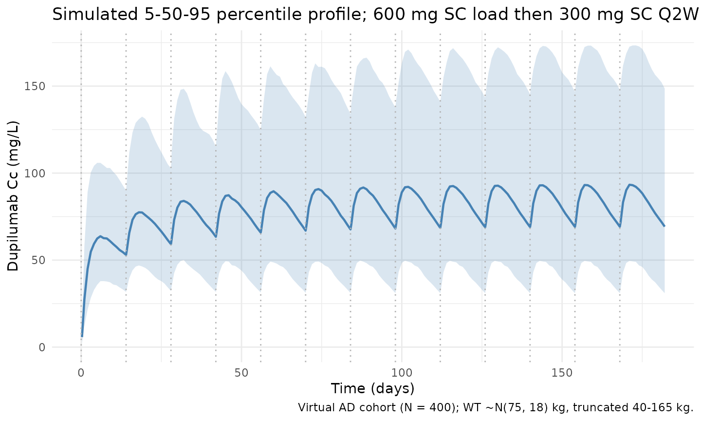
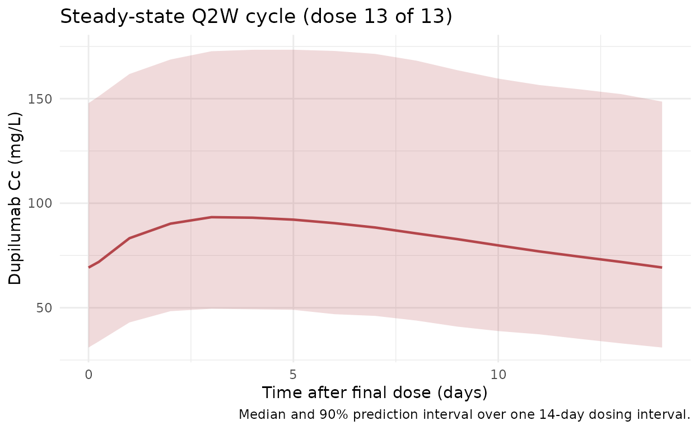

# Kovalenko_2020_dupilumab

## Model and source

- Citation: Kovalenko P, Davis JD, Li M, et al. Base and Covariate
  Population Pharmacokinetic Analyses of Dupilumab Using Phase 3 Data.
  Clinical Pharmacology in Drug Development. 2020;9(6):756-767.
  <doi:10.1002/cpdd.780>
- Description: Dupilumab PK model (Kovalenko 2020)
- Article: [Clin Pharmacol Drug Dev.
  2020;9(6):756-767](https://doi.org/10.1002/cpdd.780) (open access via
  [PMC7496533](https://pmc.ncbi.nlm.nih.gov/articles/PMC7496533/))

## Population

Kovalenko 2020 pooled 16 clinical studies (N = 2115 participants; 202
healthy volunteers and 1913 patients with moderate-to-severe atopic
dermatitis (AD)). Of these, 2041 participants on active treatment
contributed 18,243 of 20,809 samples to the population PK analysis.
Source studies include the Phase 3 AD trials R668-AD-1334 (LIBERTY AD
SOLO 1), R668-AD-1416 (LIBERTY AD SOLO 2), and R668-AD-1224 (LIBERTY AD
CHRONOS). The Phase 1 studies R668-AS-0907, TDU12265, PKM14161, and
R668-AD-1117 were used to fit “Model 1” - the rich-data model this file
implements. The paper’s main text does not tabulate detailed baseline
demographics (age, sex, weight median/range, race breakdown) for the
pooled cohort; these appear only in Supplementary Table S1.

The approved adult AD maintenance regimen is 600 mg SC loading dose on
day 0 followed by 300 mg SC every 2 weeks (Q2W); the Kovalenko 2016
precursor publication used **75 kg** as the reference body weight for
the allometric effect on central volume, and the 2020 paper reuses the
same equation without re-stating the reference weight.

The same information is available programmatically via
`readModelDb("Kovalenko_2020_dupilumab")$population`.

## Source trace

Every structural parameter, covariate effect, IIV element, and
residual-error term below is taken from Kovalenko 2020 Table 1 (Model 1
column) or Supplementary Table S2 (IIV SDs and residual errors). A
paper-to-implementation cross-walk:

| Equation / parameter                | Value                                              | Source location                                                    |
|-------------------------------------|----------------------------------------------------|--------------------------------------------------------------------|
| `lvc` (Vc, central volume)          | `log(2.48)` L                                      | Table 1, Model 1                                                   |
| `lke` (ke, linear elimination rate) | `log(0.0534)` 1/day                                | Table 1, Model 1                                                   |
| `lkcp` (kcp)                        | `log(0.213)` 1/day                                 | Table 1, Model 1                                                   |
| `Mpc` (kcp/kpc)                     | `0.686`                                            | Table 1, Model 1 (kpc derived: 0.213 / 0.686 = 0.310 1/day)        |
| `lka` (ka, absorption rate)         | `log(0.256)` 1/day                                 | Table 1, Model 1                                                   |
| `lmtt` (MTT)                        | `log(0.105)` day                                   | Table 1, Model 1                                                   |
| `lvm` (Vmax)                        | `log(1.07)` mg/L/day                               | Table 1, Model 1                                                   |
| `Km`                                | `fixed(0.01)` mg/L                                 | Table 1, Model 1 (fixed, carried over from Kovalenko 2016)         |
| `lfdepot` (F)                       | `log(0.643)`                                       | Table 1, Model 1                                                   |
| `e_wt_vc` (WT exponent on Vc)       | `0.711`                                            | Table 1, Model 1 (“Vc ~ weight”)                                   |
| `var(etalvc)`                       | `0.192^2 = 0.036864`                               | Supp. Table S2: omega_Vc (SD) = 0.192                              |
| `var(etalke)`                       | `0.285^2 = 0.081225`                               | Supp. Table S2: omega_ke (SD) = 0.285                              |
| `var(etalka)`                       | `0.474^2 = 0.224676`                               | Supp. Table S2: omega_ka (SD) = 0.474                              |
| `var(etalvm)`                       | `0.236^2 = 0.055696`                               | Supp. Table S2: omega_Vm (SD) = 0.236                              |
| `var(etalmtt)`                      | `0.525^2 = 0.275625`                               | Supp. Table S2: omega_MTT (SD) = 0.525, applied on `log(MTT)` here |
| `CcpropSd` (proportional sigma)     | `0.15`                                             | Supp. Table S2                                                     |
| `CcaddSd` (additive sigma)          | `fixed(0.03)` mg/L                                 | Supp. Table S2 (fixed, carried over from Kovalenko 2016)           |
| Structure                           | 2-cmt + 3 transit + parallel linear/MM elimination | p. 758 Methods, Figure 1                                           |

The paper’s Methods section explicitly defines omega as *“omega (omega,
standard deviation \[SD\] of between-subject variability)”* and sigma as
*“sigma (sigma, SD of measurement error)”*. nlmixr2’s `etalxxx ~ value`
syntax stores the **variance** (omega^2), so the Supp. Table S2 SDs are
squared in
[`ini()`](https://nlmixr2.github.io/rxode2/reference/ini.html). The
Model 1 shrinkage in SD reported by the paper (10.4% / 25.2% / 22.9% /
23.2% / 54.9% for Vc / ke / Vm / ka / MTT) is consistent with IIV-as-SD
accounting.

### Parameterization notes

Kovalenko 2020 parameterizes the linear elimination as a first-order
rate `ke * central` (not as `CL * Cc`) and the distribution as direct
rate constants `kcp` and `kpc = kcp / Mpc` (not as `Q` and `Vp`). The
model file preserves this parameterization, so derived quantities are:

- Typical clearance: `CL = ke * Vc = 0.0534 * 2.48 = 0.132 L/day`
  (matches Table 1 “CL (L/d)”).
- Typical peripheral rate `kpc = 0.213 / 0.686 = 0.310 1/day`.

The `etalmtt` eta is applied as `MTT = exp(lmtt + etalmtt)` (i.e.
log-normal on MTT). Supplementary Table S2 in the paper reports the
random effect additively on MTT; the log-normal implementation chosen
here avoids negative MTT draws during simulation and is the only
deviation from the published random-effect structure.

## Virtual cohort

Detailed observed demographics for the pooled cohort are not publicly
reproduced in the paper’s main text. The virtual cohort below targets
the labelled adult AD population by drawing body weight from a truncated
normal centered on the Kovalenko 2016 reference weight of 75 kg (SD ~18
kg, limits 40-165 kg), which matches typical Phase 3 AD trial
demographics reported in the Simpson 2016 SOLO / Blauvelt 2017 CHRONOS
publications.

``` r
set.seed(20260418)
n_subj <- 400

cohort <- tibble::tibble(
  id = seq_len(n_subj),
  WT = pmin(pmax(rnorm(n_subj, mean = 75, sd = 18), 40), 165)
)

# Labelled AD regimen: 600 mg SC loading dose on day 0, 300 mg SC Q2W
# for 12 additional doses -> study window 0-182 days. By dose 10+ the
# profile is close to steady state (typical half-life ~2-3 weeks).
load_dose <- 600
maint_dose <- 300
tau <- 14
n_maint <- 12
dose_days <- c(0, seq(tau, tau * n_maint, by = tau))
amt_vec <- c(load_dose, rep(maint_dose, n_maint))

ev_dose <- cohort |>
  tidyr::crossing(time = dose_days) |>
  dplyr::arrange(id, time) |>
  dplyr::group_by(id) |>
  dplyr::mutate(amt = amt_vec, cmt = "depot", evid = 1L) |>
  dplyr::ungroup()

obs_days <- sort(unique(c(
  seq(0, tau * (n_maint + 1), by = 1),
  dose_days + 0.25,
  dose_days + 1,
  dose_days + 3
)))

ev_obs <- cohort |>
  tidyr::crossing(time = obs_days) |>
  dplyr::mutate(amt = 0, cmt = NA_character_, evid = 0L)

events <- dplyr::bind_rows(ev_dose, ev_obs) |>
  dplyr::arrange(id, time, dplyr::desc(evid)) |>
  dplyr::select(id, time, amt, cmt, evid, WT)
```

## Simulation

``` r
mod <- rxode2::rxode2(readModelDb("Kovalenko_2020_dupilumab"))
#> ℹ parameter labels from comments will be replaced by 'label()'
sim <- rxode2::rxSolve(mod, events = events, keep = "WT")
```

## Figure replication - Cc-vs-time profiles

Kovalenko 2020 Figure 5 illustrates simulated median concentration-time
profiles of functional dupilumab for several SC maintenance regimens
(qw, q2w, q4w, q8w). The figure below reproduces the labelled adult AD
regimen (600 mg SC loading + 300 mg SC Q2W) as 5th/50th/95th percentile
bands across the virtual cohort, spanning ~13 dosing cycles.

``` r
vpc <- sim |>
  dplyr::filter(!is.na(Cc), time > 0) |>
  dplyr::group_by(time) |>
  dplyr::summarise(
    Q05 = quantile(Cc, 0.05, na.rm = TRUE),
    Q50 = quantile(Cc, 0.50, na.rm = TRUE),
    Q95 = quantile(Cc, 0.95, na.rm = TRUE),
    .groups = "drop"
  )

ggplot(vpc, aes(time, Q50)) +
  geom_ribbon(aes(ymin = Q05, ymax = Q95), alpha = 0.2, fill = "#4682b4") +
  geom_line(colour = "#4682b4", linewidth = 0.8) +
  geom_vline(xintercept = dose_days, linetype = "dotted", colour = "grey70") +
  scale_y_continuous(limits = c(0, NA)) +
  labs(
    x = "Time (days)",
    y = "Dupilumab Cc (mg/L)",
    title = "Simulated 5-50-95 percentile profile; 600 mg SC load then 300 mg SC Q2W",
    caption = "Virtual AD cohort (N = 400); WT ~N(75, 18) kg, truncated 40-165 kg."
  ) +
  theme_minimal()
```



### Steady-state cycle (dose 13)

Zoomed-in view of the final Q2W cycle (days 168-182) to isolate the
steady-state peak, trough, and AUC_tau used by the NCA below.

``` r
ss_start <- tau * n_maint # day 168 (time of dose 13)
ss_end <- ss_start + tau # day 182

ss_summary <- sim |>
  dplyr::filter(time >= ss_start, time <= ss_end, !is.na(Cc)) |>
  dplyr::group_by(time) |>
  dplyr::summarise(
    Q05 = quantile(Cc, 0.05, na.rm = TRUE),
    Q50 = quantile(Cc, 0.50, na.rm = TRUE),
    Q95 = quantile(Cc, 0.95, na.rm = TRUE),
    .groups = "drop"
  )

ggplot(ss_summary, aes(time - ss_start, Q50)) +
  geom_ribbon(aes(ymin = Q05, ymax = Q95), alpha = 0.2, fill = "#b4464b") +
  geom_line(colour = "#b4464b", linewidth = 0.8) +
  labs(
    x = "Time after final dose (days)",
    y = "Dupilumab Cc (mg/L)",
    title = "Steady-state Q2W cycle (dose 13 of 13)",
    caption = "Median and 90% prediction interval over one 14-day dosing interval."
  ) +
  theme_minimal()
```



## PKNCA validation

Non-compartmental analysis of the steady-state Q2W interval (days
168-182). Compute Cmax, Cmin (Ctrough at end of tau), AUC_tau, and
average concentration per simulated subject.

``` r
nca_conc <- sim |>
  dplyr::filter(time >= ss_start, time <= ss_end, !is.na(Cc)) |>
  dplyr::mutate(time_nom = time - ss_start,
    treatment = "300mg_Q2W_SS") |>
  dplyr::select(id, time = time_nom, Cc, treatment)

nca_dose <- cohort |>
  dplyr::mutate(time = 0, amt = maint_dose, treatment = "300mg_Q2W_SS") |>
  dplyr::select(id, time, amt, treatment)

conc_obj <- PKNCA::PKNCAconc(nca_conc, Cc ~ time | treatment + id)
dose_obj <- PKNCA::PKNCAdose(nca_dose, amt ~ time | treatment + id)

intervals <- data.frame(
  start = 0,
  end = tau,
  cmax = TRUE,
  cmin = TRUE,
  auclast = TRUE,
  cav = TRUE
)

nca_res <- PKNCA::pk.nca(PKNCA::PKNCAdata(conc_obj, dose_obj, intervals = intervals))
#>  ■■■■■■■■■■■                       35% |  ETA:  2s
summary(nca_res)
#>  start end    treatment   N     auclast        cmax        cmin         cav
#>      0  14 300mg_Q2W_SS 400 1190 [43.9] 95.0 [41.9] 70.4 [49.2] 85.1 [43.9]
#> 
#> Caption: auclast, cmax, cmin, cav: geometric mean and geometric coefficient of variation; N: number of subjects
```

### Comparison against published typical steady-state exposure

Kovalenko 2020 does not tabulate point estimates for steady-state Cmax,
Ctrough, or AUC_tau in the main text; Figure 5 shows simulated medians
qualitatively. Dupilumab FDA labelling and follow-on PK publications
report typical steady-state trough concentrations of ~70-80 mg/L for a
75-kg adult on the 600-mg-load + 300-mg-Q2W SC regimen. The
typical-value (“population typical”) prediction with IIV zeroed out
provides a direct self-consistency check:

``` r
mod_typical <- mod |> rxode2::zeroRe()

ev_typical <- events |>
  dplyr::filter(id == 1L) |>
  dplyr::mutate(WT = 75)

sim_typical <- rxode2::rxSolve(
  mod_typical, events = ev_typical, keep = "WT"
) |>
  as.data.frame()
#> ℹ omega/sigma items treated as zero: 'etalvc', 'etalke', 'etalka', 'etalvm', 'etalmtt'

ss_typical <- sim_typical |>
  dplyr::filter(time >= ss_start, time <= ss_end, !is.na(Cc))

typical_summary <- tibble::tibble(
  metric = c("Cmax (mg/L)", "Cmin/Ctrough (mg/L)",
    "Cavg (mg/L)", "AUC_tau (day*mg/L)"),
  typical_value = c(
    max(ss_typical$Cc),
    min(ss_typical$Cc),
    mean(ss_typical$Cc),
    sum(diff(ss_typical$time) *
      (ss_typical$Cc[-length(ss_typical$Cc)] +
        ss_typical$Cc[-1]) / 2)
  )
)
knitr::kable(typical_summary, digits = 2,
  caption = "Typical-subject steady-state exposure (WT = 75 kg; IIV zeroed).")
```

| metric              | typical_value |
|:--------------------|--------------:|
| Cmax (mg/L)         |         92.79 |
| Cmin/Ctrough (mg/L) |         70.04 |
| Cavg (mg/L)         |         82.26 |
| AUC_tau (day\*mg/L) |       1173.27 |

Typical-subject steady-state exposure (WT = 75 kg; IIV zeroed).

## Assumptions and deviations

- Kovalenko 2020 Model 1 uses a `ke`/`kcp`/`kpc` parameterization rather
  than `CL`/`Q`/`Vp`. This model file preserves the original
  parameterization verbatim. Typical values can be cross-checked against
  Table 1’s derived `CL = ke * Vc = 0.132 L/day`.
- `Km` and `F` were reported as fixed in Table 1 Model 1, with values
  carried over from the earlier Kovalenko 2016 model; `CcaddSd` was
  likewise fixed at 0.03 mg/L.
- The `etalmtt` eta is applied as log-normal on MTT
  (`MTT = exp(lmtt + etalmtt)`), whereas Supplementary Table S2
  implements the random effect additively on MTT. The log-normal form
  prevents non-physical negative MTT draws during simulation. All other
  etas match the paper’s random-effect structure directly.
- IIV (omega) is reported in Kovalenko 2020 as a standard deviation, per
  the Methods definition. Values in
  [`ini()`](https://nlmixr2.github.io/rxode2/reference/ini.html) are
  squared to yield the variance that nlmixr2 stores with the `~`
  operator. An earlier version of this file stored the SDs directly on
  the RHS (i.e. as variances), which would understate IIV magnitude at
  the mAb-relevant scale; the current file is the corrected form.
- The reference body weight (75 kg) is inherited from Kovalenko 2016
  (<doi:10.1002/psp4.12136>); Kovalenko 2020 does not restate the
  reference weight. See the file header comment for details.
- Demographic details (age, sex, race) are not used by the Model 1
  implementation (only WT enters the covariate model) and were not
  re-simulated in the virtual cohort.
- Kovalenko 2020 does not publish numerical Cmax / Cmin / AUC_tau at
  steady state, so the PKNCA summary here is a self-consistency check of
  the implemented model against the visual appearance of Figure 5 rather
  than a back-to-paper numerical comparison.
- No unit conversion is required between the dosing amount (mg) and the
  concentration unit (mg/L) because mg/L is the natural unit of
  `central/vc` here.
