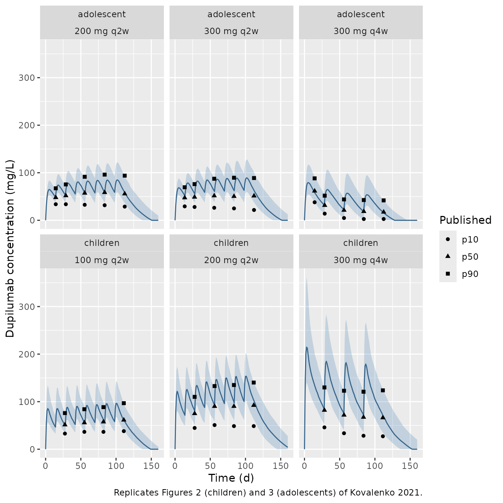

# Dupilumab in children and adolescents (Kovalenko 2021)

## Model and source

- Citation: Kovalenko P, Kamal MA, Davis JD, Huniti N, Xu C, Bansal A,
  Shumel B, DiCioccio AT. Base and Covariate Population Pharmacokinetic
  Analyses of Dupilumab in Adolescents and Children \>=6 to \<12 Years
  of Age Using Phase 3 Data. Clinical Pharmacology in Drug Development.
  2021;10(11):1345-1357. <doi:10.1002/cpdd.986>
- Article: [Clin Pharmacol Drug Dev.
  2021;10(11):1345-1357](https://doi.org/10.1002/cpdd.986) (open access
  via [PMC8597115](https://pmc.ncbi.nlm.nih.gov/articles/PMC8597115/))
- Supplement: Supplementary Tables 1-5 (between-subject variability,
  residual error and bootstrap intervals), distributed with the article.

Kovalenko 2021 applied the adult dupilumab model of Kovalenko 2020
(`readModelDb("Kovalenko_2020_dupilumab_covariate")`) without structural
change to two phase 3 pediatric atopic-dermatitis trials, and analysed
the two age groups separately. Each age group has a primary base model
(body weight on central volume only) and a primary covariate model:

| Model | Age group | Covariates |
|----|----|----|
| `Kovalenko_2021_dupilumab_children_base` | 6 to \<12 years | WT on Vc |
| `Kovalenko_2021_dupilumab_children_covariate` | 6 to \<12 years | WT, ALB on Vc; EASI on ke |
| `Kovalenko_2021_dupilumab_adolescent_base` | 12 to \<18 years | WT on Vc |
| `Kovalenko_2021_dupilumab_adolescent_covariate` | 12 to \<18 years | WT on Vc; BMI, EASI on ke |

The model is a two-compartment model parameterised in rate constants
(Vc, ke, kcp, kpc) with parallel linear and Michaelis-Menten (Vm, Km)
elimination from the central compartment. Subcutaneous doses pass
through three transit compartments (mean transit time MTT) into an
absorption depot drained at ka, with bioavailability F (Figure 1). Only
Vc, ke and (except in the children covariate model) Vm were estimated;
the remaining structural parameters were fixed to the adult values,
except ka in children, which was estimated on the semisparse phase 2a
R668-AD-1412 data and then fixed.

The sensitivity analyses parameterised in clearance (Tables 3 and 4,
Supplementary Tables 4 and 5) are not packaged; the paper presents them
as robustness checks of the rate-parameterised primary models.

## Population

- **Children 6 to \<12 years** (R668-AD-1652, LIBERTY AD PEDS,
  NCT03345914): severe atopic dermatitis with concomitant topical
  corticosteroids; 239 of 241 children on active treatment and 925 of
  1173 samples entered the primary analysis. Mean (SD) age 8.5 (1.7)
  years, weight 31.6 (10.2) kg, 49.8% male. Regimens: 100 mg every 2
  weeks (q2w) for \<30 kg (n = 63), 200 mg q2w for \>=30 kg (n = 59), or
  300 mg every 4 weeks (q4w) (n = 119).
- **Adolescents 12 to \<18 years** (R668-AD-1526, LIBERTY AD ADOL,
  NCT03054428): moderate-to-severe atopic dermatitis, dupilumab
  monotherapy; 162 of 165 adolescents on active treatment and 827 of
  1006 samples. Mean (SD) age 14.4 (1.59) years, weight 65.3 (22.0) kg,
  56.7% male. Regimens: 200 mg q2w for \<60 kg (n = 43), 300 mg q2w for
  \>=60 kg (n = 39), or 300 mg q4w (n = 82).

In both studies PK samples were collected on days 1, 29, 57 and 113 and
at the end of treatment (Methods). The same information is available
programmatically via
`readModelDb("Kovalenko_2021_dupilumab_children_base")()$population`
(and likewise for the other three models).

## Source trace

Every `ini()` value carries an in-file comment naming its source row.
The table collects them. Values are identical in Table 1 / Table 2 of
the article and in Supplementary Tables 2 / 3, which add the
between-subject variability and residual error.

| Parameter | Children base | Children covariate | Adolescent base | Adolescent covariate | Source |
|----|----|----|----|----|----|
| Vc (L, at 75 kg) | 2.22 | 2.18 | 2.54 | 2.47 | Table 1 / Table 2 |
| ke (1/d) | 0.0444 | 0.0446 | 0.0508 | 0.0520 | Table 1 / Table 2 |
| Vm (mg/L/d) | 1.64 (estimated) | 1.64 (fixed) | 1.46 | 1.43 | Table 1 / Table 2 and footnotes; Methods |
| Km (mg/L) | 0.01 (fixed) | 0.01 (fixed) | 0.01 (fixed) | 0.01 (fixed) | Table 1 / Table 2 |
| kcp (1/d) | 0.211 (fixed) | 0.211 (fixed) | 0.211 (fixed) | 0.211 (fixed) | Table 1 / Table 2 |
| kpc (1/d) | 0.310 (fixed) | 0.310 (fixed) | 0.310 (fixed) | 0.310 (fixed) | Table 1 / Table 2 |
| ka (1/d) | 0.641 (fixed) | 0.641 (fixed) | 0.306 (fixed) | 0.306 (fixed) | Table 1 / Table 2 |
| MTT (d) | 0.105 (fixed) | 0.105 (fixed) | 0.105 (fixed) | 0.105 (fixed) | Table 1 / Table 2 |
| F | 0.642 (fixed) | 0.642 (fixed) | 0.642 (fixed) | 0.642 (fixed) | Table 1 / Table 2 |
| Vc ~ weight | 0.864 | 0.849 | 0.853 | 0.755 | Table 1 / Table 2 |
| Vc ~ albumin | – | -0.525 | – | – | Table 2 |
| ke ~ BMI | – | – | – | 0.357 | Table 2 |
| ke ~ EASI | – | 0.169 | – | 0.356 | Table 2 |
| SD(ln Vc) | 0.305 | 0.291 | 0.141 | 0.140 | Supp. Table 2 / 3 |
| SD(ln ke) | 0.409 | 0.417 | 0.335 | 0.304 | Supp. Table 2 / 3 |
| Corr(ln ke, ln Vc) | -0.871 | -0.883 | -0.407 | -0.529 | Supp. Table 2 / 3 |
| Proportional SD | 13.2% | 13.1% | 9.90% | 9.94% | Supp. Table 2 / 3 |
| Additive SD (mg/L) | 0.03 (fixed) | 0.03 (fixed) | 2.41 | 2.36 | Supp. Table 2 / 3 |
| Continuous covariate form | `Y * (cov / central value)^theta` |  |  |  | Methods, first formula |
| Weight central value | 75 kg |  |  |  | Methods |
| Structure | 2-cmt, rates, linear + MM elimination, 3 transit compartments |  |  |  | Methods; Figure 1 |

## Checks against values printed in the paper

### Derived parameters and beta half-life

Supplementary Tables 2 and 3 print CL = Vc \* ke, Q = Vc \* kcp and Vp =
Vc \* kcp / kpc for every model, and the Discussion quotes the beta
half-life (the slower disposition half-life of the linear
two-compartment system, a function of ke, kcp and kpc only) as 27.1 days
in children and 23.4 days in adolescents. These are exact functions of
the packaged typical values, so they are checked to printing precision.

``` r

models <- c(
  children_base        = "Kovalenko_2021_dupilumab_children_base",
  children_covariate   = "Kovalenko_2021_dupilumab_children_covariate",
  adolescent_base      = "Kovalenko_2021_dupilumab_adolescent_base",
  adolescent_covariate = "Kovalenko_2021_dupilumab_adolescent_covariate"
)

beta_half_life <- function(ke, kcp, kpc) {
  s <- ke + kcp + kpc
  log(2) / ((s - sqrt(s^2 - 4 * ke * kpc)) / 2)
}

derived <- bind_rows(lapply(names(models), function(nm) {
  th <- rxode2::rxode2(readModelDb(models[[nm]]))$theta
  vc <- exp(th[["lvc"]])
  ke <- exp(th[["lkel"]])
  kcp <- exp(th[["lkcp"]])
  kpc <- exp(th[["lkpc"]])
  tibble(
    model = nm,
    CL = vc * ke,
    Q = vc * kcp,
    Vp = vc * kcp / kpc,
    t_beta = beta_half_life(ke, kcp, kpc)
  )
}))

published_derived <- tribble(
  ~model,                 ~CL_pub, ~Q_pub, ~Vp_pub, ~t_beta_pub,
  "children_base",        0.0986,  0.468,  1.51,    NA,
  "children_covariate",   0.0972,  0.460,  1.48,    27.1,
  "adolescent_base",      0.129,   0.536,  1.73,    NA,
  "adolescent_covariate", 0.128,   0.521,  1.68,    23.4
)

derived_cmp <- left_join(derived, published_derived, by = "model")

derived_cmp |>
  mutate(across(c(CL, Q, Vp, t_beta), ~ signif(.x, 3))) |>
  select(model, CL, CL_pub, Q, Q_pub, Vp, Vp_pub, t_beta, t_beta_pub) |>
  rename(
    "Model" = model,
    "CL (L/d)" = CL, "CL published" = CL_pub,
    "Q (L/d)" = Q, "Q published" = Q_pub,
    "Vp (L)" = Vp, "Vp published" = Vp_pub,
    "Beta t1/2 (d)" = t_beta, "Beta t1/2 published" = t_beta_pub
  ) |>
  knitr::kable(caption = "Derived parameters (Supplementary Tables 2 and 3) and beta half-life (Discussion).")
```

| Model | CL (L/d) | CL published | Q (L/d) | Q published | Vp (L) | Vp published | Beta t1/2 (d) | Beta t1/2 published |
|:---|---:|---:|---:|---:|---:|---:|---:|---:|
| children_base | 0.0986 | 0.0986 | 0.468 | 0.468 | 1.51 | 1.51 | 27.2 | NA |
| children_covariate | 0.0972 | 0.0972 | 0.460 | 0.460 | 1.48 | 1.48 | 27.1 | 27.1 |
| adolescent_base | 0.1290 | 0.1290 | 0.536 | 0.536 | 1.73 | 1.73 | 23.9 | NA |
| adolescent_covariate | 0.1280 | 0.1280 | 0.521 | 0.521 | 1.68 | 1.68 | 23.4 | 23.4 |

Derived parameters (Supplementary Tables 2 and 3) and beta half-life
(Discussion). {.table}

``` r


# Printed to three significant figures, so agreement to within 0.6% is exact.
rel <- function(a, b) abs(a / b - 1)
stopifnot(
  all(rel(derived_cmp$CL, derived_cmp$CL_pub) < 0.006),
  all(rel(derived_cmp$Q, derived_cmp$Q_pub) < 0.006),
  all(rel(derived_cmp$Vp, derived_cmp$Vp_pub) < 0.006),
  all(rel(derived_cmp$t_beta, derived_cmp$t_beta_pub) < 0.006, na.rm = TRUE)
)
```

The beta half-lives reproduce from the covariate models (27.07 and 23.36
days); the base models give 27.2 and 23.9 days, so the Discussion values
were computed from the covariate models.

### Median-weight sensitivity analysis

The Results report that re-centring weight on the cohort median instead
of 75 kg reduced Vc from 2.18 to 1.03 L in children and from 2.47 to
2.04 L in adolescents. Under the power form
`Vc(WT) = Vc * (WT / 75)^theta` this implies the median weights below,
which sit just under the published means (31.6 and 65.3 kg), as expected
for right-skewed weight distributions. This confirms both the 75 kg
central value and the power (not exponential) form.

``` r

implied_median_wt <- c(
  children   = 75 * (1.03 / 2.18)^(1 / 0.849),
  adolescent = 75 * (2.04 / 2.47)^(1 / 0.755)
)
round(implied_median_wt, 1)
#>   children adolescent 
#>       31.0       58.2
stopifnot(
  implied_median_wt[["children"]] > 25, implied_median_wt[["children"]] < 31.6,
  implied_median_wt[["adolescent"]] > 50, implied_median_wt[["adolescent"]] < 65.3
)
```

## Virtual cohort

Observed data are not public. Each dose group is simulated with 200
virtual patients. Body weight is log-normal with the published mean and
SD of the age group; the weight-banded q2w arms are sampled from that
distribution restricted to their band (rejection sampling, so the
in-band shape is preserved). The covariate-model covariates are drawn
around their central values: albumin normal with SD 3.19 g/L (children),
EASI normal with SD 12 (trial baseline tables) truncated at the trial
entry thresholds (21 in children, 16 in adolescents), and adolescent BMI
log-normal with SD 6.91 kg/m^2 (Discussion).

Dosing follows the trials: a loading dose of twice the maintenance dose
on day 0, then maintenance q2w through day 98 or q4w through day 84. The
adolescent loading doses (400 mg before 200 mg q2w, 600 mg before 300 mg
q2w or q4w) are from the trial report (Simpson 2020); the children’s
loading doses are not given in the article, so the same
twice-maintenance rule is assumed.

``` r

set.seed(20210110)
rxode2::rxSetSeed(20210110)

rlnorm_ms <- function(n, mean, sd) {
  sdlog <- sqrt(log(1 + (sd / mean)^2))
  rlnorm(n, log(mean) - sdlog^2 / 2, sdlog)
}
# Draw n weights from the age-group distribution restricted to [lo, hi).
draw_wt <- function(n, mean, sd, lo = 0, hi = Inf) {
  out <- numeric(0)
  while (length(out) < n) {
    x <- rlnorm_ms(4 * n, mean, sd)
    out <- c(out, x[x >= lo & x < hi])
  }
  out[seq_len(n)]
}
draw_trunc_norm <- function(n, mean, sd, lo) {
  out <- numeric(0)
  while (length(out) < n) {
    x <- rnorm(4 * n, mean, sd)
    out <- c(out, x[x >= lo])
  }
  out[seq_len(n)]
}

arms <- tribble(
  ~age,         ~arm,           ~dose, ~tau, ~last, ~wt_lo, ~wt_hi,
  "children",   "100 mg q2w",   100,   14,   98,    15,     30,
  "children",   "200 mg q2w",   200,   14,   98,    30,     Inf,
  "children",   "300 mg q4w",   300,   28,   84,    15,     Inf,
  "adolescent", "200 mg q2w",   200,   14,   98,    0,      60,
  "adolescent", "300 mg q2w",   300,   14,   98,    60,     Inf,
  "adolescent", "300 mg q4w",   300,   28,   84,    0,      Inf
)
n_per_arm <- 200
wt_dist <- list(children = c(31.6, 10.2), adolescent = c(65.3, 22.0))

# VPC predicted-percentile lines digitised from the vector graphics of
# Figures 2 (children) and 3 (adolescents): time (d) and predicted
# 10th / 50th / 90th percentiles (mg/L).
fig <- tribble(
  ~age, ~arm, ~time, ~p10, ~p50, ~p90,
  "children", "100 mg q2w", 27.4, 32.9, 51.3, 76.0,
  "children", "100 mg q2w", 55.0, 36.5, 55.7, 84.1,
  "children", "100 mg q2w", 82.1, 36.5, 57.5, 88.5,
  "children", "100 mg q2w", 111.0, 38.0, 61.4, 96.8,
  "children", "200 mg q2w", 27.8, 44.7, 75.0, 110.1,
  "children", "200 mg q2w", 56.1, 50.8, 90.1, 132.8,
  "children", "200 mg q2w", 83.6, 48.6, 90.2, 135.0,
  "children", "200 mg q2w", 111.7, 48.6, 92.3, 140.2,
  "children", "300 mg q4w", 28.3, 45.9, 82.0, 129.9,
  "children", "300 mg q4w", 56.1, 33.6, 71.8, 123.0,
  "children", "300 mg q4w", 83.8, 28.3, 67.3, 120.9,
  "children", "300 mg q4w", 111.3, 27.2, 66.2, 123.8,
  "adolescent", "200 mg q2w", 14.4, 33.8, 47.9, 67.3,
  "adolescent", "200 mg q2w", 28.7, 33.8, 51.8, 75.5,
  "adolescent", "200 mg q2w", 55.5, 32.6, 57.2, 91.5,
  "adolescent", "200 mg q2w", 83.8, 31.7, 58.5, 96.1,
  "adolescent", "200 mg q2w", 112.3, 28.8, 55.7, 93.9,
  "adolescent", "300 mg q2w", 13.7, 29.3, 47.4, 69.5,
  "adolescent", "300 mg q2w", 27.7, 28.0, 48.8, 76.1,
  "adolescent", "300 mg q2w", 55.6, 26.3, 51.6, 87.4,
  "adolescent", "300 mg q2w", 83.7, 25.0, 50.4, 89.5,
  "adolescent", "300 mg q2w", 112.1, 21.7, 51.3, 88.9,
  "adolescent", "300 mg q4w", 14.4, 37.9, 61.6, 88.2,
  "adolescent", "300 mg q4w", 28.7, 14.0, 31.4, 51.8,
  "adolescent", "300 mg q4w", 56.1, 4.8, 21.2, 43.9,
  "adolescent", "300 mg q4w", 84.2, 2.7, 18.6, 42.6,
  "adolescent", "300 mg q4w", 112.4, 2.7, 17.3, 41.9
)

# The VPC bins on dosing days sit at trough level (for example the adolescent
# 300 mg q4w median falls from 61.6 mg/L on day 14 to 31.4 mg/L on day 29), so
# the visits are treated as pre-dose samples: a digitised bin within 1.5 days
# of a scheduled dose is evaluated just before that dose; other bins are
# evaluated at the digitised time.
dose_days <- arms |>
  rowwise() |>
  mutate(dose_day = list(seq(0, last, by = tau))) |>
  ungroup() |>
  select(age, arm, dose_day)
fig <- fig |>
  left_join(dose_days, by = c("age", "arm")) |>
  rowwise() |>
  mutate(t_eval = {
    near <- dose_day[abs(dose_day - time) <= 1.5]
    if (length(near) > 0) near[1] - 0.01 else time
  }) |>
  ungroup() |>
  select(-dose_day)

obs_times <- sort(unique(c(seq(0, 160, by = 1), fig$t_eval)))

make_arm <- function(i, id_offset) {
  a <- arms[i, ]
  wd <- wt_dist[[a$age]]
  n <- n_per_arm
  subj <- tibble(
    id = id_offset + seq_len(n),
    WT = draw_wt(n, wd[1], wd[2], a$wt_lo, a$wt_hi),
    ALB = rnorm(n, 44, 3.19),
    SCORE_EASI = if (a$age == "children") {
      draw_trunc_norm(n, 37, 12, 21)
    } else {
      draw_trunc_norm(n, 36, 12, 16)
    },
    BMI = rlnorm_ms(n, 24.5, 6.91)
  )
  dose_times <- seq(0, a$last, by = a$tau)
  doses <- tidyr::crossing(subj, time = dose_times) |>
    mutate(amt = ifelse(time == 0, 2 * a$dose, a$dose), evid = 1L, cmt = "depot")
  obs <- tidyr::crossing(subj, time = obs_times) |>
    mutate(amt = 0, evid = 0L, cmt = "central")
  bind_rows(doses, obs) |>
    mutate(age = a$age, arm = a$arm) |>
    arrange(id, time, desc(evid))
}

events <- bind_rows(lapply(seq_len(nrow(arms)), function(i) {
  make_arm(i, id_offset = (i - 1L) * n_per_arm)
}))
stopifnot(!anyDuplicated(unique(events[, c("id", "age", "arm")])$id))
```

## Simulation

Figures 2 and 3 of the article are visual predictive checks of the
primary covariate models, so the covariate models are simulated here.

``` r

sim_age <- function(age_group) {
  mod <- readModelDb(models[[paste0(age_group, "_covariate")]])
  ev <- events |> filter(age == !!age_group)
  as.data.frame(rxode2::rxSolve(mod, events = ev, keep = c("age", "arm"),
                                returnType = "data.frame"))
}
sim <- bind_rows(sim_age("children"), sim_age("adolescent"))
```

## Replicate Figures 2 and 3

The ribbons and solid line are the simulated 10th-90th percentiles and
median of the individual predictions. The points are the predicted 10th,
50th and 90th percentiles digitised from the article’s figures.

``` r

pct <- sim |>
  group_by(age, arm, time) |>
  summarise(
    p10 = quantile(Cc, 0.10), p50 = median(Cc), p90 = quantile(Cc, 0.90),
    .groups = "drop"
  )

fig_long <- fig |>
  pivot_longer(c(p10, p50, p90), names_to = "percentile", values_to = "Cc")

ggplot(pct, aes(time)) +
  geom_ribbon(aes(ymin = p10, ymax = p90), fill = "steelblue", alpha = 0.25) +
  geom_line(aes(y = p50), colour = "steelblue4") +
  geom_point(data = fig_long, aes(y = Cc, shape = percentile)) +
  facet_wrap(~ age + arm, ncol = 3) +
  labs(x = "Time (d)", y = "Dupilumab concentration (mg/L)", shape = "Published",
       caption = "Replicates Figures 2 (children) and 3 (adolescents) of Kovalenko 2021.")
```



The simulated medians are compared with the digitised predicted medians
below. The bins on dosing days sit at trough level, so the visits are
treated as pre-dose samples: a bin within 1.5 days of a scheduled dose
is evaluated just before that dose. For children the loading doses are
assumed, so only the day-111 bin, where the loading dose has largely
washed out, is gated; the earlier children bins are shown for
information. All adolescent bins are gated because the adolescent
regimens, loading doses included, are documented.

``` r

cmp_fig <- fig |>
  select(age, arm, time, t_eval, p50_pub = p50) |>
  left_join(pct |> select(age, arm, t_eval = time, p50_sim = p50), by = c("age", "arm", "t_eval")) |>
  mutate(
    pct_diff = 100 * (p50_sim / p50_pub - 1),
    gated = age == "adolescent" | time > 100
  )

cmp_fig |>
  mutate(across(c(p50_sim, pct_diff), ~ round(.x, 1))) |>
  rename(
    "Age group" = age, "Arm" = arm, "Time (d)" = time, "Evaluated at (d)" = t_eval,
    "Published median (mg/L)" = p50_pub, "Simulated median (mg/L)" = p50_sim,
    "Difference (%)" = pct_diff, "Gated" = gated
  ) |>
  knitr::kable(caption = "Predicted medians: simulation vs digitised Figures 2 and 3.")
```

| Age group | Arm | Time (d) | Evaluated at (d) | Published median (mg/L) | Simulated median (mg/L) | Difference (%) | Gated |
|:---|:---|---:|---:|---:|---:|---:|:---|
| children | 100 mg q2w | 27.4 | 27.99 | 51.3 | 49.1 | -4.2 | FALSE |
| children | 100 mg q2w | 55.0 | 55.99 | 55.7 | 54.6 | -2.0 | FALSE |
| children | 100 mg q2w | 82.1 | 82.10 | 57.5 | 61.9 | 7.7 | FALSE |
| children | 100 mg q2w | 111.0 | 111.00 | 61.4 | 61.2 | -0.4 | TRUE |
| children | 200 mg q2w | 27.8 | 27.99 | 75.0 | 80.6 | 7.5 | FALSE |
| children | 200 mg q2w | 56.1 | 55.99 | 90.1 | 92.4 | 2.6 | FALSE |
| children | 200 mg q2w | 83.6 | 83.99 | 90.2 | 97.5 | 8.1 | FALSE |
| children | 200 mg q2w | 111.7 | 111.70 | 92.3 | 103.1 | 11.7 | TRUE |
| children | 300 mg q4w | 28.3 | 27.99 | 82.0 | 84.0 | 2.5 | FALSE |
| children | 300 mg q4w | 56.1 | 55.99 | 71.8 | 75.0 | 4.5 | FALSE |
| children | 300 mg q4w | 83.8 | 83.99 | 67.3 | 71.4 | 6.1 | FALSE |
| children | 300 mg q4w | 111.3 | 111.30 | 66.2 | 71.1 | 7.4 | TRUE |
| adolescent | 200 mg q2w | 14.4 | 13.99 | 47.9 | 48.3 | 0.8 | TRUE |
| adolescent | 200 mg q2w | 28.7 | 27.99 | 51.8 | 52.9 | 2.1 | TRUE |
| adolescent | 200 mg q2w | 55.5 | 55.99 | 57.2 | 56.7 | -0.8 | TRUE |
| adolescent | 200 mg q2w | 83.8 | 83.99 | 58.5 | 58.3 | -0.3 | TRUE |
| adolescent | 200 mg q2w | 112.3 | 112.30 | 55.7 | 58.7 | 5.5 | TRUE |
| adolescent | 300 mg q2w | 13.7 | 13.99 | 47.4 | 51.6 | 8.9 | TRUE |
| adolescent | 300 mg q2w | 27.7 | 27.99 | 48.8 | 55.4 | 13.4 | TRUE |
| adolescent | 300 mg q2w | 55.6 | 55.99 | 51.6 | 60.7 | 17.5 | TRUE |
| adolescent | 300 mg q2w | 83.7 | 83.99 | 50.4 | 62.1 | 23.3 | TRUE |
| adolescent | 300 mg q2w | 112.1 | 112.10 | 51.3 | 62.9 | 22.6 | TRUE |
| adolescent | 300 mg q4w | 14.4 | 14.40 | 61.6 | 58.3 | -5.4 | TRUE |
| adolescent | 300 mg q4w | 28.7 | 27.99 | 31.4 | 31.7 | 0.9 | TRUE |
| adolescent | 300 mg q4w | 56.1 | 55.99 | 21.2 | 22.4 | 5.6 | TRUE |
| adolescent | 300 mg q4w | 84.2 | 83.99 | 18.6 | 18.2 | -2.0 | TRUE |
| adolescent | 300 mg q4w | 112.4 | 112.40 | 17.3 | 15.9 | -8.2 | TRUE |

Predicted medians: simulation vs digitised Figures 2 and 3. {.table}

``` r


gated <- cmp_fig |> filter(gated)
stopifnot(
  !anyNA(gated$p50_sim),
  nrow(gated) == 18L,
  # A mis-transcribed volume, rate constant or dose moves every median by tens
  # of percent; the virtual covariate distributions and the digitisation move
  # it by a few.
  abs(median(gated$pct_diff)) < 10,
  quantile(abs(gated$pct_diff), 0.9) < 30
)
```

Most bins agree within 10%. The adolescent 300 mg q2w arm (weight \>= 60
kg) is over-predicted, increasingly over time, by roughly 10-25%. That
arm is the heaviest group, where the virtual cohort is least certain:
BMI is drawn independently of weight, so the heavy adolescents are not
given the higher BMI (and hence faster linear elimination) they would
have, and the upper tail of the trial’s weight distribution is not
published.

## PKNCA validation: steady-state trough

The Discussion states that the minimal model-predicted median
steady-state trough concentration across the pediatric q2w groups is
about 57 mg/L. The four q2w groups are simulated to steady state (26
doses) with the base models, which the Supplement describes as the
models used for simulation, and the trough, peak and average
concentration over the last dosing interval are computed with PKNCA.

``` r

ss_arms <- arms |> filter(tau == 14)
ss_last <- 14 * 25
ss_events <- bind_rows(lapply(seq_len(nrow(ss_arms)), function(i) {
  a <- ss_arms[i, ]
  wd <- wt_dist[[a$age]]
  subj <- tibble(
    id = (i - 1L) * n_per_arm + seq_len(n_per_arm),
    WT = draw_wt(n_per_arm, wd[1], wd[2], a$wt_lo, a$wt_hi)
  )
  doses <- tidyr::crossing(subj, time = seq(0, ss_last, by = 14)) |>
    mutate(amt = ifelse(time == 0, 2 * a$dose, a$dose), evid = 1L, cmt = "depot")
  obs <- tidyr::crossing(subj, time = c(0, ss_last + c(0, 0.25, 0.5, 1:14))) |>
    mutate(amt = 0, evid = 0L, cmt = "central")
  bind_rows(doses, obs) |>
    mutate(age = a$age, arm = a$arm, group = paste(a$age, a$arm)) |>
    arrange(id, time, desc(evid))
}))

ss_sim <- bind_rows(lapply(c("children", "adolescent"), function(ag) {
  mod <- readModelDb(models[[paste0(ag, "_base")]])
  as.data.frame(rxode2::rxSolve(mod, events = ss_events |> filter(age == ag),
                                keep = c("group"), returnType = "data.frame"))
}))
```

``` r

nca_conc <- ss_sim |>
  filter(!is.na(Cc)) |>
  select(id, time, Cc, group)
nca_conc <- bind_rows(
  nca_conc,
  nca_conc |> distinct(id, group) |> mutate(time = 0, Cc = 0)
) |>
  distinct(id, group, time, .keep_all = TRUE) |>
  arrange(id, group, time)

nca_dose <- ss_events |>
  filter(evid == 1) |>
  select(id, time, amt, group)

conc_obj <- PKNCA::PKNCAconc(nca_conc, Cc ~ time | group + id)
dose_obj <- PKNCA::PKNCAdose(nca_dose, amt ~ time | group + id)
intervals <- data.frame(
  start = ss_last, end = ss_last + 14,
  cmax = TRUE, cmin = TRUE, cav = TRUE
)
nca_res <- PKNCA::pk.nca(PKNCA::PKNCAdata(conc_obj, dose_obj, intervals = intervals))

ss_summary <- as.data.frame(nca_res) |>
  filter(PPTESTCD %in% c("cmin", "cmax", "cav")) |>
  group_by(group, PPTESTCD) |>
  summarise(median = median(PPORRES), .groups = "drop") |>
  pivot_wider(names_from = PPTESTCD, values_from = median)

ss_summary |>
  mutate(across(c(cmin, cmax, cav), ~ round(.x, 1))) |>
  rename(
    "Group" = group, "Median Ctrough,ss (mg/L)" = cmin,
    "Median Cmax,ss (mg/L)" = cmax, "Median Cavg,ss (mg/L)" = cav
  ) |>
  knitr::kable(caption = "Simulated steady-state exposure in the pediatric q2w groups (base models).")
```

| Group | Median Cavg,ss (mg/L) | Median Cmax,ss (mg/L) | Median Ctrough,ss (mg/L) |
|:---|---:|---:|---:|
| adolescent 200 mg q2w | 79.2 | 88.9 | 64.7 |
| adolescent 300 mg q2w | 67.8 | 78.3 | 53.2 |
| children 100 mg q2w | 86.1 | 104.6 | 65.9 |
| children 200 mg q2w | 123.8 | 152.1 | 96.4 |

Simulated steady-state exposure in the pediatric q2w groups (base
models). {.table}

``` r

sim_min <- data.frame(
  quantity = "Minimum median Ctrough,ss across pediatric q2w groups",
  cmin = min(ss_summary$cmin)
)
published_min <- data.frame(
  quantity = "Minimum median Ctrough,ss across pediatric q2w groups",
  cmin = 57
)
cmp <- nlmixr2lib::ncaComparisonTable(
  simulated = sim_min,
  reference = published_min,
  by = "quantity",
  units = c(cmin = "mg/L"),
  tolerance_pct = 20
)
knitr::kable(cmp, caption = "Simulated vs published (Discussion) minimum median steady-state trough. * differs by >20%.")
```

| NCA parameter | quantity | Reference | Simulated | % diff |
|:---|:---|:---|:---|:---|
| Cmin (mg/L) | Minimum median Ctrough,ss across pediatric q2w groups | 57 | 53.2 | -6.6% |

Simulated vs published (Discussion) minimum median steady-state trough.
\* differs by \>20%. {.table}

``` r


stopifnot(abs(min(ss_summary$cmin) / 57 - 1) < 0.2)
```

The lowest median steady-state trough is in the adolescent 300 mg q2w
group, consistent with the adolescent q2w arms having the lowest troughs
in Figure 3.

## Covariate effects in the covariate models

The covariate models quote Vc and ke at the covariate central values.
The table shows the multiplicative change in Vc or ke between the 10th
and 90th percentiles of the virtual cohort’s covariates, which is
independent of the central value chosen.

``` r

q <- function(x) quantile(x, c(0.1, 0.9))
ch <- events |> filter(age == "children") |> distinct(id, WT, ALB, SCORE_EASI)
ad <- events |> filter(age == "adolescent") |> distinct(id, WT, BMI, SCORE_EASI)
eff <- tribble(
  ~model, ~effect, ~ratio_p90_p10,
  "children", "WT on Vc", unname(diff(log(q(ch$WT))) * 0.849),
  "children", "ALB on Vc", unname(diff(log(q(ch$ALB))) * -0.525),
  "children", "EASI on ke", unname(diff(log(q(ch$SCORE_EASI))) * 0.169),
  "adolescent", "WT on Vc", unname(diff(log(q(ad$WT))) * 0.755),
  "adolescent", "BMI on ke", unname(diff(log(q(ad$BMI))) * 0.357),
  "adolescent", "EASI on ke", unname(diff(log(q(ad$SCORE_EASI))) * 0.356)
) |>
  mutate(ratio_p90_p10 = round(exp(ratio_p90_p10), 2))
eff |>
  rename("Age group" = model, "Effect" = effect, "Parameter ratio, 90th vs 10th percentile" = ratio_p90_p10) |>
  knitr::kable()
```

| Age group  | Effect     | Parameter ratio, 90th vs 10th percentile |
|:-----------|:-----------|-----------------------------------------:|
| children   | WT on Vc   |                                     1.90 |
| children   | ALB on Vc  |                                     0.90 |
| children   | EASI on ke |                                     1.12 |
| adolescent | WT on Vc   |                                     1.83 |
| adolescent | BMI on ke  |                                     1.28 |
| adolescent | EASI on ke |                                     1.32 |

As the article concludes, body weight is the only covariate with a large
effect (on Vc); the other effects change Vc or ke by about a third or
less across the central 80% of the covariate range.

## Assumptions and deviations

- **Covariate central values not printed.** The article states the
  weight central value (75 kg) but not those of albumin, BMI or EASI
  (“median or another selected level of covariate”). The maintainers
  used: albumin 44 g/L (a rounded standard, the same value used by
  `Kovalenko_2020_dupilumab_covariate`); children EASI 37, the rounded
  baseline EASI mean of the dupilumab arms of LIBERTY AD PEDS (Siegfried
  2023, Am J Clin Dermatol 24:787, Table 1: 37.1 and 37.4); adolescent
  EASI 36 and BMI 24.5 kg/m^2, the baseline means of the dupilumab arms
  of LIBERTY AD ADOL (Simpson 2020, JAMA Dermatol 156:44, Table 1).
  These are trial means, not the PK-analysis-set medians. A power-model
  central value does not change any covariate ratio; it changes only the
  covariate values at which the printed Vc and ke apply.
- **Vm in the children base model.** Table 1 labels the children Vm
  “1.64 (fixed)”, but its footnote gives an SE “where it was estimated
  rather than fixed” and the Methods state that Vm was estimated in the
  base model and fixed in the covariate model. Vm is therefore an
  estimated parameter in `Kovalenko_2021_dupilumab_children_base` and
  `fixed()` in `Kovalenko_2021_dupilumab_children_covariate`.
- **Transit chain.** Figure 1 shows the dose passing through three
  transit compartments spanned by MTT into an absorption depot. The
  packaged models use three transfers at `ktr = 3 / MTT`, so that MTT is
  the mean time spent in the chain, matching the `NN = 3`,
  `KTR = NN / MTT` convention of the same group’s later deposited
  dupilumab control stream (Nguyen 2026, `Nguyen_2026_dupilumab`). With
  MTT = 0.105 d, the choice has no visible effect on concentrations.
- **Residual error form.** The supplement gives proportional and
  additive standard deviations without stating how they are combined;
  the models use nlmixr2’s default combined form, as in the adult
  sibling models. Monolix’s `combined1` form (standard deviations added,
  `a + b * f`) is the other possibility; it matters only in the
  adolescent models, where the additive term (2.4 mg/L) is not
  negligible.
- **Supplementary Table 1 inconsistency.** Supplementary Table 1 swaps
  the patient and sample counts and the weight-banded doses between the
  two studies relative to the Methods text, which (together with the
  trial reports) was followed here.
- **Virtual cohort.** Covariate distributions are approximations (see
  Virtual cohort); the covariates are drawn independently of weight, and
  the children’s loading doses (twice the maintenance dose) are assumed.
- **Not packaged.** The clearance-parameterised sensitivity models
  (Tables 3 and 4) and the sensitivity analyses with median-weight
  centring, re-estimated Vm or F fixed to 1 are robustness checks, not
  primary models.
- No erratum or correction notice for this article was found as of
  2026-09-29.
