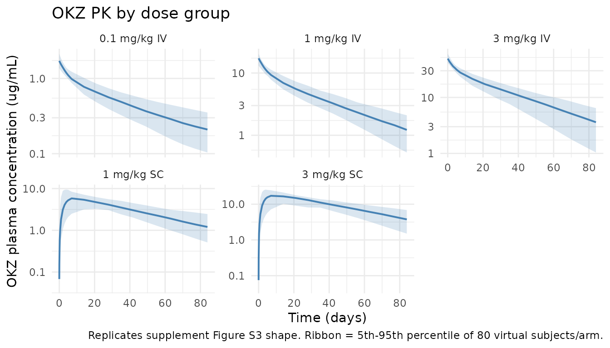
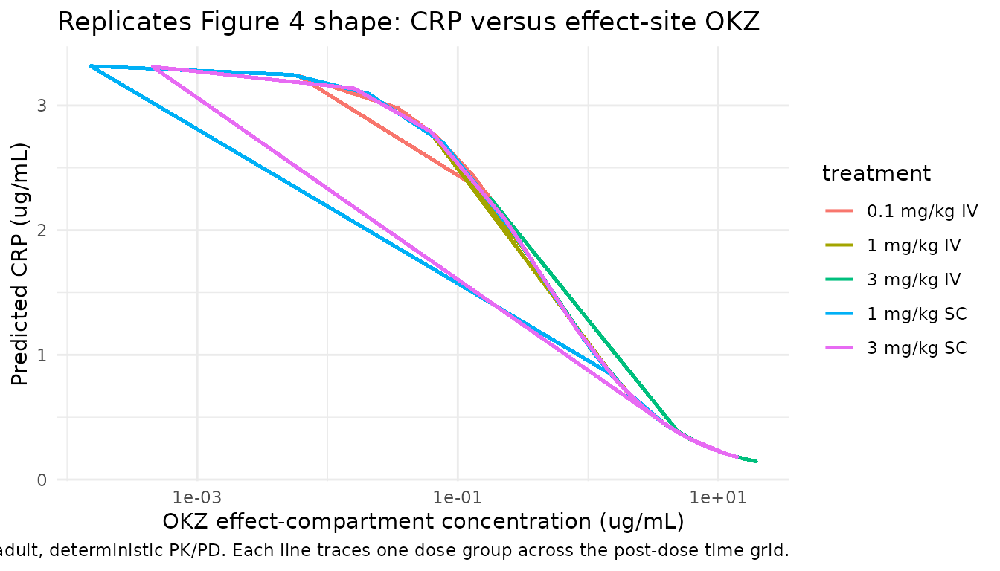
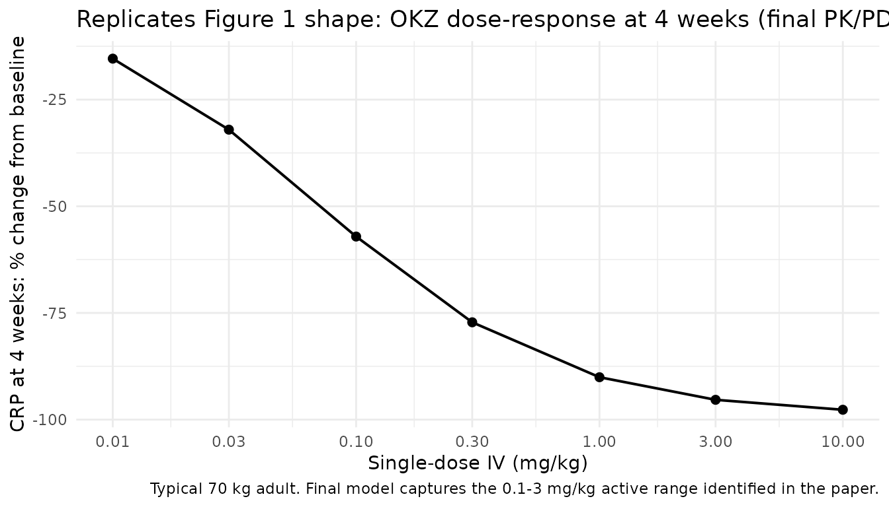

# Olokizumab (Kretsos 2014)

## Model and source

- Citation: Kretsos K, Jullion A, Zamacona M, Harari O, Shaw S,
  Boulanger B, Oliver R. Model-Based Optimal Design and Execution of the
  First-Inpatient Trial of the Anti-IL-6, Olokizumab. CPT
  Pharmacometrics Syst Pharmacol. 2014;3:e119. <doi:10.1038/psp.2014.17>
- Description: Two-compartment population PK with linear elimination and
  SC first-order absorption (depot, central, peripheral1) plus
  effect-compartment fractional sigmoid Imax PD model for C-reactive
  protein (CRP) suppression in mild-to-moderate rheumatoid arthritis
  patients receiving single-dose IV or SC olokizumab (anti-IL-6
  monoclonal antibody, IgG4, CDP6038). Final-analysis estimates from
  Kretsos et al. 2014 Table 1 (Final column), pooling first-in-human
  (healthy volunteers, Hickling 2011) and first-in-patient (Cohorts 1+2,
  n=27 active-treatment subjects) data. The PK observation model adds a
  per-subject endogenous anti-IL-6 baseline (‘endo’) as an additive
  offset on the observed OKZ concentration. Body weight was reported as
  a significant covariate on CL and central volume (paper Discussion)
  but its functional form / exponents were not reported in main text or
  supplement; the body-weight covariate effect is omitted here – see
  vignette Assumptions.
- Article: <https://doi.org/10.1038/psp.2014.17>
- PMC full text + supplementary material:
  <https://pmc.ncbi.nlm.nih.gov/articles/PMC4076804/>

## Population

The first-in-patient (FIP) study CDP6038/NCT01009242 was a single-dose,
randomised, double-blind, placebo-controlled, 12-week trial of
olokizumab (OKZ; CDP6038), a humanised anti-IL-6 IgG4 monoclonal
antibody, in patients with mild-to-moderate rheumatoid arthritis (RA).
Cohort 1 was originally designed for 36 subjects (two intravenous doses
0.1 and 1 mg/kg plus one subcutaneous dose 1 mg/kg, with matched
placebo); after sample-size re-estimation Cohort 1 enrolment was stopped
at 27 randomised subjects (18 active across the three OKZ treatment
cells, plus 9 placebo). Cohort 2 was a single 12-subject randomisation
block in which 9 patients received 3 mg/kg SC OKZ and 3 received SC
placebo. Across the two cohorts the final PK/PD analysis combined 27
active-treatment patients (paper Results, Table 1 caption).
First-in-human (FIH) OKZ PK data from healthy male volunteers (Hickling
et al. 2011) were pooled into the PK fit, although the exact FIH subject
count is not reported in Kretsos 2014.

Baseline CRP was a randomisation-stratification variable with median
3.37 ug/mL and range 0.6 to 27.2 ug/mL across enrolled RA patients
(paper Discussion p.5). A detailed demographic table is not in the main
text nor in the accessible supplement.

The same information is available programmatically via
`readModelDb("Kretsos_2014_olokizumab")$population`.

## Source trace

Per-parameter origin is recorded as an in-file comment next to each
`ini()` entry in `inst/modeldb/specificDrugs/Kretsos_2014_olokizumab.R`.
The table below collects them for review. All values come from Kretsos
2014 Table 1, Final column unless otherwise noted.

| Equation / parameter | Value | Source location |
|----|----|----|
| Structural PK | 2-cmt linear elimination + 1st-order SC absorption | Methods p.6 + supplement Word doc psp201417x5/x8: “two compartment model with linear elimination and first-order absorption for the s.c. route” |
| Structural PD | Effect compartment + fractional sigmoid Imax suppression of E0 | Methods p.6 + supplement Word doc psp201417x8 (NONMEM `$DES`/`$ERROR` blocks) |
| `lcl` (CL) | `log(0.168)` L/day | Table 1 Final: CL = 0.168 L/day (RSE 3.85%) |
| `lvc` (V1) | `log(4.2)` L | Table 1 Final: V1 = 4.2 L (RSE 2.69%) |
| `lq` (Q) | `log(0.356)` L/day | Table 1 Final: Q = 0.356 L/day (RSE 16.9%); no IIV |
| `lvp` (V2) | `log(2.09)` L | Table 1 Final: V2 = 2.09 L (RSE 8.37%) |
| `lka` (ka) | `log(0.162)` /day | Table 1 Final: ka = 0.162 day^-1 (RSE 16.5%) |
| `lfdepot` (F) | `log(0.756)` | Table 1 Final: F = 75.6% (RSE 4.81%); supplement PD `$PK` hard-codes F1 = 0.756 |
| `lendo` (endogenous anti-IL-6) | `log(0.0741)` ug/mL | Table 1 Final: endogenous anti-IL-6 = 0.0741 ug/mL (RSE 6.94%); Methods p.6: “additive term in the error model” |
| `le0` (baseline CRP) | `log(3.32)` ug/mL | Table 1 Final: baseline CRP = 3.32 ug/mL (RSE 15.3%) |
| `emax` (Imax) | `fixed(0.99)` | Table 1 (all columns) reports Emax = 0.99 (fixed); supplement `$ERROR` hard-codes 0.99 |
| `lec50` (EC50) | `log(0.415)` ug/mL | Table 1 Final: EC50 = 0.415 ug/mL (RSE 23.4%) |
| `lgamma` (sigmoidicity) | `log(0.869)` | Table 1 Final: gamma = 0.869 (RSE 17.4%) |
| `lke0` (ke0) | `log(0.0858)` /day | Table 1 Final: ke0 = 0.0858 day^-1 (RSE 27%) |
| PK IIV (diagonal) | CL 0.0590; V1 0.0161; V2 0.1832; ka 0.6823; endo 0.1069 | Table 1 Final CV% on CL/V1/V2/ka/endo squared; supplement `$OMEGA` is diagonal |
| PD IIV (diagonal) | E0 1.0506; EC50 0.6100; gamma 1.0302; ke0 0.7868 | Table 1 Final CV% on E0/EC50/gamma/ke0 squared; supplement `$OMEGA` is diagonal |
| `propSd` (PK proportional) | 0.240 | Table 1 Final: 24.0% (RSE 14.3); supplement `$ERROR`: `Y=EFF+EFF*EPS(1)` |
| `propSd_crp` (PD proportional) | 0.449 | Table 1 Final: 44.9% (RSE 22.8); supplement `$ERROR`: proportional |
| `d/dt(depot)` | `-ka * depot` | supplement `$DES`: `DADT(1) = -KA*A(1)` |
| `d/dt(central)` | `ka*depot - (cl/vc)*central - (q/vc)*central + (q/vp)*peripheral1` | supplement `$DES`: `DADT(2) = KA*A(1) - CL/V2*A(2) - Q/V2*A(2) + Q/V3*A(3)` (NONMEM V2 = central, V3 = peripheral) |
| `d/dt(peripheral1)` | `(q/vc)*central - (q/vp)*peripheral1` | supplement `$DES`: `DADT(3) = Q/V2*A(2) - Q/V3*A(3)` |
| `d/dt(effect)` | `ke0 * (ccent - effect)` | supplement `$DES`: `DADT(4) = KE0*(CP-A(4))` with `CP = A(2)/V2` |
| `f(depot)` | `fdepot` | supplement `$PK`: `F1 = 0.756` (compartment 1 = depot) |
| `Cc` | `ccent + endo` | Methods p.6: endogenous anti-IL-6 entered as additive term on the observed concentration |
| `crp` | `e0 * (1 - emax * effect^gamma / (ec50^gamma + effect^gamma))` | supplement `$ERROR`: `EFF = BASE * (1 - 0.99 * CE^GAM / (EC50^GAM + CE^GAM))` |

## Virtual cohort

The published individual-level data are not available. The cohort below
mirrors the dosing scheme of the FIP study CDP6038/NCT01009242: five
single-dose groups (0.1, 1, 3 mg/kg IV; 1, 3 mg/kg SC). Body weight is
held at 70 kg per subject (no demographic table is reported in the paper
or accessible supplement). 80 virtual subjects per dose group sample the
full IIV described by Table 1.

``` r

set.seed(20140618)
n_per_arm <- 80L
make_cohort <- function(arm_id, dose_mgkg, route, id_offset) {
  tibble::tibble(
    id        = id_offset + seq_len(n_per_arm),
    WT        = 70,
    dose_mgkg = dose_mgkg,
    route     = route,
    treatment = factor(sprintf("%g mg/kg %s", dose_mgkg, route))
  )
}
cohort <- dplyr::bind_rows(
  make_cohort("ivd1", 0.1, "IV", id_offset =   0L),
  make_cohort("ivd2", 1.0, "IV", id_offset = 100L),
  make_cohort("ivd3", 3.0, "IV", id_offset = 200L),
  make_cohort("scd1", 1.0, "SC", id_offset = 300L),
  make_cohort("scd2", 3.0, "SC", id_offset = 400L)
)
```

The observation grid uses dense early-phase sampling to capture the
distribution phase plus weekly samples through Week 12 (the FIP study
duration).

``` r

obs_grid <- sort(unique(c(
  c(0, 0.0417, 0.25, 0.5, 1, 2, 3, 4, 5, 7),         # day 0 -- day 7 (Cmax + early distribution)
  seq(14, 84, by = 7)                                # weekly through week 12
)))

dose_rows <- cohort |>
  dplyr::mutate(
    time = 0,
    amt  = dose_mgkg * WT,
    cmt  = ifelse(route == "IV", "central", "depot"),
    evid = 1L
  )
obs_cc  <- cohort |>
  tidyr::crossing(time = obs_grid) |>
  dplyr::mutate(amt = 0, cmt = "Cc",  evid = 0L)
obs_crp <- cohort |>
  tidyr::crossing(time = obs_grid) |>
  dplyr::mutate(amt = 0, cmt = "crp", evid = 0L)

events <- dplyr::bind_rows(dose_rows, obs_cc, obs_crp) |>
  dplyr::select(id, time, amt, cmt, evid, WT, dose_mgkg, route, treatment) |>
  dplyr::arrange(id, time, dplyr::desc(evid))

stopifnot(!anyDuplicated(unique(events[, c("id", "time", "evid")])))
```

## Simulation

``` r

mod  <- rxode2::rxode2(readModelDb("Kretsos_2014_olokizumab"))
#> ℹ parameter labels from comments will be replaced by 'label()'
sim  <- rxode2::rxSolve(
  mod, events = events,
  keep = c("WT", "dose_mgkg", "route", "treatment"),
  returnType = "data.frame"
)

# Multi-output filter: CMT 5 = Cc, CMT 6 = crp (order = d/dt() then
# observation-equation declaration order in the model file).
sim_cc  <- sim |> dplyr::filter(CMT == 5)
sim_crp <- sim |> dplyr::filter(CMT == 6)
```

## Replicate published figures

### Plasma OKZ profile by dose group (paper Figure S3 shape)

Supplementary Figure S3 (and tiff supplement file psp201417x3) shows the
visual predictive check for OKZ plasma concentrations across the five
dose groups at the time of the final analysis. The simulation below
reproduces the same dose-proportional spread and the slower SC peak.

``` r

sim_cc |>
  dplyr::group_by(treatment, time) |>
  dplyr::summarise(
    q05 = quantile(Cc, 0.05, na.rm = TRUE),
    q50 = quantile(Cc, 0.50, na.rm = TRUE),
    q95 = quantile(Cc, 0.95, na.rm = TRUE),
    .groups = "drop"
  ) |>
  ggplot(aes(time, q50)) +
  geom_ribbon(aes(ymin = q05, ymax = q95), fill = "steelblue", alpha = 0.2) +
  geom_line(linewidth = 0.7, colour = "steelblue") +
  facet_wrap(~ treatment, scales = "free_y") +
  scale_y_log10() +
  labs(x = "Time (days)", y = "OKZ plasma concentration (ug/mL)",
       title = "OKZ PK by dose group",
       caption = "Replicates supplement Figure S3 shape. Ribbon = 5th-95th percentile of 80 virtual subjects/arm.") +
  theme_minimal()
```



### CRP suppression vs effect-compartment concentration (paper Figure 4)

Paper Figure 4 plots observed CRP versus the effect-compartment OKZ
concentration with the median and 90% prediction interval from the final
PK/PD model overlaid. The typical-value (no IIV) trajectory below traces
the same sigmoidal Imax surface across all five dose groups.

``` r

mod_typical <- mod |> rxode2::zeroRe()
sim_typical <- rxode2::rxSolve(
  mod_typical, events = events,
  keep = c("WT", "dose_mgkg", "route", "treatment"),
  returnType = "data.frame"
)
#> ℹ omega/sigma items treated as zero: 'etalcl', 'etalvc', 'etalvp', 'etalka', 'etalendo', 'etale0', 'etalec50', 'etalhill', 'etalke0'
#> Warning: multi-subject simulation without without 'omega'
sim_typical_cc  <- sim_typical |> dplyr::filter(CMT == 5)
sim_typical_crp <- sim_typical |> dplyr::filter(CMT == 6)

# Pair effect concentration (state) and crp (observation) per id/time
typical_eff <- sim_typical |>
  dplyr::filter(CMT == 5) |>
  dplyr::select(id, time, effect, treatment)
typical_pd <- typical_eff |>
  dplyr::inner_join(sim_typical_crp |> dplyr::select(id, time, crp),
                    by = c("id", "time")) |>
  dplyr::filter(effect > 0)

typical_pd |>
  ggplot(aes(effect, crp, colour = treatment)) +
  geom_path(linewidth = 0.7) +
  scale_x_log10() +
  labs(x = "OKZ effect-compartment concentration (ug/mL)",
       y = "Predicted CRP (ug/mL)",
       title = "Replicates Figure 4 shape: CRP versus effect-site OKZ",
       caption = "Typical 70 kg adult, deterministic PK/PD. Each line traces one dose group across the post-dose time grid.") +
  theme_minimal()
```



### CRP percent change from baseline at 4 weeks across single-dose IV groups (paper Figure 1)

Paper Figure 1 reports simulated (n = 1000) dose-response in CRP
suppression at 4 weeks across the three OKZ PK/PD design
parameterisations and the published TCZ model. The replication below
shows the corresponding curve for the *final* OKZ PK/PD model fitted to
study data. The 0.1-3 mg/kg IV “OKZ range” annotated on Figure 1 is
reproduced. Because the published Figure 1 uses pre-study design
parameterisations rather than the final fit, the absolute % change
values will not match exactly; the dose-response shape and slope across
the range should be comparable.

``` r

dose_resp_doses <- c(0.01, 0.03, 0.1, 0.3, 1, 3, 10)
dr_cohort <- tibble::tibble(
  id        = seq_along(dose_resp_doses),
  WT        = 70,
  dose_mgkg = dose_resp_doses,
  treatment = factor(sprintf("%g mg/kg IV", dose_resp_doses))
)
dr_dose_rows <- dr_cohort |>
  dplyr::mutate(time = 0, amt = dose_mgkg * WT, cmt = "central", evid = 1L)
dr_obs_grid <- c(0, 28)   # baseline + 4 weeks
dr_obs_crp  <- dr_cohort |>
  tidyr::crossing(time = dr_obs_grid) |>
  dplyr::mutate(amt = 0, cmt = "crp", evid = 0L)
dr_events <- dplyr::bind_rows(dr_dose_rows, dr_obs_crp) |>
  dplyr::select(id, time, amt, cmt, evid, WT, dose_mgkg, treatment) |>
  dplyr::arrange(id, time, dplyr::desc(evid))

dr_sim <- rxode2::rxSolve(
  mod_typical, events = dr_events,
  keep = c("WT", "dose_mgkg", "treatment"),
  returnType = "data.frame"
)
#> ℹ omega/sigma items treated as zero: 'etalcl', 'etalvc', 'etalvp', 'etalka', 'etalendo', 'etale0', 'etalec50', 'etalhill', 'etalke0'
#> Warning: multi-subject simulation without without 'omega'
dr_pd <- dr_sim |>
  dplyr::filter(CMT == 6, time == 28) |>
  dplyr::mutate(pct_change_crp = (crp / 3.32 - 1) * 100)

dr_pd |>
  ggplot(aes(dose_mgkg, pct_change_crp)) +
  geom_line(linewidth = 0.7) +
  geom_point(size = 2) +
  scale_x_log10(breaks = dose_resp_doses) +
  labs(x = "Single-dose IV (mg/kg)",
       y = "CRP at 4 weeks: % change from baseline",
       title = "Replicates Figure 1 shape: OKZ dose-response at 4 weeks (final PK/PD model)",
       caption = "Typical 70 kg adult. Final model captures the 0.1-3 mg/kg active range identified in the paper.") +
  theme_minimal()
```



## PKNCA validation

The paper does not report tabulated single-dose NCA parameters for OKZ
(no Cmax / AUC / half-life table for the published cohort), so the PKNCA
results below stand on their own as a self-consistency check against the
model’s structural half-life and apparent clearance rather than a
side-by-side comparison with published numbers.

``` r

sim_nca <- sim_cc |>
  dplyr::filter(time > 0, !is.na(Cc), Cc > 0) |>
  dplyr::select(id, time, Cc, treatment)
conc_obj <- PKNCA::PKNCAconc(sim_nca, Cc ~ time | treatment + id)

dose_df <- events |>
  dplyr::filter(evid == 1) |>
  dplyr::select(id, time, amt, treatment, route) |>
  dplyr::mutate(route = ifelse(route == "IV", "intravascular", "extravascular"))
dose_obj <- PKNCA::PKNCAdose(dose_df, amt ~ time | treatment + id,
                             route = "route")

intervals <- data.frame(
  start       = 0,
  end         = 84,
  cmax        = TRUE,
  tmax        = TRUE,
  auclast     = TRUE,
  half.life   = TRUE
)

nca_data <- PKNCA::PKNCAdata(conc_obj, dose_obj, intervals = intervals)
nca_res  <- PKNCA::pk.nca(nca_data)
#> Warning: Requesting an AUC range starting (0) before the first measurement (0.0417) is not allowed
#> Requesting an AUC range starting (0) before the first measurement (0.0417) is not allowed
#> Requesting an AUC range starting (0) before the first measurement (0.0417) is not allowed
#> Requesting an AUC range starting (0) before the first measurement (0.0417) is not allowed
#> Requesting an AUC range starting (0) before the first measurement (0.0417) is not allowed
#> Requesting an AUC range starting (0) before the first measurement (0.0417) is not allowed
#> Requesting an AUC range starting (0) before the first measurement (0.0417) is not allowed
#> Requesting an AUC range starting (0) before the first measurement (0.0417) is not allowed
#> Requesting an AUC range starting (0) before the first measurement (0.0417) is not allowed
#> Requesting an AUC range starting (0) before the first measurement (0.0417) is not allowed
#> Requesting an AUC range starting (0) before the first measurement (0.0417) is not allowed
#> Requesting an AUC range starting (0) before the first measurement (0.0417) is not allowed
#> Requesting an AUC range starting (0) before the first measurement (0.0417) is not allowed
#> Requesting an AUC range starting (0) before the first measurement (0.0417) is not allowed
#> Requesting an AUC range starting (0) before the first measurement (0.0417) is not allowed
#> Requesting an AUC range starting (0) before the first measurement (0.0417) is not allowed
#> Requesting an AUC range starting (0) before the first measurement (0.0417) is not allowed
#> Requesting an AUC range starting (0) before the first measurement (0.0417) is not allowed
#> Requesting an AUC range starting (0) before the first measurement (0.0417) is not allowed
#> Requesting an AUC range starting (0) before the first measurement (0.0417) is not allowed
#> Requesting an AUC range starting (0) before the first measurement (0.0417) is not allowed
#> Requesting an AUC range starting (0) before the first measurement (0.0417) is not allowed
#> Requesting an AUC range starting (0) before the first measurement (0.0417) is not allowed
#> Requesting an AUC range starting (0) before the first measurement (0.0417) is not allowed
#> Requesting an AUC range starting (0) before the first measurement (0.0417) is not allowed
#> Requesting an AUC range starting (0) before the first measurement (0.0417) is not allowed
#> Requesting an AUC range starting (0) before the first measurement (0.0417) is not allowed
#> Requesting an AUC range starting (0) before the first measurement (0.0417) is not allowed
#> Requesting an AUC range starting (0) before the first measurement (0.0417) is not allowed
#> Requesting an AUC range starting (0) before the first measurement (0.0417) is not allowed
#> Requesting an AUC range starting (0) before the first measurement (0.0417) is not allowed
#> Requesting an AUC range starting (0) before the first measurement (0.0417) is not allowed
#> Requesting an AUC range starting (0) before the first measurement (0.0417) is not allowed
#> Requesting an AUC range starting (0) before the first measurement (0.0417) is not allowed
#> Requesting an AUC range starting (0) before the first measurement (0.0417) is not allowed
#> Requesting an AUC range starting (0) before the first measurement (0.0417) is not allowed
#> Requesting an AUC range starting (0) before the first measurement (0.0417) is not allowed
#> Requesting an AUC range starting (0) before the first measurement (0.0417) is not allowed
#> Requesting an AUC range starting (0) before the first measurement (0.0417) is not allowed
#> Requesting an AUC range starting (0) before the first measurement (0.0417) is not allowed
#> Requesting an AUC range starting (0) before the first measurement (0.0417) is not allowed
#> Requesting an AUC range starting (0) before the first measurement (0.0417) is not allowed
#> Requesting an AUC range starting (0) before the first measurement (0.0417) is not allowed
#> Requesting an AUC range starting (0) before the first measurement (0.0417) is not allowed
#> Requesting an AUC range starting (0) before the first measurement (0.0417) is not allowed
#> Requesting an AUC range starting (0) before the first measurement (0.0417) is not allowed
#> Requesting an AUC range starting (0) before the first measurement (0.0417) is not allowed
#> Requesting an AUC range starting (0) before the first measurement (0.0417) is not allowed
#> Requesting an AUC range starting (0) before the first measurement (0.0417) is not allowed
#> Requesting an AUC range starting (0) before the first measurement (0.0417) is not allowed
#> Requesting an AUC range starting (0) before the first measurement (0.0417) is not allowed
#> Requesting an AUC range starting (0) before the first measurement (0.0417) is not allowed
#> Requesting an AUC range starting (0) before the first measurement (0.0417) is not allowed
#> Requesting an AUC range starting (0) before the first measurement (0.0417) is not allowed
#> Requesting an AUC range starting (0) before the first measurement (0.0417) is not allowed
#> Requesting an AUC range starting (0) before the first measurement (0.0417) is not allowed
#> Requesting an AUC range starting (0) before the first measurement (0.0417) is not allowed
#> Requesting an AUC range starting (0) before the first measurement (0.0417) is not allowed
#> Requesting an AUC range starting (0) before the first measurement (0.0417) is not allowed
#> Requesting an AUC range starting (0) before the first measurement (0.0417) is not allowed
#> Requesting an AUC range starting (0) before the first measurement (0.0417) is not allowed
#> Requesting an AUC range starting (0) before the first measurement (0.0417) is not allowed
#> Requesting an AUC range starting (0) before the first measurement (0.0417) is not allowed
#> Requesting an AUC range starting (0) before the first measurement (0.0417) is not allowed
#> Requesting an AUC range starting (0) before the first measurement (0.0417) is not allowed
#> Requesting an AUC range starting (0) before the first measurement (0.0417) is not allowed
#> Requesting an AUC range starting (0) before the first measurement (0.0417) is not allowed
#> Requesting an AUC range starting (0) before the first measurement (0.0417) is not allowed
#> Requesting an AUC range starting (0) before the first measurement (0.0417) is not allowed
#> Requesting an AUC range starting (0) before the first measurement (0.0417) is not allowed
#> Requesting an AUC range starting (0) before the first measurement (0.0417) is not allowed
#> Requesting an AUC range starting (0) before the first measurement (0.0417) is not allowed
#> Requesting an AUC range starting (0) before the first measurement (0.0417) is not allowed
#> Requesting an AUC range starting (0) before the first measurement (0.0417) is not allowed
#> Requesting an AUC range starting (0) before the first measurement (0.0417) is not allowed
#> Requesting an AUC range starting (0) before the first measurement (0.0417) is not allowed
#> Requesting an AUC range starting (0) before the first measurement (0.0417) is not allowed
#> Requesting an AUC range starting (0) before the first measurement (0.0417) is not allowed
#> Requesting an AUC range starting (0) before the first measurement (0.0417) is not allowed
#> Requesting an AUC range starting (0) before the first measurement (0.0417) is not allowed
#> Requesting an AUC range starting (0) before the first measurement (0.0417) is not allowed
#> Requesting an AUC range starting (0) before the first measurement (0.0417) is not allowed
#> Requesting an AUC range starting (0) before the first measurement (0.0417) is not allowed
#> Requesting an AUC range starting (0) before the first measurement (0.0417) is not allowed
#> Requesting an AUC range starting (0) before the first measurement (0.0417) is not allowed
#> Requesting an AUC range starting (0) before the first measurement (0.0417) is not allowed
#> Requesting an AUC range starting (0) before the first measurement (0.0417) is not allowed
#> Requesting an AUC range starting (0) before the first measurement (0.0417) is not allowed
#> Requesting an AUC range starting (0) before the first measurement (0.0417) is not allowed
#> Requesting an AUC range starting (0) before the first measurement (0.0417) is not allowed
#> Requesting an AUC range starting (0) before the first measurement (0.0417) is not allowed
#> Requesting an AUC range starting (0) before the first measurement (0.0417) is not allowed
#> Requesting an AUC range starting (0) before the first measurement (0.0417) is not allowed
#> Requesting an AUC range starting (0) before the first measurement (0.0417) is not allowed
#> Requesting an AUC range starting (0) before the first measurement (0.0417) is not allowed
#> Requesting an AUC range starting (0) before the first measurement (0.0417) is not allowed
#> Requesting an AUC range starting (0) before the first measurement (0.0417) is not allowed
#> Requesting an AUC range starting (0) before the first measurement (0.0417) is not allowed
#> Requesting an AUC range starting (0) before the first measurement (0.0417) is not allowed
#> Requesting an AUC range starting (0) before the first measurement (0.0417) is not allowed
#> Requesting an AUC range starting (0) before the first measurement (0.0417) is not allowed
#> Requesting an AUC range starting (0) before the first measurement (0.0417) is not allowed
#> Requesting an AUC range starting (0) before the first measurement (0.0417) is not allowed
#> Requesting an AUC range starting (0) before the first measurement (0.0417) is not allowed
#> Requesting an AUC range starting (0) before the first measurement (0.0417) is not allowed
#> Requesting an AUC range starting (0) before the first measurement (0.0417) is not allowed
#> Requesting an AUC range starting (0) before the first measurement (0.0417) is not allowed
#> Requesting an AUC range starting (0) before the first measurement (0.0417) is not allowed
#> Requesting an AUC range starting (0) before the first measurement (0.0417) is not allowed
#> Requesting an AUC range starting (0) before the first measurement (0.0417) is not allowed
#> Requesting an AUC range starting (0) before the first measurement (0.0417) is not allowed
#> Requesting an AUC range starting (0) before the first measurement (0.0417) is not allowed
#> Requesting an AUC range starting (0) before the first measurement (0.0417) is not allowed
#> Requesting an AUC range starting (0) before the first measurement (0.0417) is not allowed
#> Requesting an AUC range starting (0) before the first measurement (0.0417) is not allowed
#> Requesting an AUC range starting (0) before the first measurement (0.0417) is not allowed
#> Requesting an AUC range starting (0) before the first measurement (0.0417) is not allowed
#> Requesting an AUC range starting (0) before the first measurement (0.0417) is not allowed
#> Requesting an AUC range starting (0) before the first measurement (0.0417) is not allowed
#> Requesting an AUC range starting (0) before the first measurement (0.0417) is not allowed
#> Requesting an AUC range starting (0) before the first measurement (0.0417) is not allowed
#> Requesting an AUC range starting (0) before the first measurement (0.0417) is not allowed
#> Requesting an AUC range starting (0) before the first measurement (0.0417) is not allowed
#> Requesting an AUC range starting (0) before the first measurement (0.0417) is not allowed
#> Requesting an AUC range starting (0) before the first measurement (0.0417) is not allowed
#> Requesting an AUC range starting (0) before the first measurement (0.0417) is not allowed
#> Requesting an AUC range starting (0) before the first measurement (0.0417) is not allowed
#> Requesting an AUC range starting (0) before the first measurement (0.0417) is not allowed
#> Requesting an AUC range starting (0) before the first measurement (0.0417) is not allowed
#> Requesting an AUC range starting (0) before the first measurement (0.0417) is not allowed
#> Requesting an AUC range starting (0) before the first measurement (0.0417) is not allowed
#> Requesting an AUC range starting (0) before the first measurement (0.0417) is not allowed
#> Requesting an AUC range starting (0) before the first measurement (0.0417) is not allowed
#> Requesting an AUC range starting (0) before the first measurement (0.0417) is not allowed
#> Requesting an AUC range starting (0) before the first measurement (0.0417) is not allowed
#> Requesting an AUC range starting (0) before the first measurement (0.0417) is not allowed
#> Requesting an AUC range starting (0) before the first measurement (0.0417) is not allowed
#> Requesting an AUC range starting (0) before the first measurement (0.0417) is not allowed
#> Requesting an AUC range starting (0) before the first measurement (0.0417) is not allowed
#> Requesting an AUC range starting (0) before the first measurement (0.0417) is not allowed
#> Requesting an AUC range starting (0) before the first measurement (0.0417) is not allowed
#> Requesting an AUC range starting (0) before the first measurement (0.0417) is not allowed
#> Requesting an AUC range starting (0) before the first measurement (0.0417) is not allowed
#> Requesting an AUC range starting (0) before the first measurement (0.0417) is not allowed
#> Requesting an AUC range starting (0) before the first measurement (0.0417) is not allowed
#> Requesting an AUC range starting (0) before the first measurement (0.0417) is not allowed
#> Requesting an AUC range starting (0) before the first measurement (0.0417) is not allowed
#> Requesting an AUC range starting (0) before the first measurement (0.0417) is not allowed
#> Requesting an AUC range starting (0) before the first measurement (0.0417) is not allowed
#> Requesting an AUC range starting (0) before the first measurement (0.0417) is not allowed
#> Requesting an AUC range starting (0) before the first measurement (0.0417) is not allowed
#> Requesting an AUC range starting (0) before the first measurement (0.0417) is not allowed
#> Requesting an AUC range starting (0) before the first measurement (0.0417) is not allowed
#> Requesting an AUC range starting (0) before the first measurement (0.0417) is not allowed
#> Requesting an AUC range starting (0) before the first measurement (0.0417) is not allowed
#> Requesting an AUC range starting (0) before the first measurement (0.0417) is not allowed
#> Requesting an AUC range starting (0) before the first measurement (0.0417) is not allowed
#> Requesting an AUC range starting (0) before the first measurement (0.0417) is not allowed
#> Requesting an AUC range starting (0) before the first measurement (0.0417) is not allowed
#> Requesting an AUC range starting (0) before the first measurement (0.0417) is not allowed
#> Requesting an AUC range starting (0) before the first measurement (0.0417) is not allowed
#> Requesting an AUC range starting (0) before the first measurement (0.0417) is not allowed
#> Requesting an AUC range starting (0) before the first measurement (0.0417) is not allowed
#> Requesting an AUC range starting (0) before the first measurement (0.0417) is not allowed
#> Requesting an AUC range starting (0) before the first measurement (0.0417) is not allowed
#> Requesting an AUC range starting (0) before the first measurement (0.0417) is not allowed
#> Requesting an AUC range starting (0) before the first measurement (0.0417) is not allowed
#> Requesting an AUC range starting (0) before the first measurement (0.0417) is not allowed
#> Requesting an AUC range starting (0) before the first measurement (0.0417) is not allowed
#> Requesting an AUC range starting (0) before the first measurement (0.0417) is not allowed
#> Requesting an AUC range starting (0) before the first measurement (0.0417) is not allowed
#> Requesting an AUC range starting (0) before the first measurement (0.0417) is not allowed
#> Requesting an AUC range starting (0) before the first measurement (0.0417) is not allowed
#> Requesting an AUC range starting (0) before the first measurement (0.0417) is not allowed
#> Requesting an AUC range starting (0) before the first measurement (0.0417) is not allowed
#> Requesting an AUC range starting (0) before the first measurement (0.0417) is not allowed
#> Requesting an AUC range starting (0) before the first measurement (0.0417) is not allowed
#> Requesting an AUC range starting (0) before the first measurement (0.0417) is not allowed
#> Requesting an AUC range starting (0) before the first measurement (0.0417) is not allowed
#> Requesting an AUC range starting (0) before the first measurement (0.0417) is not allowed
#> Requesting an AUC range starting (0) before the first measurement (0.0417) is not allowed
#> Requesting an AUC range starting (0) before the first measurement (0.0417) is not allowed
#> Requesting an AUC range starting (0) before the first measurement (0.0417) is not allowed
#> Requesting an AUC range starting (0) before the first measurement (0.0417) is not allowed
#> Requesting an AUC range starting (0) before the first measurement (0.0417) is not allowed
#> Requesting an AUC range starting (0) before the first measurement (0.0417) is not allowed
#> Requesting an AUC range starting (0) before the first measurement (0.0417) is not allowed
#> Requesting an AUC range starting (0) before the first measurement (0.0417) is not allowed
#> Requesting an AUC range starting (0) before the first measurement (0.0417) is not allowed
#> Requesting an AUC range starting (0) before the first measurement (0.0417) is not allowed
#> Requesting an AUC range starting (0) before the first measurement (0.0417) is not allowed
#> Requesting an AUC range starting (0) before the first measurement (0.0417) is not allowed
#> Requesting an AUC range starting (0) before the first measurement (0.0417) is not allowed
#> Requesting an AUC range starting (0) before the first measurement (0.0417) is not allowed
#> Requesting an AUC range starting (0) before the first measurement (0.0417) is not allowed
#> Requesting an AUC range starting (0) before the first measurement (0.0417) is not allowed
#> Requesting an AUC range starting (0) before the first measurement (0.0417) is not allowed
#> Requesting an AUC range starting (0) before the first measurement (0.0417) is not allowed
#> Requesting an AUC range starting (0) before the first measurement (0.0417) is not allowed
#> Requesting an AUC range starting (0) before the first measurement (0.0417) is not allowed
#> Requesting an AUC range starting (0) before the first measurement (0.0417) is not allowed
#> Requesting an AUC range starting (0) before the first measurement (0.0417) is not allowed
#> Requesting an AUC range starting (0) before the first measurement (0.0417) is not allowed
#> Requesting an AUC range starting (0) before the first measurement (0.0417) is not allowed
#> Requesting an AUC range starting (0) before the first measurement (0.0417) is not allowed
#> Requesting an AUC range starting (0) before the first measurement (0.0417) is not allowed
#> Requesting an AUC range starting (0) before the first measurement (0.0417) is not allowed
#> Requesting an AUC range starting (0) before the first measurement (0.0417) is not allowed
#> Requesting an AUC range starting (0) before the first measurement (0.0417) is not allowed
#> Requesting an AUC range starting (0) before the first measurement (0.0417) is not allowed
#> Requesting an AUC range starting (0) before the first measurement (0.0417) is not allowed
#> Requesting an AUC range starting (0) before the first measurement (0.0417) is not allowed
#> Requesting an AUC range starting (0) before the first measurement (0.0417) is not allowed
#> Requesting an AUC range starting (0) before the first measurement (0.0417) is not allowed
#> Requesting an AUC range starting (0) before the first measurement (0.0417) is not allowed
#> Requesting an AUC range starting (0) before the first measurement (0.0417) is not allowed
#> Requesting an AUC range starting (0) before the first measurement (0.0417) is not allowed
#> Requesting an AUC range starting (0) before the first measurement (0.0417) is not allowed
#> Requesting an AUC range starting (0) before the first measurement (0.0417) is not allowed
#> Requesting an AUC range starting (0) before the first measurement (0.0417) is not allowed
#> Requesting an AUC range starting (0) before the first measurement (0.0417) is not allowed
#> Requesting an AUC range starting (0) before the first measurement (0.0417) is not allowed
#> Requesting an AUC range starting (0) before the first measurement (0.0417) is not allowed
#> Requesting an AUC range starting (0) before the first measurement (0.0417) is not allowed
#> Requesting an AUC range starting (0) before the first measurement (0.0417) is not allowed
#> Requesting an AUC range starting (0) before the first measurement (0.0417) is not allowed
#> Requesting an AUC range starting (0) before the first measurement (0.0417) is not allowed
#> Requesting an AUC range starting (0) before the first measurement (0.0417) is not allowed
#> Requesting an AUC range starting (0) before the first measurement (0.0417) is not allowed
#> Requesting an AUC range starting (0) before the first measurement (0.0417) is not allowed
#> Requesting an AUC range starting (0) before the first measurement (0.0417) is not allowed
#> Requesting an AUC range starting (0) before the first measurement (0.0417) is not allowed
#> Requesting an AUC range starting (0) before the first measurement (0.0417) is not allowed
#> Requesting an AUC range starting (0) before the first measurement (0.0417) is not allowed
#> Requesting an AUC range starting (0) before the first measurement (0.0417) is not allowed
#> Requesting an AUC range starting (0) before the first measurement (0.0417) is not allowed
#> Requesting an AUC range starting (0) before the first measurement (0.0417) is not allowed
#> Requesting an AUC range starting (0) before the first measurement (0.0417) is not allowed
#> Requesting an AUC range starting (0) before the first measurement (0.0417) is not allowed
#> Requesting an AUC range starting (0) before the first measurement (0.0417) is not allowed
#> Requesting an AUC range starting (0) before the first measurement (0.0417) is not allowed
#> Requesting an AUC range starting (0) before the first measurement (0.0417) is not allowed
#> Requesting an AUC range starting (0) before the first measurement (0.0417) is not allowed
#> Requesting an AUC range starting (0) before the first measurement (0.0417) is not allowed
#> Requesting an AUC range starting (0) before the first measurement (0.0417) is not allowed
#> Requesting an AUC range starting (0) before the first measurement (0.0417) is not allowed
#> Requesting an AUC range starting (0) before the first measurement (0.0417) is not allowed
#> Requesting an AUC range starting (0) before the first measurement (0.0417) is not allowed
#> Requesting an AUC range starting (0) before the first measurement (0.0417) is not allowed
#> Requesting an AUC range starting (0) before the first measurement (0.0417) is not allowed
#> Requesting an AUC range starting (0) before the first measurement (0.0417) is not allowed
#> Requesting an AUC range starting (0) before the first measurement (0.0417) is not allowed
#> Requesting an AUC range starting (0) before the first measurement (0.0417) is not allowed
#> Requesting an AUC range starting (0) before the first measurement (0.0417) is not allowed
#> Requesting an AUC range starting (0) before the first measurement (0.0417) is not allowed
#> Requesting an AUC range starting (0) before the first measurement (0.0417) is not allowed
#> Requesting an AUC range starting (0) before the first measurement (0.0417) is not allowed
#> Requesting an AUC range starting (0) before the first measurement (0.0417) is not allowed
#> Requesting an AUC range starting (0) before the first measurement (0.0417) is not allowed
#> Requesting an AUC range starting (0) before the first measurement (0.0417) is not allowed
#> Requesting an AUC range starting (0) before the first measurement (0.0417) is not allowed
#> Requesting an AUC range starting (0) before the first measurement (0.0417) is not allowed
#> Requesting an AUC range starting (0) before the first measurement (0.0417) is not allowed
#> Requesting an AUC range starting (0) before the first measurement (0.0417) is not allowed
#> Requesting an AUC range starting (0) before the first measurement (0.0417) is not allowed
#> Requesting an AUC range starting (0) before the first measurement (0.0417) is not allowed
#> Requesting an AUC range starting (0) before the first measurement (0.0417) is not allowed
#> Requesting an AUC range starting (0) before the first measurement (0.0417) is not allowed
#> Requesting an AUC range starting (0) before the first measurement (0.0417) is not allowed
#> Requesting an AUC range starting (0) before the first measurement (0.0417) is not allowed
#> Requesting an AUC range starting (0) before the first measurement (0.0417) is not allowed
#> Requesting an AUC range starting (0) before the first measurement (0.0417) is not allowed
#> Requesting an AUC range starting (0) before the first measurement (0.0417) is not allowed
#> Requesting an AUC range starting (0) before the first measurement (0.0417) is not allowed
#> Requesting an AUC range starting (0) before the first measurement (0.0417) is not allowed
#> Requesting an AUC range starting (0) before the first measurement (0.0417) is not allowed
#> Requesting an AUC range starting (0) before the first measurement (0.0417) is not allowed
#> Requesting an AUC range starting (0) before the first measurement (0.0417) is not allowed
#> Requesting an AUC range starting (0) before the first measurement (0.0417) is not allowed
#> Requesting an AUC range starting (0) before the first measurement (0.0417) is not allowed
#> Requesting an AUC range starting (0) before the first measurement (0.0417) is not allowed
#> Requesting an AUC range starting (0) before the first measurement (0.0417) is not allowed
#> Requesting an AUC range starting (0) before the first measurement (0.0417) is not allowed
#> Requesting an AUC range starting (0) before the first measurement (0.0417) is not allowed
#> Requesting an AUC range starting (0) before the first measurement (0.0417) is not allowed
#> Requesting an AUC range starting (0) before the first measurement (0.0417) is not allowed
#> Requesting an AUC range starting (0) before the first measurement (0.0417) is not allowed
#> Requesting an AUC range starting (0) before the first measurement (0.0417) is not allowed
#> Requesting an AUC range starting (0) before the first measurement (0.0417) is not allowed
#> Requesting an AUC range starting (0) before the first measurement (0.0417) is not allowed
#> Requesting an AUC range starting (0) before the first measurement (0.0417) is not allowed
#> Requesting an AUC range starting (0) before the first measurement (0.0417) is not allowed
#> Requesting an AUC range starting (0) before the first measurement (0.0417) is not allowed
#> Requesting an AUC range starting (0) before the first measurement (0.0417) is not allowed
#> Requesting an AUC range starting (0) before the first measurement (0.0417) is not allowed
#> Requesting an AUC range starting (0) before the first measurement (0.0417) is not allowed
#> Requesting an AUC range starting (0) before the first measurement (0.0417) is not allowed
#> Requesting an AUC range starting (0) before the first measurement (0.0417) is not allowed
#> Requesting an AUC range starting (0) before the first measurement (0.0417) is not allowed
#> Requesting an AUC range starting (0) before the first measurement (0.0417) is not allowed
#> Requesting an AUC range starting (0) before the first measurement (0.0417) is not allowed
#> Requesting an AUC range starting (0) before the first measurement (0.0417) is not allowed
#> Requesting an AUC range starting (0) before the first measurement (0.0417) is not allowed
#> Requesting an AUC range starting (0) before the first measurement (0.0417) is not allowed
#> Requesting an AUC range starting (0) before the first measurement (0.0417) is not allowed
#> Requesting an AUC range starting (0) before the first measurement (0.0417) is not allowed
#> Requesting an AUC range starting (0) before the first measurement (0.0417) is not allowed
#> Requesting an AUC range starting (0) before the first measurement (0.0417) is not allowed
#> Requesting an AUC range starting (0) before the first measurement (0.0417) is not allowed
#> Requesting an AUC range starting (0) before the first measurement (0.0417) is not allowed
#> Requesting an AUC range starting (0) before the first measurement (0.0417) is not allowed
#> Requesting an AUC range starting (0) before the first measurement (0.0417) is not allowed
#> Requesting an AUC range starting (0) before the first measurement (0.0417) is not allowed
#> Requesting an AUC range starting (0) before the first measurement (0.0417) is not allowed
#> Requesting an AUC range starting (0) before the first measurement (0.0417) is not allowed
#> Requesting an AUC range starting (0) before the first measurement (0.0417) is not allowed
#> Requesting an AUC range starting (0) before the first measurement (0.0417) is not allowed
#> Requesting an AUC range starting (0) before the first measurement (0.0417) is not allowed
#> Requesting an AUC range starting (0) before the first measurement (0.0417) is not allowed
#> Requesting an AUC range starting (0) before the first measurement (0.0417) is not allowed
#> Requesting an AUC range starting (0) before the first measurement (0.0417) is not allowed
#> Requesting an AUC range starting (0) before the first measurement (0.0417) is not allowed
#> Requesting an AUC range starting (0) before the first measurement (0.0417) is not allowed
#> Requesting an AUC range starting (0) before the first measurement (0.0417) is not allowed
#> Requesting an AUC range starting (0) before the first measurement (0.0417) is not allowed
#> Requesting an AUC range starting (0) before the first measurement (0.0417) is not allowed
#> Requesting an AUC range starting (0) before the first measurement (0.0417) is not allowed
#> Requesting an AUC range starting (0) before the first measurement (0.0417) is not allowed
#> Requesting an AUC range starting (0) before the first measurement (0.0417) is not allowed
#> Requesting an AUC range starting (0) before the first measurement (0.0417) is not allowed
#> Requesting an AUC range starting (0) before the first measurement (0.0417) is not allowed
#> Requesting an AUC range starting (0) before the first measurement (0.0417) is not allowed
#> Requesting an AUC range starting (0) before the first measurement (0.0417) is not allowed
#> Requesting an AUC range starting (0) before the first measurement (0.0417) is not allowed
#> Requesting an AUC range starting (0) before the first measurement (0.0417) is not allowed
#> Requesting an AUC range starting (0) before the first measurement (0.0417) is not allowed
#> Requesting an AUC range starting (0) before the first measurement (0.0417) is not allowed
#> Requesting an AUC range starting (0) before the first measurement (0.0417) is not allowed
#> Requesting an AUC range starting (0) before the first measurement (0.0417) is not allowed
#> Requesting an AUC range starting (0) before the first measurement (0.0417) is not allowed
#> Requesting an AUC range starting (0) before the first measurement (0.0417) is not allowed
#> Requesting an AUC range starting (0) before the first measurement (0.0417) is not allowed
#> Requesting an AUC range starting (0) before the first measurement (0.0417) is not allowed
#> Requesting an AUC range starting (0) before the first measurement (0.0417) is not allowed
#> Requesting an AUC range starting (0) before the first measurement (0.0417) is not allowed
#> Requesting an AUC range starting (0) before the first measurement (0.0417) is not allowed
#> Requesting an AUC range starting (0) before the first measurement (0.0417) is not allowed
#> Requesting an AUC range starting (0) before the first measurement (0.0417) is not allowed
#> Requesting an AUC range starting (0) before the first measurement (0.0417) is not allowed
#> Requesting an AUC range starting (0) before the first measurement (0.0417) is not allowed
#> Requesting an AUC range starting (0) before the first measurement (0.0417) is not allowed
#> Requesting an AUC range starting (0) before the first measurement (0.0417) is not allowed
#> Requesting an AUC range starting (0) before the first measurement (0.0417) is not allowed
#> Requesting an AUC range starting (0) before the first measurement (0.0417) is not allowed
#> Requesting an AUC range starting (0) before the first measurement (0.0417) is not allowed
#> Requesting an AUC range starting (0) before the first measurement (0.0417) is not allowed
#> Requesting an AUC range starting (0) before the first measurement (0.0417) is not allowed
#> Requesting an AUC range starting (0) before the first measurement (0.0417) is not allowed
#> Requesting an AUC range starting (0) before the first measurement (0.0417) is not allowed
#> Requesting an AUC range starting (0) before the first measurement (0.0417) is not allowed
#> Requesting an AUC range starting (0) before the first measurement (0.0417) is not allowed
#> Requesting an AUC range starting (0) before the first measurement (0.0417) is not allowed
#> Requesting an AUC range starting (0) before the first measurement (0.0417) is not allowed
#> Requesting an AUC range starting (0) before the first measurement (0.0417) is not allowed
#> Requesting an AUC range starting (0) before the first measurement (0.0417) is not allowed
#> Requesting an AUC range starting (0) before the first measurement (0.0417) is not allowed
#> Requesting an AUC range starting (0) before the first measurement (0.0417) is not allowed
#> Requesting an AUC range starting (0) before the first measurement (0.0417) is not allowed
#> Requesting an AUC range starting (0) before the first measurement (0.0417) is not allowed
#> Requesting an AUC range starting (0) before the first measurement (0.0417) is not allowed
#> Requesting an AUC range starting (0) before the first measurement (0.0417) is not allowed
#> Requesting an AUC range starting (0) before the first measurement (0.0417) is not allowed
#> Requesting an AUC range starting (0) before the first measurement (0.0417) is not allowed
#> Requesting an AUC range starting (0) before the first measurement (0.0417) is not allowed
#> Requesting an AUC range starting (0) before the first measurement (0.0417) is not allowed
#> Requesting an AUC range starting (0) before the first measurement (0.0417) is not allowed
#> Requesting an AUC range starting (0) before the first measurement (0.0417) is not allowed
#> Requesting an AUC range starting (0) before the first measurement (0.0417) is not allowed
#> Requesting an AUC range starting (0) before the first measurement (0.0417) is not allowed
#> Requesting an AUC range starting (0) before the first measurement (0.0417) is not allowed
#> Requesting an AUC range starting (0) before the first measurement (0.0417) is not allowed
#> Requesting an AUC range starting (0) before the first measurement (0.0417) is not allowed
#> Requesting an AUC range starting (0) before the first measurement (0.0417) is not allowed
#> Requesting an AUC range starting (0) before the first measurement (0.0417) is not allowed
#> Requesting an AUC range starting (0) before the first measurement (0.0417) is not allowed
#> Requesting an AUC range starting (0) before the first measurement (0.0417) is not allowed
#> Requesting an AUC range starting (0) before the first measurement (0.0417) is not allowed
#> Requesting an AUC range starting (0) before the first measurement (0.0417) is not allowed
#> Requesting an AUC range starting (0) before the first measurement (0.0417) is not allowed
#> Requesting an AUC range starting (0) before the first measurement (0.0417) is not allowed
#> Requesting an AUC range starting (0) before the first measurement (0.0417) is not allowed
#> Requesting an AUC range starting (0) before the first measurement (0.0417) is not allowed
#> Requesting an AUC range starting (0) before the first measurement (0.0417) is not allowed
#> Requesting an AUC range starting (0) before the first measurement (0.0417) is not allowed
#> Requesting an AUC range starting (0) before the first measurement (0.0417) is not allowed
#> Requesting an AUC range starting (0) before the first measurement (0.0417) is not allowed
#> Requesting an AUC range starting (0) before the first measurement (0.0417) is not allowed
#> Requesting an AUC range starting (0) before the first measurement (0.0417) is not allowed
#> Requesting an AUC range starting (0) before the first measurement (0.0417) is not allowed
#> Requesting an AUC range starting (0) before the first measurement (0.0417) is not allowed

nca_summary <- summary(nca_res)
knitr::kable(nca_summary,
             caption = "Simulated NCA parameters by dose group (5th-95th percentiles across 80 virtual subjects).")
```

| start | end | treatment | N | auclast | cmax | tmax | half.life |
|---:|---:|:---|:---|:---|:---|:---|:---|
| 0 | 84 | 0.1 mg/kg IV | 80 | NC | 1.71 \[12.6\] | 0.0417 \[0.0417, 0.0417\] | 47.4 \[10.8\] |
| 0 | 84 | 1 mg/kg IV | 80 | NC | 16.8 \[13.1\] | 0.0417 \[0.0417, 0.0417\] | 29.9 \[8.41\] |
| 0 | 84 | 3 mg/kg IV | 80 | NC | 49.7 \[12.7\] | 0.0417 \[0.0417, 0.0417\] | 29.6 \[9.50\] |
| 0 | 84 | 1 mg/kg SC | 80 | NC | 5.91 \[29.9\] | 14.0 \[2.00, 42.0\] | 32.4 \[9.80\] |
| 0 | 84 | 3 mg/kg SC | 80 | NC | 17.6 \[28.2\] | 14.0 \[2.00, 35.0\] | 32.4 \[9.66\] |

Simulated NCA parameters by dose group (5th-95th percentiles across 80
virtual subjects). {.table}

### Implied terminal half-life and exposure dose-proportionality

The structural terminal half-life implied by Vss / CL with Vss = vc + vp
= 6.29 L and CL = 0.168 L/day is 0.693 \* 6.29 / 0.168 = 26 days, in the
range expected for an IgG4 mAb cleared linearly. Cmax should scale
linearly with IV dose (input divided by vc only) and the IV / SC AUCinf
ratio should approximate F = 0.756 at any fixed dose; both properties
are visible in the PKNCA summary table above.

## Assumptions and deviations

- **Body-weight covariate omitted.** Kretsos 2014 Discussion (p.5)
  states: “For the PK model, body weight was a significant covariate of
  clearance and central volume of distribution.” The functional form and
  exponents are *not* reported in the main text and the supplement (Word
  docs psp201417x5-x8) contains only the PD NONMEM control stream, not
  the PK control stream. The Final population means in Table 1 are
  retained here as typical values for a 70-kg adult, and the body-weight
  covariate effect is omitted from `model()` so the model represents the
  population mean rather than an individualised prediction. Downstream
  users who need WT scaling should add it externally; the canonical a
  priori choice for an IgG4 mAb is `(WT/70)^0.75` on CL/Q and
  `(WT/70)^1` on V1/V2.
- **Endogenous anti-IL-6 baseline encoded as a per-subject random
  intercept added to the observed PK.** Kretsos 2014 Methods p.6 says
  “The effect of endogenous anti-IL-6 levels was included as an additive
  term in the error model.” The model file encodes this as a structural
  per-subject parameter `endo` with IIV (CV% = 32.7%; Table 1) that is
  *added* to the model-predicted plasma concentration at the observation
  step (`Cc = ccent + endo`). The effect compartment that drives the PD
  is driven by `ccent` (model-only OKZ), not by `Cc`, because the
  endogenous offset is an assay artefact rather than a pharmacologically
  active species. This matches the supplement’s PD NONMEM stream, which
  derives the effect-site concentration from `A(2)/V2` rather than from
  the observed concentration.
- **Proportional residual error for PK in the Final model.** Kretsos
  2014 Methods p.6 describes that “Proportional, additive, and combined
  (proportional and additive error) structures were evaluated for the
  residual error” of PK; the Interim 1 fit used a combined
  proportional + additive (16% + 0.023 ug/mL) error model (Table 1
  footnote `c`), while the Interim 2 and Final fits report a single
  proportional CV% (20% and 24.0% respectively). The model file uses
  proportional-only for the Final fit consistent with Table 1’s
  presentation.
- **IIV variance scale follows the paper’s sqrt-of-variance
  convention.** Table 1 footnote `b` states: “The %CV for both
  intersubject and residual variability is an approximation taken as the
  square root of the variance x 100.” The model file encodes
  `omega^2 = (CV/100)^2` to match this convention. The more precise
  log-normal mapping `omega^2 = log(1 + CV^2)` would give materially
  different variances for the parameters whose CV% exceeds ~50% (E0
  102.5%, EC50 78.1%, gamma 101.5%, ke0 88.7%, ka 82.6%); we keep the
  paper’s convention so the IIV values match Table 1 verbatim.
- **D2 (IV infusion duration parameter) is omitted.** Table 1 reports D2
  = 0.0768 days (Interim 1) and 0.073 days (Interim 2) but D2 = “–” in
  the Final column. The model file therefore does not estimate D2; IV
  doses are intended to be supplied to `central` via `rate=` or `dur=`
  columns in the user’s event table when an explicit infusion duration
  is needed.
- **First-in-human PK pooling.** Final PK estimates were obtained from a
  pooled fit of FIP (Cohorts 1+2) and FIH (Hickling 2011) PK data (paper
  Methods p.6). The Hickling 2011 abstract is not included as a source
  file here, so this vignette cites only the dosing pattern of the FIP
  study; the model parameters subsume both datasets.
- **No demographic table.** Paper main text and accessible supplement do
  not contain a Table 1-style baseline-demographics listing. The
  `population` metadata in the model file therefore reports `NA_real_`
  for sex/race fields and “adult (specific range not reported)” for age,
  with a free-text note pointing to baseline CRP eligibility.
