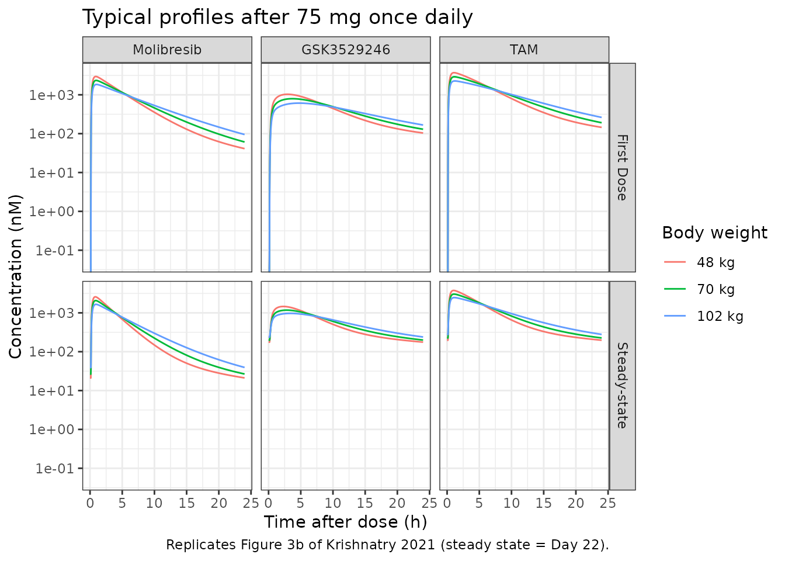
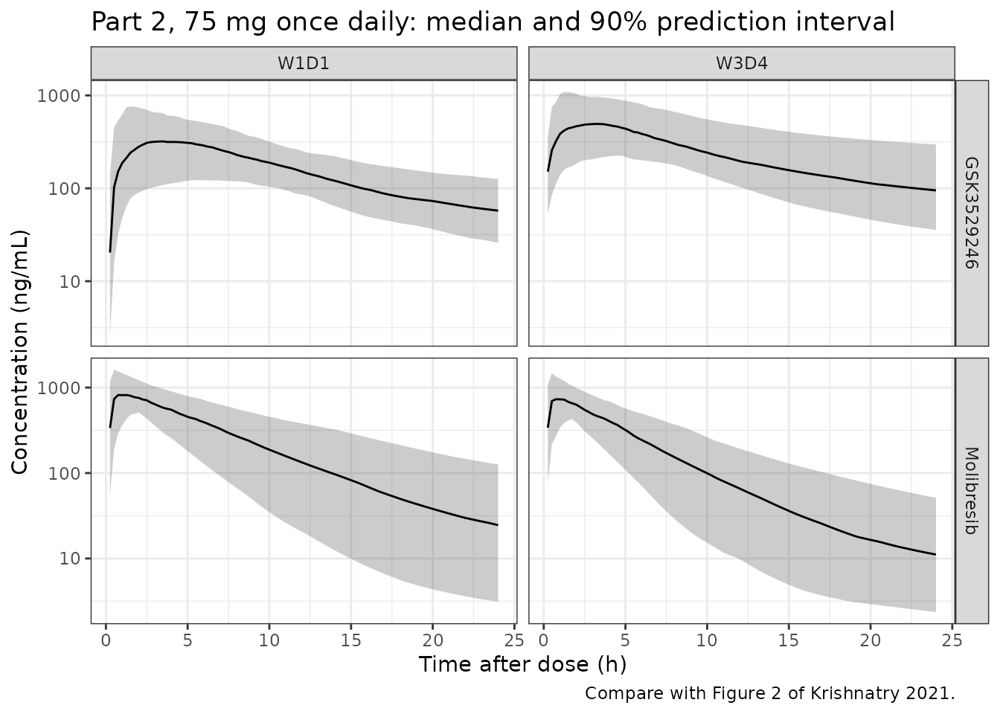

# Molibresib and GSK3529246 (Krishnatry 2021)

## Model and source

- Citation: Krishnatry AS, Voelkner A, Dhar A, Prohn M, Ferron-Brady G
  (2021). Population pharmacokinetic modeling of molibresib and its
  active metabolites in patients with solid tumors: A semimechanistic
  autoinduction model. CPT Pharmacometrics Syst Pharmacol 10(7):709-722.
  <doi:10.1002/psp4.12639>. Structure from the final NONMEM control
  stream (Run 32) in Supplementary Text S2; parameter values from Table
  3.
- Description: Semimechanistic liver-compartment population PK model for
  oral molibresib (GSK525762, a BET bromodomain inhibitor) and its
  active metabolite composite GSK3529246 in adults with advanced solid
  tumours. Molibresib is absorbed after a lag time by first-order
  absorption into a physiologic liver compartment (plasma flow 55 L/h,
  volume 1.5 L, both fixed), distributes in a two-compartment systemic
  model, and is eliminated only by hepatic extraction. The extraction
  ratio is proportional to a relative hepatic enzyme amount, whose
  production rate rises linearly with the molibresib concentration in
  the liver, so the model reproduces the autoinduction that lowers
  molibresib exposure on repeated dosing. Extracted molibresib is
  converted on a 1:1 molar basis into GSK3529246 through one transit
  compartment, and GSK3529246 has two-compartment disposition with
  first-order elimination. Body weight scales both central volumes with
  one shared exponent, and time-varying aspartate aminotransferase
  lowers GSK3529246 clearance. Amounts are in umol and concentrations in
  umol/L (molibresib 424 g/mol, GSK3529246 396 g/mol).
- Article: [CPT Pharmacometrics Syst Pharmacol
  2021;10(7):709-722](https://doi.org/10.1002/psp4.12639) (open access)

Molibresib (GSK525762) is an oral bromodomain and extraterminal (BET)
inhibitor. CYP3A4 converts it to two active metabolites that are
equipotent to the parent, GSK3536835 (ethyl-hydroxy) and GSK3529246
(N-desethyl). The assay converts the first fully to the second, so the
two are reported together as the active metabolite composite
“GSK3529246”. Molibresib exposure falls on repeated dosing, most clearly
at doses of 60 mg or more, and the authors confirmed CYP3A4
autoinduction in vitro.

The final model (Run 32) is semimechanistic:

- The dose is absorbed after a lag time, by first-order absorption, into
  a physiologic liver compartment. Liver plasma flow is fixed at 55 L/h
  (hepatic blood flow 100 L/h at a haematocrit of 45%) and liver volume
  at 1.5 L.
- The hepatic extraction ratio is `EH = CL/F * enzyme / Qh`. The
  fraction `1 - EH` of the liver outflow returns molibresib to a
  two-compartment systemic model. The fraction `EH` becomes GSK3529246
  on a 1:1 molar basis, passing through one transit compartment.
  Systemic molibresib re-enters the liver at `Qh`, so hepatic extraction
  is the only route of molibresib elimination.
- A relative enzyme pool starts at 1. Its production rate rises linearly
  with the molibresib concentration in the liver:
  `d(enzyme)/dt = kin * (1 + slope * C_liver) - kin * enzyme`. Induction
  therefore raises both systemic clearance and first-pass extraction.
- GSK3529246 has two-compartment disposition with first-order
  elimination.
- Body weight scales both central volumes with one exponent, and
  time-varying AST lowers GSK3529246 clearance.

The model runs in molar units, as the authors fitted it. Doses are in
umol (mg / 424 g/mol x 1000) and concentrations in umol/L. This vignette
converts back to ng/mL with the molecular weights of molibresib (424
g/mol) and GSK3529246 (396 g/mol) where the paper reports ng/mL.

## Population

The analysis pooled 193 adults and adolescents from the
first-time-in-human phase I/II study BET115521. Part 1 (dose escalation,
n = 94) gave 2-100 mg once daily or 20-40 mg twice daily of the
amorphous free-base formulation, plus 80 mg once daily of the besylate
salt in a 10-patient substudy. Part 2 (expansion cohorts, n = 99) gave
75 mg once daily of the besylate salt, the recommended phase II dose.

The cohort’s median age was 58 years (range 16-86), 53% were female and
83% were White. Median body weight was 69.6 kg (range 34-120 kg). The
tumour types were NUT midline carcinoma, colorectal, breast, prostate,
lung, gastrointestinal stromal tumour and others (Table 1).

The dataset had 2681 molibresib and 814 GSK3529246 plasma concentrations
above the lower limit of quantification. GSK3529246 was assayed only in
Part 2 and in the Part 1 80 mg cohort (Table S2).

The same information is available programmatically:

``` r

str(readModelDb("Krishnatry_2021_molibresib")()$population)
#> List of 11
#>  $ species       : chr "human"
#>  $ n_subjects    : int 193
#>  $ n_studies     : int 1
#>  $ age_range     : chr "16-86 years (median 58; mean 55.7, SD 14; Table 1)"
#>  $ weight_range  : chr "34-120 kg (median 69.6; mean 71.7, SD 17; Table 1)"
#>  $ sex_female_pct: num 53
#>  $ race_ethnicity: Named num [1:4] 83 6 6 5
#>   ..- attr(*, "names")= chr [1:4] "White" "Asian" "Black" "Missing"
#>  $ disease_state : chr "Advanced solid tumours: NUT (nuclear protein in testis) midline carcinoma, colorectal, breast (including triple"| __truncated__
#>  $ dose_range    : chr "Part 1: 2-100 mg once daily or 20-40 mg twice daily of the amorphous free-base formulation, and 80 mg once dail"| __truncated__
#>  $ regions       : chr "Not reported."
#>  $ notes         : chr "First-time-in-human phase I/II study BET115521 (Part 1 dose escalation, n = 94; Part 2 expansion cohorts, n = 9"| __truncated__
```

## Source trace

Supplementary Text S2 of the paper is the complete NONMEM control stream
of the final model (Run 32). It gives the model structure, the covariate
reference values and the fixed parameters. The parameter values come
from Table 3. The `$THETA` / `$OMEGA` records printed in Text S2 are the
run’s initial values and differ from Table 3 in the second or third
significant figure.

| Equation / parameter | Value | Source location |
|----|----|----|
| `lka` (ka) | 4.08 /h | Table 3 |
| `lcl` (CL/F) | 9.02 L/h | Table 3 |
| `lvc` (V1/F, 70 kg) | 53.1 L | Table 3 |
| `lqh` (Qh) | 55.0 L/h, fixed | Table 3; Methods (100 L/h blood flow, haematocrit 45%) |
| `lvh` (Vh) | 1.50 L, fixed | Table 3; Methods |
| `lq` (Q1) | 0.999 L/h | Table 3 |
| `lvp` (V2/F) | 17.4 L | Table 3 |
| `ltlag` (ALAG) | 0.132 h | Table 3 |
| `lslope` (induction slope) | 0.922 L/umol | Table 3; unit from the molar modelling scale (Methods) |
| `lkin` (kin = kout) | 0.00550 /h, fixed | Table 3; Text S1 (enzyme half-life 126 h); Text S2 `KOUT = KIN/BASE`, `BASE = 1` |
| `lktr_gsk3529246` (mka) | 11.5 /h | Table 3 |
| `lcl_gsk3529246` (mCL/F, AST 28 U/L) | 12.8 L/h | Table 3 |
| `lvc_gsk3529246` (mV1/F, 70 kg) | 62.1 L | Table 3 |
| `lq_gsk3529246` (mQ1) | 5.63 L/h | Table 3 |
| `lvp_gsk3529246` (mV2/F) | 140 L | Table 3 |
| `e_wt_vc` (WT on V1/F and mV1/F) | 0.717 | Table 3; reference 70 kg from Text S2 `COVWT_V` |
| `e_ast_cl_gsk3529246` (AST on mCL/F) | -0.194 | Table 3; reference 28 U/L from Text S2 `COVAST_MCL` |
| `etalka` | 1.65 | Table 3 omega^2 |
| `etalcl` | 0.205 | Table 3 omega^2 |
| `etalvc` | 0.0687 | Table 3 omega^2 |
| `etalktr_gsk3529246` | 0.488 | Table 3 omega^2 |
| `etalcl_gsk3529246`, `etalvc_gsk3529246` block | 0.227, 0.174, 0.206 | Table 3 omega^2; covariance printed as “174” (see Assumptions) |
| `propSd` | sqrt(0.207) = 0.455 | Table 3 sigma^2; Text S2 `$SIGMA BLOCK(2)` |
| `propSd_gsk3529246` | sqrt(0.132) = 0.363 | Table 3 sigma^2 |
| `d/dt(depot)`, `alag(depot)` | n/a | Text S2 `$DES` `DADT(1)`, `ALAG1` |
| `d/dt(liver)`, `eh`, `fh`, `ch` | n/a | Text S2 `$DES` `DADT(2)`, `EH = CL*A(6)/QH`, `FH = 1 - EH`, `CH = A(2)/VH`; Figure 1 |
| `d/dt(transit1_gsk3529246)` | n/a | Text S2 `DADT(3)` |
| `d/dt(central)`, `d/dt(peripheral1)` | n/a | Text S2 `DADT(4)`, `DADT(5)` |
| `d/dt(enzyme)`, `enzyme(0) <- 1` | n/a | Text S2 `DADT(6)`, `A_0(6) = BASE` |
| `d/dt(central_gsk3529246)`, `d/dt(peripheral1_gsk3529246)` | n/a | Text S2 `DADT(7)`, `DADT(8)` |
| `Cc`, `Cc_gsk3529246`, proportional errors | n/a | Text S2 `$ERROR` |

## Helpers

``` r

mw_parent <- 424 # g/mol, Methods
mw_metab <- 396 # g/mol, Methods
mg_to_umol <- function(mg) mg / mw_parent * 1000

mod <- readModelDb("Krishnatry_2021_molibresib")
mod_typical <- rxode2::zeroRe(mod)
#> ℹ parameter labels from comments will be replaced by 'label()'

# The model has two declared endpoints and no state endpoint, so observation
# rows are keyed by dvid with cmt left empty; rxode2 then returns both Cc and
# Cc_gsk3529246 on every observation row. Doses go to the depot state.
make_events <- function(ids, dose_mg, n_doses, obs_times, covs) {
  dose_rows <- data.frame(
    id = ids, time = 0, evid = 1L, amt = mg_to_umol(dose_mg),
    cmt = "depot", ii = 24, addl = n_doses - 1L, dvid = NA_integer_
  )
  obs_rows <- expand.grid(id = ids, time = obs_times) |>
    dplyr::mutate(
      evid = 0L, amt = 0, cmt = NA_character_, ii = 0, addl = 0L, dvid = 1L
    )
  dplyr::bind_rows(dose_rows, obs_rows) |>
    dplyr::left_join(covs, by = "id") |>
    dplyr::arrange(id, time, dplyr::desc(evid))
}

auc_trap <- function(time, conc) {
  sum(diff(time) * (head(conc, -1) + tail(conc, -1)) / 2)
}
```

## Typical-value exposures by body weight (Table S5)

Table S5 of the paper gives the typical-patient Cmax, Cmin and AUC0-24h
after the first 75 mg once-daily dose and at steady state, for the 5th,
50th and 95th percentiles of body weight (48, 70 and 102 kg). Values are
for molibresib, GSK3529246 and the total active moiety (TAM, their molar
sum), in nM. Because they are typical values with no random effects,
they test the transcribed structure and parameters directly.

The model’s enzyme pool has a 126-hour half-life, so “steady state”
depends on the day chosen. The paper does not say which day it used. The
Day-22 dosing interval (Week 4, Day 1, a scheduled Part 2 PK visit)
reproduces the published molibresib steady-state AUC. On a later day,
when induction is complete, the AUC is 1% lower. Day 22 is used below.
AST is held at the 28 U/L reference.

``` r

wts <- c(48, 70, 102)
covs_s5 <- data.frame(id = seq_along(wts), WT = wts, AST = 28)
ev_s5 <- make_events(
  ids = covs_s5$id, dose_mg = 75, n_doses = 30,
  obs_times = sort(unique(c(seq(0, 24, by = 0.02), seq(504, 528, by = 0.02)))),
  covs = covs_s5
)
sim_s5 <- rxode2::rxSolve(
  mod_typical, events = ev_s5, keep = c("WT"), useLinCmt = FALSE
) |>
  as.data.frame() |>
  dplyr::mutate(
    Molibresib = Cc * 1000,
    GSK3529246 = Cc_gsk3529246 * 1000,
    TAM = Molibresib + GSK3529246,
    occasion = ifelse(time <= 24, "First Dose", "Steady-state"),
    tad = ifelse(time <= 24, time, time - 504)
  )
#> ℹ omega/sigma items treated as zero: 'etalka', 'etalcl', 'etalvc', 'etalktr_gsk3529246', 'etalcl_gsk3529246', 'etalvc_gsk3529246'
#> Warning: multi-subject simulation without without 'omega'

s5_sim <- sim_s5 |>
  tidyr::pivot_longer(c(Molibresib, GSK3529246, TAM), names_to = "analyte", values_to = "conc_nM") |>
  dplyr::group_by(analyte, WT, occasion) |>
  dplyr::summarise(
    cmax = max(conc_nM),
    cmin = conc_nM[which.max(tad)],
    auc = auc_trap(tad, conc_nM),
    .groups = "drop"
  )

# Krishnatry 2021 Table S5 (nM, nM, nM*h)
s5_pub <- tibble::tribble(
  ~analyte, ~WT, ~occasion, ~cmax_pub, ~cmin_pub, ~auc_pub,
  "Molibresib", 48, "First Dose", 2957.1, 41.2, 14840.9,
  "Molibresib", 48, "Steady-state", 2583.5, 21.1, 9936.4,
  "Molibresib", 70, "First Dose", 2342.1, 61.0, 14653.8,
  "Molibresib", 70, "Steady-state", 2070.0, 26.6, 9935.9,
  "Molibresib", 102, "First Dose", 1847.3, 94.9, 14285.9,
  "Molibresib", 102, "Steady-state", 1656.5, 39.1, 9935.7,
  "GSK3529246", 48, "First Dose", 1030.6, 103.6, 10433.6,
  "GSK3529246", 48, "Steady-state", 1457.4, 174.8, 13779.9,
  "GSK3529246", 70, "First Dose", 793.3, 129.4, 10023.9,
  "GSK3529246", 70, "Steady-state", 1173.2, 197.2, 13780.6,
  "GSK3529246", 102, "First Dose", 610.4, 166.3, 9361.0,
  "GSK3529246", 102, "Steady-state", 968.0, 236.6, 13781.8,
  "TAM", 48, "First Dose", 3705.8, 144.8, 25274.5,
  "TAM", 48, "Steady-state", 3768.0, 195.9, 23716.3,
  "TAM", 70, "First Dose", 2908.1, 190.4, 24677.7,
  "TAM", 70, "Steady-state", 3033.0, 223.8, 23716.5,
  "TAM", 102, "First Dose", 2272.0, 261.2, 23646.9,
  "TAM", 102, "Steady-state", 2468.9, 275.7, 23717.5
)

s5_cmp <- s5_pub |>
  dplyr::left_join(s5_sim, by = c("analyte", "WT", "occasion")) |>
  dplyr::mutate(
    cmax_pct = 100 * (cmax - cmax_pub) / cmax_pub,
    cmin_pct = 100 * (cmin - cmin_pub) / cmin_pub,
    auc_pct = 100 * (auc - auc_pub) / auc_pub
  )

s5_cmp |>
  dplyr::transmute(
    analyte, WT, occasion,
    cmax_pub, cmax = round(cmax, 1), cmax_pct = round(cmax_pct, 1),
    cmin_pub, cmin = round(cmin, 1), cmin_pct = round(cmin_pct, 1),
    auc_pub, auc = round(auc, 0), auc_pct = round(auc_pct, 1)
  ) |>
  dplyr::rename(
    "Analyte" = analyte, "WT (kg)" = WT, "Occasion" = occasion,
    "Cmax published (nM)" = cmax_pub, "Cmax simulated (nM)" = cmax, "Cmax % diff" = cmax_pct,
    "Cmin published (nM)" = cmin_pub, "Cmin simulated (nM)" = cmin, "Cmin % diff" = cmin_pct,
    "AUC0-24 published (nM*h)" = auc_pub, "AUC0-24 simulated (nM*h)" = auc, "AUC0-24 % diff" = auc_pct
  ) |>
  knitr::kable(caption = "Typical-value exposures after 75 mg once daily: Krishnatry 2021 Table S5 versus the packaged model (steady state = Day 22).")
```

| Analyte | WT (kg) | Occasion | Cmax published (nM) | Cmax simulated (nM) | Cmax % diff | Cmin published (nM) | Cmin simulated (nM) | Cmin % diff | AUC0-24 published (nM\*h) | AUC0-24 simulated (nM\*h) | AUC0-24 % diff |
|:---|---:|:---|---:|---:|---:|---:|---:|---:|---:|---:|---:|
| Molibresib | 48 | First Dose | 2957.1 | 2954.1 | -0.1 | 41.2 | 41.2 | -0.1 | 14840.9 | 14831 | -0.1 |
| Molibresib | 48 | Steady-state | 2583.5 | 2581.9 | -0.1 | 21.1 | 21.2 | 0.3 | 9936.4 | 9930 | -0.1 |
| Molibresib | 70 | First Dose | 2342.1 | 2341.4 | 0.0 | 61.0 | 61.0 | 0.1 | 14653.8 | 14645 | -0.1 |
| Molibresib | 70 | Steady-state | 2070.0 | 2068.4 | -0.1 | 26.6 | 26.7 | 0.3 | 9935.9 | 9931 | -0.1 |
| Molibresib | 102 | First Dose | 1847.3 | 1845.0 | -0.1 | 94.9 | 95.0 | 0.1 | 14285.9 | 14277 | -0.1 |
| Molibresib | 102 | Steady-state | 1656.5 | 1655.1 | -0.1 | 39.1 | 39.4 | 0.7 | 9935.7 | 9931 | 0.0 |
| GSK3529246 | 48 | First Dose | 1030.6 | 1030.7 | 0.0 | 103.6 | 104.0 | 0.4 | 10433.6 | 10451 | 0.2 |
| GSK3529246 | 48 | Steady-state | 1457.4 | 1458.3 | 0.1 | 174.8 | 176.5 | 1.0 | 13779.9 | 13821 | 0.3 |
| GSK3529246 | 70 | First Dose | 793.3 | 793.2 | 0.0 | 129.4 | 129.9 | 0.4 | 10023.9 | 10038 | 0.1 |
| GSK3529246 | 70 | Steady-state | 1173.2 | 1174.1 | 0.1 | 197.2 | 199.3 | 1.0 | 13780.6 | 13822 | 0.3 |
| GSK3529246 | 102 | First Dose | 610.4 | 610.3 | 0.0 | 166.3 | 166.9 | 0.4 | 9361.0 | 9372 | 0.1 |
| GSK3529246 | 102 | Steady-state | 968.0 | 969.1 | 0.1 | 236.6 | 239.2 | 1.1 | 13781.8 | 13823 | 0.3 |
| TAM | 48 | First Dose | 3705.8 | 3703.0 | -0.1 | 144.8 | 145.2 | 0.3 | 25274.5 | 25282 | 0.0 |
| TAM | 48 | Steady-state | 3768.0 | 3766.3 | 0.0 | 195.9 | 197.6 | 0.9 | 23716.3 | 23752 | 0.2 |
| TAM | 70 | First Dose | 2908.1 | 2905.7 | -0.1 | 190.4 | 191.0 | 0.3 | 24677.7 | 24683 | 0.0 |
| TAM | 70 | Steady-state | 3033.0 | 3031.6 | 0.0 | 223.8 | 226.0 | 1.0 | 23716.5 | 23753 | 0.2 |
| TAM | 102 | First Dose | 2272.0 | 2269.1 | -0.1 | 261.2 | 261.9 | 0.3 | 23646.9 | 23648 | 0.0 |
| TAM | 102 | Steady-state | 2468.9 | 2468.1 | 0.0 | 275.7 | 278.6 | 1.0 | 23717.5 | 23754 | 0.2 |

Typical-value exposures after 75 mg once daily: Krishnatry 2021 Table S5
versus the packaged model (steady state = Day 22). {.table
style="width:100%;"}

The table checks the model in five ways at once:

- The body-weight exponent on both central volumes (Cmax moves with
  weight).
- The first-pass liver structure and the induction loop (steady-state
  AUC).
- The 1:1 molar conversion to GSK3529246 (metabolite AUC).
- The metabolite’s distribution and transit parameters (metabolite Cmax
  and Cmin).
- The molar units. A wrong reading of the induction-slope unit would
  move the steady-state enzyme level by orders of magnitude.

All 54 values agree to within 3%. The simulation is deterministic, so
this bound is tight. The largest differences are in the steady-state
molibresib Cmin, which depends most on the day chosen as steady state.

``` r

stopifnot(
  nrow(s5_cmp) == 18L,
  !anyNA(s5_cmp$cmax),
  all(abs(c(s5_cmp$cmax_pct, s5_cmp$cmin_pct, s5_cmp$auc_pct)) < 3)
)
```

### Mass balance and the extent of induction

Molibresib is cleared only by hepatic extraction, and extraction forms
GSK3529246 1:1 in moles. At true steady state the GSK3529246 AUC over a
dosing interval must therefore equal the molar dose divided by mCL/F,
whatever the enzyme level. With 75 mg (176.9 umol) and mCL/F = 12.8 L/h
that is 13.82 umol*h/L. The paper’s Table S5 value, 13.78 umol*h/L,
implies an unrounded mCL/F of 12.84 L/h, consistent with the tabulated
12.8.

The paper reports a “2.1-fold maximum increase in hepatic enzyme amount
(based on the maximum estimate for any subject … 75 mg dose)”. That is
an extreme over 99 individuals, so the typical patient should sit well
below it.

``` r

covs_mb <- data.frame(id = 1L, WT = 70, AST = 28)
ev_mb <- make_events(
  ids = 1L, dose_mg = 75, n_doses = 60,
  obs_times = c(seq(0, 1392, by = 1), seq(1416, 1440, by = 0.02)), covs = covs_mb
)
sim_mb <- rxode2::rxSolve(mod_typical, events = ev_mb, useLinCmt = FALSE) |>
  as.data.frame()
#> ℹ omega/sigma items treated as zero: 'etalka', 'etalcl', 'etalvc', 'etalktr_gsk3529246', 'etalcl_gsk3529246', 'etalvc_gsk3529246'
last_tau <- dplyr::filter(sim_mb, time >= 1416)
auc_metab_ss <- auc_trap(last_tau$time, last_tau$Cc_gsk3529246)
auc_metab_theory <- mg_to_umol(75) / 12.8
enzyme_ss <- max(sim_mb$enzyme)
c(
  AUC_metabolite_simulated = auc_metab_ss,
  AUC_metabolite_dose_over_mCL = auc_metab_theory,
  enzyme_fold_typical = enzyme_ss
)
#>     AUC_metabolite_simulated AUC_metabolite_dose_over_mCL 
#>                    13.819284                    13.819281 
#>          enzyme_fold_typical 
#>                     1.515246
stopifnot(
  abs(auc_metab_ss / auc_metab_theory - 1) < 0.001,
  enzyme_ss > 1.3, enzyme_ss < 2.1
)
```

At steady state the typical patient’s enzyme pool is about 1.5-fold its
baseline. That raises molibresib’s systemic clearance from 9.0 to about
13.6 L/h and lowers the fraction escaping first pass from 0.84 to about
0.75.

### Typical profiles by body weight (Figure 3b)

``` r

# Replicates Figure 3b of Krishnatry 2021.
sim_s5 |>
  tidyr::pivot_longer(c(Molibresib, GSK3529246, TAM), names_to = "analyte", values_to = "conc_nM") |>
  dplyr::mutate(
    analyte = factor(analyte, levels = c("Molibresib", "GSK3529246", "TAM")),
    WT = factor(paste(WT, "kg"), levels = paste(wts, "kg"))
  ) |>
  ggplot(aes(tad, conc_nM, colour = WT)) +
  geom_line() +
  facet_grid(occasion ~ analyte) +
  scale_y_log10() +
  labs(
    x = "Time after dose (h)", y = "Concentration (nM)", colour = "Body weight",
    title = "Typical profiles after 75 mg once daily",
    caption = "Replicates Figure 3b of Krishnatry 2021 (steady state = Day 22)."
  ) +
  theme_bw()
#> Warning in scale_y_log10(): log-10 transformation introduced infinite values.
```



## Virtual cohort

Observed data are not public, so the simulations below use virtual
cohorts. Each cohort draws body weight from a normal distribution with
the study-part mean and SD in Table 1 (Part 1 once daily: 73.5 +/- 18
kg; Part 2: 70.4 +/- 17 kg), truncated to the observed 34-120 kg range.
Baseline AST follows a log-normal distribution matching the Table 1 mean
and SD (33.7 +/- 19 IU/L) and is held constant over time.

Four once-daily arms are simulated, 100 patients each: the Part 1 60, 80
and 100 mg free-base cohorts and the Part 2 75 mg besylate cohort. Each
arm has continuous daily dosing with intensive sampling on Day 1 (W1D1)
and Day 18 (W3D4).

``` r

set.seed(20210709)
rxode2::rxSetSeed(20210709)

n_per_arm <- 100L
arms <- tibble::tribble(
  ~treatment, ~dose_mg, ~wt_mean, ~wt_sd,
  "Part 1 - 60 mg q.d.", 60, 73.5, 18,
  "Part 1 - 80 mg q.d.", 80, 73.5, 18,
  "Part 1 - 100 mg q.d.", 100, 73.5, 18,
  "Part 2 - 75 mg q.d.", 75, 70.4, 17
)

draw_truncnorm <- function(n, mean, sd, lower, upper) {
  x <- rnorm(n, mean, sd)
  bad <- x < lower | x > upper
  while (any(bad)) {
    x[bad] <- rnorm(sum(bad), mean, sd)
    bad <- x < lower | x > upper
  }
  x
}
ast_sdlog <- sqrt(log(1 + (19 / 33.7)^2))
ast_meanlog <- log(33.7) - ast_sdlog^2 / 2

obs_cohort <- c(seq(0, 24, by = 0.25), seq(408, 432, by = 0.25))

events <- dplyr::bind_rows(lapply(seq_len(nrow(arms)), function(i) {
  ids <- (i - 1L) * n_per_arm + seq_len(n_per_arm)
  covs <- data.frame(
    id = ids,
    WT = draw_truncnorm(n_per_arm, arms$wt_mean[i], arms$wt_sd[i], 34, 120),
    AST = rlnorm(n_per_arm, ast_meanlog, ast_sdlog),
    treatment = arms$treatment[i]
  )
  make_events(ids, arms$dose_mg[i], n_doses = 18L, obs_times = obs_cohort, covs = covs)
}))
stopifnot(!anyDuplicated(unique(events[, c("id", "time", "evid")])))
```

## Simulation

``` r

sim <- rxode2::rxSolve(
  mod, events = events, keep = c("treatment", "WT", "AST"),
  useLinCmt = FALSE
) |>
  as.data.frame() |>
  dplyr::mutate(
    day = ifelse(time <= 24, "W1D1", "W3D4"),
    tad = ifelse(time <= 24, time, time - 408),
    molibresib_ngml = Cc * mw_parent,
    gsk3529246_ngml = Cc_gsk3529246 * mw_metab,
    tam_nM = (Cc + Cc_gsk3529246) * 1000
  )
#> ℹ parameter labels from comments will be replaced by 'label()'
```

### Prediction intervals after single and repeat dosing (Figure 2)

The paper’s Figure 2 is a prediction-corrected VPC of the observed data.
Without the data, the figure below shows the model’s 5th, 50th and 95th
percentiles for the Part 2 75 mg cohort on W1D1 and W3D4. The GSK3529246
profiles are flatter after repeat dosing and molibresib peaks are lower.

``` r

# Model prediction intervals on the time scale of Figure 2 of Krishnatry 2021.
sim |>
  dplyr::filter(treatment == "Part 2 - 75 mg q.d.") |>
  tidyr::pivot_longer(c(molibresib_ngml, gsk3529246_ngml), names_to = "analyte", values_to = "conc") |>
  dplyr::mutate(analyte = ifelse(analyte == "molibresib_ngml", "Molibresib", "GSK3529246")) |>
  dplyr::group_by(analyte, day, tad) |>
  dplyr::summarise(
    Q05 = quantile(conc, 0.05), Q50 = median(conc), Q95 = quantile(conc, 0.95),
    .groups = "drop"
  ) |>
  dplyr::filter(tad > 0) |>
  ggplot(aes(tad, Q50)) +
  geom_ribbon(aes(ymin = Q05, ymax = Q95), alpha = 0.25) +
  geom_line() +
  facet_grid(analyte ~ day, scales = "free_y") +
  scale_y_log10() +
  labs(
    x = "Time after dose (h)", y = "Concentration (ng/mL)",
    title = "Part 2, 75 mg once daily: median and 90% prediction interval",
    caption = "Compare with Figure 2 of Krishnatry 2021."
  ) +
  theme_bw()
```



## PKNCA validation

Table 4 of the paper reports the mean of each cohort’s individual (post
hoc) Cmax, Cmin and AUC0-24h on W1D1 and W3D4. It gives molibresib and
GSK3529246 in ng/mL and TAM in nM. The simulation is run through PKNCA
once per analyte. Cmin is taken as the concentration at the end of the
24-hour interval (`clast.obs`). The pre-dose zero of Day 1 would
otherwise be the interval minimum, and Table 4’s W1D1 Cmin values are
clearly post-dose.

``` r

intervals <- data.frame(
  start = c(0, 408), end = c(24, 432),
  cmax = TRUE, clast.obs = TRUE, auclast = TRUE
)
dose_df <- events |>
  dplyr::filter(evid == 1) |>
  dplyr::select(id, time, amt, treatment)

run_nca <- function(conc_col) {
  dplyr::bind_rows(lapply(unique(sim$treatment), function(trt) {
    conc_df <- sim |>
      dplyr::filter(treatment == trt, !is.na(.data[[conc_col]])) |>
      dplyr::transmute(id, time, treatment, Cc = .data[[conc_col]])
    conc_df <- dplyr::bind_rows(
      conc_df,
      conc_df |> dplyr::distinct(id, treatment) |> dplyr::mutate(time = 0, Cc = 0)
    ) |>
      dplyr::distinct(id, treatment, time, .keep_all = TRUE) |>
      dplyr::arrange(id, time)
    conc_obj <- PKNCA::PKNCAconc(conc_df, Cc ~ time | treatment + id)
    dose_obj <- PKNCA::PKNCAdose(
      dplyr::filter(dose_df, treatment == trt),
      amt ~ time | treatment + id
    )
    res <- PKNCA::pk.nca(PKNCA::PKNCAdata(conc_obj, dose_obj, intervals = intervals))
    as.data.frame(res$result)
  }))
}

nca_long <- dplyr::bind_rows(
  run_nca("molibresib_ngml") |> dplyr::mutate(analyte = "Molibresib (ng/mL)"),
  run_nca("gsk3529246_ngml") |> dplyr::mutate(analyte = "GSK3529246 (ng/mL)"),
  run_nca("tam_nM") |> dplyr::mutate(analyte = "TAM (nM)")
) |>
  dplyr::mutate(day = ifelse(start == 0, "W1D1", "W3D4"))

# Table 4 reports cohort MEANS, so the simulated per-subject values are
# aggregated by mean before the comparison (ncaComparisonTable() would
# otherwise take the median).
nca_mean <- nca_long |>
  dplyr::group_by(analyte, treatment, day, PPTESTCD) |>
  dplyr::summarise(PPORRES = mean(PPORRES, na.rm = TRUE), .groups = "drop") |>
  dplyr::mutate(group = paste(analyte, treatment, day, sep = " / "))
```

### Comparison against published exposures (Table 4)

``` r

# Krishnatry 2021 Table 4, cohort means of individual predictions. Units are
# ng/mL (Cmax, Cmin) and ng*h/mL (AUC0-24) for molibresib and GSK3529246, and
# nM and nM*h for TAM.
table4 <- tibble::tribble(
  ~treatment, ~day, ~analyte, ~cmax, ~clast.obs, ~auclast,
  "Part 1 - 60 mg q.d.", "W1D1", "Molibresib (ng/mL)", 680, 5.7, 3600,
  "Part 1 - 60 mg q.d.", "W3D4", "Molibresib (ng/mL)", 628, 10.2, 3170,
  "Part 1 - 80 mg q.d.", "W1D1", "Molibresib (ng/mL)", 933, 47.7, 5290,
  "Part 1 - 80 mg q.d.", "W3D4", "Molibresib (ng/mL)", 775, 12.3, 3500,
  "Part 1 - 100 mg q.d.", "W1D1", "Molibresib (ng/mL)", 920, 33.6, 5980,
  "Part 1 - 100 mg q.d.", "W3D4", "Molibresib (ng/mL)", 810, 51.4, 5350,
  "Part 2 - 75 mg q.d.", "W1D1", "Molibresib (ng/mL)", 935, 40.9, 5260,
  "Part 2 - 75 mg q.d.", "W3D4", "Molibresib (ng/mL)", 785, 22.7, 4330,
  "Part 1 - 60 mg q.d.", "W1D1", "GSK3529246 (ng/mL)", 296, 21.3, 2640,
  "Part 1 - 60 mg q.d.", "W3D4", "GSK3529246 (ng/mL)", 379, 57.7, 4240,
  "Part 1 - 80 mg q.d.", "W1D1", "GSK3529246 (ng/mL)", 355, 65.8, 3230,
  "Part 1 - 80 mg q.d.", "W3D4", "GSK3529246 (ng/mL)", 448, 66.1, 4730,
  "Part 1 - 100 mg q.d.", "W1D1", "GSK3529246 (ng/mL)", 383, 46.8, 3910,
  "Part 1 - 100 mg q.d.", "W3D4", "GSK3529246 (ng/mL)", 567, 120.0, 6970,
  "Part 2 - 75 mg q.d.", "W1D1", "GSK3529246 (ng/mL)", 325, 57.5, 2720,
  "Part 2 - 75 mg q.d.", "W3D4", "GSK3529246 (ng/mL)", 431, 82.7, 5010,
  "Part 1 - 60 mg q.d.", "W1D1", "TAM (nM)", 2220, 67.2, 15200,
  "Part 1 - 60 mg q.d.", "W3D4", "TAM (nM)", 2290, 170.0, 18200,
  "Part 1 - 80 mg q.d.", "W1D1", "TAM (nM)", 2890, 279.0, 20600,
  "Part 1 - 80 mg q.d.", "W3D4", "TAM (nM)", 2790, 196.0, 20200,
  "Part 1 - 100 mg q.d.", "W1D1", "TAM (nM)", 2970, 198.0, 24000,
  "Part 1 - 100 mg q.d.", "W3D4", "TAM (nM)", 3220, 426.0, 30200,
  "Part 2 - 75 mg q.d.", "W1D1", "TAM (nM)", 2840, 242.0, 19300,
  "Part 2 - 75 mg q.d.", "W3D4", "TAM (nM)", 2780, 263.0, 22900
) |>
  dplyr::mutate(group = paste(analyte, treatment, day, sep = " / ")) |>
  dplyr::select(group, cmax, clast.obs, auclast)

cmp <- nlmixr2lib::ncaComparisonTable(
  simulated = dplyr::select(nca_mean, group, PPTESTCD, PPORRES),
  reference = table4,
  by = "group",
  tolerance_pct = 20
)
knitr::kable(
  cmp,
  caption = paste(
    "Simulated cohort means versus Krishnatry 2021 Table 4.",
    "Group = analyte / cohort / day. Clast is the concentration at 24 h (Cmin).",
    "* differs from the published mean by more than 20%."
  )
)
```

| NCA parameter | group | Reference | Simulated | % diff |
|:---|:---|:---|:---|:---|
| Cmax | Molibresib (ng/mL) / Part 1 - 60 mg q.d. / W1D1 | 680 | 746 | +9.7% |
| Cmax | Molibresib (ng/mL) / Part 1 - 60 mg q.d. / W3D4 | 628 | 681 | +8.5% |
| Cmax | Molibresib (ng/mL) / Part 1 - 80 mg q.d. / W1D1 | 933 | 983 | +5.3% |
| Cmax | Molibresib (ng/mL) / Part 1 - 80 mg q.d. / W3D4 | 775 | 876 | +13.0% |
| Cmax | Molibresib (ng/mL) / Part 1 - 100 mg q.d. / W1D1 | 920 | 1270 | +38.4%\* |
| Cmax | Molibresib (ng/mL) / Part 1 - 100 mg q.d. / W3D4 | 810 | 1090 | +34.0%\* |
| Cmax | Molibresib (ng/mL) / Part 2 - 75 mg q.d. / W1D1 | 935 | 960 | +2.6% |
| Cmax | Molibresib (ng/mL) / Part 2 - 75 mg q.d. / W3D4 | 785 | 851 | +8.4% |
| Cmax | GSK3529246 (ng/mL) / Part 1 - 60 mg q.d. / W1D1 | 296 | 264 | -10.7% |
| Cmax | GSK3529246 (ng/mL) / Part 1 - 60 mg q.d. / W3D4 | 379 | 395 | +4.1% |
| Cmax | GSK3529246 (ng/mL) / Part 1 - 80 mg q.d. / W1D1 | 355 | 364 | +2.6% |
| Cmax | GSK3529246 (ng/mL) / Part 1 - 80 mg q.d. / W3D4 | 448 | 566 | +26.3%\* |
| Cmax | GSK3529246 (ng/mL) / Part 1 - 100 mg q.d. / W1D1 | 383 | 439 | +14.5% |
| Cmax | GSK3529246 (ng/mL) / Part 1 - 100 mg q.d. / W3D4 | 567 | 687 | +21.2%\* |
| Cmax | GSK3529246 (ng/mL) / Part 2 - 75 mg q.d. / W1D1 | 325 | 365 | +12.3% |
| Cmax | GSK3529246 (ng/mL) / Part 2 - 75 mg q.d. / W3D4 | 431 | 552 | +28.1%\* |
| Cmax | TAM (nM) / Part 1 - 60 mg q.d. / W1D1 | 2220 | 2250 | +1.6% |
| Cmax | TAM (nM) / Part 1 - 60 mg q.d. / W3D4 | 2290 | 2440 | +6.6% |
| Cmax | TAM (nM) / Part 1 - 80 mg q.d. / W1D1 | 2890 | 3000 | +3.8% |
| Cmax | TAM (nM) / Part 1 - 80 mg q.d. / W3D4 | 2790 | 3280 | +17.4% |
| Cmax | TAM (nM) / Part 1 - 100 mg q.d. / W1D1 | 2970 | 3850 | +29.5%\* |
| Cmax | TAM (nM) / Part 1 - 100 mg q.d. / W3D4 | 3220 | 4050 | +25.8%\* |
| Cmax | TAM (nM) / Part 2 - 75 mg q.d. / W1D1 | 2840 | 2940 | +3.6% |
| Cmax | TAM (nM) / Part 2 - 75 mg q.d. / W3D4 | 2780 | 3170 | +14.1% |
| Clast | Molibresib (ng/mL) / Part 1 - 60 mg q.d. / W1D1 | 5.7 | 40.9 | +616.8%\* |
| Clast | Molibresib (ng/mL) / Part 1 - 60 mg q.d. / W3D4 | 10.2 | 21.4 | +109.4%\* |
| Clast | Molibresib (ng/mL) / Part 1 - 80 mg q.d. / W1D1 | 47.7 | 59.2 | +24.2%\* |
| Clast | Molibresib (ng/mL) / Part 1 - 80 mg q.d. / W3D4 | 12.3 | 27.5 | +123.6%\* |
| Clast | Molibresib (ng/mL) / Part 1 - 100 mg q.d. / W1D1 | 33.6 | 68.6 | +104.1%\* |
| Clast | Molibresib (ng/mL) / Part 1 - 100 mg q.d. / W3D4 | 51.4 | 24.9 | -51.5%\* |
| Clast | Molibresib (ng/mL) / Part 2 - 75 mg q.d. / W1D1 | 40.9 | 43.4 | +6.2% |
| Clast | Molibresib (ng/mL) / Part 2 - 75 mg q.d. / W3D4 | 22.7 | 19.2 | -15.6% |
| Clast | GSK3529246 (ng/mL) / Part 1 - 60 mg q.d. / W1D1 | 21.3 | 49.2 | +131.2%\* |
| Clast | GSK3529246 (ng/mL) / Part 1 - 60 mg q.d. / W3D4 | 57.7 | 87.5 | +51.6%\* |
| Clast | GSK3529246 (ng/mL) / Part 1 - 80 mg q.d. / W1D1 | 65.8 | 70.1 | +6.6% |
| Clast | GSK3529246 (ng/mL) / Part 1 - 80 mg q.d. / W3D4 | 66.1 | 124 | +88.0%\* |
| Clast | GSK3529246 (ng/mL) / Part 1 - 100 mg q.d. / W1D1 | 46.8 | 77.7 | +66.0%\* |
| Clast | GSK3529246 (ng/mL) / Part 1 - 100 mg q.d. / W3D4 | 120 | 133 | +10.9% |
| Clast | GSK3529246 (ng/mL) / Part 2 - 75 mg q.d. / W1D1 | 57.5 | 64 | +11.2% |
| Clast | GSK3529246 (ng/mL) / Part 2 - 75 mg q.d. / W3D4 | 82.7 | 115 | +39.0%\* |
| Clast | TAM (nM) / Part 1 - 60 mg q.d. / W1D1 | 67.2 | 221 | +228.4%\* |
| Clast | TAM (nM) / Part 1 - 60 mg q.d. / W3D4 | 170 | 271 | +59.6%\* |
| Clast | TAM (nM) / Part 1 - 80 mg q.d. / W1D1 | 279 | 317 | +13.5% |
| Clast | TAM (nM) / Part 1 - 80 mg q.d. / W3D4 | 196 | 379 | +93.2%\* |
| Clast | TAM (nM) / Part 1 - 100 mg q.d. / W1D1 | 198 | 358 | +80.7%\* |
| Clast | TAM (nM) / Part 1 - 100 mg q.d. / W3D4 | 426 | 395 | -7.3% |
| Clast | TAM (nM) / Part 2 - 75 mg q.d. / W1D1 | 242 | 264 | +9.1% |
| Clast | TAM (nM) / Part 2 - 75 mg q.d. / W3D4 | 263 | 335 | +27.5%\* |
| AUClast | Molibresib (ng/mL) / Part 1 - 60 mg q.d. / W1D1 | 3600 | 5150 | +43.0%\* |
| AUClast | Molibresib (ng/mL) / Part 1 - 60 mg q.d. / W3D4 | 3170 | 3850 | +21.5%\* |
| AUClast | Molibresib (ng/mL) / Part 1 - 80 mg q.d. / W1D1 | 5290 | 6780 | +28.2%\* |
| AUClast | Molibresib (ng/mL) / Part 1 - 80 mg q.d. / W3D4 | 3500 | 4740 | +35.5%\* |
| AUClast | Molibresib (ng/mL) / Part 1 - 100 mg q.d. / W1D1 | 5980 | 8930 | +49.4%\* |
| AUClast | Molibresib (ng/mL) / Part 1 - 100 mg q.d. / W3D4 | 5350 | 5650 | +5.6% |
| AUClast | Molibresib (ng/mL) / Part 2 - 75 mg q.d. / W1D1 | 5260 | 6350 | +20.6%\* |
| AUClast | Molibresib (ng/mL) / Part 2 - 75 mg q.d. / W3D4 | 4330 | 4400 | +1.7% |
| AUClast | GSK3529246 (ng/mL) / Part 1 - 60 mg q.d. / W1D1 | 2640 | 3140 | +18.8% |
| AUClast | GSK3529246 (ng/mL) / Part 1 - 60 mg q.d. / W3D4 | 4240 | 4820 | +13.7% |
| AUClast | GSK3529246 (ng/mL) / Part 1 - 80 mg q.d. / W1D1 | 3230 | 4340 | +34.2%\* |
| AUClast | GSK3529246 (ng/mL) / Part 1 - 80 mg q.d. / W3D4 | 4730 | 6790 | +43.5%\* |
| AUClast | GSK3529246 (ng/mL) / Part 1 - 100 mg q.d. / W1D1 | 3910 | 5070 | +29.6%\* |
| AUClast | GSK3529246 (ng/mL) / Part 1 - 100 mg q.d. / W3D4 | 6970 | 7750 | +11.2% |
| AUClast | GSK3529246 (ng/mL) / Part 2 - 75 mg q.d. / W1D1 | 2720 | 4260 | +56.6%\* |
| AUClast | GSK3529246 (ng/mL) / Part 2 - 75 mg q.d. / W3D4 | 5010 | 6500 | +29.8%\* |
| AUClast | TAM (nM) / Part 1 - 60 mg q.d. / W1D1 | 15200 | 20100 | +32.0%\* |
| AUClast | TAM (nM) / Part 1 - 60 mg q.d. / W3D4 | 18200 | 21300 | +16.8% |
| AUClast | TAM (nM) / Part 1 - 80 mg q.d. / W1D1 | 20600 | 26900 | +30.8%\* |
| AUClast | TAM (nM) / Part 1 - 80 mg q.d. / W3D4 | 20200 | 28300 | +40.3%\* |
| AUClast | TAM (nM) / Part 1 - 100 mg q.d. / W1D1 | 24000 | 33900 | +41.1%\* |
| AUClast | TAM (nM) / Part 1 - 100 mg q.d. / W3D4 | 30200 | 32900 | +9.0% |
| AUClast | TAM (nM) / Part 2 - 75 mg q.d. / W1D1 | 19300 | 25700 | +33.3%\* |
| AUClast | TAM (nM) / Part 2 - 75 mg q.d. / W3D4 | 22900 | 26800 | +17.1% |

Simulated cohort means versus Krishnatry 2021 Table 4. Group = analyte /
cohort / day. Clast is the concentration at 24 h (Cmin). \* differs from
the published mean by more than 20%. {.table style="width:100%;"}

The simulated cohort means are systematically higher than the published
means. The median difference across Cmax and AUC0-24h is about +18%, and
the largest differences (up to about +55%) are in the Day-1 AUC. This is
not a transcription error in the structural model or its parameters. The
same model reproduces the paper’s own typical-patient exposures (Table
S5, above) to within 3%, and Table 4 itself sits below that typical
value. For example, the typical patient’s Day-1 molibresib AUC0-24h
after 75 mg is 6210 ng*h/mL, while Table 4’s Part 2 mean of 99 patients
is 5260 ng*h/mL. A cohort simulated with log-normal IIV on CL/F has a
mean above the typical value, not below it.

Table 4 is built from each patient’s post hoc (empirical Bayes)
parameters and actual dosing history. The paper derived it from hourly
predictions, used the first dosed day between Day 18 and Day 21 for
W3D4, and included interruptions and reductions. Individual estimates
from sparse sampling shrink towards the typical value, and the Table 4
means sit below it. A simulation from the population distribution with
uninterrupted dosing cannot reproduce such a mean exactly, so the
maintainers record the gap here rather than adjust anything.

Cmin is shown but not gated, for three reasons:

- It sits on the steep terminal phase of a drug with a 3-7 hour
  half-life.
- The published cohorts are small (6-99 patients).
- Its published means move non-monotonically with dose (5.7, 47.7, 33.6
  and 40.9 ng/mL for 60, 80, 100 and 75 mg on W1D1). This shows how much
  a few patients with slow absorption or high trough concentrations
  dominate a mean of 9 or 32.

The Cmax and AUC comparison is gated on its centre and a robust
envelope, with the known positive offset included. A mis-transcribed
clearance, volume or dose unit would move every row by 50-100% or more
and fail the gate. The bounds leave about 10 percentage points of
headroom over the values seen across five random cohorts when this
vignette was written: a median of +18% to +20%, and a 75th percentile of
the absolute difference of 31% to 34%. That covers the Monte Carlo error
of a 100-patient cohort mean, about 5%.

``` r

gate <- nca_mean |>
  dplyr::filter(PPTESTCD %in% c("cmax", "auclast")) |>
  dplyr::inner_join(
    table4 |>
      tidyr::pivot_longer(-group, names_to = "PPTESTCD", values_to = "published"),
    by = c("group", "PPTESTCD")
  ) |>
  dplyr::mutate(pct = 100 * (PPORRES - published) / published)
stopifnot(
  nrow(gate) == 48L,
  !anyNA(gate$pct),
  abs(median(gate$pct)) < 30,
  quantile(abs(gate$pct), 0.75) < 45
)
summary(gate$pct)
#>    Min. 1st Qu.  Median    Mean 3rd Qu.    Max. 
#> -10.715   8.494  18.142  20.498  31.083  56.566
```

## Assumptions and deviations

- **Residual-error correlation not encoded.** The final model estimated
  correlated proportional errors for molibresib and GSK3529246
  (`$SIGMA BLOCK(2)` in Text S2; covariance 0.0918, correlation 0.56).
  nlmixr2 has no cross-endpoint residual correlation, so the two
  proportional errors are independent here. Typical-value and IPRED
  simulations are unaffected. Only simulated observations with residual
  error lose the correlation.
- **Covariance printed as “174”.** Table 3 gives the mCL/F-mV1/F IIV
  covariance as “174”. Its 95% CI (0.107-0.24) and the `$OMEGA BLOCK(2)`
  in Text S2 (initial value 0.185) show that the value is 0.174, which
  gives a correlation of 0.80. 0.174 is used.
- **Table 3 versus the printed control stream.** Text S2 prints `$THETA`
  and `$OMEGA` values that differ from Table 3 (for example, a weight
  exponent of 0.802 against 0.717, and an AST exponent of -0.175 against
  -0.194). These are the run’s initial values. Table 3 is the final Run
  32 estimate and is used throughout. The Table S5 reproduction above
  confirms it.
- **Variances, not SDs.** Table 3’s IIV and residual-error rows are
  NONMEM variances. The footnote derives IIV% as sqrt(omega^2) x 100,
  and Text S2 codes the errors as `Y = IPRED + IPRED*EPS(n)` with a
  variance `$SIGMA` block. The proportional SDs are therefore
  sqrt(0.207) = 0.455 and sqrt(0.132) = 0.363.
- **Extraction ratio above 1.** `EH = CL/F * enzyme / Qh` is not bounded
  at 1, as in the source. A patient with a very high individual CL/F and
  a strongly induced enzyme pool can exceed it. `FH = 1 - EH` then goes
  negative, which is non-physiologic. The typical patient’s EH is 0.16
  at baseline and about 0.25 when induced. The model is encoded as
  published.
- **Numerical guard omitted.** Text S2 adds 1e-9 umol/L to the liver
  concentration that drives induction. This shifts the enzyme baseline
  by about 1e-9 and is omitted.
- **Steady-state day.** Table S5 labels its second occasion
  “Steady-state” without giving the day. The Day-22 interval reproduces
  it, so the maintainers used Day 22. The enzyme pool is still rising
  slightly then; at complete induction (after about Day 40) the
  molibresib AUC is 1% lower.
- **Virtual cohorts.** Weight and AST distributions are approximated
  from the Table 1 means and SDs, and AST is held constant within a
  patient. Dosing is uninterrupted, whereas Table 4 used each patient’s
  actual dosing history, including interruptions and dose reductions.
  Formulation (free base versus besylate) is not a covariate in the
  model; doses are taken as molibresib free-base equivalents. The
  besylate substudy (80 mg) and the 40 mg twice-daily cohort are not
  simulated.
- **Table 4 offset.** Simulated cohort means of Cmax and AUC0-24h are a
  median of about 18% above the Table 4 means of individual post hoc
  predictions. The typical-value exposures of Table S5 are reproduced to
  within 3%. See the comparison section for the reasoning.
- **Screened covariates.** Age (removed in backward elimination), ALT,
  albumin and sex were screened and not retained. They are listed in the
  model’s `covariatesDataExcluded`.
- No erratum or correction notice for this article is linked in Europe
  PMC (PMID 33955700) as of 2026-09-28.
