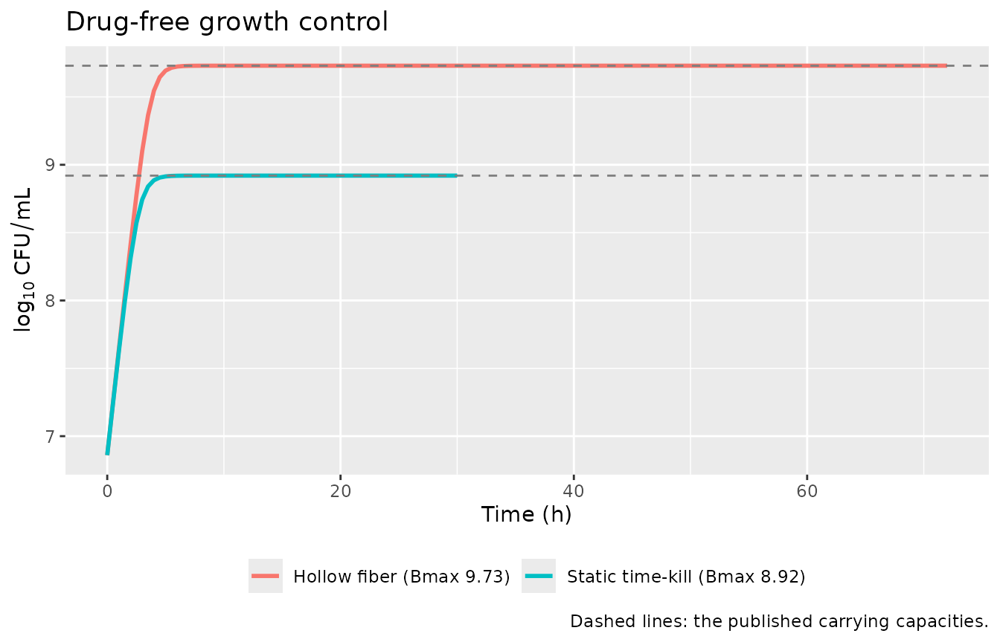
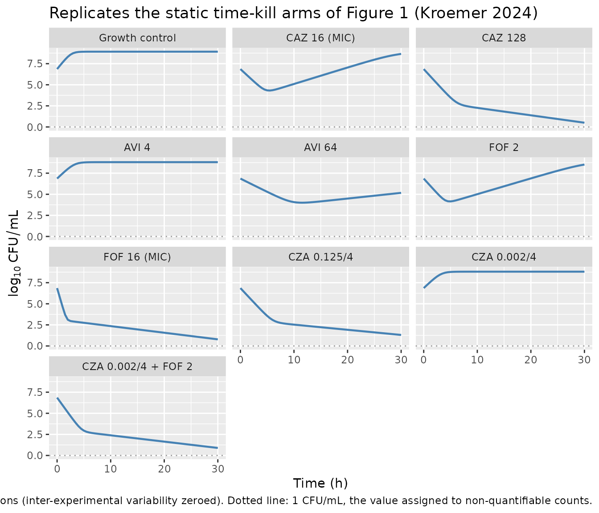
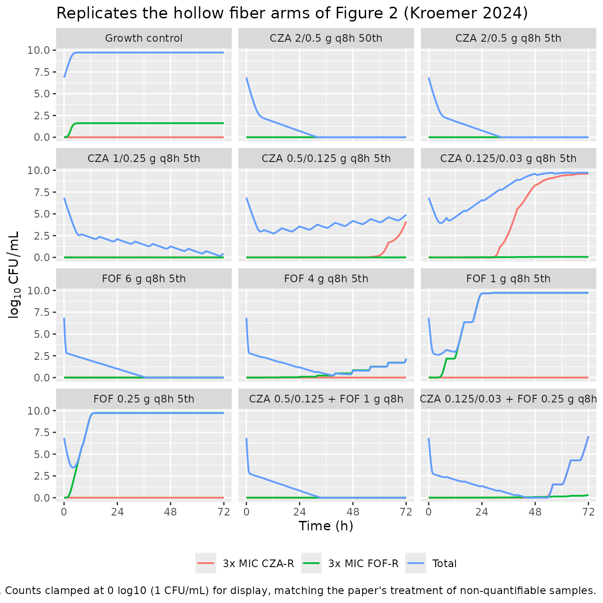
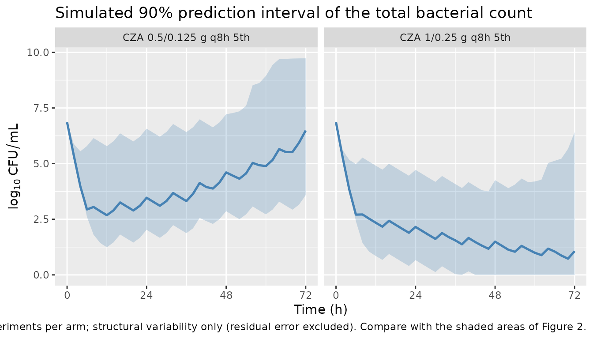
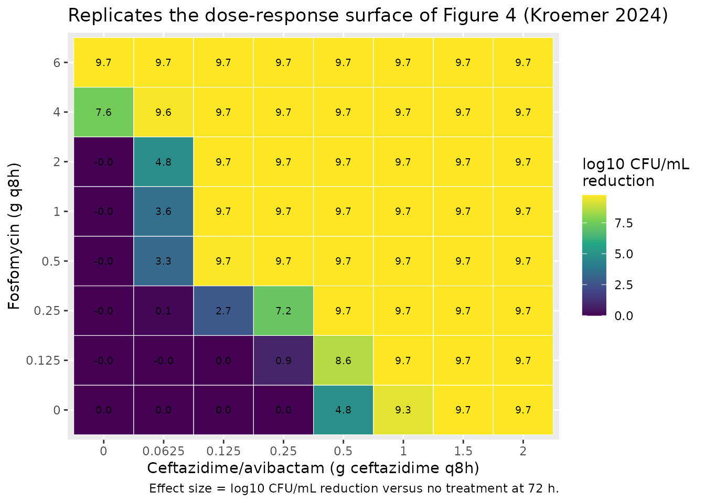

# Ceftazidime/avibactam + fosfomycin against multidrug-resistant E. coli (Kroemer 2024)

## Model and source

- Article: <https://doi.org/10.1128/spectrum.03318-23>
- Supplemental material (Text S1-S5, Fig. S1-S2, Tables S1-S4): same
  DOI, file `spectrum.03318-23-s0001.docx`. The structural equations
  (Text S3 Eqs 1-13) and every parameter estimate (Tables S3 and S4)
  live in the supplement; the main text carries no parameter table.

``` r

tkc  <- rxode2::rxode(readModelDb("Kroemer_2024_ceftazidime_avibactam_fosfomycin_tkc"))
#> ℹ parameter labels from comments will be replaced by 'label()'
hfim <- rxode2::rxode(readModelDb("Kroemer_2024_ceftazidime_avibactam_fosfomycin_hfim"))
#> ℹ parameter labels from comments will be replaced by 'label()'
cat(tkc$reference, sep = "\n")
#> Kroemer N, Amann LF, Farooq A, Pfaffendorf C, Martens M, Decousser JW, Gregoire N, Nordmann P, Wicha SG. Pharmacokinetic/pharmacodynamic analysis of ceftazidime/avibactam and fosfomycin combinations in an in vitro hollow fiber infection model against multidrug-resistant Escherichia coli. Microbiol Spectr. 2024 Jan;12(1):e03318-23. doi:10.1128/spectrum.03318-23. Structural equations: supplemental material Text S3 Eqs 1-8. Parameter estimates: supplemental material Table S3 (with 95% confidence intervals from sampling importance resampling).
```

Kroemer 2024 develops **two** semi-mechanistic PK/PD models of the same
clinical multidrug-resistant *Escherichia coli* isolate, fitted to two
different experimental systems, and reports each with its own parameter
table and its own visual predictive check:

- `Kroemer_2024_ceftazidime_avibactam_fosfomycin_tkc` – the **static
  time-kill** model (Text S3 Eqs 1-8, Table S3, VPC in Fig. 1). Two
  bacterial subpopulations, static drug concentrations supplied as
  covariates.
- `Kroemer_2024_ceftazidime_avibactam_fosfomycin_hfim` – the **dynamic
  hollow fiber** model (Text S3 Eqs 3-13, Table S4, VPC in Fig. 2). The
  static model extended with two phenotypically less susceptible
  subpopulations, and with dosable, decaying antibiotic concentration
  states.

The hollow fiber model inherits all drug-effect parameters from the
static model (“FIX to TKC parameter” throughout Table S4), but it is not
a mere re-fit: it adds four parameters’ worth of new structure,
re-estimates the carrying capacity and the resistant inoculum, and
changes the variability model. Both are published final models, so both
are packaged, following the library’s replicate-the-author’s-structure
policy. Per that policy this is still **one** vignette, because it walks
one paper.

This is **not** a population PK model. In the static model the drug
concentrations are experimental constants; in the hollow fiber model
they are nominal profiles the user doses. There is no
absorption-distribution-elimination profile of a drug to integrate, so
PKNCA is not the right validation target and the mechanistic checks
below replace it.

## Population (biological context)

A single clinical *E. coli* isolate, recovered from a rectal swab during
routine multidrug-resistance screening at Henri-Mondor Hospital (Paris).
Whole-genome sequencing (shovill v1.0.4 assembly, ResFinder resistome)
identified **CTX-M-15** and **TEM-4** extended-spectrum beta-lactamases
and the **OXA-244** (OXA-48-like) carbapenemase. It is *E. coli* YAL_AMA
of Kroemer et al. 2023.

MICs by broth microdilution (modal value of triplicates), with
fosfomycin also by agar dilution: ceftazidime **16 mg/L**,
ceftazidime/avibactam **0.125 mg/L**, fosfomycin **16/0.5 mg/L**. By
EUCAST the isolate is susceptible to ceftazidime/avibactam and to
fosfomycin, and resistant to ceftazidime alone.

Both experimental systems used cation-adjusted Mueller-Hinton broth 2 at
37 degrees C in ambient air, with 25 mg/L glucose-6-phosphate wherever
fosfomycin was present (EUCAST recommendation), an inoculum of 10^6
CFU/mL, and 2 h of preincubation before the first drug exposure:

- **Static time-kill**: 30 h, 10 mL, counts at 0, 2, 4, 8, 24 and 30 h
  after drug addition, performed in duplicate. Quantification limit
  about 10¹⁻¹⁰2 CFU/mL; non-quantifiable counts were set to 1 CFU/mL and
  kept in the fit.
- **Dynamic hollow fiber**: 72 h, FiberCell C2011 polysulfone cartridge
  with a 200 mL central compartment and a 40 mL inoculated
  extra-capillary space, medium exchanged at 0.834-1.28 mL/min to
  control the drug elimination. Total counts and counts on 3x MIC
  drug-supplemented agar were both quantified. Each hollow fiber
  experiment was run **once**.

The same information is available programmatically via
`readModelDb("Kroemer_2024_ceftazidime_avibactam_fosfomycin_tkc")$population`
and its `_hfim` sibling.

## Source trace

Per-parameter origins are recorded as in-file comments next to each
`ini()` entry in both model files. The tables below collect them in one
place.

### Static time-kill model (Table S3)

| Parameter | Value | Source location |
|----|---:|----|
| `log10inoc_s` | 6.86 | Table S3, inoculum susceptible (S) |
| `log10inoc_r` | 3.14 | Table S3, inoculum resistant (R) |
| `log10bmax` | 8.92 | Table S3, maximum bacterial capacity |
| `kgs` | 1.81 | Table S3, growth rate (S) |
| `kgr` | 0.45 | Table S3, growth rate (R) |
| `emax_caz_s`, `ec50_caz_s`, `hill_caz_s` | 3.40, 5.31, 2.32 | Table S3, CAZ on (S) |
| `emax_caz_r`, `ec50_caz_r`, `hill_caz_r` | 0.659, 74.40, 8.45 | Table S3, CAZ on (R) |
| `emax_avi_s`, `ec50_avi_s`, `hill_avi_s` | 3.3, 22.3, 1.13 | Table S3, AVI on (S) |
| `slope_avi_r`, `hill_avi_r` | 0.0787, 0.317 | Table S3, AVI on (R) (power model) |
| `slope_fof_s`, `hill_fof_s` | 2.71, 0.333 | Table S3, FOF on (S) (power model) |
| `emax_fof_r`, `ec50_fof_r`, `hill_fof_r` | 0.635, 4.70, 4.08 | Table S3, FOF on (R) |
| `lint_avi_caz_s`, `lec50int_avi_caz_s`, `hillint_avi_caz_s` | -6.70, -16.20, 0.266 | Table S3, AVI affecting CAZ on (S); footnotes 1-2 give the log-scale back-transforms |
| `lint_avi_caz_r`, `lec50int_avi_caz_r`, `hillint_avi_caz_r` | -13.50, -5.23, 1 FIXED | Table S3, AVI affecting CAZ on (R); footnote 3 fixes the Hill factor |
| `lint_caz_fof_r`, `lec50int_caz_fof_r`, `hillint_caz_fof_r` | -7.85, -12.40, 0.239 | Table S3, CAZ affecting FOF on (R) |
| `etalog10inoc_r` | 0.108787 | Table S3, 33.9 %CV; footnote 4 gives omega^2 = log(CV^2 + 1) |
| `etakgr` | 0.049810 | Table S3, 22.6 %CV; footnote 4 |
| `addSd` | 1.30 | Table S3, additive residual variability sigma |
| Growth / kill ODEs | n/a | Text S3 Eqs 1-2 |
| Sigmoidal Emax and power effect forms | n/a | Text S3 Eqs 3-4 |
| Bliss independence (3-drug, and its collapse to addition) | n/a | Text S3 Eqs 5-7 |
| GPDI interaction term | n/a | Text S3 Eq 8 |

### Dynamic hollow fiber model (Table S4)

Every mono-drug and interaction parameter above is carried over
unchanged and marked `fixed()` in the model file (“FIX to TKC parameter”
in Table S4). The rows below are what Table S4 adds or re-estimates.

| Parameter | Value | Source location |
|----|---:|----|
| `log10inoc_s` | 6.86 FIXED | Table S4, FIX to TKC parameter |
| `log10inoc_r` | 2.89 | Table S4, re-estimated (lower than the static 3.14) |
| `log10bmax` | 9.73 | Table S4, re-estimated |
| `kgs`, `kgr` | 1.81, 0.45 FIXED | Table S4, FIX to TKC parameter |
| `log10inoc_rcza` | -18 FIXED | Table S4, footnote 3 “fixed to final estimate” |
| `log10inoc_rfof` | -2.15 | Table S4, inoculum FOF less susceptible |
| `kgr2` | 2.37 | Table S4, growth rate of both less susceptible subpopulations (merged to one parameter, Text S5) |
| `ec50_cza_rcza`, `hill_cza_rcza` | 0.576, 1 FIXED | Table S4, CZA suppressing the CZA less susceptible subpopulation |
| `ec50_fof_rcza`, `hill_fof_rcza` | 1.38, 20 FIXED | Table S4, FOF suppressing the CZA less susceptible subpopulation |
| `ec50_fof_rfof`, `hill_fof_rfof` | 6.84, 20 FIXED | Table S4, FOF suppressing the FOF less susceptible subpopulation |
| `ec50_cza_rfof`, `hill_cza_rfof` | 0.049, 2.49 | Table S4, CZA suppressing the FOF less susceptible subpopulation |
| `etalog10inoc_r` | 0.208826 | Table S4, 48.2 %CV; footnote 5 |
| `etalog10inoc_rcza` | 0.204927 | Table S4, 47.7 %CV; footnote 5 |
| `addSd` | 3.28 | Table S4, additive residual variability on the total count |
| `addSd_CFUrcza`, `addSd_CFUrfof` | 0.906, 0.906 | Table S4, one shared additive residual sigma on the less susceptible counts (Text S5); split into two identical entries because rxode2 needs one residual parameter per endpoint |
| `thalf` | 1.81 FIXED | Main-text Table 1, modal simulated half-life (range 1.81-3.03 h); Discussion, “a then-joint elimination half-life of approximately 2 h” |
| Four-subpopulation ODEs | n/a | Text S3 Eqs 9-12 |
| Growth-inhibition (Emax = 1) form | n/a | Text S3 Eq 13 |

### Units (dimensional analysis)

| Symbol | Meaning | Units |
|----|----|----|
| `bact_susceptible`, `bact_resistant`, `bact_resistant_cza`, `bact_resistant_fof` | bacterial counts | CFU/mL |
| `conc_caz`, `conc_avi`, `conc_fof`, `CONC_*_MGL` | antibiotic concentrations | mg/L |
| `kgs`, `kgr`, `kgr2`, `kel`, `emax_*`, `e_s`, `e_r` | rate constants | 1/h |
| `ec50_*`, `ec50int_*` | half-effect concentrations | mg/L |
| `slope_fof_s`, `slope_avi_r` | power-model slopes | (L/mg)^H / h |
| `hill_*`, `hillint_*`, `int_*`, `i_*`, `cap`, `ea`, `eb`, `ec` | dimensionless | – |
| `bmax`, `inoc_*` | population scale | CFU/mL |

Every growth and kill term is (1/h) x (CFU/mL) = (CFU/mL)/h, matching
`d/dt(state)`; the drug states are (1/h) x (mg/L) = (mg/L)/h. The two
power models are the one place where the units are carried by the
paper’s parameterisation rather than by a clean rate constant:
`slope * C^H` must have units 1/h, so `slope_fof_s` is (L/mg)^0.333/h
and `slope_avi_r` is (L/mg)^0.317/h. Table S3 labels both as “L/(mg x
h)”, which is the exact unit only when H = 1; the model file reproduces
the published values and the published functional form.

## Parameter tables (paper vs. file)

``` r

data.frame(
  parameter = names(tkc$theta),
  value     = unname(tkc$theta)
) |>
  knitr::kable(digits = 6,
               caption = "Static time-kill model: typical-value parameters as loaded from the model file (Kroemer 2024 Table S3).")
```

| parameter          |    value |
|:-------------------|---------:|
| log10inoc_s        |   6.8600 |
| log10inoc_r        |   3.1400 |
| log10bmax          |   8.9200 |
| kgs                |   1.8100 |
| kgr                |   0.4500 |
| emax_caz_s         |   3.4000 |
| ec50_caz_s         |   5.3100 |
| hill_caz_s         |   2.3200 |
| emax_avi_s         |   3.3000 |
| ec50_avi_s         |  22.3000 |
| hill_avi_s         |   1.1300 |
| slope_fof_s        |   2.7100 |
| hill_fof_s         |   0.3330 |
| emax_caz_r         |   0.6590 |
| ec50_caz_r         |  74.4000 |
| hill_caz_r         |   8.4500 |
| emax_fof_r         |   0.6350 |
| ec50_fof_r         |   4.7000 |
| hill_fof_r         |   4.0800 |
| slope_avi_r        |   0.0787 |
| hill_avi_r         |   0.3170 |
| lint_avi_caz_s     |  -6.7000 |
| lec50int_avi_caz_s | -16.2000 |
| hillint_avi_caz_s  |   0.2660 |
| lint_avi_caz_r     | -13.5000 |
| lec50int_avi_caz_r |  -5.2300 |
| hillint_avi_caz_r  |   1.0000 |
| lint_caz_fof_r     |  -7.8500 |
| lec50int_caz_fof_r | -12.4000 |
| hillint_caz_fof_r  |   0.2390 |
| addSd              |   1.3000 |

Static time-kill model: typical-value parameters as loaded from the
model file (Kroemer 2024 Table S3). {.table}

``` r


data.frame(
  parameter = names(hfim$theta),
  value     = unname(hfim$theta)
) |>
  knitr::kable(digits = 6,
               caption = "Dynamic hollow fiber model: typical-value parameters as loaded from the model file (Kroemer 2024 Table S4).")
```

| parameter          |    value |
|:-------------------|---------:|
| log10inoc_s        |   6.8600 |
| log10inoc_r        |   2.8900 |
| log10bmax          |   9.7300 |
| kgs                |   1.8100 |
| kgr                |   0.4500 |
| emax_caz_s         |   3.4000 |
| ec50_caz_s         |   5.3100 |
| hill_caz_s         |   2.3200 |
| emax_avi_s         |   3.3000 |
| ec50_avi_s         |  22.3000 |
| hill_avi_s         |   1.1300 |
| slope_fof_s        |   2.7100 |
| hill_fof_s         |   0.3330 |
| emax_caz_r         |   0.6590 |
| ec50_caz_r         |  74.4000 |
| hill_caz_r         |   8.4500 |
| emax_fof_r         |   0.6350 |
| ec50_fof_r         |   4.7000 |
| hill_fof_r         |   4.0800 |
| slope_avi_r        |   0.0787 |
| hill_avi_r         |   0.3170 |
| lint_avi_caz_s     |  -6.7000 |
| lec50int_avi_caz_s | -16.2000 |
| hillint_avi_caz_s  |   0.2660 |
| lint_avi_caz_r     | -13.5000 |
| lec50int_avi_caz_r |  -5.2300 |
| hillint_avi_caz_r  |   1.0000 |
| lint_caz_fof_r     |  -7.8500 |
| lec50int_caz_fof_r | -12.4000 |
| hillint_caz_fof_r  |   0.2390 |
| log10inoc_rcza     | -18.0000 |
| log10inoc_rfof     |  -2.1500 |
| kgr2               |   2.3700 |
| ec50_cza_rcza      |   0.5760 |
| hill_cza_rcza      |   1.0000 |
| ec50_fof_rcza      |   1.3800 |
| hill_fof_rcza      |  20.0000 |
| ec50_fof_rfof      |   6.8400 |
| hill_fof_rfof      |  20.0000 |
| ec50_cza_rfof      |   0.0490 |
| hill_cza_rfof      |   2.4900 |
| thalf              |   1.8100 |
| addSd              |   3.2800 |
| addSd_CFUrcza      |   0.9060 |
| addSd_CFUrfof      |   0.9060 |

Dynamic hollow fiber model: typical-value parameters as loaded from the
model file (Kroemer 2024 Table S4). {.table}

## Solver note

Four of the published exponents are below 1 (`hill_fof_s` = 0.333,
`hill_avi_r` = 0.317, `hillint_avi_caz_s` = 0.266, `hillint_caz_fof_r` =
0.239). The analytic Jacobian of a `C^H` term carries a `C^(H-1)` factor
that is singular at `C = 0` (i.e. in every drug-free arm), which the
default BDF solver propagates. All simulations below therefore use the
explicit Dormand-Prince solver, `method = "dop853"`, which needs no
Jacobian.

The hollow fiber model additionally seeds `bact_resistant_cza` at 10^-18
CFU/mL and lets it grow across twenty orders of magnitude, so the
absolute tolerance must sit far below that scale; `atol = 1e-16` is used
throughout. Because the model declares three residual endpoints,
observation rows carry `dvid = 1` and every `rxSolve()` call passes
`useLinCmt = FALSE` (rxode2’s automatic ODE-to-linCmt conversion
otherwise corrupts the dvid-to-compartment mapping).

``` r

tkc0  <- rxode2::zeroRe(tkc)
hfim0 <- rxode2::zeroRe(hfim)

SOLVE <- function(mod, ev) {
  rxode2::rxSolve(mod, ev, returnType = "data.frame", omega = NA,
                  method = "dop853", useLinCmt = FALSE,
                  maxsteps = 1e7, atol = 1e-16, rtol = 1e-8)
}
```

## Carrying-capacity (growth control) check

With no drug present, both models must grow from their inoculum to the
published carrying capacity `Bmax` and stay there: at the plateau the
logistic term `1 - CFU/Bmax` is zero. The static model was fitted with
`log10(Bmax) = 8.92` and the hollow fiber model with
`log10(Bmax) = 9.73`, the larger capacity reflecting the constant supply
of fresh medium in the hollow fiber system.

``` r

tkc_ev_obs <- function(caz, avi, fof, times) {
  data.frame(id = 1L, time = times, evid = 0L, amt = NA_real_,
             cmt = "bact_susceptible",
             CONC_CAZ_MGL = caz, CONC_AVI_MGL = avi, CONC_FOF_MGL = fof)
}

gc_tkc  <- SOLVE(tkc0,  tkc_ev_obs(0, 0, 0, seq(0, 30, by = 0.5)))
gc_hfim <- SOLVE(hfim0, data.frame(id = 1L, time = seq(0, 72, by = 0.5),
                                   evid = 0L, amt = NA_real_,
                                   cmt = "bact_susceptible", dvid = 1L))

cat(sprintf("Static time-kill: log10CFU(0) = %.2f, log10CFU(30) = %.2f  (Bmax = 8.92)\n",
            gc_tkc$Cc[gc_tkc$time == 0], gc_tkc$Cc[gc_tkc$time == 30]))
#> Static time-kill: log10CFU(0) = 6.86, log10CFU(30) = 8.92  (Bmax = 8.92)
cat(sprintf("Hollow fiber:     log10CFU(0) = %.2f, log10CFU(72) = %.2f  (Bmax = 9.73)\n",
            gc_hfim$Cc[gc_hfim$time == 0], gc_hfim$Cc[gc_hfim$time == 72]))
#> Hollow fiber:     log10CFU(0) = 6.86, log10CFU(72) = 9.73  (Bmax = 9.73)

bind_rows(
  transmute(gc_tkc,  time, log10CFU = Cc, model = "Static time-kill (Bmax 8.92)"),
  transmute(gc_hfim, time, log10CFU = Cc, model = "Hollow fiber (Bmax 9.73)")
) |>
  ggplot(aes(time, log10CFU, colour = model)) +
  geom_line(linewidth = 1) +
  geom_hline(yintercept = c(8.92, 9.73), linetype = 2, colour = "grey50") +
  labs(x = "Time (h)", y = expression(log[10]~CFU/mL), colour = NULL,
       title = "Drug-free growth control",
       caption = "Dashed lines: the published carrying capacities.") +
  theme(legend.position = "bottom")
```



## GPDI synergy check

The paper’s central quantitative claim is that the interaction terms
reduce the victim drug’s EC50 by more than 99% (Results, “PKPD modeling
to quantify synergy”; Text S5). Because both the maximum interaction
shift and the interaction potency were estimated on the log scale (Table
S3 footnotes 1-2), the claim is worth re-deriving from the tabulated
thetas rather than taken on trust.

``` r

gpdi_shift <- function(l_int, l_ec50int, h_int, conc) {
  int     <- exp(l_int) - 1        # Table S3 footnote 1
  ec50int <- exp(l_ec50int)        # Table S3 footnote 2
  1 + int * conc^h_int / (ec50int^h_int + conc^h_int)
}

avi_conc <- c(0, 0.4, 1.67, 4, 8.71, 64)
data.frame(
  `Avibactam (mg/L)`  = avi_conc,
  `CAZ EC50 on S`     = 5.31  * gpdi_shift(-6.70,  -16.20, 0.266, avi_conc),
  `CAZ EC50 on R`     = 74.40 * gpdi_shift(-13.50, -5.23,  1,     avi_conc),
  check.names = FALSE
) |>
  knitr::kable(digits = 4,
               caption = "Avibactam collapses the ceftazidime EC50 (baselines 5.31 and 74.40 mg/L). At 4 mg/L avibactam -- the concentration used on the ceftazidime agar plates -- the effective EC50 on the susceptible subpopulation falls to about 0.055 mg/L, consistent with the measured ceftazidime/avibactam MIC of 0.125 mg/L against a ceftazidime-alone MIC of 16 mg/L.")
```

| Avibactam (mg/L) | CAZ EC50 on S | CAZ EC50 on R |
|-----------------:|--------------:|--------------:|
|             0.00 |        5.3100 |       74.4000 |
|             0.40 |        0.0960 |        0.9827 |
|             1.67 |        0.0680 |        0.2378 |
|             4.00 |        0.0554 |        0.0995 |
|             8.71 |        0.0463 |        0.0458 |
|            64.00 |        0.0300 |        0.0063 |

Avibactam collapses the ceftazidime EC50 (baselines 5.31 and 74.40
mg/L). At 4 mg/L avibactam – the concentration used on the ceftazidime
agar plates – the effective EC50 on the susceptible subpopulation falls
to about 0.055 mg/L, consistent with the measured ceftazidime/avibactam
MIC of 0.125 mg/L against a ceftazidime-alone MIC of 16 mg/L. {.table}

``` r


caz_conc <- c(0, 0.09, 0.87, 1.83, 7.33, 29.06)
data.frame(
  `Ceftazidime (mg/L)` = caz_conc,
  `FOF EC50 on R`      = 4.70 * gpdi_shift(-7.85, -12.40, 0.239, caz_conc),
  `Percent reduction`  = 100 * (1 - gpdi_shift(-7.85, -12.40, 0.239, caz_conc)),
  check.names = FALSE
) |>
  knitr::kable(digits = 4,
               caption = "Ceftazidime collapses the fosfomycin EC50 on the resistant subpopulation (baseline 4.70 mg/L). This is the monodirectional GPDI implementation the paper selected (dAIC -271.991 against Bliss independence; Text S5).")
```

| Ceftazidime (mg/L) | FOF EC50 on R | Percent reduction |
|-------------------:|--------------:|------------------:|
|               0.00 |        4.7000 |            0.0000 |
|               0.09 |        0.3969 |           91.5558 |
|               0.87 |        0.2399 |           94.8955 |
|               1.83 |        0.2028 |           95.6850 |
|               7.33 |        0.1478 |           96.8544 |
|              29.06 |        0.1078 |           97.7062 |

Ceftazidime collapses the fosfomycin EC50 on the resistant subpopulation
(baseline 4.70 mg/L). This is the monodirectional GPDI implementation
the paper selected (dAIC -271.991 against Bliss independence; Text S5).
{.table}

``` r


cat(sprintf("Maximum EC50 reduction, AVI on CAZ (S): %.3f%%\n", 100 * (1 - exp(-6.70))))
#> Maximum EC50 reduction, AVI on CAZ (S): 99.877%
cat(sprintf("Maximum EC50 reduction, AVI on CAZ (R): %.5f%%\n", 100 * (1 - exp(-13.50))))
#> Maximum EC50 reduction, AVI on CAZ (R): 99.99986%
cat(sprintf("Maximum EC50 reduction, CAZ on FOF (R): %.3f%%\n", 100 * (1 - exp(-7.85))))
#> Maximum EC50 reduction, CAZ on FOF (R): 99.961%
```

All three maximum shifts exceed 99%, matching the paper’s statement that
the interactions reduce the EC50 “by \>99% for both interacting drug
pairs”.

## Replicate the static time-kill experiments (Figure 1)

Figure 1 of Kroemer 2024 is a stratified VPC of the static time-kill
scenarios. The narrative in Results, “Static time-kill experiments”,
states the outcome for each key arm, and those statements are the check
applied here: 128 mg/L ceftazidime or 16 mg/L fosfomycin alone were
needed for reproducible suppression over 30 h; no avibactam
concentration alone killed; 0.125/4 mg/L ceftazidime/avibactam was
efficacious; and adding 2 mg/L fosfomycin brought the efficacious
ceftazidime concentration down to 0.002 mg/L.

``` r

tkc_scenarios <- tribble(
  ~label,                            ~caz,   ~avi, ~fof,
  "Growth control",                   0,      0,    0,
  "CAZ 16 (MIC)",                     16,     0,    0,
  "CAZ 128",                          128,    0,    0,
  "AVI 4",                            0,      4,    0,
  "AVI 64",                           0,      64,   0,
  "FOF 2",                            0,      0,    2,
  "FOF 16 (MIC)",                     0,      0,    16,
  "CZA 0.125/4",                      0.125,  4,    0,
  "CZA 0.002/4",                      0.002,  4,    0,
  "CZA 0.002/4 + FOF 2",              0.002,  4,    2
) |>
  mutate(id = row_number())

tkc_ev <- tkc_scenarios |>
  tidyr::crossing(time = seq(0, 30, by = 0.5)) |>
  transmute(id, time, evid = 0L, amt = NA_real_, cmt = "bact_susceptible",
            CONC_CAZ_MGL = caz, CONC_AVI_MGL = avi, CONC_FOF_MGL = fof)

tkc_sim <- SOLVE(tkc0, tkc_ev) |>
  left_join(select(tkc_scenarios, id, label), by = "id") |>
  mutate(label = factor(label, levels = tkc_scenarios$label))
#> Warning: multi-subject simulation without without 'omega'

ggplot(tkc_sim, aes(time, Cc)) +
  geom_line(linewidth = 0.8, colour = "steelblue") +
  geom_hline(yintercept = 0, linetype = 3, colour = "grey60") +
  facet_wrap(~ label, ncol = 3) +
  scale_x_continuous(breaks = seq(0, 30, by = 10)) +
  labs(x = "Time (h)", y = expression(log[10]~CFU/mL),
       title = "Replicates the static time-kill arms of Figure 1 (Kroemer 2024)",
       caption = paste("Typical-value predictions (inter-experimental variability zeroed).",
                       "Dotted line: 1 CFU/mL, the value assigned to non-quantifiable counts."))
```



``` r

tkc_sim |>
  filter(time == 30) |>
  transmute(Scenario = label, `log10 CFU/mL at 30 h` = Cc) |>
  arrange(`log10 CFU/mL at 30 h`) |>
  knitr::kable(digits = 2,
               caption = "Bacterial count at the end of the 30-h static time-kill experiment. Suppression (CAZ 128, FOF 16, CZA 0.125/4, CZA 0.002/4 + FOF 2) and regrowth (CAZ 16, FOF 2, avibactam alone at any concentration) reproduce the outcomes reported in Results, 'Static time-kill experiments'.")
```

| Scenario            | log10 CFU/mL at 30 h |
|:--------------------|---------------------:|
| CAZ 128             |                 0.50 |
| FOF 16 (MIC)        |                 0.78 |
| CZA 0.002/4 + FOF 2 |                 0.89 |
| CZA 0.125/4         |                 1.31 |
| AVI 64              |                 5.17 |
| FOF 2               |                 8.52 |
| CAZ 16 (MIC)        |                 8.66 |
| CZA 0.002/4         |                 8.81 |
| AVI 4               |                 8.81 |
| Growth control      |                 8.92 |

Bacterial count at the end of the 30-h static time-kill experiment.
Suppression (CAZ 128, FOF 16, CZA 0.125/4, CZA 0.002/4 + FOF 2) and
regrowth (CAZ 16, FOF 2, avibactam alone at any concentration) reproduce
the outcomes reported in Results, ‘Static time-kill experiments’.
{.table}

## Replicate the hollow fiber experiments (Figure 2)

Table 1 of the paper gives the simulated steady-state Cmax and Cmin of
every hollow fiber arm. Because the drugs were given as bolus injections
into a one-compartment system, dosing the concentration increment
`Cmax - Cmin` every 8 h reproduces the published envelope exactly.

``` r

hfim_arms <- tribble(
  ~label,                        ~caz_min, ~caz_max, ~avi_min, ~avi_max, ~fof_min, ~fof_max,
  "Growth control",                  0,       0,        0,       0,        0,       0,
  "CZA 2/0.5 g q8h 50th",            5.70,    41.11,    1.43,    8.71,     0,       0,
  "CZA 2/0.5 g q8h 5th",             1.40,    29.06,    0.32,    6.69,     0,       0,
  "CZA 1/0.25 g q8h 5th",            0.71,    14.66,    0.16,    3.34,     0,       0,
  "CZA 0.5/0.125 g q8h 5th",         0.35,    7.33,     0.08,    1.67,     0,       0,
  "CZA 0.125/0.03 g q8h 5th",        0.09,    1.83,     0.02,    0.40,     0,       0,
  "FOF 6 g q8h 5th",                 0,       0,        0,       0,        13.67,   185.37,
  "FOF 4 g q8h 5th",                 0,       0,        0,       0,        6.74,    124.31,
  "FOF 1 g q8h 5th",                 0,       0,        0,       0,        1.68,    31.08,
  "FOF 0.25 g q8h 5th",              0,       0,        0,       0,        0.37,    7.72,
  "CZA 0.5/0.125 + FOF 1 g q8h",     0.35,    7.33,     0.08,    1.67,     1.50,    31.12,
  "CZA 0.125/0.03 + FOF 0.25 g q8h", 0.09,    1.83,     0.02,    0.40,     0.37,    7.72
) |>
  mutate(id = row_number())

HFIM_DUR <- 72

# One bolus per 8-h interval, sized as the Table 1 concentration increment.
hfim_doses <- hfim_arms |>
  select(id, caz_min, caz_max, avi_min, avi_max, fof_min, fof_max) |>
  pivot_longer(-id, names_to = c("drug", ".value"), names_sep = "_") |>
  filter(max > 0) |>
  mutate(cmt = paste0("conc_", drug), amt = max - min) |>
  tidyr::crossing(time = seq(0, HFIM_DUR - 1, by = 8)) |>
  transmute(id, time, evid = 1L, amt, cmt, dvid = NA_integer_)

hfim_obs <- hfim_arms |>
  select(id) |>
  tidyr::crossing(time = seq(0, HFIM_DUR, by = 0.5)) |>
  transmute(id, time, evid = 0L, amt = NA_real_,
            cmt = "bact_susceptible", dvid = 1L)

hfim_ev <- bind_rows(hfim_obs, hfim_doses) |> arrange(id, time, evid)

hfim_sim <- SOLVE(hfim0, hfim_ev) |>
  left_join(select(hfim_arms, id, label), by = "id") |>
  mutate(label = factor(label, levels = hfim_arms$label))
#> Warning: multi-subject simulation without without 'omega'
```

``` r

hfim_sim |>
  filter(time %in% c(64, 72)) |>
  group_by(label) |>
  summarise(`CAZ Cmin` = min(conc_caz), `CAZ Cmax` = max(conc_caz),
            `AVI Cmin` = min(conc_avi), `AVI Cmax` = max(conc_avi),
            `FOF Cmin` = min(conc_fof), `FOF Cmax` = max(conc_fof),
            .groups = "drop") |>
  knitr::kable(digits = 2,
               caption = "Simulated steady-state trough (t = 64 h, just before the ninth dose) and peak (t = 72 h) concentrations, to be compared with Table 1 of the paper.")
```

| label | CAZ Cmin | CAZ Cmax | AVI Cmin | AVI Cmax | FOF Cmin | FOF Cmax |
|:---|---:|---:|---:|---:|---:|---:|
| Growth control | 0.00 | 0.00 | 0.00 | 0.00 | 0.00 | 0.00 |
| CZA 2/0.5 g q8h 50th | 1.74 | 37.15 | 0.36 | 7.64 | 0.00 | 0.00 |
| CZA 2/0.5 g q8h 5th | 1.36 | 29.02 | 0.31 | 6.68 | 0.00 | 0.00 |
| CZA 1/0.25 g q8h 5th | 0.68 | 14.63 | 0.16 | 3.34 | 0.00 | 0.00 |
| CZA 0.5/0.125 g q8h 5th | 0.34 | 7.32 | 0.08 | 1.67 | 0.00 | 0.00 |
| CZA 0.125/0.03 g q8h 5th | 0.09 | 1.83 | 0.02 | 0.40 | 0.00 | 0.00 |
| FOF 6 g q8h 5th | 0.00 | 0.00 | 0.00 | 0.00 | 8.41 | 180.11 |
| FOF 4 g q8h 5th | 0.00 | 0.00 | 0.00 | 0.00 | 5.76 | 123.33 |
| FOF 1 g q8h 5th | 0.00 | 0.00 | 0.00 | 0.00 | 1.44 | 30.84 |
| FOF 0.25 g q8h 5th | 0.00 | 0.00 | 0.00 | 0.00 | 0.36 | 7.71 |
| CZA 0.5/0.125 + FOF 1 g q8h | 0.34 | 7.32 | 0.08 | 1.67 | 1.45 | 31.07 |
| CZA 0.125/0.03 + FOF 0.25 g q8h | 0.09 | 1.83 | 0.02 | 0.40 | 0.36 | 7.71 |

Simulated steady-state trough (t = 64 h, just before the ninth dose) and
peak (t = 72 h) concentrations, to be compared with Table 1 of the
paper. {.table style="width:100%;"}

The twelve arms driven by the model’s default 1.81-h half-life reproduce
their Table 1 Cmin / Cmax pairs closely (e.g. `CZA 2/0.5 g q8h 5th`:
1.36 / 29.02 mg/L here against 1.40 / 29.06 mg/L published). The two
arms that Table 1 assigns a *different* half-life are visibly off at the
trough, exactly as expected: `CZA 2/0.5 g q8h 50th` was run at 3.03 h
and `FOF 6 g q8h 5th` at 2.10 h, so their simulated troughs here (1.74
and 8.41 mg/L) fall below the published 5.70 and 13.67 mg/L. Reproducing
those two arms exactly requires overriding `thalf`; see Assumptions item
5.

``` r

hfim_long <- hfim_sim |>
  select(id, label, time, Total = Cc, `3x MIC CZA-R` = CFUrcza, `3x MIC FOF-R` = CFUrfof) |>
  pivot_longer(c(Total, `3x MIC CZA-R`, `3x MIC FOF-R`),
               names_to = "population", values_to = "log10CFU") |>
  # The paper plots counts on the observed scale, where non-quantifiable
  # samples were assigned 1 CFU/mL (0 log10). Clamp the total for display only.
  mutate(log10CFU = pmax(log10CFU, 0))

ggplot(hfim_long, aes(time, log10CFU, colour = population)) +
  geom_line(linewidth = 0.7) +
  facet_wrap(~ label, ncol = 3) +
  scale_x_continuous(breaks = seq(0, 72, by = 24)) +
  labs(x = "Time (h)", y = expression(log[10]~CFU/mL), colour = NULL,
       title = "Replicates the hollow fiber arms of Figure 2 (Kroemer 2024)",
       caption = paste("Typical-value predictions. Counts clamped at 0 log10 (1 CFU/mL) for display,",
                       "matching the paper's treatment of non-quantifiable samples.")) +
  theme(legend.position = "bottom")
```



``` r

hfim_sim |>
  filter(time == HFIM_DUR) |>
  transmute(Arm = label,
            `Total (log10 CFU/mL)`   = pmax(Cc, 0),
            `3x MIC CZA-R`           = CFUrcza,
            `3x MIC FOF-R`           = CFUrfof) |>
  knitr::kable(digits = 2,
               caption = "Bacterial counts at 72 h. Results, 'Dynamic HFIM', reports that FOF 1 g q8h was the highest fosfomycin monotherapy that failed to suppress regrowth, that CZA 0.5/0.125 g q8h was the highest ceftazidime/avibactam monotherapy that failed, and that the quarter-dose combination (CZA 0.125/0.03 + FOF 0.25 g q8h) still achieved killing -- all three reproduce here.")
```

| Arm | Total (log10 CFU/mL) | 3x MIC CZA-R | 3x MIC FOF-R |
|:---|---:|---:|---:|
| Growth control | 9.73 | 0.00 | 1.62 |
| CZA 2/0.5 g q8h 50th | 0.00 | 0.00 | 0.00 |
| CZA 2/0.5 g q8h 5th | 0.00 | 0.00 | 0.00 |
| CZA 1/0.25 g q8h 5th | 0.44 | 0.00 | 0.00 |
| CZA 0.5/0.125 g q8h 5th | 4.90 | 4.12 | 0.00 |
| CZA 0.125/0.03 g q8h 5th | 9.73 | 9.61 | 0.06 |
| FOF 6 g q8h 5th | 0.00 | 0.00 | 0.00 |
| FOF 4 g q8h 5th | 2.17 | 0.00 | 2.17 |
| FOF 1 g q8h 5th | 9.73 | 0.00 | 9.73 |
| FOF 0.25 g q8h 5th | 9.73 | 0.00 | 9.73 |
| CZA 0.5/0.125 + FOF 1 g q8h | 0.00 | 0.00 | 0.00 |
| CZA 0.125/0.03 + FOF 0.25 g q8h | 7.06 | 7.06 | 0.33 |

Bacterial counts at 72 h. Results, ‘Dynamic HFIM’, reports that FOF 1 g
q8h was the highest fosfomycin monotherapy that failed to suppress
regrowth, that CZA 0.5/0.125 g q8h was the highest ceftazidime/avibactam
monotherapy that failed, and that the quarter-dose combination (CZA
0.125/0.03 + FOF 0.25 g q8h) still achieved killing – all three
reproduce here. {.table}

The emergence pattern also reproduces the paper’s observation that
“below a certain exposure, a rapid emergence of 3x MIC FOF-resistant
bacteria was observed within the first 12 h of experiment. On opposite,
phenotypic resistance against 3x MIC CZA emerged later between 24 and 48
h”: the fosfomycin less susceptible subpopulation starts from 10^-2.15
CFU/mL and needs only a few hours to become detectable, whereas the
ceftazidime/avibactam one starts from 10^-18 CFU/mL and needs roughly 20
h of uninhibited growth at 2.37/h to cross 1 CFU/mL.

``` r

emergence <- hfim_sim |>
  group_by(label) |>
  summarise(
    `First time 3x MIC FOF-R > 1 log10 (h)` =
      ifelse(any(CFUrfof > 1), min(time[CFUrfof > 1]), NA_real_),
    `First time 3x MIC CZA-R > 1 log10 (h)` =
      ifelse(any(CFUrcza > 1), min(time[CFUrcza > 1]), NA_real_),
    .groups = "drop"
  )
knitr::kable(emergence, digits = 1,
             caption = "Time at which each less susceptible subpopulation first exceeds 10 CFU/mL. NA means the subpopulation never emerged within 72 h.")
```

| label | First time 3x MIC FOF-R \> 1 log10 (h) | First time 3x MIC CZA-R \> 1 log10 (h) |
|:---|---:|---:|
| Growth control | 3.5 | NA |
| CZA 2/0.5 g q8h 50th | NA | NA |
| CZA 2/0.5 g q8h 5th | NA | NA |
| CZA 1/0.25 g q8h 5th | NA | NA |
| CZA 0.5/0.125 g q8h 5th | NA | 63.0 |
| CZA 0.125/0.03 g q8h 5th | NA | 32.0 |
| FOF 6 g q8h 5th | NA | NA |
| FOF 4 g q8h 5th | 56.0 | NA |
| FOF 1 g q8h 5th | 7.0 | NA |
| FOF 0.25 g q8h 5th | 3.5 | NA |
| CZA 0.5/0.125 + FOF 1 g q8h | NA | NA |
| CZA 0.125/0.03 + FOF 0.25 g q8h | NA | 55.5 |

Time at which each less susceptible subpopulation first exceeds 10
CFU/mL. NA means the subpopulation never emerged within 72 h. {.table}

## Inter-experimental variability

Both models carry the paper’s inter-experimental variability as
exponential interindividual variability. The hollow fiber model places
it on the resistant inoculum (48.2 %CV) and on the ceftazidime/avibactam
less susceptible inoculum (47.7 %CV) – the latter is precisely the
mechanism the paper introduced to explain why “the lower resistance
development against CZA was additionally subjected to a higher
variability”, producing “relatively wide prediction intervals in the VPC
plots”.

``` r

N_SUB <- 100   # participants per arm; well under the 200/arm cap

vpc_arms <- hfim_arms |> filter(label %in% c("CZA 0.5/0.125 g q8h 5th",
                                             "CZA 1/0.25 g q8h 5th"))

vpc_ev <- bind_rows(lapply(seq_len(nrow(vpc_arms)), function(k) {
  arm <- vpc_arms[k, ]
  base_id <- (k - 1L) * N_SUB
  doses <- tidyr::crossing(
    tibble(cmt = c("conc_caz", "conc_avi"),
           amt = c(arm$caz_max - arm$caz_min, arm$avi_max - arm$avi_min)),
    time = seq(0, HFIM_DUR - 1, by = 8),
    sub  = seq_len(N_SUB)
  ) |>
    transmute(id = base_id + sub, time, evid = 1L, amt, cmt, dvid = NA_integer_)
  obs <- tidyr::crossing(sub = seq_len(N_SUB), time = seq(0, HFIM_DUR, by = 2)) |>
    transmute(id = base_id + sub, time, evid = 0L, amt = NA_real_,
              cmt = "bact_susceptible", dvid = 1L)
  bind_rows(obs, doses) |> mutate(arm = arm$label)
}))

vpc_sim <- rxode2::rxSolve(
  hfim, select(vpc_ev, -arm), returnType = "data.frame",
  omega = hfim$omega, method = "dop853", useLinCmt = FALSE,
  maxsteps = 1e7, atol = 1e-16, rtol = 1e-8, keep = character()
) |>
  left_join(distinct(vpc_ev, id, arm), by = "id")

stopifnot(dplyr::n_distinct(vpc_sim$id) == N_SUB * nrow(vpc_arms))

vpc_sim |>
  group_by(arm, time) |>
  summarise(lo = quantile(pmax(Cc, 0), 0.05),
            md = median(pmax(Cc, 0)),
            hi = quantile(pmax(Cc, 0), 0.95), .groups = "drop") |>
  ggplot(aes(time, md)) +
  geom_ribbon(aes(ymin = lo, ymax = hi), alpha = 0.25, fill = "steelblue") +
  geom_line(linewidth = 0.9, colour = "steelblue") +
  facet_wrap(~ arm) +
  scale_x_continuous(breaks = seq(0, 72, by = 24)) +
  labs(x = "Time (h)", y = expression(log[10]~CFU/mL),
       title = "Simulated 90% prediction interval of the total bacterial count",
       caption = paste0("n = ", N_SUB, " simulated experiments per arm; structural variability only ",
                        "(residual error excluded). Compare with the shaded areas of Figure 2."))
```



## Replicate the dose-response surface (Figure 4)

Figure 4 simulates additional hollow fiber experiments across a grid of
ceftazidime/avibactam and fosfomycin doses and reports the effect size
as the log10 CFU/mL reduction relative to no treatment at 72 h. The
pharmacokinetics in Table 1 are dose-linear, so each grid point is
obtained by scaling the Table 1 reference rows (`CZA 1/0.25 g q8h 5th`
and `FOF 1 g q8h 5th`).

``` r

# Table 1 reference rows, per 1 g q8h (5th percentile profiles).
CAZ_PER_G <- c(min = 0.71, max = 14.66)   # CZA 1/0.25 g q8h 5th
AVI_PER_G <- c(min = 0.16, max = 3.34)    # avibactam accompanies at a 4:1 ratio
FOF_PER_G <- c(min = 1.68, max = 31.08)   # FOF 1 g q8h 5th

cza_doses <- c(0, 0.0625, 0.125, 0.25, 0.5, 1, 1.5, 2)
fof_doses <- c(0, 0.125, 0.25, 0.5, 1, 2, 4, 6)

grid <- tidyr::crossing(cza_g = cza_doses, fof_g = fof_doses) |>
  mutate(id = row_number())

grid_doses <- grid |>
  transmute(id,
            conc_caz = cza_g * (CAZ_PER_G[["max"]] - CAZ_PER_G[["min"]]),
            conc_avi = cza_g * (AVI_PER_G[["max"]] - AVI_PER_G[["min"]]),
            conc_fof = fof_g * (FOF_PER_G[["max"]] - FOF_PER_G[["min"]])) |>
  pivot_longer(-id, names_to = "cmt", values_to = "amt") |>
  filter(amt > 0) |>
  tidyr::crossing(time = seq(0, HFIM_DUR - 1, by = 8)) |>
  transmute(id, time, evid = 1L, amt, cmt, dvid = NA_integer_)

grid_obs <- grid |>
  select(id) |>
  tidyr::crossing(time = c(0, 24, 48, 72)) |>
  transmute(id, time, evid = 0L, amt = NA_real_,
            cmt = "bact_susceptible", dvid = 1L)

grid_sim <- SOLVE(hfim0, bind_rows(grid_obs, grid_doses) |> arrange(id, time, evid))
#> Warning: multi-subject simulation without without 'omega'

no_treatment <- grid_sim$Cc[grid_sim$id == grid$id[grid$cza_g == 0 & grid$fof_g == 0] &
                              grid_sim$time == HFIM_DUR]

surface <- grid_sim |>
  filter(time == HFIM_DUR) |>
  select(id, Cc) |>
  left_join(grid, by = "id") |>
  mutate(effect = no_treatment - pmax(Cc, 0))

ggplot(surface, aes(factor(cza_g), factor(fof_g), fill = effect)) +
  geom_tile(colour = "white") +
  geom_text(aes(label = sprintf("%.1f", effect)), size = 2.6) +
  scale_fill_viridis_c(name = "log10 CFU/mL\nreduction") +
  labs(x = "Ceftazidime/avibactam (g ceftazidime q8h)",
       y = "Fosfomycin (g q8h)",
       title = "Replicates the dose-response surface of Figure 4 (Kroemer 2024)",
       caption = "Effect size = log10 CFU/mL reduction versus no treatment at 72 h.")
```



The paper’s headline simulation result is that “a combination of 0.5-g
q8h FOF and 0.25-/0.06-g q8h CZA would lead to a suppression of the
bacterial count, while a 12 times higher dose of FOF (6 g q8h) or a six
times higher dose of CZA (1.5/0.375 g q8h) would lead to the same
effects in monotherapy”. The three grid points named in that sentence
are compared directly below.

``` r

pick <- function(cza, fof) {
  round(surface$effect[surface$cza_g == cza & surface$fof_g == fof], 2)
}
tibble::tibble(
  Regimen = c("Combination: CZA 0.25 g + FOF 0.5 g q8h",
              "Fosfomycin monotherapy: FOF 6 g q8h (12x the combination dose)",
              "CZA monotherapy: CZA 1.5 g q8h (6x the combination dose)"),
  `log10 CFU/mL reduction at 72 h` = c(pick(0.25, 0.5), pick(0, 6), pick(1.5, 0))
) |>
  knitr::kable(digits = 2,
               caption = "The paper's dose-reduction claim: a combination of 0.5 g q8h fosfomycin with 0.25/0.06 g q8h ceftazidime/avibactam matches the effect of either monotherapy at 12x (fosfomycin) or 6x (ceftazidime/avibactam) the dose.")
```

| Regimen | log10 CFU/mL reduction at 72 h |
|:---|---:|
| Combination: CZA 0.25 g + FOF 0.5 g q8h | 9.73 |
| Fosfomycin monotherapy: FOF 6 g q8h (12x the combination dose) | 9.73 |
| CZA monotherapy: CZA 1.5 g q8h (6x the combination dose) | 9.73 |

The paper’s dose-reduction claim: a combination of 0.5 g q8h fosfomycin
with 0.25/0.06 g q8h ceftazidime/avibactam matches the effect of either
monotherapy at 12x (fosfomycin) or 6x (ceftazidime/avibactam) the dose.
{.table}

The three regimens give an identical effect size, but that on its own
would also be true of any three regimens strong enough to saturate the
endpoint. The sharper test is whether 1.5 g and 6 g really are the
*smallest* monotherapy doses on the simulated grid that reach full
suppression – which is what makes the multipliers 6x and 12x rather than
merely “at least”.

``` r

surface |>
  filter(cza_g == 0 | fof_g == 0) |>
  transmute(
    Monotherapy = ifelse(fof_g == 0 & cza_g == 0, "No treatment",
                  ifelse(fof_g == 0, "Ceftazidime/avibactam", "Fosfomycin")),
    `Dose (g q8h)` = ifelse(fof_g == 0, cza_g, fof_g),
    `log10 CFU/mL reduction at 72 h` = round(effect, 2)
  ) |>
  filter(Monotherapy != "No treatment") |>
  arrange(Monotherapy, `Dose (g q8h)`) |>
  knitr::kable(caption = "Monotherapy dose-response at 72 h. Full suppression (a 9.73 log10 reduction, i.e. the whole no-treatment plateau) is first reached at 1.5 g q8h ceftazidime and at 6 g q8h fosfomycin; the next dose down in each series (1 g and 4 g) leaves 0.4 and 2.2 log10 CFU/mL standing. Against the combination's 0.25 g and 0.5 g, those thresholds are the paper's 6-fold and 12-fold dose reductions exactly.")
```

| Monotherapy           | Dose (g q8h) | log10 CFU/mL reduction at 72 h |
|:----------------------|-------------:|-------------------------------:|
| Ceftazidime/avibactam |       0.0625 |                           0.00 |
| Ceftazidime/avibactam |       0.1250 |                           0.00 |
| Ceftazidime/avibactam |       0.2500 |                           0.00 |
| Ceftazidime/avibactam |       0.5000 |                           4.82 |
| Ceftazidime/avibactam |       1.0000 |                           9.29 |
| Ceftazidime/avibactam |       1.5000 |                           9.73 |
| Ceftazidime/avibactam |       2.0000 |                           9.73 |
| Fosfomycin            |       0.1250 |                           0.00 |
| Fosfomycin            |       0.2500 |                           0.00 |
| Fosfomycin            |       0.5000 |                           0.00 |
| Fosfomycin            |       1.0000 |                           0.00 |
| Fosfomycin            |       2.0000 |                           0.00 |
| Fosfomycin            |       4.0000 |                           7.57 |
| Fosfomycin            |       6.0000 |                           9.73 |

Monotherapy dose-response at 72 h. Full suppression (a 9.73 log10
reduction, i.e. the whole no-treatment plateau) is first reached at 1.5
g q8h ceftazidime and at 6 g q8h fosfomycin; the next dose down in each
series (1 g and 4 g) leaves 0.4 and 2.2 log10 CFU/mL standing. Against
the combination’s 0.25 g and 0.5 g, those thresholds are the paper’s
6-fold and 12-fold dose reductions exactly. {.table}

## Assumptions and deviations

1.  **Eq 2 / Eq 10 kill term reads `- R * E_R`, not `- S * E_R` as
    printed.** Text S3 prints the resistant compartment’s kill term with
    the *susceptible* count as its multiplier, in both the static (Eq 2)
    and the hollow fiber (Eq 10) equation. Taken literally, at the
    estimated inocula (10^6.86 vs 10^3.14 CFU/mL) that term is roughly
    5,000x larger than the resistant state itself and drives it negative
    within minutes, and it would also leave the resistant subpopulation
    entirely uncontrollable once the susceptible one is eradicated –
    which is the opposite of the paper’s whole argument. Figure 3 of the
    main text draws the drug effects acting *on* the resistant bacteria
    (“dashed arrow, drug effects on the resistant bacteria”), and the
    semi-mechanistic form the paper builds on (Nielsen 2011, supplement
    ref 6) is `- R * E_R`. The `S` is read as a typesetting error and
    implemented as `R`. The replications above – which reproduce every
    outcome the Results section states in words – support that reading.

2.  **The exponential IIV is applied to the log10-scale parameter.**
    Text S5 says inter-experimental variability was “implemented on both
    parameters as exponential coefficient of variation”, but does not
    say whether the eta multiplies the tabulated log10 inoculum or the
    underlying linear CFU count. The log10-scale reading is used
    (`inoc = 10^(log10inoc * exp(eta))`). On the linear-count reading, a
    47.7 %CV on the ceftazidime/avibactam less susceptible inoculum
    would move 10^-18 CFU/mL by well under half a log10 and shift the
    emergence of resistance by under 15 minutes – far too little to
    produce the wide prediction intervals that the paper introduced this
    eta to capture, or the observed 24-48 h spread in the emergence of
    ceftazidime/avibactam resistance. On the log10 reading the same %CV
    shifts the emergence by several hours, which matches. Users who need
    the alternative reading can change the two `inoc_*` lines in
    `model()`.

3.  **The tabulated residual `sigma` is taken as a standard deviation.**
    Tables S3 and S4 report “additive residual variability sigma” (1.30
    for the static model; 3.28 and 0.906 for the hollow fiber model) in
    log(CFU/mL), without stating whether the number is the NONMEM
    `$SIGMA` variance or its square root. The values are encoded
    literally as `addSd` standard deviations, which is what the symbol
    conventionally denotes. If the tabulated numbers are variances, the
    corresponding SDs would be 1.14, 1.81 and 0.95. This affects only
    the residual-error magnitude, not any typical-value prediction, and
    the VPC above deliberately shows structural variability only.

4.  **The shared less-susceptible residual sigma is split into two
    parameters.** Text S5 states that the residual errors of the two
    less susceptible subpopulations “were estimated to be similar.
    Therefore, they were merged to one respective parameter”. rxode2
    requires one residual parameter per endpoint, so `addSd_CFUrcza` and
    `addSd_CFUrfof` both carry the single published estimate of 0.906. A
    user re-estimating this model should constrain them to be equal to
    recover the published parameterisation.

5.  **A joint 1.81-h half-life is used for all three drugs.** Table 1
    reports a per-experiment simulated half-life ranging from 1.81 to
    3.03 h, shared across the three drugs within each experiment; 1.81 h
    is the value for 11 of the 14 experiments and is used as the model
    default (`thalf`, FIXED). The Discussion describes the design intent
    as “a simplified control of the elimination of all three drugs with
    a then-joint elimination half-life of approximately 2 h”. Users
    reproducing a specific Table 1 arm should override `thalf` with that
    arm’s value; the two arms at 3.03 h and 2.10 h are
    `CZA 2/0.5 g q8h 50th` and `FOF 6 g q8h 5th`.

6.  **The hollow fiber pharmacokinetics are dosed as concentration
    increments.** The drugs were given as bolus injections into the 200
    mL central compartment and the paper reports only the resulting Cmax
    and Cmin, not doses in mg. The model carries `conc_caz`, `conc_avi`
    and `conc_fof` as concentration states (mg/L), so a dose amount is a
    concentration increment. Dosing `Cmax - Cmin` every 8 h reproduces
    the Table 1 envelope at steady state, as the concentration table
    above confirms; the first peak is slightly below the steady-state
    Cmax, matching the real experiment, which began dosing after 2 h of
    preincubation.

7.  **The less susceptible outputs carry a 0 log10 baseline; the total
    does not.** Text S5 states that “to account for the lower limit of
    quantification of the less susceptible subpopulations a baseline was
    set to 0 log10(CFU/mL)”. `CFUrcza` and `CFUrfof` therefore compute
    `log10(state + 1)`, which sits at 0 until the subpopulation exceeds
    1 CFU/mL. No equivalent statement is made for the total count, so
    `Cc` is the untransformed `log10` of the summed state and can fall
    below 0 under strong killing; the figures above clamp it at 0 for
    display only, matching the paper’s convention of assigning 1 CFU/mL
    to non-quantifiable samples.

8.  **Bliss normalisation on the resistant subpopulation excludes
    avibactam.** Eq 5 normalises the three-drug Bliss expression by the
    largest mono-drug Emax. Avibactam’s effect on the resistant
    subpopulation is a power model and so has no Emax; Text S5 states
    that “just the maximum effects of ceftazidime and fosfomycin were
    considered for the normalization for the calculation of Bliss
    Independence on the (R) population”. Avibactam still enters the
    Bliss expression itself (Eq 6) as the third drug.

9.  **Protein binding is not in the model.** The Methods assume unbound
    fractions of 92% (avibactam), 85% (ceftazidime) and effectively 100%
    (fosfomycin), but the hollow fiber system contains no protein, so
    the concentrations the model works with are the total concentrations
    mimicked in broth. The unbound fractions were used upstream when
    selecting the clinical profiles to mimic, not inside the PK/PD
    model.

10. **No pharmacokinetic drug interaction between avibactam and
    ceftazidime.** Three modes of avibactam action are conceivable (own
    kill, potentiation of ceftazidime, suppression of
    beta-lactamase-mediated ceftazidime degradation). The bioanalysis
    found no ceftazidime degradation at the avibactam concentrations
    studied, so the paper assumed permanent beta-lactamase inhibition
    and modelled only the first two mechanisms. The model files follow
    that choice.

11. **Single strain, single hollow fiber replicate.** The whole analysis
    rests on one clinical isolate; the static time-kill experiments were
    duplicated but each hollow fiber arm was run once. The paper is
    explicit that confirmation across strains “would be desirable”. The
    variability terms are inter-*experimental*, not between-patient, and
    the models should not be used to simulate clinical between-subject
    variability.
