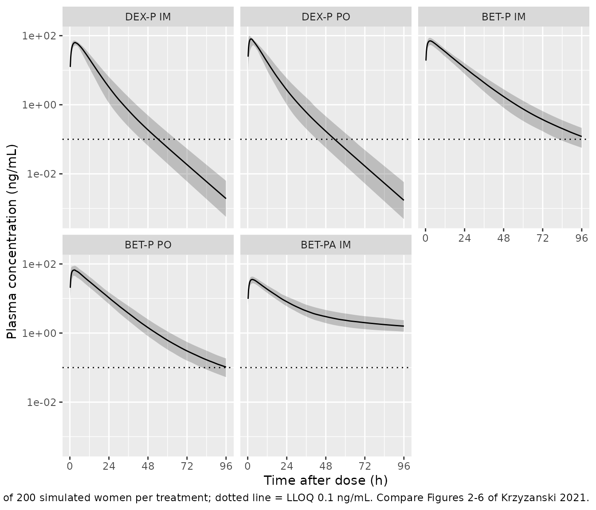
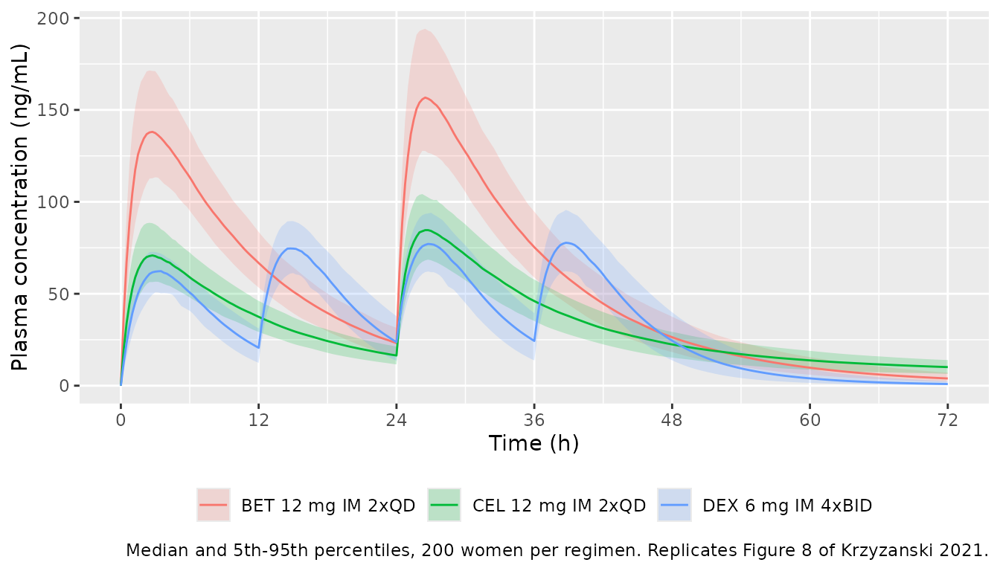

# Dexamethasone and betamethasone IM and oral (Krzyzanski 2021)

## Model and source

Krzyzanski et al. (2021) fitted the dexamethasone (DEX) and
betamethasone (BET) data **independently**, each with its own
two-compartment model, so the paper contributes two model files that
share this vignette:

- `Krzyzanski_2021_dexamethasone`: Two-compartment population PK model
  for dexamethasone after single 6 mg doses of dexamethasone phosphate
  given intramuscularly or orally to healthy nonpregnant Indian women,
  with separate first-order absorption from an IM and an oral depot.
  Clearances and volumes are apparent (divided by the IM bioavailability
  FIM); oral bioavailability is relative to IM (Fr = FPO / FIM). No
  covariates.
- `Krzyzanski_2021_betamethasone`: Two-compartment population PK model
  for betamethasone after single 6 mg doses of betamethasone phosphate
  given intramuscularly or orally, or of a 1:1 betamethasone
  phosphate/acetate IM suspension (Celestone), to healthy nonpregnant
  Indian women. Three parallel first-order absorption depots: IM
  phosphate, oral phosphate, and a slow IM acetate depot (flip-flop
  terminal phase). Clearances and volumes are apparent (divided by the
  IM bioavailability FIM); oral and acetate bioavailabilities are
  relative to IM phosphate. No covariates.
- Citation: Krzyzanski W, Milad MA, Jobe AH, Peppard T, Bies RR, Jusko
  WJ. Population pharmacokinetic modeling of intramuscular and oral
  dexamethasone and betamethasone in Indian women. J Pharmacokinet
  Pharmacodyn. 2021;48(2):261-272. <doi:10.1007/s10928-020-09730-z>
- Article (open access): <https://doi.org/10.1007/s10928-020-09730-z>
- Supplement (NONMEM control stream for BET; Tables S1-S2): Electronic
  Supplementary Material 1 and 2 of the article.

## Population

Forty-eight healthy, nonpregnant Indian women (ages 22-39 years, body
weight 47.0-68.7 kg, mean 56.8 kg, BMI 20.6-25.0 kg/m^2) took part in an
open-label, randomized, two-period partial crossover study (NCT03668860;
Krzyzanski 2021 Tables 1-2). Each woman received two of five single-dose
treatments, each delivering 6 mg of the free-alcohol steroid:

| Treatment | Route | Formulation | n |
|----|----|----|----|
| A (DEX-P IM) | IM | dexamethasone phosphate solution | 12 |
| B (BET-P IM) | IM | betamethasone phosphate solution | 12 |
| C (BET-PA IM) | IM | 3 mg betamethasone phosphate + 3 mg betamethasone acetate suspension (Celestone) | 24 |
| D (DEX-P PO) | PO | 0.5 mg dexamethasone phosphate tablets | 24 |
| E (BET-P PO) | PO | 0.5 mg betamethasone phosphate tablets | 24 |

Plasma was sampled to 96 h after each dose. The DEX model was fitted to
578 concentrations (103 below the 0.1 ng/mL LLOQ) from the 36 women who
received DEX; the BET model to 949 concentrations (19 below LLOQ) from
all 48 women. The homogeneous population precluded a covariate analysis,
so neither model carries covariates. The same information is available
programmatically via
`readModelDb("Krzyzanski_2021_dexamethasone")()$population`.

## Source trace

Model equations are Krzyzanski 2021 Eqs 1-7 (structure), Eq 10
(log-normal IIV) and Eq 11 (additive residual error on log
concentrations, i.e. `lnorm`). The supplement’s BET NONMEM control
stream confirms the structure: five compartments (IM, plasma,
peripheral, PO, IM acetate), `F4 = FR`, `F5 = FRA`, the IM phosphate
depot as the bioavailability reference, and `Y = LOG(A(2)/V) + EPS(1)`.

| Parameter | DEX | BET | Source location |
|----|----|----|----|
| `lcl` CL/FIM (L/h) | 9.29 | 5.95 | Tables 3 / 4; BET supplement `$THETA 1` |
| `lvc` Vp/FIM (L) | 51.3 | 67.5 | Tables 3 / 4; `$THETA 2` |
| `lq` CLD/FIM (L/h) | 0.538 | 0.173 | Tables 3 / 4; `$THETA 8` |
| `lvp` VT/FIM (L) | 5.06 | 4.94 | Tables 3 / 4; `$THETA 9` |
| `lka_im` kaIM (1/h) | 0.460 | 0.971 | Tables 3 / 4; `$THETA 3` |
| `lka_oral` kaPO (1/h) | 0.936 | 1.21 | Tables 3 / 4; `$THETA 5` |
| `lka_im_acetate` kaIMa (1/h) | – | 0.00638 | Table 4; `$THETA 4` |
| `lfdepot_oral` Fr = FPO/FIM | 1.04 | 0.935 | Tables 3 / 4, Eq 7; `$THETA 6` |
| `lfdepot_im_acetate` Fra = FIMa/FIM | – | 0.819 | Table 4, Eq 7; `$THETA 7` |
| `etalcl` omega^2 | 0.0265 | 0.0210 | Tables 3 / 4 |
| `etalvc` omega^2 | 0 (fixed; omitted) | 0.0188 | Tables 3 / 4 |
| cov(`etalcl`, `etalvc`) | – | 0.0155 | Table 4; `$OMEGA BLOCK(2)` |
| `etalka_im` omega^2 | 0.0633 | 0.0441 | Tables 3 / 4 |
| `etalka_oral` omega^2 | 0.395 | 0.241 | Tables 3 / 4 |
| `etalka_im_acetate` omega^2 | – | 0.147 | Table 4 |
| `etalfdepot_oral` omega^2 | – | 0.0182 | Table 4 |
| `etalfdepot_im_acetate` omega^2 | – | 0.00773 | Table 4 |
| `expSd` = sqrt(sigma^2) | sqrt(0.0455) | sqrt(0.0211) | Tables 3 / 4; `$SIGMA` |

The steady-state volumes quoted in the abstract are reproduced from the
table values: Vss/FIM = 51.3 + 5.06 = 56.4 L (DEX) and 67.5 + 4.94 =
72.4 L (BET).

``` r

dex_ini <- rxode2::rxode(readModelDb("Krzyzanski_2021_dexamethasone"))$iniDf
#> ℹ parameter labels from comments will be replaced by 'label()'
bet_ini <- rxode2::rxode(readModelDb("Krzyzanski_2021_betamethasone"))$iniDf
#> ℹ parameter labels from comments will be replaced by 'label()'
theta <- function(ini, nm) exp(ini$est[ini$name == nm])
vss <- c(
  DEX = theta(dex_ini, "lvc") + theta(dex_ini, "lvp"),
  BET = theta(bet_ini, "lvc") + theta(bet_ini, "lvp")
)
vss
#>   DEX   BET 
#> 56.36 72.44
# Abstract: Vss/FIM = 56.4 L (DEX) and 72.4 L (BET).
stopifnot(abs(vss - c(56.4, 72.4)) < 0.05)
```

## Dosing the models

Both models use numbered parallel absorption depots. Doses are in mg of
the free-alcohol steroid and `Cc` is in ng/mL.

| Compartment | Route / formulation           | Bioavailability    |
|-------------|-------------------------------|--------------------|
| `depot1`    | IM phosphate (DEX-P or BET-P) | 1 (reference, FIM) |
| `depot2`    | oral phosphate tablets        | `Fr`               |
| `depot3`    | IM acetate (BET model only)   | `Fra`              |

A Celestone (BET-PA) injection is split between two depots: half of the
dose as phosphate into `depot1` and half as acetate into `depot3`.

## Virtual cohort and simulation of the five treatments

The observed data are not public. Each treatment is simulated in 200
virtual women over the 96 h sampling window. No covariates are needed.

``` r

rxode2::rxSetSeed(20210103)
n_arm <- 200L
obs_times <- sort(unique(c(seq(0, 6, by = 0.25), 7:96)))

# One cohort as a self-contained event table. `id_offset` keeps subject IDs
# disjoint across arms so rxSolve cannot merge subjects.
make_arm <- function(n, treatment, cmts, amts, dose_times = 0, id_offset = 0L) {
  ids <- id_offset + seq_len(n)
  doses <- tidyr::expand_grid(
    id = ids,
    time = dose_times,
    dose_row = seq_along(cmts)
  ) |>
    mutate(
      evid = 1L,
      cmt = cmts[dose_row],
      amt = amts[dose_row]
    ) |>
    select(-dose_row)
  obs <- tidyr::expand_grid(id = ids, time = obs_times) |>
    mutate(evid = 0L, cmt = "central", amt = 0)
  bind_rows(doses, obs) |>
    mutate(treatment = treatment) |>
    arrange(id, time, desc(evid))
}

events_dex <- bind_rows(
  make_arm(n_arm, "DEX-P IM", "depot1", 6, id_offset = 0L),
  make_arm(n_arm, "DEX-P PO", "depot2", 6, id_offset = n_arm)
)
events_bet <- bind_rows(
  make_arm(n_arm, "BET-P IM", "depot1", 6, id_offset = 0L),
  make_arm(n_arm, "BET-P PO", "depot2", 6, id_offset = n_arm),
  make_arm(n_arm, "BET-PA IM", c("depot1", "depot3"), c(3, 3), id_offset = 2L * n_arm)
)
stopifnot(
  !anyDuplicated(unique(events_dex[, c("id", "time", "evid", "cmt")])),
  !anyDuplicated(unique(events_bet[, c("id", "time", "evid", "cmt")]))
)
```

``` r

mod_dex <- readModelDb("Krzyzanski_2021_dexamethasone")
mod_bet <- readModelDb("Krzyzanski_2021_betamethasone")

sim_dex <- rxode2::rxSolve(mod_dex, events = events_dex, keep = "treatment") |>
  as.data.frame()
#> ℹ parameter labels from comments will be replaced by 'label()'
sim_bet <- rxode2::rxSolve(mod_bet, events = events_bet, keep = "treatment") |>
  as.data.frame()
#> ℹ parameter labels from comments will be replaced by 'label()'

sim_all <- bind_rows(
  sim_dex |> mutate(id = id, drug = "DEX"),
  sim_bet |> mutate(id = id + 10000L, drug = "BET")
) |>
  mutate(treatment = factor(
    treatment,
    levels = c("DEX-P IM", "DEX-P PO", "BET-P IM", "BET-P PO", "BET-PA IM")
  ))
```

### Replicate Figures 2-6

``` r

# Replicates the model-predicted bands of the VPCs in Figures 3-6 of
# Krzyzanski 2021 (median and 5th-95th percentiles by treatment); Figure 2 is
# the matching observed-data spaghetti plot.
sim_all |>
  filter(time > 0) |>
  group_by(treatment, time) |>
  summarise(
    Q05 = quantile(Cc, 0.05),
    Q50 = quantile(Cc, 0.50),
    Q95 = quantile(Cc, 0.95),
    .groups = "drop"
  ) |>
  ggplot(aes(time, Q50)) +
  geom_ribbon(aes(ymin = Q05, ymax = Q95), alpha = 0.25) +
  geom_line() +
  geom_hline(yintercept = 0.1, linetype = "dotted") +
  facet_wrap(~treatment) +
  scale_y_log10() +
  scale_x_continuous(breaks = seq(0, 96, by = 24)) +
  labs(
    x = "Time after dose (h)", y = "Plasma concentration (ng/mL)",
    caption = paste(
      "Median and 5th-95th percentiles of 200 simulated women per treatment;",
      "dotted line = LLOQ 0.1 ng/mL. Compare Figures 2-6 of Krzyzanski 2021."
    )
  )
```



## PKNCA validation against Supplementary Table S1

Supplementary Table S1 lists the mean (SD) over individual model
predictions of Cmax, tmax and terminal half-life for each treatment,
where the paper took the half-life from the 95 and 96 h points only.
PKNCA computes Cmax, tmax and the half-life with its automatic
terminal-phase selection. The paper’s two-point half-life is computed
separately below.

``` r

sim_nca <- sim_all |>
  filter(!is.na(Cc)) |>
  select(id, time, Cc, treatment)
# Guarantee a time-zero row per subject (pre-dose Cc = 0 for extravascular).
sim_nca <- bind_rows(
  sim_nca,
  sim_nca |> distinct(id, treatment) |> mutate(time = 0, Cc = 0)
) |>
  distinct(id, treatment, time, .keep_all = TRUE) |>
  arrange(treatment, id, time)

dose_df <- bind_rows(
  events_dex |> mutate(id = id),
  events_bet |> mutate(id = id + 10000L)
) |>
  filter(evid == 1) |>
  group_by(id, time, treatment) |>
  summarise(amt = sum(amt), .groups = "drop")

conc_obj <- PKNCA::PKNCAconc(sim_nca, Cc ~ time | treatment + id,
                             concu = "ng/mL", timeu = "h")
dose_obj <- PKNCA::PKNCAdose(dose_df, amt ~ time | treatment + id,
                             doseu = "mg")
intervals <- data.frame(
  start = 0, end = 96,
  cmax = TRUE, tmax = TRUE, half.life = TRUE
)
nca_res <- PKNCA::pk.nca(PKNCA::PKNCAdata(conc_obj, dose_obj, intervals = intervals))
```

``` r

# Table S1 reports means of individual values, so the simulated side is
# aggregated with the mean as well (ncaComparisonTable() defaults to median).
sim_mean <- as.data.frame(nca_res$result) |>
  filter(PPTESTCD %in% c("cmax", "tmax", "half.life")) |>
  group_by(treatment, PPTESTCD) |>
  summarise(PPORRES = mean(PPORRES, na.rm = TRUE), .groups = "drop")

published_s1 <- tibble::tribble(
  ~treatment,  ~cmax, ~tmax, ~half.life,
  "DEX-P IM",   62.5,  3.3,   7.5,
  "DEX-P PO",   78.9,  2.2,   7.6,
  "BET-P IM",   66.9,  2.8,  14.9,
  "BET-P PO",   65.9,  2.6,  18.7,
  "BET-PA IM",  35.8,  2.9,  77.6
)

cmp <- nlmixr2lib::ncaComparisonTable(
  simulated = sim_mean,
  reference = published_s1,
  by = "treatment",
  units = c(cmax = "ng/mL", tmax = "h", half.life = "h"),
  tolerance_pct = 20
)
knitr::kable(
  cmp,
  caption = "Simulated (mean of 200 per treatment) vs. Krzyzanski 2021 Table S1. * differs by >20%."
)
```

| NCA parameter | treatment | Reference | Simulated | % diff |
|:--------------|:----------|:----------|:----------|:-------|
| Cmax (ng/mL)  | DEX-P IM  | 62.5      | 63        | +0.9%  |
| Cmax (ng/mL)  | DEX-P PO  | 78.9      | 79.5      | +0.8%  |
| Cmax (ng/mL)  | BET-P IM  | 66.9      | 70.9      | +5.9%  |
| Cmax (ng/mL)  | BET-P PO  | 65.9      | 68.1      | +3.4%  |
| Cmax (ng/mL)  | BET-PA IM | 35.8      | 35.8      | -0.1%  |
| Tmax (h)      | DEX-P IM  | 3.3       | 3.29      | -0.3%  |
| Tmax (h)      | DEX-P PO  | 2.2       | 2.33      | +6.0%  |
| Tmax (h)      | BET-P IM  | 2.8       | 2.72      | -2.8%  |
| Tmax (h)      | BET-P PO  | 2.6       | 2.52      | -3.1%  |
| Tmax (h)      | BET-PA IM | 2.9       | 2.83      | -2.5%  |
| t½ (h)        | DEX-P IM  | 7.5       | 7.26      | -3.2%  |
| t½ (h)        | DEX-P PO  | 7.6       | 7.24      | -4.7%  |
| t½ (h)        | BET-P IM  | 14.9      | 16.6      | +11.6% |
| t½ (h)        | BET-P PO  | 18.7      | 16.8      | -10.3% |
| t½ (h)        | BET-PA IM | 77.6      | 88.4      | +13.9% |

Simulated (mean of 200 per treatment) vs. Krzyzanski 2021 Table S1. \*
differs by \>20%. {.table}

``` r

chk <- sim_mean |>
  filter(PPTESTCD == "cmax") |>
  inner_join(published_s1, by = "treatment") |>
  mutate(pct_diff = 100 * (PPORRES - cmax) / cmax)
chk
#> # A tibble: 5 × 7
#>   treatment PPTESTCD PPORRES  cmax  tmax half.life pct_diff
#>   <chr>     <chr>      <dbl> <dbl> <dbl>     <dbl>    <dbl>
#> 1 BET-P IM  cmax        70.9  66.9   2.8      14.9   5.93  
#> 2 BET-P PO  cmax        68.1  65.9   2.6      18.7   3.38  
#> 3 BET-PA IM cmax        35.8  35.8   2.9      77.6  -0.0677
#> 4 DEX-P IM  cmax        63.0  62.5   3.3       7.5   0.859 
#> 5 DEX-P PO  cmax        79.5  78.9   2.2       7.6   0.763
# Mean Cmax over 200 subjects is a centre statistic. A mis-transcribed
# clearance, volume, ka or bioavailability moves it by tens of percent.
stopifnot(all(abs(chk$pct_diff) < 12))
```

The Table S1 half-life used only the 95 and 96 h points. Reproducing
that definition:

``` r

hl_95_96 <- sim_all |>
  filter(time %in% c(95, 96)) |>
  select(treatment, id, time, Cc) |>
  tidyr::pivot_wider(names_from = time, values_from = Cc, names_prefix = "C") |>
  mutate(thalf = log(2) / log(C95 / C96)) |>
  group_by(treatment) |>
  summarise(mean_thalf = mean(thalf), sd_thalf = sd(thalf), .groups = "drop") |>
  inner_join(published_s1 |> select(treatment, published = half.life), by = "treatment")
hl_95_96 |>
  dplyr::rename(
    "Treatment" = treatment,
    "Simulated mean t1/2 (h)" = mean_thalf,
    "Simulated SD (h)" = sd_thalf,
    "Table S1 mean t1/2 (h)" = published
  ) |>
  knitr::kable(digits = 1)
```

| Treatment | Simulated mean t1/2 (h) | Simulated SD (h) | Table S1 mean t1/2 (h) |
|:----------|------------------------:|-----------------:|-----------------------:|
| DEX-P IM  |                     7.4 |              0.3 |                    7.5 |
| DEX-P PO  |                     7.3 |              0.2 |                    7.6 |
| BET-P IM  |                    17.1 |              1.0 |                   14.9 |
| BET-P PO  |                    17.2 |              0.9 |                   18.7 |
| BET-PA IM |                    90.6 |             24.7 |                   77.6 |

For DEX-P IM and PO, BET-P IM and BET-P PO the two-point half-life
matches the paper to within about 15%. The BET-PA IM value is longer
than Table S1 reports (77.6 h). With the typical parameters, the 95-96 h
slope still mixes the 17 h disposition phase and the 109 h acetate
absorption phase, and the simulated mean lies between them. Table S1
averages the post-hoc estimates of the 24 women who received BET-PA,
whereas this is a fresh simulation from the population estimates. See
Assumptions and deviations.

### Mean residence time (Eq 9)

The paper defines MRT = (Vss/FIM)/(CL/FIM) + 1/ka, with the effective ka
for BET-PA combining the two IM depots weighted by their
bioavailabilities.

``` r

mrt <- sim_all |>
  filter(time == 0) |>
  distinct(id, .keep_all = TRUE) |>
  mutate(
    ka_eff = case_when(
      treatment %in% c("DEX-P IM", "BET-P IM") ~ ka_im,
      treatment %in% c("DEX-P PO", "BET-P PO") ~ ka_oral,
      treatment == "BET-PA IM" ~ (1 + fra) / (1 / ka_im + fra / ka_im_acetate)
    ),
    mrt = (vc + vp) / cl + 1 / ka_eff
  ) |>
  group_by(treatment) |>
  summarise(mean_mrt = mean(mrt), sd_mrt = sd(mrt), .groups = "drop") |>
  mutate(published = c(7.81, 6.91, 12.1, 12.5, 96.5)[match(
    treatment, c("DEX-P IM", "DEX-P PO", "BET-P IM", "BET-P PO", "BET-PA IM")
  )])
mrt |>
  dplyr::rename(
    "Treatment" = treatment,
    "Simulated mean MRT (h)" = mean_mrt,
    "Simulated SD (h)" = sd_mrt,
    "Table S1 mean MRT (h)" = published
  ) |>
  knitr::kable(digits = 2)
```

| Treatment | Simulated mean MRT (h) | Simulated SD (h) | Table S1 mean MRT (h) |
|:----------|-----------------------:|-----------------:|----------------------:|
| DEX-P IM  |                   8.38 |             1.15 |                  7.81 |
| DEX-P PO  |                   7.51 |             1.42 |                  6.91 |
| BET-P IM  |                  13.36 |             1.19 |                 12.10 |
| BET-P PO  |                  12.98 |             1.09 |                 12.50 |
| BET-PA IM |                  86.98 |            30.19 |                 96.50 |

The simulated mean MRTs are within about 10% of Table S1.

## Mass balance

With the random effects removed, AUC(0-inf) x CL/FIM must equal the
bioavailable dose. This check does not depend on random draws.

``` r

typ_dex <- rxode2::zeroRe(mod_dex)
#> ℹ parameter labels from comments will be replaced by 'label()'
typ_bet <- rxode2::zeroRe(mod_bet)
#> ℹ parameter labels from comments will be replaced by 'label()'
long_grid <- c(seq(0, 24, by = 0.1), seq(25, 4000, by = 1))
mb_events <- function(cmts, amts) {
  bind_rows(
    tibble(id = 1L, time = 0, evid = 1L, cmt = cmts, amt = amts),
    tibble(id = 1L, time = long_grid, evid = 0L, cmt = "central", amt = 0)
  ) |>
    arrange(time, desc(evid))
}
trap <- function(s) sum(diff(s$time) * (head(s$Cc, -1) + tail(s$Cc, -1)) / 2)
mb <- tibble::tribble(
  ~case, ~model, ~cmts, ~amts, ~expected,
  "DEX-P IM", "dex", "depot1", 6, 6 / 9.29,
  "DEX-P PO", "dex", "depot2", 6, 6 * 1.04 / 9.29,
  "BET-P IM", "bet", "depot1", 6, 6 / 5.95,
  "BET-P PO", "bet", "depot2", 6, 6 * 0.935 / 5.95,
  "BET-PA IM", "bet", c("depot1", "depot3"), c(3, 3), (3 + 3 * 0.819) / 5.95
)
mb$simulated <- vapply(seq_len(nrow(mb)), function(i) {
  m <- if (mb$model[i] == "dex") typ_dex else typ_bet
  s <- as.data.frame(rxode2::rxSolve(m, mb_events(mb$cmts[[i]], mb$amts[[i]])))
  # ng*h/mL = ug*h/L; convert to mg*h/L to compare with dose (mg) / CL (L/h)
  trap(s) / 1000
}, numeric(1))
#> ℹ omega/sigma items treated as zero: 'etalcl', 'etalka_im', 'etalka_oral'
#> ℹ omega/sigma items treated as zero: 'etalcl', 'etalka_im', 'etalka_oral'
#> ℹ omega/sigma items treated as zero: 'etalcl', 'etalvc', 'etalka_im', 'etalka_im_acetate', 'etalka_oral', 'etalfdepot_oral', 'etalfdepot_im_acetate'
#> ℹ omega/sigma items treated as zero: 'etalcl', 'etalvc', 'etalka_im', 'etalka_im_acetate', 'etalka_oral', 'etalfdepot_oral', 'etalfdepot_im_acetate'
#> ℹ omega/sigma items treated as zero: 'etalcl', 'etalvc', 'etalka_im', 'etalka_im_acetate', 'etalka_oral', 'etalfdepot_oral', 'etalfdepot_im_acetate'
mb$pct_diff <- 100 * (mb$simulated - mb$expected) / mb$expected
mb |>
  select(case, expected, simulated, pct_diff) |>
  dplyr::rename(
    "Treatment" = case,
    "F x Dose / CL (mg*h/L)" = expected,
    "Simulated AUC0-4000 (mg*h/L)" = simulated,
    "% diff" = pct_diff
  ) |>
  knitr::kable(digits = 3)
```

| Treatment | F x Dose / CL (mg\*h/L) | Simulated AUC0-4000 (mg\*h/L) | % diff |
|:----------|------------------------:|------------------------------:|-------:|
| DEX-P IM  |                   0.646 |                         0.646 | -0.001 |
| DEX-P PO  |                   0.672 |                         0.672 | -0.010 |
| BET-P IM  |                   1.008 |                         1.008 |  0.001 |
| BET-P PO  |                   0.943 |                         0.943 | -0.001 |
| BET-PA IM |                   0.917 |                         0.917 |  0.000 |

``` r

# Same drawn parameters on both sides: only numerical error remains.
stopifnot(all(abs(mb$pct_diff) < 0.5))
```

## Antenatal regimens: Figure 8 and Supplementary Table S2

The paper simulated three WHO antenatal corticosteroid regimens in 200
women each: DEX-P 6 mg IM every 12 h x 4, BET-P 12 mg IM every 24 h x 2,
and BET-PA (Celestone) 12 mg IM every 24 h x 2. Table S2 reports the
median and 5th-95th percentiles of Cmax, Ctrough and AUC0-48 and
AUC0-72.

``` r

obs_times <- sort(unique(c(seq(0, 72, by = 0.25))))
events_reg_dex <- make_arm(n_arm, "DEX 6 mg IM 4xBID", "depot1", 6,
                           dose_times = c(0, 12, 24, 36), id_offset = 0L)
events_reg_bet <- bind_rows(
  make_arm(n_arm, "BET 12 mg IM 2xQD", "depot1", 12,
           dose_times = c(0, 24), id_offset = 0L),
  make_arm(n_arm, "CEL 12 mg IM 2xQD", c("depot1", "depot3"), c(6, 6),
           dose_times = c(0, 24), id_offset = n_arm)
)
sim_reg <- bind_rows(
  rxode2::rxSolve(mod_dex, events = events_reg_dex, keep = "treatment") |>
    as.data.frame() |> mutate(id = id),
  rxode2::rxSolve(mod_bet, events = events_reg_bet, keep = "treatment") |>
    as.data.frame() |> mutate(id = id + 10000L)
)
```

``` r

# Replicates Figure 8 of Krzyzanski 2021.
sim_reg |>
  group_by(treatment, time) |>
  summarise(
    Q05 = quantile(Cc, 0.05), Q50 = median(Cc), Q95 = quantile(Cc, 0.95),
    .groups = "drop"
  ) |>
  ggplot(aes(time, Q50, colour = treatment, fill = treatment)) +
  geom_ribbon(aes(ymin = Q05, ymax = Q95), alpha = 0.2, colour = NA) +
  geom_line() +
  scale_x_continuous(breaks = seq(0, 72, by = 12)) +
  labs(
    x = "Time (h)", y = "Plasma concentration (ng/mL)", colour = NULL, fill = NULL,
    caption = "Median and 5th-95th percentiles, 200 women per regimen. Replicates Figure 8 of Krzyzanski 2021."
  ) +
  theme(legend.position = "bottom")
```



``` r

reg_nca <- bind_rows(
  sim_reg |> filter(!is.na(Cc)) |> select(id, time, Cc, treatment),
  sim_reg |> distinct(id, treatment) |> mutate(time = 0, Cc = 0)
) |>
  distinct(id, treatment, time, .keep_all = TRUE) |>
  arrange(treatment, id, time)
reg_dose <- bind_rows(
  events_reg_dex |> mutate(id = id),
  events_reg_bet |> mutate(id = id + 10000L)
) |>
  filter(evid == 1) |>
  group_by(id, time, treatment) |>
  summarise(amt = sum(amt), .groups = "drop")
reg_intervals <- data.frame(
  start = c(0, 0), end = c(48, 72),
  cmax = c(FALSE, TRUE), auclast = c(TRUE, TRUE)
)
reg_res <- PKNCA::pk.nca(PKNCA::PKNCAdata(
  PKNCA::PKNCAconc(reg_nca, Cc ~ time | treatment + id, concu = "ng/mL", timeu = "h"),
  PKNCA::PKNCAdose(reg_dose, amt ~ time | treatment + id, doseu = "mg"),
  intervals = reg_intervals
))

reg_sim_long <- as.data.frame(reg_res$result) |>
  filter(PPTESTCD %in% c("cmax", "auclast")) |>
  mutate(window = paste0("0-", end, " h")) |>
  group_by(treatment, window, PPTESTCD) |>
  summarise(PPORRES = median(PPORRES), .groups = "drop")

published_s2 <- tibble::tribble(
  ~treatment,           ~window,  ~cmax,  ~auclast,
  "DEX 6 mg IM 4xBID",  "0-48 h", NA,     2366,
  "DEX 6 mg IM 4xBID",  "0-72 h", 71.6,   2521,
  "BET 12 mg IM 2xQD",  "0-48 h", NA,     3594,
  "BET 12 mg IM 2xQD",  "0-72 h", 144.2,  3861,
  "CEL 12 mg IM 2xQD",  "0-48 h", NA,     2021,
  "CEL 12 mg IM 2xQD",  "0-72 h", 77.4,   2342
)

cmp_reg <- nlmixr2lib::ncaComparisonTable(
  simulated = reg_sim_long,
  reference = published_s2,
  by = c("treatment", "window"),
  units = c(cmax = "ng/mL", auclast = "ng*h/mL"),
  tolerance_pct = 20
)
knitr::kable(
  cmp_reg,
  caption = "Simulated median vs. Krzyzanski 2021 Table S2 (median of 200). * differs by >20%."
)
```

| NCA parameter      | treatment         | window | Reference | Simulated | % diff |
|:-------------------|:------------------|:-------|:----------|:----------|:-------|
| Cmax (ng/mL)       | DEX 6 mg IM 4xBID | 0-72 h | 71.6      | 78        | +8.9%  |
| Cmax (ng/mL)       | BET 12 mg IM 2xQD | 0-72 h | 144       | 157       | +9.0%  |
| Cmax (ng/mL)       | CEL 12 mg IM 2xQD | 0-72 h | 77.4      | 84.9      | +9.7%  |
| AUClast (ng\*h/mL) | DEX 6 mg IM 4xBID | 0-48 h | 2370      | 2400      | +1.5%  |
| AUClast (ng\*h/mL) | DEX 6 mg IM 4xBID | 0-72 h | 2520      | 2560      | +1.6%  |
| AUClast (ng\*h/mL) | BET 12 mg IM 2xQD | 0-48 h | 3590      | 3690      | +2.8%  |
| AUClast (ng\*h/mL) | BET 12 mg IM 2xQD | 0-72 h | 3860      | 3980      | +3.2%  |
| AUClast (ng\*h/mL) | CEL 12 mg IM 2xQD | 0-48 h | 2020      | 2120      | +5.0%  |
| AUClast (ng\*h/mL) | CEL 12 mg IM 2xQD | 0-72 h | 2340      | 2460      | +5.0%  |

Simulated median vs. Krzyzanski 2021 Table S2 (median of 200). \*
differs by \>20%. {.table style="width:100%;"}

``` r

chk_reg <- reg_sim_long |>
  filter(PPTESTCD == "auclast") |>
  inner_join(published_s2, by = c("treatment", "window")) |>
  mutate(pct_diff = 100 * (PPORRES - auclast) / auclast)
chk_reg
#> # A tibble: 6 × 7
#>   treatment         window PPTESTCD PPORRES  cmax auclast pct_diff
#>   <chr>             <chr>  <chr>      <dbl> <dbl>   <dbl>    <dbl>
#> 1 BET 12 mg IM 2xQD 0-48 h auclast    3694.  NA      3594     2.78
#> 2 BET 12 mg IM 2xQD 0-72 h auclast    3984. 144.     3861     3.18
#> 3 CEL 12 mg IM 2xQD 0-48 h auclast    2123.  NA      2021     5.04
#> 4 CEL 12 mg IM 2xQD 0-72 h auclast    2459.  77.4    2342     5.01
#> 5 DEX 6 mg IM 4xBID 0-48 h auclast    2402.  NA      2366     1.54
#> 6 DEX 6 mg IM 4xBID 0-72 h auclast    2562.  71.6    2521     1.62
# Median AUC over 200 subjects is a centre statistic driven by CL/FIM and the
# relative bioavailabilities; a transcription error moves it by >10%.
stopifnot(all(abs(chk_reg$pct_diff) < 10))
```

Trough concentrations (Table S2 Ctrough; the paper does not state the
time at which the trough was taken):

``` r

published_ctrough <- c(
  "BET 12 mg IM 2xQD" = 26.4, "CEL 12 mg IM 2xQD" = 17.1, "DEX 6 mg IM 4xBID" = 33.1
)
sim_reg |>
  filter(time %in% c(12, 24, 36, 48)) |>
  group_by(treatment, time) |>
  summarise(median_Cc = median(Cc), .groups = "drop") |>
  tidyr::pivot_wider(names_from = time, values_from = median_Cc, names_prefix = "t = ") |>
  mutate(`Table S2 Ctrough` = unname(published_ctrough[as.character(treatment)])) |>
  dplyr::rename("Regimen" = treatment) |>
  knitr::kable(digits = 1, caption = "Simulated median Cc (ng/mL) at candidate trough times vs. Table S2 Ctrough.")
```

| Regimen           | t = 12 | t = 24 | t = 36 | t = 48 | Table S2 Ctrough |
|:------------------|-------:|-------:|-------:|-------:|-----------------:|
| BET 12 mg IM 2xQD |   66.7 |   23.2 |   75.3 |   26.4 |             26.4 |
| CEL 12 mg IM 2xQD |   37.5 |   16.4 |   46.0 |   22.4 |             17.1 |
| DEX 6 mg IM 4xBID |   20.6 |   23.7 |   24.3 |   24.5 |             33.1 |

Simulated median Cc (ng/mL) at candidate trough times vs. Table S2
Ctrough. {.table}

The BET-P regimen’s Table S2 trough (26.4 ng/mL) matches the simulated
median at 48 h. The CEL trough (17.1 ng/mL) is closest to the simulated
median at 24 h. No candidate trough time reproduces the DEX value (33.1
ng/mL), which is higher than the simulated median at any of 12, 24, 36
or 48 h. Because the trough time is not stated, Ctrough is reported here
but not asserted.

The simulated median AUCs agree with Table S2 to within 5%, and so do
their 5th-95th percentiles (for example, DEX AUC0-72 about 2000-3300
ng\*h/mL simulated vs. 1948-3272 reported). The simulated median Cmax is
about 9% above Table S2 for all three regimens. Table S2’s Cmax
percentile ranges are also much narrower than the simulated ones:
69.6-74.0 ng/mL reported for DEX vs. about 63-96 ng/mL simulated, even
though the AUC ranges agree.

## Assumptions and deviations

- **Two model files, one vignette.** The paper fitted DEX and BET
  independently (Methods, “Parameter estimation and simulations”). Each
  is a separate model file.
- **Apparent parameters.** Without IV data, FIM is not identifiable. All
  clearances and volumes are divided by FIM and the IM phosphate depot
  is the bioavailability reference (FIM = 1). `Fr` and `Fra` are
  relative bioavailabilities (Eq 7), so values above 1 are allowed (DEX
  `Fr` = 1.04).
- **DEX IIV on Vp/FIM.** Table 3 reports this variance as 0, fixed after
  it was estimated near zero. It is omitted from the model rather than
  written as a zero-variance eta, which would make OMEGA singular for
  simulation.
- **IIV on Fra.** The Results text says the Fra variance “warranted
  setting this parameter at 0” but that it “was kept as a model
  parameter”. Table 4 and the supplement control stream both carry it at
  0.00773, so it is kept.
- **Supplement comment typo.** In the supplement’s `$OMEGA` block, the
  variance 0.0182 is commented `;6. FRA`. It is the Fr (ETA(6))
  variance, as Table 4 confirms.
- **Residual error.** Eq 11 and the control stream model log
  concentrations with an additive error, encoded as `lnorm(expSd)` with
  `expSd` = sqrt(sigma^2). The paper handled BLQ data with Beal M3. To
  reproduce that when fitting, supply `CENS`/`LIMIT` columns in the
  data; this does not affect simulation.
- **MRT for BET-PA.** Eq 9 prints the effective BET-PA absorption rate
  as (Fr + Fra)/(Fr/kaIM + Fra/kaIMa), using the oral relative
  bioavailability Fr. In BET-PA, both depots are intramuscular and the
  phosphate depot has bioavailability 1 by construction, so this
  vignette uses (1 + Fra)/(1/kaIM + Fra/kaIMa). With the typical values
  the two forms give MRTs of 83 h and 86 h. Either is below the Table S1
  mean of 96.5 (SD 33.2) h, which averages post-hoc individual
  estimates.
- **Individual vs. population descriptors.** Table S1 summarises
  post-hoc (individual) predictions for the women actually studied. The
  comparisons above use fresh simulations from the population estimates,
  so small differences are expected. The largest difference is the
  BET-PA two-point half-life: the simulation gives about 90 h against
  77.6 h. This is recorded, not tuned.
- **Table S2 Cmax and Ctrough.** The trough sampling time is not stated,
  and the DEX value is not reproduced at any candidate time (see above).
  The simulated median Cmax is about 9% above Table S2 for every
  regimen, and Table S2’s Cmax 5th-95th percentile ranges are much
  narrower than a simulation with the published IIV produces, although
  the AUC percentiles agree. How the paper summarised Cmax and Ctrough
  could not be established. The regimen gate therefore uses median AUCs
  only.
- **No correction notice** for this article was listed in Europe PMC
  (PMID 33389521) as of 2026-09-27.
