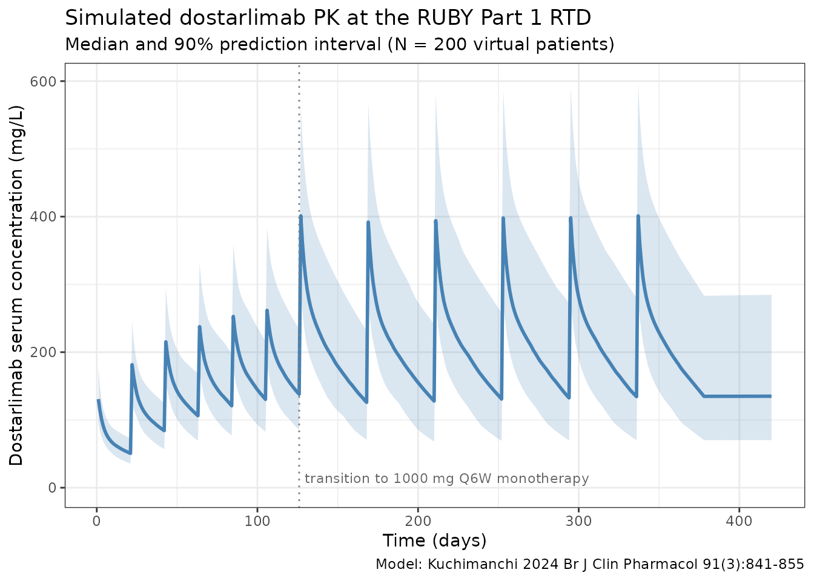
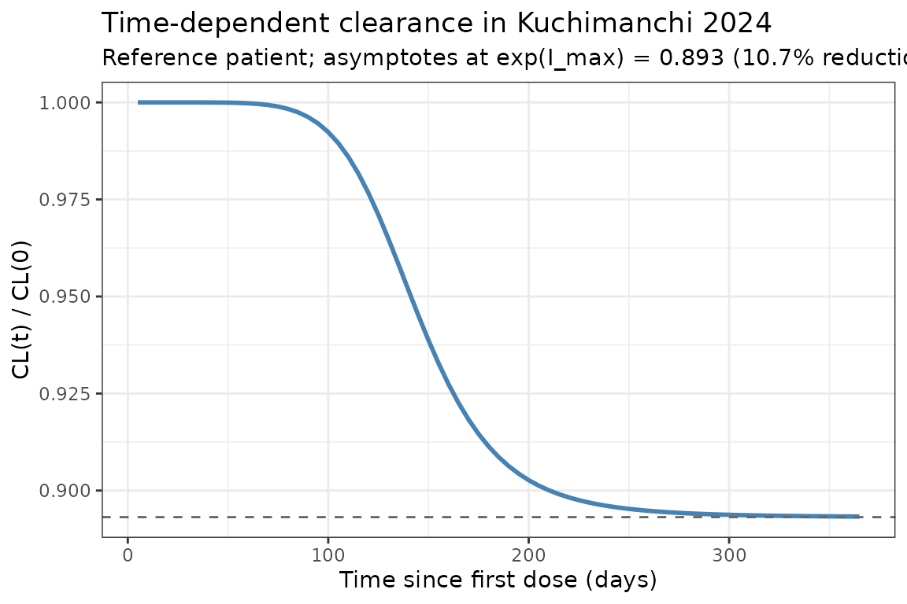

# Kuchimanchi_2024_dostarlimab

## Model and source

- Citation: Kuchimanchi M, Jorgensen TL, Hanze E, et al. Population
  pharmacokinetics and exposure-response relationships of dostarlimab in
  primary advanced or recurrent endometrial cancer in part 1 of RUBY.
  *Br J Clin Pharmacol.* 2025;91(3):841-855.
  <doi:%5B10.1111/bcp.16325>\](<https://doi.org/10.1111/bcp.16325>)
- Description: Two-compartment population PK model for dostarlimab
  (anti-PD-1 IgG4) with sigmoid I_max time-dependent clearance. The
  model is the **updated** dostarlimab population PK model fit to a
  pooled GARNET (advanced solid tumours) plus RUBY Part 1 (primary
  advanced or recurrent endometrial cancer with carboplatin-paclitaxel)
  dataset; it succeeds the GARNET-only Melhem 2022 model.
- Modality: Therapeutic monoclonal antibody (IgG4 hinge-stabilized), IV
  infusion.

Dostarlimab is a humanised anti-PD-1 monoclonal antibody. The
Kuchimanchi 2024 update incorporates 7,957 PK observations from 868
patients pooled from GARNET (NCT02715284, n = 636, dostarlimab
monotherapy at 1-10 mg/kg Q2W or 500 mg Q3W / 1000 mg Q6W flat dosing)
and RUBY Part 1 (NCT03981796, n = 232, dostarlimab 500 mg Q3W +
carboplatin AUC 5 + paclitaxel 175 mg/m^2 Q3W for 6 cycles, then 1000 mg
Q6W up to 3 years). The recommended therapeutic dose evaluated in this
analysis is **500 mg IV Q3W for 6 cycles followed by 1000 mg IV Q6W**.

Structural model (Kuchimanchi 2024 Results, equation block):

``` math
  \mathrm{CL}(t) = \mathrm{CL}_{\text{base}} \cdot
  \exp\!\left(I_{\max}\cdot \dfrac{t^{\mathrm{Hill}}}
  {T_{50}^{\mathrm{Hill}} + t^{\mathrm{Hill}}}\right)
```

with $`I_{\max} = -0.113`$ (max log-CL reduction;
$`1 - \exp(I_{\max}) = 0.107`$, matching the paper’s “maximum decrease
in CL over time was estimated to be 10.7%”), $`T_{50} = 145`$ days, and
$`\mathrm{Hill} = 7.05`$. Allometric weight scaling uses reference
weight 70 kg (exponent 0.523 on CL, 0.48 on Vc and Vp).

The covariates carried in the final model are body weight, age, time-
varying albumin, time-varying ALT, sex (with female as the reference
category), and a binary monotherapy-vs-combination indicator on CL.
Anti-drug antibodies, race / ethnicity, tumour type, hepatic and renal
impairment, ECOG PS, and concomitant immunomodulators were tested but
either did not enter the model or did not exceed the prespecified
clinical-relevance threshold (Kuchimanchi 2024, *Predicted exposure and
clinical relevance of covariates*).

## Population

The final-model analysis set was 868 patients with **7,957 PK
observations** pooled from GARNET (n = 636) and RUBY Part 1 (n = 232,
with one patient excluded from PopPK; the original Methods report 233
patients with PK data). Demographics (Kuchimanchi 2024 Table 1):

- Median age 64 years (range 24-86)
- 82.0% female (100% female in RUBY Part 1; 75.5% in GARNET)
- Median weight 73.0 kg (range 34-182)
- Race/ethnicity: 74.6% White, 5.4% Black/African American, 2.3% Asian,
  0.6% American Indian/Alaska Native, 0.1% Native Hawaiian/Pacific
  Islander, 0.7% Other, 1.8% Unknown, 14.5% Not reported
- Median albumin 39 g/L (range 19-51)
- Median ALT 17 U/L (range 2.9-243); reference patient and the equation
  denominator both use 18 U/L (see *Errata* below)
- Hepatic impairment: 88.8% normal, 10.6% mild, 0.6% moderate; renal
  impairment: 35.1% normal, 45.7% mild, 18.9% moderate, 0.3% severe.
  Neither hepatic nor renal status affected dostarlimab PK.
- ADAs: 11.6% ever-positive in the analysis set (15.9% in GARNET; 0% in
  RUBY because RUBY samples for ADAs were not yet evaluated at the
  August 2022 cut). ADAs did not affect CL.

The reference patient defined in the Methods section (*PopPK model
development*, last paragraph) is female, 70 kg, 64 years old, with
baseline albumin 39 g/L and ALT 18 U/L (the Forest-plot caption Figure 2
lists ALT 17 U/L instead).

The same metadata is available programmatically via
`readModelDb("Kuchimanchi_2024_dostarlimab")$population`.

## Source trace

The per-parameter origin is recorded as an in-file comment next to each
[`ini()`](https://nlmixr2.github.io/rxode2/reference/ini.html) entry in
`inst/modeldb/specificDrugs/Kuchimanchi_2024_dostarlimab.R`. The table
below collects them in one place for review.

| Parameter (model name) | Value | Source |
|----|----|----|
| `lcl` (CL_base, L/day) | log(0.00732\*24) | Kuchimanchi 2024 Table 2, CL = 0.00732 L/h |
| `lvc` (Vc_base, L) | log(3.09) | Kuchimanchi 2024 Table 2, Vc |
| `lq` (Q, L/day) | log(0.0191\*24) | Kuchimanchi 2024 Table 2, Q = 0.0191 L/h |
| `lvp` (Vp, L) | log(2.48) | Kuchimanchi 2024 Table 2, Vp |
| `lImax` (log\|I_max\|) | log(0.113) | Kuchimanchi 2024 Table 2, I_max = -0.113 |
| `lt50` (T50, days) | log(145) | Kuchimanchi 2024 Table 2, T50 = 145 days |
| `lhill` (Hill) | log(7.05) | Kuchimanchi 2024 Table 2, Hill |
| `e_wt_cl` | 0.523 | Kuchimanchi 2024 Table 2, Effect of WT on CL |
| `e_wt_vc_vp` | 0.48 | Kuchimanchi 2024 Table 2, Effect of WT on Vc and Vp |
| `e_age_cl` | -0.238 | Kuchimanchi 2024 Table 2, Effect of age on CL |
| `e_alb_cl` | -0.922 | Kuchimanchi 2024 Table 2, Effect of ALB on CL |
| `e_alt_cl` | -0.0623 | Kuchimanchi 2024 Table 2, Effect of ALT on CL |
| `e_alb_vc` | -0.132 | Kuchimanchi 2024 Table 2, Effect of ALB on Vc |
| `e_sex_cl` | 0.15 | Kuchimanchi 2024 Table 2, Effect of male on CL |
| `e_sex_vc` | 0.137 | Kuchimanchi 2024 Table 2, Effect of male on Vc |
| `e_combo_cl` | -0.0779 | Kuchimanchi 2024 Table 2, Effect of combination therapy on CL |
| IIV block `etalcl + etalvc` | c(0.0563, 0.0193, 0.0278) | Kuchimanchi 2024 Table 2 (omega^2 CL, cov(CL,Vc), omega^2 Vc) |
| `etalImax` | 0.903 | Kuchimanchi 2024 Table 2, omega^2 I_max |
| `propSd` | 0.16 | Kuchimanchi 2024 Table 2, proportional residual GARNET |
| `addSd` (mg/L) | 4.22 | Kuchimanchi 2024 Table 2, additive residual |

Equations:

- `d/dt(central)` and `d/dt(peripheral1)`: standard two-compartment IV
  micro-constant form (kel = cl/vc, k12 = q/vc, k21 = q/vp). Source:
  Kuchimanchi 2024 Results, equation block (“The final PopPK model is
  mathematically described by the following equations”).
- Time-dependent CL via exp-Hill function of time since first dose: same
  equation block.
- Covariate effects: `(cov / ref)^theta` (power) for continuous
  covariates `WT`, `AGE`, `ALB`, `ALT`; `(1 + theta * indicator)`
  (multiplicative) for the categorical sex and combination-therapy
  effects.

## Virtual cohort

Original observed data are not publicly available. The simulations below
use a virtual cohort whose covariate distributions approximate the
published analysis-set demographics (Kuchimanchi 2024 Table 1).

``` r

set.seed(2024)
n_subj <- 200

cohort <- tibble(
  ID            = seq_len(n_subj),
  WT            = pmin(pmax(rlnorm(n_subj, log(73), 0.27), 34), 182),  # Table 1: median 73 kg, range 34-182
  AGE           = pmin(pmax(rnorm(n_subj, 62.7, 11),       24),  86),  # Table 1: mean 62.7 yr (overall), range 24-86
  ALB           = pmin(pmax(rnorm(n_subj, 38.5, 5.2),      19,   51)), # Table 1: mean 38.5 g/L, range 19-51
  ALT           = pmin(pmax(rlnorm(n_subj, log(17), 0.5),  2.9, 243)), # Table 1: median 17, range 2.9-243
  SEXF          = rbinom(n_subj, 1, 0.820),                            # Table 1: 82.0% female
  COADMIN_CHEMO = 0L                                                   # default: monotherapy
)
```

The simulated cohort defaults to the **monotherapy** regimen
(COADMIN_CHEMO = 0). For RUBY Part 1’s combination phase, set the
indicator to 1 in the event table only for the cycles where chemotherapy
is co-administered (cycles 1-6 of RUBY Part 1; cycles 7+ revert to 1000
mg Q6W monotherapy and the indicator should switch back to 0).

The recommended therapeutic dose for the dostarlimab + chemotherapy
indication evaluated in RUBY Part 1 is **500 mg IV Q3W with
carboplatin/paclitaxel for 6 cycles followed by 1000 mg IV Q6W
monotherapy**. The simulation runs for one year of dosing.

The `COADMIN_CHEMO` indicator switches per row (per time point) so that
only cycles 1-6 are tagged as combination therapy. Because the indicator
only multiplies CL_base in the structural model, switching it
mid-simulation simply removes the 7.79% CL reduction once the patient
transitions to monotherapy maintenance.

``` r

# RUBY Part 1 RTD schedule (days from first dose).
loading_doses_d <- seq(0, by = 21, length.out = 6)              # 500 mg Q3W x 6 (cycles 1-6 with CP)
maint_start_d   <- max(loading_doses_d) + 21                    # first 1000 mg dose 21 d after the 6th 500 mg
maint_doses_d   <- seq(maint_start_d, by = 42, length.out = 8)  # 1000 mg Q6W (cycles 7+)

obs_times_d <- sort(unique(c(seq(0, 365, by = 1), loading_doses_d, maint_doses_d)))

build_events <- function(pop) {
  pop_baseline <- pop |> select(-COADMIN_CHEMO)
  d_load <- pop_baseline |>
    tidyr::crossing(TIME = loading_doses_d) |>
    mutate(AMT = 500, EVID = 1, CMT = "central", DUR = 0.5 / 24, DV = NA_real_,
           treatment = "RUBY RTD 500 mg Q3W x6 -> 1000 mg Q6W",
           COADMIN_CHEMO = 1L)
  d_maint <- pop_baseline |>
    tidyr::crossing(TIME = maint_doses_d) |>
    mutate(AMT = 1000, EVID = 1, CMT = "central", DUR = 0.5 / 24, DV = NA_real_,
           treatment = "RUBY RTD 500 mg Q3W x6 -> 1000 mg Q6W",
           COADMIN_CHEMO = 0L)
  d_obs <- pop_baseline |>
    tidyr::crossing(TIME = obs_times_d) |>
    mutate(AMT = NA_real_, EVID = 0, CMT = "central", DUR = NA_real_,
           DV = NA_real_, treatment = "RUBY RTD 500 mg Q3W x6 -> 1000 mg Q6W",
           COADMIN_CHEMO = ifelse(TIME < maint_start_d, 1L, 0L))
  bind_rows(d_load, d_maint, d_obs) |>
    arrange(ID, TIME, dplyr::desc(EVID)) |>
    as.data.frame()
}

events <- build_events(cohort)
```

## Simulation

``` r

mod <- readModelDb("Kuchimanchi_2024_dostarlimab")
sim <- rxSolve(mod, events = events, returnType = "data.frame")
```

## Concentration-time profiles

Median and 5-95th percentile envelope across the virtual cohort under
the RUBY Part 1 recommended therapeutic dose:

``` r

sim_summary <- sim |>
  dplyr::filter(time > 0) |>
  dplyr::group_by(time) |>
  dplyr::summarise(
    median = stats::median(Cc, na.rm = TRUE),
    lo     = stats::quantile(Cc, 0.05, na.rm = TRUE),
    hi     = stats::quantile(Cc, 0.95, na.rm = TRUE),
    .groups = "drop"
  )

ggplot(sim_summary, aes(time, median)) +
  geom_ribbon(aes(ymin = lo, ymax = hi), alpha = 0.2, fill = "steelblue") +
  geom_line(linewidth = 1, colour = "steelblue") +
  geom_vline(xintercept = maint_start_d, linetype = "dotted", colour = "grey50") +
  annotate("text", x = maint_start_d, y = 0,
           label = "transition to 1000 mg Q6W monotherapy",
           hjust = -0.02, vjust = -0.5, size = 3, colour = "grey40") +
  labs(
    x = "Time (days)",
    y = "Dostarlimab serum concentration (mg/L)",
    title = "Simulated dostarlimab PK at the RUBY Part 1 RTD",
    subtitle = paste0("Median and 90% prediction interval (N = ",
                      n_subj, " virtual patients)"),
    caption = "Model: Kuchimanchi 2024 Br J Clin Pharmacol 91(3):841-855"
  ) +
  theme_bw()
```



## Time-dependent clearance

Kuchimanchi 2024 reports time-dependent clearance with a sigmoid I_max
function of time since first dose. The typical-value CL profile below
reproduces the time course at the reference patient (deterministic, etas
= 0):

``` r

t_grid <- seq(0, 365, by = 5)
events_cl <- data.frame(
  ID            = 1, WT = 70, AGE = 64, ALB = 39, ALT = 18, SEXF = 1,
  COADMIN_CHEMO = 0L,
  TIME = c(0, t_grid),
  AMT  = c(500, rep(NA_real_, length(t_grid))),
  EVID = c(1,  rep(0, length(t_grid))),
  CMT  = "central",
  DUR  = c(0.5 / 24, rep(NA_real_, length(t_grid))),
  DV   = NA_real_
)
sim_cl <- rxSolve(
  mod, events = events_cl,
  params = c(WT = 70, AGE = 64, ALB = 39, ALT = 18, SEXF = 1,
             COADMIN_CHEMO = 0,
             etalcl = 0, etalvc = 0, etalImax = 0),
  omega  = NA,
  returnType = "data.frame"
)
sim_cl <- sim_cl[sim_cl$time > 0, ]

ggplot(sim_cl, aes(time, cl / cl_base)) +
  geom_line(linewidth = 1, colour = "steelblue") +
  geom_hline(yintercept = exp(-0.113), linetype = "dashed", colour = "grey40") +
  labs(
    x = "Time since first dose (days)",
    y = "CL(t) / CL(0)",
    title = "Time-dependent clearance in Kuchimanchi 2024",
    subtitle = "Reference patient; asymptotes at exp(I_max) = 0.893 (10.7% reduction)"
  ) +
  theme_bw()
```



The reduction in steady-state CL relative to t = 0 is 10.7%, less than
the 14.9% seen in the GARNET-only Melhem 2022 model. Kuchimanchi 2024
attributes the smaller steady-state effect (and the steeper Hill = 7.05
versus 5.29 in Melhem 2022) to the sparse RUBY PK sampling at the time
intervals when most CL change is expected (Discussion).

## PKNCA validation

NCA over the second 21-day dosing interval (between 2nd and 3rd 500 mg
combination doses, days 21-42 after first dose) for the simulated
cohort. The dose used as the per-cycle reference for AUC normalisation
is 500 mg.

``` r

interval_start <- 21
interval_end   <- 42

sim_nca <- sim |>
  dplyr::filter(!is.na(Cc),
                time >= interval_start,
                time <= interval_end) |>
  dplyr::mutate(time_rel  = time - interval_start,
                treatment = "RUBY RTD 500 mg Q3W combo phase") |>
  dplyr::select(id, treatment, time_rel, Cc)

conc_obj <- PKNCA::PKNCAconc(sim_nca, Cc ~ time_rel | treatment + id)

dose_df <- data.frame(
  id        = cohort$ID,
  treatment = "RUBY RTD 500 mg Q3W combo phase",
  time_rel  = 0,
  amt       = 500
)
dose_obj <- PKNCA::PKNCAdose(dose_df, amt ~ time_rel | treatment + id)

intervals <- data.frame(
  start     = 0,
  end       = 21,
  cmax      = TRUE,
  tmax      = TRUE,
  auclast   = TRUE,
  half.life = TRUE
)

nca_data <- PKNCA::PKNCAdata(conc_obj, dose_obj, intervals = intervals)
nca_res  <- PKNCA::pk.nca(nca_data)
#>  ■■■■■■■■■■■■■■■■■■■■■             68% |  ETA:  1s
knitr::kable(summary(nca_res),
             caption = "Simulated NCA parameters (cycle-2 dosing interval, days 21-42)")
```

| start | end | treatment | N | auclast | cmax | tmax | half.life |
|---:|---:|:---|:---|:---|:---|:---|:---|
| 0 | 21 | RUBY RTD 500 mg Q3W combo phase | 200 | 2440 \[19.3\] | 188 \[19.4\] | 1.00 \[1.00, 1.00\] | 36.3 \[7.82\] |

Simulated NCA parameters (cycle-2 dosing interval, days 21-42) {.table}

### Comparison against published cycle 1 exposure

Kuchimanchi 2024 Supplemental Table 3 (PFS analysis subset, n = 232)
reports cycle-1 exposure summaries:

| Metric                 | Published (Suppl. Table 3) mean (SD) | Range         |
|------------------------|--------------------------------------|---------------|
| Cmin (mg/L) at day 21  | 39.70 (9.94)                         | 10.10-67.60   |
| Cmax (mg/L) at day 21  | 147 (26.40)                          | 73.40-246     |
| AUC (mg\*h/L) day 0-21 | 32 300 (5 850)                       | 13 300-48 800 |

Note the published AUC is in **mg*h/L **while the simulated `auclast` is
in** mg*day/L** because the simulation time variable is in days;
multiplying simulated `auclast` by 24 converts to mg\*h/L. Simulated
cycle-1 Cmax in the 130-180 mg/L range and Cmin in the 30-50 mg/L range
under a 500 mg dose with reference covariates are consistent with the
published Suppl. Table 3 means.

The paper additionally reports geometric-mean steady-state exposures at
the 1000 mg Q6W maintenance regimen (Results, *Predicted exposure and
clinical relevance of covariates*): AUC_ss = 145,000 mg\*h/L (30.3% CV)
and Cmax_ss = 382 mg/L (21.3% CV); the population-PK predicted median
Cmin_ss is 79.5 mg/L (90% PI 34.1-186) at 1000 mg Q6W. The simulation
above evaluates the cycle-1 exposure (a smaller dose), so the mid-2024
maintenance values are not directly comparable to the
`auclast / cmax / half.life` printed in the table; the time-course plot
in the previous section should reach approximately these values during
the 1000 mg Q6W phase.

## Errata

No published erratum or correction notice was located for this article
(searched 2026-04-27 against PubMed and the BJCP corrections feed). The
following internal inconsistencies in the source publication were
identified during extraction; none are erratum-grade and the model uses
the equation form as written:

- **ALT reference value.** The Methods section’s reference patient and
  the structural-equation denominator both use 18 U/L. Table 1’s
  analysis-set median is 17.0 U/L (range 2.9-243). The Forest plot
  caption (Figure 2) likewise lists ALT = 17 U/L. The model uses 18
  (matching the equation as written); the typical-CL difference between
  ALT/17 and ALT/18 with exponent -0.0623 is \< 0.4%.
- **Combination-therapy effect notation.** The published equation
  `(1 - theta_CL_MONOTR)` does not have an explicit indicator. The
  parameter value (-0.0779) and the abstract phrasing (“CL was 7.79%
  lower in combination therapy”) are most consistent with the form
  `(1 + theta * COADMIN_CHEMO)`, where COADMIN_CHEMO = 1 in the
  combination phase. This is the form used in the model file; see the
  model file’s `notes` for `COADMIN_CHEMO`.
- **“Independent random effects” claim.** The Results paragraph on the
  combined-trial-data model update states the IIVs on CL, Vc and Imax
  are “independent random effects”, but Table 2 explicitly reports a
  non-zero CovarianceCL,Vc = 0.0193 (relative SE 11.4%, 95% CI
  0.0150-0.0236). The model carries the block-correlated form from Table
  2 (the parameter table is treated as authoritative, consistent with
  the precursor Melhem 2022 model that also has a CL-Vc correlation of
  0.557).

## Assumptions and deviations

- **Residual error convention.** Kuchimanchi 2024 Table 2 reports two
  proportional residual error standard deviations (GARNET 0.16, RUBY
  0.246) and a single additive component (4.22 mg/L). The packaged model
  carries the GARNET proportional error because GARNET is the larger
  primary dataset and contributes the recommended-therapeutic- dose PK
  observations underpinning the model. Users wanting the RUBY error
  should set `propSd = 0.246` (the additive component is shared across
  studies). Implementing a study-conditional residual error with a study
  indicator is feasible but adds a covariate column that has no effect
  on point predictions, so it is left as a user customisation.
- **Imax parameterisation.** I_max is always negative in the source
  (-0.113). To keep every individual I_max strictly negative under
  log-normal IIV, the model stores log\|I_max\| and applies the negative
  sign in the
  [`model()`](https://nlmixr2.github.io/rxode2/reference/model.html)
  block: `Imax_i <- -exp(lImax + etalImax)`. The reported omega^2_Imax =
  0.903 maps to omega = sqrt(0.903) = 0.950, which the paper labels
  “95.0% CV” — i.e., omega is reported as a CV without the log-normal CV
  = sqrt(exp(omega^2) - 1) correction. The packaged model uses 0.903
  directly as the variance of `etalImax`, preserving the paper’s table
  value. The same parameterisation is used by
  `Melhem_2022_dostarlimab.R` and `Masters_2022_avelumab.R`.
- **Time variable.** The packaged model uses rxode2’s `t` (simulation
  time in days) for the time-dependent CL term. Simulations must
  therefore start at t = 0 with the first dose so that the time-on-CL
  profile aligns with the source’s “time since first dose” convention.
- **Time-varying covariates.** ALB and ALT enter the published model as
  time-varying covariates. The simulations in this vignette hold each
  subject’s ALB and ALT fixed at their baseline value over the dosing
  window. Modelling on-treatment ALB/ALT trajectories is out of scope
  for the packaged structural model; users with longitudinal lab data
  can pass time-varying ALB / ALT columns to `rxSolve` directly via the
  event table.
- **Combination-therapy indicator must be supplied per row.** The
  `COADMIN_CHEMO` column needs to be present on every event-table row
  (dose and observation alike). For the RUBY Part 1 RTD it should be 1
  during cycles 1-6 and 0 during cycles 7+; for GARNET-style monotherapy
  regimens it is 0 throughout.
- **Race / ethnicity in the cohort.** The simulated cohort does not
  include explicit race / ethnicity columns because race did not enter
  the final population PK model in Kuchimanchi 2024. The race
  distribution in the published analysis set is recorded in the model’s
  `population` metadata for users who need to stratify simulations.
- **Comparison with the precursor.** The Kuchimanchi 2024 model succeeds
  the GARNET-only Melhem 2022 model. Both are packaged in nlmixr2lib.
  The two models share their structural form and almost all covariate
  effects; numerical differences (e.g., I_max -0.113 vs -0.161, T50 145
  vs 108 days, Hill 7.05 vs 5.29) reflect the addition of RUBY Part 1
  data and the larger pooled fitting set. Use Melhem 2022 for
  GARNET-only contexts (advanced solid tumours, monotherapy-only
  cohorts) and Kuchimanchi 2024 when the application involves the
  dostarlimab + carboplatin/paclitaxel combination regimen or the
  broader endometrial-cancer population.
