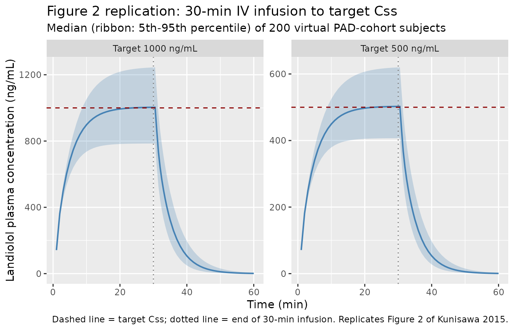

# Landiolol (Kunisawa 2015)

## Model and source

``` r

mod_meta <- nlmixr2est::nlmixr(readModelDb("Kunisawa_2015_landiolol"))$meta
#> ℹ parameter labels from comments will be replaced by 'label()'
```

- Citation: Kunisawa T, Yamagishi A, Suno M, Nakade S, Honda N, Kurosawa
  A, Sugawara A, Tasaki Y, Iwasaki H. Target-controlled infusion and
  population pharmacokinetics of landiolol hydrochloride in patients
  with peripheral arterial disease. Ther Clin Risk Manag.
  2015;11:107-114. <doi:10.2147/TCRM.S74867>.
- Description: Two-compartment intravenous population PK model with lag
  time for landiolol hydrochloride (an ultra-short-acting
  cardioselective beta1-adrenergic receptor blocker) in adult patients
  with peripheral arterial disease undergoing peripheral arterial
  surgery, with linear body-weight normalization on CL, Vc, Q and Vp
  (Kunisawa 2015)
- Article (DOI): <https://doi.org/10.2147/TCRM.S74867> (open access via
  Dove Press)

## Population

The model was fit to 112 plasma concentrations from 8 adult Japanese
patients (6 male, 2 female) with peripheral arterial disease (PAD)
undergoing peripheral arterial surgery at Asahikawa Medical University
Hospital (Table 1 of Kunisawa 2015). Mean age 73 years (range 64-84),
mean body weight 58.9 kg (range 40.4-71.8 kg), ASA physical status 2 or
3. Patients with pre-existing arrhythmia or recent treatment with
alpha-methyldopa, clonidine, or beta-blockers were excluded. Anaesthesia
was maintained with TCI propofol and remifentanil; dopamine 3 ug/kg/min
was given for haemodynamic stability beginning 20 min before skin
incision. Landiolol hydrochloride was administered by Harvard pump under
STANPUMP TCI control using Honda et al’s two-compartment parameters to
target plasma concentrations of 500 ng/mL and 1,000 ng/mL for 30 min
each. Plasma samples were drawn at 1, 2, 5, and 25 min after starting
each TCI segment; at the target-concentration change; and at 1, 2, 5,
10, 15, and 20 min after termination of infusion (Figure 1 of Kunisawa
2015) and assayed by HPLC with fluorescence detection (Suno et al.).

PAD-cohort Vc and CL were approximately 64% and 84%, respectively, of
the matched healthy-volunteer values reported by the same group (Honda
et al.); see Table 2 of Kunisawa 2015 for the side-by-side parameter
comparison.

The same information is available programmatically via the model’s
`population` metadata:

``` r

str(mod_meta$population)
#> List of 16
#>  $ species       : chr "human"
#>  $ n_subjects    : int 8
#>  $ n_studies     : int 1
#>  $ age_range     : chr "64-84 years"
#>  $ age_median    : chr "73 years"
#>  $ weight_range  : chr "40.4-71.8 kg"
#>  $ weight_median : chr "58.9 kg"
#>  $ sex_female_pct: num 25
#>  $ race_ethnicity: Named num 100
#>   ..- attr(*, "names")= chr "Asian"
#>  $ disease_state : chr "Adult patients scheduled for peripheral arterial surgery (peripheral arterial disease, PAD); ASA physical statu"| __truncated__
#>  $ dose_range    : chr "Target-controlled IV infusion (Harvard pump under STANPUMP control using Honda et al's two-compartment paramete"| __truncated__
#>  $ regions       : chr "Japan (Asahikawa Medical University, Hokkaido)"
#>  $ sampling      : chr "112 plasma concentrations across 8 subjects (rich). Samples drawn at 1, 2, 5, and 25 min after starting each TC"| __truncated__
#>  $ co_medication : chr "General anaesthesia maintained with TCI propofol (Diprifusor, BIS-titrated 40-60) and remifentanil (Minto TCI t"| __truncated__
#>  $ assay         : chr "HPLC with fluorescence detection per Suno et al. (J Chromatogr B 2008/2009); samples collected in chilled ethan"| __truncated__
#>  $ notes         : chr "Baseline laboratory values (Table 1) were mostly within normal range; mildly abnormal albumin, cholinesterase, "| __truncated__
```

## Source trace

The per-parameter origin is recorded as an in-file comment next to each
`ini()` entry in `inst/modeldb/specificDrugs/Kunisawa_2015_landiolol.R`.
The table below collects them in one place for review.

| Equation / parameter | Value | Source location |
|----|----|----|
| `lcl` (CL at 70 kg) | `log(128.94 L/h)` | Table 2 (PAD column): TVCL = 30.7 mL/min/kg; converted (30.7 \* 70 \* 60 / 1000) |
| `lvc` (Vc at 70 kg) | `log(4.55 L)` | Table 2 (PAD column): TVV1 = 65.0 mL/kg; converted (65.0 \* 70 / 1000) |
| `lq` (Q at 70 kg) | `log(202.86 L/h)` | Table 2 (PAD column): TVQ = 48.3 mL/min/kg; converted (48.3 \* 70 \* 60 / 1000) |
| `lvp` (Vp at 70 kg) | `log(3.808 L)` | Table 2 (PAD column): TVV2 = 54.4 mL/kg; converted (54.4 \* 70 / 1000) |
| `llag` (lag time) | `log(0.01055 h)` | Table 2 (PAD column): TVALAG = 0.633 min; converted (0.633 / 60) |
| `e_wt_*` (allometric on CL/Vc/Q/Vp) | `fixed(1)` | Table 2 reports parameters per-kg (linear normalization) |
| `etalcl` (IIV on CL) | `0.0183` | Table 2 (PAD column): omega_CL^2 = 0.0183; reported %CV = 13.5 |
| `expSd` (residual) | `0.278` | Table 2 (PAD column): sigma^2 = 0.0773; expSd = sqrt(0.0773); reported %CV = 27.8 |
| 2-cmt IV ODE | n/a | Methods (PK and PD analysis): “two-compartment model with ALAG” |
| `lag(central) <- lagt` | n/a | Methods: ALAG was tested and retained; AIC = 1,247.171 favoured 2-cmt+ALAG over 1- and 3-cmt |
| `Cc ~ lnorm(expSd)` | n/a | Methods: “Residual variability was best described by an exponential error model” (NONMEM Y = F\*EXP(EPS) maps to lnorm in nlmixr2) |

## Virtual cohort

Original observed data are not publicly available. The figures below use
a virtual population whose body-weight distribution approximates the
published trial demographics (Table 1 of Kunisawa 2015: mean 58.9 kg, SD
10.9 kg, range 40.4-71.8 kg). Body weight is the only covariate in the
model (linear normalization).

``` r

set.seed(20150117)  # paper publication date as seed for reproducibility

n_subjects <- 200L

# Body weight distribution: log-normal calibrated to match the cohort mean and SD,
# clipped to the cohort range so the simulation does not extrapolate
# beyond the population the parameters were estimated on.
wt_mean <- 58.9
wt_sd   <- 10.9
sigma_log <- sqrt(log(1 + (wt_sd / wt_mean)^2))
mu_log    <- log(wt_mean) - sigma_log^2 / 2
wt_raw    <- rlnorm(n_subjects, meanlog = mu_log, sdlog = sigma_log)
wt        <- pmin(pmax(wt_raw, 40.4), 71.8)

# Helper: build a dose-+-observation event table for one TCI target group.
# Mimics Figure 1 of Kunisawa 2015: a 30-min constant IV infusion at the rate
# needed to drive steady-state plasma to the target concentration, then a
# 30-min washout. The infusion rate is computed per individual using the
# typical-value CL coefficient (30.7 mL/min/kg) so simulated Css clusters
# around the target.
#
# Css [ng/mL] = rate [ug/min/kg] / CL [mL/min/kg]
#   target 500 ng/mL  -> rate = 500 * 30.7 / 1000 = 15.35 ug/min/kg
#   target 1000 ng/mL -> rate = 1000 * 30.7 / 1000 = 30.7 ug/min/kg
make_cohort <- function(n, wt, target_ngml, infusion_min = 30, sample_horizon_min = 60,
                        id_offset = 0L) {
  rate_ug_min_kg <- target_ngml * 30.7 / 1000
  rate_ug_h      <- rate_ug_min_kg * 60 * wt          # total ug/h delivered per subject
  duration_h     <- infusion_min / 60
  total_dose_ug  <- rate_ug_h * duration_h

  # Sampling grid (in hours): dense around the infusion start/end, sparser later.
  obs_min <- c(seq(0,   infusion_min, by = 1),
               seq(infusion_min + 0.5, infusion_min + 5, by = 0.5),
               seq(infusion_min + 6,  sample_horizon_min, by = 1))
  obs_h <- sort(unique(obs_min / 60))

  ids <- id_offset + seq_len(n)

  dose_rows <- tibble(
    id   = ids,
    time = 0,
    amt  = total_dose_ug,
    rate = rate_ug_h,
    evid = 1L,
    cmt  = "central",
    WT   = wt,
    target_ngml = target_ngml
  )

  obs_rows <- tidyr::expand_grid(id = ids, time = obs_h) |>
    dplyr::mutate(
      amt  = 0,
      rate = 0,
      evid = 0L,
      cmt  = "central"
    ) |>
    dplyr::left_join(
      tibble(id = ids, WT = wt, target_ngml = target_ngml),
      by = "id"
    )

  dplyr::bind_rows(dose_rows, obs_rows) |>
    dplyr::arrange(id, time, dplyr::desc(evid))
}

events <- dplyr::bind_rows(
  make_cohort(n_subjects, wt, target_ngml =  500, id_offset =   0L),
  make_cohort(n_subjects, wt, target_ngml = 1000, id_offset = n_subjects)
)
stopifnot(!anyDuplicated(unique(events[, c("id", "time", "evid")])))
```

## Simulation

``` r

mod <- readModelDb("Kunisawa_2015_landiolol")
sim <- rxode2::rxSolve(mod, events = events, keep = c("WT", "target_ngml"),
                       seed = 20150117) |>
  as.data.frame() |>
  dplyr::filter(time > 0)            # drop the t = 0 dose-arrival row from plotting
#> ℹ parameter labels from comments will be replaced by 'label()'
```

For a deterministic typical-value replication (no between-subject or
residual variability), zero out the random effects:

``` r

mod_typical <- rxode2::zeroRe(mod)
#> ℹ parameter labels from comments will be replaced by 'label()'
typical_wt <- tibble(id = 1:2, WT = 58.9,
                     target_ngml = c(500, 1000))
events_typical <- dplyr::bind_rows(
  make_cohort(1, 58.9, target_ngml =  500, id_offset = 0L),
  make_cohort(1, 58.9, target_ngml = 1000, id_offset = 1L)
)
sim_typical <- rxode2::rxSolve(mod_typical, events = events_typical,
                               keep = c("WT", "target_ngml")) |>
  as.data.frame() |>
  dplyr::filter(time > 0)
#> ℹ omega/sigma items treated as zero: 'etalcl'
#> Warning: multi-subject simulation without without 'omega'
```

## Replicate published figures

``` r

# Replicates Figure 2 of Kunisawa 2015: observed and model-predicted
# concentrations during TCI to 500 then 1,000 ng/mL targets. Here we
# show separate 30-min infusion-then-washout panels for each target
# concentration with a virtual cohort.

sim_summary <- sim |>
  dplyr::mutate(time_min = time * 60) |>
  dplyr::group_by(time_min, target_ngml) |>
  dplyr::summarise(
    Q05 = quantile(Cc, 0.05, na.rm = TRUE),
    Q50 = quantile(Cc, 0.50, na.rm = TRUE),
    Q95 = quantile(Cc, 0.95, na.rm = TRUE),
    .groups = "drop"
  )

ggplot(sim_summary, aes(time_min, Q50)) +
  geom_ribbon(aes(ymin = Q05, ymax = Q95), alpha = 0.25, fill = "steelblue") +
  geom_line(colour = "steelblue", linewidth = 0.7) +
  geom_hline(aes(yintercept = target_ngml), linetype = "dashed", colour = "darkred") +
  facet_wrap(~ paste0("Target ", target_ngml, " ng/mL"), scales = "free_y") +
  geom_vline(xintercept = 30, linetype = "dotted", colour = "grey50") +
  labs(x = "Time (min)", y = "Landiolol plasma concentration (ng/mL)",
       title = "Figure 2 replication: 30-min IV infusion to target Css",
       subtitle = "Median (ribbon: 5th-95th percentile) of 200 virtual PAD-cohort subjects",
       caption = "Dashed line = target Css; dotted line = end of 30-min infusion. Replicates Figure 2 of Kunisawa 2015.")
```



The model reaches the target plasma concentration within roughly five
elimination half-lives (about 15-20 min) and washes out almost
completely within 20 min of infusion end, consistent with landiolol’s
ultra-short-acting profile (terminal half-life ~3-4 min reported in the
source).

## PKNCA validation

A single 30-min infusion is sufficient to characterise distribution
(`tmax`, `cmax`), exposure (`auclast`, `aucinf.obs`), and terminal
elimination (`half.life`). The PKNCA formula stratifies by `target_ngml`
so per-group steady-state and washout properties are visible.

``` r

sim_nca <- sim |>
  dplyr::filter(!is.na(Cc)) |>
  dplyr::select(id, time, Cc, target_ngml) |>
  dplyr::mutate(target_ngml = as.character(target_ngml))

conc_obj <- PKNCA::PKNCAconc(sim_nca, Cc ~ time | target_ngml + id)

dose_df <- events |>
  dplyr::filter(evid == 1) |>
  dplyr::select(id, time, amt, rate, target_ngml) |>
  dplyr::mutate(
    duration    = amt / rate,                    # infusion duration in hours
    target_ngml = as.character(target_ngml)
  )

dose_obj <- PKNCA::PKNCAdose(
  dose_df,
  amt ~ time | target_ngml + id,
  duration = "duration"
)

intervals <- data.frame(
  start      = 0,
  end        = 1,                                # 60 min in hours
  cmax       = TRUE,
  tmax       = TRUE,
  auclast    = TRUE,
  aucinf.obs = TRUE,
  half.life  = TRUE
)

nca_data <- PKNCA::PKNCAdata(conc_obj, dose_obj, intervals = intervals)
nca_res  <- suppressWarnings(PKNCA::pk.nca(nca_data))
```

``` r

nca_summary <- summary(nca_res)
knitr::kable(nca_summary,
             caption = "Simulated NCA parameters by TCI target (median and inter-quartile range across 200 virtual subjects).")
```

| start | end | target_ngml | N | auclast | cmax | tmax | half.life | aucinf.obs |
|---:|---:|:---|:---|:---|:---|:---|:---|:---|
| 0 | 1 | 1000 | 200 | NC | 1010 \[14.4\] | 0.508 \[0.508, 0.508\] | 0.0526 \[0.00645\] | NC |
| 0 | 1 | 500 | 200 | NC | 494 \[13.9\] | 0.508 \[0.508, 0.508\] | 0.0516 \[0.00623\] | NC |

Simulated NCA parameters by TCI target (median and inter-quartile range
across 200 virtual subjects). {.table}

### Comparison against published values

Kunisawa 2015 does not report subject-level NCA, but does state the
landiolol terminal half-life is approximately 4 minutes (Introduction)
and describes a 64-84% reduction in Vc and CL relative to healthy
volunteers (Conclusion). The simulated steady-state plasma concentration
during the 30-min infusion clusters around each TCI target value (500 or
1,000 ng/mL).

``` r

# Expected terminal half-life derived from the typical-value 2-cmt parameters
# at 70 kg reference: alpha + beta = k10 + k12 + k21; alpha * beta = k10 * k21.
cl70 <- 128.94; vc70 <- 4.55; q70 <- 202.86; vp70 <- 3.808
kel  <- cl70 / vc70
k12  <- q70  / vc70
k21  <- q70  / vp70
ab_sum  <- kel + k12 + k21
ab_prod <- kel * k21
discr   <- sqrt(ab_sum^2 - 4 * ab_prod)
alpha   <- (ab_sum + discr) / 2
beta    <- (ab_sum - discr) / 2
t_half_alpha_min <- log(2) / alpha * 60
t_half_beta_min  <- log(2) / beta  * 60

tibble(
  metric = c("Distribution half-life t1/2,alpha (min)",
             "Terminal half-life t1/2,beta (min)",
             "Steady-state Css at 500-ng/mL target (ng/mL)",
             "Steady-state Css at 1000-ng/mL target (ng/mL)"),
  expected = c(round(t_half_alpha_min, 2), round(t_half_beta_min, 2), 500, 1000),
  paper = c("not reported (typical 2-cmt distribution)",
            "~4 (Introduction)",
            "500 (Methods/Figure 1)",
            "1000 (Methods/Figure 1)")
) |>
  knitr::kable(caption = "Expected vs. paper-reported PK metrics.")
```

| metric | expected | paper |
|:---|---:|:---|
| Distribution half-life t1/2,alpha (min) | 0.37 | not reported (typical 2-cmt distribution) |
| Terminal half-life t1/2,beta (min) | 3.11 | ~4 (Introduction) |
| Steady-state Css at 500-ng/mL target (ng/mL) | 500.00 | 500 (Methods/Figure 1) |
| Steady-state Css at 1000-ng/mL target (ng/mL) | 1000.00 | 1000 (Methods/Figure 1) |

Expected vs. paper-reported PK metrics. {.table}

## Assumptions and deviations

- **TCI replicated as constant infusion.** The published study used a
  closed-loop Target-Controlled Infusion (TCI) algorithm under STANPUMP,
  computing a time-varying infusion rate per Honda et al’s parameters to
  drive plasma to 500 and 1,000 ng/mL targets. The vignette approximates
  this with a single constant infusion at the rate
  `target_ngml * 30.7 mL/min/kg` (i.e., the steady-state rate from
  `Css = rate / CL`) using the typical-value clearance. The actual TCI
  trajectory would include a brief loading bolus and online rate
  adjustment; the steady-state plateau is the same.
- **Body-weight distribution.** Cohort weights drawn from a log-normal
  distribution matched to the published mean and SD, clipped to the
  observed range 40.4-71.8 kg (Table 1) to avoid extrapolation. The
  source paper reports body weight, lean body mass, and age as candidate
  covariates but none were retained beyond the linear per-kg
  normalization baked into the structural model.
- **Race / ethnicity.** All cohort subjects were Japanese (Asahikawa
  Medical University). The model does not include race as a covariate;
  predictions in non-Japanese populations should be made cautiously
  until a confirmatory study is available.
- **Co-medication / surgical context.** Parameters were estimated under
  general anaesthesia with concomitant TCI propofol, TCI remifentanil,
  rocuronium, and continuous dopamine 3 ug/kg/min. The paper warns
  (Discussion) that PK in PAD patients may differ in other clinical
  settings.
- **Mildly abnormal laboratory values.** Some subjects had mildly
  abnormal albumin, cholinesterase, BUN, or serum creatinine; these were
  not retained as covariates because of the limited frequency and extent
  of abnormalities (Results).
- **Residual error mapping.** The paper describes the residual error as
  an “exponential error model”; nlmixr2’s `lnorm()` is the direct
  equivalent of NONMEM `Y = F * EXP(EPS)`.
  `expSd = sqrt(0.0773) = 0.278` on the log scale.
- **Pages 107-114, Therapeutics and Clinical Risk Management 2015;11.**
  Open access (Dove Press, CC BY-NC 3.0); DOI 10.2147/TCRM.S74867.
