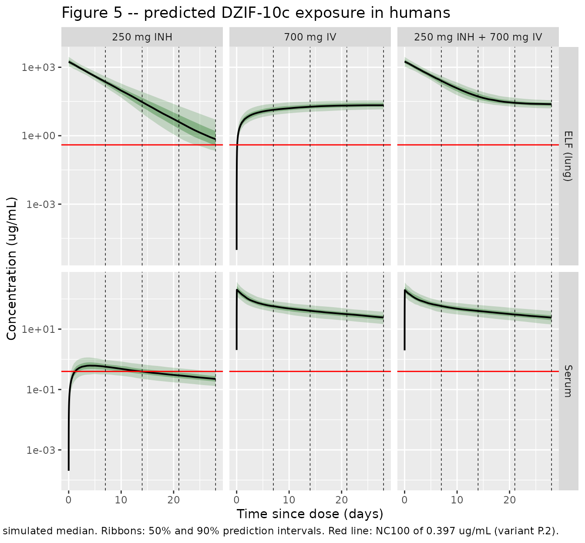
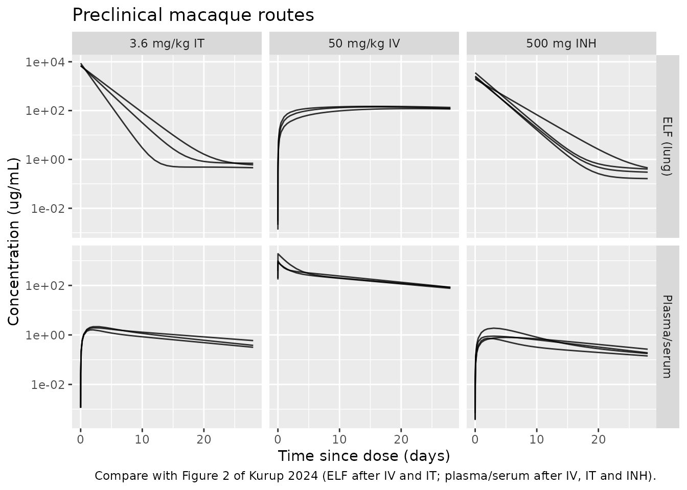

# DZIF-10c (Kurup 2024)

## Model and source

- Citation: Kurup S, Velez de Mendizabal N, Becker S, Bolella E, De
  Sousa D, Fatkenheuer G, Gruell H, Klein F, Malin JJ, Schmid U,
  Korell J. Semi-mechanistic population pharmacokinetic modeling of
  DZIF-10c, a neutralizing antibody against SARS-Cov-2: predicting
  systemic and lung exposure following inhaled and intravenous
  administration. J Pharmacokinet Pharmacodyn. 2024;52(1):3.
  <doi:10.1007/s10928-024-09947-2>
- Description: Pooled human + cynomolgus macaque semi-mechanistic
  population PK model for DZIF-10c (BI 767551), a SARS-CoV-2
  neutralizing human IgG1 kappa monoclonal antibody developed for both
  intravenous infusion and inhaled (nebulized) administration (Kurup
  2024). Five compartments in three regions: a lung epithelial lining
  fluid (ELF) space carried as three parallel pools that share one
  volume and one clearance and differ only by route of entry (elf_lrt =
  lower-respiratory-tract deposition site for an inhaled dose,
  elf_trachea = tracheal deposition site for an intratracheal dose, elf
  = the rest of the lung, the only pool that exchanges bidirectionally
  with the systemic circulation), plus a central and a peripheral
  compartment with linear clearance. The observed ELF concentration is
  the summed amount of all three lung pools divided by the shared ELF
  volume. Drug leaves the lung by two routes: distribution into the
  systemic circulation (Q1) and loss from the lung itself (CL_L,
  representing e.g. mucociliary clearance). Human and macaque data were
  bridged by body-weight allometry alone, with fixed exponents of 0.85
  on every clearance and 1 on every volume, both referenced to 70 kg for
  BOTH species; the only species-dependent parameter is the fraction of
  an inhaled dose deposited in the lung (29.6% in humans vs 1.00% in
  macaques), estimated on the logit scale. The intratracheal dose is
  assumed to be fully deposited (F = 1). Fitted to 640 observations from
  76 subjects across 3 preclinical macaque studies (serum/plasma plus
  urea-corrected bronchoalveolar lavage ELF) and 2 phase I/IIa clinical
  trials (serum only).
- Article: <https://doi.org/10.1007/s10928-024-09947-2>
- Supplement (equations and NONMEM control stream):
  <https://doi.org/10.1007/s10928-024-09947-2>, Supplementary
  Information file `10928_2024_9947_MOESM1_ESM.docx`

DZIF-10c (BI 767551) is a SARS-CoV-2 neutralizing human IgG1 kappa
monoclonal antibody developed for both intravenous infusion and inhaled
(nebulized) delivery. Because epithelial lining fluid (ELF) cannot be
sampled serially in humans, Kurup and colleagues pooled cynomolgus
macaque serum/plasma **and** ELF data with human serum data and bridged
the two species by body-weight allometry, so that lung exposure in
humans could be predicted from a model that had actually seen lung data.

### Structure

The model has five compartments in three regions.

| State | Role | Dosing route that lands here |
|----|----|----|
| `elf_lrt` | ELF of the lower respiratory tract | inhaled (nebulized), fraction `F1` deposited |
| `elf_trachea` | ELF of the trachea | intratracheal instillation, `F = 1` |
| `elf` | ELF of the rest of the lung | none; fed from `central` |
| `central` | systemic circulation (serum/plasma) | intravenous |
| `peripheral1` | peripheral tissue | none |

All three lung pools share one volume `v_elf` and one loss clearance
`cl_elf`, and each exchanges with `central` through the same `q_elf`;
they differ only in how drug gets into them. The observed ELF
concentration is therefore the summed amount of all three pools over the
single shared volume, `Celf = (elf_lrt + elf_trachea + elf) / v_elf`
(supplement equation 6).

Only `elf` receives back-transfer from `central` – which is what makes
an intravenous dose reach the lung slowly (peak at roughly one week)
while an inhaled dose peaks immediately.

## Population

The analysis dataset pooled 76 subjects contributing 640 observations
across five studies (supplement Tables S1 and S2):

- **Preclinical (14 cynomolgus macaques, 166 concentrations, 150
  serum/plasma and 16 ELF).** Study 1: 6 animals, single 50 mg/kg IV
  bolus (n = 3) or 3.6 mg/kg intratracheal instillation (n = 3), serum
  and bronchoalveolar lavage over 28 days. Study 2: 4 animals, repeated
  ~1000 mg inhaled doses over 7 days. Study 3: 4 animals, two
  prophylactic 500 mg inhaled doses before SARS-CoV-2 challenge. ELF was
  derived from lavage by the Rennard urea-correction method; study 3
  lavage samples had no urea measurement and were excluded.
- **Clinical (62 humans, 474 serum concentrations).** Trial NCT04631666:
  44 subjects, single IV infusions of 2.5-80 mg/kg over ~60 min. Trial
  NCT04631705: 18 subjects from the dose-escalation part, single inhaled
  doses of 50-250 mg over 15-20 min. Participants were SARS-CoV-2
  infected and uninfected adults; infected participants were dosed a
  median of four days (range 1-8) after their first positive test.

No demographic covariates were evaluated: the studies were small, and
the purpose of the analysis was the cross-species lung bridge rather
than covariate identification. Body weight is the only continuous
covariate, entering allometrically on every clearance and every volume.

The same information is available programmatically via
`readModelDb("Kurup_2024_DZIF10c")()$population`.

## Source trace

The per-parameter origin is recorded as an in-file comment next to each
`ini()` entry in `inst/modeldb/specificDrugs/Kurup_2024_DZIF10c.R`. The
table below collects them in one place. Every typical value is the
Bayesian posterior median of Table 1, back-transformed from the log
domain by the authors; the `$THETA` block in the supplement is
explicitly labelled `;INITIAL ESTIMATES` and is not used here.

| Equation / parameter | Value | Source location |
|----|----|----|
| `logitfdepot` (human inhaled deposition) | 29.6% | Table 1, `F1h (%)`, 29.6 (95% CDI 21.9-40.0) |
| `logitfdepot_macaque` | 1.00% | Table 1, `F1m (%)`, 1.00 (95% CDI 0.737-1.38) |
| `lq_elf` (Q1, ELF \<-\> central) | 3.68e-5 L/h | Table 1, `Q1 (L/h)` |
| `lv_elf` (V_L, ELF volume) | 0.0364 L | Table 1, `VL (L)` |
| `lcl_elf` (CL_L, loss from ELF) | 4.12e-4 L/h | Table 1, `CLL (L/h)` |
| `lcl` (CL) | 0.0122 L/h | Table 1, `CL (L/h)` |
| `lvc` (Vc) | 3.08 L | Table 1, `Vc (L)` |
| `lq` (Q2, central \<-\> peripheral) | 0.0359 L/h | Table 1, `Q2 (L/h)` |
| `lvp` (Vp) | 4.36 L | Table 1, `VP (L)` |
| `e_wt_cl_q` (allometric exponent, all clearances) | 0.85, fixed | Methods “Covariate analyses”; supplement eq. 11; `$PK ACL = 0.85` |
| `e_wt_vc_vp` (allometric exponent, all volumes) | 1, fixed | Methods “Covariate analyses”; supplement eq. 11; `$PK AV = 1` |
| `etalvc` | 26.7% | Table 1, `IIV in VC (%)`, shrinkage 28.3% |
| `etalq` | 67.1% | Table 1, `IIV in Q2 (%)`, shrinkage 35.0% |
| seven fixed IIVs (F1m, F1h, Q1, VL, CL_L, CL, Vp) | variance 0.0225 | Methods “Interindividual and residual variability”; supplement `$OMEGA` `0.0225 FIX` rows |
| `propSd_Celf` | 0.547 | Table 1, proportional error, ELF; Results “54.7%” |
| `propSd` | 0.145 | Table 1, proportional error, central compartment |
| `d/dt(elf_lrt)`, `d/dt(elf_trachea)` | n/a | Supplement eqs. 1-2; `$DES DADT(1)`, `DADT(2)` |
| `d/dt(elf)` | n/a | Supplement eq. 3; `$DES DADT(3)` |
| `d/dt(central)` | n/a | Supplement eq. 4; `$DES DADT(4)` |
| `d/dt(peripheral1)` | n/a | Supplement eq. 5; `$DES DADT(5)` |
| `Celf` | n/a | Supplement eq. 6 |
| `Cc` | n/a | Supplement eq. 7 |
| `f(elf_lrt)`, `f(elf_trachea)` | `F1`, 1 | Supplement eqs. 8-10; `$PK F1`, `F2 = 1` |
| Allometric scaling form | `(WT/70)^beta` | Supplement eq. 11 |
| Reference weight | 70 kg, both species | Methods “Covariate analyses”; Table 1 footnote |

``` r

mod <- readModelDb("Kurup_2024_DZIF10c")
ui <- rxode2::rxode(mod)
#> ℹ parameter labels from comments will be replaced by 'label()'
ui$state
#> [1] "elf_lrt"     "elf_trachea" "elf"         "central"     "peripheral1"
```

Note that the two observables are **declared endpoints** (each has a
residual error line), so rxode2 assigns them compartment slots after the
five ODE states:

``` r

ui$predDf[, c("cond", "var", "dvid", "cmt")]
#>   cond  var dvid cmt
#> 1 Celf Celf    1   6
#> 2   Cc   Cc    2   7
```

Observation rows in the event tables below therefore address an endpoint
by name (`cmt = "Cc"`), which is the correct spelling for a declared
multi-endpoint model; `rxSolve()` returns every observable as a column
regardless of which endpoint an observation row named. Dosing rows
address the real ODE states.

## Structural identity checks

Before any cohort simulation, two closed-form identities pin the lung
structure at the typical value (WT = 70 kg, random effects zeroed). Both
are exact, so they are asserted rather than eyeballed.

``` r

mod_typ <- mod |> rxode2::zeroRe()
#> ℹ parameter labels from comments will be replaced by 'label()'

ev_typ <- dplyr::bind_rows(
  data.frame(id = 1L, time = 0, amt = 250, rate = 0, evid = 1L, cmt = "elf_lrt"),
  data.frame(id = 1L, time = c(seq(0, 24, by = 0.01), seq(25, 1344, by = 1)),
             amt = NA_real_, rate = NA_real_, evid = 0L, cmt = "Cc")
) |>
  dplyr::mutate(WT = 70, SPECIES_MACAQUE = 0) |>
  dplyr::arrange(time, dplyr::desc(evid))

sim_inh_typ <- rxode2::rxSolve(mod_typ, ev_typ, omega = NA, useLinCmt = FALSE,
                               returnType = "data.frame")

# Parameter values at WT = 70 kg are the Table 1 typical values themselves.
f1h <- 0.296; v_elf <- 0.0364; cl_elf <- 0.000412; q_elf <- 3.68e-5

# (1) ELF Cmax after an inhaled dose is exactly Dose * F1h / V_L: the dose
#     lands in elf_lrt, which is itself part of the observed ELF space, so
#     there is no absorption step to blunt the peak.
elf_cmax_pred <- 250 * f1h / v_elf
elf_cmax_sim  <- max(sim_inh_typ$Celf)

# (2) The inhaled bolus leaves the lung at (CL_L + Q1) / V_L, giving the
#     "relatively short effective half-life of ~2.5 days" the Discussion quotes
#     for inhalation. Measure the slope over days 1-10, after the peak but
#     before recirculation from `central` back into `elf` starts to matter --
#     that back-transfer is why the ELF *terminal* slope tracks serum instead
#     (see the note below the table).
thalf_lung_pred <- log(2) / ((cl_elf + q_elf) / v_elf)
decay_win <- sim_inh_typ[sim_inh_typ$time >= 24 & sim_inh_typ$time <= 240, ]
thalf_lung_sim <- -log(2) / stats::coef(
  stats::lm(log(Celf) ~ time, data = decay_win))[["time"]]

data.frame(
  Check = c("ELF Cmax = Dose * F1h / V_L (ug/mL)",
            "Lung effective half-life after inhalation (days)"),
  `Closed form` = c(elf_cmax_pred, thalf_lung_pred / 24),
  Simulated     = c(elf_cmax_sim, thalf_lung_sim / 24),
  check.names   = FALSE
) |>
  knitr::kable(digits = 4,
               caption = "Closed-form structural identities at WT = 70 kg.")
```

| Check                                            | Closed form | Simulated |
|:-------------------------------------------------|------------:|----------:|
| ELF Cmax = Dose \* F1h / V_L (ug/mL)             |   2032.9670 | 2032.9670 |
| Lung effective half-life after inhalation (days) |      2.3424 |    2.3433 |

Closed-form structural identities at WT = 70 kg. {.table}

``` r


stopifnot(
  abs(elf_cmax_sim / elf_cmax_pred - 1) < 0.001,
  abs(thalf_lung_sim / thalf_lung_pred - 1) < 0.005,
  thalf_lung_pred / 24 > 2.0, thalf_lung_pred / 24 < 3.0
)
```

The lung effective half-life of 2.34 days matches the “relatively short
effective half-life of ~2.5 days” the Discussion reports for the inhaled
route, and it is an order of magnitude shorter than the ~20-day systemic
half-life – which is the paper’s central pharmacokinetic point.

That 2.5-day figure describes the **post-inhalation decline**, not the
ELF terminal slope. Once the lung pool has largely emptied, ELF is
sustained by back-transfer from `central`, so the true terminal slope of
`Celf` tracks the systemic terminal phase. Fitting the same
typical-value profile over days 14-56 instead returns 6.2 days, on its
way to the systemic value. This is exactly the asymmetry the Discussion
describes: “IV administration of DZIF-10c results in ELF concentrations
that remain relatively constant for a longer period due to the transfer
of drug from the central compartment to the ELF compartment … resulting
in the same lung half-life as for serum of ~20 days”.

## Virtual cohort

The paper simulated 1,000 human subjects per administration route,
sampling body weight from NHANES 2017-18 filtered to adults at least 18
years old and at least 40 kg. Those microdata are not redistributed with
this package, so the cohort below draws body weight from a lognormal
approximation of that sampling frame (see Assumptions). Cohort size is
capped at 200 per arm, which is ample for the percentile summaries
reproduced here.

``` r

set.seed(20241205)

n_per_arm <- 200

obs_times <- sort(unique(c(
  0, 0.01, 0.083, 0.25, 0.5, 0.75, 1, 1.5, 2, 3, 4, 6, 8, 12, 18, 24,
  seq(36, 168, by = 12),
  seq(192, 672, by = 24)
)))

sample_wt <- function(n) {
  wt <- stats::rlnorm(n, meanlog = log(80), sdlog = 0.24)
  # NHANES filter: at least 40 kg.
  wt[wt < 40] <- 40
  wt
}

make_arm <- function(n, regimen, inh_mg = NA_real_, iv_mg = NA_real_,
                     id_offset = 0L) {
  subj <- tibble(
    id = id_offset + seq_len(n),
    WT = sample_wt(n),
    SPECIES_MACAQUE = 0,
    regimen = regimen
  )

  doses <- list()
  if (!is.na(inh_mg)) {
    doses[[length(doses) + 1L]] <- subj |>
      mutate(time = 0, amt = inh_mg, rate = 0, evid = 1L, cmt = "elf_lrt")
  }
  if (!is.na(iv_mg)) {
    # 60-minute infusion, matching the clinical IV trial.
    doses[[length(doses) + 1L]] <- subj |>
      mutate(time = 0, amt = iv_mg, rate = iv_mg, evid = 1L, cmt = "central")
  }

  obs <- subj |>
    tidyr::crossing(time = obs_times) |>
    mutate(amt = NA_real_, rate = NA_real_, evid = 0L, cmt = "Cc")

  dplyr::bind_rows(doses) |>
    dplyr::bind_rows(obs) |>
    dplyr::arrange(id, time, dplyr::desc(evid))
}

events <- dplyr::bind_rows(
  make_arm(n_per_arm, "250 mg INH",            inh_mg = 250, id_offset =   0L),
  make_arm(n_per_arm, "700 mg IV",             iv_mg  = 700, id_offset = 200L),
  make_arm(n_per_arm, "250 mg INH + 700 mg IV", inh_mg = 250, iv_mg = 700,
           id_offset = 400L)
)

# Assert no duplicated event rows. `cmt` has to be part of the key: the
# combination arm legitimately carries two evid = 1 rows at time 0 for the same
# subject (inhaled into `elf_lrt`, intravenous into `central`), so a key of
# (id, time, evid) alone would flag those. Note the absence of a `unique()`
# call inside `anyDuplicated()` -- de-duplicating first would make this
# assertion incapable of ever failing.
stopifnot(!anyDuplicated(events[, c("id", "time", "evid", "cmt")]))
```

## Simulation

``` r

sim <- rxode2::rxSolve(
  mod, events = events,
  keep = c("WT", "regimen"),
  # rxode2's automatic ODE-to-linCmt conversion corrupts the dvid mapping for
  # multi-endpoint models such as this one.
  useLinCmt = FALSE,
  returnType = "data.frame"
)
#> ℹ parameter labels from comments will be replaced by 'label()'

# rxSolve silently drops subjects under some conditions; assert the count.
stopifnot(dplyr::n_distinct(sim$id) == 3L * n_per_arm)
range(sim$Celf)
#> [1]    0.000 4000.491
range(sim$Cc)
#> [1]   0.0000 509.3697
```

`Cc` and `Celf` are the individual model predictions; the residual error
is carried by the separate `sim` columns and is not used below (see
Assumptions).

## Replicate Figure 5

``` r

nc100 <- 0.397  # ug/mL, weakest (highest) NC100 at the time of analysis: variant P.2

sim_long <- sim |>
  select(id, time, regimen, Cc, Celf) |>
  tidyr::pivot_longer(c(Cc, Celf), names_to = "matrix", values_to = "conc") |>
  mutate(
    matrix = factor(matrix, levels = c("Celf", "Cc"),
                    labels = c("ELF (lung)", "Serum")),
    regimen = factor(regimen, levels = c("250 mg INH", "700 mg IV",
                                         "250 mg INH + 700 mg IV"))
  )

sim_long |>
  group_by(regimen, matrix, time) |>
  summarise(
    Q05 = quantile(conc, 0.05),
    Q25 = quantile(conc, 0.25),
    Q50 = quantile(conc, 0.50),
    Q75 = quantile(conc, 0.75),
    Q95 = quantile(conc, 0.95),
    .groups = "drop"
  ) |>
  filter(time > 0) |>
  ggplot(aes(time / 24, Q50)) +
  geom_ribbon(aes(ymin = Q05, ymax = Q95), fill = "darkgreen", alpha = 0.18) +
  geom_ribbon(aes(ymin = Q25, ymax = Q75), fill = "darkgreen", alpha = 0.30) +
  geom_line(linewidth = 0.7) +
  geom_hline(yintercept = nc100, colour = "red") +
  geom_vline(xintercept = c(7, 14, 21, 28), linetype = "dashed",
             linewidth = 0.25) +
  facet_grid(matrix ~ regimen, scales = "free_y") +
  scale_y_log10() +
  labs(
    x = "Time since dose (days)", y = "Concentration (ug/mL)",
    title = "Figure 5 -- predicted DZIF-10c exposure in humans",
    caption = paste("Replicates Figure 5 of Kurup 2024. Black line: simulated median.",
                    "Ribbons: 50% and 90% prediction intervals.",
                    "Red line: NC100 of 0.397 ug/mL (variant P.2).")
  )
```



The three qualitative features the paper draws from this figure are
reproduced: inhalation gives an immediate, very high ELF peak that
decays below the NC100 target at around four weeks; the IV dose reaches
the lung within about a day and stays above NC100 for months; and the
systemic exposure of the combination is indistinguishable from IV alone,
because the inhaled route contributes negligibly to serum.

``` r

# All three regimens are still above NC100 at the end of the 4-week window, so
# "time above threshold" is censored and uninformative. Report the margin
# instead: how far above NC100 the 4-week ELF trough sits, and what fraction of
# subjects are still covered.
sim_long |>
  filter(matrix == "ELF (lung)", time == 672) |>
  group_by(regimen) |>
  summarise(
    `Median ELF at 4 weeks (ug/mL)` = median(conc),
    `Fold above NC100`              = median(conc) / nc100,
    `% of subjects above NC100`     = 100 * mean(conc > nc100),
    .groups = "drop"
  ) |>
  knitr::kable(digits = c(0, 3, 1, 1),
               caption = "ELF coverage of the NC100 target at 4 weeks.")
```

| regimen | Median ELF at 4 weeks (ug/mL) | Fold above NC100 | % of subjects above NC100 |
|:---|---:|---:|---:|
| 250 mg INH | 0.703 | 1.8 | 72 |
| 700 mg IV | 21.608 | 54.4 | 100 |
| 250 mg INH + 700 mg IV | 24.143 | 60.8 | 100 |

ELF coverage of the NC100 target at 4 weeks. {.table}

All three regimens keep the median ELF concentration above the NC100
target for the full 28 days, but with very different margins. The
inhaled arm is only a little above threshold by week four – the paper’s
phrasing is that relevant exposure “was maintained for about 28 days”,
i.e. it is running out just as the window closes, and a substantial
minority of subjects have already dropped below. Both IV-containing arms
sit more than fiftyfold above the threshold in essentially every
subject, consistent with the paper’s statement that relevant lung
exposure after IV dosing “remained for more than 3 months”.

## PKNCA validation

Non-compartmental parameters are computed with PKNCA, once per observed
matrix, over the 4-week window the paper reports (`AUC4w`, `Cmax`,
`Ctrough,4w`). The 4-week trough is taken as `clast.obs` over the
interval ending at 672 h, where the last scheduled observation sits
exactly at 672 h, so it is the concentration at four weeks by
construction.

``` r

intervals <- data.frame(
  start     = 0,
  end       = 672,
  cmax      = TRUE,
  tmax      = TRUE,
  auclast   = TRUE,
  clast.obs = TRUE
)

dose_df <- events |>
  filter(evid == 1) |>
  group_by(id, regimen) |>
  summarise(time = 0, amt = sum(amt), .groups = "drop")

run_nca <- function(conc_col, matrix_label) {
  conc_df <- sim |>
    mutate(conc = .data[[conc_col]]) |>
    filter(!is.na(conc)) |>
    select(id, time, conc, regimen)

  conc_obj <- PKNCA::PKNCAconc(conc_df, conc ~ time | regimen + id)
  dose_obj <- PKNCA::PKNCAdose(dose_df, amt ~ time | regimen + id)
  res <- PKNCA::pk.nca(PKNCA::PKNCAdata(conc_obj, dose_obj,
                                        intervals = intervals))
  as.data.frame(res$result) |>
    mutate(matrix = matrix_label)
}

nca_elf   <- run_nca("Celf", "ELF")
nca_serum <- run_nca("Cc",   "Serum")

nca_all <- dplyr::bind_rows(nca_elf, nca_serum) |>
  mutate(arm = paste0(regimen, " (", matrix, ")"))
```

### Per-subject falsifier: serum AUC0-inf equals Dose / CL

With linear clearance and complete IV input, extrapolated serum AUC must
equal Dose / CL for **every individual**, not merely on average. This is
a far stronger check than comparing a cohort median, and it does not
depend on the body-weight distribution at all.

The check needs a longer horizon than the 4-week reporting window: with
a ~20-day terminal half-life, lambda-z estimated from 28 days of data is
still contaminated by distribution, so a dedicated simulation runs out
to 5,000 h (roughly ten half-lives). Individual clearances are read
straight off the `rxSolve` output rather than recomputed, so `etalcl` –
the fixed 15% CV IIV on CL – is included exactly.

``` r

set.seed(7)
n_id <- 100
subj_iv <- tibble(id = seq_len(n_id), WT = sample_wt(n_id),
                  SPECIES_MACAQUE = 0, regimen = "700 mg IV")
t_long <- sort(unique(c(0, 0.25, 0.5, 1, 2, 4, 8, 12, 24,
                        seq(48, 672, by = 24), seq(720, 5000, by = 120))))

ev_long <- dplyr::bind_rows(
  subj_iv |> mutate(time = 0, amt = 700, rate = 700, evid = 1L, cmt = "central"),
  subj_iv |> tidyr::crossing(time = t_long) |>
    mutate(amt = NA_real_, rate = NA_real_, evid = 0L, cmt = "Cc")
) |>
  arrange(id, time, desc(evid))

sim_long_iv <- rxode2::rxSolve(mod, ev_long, keep = c("WT", "regimen"),
                               useLinCmt = FALSE, returnType = "data.frame")

# Individual clearance as the model actually computed it, including etalcl.
cl_ind <- sim_long_iv |> group_by(id) |> summarise(cl_i = first(cl), .groups = "drop")

nca_long <- PKNCA::pk.nca(PKNCA::PKNCAdata(
  PKNCA::PKNCAconc(sim_long_iv |> filter(!is.na(Cc)) |>
                     select(id, time, conc = Cc, regimen),
                   conc ~ time | regimen + id),
  PKNCA::PKNCAdose(subj_iv |> select(id, regimen) |> mutate(time = 0, amt = 700),
                   amt ~ time | regimen + id),
  intervals = data.frame(start = 0, end = Inf,
                         aucinf.obs = TRUE, half.life = TRUE)
))

auc_check <- as.data.frame(nca_long$result) |>
  filter(PPTESTCD == "aucinf.obs") |>
  select(id, auc_sim = PPORRES) |>
  left_join(cl_ind, by = "id") |>
  mutate(auc_pred = 700 / cl_i, pct_diff = 100 * (auc_sim / auc_pred - 1))

summary(auc_check$pct_diff)
#>     Min.  1st Qu.   Median     Mean  3rd Qu.     Max. 
#> 0.002509 0.059316 0.097457 0.106090 0.143034 0.287482
stopifnot(max(abs(auc_check$pct_diff)) < 1)

thalf_sys <- as.data.frame(nca_long$result) |>
  filter(PPTESTCD == "half.life") |>
  summarise(median_days = median(PPORRES) / 24) |>
  pull(median_days)
thalf_sys
#> [1] 21.0074
stopifnot(thalf_sys > 15, thalf_sys < 27)
```

Every one of the 100 subjects reproduces Dose / CL to better than 1%,
which confirms the clearance value, its allometric exponent, and the
mass balance of the five-compartment ODE system independently of any
cohort assumption. The median terminal half-life of 21 days matches the
“same lung half-life as for serum of ~20 days” quoted in the Discussion.

### Comparison against published Table 2

``` r

published <- tibble::tribble(
  ~arm,                                  ~cmax,   ~auclast,  ~clast.obs,
  "250 mg INH (ELF)",                    1763,    1.435e5,   0.6900,
  "250 mg INH (Serum)",                  0.6086,  267.8,     0.2304,
  "700 mg IV (ELF)",                     22.06,   1.123e4,   21.90,
  "700 mg IV (Serum)",                   195.2,   3.368e4,   23.78,
  "250 mg INH + 700 mg IV (ELF)",        1763,    1.554e5,   23.25,
  "250 mg INH + 700 mg IV (Serum)",      195.2,   3.397e4,   23.99
)

simulated <- nca_all |>
  filter(start == 0, end == 672,
         PPTESTCD %in% c("cmax", "auclast", "clast.obs")) |>
  select(arm, PPTESTCD, PPORRES)

cmp <- nlmixr2lib::ncaComparisonTable(
  simulated     = as.data.frame(simulated),
  reference     = as.data.frame(published),
  by            = "arm",
  units         = c(cmax = "ug/mL", auclast = "ug*h/mL", clast.obs = "ug/mL"),
  tolerance_pct = 20
)

knitr::kable(
  cmp,
  caption = paste(
    "Simulated vs. published Table 2 of Kurup 2024 (medians).",
    "AUClast is AUC over 4 weeks (0-672 h); Clast is the 4-week trough.",
    "* differs from the published value by more than 20%."
  ),
  digits = 4
)
```

| NCA parameter      | arm                            | Reference | Simulated | % diff |
|:-------------------|:-------------------------------|:----------|:----------|:-------|
| Cmax (ug/mL)       | 250 mg INH (ELF)               | 1760      | 1750      | -0.6%  |
| Cmax (ug/mL)       | 250 mg INH (Serum)             | 0.609     | 0.625     | +2.8%  |
| Cmax (ug/mL)       | 700 mg IV (ELF)                | 22.1      | 21.7      | -1.6%  |
| Cmax (ug/mL)       | 700 mg IV (Serum)              | 195       | 202       | +3.4%  |
| Cmax (ug/mL)       | 250 mg INH + 700 mg IV (ELF)   | 1760      | 1790      | +1.4%  |
| Cmax (ug/mL)       | 250 mg INH + 700 mg IV (Serum) | 195       | 196       | +0.6%  |
| Clast (ug/mL)      | 250 mg INH (ELF)               | 0.69      | 0.703     | +1.9%  |
| Clast (ug/mL)      | 250 mg INH (Serum)             | 0.23      | 0.223     | -3.0%  |
| Clast (ug/mL)      | 700 mg IV (ELF)                | 21.9      | 21.6      | -1.3%  |
| Clast (ug/mL)      | 700 mg IV (Serum)              | 23.8      | 24.3      | +2.3%  |
| Clast (ug/mL)      | 250 mg INH + 700 mg IV (ELF)   | 23.2      | 24.1      | +3.8%  |
| Clast (ug/mL)      | 250 mg INH + 700 mg IV (Serum) | 24        | 24.1      | +0.4%  |
| AUClast (ug\*h/mL) | 250 mg INH (ELF)               | 144000    | 145000    | +1.2%  |
| AUClast (ug\*h/mL) | 250 mg INH (Serum)             | 268       | 269       | +0.6%  |
| AUClast (ug\*h/mL) | 700 mg IV (ELF)                | 11200     | 11200     | -0.2%  |
| AUClast (ug\*h/mL) | 700 mg IV (Serum)              | 33700     | 34600     | +2.8%  |
| AUClast (ug\*h/mL) | 250 mg INH + 700 mg IV (ELF)   | 155000    | 162000    | +4.5%  |
| AUClast (ug\*h/mL) | 250 mg INH + 700 mg IV (Serum) | 34000     | 34700     | +2.2%  |

Simulated vs. published Table 2 of Kurup 2024 (medians). AUClast is AUC
over 4 weeks (0-672 h); Clast is the 4-week trough. \* differs from the
published value by more than 20%. {.table style="width:100%;"}

``` r

attr(cmp, "footnote")
#> NULL
```

## Preclinical cynomolgus macaque routes

The human simulations above never exercise `elf_trachea` or the macaque
deposition parameter. Preclinical study 1 (50 mg/kg IV and 3.6 mg/kg
intratracheal, the only study with ELF measurements) and an inhaled
macaque arm are simulated here to cover both.

``` r

set.seed(19)

mk_obs_times <- sort(unique(c(0, 0.01, 0.25, 2, 6, 12, 24, 36,
                              seq(48, 672, by = 24))))

make_macaque <- function(n, label, mg_per_kg = NA_real_, flat_mg = NA_real_,
                         dose_cmt, rate_hours = 0, id_offset = 0L) {
  subj <- tibble(
    id = id_offset + seq_len(n),
    WT = stats::runif(n, 2.7, 4.5),   # supplement Table S2 macaque weight range
    SPECIES_MACAQUE = 1,
    arm = label
  ) |>
    mutate(amt = if (is.na(flat_mg)) mg_per_kg * WT else flat_mg)

  dose <- subj |>
    mutate(time = 0, evid = 1L, cmt = dose_cmt,
           rate = if (rate_hours > 0) amt / rate_hours else 0)

  obs <- subj |>
    select(-amt) |>
    tidyr::crossing(time = mk_obs_times) |>
    mutate(amt = NA_real_, rate = NA_real_, evid = 0L, cmt = "Cc")

  dplyr::bind_rows(dose, obs) |>
    dplyr::arrange(id, time, dplyr::desc(evid))
}

ev_mk <- dplyr::bind_rows(
  make_macaque(3, "50 mg/kg IV",  mg_per_kg = 50,  dose_cmt = "central",
               rate_hours = 0.05, id_offset =  0L),
  make_macaque(3, "3.6 mg/kg IT", mg_per_kg = 3.6, dose_cmt = "elf_trachea",
               id_offset = 10L),
  make_macaque(4, "500 mg INH",   flat_mg   = 500, dose_cmt = "elf_lrt",
               id_offset = 20L)
)

sim_mk <- rxode2::rxSolve(mod, events = ev_mk, keep = c("WT", "arm"),
                          useLinCmt = FALSE, returnType = "data.frame")
stopifnot(dplyr::n_distinct(sim_mk$id) == 10L)

sim_mk |>
  select(id, time, arm, Cc, Celf) |>
  tidyr::pivot_longer(c(Cc, Celf), names_to = "matrix", values_to = "conc") |>
  mutate(matrix = factor(matrix, levels = c("Celf", "Cc"),
                         labels = c("ELF (lung)", "Plasma/serum"))) |>
  filter(time > 0) |>
  ggplot(aes(time / 24, conc, group = id)) +
  geom_line(alpha = 0.8) +
  facet_grid(matrix ~ arm, scales = "free_y") +
  scale_y_log10() +
  labs(x = "Time since dose (days)", y = "Concentration (ug/mL)",
       title = "Preclinical macaque routes",
       caption = paste("Compare with Figure 2 of Kurup 2024 (ELF after IV and IT;",
                       "plasma/serum after IV, IT and INH)."))
```



``` r

# The species switch is the only species-dependent piece of the model: 1.00% of
# an inhaled macaque dose is deposited, versus 29.6% in humans.
sim_mk |>
  group_by(arm) |>
  summarise(
    `Peak ELF (ug/mL)`   = max(Celf),
    `Peak plasma (ug/mL)` = max(Cc),
    .groups = "drop"
  ) |>
  knitr::kable(digits = 3,
               caption = "Simulated macaque peaks by route.")
```

| arm          | Peak ELF (ug/mL) | Peak plasma (ug/mL) |
|:-------------|-----------------:|--------------------:|
| 3.6 mg/kg IT |         8693.877 |               2.153 |
| 50 mg/kg IV  |          148.903 |            1911.716 |
| 500 mg INH   |         3552.565 |               1.878 |

Simulated macaque peaks by route. {.table}

``` r


# 500 mg inhaled deposits only 5 mg in a macaque lung; 250 mg inhaled deposits
# 74 mg in a human lung. Confirm the switch fired.
mk_inh_peak <- max(sim_mk$Celf[sim_mk$arm == "500 mg INH"])
hu_inh_peak <- max(sim$Celf[sim$regimen == "250 mg INH"])
stopifnot(mk_inh_peak > 0, hu_inh_peak > mk_inh_peak)
```

The intratracheal arm shows the paper’s assumption at work: the whole
3.6 mg/kg dose is deposited (`F = 1`), which despite being a ~14-fold
smaller dose than the 500 mg inhaled arm produces a comparable lung
peak, because only 1% of the inhaled dose reaches the lung in this
species. The paper flags this 1% estimate as empirical and cautions
against reading it as a physiological deposition fraction.

## Assumptions and deviations

- **Body-weight distribution.** The paper sampled 1,000 subjects per arm
  from NHANES 2017-18 (adults at least 18 years and at least 40 kg).
  Those microdata are not on disk, so weight here is lognormal with
  median 80 kg and `sdlog` 0.24, floored at 40 kg, as an approximation
  of that frame. This is the dominant source of any residual difference
  against Table 2: because every volume scales with `WT^1`, the model’s
  ELF Cmax is exactly `Dose * F1h / (V_L * WT / 70)`, so a Cmax ratio
  against the published median is a direct readout of the ratio of
  cohort median weights and nothing else. The structural identity checks
  and the per-subject Dose/CL falsifier above are free of this
  assumption.
- **Cohort size.** 200 per arm rather than the paper’s 1,000, per this
  package’s vignette cap. Medians are stable at this size; the outermost
  percentiles are slightly noisier than the published ones.
- **Residual variability excluded from the summaries.** The paper states
  its simulations included IIV and residual variability. The percentiles
  and NCA values here are computed from the individual predictions `Cc`
  and `Celf`, i.e. with IIV but without residual error. Medians are
  essentially unaffected by a mean-zero proportional error, but the 90%
  prediction intervals shown are narrower than the published ones – most
  visibly for ELF, whose proportional residual error is 54.7%.
- **IIV convention.** Table 1 reports the two estimated IIVs as bare
  percentages (26.7% on Vc, 67.1% on Q2) without stating the convention.
  They are encoded here as `omega^2 = log(CV^2 + 1)`, the log-normal
  convention this package’s verification checklist prescribes, giving
  variances of 0.0689 and 0.3717. The alternative reading
  (`omega = CV / 100`, i.e. variances 0.0713 and 0.4502) is not
  distinguishable from anything printed in the paper; it changes the Vc
  variability by under 2% and the Q2 variability by about 10%, and
  neither materially moves the exposure metrics reproduced above.
- **Residual error form.** Supplement equation 14 describes a combined
  additive plus proportional error model, but the text says that is what
  was “initially modelled”, and the final control stream’s `$ERROR`
  block is `Y = IPRED * (1 + W * EPS(1))` with `$SIGMA 1 FIX` – purely
  proportional, with a separate `W` per matrix. The model is encoded
  proportional-only, to match the final model and Table 1, which reports
  only proportional terms.
- **Single reference weight across species.** Both humans and macaques
  are normalised to the same 70 kg reference weight (supplement equation
  11; the control stream applies `(WT/70)` with no species branch). This
  departs from the usual convention of giving each species its own
  allometric reference weight, but the single reference *is* the
  cross-species bridge in this analysis, so it is reproduced as
  published. Macaque body weights are far below the reference, so the
  macaque predictions are extrapolations of human-referenced typical
  values.
- **Fixed inter-individual variances.** Seven of the nine etas were held
  at a variance of 0.0225 rather than estimated, because their estimates
  were imprecise; they are part of the final model and are retained here
  as `fixed(0.0225)`. Only Vc and Q2 carry estimated IIV.
- **Dosing input shapes.** IV doses are given as 60-minute infusions,
  matching the clinical trial; inhaled and intratracheal doses are given
  as bolus inputs. The paper does not state the input shape used in its
  simulations. The lung pools turn over at about 0.012/h, so spreading
  an inhaled dose over the 15-20 minute nebulization window would lower
  the ELF peak by well under 1%.
- **Inconsistent labelling of the inhaled deposition site in the
  source.** The compartment dosed by inhalation is described as the
  **lower** respiratory tract in both of the paper’s authoritative prose
  descriptions – Figure 1’s caption (“the depot compartment in the lower
  respiratory tract for inhaled administration”) and the supplement’s
  own definition list under equations 1-10 (“`LUNG1` represents the
  depot compartment in the lower respiratory tract for inhaled
  administration”). The inline comment on `DADT(1)` in the supplement’s
  `$DES` block instead reads “Inhaled (upper respiratory tract)”. The
  two prose sources agree against the single stray code comment, so the
  compartment is named `elf_lrt` (lower respiratory tract). Nothing
  numerical depends on this: the three ELF pools share one volume and
  one clearance, so the label affects only the name, not the model’s
  behaviour.
- **Errata.** A search of the journal landing page, PubMed Central, and
  the publisher’s correction feed on 2026-08-14 found no erratum,
  corrigendum, or correction notice for this article.
- **No data on disk.** Individual observed concentrations are not
  public; every figure and table here is a simulation from the packaged
  model compared against the published summary values.
