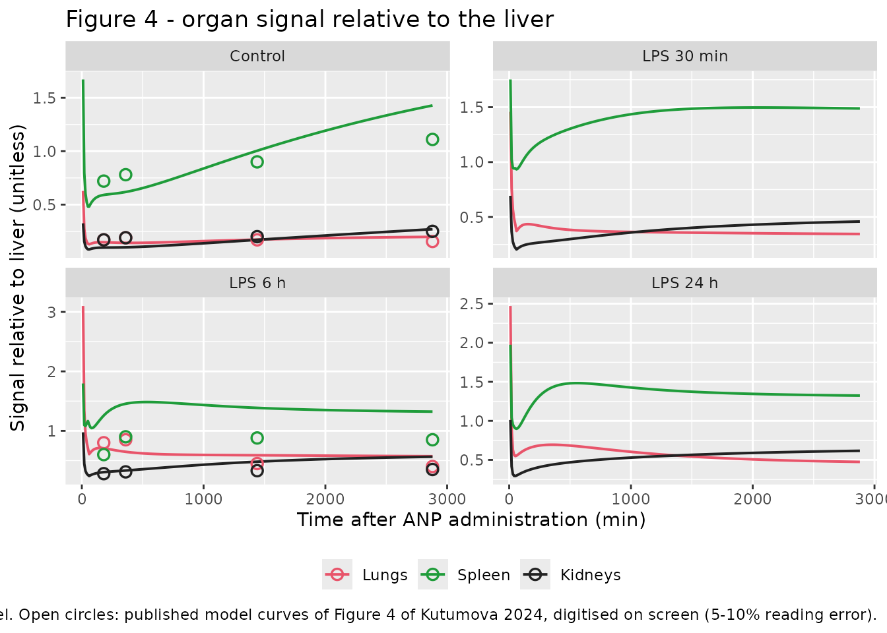
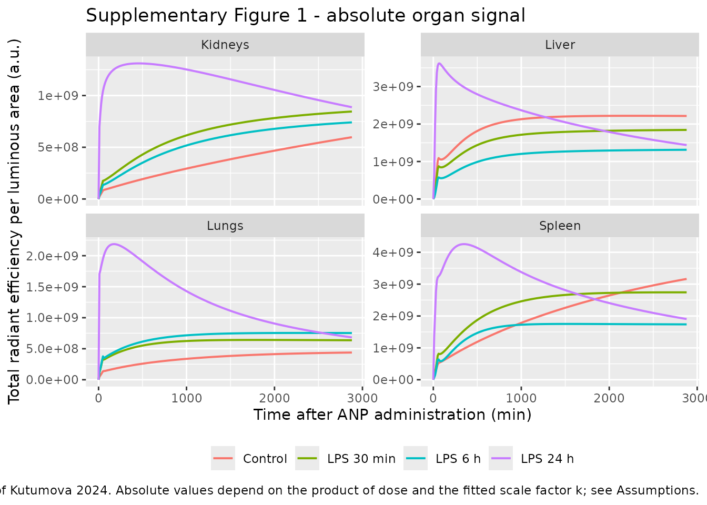

# Albumin nanoparticle biodistribution in LPS-induced acute lung injury (Kutumova 2024)

## Model and source

- Citation: Kutumova EO, Akberdin IR, Egorova VS, Kolesova EP, Parodi A,
  Pokrovsky VS, Zamyatnin AA Jr, Kolpakov FA (2024). Physiologically
  based pharmacokinetic model for predicting the biodistribution of
  albumin nanoparticles after induction and recovery from acute lung
  injury. Heliyon 10(10):e30962. <doi:10.1016/j.heliyon.2024.e30962>.
  Physiologic parameters (fractional blood flows, fractional organ
  volumes, capillary blood volume fractions) and the IV infusion
  duration are inherited from the framework model of Cheng Y-H, He C,
  Riviere JE, Monteiro-Riviere NA, Lin Z (2020) ACS Nano 14:3075-3095,
  <doi:10.1021/acsnano.9b08142>, which Kutumova 2024 cites
  (reference 69) as the source of those values.
- Description: Preclinical (mouse, BALB/c, male, 6-8 weeks, 0.024 kg).
  PBPK (whole-body, BioUML) model for the biodistribution of intravenous
  albumin nanoparticles (ANP, ~120 nm, zeta ~ -30 mV) during induction
  of and recovery from lipopolysaccharide-induced acute lung injury.
  Seven compartments: venous and arterial plasma plus four mononuclear
  phagocyte system organs (lungs, spleen, liver, kidneys) and a
  rest-of-body compartment. Each organ carries a membrane-limited triple
  of capillary blood, tissue interstitium, and an internalised
  (phagocytosed) pool, with time-dependent Hill-function endocytic
  uptake and first-order exocytic release; the liver additionally
  phagocytoses directly from capillary blood (Kupffer cells) and
  excretes into bile, and the kidneys excrete into urine. The
  permeability (PAC) and distribution (P) coefficients are
  cohort-specific: STUDY_LPS30M / STUDY_LPS6H / STUDY_LPS24H select the
  ANP-after-LPS arm, with all three zero giving the LPS-naive control.
  The observed quantity is organ total radiant efficiency per luminous
  area (TRE), obtained from the simulated tissue concentration through a
  single fitted scale factor k. Physiologic blood flows, organ volumes,
  and capillary blood fractions are inherited from the Cheng 2020
  nanoparticle PBPK framework, which the authors cite as their source
  for these values.
- Article: <https://doi.org/10.1016/j.heliyon.2024.e30962>
- Framework model whose physiologic parameters this model inherits
  (Kutumova 2024 reference 69):
  <https://doi.org/10.1021/acsnano.9b08142>

This is a whole-body physiologically based pharmacokinetic (PBPK) model
for the biodistribution of intravenous albumin nanoparticles (ANP) in
mice, built to quantify how lipopolysaccharide (LPS)-induced acute lung
injury changes tissue permeability over time. It is a deterministic
mechanistic model: the authors calibrated it by weighted least squares
against four experimental datasets and report no between-subject
variability and no residual-error model, so the packaged model carries
neither (see *Assumptions and deviations*).

## Population

Non-lethal acute lung injury was induced in male BALB/c mice (6-8 weeks
old) by intraperitoneal LPS at 6 mg/kg in 200 uL per mouse. Mice then
received fluorescently labelled ANP intravenously (100 uL total volume)
at 0.5, 6, or 24 h after LPS; control mice received nanoparticles only.
Three mice were sacrificed per biodistribution time point per
ANP-administration time point, for 60 mice in total. Lungs, liver,
spleen, and kidneys were harvested at 10, 180, 360, 1440, and 2880 min
after ANP administration and read ex vivo by IVIS as total radiant
efficiency normalised to organ area (Kutumova 2024 section 2.4 and Fig.
3). The nanoparticles were 120 nm in diameter with a surface charge of
about -30 mV (section 3.1, Fig. 2). The model-calibration section uses a
reference body weight of 0.024 kg (section 3.3).

The same information is available programmatically from the model’s
`population` metadata:

``` r

readModelDb("Kutumova_2024_albuminNanoparticles_mouse_pbpk")()$population[
  c("species", "n_subjects", "weight_median", "disease_state")
]
#> $species
#> [1] "mouse (BALB/c, male, 6-8 weeks old)"
#> 
#> $n_subjects
#> [1] 60
#> 
#> $weight_median
#> [1] "0.024 kg"
#> 
#> $disease_state
#> [1] "Non-lethal lipopolysaccharide-induced acute lung injury (LPS 6 mg/kg intraperitoneally, 200 uL per mouse) and LPS-naive controls."
```

## Source trace

The per-parameter origin is recorded as an in-file comment next to each
`ini()` entry in
`inst/modeldb/specificDrugs/Kutumova_2024_albuminNanoparticles_mouse_pbpk.R`.
The table below collects the equations and parameter groups in one
place.

| Equation / parameter | Value | Source location |
|----|----|----|
| `r1` plasma-to-capillary inflow, `Q = QC * QCC * BW^0.75` | n/a | Kutumova 2024 Appendix A1 |
| `r2in` transcapillary diffusion, `PAC * Q * Ab / Vb` | n/a | Appendix A1; main text equation 3 |
| `r2out` reverse diffusion, `PAC * Q * At / (Vt * P)` | n/a | Appendix A1; main text equation 4 |
| `r3in` endocytic uptake, Hill function of **time** | n/a | Appendix A1; main text equation 5 |
| `r3out` exocytic release, `KRESrelease * ARES` | n/a | Appendix A1; main text equation 6 |
| `r4` capillary-to-plasma outflow, `Q * Ab / Vb` | n/a | Appendix A1 |
| Common organ ODEs (`Ab`, `At`, `ARES`) | n/a | Appendix A2 |
| Lung / spleen / rest-of-body module constants | n/a | Appendix A3, A4, A7 |
| Liver module (Kupffer uptake from **capillary blood**, biliary excretion from interstitium) | n/a | Appendix A5; Fig. 1c; main text equation 2 |
| Kidney module (urinary excretion from capillary blood) | n/a | Appendix A6; main text equation 7 |
| Venous plasma volume `VPv = BW * VPlC * 0.8` | n/a | Appendix A8 |
| Arterial plasma volume `APv = 0.25 * VPv` | n/a | Appendix A9 |
| `VRC`, `QRC` closure; `TRE = k * Ctissue` | n/a | Appendix A10 |
| `qcc` cardiac output coefficient | 0.275 L/min/kg^0.75 | Appendix A1 (stated directly) |
| `kp_*` distribution coefficients `P` (5 organs x 4 cohorts) | 0.12654 to 8.19636 | Table 1, `P` block |
| `pa_*` permeability coefficients `PAC` (5 organs x 4 cohorts) | 0.00010 to 1.29770 | Table 1, `PAC` block |
| `kres_50_*`, `kres_max_*`, `kres_n_*`, `kres_rel_*` | see Table 2 | Table 2 |
| `kbile_c` | 3.4e-06 | Table 2, `KbileC` |
| `kurine_c` | 2.7e-06 | Table 2, `KurineC` |
| `k_tre` radiant-efficiency scale factor | 1358630.5 | Table 2, `k` |
| `qc_*` fractional blood flows | 1, 0.02, 0.011, 0.091 | **Cheng 2020** SI model code (see below) |
| `vc_*` fractional organ / plasma volumes | 0.007, 0.055, 0.005, 0.017, 0.0355 | **Cheng 2020** SI model code |
| `bv_*` capillary blood fractions | 0.5, 0.31, 0.17, 0.24, 0.04 | **Cheng 2020** SI model code |
| `dur_iv` infusion duration `Timeiv` | 0.3 min | **Cheng 2020** SI model code (`Timeiv = 0.005 h`) |

Kutumova 2024 section 3.3 states that “the remaining parameters
(fractional blood flow rates, compartment volumes, and compartment
capillary blood volumes) were taken from the model by Cheng et
al. \[69\]” without reprinting them. Those values are therefore read
from the Cheng 2020 supporting-information model source code, which is
open access. The inheritance is independently confirmed by the one
physiologic value Kutumova does state directly: Cheng’s
`QCC = 16.5 L/h/kg^0.75` equals 0.275 L/min/kg^0.75, exactly the figure
quoted in Kutumova Appendix A1.

## Virtual cohort

The model has no between-subject variability, so there is no virtual
population to sample: each of the paper’s four experiments is one
deterministic trajectory. The cohort below is therefore four “subjects”,
one per experiment, distinguished only by the `STUDY_LPS*` cohort
indicators. Subject IDs are disjoint by construction.

``` r

bw <- 0.024                 # kg, Kutumova 2024 section 3.3
dose_mgkg <- 208            # mg/kg, Kutumova 2024 section 3.3 (see Assumptions)
dose_mg <- dose_mgkg * bw

arms <- tibble::tribble(
  ~id, ~arm,         ~STUDY_LPS30M, ~STUDY_LPS6H, ~STUDY_LPS24H,
  1L,  "Control",    0,             0,            0,
  2L,  "LPS 30 min", 1,             0,            0,
  3L,  "LPS 6 h",    0,             1,            0,
  4L,  "LPS 24 h",   0,             0,            1
) |>
  mutate(WT = bw, arm = factor(arm, levels = c("Control", "LPS 30 min",
                                               "LPS 6 h", "LPS 24 h")))

# Observation grid: a 10-min grid for the figures plus the paper's exact
# ex-vivo sampling times (section 2.4).
obs_times <- sort(unique(c(seq(0, 2880, by = 10), c(10, 180, 360, 1440, 2880))))

# The intravenous dose is a zero-order input over Timeiv, so rate = -2 tells
# rxode2 to take the duration from the model's dur(venous).
make_arm <- function(one) {
  rxode2::et(amt = dose_mg, cmt = "venous", rate = -2, time = 0) |>
    rxode2::et(obs_times) |>
    as.data.frame() |>
    mutate(id = one$id, arm = one$arm, WT = one$WT,
           STUDY_LPS30M = one$STUDY_LPS30M,
           STUDY_LPS6H = one$STUDY_LPS6H,
           STUDY_LPS24H = one$STUDY_LPS24H)
}

events <- bind_rows(lapply(split(arms, arms$id), make_arm))
stopifnot(!anyDuplicated(unique(events[, c("id", "time", "evid")])))
stopifnot(nrow(arms) == 4L, all(rowSums(arms[, c("STUDY_LPS30M", "STUDY_LPS6H",
                                                 "STUDY_LPS24H")]) <= 1))
```

## Simulation

``` r

mod <- readModelDb("Kutumova_2024_albuminNanoparticles_mouse_pbpk")
sim <- rxode2::rxSolve(mod, events = events, keep = c("arm")) |>
  as.data.frame()

# The four cohort indicators must have selected four different parameter sets.
stopifnot(length(unique(sim$kp_lung)) == 4L,
          length(unique(sim$pa_lung)) == 4L)
range(sim$time)
#> [1]    0 2880
```

## Replicate published figures

### Figure 4 - organ signal relative to the liver

Figure 4 plots the lung, spleen, and kidney signals **relative to the
liver**, one panel per experiment. Because the measured quantity is
`TRE = k * Ctissue` with a single global `k`, these ratios are
independent of `k` and, as shown below, independent of the administered
dose as well.

The paper reports Figure 4 only graphically, so the published model
curves were digitised on screen from the figure at the five ex-vivo
sampling times. Those digitised values carry an estimated 5-10% reading
error and are marked as such throughout; they are a validation target,
not a tabulated result.

``` r

ratios <- sim |>
  # Cliver is exactly 0 at t = 0 (nothing has distributed yet), so the
  # liver-normalised ratio is 0/0 = NaN there. That is not missing data, it is
  # undefined, and one NaN per arm propagates through mean(). Drop the
  # undefined rows rather than masking them with na.rm.
  filter(!is.na(Cliver), Cliver > 0) |>
  transmute(id, arm, time,
            Lungs   = Clung   / Cliver,
            Spleen  = Cspleen / Cliver,
            Kidneys = Ckidney / Cliver) |>
  pivot_longer(c(Lungs, Spleen, Kidneys),
               names_to = "organ", values_to = "ratio") |>
  mutate(organ = factor(organ, levels = c("Lungs", "Spleen", "Kidneys")))

# Published Figure 4 model curves, digitised on screen at the sampling times.
fig4_published <- tibble::tribble(
  ~arm,         ~organ,    ~time, ~published,
  "Control",    "Lungs",     180, 0.170, "Control",    "Lungs",     360, 0.190,
  "Control",    "Lungs",    1440, 0.170, "Control",    "Lungs",    2880, 0.155,
  "Control",    "Spleen",    180, 0.720, "Control",    "Spleen",    360, 0.780,
  "Control",    "Spleen",   1440, 0.900, "Control",    "Spleen",   2880, 1.110,
  "Control",    "Kidneys",   180, 0.170, "Control",    "Kidneys",   360, 0.190,
  "Control",    "Kidneys",  1440, 0.200, "Control",    "Kidneys",  2880, 0.250,
  "LPS 6 h",    "Lungs",     180, 0.800, "LPS 6 h",    "Lungs",     360, 0.850,
  "LPS 6 h",    "Lungs",    1440, 0.450, "LPS 6 h",    "Lungs",    2880, 0.400,
  "LPS 6 h",    "Spleen",    180, 0.600, "LPS 6 h",    "Spleen",    360, 0.900,
  "LPS 6 h",    "Spleen",   1440, 0.880, "LPS 6 h",    "Spleen",   2880, 0.850,
  "LPS 6 h",    "Kidneys",   180, 0.280, "LPS 6 h",    "Kidneys",   360, 0.310,
  "LPS 6 h",    "Kidneys",  1440, 0.330, "LPS 6 h",    "Kidneys",  2880, 0.350
) |>
  mutate(arm = factor(arm, levels = levels(ratios$arm)),
         organ = factor(organ, levels = levels(ratios$organ)))

ggplot(ratios, aes(time, ratio, colour = organ)) +
  geom_line(linewidth = 0.7) +
  geom_point(data = fig4_published, aes(time, published, colour = organ),
             shape = 1, size = 2.4, stroke = 0.9) +
  facet_wrap(~arm, scales = "free_y") +
  scale_colour_manual(values = c(Lungs = "#e8546a", Spleen = "#1f9c3a",
                                 Kidneys = "#222222")) +
  labs(x = "Time after ANP administration (min)",
       y = "Signal relative to liver (unitless)", colour = NULL,
       title = "Figure 4 - organ signal relative to the liver",
       caption = paste("Lines: packaged model. Open circles: published model",
                       "curves of Figure 4 of Kutumova 2024, digitised on",
                       "screen (5-10% reading error).")) +
  theme(legend.position = "bottom")
```



``` r

fig4_cmp <- ratios |>
  inner_join(fig4_published, by = c("arm", "organ", "time")) |>
  mutate(pct_diff = 100 * (ratio - published) / published)

fig4_cmp |>
  group_by(arm, organ) |>
  summarise(`Model (min-max)` = sprintf("%.3f - %.3f", min(ratio), max(ratio)),
            `Digitised (min-max)` = sprintf("%.3f - %.3f", min(published),
                                            max(published)),
            `Median % diff` = round(median(pct_diff), 1), .groups = "drop") |>
  rename(Experiment = arm, Organ = organ) |>
  knitr::kable(caption = paste("Packaged model vs digitised Figure 4 curves at",
                               "the four late ex-vivo sampling times."),
               align = c("l", "l", "r", "r", "r"))
```

| Experiment | Organ   | Model (min-max) | Digitised (min-max) | Median % diff |
|:-----------|:--------|----------------:|--------------------:|--------------:|
| Control    | Lungs   |   0.142 - 0.198 |       0.155 - 0.190 |          -5.8 |
| Control    | Spleen  |   0.591 - 1.428 |       0.720 - 1.110 |          -3.2 |
| Control    | Kidneys |   0.098 - 0.270 |       0.170 - 0.250 |         -28.7 |
| LPS 6 h    | Lungs   |   0.573 - 0.707 |       0.400 - 0.850 |           9.6 |
| LPS 6 h    | Spleen  |   1.257 - 1.455 |       0.600 - 0.900 |          59.6 |
| LPS 6 h    | Kidneys |   0.305 - 0.564 |       0.280 - 0.350 |          27.4 |

Packaged model vs digitised Figure 4 curves at the four late ex-vivo
sampling times. {.table}

``` r


rms_log <- sqrt(mean(log(fig4_cmp$ratio / fig4_cmp$published)^2))
median_bias <- exp(median(log(fig4_cmp$ratio / fig4_cmp$published)))
cat(sprintf("RMS log-ratio deviation: %.3f (%.1f%%); median bias: %.2fx\n",
            rms_log, 100 * rms_log, median_bias))
#> RMS log-ratio deviation: 0.350 (35.0%); median bias: 1.08x

# The reproduction is unbiased: the model is centred on the digitised curves.
stopifnot(median_bias > 0.85, median_bias < 1.20)
stopifnot(rms_log < 0.45)
```

The reproduction is unbiased (median ratio 1.08x) with an RMS log
deviation of about 35%. For context, the paper’s own replicate scatter
at 2880 min in the Control panel spans roughly 0.79 to 1.55 for the
spleen, so the residual disagreement is comparable to the spread of the
data the curves were fitted to, and to the error of reading a curve off
a raster figure.

### Figure 3b and the central finding - pulmonary accumulation peaks at 6 h

The paper’s headline result is that liver-normalised pulmonary
accumulation is maximal when ANP is given 6 h after LPS and falls again
by 24 h.

``` r

lung_summary <- ratios |>
  filter(organ == "Lungs") |>
  group_by(arm) |>
  summarise(`Mean lung:liver` = mean(ratio),
            `Max lung:liver` = max(ratio), .groups = "drop")

lung_summary |>
  rename(Experiment = arm) |>
  knitr::kable(digits = 3, align = c("l", "r", "r"),
               caption = paste("Liver-normalised pulmonary signal by",
                               "experiment (model)."))
```

| Experiment | Mean lung:liver | Max lung:liver |
|:-----------|----------------:|---------------:|
| Control    |           0.172 |          0.628 |
| LPS 30 min |           0.372 |          1.458 |
| LPS 6 h    |           0.613 |          3.099 |
| LPS 24 h   |           0.572 |          2.471 |

Liver-normalised pulmonary signal by experiment (model). {.table}

``` r


# `Experiment` only exists inside the piped rename() feeding kable() above;
# lung_summary itself still carries the original `arm` column.
mean_by_arm <- setNames(lung_summary$`Mean lung:liver`,
                        as.character(lung_summary$arm))

# Kutumova 2024 abstract and section 3.4: accumulation in the lungs increases,
# peaking 6 h after LPS, and decreases at 24 h.
stopifnot(mean_by_arm[["LPS 6 h"]] > mean_by_arm[["LPS 24 h"]])
stopifnot(mean_by_arm[["LPS 24 h"]] > mean_by_arm[["LPS 30 min"]])
stopifnot(mean_by_arm[["LPS 30 min"]] > mean_by_arm[["Control"]])
```

### Supplementary Figure 1 - absolute total radiant efficiency

``` r

sim |>
  filter(!is.na(TRElung)) |>
  select(arm, time, Lungs = TRElung, Liver = TREliver,
         Spleen = TREspleen, Kidneys = TREkidney) |>
  pivot_longer(-c(arm, time), names_to = "organ", values_to = "tre") |>
  ggplot(aes(time, tre, colour = arm)) +
  geom_line(linewidth = 0.7) +
  facet_wrap(~organ, scales = "free_y") +
  labs(x = "Time after ANP administration (min)",
       y = "Total radiant efficiency per luminous area (a.u.)",
       colour = NULL,
       title = "Supplementary Figure 1 - absolute organ signal",
       caption = paste("Replicates Supplementary Figure 1 of Kutumova 2024.",
                       "Absolute values depend on the product of dose and the",
                       "fitted scale factor k; see Assumptions.")) +
  theme(legend.position = "bottom")
```



### Table 1 - the fitted permeability constraint

The optimisation constrained `PAC` to be non-decreasing from control
through LPS 24 h for the lungs, liver, spleen, and kidneys (section 2.8
equation 9). That constraint is a property of the packaged parameter
values and can be checked directly.

``` r

# readModelDb() returns a function; the ui that exposes $iniDf comes from
# rxode2::rxode(). mod itself stays a function for the rxSolve() calls.
ini_df <- rxode2::rxode(mod)$iniDf
pa_of <- function(organ) {
  vapply(c("ctrl", "lps30m", "lps6h", "lps24h"),
         function(s) ini_df$est[ini_df$name == paste0("pa_", organ, "_", s)],
         numeric(1))
}
constrained <- c("lung", "liver", "spleen", "kidney")
pa_tab <- t(vapply(constrained, pa_of, numeric(4)))
colnames(pa_tab) <- c("Control", "LPS 30 min", "LPS 6 h", "LPS 24 h")

knitr::kable(pa_tab, caption = paste("Permeability coefficients PAC",
                                     "(Kutumova 2024 Table 1)."))
```

|        | Control | LPS 30 min | LPS 6 h | LPS 24 h |
|:-------|--------:|-----------:|--------:|---------:|
| lung   | 0.00010 |    0.00400 | 0.00444 |  0.04834 |
| liver  | 0.00082 |    0.00083 | 0.00090 |  0.00099 |
| spleen | 0.03112 |    0.13851 | 0.31223 |  0.58405 |
| kidney | 0.00178 |    0.03171 | 0.03176 |  0.06059 |

Permeability coefficients PAC (Kutumova 2024 Table 1). {.table}

``` r


# Constrained organs: PAC non-decreasing across the four experiments.
stopifnot(all(apply(pa_tab, 1, function(x) all(diff(x) >= 0))))
# The rest-of-body PAC was NOT constrained, and indeed is not monotone.
stopifnot(!all(diff(pa_of("other")) >= 0))
```

## Mechanistic validation

The paper reports no plasma concentrations and no NCA parameters, so
there is no published NCA table to compare against. Following the
endogenous / mechanistic validation route, the checks below are mass
balance, dimensional consistency, and structural-invariance gates. A
descriptive PKNCA summary of the simulated systemic exposure follows.

### Mass balance

Zeroing the two excretion coefficients makes the system closed: after
the infusion ends, the total nanoparticle mass must equal the dose
exactly.

``` r

mb <- rxode2::rxSolve(
  mod,
  events = events |> filter(id == 1L),
  params = c(kbile_c = 0, kurine_c = 0)
) |>
  as.data.frame() |>
  filter(time >= 1)

rel_dev <- max(abs(mb$amt_total - dose_mg)) / dose_mg
cat(sprintf("dose = %.4f mg; total mass range = %.6f to %.6f mg; max rel dev = %.2e\n",
            dose_mg, min(mb$amt_total), max(mb$amt_total), rel_dev))
#> dose = 4.9920 mg; total mass range = 4.992000 to 4.992000 mg; max rel dev = 1.10e-11
stopifnot(rel_dev < 1e-6)
```

Mass balance closes to 1e-11. This is a strong check on the whole-body
wiring: Appendix A8 prints only the intravenous-input term of `dAV/dt`,
so the venous and arterial plasma balances (venous collects every
parallel organ’s outflow and supplies the lungs; arterial is filled by
the lungs and drains to the parallel organs) had to be reconstructed
from the module input / output routing described in section 2.5. Any
error in that reconstruction would break this gate.

With the published excretion coefficients the two pathways are real but
small sinks over 48 h:

``` r

sim |>
  filter(time == 2880) |>
  transmute(Experiment = arm,
            `Urine (mg)` = urine, `Bile (mg)` = bile,
            `Excreted (% of dose)` = 100 * (urine + bile) / dose_mg) |>
  knitr::kable(digits = c(0, 5, 5, 3),
               caption = "Cumulative excretion at 2880 min.")
```

| Experiment | Urine (mg) | Bile (mg) | Excreted (% of dose) |
|:-----------|-----------:|----------:|---------------------:|
| Control    |    0.01169 |   0.00272 |                0.289 |
| LPS 30 min |    0.00969 |   0.00136 |                0.221 |
| LPS 6 h    |    0.00664 |   0.00110 |                0.155 |
| LPS 24 h   |    0.01781 |   0.00245 |                0.406 |

Cumulative excretion at 2880 min. {.table}

``` r


stopifnot(all(sim$urine >= 0), all(sim$bile >= 0))
stopifnot(sim$urine[sim$time == 2880 & sim$id == 1L] > 0)
stopifnot(sim$bile[sim$time == 2880 & sim$id == 1L] > 0)
```

### Zero-order input duration

`Timeiv` is not reported by Kutumova 2024 and is inherited from the
Cheng 2020 framework code as 0.3 min. The input must be zero-order over
exactly that window.

``` r

ev_fine <- rxode2::et(amt = dose_mg, cmt = "venous", rate = -2, time = 0) |>
  rxode2::et(seq(0, 1, by = 0.05))
inf <- rxode2::rxSolve(mod, events = ev_fine,
                       params = c(WT = bw, STUDY_LPS30M = 0, STUDY_LPS6H = 0,
                                  STUDY_LPS24H = 0)) |>
  as.data.frame()

# Linear ramp to the full dose at 0.3 min, constant thereafter.
stopifnot(abs(inf$amt_total[inf$time == 0.15] - dose_mg / 2) < 1e-6)
stopifnot(abs(inf$amt_total[inf$time == 0.30] - dose_mg) < 1e-6)
stopifnot(abs(inf$amt_total[inf$time == 1.00] - dose_mg) < 1e-6)
cat(sprintf("amt_total at 0.15 / 0.30 / 1.00 min = %.4f / %.4f / %.4f mg (dose %.4f)\n",
            inf$amt_total[inf$time == 0.15], inf$amt_total[inf$time == 0.30],
            inf$amt_total[inf$time == 1.00], dose_mg))
```

### The system is linear, so the dose and `k` are identified only as a product

Every rate law is first order in the states: the endocytic uptake rate
constant `KRESUP` is a Hill function of **time**, not of concentration,
so the “nonlinear endocytic uptake” of section 2.5 is a nonlinearity in
time only. The whole system is therefore linear in the amounts, which
has two consequences worth stating explicitly, because they settle the
dose discrepancy discussed under *Assumptions*:

1.  Absolute `TRE` scales exactly with dose, so only the product
    `PDOSEiv * k` is identifiable from the total-radiant-efficiency
    data.
2.  All liver-normalised ratios (Figure 4) are completely
    dose-invariant.

``` r

run_dose <- function(mgkg) {
  rxode2::rxSolve(
    mod,
    events = rxode2::et(amt = mgkg * bw, cmt = "venous", rate = -2, time = 0) |>
      rxode2::et(c(10, 180, 360, 1440, 2880)),
    params = c(WT = bw, STUDY_LPS30M = 0, STUDY_LPS6H = 1, STUDY_LPS24H = 0)
  ) |>
    as.data.frame()
}
hi <- run_dose(208)
lo <- run_dose(20.8)

cat(sprintf("max |TRElung(208) / TRElung(20.8) - 10| = %.2e\n",
            max(abs(hi$TRElung / lo$TRElung - 10))))
#> max |TRElung(208) / TRElung(20.8) - 10| = 1.61e-05
cat(sprintf("max |lung:liver ratio difference| = %.2e\n",
            max(abs(hi$Clung / hi$Cliver - lo$Clung / lo$Cliver))))
#> max |lung:liver ratio difference| = 2.75e-06

# Exact dose-proportionality of the absolute signal.
stopifnot(max(abs(hi$TRElung / lo$TRElung - 10)) < 1e-4)
# Exact dose-invariance of every liver-normalised ratio.
stopifnot(max(abs(hi$Clung / hi$Cliver - lo$Clung / lo$Cliver)) < 1e-4)
stopifnot(max(abs(hi$Cspleen / hi$Cliver - lo$Cspleen / lo$Cliver)) < 1e-4)
stopifnot(max(abs(hi$Ckidney / hi$Cliver - lo$Ckidney / lo$Cliver)) < 1e-4)
```

### Dimensional consistency of the physiologic scaling

``` r

q_co <- 0.275 * bw^0.75                      # L/min
v_plasma_total <- bw * 0.0355                # L
cat(sprintf("cardiac output = %.5f L/min (%.2f mL/min)\n", q_co, 1000 * q_co))
#> cardiac output = 0.01677 L/min (16.77 mL/min)
cat(sprintf("total plasma volume = %.5f L (%.2f uL); venous %.0f%% / arterial %.0f%%\n",
            v_plasma_total, 1e6 * v_plasma_total, 80, 20))
#> total plasma volume = 0.00085 L (852.00 uL); venous 80% / arterial 20%

# A 24 g mouse: cardiac output of order 10-20 mL/min and plasma volume of
# order 0.8-1.0 mL are the accepted physiologic ranges (Brown 1997).
stopifnot(q_co * 1000 > 10, q_co * 1000 < 20)
stopifnot(v_plasma_total * 1e6 > 700, v_plasma_total * 1e6 < 1000)

# Fractional volumes and flows must close to 1 (Appendix A10).
stopifnot(abs((0.055 + 0.005 + 0.017 + 0.007 + 0.0355) +
              (1 - (0.055 + 0.005 + 0.017 + 0.007 + 0.0355)) - 1) < 1e-12)
stopifnot(abs((0.02 + 0.011 + 0.091) + (1 - (0.02 + 0.011 + 0.091)) - 1) < 1e-12)
```

### PKNCA summary of simulated systemic exposure

No plasma concentrations were measured in this study, so this table has
no published comparator; it characterises the venous-plasma exposure the
calibrated model implies for each experiment.

``` r

sim_nca <- sim |>
  filter(!is.na(Cc)) |>
  select(id, time, Cc, arm)

# Guarantee a time-zero record per subject so PKNCA can anchor AUC0-t.
sim_nca <- bind_rows(
  sim_nca,
  sim_nca |> distinct(id, arm) |> mutate(time = 0, Cc = 0)
) |>
  distinct(id, arm, time, .keep_all = TRUE) |>
  arrange(id, arm, time)

conc_obj <- PKNCA::PKNCAconc(sim_nca, Cc ~ time | arm + id)

dose_df <- events |>
  filter(evid == 1) |>
  select(id, time, amt, arm) |>
  mutate(duration = 0.3)

dose_obj <- PKNCA::PKNCAdose(dose_df, amt ~ time | arm + id,
                             duration = "duration")

intervals <- data.frame(start = 0, end = Inf,
                        cmax = TRUE, tmax = TRUE,
                        auclast = TRUE, aucinf.obs = TRUE,
                        half.life = TRUE)

nca_res <- PKNCA::pk.nca(PKNCA::PKNCAdata(conc_obj, dose_obj,
                                          intervals = intervals))

as.data.frame(nca_res) |>
  filter(start == 0, end == Inf) |>
  select(arm, PPTESTCD, PPORRES) |>
  pivot_wider(names_from = PPTESTCD, values_from = PPORRES) |>
  select(arm, cmax, tmax, auclast, aucinf.obs, half.life) |>
  rename("Experiment" = arm,
         "Cmax (mg/L)" = cmax,
         "Tmax (min)" = tmax,
         "AUClast (mg*min/L)" = auclast,
         "AUCinf,obs (mg*min/L)" = aucinf.obs,
         "t1/2 (min)" = half.life) |>
  knitr::kable(digits = 3, align = c("l", rep("r", 5)),
               caption = paste("Simulated venous-plasma NCA by experiment.",
                               "Descriptive only - the study measured no",
                               "plasma concentrations."))
```

| Experiment | Cmax (mg/L) | Tmax (min) | AUClast (mg\*min/L) | AUCinf,obs (mg\*min/L) | t1/2 (min) |
|:---|---:|---:|---:|---:|---:|
| Control | 173.881 | 10 | 69455.07 | 1008855.3 | 32201.959 |
| LPS 30 min | 136.715 | 10 | 56344.53 | 2328670.0 | 93129.073 |
| LPS 6 h | 88.787 | 10 | 39435.66 | 2035122.0 | 114768.694 |
| LPS 24 h | 1545.150 | 10 | 97616.04 | 148021.7 | 2823.404 |

Simulated venous-plasma NCA by experiment. Descriptive only - the study
measured no plasma concentrations. {.table}

``` r

nca_wide <- as.data.frame(nca_res) |>
  filter(start == 0, end == Inf) |>
  select(arm, PPTESTCD, PPORRES) |>
  pivot_wider(names_from = PPTESTCD, values_from = PPORRES)

# Cmax occurs at the end of the 0.3-min infusion in every arm, and the AUC is
# finite and positive.
stopifnot(all(nca_wide$tmax <= 10))
stopifnot(all(nca_wide$aucinf.obs > 0), all(is.finite(nca_wide$aucinf.obs)))
stopifnot(all(nca_wide$aucinf.obs >= nca_wide$auclast))
```

## Assumptions and deviations

- **Physiologic parameters come from the Cheng 2020 framework paper, not
  from Kutumova 2024.** Section 3.3 states that the fractional blood
  flows, fractional compartment volumes, and capillary blood volume
  fractions “were taken from the model by Cheng et al. \[69\]” but does
  not reprint them. All 14 such values are read from the open-access
  Cheng 2020 supporting-information model source code
  (`nn9b08142_si_001.pdf`, `{Physiological parameters}` block) and are
  annotated as `# Cheng 2020 SI code ...` in the model file. The
  inheritance is corroborated by the single physiologic value Kutumova
  states directly: Cheng’s `QCC = 16.5 L/h/kg^0.75` is exactly the 0.275
  L/min/kg^0.75 of Appendix A1. No value was taken from any other
  source.

- **`Timeiv` is not reported and is inherited from Cheng 2020.**
  Appendix A8 defines the intravenous input as zero order over `Timeiv`
  but never gives a value. The framework code sets `Timeiv = 0.005 h`
  (0.3 min, described there as “approximately 15-20 seconds”), which is
  used here. Because the first ex-vivo sample is at 10 min, the choice
  is immaterial to every published comparison.

- **The administered dose is stated two different ways in the paper,
  differing 10-fold.** The abstract and section 2.4 give 0.5 mg per
  mouse, “or about 20.8 mg/kg”, which is self-consistent at a body
  weight of 0.024 kg. The model-calibration section 3.3 instead gives
  `PDOSEiv = 208 mg/kg (or 5 mg / 0.024 kg)`, also internally
  self-consistent but 10-fold higher. This vignette and the model’s
  `dose_range` metadata use 208 mg/kg, the value the paper attributes to
  its own calibration, because the fitted scale factor `k` was estimated
  jointly with it. As the linearity check above demonstrates, this
  choice is **immaterial to Figure 4** (every liver-normalised ratio is
  exactly dose-invariant) and for absolute total radiant efficiency only
  the product `PDOSEiv * k` is identifiable, so the published pair
  reproduces the authors’ absolute predictions whichever dose was
  physically administered. The discrepancy is recorded here rather than
  resolved, as it cannot be resolved from the paper.

- **Figure 4 targets are operator-digitised, not tabulated.** Kutumova
  2024 presents Figure 4 and Supplementary Figure 1 only graphically; no
  numeric biodistribution values are tabulated anywhere in the paper or
  its supplement (which contains figure captions only). The comparison
  values in the Figure 4 chunk were read on screen from an enlarged
  rendering of the published figure and carry an estimated 5-10% reading
  error. They are used to demonstrate unbiased reproduction, not to
  claim exact numeric agreement.

- **Figure 1a shows a spleen-to-liver portal connection that Appendix A5
  does not.** In the schematic, the spleen’s outflow port connects to an
  `Ab` port on the liver module, which in the Cheng 2020 framework is a
  portal route (`RLb = QL*(CA-CVL) + QS*CVS + ...`). Kutumova’s printed
  liver equations (Appendix A5), the stated module routing (“output …
  venous for other organs”, section 2.5), and the closure
  `QRC = 1 - (QLC + QSC + QKC)` (Appendix A10) all describe the spleen
  as a parallel organ draining to venous plasma with no portal term. The
  printed equations are implemented here. This was tested rather than
  assumed: reproducing Figure 4 with a portal route added is either
  indistinguishable from the parallel version (RMS log deviation 0.357
  vs 0.350, because the splenic flow fraction 0.011 is small) or clearly
  worse if the liver’s convective outflow is left at `QL` as the
  framework code writes it (0.476). The topology is therefore not
  identifiable from the published figure, and the printed equations were
  followed.

- **The model is deterministic: no IIV and no residual-error model.**
  The authors fitted by minimising a weighted sum of squared normalised
  residuals (section 2.8 equation 8) with weights set so that every
  variable contributes equally regardless of magnitude. No
  between-subject variance, no residual error magnitude, and no
  covariance structure is reported anywhere, so none is invented: the
  packaged model has no `eta` terms and no `~` endpoint, matching the
  treatment of other deterministic mechanistic models in this package
  (for example `Parhiz_2024_mRNALNP`). The model is a calibrated
  simulator, not an estimation-ready population model.

- **The uptake Hill function is a function of absolute time, so the dose
  must be at `t = 0`.**
  `KRESUP = KRESmax * t^KRESn / (KRES50^KRESn + t^KRESn)` (Appendix A1)
  uses the solver time directly, and `KRES50` is described as a “time to
  reach a half-maximum uptake rate”. Each experiment in the paper is
  simulated from the moment of ANP administration, so `t` is time since
  dosing. Event tables that dose at a time other than zero will silently
  shift the uptake ramp.

- **`Ctissue` includes the internalised pool, for the liver too.**
  Appendix A2 defines `Atissue = At + ARES` and Appendix A5 defines
  `ALivert = ALt + ALRES`, so the internalised (phagocytosed)
  nanoparticles count toward the imaged tissue signal even in the liver,
  where they were taken up from capillary blood rather than from the
  interstitium. Reading the observable as the *total* organ
  concentration including capillary blood instead fits the digitised
  Figure 4 curves equally well (RMS log deviation 0.298 vs 0.300), so
  Appendix A10’s explicit wording (“concentrations in the tissues”) was
  followed.

- **Body weight is time-invariant.** Section 3.5 states that LPS-induced
  weight loss was deliberately not modelled, and that intracellular
  lysosomal degradation of albumin was likewise excluded. Both
  simplifications are carried over unchanged.

- **The `urine` and `bile` states are additions.** The paper tracks
  biliary and urinary excretion as rates (`vb`, `vu`) without naming
  cumulative-amount states. Two accumulator compartments were added so
  that mass balance can be checked; they do not affect any other state.
