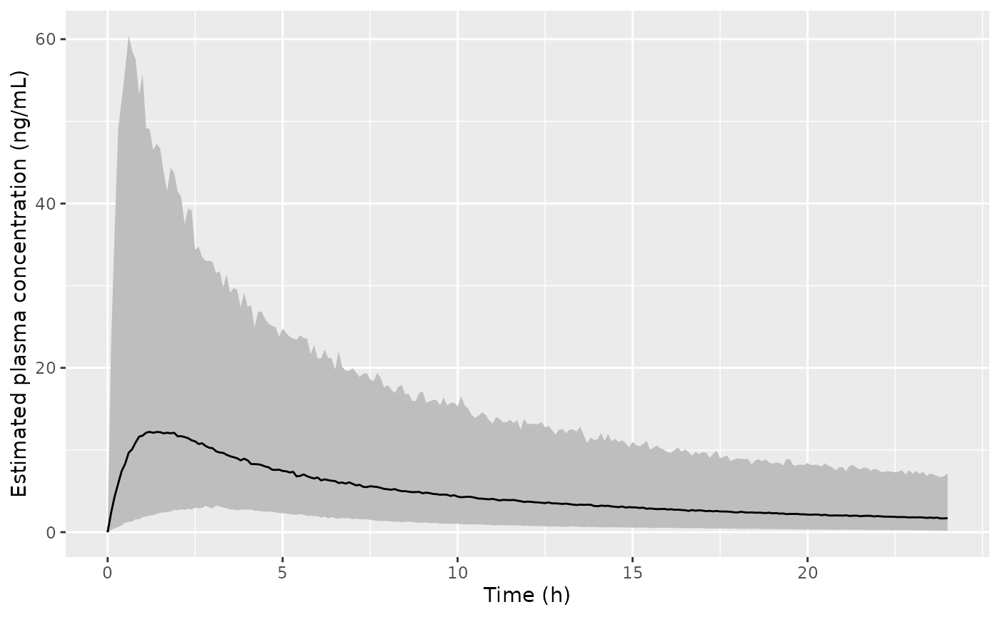
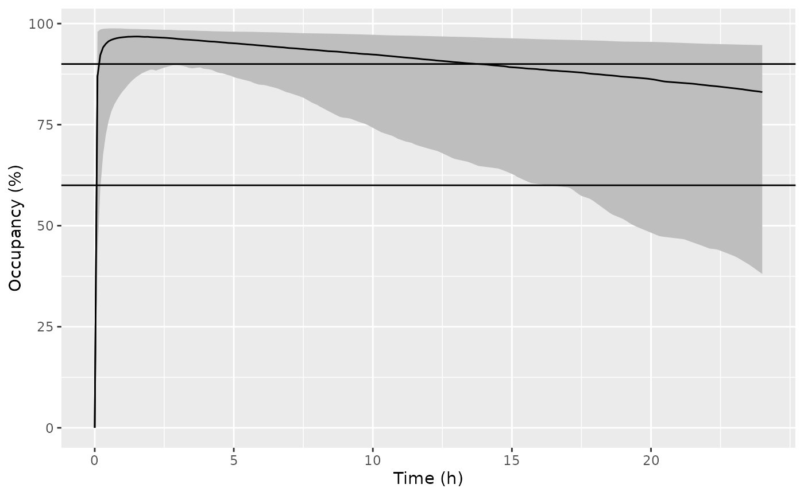

# Kyhl_2016_nalmefene

``` r
library(nlmixr2lib)
library(dplyr)
#> 
#> Attaching package: 'dplyr'
#> The following objects are masked from 'package:stats':
#> 
#>     filter, lag
#> The following objects are masked from 'package:base':
#> 
#>     intersect, setdiff, setequal, union
library(ggplot2)
```

## Nalmefene replication

Replicate figures 5 in the publication with a single 20 mg dose in the
fed state. Assumed the mean age, lean body mass, a tablet, and the
LC-MS/MS assay was used. The paper indicates that simulations used a
uniform age distribution of 18-80 years and LBM of `~N(56,72)`. Since no
limits were provided for LBM in the simulation settings, these
simulation settings were not used.

``` r
dSimDose <-
  data.frame(
    ID = 1,
    AMT = 20, # mg/kg
    TIME = 0,
    EVID = 1,
    CMT = "depot"
  )
dSimObs <-
  data.frame(
    ID = 1,
    AMT = 0,
    WT = 5,
    TIME = seq(0, 24, by = 0.1),
    EVID = 0,
    CMT = "central"
  )
dSimPrep <-
  dplyr::bind_rows(dSimDose, dSimObs) |>
  dplyr::mutate(
    LBM = 56.28,
    AGE = 28,
    RIA_ASSAY = 0,
    FED = 1,
    TABLET = 1
  )
Kyhl2016Nalmefene <- readModelDb("Kyhl_2016_nalmefene")
# Set BSV to zero for simulation to get a reproducible result
dSimNalmefene <- rxode2::rxSolve(Kyhl2016Nalmefene, events = dSimPrep, nStud = 500)
dSimNalmefene$Analyte <- "Nalmefene"
```

### Plot plasma PK

Replicate figure 5 from the paper. Assuming that the “confidence bounds”
are actually 95% prediction intervals.

``` r
dSimNalmefenePlot <-
  dSimNalmefene |>
  group_by(time) |>
  summarize(
    Q025_pk = quantile(sim, probs = 0.025),
    Q50_pk = quantile(sim, probs = 0.5),
    Q975_pk = quantile(sim, probs = 0.975),
    Q025_occ = quantile(e_mu_opioid, probs = 0.025),
    Q50_occ = quantile(e_mu_opioid, probs = 0.5),
    Q975_occ = quantile(e_mu_opioid, probs = 0.975)
  )

ggplot(dSimNalmefenePlot, aes(x = time, y = Q50_pk, ymin = Q025_pk, ymax = Q975_pk)) +
  geom_line() +
  labs(
    x = "Time (h)",
    y = "Estimated plasma concentration (ng mL^-1)"
  ) +
  geom_ribbon(fill = "gray") +
  geom_line() +
  scale_x_continuous(breaks = seq(0, 24, by = 5))
```



``` r

ggplot(dSimNalmefenePlot, aes(x = time, y = Q50_occ, ymin = Q025_occ, ymax = Q975_occ)) +
  geom_line() +
  labs(
    x = "Time (h)",
    y = "Occupancy (%)"
  ) +
  geom_ribbon(fill = "gray") +
  geom_line() +
  geom_hline(yintercept = c(60, 90)) +
  scale_x_continuous(breaks = seq(0, 24, by = 5))
```


