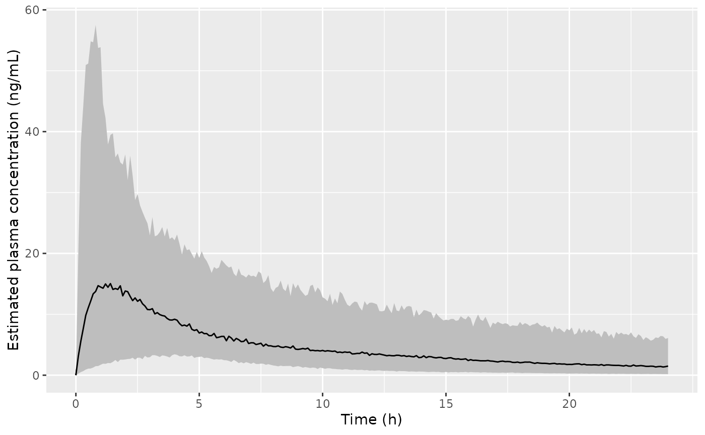
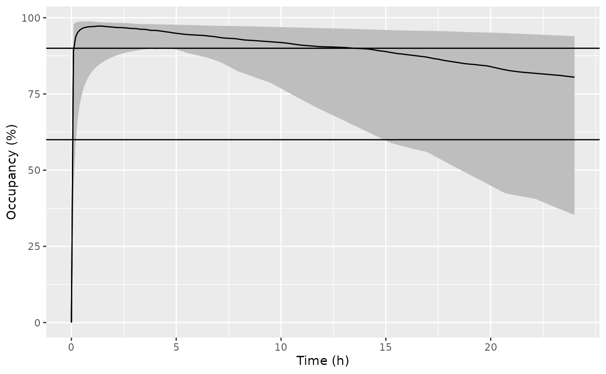

# Kyhl_2016_nalmefene

``` r
library(nlmixr2lib)
library(PKNCA)
#> 
#> Attaching package: 'PKNCA'
#> The following object is masked from 'package:stats':
#> 
#>     filter
library(dplyr)
#> 
#> Attaching package: 'dplyr'
#> The following objects are masked from 'package:stats':
#> 
#>     filter, lag
#> The following objects are masked from 'package:base':
#> 
#>     intersect, setdiff, setequal, union
library(ggplot2)
```

## Model and source

- Citation: Kyhl LE, Li S, Faerch KU, Soegaard B, Larsen F, Areberg J.
  Population pharmacokinetics of nalmefene in healthy subjects and its
  relation to μ-opioid receptor occupancy. Br J Clin Pharmacol. 2016
  Feb;81(2):290-300. doi: 10.1111/bcp.12805. Epub 2016 Jan 27. PMID:
  26483076; PMCID: PMC4833148.
- Description: Population PK model for nalmefene in healthy volunteers
  (Kyhl 2016): two-compartment model with first-order absorption after
  oral dosing, separate absorption rates for tablet and solution
  formulations, and a link to mu-opioid receptor occupancy.
- Article: <https://doi.org/10.1111/bcp.12805>

## Nalmefene replication

Replicate figures 5 in the publication with a single 20 mg dose in the
fed state. Assumed the mean age, lean body mass, a tablet, and the
LC-MS/MS assay was used. The paper indicates that simulations used a
uniform age distribution of 18-80 years and LBM of `~N(56,72)`. Since no
limits were provided for LBM in the simulation settings, these
simulation settings were not used.

``` r
dSimDose <-
  data.frame(
    ID = 1,
    AMT = 20, # dose in mg/kg # nolint: commented_code_linter.
    TIME = 0,
    EVID = 1,
    CMT = "depot"
  )
dSimObs <-
  data.frame(
    ID = 1,
    AMT = 0,
    WT = 5,
    TIME = seq(0, 24, by = 0.1),
    EVID = 0,
    CMT = "central"
  )
dSimPrep <-
  dplyr::bind_rows(dSimDose, dSimObs) |>
  dplyr::mutate(
    LBM = 56.28,
    AGE = 28,
    RIA_ASSAY = 0,
    FED = 1,
    TABLET = 1
  )
Kyhl2016Nalmefene <- readModelDb("Kyhl_2016_nalmefene")
conc_unit <- rxode2::rxode(Kyhl2016Nalmefene)$units[["concentration"]]
# Set BSV to zero for simulation to get a reproducible result
dSimNalmefene <- rxode2::rxSolve(Kyhl2016Nalmefene, events = dSimPrep, nStud = 500)
dSimNalmefene$Analyte <- "Nalmefene"
```

### Plot plasma PK

Replicate figure 5 from the paper. Assuming that the “confidence bounds”
are actually 95% prediction intervals.

``` r
dSimNalmefenePlot <-
  dSimNalmefene |>
  group_by(time) |>
  summarize(
    Q025_pk = quantile(sim, probs = 0.025),
    Q50_pk = quantile(sim, probs = 0.5),
    Q975_pk = quantile(sim, probs = 0.975),
    Q025_occ = quantile(e_mu_opioid, probs = 0.025),
    Q50_occ = quantile(e_mu_opioid, probs = 0.5),
    Q975_occ = quantile(e_mu_opioid, probs = 0.975)
  )

ggplot(dSimNalmefenePlot, aes(x = time, y = Q50_pk, ymin = Q025_pk, ymax = Q975_pk)) +
  geom_line() +
  labs(
    x = "Time (h)",
    y = paste0("Estimated plasma concentration (", conc_unit, ")")
  ) +
  geom_ribbon(fill = "gray") +
  geom_line() +
  scale_x_continuous(breaks = seq(0, 24, by = 5))
```



``` r

ggplot(dSimNalmefenePlot, aes(x = time, y = Q50_occ, ymin = Q025_occ, ymax = Q975_occ)) +
  geom_line() +
  labs(
    x = "Time (h)",
    y = "Occupancy (%)"
  ) +
  geom_ribbon(fill = "gray") +
  geom_line() +
  geom_hline(yintercept = c(60, 90)) +
  scale_x_continuous(breaks = seq(0, 24, by = 5))
```



### NCA analysis

Non-compartmental analysis of simulated nalmefene plasma PK (single 20
mg oral tablet in the fed state, 500 virtual subjects via IIV sampling).

``` r
# Each replicate (sim.id) is treated as an independent subject
sim_nca <- dSimNalmefene |>
  as.data.frame() |>
  mutate(treatment = "20 mg PO (fed, tablet)")

dose_nca <- sim_nca |>
  group_by(sim.id) |>
  slice(1) |>
  ungroup() |>
  mutate(time = 0, AMT = 20) |>
  select(sim.id, treatment, time, AMT)

conc_obj <- PKNCAconc(sim_nca, Cc ~ time | treatment + sim.id)
dose_obj <- PKNCAdose(dose_nca, AMT ~ time | treatment + sim.id)
data_obj <- PKNCAdata(conc_obj, dose_obj,
  intervals = data.frame(start = 0, end = 24,
                         cmax = TRUE, tmax = TRUE,
                         auclast = TRUE, half.life = TRUE))
nca_results <- pk.nca(data_obj)
#>  ■■                                 4% |  ETA:  1m
#>  ■■■■                               9% |  ETA: 47s
#>  ■■■■■■                            15% |  ETA: 44s
#>  ■■■■■■■                           21% |  ETA: 41s
#>  ■■■■■■■■■                         26% |  ETA: 39s
#>  ■■■■■■■■■■■                       32% |  ETA: 35s
#>  ■■■■■■■■■■■■                      38% |  ETA: 32s
#>  ■■■■■■■■■■■■■■                    44% |  ETA: 29s
#>  ■■■■■■■■■■■■■■■■                  49% |  ETA: 27s
#>  ■■■■■■■■■■■■■■■■■                 55% |  ETA: 24s
#>  ■■■■■■■■■■■■■■■■■■■               61% |  ETA: 20s
#>  ■■■■■■■■■■■■■■■■■■■■■             67% |  ETA: 17s
#>  ■■■■■■■■■■■■■■■■■■■■■■■           72% |  ETA: 14s
#>  ■■■■■■■■■■■■■■■■■■■■■■■■          78% |  ETA: 12s
#>  ■■■■■■■■■■■■■■■■■■■■■■■■■■        84% |  ETA:  8s
#>  ■■■■■■■■■■■■■■■■■■■■■■■■■■■■      90% |  ETA:  5s
#>  ■■■■■■■■■■■■■■■■■■■■■■■■■■■■■■    95% |  ETA:  2s
nca_summary <- summary(nca_results)
knitr::kable(nca_summary, digits = 2,
             caption = "NCA summary (single 20 mg oral tablet, fed state)")
```

| start | end | treatment              | N   | auclast      | cmax          | tmax                 | half.life     |
|------:|----:|:-----------------------|:----|:-------------|:--------------|:---------------------|:--------------|
|     0 |  24 | 20 mg PO (fed, tablet) | 500 | 122 \[60.9\] | 14.1 \[82.6\] | 1.60 \[0.200, 11.1\] | 15.5 \[11.6\] |

NCA summary (single 20 mg oral tablet, fed state)
