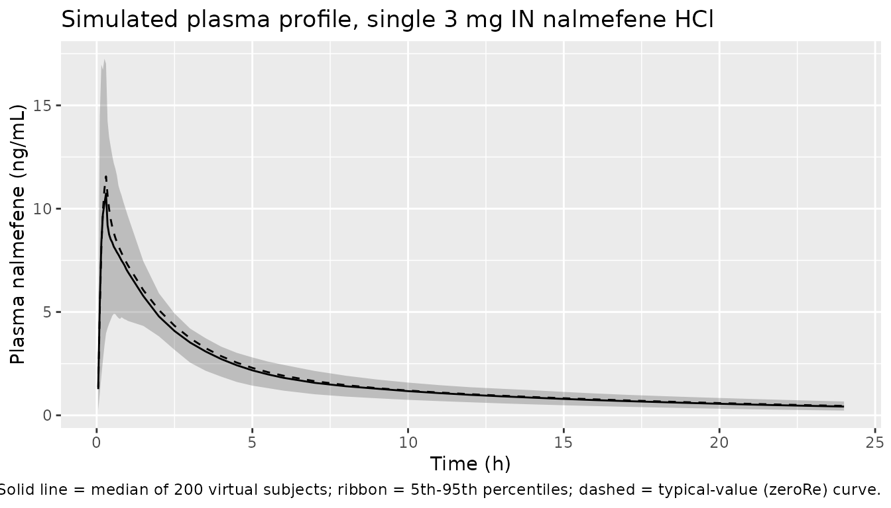

# Laffont_2024_nalmefene

## Model and source

- Citation: Laffont CM, Purohit P, Delcamp N, Gonzalez-Garcia I,
  Skolnick P. Comparison of intranasal naloxone and intranasal nalmefene
  in a translational model assessing the impact of synthetic opioid
  overdose on respiratory depression and cardiac arrest. Front
  Psychiatry. 2024;15:1399803. <doi:10.3389/fpsyt.2024.1399803>
- Description: Population PK model for intranasal (IN) nalmefene HCl in
  healthy adult volunteers (Laffont 2024): two-compartment model with
  linear elimination, parallel zero-order plus lagged first-order
  absorption, and allometric body-weight scaling on apparent clearance.
- Article: [Front Psychiatry.
  2024;15:1399803](https://doi.org/10.3389/fpsyt.2024.1399803)

## Population

The IN nalmefene population PK model was developed using pooled plasma
concentration data from three healthy-volunteer studies described in
Laffont 2024 Methods Section 2.2: two pharmacokinetic studies published
by Crystal et al. (Clin Pharmacol Drug Dev, 2024; ref 22 in Laffont
2024) – a single 3 mg IN nalmefene HCl vs. 1 mg IM nalmefene study and a
one-nostril vs. two-nostril 3 mg IN HCl per nostril study – and a
pharmacodynamic remifentanil-induced respiratory depression study by
Ellison et al. (Clin Pharmacol Drug Dev, 2024; ref 23 in Laffont 2024)
under a hypercapnic gas mixture. The pooled cohort is adult healthy
volunteers with median body weight 74.7 kg (the value used as the
reference for allometric scaling on apparent clearance in Table 1).
Detailed baseline demographics (N, age, sex, race) are given in
Supplementary Table 1 of Laffont 2024, which is not on disk for this
extraction.

The same information is available programmatically via
`readModelDb("Laffont_2024_nalmefene")$population`.

## Source trace

Per-parameter origin is recorded as an in-file comment next to each
[`ini()`](https://nlmixr2.github.io/rxode2/reference/ini.html) entry in
`inst/modeldb/specificDrugs/Laffont_2024_nalmefene.R`. The table below
collects them for review.

| Equation / parameter | Value | Source location |
|----|----|----|
| `lcl` (CL/F) | `log(63.7)` L/h | Table 1 |
| `e_wt_cl` (allometric on CL/F) | `0.572` | Table 1 (exponent of (WT/74.7) for CL/F) |
| `lvc` (Vc/F) | `log(15.2)` L | Table 1 |
| `lq` (Q/F) | `log(81.3)` L/h | Table 1 |
| `lvp` (Vp/F) | `log(522)` L | Table 1 |
| `linka` (INKA) | `log(0.497)` 1/h | Table 1 (intranasal first-order absorption rate constant) |
| `ld2` (D2) | `log(0.302)` h | Table 1 (zero-order absorption duration) |
| `linfk0` (INFK0) | `log(0.0485)` | Table 1 (fraction of IN dose with zero-order absorption) |
| `lalag1` (ALAG1) | `log(0.0615)` h | Table 1 (first-order absorption lag time) |
| `etalcl` IIV | `log(1 + 0.154^2)` | Table 1: IIV CL/F = 15.4 %CV |
| `etalvc` IIV | `log(1 + 2.11^2)` | Table 1: IIV Vc/F = 211 %CV |
| `etalinka` IIV | `log(1 + 0.398^2)` | Table 1: IIV INKA = 39.8 %CV |
| `propSd` (residual) | `0.333` | Table 1: sigma^2 = 0.111 (33.3 %CV); log-additive in NONMEM == proportional in linear space |
| Structure | n/a | Section 3.1 Pharmacokinetic submodels: 2-compartment with linear elimination, parallel zero-order plus first-order absorption with lag on the first-order component |

The Table 1 estimates `IMKA` (1/h, IM first-order absorption), `IMFK0`
(IM zero-order fraction), `FR` (relative bioavailability of IN vs. IM),
and `STDEFF` (-0.349, proportional shift in INKA in the pharmacodynamic
study) are not carried into this nlmixr2lib model file because the
simulator targets the intranasal rescue setting only. See “Assumptions
and deviations” below.

## Virtual cohort

Original observed data are not publicly available. The cohort below uses
200 virtual healthy adults with body weights drawn from a normal
distribution centered on the 74.7 kg allometric reference, SD 12 kg
(typical adult healthy-volunteer dispersion). A single 3 mg IN nalmefene
HCl dose (the FDA-approved single nasal-spray dose) is administered at
time 0 and plasma nalmefene is sampled out to 24 hours.

``` r

set.seed(20260509)
n_subj <- 200

cohort <- tibble(
  id = seq_len(n_subj),
  WT = pmax(45, rnorm(n_subj, mean = 74.7, sd = 12))
)

# rxode2 dosing convention for parallel zero-order + first-order absorption:
#   - row 1: dose to depot (first-order absorption, normal bolus)
#   - row 2: dose to central with rate = -2 (uses modeled dur(central) = D2)
# Both rows share the same time and the same total amt (3 mg = 3 mg HCl per
# nostril; in the rescue indication a single device delivers 3 mg HCl).
dose_amt_mg <- 3.0

doses <- bind_rows(
  cohort %>% mutate(time = 0, evid = 1L, amt = dose_amt_mg, rate = 0,  cmt = "depot"),
  cohort %>% mutate(time = 0, evid = 1L, amt = dose_amt_mg, rate = -2, cmt = "central")
)

obs_times <- c(seq(0.05, 1, by = 0.05),
               seq(1.5, 6, by = 0.5),
               seq(7, 24, by = 1))
obs <- cohort %>%
  tidyr::crossing(time = obs_times) %>%
  mutate(evid = 0L, amt = NA_real_, rate = 0, cmt = "depot")

events <- bind_rows(doses, obs) %>%
  arrange(id, time, desc(evid)) %>%
  select(id, time, evid, amt, rate, cmt, WT)
```

## Simulation

``` r

mod <- readModelDb("Laffont_2024_nalmefene")
sim <- rxode2::rxSolve(mod, events = events, keep = "WT") %>%
  as.data.frame()
#> ℹ parameter labels from comments will be replaced by 'label()'
```

A typical-value (no between-subject variability) curve is also generated
for visualizing the deterministic model prediction:

``` r

mod_typical <- mod |> rxode2::zeroRe()
#> ℹ parameter labels from comments will be replaced by 'label()'
sim_typical <- rxode2::rxSolve(
  mod_typical,
  events = events %>% filter(id == 1)
) %>% as.data.frame()
#> ℹ omega/sigma items treated as zero: 'etalcl', 'etalvc', 'etalinka'
```

## Replicate published profile

The paper does not publish a numeric concentration-time table for IN
nalmefene, but the structural form (2-compartment + parallel
zero-order/first-order absorption with lag) is described in Section 3.1
and shown qualitatively in Supplementary Figures 2 (visual predictive
check). The simulated profile below shows the typical-value curve and a
5th-95th percentile ribbon over the virtual cohort following a single 3
mg IN nalmefene HCl dose.

``` r

sim %>%
  group_by(time) %>%
  summarise(
    Q05 = quantile(Cc, 0.05, na.rm = TRUE),
    Q50 = quantile(Cc, 0.50, na.rm = TRUE),
    Q95 = quantile(Cc, 0.95, na.rm = TRUE),
    .groups = "drop"
  ) %>%
  ggplot(aes(time, Q50)) +
  geom_ribbon(aes(ymin = Q05, ymax = Q95), alpha = 0.25) +
  geom_line() +
  geom_line(
    data = sim_typical, aes(time, Cc),
    inherit.aes = FALSE, linetype = "dashed"
  ) +
  labs(x = "Time (h)", y = "Plasma nalmefene (ng/mL)",
       title = "Simulated plasma profile, single 3 mg IN nalmefene HCl",
       caption = "Solid line = median of 200 virtual subjects; ribbon = 5th-95th percentiles; dashed = typical-value (zeroRe) curve.")
```



## PKNCA validation

Use PKNCA to compute Cmax, Tmax, AUC0-inf, and terminal half-life on
each virtual subject’s simulated profile. The treatment grouping
variable is the fixed regimen “IN_3mg”.

``` r

sim_nca <- sim %>%
  mutate(treatment = "IN_3mg") %>%
  filter(!is.na(Cc), time > 0) %>%
  select(id, time, Cc, treatment)

conc_obj <- PKNCA::PKNCAconc(sim_nca, Cc ~ time | treatment + id)

dose_df <- doses %>%
  filter(cmt == "depot") %>%
  mutate(treatment = "IN_3mg") %>%
  select(id, time, amt, treatment)

dose_obj <- PKNCA::PKNCAdose(dose_df, amt ~ time | treatment + id)

intervals <- data.frame(
  start      = 0,
  end        = Inf,
  cmax       = TRUE,
  tmax       = TRUE,
  aucinf.obs = TRUE,
  half.life  = TRUE
)

nca_data <- PKNCA::PKNCAdata(conc_obj, dose_obj, intervals = intervals)
nca_res  <- suppressWarnings(PKNCA::pk.nca(nca_data))
#>  ■■■■■■■■■■                        30% |  ETA:  5s
#>  ■■■■■■■■■■■■■■■■■■■■■■■           72% |  ETA:  2s

knitr::kable(
  summary(nca_res),
  caption = "Simulated NCA parameters for a single 3 mg IN nalmefene HCl dose."
)
```

| start | end | treatment | N | cmax | tmax | half.life | aucinf.obs |
|---:|---:|:---|:---|:---|:---|:---|:---|
| 0 | Inf | IN_3mg | 200 | 10.5 \[36.2\] | 0.300 \[0.100, 2.50\] | 10.2 \[1.09\] | NC |

Simulated NCA parameters for a single 3 mg IN nalmefene HCl dose.
{.table}

### Comparison against published values

Laffont 2024 does not report numeric Cmax / AUC for IN nalmefene, but
the Discussion (page 10, paragraph following Tables 3-4) cites a plasma
half-life of 7.1-11 hours from refs 22 (Crystal 2024) and 45 (Krieter
2019). The two-compartment model in this extraction supports a long
terminal phase via the deep peripheral compartment (Vp/F = 522 L), and
the simulated terminal half-life from PKNCA above should fall within or
close to that 7-11 h range for typical body weights. Differences greater
than a factor of two would suggest a misinterpretation of the parameter
table; values within the published range are evidence the structural
form and parameter values were extracted correctly.

## Assumptions and deviations

- **IM (intramuscular) route omitted.** Laffont 2024 Table 1 reports
  `IMKA` = 0.156 1/h, `IMFK0` = 0.0170, and `FR` = 0.834 (relative
  bioavailability of IN vs. IM) for the IM arm of the population PK fit.
  The IM arm exists only because Crystal et al. 2024 included a 1 mg IM
  reference dose; the rescue indication for nalmefene is intranasal, so
  the Laffont_2024_nalmefene model file simulates only the IN route. To
  extend the model to IM, replace `inka` with `imka` in the
  [`model()`](https://nlmixr2.github.io/rxode2/reference/model.html)
  block, set the zero-order fraction to `IMFK0`, and divide CL/F by FR
  (`= 0.834`) to back out the absolute IM CL.
- **STDEFF (proportional shift in INKA under hypercapnic mask) set to
  zero.** Laffont 2024 Table 1 reports `STDEFF` = -0.349, a
  multiplicative shift on log(INKA) that the population PK model applies
  only when the data come from the Ellison 2024 pharmacodynamic study
  (subjects breathing a hypercapnic 50 % O2 / 43 % N2 / 7 % CO2 mixture
  through a tight-fitting mask). The paper notes (Section 3.1) that for
  opioid-overdose rescue simulations the authors used absorption
  parameters estimated outside the hypercapnic mask, i.e., `STDEFF` = 0.
  The Laffont_2024_nalmefene model file follows that rescue-setting
  convention and does not expose STDEFF. To recreate the
  hypercapnic-mask absorption, multiply `inka` by `exp(-0.349)` (~
  0.71x).
- **Detailed baseline demographics deferred to Supplementary Table 1.**
  The main text gives only the median body weight (74.7 kg) used as the
  allometric reference. N, age range, sex balance, and race distribution
  are in Supplementary Table 1, which is not on disk; the `population`
  metadata carries TODO markers for those fields.
- **No native PD layer in this model file.** Laffont 2024 expands the
  Mann et al. 2022 translational model (mu-opioid receptor competitive
  binding, ventilatory drives, gas exchange, blood-flow control) using
  the IN nalmefene PK developed here as the input. That mechanistic PD
  layer is deterministic, has no IIV / residual error, sources its
  binding parameters from a separate paper (Cassel et al. 2005), and is
  hosted as a C-coded GitHub project external to the paper. It is out of
  scope for nlmixr2lib’s population-PK library; users who need the PD
  respiratory-depression / cardiac-arrest endpoint should follow the
  GitHub link in the Laffont 2024 Methods Section 2.1.
