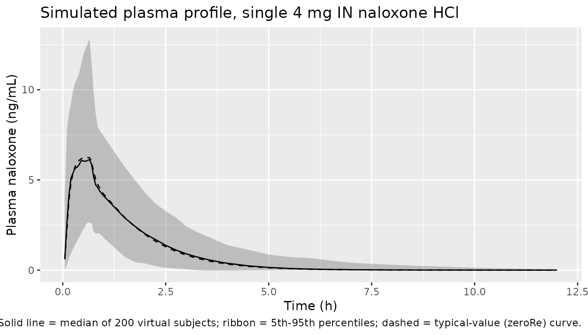

# Naloxone (Laffont 2024)

## Model and source

- Citation: Laffont CM, Purohit P, Delcamp N, Gonzalez-Garcia I,
  Skolnick P. Comparison of intranasal naloxone and intranasal nalmefene
  in a translational model assessing the impact of synthetic opioid
  overdose on respiratory depression and cardiac arrest. Front
  Psychiatry. 2024;15:1399803. <doi:10.3389/fpsyt.2024.1399803>. Q/F and
  Vp/F fixed to values from Yassen A, Olofsen E, van Dorp E, Sarton E,
  Teppema L, Danhof M, Dahan A. Mechanism-based
  pharmacokinetic-pharmacodynamic modelling of the reversal of
  buprenorphine-induced respiratory depression by naloxone. Clin
  Pharmacokinet. 2007;46(11):965-980.
  <doi:10.2165/00003088-200746110-00004>
- Description: Population PK model for intranasal (IN) naloxone HCl in
  healthy adult volunteers (Laffont 2024): two-compartment model with
  linear elimination and parallel zero-order plus lagged first-order
  absorption; Q/F and Vp/F fixed to literature values from Yassen 2007.
- Article: [Front Psychiatry.
  2024;15:1399803](https://doi.org/10.3389/fpsyt.2024.1399803)

## Population

The IN naloxone population PK model in Laffont 2024 was developed using
plasma concentration data from the pharmacodynamic remifentanil-induced
respiratory depression study by Ellison et al. (Clin Pharmacol Drug Dev,
2024; ref 23 in Laffont 2024). Subjects were healthy adult volunteers
receiving a single 4 mg IN naloxone HCl dose from the commercial nasal
spray formulation under a hypercapnic gas mixture (50 % O2 / 43 % N2 / 7
% CO2) administered through a tight-fitting mask. The paper notes
(Section 3.1) that the hypercapnic-mask conditions did not affect IN
naloxone absorption during the first 20 minutes post dose when compared
with published data in healthy volunteers (refs 10, 23), so the
absorption parameters in Table 2 were used as-is for opioid-overdose
rescue simulations. Detailed baseline demographics (N, age, sex, race)
are given in Supplementary Table 2 of Laffont 2024, which is not on disk
for this extraction.

The same information is available programmatically via
`readModelDb("Laffont_2024_naloxone")$population`.

## Source trace

Per-parameter origin is recorded as an in-file comment next to each
[`ini()`](https://nlmixr2.github.io/rxode2/reference/ini.html) entry in
`inst/modeldb/specificDrugs/Laffont_2024_naloxone.R`. The table below
collects them for review.

| Equation / parameter | Value | Source location |
|----|----|----|
| `lcl` (CL/F) | `log(396)` L/h | Table 2 |
| `lvc` (Vc/F) | `log(65.7)` L | Table 2 |
| `lq` (Q/F) | `fixed(log(284))` L/h | Table 2 (fixed to value from Yassen et al. 2007 ref 30) |
| `lvp` (Vp/F) | `fixed(log(102))` L | Table 2 (fixed to value from Yassen et al. 2007 ref 30) |
| `lka` (KA) | `log(0.998)` 1/h | Table 2 (first-order absorption rate constant) |
| `ld2` (D2) | `log(0.689)` h | Table 2 (zero-order absorption duration) |
| `lfk0` (FK0) | `log(0.183)` | Table 2 (fraction of dose with zero-order absorption) |
| `lalag1` (ALAG1) | `log(0.0717)` h | Table 2 (first-order absorption lag time) |
| `etalcl` IIV | `log(1 + 0.391^2)` | Table 2: IIV CL/F = 39.1 %CV |
| `etalvc` IIV | `log(1 + 2.40^2)` | Table 2: IIV Vc/F = 240 %CV |
| `etalfk0` IIV | `log(1 + 1.51^2)` | Table 2: IIV FK0 = 151 %CV |
| `propSd` (residual) | `0.323` | Table 2: sigma^2 = 0.104 (32.3 %CV); log-additive in NONMEM == proportional in linear space |
| Structure | n/a | Section 3.1 Pharmacokinetic submodels: 2-compartment with linear elimination, parallel zero-order plus first-order absorption with lag on the first-order component |

No covariates were retained in the IN naloxone final model (paper
Section 3.1 states that body weight was significant only on nalmefene
CL/F, not naloxone).

## Virtual cohort

Original observed data are not publicly available. The cohort below uses
200 virtual healthy adults receiving a single 4 mg IN naloxone HCl dose
(the commercial 4 mg / 0.1 mL nasal spray) at time 0 with plasma
sampling out to 12 hours.

``` r

set.seed(20260509)
n_subj <- 200

cohort <- tibble(id = seq_len(n_subj))

# rxode2 dosing convention for parallel zero-order + first-order absorption:
#   - row 1: dose to depot (first-order absorption, normal bolus)
#   - row 2: dose to central with rate = -2 (uses modeled dur(central) = D2)
# Both rows share the same time and the same total amt (4 mg HCl).
dose_amt_mg <- 4.0

doses <- bind_rows(
  cohort %>% mutate(time = 0, evid = 1L, amt = dose_amt_mg, rate = 0,  cmt = "depot"),
  cohort %>% mutate(time = 0, evid = 1L, amt = dose_amt_mg, rate = -2, cmt = "central")
)

obs_times <- c(seq(0.05, 1, by = 0.05),
               seq(1.5, 4, by = 0.25),
               seq(4.5, 12, by = 0.5))
obs <- cohort %>%
  tidyr::crossing(time = obs_times) %>%
  mutate(evid = 0L, amt = NA_real_, rate = 0, cmt = "depot")

events <- bind_rows(doses, obs) %>%
  arrange(id, time, desc(evid)) %>%
  select(id, time, evid, amt, rate, cmt)
```

## Simulation

``` r

mod <- readModelDb("Laffont_2024_naloxone")
sim <- rxode2::rxSolve(mod, events = events) %>%
  as.data.frame()
#> ℹ parameter labels from comments will be replaced by 'label()'
```

A typical-value (no between-subject variability) curve is also generated
for visualizing the deterministic model prediction:

``` r

mod_typical <- mod |> rxode2::zeroRe()
#> ℹ parameter labels from comments will be replaced by 'label()'
sim_typical <- rxode2::rxSolve(
  mod_typical,
  events = events %>% filter(id == 1)
) %>% as.data.frame()
#> ℹ omega/sigma items treated as zero: 'etalcl', 'etalvc', 'etalfk0'
```

## Replicate published profile

The paper does not publish a numeric concentration-time table for IN
naloxone, but the structural form (2-compartment + parallel
zero-order/first-order absorption with lag) is described in Section 3.1
and illustrated qualitatively by Supplementary Figure 3 (visual
predictive check). The simulated profile below shows the typical-value
curve and a 5th-95th percentile ribbon over the virtual cohort following
a single 4 mg IN naloxone HCl dose.

``` r

sim %>%
  group_by(time) %>%
  summarise(
    Q05 = quantile(Cc, 0.05, na.rm = TRUE),
    Q50 = quantile(Cc, 0.50, na.rm = TRUE),
    Q95 = quantile(Cc, 0.95, na.rm = TRUE),
    .groups = "drop"
  ) %>%
  ggplot(aes(time, Q50)) +
  geom_ribbon(aes(ymin = Q05, ymax = Q95), alpha = 0.25) +
  geom_line() +
  geom_line(
    data = sim_typical, aes(time, Cc),
    inherit.aes = FALSE, linetype = "dashed"
  ) +
  labs(x = "Time (h)", y = "Plasma naloxone (ng/mL)",
       title = "Simulated plasma profile, single 4 mg IN naloxone HCl",
       caption = "Solid line = median of 200 virtual subjects; ribbon = 5th-95th percentiles; dashed = typical-value (zeroRe) curve.")
```



## PKNCA validation

Use PKNCA to compute Cmax, Tmax, AUC0-inf, and terminal half-life on
each virtual subject’s simulated profile. The treatment grouping
variable is the fixed regimen “IN_4mg”.

``` r

sim_nca <- sim %>%
  mutate(treatment = "IN_4mg") %>%
  filter(!is.na(Cc), time > 0) %>%
  select(id, time, Cc, treatment)

conc_obj <- PKNCA::PKNCAconc(sim_nca, Cc ~ time | treatment + id)
#> Warning in assert_conc(conc, any_missing_conc = any_missing_conc): Negative
#> concentrations found

dose_df <- doses %>%
  filter(cmt == "depot") %>%
  mutate(treatment = "IN_4mg") %>%
  select(id, time, amt, treatment)

dose_obj <- PKNCA::PKNCAdose(dose_df, amt ~ time | treatment + id)

intervals <- data.frame(
  start      = 0,
  end        = Inf,
  cmax       = TRUE,
  tmax       = TRUE,
  aucinf.obs = TRUE,
  half.life  = TRUE
)

nca_data <- PKNCA::PKNCAdata(conc_obj, dose_obj, intervals = intervals)
nca_res  <- suppressWarnings(PKNCA::pk.nca(nca_data))
#>  ■■■■■■■■■■■                       34% |  ETA:  4s
#>  ■■■■■■■■■■■■■■■■■■■■■■■■          78% |  ETA:  1s

knitr::kable(
  summary(nca_res),
  caption = "Simulated NCA parameters for a single 4 mg IN naloxone HCl dose."
)
```

| start | end | treatment | N | cmax | tmax | half.life | aucinf.obs |
|---:|---:|:---|:---|:---|:---|:---|:---|
| 0 | Inf | IN_4mg | 200 | 6.08 \[52.6\] | 0.650 \[0.0500, 3.00\] | 0.890 \[1.10\] | NC |

Simulated NCA parameters for a single 4 mg IN naloxone HCl dose.
{.table}

### Comparison against published values

Laffont 2024 does not report numeric Cmax / AUC for IN naloxone, but the
Discussion (page 10) cites a plasma half-life of approximately 2 hours
(refs 22, 45). The simulated terminal half-life from PKNCA above should
fall near that value. The Q/F and Vp/F fixed values from Yassen et
al. 2007 give this model a moderate-sized peripheral compartment (Vp/F =
102 L), consistent with the rapid distribution and short terminal phase
reported for naloxone.

## Assumptions and deviations

- **Q/F and Vp/F fixed to literature values (Yassen et al. 2007).**
  Laffont 2024 Table 2 reports these as “fixed” – the population
  estimation could not identify them from the IN-only Ellison 2024
  dataset, so they were carried in from the IV naloxone analysis of
  Yassen et al. (Clin Pharmacokinet 2007;46(11):965-980). The Yassen
  2007 citation is reproduced verbatim in the model file’s `reference`
  field so the dependency is visible in
  [`?modellib`](https://nlmixr2.github.io/nlmixr2lib/reference/modellib.md).
  No upstream nlmixr2lib model exists for Yassen 2007 at the time of
  extraction.
- **No covariates retained in final model.** Laffont 2024 Section 3.1
  states that body weight was a significant covariate on nalmefene CL/F
  but not on naloxone CL/F; no other covariates were retained. The
  `Laffont_2024_naloxone` model has no covariate inputs.
- **Detailed baseline demographics deferred to Supplementary Table 2.**
  N, age range, sex balance, race distribution, and median weight are in
  Supplementary Table 2, which is not on disk; the `population` metadata
  carries TODO markers for those fields.
- **No native PD layer in this model file.** Laffont 2024 expands the
  Mann et al. 2022 translational model (mu-opioid receptor competitive
  binding, ventilatory drives, gas exchange, blood-flow control) using
  the IN naloxone PK developed here as the input. That mechanistic PD
  layer is deterministic, has no IIV / residual error, sources its
  binding parameters from a separate paper (Cassel et al. 2005), and is
  hosted as a C-coded GitHub project external to the paper. It is out of
  scope for nlmixr2lib’s population-PK library; users who need the PD
  respiratory-depression / cardiac-arrest endpoint should follow the
  GitHub link in the Laffont 2024 Methods Section 2.1.
