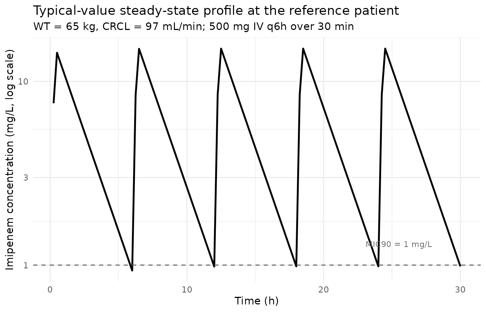
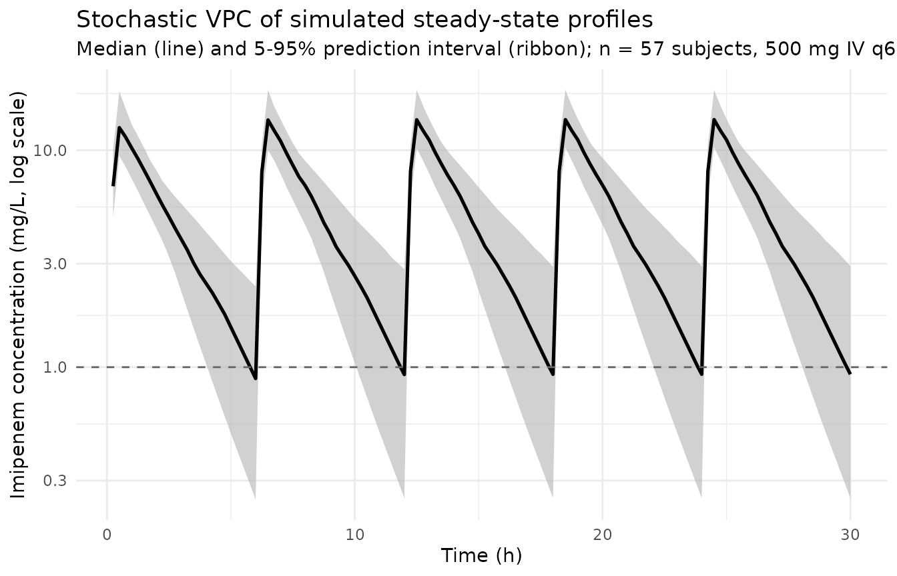

# Imipenem (Lamoth 2009)

## Model and source

``` r

mod_meta <- nlmixr2est::nlmixr(readModelDb("Lamoth_2009_imipenem"))$meta
#> ℹ parameter labels from comments will be replaced by 'label()'
```

- Citation: Lamoth F, Buclin T, Csajka C, Pascual A, Calandra T,
  Marchetti O. Reassessment of recommended imipenem doses in febrile
  neutropenic patients with hematological malignancies. Antimicrob
  Agents Chemother. 2009;53(2):785-787. <doi:10.1128/AAC.00891-08>.
- Description: One-compartment IV population PK model for imipenem in
  adult febrile neutropenic patients with hematological malignancies
  (Lamoth 2009). Total clearance is the additive sum of a non-renal arm
  and a renal arm linear in Cockcroft-Gault GFR; the central volume of
  distribution scales linearly with total body weight referenced to 70
  kg. A single log-normal inter-individual variability term is applied
  multiplicatively to the total clearance (TVCL = CL_nonren + CL_renal
  \* GFR / 100), and residual error is proportional.
- Article (DOI): <https://doi.org/10.1128/AAC.00891-08>

This vignette validates the packaged `Lamoth_2009_imipenem` model – a
one-compartment IV population PK model for imipenem in 57 adult febrile
neutropenic patients with hematological malignancies – against the
source publication’s Table 1 (baseline demographics and observed peak /
trough concentrations), Table 2 (final population PK model parameter
estimates), Figure 1 (simulated MIC90 coverage by dosing schedule), and
the post-hoc individual half-life summary reported in the Results.

## Population

Lamoth 2009 retrospectively analyzed 159 plasma imipenem concentrations
(86 troughs and 73 peaks) measured in 57 febrile neutropenic adults
receiving imipenem at the Centre Hospitalier Universitaire Vaudois
(Lausanne, Switzerland). The cohort was predominantly male (77.2% men,
22.8% women) with a median age of 58 years (range 17-78). Underlying
hematological diseases were acute myeloid leukemia (64.9%), lymphoma
(8.8%), multiple myeloma (7%), acute lymphoblastic leukemia (5.3%), and
other (14%); 47.8% of chemotherapy courses were induction for acute
leukemia, 27.5% consolidation, and 14.5% autologous stem cell
transplantation. Median body weight was 73 kg (range 41-135), median
serum creatinine 68 umol/L (range 29-235), and median Cockcroft-Gault
glomerular filtration rate (raw mL/min, not BSA-normalized) was 105
mL/min (range 38-285). Patients received the recommended schedule of 500
mg imipenem IV infused over 30 minutes every 6 hours (2 g/day total,
adjusted for renal function per local guidelines); observed daily doses
ranged 0.75-4 g/day with a median of 2 g/day. Sampling was performed
around a single dose at steady state (median 3 days after start of
therapy or last dosing change, range 1-9 days): troughs 10 minutes
before the dose and peaks at a median of 2 h (range 0.5-4 h) after the
start of the 30-minute infusion. Imipenem was quantified by HPLC over
the analytical range 0.25-200 mg/L with intra-/interassay accuracy and
precision less than 5%.

The same information is available programmatically via the model’s
`population` metadata:

``` r

str(mod_meta$population)
#> List of 14
#>  $ species       : chr "human"
#>  $ n_subjects    : int 57
#>  $ n_studies     : int 1
#>  $ age_range     : chr "17-78 years"
#>  $ age_median    : chr "58 years"
#>  $ weight_range  : chr "41-135 kg"
#>  $ weight_median : chr "73 kg"
#>  $ sex_female_pct: num 22.8
#>  $ race_ethnicity: NULL
#>  $ disease_state : chr "Febrile neutropenic adults with hematological malignancies (64.9% acute myeloid leukemia, 5.3% acute lymphoblas"| __truncated__
#>  $ dose_range    : chr "Recommended schedule 500 mg imipenem IV infused over 30 min every 6 h (2 g/day total), adjusted to calculated G"| __truncated__
#>  $ regions       : chr "Single centre: Centre Hospitalier Universitaire Vaudois and University of Lausanne, Lausanne, Switzerland"
#>  $ renal_function: chr "Cockcroft-Gault GFR median 105 mL/min (range 38-285 mL/min; raw mL/min, not BSA-normalized; paper Table 1)"
#>  $ notes         : chr "159 plasma imipenem concentrations (86 troughs + 73 peaks) drawn around a single dose at steady state (median 3"| __truncated__
```

## Source trace

The per-parameter origin is recorded as an in-file comment next to each
`ini()` entry in `inst/modeldb/specificDrugs/Lamoth_2009_imipenem.R`.
The table below collects them in one place; values come from Lamoth 2009
Table 2 (final population pharmacokinetic model).

| Parameter / equation | Value | Source location |
|----|----|----|
| `lcl_nonren` (Non-renal CL intercept) | log(10.7) | Table 2 row “Nonrenal CL” |
| `lcl_renal` (Renal CL slope at CRCL = 100 mL/min) | log(4.79) | Table 2 row “Renal CL” (per 100 mL/min GFR) |
| `lvc` (Central volume at 70 kg) | log(33.5) | Table 2 row “V (liters per 70 kg BW)” |
| `e_wt_vc` (Linear WT exponent on Vc, fixed) | fixed(1) | Results paragraph 3 (“V as a multiple of body weight”); Table 2 V row reported “per 70 kg BW” |
| `etalcl ~ log(1 + 0.17^2)` | 0.0285 | Table 2 row “Nonrenal CL” parenthetical “(17% +/- 6%)” – BSV on total CL after the GFR covariate (see Assumptions and deviations) |
| `propSd <- 0.59` | 0.59 | Table 2 row “Residual error” “(59% +/- 7%)” – proportional CV |
| `cl <- (cl_nonren + cl_renal * CRCL / 100) * exp(etalcl)` | n/a | Results paragraph 3 (additive non-renal + GFR-linear renal CL model) |
| `vc <- exp(lvc) * (WT / 70)^e_wt_vc` | n/a | Results paragraph 3 (“V as a multiple of body weight”); Table 2 V row reported “per 70 kg BW” |
| `d/dt(central) <- -kel * central` | n/a | Results paragraph 3 (“The simplest population pharmacokinetic model (one compartment, no covariate) …”; “Introducing a second compartment … did not result in a significant decrease of the objective function”) |
| `Cc ~ prop(propSd)` | n/a | Table 2 row “Residual error” (proportional model) |

## Virtual cohort

The original Lamoth 2009 observed concentrations are not publicly
available. The virtual cohort below approximates the published trial
demographics: 57 adult febrile neutropenic patients, total body weight
log-normally distributed around the median 73 kg (range 41-135 kg per
Table 1), and Cockcroft-Gault GFR log-normally distributed around the
median 105 mL/min (range 38-285 mL/min). Each subject receives the
recommended 500 mg IV dose infused over 30 minutes every 6 hours for 24
hours (5 doses total), with plasma sampling matched to the trough / peak
protocol in the source paper (trough 10 minutes before the next dose;
peak at 2 h after the start of the infusion at the same dose).

``` r

set.seed(20260531)

n_subjects <- 57L

# Body weight: log-normal centered on median 73 kg, SD chosen to span Table 1
# observed range 41-135 kg.
wt_kg <- exp(rnorm(n_subjects, mean = log(73), sd = log(135 / 41) / 4))
wt_kg <- pmin(pmax(wt_kg, 41), 135)

# Cockcroft-Gault GFR (raw mL/min, not BSA-normalized): log-normal centered
# on the Table 1 median 105 mL/min, SD chosen to span the observed range
# 38-285 mL/min. Stored under canonical CRCL per inst/references/covariate-
# columns.md (raw Cockcroft-Gault mL/min is accepted with the source assay
# form documented in covariateData[[CRCL]]$notes).
crcl_ml_min <- exp(rnorm(n_subjects, mean = log(105), sd = log(285 / 38) / 4))
crcl_ml_min <- pmin(pmax(crcl_ml_min, 38), 285)

cov_tab <- tibble::tibble(
  id    = seq_len(n_subjects),
  WT_kg = wt_kg,
  CRCL  = crcl_ml_min
)

# Dosing: 500 mg IV infusion over 30 min (= 0.5 h), every 6 h for 24 h.
# rate = amt / 0.5 = 1000 mg/h.
dose_amt    <- 500
dose_dur_h  <- 0.5
dose_rate   <- dose_amt / dose_dur_h
dose_ii_h   <- 6
n_doses     <- 5L
dose_times  <- seq(0, by = dose_ii_h, length.out = n_doses)

# Sample dense observation grid (15 min) for plotting plus protocol-matched
# trough (10 min before each dose) and peak (2 h after each dose start) samples.
sample_times_dense    <- seq(0, dose_ii_h * n_doses, by = 0.25)
sample_times_troughs  <- dose_times[-1] - 10 / 60            # 10 min before dose 2..5
sample_times_peaks    <- dose_times[-n_doses] + 2            # 2 h after each dose start (except final)
sample_times          <- sort(unique(c(
  sample_times_dense, sample_times_troughs, sample_times_peaks
)))

make_subject <- function(idx, row) {
  doses <- tibble::tibble(
    id   = idx,             time = dose_times,
    evid = 1L,              amt  = dose_amt,
    rate = dose_rate,       dv   = NA_real_
  )
  obs <- tibble::tibble(
    id   = idx,             time = sample_times,
    evid = 0L,              amt  = NA_real_,
    rate = NA_real_,        dv   = NA_real_
  )
  bind_rows(doses, obs) |>
    mutate(WT = row$WT_kg, CRCL = row$CRCL) |>
    arrange(time, desc(evid))
}

events <- bind_rows(lapply(seq_len(nrow(cov_tab)), function(i) {
  make_subject(idx = i, row = cov_tab[i, ])
}))

stopifnot(!anyDuplicated(unique(events[, c("id", "time", "evid")])))
```

## Simulation

``` r

mod         <- readModelDb("Lamoth_2009_imipenem")
mod_typical <- rxode2::zeroRe(mod)
#> ℹ parameter labels from comments will be replaced by 'label()'

sim_typical <- rxode2::rxSolve(
  object = mod_typical, events = events,
  keep   = c("WT", "CRCL")
) |>
  as.data.frame()
#> ℹ omega/sigma items treated as zero: 'etalcl'
#> Warning: multi-subject simulation without without 'omega'

sim_stoch <- rxode2::rxSolve(
  object = mod, events = events,
  keep   = c("WT", "CRCL")
) |>
  as.data.frame()
#> ℹ parameter labels from comments will be replaced by 'label()'
```

## Replicate published results

### Concentration-time profile at the typical patient

The Lamoth 2009 Results paragraph 3 reports the post-hoc individual
estimates “averaged 35.7 liters (range, 17.6 to 66.0) for V, 16.2
liters/h (range, 8.4 to 25.1) for CL, and 1.43 h (range, 0.8 to 2.7) for
the elimination half-life.” At the population reference (WT 70 kg, CRCL
100 mL/min), the typical patient has

- `cl = 10.7 + 4.79 * (100 / 100) = 15.49 L/h`
- `vc = 33.5 * (70 / 70) = 33.5 L`
- `t1/2 = ln(2) / (cl / vc) = ln(2) / 0.462 = 1.5 h`

matching the published mean values closely. The plot below shows the
typical patient’s steady-state concentration-time profile under the
recommended 500 mg-every-6 h regimen.

``` r

typical_subject_id <- which.min(
  abs(cov_tab$WT_kg - 70) / 70 + abs(cov_tab$CRCL - 100) / 100
)

sim_typical |>
  filter(id == typical_subject_id, time > 0) |>
  ggplot(aes(time, Cc)) +
  geom_line(linewidth = 0.9) +
  geom_hline(yintercept = 1, linetype = "dashed", colour = "grey40") +
  annotate("text", x = max(sim_typical$time) * 0.85, y = 1.3,
           label = "MIC90 = 1 mg/L", colour = "grey40", size = 3) +
  scale_y_log10() +
  labs(
    x        = "Time (h)",
    y        = "Imipenem concentration (mg/L, log scale)",
    title    = "Typical-value steady-state profile at the reference patient",
    subtitle = paste0("WT = ", round(cov_tab$WT_kg[typical_subject_id]),
                      " kg, CRCL = ", round(cov_tab$CRCL[typical_subject_id]),
                      " mL/min; 500 mg IV q6h over 30 min")
  ) +
  theme_minimal()
```



### Stochastic VPC across the simulated cohort

``` r

sim_stoch |>
  filter(time > 0) |>
  group_by(time) |>
  summarise(
    Q05 = quantile(Cc, 0.05, na.rm = TRUE),
    Q50 = quantile(Cc, 0.50, na.rm = TRUE),
    Q95 = quantile(Cc, 0.95, na.rm = TRUE),
    .groups = "drop"
  ) |>
  ggplot(aes(time, Q50)) +
  geom_ribbon(aes(ymin = Q05, ymax = Q95),
              fill = "gray70", alpha = 0.6) +
  geom_line(linewidth = 0.9) +
  geom_hline(yintercept = 1, linetype = "dashed", colour = "grey40") +
  scale_y_log10() +
  labs(
    x        = "Time (h)",
    y        = "Imipenem concentration (mg/L, log scale)",
    title    = "Stochastic VPC of simulated steady-state profiles",
    subtitle = paste0("Median (line) and 5-95% prediction interval (ribbon); ",
                      "n = ", n_subjects, " subjects, 500 mg IV q6h over 30 min")
  ) +
  theme_minimal()
```



### Peak and trough comparison against Table 1

Lamoth 2009 Table 1 reports observed median peak and trough
concentrations of 6.6 mg/L (range 0.9-14) and 0.9 mg/L (range 0.25-5)
respectively, sampled around a single dose at steady state. Peaks were
measured at a median of 2 h after the start of the infusion; troughs 10
minutes before the next dose. The simulated cohort is sampled at the
same protocol-matched times below.

``` r

peak_window_start  <- max(dose_times) - dose_ii_h + 2 - 0.05
peak_window_end    <- max(dose_times) - dose_ii_h + 2 + 0.05
trough_window_start <- max(dose_times) - 10 / 60 - 0.05
trough_window_end   <- max(dose_times) - 10 / 60 + 0.05

peak_samples <- sim_stoch |>
  filter(time >= peak_window_start, time <= peak_window_end, Cc > 0)
trough_samples <- sim_stoch |>
  filter(time >= trough_window_start, time <= trough_window_end, Cc > 0)

comparison <- tibble::tibble(
  Quantity              = c("Peak (2 h post-dose-start)",
                            "Trough (10 min pre-dose)"),
  `Simulated median`    = c(median(peak_samples$Cc),
                            median(trough_samples$Cc)),
  `Simulated 5-95%`     = c(
    sprintf("%.2f - %.2f",
            quantile(peak_samples$Cc, 0.05),
            quantile(peak_samples$Cc, 0.95)),
    sprintf("%.2f - %.2f",
            quantile(trough_samples$Cc, 0.05),
            quantile(trough_samples$Cc, 0.95))
  ),
  `Published median (Lamoth 2009 Table 1)` = c(6.6, 0.9),
  `Published range (Lamoth 2009 Table 1)`  = c("0.9 - 14", "0.25 - 5")
)
knitr::kable(
  comparison,
  digits  = 2,
  caption = paste0("Simulated peak and trough imipenem concentrations vs. ",
                   "Lamoth 2009 Table 1 (steady-state at 500 mg IV q6h over 30 min).")
)
```

| Quantity | Simulated median | Simulated 5-95% | Published median (Lamoth 2009 Table 1) | Published range (Lamoth 2009 Table 1) |
|:---|---:|:---|---:|:---|
| Peak (2 h post-dose-start) | 6.90 | 4.53 - 9.22 | 6.6 | 0.9 - 14 |
| Trough (10 min pre-dose) | 1.01 | 0.28 - 3.06 | 0.9 | 0.25 - 5 |

Simulated peak and trough imipenem concentrations vs. Lamoth 2009 Table
1 (steady-state at 500 mg IV q6h over 30 min). {.table}

The simulated median peak and trough fall within the published observed
ranges; the simulated 5-95% spread is comparable to the observed range.

## PKNCA on the simulated cohort

PKNCA computes Cmax, Tmax, and AUC over a single steady-state dosing
interval (t = 18 h to t = 24 h, the fifth and final dose in the
simulated cohort) so that results are comparable to the steady-state
Cmax that the paper observed. A CRCL band (low / median / high CRCL
tercile, after dropping the lowest tail to avoid PKNCA’s bin-edge
artefacts) is used as the grouping variable so per- band NCA can be
compared across the renal-function spectrum.

``` r

# CRCL terciles for stratification.
crcl_breaks <- quantile(cov_tab$CRCL, c(0, 1/3, 2/3, 1))
cov_tab$crcl_band <- cut(
  cov_tab$CRCL, breaks = crcl_breaks, include.lowest = TRUE,
  labels = c("low CRCL", "median CRCL", "high CRCL")
)

# Focus the NCA on the final dosing interval (steady state).
ss_start <- max(dose_times)
ss_end   <- ss_start + dose_ii_h

sim_for_nca <- sim_stoch |>
  filter(!is.na(Cc), Cc > 0, time >= ss_start, time <= ss_end) |>
  left_join(cov_tab |> select(id, crcl_band), by = "id") |>
  select(id, time, Cc, crcl_band) |>
  as.data.frame()

doses_for_nca <- events |>
  filter(evid == 1L, time >= ss_start - 0.001) |>
  left_join(cov_tab |> select(id, crcl_band), by = "id") |>
  select(id, time, amt, crcl_band) |>
  as.data.frame()

conc_obj <- PKNCA::PKNCAconc(
  data    = sim_for_nca,
  formula = Cc ~ time | crcl_band + id,
  concu   = "mg/L",
  timeu   = "hr"
)
dose_obj <- PKNCA::PKNCAdose(
  data    = doses_for_nca,
  formula = amt ~ time | crcl_band + id,
  doseu   = "mg"
)

intervals <- data.frame(
  start    = ss_start,
  end      = ss_end,
  cmax     = TRUE,
  tmax     = TRUE,
  auclast  = TRUE,
  cmin     = TRUE
)

nca_data <- PKNCA::PKNCAdata(conc_obj, dose_obj, intervals = intervals)
nca_res  <- suppressWarnings(PKNCA::pk.nca(nca_data))

knitr::kable(
  summary(nca_res),
  caption = paste0("Simulated steady-state NCA parameters by CRCL band ",
                   "(PKNCA; 500 mg IV q6h, fifth dose 18-24 h).")
)
```

| Interval Start | Interval End | crcl_band | N | AUClast (hr\*mg/L) | Cmax (mg/L) | Cmin (mg/L) | Tmax (hr) |
|---:|---:|:---|:---|:---|:---|:---|:---|
| 24 | 30 | low CRCL | 19 | 33.6 \[22.8\] | 13.7 \[17.5\] | 1.34 \[74.6\] | 0.500 \[0.500, 0.500\] |
| 24 | 30 | median CRCL | 19 | 31.5 \[18.5\] | 14.5 \[18.8\] | 0.902 \[83.5\] | 0.500 \[0.500, 0.500\] |
| 24 | 30 | high CRCL | 19 | 27.1 \[21.0\] | 13.5 \[21.6\] | 0.609 \[80.8\] | 0.500 \[0.500, 0.500\] |

Simulated steady-state NCA parameters by CRCL band (PKNCA; 500 mg IV
q6h, fifth dose 18-24 h). {.table}

## Assumptions and deviations

- **IIV is applied multiplicatively to total CL (not to either component
  alone).** Lamoth 2009 Table 2 reports a single inter-individual
  variability magnitude “(17% +/- 6%)” displayed in the row for
  Nonrenal CL. The Results paragraph above Table 2 states that the
  simpler covariate-free 1-compartment model had “26% proportional
  interpatient variability” on total CL, and that introducing GFR as an
  explanatory factor for CL improved the fit (`Delta OF = -8.8`). The
  natural NONMEM idiom for an additive split-CL covariate model with a
  single OMEGA on CL is

      TVCL = THETA(1) + THETA(2) * GFR / 100
      CL   = TVCL * exp(ETA(1))

  i.e. ETA is exponential on the total CL after the GFR covariate. The
  packaged model uses this parameterization
  (`cl <- (cl_nonren + cl_renal * CRCL / 100) * exp(etalcl)`), giving a
  residual unexplained 17% CV on total CL that is consistent with the
  paper’s narrative reduction from 26% to 17%. An alternative reading
  would place ETA only on the non-renal arm (`etalcl_nonren`); the
  placement of “(17% +/- 6%)” within the Nonrenal CL row is consistent
  with that reading too. Without the underlying NONMEM control stream
  the two parameterizations cannot be distinguished from Table 2 alone;
  the present choice is the one that best reconciles the narrative
  variance reduction.

- **CRCL stored under the canonical `CRCL` column despite NOT being
  BSA-normalized.** The canonical `CRCL` column in
  `inst/references/covariate-columns.md` accepts raw Cockcroft-Gault
  creatinine clearance in mL/min (without BSA normalization) when the
  source paper uses it that way – following the
  `Delattre_2010_amikacin.R` and `NA_NA_lidocaine.R` precedents. Lamoth
  2009 Methods explicitly cites the Cockcroft-Gault formula derived from
  age, sex, total body weight, and serum creatinine; the source column
  “GFR” reports values in raw mL/min, not in mL/min/1.73 m^2. Reference
  value 100 mL/min for the linear renal-CL slope
  (`exp(lcl_renal) * CRCL / 100`); the population median was 105 mL/min
  per Table 1. Do not compare the magnitude of
  `exp(lcl_renal) = 4.79 L/h` against BSA-normalized reference values in
  other models – the units differ.

- **Linear (exponent = 1) WT scaling on Vc, no IIV on V.** Lamoth 2009
  Results paragraph 3 states “The definition of V as a multiple of body
  weight improved the model (Delta OF = -16.4)” and Table 2 reports “V
  (liters per 70 kg BW) = 33.5”, consistent with
  `V_i = 33.5 * (WT_i / 70)^1`. The exponent is wrapped in `fixed(1)` in
  `ini()` so the structural-assumption status is visible in the model
  metadata. Table 2 reports no IIV magnitude alongside V, so no `etalvc`
  is included.

- **No IIV on the renal-CL arm.** Table 2 reports only one IIV magnitude
  (the “(17% +/- 6%)” shown in the Nonrenal CL row), so the renal arm is
  taken as a deterministic linear function of CRCL with no additional
  between-subject variability.

- **One-compartment disposition.** Lamoth 2009 Results paragraph 3
  states “Introducing a second compartment or testing alternative
  variability models did not result in a significant decrease of the
  objective function.” The packaged model uses a single central
  compartment with IV infusion input, matching the paper’s final-model
  choice.

- **`omega^2 = log(1 + CV^2)`.** Table 2 reports the BSV as CV%; the
  corresponding log-normal variance was computed via
  `omega^2 = log(1 + CV^2)` – the standard NONMEM back-transformation –
  and entered as the `etalcl` initial value.

- **Race / ethnicity not modeled.** Lamoth 2009 does not report race
  composition (single-centre Swiss university hospital cohort) and the
  analysis did not test race as a covariate.

- **Sampling protocol.** The vignette samples the trough 10 minutes
  before the next dose and the peak at 2 h after the start of the dose,
  matching the protocol in Methods. The published observed peak was
  sampled at a median of 2 h with a range of 0.5-4 h after the start of
  the infusion; the vignette uses the median time for the comparison
  table to keep the sampling deterministic across simulated subjects.

- **Concentration units.** The model uses `mg/L` (paper convention for
  imipenem; the bioanalytical HPLC method is calibrated over 0.25-200
  mg/L). With dose in `mg` and `vc` in `L`, the ratio `central / vc`
  directly gives `mg/L`; no scale factor is applied.

- **Free-drug HPLC measurements.** Lamoth 2009 Methods reports that the
  HPLC assay measures free-circulating imipenem (free fraction). The
  model treats the observed concentrations as the simulation output
  without an explicit free / total adjustment, consistent with the
  paper’s parameterization of the structural model directly against the
  free-circulating measurements.
