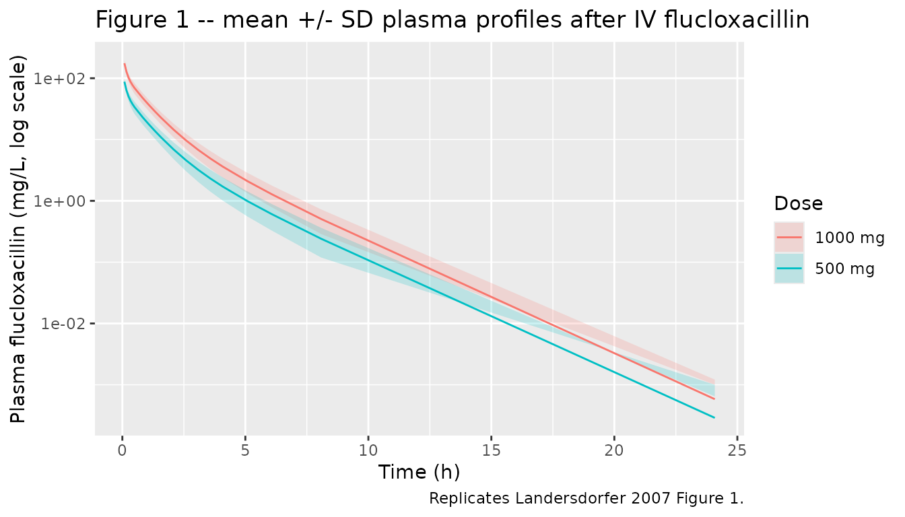
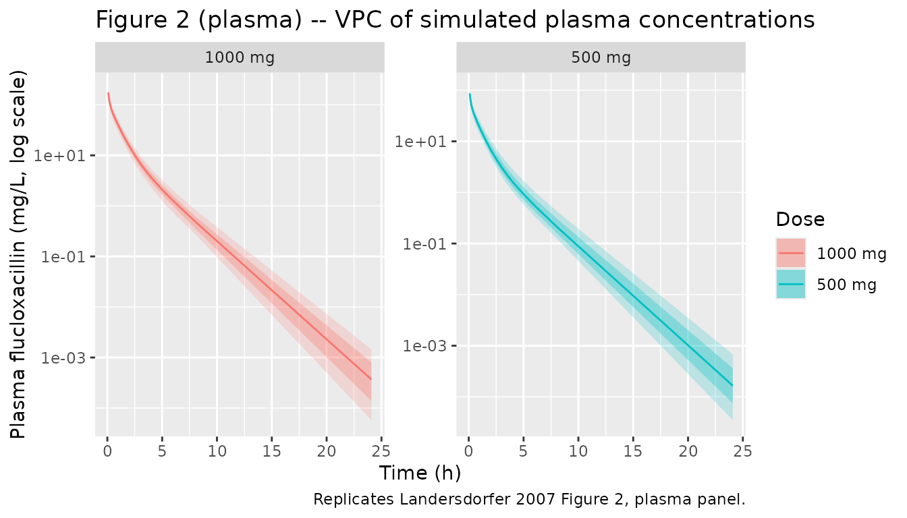
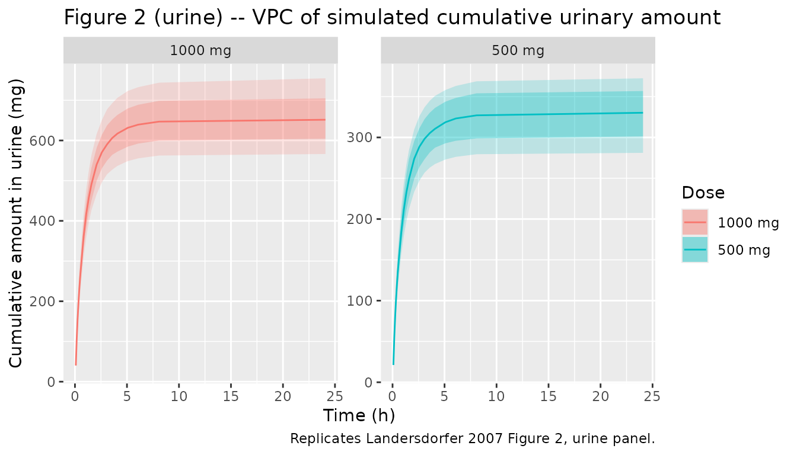

# Flucloxacillin (Landersdorfer 2007)

## Model and source

- Citation: Landersdorfer CB, Kirkpatrick CMJ, Kinzig-Schippers M,
  Bulitta JB, Holzgrabe U, Drusano GL, Sorgel F. Population
  pharmacokinetics at two dose levels and pharmacodynamic profiling of
  flucloxacillin. Antimicrob Agents Chemother. 2007;51(9):3290-3297.
  <doi:10.1128/AAC.01410-06>
- Description: Three-compartment population PK model for IV
  flucloxacillin in healthy adult volunteers (Landersdorfer 2007) with
  linear renal and non-renal elimination. The structural model splits
  total clearance into a renal arm (CL_R = 5.37 L/h) and a non-renal arm
  (CL_NR = 2.73 L/h); their sum reproduces the derived total clearance
  CL_T = 8.10 L/h reported in Table 2. The renal arm also drives a
  cumulative urinary excretion compartment that the paper fits jointly
  with plasma. Distribution uses a shallow peripheral (V_2 = 2.61 L,
  CLic_shallow = 15.3 L/h) and a deep peripheral (V_3 = 2.17 L,
  CLic_deep = 1.23 L/h); central volume V_1 = 4.79 L. Between-subject
  variability is reported as a full 5x5 variance-covariance matrix
  (Table 3, natural-log scale) on CL_R, CL_NR, V_1, V_2, V_3; no BSV is
  included on the inter-compartmental clearances. Residual error is
  combined additive + proportional on both plasma concentrations (9.4%
  CV, 0.155 mg/L) and cumulative urinary amounts (20.9% CV, 1.04 mg).
  The 5-min infusion duration used in the study is supplied via dose
  records (DUR / RATE) rather than as a model parameter. No structural
  covariates were retained: the cohort was 10 healthy Caucasian adults
  (5 M / 5 F, weight 52-83 kg, age 23-34 years) and demographics are not
  used inside the model. Monte Carlo dose-attainment simulations in the
  paper (continuous, 4-h, 0.5-h infusions) reuse these PK parameters
  together with 96% protein binding.
- Article: <https://doi.org/10.1128/AAC.01410-06>

## Population

Landersdorfer 2007 studied 10 healthy Caucasian adult volunteers (5
male, 5 female) in a randomised, two-way crossover trial at the
Institute for Biomedical and Pharmaceutical Research
(Nuernberg-Heroldsberg, Germany). The median body weight was 71 kg
(range 52-83), median height 178 cm (range 165-190), and median age 25
years (range 23-34). All subjects had normal renal and hepatic function
(Methods, Study participants; Results, Demographics).

Each subject received a single 500 mg dose and a single 1,000 mg dose of
flucloxacillin as a 5-min intravenous infusion, separated by a \>= 4-day
washout period. Plasma and urine were sampled over 24 h post-infusion
(Methods, Sampling schedule). The population PK fit pooled plasma and
urine data across both dose levels using NONMEM V (FOCE-I, ADVAN 11 /
TRANS 4 analytical solution); a three-compartment model with linear
renal and non-renal elimination was selected over two-compartment and
saturable-elimination alternatives based on a 200-point OFV improvement
and visual predictive checks (Methods, Population PK analysis; Results,
Population PK).

## Source trace

The per-parameter origin is recorded as an in-file comment next to each
`ini()` entry in
`inst/modeldb/specificDrugs/Landersdorfer_2007_flucloxacillin.R`. The
table below collects them in one place.

| Equation / parameter | Value | Source location |
|----|----|----|
| Three-compartment ODE system (central + shallow peripheral + deep peripheral + cumulative urine) | n/a | Methods, Population PK analysis (equations for dX(1)/dt through dX(4)/dt) |
| `lcl_renal` (renal CL CL_R) | 5.37 L/h | Table 2, CL_R |
| `lcl_nonren` (non-renal CL CL_NR) | 2.73 L/h | Table 2, CL_NR |
| `lvc` (central volume V_1) | 4.79 L | Table 2, V_1 |
| `lvp` (shallow peripheral volume V_2) | 2.61 L | Table 2, V_2 |
| `lvp2` (deep peripheral volume V_3) | 2.17 L | Table 2, V_3 |
| `lq` (central \<-\> shallow CLic_shallow) | 15.3 L/h | Table 2, CLic_shallow |
| `lq2` (central \<-\> deep CLic_deep) | 1.23 L/h | Table 2, CLic_deep |
| 5x5 BSV variance-covariance block on natural-log scale (CL_R, CL_NR, V_1, V_2, V_3) | see Table 3 entries | Table 3 (variance-covariance matrix) |
| `propSd` (plasma proportional residual) | 0.094 (9.4% CV) | Table 2, CV_C |
| `addSd` (plasma additive residual) | 0.155 mg/L | Table 2, SD_C |
| `propSd_urineAmt` (urine proportional residual) | 0.209 (20.9% CV) | Table 2, CV_AU |
| `addSd_urineAmt` (urine additive residual) | 1.04 mg | Table 2, SD_AU |
| 5-min infusion duration Tk_0 (fixed) | 5 min | Table 2, Tk_0 footnote (“not estimated”); supplied via dose record |
| No covariate effects retained | n/a | Methods, Individual PK model (only BSV variance-covariance is reported; no structural covariates discussed) |

Derived quantities (Table 2 footnotes b / c): total clearance CL_T =
CL_R + CL_NR = 8.10 L/h; steady-state volume V_ss = V_1 + V_2 + V_3 =
9.57 L. These are not free parameters and are recovered automatically
when the model is simulated.

## Virtual cohort

The original observed concentration-time data are not redistributed with
the nlmixr2lib package; the cohort below approximates the Landersdorfer
2007 trial demographics (n = 10 subjects per dose arm, both arms
simulated to mirror the crossover design). The model has no structural
covariates, so the cohort specification is just dosing.

``` r

set.seed(20070101L)

# Paper sampling schedule (Methods, Sampling schedule): pre-infusion (t=0),
# end of 5-min infusion, then 5, 10, 15, 20, 25, 45, 60, 75, 90 min and
# 2, 2.5, 3, 3.5, 4, 5, 6, 8, 24 h after end of infusion.
obs_times <- c(0,
               5/60,
               5/60 + c(5, 10, 15, 20, 25, 45, 60, 75, 90) / 60,
               5/60 + c(2, 2.5, 3, 3.5, 4, 5, 6, 8, 24))

make_cohort <- function(n, dose_mg, id_offset = 0L) {
  ids <- id_offset + seq_len(n)
  arm <- paste0(dose_mg, " mg")
  dosing <- tibble(
    id       = ids,
    time     = 0,
    amt      = as.numeric(dose_mg),
    evid     = 1L,
    cmt      = "central",
    dur      = 5 / 60,   # 5-min infusion (paper Tk_0)
    rate     = NA_real_,
    dose_arm = arm
  )
  obs <- tidyr::expand_grid(id = ids, time = obs_times) |>
    mutate(amt = NA_real_, evid = 0L, cmt = "Cc", dur = NA_real_,
           rate = NA_real_, dose_arm = arm)
  bind_rows(dosing, obs) |> arrange(id, time, desc(evid))
}

events <- bind_rows(
  make_cohort(n = 200L, dose_mg =  500, id_offset =    0L),
  make_cohort(n = 200L, dose_mg = 1000, id_offset = 1000L)
)

stopifnot(!anyDuplicated(unique(events[, c("id", "time", "evid")])))
```

## Simulation

``` r

mod <- readModelDb("Landersdorfer_2007_flucloxacillin")
sim <- rxode2::rxSolve(mod, events = events, keep = "dose_arm") |>
  as.data.frame()
#> ℹ parameter labels from comments will be replaced by 'label()'
```

``` r

mod_typical <- rxode2::zeroRe(mod)
#> ℹ parameter labels from comments will be replaced by 'label()'
sim_typical <- rxode2::rxSolve(mod_typical, events = events, keep = "dose_arm") |>
  as.data.frame()
#> ℹ omega/sigma items treated as zero: 'etalcl_renal', 'etalcl_nonren', 'etalvc', 'etalvp', 'etalvp2'
#> Warning: multi-subject simulation without without 'omega'
```

## Replicate published figures

``` r

# Replicates Figure 1 of Landersdorfer 2007: average plasma concentrations
# after 5-min IV infusions of 500 mg and 1,000 mg flucloxacillin. The paper's
# Figure 1 shows mean +/- SD profiles in linear and semi-log scales.
sim |>
  filter(time > 0, !is.na(Cc)) |>
  group_by(dose_arm, time) |>
  summarise(
    mean_Cc = mean(Cc),
    sd_Cc   = sd(Cc),
    .groups = "drop"
  ) |>
  ggplot(aes(time, mean_Cc, colour = dose_arm)) +
  geom_ribbon(aes(ymin = pmax(mean_Cc - sd_Cc, 1e-3),
                  ymax = mean_Cc + sd_Cc,
                  fill = dose_arm), alpha = 0.20, colour = NA) +
  geom_line() +
  scale_y_log10() +
  labs(x = "Time (h)", y = "Plasma flucloxacillin (mg/L, log scale)",
       colour = "Dose", fill = "Dose",
       title = "Figure 1 -- mean +/- SD plasma profiles after IV flucloxacillin",
       caption = "Replicates Landersdorfer 2007 Figure 1.")
```



``` r

# Replicates Figure 2 of Landersdorfer 2007 (plasma VPC panel): median and
# prediction intervals over time, by dose group.
vpc_plasma <- sim |>
  filter(time > 0, !is.na(Cc)) |>
  group_by(dose_arm, time) |>
  summarise(
    Q10 = quantile(Cc, 0.10),
    Q25 = quantile(Cc, 0.25),
    Q50 = quantile(Cc, 0.50),
    Q75 = quantile(Cc, 0.75),
    Q90 = quantile(Cc, 0.90),
    .groups = "drop"
  )

ggplot(vpc_plasma, aes(time)) +
  geom_ribbon(aes(ymin = Q10, ymax = Q90, fill = dose_arm), alpha = 0.20) +
  geom_ribbon(aes(ymin = Q25, ymax = Q75, fill = dose_arm), alpha = 0.30) +
  geom_line(aes(y = Q50, colour = dose_arm)) +
  facet_wrap(~dose_arm, scales = "free_y") +
  scale_y_log10() +
  labs(x = "Time (h)", y = "Plasma flucloxacillin (mg/L, log scale)",
       colour = "Dose", fill = "Dose",
       title = "Figure 2 (plasma) -- VPC of simulated plasma concentrations",
       caption = "Replicates Landersdorfer 2007 Figure 2, plasma panel.")
```



``` r

# Replicates Figure 2 of Landersdorfer 2007 (urine VPC panel): cumulative
# amount excreted unchanged in urine over 24 h.
vpc_urine <- sim |>
  filter(time > 0, !is.na(urineAmt)) |>
  group_by(dose_arm, time) |>
  summarise(
    Q10 = quantile(urineAmt, 0.10),
    Q25 = quantile(urineAmt, 0.25),
    Q50 = quantile(urineAmt, 0.50),
    Q75 = quantile(urineAmt, 0.75),
    Q90 = quantile(urineAmt, 0.90),
    .groups = "drop"
  )

ggplot(vpc_urine, aes(time)) +
  geom_ribbon(aes(ymin = Q10, ymax = Q90, fill = dose_arm), alpha = 0.20) +
  geom_ribbon(aes(ymin = Q25, ymax = Q75, fill = dose_arm), alpha = 0.30) +
  geom_line(aes(y = Q50, colour = dose_arm)) +
  facet_wrap(~dose_arm, scales = "free_y") +
  labs(x = "Time (h)", y = "Cumulative amount in urine (mg)",
       colour = "Dose", fill = "Dose",
       title = "Figure 2 (urine) -- VPC of simulated cumulative urinary amount",
       caption = "Replicates Landersdorfer 2007 Figure 2, urine panel.")
```



## PKNCA validation

``` r

sim_nca <- sim |>
  filter(!is.na(Cc)) |>
  select(id, time, Cc, dose_arm)

dose_df <- events |>
  filter(evid == 1) |>
  select(id, time, amt, dose_arm)

conc_obj <- PKNCA::PKNCAconc(sim_nca, Cc ~ time | dose_arm + id,
                             concu = "mg/L", timeu = "h")
dose_obj <- PKNCA::PKNCAdose(dose_df, amt ~ time | dose_arm + id,
                             doseu = "mg")

intervals <- data.frame(
  start       = 0,
  end         = Inf,
  cmax        = TRUE,
  tmax        = TRUE,
  aucinf.obs  = TRUE,
  half.life   = TRUE,
  mrt.iv.obs  = TRUE
)

nca_res <- PKNCA::pk.nca(PKNCA::PKNCAdata(conc_obj, dose_obj, intervals = intervals))

nca_tbl <- as.data.frame(nca_res$result) |>
  filter(PPTESTCD %in% c("cmax", "tmax", "aucinf.obs", "half.life", "mrt.iv.obs")) |>
  group_by(dose_arm, PPTESTCD) |>
  summarise(
    geomean = exp(mean(log(pmax(PPORRES, 1e-9)), na.rm = TRUE)),
    cv_pct  = 100 * sqrt(exp(var(log(pmax(PPORRES, 1e-9)), na.rm = TRUE)) - 1),
    n_used  = sum(!is.na(PPORRES)),
    .groups = "drop"
  ) |>
  arrange(dose_arm, PPTESTCD)

knitr::kable(nca_tbl,
             digits   = 3,
             caption  = "Simulated NCA parameters (geometric mean, CV%) by dose arm.")
```

| dose_arm | PPTESTCD   | geomean | cv_pct | n_used |
|:---------|:-----------|--------:|-------:|-------:|
| 1000 mg  | aucinf.obs | 123.582 | 17.996 |    200 |
| 1000 mg  | cmax       | 174.013 | 13.818 |    200 |
| 1000 mg  | half.life  |   1.529 | 12.621 |    200 |
| 1000 mg  | mrt.iv.obs |   1.235 | 13.050 |    200 |
| 1000 mg  | tmax       |   0.083 |  0.000 |    200 |
| 500 mg   | aucinf.obs |  59.736 | 20.469 |    200 |
| 500 mg   | cmax       |  86.873 | 14.466 |    200 |
| 500 mg   | half.life  |   1.534 | 12.841 |    200 |
| 500 mg   | mrt.iv.obs |   1.207 | 14.647 |    200 |
| 500 mg   | tmax       |   0.083 |  0.000 |    200 |

Simulated NCA parameters (geometric mean, CV%) by dose arm. {.table}

### Comparison against published NCA (Table 1)

``` r

# Landersdorfer 2007 Table 1: noncompartmental analysis (geometric mean and CV%)
# from the n = 10 healthy-volunteer crossover trial. The 'mrt.iv.obs' label
# from PKNCA corresponds to the paper's "Mean residence time (h)" entry.
published <- tribble(
  ~dose_arm, ~param,        ~published_geomean, ~published_cv_pct,
  "500 mg",  "cmax",        86.8,               13,
  "500 mg",  "aucinf.obs",  500 / 8.16,         21,
  "500 mg",  "half.life",   1.40,               26,
  "500 mg",  "mrt.iv.obs",  1.18,               19,
  "1000 mg", "cmax",        167,                16,
  "1000 mg", "aucinf.obs",  1000 / 8.18,        20,
  "1000 mg", "half.life",   1.62,               25,
  "1000 mg", "mrt.iv.obs",  1.22,               14
) |>
  rename(PPTESTCD = param)

comparison <- published |>
  left_join(nca_tbl, by = c("dose_arm", "PPTESTCD")) |>
  mutate(pct_diff_geomean = 100 * (geomean - published_geomean) / published_geomean) |>
  select(dose_arm, PPTESTCD,
         published_geomean, published_cv_pct,
         simulated_geomean = geomean,
         simulated_cv_pct  = cv_pct,
         pct_diff_geomean,
         simulated_n_used  = n_used)

knitr::kable(comparison,
             digits = c(0, 0, 2, 1, 2, 1, 1, 0),
             caption = paste("Published (Landersdorfer 2007 Table 1) vs simulated",
                             "NCA parameters; AUCinf published values are derived",
                             "as dose / total-CL (CL_T = 8.16 L/h at 500 mg and",
                             "8.18 L/h at 1,000 mg per Table 1).",
                             "`simulated_n_used` is the number of simulated subjects",
                             "(of 200 per dose arm) for which PKNCA was able to",
                             "compute the parameter; the rest are excluded by",
                             "PKNCA's standard checks (e.g., too few terminal-phase",
                             "points)."))
```

| dose_arm | PPTESTCD | published_geomean | published_cv_pct | simulated_geomean | simulated_cv_pct | pct_diff_geomean | simulated_n_used |
|:---|:---|---:|---:|---:|---:|---:|---:|
| 500 mg | cmax | 86.80 | 13 | 86.87 | 14.5 | 0.1 | 200 |
| 500 mg | aucinf.obs | 61.27 | 21 | 59.74 | 20.5 | -2.5 | 200 |
| 500 mg | half.life | 1.40 | 26 | 1.53 | 12.8 | 9.6 | 200 |
| 500 mg | mrt.iv.obs | 1.18 | 19 | 1.21 | 14.6 | 2.3 | 200 |
| 1000 mg | cmax | 167.00 | 16 | 174.01 | 13.8 | 4.2 | 200 |
| 1000 mg | aucinf.obs | 122.25 | 20 | 123.58 | 18.0 | 1.1 | 200 |
| 1000 mg | half.life | 1.62 | 25 | 1.53 | 12.6 | -5.6 | 200 |
| 1000 mg | mrt.iv.obs | 1.22 | 14 | 1.24 | 13.0 | 1.2 | 200 |

Published (Landersdorfer 2007 Table 1) vs simulated NCA parameters;
AUCinf published values are derived as dose / total-CL (CL_T = 8.16 L/h
at 500 mg and 8.18 L/h at 1,000 mg per Table 1). `simulated_n_used` is
the number of simulated subjects (of 200 per dose arm) for which PKNCA
was able to compute the parameter; the rest are excluded by PKNCA’s
standard checks (e.g., too few terminal-phase points). {.table}

The paper’s noncompartmental analysis (Table 1) was performed on
observed plasma samples from 10 subjects in a crossover design; the
simulated NCA above uses 200 virtual subjects per dose arm and dense
sampling, so the simulated CV% is expected to be somewhat tighter than
the observed CV% (the observed CV% includes assay and within-subject
variability that the typical-value simulation does not). Geometric means
should agree closely (target \<= 20% difference per the verification
checklist). The half-life and MRT comparisons exercise the late-phase
mixing among the three disposition compartments, which is the hardest
part of the model to reproduce from a Table-2 / Table-3 read.

## Assumptions and deviations

- **No structural covariates retained.** The paper does not include any
  covariate effects on PK parameters (Methods, Individual PK model); the
  cohort was 10 healthy adults with normal renal and hepatic function
  and the BSV model is a 5x5 variance-covariance block on natural-log
  scale, not a covariate-driven structural model. `covariateData` is
  therefore empty.
- **No BSV on inter-compartmental clearances.** Table 2 footnote d
  explicitly records that BSV was not estimated for CL_ic_shallow or
  CL_ic_deep “as estimation of these variance and covariance terms did
  not significantly improve the objective function” (Methods, Individual
  PK model). Reproduced as point-only `lq` and `lq2`.
- **5-min infusion duration is data-driven, not a model parameter.** The
  paper reports Tk_0 = 5 min as the structural duration of the
  zero-order input but records it as a fixed protocol constant (Table 2
  footnote “not estimated”). In rxode2 / nlmixr2 the infusion duration
  is supplied per dose record via `dur` (or `rate`); the vignette cohort
  uses `dur = 5/60 h` to match the trial. Monte-Carlo dose-attainment
  simulations described in the paper (continuous, 4-h, 0.5-h infusions)
  reuse the same PK parameters and only change the dose record’s
  infusion duration.
- **Variance reading.** Table 3 reports the variance-covariance matrix
  on the natural-log scale; the paper’s Methods clarify that the “% CV”
  column in Table 2 is sqrt(omega^2) expressed as a percentage rather
  than the back-transformed `log(1 + CV^2)` form some popPK papers use.
  The Table 3 diagonals are therefore used directly as `omega^2` in
  `ini()` rather than recomputed from the Table 2 CV%, which would
  introduce a rounding error.
- **AUCinf published reference is derived, not directly reported.**
  Table 1 reports total clearance CL_T (8.16 L/h at 500 mg; 8.18 L/h at
  1,000 mg) rather than AUCinf, so the comparison in the PKNCA section
  back-derives AUCinf = dose / CL_T. This is dimensionally equivalent
  and exact under the paper’s linear-PK conclusion (Results, Population
  PK; Discussion paragraph 6).
- **Monte Carlo Simulation block omitted.** The paper’s Figures 3 and 4
  and Table 4 use the PK model to compute fT \> MIC for various dosing
  regimens with 96% protein binding. Those simulations are
  dose-attainment analyses rather than PK validation, and are not
  reproduced here; the vignette is scoped to validating that the PK
  structural model + parameter set reproduce the paper’s primary PK
  observations (Figures 1-2 and Table 1).
