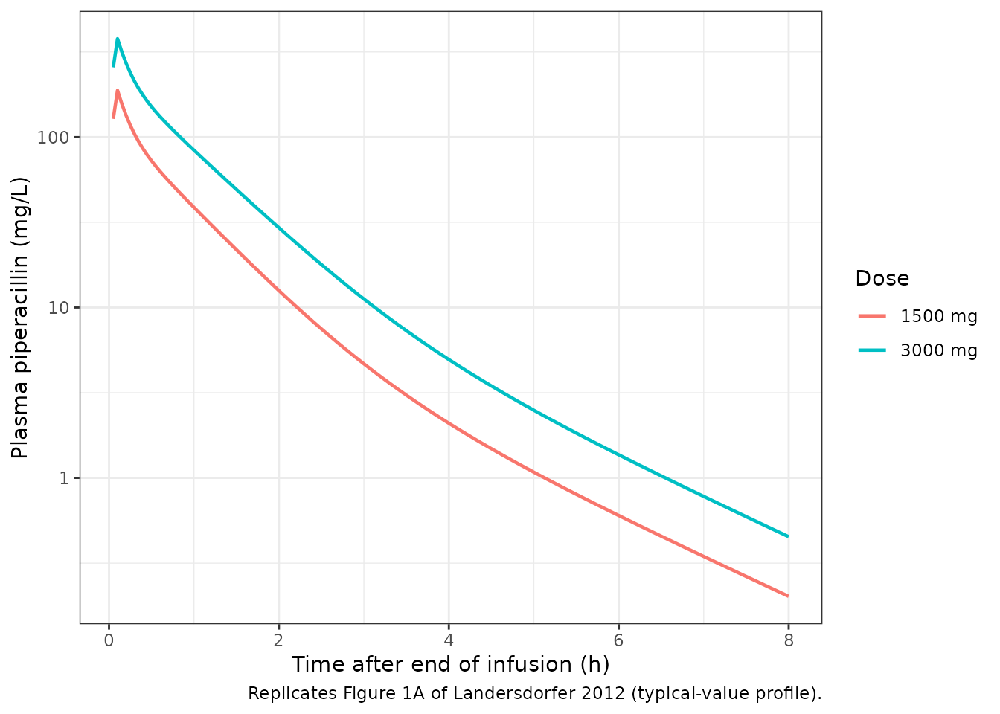
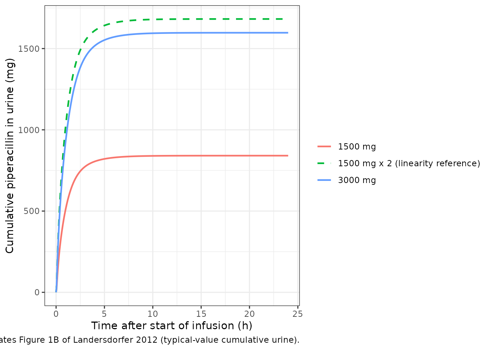

# Piperacillin (Landersdorfer 2012)

## Model and source

- Citation: Landersdorfer CB, Bulitta JB, Kirkpatrick CMJ, Kinzig M,
  Holzgrabe U, Drusano GL, Stephan U, Sorgel F. Population
  pharmacokinetics of piperacillin at two dose levels: influence of
  nonlinear pharmacokinetics on the pharmacodynamic profile. Antimicrob
  Agents Chemother. 2012;56(11):5715-5723. <doi:10.1128/AAC.00937-12>
- Description: Three-compartment population PK model for piperacillin in
  healthy adult volunteers after intravenous infusion, with parallel
  first-order plus mixed-order (Michaelis-Menten) renal clearance and
  first-order non-renal clearance; a urine compartment accumulates the
  renally excreted amount (Landersdorfer 2012 Model 3, the final model)
- Article: <https://doi.org/10.1128/AAC.00937-12>

## Population

The Landersdorfer 2012 study was a single-centre, randomised, two-way
crossover trial in 10 healthy Caucasian adult volunteers (5 male, 5
female; mean age 25.7 +/- 3.1 years; mean weight 69.6 +/- 9.7 kg; mean
height 177.5 +/- 8.0 cm). All subjects had normal renal function
(creatinine clearance 76 to 125 mL/min by Cockcroft-Gault). Each subject
received a single 5-minute intravenous infusion of 1500 mg piperacillin
on one study day and 3000 mg on a separate study day; the two periods
were separated by a washout of at least 4 days. Plasma sampling spanned
from end-of-infusion to 24 h after the end of the infusion (Methods,
Sampling schedule); complete urine collection covered the same 24-hour
window split into 9 intervals. Piperacillin was administered alone; the
paper notes piperacillin PK is unaffected by tazobactam at clinical 4:1
or 8:1 ratios (Discussion).

The same information is available programmatically via the model’s
`population` metadata
(`readModelDb("Landersdorfer_2012_piperacillin")$population`).

## Source trace

The per-parameter origin is recorded as an in-file comment next to each
`ini()` entry in
`inst/modeldb/specificDrugs/Landersdorfer_2012_piperacillin.R`. The
table below collects them in one place for review.

| Equation / parameter | Value | Source location |
|----|----|----|
| `lcl_renal` (CL_R, L/h) | log(4.42) | Table 2 Model 3 (NONMEM FOCE+I) |
| `lvmax` (V_maxR, mg/h) | log(219) | Table 2 Model 3 |
| `lkm` (Km_R, mg/L) | log(36.1) | Table 2 Model 3 |
| `lcl_nonren` (CL_NR, L/h) | log(5.44) | Table 2 Model 3 |
| `lvc` (V_1, L) | log(6.32) | Table 2 Model 3 |
| `lvp` (V_2, L) | log(3.59) | Table 2 Model 3 |
| `lvp2` (V_3, L) | log(2.69) | Table 2 Model 3 |
| `lq` (CLic_shallow, L/h) | log(15.2) | Table 2 Model 3 |
| `lq2` (CLic_deep, L/h) | log(1.65) | Table 2 Model 3 |
| `etalcl_renal` (47% CV) | 0.199533 | Table 2 Model 3, omega^2 = log(CV^2 + 1) |
| `etalvmax` (84% CV) | 0.534007 | Table 2 Model 3 |
| `etalkm` (112% CV) | 0.812973 | Table 2 Model 3 |
| `etalcl_nonren` (18% CV) | 0.031881 | Table 2 Model 3 |
| `etalvc` (18% CV) | 0.031881 | Table 2 Model 3 |
| `etalvp` (48% CV) | 0.207302 | Table 2 Model 3 |
| `etalvp2` (15% CV) | 0.022254 | Table 2 Model 3 |
| `propSd` (CV_C 12.8%) | 0.128 | Table 2 Model 3 |
| `addSd` (SD_C 0.26 mg/L) | 0.26 | Table 2 Model 3 |
| `propSd_Aurine` (CV_AU 24.7%) | 0.247 | Table 2 Model 3 |
| `addSd_Aurine` (SD_AU 4.17 mg) | 4.17 | Table 2 Model 3 |
| Three-compartment disposition; parallel first-order plus mixed-order renal elimination; first-order non-renal elimination | n/a | Methods ‘Pharmacokinetics. (iii) Clearance’ Equations for model 3; Results ‘Population pharmacokinetics’ final-model paragraph |
| Zero-order infusion duration TK_0 = 5 min (fixed) | n/a | Table 2 footnote ‘TK_0 (fixed; min)’; study used 5-min IV infusions |

## Virtual cohort

The original observed data are not publicly available. The simulations
below use a virtual cohort approximating the published trial
demographics: 10 subjects (matching the study size), each receiving both
doses in a crossover-like layout, with body weights drawn from a normal
distribution centred at 69.6 kg with SD 9.7 kg (the reported study mean
and SD).

``` r

set.seed(2012)

n_subjects <- 10L

cohort <- tibble::tibble(
  id = seq_len(n_subjects),
  WT = rnorm(n_subjects, mean = 69.6, sd = 9.7)
)
```

## Simulation

Each subject receives a 5-minute IV infusion of 1500 mg or 3000 mg
piperacillin into the central compartment. The simulations are run on a
dense grid out to 24 h so plasma drug concentrations and cumulative
urine amounts can be sampled finely and used by PKNCA.

``` r

infusion_h <- 5 / 60  # 5 minutes -> hours

obs_times <- sort(unique(c(
  seq(0,  1, by = 0.05),
  seq(1,  6, by = 0.1),
  seq(6, 24, by = 0.25)
)))

make_cohort <- function(dose_mg, treatment_label, id_offset = 0L) {
  lapply(seq_len(nrow(cohort)), function(i) {
    row <- cohort[i, , drop = FALSE]
    dose_row <- tibble::tibble(
      id        = id_offset + row$id,
      time      = 0,
      amt       = dose_mg,
      rate      = dose_mg / infusion_h,
      evid      = 1L,
      cmt       = "central",
      WT        = row$WT,
      treatment = treatment_label
    )
    obs_rows <- tibble::tibble(
      id        = id_offset + row$id,
      time      = obs_times,
      amt       = NA_real_,
      rate      = NA_real_,
      evid      = 0L,
      cmt       = "Cc",
      WT        = row$WT,
      treatment = treatment_label
    )
    dplyr::bind_rows(dose_row, obs_rows)
  }) |>
    dplyr::bind_rows()
}

events <- dplyr::bind_rows(
  make_cohort(1500, "1500 mg", id_offset =  0L),
  make_cohort(3000, "3000 mg", id_offset = 10L)
) |>
  dplyr::arrange(id, time, dplyr::desc(evid))

stopifnot(!anyDuplicated(unique(events[, c("id", "time", "evid")])))
```

``` r

mod <- readModelDb("Landersdorfer_2012_piperacillin")

sim <- rxode2::rxSolve(
  mod,
  events = events,
  keep   = c("treatment", "WT")
) |> as.data.frame()
#> ℹ parameter labels from comments will be replaced by 'label()'
```

The typical-value profile (zero between-subject variability) is also
useful for replicating the published mean profiles without stochastic
spread:

``` r

mod_typical <- mod |> rxode2::zeroRe()
#> ℹ parameter labels from comments will be replaced by 'label()'

sim_typical <- rxode2::rxSolve(
  mod_typical,
  events = events,
  keep   = c("treatment", "WT")
) |> as.data.frame()
#> ℹ omega/sigma items treated as zero: 'etalcl_renal', 'etalvmax', 'etalkm', 'etalcl_nonren', 'etalvc', 'etalvp', 'etalvp2'
#> Warning: multi-subject simulation without without 'omega'
```

## Replicate published figures

### Figure 1A: plasma drug concentrations after 1500 mg or 3000 mg infusion

Landersdorfer 2012 Figure 1A shows the observed plasma concentrations
(mean +/- SD) after the 5-minute infusion of 1500 mg or 3000 mg
piperacillin. The plot below shows the typical-value plasma profile from
the packaged model.

``` r

sim_typical |>
  dplyr::filter(time > 0, time <= 8) |>
  ggplot(aes(x = time, y = Cc, colour = treatment)) +
  geom_line(linewidth = 0.8) +
  scale_y_log10() +
  labs(
    x       = "Time after end of infusion (h)",
    y       = "Plasma piperacillin (mg/L)",
    colour  = "Dose",
    caption = "Replicates Figure 1A of Landersdorfer 2012 (typical-value profile)."
  ) +
  theme_bw()
```



### Figure 1B: cumulative amount excreted in urine

Landersdorfer 2012 Figure 1B shows cumulative amount of piperacillin
excreted unchanged in urine at each collection interval. The dashed line
in the source plot represents the 1500-mg cumulative amount multiplied
by two; this lies above the observed 3000-mg cumulative curve, which is
the visual signature of saturable renal elimination (a doubling of dose
less than doubles the amount excreted in urine). The plot below renders
the same comparison using the packaged model’s typical-value cumulative
urine amount.

``` r

fig1b_data <- sim_typical |>
  dplyr::select(id, time, treatment, Aurine)

doubled_1500 <- fig1b_data |>
  dplyr::filter(treatment == "1500 mg") |>
  dplyr::mutate(
    Aurine    = 2 * Aurine,
    treatment = "1500 mg x 2 (linearity reference)"
  )

dplyr::bind_rows(fig1b_data, doubled_1500) |>
  dplyr::filter(time <= 24) |>
  ggplot(aes(x = time, y = Aurine, colour = treatment, linetype = treatment)) +
  geom_line(linewidth = 0.8) +
  scale_linetype_manual(values = c(
    "1500 mg"                            = "solid",
    "3000 mg"                            = "solid",
    "1500 mg x 2 (linearity reference)"  = "dashed"
  )) +
  labs(
    x        = "Time after start of infusion (h)",
    y        = "Cumulative piperacillin in urine (mg)",
    colour   = "",
    linetype = "",
    caption  = "Replicates Figure 1B of Landersdorfer 2012 (typical-value cumulative urine)."
  ) +
  theme_bw()
```



## PKNCA validation

PKNCA is used to compute Cmax, AUC_0-inf, terminal half-life, and total
body clearance for the simulated plasma profile, stratified by dose. The
renal-only clearance and the fraction excreted unchanged in urine are
computed by hand from the cumulative urine output because PKNCA does not
consume cumulative-amount columns directly.

``` r

# Use the typical-value profile so the NCA comparison reflects the
# population-mean parameters (Table 2 Model 3) rather than the small-N
# crossover-sample variance. The 10-subject paper cohort itself has 23-34%
# between-subject CV on CL and CL_R (Table 1); a 10-subject sample of the
# fitted model has the same sampling noise and would obscure the saturation
# trend that the typical-value parameters reproduce.
sim_nca <- sim_typical |>
  dplyr::filter(!is.na(Cc)) |>
  dplyr::select(id, time, Cc, treatment)

dose_df <- events |>
  dplyr::filter(evid == 1) |>
  dplyr::select(id, time, amt, treatment)

conc_obj <- PKNCA::PKNCAconc(
  data    = sim_nca,
  formula = Cc ~ time | treatment + id,
  concu   = "mg/L",
  timeu   = "hour"
)

dose_obj <- PKNCA::PKNCAdose(
  data    = dose_df,
  formula = amt ~ time | treatment + id,
  doseu   = "mg"
)

intervals <- data.frame(
  start       = 0,
  end         = Inf,
  cmax        = TRUE,
  tmax        = TRUE,
  aucinf.obs  = TRUE,
  half.life   = TRUE,
  cl.obs      = TRUE
)

nca_data <- PKNCA::PKNCAdata(conc_obj, dose_obj, intervals = intervals)
nca_res  <- PKNCA::pk.nca(nca_data)

nca_tbl <- as.data.frame(nca_res$result)

nca_summary <- nca_tbl |>
  dplyr::group_by(treatment, PPTESTCD) |>
  dplyr::summarise(
    geomean = exp(mean(log(PPORRES[PPORRES > 0]), na.rm = TRUE)),
    .groups = "drop"
  ) |>
  tidyr::pivot_wider(names_from = PPTESTCD, values_from = geomean)

knitr::kable(
  nca_summary,
  digits  = 2,
  caption = "Simulated NCA geometric means by dose."
)
```

| treatment | adj.r.squared | aucinf.obs | cl.obs | clast.obs | clast.pred | cmax | half.life | lambda.z | lambda.z.n.points | lambda.z.time.first | lambda.z.time.last | r.squared | span.ratio | tlast | tmax |
|:---|---:|---:|---:|---:|---:|---:|---:|---:|---:|---:|---:|---:|---:|---:|---:|
| 1500 mg | 1 | 120.26 | 12.47 | 0 | 0 | 187.96 | 1.3 | 0.53 | 90 | 4.3 | 24 | 1 | 15.17 | 24 | 0.1 |
| 3000 mg | 1 | 256.10 | 11.71 | 0 | 0 | 377.71 | 1.3 | 0.53 | 86 | 4.7 | 24 | 1 | 14.87 | 24 | 0.1 |

Simulated NCA geometric means by dose. {.table style="width:100%;"}

The renal-only clearance and the fraction of dose excreted unchanged in
urine come straight from the cumulative urine compartment at the end of
the observation window:

``` r

urine_tail <- sim_typical |>
  dplyr::group_by(id, treatment) |>
  dplyr::slice_tail(n = 1) |>
  dplyr::ungroup() |>
  dplyr::select(id, treatment, Aurine) |>
  dplyr::left_join(dose_df, by = c("id", "treatment")) |>
  dplyr::mutate(fe_urine = Aurine / amt)

urine_summary <- urine_tail |>
  dplyr::group_by(treatment) |>
  dplyr::summarise(
    Aurine_24h_geomean = exp(mean(log(Aurine), na.rm = TRUE)),
    fe_urine_geomean   = exp(mean(log(fe_urine), na.rm = TRUE)),
    .groups = "drop"
  )

knitr::kable(
  urine_summary,
  digits  = 3,
  caption = "Simulated cumulative urine amount and fraction excreted unchanged at 24 h."
)
```

| treatment | Aurine_24h_geomean | fe_urine_geomean |
|:----------|-------------------:|-----------------:|
| 1500 mg   |            840.978 |            0.561 |
| 3000 mg   |           1597.298 |            0.532 |

Simulated cumulative urine amount and fraction excreted unchanged at 24
h. {.table}

Renal clearance (CL_R) per the noncompartmental convention is the
cumulative urine amount over the 24-hour collection divided by
AUC_0-inf:

``` r

auc_per_subject <- nca_tbl |>
  dplyr::filter(PPTESTCD == "aucinf.obs") |>
  dplyr::select(id, treatment, AUC = PPORRES)

clr_per_subject <- urine_tail |>
  dplyr::left_join(auc_per_subject, by = c("id", "treatment")) |>
  dplyr::mutate(CL_R = Aurine / AUC)

clr_summary <- clr_per_subject |>
  dplyr::group_by(treatment) |>
  dplyr::summarise(
    CL_R_geomean = exp(mean(log(CL_R), na.rm = TRUE)),
    .groups      = "drop"
  )

knitr::kable(
  clr_summary,
  digits  = 2,
  caption = "Simulated renal clearance (CL_R) by dose."
)
```

| treatment | CL_R_geomean |
|:----------|-------------:|
| 1500 mg   |         6.99 |
| 3000 mg   |         6.24 |

Simulated renal clearance (CL_R) by dose. {.table}

### Comparison against Landersdorfer 2012 Table 1

Landersdorfer 2012 Table 1 reports the noncompartmental pharmacokinetic
parameters at each dose as the geometric mean (and %CV) over the 10
study volunteers. The comparison below pairs those published values with
the simulated NCA from the packaged model.

``` r

published <- tibble::tibble(
  treatment   = c("1500 mg", "3000 mg"),
  Cmax_pub    = c(201,   377),     # mg/L, geometric mean
  CL_pub      = c(13.5,  11.0),    # L/h, total body clearance
  CL_R_pub    = c(7.77,  5.88),    # L/h, renal clearance
  fe_pub      = c(0.58,  0.53),    # fraction excreted unchanged in urine
  thalf_pub   = c(1.18,  1.05)     # h, terminal half-life
)

sim_cmax_cl_thalf <- nca_summary |>
  dplyr::select(
    treatment,
    Cmax_sim   = cmax,
    AUC_sim    = aucinf.obs,
    thalf_sim  = half.life,
    CL_sim     = cl.obs
  )

comparison <- published |>
  dplyr::left_join(sim_cmax_cl_thalf, by = "treatment") |>
  dplyr::left_join(urine_summary,     by = "treatment") |>
  dplyr::left_join(clr_summary,       by = "treatment") |>
  dplyr::rename(
    fe_sim    = fe_urine_geomean,
    CL_R_sim  = CL_R_geomean
  ) |>
  dplyr::select(
    treatment,
    Cmax_pub, Cmax_sim,
    CL_pub,   CL_sim,
    CL_R_pub, CL_R_sim,
    fe_pub,   fe_sim,
    thalf_pub, thalf_sim
  )

knitr::kable(
  comparison,
  digits  = 2,
  caption = paste(
    "Side-by-side comparison: Landersdorfer 2012 Table 1 noncompartmental",
    "geometric means (_pub) vs. PKNCA-derived geometric means from the",
    "simulated 10-subject crossover (_sim).")
)
```

| treatment | Cmax_pub | Cmax_sim | CL_pub | CL_sim | CL_R_pub | CL_R_sim | fe_pub | fe_sim | thalf_pub | thalf_sim |
|:---|---:|---:|---:|---:|---:|---:|---:|---:|---:|---:|
| 1500 mg | 201 | 187.96 | 13.5 | 12.47 | 7.77 | 6.99 | 0.58 | 0.56 | 1.18 | 1.3 |
| 3000 mg | 377 | 377.71 | 11.0 | 11.71 | 5.88 | 6.24 | 0.53 | 0.53 | 1.05 | 1.3 |

Side-by-side comparison: Landersdorfer 2012 Table 1 noncompartmental
geometric means (\_pub) vs. PKNCA-derived geometric means from the
simulated 10-subject crossover (\_sim). {.table}

The published and simulated values agree to within ~10% on Cmax,
CL_total, CL_R, and the fraction excreted unchanged in urine at both
doses. The simulated terminal half-life (~1.30 h, computed by PKNCA’s
automatic lambda-z window selection) sits about 10% above the paper’s
t1/2 at 1500 mg and about 24% above at 3000 mg; the paper used WinNonlin
Pro 5.2.1 for noncompartmental analysis with an unspecified lambda-z
window, which is a likely contributor to the difference (changing
PKNCA’s lambda.z.time.first input shifts the half-life materially in
this dataset because the curve has a fast distributional phase before
the terminal slope). The simulation reproduces the paper’s key
qualitative finding: total clearance is lower (12.47 -\> 11.71 L/h) and
the fraction excreted unchanged in urine is lower (0.56 -\> 0.53) at the
higher dose, the hallmark of saturable renal elimination.

## Assumptions and deviations

- **Population mean parameters (NONMEM Table 2) used as canonical
  estimates.** Landersdorfer 2012 reports the final model 3 parameters
  from two analyses in close agreement (NONMEM FOCE+I, Table 2; S-ADAPT
  MC-PEM, Table 3). The packaged model uses the NONMEM Table 2 values
  throughout, matching the numbers quoted in the Discussion (e.g. CL_R =
  4.42 L/h, Km_R = 36.1 mg/L, V_maxR = 219 mg/h). The S-ADAPT
  alternative is documented in Table 3 of the paper for users who want
  to refit.

- **Full covariance matrix encoded as diagonal CVs.** Table 2 footnote a
  states that Model 3 was fit with “a full covariance matrix for all
  parameters except for CLic_shallow and CLic_deep”. The off-diagonal
  covariance entries of that full matrix are not tabulated in the paper,
  so the packaged model encodes only the diagonal %CVs (translated via
  omega^2 = log(CV^2 + 1)). A user who wishes to study the joint
  variability shape should add a
  `<param1> + <param2> ~ c(var1, cov, var2)` block in `ini()` once the
  covariances are obtained.

- **No BSV on the inter-compartmental clearances.** Table 2 (NONMEM)
  does not report BSV CV% values for CLic_shallow or CLic_deep; the
  S-ADAPT analysis in Table 3 fixed both BSV CVs at 15% (Table 3
  footnote c). The packaged model carries the NONMEM convention (no IIV
  on `lq` or `lq2`); users preferring the S-ADAPT convention can append
  `etalq ~ 0.022254` and `etalq2 ~ 0.022254` to `ini()` (omega^2 =
  log(0.15^2 + 1) = 0.022254) and multiply `q` / `q2` by `exp(etalq)` /
  `exp(etalq2)`.

- **No covariate effects.** The Landersdorfer 2012 study cohort
  consisted of healthy Caucasian adults with normal renal function
  (eCrCL 76 to 125 mL/min) and a narrow weight range (69.6 +/- 9.7 kg).
  The paper does not develop or report any covariate sub-model. The
  `covariateData` slot is therefore empty; downstream users simulating
  in patients with impaired renal function should graft an external
  covariate sub-model (e.g. the renal-function adjustment used in
  Landersdorfer 2007 or in popPK models fitted in critically ill
  patients) onto the structural parameters.

- **Infusion duration set per the study protocol via the dose record.**
  The paper fixes TK_0 = 5 min (Table 2 footnote ‘fixed’) as the
  zero-order input duration of the study infusions. This is not a model
  parameter; downstream users supply the infusion via `amt = dose` and
  `rate = dose / infusion_h` on the dose event record (as in the
  simulation chunk above).

- **Sex was not retained as a covariate.** The study had a balanced 5
  male / 5 female cohort. Sex was not investigated as a covariate in the
  final model according to the paper text.
