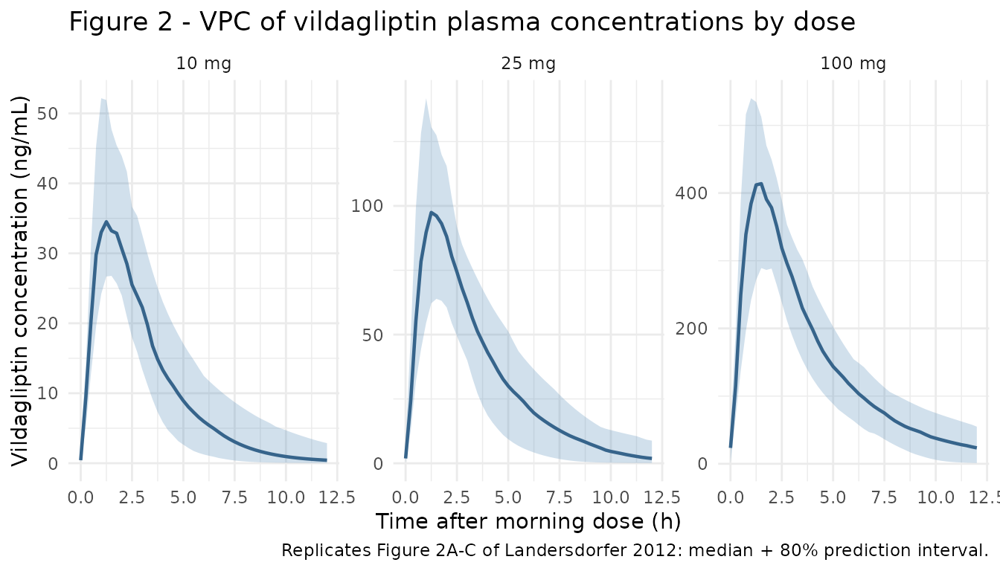
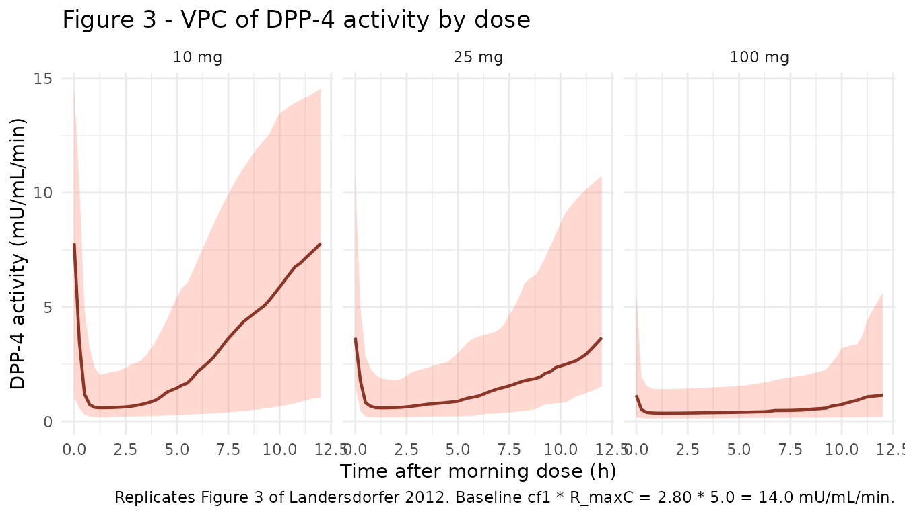
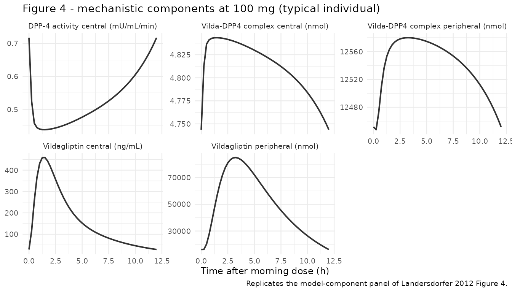

# Vildagliptin (Landersdorfer 2012)

## Model and source

- Citation: Landersdorfer CB, He YL, Jusko WJ. Mechanism-based
  population pharmacokinetic modelling in diabetes: vildagliptin as a
  tight binding inhibitor and substrate of dipeptidyl peptidase IV. Br J
  Clin Pharmacol. 2012;73(3):391-401.
  <doi:10.1111/j.1365-2125.2011.04108.x>
- Description: Mechanism-based population PK plus DPP-4 activity model
  for vildagliptin in patients with type 2 diabetes. Target-mediated
  drug disposition with capacity-limited slow-tight binding of
  vildagliptin to DPP-4 in plasma and tissue and partial hydrolysis of
  vildagliptin by DPP-4.
- Article: [Br J Clin Pharmacol
  2012;73(3):391-401](https://doi.org/10.1111/j.1365-2125.2011.04108.x)

Landersdorfer et al. developed a mechanism-based population PK / DPP-4
activity model for vildagliptin in patients with type 2 diabetes. The
model captures slight (over-)dose-proportional pharmacokinetics by
encoding target-mediated drug disposition: vildagliptin binds DPP-4 in
plasma and in tissue with slow tight binding kinetics, and a fraction of
the bound drug is hydrolysed by DPP-4 to an inactive metabolite (k_deg).
The companion paper (Landersdorfer 2012, ref \[9\] of the source)
extends this PK / DPP-4 module with active GLP-1, glucose, and insulin
sub-models; only the PK / DPP-4 module is packaged here.

## Population

The fit population was 13 patients with type 2 diabetes (mean age 53.5
years, range 37-64; weight 91 kg mean, range 65-116; height 166 cm mean,
range 148-183; 6 male / 7 female). Subjects had diabetes for at least 3
months and washed out of hypoglycaemic drugs for up to 4 weeks before
dosing. The randomized, placebo-controlled, double-blind, four-way
crossover study administered 10, 25, and 100 mg vildagliptin and placebo
orally twice daily for 28 days each, with PK sampling on day 28 of each
period (Landersdorfer 2012 Methods section “Study participants” and
section “Study design and drug administration”; the demographic numbers
above are summarised in Results, p. 393).

Bioavailability F was fixed at 77.2 % from a separate intravenous-dose
study in healthy volunteers (He YL et al. 2007, ref \[6\] of the source
paper).

The same information is available programmatically via
`readModelDb("Landersdorfer_2012_vildagliptin")()$meta$population`.

## Source trace

Every model equation and population parameter is annotated inline in
`inst/modeldb/specificDrugs/Landersdorfer_2012_vildagliptin.R`. The
table below collects the full provenance for review.

| Equation / parameter | Value | Source location |
|----|----|----|
| `d/dt(depot) = -k_a1 * A_G1` | – | Methods section “Structural models”, Eq for A_G1 |
| `d/dt(transit1) = k_a1 * A_G1 - k_a2 * A_G2` | – | Methods section “Structural models”, Eq for A_G2 |
| `d/dt(central) = k_a2 * A_G2 - (CL + CL_ic)/V_C * A_C + CL_ic/V_P * A_P - V_maxC + k_off * DR_C` | – | Methods section “Structural models”, Eq for A_C |
| `d/dt(peripheral1) = CL_ic/V_C * A_C - CL_ic/V_P * A_P - V_maxP + k_off * DR_P` | – | Methods section “Structural models”, Eq for A_P |
| `d/dt(complex) = V_maxC - (k_off + k_deg) * DR_C` | – | Methods section “Structural models”, Eq for DR_C |
| `d/dt(complex_peripheral) = V_maxP - (k_off + k_deg) * DR_P` | – | Methods section “Structural models”, Eq for DR_P |
| `V_maxC = k_2 * (A_C / V_C) * (R_maxC - DR_C) / (K_d + A_C / V_C)` | – | Methods section “Structural models”, V_maxC Eq |
| `V_maxP = k_2 * (A_P / V_P) * (R_maxP - DR_P) / (K_d + A_P / V_P)` | – | Methods section “Structural models”, V_maxP Eq |
| `DPP4 activity = cf1 * (R_maxC - DR_C)` | – | Methods section “Structural models”, DPP-4 activity output Eq |
| `CL` non-saturable clearance | 36.4 L/h | Table 1 (BSV 25%, SE 9%) |
| `V_C` central volume | 22.2 L | Table 1 (BSV 37%, SE 11%) |
| `V_P` peripheral volume | 97.3 L | Table 1 (BSV 37%, SE 13%) |
| `CL_ic` inter-compartmental clearance | 40.1 L/h | Table 1 (BSV 34%, SE 11%) |
| `k_a1` first absorption rate | 1.26 /h | Table 1 (BSV 46%, SE 15%) |
| `k_a2` second absorption rate | 1.05 /h | Table 1 (BSV 14%, SE 4%) |
| `F` bioavailability (fixed) | 0.772 | Table 1 footnote \* (fixed from co-modelling with i.v. He 2007 data) |
| `K_d` equilibrium dissociation constant | 71.9 nmol/L | Table 1 (BSV 54%, SE 16%) |
| `k_2` weak -\> high-affinity complex rate | 23.4 /h | Table 1 (BSV 70%, SE 22%) |
| `k_off` dissociation rate | 0.612 /h | Table 1 (BSV 94%, SE 27%) |
| `k_deg` hydrolysis-by-DPP-4 rate | 0.110 /h | Table 1 (BSV 81%, SE 26%) |
| `R_maxC` DPP-4 amount in central | 5.0 nmol | Table 1 (BSV 12%, SE 4%) |
| `R_maxP` DPP-4 amount in peripheral | 13.0 umol = 13000 nmol | Table 1 (BSV 64%, SE 23%) |
| `cf1` activity conversion factor | 2.80 (mU/mL/min)/nmol | Table 1 (BSV 17%, SE 5%) |
| `CV_Vilda` proportional residual | 48.7 % | Table 1 |
| `SD_Vilda` additive residual | 0.99 ng/mL | Table 1 |
| `CV_DPP-4` proportional residual | 19.6 % | Table 1 |
| `SD_DPP-4` additive residual | 0.061 mU/mL/min | Table 1 |

### Units check

Amounts in the model are nmol; volumes are L; so the internal
concentration `A_C / V_C` is nmol/L = nM. The bioanalytical readout is
ng/mL, which equals `nM * MW_vildagliptin / 1000` (MW = 303.40 g/mol;
PubChem CID 6918537). The binding-rate equation
`V_maxC = k_2 * C * (R_max - DR) / (K_d + C)` has units
`(1/h) * (nmol/L) * (nmol) / (nmol/L) = nmol/h`, matching
`d/dt(complex)`. Dose-unit conversion mg -\> nmol is folded into
`f(depot)` so the user passes amt in mg.

## Virtual cohort

The original study is small (13 subjects, day-28 sampling on each of
three dose periods) and the per-subject observations are not
redistributed. We build three matched virtual cohorts at the published
demographics, one per dose level, and run BID dosing to steady state
before sampling the final dosing interval.

``` r

set.seed(20260615)

# Dosing schedule: BID for 7 days (14 doses), then a dense observation grid
# over the next 12 h (one BID dosing interval at steady state).
n_per_dose <- 40L
dose_times <- seq(0, by = 12, length.out = 14)
sample_window <- 12 * 13                                # = 156 h, start of last interval
obs_pre  <- seq(0, sample_window, by = 12)              # trough samples before SS
obs_post <- seq(sample_window, sample_window + 12, by = 0.25)
obs_times <- sort(unique(c(obs_pre, obs_post)))

make_cohort <- function(n, dose_mg, treatment, id_offset = 0L) {
  ids <- id_offset + seq_len(n)
  dosing <- tidyr::expand_grid(id = ids, time = dose_times) |>
    dplyr::mutate(
      amt       = dose_mg,
      evid      = 1L,
      cmt       = "depot",
      treatment = treatment
    )
  obs <- tidyr::expand_grid(id = ids, time = obs_times) |>
    dplyr::mutate(
      amt       = 0,
      evid      = 0L,
      cmt       = "Cc",
      treatment = treatment
    )
  dplyr::bind_rows(dosing, obs) |>
    dplyr::arrange(id, time, dplyr::desc(evid))
}

events <- dplyr::bind_rows(
  make_cohort(n_per_dose, dose_mg =  10, treatment =  "10 mg", id_offset =                 0L),
  make_cohort(n_per_dose, dose_mg =  25, treatment =  "25 mg", id_offset =       n_per_dose),
  make_cohort(n_per_dose, dose_mg = 100, treatment = "100 mg", id_offset = 2L * n_per_dose)
)
stopifnot(!anyDuplicated(unique(events[, c("id", "time", "evid")])))
```

## Simulation

``` r

mod <- readModelDb("Landersdorfer_2012_vildagliptin")
sim <- rxode2::rxSolve(mod, events = events,
                       keep = c("treatment"),
                       returnType = "data.frame")
#> ℹ parameter labels from comments will be replaced by 'label()'
```

For the deterministic typical-value replication used to drive PKNCA
below, we also simulate with the random effects zeroed out.

``` r

mod_typical <- rxode2::zeroRe(mod)
#> ℹ parameter labels from comments will be replaced by 'label()'
sim_typical <- rxode2::rxSolve(mod_typical, events = events,
                               keep = c("treatment"),
                               returnType = "data.frame")
#> ℹ omega/sigma items treated as zero: 'etalka1', 'etalka2', 'etalcl', 'etalvc', 'etalvp', 'etalq', 'etalkd', 'etalk2', 'etalkoff', 'etalkdeg', 'etalrmaxc', 'etalrmaxp', 'etalcf1'
#> Warning: multi-subject simulation without without 'omega'
```

## Replicate published figures

Visual predictive checks at steady state (day 7, treated as a
steady-state proxy for the paper’s day 28 – by day 7 the slowest of the
binding rate constants k_deg = 0.110 /h has cycled through \> 27
half-lives, so the system is well at steady state). Time on the x-axis
is hours after the morning dose on the last day.

``` r

sim_plot <- sim |>
  dplyr::filter(time >= sample_window) |>
  dplyr::mutate(
    t_after_dose = time - sample_window,
    treatment    = factor(treatment, levels = c("10 mg", "25 mg", "100 mg"))
  )

vpc_conc <- sim_plot |>
  dplyr::group_by(treatment, t_after_dose) |>
  dplyr::summarise(
    Q05 = stats::quantile(Cc, 0.10, na.rm = TRUE),
    Q50 = stats::quantile(Cc, 0.50, na.rm = TRUE),
    Q95 = stats::quantile(Cc, 0.90, na.rm = TRUE),
    .groups = "drop"
  )

ggplot(vpc_conc, aes(x = t_after_dose, y = Q50)) +
  geom_ribbon(aes(ymin = Q05, ymax = Q95), alpha = 0.25, fill = "steelblue") +
  geom_line(colour = "steelblue4", linewidth = 0.8) +
  facet_wrap(~ treatment, scales = "free_y") +
  labs(
    x = "Time after morning dose (h)",
    y = "Vildagliptin concentration (ng/mL)",
    title = "Figure 2 - VPC of vildagliptin plasma concentrations by dose",
    caption = "Replicates Figure 2A-C of Landersdorfer 2012: median + 80% prediction interval."
  ) +
  theme_minimal()
```



``` r

vpc_dpp4 <- sim_plot |>
  dplyr::group_by(treatment, t_after_dose) |>
  dplyr::summarise(
    Q05 = stats::quantile(DPP4, 0.10, na.rm = TRUE),
    Q50 = stats::quantile(DPP4, 0.50, na.rm = TRUE),
    Q95 = stats::quantile(DPP4, 0.90, na.rm = TRUE),
    .groups = "drop"
  )

ggplot(vpc_dpp4, aes(x = t_after_dose, y = Q50)) +
  geom_ribbon(aes(ymin = Q05, ymax = Q95), alpha = 0.25, fill = "tomato") +
  geom_line(colour = "tomato4", linewidth = 0.8) +
  facet_wrap(~ treatment) +
  labs(
    x = "Time after morning dose (h)",
    y = "DPP-4 activity (mU/mL/min)",
    title = "Figure 3 - VPC of DPP-4 activity by dose",
    caption = paste(
      "Replicates Figure 3 of Landersdorfer 2012.",
      "Baseline cf1 * R_maxC = 2.80 * 5.0 = 14.0 mU/mL/min."
    )
  ) +
  theme_minimal()
```



``` r

# Replicates Figure 4 of Landersdorfer 2012: mechanistic model components vs
# time at the 100 mg dose. We use the typical-value simulation and look at
# the same final-interval window.
mech <- sim_typical |>
  dplyr::filter(treatment == "100 mg", time >= sample_window) |>
  dplyr::mutate(t_after_dose = time - sample_window) |>
  dplyr::select(t_after_dose, Cc, DPP4, peripheral1, complex, complex_peripheral)

mech_long <- mech |>
  tidyr::pivot_longer(c(Cc, DPP4, peripheral1, complex, complex_peripheral),
                      names_to = "component", values_to = "value") |>
  dplyr::mutate(
    component = dplyr::recode(component,
      Cc                 = "Vildagliptin central (ng/mL)",
      DPP4               = "DPP-4 activity central (mU/mL/min)",
      peripheral1        = "Vildagliptin peripheral (nmol)",
      complex            = "Vilda-DPP4 complex central (nmol)",
      complex_peripheral = "Vilda-DPP4 complex peripheral (nmol)"
    )
  )

ggplot(mech_long, aes(x = t_after_dose, y = value)) +
  geom_line(linewidth = 0.7, colour = "grey20") +
  facet_wrap(~ component, scales = "free_y") +
  labs(
    x = "Time after morning dose (h)",
    y = NULL,
    title = "Figure 4 - mechanistic components at 100 mg (typical individual)",
    caption = "Replicates the model-component panel of Landersdorfer 2012 Figure 4."
  ) +
  theme_minimal(base_size = 9)
```



## PKNCA validation

The paper reports terminal half-life (1.32 h at 10 mg, 2.43 h at 100 mg)
and clearance computed as dose / AUC (84.0 L/h at 10 mg, 53.5 L/h at 100
mg), with the NCA carried out per subject by He et al. (Results section
“Non-compartmental analysis”, citing ref \[4\]). We replicate
per-subject NCA on the final BID interval and compare median values to
the paper.

``` r

# Per-subject concentration table aligned to time-after-morning-dose,
# restricted to the last BID interval (0-12 h after the day-7 morning dose).
sim_nca <- sim |>
  dplyr::filter(!is.na(Cc), time >= sample_window) |>
  dplyr::transmute(
    id,
    time      = time - sample_window,
    Cc,
    treatment = factor(treatment, levels = c("10 mg", "25 mg", "100 mg"))
  )

# Defensive time-zero anchor (Cc = 0 wins only if no time=0 row already exists)
sim_nca <- dplyr::bind_rows(
  sim_nca,
  sim_nca |> dplyr::distinct(id, treatment) |>
    dplyr::mutate(time = 0, Cc = 0)
) |>
  dplyr::distinct(id, treatment, time, .keep_all = TRUE) |>
  dplyr::arrange(id, treatment, time)

# One representative dose per subject at the start of the interval; PKNCA
# uses it to compute dose-based parameters (CL, Vss, etc.).
dose_df <- sim_nca |>
  dplyr::distinct(id, treatment) |>
  dplyr::mutate(
    time = 0,
    amt = dplyr::case_when(
      treatment ==  "10 mg" ~  10,
      treatment ==  "25 mg" ~  25,
      treatment == "100 mg" ~ 100
    )
  )

conc_obj <- PKNCA::PKNCAconc(sim_nca, Cc ~ time | treatment + id,
                             concu = "ng/mL", timeu = "h")
dose_obj <- PKNCA::PKNCAdose(dose_df, amt ~ time | treatment + id,
                             doseu = "mg")

intervals <- data.frame(
  start     = 0,
  end       = 12,
  cmax      = TRUE,
  tmax      = TRUE,
  auclast   = TRUE,
  half.life = TRUE,
  cl.last   = TRUE
)

nca_res <- PKNCA::pk.nca(PKNCA::PKNCAdata(conc_obj, dose_obj, intervals = intervals))
```

### Comparison against published NCA

The paper reports averaged NCA at the 10 mg and 100 mg doses (the 25 mg
interval is not given a numeric value in the text). We compare
per-subject medians from the simulation to the paper’s reported means.
Cmax and AUC are not reported in the source for these dose levels (the
paper directs the reader to He et al. ref \[4\]); only t1/2 and Dose/AUC
clearance are quoted.

``` r

published <- tibble::tribble(
  ~treatment, ~half.life,
  "10 mg",    1.32,
  "100 mg",   2.43
)

cmp <- nlmixr2lib::ncaComparisonTable(
  simulated     = nca_res,
  reference     = published,
  by            = "treatment",
  units         = c(half.life = "h"),
  tolerance_pct = 20
)

knitr::kable(
  cmp,
  caption = "Simulated vs. published terminal half-life. * differs from reference by >20%.",
  align   = c("l", "l", "r", "r", "r")
)
```

| NCA parameter | treatment | Reference | Simulated |   % diff |
|:--------------|:----------|----------:|----------:|---------:|
| t½ (h)        | 10 mg     |      1.32 |      2.44 | +85.1%\* |
| t½ (h)        | 100 mg    |      2.43 |      2.45 |    +1.0% |

Simulated vs. published terminal half-life. \* differs from reference by
\>20%. {.table}

Inspect the broader NCA output to confirm AUClast is consistent with the
paper’s CL/F = Dose / AUC0-tau report (84.0 -\> 53.5 L/h as the dose
increases): increased AUC0-tau / dose at higher doses corresponds to
lower apparent CL/F, the hallmark of saturable elimination by DPP-4.

``` r

nca_summary <- as.data.frame(nca_res$result) |>
  dplyr::filter(PPTESTCD %in% c("cmax", "tmax", "auclast", "half.life", "cl.last")) |>
  dplyr::group_by(treatment, PPTESTCD) |>
  dplyr::summarise(median = stats::median(PPORRES, na.rm = TRUE),
                   .groups = "drop") |>
  tidyr::pivot_wider(names_from = PPTESTCD, values_from = median)

knitr::kable(nca_summary,
             digits = c(0, 1, 2, 1, 2, 2),
             caption = "Median per-subject NCA over the day-7 BID interval (0-12 h post morning dose).",
             align   = "lrrrrr")
```

| treatment | auclast | cl.last |  cmax | half.life | tmax |
|:----------|--------:|--------:|------:|----------:|-----:|
| 10 mg     |   135.7 |    0.07 |  36.3 |      2.44 | 1.25 |
| 25 mg     |   364.3 |    0.07 |  98.8 |      2.02 | 1.50 |
| 100 mg    |  1816.1 |    0.06 | 429.6 |      2.45 | 1.50 |

Median per-subject NCA over the day-7 BID interval (0-12 h post morning
dose). {.table}

## Assumptions and deviations

- The original paper estimated a full variance-covariance matrix for the
  PK parameters in S-ADAPT, but Table 1 reports only the diagonal as BSV
  (%) = sqrt(omega^2) \* 100. Off-diagonal covariances are not
  published, so the packaged model uses diagonal-only IIV. Joint draws
  are independent across parameters rather than correlated as in the
  original fit.
- Steady state for the day-28 sampling window is approximated by day 7
  (= 13 BID doses). The slowest binding rate constant in the model is
  k_deg = 0.110 /h (t1/2 ~= 6.3 h), so by day 7 the system has cycled
  through ~ 27 half-lives and is at steady state to numerical precision;
  the system behaviour at day 7 is indistinguishable from day 28.
- The paper applied the Beal M3 method to handle vildagliptin
  concentrations below the LOQ (2 ng/mL) in S-ADAPT. The packaged model
  returns continuous concentrations without LOQ truncation; if you want
  to replicate the paper’s NCA at the 10 mg dose more faithfully, censor
  simulated Cc below 2 ng/mL before computing NCA (terminal half-life is
  sensitive to which late points are kept).
- Bioavailability F is fixed at 0.772 from co-modelling with the He YL
  2007 intravenous-dose study; we keep that anchor
  (`fixed(log(0.772))`).
- Initial conditions for all compartments are zero. At baseline (no
  vildagliptin) the DPP-4 activity equals cf1 \* R_maxC = 2.80 \* 5.0 =
  14.0 mU/mL/min, consistent with the placebo DPP-4 activity envelope in
  Figure 3 of the source.
- The molecular weight used for the mg -\> nmol dose conversion is
  303.40 g/mol from PubChem (CID 6918537, C17H25N3O2). The paper itself
  does not state the MW; this value is the standard literature MW.
- Sequential absorption is encoded as `depot -> transit1 -> central`.
  The paper’s two-rate-constant cascade with k_a1 != k_a2 (rather than a
  single Savic transit chain with shared ktr) is preserved by using two
  distinct log-transformed rate constants (`lka1`, `lka2`).
- The peripheral drug-target complex compartment (`complex_peripheral`)
  is declared as a `paper_specific_compartments` entry because the
  canonical TMDD `complex` (Mager & Jusko 2001) covers single-site
  (central) binding only; Landersdorfer 2012 explicitly carries plasma +
  tissue binding as two separate complex states.
