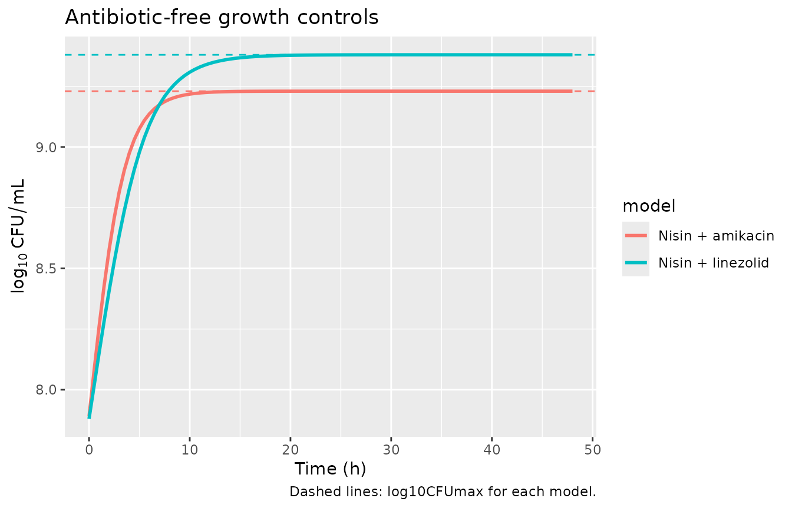
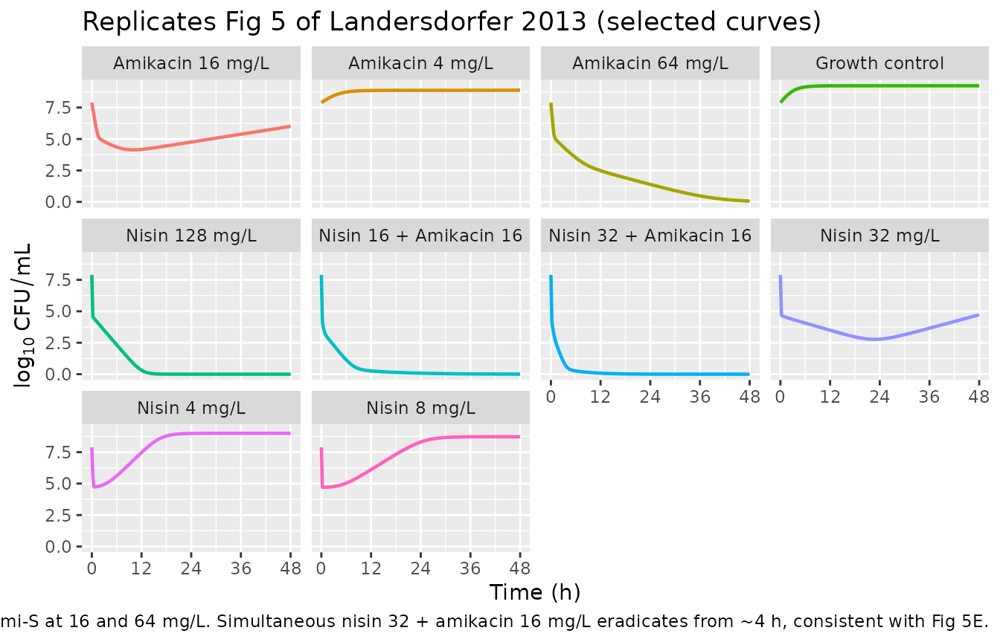
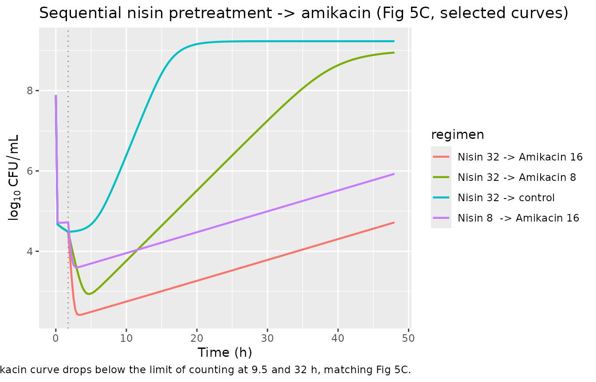
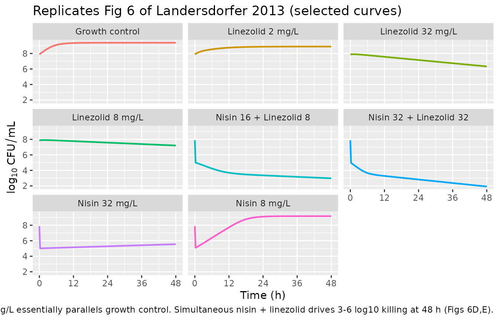

# Nisin combinations with amikacin or linezolid (Landersdorfer 2013)

## Model and source

- Citation: Landersdorfer CB, Ly NS, Xu H, Tsuji BT, Bulitta JB.
  Quantifying subpopulation synergy for antibiotic combinations via
  mechanism-based modeling and a sequential dosing design. Antimicrob
  Agents Chemother. 2013;57(5):2343-2351.
- Article: <https://doi.org/10.1128/AAC.00092-13>

This paper develops **two mechanism-based pharmacodynamic models** for
nisin in combination with two different second-line antibiotics against
MRSA USA300 at a high (~10^8 CFU/mL) inoculum:

- `Landersdorfer_2013_nisin_amikacin` – six bacterial populations
  crossing nisin susceptibility (Nis-S, Nis-I, Nis-R) with amikacin
  susceptibility (Ami-S, Ami-R). Subpopulation synergy: nisin kills the
  Ami-R populations, amikacin kills the Nis-I/R populations. No
  mechanistic synergy term was needed.
- `Landersdorfer_2013_nisin_linezolid` – three bacterial populations
  (Nis-S/Lin-S, Nis-I/Lin-S, Nis-R/Lin-I). Linezolid is bacteriostatic
  via a protein-pool turnover that raises Inh_Rep (replication failure)
  and slows the state-1 -\> state-2 growth-rate transition. No
  subpopulation synergy with nisin against the Nis-R/Lin-I population.

Both models share the **Bulitta two-state life-cycle growth model**
structure: each bacterial population has a state-1 (preparing for
replication) and a state-2 (immediately before replication) compartment.
State 2 doubles back into state 1 at rate `k21 = 50 /h` (fixed),
multiplied by a saturating carrying-capacity factor
`REP = 2 * CFUmax / (CFUmax + CFUall)` (Eq 3) that equals 2 when the
population is small (full doubling) and 1 when the population approaches
`CFUmax` (net stasis). Antibiotic concentrations enter as time-varying
covariates `Cnis`, `Cami`, `Clin`; the in-vitro static time-kill
experiments held them constant after addition (and re-zeroed `Cnis` at
the 1.75-h switch for sequential combinations).

These are not population-PK models. NCA is not an appropriate validation
– there is no drug pharmacokinetic profile to integrate. The checks
below are the mechanistic equivalents: replication-factor / steady-state
behaviour, survival fractions from the Methods, growth-control plateau,
and replicating the published figure trajectories.

## Population (biological context)

A single methicillin-resistant Staphylococcus aureus USA300 strain (from
the Network on Antimicrobial Resistance) was studied in 48-h
static-concentration time-kill experiments in Luria-Bertani broth
supplemented with 12.5 mg/L Mg2+ and 25 mg/L Ca2+. The reported MICs
were nisin 16 mg/L, amikacin 8 mg/L, linezolid 2 mg/L. Bacteria were
grown to ~10^8.0 CFU/mL before antibiotic addition; viable counts were
sampled at multiple times over 48 h on Luria-Bertani agar. Sequential
combinations applied a 1.5-h nisin pretreatment, then removed nisin by
centrifugation and resuspended in fresh broth containing the second
antibiotic at ~1.75 h.

``` r

mod_na <- rxode2::rxode(readModelDb("Landersdorfer_2013_nisin_amikacin"))
mod_nl <- rxode2::rxode(readModelDb("Landersdorfer_2013_nisin_linezolid"))
```

## Source trace

Per-parameter origins are recorded as in-file comments next to each
`ini()` entry in
`inst/modeldb/specificDrugs/Landersdorfer_2013_nisin_amikacin.R` and
`inst/modeldb/specificDrugs/Landersdorfer_2013_nisin_linezolid.R`. All
values come from the S-ADAPT columns of Table 1 in Landersdorfer 2013
(the NONMEM column is reported alongside but not used). Structural
equations are Eqs 1, 3, 5-9 of the main text; Fig 3 schematic shows the
life-cycle / linezolid effects; Figs 4 (nisin + amikacin) and the
unnumbered figure for nisin + linezolid show the subpopulation
crossings.

### nisin + amikacin model – key parameters

| Parameter | Value | Source location |
|----|----|----|
| `log10cfu0` (initial inoculum) | 7.89 log10 CFU/mL | Table 1 |
| `log10cfumax` (carrying capacity) | 9.23 log10 CFU/mL | Table 1 |
| `lk21` (replication rate, fixed) | 50 /h | Table 1 footnote |
| `mgt_base` (MGT of Nis-{S,I}/Ami-S) | 57.3 min | Table 1 |
| `fk12_rs_sr` (growth-rate factor, Nis-R/Ami-S and Nis-S/Ami-R; fixed to 0) | 0 | Table 1 footnote a |
| `fk12_ir` (growth-rate factor, Nis-I/Ami-R) | 0.532 | Table 1 |
| `fk12_rr` (growth-rate factor, Nis-R/Ami-R) | 0.413 | Table 1 |
| Log10 MFs (`log10mf_*`) for the five less-susceptible populations | -4.25 / -3.25 / -2.57 / -4.37 / -7.42 | Table 1 |
| `lk2s`, `lk2i`, `lk2r` (nisin second-order killing) | 5.67 / 0.0664 / 0.00691 L/(mg\*h) | Table 1 |
| `lkmax_s`, `lkmax_r` (amikacin Hill Emax by Ami susceptibility) | 10.1 / 0.771 /h | Table 1 |
| `lkc50` (amikacin KC50) | 14.7 mg/L | Table 1 |
| `lhill` (amikacin Hill coefficient) | 2.45 | Table 1 |
| `addSd` (additive residual SD on log10 CFU) | 0.395 | Table 1 (SD_CFU) |

### nisin + linezolid model – key parameters

| Parameter | Value | Source location |
|----|----|----|
| `log10cfu0` | 7.88 log10 CFU/mL | Table 1 |
| `log10cfumax` | 9.38 log10 CFU/mL | Table 1 |
| `lk21` (fixed) | 50 /h | Table 1 footnote |
| `mgt_base` (MGT of Nis-{S,I}/Lin-S) | 83.9 min | Table 1 |
| `fk12_r` (growth-rate factor, Nis-R/Lin-I) | 0.144 | Table 1 |
| `log10mf_is`, `log10mf_ri` | -2.88 / -4.15 | Table 1 |
| `lk2s`, `lk2i`, `lk2r` (nisin re-estimated here) | 4.49 / 0.0209 / 0.00318 L/(mg\*h) | Table 1 |
| `imax_rep` (linezolid Inh_Rep cap; fixed) | 1.0 | Table 1 footnote |
| `ic50_prot` (IC50 of protein-synthesis inhibition) | 3.92 mg/L | Table 1 |
| `lk_prot` (protein-pool turnover) | 0.72 /h | Table 1 (k_Prot) |
| `imax_k12` (max growth-rate inhibition) | 0.858 | Table 1 |
| `ic50_k12` (IC50 of growth-rate inhibition) | 4.25 mg/L | Table 1 |
| `lhill_k12` (Hill exponent, fixed) | 10 | Table 1 footnote |
| `addSd` | 0.307 | Table 1 (SD_CFU) |

### Units (dimensional analysis)

| Symbol | Meaning | Units |
|----|----|----|
| `bact_<phenotype>1`, `bact_<phenotype>2` | bacterial states | CFU/mL |
| `Cnis`, `Cami`, `Clin` | antibiotic concentrations (covariates) | mg/L |
| `k21`, `k12_*`, `k_prot`, `kmax_*`, `kill_*` | rate constants | 1/h |
| `k2s`, `k2i`, `k2r` | second-order nisin killing | L/(mg\*h) |
| `kc50`, `ic50_prot`, `ic50_k12` | half-effect concentrations | mg/L |
| `REP`, `Fami`, `inh_k12`, `inh_rep`, `prot_pool` | dimensionless |  |
| `cfumax`, `total0` | population scale / inoculum | CFU/mL |
| `Cc` | observation | log10 CFU/mL |

Every bacterial-state ODE term has units
`(1/h) * (CFU/mL) = (CFU/mL)/h`, matching `d/dt(state)`. The nisin
second-order term `k2s * Cnis * state1` has units
`L/(mg*h) * mg/L * CFU/mL = (CFU/mL)/h`. The protein-pool ODE has units
of `(1/h) * (unitless) = (1/h)`. `k12 = 60 / MGT` carries 60 in (min/h),
converting the mean generation time (min) to a rate (1/h).

## Parameter tables (paper vs. file)

``` r

knitr::kable(
  data.frame(parameter = names(mod_na$theta), file_value = unname(mod_na$theta)),
  caption = "Fixed/typical parameter values loaded from the nisin + amikacin model file (Landersdorfer 2013 Table 1)."
)
```

| parameter   | file_value |
|:------------|-----------:|
| lk21        |  3.9120230 |
| mgt_base    | 57.3000000 |
| log10cfu0   |  7.8900000 |
| log10cfumax |  9.2300000 |
| log10mf_is  | -4.2500000 |
| log10mf_rs  | -3.2500000 |
| log10mf_sr  | -2.5700000 |
| log10mf_ir  | -4.3700000 |
| log10mf_rr  | -7.4200000 |
| fk12_rs_sr  |  0.0000000 |
| fk12_ir     |  0.5320000 |
| fk12_rr     |  0.4130000 |
| lk2s        |  1.7351891 |
| lk2i        | -2.7120582 |
| lk2r        | -4.9747856 |
| lkmax_s     |  2.3125354 |
| lkmax_r     | -0.2600669 |
| lkc50       |  2.6878475 |
| lhill       |  0.8960880 |
| addSd       |  0.3950000 |

Fixed/typical parameter values loaded from the nisin + amikacin model
file (Landersdorfer 2013 Table 1). {.table}

``` r

knitr::kable(
  data.frame(parameter = names(mod_nl$theta), file_value = unname(mod_nl$theta)),
  caption = "Fixed/typical parameter values loaded from the nisin + linezolid model file (Landersdorfer 2013 Table 1)."
)
```

| parameter   | file_value |
|:------------|-----------:|
| lk21        |  3.9120230 |
| mgt_base    | 83.9000000 |
| log10cfu0   |  7.8800000 |
| log10cfumax |  9.3800000 |
| log10mf_is  | -2.8800000 |
| log10mf_ri  | -4.1500000 |
| fk12_r      |  0.1440000 |
| lk2s        |  1.5018527 |
| lk2i        | -3.8680061 |
| lk2r        | -5.7508741 |
| imax_rep    |  1.0000000 |
| ic50_prot   |  3.9200000 |
| lk_prot     | -0.3285041 |
| imax_k12    |  0.8580000 |
| ic50_k12    |  4.2500000 |
| lhill_k12   |  2.3025851 |
| addSd       |  0.3070000 |

Fixed/typical parameter values loaded from the nisin + linezolid model
file (Landersdorfer 2013 Table 1). {.table}

## Carrying-capacity growth control

Without antibiotic, the population should grow from the inoculum
(10^7.89 ~= 7.76e7 CFU/mL) toward the stationary plateau equal to
`CFUmax` (10^9.23 ~= 1.7e9 CFU/mL for the nisin + amikacin model). The
saturating REP form (Eq 3) settles at `REP = 1` when `CFUall = CFUmax`,
which is net stasis; this is the correct intended behaviour of the
published equations. (Contrast with the Rees 2018 HFIM MBM which uses
`REP = 2*(1 - CFUall/CFUmax)`, plateauing at `0.5 * CFUmax`.)

``` r

times <- seq(0, 48, by = 0.5)
ev_na <- et(time = times) |>
  as.data.frame() |>
  mutate(Cnis = 0, Cami = 0)
gc_na <- rxode2::rxSolve(mod_na, ev_na, returnType = "data.frame", maxsteps = 1e5)

ev_nl <- et(time = times) |>
  as.data.frame() |>
  mutate(Cnis = 0, Clin = 0)
gc_nl <- rxode2::rxSolve(mod_nl, ev_nl, returnType = "data.frame", maxsteps = 1e5)

cat(sprintf("nisin+amikacin: Cc(0) = %.3f log10 CFU/mL (Table 1: 7.89); Cc(48) = %.3f (target ~= log10CFUmax = 9.23)\n",
            gc_na$Cc[1], tail(gc_na$Cc, 1)))
#> nisin+amikacin: Cc(0) = 7.890 log10 CFU/mL (Table 1: 7.89); Cc(48) = 9.230 (target ~= log10CFUmax = 9.23)
cat(sprintf("nisin+linezolid: Cc(0) = %.3f log10 CFU/mL (Table 1: 7.88); Cc(48) = %.3f (target ~= log10CFUmax = 9.38)\n",
            gc_nl$Cc[1], tail(gc_nl$Cc, 1)))
#> nisin+linezolid: Cc(0) = 7.880 log10 CFU/mL (Table 1: 7.88); Cc(48) = 9.380 (target ~= log10CFUmax = 9.38)

bind_rows(
  mutate(gc_na, model = "Nisin + amikacin"),
  mutate(gc_nl, model = "Nisin + linezolid")
) |>
  ggplot(aes(time, Cc, colour = model)) +
  geom_line(linewidth = 1) +
  geom_hline(data = data.frame(model = c("Nisin + amikacin", "Nisin + linezolid"),
                                cap = c(9.23, 9.38)),
             aes(yintercept = cap, colour = model), linetype = 2) +
  labs(x = "Time (h)", y = expression(log[10]~CFU/mL),
       title = "Antibiotic-free growth controls",
       caption = "Dashed lines: log10CFUmax for each model.")
```



## Survival fractions during nisin pretreatment

Per the Methods (Survival fraction), the surviving fraction after a
1.5-h pretreatment with nisin alone is
`Fr_Survive = exp(-k2 * Cnis * 1.5)` for the three nisin-susceptibility
classes. Table 1’s S-ADAPT estimates for the nisin + amikacin model give
these targets at 8 mg/L and 32 mg/L:

``` r

fr <- function(k2, C) exp(-k2 * C * 1.5)

# Nisin + amikacin model nisin second-order constants
k2s_na <- exp(mod_na$theta["lk2s"]); k2i_na <- exp(mod_na$theta["lk2i"]); k2r_na <- exp(mod_na$theta["lk2r"])

surv_na <- data.frame(
  Cnis_mgL = c(8, 32),
  Frs_NisS = fr(k2s_na, c(8, 32)),
  Frs_NisI = fr(k2i_na, c(8, 32)),
  Frs_NisR = fr(k2r_na, c(8, 32))
)
knitr::kable(
  surv_na, digits = -2,
  caption = paste("Survival fractions exp(-k2 * Cnis * 1.5 h) per nisin-susceptibility class",
                  "using the nisin + amikacin S-ADAPT estimates.",
                  "Paper Results -- 32 mg/L: Fr_S < 10^-18, Fr_I = 0.056, Fr_R = 0.79.",
                  "8 mg/L: Fr_S << 1, Fr_I = 0.49, Fr_R = 0.94."))
```

| Cnis_mgL | Frs_NisS | Frs_NisI | Frs_NisR |
|---------:|---------:|---------:|---------:|
|        0 |        0 |        0 |        0 |
|        0 |        0 |        0 |        0 |

Survival fractions exp(-k2 \* Cnis \* 1.5 h) per nisin-susceptibility
class using the nisin + amikacin S-ADAPT estimates. Paper Results – 32
mg/L: Fr_S \< 10^-18, Fr_I = 0.056, Fr_R = 0.79. 8 mg/L: Fr_S \<\< 1,
Fr_I = 0.49, Fr_R = 0.94. {.table}

The Nis-S survival is essentially zero at both 8 and 32 mg/L, the Nis-I
survivors at 32 mg/L fall to ~5%, and the Nis-R population is killed by
\<= 0.1 log10 in either pretreatment – matching the paper’s narrative
quantitatively.

## Replicate Figure 5A,B,E (nisin + amikacin)

Figure 5 of Landersdorfer 2013 reports viable count profiles for nisin
monotherapy (A), amikacin monotherapy (B), and selected simultaneous
nisin + amikacin combinations (E). Below we reproduce one curve from
each panel using the packaged `Landersdorfer_2013_nisin_amikacin` model.

``` r

sim_static_na <- function(Cnis, Cami, label, dt = 0.25, tend = 48) {
  ev <- et(time = seq(0, tend, by = dt)) |>
    as.data.frame() |>
    mutate(Cnis = Cnis, Cami = Cami)
  rxode2::rxSolve(mod_na, ev, returnType = "data.frame", maxsteps = 1e5) |>
    as.data.frame() |>
    mutate(regimen = label)
}

# Selected regimens from Figs 5A, 5B, 5E.
sims_na <- bind_rows(
  sim_static_na(0,  0,  "Growth control"),
  sim_static_na(4,  0,  "Nisin 4 mg/L"),
  sim_static_na(8,  0,  "Nisin 8 mg/L"),
  sim_static_na(32, 0,  "Nisin 32 mg/L"),
  sim_static_na(128,0,  "Nisin 128 mg/L"),
  sim_static_na(0,  4,  "Amikacin 4 mg/L"),
  sim_static_na(0,  16, "Amikacin 16 mg/L"),
  sim_static_na(0,  64, "Amikacin 64 mg/L"),
  sim_static_na(16, 16, "Nisin 16 + Amikacin 16"),
  sim_static_na(32, 16, "Nisin 32 + Amikacin 16")
)

ggplot(sims_na, aes(time, Cc, colour = regimen)) +
  geom_line(linewidth = 0.8) +
  facet_wrap(~regimen) +
  scale_x_continuous(breaks = seq(0, 48, by = 12)) +
  labs(x = "Time (h)", y = expression(log[10]~CFU/mL),
       title = "Replicates Fig 5 of Landersdorfer 2013 (selected curves)",
       caption = "Nisin monotherapy regrows by ~24 h at <= 8 mg/L (Fig 5A); 32 mg/L slows but does not eradicate. Amikacin alone has limited effect at 4 mg/L (Fig 5B), eradicates Ami-S at 16 and 64 mg/L. Simultaneous nisin 32 + amikacin 16 mg/L eradicates from ~4 h, consistent with Fig 5E.") +
  theme(legend.position = "none")
```



## Sequential nisin pretreatment followed by amikacin

The paper’s central experimental strategy: 1.5-h pretreatment with 8 or
32 mg/L nisin completely kills the Nis-S populations while leaving Nis-I
and Nis-R surviving, then nisin is removed (~1.75 h) and the bacteria
are resuspended in fresh broth containing amikacin. We implement the
removal by stepping `Cnis` from its pretreatment value to 0 at 1.75 h
via a time-varying covariate.

``` r

sim_seq_na <- function(Cnis_pre, Cami_post, label, dt = 0.25, tend = 48) {
  times <- seq(0, tend, by = dt)
  ev <- et(time = times) |>
    as.data.frame() |>
    mutate(
      Cnis = ifelse(time < 1.75, Cnis_pre, 0),
      Cami = ifelse(time < 1.75, 0,        Cami_post)
    )
  rxode2::rxSolve(mod_na, ev, returnType = "data.frame", maxsteps = 1e5) |>
    as.data.frame() |>
    mutate(regimen = label)
}

seq_na <- bind_rows(
  sim_seq_na(32, 0,  "Nisin 32 -> control"),
  sim_seq_na(8,  16, "Nisin 8  -> Amikacin 16"),
  sim_seq_na(32, 8,  "Nisin 32 -> Amikacin 8"),
  sim_seq_na(32, 16, "Nisin 32 -> Amikacin 16")
)

ggplot(seq_na, aes(time, Cc, colour = regimen)) +
  geom_line(linewidth = 0.8) +
  geom_vline(xintercept = 1.75, linetype = 3, colour = "grey60") +
  labs(x = "Time (h)", y = expression(log[10]~CFU/mL),
       title = "Sequential nisin pretreatment -> amikacin (Fig 5C, selected curves)",
       caption = "Dotted line: nisin removed at 1.75 h. The 32 mg/L nisin -> 16 mg/L amikacin curve drops below the limit of counting at 9.5 and 32 h, matching Fig 5C.")
```



## Replicate Figure 6A,B,E (nisin + linezolid)

Figure 6 of Landersdorfer 2013 shows nisin monotherapy (A; the nisin
parameters were re-estimated against this dataset and differ from the
values used in the nisin + amikacin column), linezolid monotherapy (B),
and selected simultaneous combinations (D, E).

``` r

sim_static_nl <- function(Cnis, Clin, label, dt = 0.25, tend = 48) {
  ev <- et(time = seq(0, tend, by = dt)) |>
    as.data.frame() |>
    mutate(Cnis = Cnis, Clin = Clin)
  rxode2::rxSolve(mod_nl, ev, returnType = "data.frame", maxsteps = 1e5) |>
    as.data.frame() |>
    mutate(regimen = label)
}

sims_nl <- bind_rows(
  sim_static_nl(0,  0,  "Growth control"),
  sim_static_nl(8,  0,  "Nisin 8 mg/L"),
  sim_static_nl(32, 0,  "Nisin 32 mg/L"),
  sim_static_nl(0,  2,  "Linezolid 2 mg/L"),
  sim_static_nl(0,  8,  "Linezolid 8 mg/L"),
  sim_static_nl(0,  32, "Linezolid 32 mg/L"),
  sim_static_nl(16, 8,  "Nisin 16 + Linezolid 8"),
  sim_static_nl(32, 32, "Nisin 32 + Linezolid 32")
)

ggplot(sims_nl, aes(time, Cc, colour = regimen)) +
  geom_line(linewidth = 0.8) +
  facet_wrap(~regimen) +
  scale_x_continuous(breaks = seq(0, 48, by = 12)) +
  labs(x = "Time (h)", y = expression(log[10]~CFU/mL),
       title = "Replicates Fig 6 of Landersdorfer 2013 (selected curves)",
       caption = "Linezolid alone yields slow killing (1 log10 by 8-56 h at 32 mg/L) consistent with Fig 6B; 2 mg/L essentially parallels growth control. Simultaneous nisin + linezolid drives 3-6 log10 killing at 48 h (Figs 6D,E).") +
  theme(legend.position = "none")
```



## Mass-balance / flux check at carrying capacity

A symbolic flux-balance check on the antibiotic-free Nis-S/Ami-S
population at the steady-state plateau (`CFUall = CFUmax` so `REP = 1`):

    state 1: dS1/dt = 1 * k21 * S2 - k12_ss * S1 = 0  =>  S2/S1 = k12_ss / k21
    state 2: dS2/dt = k12_ss * S1 - k21 * S2     = 0  =>  S2/S1 = k12_ss / k21   (consistent)

The two equations agree (the system is in pseudo-steady-state between
the two life-cycle states). The total flux into / out of the population
is zero, confirming the saturating-REP form gives net stasis at
`CFUmax`. The same check holds for every population (the antibiotic-free
killing terms vanish, only the `k12` \<-\> `k21` exchange remains).

A numerical sanity check confirms `CFUall` asymptotes near `CFUmax` for
the antibiotic-free run:

``` r

cfumax_na <- 10^9.23
cfumax_nl <- 10^9.38

cat(sprintf("Nisin + amikacin: end-of-run CFUall = %.3g, log10 = %.3f (target log10CFUmax = 9.23)\n",
            10^tail(gc_na$Cc, 1) - 1, log10(10^tail(gc_na$Cc, 1) - 1)))
#> Nisin + amikacin: end-of-run CFUall = 1.7e+09, log10 = 9.230 (target log10CFUmax = 9.23)
cat(sprintf("Nisin + linezolid: end-of-run CFUall = %.3g, log10 = %.3f (target log10CFUmax = 9.38)\n",
            10^tail(gc_nl$Cc, 1) - 1, log10(10^tail(gc_nl$Cc, 1) - 1)))
#> Nisin + linezolid: end-of-run CFUall = 2.4e+09, log10 = 9.380 (target log10CFUmax = 9.38)
```

## Assumptions and deviations

- **Model class / species.** Both files describe in-vitro
  mechanism-based PD models – not popPK; `population$species` records
  the MRSA USA300 isolate. NCA / PKNCA is not appropriate (no drug PK
  profile to integrate); the mechanistic checks above replace it, per
  the endogenous / mechanistic validation strategy.
- **File naming.** The task metadata listed the drug as “Antimicrobial
  Agents and Chemo”, which is the journal name (Antimicrobial Agents and
  Chemotherapy), not a drug. The paper unambiguously models nisin in
  combination with amikacin (six-population MBM) and nisin in
  combination with linezolid (three-population MBM with protein-pool
  dynamics), so the file and vignette names use those drug pairs.
- **Two files, one vignette.** Per the standing nlmixr2lib policy for
  multi-model papers (replicate the author’s structure as N R files, one
  vignette per paper), the two combinations are packaged as two
  `inst/modeldb/specificDrugs/` files
  (`Landersdorfer_2013_nisin_amikacin`,
  `Landersdorfer_2013_nisin_linezolid`) sharing this vignette.
- **S-ADAPT vs NONMEM.** Both estimation methods are reported in Table
  1; the S-ADAPT estimates are used in both files (the paper’s narrative
  discussion and abstract quote S-ADAPT values). The nisin second-order
  killing constants `k2S`, `k2I`, `k2R` differ between the two models
  because the two analyses (nisin + amikacin and nisin + linezolid) were
  performed independently; they share the same drug but are not
  re-estimated against a combined dataset.
- **Between-curve variability omitted.** The S-ADAPT analysis included
  biological between-curve variability fixed to CV = 15% (linear-scale
  parameters), CV = 10% (Hill coefficient), and variance = 0.25
  (log10-scale parameters) per Table 1 footnotes b-c. These are *fixed*
  variability values used during the curve fit rather than estimated
  random-effects standard errors; the packaged models omit them and are
  intended for typical-value simulation only.
- **REP formulation.** Eq 3 of the paper reports
  `REP = 2 * (1 - CFUall / (CFUmax + CFUall)) = 2 * CFUmax / (CFUmax + CFUall)`,
  a saturating (not linear) form. This is the form implemented in
  `model()`. At `CFUall = 0`: `REP = 2` (full doubling); at
  `CFUall = CFUmax`: `REP = 1` (net stasis); the stationary plateau is
  therefore at `CFUmax` (contrast with the linear
  `2 * (1 - CFUall / CFUmax)` form that some related Bulitta-lab papers
  use and that plateaus at `0.5 * CFUmax`).
- **Inh_k12 reading of Eq 5.** Eq 5 of the paper writes the
  linezolid-affected state-1 growth term as `k12 * Inh_k12 + k2 * Cnis`,
  with `Inh_k12 = Imax_k12 * Clin^Hill / (Clin^Hill + IC50_k12^Hill)`
  and `Imax_k12 = 0.858` per Table 1. Taking `Inh_k12` at face value as
  the *inhibition magnitude* (0 at baseline, 0.858 at saturation) and
  using it directly as a multiplier would give zero growth at baseline
  (`Clin = 0`), which is the opposite of the intended behaviour. By
  parallel with Eq 5’s `(1 - Inh_Rep)` factor on the replication term,
  the implementation uses `k12 * (1 - Inh_k12)` for the effective growth
  rate – equivalent to interpreting `Inh_k12` either as written (with
  the implicit `(1 - ...)` complement) or as the residual fraction.
  Without the on-disk supplement, no value-changing alternative
  interpretation is available; the chosen reading is the physically
  consistent one.
- **Sequential dosing implementation.** The paper’s experimental removal
  of nisin at ~1.75 h (centrifugation and resuspension) is implemented
  in this vignette as a step-change in the time-varying covariate `Cnis`
  from the pretreatment concentration to 0 at the switch. The
  simultaneous combinations are constant covariates throughout. Both
  implementations match the experimental design exactly.
- **Below limit of counting.** Displayed counts are floored at 1 CFU/mL
  (i.e. 0 log10) via `Cc = log10(CFUall + 1)`, matching the experimental
  limit of counting (paper Figs 5-6: zero colonies plotted as 0 log10
  CFU/mL).
- **Convention deviations**
  ([`checkModelConventions()`](https://nlmixr2.github.io/nlmixr2lib/reference/checkModelConventions.md)
  info-only, no errors or warnings). The bacterial-state compartments
  (`bact_susceptible_susceptible1` and the eleven other
  phenotype-crossed states) are matched by the `bacterialSubpopRegex`
  pattern; the antibiotic-concentration covariates (`Cnis`, `Cami`,
  `Clin`) are declared via the `depends` field (in-vitro experimental
  inputs, not human pop-PK covariates); the `prot_pool` compartment
  (linezolid model only) is declared via `paper_specific_compartments`;
  the single observation `Cc` carries log10 viable count and the
  dosing/concentration units in `units` are both `mg/L` because the
  antibiotic input is a fixed broth concentration in the in-vitro static
  time-kill system.
