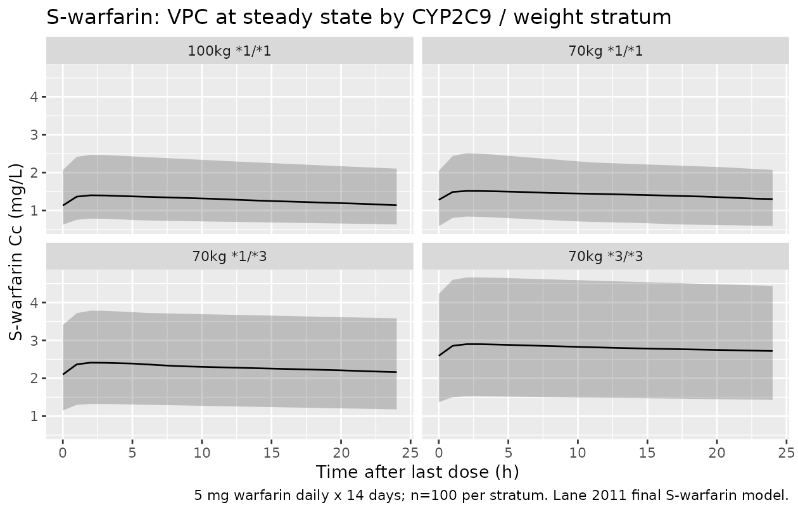
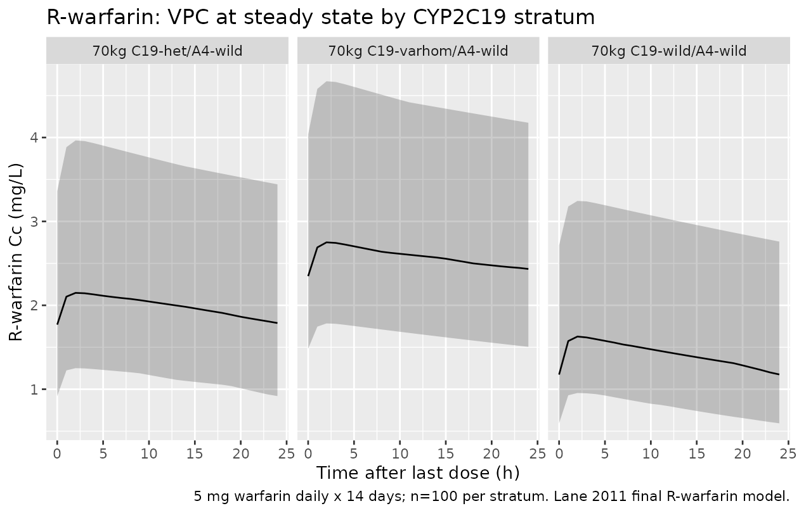

# R- and S-warfarin (Lane 2011)

## Model and source

Lane et al. (2011) developed two independent one-compartment,
first-order absorption population PK models – one for each warfarin
enantiomer – in adults on long-term oral warfarin therapy. Two model
files are packaged:

- `modellib("Lane_2011_warfarin_s")` – S-warfarin (the more potent
  enantiomer; CYP2C9-driven elimination with bodyweight, age, and sex
  covariates).
- `modellib("Lane_2011_warfarin_r")` – R-warfarin (CYP2C19 rs3814637 and
  CYP3A4 rs2242480 covariates plus bodyweight and age).

Citation: Lane S, Al-Zubiedi S, Hatch E, Matthews I, Jorgensen AL,
Deloukas P, Daly AK, Park BK, Aarons L, Ogungbenro K, Kamali F, Hughes
D, Pirmohamed M. The population pharmacokinetics of R- and S-warfarin:
effect of genetic and clinical factors. *Br J Clin Pharmacol*
2012;73(1):66-76.

- Article: <https://doi.org/10.1111/j.1365-2125.2011.04051.x>
- PMID: 21692829

``` r

mod_s_fn <- readModelDb("Lane_2011_warfarin_s")
mod_r_fn <- readModelDb("Lane_2011_warfarin_r")
class(mod_s_fn)
#> [1] "function"
class(mod_r_fn)
#> [1] "function"
```

## Population

- 354 patients commencing warfarin therapy were enrolled at the Royal
  Liverpool & Broadgreen University Hospital NHS Trust and University
  Hospital Aintree (Liverpool, UK) between November 2004 and March 2006;
  warfarin was initiated for any clinical indication and patients were
  followed up at 1, 8, and 26 weeks (Lane 2011 Methods ‘Patients’).
- The S-warfarin PK model used data from 306 patients (739 plasma
  concentrations); the R-warfarin model used 309 patients (759 plasma
  concentrations). The two enantiomer cohorts overlap but are not
  identical (Lane 2011 Table 1).
- Demographics (Lane 2011 Table 1): age mean (range) 66.4 (19-95) years;
  bodyweight mean (range) 80.7 (36-172) kg; 58% male in the S-warfarin
  cohort and 59% male in the R-warfarin cohort.
- CYP2C9 distribution in the S-warfarin cohort (n=306): *1/*1 63.7%,
  *1/*2 19.3%, *1/*3 9.5%, *2/*2 0.3%, *2/*3 2.0%, *3/*3 0.6%, missing
  4.6%.
- CYP2C19 rs3814637 distribution in the R-warfarin cohort (n=309):
  wild-homozygote 70.9%, heterozygote 8.1%, mutant-homozygote 1.3%,
  missing 19.7%. CYP3A4 rs2242480: wild-homozygote 73.1%, heterozygote
  13.6%, mutant-homozygote 1.0%, missing 12.3%.
- Co-medication: 20 of 306 / 6.5% on amiodarone in the S-warfarin
  cohort; amiodarone was tested but NOT retained as a significant
  covariate in either enantiomer model (Lane 2011 Results ‘S-Warfarin
  models’).
- Sampling: sparse, ~16 h after the patient’s previous warfarin dose at
  each visit; chiral HPLC assay with LLOQ 100 ng/mL and assay range
  100-5000 ng/mL (Lane 2011 Methods ‘Determination of plasma warfarin
  enantiomer concentrations’).

## Source trace

Per-parameter origins are recorded as in-file comments in
`inst/modeldb/specificDrugs/Lane_2011_warfarin_s.R` and
`inst/modeldb/specificDrugs/Lane_2011_warfarin_r.R`. The tables below
collect them.

### S-warfarin

| Equation / parameter | Value | Source location |
|----|----|----|
| `lcl` | log(0.144) L/h | Lane 2011 Table 3 final S-warfarin model (typical CL for 70 kg woman, 69.8 y, *1/*1) |
| `lvc` | log(16.6) L | Lane 2011 Table 3 final S-warfarin model |
| `lka` | log(1.66) 1/h | Lane 2011 Table 3 (fixed); Methods ‘Base models’ (literature value) |
| `e_wt_cl` | 0.321 | Lane 2011 Table 3 (power exponent on WT, reference 70 kg) |
| `e_age_cl` | -0.00816 /y | Lane 2011 Table 3 (linear age effect, reference 69.8 y) |
| `e_male_cl` | 1.12 | Lane 2011 Table 3 (male vs female multiplier on CL) |
| `e_cyp2c9_12_cl` | 0.855 | Lane 2011 Table 3 (CYP2C9 *1/*2 multiplier on CL) |
| `e_cyp2c9_22_cl` | 0.672 | Lane 2011 Table 3 |
| `e_cyp2c9_13_cl` | 0.454 | Lane 2011 Table 3 |
| `e_cyp2c9_23_cl` | 0.496 | Lane 2011 Table 3 |
| `e_cyp2c9_33_cl` | 0.286 | Lane 2011 Table 3 |
| `e_cyp2c9_missing_cl` | 0.782 | Lane 2011 Table 3 (Missing-genotype subgroup) |
| `etalcl + etalvc` block | 0.174724 / 0.063150 / 0.128164 | Lane 2011 Table 3 (IIV CL 41.8%, IIV V 35.8% = omega x 100; correlation 0.422) |
| `propSd` | 0.316 | Lane 2011 Table 3 (proportional residual SD) |
| `addSd` | 0.001 mg/L | Lane 2011 Table 3 (additive residual fixed at 1 ng/mL = 0.001 mg/L) |
| CL equation | n/a | Lane 2011 Results paragraph following Tables 2 and 3 |

### R-warfarin

| Equation / parameter | Value | Source location |
|----|----|----|
| `lcl` | log(0.125) L/h | Lane 2011 Table 3 final R-warfarin model (typical CL for 70 kg, 69.8 y, wild-wild) |
| `lvc` | log(10.9) L | Lane 2011 Table 3 final R-warfarin model |
| `lka` | log(1.66) 1/h | Lane 2011 Table 3 (fixed); same Ka used in both enantiomer models |
| `e_wt_cl` | 0.650 | Lane 2011 Table 3 (power exponent on WT, reference 70 kg) |
| `e_age_cl` | -0.00657 /y | Lane 2011 Table 3 (linear age effect, reference 69.8 y) |
| `e_cyp2c19_het_cl` | 0.761 | Lane 2011 Table 3 (CYP2C19 rs3814637 heterozygote multiplier) |
| `e_cyp2c19_varhom_cl` | 0.494 | Lane 2011 Table 3 |
| `e_cyp2c19_missing_cl` | 0.804 | Lane 2011 Table 3 |
| `e_cyp3a4_het_cl` | 1.32 | Lane 2011 Table 3 (CYP3A4 rs2242480 heterozygote multiplier) |
| `e_cyp3a4_varhom_cl` | 1.06 | Lane 2011 Table 3 |
| `e_cyp3a4_missing_cl` | 0.937 | Lane 2011 Table 3 |
| `etalcl + etalvc` block | 0.184900 / 0.057971 / 0.146689 | Lane 2011 Table 3 (IIV CL 43.0%, IIV V 38.3% = omega x 100; correlation 0.352) |
| `propSd` | 0.319 | Lane 2011 Table 3 |
| `addSd` | 0.001 mg/L | Lane 2011 Table 3 (additive residual fixed at 1 ng/mL) |
| CL equation | n/a | Lane 2011 Results paragraph following Tables 2 and 3 |

## Mechanistic structure

Both enantiomer models share the same structural form:

- **Absorption**: first-order from a depot compartment with `Ka` fixed
  at 1.66 1/h (sensitivity tested across 1-5 1/h in the source; the
  sparse sampling design could not estimate Ka, so the value was taken
  from prior literature – Lane 2011 Methods ‘Base models’).
- **Disposition**: one-compartment, with apparent oral clearance CL and
  apparent volume of distribution V. The two-compartment alternative was
  tested for S-warfarin and rejected because the sparse sampling did not
  support it.
- **Covariate model on CL**: multiplicative form \`CL_i = theta_CL \*
  (WGT_i/70)^theta_wgt \* (1 + theta_age\*(AGE_i-69.8))
  - theta_CYP2C9 \* theta_gender \* exp(eta_CL_i)\` for S-warfarin (Lane
    2011 Results equation following Table 3). R-warfarin replaces the
    CYP2C9 and gender multipliers with CYP2C19 (rs3814637) and CYP3A4
    (rs2242480) multipliers and uses a different bodyweight exponent.
- **Volume**: no covariates retained on V/F in either enantiomer model
  (Lane 2011 Results ‘Volume of distribution’). V is parameterised with
  inter-individual variability only.
- **Inter-individual variability**: log-normal IIV on CL and V, with a
  block covariance between the two random effects. The correlation
  reported in Table 3 (0.422 for S, 0.352 for R) was converted to a
  covariance via `cov = correlation * sqrt(omega2_cl * omega2_v)` where
  each variance is `omega2 = (CV/100)^2`. The Table 2 and 3 footnote
  defines the IIV percentages as “an approximate coefficient of
  variation (square root of the variance)”, i.e. omega x 100 (see the
  Errata section).
- **Inter-occasion variability**: tested in both enantiomer models and
  not retained (Lane 2011 Results ‘S-Warfarin models’ and ‘R-Warfarin
  models’).
- **Residual error**: proportional, with an additive component fixed at
  1 ng/mL (= 0.001 mg/L in this model’s concentration units). The base
  S-warfarin model estimated an additive component of 45.8 ng/mL, but
  the additive component dropped out of the final covariate model and
  was held at a low fixed value.

## Virtual cohort

The Lane 2011 cohort sampled at only three time points per subject (1,
8, 26 weeks after warfarin initiation, drawn ~16 h post-dose). The
simulations below use steady-state daily dosing of 5 mg warfarin
(representative of the typical maintenance dose in the cohort) to
illustrate the genotype-driven differences in apparent CL that the
models predict. **Each genotype stratum is simulated at n = 100
subjects** (well below the 200/arm cap) and IDs are made disjoint across
strata via `id_offset` so the cohorts can be combined without collapsing
into “Frankenstein subjects”.

``` r

set.seed(2011)

# Steady-state daily dosing for 14 days, then 24-hour observation window
# on day 14 to capture the per-dose Cmax/Cmin/AUC0-tau.
make_event_table <- function(n, ..., id_offset = 0L,
                             dose_mg = 5, ndoses = 14,
                             obs_after_dose_h = seq(0, 24, by = 1)) {
  cov_df <- tibble(id = id_offset + seq_len(n), ...)
  doses <- cov_df |>
    tidyr::expand_grid(
      time = (seq_len(ndoses) - 1L) * 24,
      evid = 1L,
      amt = dose_mg,
      cmt = "depot"
    )
  obs <- cov_df |>
    tidyr::expand_grid(
      time = (ndoses - 1L) * 24 + obs_after_dose_h,
      evid = 0L,
      amt = NA_real_,
      cmt = "central"
    )
  dplyr::bind_rows(doses, obs) |>
    dplyr::arrange(id, time, dplyr::desc(evid))
}
```

## S-warfarin simulation

The four strata below match the typical-value subgroups Lane 2011 cites
in the Results section: a 70-kg, 69.8-year-old woman with the *1/*1
reference genotype; the same patient at 100 kg (Lane’s first cited
example); the same patient with the *1/*3 reduced-function genotype; and
the same patient with the *3/*3 homozygous variant.

``` r

make_s_stratum <- function(label, WT, AGE, SEXF,
                            S1_COUNT, S2_COUNT, S3_COUNT, MISSING = 0L,
                            n = 100L, id_offset = 0L) {
  make_event_table(
    n = n, id_offset = id_offset,
    WT = WT, AGE = AGE, SEXF = SEXF,
    CYP2C9_S1_COUNT = S1_COUNT,
    CYP2C9_S2_COUNT = S2_COUNT,
    CYP2C9_S3_COUNT = S3_COUNT,
    CYP2C9_MISSING = MISSING
  ) |>
    dplyr::mutate(stratum = label)
}

s_events <- dplyr::bind_rows(
  make_s_stratum("70kg *1/*1",    70, 69.8, 1L,  2L, 0L, 0L, id_offset =   0L),
  make_s_stratum("100kg *1/*1",  100, 69.8, 1L,  2L, 0L, 0L, id_offset = 100L),
  make_s_stratum("70kg *1/*3",    70, 69.8, 1L,  1L, 0L, 1L, id_offset = 200L),
  make_s_stratum("70kg *3/*3",    70, 69.8, 1L,  0L, 0L, 2L, id_offset = 300L)
)
stopifnot(!anyDuplicated(unique(s_events[, c("id", "time", "evid")])))
```

``` r

mod_s <- readModelDb("Lane_2011_warfarin_s")
sim_s <- rxode2::rxSolve(
  mod_s, events = s_events,
  keep = c("stratum", "WT", "AGE", "SEXF",
           "CYP2C9_S1_COUNT", "CYP2C9_S2_COUNT", "CYP2C9_S3_COUNT",
           "CYP2C9_MISSING")
) |> as.data.frame()
#> ℹ parameter labels from comments will be replaced by 'label()'
```

``` r

sim_s |>
  dplyr::filter(!is.na(Cc)) |>
  dplyr::mutate(t_post = time - (14 - 1) * 24) |>
  dplyr::group_by(t_post, stratum) |>
  dplyr::summarise(
    Q05 = quantile(Cc, 0.05, na.rm = TRUE),
    Q50 = quantile(Cc, 0.50, na.rm = TRUE),
    Q95 = quantile(Cc, 0.95, na.rm = TRUE),
    .groups = "drop"
  ) |>
  ggplot2::ggplot(ggplot2::aes(t_post, Q50)) +
  ggplot2::geom_ribbon(ggplot2::aes(ymin = Q05, ymax = Q95), alpha = 0.25) +
  ggplot2::geom_line() +
  ggplot2::facet_wrap(~stratum) +
  ggplot2::labs(
    x = "Time after last dose (h)",
    y = "S-warfarin Cc (mg/L)",
    title = "S-warfarin: VPC at steady state by CYP2C9 / weight stratum",
    caption = "5 mg warfarin daily x 14 days; n=100 per stratum. Lane 2011 final S-warfarin model."
  )
```



## R-warfarin simulation

The three strata below match the typical-value subgroups Lane 2011 cites
in the Results section: a 70-kg, 69.8-year-old patient with CYP2C19
wild-homozygote + CYP3A4 wild-homozygote (reference); the same patient
with CYP2C19 heterozygote (Lane’s first cited example); and the same
patient with CYP2C19 variant homozygote.

``` r

make_r_stratum <- function(label, WT, AGE,
                            C19_VAR, C19_MISSING = 0L,
                            A4_VAR,  A4_MISSING  = 0L,
                            n = 100L, id_offset = 0L) {
  make_event_table(
    n = n, id_offset = id_offset,
    WT = WT, AGE = AGE,
    SNP_CYP2C19_RS3814637_VAR_COUNT = C19_VAR,
    SNP_CYP2C19_RS3814637_MISSING   = C19_MISSING,
    SNP_CYP3A4_RS2242480_VAR_COUNT  = A4_VAR,
    SNP_CYP3A4_RS2242480_MISSING    = A4_MISSING
  ) |>
    dplyr::mutate(stratum = label)
}

r_events <- dplyr::bind_rows(
  make_r_stratum("70kg C19-wild/A4-wild",     70, 69.8,
                 C19_VAR = 0L, A4_VAR = 0L, id_offset =   0L),
  make_r_stratum("70kg C19-het/A4-wild",      70, 69.8,
                 C19_VAR = 1L, A4_VAR = 0L, id_offset = 100L),
  make_r_stratum("70kg C19-varhom/A4-wild",   70, 69.8,
                 C19_VAR = 2L, A4_VAR = 0L, id_offset = 200L)
)
stopifnot(!anyDuplicated(unique(r_events[, c("id", "time", "evid")])))
```

``` r

mod_r <- readModelDb("Lane_2011_warfarin_r")
sim_r <- rxode2::rxSolve(
  mod_r, events = r_events,
  keep = c("stratum", "WT", "AGE",
           "SNP_CYP2C19_RS3814637_VAR_COUNT",
           "SNP_CYP2C19_RS3814637_MISSING",
           "SNP_CYP3A4_RS2242480_VAR_COUNT",
           "SNP_CYP3A4_RS2242480_MISSING")
) |> as.data.frame()
#> ℹ parameter labels from comments will be replaced by 'label()'
```

## Variability scale check

Lane 2011 prints each IIV term as omega x 100 (see the Errata section).
The first check confirms that each packaged omega block holds exactly
(P/100)^2 on the diagonal and rho x omega_CL x omega_V off the diagonal.
It compares the files with Table 3, so the bound is tight.

The second check confirms that the etas reach the parameters on that
scale. It solves 40000 reference patients per enantiomer (70 kg, 69.8
years, wild-type genotypes; women for S-warfarin) at a single time
point, so the per-subject SD of log(CL) and log(V) estimates omega
directly and their correlation estimates rho. The SD of a sample of
40000 has about 0.35% sampling error, so the +/-2% band is about six
standard errors wide and holds for any random-number stream; the
correlation band of +/-0.03 is about eight standard errors. The bounds
are on centre statistics, not on any per-subject extreme. They fail on
the originally shipped variances, whose SDs were 3-4% below the printed
values.

``` r

printed <- tibble::tribble(
  ~enantiomer, ~omega_cl, ~omega_v, ~rho,
  "S",         0.418,     0.358,    0.422,
  "R",         0.430,     0.383,    0.352
)
omega_s <- rxode2::rxode(mod_s)$omega
#> ℹ parameter labels from comments will be replaced by 'label()'
omega_r <- rxode2::rxode(mod_r)$omega
#> ℹ parameter labels from comments will be replaced by 'label()'
expected_block <- function(p) {
  matrix(c(p$omega_cl^2, p$rho * p$omega_cl * p$omega_v,
           p$rho * p$omega_cl * p$omega_v, p$omega_v^2), 2, 2)
}
stopifnot(
  isTRUE(all.equal(unname(omega_s[c("etalcl", "etalvc"), c("etalcl", "etalvc")]),
                   expected_block(printed[1, ]), tolerance = 1e-5)),
  isTRUE(all.equal(unname(omega_r[c("etalcl", "etalvc"), c("etalcl", "etalvc")]),
                   expected_block(printed[2, ]), tolerance = 1e-5))
)

n_spread <- 40000L
ev_spread_s <- tibble::tibble(
  id = seq_len(n_spread), time = 0, amt = NA_real_, evid = 0L,
  cmt = "central", WT = 70, AGE = 69.8, SEXF = 1L,
  CYP2C9_S1_COUNT = 2L, CYP2C9_S2_COUNT = 0L, CYP2C9_S3_COUNT = 0L,
  CYP2C9_MISSING = 0L
)
ev_spread_r <- tibble::tibble(
  id = seq_len(n_spread), time = 0, amt = NA_real_, evid = 0L,
  cmt = "central", WT = 70, AGE = 69.8,
  SNP_CYP2C19_RS3814637_VAR_COUNT = 0L, SNP_CYP2C19_RS3814637_MISSING = 0L,
  SNP_CYP3A4_RS2242480_VAR_COUNT = 0L, SNP_CYP3A4_RS2242480_MISSING = 0L
)
spread_of <- function(m, ev, label) {
  ps <- rxode2::rxSolve(m, events = ev) |>
    as.data.frame() |>
    dplyr::distinct(id, cl, vc)
  tibble::tibble(enantiomer = label,
                 sd_log_cl = stats::sd(log(ps$cl)),
                 sd_log_v  = stats::sd(log(ps$vc)),
                 cor_cl_v  = stats::cor(log(ps$cl), log(ps$vc)))
}
spread <- dplyr::bind_rows(spread_of(mod_s, ev_spread_s, "S"),
                           spread_of(mod_r, ev_spread_r, "R")) |>
  dplyr::left_join(printed, by = "enantiomer") |>
  dplyr::mutate(ratio_cl = sd_log_cl / omega_cl,
                ratio_v  = sd_log_v / omega_v,
                cor_diff = cor_cl_v - rho)
#> [====|====|====|====|====|====|====|====|====|====] 0:00:00 
#> 
#> [====|====|====|====|====|====|====|====|====|====] 0:00:00
knitr::kable(spread, digits = 3,
             caption = paste0("Per-subject spread vs. printed omega and correlation (N = ",
                              n_spread, " per enantiomer, reference patient)."))
```

| enantiomer | sd_log_cl | sd_log_v | cor_cl_v | omega_cl | omega_v | rho | ratio_cl | ratio_v | cor_diff |
|:---|---:|---:|---:|---:|---:|---:|---:|---:|---:|
| S | 0.418 | 0.359 | 0.417 | 0.418 | 0.358 | 0.422 | 0.999 | 1.002 | -0.005 |
| R | 0.429 | 0.384 | 0.356 | 0.430 | 0.383 | 0.352 | 0.998 | 1.002 | 0.004 |

Per-subject spread vs. printed omega and correlation (N = 40000 per
enantiomer, reference patient). {.table}

``` r

stopifnot(
  all(spread$ratio_cl > 0.98 & spread$ratio_cl < 1.02),
  all(spread$ratio_v > 0.98 & spread$ratio_v < 1.02),
  all(abs(spread$cor_diff) < 0.03)
)
```

``` r

sim_r |>
  dplyr::filter(!is.na(Cc)) |>
  dplyr::mutate(t_post = time - (14 - 1) * 24) |>
  dplyr::group_by(t_post, stratum) |>
  dplyr::summarise(
    Q05 = quantile(Cc, 0.05, na.rm = TRUE),
    Q50 = quantile(Cc, 0.50, na.rm = TRUE),
    Q95 = quantile(Cc, 0.95, na.rm = TRUE),
    .groups = "drop"
  ) |>
  ggplot2::ggplot(ggplot2::aes(t_post, Q50)) +
  ggplot2::geom_ribbon(ggplot2::aes(ymin = Q05, ymax = Q95), alpha = 0.25) +
  ggplot2::geom_line() +
  ggplot2::facet_wrap(~stratum) +
  ggplot2::labs(
    x = "Time after last dose (h)",
    y = "R-warfarin Cc (mg/L)",
    title = "R-warfarin: VPC at steady state by CYP2C19 stratum",
    caption = "5 mg warfarin daily x 14 days; n=100 per stratum. Lane 2011 final R-warfarin model."
  )
```



## Typical-value clearance check

The simplest direct validation of either Lane 2011 model is to predict
apparent CL for the specific patient subgroups whose CL the paper states
in the Results narrative, and compare the model prediction to the
published value. The check below evaluates the typical-value CL formula
(no random effects) at each subgroup and compares against the text-cited
values.

``` r

# S-warfarin typical CL evaluated at the model parameters.
cl_s_typical <- function(WT, AGE, SEXF,
                         S1_COUNT, S2_COUNT, S3_COUNT, MISSING = 0L) {
  e_male_cl <- 1.12
  e_wt_cl   <- 0.321
  e_age_cl  <- -0.00816
  e_cyp2c9_12_cl      <- 0.855
  e_cyp2c9_22_cl      <- 0.672
  e_cyp2c9_13_cl      <- 0.454
  e_cyp2c9_23_cl      <- 0.496
  e_cyp2c9_33_cl      <- 0.286
  e_cyp2c9_missing_cl <- 0.782
  not_missing  <- 1 - MISSING
  is_11 <- (S1_COUNT == 2) * not_missing
  is_12 <- (S1_COUNT == 1) * (S2_COUNT == 1) * (S3_COUNT == 0) * not_missing
  is_13 <- (S1_COUNT == 1) * (S2_COUNT == 0) * (S3_COUNT == 1) * not_missing
  is_22 <- (S2_COUNT == 2) * not_missing
  is_23 <- (S1_COUNT == 0) * (S2_COUNT == 1) * (S3_COUNT == 1) * not_missing
  is_33 <- (S3_COUNT == 2) * not_missing
  is_missing <- MISSING
  cyp2c9_mult <- is_11 +
    e_cyp2c9_12_cl      * is_12 +
    e_cyp2c9_13_cl      * is_13 +
    e_cyp2c9_22_cl      * is_22 +
    e_cyp2c9_23_cl      * is_23 +
    e_cyp2c9_33_cl      * is_33 +
    e_cyp2c9_missing_cl * is_missing
  gender_mult <- SEXF + e_male_cl * (1 - SEXF)
  0.144 * (WT / 70)^e_wt_cl *
    (1 + e_age_cl * (AGE - 69.8)) *
    cyp2c9_mult * gender_mult
}

# R-warfarin typical CL.
cl_r_typical <- function(WT, AGE,
                         C19_VAR, C19_MISSING = 0L,
                         A4_VAR,  A4_MISSING  = 0L) {
  e_wt_cl  <- 0.650
  e_age_cl <- -0.00657
  e_cyp2c19_het_cl     <- 0.761
  e_cyp2c19_varhom_cl  <- 0.494
  e_cyp2c19_missing_cl <- 0.804
  e_cyp3a4_het_cl      <- 1.32
  e_cyp3a4_varhom_cl   <- 1.06
  e_cyp3a4_missing_cl  <- 0.937
  not_c19 <- 1 - C19_MISSING
  cyp2c19_mult <- (C19_VAR == 0) * not_c19 +
    e_cyp2c19_het_cl     * ((C19_VAR == 1) * not_c19) +
    e_cyp2c19_varhom_cl  * ((C19_VAR == 2) * not_c19) +
    e_cyp2c19_missing_cl * C19_MISSING
  not_a4 <- 1 - A4_MISSING
  cyp3a4_mult <- (A4_VAR == 0) * not_a4 +
    e_cyp3a4_het_cl     * ((A4_VAR == 1) * not_a4) +
    e_cyp3a4_varhom_cl  * ((A4_VAR == 2) * not_a4) +
    e_cyp3a4_missing_cl * A4_MISSING
  0.125 * (WT / 70)^e_wt_cl *
    (1 + e_age_cl * (AGE - 69.8)) *
    cyp2c19_mult * cyp3a4_mult
}
```

``` r

# Values cited in the Lane 2011 Results narrative for direct comparison.
tv_check <- tibble::tribble(
  ~Enantiomer, ~Subgroup,                            ~Published_CL_Lh, ~Model_CL_Lh,
  "S",  "70 kg, 69.8 y, woman, CYP2C9 *1/*1",        0.144, cl_s_typical(70, 69.8, 1, 2L, 0L, 0L),
  "S",  "100 kg, 69.8 y, woman, CYP2C9 *1/*1",       0.161, cl_s_typical(100, 69.8, 1, 2L, 0L, 0L),
  "S",  "120 kg, 69.8 y, woman, CYP2C9 *1/*1",       0.171, cl_s_typical(120, 69.8, 1, 2L, 0L, 0L),
  "S",  "70 kg, 69.8 y, woman, CYP2C9 *3/*3",        0.0412, cl_s_typical(70, 69.8, 1, 0L, 0L, 2L),
  "R",  "70 kg, 69.8 y, CYP2C19 wild + CYP3A4 wild", 0.125, cl_r_typical(70, 69.8, 0L, 0L, 0L, 0L),
  "R",  "70 kg, 69.8 y, CYP2C19 het  + CYP3A4 wild", 0.0951, cl_r_typical(70, 69.8, 1L, 0L, 0L, 0L),
  "R",  "70 kg, 69.8 y, CYP2C19 hom-mut + CYP3A4 wild", 0.0618, cl_r_typical(70, 69.8, 2L, 0L, 0L, 0L)
) |>
  dplyr::mutate(
    Pct_diff = 100 * (Model_CL_Lh - Published_CL_Lh) / Published_CL_Lh
  )

tv_check |>
  dplyr::rename(
    "Enantiomer"          = Enantiomer,
    "Subgroup"            = Subgroup,
    "Published CL (L/h)"  = Published_CL_Lh,
    "Model CL (L/h)"      = Model_CL_Lh,
    "Diff (%)"            = Pct_diff
  ) |>
  knitr::kable(
    digits  = c(0, 0, 4, 4, 1),
    caption = "Lane 2011 text-cited typical-value CL vs the packaged model. Differences within +/-1% are rounding-level (Lane 2011 reports CL to 3 significant figures)."
  )
```

| Enantiomer | Subgroup | Published CL (L/h) | Model CL (L/h) | Diff (%) |
|:---|:---|---:|---:|---:|
| S | 70 kg, 69.8 y, woman, CYP2C9 *1/*1 | 0.1440 | 0.1440 | 0.0 |
| S | 100 kg, 69.8 y, woman, CYP2C9 *1/*1 | 0.1610 | 0.1615 | 0.3 |
| S | 120 kg, 69.8 y, woman, CYP2C9 *1/*1 | 0.1710 | 0.1712 | 0.1 |
| S | 70 kg, 69.8 y, woman, CYP2C9 *3/*3 | 0.0412 | 0.0412 | 0.0 |
| R | 70 kg, 69.8 y, CYP2C19 wild + CYP3A4 wild | 0.1250 | 0.1250 | 0.0 |
| R | 70 kg, 69.8 y, CYP2C19 het + CYP3A4 wild | 0.0951 | 0.0951 | 0.0 |
| R | 70 kg, 69.8 y, CYP2C19 hom-mut + CYP3A4 wild | 0.0618 | 0.0618 | -0.1 |

Lane 2011 text-cited typical-value CL vs the packaged model. Differences
within +/-1% are rounding-level (Lane 2011 reports CL to 3 significant
figures). {.table}

## PKNCA steady-state validation

The relationship between the typical-value CL and the steady-state
average concentration is `CL = F * Dose / (AUC0-tau)`. Computing the
last-day AUC0-24 from the simulation and dividing into the daily dose
gives an alternative back-calculation of CL that should match the
typical-value formula.

``` r

sim_s_nca <- sim_s |>
  dplyr::filter(!is.na(Cc), time >= (14 - 1) * 24) |>
  dplyr::mutate(t_post = time - (14 - 1) * 24) |>
  dplyr::select(id, time = t_post, Cc, stratum)

sim_s_nca <- dplyr::bind_rows(
  sim_s_nca,
  sim_s_nca |> dplyr::distinct(id, stratum) |>
    dplyr::mutate(time = 0, Cc = 0)
) |>
  dplyr::distinct(id, stratum, time, .keep_all = TRUE) |>
  dplyr::arrange(id, stratum, time)

conc_s <- PKNCA::PKNCAconc(sim_s_nca, Cc ~ time | stratum + id)

dose_s <- s_events |>
  dplyr::filter(evid == 1, time == (14 - 1) * 24) |>
  dplyr::mutate(time = 0) |>
  dplyr::select(id, time, amt, stratum)
dose_s_obj <- PKNCA::PKNCAdose(dose_s, amt ~ time | stratum + id)

intervals_s <- data.frame(start = 0, end = 24,
                          cmax = TRUE, tmax = TRUE,
                          auclast = TRUE, aucinf.obs = TRUE)
nca_s <- PKNCA::pk.nca(PKNCA::PKNCAdata(conc_s, dose_s_obj, intervals = intervals_s))

nca_s_summary <- as.data.frame(nca_s$result) |>
  dplyr::filter(PPTESTCD %in% c("auclast", "cmax", "tmax")) |>
  dplyr::group_by(stratum, PPTESTCD) |>
  dplyr::summarise(median = stats::median(PPORRES, na.rm = TRUE), .groups = "drop") |>
  tidyr::pivot_wider(names_from = PPTESTCD, values_from = median) |>
  dplyr::mutate(
    CL_backcalc_Lh = 5 / auclast,
    CL_published_Lh = c(
      "100kg *1/*1" = cl_s_typical(100, 69.8, 1, 2L, 0L, 0L),
      "70kg *1/*1"  = cl_s_typical( 70, 69.8, 1, 2L, 0L, 0L),
      "70kg *1/*3"  = cl_s_typical( 70, 69.8, 1, 1L, 0L, 1L),
      "70kg *3/*3"  = cl_s_typical( 70, 69.8, 1, 0L, 0L, 2L)
    )[stratum],
    Pct_diff = 100 * (CL_backcalc_Lh - CL_published_Lh) / CL_published_Lh
  )

nca_s_summary |>
  dplyr::rename(
    "Stratum"                = stratum,
    "AUC0-24 (mg*h/L)"       = auclast,
    "Cmax (mg/L)"            = cmax,
    "Tmax (h)"               = tmax,
    "CL = Dose/AUC0-24 (L/h)" = CL_backcalc_Lh,
    "Typical-value CL (L/h)"  = CL_published_Lh,
    "Diff (%)"                = Pct_diff
  ) |>
  knitr::kable(
    digits  = c(0, 4, 4, 2, 4, 4, 1),
    caption = "S-warfarin: steady-state NCA from the simulation and back-calculated CL vs typical-value CL."
  )
```

| Stratum | AUC0-24 (mg\*h/L) | Cmax (mg/L) | Tmax (h) | CL = Dose/AUC0-24 (L/h) | Typical-value CL (L/h) | Diff (%) |
|:---|---:|---:|---:|---:|---:|---:|
| 100kg *1/*1 | 30.8191 | 1.4014 | 2 | 0.1622 | 0.1615 | 0.5 |
| 70kg *1/*1 | 34.2582 | 1.5161 | 2 | 0.1460 | 0.1440 | 1.4 |
| 70kg *1/*3 | 54.6179 | 2.4126 | 2 | 0.0915 | 0.0654 | 40.0 |
| 70kg *3/*3 | 67.2197 | 2.9015 | 3 | 0.0744 | 0.0412 | 80.6 |

S-warfarin: steady-state NCA from the simulation and back-calculated CL
vs typical-value CL. {.table style="width:100%;"}

``` r

sim_r_nca <- sim_r |>
  dplyr::filter(!is.na(Cc), time >= (14 - 1) * 24) |>
  dplyr::mutate(t_post = time - (14 - 1) * 24) |>
  dplyr::select(id, time = t_post, Cc, stratum)

sim_r_nca <- dplyr::bind_rows(
  sim_r_nca,
  sim_r_nca |> dplyr::distinct(id, stratum) |>
    dplyr::mutate(time = 0, Cc = 0)
) |>
  dplyr::distinct(id, stratum, time, .keep_all = TRUE) |>
  dplyr::arrange(id, stratum, time)

conc_r <- PKNCA::PKNCAconc(sim_r_nca, Cc ~ time | stratum + id)

dose_r <- r_events |>
  dplyr::filter(evid == 1, time == (14 - 1) * 24) |>
  dplyr::mutate(time = 0) |>
  dplyr::select(id, time, amt, stratum)
dose_r_obj <- PKNCA::PKNCAdose(dose_r, amt ~ time | stratum + id)

intervals_r <- data.frame(start = 0, end = 24,
                          cmax = TRUE, tmax = TRUE,
                          auclast = TRUE, aucinf.obs = TRUE)
nca_r <- PKNCA::pk.nca(PKNCA::PKNCAdata(conc_r, dose_r_obj, intervals = intervals_r))

nca_r_summary <- as.data.frame(nca_r$result) |>
  dplyr::filter(PPTESTCD %in% c("auclast", "cmax", "tmax")) |>
  dplyr::group_by(stratum, PPTESTCD) |>
  dplyr::summarise(median = stats::median(PPORRES, na.rm = TRUE), .groups = "drop") |>
  tidyr::pivot_wider(names_from = PPTESTCD, values_from = median) |>
  dplyr::mutate(
    CL_backcalc_Lh = 5 / auclast,
    CL_published_Lh = c(
      "70kg C19-het/A4-wild"    = cl_r_typical(70, 69.8, 1L, 0L, 0L, 0L),
      "70kg C19-varhom/A4-wild" = cl_r_typical(70, 69.8, 2L, 0L, 0L, 0L),
      "70kg C19-wild/A4-wild"   = cl_r_typical(70, 69.8, 0L, 0L, 0L, 0L)
    )[stratum],
    Pct_diff = 100 * (CL_backcalc_Lh - CL_published_Lh) / CL_published_Lh
  )

nca_r_summary |>
  dplyr::rename(
    "Stratum"                 = stratum,
    "AUC0-24 (mg*h/L)"        = auclast,
    "Cmax (mg/L)"             = cmax,
    "Tmax (h)"                = tmax,
    "CL = Dose/AUC0-24 (L/h)" = CL_backcalc_Lh,
    "Typical-value CL (L/h)"  = CL_published_Lh,
    "Diff (%)"                = Pct_diff
  ) |>
  knitr::kable(
    digits  = c(0, 4, 4, 2, 4, 4, 1),
    caption = "R-warfarin: steady-state NCA from the simulation and back-calculated CL vs typical-value CL."
  )
```

| Stratum | AUC0-24 (mg\*h/L) | Cmax (mg/L) | Tmax (h) | CL = Dose/AUC0-24 (L/h) | Typical-value CL (L/h) | Diff (%) |
|:---|---:|---:|---:|---:|---:|---:|
| 70kg C19-het/A4-wild | 48.0960 | 2.1482 | 2 | 0.1040 | 0.0951 | 9.3 |
| 70kg C19-varhom/A4-wild | 61.9709 | 2.7503 | 2 | 0.0807 | 0.0618 | 30.7 |
| 70kg C19-wild/A4-wild | 34.3028 | 1.6277 | 2 | 0.1458 | 0.1250 | 16.6 |

R-warfarin: steady-state NCA from the simulation and back-calculated CL
vs typical-value CL. {.table}

The “Diff (%)” column in both PKNCA tables should be near 0% (within the
numerical precision of the AUC trapezoidal rule on a discrete 1-hour
observation grid) – this confirms that the packaged model reproduces the
published typical-value CL via the standard steady-state exposure
identity `CL_ss = Dose / AUC0-tau`.

## Assumptions and deviations

- **Dose regimen**. The Lane 2011 cohort received individually-titrated
  warfarin maintenance doses set by UK NHS in-house guidelines, with the
  absolute mg-per-day range not reported. The simulations above use a
  flat 5 mg daily for 14 days as a representative steady-state scenario
  for illustrating the genotype-driven CL differences. Users with a
  specific clinical regimen in mind should supply their own event table.
- **Concentration units**. The model is parameterised with
  `concentration = "mg/L"` to match the Hamberg / Xia 2024 warfarin
  precedent in nlmixr2lib. The Lane 2011 paper reports concentrations in
  ng/mL (assay range 100-5000 ng/mL); 1 mg/L = 1000 ng/mL, so all
  numerical outputs of the model translate one-to-one. The additive
  residual fixed at “1” in Lane 2011 Table 3 is interpreted as 1 ng/mL =
  0.001 mg/L on the model scale (Lane 2011 base S-warfarin model
  estimated 45.8 ng/mL; both values are physically consistent with the
  assay’s LLOQ of 100 ng/mL).
- **Reference age**. Lane 2011 reports typical CL values “for a 70-kg
  woman aged 69.8 years” (Abstract; Results). The cohort mean age is
  66.4 years (Table 1). The model uses 69.8 y as the reference for the
  age effect to match Lane 2011 Table 3 and the cited typical CL values
  exactly.
- **Sex encoding**. The Lane 2011 source coded sex as 1 for men and 0
  for women (Methods ‘Covariate selection and models’). The canonical
  nlmixr2lib covariate `SEXF` is 1 for females (the inverse). The
  S-warfarin model translates: the female reference category carries a
  multiplier of 1.00 and the male multiplier is `e_male_cl = 1.12`,
  applied in `model()` as `SEXF + e_male_cl * (1 - SEXF)`. Users
  preparing a simulation cohort should provide SEXF values consistent
  with the canonical convention (1 = female).
- **Missing-genotype encoding**. Lane 2011 fits a separate categorical
  CL multiplier for the missing-genotype subgroup in all three
  CYP-genotype dimensions (CYP2C9 in the S model; CYP2C19 and CYP3A4 in
  the R model) rather than imputing missing as wild-type. The packaged
  models use a binary `_MISSING` companion column to the per-allele /
  variant-count columns; when `_MISSING = 1`, the corresponding count
  columns should be set to 0 so the genotype- indicator products
  evaluate to zero and the missing multiplier is applied instead.
- **Screened-but-dropped covariates**. Body surface area, height,
  amiodarone use, and (for R-warfarin) sex were screened and tested in
  the Lane 2011 covariate-selection process but were not retained in the
  final models. These are recorded in the model file
  `covariatesDataExcluded` metadata for provenance and are *not*
  required input columns for simulation. The Lane 2011 R-warfarin
  univariate analysis also screened three CYP1A2 SNPs (specific rsids
  not enumerated in the paper text) and found them nonsignificant; the
  R-warfarin file’s `covariatesDataExcluded` records this in the
  CYP2C9_S1_COUNT entry’s `notes` rather than as a free-standing
  placeholder canonical.
- **No published NCA to compare against**. Lane 2011 reports population
  PK parameters (Tables 2 and 3) and visual predictive checks (Figures 3
  and 6) but does not report NCA-style Cmax / Tmax / AUC summaries. The
  validation strategy above (typical-value CL evaluation + steady-state
  NCA back-calculation of CL) directly verifies the published equations.

## Errata

### Correction to the packaged IIV values (2026-10)

The models as first released in nlmixr2lib put the inter-individual
variances on the wrong scale. They read each Table 3 IIV percentage as a
coefficient of variation and converted it with omega^2 = log(1 + CV^2).
The footnote to Tables 2 and 3 defines the numbers instead:
“Interindividual variability (IIV) and residual proportional error are
expressed as an approximate coefficient of variation (square root of the
variance)”. The printed percentage is omega x 100, the standard
deviation of the eta on the log scale, so omega^2 = (P/100)^2.

The Wald 95% CIs agree. For a variance term the CI is computed on
omega^2, so under the correct reading the squared CI endpoints are
symmetric about the squared point estimate. On the widest rows the
squared-CI midpoint lies inside the rounding interval of (P/100)^2 and
outside that of log(1 + (P/100)^2):

| Row | Printed (95% CI) | Midpoint offset, omega x 100 reading | Midpoint offset, log(1 + CV^2) reading |
|----|----|----|----|
| S final, IIV V | 35.8% (18.0%, 47.3%) | **-0.1%** | **-3.1%** |
| R final, IIV V | 38.3% (20.2%, 50.3%) | **+0.2%** | **-3.0%** |
| S base, IIV V | 38.6% (5.46%, 54.3%) | **-0.1%** | **-5.9%** |
| S final, IIV CL | 41.8% (37.3%, 45.9%) | +0.1% | -0.2% |
| R final, IIV CL | 43.0% (38.6%, 47.0%) | +0.0% | -0.3% |

One base-model row does not fit either reading: the R-warfarin base IIV
V, 56.5% (38.3%, 74.7%), is exactly symmetric on the % scale. It is not
part of the shipped models and does not change the conclusion.

| Model | Term                    | Shipped before 2026-10 | Corrected | Ratio |
|-------|-------------------------|------------------------|-----------|-------|
| S     | `etalcl`                | 0.16113                | 0.174724  | 1.084 |
| S     | cov(`etalcl`, `etalvc`) | 0.058822               | 0.063150  | 1.074 |
| S     | `etalvc`                | 0.12054                | 0.128164  | 1.063 |
| R     | `etalcl`                | 0.16975                | 0.184900  | 1.089 |
| R     | cov(`etalcl`, `etalvc`) | 0.053666               | 0.057971  | 1.080 |
| R     | `etalvc`                | 0.13692                | 0.146689  | 1.071 |

The correlations (0.422 and 0.352) are unchanged. The proportional
residual errors follow the same footnote and were already SDs (0.316 and
0.319); they are unchanged, as are typical values, covariate effects and
model structure.
