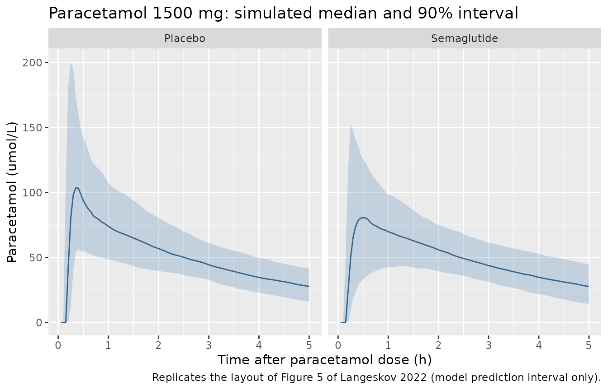
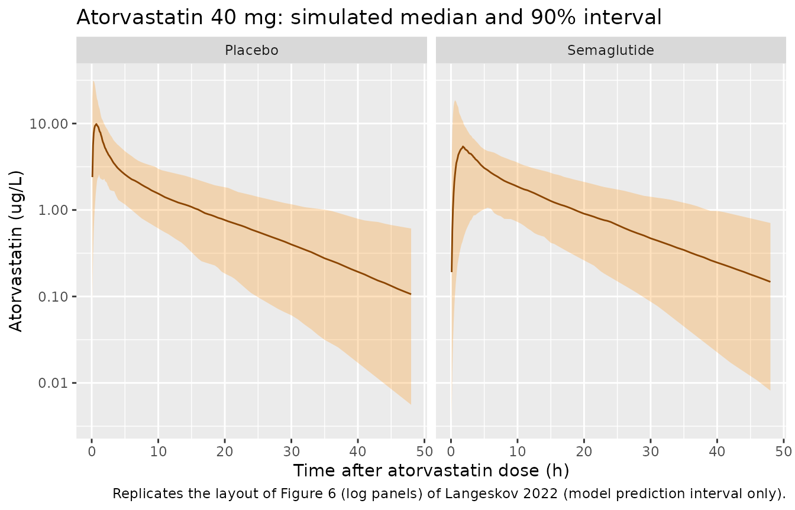
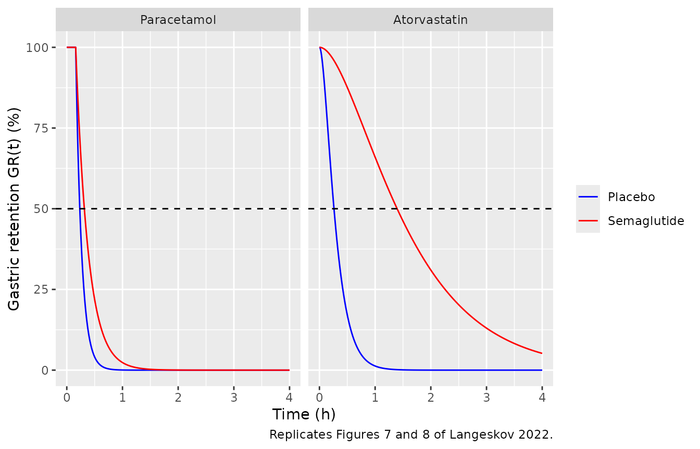

# Paracetamol and atorvastatin with semaglutide (Langeskov 2022)

## Model and source

Langeskov and Kristensen (2022) re-analysed two Novo Nordisk clinical
pharmacology trials with population PK models to quantify how
steady-state once-weekly subcutaneous semaglutide 1.0 mg, which slows
gastric emptying, changes the absorption of two orally co-administered
drugs. The two analyses were fitted separately (different trials,
subjects and drugs), so the library carries them as two independent
models that share this article.

- Citation: Langeskov EK, Kristensen K. Population pharmacokinetic of
  paracetamol and atorvastatin with co-administration of semaglutide.
  Pharmacol Res Perspect. 2022;10(4):e00962. <doi:10.1002/prp2.962>
- Paracetamol model: Two-compartment population PK model with
  first-order absorption and an absorption lag time for a single 1500 mg
  oral dose of paracetamol (solubilised in yoghurt) in healthy obese
  adults with and without steady-state once-weekly subcutaneous
  semaglutide 1.0 mg (Langeskov 2022). Semaglutide co-administration
  reduces the absorption rate constant by a fraction of 0.525 and body
  weight enters the apparent central volume linearly; proportional
  residual error.
- Atorvastatin model: Two-compartment population PK model with one
  transit compartment followed by first-order absorption for a single 40
  mg oral dose of atorvastatin in healthy adults with and without
  steady-state once-weekly subcutaneous semaglutide 1.0 mg (Langeskov
  2022). Semaglutide co-administration reduces ka and the transit rate
  constant ktr by fractions of 0.829 and 0.791; fixed allometric
  body-weight scaling (exponent 0.75 on clearances, 1 on volumes, 75 kg
  reference) and proportional residual error.
- Article: <https://doi.org/10.1002/prp2.962>
- Trial reports used for external checks: Hjerpsted et al. 2018
  (paracetamol, <https://doi.org/10.1111/dom.13120>) and Hausner et
  al. 2017 (atorvastatin, <https://doi.org/10.1007/s40262-017-0532-6>).

## Population

**Paracetamol (trial NCT02079870).** A randomised, double-blind,
placebo-controlled two-period crossover in 30 healthy obese adults (BMI
30-45 kg/m^2). At the end of each 12-week period of semaglutide
(escalated 0.25, 0.5 then 1.0 mg once weekly) or placebo, subjects
received 1500 mg paracetamol solubilised in yoghurt, sampled at 0.25-5
h. The model was fitted to 503 samples from 29 subjects (20 male / 9
female), mean age 42 years (21-65), mean body weight 102 kg (81.5-121),
mean BMI 33.2 kg/m^2 (Langeskov 2022 Table 1).

**Atorvastatin (trial NCT02243098).** An open-label one-sequence
crossover in 31 healthy adults (BMI 20-30 kg/m^2). A single 40 mg
atorvastatin dose was given before semaglutide was started and again in
week 13 at semaglutide 1.0 mg steady state, sampled at 0.5-48 h. The
model was fitted to 713 samples from 31 subjects (15 male / 16 female),
mean age 45 years (25-55), mean body weight 75.4 kg (53.6-102), mean BMI
25.2 kg/m^2 (Table 1).

Both models were fitted in Phoenix NLME 8.1 (FOCE-ELS). The same
information is available programmatically from each model’s `population`
metadata, e.g.
`readModelDb("Langeskov_2022_atorvastatin")()$population`.

## Source trace

Every `ini()` value carries an in-file comment pointing at its source.
The tables below collect them.

**Paracetamol** (`Langeskov_2022_paracetamol.R`):

| Equation / parameter | Value | Source location |
|----|----|----|
| `lka` (ka, placebo) | log(9.4) 1/h | Table 2 |
| `e_conmed_semaglutide_ka` | 0.525 | Table 2 ‘Theta kacovariate’; Section 3.2 |
| `lvc` (V1/F at 102 kg) | log(48.5) L | Table 2 |
| `e_wt_vc` (linear, per kg) | 0.0312 | Table 2 ‘Theta V1/Fcovariate’; Section 3.2 |
| `lcl` (CL/F) | log(25.9) L/h | Table 2 |
| `lvp` (V2/F) | log(55.4) L | Table 2 |
| `lq` (Cl2/F) | log(199) L/h | Table 2 |
| `ltlag` (Tlag) | log(0.16) h | Table 2 |
| `etalka`, `etalvc`, `etalcl`, `etalvp`, `etaltlag` | 0.514, 0.270, 0.0606, 0.0703, 0.0586 | Table 2 omega^2 |
| `propSd` | 0.094 | Table 2 ‘Ceps’ (read as SD, see below) |
| `ka = tvka * (1 - theta * CONMED_SEMAGLUTIDE)` | n/a | Section 3.2 PML equation |
| `V1/F = tvV1/F * (1 + theta * (WT - MedianBW))` | n/a | Section 3.2 PML equation |
| Two compartments, first-order absorption, lag | n/a | Figure 1; Section 3.1 |

**Atorvastatin** (`Langeskov_2022_atorvastatin.R`):

| Equation / parameter | Value | Source location |
|----|----|----|
| `lka` (ka, placebo) | log(5.72) 1/h | Table 3 |
| `e_conmed_semaglutide_ka` | 0.829 | Table 3 ‘Theta kacovariate’; Section 3.2 |
| `lktr` (ktr, placebo) | log(7.28) 1/h | Table 3 |
| `e_conmed_semaglutide_ktr` | 0.791 | Table 3 ‘Theta ktrcovariate’; Section 3.2 |
| `lvc`, `lcl`, `lvp`, `lq` (75 kg) | log(1843) L, log(620) L/h, log(4184) L, log(873) L/h | Table 3 (footnote a: 75 kg) |
| `e_wt_cl_q`, `e_wt_vc_vp` | 0.75, 1 (fixed) | Section 3.2 PML equations |
| `etalka`, `etalktr`, `etalvc`, `etalcl`, `etalvp` | 2.03, 1.82, 0.625, 0.151, 0.111 | Table 3 omega^2 |
| `propSd` | 0.322 | Table 3 ‘Ceps’ |
| dose -\> transit -(ktr)-\> absorption -(ka)-\> central | n/a | Figure 2; Section 3.1 |

## Virtual cohorts

Each treatment condition is simulated as its own arm of 200 virtual
subjects (subject IDs are disjoint across arms). Body weight is drawn
from a normal distribution truncated to the observed range: mean 102 kg,
SD 10.5 kg for the paracetamol trial (Hjerpsted 2018 baseline SD) and
mean 75.4 kg, SD 12 kg for the atorvastatin trial (SD not reported;
chosen so that the observed range 53.6-102 kg spans roughly +/-2 SD).

``` r

set.seed(20220705)
rxode2::rxSetSeed(20220705)

draw_wt <- function(n, mean, sd, lo, hi) {
  wt <- rnorm(n, mean, sd)
  # Redraw out-of-range values until all fall in the observed range
  while (any(out <- wt < lo | wt > hi)) wt[out] <- rnorm(sum(out), mean, sd)
  wt
}

make_cohort <- function(n, dose, obs_times, sema, wt_mean, wt_sd, wt_lo, wt_hi,
                        id_offset = 0L) {
  subj <- tibble(
    id = id_offset + seq_len(n),
    WT = draw_wt(n, wt_mean, wt_sd, wt_lo, wt_hi),
    CONMED_SEMAGLUTIDE = sema,
    treatment = if (sema == 1) "Semaglutide" else "Placebo"
  )
  dose_rows <- subj |> mutate(time = 0, evid = 1L, amt = dose, cmt = "depot")
  obs_rows <- subj |>
    tidyr::crossing(time = obs_times) |>
    mutate(evid = 0L, amt = 0, cmt = "central")
  bind_rows(dose_rows, obs_rows) |> arrange(id, time, desc(evid))
}

para_times <- sort(unique(c(seq(0, 1, by = 0.05), seq(1.1, 5, by = 0.1), seq(5.5, 24, by = 0.5))))
ator_times <- sort(unique(c(seq(0, 4, by = 0.1), seq(4.5, 24, by = 0.5), seq(25, 96, by = 1))))

ev_para <- bind_rows(
  make_cohort(200, 1500, para_times, 0, 102, 10.5, 81.5, 121, id_offset = 0L),
  make_cohort(200, 1500, para_times, 1, 102, 10.5, 81.5, 121, id_offset = 200L)
)
ev_ator <- bind_rows(
  make_cohort(200, 40, ator_times, 0, 75.4, 12, 53.6, 102, id_offset = 0L),
  make_cohort(200, 40, ator_times, 1, 75.4, 12, 53.6, 102, id_offset = 200L)
)
stopifnot(
  !anyDuplicated(unique(ev_para[, c("id", "time", "evid")])),
  !anyDuplicated(unique(ev_ator[, c("id", "time", "evid")]))
)
```

## Simulation

``` r

mod_para <- readModelDb("Langeskov_2022_paracetamol")
mod_ator <- readModelDb("Langeskov_2022_atorvastatin")

sim_para <- rxode2::rxSolve(mod_para, events = ev_para, keep = c("treatment", "WT")) |>
  as.data.frame() |>
  mutate(Cc_umol = Cc / 151.16 * 1000) # mg/L -> umol/L (MW 151.16 g/mol)
#> ℹ parameter labels from comments will be replaced by 'label()'
sim_ator <- rxode2::rxSolve(mod_ator, events = ev_ator, keep = c("treatment", "WT")) |>
  as.data.frame()
#> ℹ parameter labels from comments will be replaced by 'label()'
```

## Replicate published figures

``` r

vpc_summary <- function(sim, conc, tmax) {
  sim |>
    filter(time > 0, time <= tmax) |>
    group_by(treatment, time) |>
    summarise(
      Q05 = quantile(.data[[conc]], 0.05),
      Q50 = quantile(.data[[conc]], 0.50),
      Q95 = quantile(.data[[conc]], 0.95),
      .groups = "drop"
    )
}

vpc_summary(sim_para, "Cc_umol", 5) |>
  ggplot(aes(time, Q50)) +
  geom_ribbon(aes(ymin = Q05, ymax = Q95), alpha = 0.25, fill = "steelblue") +
  geom_line(colour = "steelblue4") +
  facet_wrap(~treatment) +
  labs(
    x = "Time after paracetamol dose (h)", y = "Paracetamol (umol/L)",
    title = "Paracetamol 1500 mg: simulated median and 90% interval",
    caption = "Replicates the layout of Figure 5 of Langeskov 2022 (model prediction interval only)."
  )
```



``` r

vpc_summary(sim_ator, "Cc", 48) |>
  ggplot(aes(time, Q50)) +
  geom_ribbon(aes(ymin = Q05, ymax = Q95), alpha = 0.25, fill = "darkorange") +
  geom_line(colour = "darkorange4") +
  facet_wrap(~treatment) +
  scale_y_log10() +
  labs(
    x = "Time after atorvastatin dose (h)", y = "Atorvastatin (ug/L)",
    title = "Atorvastatin 40 mg: simulated median and 90% interval",
    caption = "Replicates the layout of Figure 6 (log panels) of Langeskov 2022 (model prediction interval only)."
  )
```



### Gastric retention and T50 (Figures 7 and 8)

The paper derives a percent gastric retention curve GR(t) from the
typical absorption parameters: the percentage of the dose still in the
absorption compartments (for atorvastatin, the transit plus absorption
compartments), and T50 as the time at which GR(t) reaches 50%. For
paracetamol this is Equation 6, T50 = ln(2) / ka + Tlag. Here GR(t) is
read directly off the model’s absorption states in a typical-value
solve.

``` r

gr_events <- function(dose) {
  tt <- seq(0, 4, by = 0.001)
  bind_rows(
    tibble(id = 1:2, time = 0, evid = 1L, amt = dose, cmt = "depot"),
    tidyr::crossing(id = 1:2, time = tt) |> mutate(evid = 0L, amt = 0, cmt = "central")
  ) |>
    mutate(
      CONMED_SEMAGLUTIDE = id - 1L,
      treatment = if_else(id == 2L, "Semaglutide", "Placebo"),
      WT = 75
    ) |>
    arrange(id, time, desc(evid))
}

gr_para <- rxode2::rxSolve(rxode2::zeroRe(mod_para), events = gr_events(1500),
                           keep = "treatment", rtol = 1e-10, atol = 1e-12) |>
  as.data.frame() |>
  # Up to and including Tlag the dose has not yet entered `depot`; it is
  # still retained (at t = Tlag the observation precedes the lagged dose).
  mutate(GR = if_else(time <= 0.16, 100, 100 * depot / 1500), drug = "Paracetamol")
#> ℹ parameter labels from comments will be replaced by 'label()'
#> ℹ omega/sigma items treated as zero: 'etalka', 'etalvc', 'etalcl', 'etalvp', 'etaltlag'
#> Warning: multi-subject simulation without without 'omega'
gr_ator <- rxode2::rxSolve(rxode2::zeroRe(mod_ator), events = gr_events(40),
                           keep = "treatment", rtol = 1e-10, atol = 1e-12) |>
  as.data.frame() |>
  mutate(GR = 100 * (depot + transit1) / 40, drug = "Atorvastatin")
#> ℹ parameter labels from comments will be replaced by 'label()'
#> ℹ omega/sigma items treated as zero: 'etalka', 'etalktr', 'etalvc', 'etalcl', 'etalvp'
#> Warning: multi-subject simulation without without 'omega'

bind_rows(gr_para, gr_ator) |>
  mutate(drug = factor(drug, c("Paracetamol", "Atorvastatin"))) |>
  ggplot(aes(time, GR, colour = treatment)) +
  geom_line() +
  geom_hline(yintercept = 50, linetype = "dashed") +
  facet_wrap(~drug) +
  scale_colour_manual(values = c(Placebo = "blue", Semaglutide = "red")) +
  labs(
    x = "Time (h)", y = "Gastric retention GR(t) (%)", colour = NULL,
    caption = "Replicates Figures 7 and 8 of Langeskov 2022."
  )
```



``` r


t50 <- function(d) {
  d <- d[d$time > 0, ]
  i <- which(d$GR <= 50)[1]
  # Linear interpolation between the bracketing grid points
  d$time[i - 1] + (50 - d$GR[i - 1]) / (d$GR[i] - d$GR[i - 1]) * (d$time[i] - d$time[i - 1])
}
t50_tab <- bind_rows(gr_para, gr_ator) |>
  group_by(drug, treatment) |>
  group_modify(~ tibble(T50_h = t50(.x))) |>
  ungroup() |>
  mutate(
    T50_min = 60 * T50_h,
    published_min = c(16, 83, 0.23 * 60, 0.31 * 60)[match(paste(drug, treatment), c(
      "Atorvastatin Placebo", "Atorvastatin Semaglutide",
      "Paracetamol Placebo", "Paracetamol Semaglutide"
    ))]
  )

t50_tab |>
  dplyr::rename(
    "Drug" = drug, "Arm" = treatment, "T50 (h)" = T50_h,
    "T50 (min)" = T50_min, "Published T50 (min)" = published_min
  ) |>
  knitr::kable(digits = 2, caption = "Typical-value T50 against Section 3.4 of Langeskov 2022.")
```

| Drug         | Arm         | T50 (h) | T50 (min) | Published T50 (min) |
|:-------------|:------------|--------:|----------:|--------------------:|
| Atorvastatin | Placebo     |    0.26 |     15.67 |                16.0 |
| Atorvastatin | Semaglutide |    1.39 |     83.69 |                83.0 |
| Paracetamol  | Placebo     |    0.23 |     14.02 |                13.8 |
| Paracetamol  | Semaglutide |    0.32 |     18.91 |                18.6 |

Typical-value T50 against Section 3.4 of Langeskov 2022. {.table}

``` r


# Deterministic: typical-value solve at rtol 1e-10 on a 0.001 h grid.
# Paracetamol is printed to 0.01 h (0.23 / 0.31 h), atorvastatin to the minute.
para_t50 <- t50_tab$T50_h[t50_tab$drug == "Paracetamol"]
ator_t50 <- t50_tab$T50_min[t50_tab$drug == "Atorvastatin"]
stopifnot(
  length(para_t50) == 2L, length(ator_t50) == 2L,
  all(abs(para_t50 - c(0.23, 0.31)) < 0.006),
  all(abs(ator_t50 - c(16, 83)) < 1)
)
```

The model reproduces all four published T50 values: paracetamol 14 and
19 min (Equation 6 gives 0.234 and 0.315 h) and atorvastatin 16 and 83
min, i.e. the 67-minute semaglutide-induced delay in atorvastatin
absorption reported in the Results.

## PKNCA validation

``` r

run_nca <- function(sim, events, extra_intervals) {
  conc <- sim |>
    filter(!is.na(Cc)) |>
    select(id, time, Cc, treatment)
  conc <- bind_rows(conc, conc |> distinct(id, treatment) |> mutate(time = 0, Cc = 0)) |>
    distinct(id, treatment, time, .keep_all = TRUE) |>
    arrange(id, treatment, time)
  doses <- events |>
    filter(evid == 1) |>
    select(id, time, amt, treatment)
  intervals <- bind_rows(
    data.frame(start = 0, end = Inf, cmax = TRUE, tmax = TRUE, aucinf.obs = TRUE),
    extra_intervals
  ) |>
    # bind_rows() leaves NA in the flags a row does not set; PKNCA needs FALSE
    mutate(across(where(is.logical), ~ coalesce(.x, FALSE)))
  PKNCA::pk.nca(PKNCA::PKNCAdata(
    PKNCA::PKNCAconc(conc, Cc ~ time | treatment + id),
    PKNCA::PKNCAdose(doses, amt ~ time | treatment + id),
    intervals = intervals
  ))
}

nca_para <- run_nca(sim_para, ev_para, data.frame(start = 0, end = c(1, 5), aucint.last = TRUE))
nca_ator <- run_nca(sim_ator, ev_ator, data.frame(start = 0, end = 72, aucint.last = TRUE))

nca_summary <- function(nca) {
  as.data.frame(nca) |>
    filter(PPTESTCD %in% c("cmax", "tmax", "aucinf.obs", "aucint.last")) |>
    mutate(param = if_else(PPTESTCD == "aucint.last", paste0("auc0-", end), PPTESTCD)) |>
    group_by(treatment, param) |>
    summarise(
      value = if (first(PPTESTCD) == "tmax") median(PPORRES) else exp(mean(log(PPORRES))),
      .groups = "drop"
    )
}
para_sum <- nca_summary(nca_para)
ator_sum <- nca_summary(nca_ator)

bind_rows(
  para_sum |> mutate(drug = "Paracetamol (mg/L, h)"),
  ator_sum |> mutate(drug = "Atorvastatin (ug/L, h)")
) |>
  tidyr::pivot_wider(names_from = treatment, values_from = value) |>
  dplyr::rename("Drug (units)" = drug, "NCA parameter" = param) |>
  knitr::kable(digits = 3, caption = "Simulated NCA: geometric means (median for tmax) per arm.")
```

| NCA parameter | Drug (units)           | Placebo | Semaglutide |
|:--------------|:-----------------------|--------:|------------:|
| auc0-1        | Paracetamol (mg/L, h)  |  10.561 |       8.677 |
| auc0-5        | Paracetamol (mg/L, h)  |  38.989 |      36.623 |
| aucinf.obs    | Paracetamol (mg/L, h)  |  59.415 |      57.557 |
| cmax          | Paracetamol (mg/L, h)  |  16.620 |      13.035 |
| tmax          | Paracetamol (mg/L, h)  |   0.350 |       0.500 |
| auc0-72       | Atorvastatin (ug/L, h) |  59.789 |      61.858 |
| aucinf.obs    | Atorvastatin (ug/L, h) |  61.098 |      63.878 |
| cmax          | Atorvastatin (ug/L, h) |  10.857 |       5.762 |
| tmax          | Atorvastatin (ug/L, h) |   0.700 |       2.000 |

Simulated NCA: geometric means (median for tmax) per arm. {.table}

### Mass balance: AUC does not depend on semaglutide

Semaglutide only slows absorption in both models, so AUC0-inf must equal
dose / (CL/F) in both arms. A typical-value solve checks this identity.

``` r

typ_events <- function(dose, wt, tmax) {
  tt <- sort(unique(c(seq(0, 2, by = 0.01), seq(2, tmax, by = 0.1))))
  bind_rows(
    tibble(id = 1:2, time = 0, evid = 1L, amt = dose, cmt = "depot"),
    tidyr::crossing(id = 1:2, time = tt) |> mutate(evid = 0L, amt = 0, cmt = "central")
  ) |>
    mutate(CONMED_SEMAGLUTIDE = id - 1L, WT = wt) |>
    arrange(id, time, desc(evid))
}
trap <- function(x, y) sum(diff(x) * (head(y, -1) + tail(y, -1)) / 2)

typ_para <- rxode2::rxSolve(rxode2::zeroRe(mod_para), events = typ_events(1500, 102, 72),
                            rtol = 1e-10, atol = 1e-12) |> as.data.frame()
#> ℹ parameter labels from comments will be replaced by 'label()'
#> ℹ omega/sigma items treated as zero: 'etalka', 'etalvc', 'etalcl', 'etalvp', 'etaltlag'
#> Warning: multi-subject simulation without without 'omega'
typ_ator <- rxode2::rxSolve(rxode2::zeroRe(mod_ator), events = typ_events(40, 75, 480),
                            rtol = 1e-10, atol = 1e-12) |> as.data.frame()
#> ℹ parameter labels from comments will be replaced by 'label()'
#> ℹ omega/sigma items treated as zero: 'etalka', 'etalktr', 'etalvc', 'etalcl', 'etalvp'
#> Warning: multi-subject simulation without without 'omega'
auc_para <- tapply(seq_len(nrow(typ_para)), typ_para$id, function(i) trap(typ_para$time[i], typ_para$Cc[i]))
auc_ator <- tapply(seq_len(nrow(typ_ator)), typ_ator$id, function(i) trap(typ_ator$time[i], typ_ator$Cc[i]))
closed <- c(paracetamol = 1500 / 25.9, atorvastatin = 40 / 620 * 1000)
auc_tab <- tibble(
  drug = rep(names(closed), each = 2),
  treatment = rep(c("Placebo", "Semaglutide"), 2),
  AUC_solve = c(auc_para, auc_ator),
  AUC_closed_form = rep(closed, each = 2)
) |>
  mutate(rel_diff_pct = 100 * (AUC_solve / AUC_closed_form - 1))
auc_tab |>
  dplyr::rename(
    "Drug" = drug, "Arm" = treatment, "AUC (typical solve)" = AUC_solve,
    "Dose / (CL/F)" = AUC_closed_form, "Difference (%)" = rel_diff_pct
  ) |>
  knitr::kable(digits = 3)
```

| Drug         | Arm         | AUC (typical solve) | Dose / (CL/F) | Difference (%) |
|:-------------|:------------|--------------------:|--------------:|---------------:|
| paracetamol  | Placebo     |              57.914 |        57.915 |         -0.001 |
| paracetamol  | Semaglutide |              57.916 |        57.915 |          0.001 |
| atorvastatin | Placebo     |              64.519 |        64.516 |          0.005 |
| atorvastatin | Semaglutide |              64.516 |        64.516 |          0.000 |

``` r

# Trapezoidal AUC on a fine grid out to > 10 terminal half-lives; the residual
# is grid / truncation error (measured at most 0.005%), not a model difference.
stopifnot(all(abs(auc_tab$rel_diff_pct) < 0.05))
```

### Comparison against the trial reports

Langeskov 2022 reports no NCA of its own. The two trial reports give the
semaglutide / placebo ratios of the NCA endpoints, which the simulated
arms can be compared against.

``` r

ratio <- function(s, p) {
  s$value[s$treatment == "Semaglutide" & s$param == p] /
    s$value[s$treatment == "Placebo" & s$param == p]
}
tmax_med <- function(s, arm) s$value[s$treatment == arm & s$param == "tmax"]

ratio_tab <- tibble::tribble(
  ~drug, ~endpoint, ~simulated, ~published, ~published_ci, ~source,
  "Atorvastatin", "AUC ratio", ratio(ator_sum, "auc0-72"), 1.02, "0.93-1.12", "Hausner 2017 Table 2",
  "Atorvastatin", "Cmax ratio", ratio(ator_sum, "cmax"), 0.62, "0.47-0.82", "Hausner 2017 Table 2",
  "Atorvastatin", "Median tmax, placebo (h)", tmax_med(ator_sum, "Placebo"), 0.7, "", "Hausner 2017 Results",
  "Atorvastatin", "Median tmax, semaglutide (h)", tmax_med(ator_sum, "Semaglutide"), 2.0, "", "Hausner 2017 Results",
  "Paracetamol", "AUC0-5h ratio", ratio(para_sum, "auc0-5"), 0.94, "0.88-1.01", "Hjerpsted 2018 Section 3.4",
  "Paracetamol", "AUC0-1h ratio", ratio(para_sum, "auc0-1"), 0.73, "0.61-0.87", "Hjerpsted 2018 Section 3.4"
)
ratio_tab |>
  dplyr::rename(
    "Drug" = drug, "Endpoint" = endpoint, "Simulated" = simulated,
    "Published" = published, "Published CI" = published_ci, "Source" = source
  ) |>
  knitr::kable(digits = 2, caption = "Semaglutide / placebo NCA ratios: simulated arms (200 each) vs the trial reports.")
```

| Drug | Endpoint | Simulated | Published | Published CI | Source |
|:---|:---|---:|---:|:---|:---|
| Atorvastatin | AUC ratio | 1.03 | 1.02 | 0.93-1.12 | Hausner 2017 Table 2 |
| Atorvastatin | Cmax ratio | 0.53 | 0.62 | 0.47-0.82 | Hausner 2017 Table 2 |
| Atorvastatin | Median tmax, placebo (h) | 0.70 | 0.70 |  | Hausner 2017 Results |
| Atorvastatin | Median tmax, semaglutide (h) | 2.00 | 2.00 |  | Hausner 2017 Results |
| Paracetamol | AUC0-5h ratio | 0.94 | 0.94 | 0.88-1.01 | Hjerpsted 2018 Section 3.4 |
| Paracetamol | AUC0-1h ratio | 0.82 | 0.73 | 0.61-0.87 | Hjerpsted 2018 Section 3.4 |

Semaglutide / placebo NCA ratios: simulated arms (200 each) vs the trial
reports. {.table}

``` r


sim_ratio <- setNames(ratio_tab$simulated, paste(ratio_tab$drug, ratio_tab$endpoint))
stopifnot(
  # Exposure is unchanged by semaglutide in both models (CL/F has no
  # semaglutide effect); between-arm noise in the geometric-mean ratio is
  # roughly 3-4% (1 SE) at 200 per arm, so 15% is about 4 SE.
  abs(log(sim_ratio[["Atorvastatin AUC ratio"]])) < log(1.15),
  abs(log(sim_ratio[["Paracetamol AUC0-5h ratio"]])) < log(1.15),
  # The atorvastatin Cmax ratio sits inside the published 90% CI; the typical
  # value is 0.53 and the cohort noise is about 6%.
  sim_ratio[["Atorvastatin Cmax ratio"]] > 0.4,
  sim_ratio[["Atorvastatin Cmax ratio"]] < 0.75
)
```

The atorvastatin model reproduces the trial’s findings: unchanged AUC, a
Cmax lowered by roughly half (published 38%, 90% CI 23-53%), and median
tmax delayed from 0.7 h to 2 h. For paracetamol the overall exposure is
unchanged as observed (AUC0-5h ratio about 0.94). The first-hour effect
is weaker in the model than in the trial’s NCA: the simulated AUC0-1h
ratio of about 0.8 lies inside the published 95% CI but above its point
estimate of 0.73. The model places the whole semaglutide effect on ka
(53% lower), with a 0.16 h lag shared by both arms, which delays T50 by
only 5 minutes; the authors draw the same conclusion in their
Discussion. The AUC0-1h ratio is reported but not gated.

## Assumptions and deviations

- **Residual error scale.** Tables 2 and 3 print the residual row as
  ‘Ceps’ and the footnote calls Ceps sigma^2. Phoenix NLME reports CEps
  as the standard deviation of epsilon, and the paracetamol
  observed-vs-IPRED panel (Figure 3A) shows a scatter of about +/-10%
  around the line of identity, which matches an SD of 9.4% and not the
  31% that a variance reading (sqrt(0.094)) implies. Both models
  therefore use `propSd` = the printed value (0.094 and 0.322).
- **Paracetamol weight centring.** The PML equation centres the linear
  weight effect on V1/F at ‘MedianBW’, which the paper does not print.
  The cohort mean of 102 kg (Table 1) is used. The linear form reaches
  V1/F = 0 at 70 kg, so the paracetamol model should not be used below
  the studied 81.5-121 kg range.
- **Atorvastatin allometry.** The PML examples show exponent 0.75 on
  CL/F and 1 on V1/F; the text says all four disposition parameters were
  scaled, so Cl2/F takes 0.75 and V2/F takes 1. The reference weight of
  75 kg comes from the Table 3 footnote (‘For an individual of 75 kg’).
- **Compartment names for atorvastatin.** Figure 2 names the
  dose-receiving compartment ‘transit’ and the next one ‘absorption’. In
  the library model the dose enters `depot` (the paper’s transit
  compartment, emptied at rate ktr) and `transit1` is the paper’s
  absorption compartment (emptied at rate ka), so doses use the
  conventional `cmt = "depot"`.
- **Semaglutide indicator.** The source data-set column was named
  `placebo` but was coded 1 for semaglutide co-administration (Section
  3.2). It is carried as `CONMED_SEMAGLUTIDE` with the same coding.
- **Inconsistent percentages in the paper.** Table 3 and Section 3.2
  give fractional reductions of 0.829 (ka) and 0.791 (ktr), i.e. 83% and
  79%, and ka 5.72 -\> 0.986 1/h; the Abstract and Discussion instead
  quote 72% and 91% and ka 4.8 -\> 1.3 1/h, apparently from an earlier
  model. The Table 3 values are used; they reproduce the published T50
  values of 16 and 83 minutes. The Figure 8 caption gives the
  atorvastatin placebo T50 as 0.22 h (13 min) where the Results give 16
  min; the model gives 15.7 min.
- **Virtual cohorts.** Body-weight SD for the atorvastatin trial is not
  reported (12 kg assumed). Each condition is simulated as a separate
  arm rather than as a crossover; the models carry no inter-occasion
  variability, so a crossover would differ only in pairing.
- **Errata.** No correction notice for Langeskov 2022 was found in
  Europe PMC as of 2026-10-02.
