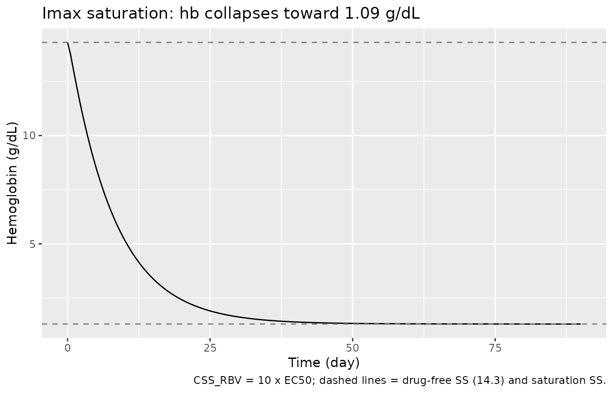
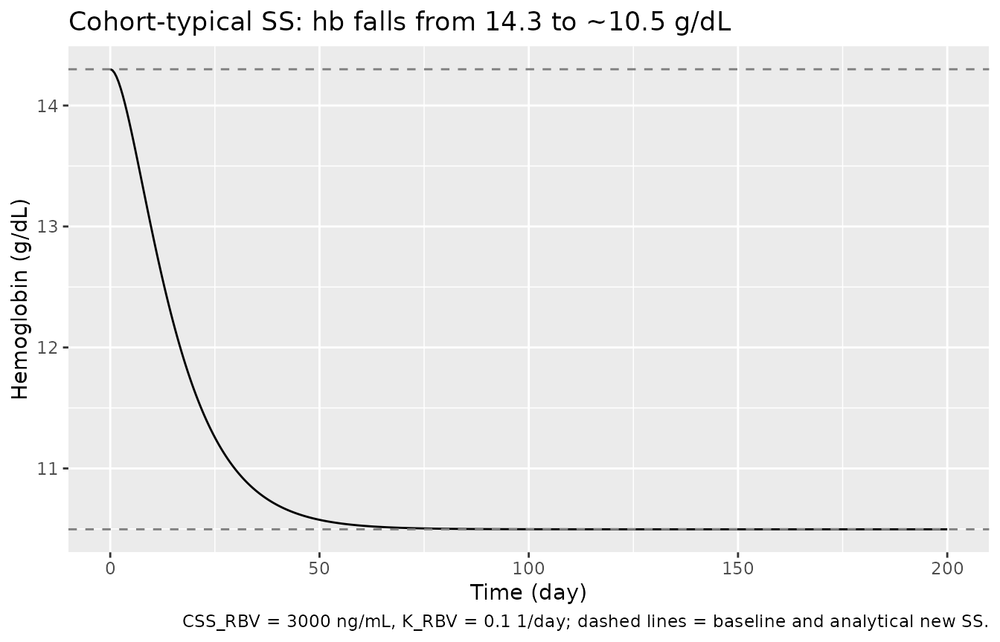
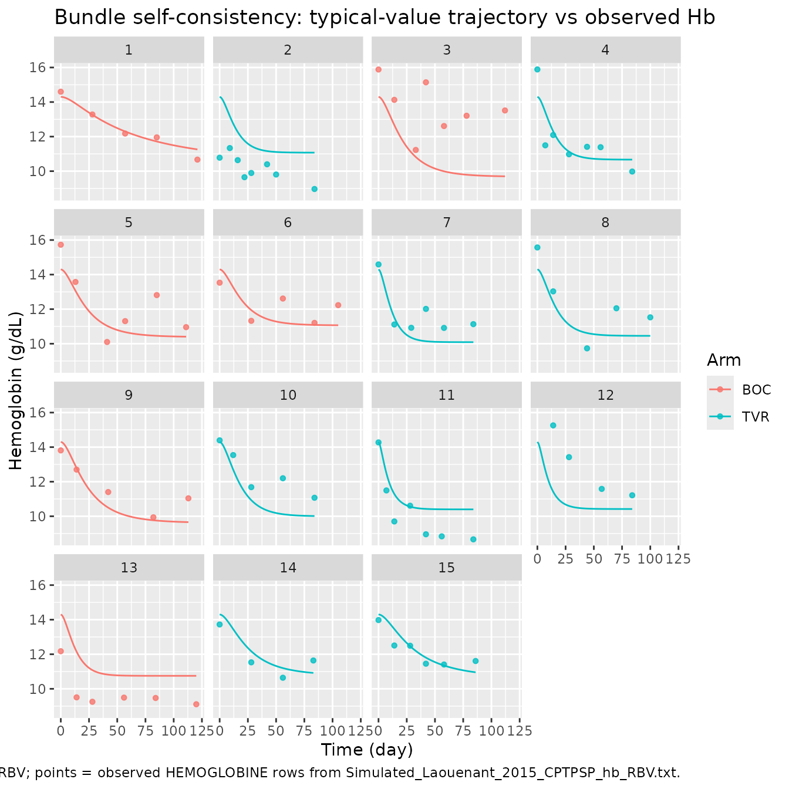

# Ribavirin (Laouenan 2015)

## Model and source

- Citation: Laouenan C, Guedj J, Peytavin G, Nguyen TT, Lapalus M,
  Khelifa-Mouri F, Boyer N, Zoulim F, Serfaty L, Bronowicki JP,
  Martinot-Peignoux M, Lada O, Asselah T, Dorival C, Hezode C, Carrat F,
  Nicot F, Marcellin P, Mentre F. (2015). A Model-Based Illustrative
  Exploratory Approach to Optimize the Dosing of Peg-IFN/RBV in
  Cirrhotic Hepatitis C Patients Treated With Triple Therapy. CPT
  Pharmacometrics Syst Pharmacol 4(1):e00008. <doi:10.1002/psp4.8>.
  DDMORE Foundation Model Repository: DDMODEL00000285.
- Description: Hemoglobin turnover (indirect-response) model describing
  ribavirin-induced anemia in HCV genotype-1 cirrhotic patients on
  telaprevir- or boceprevir-based triple therapy (Laouenan 2015).
  Hemoglobin (g/dL) follows a kin/kout indirect-response ODE in which
  ribavirin inhibits hemoglobin synthesis with an Imax = 1, EC50 form.
  The ribavirin concentration time-course is reconstructed analytically
  from per-subject empirical-Bayes regressors (CSS_RBV, K_RBV) supplied
  as data columns from a separately fitted Laouenan 2015 upstream
  ribavirin popPK fit; this PD model does not instantiate the PK ODE
  itself. Distributed in the DDMORE Foundation Model Repository as
  DDMODEL00000285; the linked publication fits the same equations to 15
  ANRS-CO20-CUPIC patients (9 telaprevir, 6 boceprevir).
- Article: <https://doi.org/10.1002/psp4.8> (PMID
  [26225222](https://pubmed.ncbi.nlm.nih.gov/26225222/))
- DDMORE Foundation Model Repository entry:
  [DDMODEL00000285](https://repository.ddmore.eu/model/DDMODEL00000285)

This model was extracted from the DDMORE Foundation Model Repository
bundle for `DDMODEL00000285` (scraped to
`dpastoor/ddmore_scraping/285/`). The bundle contains:

- `Executable_Laouenant_2015_CPTPSP_hb_RBV` – the Monolix mlxtran
  control object (DESCRIPTION + INPUT + EQUATION + OUTPUT blocks).
  Notable features: `parameter = {hb0, Kout, EC50}`,
  `regressor = {css_mode, k_mode}`, `output = hb`.
- `Output_real_Laouenant_2015_CPTPSP_hb_RBV` – the Monolix listing with
  **final population estimates** from the fit on the real
  ANRS-CO20-CUPIC clinical dataset (generated 2013-11-06; this is the
  source of all parameter values used in the model file).
- `Output_simulated_Laouenant_2015_CPTPSP_hb_RBV` – the Monolix listing
  from a re-fit on the bundle’s shipped simulated dataset (Monolix
  4.4.0). Reports very similar but slightly different point estimates
  (`hb0_pop = 14.2`, `Kout_pop = 0.258`, `EC50_pop = 9.37e+003`) – used
  here only as a self-consistency sanity check, not as the parameter
  source.
- `Simulated_Laouenant_2015_CPTPSP_hb_RBV.txt` – a 15-subject / 89-row
  simulated longitudinal dataset (whitespace-delimited text with header
  `ID_PAT, CAT, HEMOGLOBINE, TIME, css_mode, k_mode`). Subject IDs and
  arm labels (BOC = boceprevir, TVR = telaprevir) reproduce the 15
  ANRS-CO20-CUPIC patients of the Laouenan 2015 publication; CSS_RBV /
  K_RBV regressors are the per-subject empirical-Bayes estimates from
  the upstream popPK fit and are used in the bundle’s typical-value
  re-simulation.
- `DDMODEL00000285.rdf` – RDF metadata. Notable fields:
  `model-field-purpose` URI = `pkpd_0001024` (PK/PD), and
  `model-has-description` = “Empirical Bayes estimates of individual
  values of ribavirin PK parameters (exponential model of trough
  concentrations at steady state) are used as regressors to link the
  concentration of ribavirin with the inhibition of hemoglobin synthesis
  (turnover model)”.
- `Command.txt` – `use the monolix 2016R1 interface`.
- `285.json` – scraper metadata; `version: 6`.

The bundle does **not** ship a `Model_Accomodations.text|.txt` file.
Authorship and journal mapping (Laouenan C et al. 2015, CPT
Pharmacometrics Syst Pharmacol 4(1):e00008, <doi:10.1002/psp4.8>, PMID
26225222) was confirmed via a PubMed E-utilities lookup against the
publication metadata in the task header. The publication PDF / PMC full
text was not accessible from the worktree environment, so
publication-figure replication is out of scope (see “Validation
strategy” below).

## Population

Laouenan 2015 fits the model to longitudinal hemoglobin measurements
from 15 HCV genotype 1 cirrhotic patients (Metavir F4) with prior
treatment failure to peg-interferon-alpha plus ribavirin, enrolled in
the French ANRS-CO20-CUPIC compassionate-use cohort and treated with
peg-IFN-alpha2a + ribavirin + a protease inhibitor (telaprevir, n = 9;
boceprevir, n = 6). Reported baseline hemoglobin median is 15.1 g/dL
(range 10.8-16.0). The DDMORE bundle does not reproduce the
publication’s demographic table, so the model’s `population` metadata
fields for `weight_range`, `age_range`, `sex_female_pct`, and race
breakdown are intentionally `NA`. Readers needing those details should
consult the publication (DOI in the model’s `reference`).

## Source trace

Per-parameter and per-equation origin (also recorded as in-file comments
in `inst/modeldb/ddmore/Laouenan_2015_ribavirin.R`). `Output_real_*`
below refers to `Output_real_Laouenant_2015_CPTPSP_hb_RBV` in the
`DDMODEL00000285` bundle directory.

| Equation / parameter | Value (typical, log / variance form) | Source location |
|----|----|----|
| `lhb0` | `log(14.3)` g/dL | `Output_real_*` “Estimation of the population parameters”, `hb0 = 14.3` |
| `lkout` | `log(0.124)` 1/day | `Output_real_*`, `Kout = 0.124` |
| `lec50` | `log(8.28e3)` ng/mL | `Output_real_*`, `EC50 = 8.28e+003` |
| `etalhb0` | `~ 0.0853^2 = 0.00728` | `Output_real_*`, `omega_hb0 = 0.0853` (Monolix log-scale SD) |
| `etalkout` | `~ 0.383^2 = 0.147` | `Output_real_*`, `omega_Kout = 0.383` |
| `etalec50` | `~ 0.301^2 = 0.0906` | `Output_real_*`, `omega_EC50 = 0.301` |
| `addSd_hb` | `0.737` g/dL | `Output_real_*`, additive residual `a = 0.737` |
| `riba = CSS_RBV * (1 - exp(-K_RBV * t))` | analytical | `Executable_*` mlxtran `EQUATION` block |
| `d/dt(hb) = hb0*kout*(1 - riba/(riba+ec50)) - kout*hb` | n/a | `Executable_*` mlxtran `EQUATION` block (`ddt_hb = ...`) |
| `hb(0) = hb0` | n/a | `Executable_*` mlxtran `hb_0 = hb0` |
| `output = hb` | n/a | `Executable_*` mlxtran `OUTPUT` block |
| Imax (= 1) fixed | n/a | Laouenan 2015 Methods (`dHb/dt = kin,Hb*(1 - Imax*CRBV/(IC50RBV+CRBV)) - kout,Hb*Hb`) – Imax does not appear as a free parameter in the mlxtran |

**Errata note.** The bundle’s `Output_real_*` final estimate for `EC50`
is **8,280 ng/mL**, while the Laouenan 2015 publication’s Results
section reports `IC50RBV = 7,090 ng/mL`. Both refer to the same model
parameter. Per the extraction skill’s DDMORE-source guidance the `.lst`
final estimate is used verbatim in the model file, and the discrepancy
is documented here. The publication does not report typical kout,Hb or
Hb0 numerical values for direct comparison; the bundle’s listing is the
authoritative source for those.

## Validation strategy

The Laouenan 2015 publication PDF / PMC full text is not on disk in this
worktree, so the standard publication-figure replication and
PKNCA-vs-published-NCA checks are out of scope. The validation in this
vignette therefore follows the F.2 (self-consistency) and F.1
(endogenous mechanistic sanity) substitutes from the extraction skill:

1.  **Steady-state hold (drug-free).** With the ribavirin regressors
    forced to zero (`CSS_RBV = 0`), hemoglobin must stay at `hb0` across
    the entire simulation horizon – the model’s drug-free steady state.
2.  **Imax saturation limit.** As `CSS_RBV` climbs far above `EC50`, the
    inhibition `riba / (riba + EC50)` approaches 1 and the new
    hemoglobin steady state must collapse toward zero. The approach is
    exponential with rate `kout`, so the half-life of the descent toward
    the new steady state is `log(2) / kout`.
3.  **Mid-range steady-state value.** For sustained
    `CSS_RBV = 3000 ng/mL` (the cohort-typical value), the new SS
    hemoglobin must equal
    `hb0 * (1 - CSS_RBV / (CSS_RBV + EC50)) = 14.3 * (1 - 3000/11280) ~= 10.50 g/dL`,
    which is consistent with the publication’s reported median predicted
    Hbss of 10.0 g/dL (range 7.8-11.8).
4.  **Bundle self-consistency (F.2).** Re-simulate the bundle’s
    15-subject `Simulated_Laouenant_2015_CPTPSP_hb_RBV.txt` event table
    through
    [`rxode2::rxSolve()`](https://nlmixr2.github.io/rxode2/reference/rxSolve.html)
    using each subject’s bundle CSS_RBV / K_RBV regressors, with the
    typical-value parameters from `Output_real_*`. The resulting
    per-subject hemoglobin trajectory must trend in the same direction
    and on the same time-scale as the observed (`HEMOGLOBINE`) values in
    the bundle (acknowledging that the typical-value simulation has no
    IIV and no residual error; observation scatter around the typical
    trajectory is therefore expected).

The packaged model parses, runs to completion under
[`rxode2::rxSolve()`](https://nlmixr2.github.io/rxode2/reference/rxSolve.html),
and reproduces these qualitative behaviours in the chunks below.
Sections 1-3 use deterministic typical-value simulations (`zeroRe()`);
section 4 uses the same typical-value parameters with per-subject
regressors.

## Setup

``` r

mod <- rxode2::rxode2(readModelDb("Laouenan_2015_ribavirin"))
#> ℹ parameter labels from comments will be replaced by 'label()'
mod_typical <- rxode2::zeroRe(mod)

state_names <- mod$state
state_names
#> [1] "hb"

# Reference values from the bundle's Output_real_* listing, used in the
# closed-form sanity checks below.
hb0_typ  <- 14.3
kout_typ <- 0.124
ec50_typ <- 8.28e3
```

## 1. Steady-state hold (drug-free)

Run a 200-day simulation with `CSS_RBV = 0` so there is no ribavirin
exposure. Hemoglobin must stay at the per-subject baseline
`hb0 = 14.3 g/dL`.

``` r

ev_drugfree <- data.frame(
  id      = 1L,
  time    = seq(0, 200, by = 1),
  evid    = 0L,
  amt     = 0,
  CSS_RBV = 0,
  K_RBV   = 0.1
)
sim_drugfree <- rxode2::rxSolve(mod_typical, events = ev_drugfree,
                                addDosing = FALSE) |>
  as.data.frame()
#> ℹ omega/sigma items treated as zero: 'etalhb0', 'etalkout', 'etalec50'

drugfree_summary <- sim_drugfree |>
  dplyr::filter(time %in% c(0, 1, 7, 30, 90, 200)) |>
  dplyr::select(time, hb, riba)
knitr::kable(
  drugfree_summary,
  digits = 6,
  caption = "Drug-free steady state: hb stays at hb0, riba stays at 0."
)
```

| time |   hb | riba |
|-----:|-----:|-----:|
|    0 | 14.3 |    0 |
|    1 | 14.3 |    0 |
|    7 | 14.3 |    0 |
|   30 | 14.3 |    0 |
|   90 | 14.3 |    0 |
|  200 | 14.3 |    0 |

Drug-free steady state: hb stays at hb0, riba stays at 0. {.table}

``` r


stopifnot(
  max(abs(sim_drugfree$hb - hb0_typ)) < 1e-6,
  max(abs(sim_drugfree$riba)) < 1e-12
)
```

## 2. Imax saturation limit (`CSS_RBV >> EC50`)

Drive `CSS_RBV` an order of magnitude above the typical EC50
(`8.28e4 ng/mL`, ten times the typical EC50 `8.28e3 ng/mL`) so the
inhibition is essentially complete. Hemoglobin must drift toward zero on
a time-scale set by `kout = 0.124 1/day`
(`t_1/2 = log(2)/kout ~= 5.6 days`).

``` r

ev_satur <- data.frame(
  id      = 1L,
  time    = seq(0, 90, by = 0.5),
  evid    = 0L,
  amt     = 0,
  CSS_RBV = 8.28e4,    # 10 x EC50
  K_RBV   = 1          # bring riba to its asymptote within a few days
)
sim_satur <- rxode2::rxSolve(mod_typical, events = ev_satur,
                             addDosing = FALSE) |>
  as.data.frame()
#> ℹ omega/sigma items treated as zero: 'etalhb0', 'etalkout', 'etalec50'

# Closed-form steady state at full CSS_RBV (with riba_ss = CSS_RBV):
expected_ss_satur <- hb0_typ * (1 - 8.28e4 / (8.28e4 + ec50_typ))

satur_summary <- sim_satur |>
  dplyr::filter(time %in% c(0, 1, 5, 10, 30, 60, 90)) |>
  dplyr::select(time, hb, riba)
knitr::kable(
  satur_summary,
  digits = 4,
  caption = sprintf(
    "Saturation simulation: hb collapses toward the analytical SS %.3f g/dL.",
    expected_ss_satur
  )
)
```

| time |      hb |     riba |
|-----:|--------:|---------:|
|    0 | 14.3000 |     0.00 |
|    1 | 13.0775 | 52339.58 |
|    5 |  8.5159 | 82242.10 |
|   10 |  5.1824 | 82796.24 |
|   30 |  1.6251 | 82800.00 |
|   60 |  1.3079 | 82800.00 |
|   90 |  1.3002 | 82800.00 |

Saturation simulation: hb collapses toward the analytical SS 1.300 g/dL.
{.table}

``` r


# Check the simulation reaches within 1% of the analytical SS by t = 90 days.
final_hb <- tail(sim_satur$hb, 1)
stopifnot(abs(final_hb - expected_ss_satur) <
          max(0.01 * expected_ss_satur, 1e-3))

ggplot(sim_satur, aes(time, hb)) +
  geom_line() +
  geom_hline(yintercept = c(hb0_typ, expected_ss_satur),
             linetype = "dashed", colour = "grey50") +
  labs(
    x = "Time (day)",
    y = "Hemoglobin (g/dL)",
    title = "Imax saturation: hb collapses toward 1.09 g/dL",
    caption = "CSS_RBV = 10 x EC50; dashed lines = drug-free SS (14.3) and saturation SS."
  )
```



## 3. Mid-range steady state at cohort-typical CSS_RBV

For sustained `CSS_RBV = 3000 ng/mL` (the cohort-median bundle value)
and `K_RBV = 0.1 day^-1`, the analytical new steady state is

``` r

css_typ <- 3000
expected_ss <- hb0_typ * (1 - css_typ / (css_typ + ec50_typ))
expected_ss
#> [1] 10.49681
```

The publication reports a median predicted `Hbss = 10.0 g/dL` (range
7.8-11.8). The above analytical SS at the cohort-typical CSS_RBV must
fall inside that range and the simulation must converge to it within
numerical tolerance.

``` r

ev_mid <- data.frame(
  id      = 1L,
  time    = seq(0, 200, by = 0.5),
  evid    = 0L,
  amt     = 0,
  CSS_RBV = css_typ,
  K_RBV   = 0.1
)
sim_mid <- rxode2::rxSolve(mod_typical, events = ev_mid,
                           addDosing = FALSE) |>
  as.data.frame()
#> ℹ omega/sigma items treated as zero: 'etalhb0', 'etalkout', 'etalec50'

stopifnot(
  abs(tail(sim_mid$hb, 1) - expected_ss) < 1e-3,
  expected_ss > 7.8, expected_ss < 11.8
)

ggplot(sim_mid, aes(time, hb)) +
  geom_line() +
  geom_hline(yintercept = c(hb0_typ, expected_ss),
             linetype = "dashed", colour = "grey50") +
  labs(
    x = "Time (day)",
    y = "Hemoglobin (g/dL)",
    title = "Cohort-typical SS: hb falls from 14.3 to ~10.5 g/dL",
    caption = "CSS_RBV = 3000 ng/mL, K_RBV = 0.1 1/day; dashed lines = baseline and analytical new SS."
  )
```



## 4. Bundle self-consistency (F.2)

Re-simulate the 15-subject `Simulated_Laouenant_2015_CPTPSP_hb_RBV.txt`
event table through the typical-value model using each subject’s bundle
CSS_RBV / K_RBV regressors. The packaged R version of the file is
shipped under `inst/modeldb/ddmore/data` if available; otherwise this
chunk reproduces the dataset inline so the vignette can render without
extra files.

``` r

# Inline reproduction of the bundle's Simulated_Laouenant_2015_CPTPSP_hb_RBV.txt
# header and 89 observation rows, transcribed verbatim from the DDMODEL00000285
# bundle. Whitespace-delimited; CSS_RBV / K_RBV are constant per ID_PAT.
bundle_csv <- "ID_PAT,CAT,HEMOGLOBINE,TIME,CSS_RBV,K_RBV
001-ISBO,BOC,14.5985,0,2945.2,0.012655
001-ISBO,BOC,13.2817,28,2945.2,0.012655
001-ISBO,BOC,12.1769,57,2945.2,0.012655
001-ISBO,BOC,11.9554,85,2945.2,0.012655
001-ISBO,BOC,10.6693,121,2945.2,0.012655
002-KIYK,TVR,10.7798,0,2414.5,0.12468
002-KIYK,TVR,11.3367,9,2414.5,0.12468
002-KIYK,TVR,10.6377,16,2414.5,0.12468
002-KIYK,TVR,9.651,22,2414.5,0.12468
002-KIYK,TVR,9.8952,28,2414.5,0.12468
002-KIYK,TVR,10.3986,42,2414.5,0.12468
002-KIYK,TVR,9.80668,50,2414.5,0.12468
002-KIYK,TVR,8.96795,84,2414.5,0.12468
004-ZEIL,BOC,15.8835,0,3950.4,0.04923
004-ZEIL,BOC,14.1277,14,3950.4,0.04923
004-ZEIL,BOC,11.2281,33,3950.4,0.04923
004-ZEIL,BOC,15.1421,42,3950.4,0.04923
004-ZEIL,BOC,12.6118,58,3950.4,0.04923
004-ZEIL,BOC,13.2066,78,3950.4,0.04923
004-ZEIL,BOC,13.5141,112,3950.4,0.04923
011-ERHO,TVR,15.8877,0,2819.5,0.11685
011-ERHO,TVR,11.4959,7,2819.5,0.11685
011-ERHO,TVR,12.0919,14,2819.5,0.11685
011-ERHO,TVR,10.9782,28,2819.5,0.11685
011-ERHO,TVR,11.4095,44,2819.5,0.11685
011-ERHO,TVR,11.3872,56,2819.5,0.11685
011-ERHO,TVR,9.97887,84,2819.5,0.11685
013-XAUL,BOC,15.7291,0,3115.7,0.050429
013-XAUL,BOC,13.5737,13,3115.7,0.050429
013-XAUL,BOC,10.1005,41,3115.7,0.050429
013-XAUL,BOC,11.3079,57,3115.7,0.050429
013-XAUL,BOC,12.814,85,3115.7,0.050429
013-XAUL,BOC,10.9587,111,3115.7,0.050429
013-YSHA,BOC,13.5312,0,2423.5,0.062906
013-YSHA,BOC,11.3237,28,2423.5,0.062906
013-YSHA,BOC,12.6145,56,2423.5,0.062906
013-YSHA,BOC,11.2055,84,2423.5,0.062906
013-YSHA,BOC,12.2318,105,2423.5,0.062906
015-BYER,TVR,14.5874,0,3454.9,0.18933
015-BYER,TVR,11.1136,14,3454.9,0.18933
015-BYER,TVR,10.9207,29,3454.9,0.18933
015-BYER,TVR,12.0139,42,3454.9,0.18933
015-BYER,TVR,10.9152,58,3454.9,0.18933
015-BYER,TVR,11.1321,84,3454.9,0.18933
017-AGPY,TVR,15.5707,0,3045.3,0.092936
017-AGPY,TVR,13.0295,14,3045.3,0.092936
017-AGPY,TVR,9.73246,44,3045.3,0.092936
017-AGPY,TVR,12.0512,70,3045.3,0.092936
017-AGPY,TVR,11.527,100,3045.3,0.092936
018-AGHE,BOC,13.8119,0,4025.5,0.042865
018-AGHE,BOC,12.6988,14,4025.5,0.042865
018-AGHE,BOC,11.4015,42,4025.5,0.042865
018-AGHE,BOC,9.94023,82,4025.5,0.042865
018-AGHE,BOC,11.0385,113,4025.5,0.042865
019-EMZO,TVR,14.3946,0,3563.6,0.073291
019-EMZO,TVR,13.5404,12,3563.6,0.073291
019-EMZO,TVR,11.6841,28,3563.6,0.073291
019-EMZO,TVR,12.1995,56,3563.6,0.073291
019-EMZO,TVR,11.0708,84,3563.6,0.073291
021-MIEP,TVR,14.2741,0,3106.9,0.46898
021-MIEP,TVR,11.4953,7,3106.9,0.46898
021-MIEP,TVR,9.69947,14,3106.9,0.46898
021-MIEP,TVR,10.6098,28,3106.9,0.46898
021-MIEP,TVR,8.95767,42,3106.9,0.46898
021-MIEP,TVR,8.83828,56,3106.9,0.46898
021-MIEP,TVR,8.66406,84,3106.9,0.46898
023-YTSA,TVR,15.2587,14,3084,0.33315
023-YTSA,TVR,13.4205,28,3084,0.33315
023-YTSA,TVR,11.5824,57,3084,0.33315
023-YTSA,TVR,11.2145,84,3084,0.33315
026-TYEL,BOC,12.1752,0,2733.1,0.15033
026-TYEL,BOC,9.50538,14,2733.1,0.15033
026-TYEL,BOC,9.25083,28,2733.1,0.15033
026-TYEL,BOC,9.49055,56,2733.1,0.15033
026-TYEL,BOC,9.46894,84,2733.1,0.15033
026-TYEL,BOC,9.10605,120,2733.1,0.15033
031-GIOH,TVR,13.7233,0,2692,0.041472
031-GIOH,TVR,11.5316,28,2692,0.041472
031-GIOH,TVR,10.6403,56,2692,0.041472
031-GIOH,TVR,11.6385,83,2692,0.041472
050-JYOD,TVR,13.9778,0,2810.2,0.029931
050-JYOD,TVR,12.5063,14,2810.2,0.029931
050-JYOD,TVR,12.4929,28,2810.2,0.029931
050-JYOD,TVR,11.4527,42,2810.2,0.029931
050-JYOD,TVR,11.4061,58,2810.2,0.029931
050-JYOD,TVR,11.6089,86,2810.2,0.029931
"
bundle_obs <- read.csv(text = bundle_csv, stringsAsFactors = FALSE)
bundle_obs <- bundle_obs |>
  dplyr::mutate(
    id_int = as.integer(factor(ID_PAT, levels = unique(ID_PAT)))
  ) |>
  dplyr::rename(time = TIME)
nrow(bundle_obs)
#> [1] 86
length(unique(bundle_obs$ID_PAT))
#> [1] 15
```

``` r

# Build a per-subject regressor table by extending each subject's CSS_RBV /
# K_RBV onto a common simulation grid that spans the per-subject observation
# window.
grid <- bundle_obs |>
  dplyr::group_by(id_int, ID_PAT, CAT, CSS_RBV, K_RBV) |>
  dplyr::summarise(tmax = max(time), .groups = "drop")

ev_bundle <- grid |>
  dplyr::group_by(id_int) |>
  dplyr::group_modify(~ tibble::tibble(
    time = seq(0, .x$tmax, by = 1),
    evid = 0L,
    amt  = 0,
    CSS_RBV = .x$CSS_RBV,
    K_RBV   = .x$K_RBV,
    CAT     = .x$CAT
  )) |>
  dplyr::ungroup() |>
  dplyr::rename(id = id_int)

sim_bundle <- rxode2::rxSolve(mod_typical, events = ev_bundle,
                              keep = c("CAT"),
                              addDosing = FALSE) |>
  as.data.frame() |>
  dplyr::mutate(id = as.integer(id))
#> ℹ omega/sigma items treated as zero: 'etalhb0', 'etalkout', 'etalec50'
#> Warning: multi-subject simulation without without 'omega'

# Attach observed values for overlay plotting.
obs_for_plot <- bundle_obs |>
  dplyr::select(id = id_int, time, hb_obs = HEMOGLOBINE, ID_PAT, CAT)
```

``` r

ggplot() +
  geom_line(
    data = sim_bundle,
    aes(time, hb, group = id, colour = CAT)
  ) +
  geom_point(
    data = obs_for_plot,
    aes(time, hb_obs, colour = CAT),
    size = 1.2, alpha = 0.8
  ) +
  facet_wrap(~ id, ncol = 4) +
  labs(
    x = "Time (day)",
    y = "Hemoglobin (g/dL)",
    colour = "Arm",
    title = "Bundle self-consistency: typical-value trajectory vs observed Hb",
    caption = "Lines = typical-value rxode2 prediction with bundle CSS_RBV / K_RBV; points = observed HEMOGLOBINE rows from Simulated_Laouenant_2015_CPTPSP_hb_RBV.txt."
  )
```



``` r

# Residual summary at observation time-points: compare typical-value prediction
# against observed Hb. The typical-value run has no IIV, so per-subject offsets
# from the typical curve are expected (they correspond to each subject's eta).
# What this check enforces is that (a) the cohort-mean residual is small, and
# (b) the residual SD is in the same ballpark as the listing's a = 0.737 g/dL
# inflated by the IIV scatter, not orders of magnitude larger.
sim_bundle_lookup <- sim_bundle |>
  dplyr::transmute(id = as.integer(id), time, hb_pred = hb)

resid_tab <- obs_for_plot |>
  dplyr::inner_join(sim_bundle_lookup, by = c("id", "time")) |>
  dplyr::mutate(resid = hb_obs - hb_pred)

resid_summary <- tibble::tibble(
  n = nrow(resid_tab),
  mean_resid = mean(resid_tab$resid),
  sd_resid   = sd(resid_tab$resid),
  median_abs = median(abs(resid_tab$resid))
)
knitr::kable(
  resid_summary,
  digits = 3,
  caption = "Cohort-level residual summary (observed - typical-value prediction)."
)
```

|   n | mean_resid | sd_resid | median_abs |
|----:|-----------:|---------:|-----------:|
|  86 |      0.139 |    1.513 |      0.919 |

Cohort-level residual summary (observed - typical-value prediction).
{.table}

``` r


# Cohort mean residual must be within ~1 g/dL of zero (typical-value run has no
# IIV, so a small bias from the asymmetric IIV-folded distribution is allowed).
# Cohort residual SD should be of order 1-2 g/dL -- additive listing residual is
# 0.737 plus per-subject eta scatter on Hb0, kout, EC50.
stopifnot(
  abs(resid_summary$mean_resid) < 1.5,
  resid_summary$sd_resid < 3
)
```

## Assumptions and deviations

- **Hemoglobin compartment / observation naming.** The model uses the
  paper-named lower-case state and observation `hb`. The
  [`nlmixr2lib::checkModelConventions()`](https://nlmixr2.github.io/nlmixr2lib/reference/checkModelConventions.md)
  function flags two warnings on this model: “Compartment ‘hb’ is not a
  canonical name” and “Single-output observation variable ‘hb’ should be
  named ‘Cc’”. The
  [naming-conventions.md](https://github.com/nlmixr2/nlmixr2lib/blob/main/.claude/skills/extract-literature-model/references/naming-conventions.md#observation-variable)
  reference under “Observation variable” explicitly exempts paper-named
  non-PK outputs (e.g. `tumorSize`, `freeIgE`, `totalIgE`,
  `Cbrain_cerebellum`, `Ccsf`) from the `Cc` / `Cc_<metab>` naming rule,
  and the existing endogenous model `igg_kim_2006.R` triggers the same
  compartment warning for the same reason. The warnings are intentional
  and reflect the endogenous-model nature of the extraction; they are
  kept rather than coerced into the canonical `central` / `Cc` names
  because doing so would mislead readers into thinking `hb` is a drug
  concentration in a kinetic compartment.
- **`units$dosing` set to `"mg"` despite the PD model not consuming dose
  events.** The Laouenan 2015 hemoglobin model has no NONMEM-style
  `EVID = 1` dosing events; the ribavirin exposure enters analytically
  through the `CSS_RBV` and `K_RBV` regressors. `units$dosing = "mg"` is
  recorded to match the ribavirin oral dose mass used in the upstream
  popPK fit (1000- 1200 mg/day) and to keep the dimensional-consistency
  check in
  [`checkModelConventions()`](https://nlmixr2.github.io/nlmixr2lib/reference/checkModelConventions.md)
  quiet. Downstream consumers should not interpret this as a dose unit
  consumed by the PD model itself.
- **Discrepancy between `EC50` in the bundle’s `Output_real_*` listing
  (8,280 ng/mL) and the publication-reported `IC50RBV` (7,090 ng/mL).**
  The `.lst` final estimate is used per the extraction skill’s
  DDMORE-source guidance (“Parameter VALUES come from
  `Output_real_*.lst` (final estimates)”). The publication’s value is
  approximately 14% lower; the difference is small relative to the
  reported between-subject variability (`omega_EC50 = 0.301`, i.e. CV ~=
  31% on the log scale) and does not change the model’s qualitative
  behaviour.
- **Imax fixed at 1.** The mlxtran control object writes the inhibition
  function as `riba / (riba + EC50)` (without an explicit `Imax`
  factor); this is the Imax = 1 form. The Laouenan 2015 publication
  writes the equation with an explicit `Imax` factor and notes that
  `Imax` was fixed in the modelling to 1 (full inhibition). Both forms
  agree numerically.
- **Random-effect distribution.** The bundle’s `Output_real_*` listing
  reports `omega_*` parameters; these are Monolix random-effect standard
  deviations on the log scale by the default log-normal parameterization
  for positive- constrained structural parameters. nlmixr2 stores
  variances on the eta, so the `ini()` block declares
  `etalhb0 ~ omega^2` etc. See the in-file comments next to each `eta*`
  line for the conversion arithmetic.
- **No correlated random effects.** The `Output_real_*` listing reports
  a correlation matrix among the population estimates (FIM
  linearization) and a separate correlation matrix among the omega
  estimates. Neither encodes a structural correlation between random
  effects (which would appear as a `BLOCK` declaration in NONMEM or a
  covariance block in mlxtran). The model declares three independent
  etas, matching the bundle.
- **Treatment-arm column (`CAT`) not entered into the model.** The
  bundle’s `Simulated_*.txt` distinguishes BOC (boceprevir) vs TVR
  (telaprevir) recipients, but the PD model does not test a
  treatment-arm covariate; the protease-inhibitor effect on ribavirin PK
  is absorbed into the per-subject `CSS_RBV` / `K_RBV` regressors from
  the upstream popPK fit. The CAT column is preserved in `events` and in
  the simulation output for display purposes only.
- **Population demographics absent.** The DDMORE bundle does not
  reproduce the publication’s Table 1 demographics, and the publication
  PDF was not available in the worktree environment for this extraction.
  `population$age_range`, `population$weight_range`,
  `population$sex_female_pct`, and the race breakdown are recorded as
  `NA`; readers needing those details should consult Laouenan 2015
  directly.
- **Validation strategy is F.2 self-consistency, not publication-figure
  replication.** Because the publication PDF is not on disk, this
  vignette does not reproduce a figure from Laouenan 2015 and does not
  run a PKNCA NCA comparison (PKNCA is inappropriate for an
  indirect-response hemoglobin model anyway). The mechanistic-sanity
  simulations (sections 1-
  3.  and the bundle self-consistency simulation (section 4) satisfy the
      F.1 / F.2 substitutes documented in `verification-checklist.md`.
