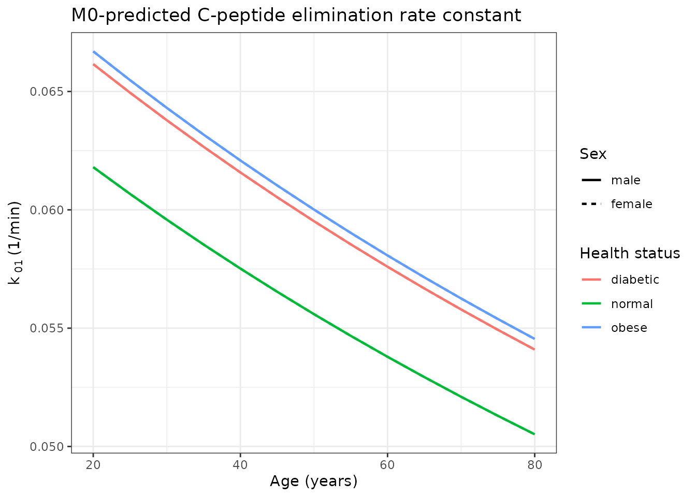
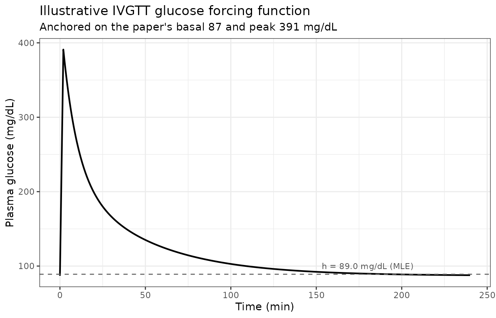
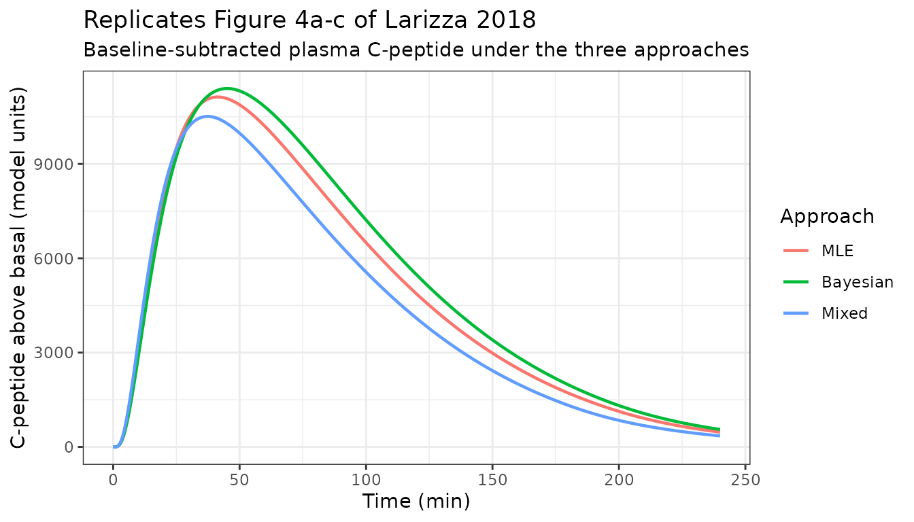
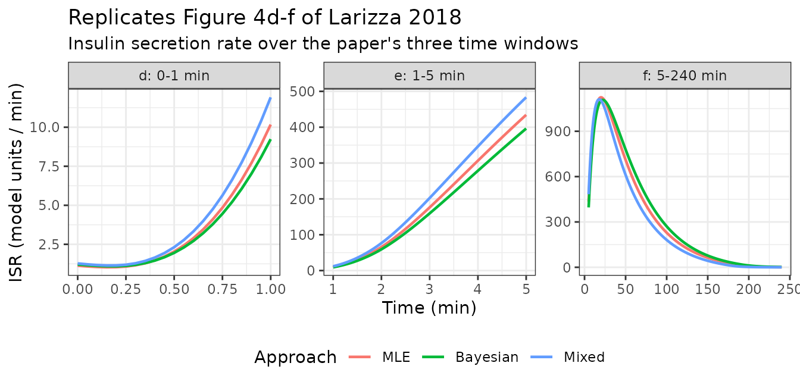

# C-peptide kinetics and insulin secretion after IVGTT (Larizza 2018)

``` r

library(nlmixr2lib)
library(rxode2)
library(dplyr)
library(ggplot2)

rxode2::rxSetSeed(20260923)
```

## The paper

Larizza *et al.* (2018), *CPT Pharmacometrics Syst Pharmacol*
**7**(5):298-308,
[doi:10.1002/psp4.12285](https://doi.org/10.1002/psp4.12285), presents a
WinBUGS plugin for the DDMoRe Interoperability Framework. Its worked
example is a complete, fully parameterised two-model pharmacometric
workflow for assessing beta-cell function from an intravenous glucose
tolerance test (IVGTT), and it is that workflow – not the software –
that this article reproduces.

The workflow has three steps:

1.  Fit a **population regression** that predicts the four macro
    constants of C-peptide two-compartment kinetics (short half-life
    `ts`, amplitude fraction `F`, long half-life `tl`, central volume
    `V`) from health status, sex, body surface area and age, in 207
    subjects.
2.  **Simulate** that regression for a new subject to obtain their
    individual C-peptide micro rate constants `k01`, `k12`, `k21`.
3.  Fit the **insulin minimal model** to that new subject’s IVGTT
    C-peptide and glucose data, with the C-peptide kinetics taken from
    step 2, and read off the insulin secretion rate (ISR) and the
    beta-cell sensitivity indexes.

The paper runs this three times – a maximum-likelihood (MLE) route
through NONMEM/PsN, a full-Bayesian route through WinBUGS, and a mixed
route – which is why step 1 appears twice in the library, once per
variability structure.

## The three models

``` r

# modellib() returns the model function; rxode2() compiles it to the rxUi object
# whose `$theta`, `$state` and `$linCmt` slots the checks below inspect.
m0 <- rxode2::rxode2(modellib("Larizza_2018_cpeptideKinetics_M0"))
m4 <- rxode2::rxode2(modellib("Larizza_2018_cpeptideKinetics_M4"))
mm <- rxode2::rxode2(modellib("Larizza_2018_insulinMinimalModel"))
```

| Model | Role in the workflow | Variability structure |
|----|----|----|
| `Larizza_2018_cpeptideKinetics_M0` | step 1, MLE route (approaches 1 and 3) | additive residual error on each macro constant; no IIV |
| `Larizza_2018_cpeptideKinetics_M4` | step 1, Bayesian route (approach 2) | full 4x4 interindividual covariance matrix; no residual error |
| `Larizza_2018_insulinMinimalModel` | step 3, all three approaches | proportional residual error, CV fixed at 6% |

M0 and M4 are two versions of the same structural regression. With one
observation of each macro constant per subject, a residual error and an
interindividual covariance are not simultaneously identifiable, so the
paper reports them in alternation – which is why Table 1’s `sigma_ADD`
rows are blank in the M4 column and its `xi` rows are blank in the M0
column.

## Population

The regression cohort is the 207-subject biosynthetic-C-peptide dataset
of Van Cauter 1992 / Magni 2000, stratified as normal, obese or diabetic
(type 2), with sex, age and body surface area recorded. Larizza 2018
does not reprint the per-stratum counts or the age and weight ranges.

The insulin minimal model is fitted to a **single subject** who is not
in that cohort: normal health status, male, 25 years old, 1.818 m, 70.7
kg (Larizza 2018 Datasets section, citing Magni 2000 and Shapiro 1988).
That subject’s basal plasma glucose is 87 mg/dL and their peak after the
glucose bolus is 391 mg/dL; those two numbers are not in the main text
but are carried explicitly in the deposited analysis scripts, and they
are what the beta-cell sensitivity index `phi1` is normalised by.

``` r

subject <- list(
  AGE = 25,
  SEXF = 0,
  DIS_OBESE = 0,
  DIS_DIAB = 0,
  height_m = 1.818,
  weight_kg = 70.7,
  glucose_basal_mgdl = 87,
  glucose_peak_mgdl = 391
)

# Larizza 2018 Mathematical Models: BSA = 0.20247 * Height(m)^0.725 * Weight(kg)^0.425
subject$BSA <-
  0.20247 * subject$height_m^0.725 * subject$weight_kg^0.425
subject$BSA
#> [1] 1.907961
```

## Source trace

Every value in the three model files, and where it comes from.

| Quantity | Model | Source |
|:---|:---|:---|
| ts / F / tl / V regression equations | M0, M4 | Mathematical Models, ‘A population regression model to estimate CP kinetic parameters’ |
| BSA = 0.20247 \* Ht^0.725 \* Wt^0.425 | M0, M4 (covariate note) | Mathematical Models, text below the regression equations |
| mtsn 5.000 / mtso 4.554 / mtsd 4.594 min | M0 | Table 1, M0 column |
| mFn 0.764 / mFo 0.782 / mFd 0.780 | M0 | Table 1, M0 column |
| atl 27.797 min, btl 0.177 min/year | M0 | Table 1, M0 column |
| aVm 0.495 L, bVm 1.982 L/m^2 | M0 | Table 1, M0 column |
| aVf 1.520 L, bVf 1.432 L/m^2 | M0 | Table 1, M0 column |
| sigma_ADD 1.143 / 0.041 / 5.778 / 0.846 | M0 | Table 1, M0 column; footnote c (‘SDs of the additive residual errors’) |
| mtsn 4.991 / mtso 4.496 / mtsd 4.693 min | M4 | Table 1, M4 column |
| mFn 0.766 / mFo 0.781 / mFd 0.778 | M4 | Table 1, M4 column |
| atl 26.705 min, btl 0.209 min/year | M4 | Table 1, M4 column |
| aVm 0.344 L, bVm 2.061 L/m^2 | M4 | Table 1, M4 column |
| aVf 0.795 L, bVf 1.819 L/m^2 | M4 | Table 1, M4 column |
| Xi, the 10 elements of the 4x4 covariance | M4 | Table 1, M4 column; footnote b (‘Elements of the full matrix Xi’) |
| theta_0 / Sigma_0 / Wishart(q = 10, R) priors | M4 (model() comment) | Mathematical Models, Bayesian prior specification |
| k12 / k01 / k21 macro-to-micro equations | M0 (comment), MM | Mathematical Models, algebraic equations |
| k01 0.0607, k12 0.0491, k21 0.0503 /min | MM | Table 1, ‘CP-kinetic parameters’ (0.061 / 0.049 / 0.050); 4-digit values from Supporting Information 2, full-bayesian approach.R |
| CP1 / CP2 disposition ODEs | MM | Mathematical Models, ‘Glucose-insulin minimal model’, first subsystem |
| ISR = m\*X; X, Y ODEs; X(0) = x0, Y(0) = 0 | MM | Mathematical Models, second subsystem |
| m 0.817, alpha 0.061, beta 9.790 /min | MM | Table 2, MLE approach column |
| x0 1.384, h 89.002 | MM | Table 2, MLE approach column |
| Residual CV fixed at 6% | MM | Mathematical Models, end of the minimal-model section |
| phi1 = (x0 \* 10^3 / dG_mgdl) \* 18.01; phi2 = beta | MM (comment), this article | Mathematical Models (definition); Supporting Information 2, MLE approach.R and full-bayesian approach.R (computational form) |
| Basal glucose 87 mg/dL, peak 391 mg/dL | this article | Supporting Information 2, full-bayesian approach.R: `phi1 <- ((coda_df$POP_x0*10^3)/(391-87))*18.01` |
| Subject: normal, male, 25 y, 1.818 m, 70.7 kg | MM (population) | Datasets section |

## Step 1 and 2: the C-peptide kinetics regression

### Closed-form check: the new subject’s macro and micro constants

This is the sharpest gate available on the whole workflow. The paper
reports `k01`, `k12` and `k21` for the new subject in Table 1, and those
values are the forward image of the M0 regression evaluated at that
subject’s covariates followed by the macro-to-micro conversion. Nothing
is fitted, nothing is sampled, and nothing depends on a dataset that is
not on disk – so the reproduction must be exact to the printed
precision.

``` r

cov_row <- data.frame(
  id = 1L,
  time = 0,
  cmt = c("thalfShort", "famp", "thalfLong", "vc"),
  evid = 0L,
  DIS_OBESE = subject$DIS_OBESE,
  DIS_DIAB = subject$DIS_DIAB,
  SEXF = subject$SEXF,
  BSA = subject$BSA,
  AGE = subject$AGE
)

m0_typ <- rxode2::rxSolve(rxode2::zeroRe(m0), cov_row, returnType = "data.frame")
#> Warning: No omega parameters in the model
macro <- m0_typ[1, c("thalfShort", "famp", "thalfLong", "vc")]
macro
#>   thalfShort  famp thalfLong       vc
#> 1          5 0.764    32.222 4.276579

# Larizza 2018 Mathematical Models: the macro-to-micro conversion. Kept out of
# model() (see the M0 file) because it is a post-processing step, and because a
# k12 / k21 / vc set inside an ODE-free model() risks rxode2 reading it as a
# solved linear system.
macro_to_micro <- function(ts, famp, tl) {
  k12 <- log(2) * (famp / tl + (1 - famp) / ts)
  k01 <- (log(2) / ts) * (log(2) / tl) * (1 / k12)
  k21 <- log(2) / ts + log(2) / tl - k12 - k01
  c(k01 = k01, k12 = k12, k21 = k21)
}

micro <- macro_to_micro(macro$thalfShort, macro$famp, macro$thalfLong)
micro
#>        k01        k12        k21 
#> 0.06067257 0.04915142 0.05031706
```

| Micro constant | Derived here (1/min) | Larizza 2018 Table 1 (1/min) | Supporting Information 2 (1/min) | Model ini() (1/min) |
|:---|---:|---:|---:|---:|
| k01 | 0.06067 | 0.061 | 0.0607 | 0.0607 |
| k12 | 0.04915 | 0.049 | 0.0491 | 0.0491 |
| k21 | 0.05032 | 0.050 | 0.0503 | 0.0503 |

Reproduces the CP-kinetic-parameters block of Larizza 2018 Table 1.
{.table}

``` r

# The macro constants are exact functions of Table 1's printed fixed effects.
stopifnot(
  abs(macro$thalfShort - 5.000) < 1e-9,
  abs(macro$famp - 0.764) < 1e-9,
  abs(macro$thalfLong - 32.222) < 1e-9
)

# Against the paper's own 3-decimal Table 1 values.
stopifnot(all(abs(micro[c("k01", "k12", "k21")] - c(0.061, 0.049, 0.050)) < 5e-4))
```

The deposited scripts carry a digit more precision (0.0607 / 0.0491 /
0.0503), and that is what the minimal model fixes. Comparing against
those needs a tolerance rather than an equality, because the fixed
effects they were computed from are themselves printed rounded: NONMEM
simulated M0 at its *unrounded* estimates, whereas the conversion above
can only be fed Table 1’s three decimals. Rather than pick a tolerance
by hand, propagate the printed rounding through the conversion and
require the deposited values to lie inside the resulting interval.

``` r

half_ulp <- 5e-4 # Table 1 prints the fixed effects to three decimals

corners <- expand.grid(
  ts = 5.000 + c(-1, 1) * half_ulp,
  famp = 0.764 + c(-1, 1) * half_ulp,
  # tl = atl + btl * 25, so both rounding errors accumulate on the age slope
  tl = 32.222 + c(-1, 1) * (half_ulp + 25 * half_ulp)
)

envelope <- t(apply(corners, 1, function(r) {
  macro_to_micro(r[["ts"]], r[["famp"]], r[["tl"]])
}))

rng <- apply(envelope, 2, range)
rownames(rng) <- c("low", "high")
round(rng, 5)
#>          k01     k12     k21
#> low  0.06058 0.04908 0.05028
#> high 0.06076 0.04922 0.05035

deposited <- c(k01 = 0.0607, k12 = 0.0491, k21 = 0.0503)

stopifnot(
  all(deposited >= rng["low", names(deposited)]),
  all(deposited <= rng["high", names(deposited)]),
  # And the point conversion itself sits inside the same envelope.
  all(micro[names(deposited)] >= rng["low", names(deposited)]),
  all(micro[names(deposited)] <= rng["high", names(deposited)])
)

# Mutation control: a value one printed digit away must fall outside.
stopifnot(!(0.0481 >= rng["low", "k12"] && 0.0481 <= rng["high", "k12"]))
```

The three micro constants the minimal model fixes are therefore not free
numbers: they follow from the M0 regression and the subject’s four
covariates.

### M0 is a regression, not a compartmental model

A guard worth stating explicitly, because both regression models define
a parameter called `vc` and neither is a solved PK system:

``` r

stopifnot(
  is.null(m0$linCmt),
  is.null(m4$linCmt),
  length(m0$state) == 0L,
  length(m4$state) == 0L
)
```

### M4: recovering the published covariance matrix

M4 places all of its stochastic structure in the 4x4 matrix `Xi`.
Simulating a cohort and re-estimating the sample covariance of the four
macro constants must return `Xi`, because the random effects enter
additively on the natural scale.

``` r

n_sub <- 200L

cohort_cov <- data.frame(
  id = seq_len(n_sub),
  DIS_OBESE = 0,
  DIS_DIAB = 0,
  SEXF = 0,
  BSA = subject$BSA,
  AGE = subject$AGE
)

cohort_ev <- merge(
  cohort_cov,
  data.frame(
    time = 0,
    cmt = c("thalfShort", "famp", "thalfLong", "vc"),
    evid = 0L
  )
)

m4_sim <- rxode2::rxSolve(m4, cohort_ev, returnType = "data.frame")

macro_draws <- m4_sim |>
  dplyr::filter(!duplicated(id)) |>
  dplyr::select(thalfShort, famp, thalfLong, vc)

xi_published <- matrix(
  c(
    1.295, 0.006, 3.250, 0.596,
    0.006, 0.002, 0.071, -0.006,
    3.250, 0.071, 33.044, 1.915,
    0.596, -0.006, 1.915, 0.713
  ),
  nrow = 4, byrow = TRUE,
  dimnames = list(
    c("ts", "F", "tl", "V"),
    c("ts", "F", "tl", "V")
  )
)

xi_sim <- stats::cov(as.matrix(macro_draws))
dimnames(xi_sim) <- dimnames(xi_published)
round(xi_sim, 4)
#>        ts       F      tl       V
#> ts 1.4550  0.0046  3.0523  0.6650
#> F  0.0046  0.0021  0.0423 -0.0083
#> tl 3.0523  0.0423 34.4227  1.9137
#> V  0.6650 -0.0083  1.9137  0.7540
```

``` r

# The published matrix must be a valid covariance in the first place.
stopifnot(!inherits(try(chol(xi_published), silent = TRUE), "try-error"))

# Compare on the correlation scale plus the variance ratios, so one comparison
# is not dominated by the 16,000-fold spread in the variances themselves. With
# 200 draws the Monte-Carlo standard error on a correlation is about 0.07, so
# the tolerances below are loose by construction; they catch a transposed or
# mis-ordered Xi, not small sampling noise.
cor_pub <- stats::cov2cor(xi_published)
cor_sim <- stats::cov2cor(xi_sim)
off <- upper.tri(cor_pub)

var_ratio <- diag(xi_sim) / diag(xi_published)

stopifnot(
  max(abs(cor_sim[off] - cor_pub[off])) < 0.25,
  all(var_ratio > 0.6), all(var_ratio < 1.6)
)

# The typical values must be untouched by the random effects.
stopifnot(
  abs(mean(macro_draws$thalfShort) - 4.991) < 0.25,
  abs(mean(macro_draws$famp) - 0.766) < 0.01
)
```

| Pair  | Published correlation | Simulated correlation |
|:------|----------------------:|----------------------:|
| ts-F  |                 0.118 |                 0.083 |
| ts-tl |                 0.497 |                 0.431 |
| ts-V  |                 0.276 |                 0.158 |
| F-tl  |                 0.620 |                 0.635 |
| F-V   |                -0.159 |                -0.209 |
| tl-V  |                 0.395 |                 0.376 |

Correlations implied by Xi (Larizza 2018 Table 1, M4 column) against a
200-subject simulation. {.table}

### What the regression says across the covariate space

Replicates the covariate relationships behind Larizza 2018 Supplementary
Figures S2 and S5 (VPCs of the four macro constants against `hstatus`,
`AGE` and `BSA`).

``` r

grid <- expand.grid(
  AGE = seq(20, 80, by = 5),
  status = c("normal", "obese", "diabetic"),
  SEXF = c(0, 1),
  stringsAsFactors = FALSE
) |>
  dplyr::mutate(
    DIS_OBESE = as.numeric(status == "obese"),
    DIS_DIAB = as.numeric(status == "diabetic"),
    BSA = subject$BSA,
    id = dplyr::row_number()
  )

grid_ev <- merge(
  grid,
  data.frame(time = 0, cmt = c("thalfShort", "famp", "thalfLong", "vc"), evid = 0L)
)

grid_out <- rxode2::rxSolve(rxode2::zeroRe(m0), grid_ev, returnType = "data.frame") |>
  dplyr::filter(!duplicated(id)) |>
  # Join only `status`; AGE and SEXF come back from the solve itself, so joining
  # them again would produce .x / .y suffixes instead of the columns used below.
  dplyr::left_join(dplyr::select(grid, id, status), by = "id") |>
  dplyr::rowwise() |>
  dplyr::mutate(
    k01 = macro_to_micro(thalfShort, famp, thalfLong)[["k01"]]
  ) |>
  dplyr::ungroup()
#> Warning: No omega parameters in the model
#> Warning: multi-subject simulation without without 'omega'

stopifnot(all(c("AGE", "SEXF", "status", "k01") %in% names(grid_out)))

ggplot(
  grid_out,
  aes(AGE, k01, colour = status, linetype = factor(SEXF, labels = c("male", "female")))
) +
  geom_line(linewidth = 0.8) +
  labs(
    x = "Age (years)",
    y = expression(k[" 01"] ~ "(1/min)"),
    colour = "Health status",
    linetype = "Sex",
    title = "M0-predicted C-peptide elimination rate constant"
  ) +
  theme_bw()
```



`k01` does not depend on sex, because sex enters only the volume
regression and the macro-to-micro conversion does not use the volume – a
small structural check that the conversion has been wired up correctly.

## Step 3: the insulin minimal model

### The glucose forcing function

The minimal model takes plasma glucose as an error-free time-varying
regressor; it does not model glucose kinetics. The subject’s actual
glucose series is not on disk, so the profile below is **illustrative**.
It is anchored on the two glucose values that *are* recoverable from the
sources (basal 87 mg/dL, peak 391 mg/dL) and given a conventional
bi-exponential IVGTT return to basal. Every numeric assertion in this
article is chosen to be independent of this choice – see “Assumptions
and deviations”.

The time grid is the one the deposited scripts use for ISR simulation:
`c(seq(0, 10, 0.05), seq(10, 240, 5))`, refined here in the tail so the
figures are smooth.

``` r

tgrid <- sort(unique(c(seq(0, 10, by = 0.05), seq(10, 240, by = 1))))

ivgtt_glucose <- function(t, basal = 87, peak = 391, tpeak = 2,
                          frac_fast = 0.55, k_fast = 0.12, k_slow = 0.022) {
  delta <- peak - basal
  ifelse(
    t < tpeak,
    basal + delta * t / tpeak,
    basal + delta * (frac_fast * exp(-k_fast * (t - tpeak)) +
      (1 - frac_fast) * exp(-k_slow * (t - tpeak)))
  )
}

glucose <- data.frame(time = tgrid, GLU = ivgtt_glucose(tgrid))

ggplot(glucose, aes(time, GLU)) +
  geom_line(linewidth = 0.8) +
  geom_hline(yintercept = 89.002, linetype = "dashed", colour = "grey40") +
  annotate("text", x = 180, y = 100, label = "h = 89.0 mg/dL (MLE)", size = 3, colour = "grey30") +
  labs(
    x = "Time (min)", y = "Plasma glucose (mg/dL)",
    title = "Illustrative IVGTT glucose forcing function",
    subtitle = "Anchored on the paper's basal 87 and peak 391 mg/dL"
  ) +
  theme_bw()
```



### The three approaches

Larizza 2018 Table 2 reports the minimal model under all three
approaches. The library model carries the MLE column; the other two are
one [`ini()`](https://nlmixr2.github.io/rxode2/reference/ini.html) call
away.

``` r

approaches <- list(
  MLE = c(msecr = 0.817, alpha = 0.061, beta = 9.790, x0 = 1.384, gthresh = 89.002),
  Bayesian = c(msecr = 0.820, alpha = 0.051, beta = 10.498, x0 = 1.472, gthresh = 89.097),
  Mixed = c(msecr = 0.907, alpha = 0.074, beta = 8.909, x0 = 1.406, gthresh = 89.859)
)

mm_variant <- function(p) {
  rxode2::ini(
    mm,
    msecr = unname(p[["msecr"]]),
    alpha = unname(p[["alpha"]]),
    beta = unname(p[["beta"]]),
    x0 = unname(p[["x0"]]),
    gthresh = unname(p[["gthresh"]])
  )
}

# Confirm ini() actually took: element assignment into a model's theta is a
# silent no-op in rxode2, so the piped result is checked rather than assumed.
mm_mixed <- mm_variant(approaches$Mixed)
#> ℹ change initial estimate of `msecr` to `0.907`
#> ℹ change initial estimate of `alpha` to `0.074`
#> ℹ change initial estimate of `beta` to `8.909`
#> ℹ change initial estimate of `x0` to `1.406`
#> ℹ change initial estimate of `gthresh` to `89.859`
stopifnot(
  abs(unname(mm_mixed$theta[["msecr"]]) - 0.907) < 1e-12,
  abs(unname(mm_mixed$theta[["gthresh"]]) - 89.859) < 1e-12,
  abs(unname(mm$theta[["msecr"]]) - 0.817) < 1e-12
)
```

``` r

solve_mm <- function(p, glu = glucose) {
  ev <- data.frame(
    id = 1L,
    time = glu$time,
    evid = 0L,
    cmt = "central",
    GLU = glu$GLU
  )
  rxode2::rxSolve(rxode2::zeroRe(mm_variant(p)), ev, returnType = "data.frame")
}

sims <- lapply(names(approaches), function(nm) {
  out <- solve_mm(approaches[[nm]])
  out$approach <- nm
  out
})
#> ℹ change initial estimate of `msecr` to `0.817`
#> ℹ change initial estimate of `alpha` to `0.061`
#> ℹ change initial estimate of `beta` to `9.79`
#> ℹ change initial estimate of `x0` to `1.384`
#> ℹ change initial estimate of `gthresh` to `89.002`
#> Warning: No omega parameters in the model
#> ℹ change initial estimate of `msecr` to `0.82`
#> ℹ change initial estimate of `alpha` to `0.051`
#> ℹ change initial estimate of `beta` to `10.498`
#> ℹ change initial estimate of `x0` to `1.472`
#> ℹ change initial estimate of `gthresh` to `89.097`
#> Warning: No omega parameters in the model
#> ℹ change initial estimate of `msecr` to `0.907`
#> ℹ change initial estimate of `alpha` to `0.074`
#> ℹ change initial estimate of `beta` to `8.909`
#> ℹ change initial estimate of `x0` to `1.406`
#> ℹ change initial estimate of `gthresh` to `89.859`
#> Warning: No omega parameters in the model
sims <- dplyr::bind_rows(sims)
sims$approach <- factor(sims$approach, levels = names(approaches))

stopifnot(!anyNA(sims$Cc), !anyNA(sims$ISR), all(sims$ISR >= 0))
```

### Replicating Figure 4

Larizza 2018 Figure 4 panels a-c show the C-peptide fit under each
approach and panels d-f show the reconstructed ISR over `[0, 1]`,
`[1, 5]` and `[5, 240]` minutes. The three time windows exist because
the first-phase burst and the second-phase provision act on very
different timescales.

``` r

ggplot(sims, aes(time, Cc, colour = approach)) +
  geom_line(linewidth = 0.8) +
  labs(
    x = "Time (min)",
    y = "C-peptide above basal (model units)",
    colour = "Approach",
    title = "Replicates Figure 4a-c of Larizza 2018",
    subtitle = "Baseline-subtracted plasma C-peptide under the three approaches"
  ) +
  theme_bw()
```



``` r

windows <- list(
  "d: 0-1 min" = c(0, 1),
  "e: 1-5 min" = c(1, 5),
  "f: 5-240 min" = c(5, 240)
)

isr_panels <- dplyr::bind_rows(lapply(names(windows), function(w) {
  lo <- windows[[w]][1]
  hi <- windows[[w]][2]
  sims |>
    dplyr::filter(time >= lo, time <= hi) |>
    dplyr::mutate(panel = w)
}))
isr_panels$panel <- factor(isr_panels$panel, levels = names(windows))

ggplot(isr_panels, aes(time, ISR, colour = approach)) +
  geom_line(linewidth = 0.8) +
  facet_wrap(~panel, scales = "free") +
  labs(
    x = "Time (min)", y = "ISR (model units / min)", colour = "Approach",
    title = "Replicates Figure 4d-f of Larizza 2018",
    subtitle = "Insulin secretion rate over the paper's three time windows"
  ) +
  theme_bw() +
  theme(legend.position = "bottom")
```



## Validation

The minimal model’s subject-level dataset is not on disk, so none of the
checks below leans on a simulated magnitude. Each is either a
closed-form identity, a conservation law, or arithmetic on the paper’s
own printed numbers.

### 1. First-phase closed form

Below the glucose threshold the provision factor is never stimulated, so
`Y(t) = 0` for all time and the secretion subsystem collapses to a
single exponential: `X(t) = x0 * exp(-m * t)` and
`ISR(t) = m * x0 * exp(-m * t)`. The total first-phase secretion is then
exactly `x0`, whatever `m` is.

``` r

flat <- data.frame(time = tgrid, GLU = 80) # strictly below every approach's h

first_phase <- solve_mm(approaches$MLE, flat)
#> ℹ change initial estimate of `msecr` to `0.817`
#> ℹ change initial estimate of `alpha` to `0.061`
#> ℹ change initial estimate of `beta` to `9.79`
#> ℹ change initial estimate of `x0` to `1.384`
#> ℹ change initial estimate of `gthresh` to `89.002`
#> Warning: No omega parameters in the model

analytic_x <- approaches$MLE[["x0"]] * exp(-approaches$MLE[["msecr"]] * first_phase$time)

stopifnot(
  # Provision is identically zero, never merely small.
  max(abs(first_phase$provision)) < 1e-10,
  # The beta-cell store follows the analytic exponential.
  max(abs(first_phase$betacell - analytic_x)) < 1e-6,
  # ISR = m * X exactly.
  max(abs(first_phase$ISR - approaches$MLE[["msecr"]] * first_phase$betacell)) < 1e-9
)

# Cumulative first-phase secretion -> x0 as t -> Inf.
released <- approaches$MLE[["x0"]] - utils::tail(first_phase$betacell, 1)
c(released = released, x0 = approaches$MLE[["x0"]])
#> released       x0 
#>    1.384    1.384
stopifnot(abs(released - approaches$MLE[["x0"]]) < 1e-9)
```

A mutation control, so the check above is demonstrably not vacuous:
raising the glucose input above the threshold must break the closed
form.

``` r

stimulated <- solve_mm(approaches$MLE, data.frame(time = tgrid, GLU = 120))
#> ℹ change initial estimate of `msecr` to `0.817`
#> ℹ change initial estimate of `alpha` to `0.061`
#> ℹ change initial estimate of `beta` to `9.79`
#> ℹ change initial estimate of `x0` to `1.384`
#> ℹ change initial estimate of `gthresh` to `89.002`
#> Warning: No omega parameters in the model
stopifnot(max(abs(stimulated$provision)) > 1)
```

### 2. C-peptide mass balance

Everything the beta cells secrete must end up either eliminated through
`k01` or still present in the two C-peptide compartments. Integrating
the flux terms as extra ODE states makes the identity exact to solver
tolerance rather than to trapezoidal-rule error – which matters here,
because ISR has a sharp spike in the first minute that a coarse
trapezoid would badly mis-integrate.

``` r

mm_auc <- mm |>
  rxode2::model({
    d/dt(auc_isr) <- ISR
    d/dt(auc_cp1) <- central
  }, append = TRUE)

ev_mb <- data.frame(
  id = 1L, time = glucose$time, evid = 0L, cmt = "central", GLU = glucose$GLU
)
mb <- rxode2::rxSolve(rxode2::zeroRe(mm_auc), ev_mb, returnType = "data.frame")
#> Warning: No omega parameters in the model

k01_mm <- exp(unname(mm$theta[["lk01"]]))

secreted <- mb$auc_isr
eliminated <- k01_mm * mb$auc_cp1
retained <- mb$central + mb$peripheral1
residual <- secreted - (eliminated + retained)

# Absolute closure, and closure relative to the amount that has moved.
c(
  max_abs_residual = max(abs(residual)),
  max_rel_residual = max(abs(residual[-1]) / secreted[-1])
)
#> max_abs_residual max_rel_residual 
#>     2.619345e-10     3.601195e-15

# Observed closure is around 1e-15 relative, so the bound below leaves seven
# orders of margin while still being far tighter than trapezoidal integration
# of the first-minute ISR spike could ever achieve.
stopifnot(max(abs(residual[-1]) / secreted[-1]) < 1e-8)
```

The same mutation control: a deliberately wrong elimination constant
must break the balance.

``` r

bad <- secreted - (2 * k01_mm * mb$auc_cp1 + retained)
stopifnot(max(abs(bad[-1]) / secreted[-1]) > 0.1)
```

### 3. The threshold switch

`h` is an estimated parameter, so the model must be genuinely inert at
and below it and responsive above it.

``` r

at_threshold <- solve_mm(
  approaches$MLE,
  data.frame(time = tgrid, GLU = approaches$MLE[["gthresh"]])
)
#> ℹ change initial estimate of `msecr` to `0.817`
#> ℹ change initial estimate of `alpha` to `0.061`
#> ℹ change initial estimate of `beta` to `9.79`
#> ℹ change initial estimate of `x0` to `1.384`
#> ℹ change initial estimate of `gthresh` to `89.002`
#> Warning: No omega parameters in the model
just_above <- solve_mm(
  approaches$MLE,
  data.frame(time = tgrid, GLU = approaches$MLE[["gthresh"]] + 10)
)
#> ℹ change initial estimate of `msecr` to `0.817`
#> ℹ change initial estimate of `alpha` to `0.061`
#> ℹ change initial estimate of `beta` to `9.79`
#> ℹ change initial estimate of `x0` to `1.384`
#> ℹ change initial estimate of `gthresh` to `89.002`
#> Warning: No omega parameters in the model

stopifnot(
  max(abs(at_threshold$provision)) < 1e-10,
  # Steady-state provision above threshold is beta * (G - h), reached to machine
  # precision after 240 min, which is ~15 time constants (1/alpha = 16.4 min).
  abs(utils::tail(just_above$provision, 1) - approaches$MLE[["beta"]] * 10) /
    (approaches$MLE[["beta"]] * 10) < 1e-6
)
```

### 4. Beta-cell sensitivity indexes

`phi1` and `phi2` are the paper’s headline read-outs. `phi2` is just
`beta`, so it must reproduce exactly. `phi1` is `x0` divided by the
maximum glucose increment; the main text gives the definition and the
deposited scripts give the computational form, including the `18.01`
g/mol conversion from mg/dL to mmol/L and the `10^3` scaling.

``` r

delta_g_mgdl <- subject$glucose_peak_mgdl - subject$glucose_basal_mgdl
delta_g_mgdl
#> [1] 304

phi1_of <- function(x0) (x0 * 1e3 / delta_g_mgdl) * 18.01

index_table <- tibble::tibble(
  Approach = names(approaches),
  x0 = vapply(approaches, function(p) unname(p[["x0"]]), numeric(1)),
  beta = vapply(approaches, function(p) unname(p[["beta"]]), numeric(1))
) |>
  dplyr::mutate(
    `phi1 (derived)` = round(phi1_of(x0), 3),
    `phi1 (Table 2)` = c(81.966, 87.177, 83.314),
    `phi2 (derived)` = beta,
    `phi2 (Table 2)` = c(9.790, 10.498, 8.909)
  ) |>
  dplyr::select(Approach, x0, `phi1 (derived)`, `phi1 (Table 2)`, `phi2 (derived)`, `phi2 (Table 2)`)

knitr::kable(index_table, caption = "Reproduces the u1 and u2 rows of Larizza 2018 Table 2.")
```

| Approach |    x0 | phi1 (derived) | phi1 (Table 2) | phi2 (derived) | phi2 (Table 2) |
|:---------|------:|---------------:|---------------:|---------------:|---------------:|
| MLE      | 1.384 |         81.993 |         81.966 |          9.790 |          9.790 |
| Bayesian | 1.472 |         87.206 |         87.177 |         10.498 |         10.498 |
| Mixed    | 1.406 |         83.296 |         83.314 |          8.909 |          8.909 |

Reproduces the u1 and u2 rows of Larizza 2018 Table 2. {.table}

``` r

stopifnot(
  # phi2 = beta is an identity and must be exact.
  all(index_table$`phi2 (derived)` == index_table$`phi2 (Table 2)`),
  # phi1 is reconstructed from x0 rounded to 3 decimals in Table 2, so the
  # residual is pure print-rounding: 0.001 pmol/L of x0 moves phi1 by 0.06.
  max(abs(index_table$`phi1 (derived)` - index_table$`phi1 (Table 2)`)) < 0.1
)

# phi2 is also emitted by the model itself.
stopifnot(
  all(abs(
    tapply(sims$phi2, sims$approach, function(x) x[1]) -
      c(9.790, 10.498, 8.909)
  ) < 1e-9)
)
```

That all three approaches reproduce `phi1` with the *same* glucose
increment is itself the evidence that `391 - 87` is the subject’s real
`deltaG`: a single constant, recovered from the deposited code,
reconciles three independently estimated `x0` values with three
independently printed `phi1` values.

### 5. Reproducing Table 2

| Parameter     |    MLE | Bayesian |  Mixed | %RSE (Bayesian) | %RSE (Mixed) |
|:--------------|-------:|---------:|-------:|----------------:|-------------:|
| m (1/min)     |  0.817 |    0.820 |  0.907 |          31.343 |       25.731 |
| alpha (1/min) |  0.061 |    0.051 |  0.074 |          11.863 |        7.149 |
| beta          |  9.790 |   10.498 |  8.909 |          12.254 |        3.139 |
| x0            |  1.384 |    1.472 |  1.406 |           8.212 |        3.220 |
| h (mg/dL)     | 89.002 |   89.097 | 89.859 |           2.313 |        2.112 |
| phi1          | 81.966 |   87.177 | 83.314 |              NA |           NA |
| phi2          |  9.790 |   10.498 |  8.909 |              NA |           NA |

Larizza 2018 Table 2. No %RSE is reported for the MLE column because the
NONMEM covariance step did not complete (Table 2 footnote a). {.table}

The paper’s own reading of this table is that the three approaches agree
on the central tendency while the propagated uncertainty grows from the
mixed approach to the full-Bayesian approach, as expected when the
C-peptide kinetics stop being treated as known constants. The %RSE
columns above show exactly that for every parameter except `m`.

## Assumptions and deviations

**The glucose forcing function is illustrative.** The subject’s measured
glucose series is not reprinted in the paper and is not in the deposited
supplement. The profile used here reproduces the two glucose values that
*are* recoverable (basal 87 mg/dL, peak 391 mg/dL) and otherwise assumes
a conventional bi-exponential IVGTT return to basal. Consequently every
numeric assertion in the Validation section is either a closed-form
identity, a conservation law, or arithmetic on printed parameter values
– none of them depends on the shape chosen. Users with their own IVGTT
data should supply `GLU` in mg/dL and ignore the profile above.

**Glucose units.** Larizza 2018 labels the threshold `h` and the glucose
input `G(t)` as `pmol/l` in the Mathematical Models section and in Table
2. That is a label slip: glucose is not reported in pmol/L, and an
estimated `h` of 89 would be meaningless on that scale. The deposited
analysis scripts settle it –
`phi1 <- ((coda_df$POP_x0*10^3)/(391-87))*18.01` uses the subject’s peak
and basal glucose in mg/dL and the 18.01 g/mol molar mass of glucose.
The model therefore takes `GLU` in **mg/dL**, and the estimated `h`
values of 89.0 to 89.9 mg/dL sit just above the subject’s basal 87
mg/dL, exactly as the informative prior (“mean equal to the basal
glucose level, CV 3%”) intends.

**The absolute C-peptide scale is not recoverable.** Two constraints in
the sources point in different directions, and neither can be settled
without the subject’s dataset or the `M2004.mdl` model file (Supporting
Information 1 contains only the plugin’s UseCase examples, not the two
case-study models – the DDMoRe Model Repository entries
`DDMODEL00000110` and `DDMODEL00000111` the paper cites are no longer
reachable). The `10^3` factor in the `phi1` formula implies a
first-phase store of `x0 * 10^3` on the conventional Toffolo/Cobelli
index scale, i.e. `X(0) = 1384` rather than `1.384` in pmol/L; but
`beta`’s magnitude against a glucose axis in mg/dL implies a different
scaling again. What *is* fully determined is the ODE structure, every
parameter value, the glucose units, and both index formulas – so the
model is encoded exactly as published and the validation is done on
scale-independent quantities. The simulated C-peptide and ISR figures
are labelled “model units” for this reason. Anyone matching this model
against measured C-peptide should calibrate the scale against their own
assay rather than assume pmol/L.

**C-peptide states are deviations from basal.** Larizza 2018 defines
`ISR(t)` as “the insulin (and therefore CP) secretion rate expressed as
deviation from the basal and normalized by the volume of compartment 1”.
The `central` and `peripheral1` states therefore carry
baseline-subtracted concentrations and both start at zero. Observations
fitted against this model must be baseline-subtracted. Because `ISR` is
already volume-normalised, the central volume `V` that M0 and M4 predict
does not appear in the minimal model at all; it is carried in the
regression models for completeness and because the source estimates it.

**M4 has no residual error.** Larizza 2018 Table 1 leaves the
`sigma_ADD` rows blank in the M4 column: all of M4’s stochastic
structure lives in `Xi`, which is what makes an individual’s macro
constants differ from the regression prediction. nlmixr2 requires an
error model per endpoint, so the four additive residuals in
`Larizza_2018_cpeptideKinetics_M4` are pinned with `fixed(0)` rather
than invented. Simulated observations from that model are therefore
exactly `theta_i + gamma_i`, the quantity M4 models. The reverse holds
for M0, which estimates the four residual SDs and no `Xi`.

**Natural-scale parameterisation of the regressions.** M0 and M4 are
additive-normal regressions on the original scale, not log-normal
models, so their typical values and random effects are carried on the
natural scale rather than log-transformed. Log-transforming them would
misstate the structure the random effects sit on and would make `Xi`
uninterpretable against Table 1.

**Micro-constant precision.** Table 1 prints the new subject’s `k01`,
`k12` and `k21` to three decimals (0.061 / 0.049 / 0.050). The minimal
model fixes the four-significant-digit values 0.0607 / 0.0491 / 0.0503
that the deposited `full-bayesian approach.R` carries as its NONMEM
reference values, because the M0 forward conversion reproduces those to
five decimals (see the closed-form check above) and the extra digit is
therefore sourced, not invented.

**`m` and `h` are renamed.** The paper’s single-character symbols `m`
and `h` are spelled `msecr` and `gthresh` in the model file.
Single-character model variables are collision-prone in rxode2 and R,
and the longer names carry the role. Every other symbol (`alpha`,
`beta`, `x0`, `k01`, `k12`, `k21`) keeps the paper’s spelling.

**Prior specification is documentation, not structure.** M4’s
normal/Wishart priors and the minimal model’s normal priors govern the
paper’s Bayesian estimation, not its simulation behaviour, so they are
recorded as comments in
[`model()`](https://nlmixr2.github.io/rxode2/reference/model.html)
rather than encoded in
[`ini()`](https://nlmixr2.github.io/rxode2/reference/ini.html).

## Session information

    #> R version 4.6.1 (2026-06-24)
    #> Platform: x86_64-pc-linux-gnu
    #> Running under: Ubuntu 24.04.5 LTS
    #> 
    #> Matrix products: default
    #> BLAS:   /usr/lib/x86_64-linux-gnu/openblas-pthread/libblas.so.3 
    #> LAPACK: /usr/lib/x86_64-linux-gnu/openblas-pthread/libopenblasp-r0.3.26.so;  LAPACK version 3.12.0
    #> 
    #> locale:
    #>  [1] LC_CTYPE=C.UTF-8       LC_NUMERIC=C           LC_TIME=C.UTF-8       
    #>  [4] LC_COLLATE=C.UTF-8     LC_MONETARY=C.UTF-8    LC_MESSAGES=C.UTF-8   
    #>  [7] LC_PAPER=C.UTF-8       LC_NAME=C              LC_ADDRESS=C          
    #> [10] LC_TELEPHONE=C         LC_MEASUREMENT=C.UTF-8 LC_IDENTIFICATION=C   
    #> 
    #> time zone: UTC
    #> tzcode source: system (glibc)
    #> 
    #> attached base packages:
    #> [1] stats     graphics  grDevices utils     datasets  methods   base     
    #> 
    #> other attached packages:
    #> [1] ggplot2_4.0.3         dplyr_1.2.1           rxode2_5.1.8         
    #> [4] nlmixr2lib_0.3.2.9000
    #> 
    #> loaded via a namespace (and not attached):
    #>  [1] generics_0.1.4      sass_0.4.10         xml2_1.6.0         
    #>  [4] digest_0.6.39       magrittr_2.0.5      RColorBrewer_1.1-3 
    #>  [7] evaluate_1.0.5      grid_4.6.1          fastmap_1.2.0      
    #> [10] lotri_1.0.5         jsonlite_2.0.0      whisker_0.4.1      
    #> [13] rxode2ll_2.0.18     backports_1.5.1     purrr_1.2.2        
    #> [16] scales_1.4.0        textshaping_1.0.5   jquerylib_0.1.4    
    #> [19] cli_3.6.6           crayon_1.5.3        symengine_0.2.13   
    #> [22] rlang_1.3.0         withr_3.0.3         cachem_1.1.0       
    #> [25] yaml_2.3.12         otel_0.2.0          tools_4.6.1        
    #> [28] parallel_4.6.1      memoise_2.0.1       checkmate_2.3.4    
    #> [31] rxode2lincmt_0.1.0  vctrs_0.7.3         R6_2.6.1           
    #> [34] lifecycle_1.0.5     fs_2.1.0            ragg_1.5.2         
    #> [37] PreciseSums_0.7     fontawesome_0.5.3   pkgconfig_2.0.3    
    #> [40] desc_1.4.3          rex_1.2.2           pkgdown_2.2.1      
    #> [43] pillar_1.11.1       bslib_0.12.0        gtable_0.3.6       
    #> [46] glue_1.8.1          data.table_1.18.6.1 Rcpp_1.1.2         
    #> [49] systemfonts_1.3.2   tidyselect_1.2.1    xfun_0.61          
    #> [52] tibble_3.3.1        sys_3.4.3           knitr_1.52         
    #> [55] farver_2.1.2        dparser_1.3.1-13    htmltools_0.5.9    
    #> [58] labeling_0.4.3      rmarkdown_2.32      compiler_4.6.1     
    #> [61] S7_0.2.2            downlit_0.4.5       askpass_1.2.1      
    #> [64] openssl_2.4.2
