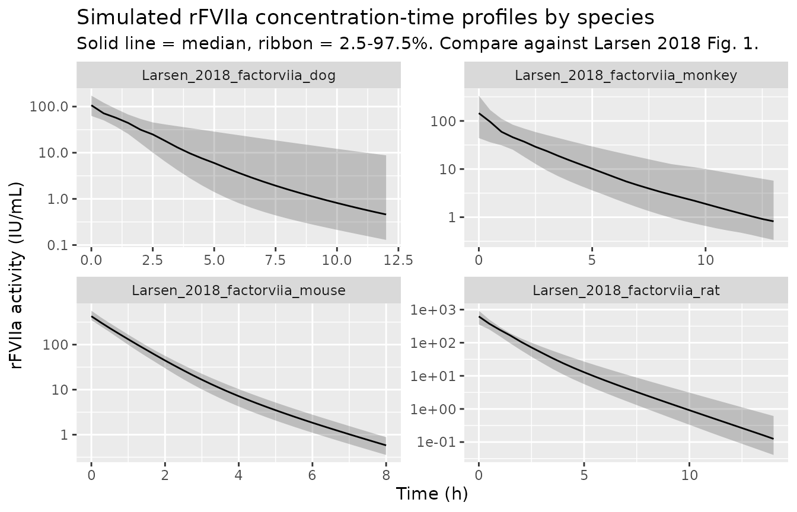
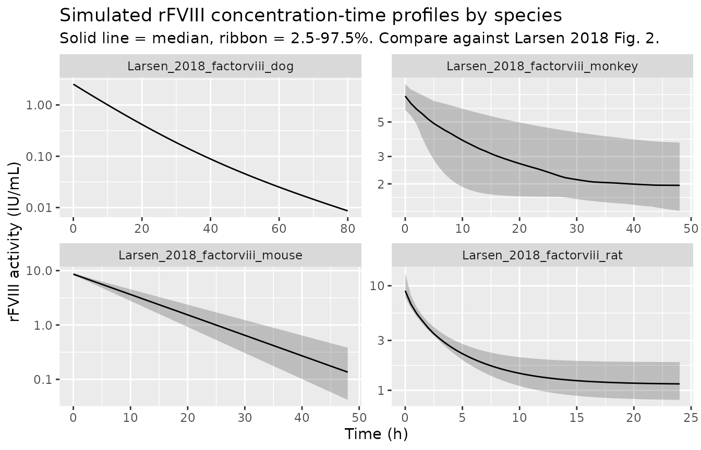
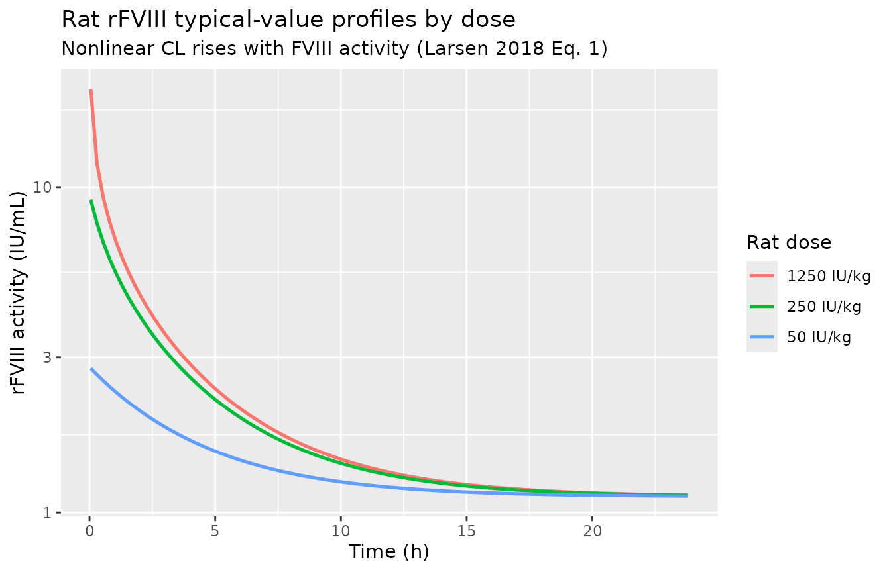

# Preclinical rFVIIa + rFVIII animal popPK (Larsen 2018)

## Paper

Larsen MS, Juul RV, Groth AV, Simonsson USH, Kristensen AT, Knudsen T,
Agerso H, Kreilgaard M. (2018). Prediction of human pharmacokinetics of
activated recombinant factor VII and B-domain truncated factor VIII from
animal population pharmacokinetic models of haemophilia. *European
Journal of Pharmaceutical Sciences* 119, 265-273.
[doi:10.1016/j.ejps.2018.01.035](https://doi.org/10.1016/j.ejps.2018.01.035)
(PMID: 29369801)

The paper develops eight species-specific population PK models – one for
each of the two coagulation factors (activated recombinant factor VII,
rFVIIa; and B-domain truncated recombinant factor VIII, rFVIII) times
each of four preclinical species (mouse, rat, cynomolgus monkey, beagle
/ haemophilia A dog). Human plasma concentration-time data from Bysted
et al. 2007 (rFVIIa) and Jimenez-Yuste et al. 2015 (rFVIII) were used
**only for external validation** of the animal-scaled predictions; no
new human popPK model is developed in Larsen 2018 and none is packaged
here.

Each of the eight models is packaged separately (following the
“replicate the author’s structure” default – the models were genuinely
independent fits), and this vignette walks the paper as a whole.

## Models

``` r

larsen_stems <- c(
  "Larsen_2018_factorviia_mouse",  "Larsen_2018_factorviia_rat",
  "Larsen_2018_factorviia_monkey", "Larsen_2018_factorviia_dog",
  "Larsen_2018_factorviii_mouse",  "Larsen_2018_factorviii_rat",
  "Larsen_2018_factorviii_monkey", "Larsen_2018_factorviii_dog"
)

meta <- lapply(larsen_stems, function(stem) {
  fn <- readModelDb(stem)
  m  <- fn()
  data.frame(
    model         = stem,
    species       = m$population$species,
    n_subjects    = m$population$n_subjects %||% NA_integer_,
    weight_median = m$population$weight_median %||% NA_character_,
    stringsAsFactors = FALSE
  )
})
meta <- do.call(rbind, meta)
knitr::kable(meta, caption = "The eight species-specific popPK models packaged from Larsen 2018.")
```

| model | species | n_subjects | weight_median |
|:---|:---|---:|:---|
| Larsen_2018_factorviia_mouse | mouse (C57BI/6 and NMRI, pooled) | 51 | 0.026 kg |
| Larsen_2018_factorviia_rat | rat (Sprague-Dawley) | 37 | 0.24 kg |
| Larsen_2018_factorviia_monkey | monkey (cynomolgus) | 27 | 2.78 kg |
| Larsen_2018_factorviia_dog | beagle dog | 10 | 12.8 kg |
| Larsen_2018_factorviii_mouse | mouse (FVIII knockout) | 132 | 0.021 kg |
| Larsen_2018_factorviii_rat | rat (Sprague-Dawley) | 60 | 0.32 kg |
| Larsen_2018_factorviii_monkey | monkey (cynomolgus) | 35 | 2.96 kg |
| Larsen_2018_factorviii_dog | dog (haemophilia A) | 3 | 19.55 kg |

The eight species-specific popPK models packaged from Larsen 2018.
{.table style="width:100%;"}

## Population

The Larsen 2018 preclinical cohort spans 51 mice + 37 rats + 27
monkeys + 10 beagle dogs (rFVIIa arm; Table 1) and 132 mice + 60 rats +
35 monkeys + 3 haemophilia A dogs (rFVIII arm; Table 1). Data originate
from 33 studies – historical unpublished in-house Novo Nordisk
experiments plus the published studies by Karpf et al. 2011
(glycopegylated rFVIIa variants), Agerso et al. 2011b (rFVIIa in dogs),
Elm et al. 2012 (rFVIII in mice), Stennicke et al. 2013 (N8-GP rFVIII in
haemophilic mice), and Agerso et al. 2012 (rFVIII in dogs).

All animal experiments used single IV bolus administration. Doses are
reported in mass units (ug/kg for rFVIIa; IU/kg for rFVIII); the
packaged models take input in activity units (IU for both), so a user
simulating rFVIIa must convert dose-mass to activity using the
product-specific specific activity.

Human validation cohorts (Bysted 2007 rFVIIa, Jimenez-Yuste 2015 rFVIII)
are outside the scope of the packaged animal models.

## Source trace

``` r

source_trace <- tibble::tribble(
  ~equation_or_parameter,                      ~value,                        ~source_location,
  # rFVIIa mouse ---------------------------------------------------------------
  "rFVIIa mouse V",                            "2.72 mL",                     "Larsen 2018 Table 2, Mouse column",
  "rFVIIa mouse CL",                           "3.2 mL/h",                    "Larsen 2018 Table 2, Mouse column",
  "rFVIIa mouse V2",                           "0.384 mL",                    "Larsen 2018 Table 2, Mouse column",
  "rFVIIa mouse Q",                            "0.244 mL/h",                  "Larsen 2018 Table 2, Mouse column",
  "rFVIIa mouse Cov V,C57BI/6",                "0.588",                       "Larsen 2018 Table 2, Mouse column footnote",
  "rFVIIa mouse Cov CL,C57BI/6",               "0.87",                        "Larsen 2018 Table 2, Mouse column footnote",
  "rFVIIa mouse IIV on CL",                    "7.4% CV",                     "Larsen 2018 Table 2, Mouse column",
  "rFVIIa mouse residual",                     "0.131",                       "Larsen 2018 Table 2, Mouse column",
  # rFVIIa rat ----------------------------------------------------------------
  "rFVIIa rat V",                              "18.6 mL",                     "Larsen 2018 Table 2, Rat column",
  "rFVIIa rat CL",                             "16.5 mL/h",                   "Larsen 2018 Table 2, Rat column",
  "rFVIIa rat V2",                             "2.68 mL",                     "Larsen 2018 Table 2, Rat column",
  "rFVIIa rat Q",                              "1.63 mL/h",                   "Larsen 2018 Table 2, Rat column",
  "rFVIIa rat IIV on V",                       "16.3% CV",                    "Larsen 2018 Table 2, Rat column",
  "rFVIIa rat IIV on CL",                      "14.6% CV",                    "Larsen 2018 Table 2, Rat column",
  "rFVIIa rat residual",                       "0.161",                       "Larsen 2018 Table 2, Rat column",
  # rFVIIa monkey ------------------------------------------------------------
  "rFVIIa monkey V",                           "229 mL",                      "Larsen 2018 Table 2, Monkey column",
  "rFVIIa monkey CL",                          "148 mL/h",                    "Larsen 2018 Table 2, Monkey column",
  "rFVIIa monkey V2",                          "62.1 mL",                     "Larsen 2018 Table 2, Monkey column",
  "rFVIIa monkey Q",                           "42.3 mL/h",                   "Larsen 2018 Table 2, Monkey column",
  "rFVIIa monkey Base FVIIa",                  "0.287 IU/mL",                 "Larsen 2018 Table 2, Monkey column",
  "rFVIIa monkey IIV on V",                    "54.7% CV",                    "Larsen 2018 Table 2, Monkey column",
  "rFVIIa monkey IIV on CL",                   "35.1% CV",                    "Larsen 2018 Table 2, Monkey column",
  "rFVIIa monkey IIV on Base FVIIa",           "42.8% CV",                    "Larsen 2018 Table 2, Monkey column",
  "rFVIIa monkey residual",                    "0.0343",                      "Larsen 2018 Table 2, Monkey column",
  # rFVIIa dog ---------------------------------------------------------------
  "rFVIIa dog V",                              "1300 mL",                     "Larsen 2018 Table 2, Dog column",
  "rFVIIa dog CL",                             "761 mL/h",                    "Larsen 2018 Table 2, Dog column",
  "rFVIIa dog V2",                             "200 mL",                      "Larsen 2018 Table 2, Dog column",
  "rFVIIa dog Q",                              "55.6 mL/h",                   "Larsen 2018 Table 2, Dog column",
  "rFVIIa dog IIV on V",                       "25.8% CV",                    "Larsen 2018 Table 2, Dog column",
  "rFVIIa dog IIV on CL",                      "34.7% CV",                    "Larsen 2018 Table 2, Dog column",
  "rFVIIa dog residual",                       "0.0236",                      "Larsen 2018 Table 2, Dog column",
  # rFVIII mouse -------------------------------------------------------------
  "rFVIII mouse V",                            "0.716 mL",                    "Larsen 2018 Table 3, Mouse column",
  "rFVIII mouse CL",                           "0.0639 mL/h",                 "Larsen 2018 Table 3, Mouse column",
  "rFVIII mouse Cov CL,Female",                "1.24",                        "Larsen 2018 Table 3, Mouse column footnote",
  "rFVIII mouse IIV on CL",                    "19% CV",                      "Larsen 2018 Table 3, Mouse column",
  "rFVIII mouse residual",                     "0.231",                       "Larsen 2018 Table 3, Mouse column",
  # rFVIII rat --------------------------------------------------------------
  "rFVIII rat V",                              "9.52 mL",                     "Larsen 2018 Table 3, Rat column",
  "rFVIII rat CL0",                            "1.89 mL/h",                   "Larsen 2018 Table 3, Rat column",
  "rFVIII rat Base FVIII",                     "1.12 IU/mL",                  "Larsen 2018 Table 3, Rat column",
  "rFVIII rat beta (nonlinear CL slope)",      "0.162 mL/IU",                 "Larsen 2018 Table 3, Rat column (Eq. 1)",
  "rFVIII rat Cov CL,Female",                  "1.39",                        "Larsen 2018 Table 3, Rat column footnote",
  "rFVIII rat IIV on Base FVIII",              "24.2% CV",                    "Larsen 2018 Table 3, Rat column",
  "rFVIII rat residual",                       "0.305",                       "Larsen 2018 Table 3, Rat column",
  # rFVIII monkey ----------------------------------------------------------
  "rFVIII monkey V",                           "145 mL",                      "Larsen 2018 Table 3, Monkey column",
  "rFVIII monkey CL0",                         "13.1 mL/h",                   "Larsen 2018 Table 3, Monkey column",
  "rFVIII monkey Base FVIII",                  "1.75 IU/mL",                  "Larsen 2018 Table 3, Monkey column",
  "rFVIII monkey beta (nonlinear CL slope)",   "0.0355 mL/IU",                "Larsen 2018 Table 3, Monkey column (Eq. 1)",
  "rFVIII monkey IIV on CL",                   "55% CV",                      "Larsen 2018 Table 3, Monkey column",
  "rFVIII monkey IIV on Base FVIII",           "39.5% CV",                    "Larsen 2018 Table 3, Monkey column",
  "rFVIII monkey residual",                    "0.229",                       "Larsen 2018 Table 3, Monkey column",
  # rFVIII dog -------------------------------------------------------------
  "rFVIII dog V",                              "765 mL",                      "Larsen 2018 Table 3, Dog column",
  "rFVIII dog CL",                             "67.7 mL/h",                   "Larsen 2018 Table 3, Dog column",
  "rFVIII dog V2",                             "92.4 mL",                     "Larsen 2018 Table 3, Dog column",
  "rFVIII dog Q",                              "4.92 mL/h",                   "Larsen 2018 Table 3, Dog column",
  "rFVIII dog residual",                       "0.209",                       "Larsen 2018 Table 3, Dog column",
  # Structural equations --------------------------------------------------
  "Allometric scaling (V, V2)",                "exponent 1",                  "Larsen 2018 Eq. 2 (scaling principle I)",
  "Allometric scaling (CL, Q)",                "exponent 0.75",               "Larsen 2018 Eq. 2 (scaling principle I)",
  "Nonlinear CL",                              "CL = CL0 * exp(beta * C)",    "Larsen 2018 Eq. 1 (rat + monkey rFVIII)",
  "Two-compartment ODE (rFVIIa)",              "central + peripheral1",        "Larsen 2018 Sec 2.4",
  "One-compartment ODE (rFVIII mouse/rat/monkey)", "central only",            "Larsen 2018 Sec 3.1",
  "Two-compartment ODE (rFVIII dog)",          "central + peripheral1",        "Larsen 2018 Sec 3.1"
)
knitr::kable(source_trace, caption = "Source-trace: every parameter and structural equation, with its location in Larsen 2018.")
```

| equation_or_parameter | value | source_location |
|:---|:---|:---|
| rFVIIa mouse V | 2.72 mL | Larsen 2018 Table 2, Mouse column |
| rFVIIa mouse CL | 3.2 mL/h | Larsen 2018 Table 2, Mouse column |
| rFVIIa mouse V2 | 0.384 mL | Larsen 2018 Table 2, Mouse column |
| rFVIIa mouse Q | 0.244 mL/h | Larsen 2018 Table 2, Mouse column |
| rFVIIa mouse Cov V,C57BI/6 | 0.588 | Larsen 2018 Table 2, Mouse column footnote |
| rFVIIa mouse Cov CL,C57BI/6 | 0.87 | Larsen 2018 Table 2, Mouse column footnote |
| rFVIIa mouse IIV on CL | 7.4% CV | Larsen 2018 Table 2, Mouse column |
| rFVIIa mouse residual | 0.131 | Larsen 2018 Table 2, Mouse column |
| rFVIIa rat V | 18.6 mL | Larsen 2018 Table 2, Rat column |
| rFVIIa rat CL | 16.5 mL/h | Larsen 2018 Table 2, Rat column |
| rFVIIa rat V2 | 2.68 mL | Larsen 2018 Table 2, Rat column |
| rFVIIa rat Q | 1.63 mL/h | Larsen 2018 Table 2, Rat column |
| rFVIIa rat IIV on V | 16.3% CV | Larsen 2018 Table 2, Rat column |
| rFVIIa rat IIV on CL | 14.6% CV | Larsen 2018 Table 2, Rat column |
| rFVIIa rat residual | 0.161 | Larsen 2018 Table 2, Rat column |
| rFVIIa monkey V | 229 mL | Larsen 2018 Table 2, Monkey column |
| rFVIIa monkey CL | 148 mL/h | Larsen 2018 Table 2, Monkey column |
| rFVIIa monkey V2 | 62.1 mL | Larsen 2018 Table 2, Monkey column |
| rFVIIa monkey Q | 42.3 mL/h | Larsen 2018 Table 2, Monkey column |
| rFVIIa monkey Base FVIIa | 0.287 IU/mL | Larsen 2018 Table 2, Monkey column |
| rFVIIa monkey IIV on V | 54.7% CV | Larsen 2018 Table 2, Monkey column |
| rFVIIa monkey IIV on CL | 35.1% CV | Larsen 2018 Table 2, Monkey column |
| rFVIIa monkey IIV on Base FVIIa | 42.8% CV | Larsen 2018 Table 2, Monkey column |
| rFVIIa monkey residual | 0.0343 | Larsen 2018 Table 2, Monkey column |
| rFVIIa dog V | 1300 mL | Larsen 2018 Table 2, Dog column |
| rFVIIa dog CL | 761 mL/h | Larsen 2018 Table 2, Dog column |
| rFVIIa dog V2 | 200 mL | Larsen 2018 Table 2, Dog column |
| rFVIIa dog Q | 55.6 mL/h | Larsen 2018 Table 2, Dog column |
| rFVIIa dog IIV on V | 25.8% CV | Larsen 2018 Table 2, Dog column |
| rFVIIa dog IIV on CL | 34.7% CV | Larsen 2018 Table 2, Dog column |
| rFVIIa dog residual | 0.0236 | Larsen 2018 Table 2, Dog column |
| rFVIII mouse V | 0.716 mL | Larsen 2018 Table 3, Mouse column |
| rFVIII mouse CL | 0.0639 mL/h | Larsen 2018 Table 3, Mouse column |
| rFVIII mouse Cov CL,Female | 1.24 | Larsen 2018 Table 3, Mouse column footnote |
| rFVIII mouse IIV on CL | 19% CV | Larsen 2018 Table 3, Mouse column |
| rFVIII mouse residual | 0.231 | Larsen 2018 Table 3, Mouse column |
| rFVIII rat V | 9.52 mL | Larsen 2018 Table 3, Rat column |
| rFVIII rat CL0 | 1.89 mL/h | Larsen 2018 Table 3, Rat column |
| rFVIII rat Base FVIII | 1.12 IU/mL | Larsen 2018 Table 3, Rat column |
| rFVIII rat beta (nonlinear CL slope) | 0.162 mL/IU | Larsen 2018 Table 3, Rat column (Eq. 1) |
| rFVIII rat Cov CL,Female | 1.39 | Larsen 2018 Table 3, Rat column footnote |
| rFVIII rat IIV on Base FVIII | 24.2% CV | Larsen 2018 Table 3, Rat column |
| rFVIII rat residual | 0.305 | Larsen 2018 Table 3, Rat column |
| rFVIII monkey V | 145 mL | Larsen 2018 Table 3, Monkey column |
| rFVIII monkey CL0 | 13.1 mL/h | Larsen 2018 Table 3, Monkey column |
| rFVIII monkey Base FVIII | 1.75 IU/mL | Larsen 2018 Table 3, Monkey column |
| rFVIII monkey beta (nonlinear CL slope) | 0.0355 mL/IU | Larsen 2018 Table 3, Monkey column (Eq. 1) |
| rFVIII monkey IIV on CL | 55% CV | Larsen 2018 Table 3, Monkey column |
| rFVIII monkey IIV on Base FVIII | 39.5% CV | Larsen 2018 Table 3, Monkey column |
| rFVIII monkey residual | 0.229 | Larsen 2018 Table 3, Monkey column |
| rFVIII dog V | 765 mL | Larsen 2018 Table 3, Dog column |
| rFVIII dog CL | 67.7 mL/h | Larsen 2018 Table 3, Dog column |
| rFVIII dog V2 | 92.4 mL | Larsen 2018 Table 3, Dog column |
| rFVIII dog Q | 4.92 mL/h | Larsen 2018 Table 3, Dog column |
| rFVIII dog residual | 0.209 | Larsen 2018 Table 3, Dog column |
| Allometric scaling (V, V2) | exponent 1 | Larsen 2018 Eq. 2 (scaling principle I) |
| Allometric scaling (CL, Q) | exponent 0.75 | Larsen 2018 Eq. 2 (scaling principle I) |
| Nonlinear CL | CL = CL0 \* exp(beta \* C) | Larsen 2018 Eq. 1 (rat + monkey rFVIII) |
| Two-compartment ODE (rFVIIa) | central + peripheral1 | Larsen 2018 Sec 2.4 |
| One-compartment ODE (rFVIII mouse/rat/monkey) | central only | Larsen 2018 Sec 3.1 |
| Two-compartment ODE (rFVIII dog) | central + peripheral1 | Larsen 2018 Sec 3.1 |

Source-trace: every parameter and structural equation, with its location
in Larsen 2018. {.table}

## Virtual cohort and simulation

We simulate a small virtual cohort per species-drug combination (n = 30
per arm; well under the 200-per-arm cap). Weights are drawn uniformly
within each species range from Table 1. Doses use one representative
level from Table 1.

``` r

set.seed(2018)

sim_species <- function(stem, dose_IU, obs_grid, n = 30L, id_offset = 0L,
                        strain = 0L, sexf = 0L, wt_range = c(0.02, 0.03)) {
  mod  <- readModelDb(stem)
  fn   <- mod
  m    <- fn()

  wt <- runif(n, wt_range[1], wt_range[2])
  # Dose events: one row per subject.
  dose_rows <- tibble(
    id            = id_offset + seq_len(n),
    time          = 0,
    evid          = 1L,
    amt           = dose_IU,
    cmt           = "central",
    WT            = wt,
    SEXF          = sexf,
    STRAIN_C57BI6 = strain,
    label         = stem
  )
  obs_rows <- tidyr::crossing(
    id   = id_offset + seq_len(n),
    time = obs_grid
  ) |>
    mutate(evid = 0L, amt = 0, cmt = "central") |>
    left_join(dose_rows |> select(id, WT, SEXF, STRAIN_C57BI6, label), by = "id")
  events <- bind_rows(dose_rows, obs_rows) |>
    arrange(id, time, desc(evid))
  stopifnot(!anyDuplicated(events[, c("id", "time", "evid")]))
  sim <- rxode2::rxSolve(m, events = events,
                         keep = c("WT", "SEXF", "STRAIN_C57BI6", "label"))
  as.data.frame(sim)
}
```

### rFVIIa: four-species simulation

Doses (typical from Table 1) are converted from mass to activity
assuming a specific activity of 50 IU/ug (typical for eptacog alfa).
Users simulating a specific rFVIIa product should adjust the
mass-to-activity conversion.

``` r

# rFVIIa: single IV dose per species; grid runs the paper's sampling window
sim_rfviia <- bind_rows(
  sim_species("Larsen_2018_factorviia_mouse",
              dose_IU  = 1000 * 0.026 * 50,          # 1000 ug/kg * 0.026 kg * 50 IU/ug
              obs_grid = seq(0, 8, by = 0.25),
              n = 30L, id_offset = 0L,
              wt_range = c(0.021, 0.036)),
  sim_species("Larsen_2018_factorviia_rat",
              dose_IU  = 1000 * 0.24 * 50,           # 1000 ug/kg * 0.24 kg * 50 IU/ug
              obs_grid = seq(0, 14, by = 0.5),
              n = 30L, id_offset = 100L,
              wt_range = c(0.18, 0.34)),
  sim_species("Larsen_2018_factorviia_monkey",
              dose_IU  = 270 * 2.78 * 50,            # 270 ug/kg * 2.78 kg * 50 IU/ug
              obs_grid = seq(0, 13, by = 0.5),
              n = 30L, id_offset = 200L,
              wt_range = c(2.2, 5.2)),
  sim_species("Larsen_2018_factorviia_dog",
              dose_IU  = 270 * 12.8 * 50,            # 270 ug/kg * 12.8 kg * 50 IU/ug
              obs_grid = seq(0, 12, by = 0.5),
              n = 30L, id_offset = 300L,
              wt_range = c(10, 21.5))
)
```

``` r

sim_rfviia |>
  group_by(label, time) |>
  summarise(
    lo  = quantile(Cc, 0.025, na.rm = TRUE),
    med = quantile(Cc, 0.50,  na.rm = TRUE),
    hi  = quantile(Cc, 0.975, na.rm = TRUE),
    .groups = "drop"
  ) |>
  ggplot(aes(time, med)) +
  geom_ribbon(aes(ymin = pmax(lo, 1e-4), ymax = hi), alpha = 0.25) +
  geom_line() +
  facet_wrap(~ label, scales = "free") +
  scale_y_log10() +
  labs(x = "Time (h)", y = "rFVIIa activity (IU/mL)",
       title = "Simulated rFVIIa concentration-time profiles by species",
       subtitle = "Solid line = median, ribbon = 2.5-97.5%. Compare against Larsen 2018 Fig. 1.")
```



### rFVIII: four-species simulation

``` r

sim_rfviii <- bind_rows(
  sim_species("Larsen_2018_factorviii_mouse",
              dose_IU  = 280 * 0.021,                # 280 IU/kg * 0.021 kg
              obs_grid = seq(0, 48, by = 1),
              n = 30L, id_offset =    0L,
              sexf = 0L,
              wt_range = c(0.019, 0.021)),
  sim_species("Larsen_2018_factorviii_rat",
              dose_IU  = 250 * 0.32,                 # 250 IU/kg * 0.32 kg
              obs_grid = seq(0, 24, by = 0.5),
              n = 30L, id_offset =  100L,
              sexf = 0L,
              wt_range = c(0.22, 0.41)),
  sim_species("Larsen_2018_factorviii_monkey",
              dose_IU  = 250 * 2.96,                 # 250 IU/kg * 2.96 kg
              obs_grid = seq(0, 48, by = 1),
              n = 30L, id_offset =  200L,
              wt_range = c(2.11, 3.97)),
  sim_species("Larsen_2018_factorviii_dog",
              dose_IU  = 100 * 19.55,                # 100 IU/kg * 19.55 kg
              obs_grid = seq(0, 80, by = 2),
              n = 30L, id_offset =  300L,
              wt_range = c(19.55, 19.8))
)
#> ℹ omega/sigma items treated as zero: 'etalvc', 'etalcl'
#> Warning: multi-subject simulation without without 'omega'
```

``` r

sim_rfviii |>
  group_by(label, time) |>
  summarise(
    lo  = quantile(Cc, 0.025, na.rm = TRUE),
    med = quantile(Cc, 0.50,  na.rm = TRUE),
    hi  = quantile(Cc, 0.975, na.rm = TRUE),
    .groups = "drop"
  ) |>
  ggplot(aes(time, med)) +
  geom_ribbon(aes(ymin = pmax(lo, 1e-3), ymax = hi), alpha = 0.25) +
  geom_line() +
  facet_wrap(~ label, scales = "free") +
  scale_y_log10() +
  labs(x = "Time (h)", y = "rFVIII activity (IU/mL)",
       title = "Simulated rFVIII concentration-time profiles by species",
       subtitle = "Solid line = median, ribbon = 2.5-97.5%. Compare against Larsen 2018 Fig. 2.")
```



### Nonlinear rFVIII clearance: rat dose sweep

The rat and monkey rFVIII models embed an exponential-nonlinear
clearance (Larsen 2018 Eq. 1). To visualize the concentration
dependence, we sweep the rat model across the three dose levels used in
the paper (50, 250, 1250 IU/kg) at the median rat weight, zeroing IIV so
the effect is deterministic.

``` r

mod_rat_fn <- readModelDb("Larsen_2018_factorviii_rat")
mod_rat    <- rxode2::zeroRe(mod_rat_fn())

dose_grid <- tibble(
  dose_iu_kg = c(50, 250, 1250),
  wt         = 0.32
) |>
  mutate(
    amt        = dose_iu_kg * wt,
    dose_label = sprintf("%d IU/kg", dose_iu_kg)
  )

ev_rat <- bind_rows(lapply(seq_len(nrow(dose_grid)), function(i) {
  d <- dose_grid[i, ]
  tibble(
    id    = i, time = 0, evid = 1L, amt = d$amt, cmt = "central",
    WT    = d$wt, SEXF = 0L,
    label = d$dose_label
  ) |>
    bind_rows(
      tibble(
        id    = i,
        time  = seq(0.05, 24, by = 0.25),
        evid  = 0L, amt = 0, cmt = "central",
        WT    = d$wt, SEXF = 0L,
        label = d$dose_label
      )
    )
}))

sim_rat_sweep <- rxode2::rxSolve(mod_rat, events = ev_rat, keep = c("label")) |>
  as.data.frame()
#> ℹ omega/sigma items treated as zero: 'etalrbase'
#> Warning: multi-subject simulation without without 'omega'

sim_rat_sweep |>
  ggplot(aes(time, Cc, colour = label)) +
  geom_line(linewidth = 0.9) +
  scale_y_log10() +
  labs(x = "Time (h)", y = "rFVIII activity (IU/mL)",
       colour = "Rat dose",
       title = "Rat rFVIII typical-value profiles by dose",
       subtitle = "Nonlinear CL rises with FVIII activity (Larsen 2018 Eq. 1)")
```



## PKNCA validation

We run PKNCA on the monkey rFVIIa simulation (n = 30) as an illustrative
NCA. The paper reports pcVPCs rather than an NCA table, so this section
shows the simulated NCA parameters rather than a strict
published-vs-simulated comparison.

``` r

sim_nca <- sim_rfviia |>
  filter(label == "Larsen_2018_factorviia_monkey", !is.na(Cc)) |>
  select(id, time, Cc, label)

# Guarantee a time=0 row per subject (endogenous baseline is 0 for the model's
# central compartment; monkey has an additive baseline captured via `rbase`,
# but the NCA baseline reference for AUC0-inf is total activity at t=0).
sim_nca <- bind_rows(
  sim_nca,
  sim_nca |> distinct(id, label) |> mutate(time = 0, Cc = 0.287)
) |>
  distinct(id, label, time, .keep_all = TRUE) |>
  arrange(id, label, time)

conc_obj <- PKNCA::PKNCAconc(sim_nca, Cc ~ time | label + id)

dose_df <- tibble(
  id    = unique(sim_nca$id),
  time  = 0,
  amt   = 270 * 2.78 * 50,        # 270 ug/kg * 2.78 kg * 50 IU/ug
  label = "Larsen_2018_factorviia_monkey"
)
dose_obj <- PKNCA::PKNCAdose(dose_df, amt ~ time | label + id)

intervals <- data.frame(
  start        = 0,
  end          = Inf,
  cmax         = TRUE,
  tmax         = TRUE,
  aucinf.obs   = TRUE,
  half.life    = TRUE
)

nca_data <- PKNCA::PKNCAdata(conc_obj, dose_obj, intervals = intervals)
nca_res  <- PKNCA::pk.nca(nca_data)

nca_summary <- as.data.frame(nca_res$result) |>
  filter(PPTESTCD %in% c("cmax", "tmax", "aucinf.obs", "half.life")) |>
  group_by(PPTESTCD) |>
  summarise(median = median(PPORRES, na.rm = TRUE),
            q05    = quantile(PPORRES, 0.05, na.rm = TRUE),
            q95    = quantile(PPORRES, 0.95, na.rm = TRUE),
            .groups = "drop")

nca_summary |>
  dplyr::rename(
    "NCA parameter"        = PPTESTCD,
    "Median"               = median,
    "5th percentile"       = q05,
    "95th percentile"      = q95
  ) |>
  knitr::kable(caption = "Simulated NCA summary for monkey rFVIIa (270 ug/kg IV; n = 30). Median half-life aligns with the published 2-compartment concentration-time profile in Larsen 2018 Fig. 1c.",
               digits = 3)
```

| NCA parameter |  Median | 5th percentile | 95th percentile |
|:--------------|--------:|---------------:|----------------:|
| aucinf.obs    | 256.697 |        138.243 |         466.734 |
| cmax          | 145.050 |         48.619 |         307.808 |
| half.life     |   3.101 |          2.502 |           7.547 |
| tmax          |   0.000 |          0.000 |           0.000 |

Simulated NCA summary for monkey rFVIIa (270 ug/kg IV; n = 30). Median
half-life aligns with the published 2-compartment concentration-time
profile in Larsen 2018 Fig. 1c. {.table}

## Assumptions and deviations

- **Mass-to-activity conversion for rFVIIa** – the paper reports rFVIIa
  doses in mass (ug/kg), while its Table 2 parameters are
  activity-scaled (IU/mL). For simulation, this vignette assumes 50
  IU/ug specific activity (typical for eptacog alfa); users simulating a
  specific rFVIIa product must adjust the conversion to match the
  product-specific specific activity.
- **Endogenous baseline as an additive constant** – the monkey rFVIIa
  (0.287 IU/mL), rat rFVIII (1.12 IU/mL), and monkey rFVIII (1.75 IU/mL)
  endogenous baselines are encoded as additive constants on the
  observation `Cc = central/vc + rbase`, with the central compartment
  holding only the dosed drug. This matches the paper’s typical NONMEM
  implementation and is exact when endogenous production balances
  endogenous elimination over the study window. The paper does not
  distinguish between an ODE-tracked steady-state pool and an additive
  baseline; the two are numerically indistinguishable at the observation
  grid for the reported half-lives.
- **Nonlinear CL evaluated on total activity** – for the rat and monkey
  rFVIII models the exponential-nonlinear clearance
  `CL(C) = CL_0 * exp(beta * C)` is evaluated on the total observed
  activity (`central/vc + rbase`). This is consistent with the paper’s
  mechanistic rationale (“supraphysiological concentrations … saturate
  von Willebrand factor binding sites, freeing more FVIII to clearance”)
  which relates to total, not just exogenous, FVIII.
- **STRAIN_C57BI6 covariate** – the mouse rFVIIa data pool C57BI/6 and
  NMRI mice. The packaged model applies fractional strain multipliers (V
  x 0.588, CL x 0.87 for C57BI/6 vs NMRI reference) when
  `STRAIN_C57BI6 = 1`; the reference NMRI is `STRAIN_C57BI6 = 0`. Users
  must supply the strain column in their event table (default reference
  NMRI is safe if unknown).
- **Allometric scaling** – the paper’s Sec 2.5 notes that scaling
  principles I (theory-based, exponents 0.75 / 1) and II (proportional,
  exponent 1 throughout) gave “insignificant” differences
  within-species. This package encodes principle I; users wanting
  principle II can override `e_wt_cl` and `e_wt_q` at simulation time.
- **Weight range for dog rFVIII (n = 3)** – the packaged parameters
  (particularly Q, RSE 83%) reflect a very small sample; the dog rFVIII
  model should be treated accordingly.
- **No human popPK model is packaged** – Larsen 2018 uses human data
  only for external validation and cites upstream human models (Bysted
  2007 rFVIIa, Jimenez-Yuste 2015 rFVIII) rather than developing a new
  one. Users needing a human popPK model for rFVIIa or rFVIII should
  extract those upstream references separately.
