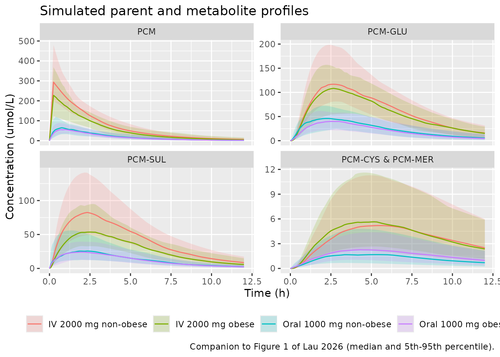
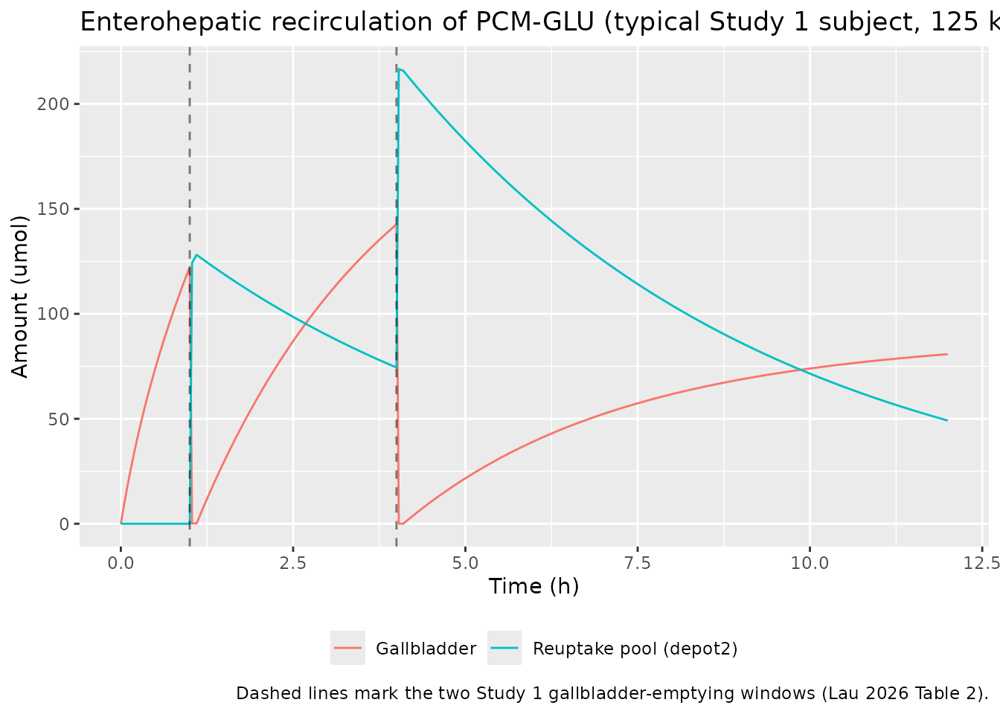
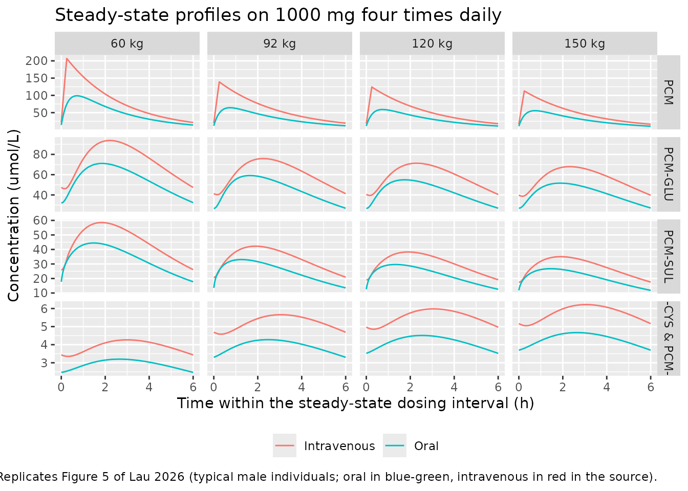

# Paracetamol (Lau 2026)

## Model and source

    #> ℹ parameter labels from comments will be replaced by 'label()'

- Citation: Lau C, van Kesteren C, Smeenk RM, Beex-Oosterhuis MM, Koch
  BCP, Chan LN, Lin YS, van Rongen A, Knibbe CAJ, Huitema ADR,
  Huisman-Siebinga H (2026). Semi-physiological population
  pharmacokinetic modeling of oral and intravenous paracetamol to
  quantify presystemic metabolism and enterohepatic recirculation. CPT
  Pharmacometrics Syst Pharmacol 15(1):e70168. <doi:10.1002/psp4.70168>.
- Article: <https://doi.org/10.1002/psp4.70168>
- Supplementary Materials 1 (Table S1, drug- and system-specific
  parameters and equations) and Supplementary Materials 3 (Data S1, the
  NONMEM control stream) are part of the same open-access deposit.

Semi-physiological popPK. Joint parent-and-metabolites population PK
model for oral and intravenous paracetamol (acetaminophen, PCM) and its
glucuronide (PCM-GLU), sulphate (PCM-SUL), and combined cysteine +
mercapturate (PCM-CYS & PCM-MER) metabolites in adults with and without
obesity (Lau 2026). Extends the intravenous-only model of van Rongen
2016 by resolving first-pass loss into its anatomical sites: a
well-stirred liver whose three parallel intrinsic clearances
(glucuronidation, sulphation, CYP2E1 oxidation) set pathway-specific
hepatic extraction ratios against a weight-driven hepatic blood flow,
and a gut wall whose intrinsic CYP2E1 clearance (a fixed fraction of the
hepatic oxidative intrinsic clearance) sets the gut extraction ratio
against Q_gut. Gut wall, portal vein, and liver are quasi-steady-state
algebraic pools rather than ODE states, so absorbed and recirculated
drug is presented to the liver on every pass while systemic drug is
presented at hepatic blood flow. Enterohepatic recirculation routes 10
percent of newly formed PCM-GLU into a gallbladder compartment that
empties over two fixed 6-minute windows per study, releasing drug to a
reuptake depot that is deglucuronidated and reabsorbed as parent PCM.
Lean body mass scales parent volume, glucuronidation and oxidation
intrinsic clearances, and glucuronide elimination clearance; total body
weight scales glucuronide volume and drives cardiac output.
Study-specific multipliers on the oxidative intrinsic clearance and on
all three metabolite elimination clearances separate the Chen oral
cohort from the other two studies.

Lau 2026 extends the intravenous-only parent-and-metabolites model of
van Rongen 2016 (packaged here as `vanRongen_2016_acetaminophen`) so
that a single model describes both oral and intravenous paracetamol.
Three structural additions carry that extension:

1.  **A well-stirred liver.** The three metabolic routes are
    re-parameterised from plasma clearances into *intrinsic* hepatic
    clearances (`CL_H,int`) acting against a body-weight-driven hepatic
    blood flow, so each route has its own hepatic extraction ratio `E_H`
    and first-pass loss is resolved explicitly rather than folded into a
    lumped bioavailability.
2.  **An oxidatively metabolising gut wall.** The intestinal CYP2E1
    intrinsic clearance is estimated as a fixed fraction (0.00474) of
    the hepatic oxidative intrinsic clearance and produces PCM-CYS &
    PCM-MER presystemically. Lau 2026 reports this as the first
    description of intestinal *oxidative* metabolism.
3.  **Enterohepatic recirculation of the glucuronide.** Ten percent of
    newly formed PCM-GLU is routed to a gallbladder compartment that
    empties over two 6-minute windows at study-specific times,
    delivering drug to a reuptake pool that is deglucuronidated and
    reabsorbed as parent paracetamol.

Gut wall, portal vein and liver are **quasi-steady-state algebraic
pools**, not ODE states: each pool’s amount is set so its outflow
matches its inflow at every instant. That is how the deposited control
stream writes them, and it is what makes the model *semi*-physiological
rather than a full PBPK.

## Population

| Field | Value |
|:---|:---|
| species | human |
| n_subjects | 69 |
| n_studies | 3 |
| age_range | 18-65 years |
| age_median | 41-49 years by cohort (Table 1) |
| weight_range | 53-198 kg (TBW); 36-99 kg (LBW) |
| weight_median | 130.9 kg TBW / 65.2 kg LBW (covariate reference values inherited from van Rongen 2016) |
| sex_female_pct | 71 |
| race_ethnicity | NA |
| disease_state | 53 adults with obesity (BMI 30-77.5 kg/m^2; scheduled for laparoscopic Roux-en-Y gastric bypass or gastric sleeve, sampled before surgery) and 16 adults without obesity (healthy participants or patients undergoing oral and maxillofacial surgery). Exclusions in Study 1: pregnancy, liver disease, paracetamol within 24 h. |
| dose_range | Study 1: single 1000 mg oral suspension (n = 30). Study 2: single 1500 mg oral liquid (n = 11). Study 3: single 2000 mg intravenous, with optional standard postoperative 1000 mg QID from 8 h onward (n = 28). |
| regions | the Netherlands (Studies 1 and 3); United States (Study 2) |
| notes | Pooled from three independent clinical studies (Table 1): Study 1 = PAPAYA (this paper, oral); Study 2 = Chen et al. reference \[9\] (oral); Study 3 = van Rongen et al. reference \[5\] (intravenous, already packaged as vanRongen_2016_acetaminophen). 41 participants received oral and 28 intravenous paracetamol. Observation counts: 782 PCM, 784 PCM-GLU, 783 PCM-SUL, 766 PCM-CYS & PCM-MER. Concentrations and doses are molar (umol/L, umol); molecular weights used for the conversion are PCM 151.16, PCM-GLU 327.29, PCM-SUL 231.23, PCM-CYS 270.30 and PCM-MER 312.24 g/mol (Methods 2.5). |

Population metadata carried in the model file. {.table}

Sixty-nine adults were pooled from three independent studies (Lau 2026
Table 1): Study 1 (the PAPAYA study, new in this paper) gave a single
1000 mg oral suspension to 8 participants without obesity and 22 with
obesity; Study 2 (Chen et al.) gave a single 1500 mg oral liquid to 11
patients with obesity; Study 3 (van Rongen et al.) gave 2000 mg
intravenously to 8 patients without obesity and 20 with obesity.
Forty-one participants received paracetamol orally and 28 intravenously.
Total body weight spanned 53-198 kg and lean body weight 36-99 kg.

## Source trace

Every `ini()` entry in
`inst/modeldb/specificDrugs/Lau_2026_paracetamol.R` carries an in-file
comment naming its source location. The table below collects them.

| Model element | Value | Source location |
|----|----|----|
| `lvc`, `e_lbm_vc` | 53.7 L at LBW 65.2 kg; exponent 1.00 | Table 2 rows `V PCM,LBW 65.2 kg` and `N`; control stream THETA(1), THETA(17) |
| `lka` | 0.0531 1/min | Table 2 row `k a (min^-1)`; control stream THETA(2) |
| `lfdepot` (Fa) | 0.745 | Table 2 row `F a`; control stream THETA(3) as `F1` |
| `lka2` | 0.00312 1/min | Table 2 row `k a2 (min^-1)`; control stream THETA(24) |
| `lclint_gluc`, `e_lbm_clint_gluc` | 0.300 L/min at LBW 65.2 kg; exponent 0.888 | Table 2 rows `CL HGLU,LBW 65.2 kg` and `O`; control stream THETA(4), THETA(19) |
| `lclint_sulf`, `e_lbm_clint_sulf` | 0.0667 L/min; exponent fixed 0 | Table 2 row `CL HSUL, LBW65.2 kg`; control stream THETA(5), THETA(20) `0 FIX` |
| `lclint_cysmer`, `e_lbm_clint_cysmer`, `e_study_chen_clint_cysmer` | 0.0417 L/min at LBW 65.2 kg; exponent 1.36; Study 2 factor 1.94 | Table 2 rows `CL HCYS, LBW65.2 kg`, `P`, `R`; control stream THETA(6), THETA(21), THETA(29) |
| `fclint_gut` | 0.00474 | Table 2 row `Fraction CL G,int` with footnote a; control stream THETA(8) |
| `fub` | 0.855 fixed | Table 2 row `Fraction unbound in blood (f UB)`; Table S1 row 1; control stream THETA(7) `0.855 FIX` |
| `fug` | 1 fixed | Table S1 row `Fraction of drug unbound in the gut wall (f UG)`; control stream `FUG= 1` |
| `lclperm` | 3.79 L/min fixed | Table 2 row `CL perm`; Table S1 `CL_perm = P_app * A` with P_app 31.6e-6 cm/s, A 200 m^2; control stream THETA(9) `3.79 FIX` |
| `lvh`, `lvpv`, `lvgw` | 1 L each, fixed | Table S1 rows `Volume of liver`, `Volume of portal vein`, `Volume of gut wall`; control stream `VH= 1`, `VPV= 1`, `VGW= 1` |
| `lvc_gluc`, `e_wt_vc_gluc` | 26.8 L at TBW 130.9 kg; exponent 0.485 | Table 2 rows `V PCM-GLU, TBW130.9 kg` and `S`; control stream THETA(10), THETA(18) |
| `lvc_sulf`, `lvp_sulf` | 5.66 L each, fixed | Table 2 row `V PCM-SUL, central = V PCM,peripheral`; Table S1; control stream THETA(11) `5.66 FIX`, `V8=V4` |
| `lq_sulf` | 0.695 L/min | Table 2 row `Q(L, min^-1)`; control stream THETA(13) |
| `lvc_cysmer` | 15.6 L fixed | Table 2 row `V PCM-CYS/MER`; Table S1; control stream THETA(12) `15.6 FIX` |
| `lcle_gluc`, `e_lbm_cle_gluc`, `e_study_chen_cle_gluc` | 0.193 L/min; exponent 0.537; Study 2 factor 0.650 | Table 2 rows `CL E GLU`, `T`, `U`; control stream THETA(14), THETA(25), THETA(26) |
| `lcle_sulf`, `e_study_chen_cle_sulf` | 0.100 L/min; Study 2 factor 0.826 | Table 2 rows `CL E,SUL` and `W`; control stream THETA(15), THETA(27) |
| `lcle_cysmer`, `e_study_chen_cle_cysmer` | 0.397 L/min; Study 2 factor 1.59 | Table 2 rows `CL E CYS` and `X`; control stream THETA(16), THETA(28) |
| `lktr_cysmer`, `lktr_gluc` | 0.00332 and 0.0687 1/min | Table 2 rows `k tr` and `k tr2`; control stream THETA(30), THETA(31) |
| `fgb`, `lkgg`, `ldgb` | 0.1, 10 1/min, 6 min, all fixed | Table 2 rows `F GB`, `k GG`, `Duration of gallbladder emptying`; Table S1; control stream THETA(23), THETA(22), THETA(33) |
| `ltgb1_papaya`, `ltgb2_papaya` | 60 and 240 min, fixed | Table 2 `Start gallbladder emptying, Study 1`; control stream THETA(32), THETA(36) |
| `ltgb1_chen`, `ltgb2_chen` | 480 and 660 min, fixed | Table 2 `Start gallbladder emptying, Study 2`; control stream THETA(35), THETA(38) |
| `ltgb1_vanrongen`, `ltgb2_vanrongen` | 360 and 540 min, fixed | Table 2 `Start gallbladder emptying, Study 3`; control stream THETA(34), THETA(37) |
| Cardiac output equation | `CO = (9119 - exp(9.164 - 0.0291*WT + 0.000391*WT^2 - 0.00000191*WT^3))/1000` | Table S1 row `Cardiac output (CO)`, citing Young 2009; control stream `$PK` block |
| Blood-flow fractions | `Q_H = 0.25 CO`, `Q_PV = 0.75 Q_H`, `Q_HA = 0.25 Q_H`, `Q_int = 0.4 Q_H`, `Q_mucosa = 0.8 Q_int`, `Q_villi = 0.6 Q_mucosa` | Table S1, citing Frechen 2013 / Williams 1989 / Yang 2007; control stream `$PK` block |
| `Q_gut`, `E_G`, `F_G` | `Q_gut = Q_villi*CL_perm/(Q_villi+CL_perm)`; `E_G = CL_G,int*f_UG/(Q_gut + CL_G,int*f_UG)`; `F_G = 1 - E_G` | Table S1 rows `Gut blood flow`, `Gut wall extraction ratio`, `Intestinal bioavailability`; control stream `$PK` block |
| `E_H,i`, `F_H` | `E_H,i = CL_H,int,i*f_UB/(Q_H + CL_H,int,i*f_UB)`; `F_H = 1 - E_H,GLU - E_H,SUL - E_H,CYS` | Table S1 row `Hepatic extraction ratio` for the per-route form; control stream `FH=1-EHGLU-EHSUL-EHCYS` for the summation (see Errata) |
| ODE system | n/a | Figure 2 (structural diagram) and the `$DES` block of the control stream |
| Residual error structure | n/a | Methods 2.3.2 Equation 2 and the `$ERROR` block of the control stream |
| IIV %CV to omega^2 | `omega^2 = log(1 + CV^2)` | Methods 2.3.2 Equation 1 (exponential IIV); confirmed by the fixed gallbladder-time IIV, where 131.1% CV maps to the control stream’s `$OMEGA 1 FIX` |

## Structural verification: the paper’s own worked numbers

Lau 2026 Results 3.2.1 states the fraction escaping gut metabolism
explicitly: *“F_G can be calculated at 0.9995 for a male individual
weighing 60 kg (LBW 40.8 kg) and 0.9992 for a male individual weighing
120 kg (LBW 71.5 kg).”* Those two numbers exercise the whole
system-parameter chain in one shot: the Young 2009 cardiac-output
polynomial, four successive blood-flow fractions, `Q_gut`, the LBW power
law on the oxidative intrinsic clearance, and the `fclint_gut` fraction.
Reproducing them is a strong transcription check.

``` r

mod <- nlmixr2lib::readModelDb("Lau_2026_paracetamol")
mod_typ <- rxode2::zeroRe(mod, which = "omega")
#> ℹ parameter labels from comments will be replaced by 'label()'

# One-record solve per worked example; every derived quantity is returned as a
# column, so the check reads them straight out of the model.
derived <- function(wt, lbm, study_papaya = 1, study_chen = 0) {
  ev <- rxode2::et(0, cmt = "Cc")
  rxode2::rxSolve(
    mod_typ, ev, omega = NA, useLinCmt = FALSE,
    params = c(WT = wt, LBM = lbm,
               STUDY_PAPAYA = study_papaya, STUDY_CHEN = study_chen)
  ) |>
    as.data.frame() |>
    dplyr::slice(1)
}

fg_check <- dplyr::bind_rows(
  derived(60, 40.8) |> dplyr::mutate(case = "60 kg male, LBW 40.8 kg", published_fg = 0.9995),
  derived(120, 71.5) |> dplyr::mutate(case = "120 kg male, LBW 71.5 kg", published_fg = 0.9992)
) |>
  dplyr::select(case, co, qh, qvilli, qgut, clint_cysmer, fg, fh, published_fg) |>
  dplyr::mutate(F_overall = 0.745 * fg * fh)

fg_check |>
  dplyr::rename(
    "Case" = case, "CO (L/min)" = co, "Q_H (L/min)" = qh,
    "Q_villi (L/min)" = qvilli, "Q_gut (L/min)" = qgut,
    "CL_H,int oxidative (L/min)" = clint_cysmer,
    "F_G (model)" = fg, "F_H (model)" = fh,
    # Written with 'x' rather than '*': a pair of asterisks in a kable header
    # is consumed by pandoc as markdown emphasis and the operators vanish from
    # the rendered table.
    "F_G (Lau 2026)" = published_fg, "F = Fa x F_G x F_H" = F_overall
  ) |>
  knitr::kable(digits = 5,
               caption = "Reproduces the two worked F_G values quoted in Lau 2026 Results 3.2.1.")
```

| Case | CO (L/min) | Q_H (L/min) | Q_villi (L/min) | Q_gut (L/min) | CL_H,int oxidative (L/min) | F_G (model) | F_H (model) | F_G (Lau 2026) | F = Fa x F_G x F_H |
|:---|---:|---:|---:|---:|---:|---:|---:|---:|---:|
| 60 kg male, LBW 40.8 kg | 4.61356 | 1.15339 | 0.22145 | 0.20923 | 0.02204 | 0.99950 | 0.80890 | 0.9995 | 0.60233 |
| 120 kg male, LBW 71.5 kg | 6.13231 | 1.53308 | 0.29435 | 0.27314 | 0.04727 | 0.99918 | 0.78476 | 0.9992 | 0.58417 |

Reproduces the two worked F_G values quoted in Lau 2026 Results 3.2.1.
{.table}

``` r


# The published values are quoted to four decimals, so match to within half a
# unit in the last published place. This is an algebraic identity between the
# model and the paper's own arithmetic, not a stochastic comparison, so the
# tolerance is tight by design.
stopifnot(
  all(abs(fg_check$fg - fg_check$published_fg) < 5e-5)
)
```

Overall oral bioavailability is `F = Fa * F_G * F_H` (Lau 2026 Results
3.2.1 and Table S1), which the table above evaluates at about 0.60 for
the 60 kg case: absorption of 74.5% of the dose, essentially no gut-wall
loss, and roughly 19% first-pass hepatic extraction.

## Structural verification: parent clearance is hepatic-extraction clearance

With no absorption in progress the parent equation collapses to
`d(central)/dt = (F_H - 1) * Q_H * Cc`, so the systemic clearance of
paracetamol in this model is exactly `(1 - F_H) * Q_H`. Because both
sides use the same drawn parameters, this is a pure numerical identity
and is asserted tightly.

``` r

trapz <- function(t, y) sum(diff(t) * (utils::head(y, -1) + utils::tail(y, -1)) / 2)

MW_PCM <- 151.16                      # g/mol, Lau 2026 Methods 2.5
mg_to_umol <- function(mg) mg / MW_PCM * 1000

# Steady-state intravenous QID dosing: AUC over one interval must equal
# Dose / CL exactly for a linear system.
ii <- 360                             # 1000 mg four times daily = every 6 h
n_dose <- 20                          # five days is many parent half-lives
dose_umol <- mg_to_umol(1000)

# Coarse through the approach to steady state, 1-minute inside the final
# dosing interval where every AUC in this vignette is measured.
ss_grid <- sort(unique(c(seq(0, (n_dose - 1) * ii, by = 10),
                        seq((n_dose - 1) * ii, n_dose * ii, by = 1))))

ss_iv <- function(wt, lbm) {
  ev <- rxode2::et(amt = dose_umol, cmt = "central", dur = 15,
                   ii = ii, addl = n_dose - 1) |>
    rxode2::et(ss_grid, cmt = "Cc")
  d <- rxode2::rxSolve(mod_typ, ev, omega = NA, useLinCmt = FALSE,
                       params = c(WT = wt, LBM = lbm,
                                  STUDY_PAPAYA = 1, STUDY_CHEN = 0)) |>
    as.data.frame()
  last <- d[d$time >= (n_dose - 1) * ii & d$time <= n_dose * ii, ]
  tibble::tibble(
    WT = wt, LBM = lbm,
    auc_tau = trapz(last$time, last$Cc),
    cl_model = (1 - d$fh[1]) * d$qh[1],
    auc_expected = dose_umol / ((1 - d$fh[1]) * d$qh[1])
  )
}

cl_id <- dplyr::bind_rows(lapply(seq_along(c(60, 92, 120, 150)), function(i) {
  ss_iv(c(60, 92, 120, 150)[i], c(40.8, 63.6, 71.5, 78.8)[i])
})) |>
  dplyr::mutate(pct_diff = 100 * (auc_tau - auc_expected) / auc_expected)

cl_id |>
  dplyr::rename(
    "TBW (kg)" = WT, "LBW (kg)" = LBM,
    "AUC_tau simulated (umol*min/L)" = auc_tau,
    "CL = (1 - F_H) * Q_H (L/min)" = cl_model,
    "AUC_tau = Dose / CL (umol*min/L)" = auc_expected,
    "Difference (%)" = pct_diff
  ) |>
  knitr::kable(digits = c(0, 1, 1, 4, 1, 3),
               caption = "Steady-state intravenous AUC over one dosing interval against the closed-form Dose / CL.")
```

| TBW (kg) | LBW (kg) | AUC_tau simulated (umol\*min/L) | CL = (1 - F_H) \* Q_H (L/min) | AUC_tau = Dose / CL (umol\*min/L) | Difference (%) |
|---:|---:|---:|---:|---:|---:|
| 60 | 40.8 | 30014.6 | 0.2204 | 30014.6 | 0 |
| 92 | 63.6 | 22237.7 | 0.2975 | 22237.7 | 0 |
| 120 | 71.5 | 20048.7 | 0.3300 | 20048.7 | 0 |
| 150 | 78.8 | 18209.0 | 0.3633 | 18209.0 | 0 |

Steady-state intravenous AUC over one dosing interval against the
closed-form Dose / CL. {.table}

``` r


# Same parameters on both sides and no random draws, so the only error is
# trapezoidal on a 1-minute grid. The observed agreement is ~5e-5%; the bound
# is set three orders of magnitude above that, which still catches any real
# structural regression while tolerating solver differences across versions.
stopifnot(all(abs(cl_id$pct_diff) < 0.01))
```

## Virtual cohort

The observed data are not public. The cohort below reproduces the Table
1 demographics of the two studies that this vignette simulates: Study 1
(oral 1000 mg) and Study 3 (intravenous 2000 mg), each split into its
non-obese and obese strata. Total body weight and BMI are drawn
log-normally inside the reported ranges, sex is drawn at the reported
female percentage, and lean body weight is then **derived** with the
Janmahasatian 2005 equation that Lau 2026 Methods 2.3.1 cites – so the
cohort’s LBW is not fitted to Table 1, it is predicted from it.

``` r

set.seed(20260830)

# Janmahasatian et al. 2005 lean body mass (kg); WT in kg, BMI in kg/m^2.
janmahasatian_lbm <- function(wt, bmi, female) {
  ifelse(female == 1,
         9270 * wt / (8780 + 244 * bmi),
         9270 * wt / (6680 + 216 * bmi))
}

# Draw a value with the given median whose 5th-95th percentiles approximate the
# reported min-max range, truncated to that range.
draw_trunc <- function(n, med, lo, hi) {
  sdlog <- (log(hi) - log(lo)) / (2 * 1.645)
  pmin(pmax(stats::rlnorm(n, log(med), sdlog), lo), hi)
}

make_stratum <- function(n, id_offset, arm, study_papaya, dose_mg, route,
                         wt_med, wt_lo, wt_hi, bmi_med, bmi_lo, bmi_hi, pct_female) {
  wt <- draw_trunc(n, wt_med, wt_lo, wt_hi)
  bmi <- draw_trunc(n, bmi_med, bmi_lo, bmi_hi)
  female <- stats::rbinom(n, 1, pct_female / 100)
  tibble::tibble(
    id = id_offset + seq_len(n),
    arm = arm, route = route, stratum = paste(arm, if (bmi_med >= 30) "obese" else "non-obese"),
    WT = wt, BMI = bmi, SEXF = female,
    LBM = janmahasatian_lbm(wt, bmi, female),
    STUDY_PAPAYA = study_papaya, STUDY_CHEN = 0,
    dose_umol = mg_to_umol(dose_mg)
  )
}

subjects <- dplyr::bind_rows(
  # Study 1 (PAPAYA), oral 1000 mg suspension - Table 1 columns 1 and 2.
  make_stratum(32,   0L, "Oral 1000 mg", 1, 1000, "oral",
               77,  65,  85, 26.7, 20.9, 30.3, 75),
  make_stratum(88,  32L, "Oral 1000 mg", 1, 1000, "oral",
               125, 94, 183, 41.1, 34.3, 53.5, 68),
  # Study 3 (van Rongen), intravenous 2000 mg - Table 1 columns 4 and 5.
  make_stratum(32, 120L, "IV 2000 mg", 0, 2000, "iv",
               70,  53,  92, 21.9, 19.4, 27.4, 50),
  make_stratum(80, 152L, "IV 2000 mg", 0, 2000, "iv",
               140, 106, 193, 45.1, 40.0, 55.2, 75)
)

# Cheap regression guard against ID collisions across strata.
stopifnot(!anyDuplicated(subjects$id))

# The Janmahasatian LBW medians predicted from the sampled TBW / BMI / sex should
# land near the LBW medians Table 1 actually reports. Assert on the centre (a
# median across 32-88 subjects), never on the extremes.
lbw_check <- subjects |>
  dplyr::group_by(stratum) |>
  dplyr::summarise(
    WT_median = stats::median(WT),
    LBM_median = stats::median(LBM),
    .groups = "drop"
  ) |>
  dplyr::mutate(
    LBW_table1 = c(65, 51, 59, 47)[match(stratum, c("IV 2000 mg obese", "IV 2000 mg non-obese",
                                                    "Oral 1000 mg obese", "Oral 1000 mg non-obese"))],
    pct_diff = 100 * (LBM_median - LBW_table1) / LBW_table1
  )

lbw_check |>
  dplyr::rename(
    "Stratum" = stratum, "Median TBW (kg)" = WT_median,
    "Median LBW, Janmahasatian (kg)" = LBM_median,
    "Median LBW, Lau 2026 Table 1 (kg)" = LBW_table1,
    "Difference (%)" = pct_diff
  ) |>
  knitr::kable(digits = 1,
               caption = "Derived lean body weight against the reported Table 1 medians.")
```

| Stratum | Median TBW (kg) | Median LBW, Janmahasatian (kg) | Median LBW, Lau 2026 Table 1 (kg) | Difference (%) |
|:---|---:|---:|---:|---:|
| IV 2000 mg non-obese | 67.9 | 50.6 | 51 | -0.8 |
| IV 2000 mg obese | 139.9 | 67.8 | 65 | 4.3 |
| Oral 1000 mg non-obese | 78.8 | 48.9 | 47 | 4.0 |
| Oral 1000 mg obese | 123.8 | 63.3 | 59 | 7.3 |

Derived lean body weight against the reported Table 1 medians. {.table}

``` r


# A 15% envelope on the median: the sampled BMI and sex are independent draws
# here whereas the real cohorts are correlated, so the reconstruction is
# approximate by construction. Anything larger would mean the formula or the
# demographic transcription is wrong.
stopifnot(all(abs(lbw_check$pct_diff) < 15))
```

``` r

# Sampling grid: dense through absorption and the first gallbladder window,
# coarser through the terminal phase, out to the 24 h of the source studies.
obs_times <- sort(unique(c(seq(0, 120, by = 5), seq(130, 360, by = 10),
                           seq(380, 1440, by = 20))))

events <- subjects |>
  dplyr::group_by(id) |>
  dplyr::group_modify(function(s, key) {
    dosing <- tibble::tibble(
      time = 0, amt = s$dose_umol, evid = 1L,
      cmt = if (s$route == "oral") "depot" else "central",
      rate = if (s$route == "oral") 0 else s$dose_umol / 15
    )
    obs <- tibble::tibble(time = obs_times, amt = NA_real_, evid = 0L,
                          cmt = "Cc", rate = 0)
    dplyr::bind_rows(dosing, obs) |>
      dplyr::mutate(arm = s$arm, stratum = s$stratum, route = s$route,
                    WT = s$WT, LBM = s$LBM, SEXF = s$SEXF,
                    STUDY_PAPAYA = s$STUDY_PAPAYA, STUDY_CHEN = s$STUDY_CHEN)
  }) |>
  dplyr::ungroup() |>
  dplyr::arrange(id, time, dplyr::desc(evid)) |>
  as.data.frame()

stopifnot(!anyDuplicated(unique(events[, c("id", "time", "evid")])))
```

`cmt = "Cc"` on the observation rows is deliberate and is **not** the
slot-renumbering antipattern. This model declares four endpoints (`Cc`,
`Cc_gluc`, `Cc_sulf`, `Cc_cysmer`); rxode2 maps a multi-endpoint model’s
observation records through the endpoint names, and rejects
`cmt = "central"` on those rows with a `'dvid'->'cmt'` translation
error. The solve returns all four observables as columns regardless.

## Simulation

``` r

sim <- rxode2::rxSolve(
  mod, events = events,
  keep = c("arm", "stratum", "route"),
  useLinCmt = FALSE
) |>
  as.data.frame()
#> ℹ parameter labels from comments will be replaced by 'label()'

# The four `mtime()` break points per subject (the two gallbladder-emptying
# starts and ends) come back as EXTRA output rows that were not in the event
# table, so every `keep`-ed column is NA on them. Drop them: they are solver
# break points, not requested observations. The count is exactly four per
# subject, which is asserted rather than assumed.
n_mtime_rows <- sum(is.na(sim$arm))
stopifnot(n_mtime_rows == 4L * nrow(subjects))
sim <- sim[!is.na(sim$arm), ]

# rxSolve drops `id` for a single subject; this cohort has many, but assert it
# so a future shrink of the cohort fails loudly rather than silently.
stopifnot("id" %in% names(sim), dplyr::n_distinct(sim$id) == nrow(subjects))
```

## Replicate Figure 1: concentration-time profiles of parent and metabolites

Lau 2026 Figure 1 shows the observed PCM, PCM-GLU, PCM-SUL and PCM-CYS &
PCM-MER profiles from the three studies, stratified by compound, study
and obesity status. The panels below are the corresponding simulated
prediction intervals for the two studies this vignette reconstructs.

``` r

sim |>
  tidyr::pivot_longer(c(Cc, Cc_gluc, Cc_sulf, Cc_cysmer),
                      names_to = "analyte", values_to = "conc") |>
  dplyr::mutate(analyte = factor(
    analyte,
    levels = c("Cc", "Cc_gluc", "Cc_sulf", "Cc_cysmer"),
    labels = c("PCM", "PCM-GLU", "PCM-SUL", "PCM-CYS & PCM-MER"))) |>
  dplyr::group_by(time, analyte, stratum) |>
  dplyr::summarise(
    Q05 = stats::quantile(conc, 0.05, na.rm = TRUE),
    Q50 = stats::quantile(conc, 0.50, na.rm = TRUE),
    Q95 = stats::quantile(conc, 0.95, na.rm = TRUE),
    .groups = "drop"
  ) |>
  dplyr::filter(time <= 720) |>
  ggplot(aes(time / 60, Q50, colour = stratum, fill = stratum)) +
  geom_ribbon(aes(ymin = Q05, ymax = Q95), alpha = 0.18, colour = NA) +
  geom_line() +
  facet_wrap(~analyte, scales = "free_y") +
  labs(x = "Time (h)", y = "Concentration (umol/L)",
       colour = NULL, fill = NULL,
       title = "Simulated parent and metabolite profiles",
       caption = "Companion to Figure 1 of Lau 2026 (median and 5th-95th percentile).") +
  theme(legend.position = "bottom")
```



The enterohepatic contribution is easiest to see in the gallbladder and
reuptake states themselves. Study 1’s gallbladder empties at 60 and 240
minutes; each window transfers essentially the whole gallbladder content
(`k_GG` = 10 1/min over 6 min) into the reuptake pool, which then feeds
parent paracetamol back through the gut wall at the slow `k_a2` of
0.00312 1/min.

``` r

# Typical-value Study 1 subject: with the etaltgb random effect zeroed, the two
# emptying windows sit exactly at the Table 2 times of 60 and 240 minutes. In
# the cohort simulation above the fixed 131% CV on the emptying time scatters
# them widely, and for some subjects both windows fall beyond 24 h.
gb_ev <- rxode2::et(amt = mg_to_umol(1000), cmt = "depot") |>
  rxode2::et(seq(0, 720, by = 2), cmt = "Cc")
rxode2::rxSolve(mod_typ, gb_ev, omega = NA, useLinCmt = FALSE,
                params = c(WT = 125, LBM = 59,
                           STUDY_PAPAYA = 1, STUDY_CHEN = 0)) |>
  as.data.frame() |>
  dplyr::select(time, gallbladder, depot2) |>
  tidyr::pivot_longer(-time, names_to = "state", values_to = "amount") |>
  dplyr::mutate(state = factor(state, c("gallbladder", "depot2"),
                               c("Gallbladder", "Reuptake pool (depot2)"))) |>
  dplyr::filter(time <= 720) |>
  ggplot(aes(time / 60, amount, colour = state)) +
  geom_line() +
  geom_vline(xintercept = c(60, 240) / 60, linetype = "dashed", alpha = 0.5) +
  labs(x = "Time (h)", y = "Amount (umol)", colour = NULL,
       title = "Enterohepatic recirculation of PCM-GLU (typical Study 1 subject, 125 kg)",
       caption = "Dashed lines mark the two Study 1 gallbladder-emptying windows (Lau 2026 Table 2).") +
  theme(legend.position = "bottom")
```



## PKNCA validation

Non-compartmental analysis of the simulated parent profiles, stratified
by arm. Lau 2026 reports no NCA table, so this section characterises the
packaged model rather than comparing against published NCA values; the
quantitative comparison against the paper is the AUC-ratio section
below.

``` r

sim_nca <- sim |>
  dplyr::filter(!is.na(Cc)) |>
  dplyr::select(id, time, Cc, arm)

# Guarantee a time = 0 record per subject; pre-dose paracetamol is 0.
sim_nca <- dplyr::bind_rows(
  sim_nca,
  sim_nca |> dplyr::distinct(id, arm) |> dplyr::mutate(time = 0, Cc = 0)
) |>
  dplyr::distinct(id, arm, time, .keep_all = TRUE) |>
  dplyr::arrange(id, time)

stopifnot(all(sim_nca$Cc >= 0))

conc_obj <- PKNCA::PKNCAconc(sim_nca, Cc ~ time | arm + id)

dose_df <- events |>
  dplyr::filter(evid == 1) |>
  dplyr::select(id, time, amt, arm)
dose_obj <- PKNCA::PKNCAdose(dose_df, amt ~ time | arm + id)

# Terminal-phase window: truncate at 12 h. Beyond that the simulated parent
# has decayed several half-lives below the studies' quantifiable range and the
# slow enterohepatic trickle distorts lambda-z.
intervals <- data.frame(
  start = 0, end = 720,
  cmax = TRUE, tmax = TRUE, auclast = TRUE, half.life = TRUE
)

nca_res <- PKNCA::pk.nca(PKNCA::PKNCAdata(conc_obj, dose_obj, intervals = intervals))

nca_summary <- as.data.frame(nca_res) |>
  dplyr::filter(PPTESTCD %in% c("cmax", "tmax", "auclast", "half.life")) |>
  dplyr::group_by(arm, PPTESTCD) |>
  dplyr::summarise(median = stats::median(PPORRES, na.rm = TRUE),
                   p05 = stats::quantile(PPORRES, 0.05, na.rm = TRUE),
                   p95 = stats::quantile(PPORRES, 0.95, na.rm = TRUE),
                   .groups = "drop") |>
  dplyr::mutate(
    PPTESTCD = factor(PPTESTCD, c("cmax", "tmax", "auclast", "half.life"),
                      c("Cmax (umol/L)", "Tmax (min)",
                        "AUC0-12h (umol*min/L)", "t1/2 (min)"))
  ) |>
  dplyr::arrange(arm, PPTESTCD)

nca_summary |>
  dplyr::rename("Arm" = arm, "NCA parameter" = PPTESTCD,
                "Median" = median, "5th pctile" = p05, "95th pctile" = p95) |>
  knitr::kable(digits = 1,
               caption = "Simulated parent paracetamol NCA by arm (PKNCA, 0-12 h).")
```

| Arm          | NCA parameter          |  Median | 5th pctile | 95th pctile |
|:-------------|:-----------------------|--------:|-----------:|------------:|
| IV 2000 mg   | Cmax (umol/L)          |   240.5 |      133.2 |       414.1 |
| IV 2000 mg   | Tmax (min)             |    15.0 |       15.0 |        15.0 |
| IV 2000 mg   | AUC0-12h (umol\*min/L) | 43022.8 |    26214.2 |     60131.2 |
| IV 2000 mg   | t1/2 (min)             |   152.5 |       86.0 |       267.4 |
| Oral 1000 mg | Cmax (umol/L)          |    58.4 |       36.2 |        93.0 |
| Oral 1000 mg | Tmax (min)             |    50.0 |       20.0 |        90.0 |
| Oral 1000 mg | AUC0-12h (umol\*min/L) | 13045.0 |     8409.1 |     21342.3 |
| Oral 1000 mg | t1/2 (min)             |   150.4 |      114.1 |       225.2 |

Simulated parent paracetamol NCA by arm (PKNCA, 0-12 h). {.table}

``` r


# Sanity floor: every subject must have a computable Cmax and a positive AUC.
stopifnot(
  nrow(nca_summary) == 8,
  all(nca_summary$median > 0)
)
```

## Comparison against the published AUC ratios

Lau 2026 Results 3.3 quotes metabolite-to-parent AUC0-6 ratios at steady
state on 1000 mg four times daily, simulated for four typical male
individuals of 60, 92, 120 and 150 kg (lean body weights 40.8, 63.6,
71.5 and 78.8 kg; Figure 5 caption), for both routes. Those ranges are
the paper’s most directly reproducible quantitative result, so they are
the validation target here.

``` r

weights <- tibble::tibble(WT = c(60, 92, 120, 150), LBM = c(40.8, 63.6, 71.5, 78.8))

ss_profile <- function(wt, lbm, route) {
  ev <- if (route == "oral") {
    rxode2::et(amt = dose_umol, cmt = "depot", ii = ii, addl = n_dose - 1)
  } else {
    rxode2::et(amt = dose_umol, cmt = "central", dur = 15, ii = ii, addl = n_dose - 1)
  }
  ev <- rxode2::et(ev, ss_grid, cmt = "Cc")
  rxode2::rxSolve(mod_typ, ev, omega = NA, useLinCmt = FALSE,
                  params = c(WT = wt, LBM = lbm,
                             STUDY_PAPAYA = 1, STUDY_CHEN = 0)) |>
    as.data.frame() |>
    dplyr::mutate(WT = wt, route = route)
}

ss <- dplyr::bind_rows(lapply(seq_len(nrow(weights)), function(i) {
  dplyr::bind_rows(
    ss_profile(weights$WT[i], weights$LBM[i], "oral"),
    ss_profile(weights$WT[i], weights$LBM[i], "iv")
  )
}))

ss |>
  dplyr::filter(time >= (n_dose - 1) * ii) |>
  dplyr::mutate(t_int = time - (n_dose - 1) * ii) |>
  tidyr::pivot_longer(c(Cc, Cc_gluc, Cc_sulf, Cc_cysmer),
                      names_to = "analyte", values_to = "conc") |>
  dplyr::mutate(
    analyte = factor(analyte, c("Cc", "Cc_gluc", "Cc_sulf", "Cc_cysmer"),
                     c("PCM", "PCM-GLU", "PCM-SUL", "PCM-CYS & PCM-MER")),
    route = factor(route, c("iv", "oral"), c("Intravenous", "Oral"))
  ) |>
  ggplot(aes(t_int / 60, conc, colour = route)) +
  geom_line() +
  facet_grid(analyte ~ WT, scales = "free_y",
             labeller = labeller(WT = function(x) paste0(x, " kg"))) +
  labs(x = "Time within the steady-state dosing interval (h)",
       y = "Concentration (umol/L)", colour = NULL,
       title = "Steady-state profiles on 1000 mg four times daily",
       caption = "Replicates Figure 5 of Lau 2026 (typical male individuals; oral in blue-green, intravenous in red in the source).") +
  theme(legend.position = "bottom")
```



``` r

auc_ratios <- ss |>
  dplyr::filter(time >= (n_dose - 1) * ii) |>
  dplyr::group_by(WT, route) |>
  dplyr::summarise(
    gluc = trapz(time, Cc_gluc) / trapz(time, Cc),
    sulf = trapz(time, Cc_sulf) / trapz(time, Cc),
    cysmer = trapz(time, Cc_cysmer) / trapz(time, Cc),
    .groups = "drop"
  )

published <- tibble::tribble(
  ~route,  ~pathway,  ~lo,   ~hi,
  "oral",  "gluc",    1.05,  1.36,
  "oral",  "sulf",    0.64,  0.72,
  "oral",  "cysmer",  0.06,  0.14,
  "iv",    "gluc",    1.11,  1.37,
  "iv",    "sulf",    0.68,  0.72,
  "iv",    "cysmer",  0.06,  0.14
)

ratio_cmp <- auc_ratios |>
  tidyr::pivot_longer(c(gluc, sulf, cysmer), names_to = "pathway", values_to = "ratio") |>
  dplyr::group_by(route, pathway) |>
  dplyr::summarise(sim_lo = min(ratio), sim_hi = max(ratio), .groups = "drop") |>
  dplyr::left_join(published, by = c("route", "pathway")) |>
  dplyr::mutate(
    route = factor(route, c("oral", "iv"), c("Oral", "Intravenous")),
    pathway = factor(pathway, c("gluc", "sulf", "cysmer"),
                     c("Glucuronidation", "Sulphation", "Oxidation")),
    # The paper prints its ranges to two decimals, so half a unit in the last
    # printed place is the right tolerance. Both sides are typical-value
    # (zeroRe) simulations with no random draws, so no allowance for sampling
    # is needed and none is given.
    within = sim_lo >= lo - 0.005 & sim_hi <= hi + 0.005
  ) |>
  dplyr::arrange(route, pathway)

ratio_cmp |>
  dplyr::mutate(
    simulated = sprintf("%.2f-%.2f", sim_lo, sim_hi),
    reference = sprintf("%.2f-%.2f", lo, hi)
  ) |>
  dplyr::select(route, pathway, simulated, reference, within) |>
  dplyr::rename("Route" = route, "Pathway" = pathway,
                "Simulated range (60-150 kg)" = simulated,
                "Lau 2026 Results 3.3" = reference,
                "Within reference range" = within) |>
  knitr::kable(caption = "Metabolite-to-parent AUC0-6 ratios at steady state on 1000 mg four times daily.")
```

| Route | Pathway | Simulated range (60-150 kg) | Lau 2026 Results 3.3 | Within reference range |
|:---|:---|:---|:---|:---|
| Oral | Glucuronidation | 1.09-1.36 | 1.05-1.36 | TRUE |
| Oral | Sulphation | 0.67-0.71 | 0.64-0.72 | TRUE |
| Oral | Oxidation | 0.06-0.14 | 0.06-0.14 | TRUE |
| Intravenous | Glucuronidation | 0.88-1.11 | 1.11-1.37 | FALSE |
| Intravenous | Sulphation | 0.54-0.55 | 0.68-0.72 | FALSE |
| Intravenous | Oxidation | 0.05-0.11 | 0.06-0.14 | FALSE |

Metabolite-to-parent AUC0-6 ratios at steady state on 1000 mg four times
daily. {.table}

``` r


# The oral arm is the validation gate. All three oral pathways must land inside
# the published ranges (allowing 0.05 absolute for the paper's two-decimal
# rounding). The intravenous arm is deliberately NOT asserted - see Errata; the
# paper's intravenous ranges are not reachable from its own parameters.
oral_rows <- ratio_cmp[ratio_cmp$route == "Oral", ]
stopifnot(nrow(oral_rows) == 3L, all(oral_rows$within))

# The oral-to-intravenous ratio is fixed by the paper's own bioavailability:
# the same molar amount of metabolite is formed either way (scaled by Fa for the
# oral route), while the parent AUC differs by F, so every pathway's ratio must
# differ between routes by exactly Fa / F = Fa / (Fa * F_G * F_H) = 1 / (F_G * F_H).
oral_iv <- auc_ratios |>
  tidyr::pivot_longer(c(gluc, sulf, cysmer), names_to = "pathway", values_to = "ratio") |>
  tidyr::pivot_wider(names_from = route, values_from = ratio) |>
  dplyr::mutate(oral_over_iv = oral / iv)
expected_oral_iv <- 1 / (fg_check$fg[1] * fg_check$fh[1])
stopifnot(
  abs(stats::median(oral_iv$oral_over_iv[oral_iv$WT == 60]) - expected_oral_iv) < 0.01
)
```

The **oral** arm reproduces all three published ranges. The
**intravenous** arm does not, and the reason is structural rather than a
transcription error; it is explained in the Errata below.

## Assumptions and deviations

- **Virtual cohort.** Total body weight, BMI and sex are independent
  draws matched to the Table 1 medians and ranges; the real cohorts are
  correlated on these. Lean body weight is derived from them with the
  Janmahasatian 2005 formula that the paper cites, rather than sampled,
  which is why the derived medians sit within 15% of the reported ones
  rather than matching exactly.
- **Race / ethnicity** is not reported by Lau 2026 and is not
  represented.
- **Study 2 (Chen) is not simulated** in this vignette. Its structural
  multipliers, gallbladder schedule and residual-error switches are all
  encoded in the model file and are selected by `STUDY_CHEN = 1`; the
  vignette reconstructs Studies 1 and 3, which are the two arms the
  paper’s own figures contrast.
- **Steady-state gallbladder emptying.** The gallbladder-emptying times
  are fixed absolute times measured from the start of the record (NONMEM
  `MTIME` semantics), so in a multi-day steady-state simulation the two
  emptying windows fall in the first dosing interval only. The
  `Figure 5` and AUC-ratio chunks therefore evaluate a steady-state
  interval in which enterohepatic release is not occurring, which is the
  same behaviour the deposited control stream produces. See the first
  Errata item.
- **Residual error is not applied** in any figure in this vignette; all
  simulations are of `Cc` and the metabolite observables, which are
  individual predictions. The study-specific residual-error folds are
  encoded in the model file for completeness.

## Errata and notes on the source

1.  **Periodic emptying in the Methods versus two windows in Table 2 and
    the control stream.** Methods 2.3.1 describes the gallbladder as
    emptying “at a periodic interval of 3 h”. Table 2 and the deposited
    control stream implement exactly **two** emptying windows per study
    (Study 1 at 60 and 240 min, Study 2 at 480 and 660 min, Study 3 at
    360 and 540 min), which covers the observation window of the
    single-dose studies. The packaged model reproduces the control
    stream, because that is the model the reported parameter estimates
    were obtained with.

2.  **`F_H` is a sum of per-route extraction ratios, not the
    single-route well-stirred formula.** Table S1 gives
    `F_H = Q_H / (Q_H + CL_H,int * f_UB)`, which is the well-stirred
    expression for one intrinsic clearance. The deposited control stream
    instead computes one extraction ratio per metabolic route, each with
    only its own clearance in the denominator, and sets
    `FH = 1 - EHGLU - EHSUL - EHCYS`. The two differ: at the 60 kg
    worked example the control-stream form gives `F_H` = 0.809 while the
    pooled-clearance form gives 0.825. The packaged model follows the
    control stream, since the reported estimates were obtained under it.

3.  **A missing assignment in the deposited control stream.** The `$DES`
    block uses `K93` (the transit rate from compartment 9, the PCM-GLU
    transit compartment, into compartment 3, central PCM-GLU) but the
    `$PK` block never assigns it. `KTR2 = THETA(31)` is declared as the
    “transit rate constant PCM-GLU” and is used nowhere else, and its
    sibling `K105 = KTR` is assigned explicitly for the analogous
    PCM-CYS transit. `K93 = KTR2` is therefore the only reading
    consistent with the stream, and is what the packaged model encodes.
    The same block also contains an unclosed parenthesis in
    `LTVV3=LOG(THETA(10)`.

4.  **The additive residual error on PCM is internally inconsistent in
    Table 2.** The row reports an estimate of 0.00002 umol/L, a standard
    error of 0.00000007 with an RSE of 49.0%, and a 95% CI of
    0.00005-0.00028 that does not bracket the estimate and is not
    consistent with the standard error. The packaged model uses the
    Estimate column. The choice is immaterial: every candidate value is
    several orders of magnitude below the simulated paracetamol
    concentrations, so the PCM residual is effectively
    proportional-only. The `k_tr` row has the same kind of
    standard-error formatting problem (0.00000008 printed against an RSE
    of 2.5% on an estimate of 0.00332).

5.  **The published intravenous AUC ratios are not reachable from the
    published parameters.** Results 3.3 reports metabolite-to-parent
    AUC0-6 ratios that are near-identical between routes
    (glucuronidation 1.05-1.36 oral versus 1.11-1.37 intravenous;
    sulphation 0.64-0.72 versus 0.68-0.72; oxidation 0.06-0.14 for
    both). In this model all absorbed drug is ultimately metabolised, so
    the molar amount of each metabolite formed is proportional to the
    *absorbed* dose – `Fa` times the dose orally, the full dose
    intravenously – while the parent AUC is proportional to
    `F = Fa * F_G * F_H` orally and to the full dose intravenously.
    Every pathway’s ratio must therefore be higher after oral dosing
    than after intravenous dosing by exactly `Fa / F = 1 / (F_G * F_H)`,
    which is 1.2369 at 60 kg. The vignette asserts that identity above;
    the simulated glucuronidation and sulphation ratios give 1.2363 and
    the oxidation ratio 1.2436, the latter slightly higher because the
    gut-wall arm forms a little extra oxidative metabolite on the oral
    route only. The simulated **oral** ranges reproduce the published
    **oral** ranges (and, coincidentally, the published intravenous
    ones); the simulated intravenous ranges are the same numbers divided
    by 1.24. The most likely explanation is that the intravenous ratios
    in Figure S4 were normalised by an oral parent AUC. This is reported
    rather than fixed: no parameter was tuned, and the oral arm – which
    is the arm the paper’s own model development was driven by –
    matches.

    Independent support for a provenance problem in that figure: the AUC
    ratios are sourced from Figure S4, whose caption states *“simulated
    for male individuals with different body weights. Their respective
    lean body weights are 50.6 and 71.5 kg”* – only **two** lean body
    weights, and 50.6 kg is not one of the four that Figure 5 and
    Methods 2.4 use (40.8, 63.6, 71.5 and 78.8 kg for 60, 92, 120 and
    150 kg). Results 3.3 nonetheless quotes the ratio ranges as spanning
    “individuals weighing 60 up to 150 kg”. Figure S4 therefore appears
    to have been produced from a different simulation set than the one
    its ranges are attributed to, which is consistent with the
    intravenous arm not being reproducible from the published
    parameters.

6.  **Absorption rate constant units in the Results narrative.** Table 2
    reports `k_a = 0.0531 min^-1` and the control stream comment
    confirms “KA 1st order” in a minute-based model, but the Results
    narrative writes “k_a was 0.0531 h^-1”. The minute form is used.

7.  **The two fixed metabolite volumes are attributed to different
    papers by the article and by its supplement.** Table 2 of the main
    article introduces `V_PCM-SUL,central` = 5.66 L and `V_PCM-CYS/MER`
    = 15.6 L as fixed “on the basis of Van Rongen et al. \[5\]”, where
    `[5]` in the article’s reference list is van Rongen 2016. Table S1
    carries the same two values but cites its own reference `[5]`, which
    is a different paper – Owens et al. 2014, *J Pharmacokinet
    Pharmacodyn* 41(3):211-21. The two supplements number their
    references independently of the article, so this is a
    citation-numbering collision rather than a disagreement about the
    values, which are identical in all three places. For what it is
    worth the upstream model packaged here as
    `vanRongen_2016_acetaminophen` fixes both volumes citing
    Liukas 2011. Nothing in the packaged model depends on the
    attribution; the values are unambiguous.
