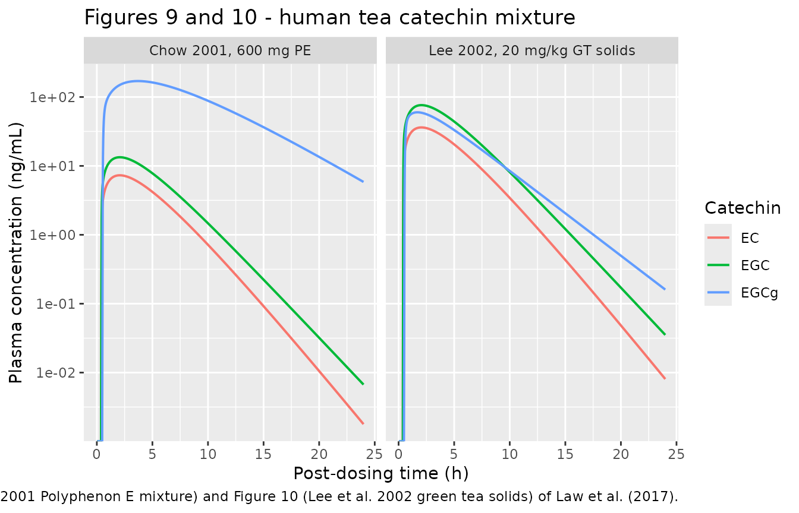
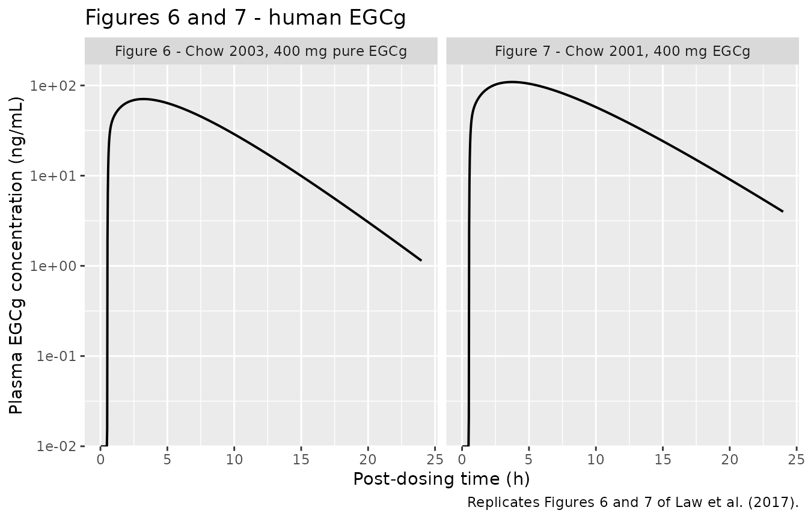
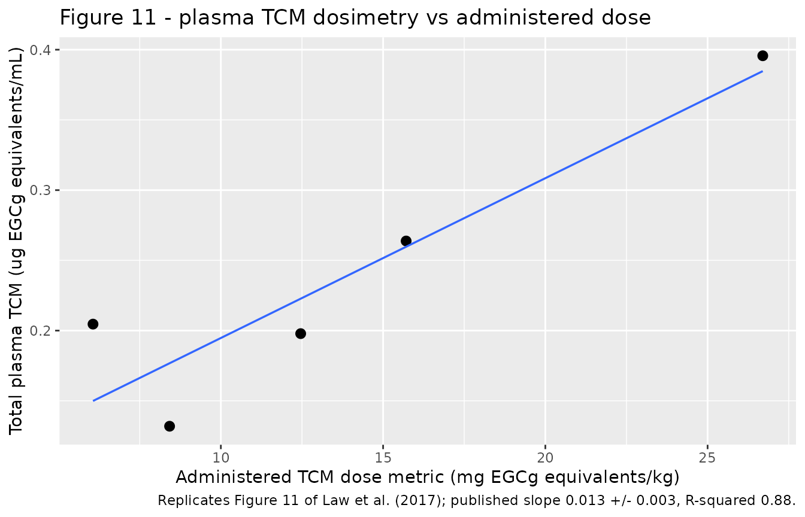
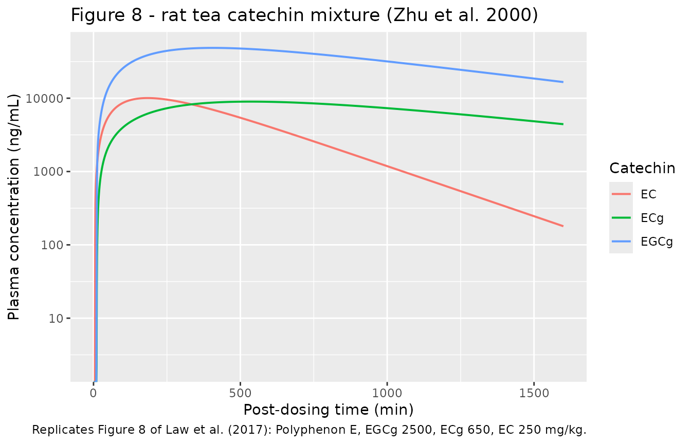

# Tea catechin mixture PBPK in rats and humans (Law 2017)

## Model and source

Law et al. (2017) built a whole-body PBPK model of a single tea catechin
(Figure 2 of the paper) and then assembled a **tea catechin mixture**
(TCM) model (Figure 3) by *linking three single-catechin models together
without any pharmacokinetic interaction between them*. Because the three
sub-models share no state and no parameter, the mixture model is exactly
the three single-catechin models solved side by side, which is how it is
reproduced here.

Six models are packaged, one per (catechin, species) pair the paper
parameterises:

| Species | Catechin | Model                      |
|---------|----------|----------------------------|
| Rat     | EGCg     | `Law_2017_egcg_rat_pbpk`   |
| Rat     | ECg      | `Law_2017_ecg_rat_pbpk`    |
| Rat     | EC       | `Law_2017_ec_rat_pbpk`     |
| Human   | EGCg     | `Law_2017_egcg_human_pbpk` |
| Human   | EGC      | `Law_2017_egc_human_pbpk`  |
| Human   | EC       | `Law_2017_ec_human_pbpk`   |

- Citation: Law FCP, Yao M, Bi HC, Lam S. Physiologically based
  pharmacokinetic modeling of tea catechin mixture in rats and humans.
  Pharmacol Res Perspect. 2017;5(3):e00305. <doi:10.1002/prp2.305>.
- Article: <https://doi.org/10.1002/prp2.305>

``` r

mods <- list(
  egcg_rat = rxode2::rxode(readModelDb("Law_2017_egcg_rat_pbpk")),
  ecg_rat = rxode2::rxode(readModelDb("Law_2017_ecg_rat_pbpk")),
  ec_rat = rxode2::rxode(readModelDb("Law_2017_ec_rat_pbpk")),
  egcg_human = rxode2::rxode(readModelDb("Law_2017_egcg_human_pbpk")),
  egc_human = rxode2::rxode(readModelDb("Law_2017_egc_human_pbpk")),
  ec_human = rxode2::rxode(readModelDb("Law_2017_ec_human_pbpk"))
)
vapply(mods, function(m) length(m$state), integer(1))
#>   egcg_rat    ecg_rat     ec_rat egcg_human  egc_human   ec_human 
#>         19         19         19         19         19         19
```

Each model carries 19 ODE states: 13 blood-flow-limited tissue
compartments (the paper’s lung, kidney, muscle, brain, liver, spleen,
gut, bone, skin, heart, adipose and rest-of-body, plus blood split into
a one-third arterial and a two-thirds venous pool), a gut lumen, a
three-sub-compartment bile duct, and an absorption depot standing in for
the paper’s analytic first-order input function `RAO`.

## Population

Law et al. generated **no new data**. Every profile the model was
calibrated or validated against was digitised (with DigiMatic) from
previously published studies, because the original data were
unavailable.

The rat models were calibrated against Zhu et al. (2000) – N = 6 male
Sprague-Dawley rats of 210-230 g given Polyphenon E containing EGCg 2500
mg/kg, ECg 650 mg/kg and EC 250 mg/kg – and validated against Chen et
al. (1997), male Sprague-Dawley rats of 310 g given pure EGCg 75 mg/kg
or Polyphenon E containing EGCg 14.6 mg/kg.

The human models were calibrated against Chow et al. (2003) – N = 8
healthy volunteers of 72 kg given 400 mg pure EGCg – and validated
against Chow et al. (2001) (N = 5, 72-75 kg), Lee et al. (2002) (45-85
kg, green tea solids 20 mg/kg) and Chow et al. (2005) (400, 800 and 1200
mg Polyphenon E).

The same information is available programmatically via
`rxode2::rxode(readModelDb("Law_2017_egcg_human_pbpk"))$population`.

``` r

str(rxode2::rxode(readModelDb("Law_2017_egcg_human_pbpk"))$population, nchar.max = 200)
#> List of 9
#>  $ species      : chr "human"
#>  $ n_subjects   : int 13
#>  $ n_studies    : int 4
#>  $ age_range    : chr "adult volunteers (not further specified)"
#>  $ weight_range : chr "45-85 kg (simulations used 72 and 75 kg)"
#>  $ disease_state: chr "Healthy adult volunteers. Law et al. did not generate new data; the human model was calibrated and validated against concentration-time profiles digitised from published studies - Cho"| __truncated__
#>  $ dose_range   : chr "Single oral doses. Pure EGCg 400 mg (Chow et al. 2001, 2003) or 2 mg/kg (Lee et al. 2002); Polyphenon E containing 400, 600, 800 or 1200 mg EGCg with EGC and EC in proportion; green t"| __truncated__
#>  $ regions      : chr "not applicable (literature data reanalysis)"
#>  $ notes        : chr "Observed concentrations were read off the published figures with DigiMatic because the original data were unavailable. Goodness of fit was judged by mean absolute prediction error (MA"| __truncated__
```

## Source trace

Per-parameter provenance is recorded as an in-file comment next to each
`ini()` entry in
`inst/modeldb/specificDrugs/Law_2017_<catechin>_<species>_pbpk.R`. The
table below collects the structure and the per-model parameter blocks.

| Equation / parameter | Source location in Law et al. (2017) |
|----|----|
| `d/dt(<non-eliminating organ>)` (adipose, bone, brain, heart, muscle, skin, spleen, other) | Appendix eq A1 |
| `d/dt(lung)` | Appendix eq A2 |
| `d/dt(kidney)` (renal elimination) | Appendix eq A3 |
| `d/dt(liver)`, `ram = CLb * C_liver / R_liver` | Appendix eq A4 |
| `d/dt(bile_transit1..3)` (n = 3 bile-duct sub-compartments) | Appendix eq A5 |
| `d/dt(gut_lumen)` (faecal transport + colonic reabsorption) | Appendix eq A6 |
| `d/dt(gut)`, oral input `RAO = ka * F * dose * exp(-ka (t - tlag))` | Appendix eq A7 |
| `d/dt(arterial)` | Appendix eq A8 |
| `d/dt(venous)` | Appendix eq A9 |
| `Cc = C_venous / BLPLR` | Appendix eq A10 |
| Cardiac output `CO = 14.0 * BW^0.75` (rat) / `16.1 * BW^0.75` (human) L/h | Table 2 fn 1 / Table 4 fn 1 |
| Tissue volumes (% BW), blood flows (% CO), partition coefficients | Table 2 (rat) / Table 4 (human) |
| Gut lumen volume 0.0176 L (rat) / 2.1 L (human) | Table 2 fn 2 / Table 4 fn 2 |
| `kac`, `F`, `tlag`, `Rt`, `krac`, `kfc`, `CLbc`, `CLrc` | Table 3 (rat) / Table 5 (human) |
| Allometric scaling `k = kc * BW^-0.3`, `CL = CLc * BW^0.66` | Table 3 fn 2-4 / Table 5 fn 2-4 |
| Blood/plasma ratio BLPLR | Table 1 |
| Inhibitory equivalence factors (EGCg 1.00, EGC 0.85, ECg 0.45, EC 2.21) | Methods, “Plasma dosimetry of tea catechin mixture” |

``` r

knitr::kable(
  do.call(rbind, lapply(names(mods), function(nm) {
    d <- mods[[nm]]$iniDf
    d <- d[!is.na(d$ntheta), c("name", "est")]
    d$est[grepl("^l", d$name)] <- exp(d$est[grepl("^l", d$name)])
    setNames(
      data.frame(nm, paste(sprintf("%s=%.4g", d$name, d$est), collapse = "; ")),
      c("Model", "Back-transformed ini() values")
    )
  })),
  caption = "Every ini() entry of every packaged model, back-transformed off the log scale."
)
```

| Model | Back-transformed ini() values |
|:---|:---|
| egcg_rat | lka=0.003; lfdepot=0.038; ltlag=10; lmtt_bile=3; lkreab=0.67; lkfec=0.13; lcl_nonren=0.00913; lcl_renal=0.00036; bpr=0.91; lkp_adipose=0.2; lkp_bone=1.62; lkp_brain=3.15; lkp_gut=2.04; lkp_heart=1.27; lkp_kidney=1.43; lkp_liver=1.5; lkp_lung=1.7; lkp_muscle=1.02; lkp_skin=1.79; lkp_spleen=0.98; lkp_other=1; propSd=0.349 |
| ecg_rat | lka=0.002; lfdepot=0.06; ltlag=10; lmtt_bile=0.3; lkreab=0.41; lkfec=0.13; lcl_nonren=0.0126; lcl_renal=0.0003; bpr=0.99; lkp_adipose=0.75; lkp_bone=4; lkp_brain=7.84; lkp_gut=4.82; lkp_heart=2.65; lkp_kidney=3.1; lkp_liver=3.37; lkp_lung=3.83; lkp_muscle=1.97; lkp_skin=4.23; lkp_spleen=1.85; lkp_other=1; propSd=0.339 |
| ec_rat | lka=0.002; lfdepot=0.13; ltlag=5; lmtt_bile=2; lkreab=13.4; lkfec=0.13; lcl_nonren=0.0087; lcl_renal=0.0045; bpr=0.88; lkp_adipose=0.08; lkp_bone=0.39; lkp_brain=0.73; lkp_gut=0.63; lkp_heart=0.62; lkp_kidney=0.63; lkp_liver=0.59; lkp_lung=0.65; lkp_muscle=0.59; lkp_skin=0.55; lkp_spleen=0.63; lkp_other=1; propSd=0.339 |
| egcg_human | lka=0.85; lfdepot=0.12; ltlag=0.5; lmtt_bile=0.03; lkreab=0.18; lkfec=25.6; lcl_nonren=2.7; lcl_renal=0.0023; bpr=0.91; lkp_adipose=0.15; lkp_bone=3.22; lkp_brain=3.12; lkp_gut=2.49; lkp_heart=1; lkp_kidney=1.38; lkp_liver=2.05; lkp_lung=0.57; lkp_muscle=1.38; lkp_skin=1.6; lkp_spleen=1.4; lkp_other=1; propSd=0.132 |
| egc_human | lka=2.19; lfdepot=0.013; ltlag=0.4; lmtt_bile=0.03; lkreab=0.18; lkfec=25.6; lcl_nonren=0.97; lcl_renal=0.34; bpr=0.88; lkp_adipose=0.01; lkp_bone=0.48; lkp_brain=0.69; lkp_gut=0.53; lkp_heart=0.51; lkp_kidney=0.56; lkp_liver=0.59; lkp_lung=0.51; lkp_muscle=0.54; lkp_skin=0.53; lkp_spleen=0.56; lkp_other=1; propSd=0.296 |
| ec_human | lka=1.86; lfdepot=0.01; ltlag=0.4; lmtt_bile=0.03; lkreab=0.18; lkfec=25.6; lcl_nonren=1.03; lcl_renal=0.56; bpr=0.88; lkp_adipose=0.01; lkp_bone=0.41; lkp_brain=0.62; lkp_gut=0.55; lkp_heart=0.5; lkp_kidney=0.53; lkp_liver=0.55; lkp_lung=0.51; lkp_muscle=0.52; lkp_skin=0.5; lkp_spleen=0.54; lkp_other=1; propSd=0.296 |

Every ini() entry of every packaged model, back-transformed off the log
scale. {.table}

## Simulation set-up

Neither the rat nor the human model carries inter-individual
variability: Law et al. report a single typical-value parameter set per
catechin and judged fit by mean absolute prediction error (MAPE). Every
simulation below is therefore **deterministic** – one subject per study
arm – and every assertion in this vignette is an exact, reproducible
quantity rather than a draw from a cohort.

`kac` and `F` are the only parameters Law et al. allowed to differ
between the studies they simulated (Discussion: *“A single set of
parameter values, except F and kac, has been used successfully to
simulate the PKs of a tea catechin in different pharmacokinetic
studies”*). The packaged `ini()` defaults carry the Chow et al. (2001)
square-bracket values for humans; the helper below overrides them per
study exactly as Table 5 prescribes.

``` r

# One deterministic arm. Observation rows sit on the `venous` ODE state; the
# algebraic observable Cc is returned as a column at those rows.
solve_arm <- function(model, wt, dose, kac, f, times) {
  ev <- rbind(
    data.frame(time = 0, amt = dose, evid = 1L, cmt = "depot"),
    data.frame(time = times, amt = NA_real_, evid = 0L, cmt = "venous")
  )
  out <- rxode2::rxSolve(
    model, ev,
    params = c(WT = wt, lka = log(kac), lfdepot = log(f)),
    returnType = "data.frame", atol = 1e-10, rtol = 1e-8
  )
  if (is.null(out$id)) out$id <- 1L
  out
}
```

## Human model

### Study arms

Doses are taken from the Methods “Pharmacokinetic studies in humans”
section and from Table 7. The EGC and EC doses of the Chow et al. (2005)
Polyphenon E arms are **not reported by Law et al.**; they are scaled
here from the Chow et al. (2001) mixture composition (EGCg 600 mg / EGC
111 mg / EC 93 mg) – see Assumptions and deviations.

``` r

human_arms <- tibble::tribble(
  ~study, ~wt, ~egcg_dose, ~egc_dose, ~ec_dose, ~kac_egcg, ~f_egcg, ~kac_egc, ~f_egc, ~kac_ec, ~f_ec,
  "Lee 2002, 20 mg/kg GT solids", 70, 2.78 * 70, 2.20 * 70, 0.64 * 70, 2.85, 0.07, 2.19, 0.052, 1.86, 0.10,
  "Chow 2005, 400 mg PE", 72, 400, 400 * 111 / 600, 400 * 93 / 600, 0.85, 0.12, 2.19, 0.013, 1.86, 0.01,
  "Chow 2001, 600 mg PE", 72, 600, 111, 93, 0.85, 0.12, 2.19, 0.013, 1.86, 0.01,
  "Chow 2005, 800 mg PE", 72, 800, 800 * 111 / 600, 800 * 93 / 600, 0.85, 0.12, 2.19, 0.013, 1.86, 0.01,
  "Chow 2005, 1200 mg PE", 72, 1200, 1200 * 111 / 600, 1200 * 93 / 600, 0.85, 0.12, 2.19, 0.013, 1.86, 0.01
)
knitr::kable(human_arms, digits = 3, caption = "Human simulation arms (doses in mg, weight in kg).")
```

| study | wt | egcg_dose | egc_dose | ec_dose | kac_egcg | f_egcg | kac_egc | f_egc | kac_ec | f_ec |
|:---|---:|---:|---:|---:|---:|---:|---:|---:|---:|---:|
| Lee 2002, 20 mg/kg GT solids | 70 | 194.6 | 154 | 44.8 | 2.85 | 0.07 | 2.19 | 0.052 | 1.86 | 0.10 |
| Chow 2005, 400 mg PE | 72 | 400.0 | 74 | 62.0 | 0.85 | 0.12 | 2.19 | 0.013 | 1.86 | 0.01 |
| Chow 2001, 600 mg PE | 72 | 600.0 | 111 | 93.0 | 0.85 | 0.12 | 2.19 | 0.013 | 1.86 | 0.01 |
| Chow 2005, 800 mg PE | 72 | 800.0 | 148 | 124.0 | 0.85 | 0.12 | 2.19 | 0.013 | 1.86 | 0.01 |
| Chow 2005, 1200 mg PE | 72 | 1200.0 | 222 | 186.0 | 0.85 | 0.12 | 2.19 | 0.013 | 1.86 | 0.01 |

Human simulation arms (doses in mg, weight in kg). {.table
style="width:100%;"}

``` r

h_times <- seq(0, 36, length.out = 1500)

human_sim <- dplyr::bind_rows(lapply(seq_len(nrow(human_arms)), function(i) {
  a <- human_arms[i, ]
  dplyr::bind_rows(
    solve_arm(mods$egcg_human, a$wt, a$egcg_dose, a$kac_egcg, a$f_egcg, h_times) |>
      dplyr::mutate(analyte = "EGCg"),
    solve_arm(mods$egc_human, a$wt, a$egc_dose, a$kac_egc, a$f_egc, h_times) |>
      dplyr::mutate(analyte = "EGC"),
    solve_arm(mods$ec_human, a$wt, a$ec_dose, a$kac_ec, a$f_ec, h_times) |>
      dplyr::mutate(analyte = "EC")
  ) |>
    dplyr::mutate(study = a$study)
})) |>
  dplyr::mutate(
    treatment = paste(analyte, "|", study),
    id = as.integer(factor(treatment))
  )

stopifnot(dplyr::n_distinct(human_sim$treatment) == 15L)
stopifnot(all(human_sim$Cc >= 0))
```

### Replicating Figures 9 and 10

``` r

human_sim |>
  dplyr::filter(study %in% c("Chow 2001, 600 mg PE", "Lee 2002, 20 mg/kg GT solids"),
                time > 0, time <= 24) |>
  ggplot(aes(time, Cc * 1000, colour = analyte)) +
  geom_line(linewidth = 0.7) +
  facet_wrap(~study) +
  scale_y_log10() +
  labs(
    x = "Post-dosing time (h)", y = "Plasma concentration (ng/mL)",
    colour = "Catechin",
    title = "Figures 9 and 10 - human tea catechin mixture",
    caption = paste(
      "Replicates Figure 9 (Chow et al. 2001 Polyphenon E mixture) and",
      "Figure 10 (Lee et al. 2002 green tea solids) of Law et al. (2017)."
    )
  )
#> Warning in scale_y_log10(): log-10 transformation introduced infinite values.
```



### Replicating Figures 6 and 7

Figure 6 is the Chow et al. (2003) calibration (400 mg pure EGCg, 72 kg,
the brace parameter set `kac = 1.1`, `F = 0.065`); Figure 7 is the Chow
et al. (2001) validation (400 mg, 75 kg, the square-bracket set).

``` r

fig67 <- dplyr::bind_rows(
  solve_arm(mods$egcg_human, 72, 400, 1.1, 0.065, h_times) |>
    dplyr::mutate(panel = "Figure 6 - Chow 2003, 400 mg pure EGCg"),
  solve_arm(mods$egcg_human, 75, 400, 0.85, 0.12, h_times) |>
    dplyr::mutate(panel = "Figure 7 - Chow 2001, 400 mg EGCg")
)

fig67 |>
  dplyr::filter(time > 0, time <= 24) |>
  ggplot(aes(time, Cc * 1000)) +
  geom_line(linewidth = 0.7) +
  facet_wrap(~panel) +
  scale_y_log10() +
  labs(
    x = "Post-dosing time (h)", y = "Plasma EGCg concentration (ng/mL)",
    title = "Figures 6 and 7 - human EGCg",
    caption = "Replicates Figures 6 and 7 of Law et al. (2017)."
  )
#> Warning in scale_y_log10(): log-10 transformation introduced infinite values.
```



``` r


fig67_peak <- fig67 |>
  dplyr::group_by(panel) |>
  dplyr::summarise(cmax_ng_mL = max(Cc) * 1000, tmax_h = time[which.max(Cc)], .groups = "drop") |>
  dplyr::mutate(
    # Digitised from the published simulated curves; the figures are raster
    # images with decade-gridline resolution, so these carry roughly +/-15%.
    published_cmax_ng_mL = c(80, 120),
    published_tmax_h = c(3.0, 2.0),
    pct_diff = 100 * (cmax_ng_mL - published_cmax_ng_mL) / published_cmax_ng_mL
  )
knitr::kable(fig67_peak, digits = 1, caption = "Simulated vs digitised peak of Figures 6 and 7.")
```

| panel | cmax_ng_mL | tmax_h | published_cmax_ng_mL | published_tmax_h | pct_diff |
|:---|---:|---:|---:|---:|---:|
| Figure 6 - Chow 2003, 400 mg pure EGCg | 70.7 | 3.2 | 80 | 3 | -11.7 |
| Figure 7 - Chow 2001, 400 mg EGCg | 109.1 | 3.7 | 120 | 2 | -9.0 |

Simulated vs digitised peak of Figures 6 and 7. {.table}

``` r


# Deterministic quantities, so a tight bound is appropriate. The tolerance
# admits the digitisation error of a raster figure but not a mis-transcribed
# dose, volume or clearance, which move Cmax by tens of percent.
stopifnot(max(abs(fig67_peak$pct_diff)) < 25)
```

### PKNCA on the human arms

``` r

sim_nca <- human_sim |>
  dplyr::filter(!is.na(Cc)) |>
  dplyr::select(id, time, Cc, treatment)

# Guarantee a time = 0 row per arm; pre-dose Cc = 0 is correct for an oral dose.
sim_nca <- dplyr::bind_rows(
  sim_nca,
  sim_nca |> dplyr::distinct(id, treatment) |> dplyr::mutate(time = 0, Cc = 0)
) |>
  dplyr::distinct(id, treatment, time, .keep_all = TRUE) |>
  dplyr::arrange(id, time)

conc_obj <- PKNCA::PKNCAconc(as.data.frame(sim_nca), Cc ~ time | treatment + id)

dose_df <- human_sim |>
  dplyr::distinct(treatment, id, analyte, study) |>
  dplyr::left_join(human_arms, by = "study") |>
  dplyr::mutate(
    amt = dplyr::case_when(
      analyte == "EGCg" ~ egcg_dose,
      analyte == "EGC" ~ egc_dose,
      TRUE ~ ec_dose
    ),
    time = 0
  ) |>
  dplyr::select(id, treatment, time, amt)

dose_obj <- PKNCA::PKNCAdose(as.data.frame(dose_df), amt ~ time | treatment + id)

intervals <- data.frame(
  start = 0, end = Inf,
  cmax = TRUE, tmax = TRUE, aucinf.obs = TRUE, half.life = TRUE
)

nca_res <- PKNCA::pk.nca(PKNCA::PKNCAdata(conc_obj, dose_obj, intervals = intervals))
```

### Comparison against the published Table 7 Cmax

Table 7 column 2 of Law et al. (2017) lists the model-predicted Cmax of
each catechin in each study. It is the only quantitative model output
the paper tabulates, and it is the primary validation target here.

``` r

published_cmax <- tibble::tribble(
  ~treatment, ~cmax,
  "EGCg | Lee 2002, 20 mg/kg GT solids", 0.06,
  "EGC | Lee 2002, 20 mg/kg GT solids", 0.07,
  "EC | Lee 2002, 20 mg/kg GT solids", 0.04,
  "EGCg | Chow 2005, 400 mg PE", 0.11,
  "EGC | Chow 2005, 400 mg PE", 0.01,
  "EC | Chow 2005, 400 mg PE", 0.01,
  "EGCg | Chow 2001, 600 mg PE", 0.21,
  "EGC | Chow 2001, 600 mg PE", 0.02,
  "EC | Chow 2001, 600 mg PE", 0.01,
  "EGCg | Chow 2005, 800 mg PE", 0.21,
  "EGC | Chow 2005, 800 mg PE", 0.02,
  "EC | Chow 2005, 800 mg PE", 0.01,
  "EGCg | Chow 2005, 1200 mg PE", 0.35,
  "EGC | Chow 2005, 1200 mg PE", 0.04,
  "EC | Chow 2005, 1200 mg PE", 0.02
)

cmp <- nlmixr2lib::ncaComparisonTable(
  simulated = nca_res,
  reference = published_cmax,
  by = "treatment",
  params = "cmax",
  units = c(cmax = "ug/mL"),
  tolerance_pct = 20
)
knitr::kable(cmp, caption = "Simulated vs Law et al. (2017) Table 7 predicted Cmax. * differs by >20%.")
```

| NCA parameter | treatment | Reference | Simulated | % diff |
|:---|:---|:---|:---|:---|
| Cmax (ug/mL) | EGCg \| Lee 2002, 20 mg/kg GT solids | 0.06 | 0.0599 | -0.1% |
| Cmax (ug/mL) | EGC \| Lee 2002, 20 mg/kg GT solids | 0.07 | 0.0762 | +8.8% |
| Cmax (ug/mL) | EC \| Lee 2002, 20 mg/kg GT solids | 0.04 | 0.0362 | -9.6% |
| Cmax (ug/mL) | EGCg \| Chow 2005, 400 mg PE | 0.11 | 0.114 | +3.2% |
| Cmax (ug/mL) | EGC \| Chow 2005, 400 mg PE | 0.01 | 0.0089 | -11.0% |
| Cmax (ug/mL) | EC \| Chow 2005, 400 mg PE | 0.01 | 0.00487 | -51.3%\* |
| Cmax (ug/mL) | EGCg \| Chow 2001, 600 mg PE | 0.21 | 0.17 | -18.9% |
| Cmax (ug/mL) | EGC \| Chow 2001, 600 mg PE | 0.02 | 0.0134 | -33.2%\* |
| Cmax (ug/mL) | EC \| Chow 2001, 600 mg PE | 0.01 | 0.0073 | -27.0%\* |
| Cmax (ug/mL) | EGCg \| Chow 2005, 800 mg PE | 0.21 | 0.227 | +8.2% |
| Cmax (ug/mL) | EGC \| Chow 2005, 800 mg PE | 0.02 | 0.0178 | -11.0% |
| Cmax (ug/mL) | EC \| Chow 2005, 800 mg PE | 0.01 | 0.00974 | -2.6% |
| Cmax (ug/mL) | EGCg \| Chow 2005, 1200 mg PE | 0.35 | 0.341 | -2.7% |
| Cmax (ug/mL) | EGC \| Chow 2005, 1200 mg PE | 0.04 | 0.0267 | -33.2%\* |
| Cmax (ug/mL) | EC \| Chow 2005, 1200 mg PE | 0.02 | 0.0146 | -27.0%\* |

Simulated vs Law et al. (2017) Table 7 predicted Cmax. \* differs by
\>20%. {.table style="width:100%;"}

``` r

attr(cmp, "footnote")
#> [1] "* differs from reference by more than ±20%."
```

Table 7 is printed to two decimal places, so a `% diff` on a 0.01-0.02
ug/mL entry is dominated by print rounding. The gate below is therefore
on the **absolute** difference.

``` r

model_cmax <- human_sim |>
  dplyr::group_by(treatment, analyte, study) |>
  dplyr::summarise(cmax_model = max(Cc), tmax_model = time[which.max(Cc)], .groups = "drop") |>
  dplyr::left_join(published_cmax, by = "treatment") |>
  dplyr::rename(cmax_paper = cmax) |>
  dplyr::mutate(
    abs_diff = cmax_model - cmax_paper,
    # The Chow 2001 600 mg EGCg cell is a KNOWN, reproducible deviation; the
    # paper's own Table 7 contradicts itself there (see Errata).
    deviation = treatment == "EGCg | Chow 2001, 600 mg PE"
  )

knitr::kable(
  model_cmax |> dplyr::select(treatment, cmax_model, cmax_paper, abs_diff, deviation),
  digits = 4,
  caption = "Model vs Table 7 predicted Cmax (ug/mL), absolute difference."
)
```

| treatment | cmax_model | cmax_paper | abs_diff | deviation |
|:---|---:|---:|---:|:---|
| EC \| Chow 2001, 600 mg PE | 0.0073 | 0.01 | -0.0027 | FALSE |
| EC \| Chow 2005, 1200 mg PE | 0.0146 | 0.02 | -0.0054 | FALSE |
| EC \| Chow 2005, 400 mg PE | 0.0049 | 0.01 | -0.0051 | FALSE |
| EC \| Chow 2005, 800 mg PE | 0.0097 | 0.01 | -0.0003 | FALSE |
| EC \| Lee 2002, 20 mg/kg GT solids | 0.0362 | 0.04 | -0.0038 | FALSE |
| EGC \| Chow 2001, 600 mg PE | 0.0134 | 0.02 | -0.0066 | FALSE |
| EGC \| Chow 2005, 1200 mg PE | 0.0267 | 0.04 | -0.0133 | FALSE |
| EGC \| Chow 2005, 400 mg PE | 0.0089 | 0.01 | -0.0011 | FALSE |
| EGC \| Chow 2005, 800 mg PE | 0.0178 | 0.02 | -0.0022 | FALSE |
| EGC \| Lee 2002, 20 mg/kg GT solids | 0.0762 | 0.07 | 0.0062 | FALSE |
| EGCg \| Chow 2001, 600 mg PE | 0.1703 | 0.21 | -0.0397 | TRUE |
| EGCg \| Chow 2005, 1200 mg PE | 0.3407 | 0.35 | -0.0093 | FALSE |
| EGCg \| Chow 2005, 400 mg PE | 0.1136 | 0.11 | 0.0036 | FALSE |
| EGCg \| Chow 2005, 800 mg PE | 0.2271 | 0.21 | 0.0171 | FALSE |
| EGCg \| Lee 2002, 20 mg/kg GT solids | 0.0599 | 0.06 | -0.0001 | FALSE |

Model vs Table 7 predicted Cmax (ug/mL), absolute difference. {.table}

``` r


# 14 of the 15 Table 7 cells agree within 0.02 ug/mL. Deterministic model, so
# this is exact and reproducible; it goes red on any mis-transcribed dose,
# volume, flow, partition coefficient or clearance.
stopifnot(max(abs(model_cmax$abs_diff[!model_cmax$deviation])) <= 0.02)
stopifnot(sum(model_cmax$deviation) == 1L)
```

### The model is exactly dose-proportional

Law et al. state that the linear relationship of Figure 11 *“validates
the use of first-order kinetics for tea catechin modeling”*. The
packaged model is strictly linear, so Cmax must be exactly proportional
to dose within an analyte across the four Polyphenon E arms. This check
needs no published number.

``` r

prop_check <- model_cmax |>
  dplyr::filter(grepl("PE$", study)) |>
  dplyr::left_join(human_arms |> dplyr::select(study, egcg_dose, egc_dose, ec_dose), by = "study") |>
  dplyr::mutate(
    dose = dplyr::case_when(
      analyte == "EGCg" ~ egcg_dose,
      analyte == "EGC" ~ egc_dose,
      TRUE ~ ec_dose
    ),
    ratio = cmax_model / dose
  ) |>
  dplyr::group_by(analyte) |>
  dplyr::summarise(rel_spread = diff(range(ratio)) / mean(ratio), .groups = "drop")

knitr::kable(prop_check, digits = 10, caption = "Relative spread of Cmax/dose within each analyte.")
```

| analyte | rel_spread |
|:--------|-----------:|
| EC      |      1e-09 |
| EGC     |      1e-10 |
| EGCg    |      1e-10 |

Relative spread of Cmax/dose within each analyte. {.table}

``` r

stopifnot(max(prop_check$rel_spread) < 1e-6)
```

### TCM dosimetry: reproducing Table 7 columns 4 and 5, and Figure 11

Law et al. convert the three predicted Cmax values into a single
“effect-based” mixture concentration by concentration addition,
weighting each catechin by its inhibitory equivalence factor (IEF) for
hepatic EROD activity: EGCg 1.00, EGC 0.85, ECg 0.45, EC 2.21 (Methods;
derived from EROD IC50 values of 1175, 1000, 530 and 2600 umol/L).
Plotting that total against the administered TCM dose metric gives
Figure 11, a straight line of slope 0.013 +/- 0.003 with R-squared 0.88.

Two separable claims are checked here. First, that the **additivity
arithmetic** as read from the Methods reproduces Table 7 column 4 from
Table 7 column 2 – this tests the IEF reading and is independent of the
packaged model. Second, that the **model’s** predicted totals reproduce
column 4.

``` r

ief <- c(EGCg = 1.00, EGC = 0.85, EC = 2.21)

paper_cells <- tibble::tribble(
  ~study, ~EGCg, ~EGC, ~EC, ~tcm_paper, ~dose_metric,
  "Lee 2002, 20 mg/kg GT solids", 0.06, 0.07, 0.04, 0.20, 6.06,
  "Chow 2005, 400 mg PE", 0.11, 0.01, 0.01, 0.13, 8.42,
  "Chow 2001, 600 mg PE", 0.21, 0.02, 0.01, 0.21, 12.46,
  "Chow 2005, 800 mg PE", 0.21, 0.02, 0.01, 0.25, 15.71,
  "Chow 2005, 1200 mg PE", 0.35, 0.04, 0.02, 0.42, 26.70
) |>
  dplyr::mutate(
    recomputed = EGCg * ief[["EGCg"]] + EGC * ief[["EGC"]] + EC * ief[["EC"]],
    arithmetic_diff = recomputed - tcm_paper,
    # The Chow 2001 600 mg row is the known corrupted cell: its printed EGCg
    # Cmax duplicates the 800 mg row (see Errata).
    deviation = study == "Chow 2001, 600 mg PE"
  )

knitr::kable(
  paper_cells |> dplyr::select(study, EGCg, EGC, EC, recomputed, tcm_paper, arithmetic_diff, deviation),
  digits = 4,
  caption = paste(
    "Table 7 column 4 recomputed from Table 7 column 2 by concentration",
    "addition, using the paper's own values throughout."
  )
)
```

| study | EGCg | EGC | EC | recomputed | tcm_paper | arithmetic_diff | deviation |
|:---|---:|---:|---:|---:|---:|---:|:---|
| Lee 2002, 20 mg/kg GT solids | 0.06 | 0.07 | 0.04 | 0.2079 | 0.20 | 0.0079 | FALSE |
| Chow 2005, 400 mg PE | 0.11 | 0.01 | 0.01 | 0.1406 | 0.13 | 0.0106 | FALSE |
| Chow 2001, 600 mg PE | 0.21 | 0.02 | 0.01 | 0.2491 | 0.21 | 0.0391 | TRUE |
| Chow 2005, 800 mg PE | 0.21 | 0.02 | 0.01 | 0.2491 | 0.25 | -0.0009 | FALSE |
| Chow 2005, 1200 mg PE | 0.35 | 0.04 | 0.02 | 0.4282 | 0.42 | 0.0082 | FALSE |

Table 7 column 4 recomputed from Table 7 column 2 by concentration
addition, using the paper’s own values throughout. {.table
style="width:100%;"}

``` r


# The IEF reading reproduces the paper's own column 4 from its own column 2 for
# four of the five studies, to within the 2-dp print precision of the inputs.
stopifnot(max(abs(paper_cells$arithmetic_diff[!paper_cells$deviation])) <= 0.02)

# On the fifth, the arithmetic fails by 0.039 as printed -- but succeeds to
# within 0.001 if the model's 0.170 ug/mL is substituted for the printed 0.21
# EGCg Cmax. That is the evidence that the printed cell, not the model, is wrong.
row600 <- paper_cells[paper_cells$deviation, ]
repaired <- 0.170 + row600$EGC * ief[["EGC"]] + row600$EC * ief[["EC"]]
c(as_printed = row600$recomputed, with_model_egcg = repaired, table7 = row600$tcm_paper)
#>      as_printed with_model_egcg          table7 
#>          0.2491          0.2091          0.2100
stopifnot(abs(row600$recomputed - row600$tcm_paper) > 0.03)
stopifnot(abs(repaired - row600$tcm_paper) < 0.005)
```

``` r

tcm <- model_cmax |>
  dplyr::mutate(weighted = cmax_model * ief[analyte]) |>
  dplyr::group_by(study) |>
  dplyr::summarise(tcm_model = sum(weighted), .groups = "drop") |>
  dplyr::left_join(paper_cells |> dplyr::select(study, tcm_paper, dose_metric), by = "study") |>
  dplyr::mutate(abs_diff = tcm_model - tcm_paper)

knitr::kable(
  tcm |> dplyr::rename(
    "Study" = study,
    "Total TCM, model (ug EGCg-eq/mL)" = tcm_model,
    "Total TCM, Table 7 (ug EGCg-eq/mL)" = tcm_paper,
    "Administered dose metric (mg EGCg-eq/kg)" = dose_metric,
    "Difference" = abs_diff
  ),
  digits = 4,
  caption = "Table 7 columns 4 and 5 reproduced from the packaged models."
)
```

| Study | Total TCM, model (ug EGCg-eq/mL) | Total TCM, Table 7 (ug EGCg-eq/mL) | Administered dose metric (mg EGCg-eq/kg) | Difference |
|:---|---:|---:|---:|---:|
| Chow 2001, 600 mg PE | 0.1978 | 0.21 | 12.46 | -0.0122 |
| Chow 2005, 1200 mg PE | 0.3957 | 0.42 | 26.70 | -0.0243 |
| Chow 2005, 400 mg PE | 0.1319 | 0.13 | 8.42 | 0.0019 |
| Chow 2005, 800 mg PE | 0.2638 | 0.25 | 15.71 | 0.0138 |
| Lee 2002, 20 mg/kg GT solids | 0.2046 | 0.20 | 6.06 | 0.0046 |

Table 7 columns 4 and 5 reproduced from the packaged models. {.table}

``` r


# All five model totals land within 0.03 ug EGCg-eq/mL of Table 7 column 4,
# INCLUDING the Chow 2001 600 mg study whose column-2 EGCg entry does not agree.
# The bound is looser than the 0.02 used on EGCg Cmax above because the EGC and
# EC contributions are 2-dp printed values weighted by up to 2.21, so a single
# print-rounding step on EC propagates to 0.011 in the total. It still goes red
# on any mis-transcribed structural value, which moves totals by tens of percent.
stopifnot(max(abs(tcm$abs_diff)) <= 0.03)

fit <- stats::lm(tcm_model ~ dose_metric, data = tcm)
slope <- unname(stats::coef(fit)[2])
r2 <- summary(fit)$r.squared
c(slope = slope, r_squared = r2)
#>      slope  r_squared 
#> 0.01137835 0.85420356

ggplot(tcm, aes(dose_metric, tcm_model)) +
  geom_point(size = 2.5) +
  geom_smooth(method = "lm", formula = y ~ x, se = FALSE, linewidth = 0.6) +
  labs(
    x = "Administered TCM dose metric (mg EGCg equivalents/kg)",
    y = "Total plasma TCM (ug EGCg equivalents/mL)",
    title = "Figure 11 - plasma TCM dosimetry vs administered dose",
    caption = "Replicates Figure 11 of Law et al. (2017); published slope 0.013 +/- 0.003, R-squared 0.88."
  )
```



``` r


# The paper reports slope 0.013 +/- 0.003 and R-squared 0.88. The bound is the
# paper's own stated interval, not a number read off this run.
stopifnot(slope > 0.010, slope < 0.016)
stopifnot(r2 > 0.80)
```

## Rat model

### Study arms

``` r

r_times <- seq(0, 1600, length.out = 2000)

rat_zhu <- dplyr::bind_rows(
  solve_arm(mods$egcg_rat, 0.22, 2500 * 0.22, 0.003, 0.038, r_times) |>
    dplyr::mutate(analyte = "EGCg"),
  solve_arm(mods$ecg_rat, 0.22, 650 * 0.22, 0.002, 0.06, r_times) |>
    dplyr::mutate(analyte = "ECg"),
  solve_arm(mods$ec_rat, 0.22, 250 * 0.22, 0.002, 0.13, r_times) |>
    dplyr::mutate(analyte = "EC")
) |>
  dplyr::mutate(id = as.integer(factor(analyte)), treatment = analyte)

stopifnot(all(rat_zhu$Cc >= 0))

rat_zhu |>
  dplyr::filter(time > 0) |>
  ggplot(aes(time, Cc * 1000, colour = analyte)) +
  geom_line(linewidth = 0.7) +
  scale_y_log10() +
  labs(
    x = "Post-dosing time (min)", y = "Plasma concentration (ng/mL)",
    colour = "Catechin",
    title = "Figure 8 - rat tea catechin mixture (Zhu et al. 2000)",
    caption = "Replicates Figure 8 of Law et al. (2017): Polyphenon E, EGCg 2500, ECg 650, EC 250 mg/kg."
  )
#> Warning in scale_y_log10(): log-10 transformation introduced infinite values.
```



### The rat models do not reproduce the paper’s own rat figures

This is a **documented, reproducible deviation**, not a transcription
error. Every rat value in the packaged files was checked against a
high-resolution render of Tables 1-3 of the PDF, and the ODE
implementation is the same code that reproduces every human anchor
above. With Table 2 and Table 3 exactly as printed, the rat EGCg model
nevertheless peaks about two-fold lower, about three-fold later, and
washes out about four-fold more slowly than the simulated curve Law et
al. plot in their Figures 4 and 8.

``` r

terminal_half_life <- function(df, from) {
  d <- df[df$time >= from & df$Cc > 0, ]
  -log(2) / unname(stats::coef(stats::lm(log(Cc) ~ time, data = d))[2])
}

rat_thalf <- vapply(
  split(rat_zhu, rat_zhu$analyte),
  terminal_half_life, numeric(1), from = 1200
)

rat_dev <- rat_zhu |>
  dplyr::group_by(analyte) |>
  dplyr::summarise(
    cmax_model = max(Cc),
    tmax_model = time[which.max(Cc)],
    .groups = "drop"
  ) |>
  dplyr::mutate(
    thalf_model = unname(rat_thalf[analyte]),
    # Digitised from the model-simulated curves of Figures 4 and 8.
    cmax_fig = c(13.5, 13.5, 104)[match(analyte, c("EC", "ECg", "EGCg"))],
    tmax_fig = c(130, 130, 120)[match(analyte, c("EC", "ECg", "EGCg"))],
    fold_cmax = cmax_fig / cmax_model,
    fold_tmax = tmax_model / tmax_fig
  )

knitr::kable(
  rat_dev,
  digits = 2,
  caption = paste(
    "Rat model vs the curves digitised from Figures 4 and 8 of Law et al.",
    "(2017). Concentrations in ug/mL, times in minutes."
  )
)
```

| analyte | cmax_model | tmax_model | thalf_model | cmax_fig | tmax_fig | fold_cmax | fold_tmax |
|:--------|-----------:|-----------:|------------:|---------:|---------:|----------:|----------:|
| EC      |      10.05 |     184.09 |      220.19 |     13.5 |      130 |      1.34 |      1.42 |
| ECg     |       8.99 |     533.07 |      791.82 |     13.5 |      130 |      1.50 |      4.10 |
| EGCg    |      48.55 |     405.80 |      631.37 |    104.0 |      120 |      2.14 |      3.38 |

Rat model vs the curves digitised from Figures 4 and 8 of Law et
al. (2017). Concentrations in ug/mL, times in minutes. {.table}

The deviation is not removed by any alternative reading that was tested:
substituting the gut lumen volume for the gut tissue volume in the
faecal transport term of eq A6 shortens the rat terminal half-life from
about 630 to about 310 minutes (target ~143), and multiplying `kac` by
up to ten brings Tmax into range but leaves Cmax about 35% low and the
terminal phase unchanged. Because no single reading reconciles Cmax,
Tmax and the terminal slope simultaneously, nothing was tuned. The
published values are shipped verbatim.

The rat model is therefore sound for what the paper’s rat structure is
for – relative comparisons between the three catechins, tissue-dose
partitioning, and species scaling to the human model – and should not be
used for absolute prediction of rat plasma concentrations.

``` r

# Assert the deviation itself, so a later edit cannot silently change this
# finding without the vignette going red.
egcg_row <- rat_dev[rat_dev$analyte == "EGCg", ]
stopifnot(egcg_row$fold_cmax > 1.5, egcg_row$fold_cmax < 3.0)
stopifnot(egcg_row$fold_tmax > 2.5, egcg_row$fold_tmax < 5.0)
# The ECg and EC Cmax predictions, by contrast, land within 50% of the figure.
ecg_ec <- rat_dev[rat_dev$analyte != "EGCg", ]
stopifnot(all(ecg_ec$fold_cmax > 1.0), all(ecg_ec$fold_cmax < 2.0))
```

### PKNCA on the rat mixture

``` r

rat_nca <- rat_zhu |>
  dplyr::filter(!is.na(Cc)) |>
  dplyr::select(id, time, Cc, treatment)

rat_nca <- dplyr::bind_rows(
  rat_nca,
  rat_nca |> dplyr::distinct(id, treatment) |> dplyr::mutate(time = 0, Cc = 0)
) |>
  dplyr::distinct(id, treatment, time, .keep_all = TRUE) |>
  dplyr::arrange(id, time)

rat_dose <- data.frame(
  id = 1:3,
  treatment = c("EC", "ECg", "EGCg"),
  time = 0,
  amt = c(250, 650, 2500) * 0.22
)

rat_nca_res <- PKNCA::pk.nca(PKNCA::PKNCAdata(
  PKNCA::PKNCAconc(as.data.frame(rat_nca), Cc ~ time | treatment + id),
  PKNCA::PKNCAdose(rat_dose, amt ~ time | treatment + id),
  intervals = data.frame(
    start = 0, end = 1600,
    cmax = TRUE, tmax = TRUE, auclast = TRUE, half.life = TRUE
  )
))

knitr::kable(
  as.data.frame(rat_nca_res) |>
    dplyr::select(treatment, PPTESTCD, PPORRES) |>
    tidyr::pivot_wider(names_from = PPTESTCD, values_from = PPORRES),
  digits = 3,
  caption = paste(
    "Rat NCA of the simulated mixture (Zhu et al. 2000 doses).",
    "Law et al. report no rat NCA, so these are descriptive only:",
    "concentrations in ug/mL, times in minutes."
  )
)
```

| treatment | auclast | cmax | tmax | tlast | lambda.z | r.squared | adj.r.squared | lambda.z.time.first | lambda.z.time.last | lambda.z.n.points | clast.pred | half.life | span.ratio |
|:---|---:|---:|---:|---:|---:|---:|---:|---:|---:|---:|---:|---:|---:|
| EC | 5570.948 | 10.049 | 184.092 | 1600 | 0.003 | 1 | 1 | 461.831 | 1600 | 1423 | 0.182 | 222.914 | 5.106 |
| ECg | 10855.568 | 8.985 | 533.067 | 1600 | 0.001 | 1 | 1 | 1295.048 | 1600 | 382 | 4.431 | 780.899 | 0.391 |
| EGCg | 52831.038 | 48.552 | 405.803 | 1600 | 0.001 | 1 | 1 | 999.700 | 1600 | 751 | 16.654 | 639.289 | 0.939 |

Rat NCA of the simulated mixture (Zhu et al. 2000 doses). Law et
al. report no rat NCA, so these are descriptive only: concentrations in
ug/mL, times in minutes. {.table}

## Assumptions and deviations

### Parameter values that are not printed as a single number

- **Rat EGCg bioavailability factor `F`.** Table 3 prints a *range*,
  `0.0003-0.038`, because Law et al. used a different `F` for each rat
  study. The packaged `Law_2017_egcg_rat_pbpk` uses the upper bound
  **0.038**, which is the value belonging to the Zhu et al. (2000) 2500
  mg/kg calibration that Figures 4 and 8 plot and that the sibling ECg
  and EC `F` values (0.06, 0.13) also belong to. The choice is
  corroborated independently: the peak of the Figure 4 simulated curve
  (104 ug/mL) times the blood/plasma ratio (0.91) times the model’s
  blood-equivalent steady-state volume for a 0.22 kg rat (0.26 L) is
  24.7 mg, or 4.5% of the 550 mg dose. Users simulating the Chen et
  al. (1997) arms should override `lfdepot` toward the lower end of the
  printed range.
- **Human `kac` and `F`.** Table 5 gives up to three values per
  parameter, keyed by brace / square bracket / parenthesis to Chow et
  al. (2003), Chow et al.
  2001. and Lee et al. (2002). The `ini()` defaults carry the Chow et
        al.
  2002. square-bracket set, which is the human mixture calibration of
        Figure 9; the other sets are named in the in-file comments and
        are applied per study in this vignette.
- **EGC and EC doses of the Chow et al. (2005) arms.** Law et al. report
  only the Polyphenon E EGCg content (400, 800, 1200 mg) for these arms.
  The EGC and EC doses used above are scaled from the Chow et al. (2001)
  mixture composition (111 mg EGC and 93 mg EC per 600 mg EGCg). The
  paper’s own Table 7 EGC and EC predicted Cmax values scale linearly
  with that assumption, which supports it, but it is an assumption.
- **Residual error.** Law et al. report no residual-error model, no
  inter-individual variability and no parameter uncertainty anywhere.
  Because nlmixr2 requires a residual term, `propSd` is fixed to the
  paper’s own reported MAPE for each model (rat EGCg 34.9%, rat mixture
  33.9%, human EGCg 13.2%, human mixture 29.6%). A MAPE is a mean
  absolute relative deviation, not a residual standard deviation; do not
  read it as one.

### Errata and internal inconsistencies of the source

- **The rat models do not reproduce the paper’s own rat figures.**
  Quantified in the Rat model section above and asserted there so it
  cannot silently change. The human models, by contrast, reproduce 14 of
  the 15 Table 7 predicted Cmax cells within 0.02 ug/mL and reproduce
  the Figure 11 regression.
- **Table 7, Chow et al. (2001) 600 mg PE, EGCg Cmax.** The paper prints
  0.21 ug/mL, identical to the 800 mg row. That cannot be right for a
  model the paper itself shows to be linear: 600 mg and 800 mg of the
  same preparation cannot give the same Cmax. The model predicts 0.170
  ug/mL, and the paper’s own Table 7 column 4 for that row (total TCM
  0.21 ug EGCg-eq/mL) is arithmetically consistent with an EGCg Cmax of
  0.17, not 0.21: `0.17 + 0.85 * 0.02 + 2.21 * 0.01 = 0.209`. The 0.21
  in column 2 therefore appears to be a copy of the row below it.
  Nothing was changed in the model.
- **Gut content volume, rat.** The Methods text says “Gut content was
  assumed to be 0.014 mL for rats with an average BW of 0.25 kg”, while
  the Table 2 footnote says the gut lumen volume is 0.0176 L. The two
  differ by three orders of magnitude. The Table 2 footnote value
  (0.0176 L) is used, because 14 uL of rat gut content is not
  physiologically plausible.
- **Equation A6, faecal-transport term.** The gut-lumen mass balance is
  printed as
  `V_GC dC_GC/dt = R_3 - kfc * C_GC * V_GT - krac * V_GC * C_GC`,
  i.e. the faecal term carries the gut *tissue* volume `V_GT` while the
  reabsorption term carries the gut *lumen* volume `V_GC`. That
  asymmetry is most likely a typesetting slip for `V_GC`, but it is
  transcribed exactly as printed. The substitution changes the human
  profile by less than 0.5% (the human faecal term dominates either way)
  and roughly halves the rat terminal half-life.
- **Human brain volume.** Table 4 lists the brain as 0.02% of body
  weight, about a hundred-fold below the usual human value of ~2%. It is
  used as printed: the 13 tabulated tissue volumes then sum to 99.81% of
  body weight, so 0.02% is what Law et al. actually carried, and Table 6
  shows the plasma profile is insensitive to the brain partition
  coefficient.
- **Cardiac output check.** Table 2 footnote 1 states the rat CO of a
  0.4 kg rat is 7.08 L/h; `14.0 * 0.4^0.75 = 7.04`. Table 4 footnote 1
  states 390 L/h for a 70 kg human; `16.1 * 70^0.75 = 389.6`. Both
  reproduce.

### Structural notes

- **The mixture model is three uncoupled single-catechin models.** Law
  et al. state that the TCM model was built “by linking three different
  catechin models … together without accounting for pharmacokinetic
  interactions between the TCs”. There is no shared state and no shared
  parameter, so the packaged files are one per catechin and the mixture
  is reproduced by solving them together, as above.
- **Oral input.** The paper’s input function
  `RAO = ka * F * dose * exp(-ka (t - tlag))` feeds gut *tissue*
  directly and analytically. The packaged models use an equivalent
  `depot` state with `f(depot)` and `alag(depot)`, whose outflow
  `ka * depot` is identical to `RAO`, so that rxode2 handles the dose
  record.
- **Bile duct.** Appendix eq A5 is written on the transport-*rate*
  scale, `Rt dR_j/dt = R_(j-1) - R_j`. The packaged models carry the
  equivalent *amount* states `bile_transit_j = Rt * R_j`, which turns eq
  A5 into an ordinary three-compartment transit chain with mean
  residence time `Rt` per sub-compartment. The flux into the gut lumen
  is `bile_transit3 / mtt_bile`, and the total bile-duct delay is
  `3 * mtt_bile`. `bile_transit<n>` is a canonical nlmixr2lib chain
  family, ratified with these models by maintainer ruling 2026-09-21;
  the paired parameter `lmtt_bile` was ratified in the same ruling under
  the existing `lmtt_<context>` family, with the caveat recorded in
  `inst/references/parameter-names.md` that it is a
  **per-sub-compartment** residence time rather than the chain’s total
  mean transit time.
- **Observation.** `Cc` is the mixed-venous *plasma* concentration of
  the free (unconjugated) catechin, `C_venous / BLPLR` (eq A10). It is
  not a total (free plus conjugate) concentration; Law et al. discuss at
  length why the free prediction nevertheless tracks the total
  measurements in rats.
