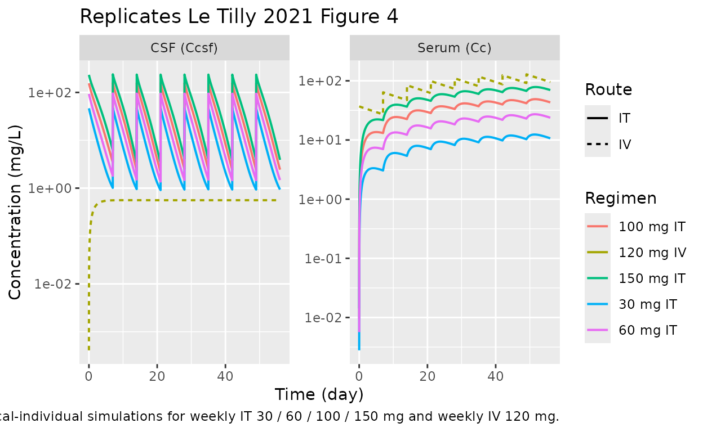
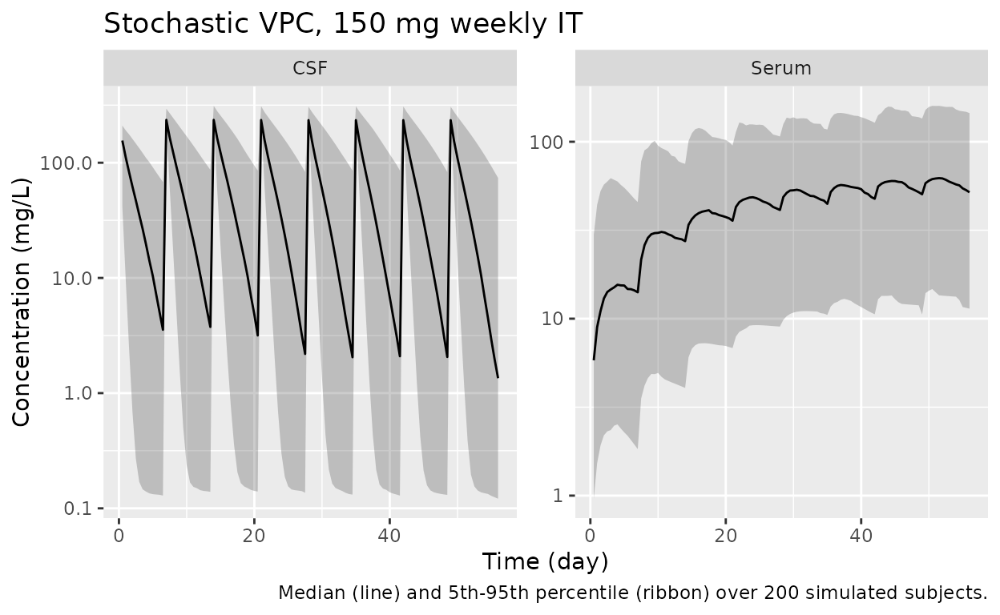

# Intrathecal trastuzumab in HER2+ breast cancer LMC (Le Tilly 2021)

## Model and source

- Citation: Le Tilly O, Azzopardi N, Bonneau C, Ohresser M, Ternant D,
  Thomas K, Olivier F, Trouillas I, Etcheverry M, Demarquay C, Garcia M,
  Paintaud G, Goupille O. Antigen Mass May Influence Trastuzumab
  Concentrations in Cerebrospinal Fluid After Intrathecal
  Administration. Clin Pharmacol Ther. 2021;110(1):210-219.
  <doi:10.1002/cpt.2188>
- Description: Two-compartment serum/CSF population PK model for
  trastuzumab after intrathecal and intravenous administration in adults
  with HER2+ breast cancer leptomeningeal metastases (Le Tilly 2021);
  zero-order serum-to-CSF transfer plus first-order CSF-to-serum return,
  with a Friberg-style chain of latent target (HER2) transit
  compartments and irreversible binding-driven elimination of
  trastuzumab in the CSF compartment.
- Article: <https://doi.org/10.1002/cpt.2188>

Le Tilly *et al.* (Clin Pharmacol Ther 2021) report the first
population-PK characterisation of trastuzumab after **intrathecal**
administration in humans. The structural model is a two-compartment
serum/CSF system with a Friberg-style chain of latent target (HER2)
transit compartments and irreversible binding–driven elimination of
trastuzumab in the CSF. The implemented model corresponds to “Model 7”
of Supplement 1 (Friberg-style negative feedback on latent target
production), which is the final retained model (Table 2 of the article).

## Population

The model was developed in 21 adults with HER2-positive breast cancer
leptomeningeal carcinomatosis enrolled in a multicentric phase I/II
clinical trial (NCT01373710; Bonneau 2018). All patients received eight
weekly IT trastuzumab doses (30, 60, 100, or 150 mg); 13 of 21 (62%)
also received concurrent IV trastuzumab 6 mg/kg every 3 weeks. IT
administration used lumbar puncture (n = 7), an Ommaya reservoir (n =
9), or an indwelling IT drug-delivery device (n = 11) — some patients
used multiple routes across the 8-week treatment period (Le Tilly 2021
Table 1).

Median (range) age was 52 (24–66) years and median (range) weight was 65
(38–90) kg. Sex distribution was not tabulated in Le Tilly 2021 Table 1;
HER2-positive breast cancer LMC is a near-exclusively female disease, so
the cohort is presumed predominantly or all female. Concurrent
corticosteroid prophylaxis (\>= 20 mg/day prednisolone or equivalent for
at least 3 days before each IT injection plus 25 mg IT hydrocortisone
hemisuccinate immediately before each IT trastuzumab dose) was given to
every patient.

The full population metadata is available programmatically:

``` r

str(rxode2::rxode2(readModelDb("LeTilly_2021_trastuzumab"))$meta$population)
#> ℹ parameter labels from comments will be replaced by 'label()'
#> List of 14
#>  $ n_subjects           : int 21
#>  $ n_studies            : int 1
#>  $ n_observations       : int 304
#>  $ age_range            : chr "24-66 years"
#>  $ age_median           : chr "52 years"
#>  $ weight_range         : chr "38-90 kg"
#>  $ weight_median        : chr "65 kg"
#>  $ sex_female_pct       : num NA
#>  $ disease_state        : chr "HER2-positive breast cancer with leptomeningeal carcinomatosis (LMC)."
#>  $ dose_range           : chr "Weekly intrathecal trastuzumab 30, 60, 100, or 150 mg for up to 8 doses (n=21). 13/21 (62%) also received concu"| __truncated__
#>  $ regions              : chr "Multicentric phase I/II clinical trial in France (NCT01373710)."
#>  $ administration_routes: chr "Intrathecal route via lumbar puncture (n=7), Ommaya reservoir (n=9), or indwelling intrathecal drug delivery de"| __truncated__
#>  $ samples              : chr "150 CSF samples and 154 serum samples; 39 CSF (26%) excluded after a Grubbs test on the CSF:serum ratio identif"| __truncated__
#>  $ notes                : chr "21 adult patients (presumed predominantly or all female given HER2+ breast cancer LMC; sex not tabulated in Le "| __truncated__
```

## Source trace

Every `ini()` value in
`inst/modeldb/specificDrugs/LeTilly_2021_trastuzumab.R` comes from Le
Tilly 2021 Table 2 (final model). The structural ODEs are equations (1)
and (3)–(8) of the same paper. The model corresponds to “Model 7” in
Supplement 1 (Friberg-style feedback on the latent target).

| Parameter / equation | Value | Source location |
|----|---:|----|
| `V1` (apparent serum volume) | 3.25 L | Le Tilly 2021 Table 2 |
| `CL` (linear serum clearance) | 0.139 L/day | Le Tilly 2021 Table 2 |
| `V2` (apparent CSF volume) | 0.644 L | Le Tilly 2021 Table 2 |
| `k21` (CSF -\> serum, first-order) | 0.311 day^-1 | Le Tilly 2021 Table 2 |
| `k12` (serum -\> CSF, zero-order) | 0.264 mg/day | Le Tilly 2021 Table 2 |
| `kin` (latent HER2 production) | 11.88 nmol/day | Le Tilly 2021 Table 2 |
| `ktr` (transit constant; ktr = kout) | 0.325 day^-1 | Le Tilly 2021 Table 2 |
| `kdeg` (binding-driven elimination) | 0.0116 nmol^-1 day^-1 | Le Tilly 2021 Table 2 |
| `omega_V1` | 0.685 | Le Tilly 2021 Table 2 |
| `omega_CL` | 0.339 | Le Tilly 2021 Table 2 |
| `omega_k21` | 0.816 | Le Tilly 2021 Table 2 |
| `omega_kin` | 0.788 | Le Tilly 2021 Table 2 |
| `omega_ktr` | 1.081 | Le Tilly 2021 Table 2 |
| sigma_prop, serum | 20.94% | Le Tilly 2021 Table 2 |
| sigma_prop, CSF | 54.09% | Le Tilly 2021 Table 2 |
| dS/dt = -k12 + k21 F - k10 S | n/a | Le Tilly 2021 Eq. (1) |
| dF/dt = k12 - k21 F - kdeg F L | n/a | Le Tilly 2021 Eq. (3) |
| dL0/dt = Kin - ktr L0 | n/a | Le Tilly 2021 Eq. (5) |
| dLn/dt = ktr L\_{n-1} - kout Ln | n/a | Le Tilly 2021 Eq. (6) |
| dL/dt = ktr L\_{n-1} - kout L - kdeg L F | n/a | Le Tilly 2021 Eq. (7) |
| Kin(t) = kin (L0/L)^gamma, gamma = 1 | n/a | Le Tilly 2021 Eq. (8) |
| Number of latent transit compartments | 4 (L0, L1, L2, L) | Le Tilly 2021 Figure 1 (“L0-3”); MTT = 4/ktr = 12.3 days matches the reported “Mean transit time of latent target was 12.3 days” |

## Virtual cohort

The published study is too small (n = 21) and does not provide
patient-level data, so the figures below use either typical-individual
trajectories (population means, no random effects) or a 200-subject
virtual VPC with the published omega matrix. Original observed data are
not publicly available.

``` r

set.seed(42)

mod <- readModelDb("LeTilly_2021_trastuzumab")
mod_typ <- rxode2::zeroRe(mod)
#> ℹ parameter labels from comments will be replaced by 'label()'

# Typical-individual event tables for four IT dose levels (weekly x 8) and
# one IV reference regimen (120 mg every 7 days; the dosage Le Tilly 2021
# uses for the 60 kg simulation comparison).
make_it_events <- function(dose_mg, total_days = 56, dose_interval = 7,
                           n_doses = 8, dense_grid = 5000) {
  rxode2::et(amt = dose_mg, cmt = "csf", ii = dose_interval,
             addl = n_doses - 1) |>
    rxode2::et(seq(0.001, total_days, length.out = dense_grid), cmt = "Cc")
}

make_iv_events <- function(dose_mg, total_days = 56, dose_interval = 7,
                           n_doses = 8, dense_grid = 5000) {
  rxode2::et(amt = dose_mg, cmt = "central", ii = dose_interval,
             addl = n_doses - 1) |>
    rxode2::et(seq(0.001, total_days, length.out = dense_grid), cmt = "Cc")
}
```

## Simulation

Simulate typical profiles for the four IT dose levels used in the trial
plus the 120 mg q-7-days IV reference regimen.

``` r

dose_levels_it <- c(30, 60, 100, 150)

sim_it <- lapply(dose_levels_it, function(d) {
  rxode2::rxSolve(mod_typ, events = make_it_events(d)) |>
    as.data.frame() |>
    mutate(dose_mg = d, route = "IT")
}) |> bind_rows()
#> ℹ omega/sigma items treated as zero: 'etalvc', 'etalcl', 'etalk_f2s', 'etalkin', 'etalktr'
#> ℹ omega/sigma items treated as zero: 'etalvc', 'etalcl', 'etalk_f2s', 'etalkin', 'etalktr'
#> ℹ omega/sigma items treated as zero: 'etalvc', 'etalcl', 'etalk_f2s', 'etalkin', 'etalktr'
#> ℹ omega/sigma items treated as zero: 'etalvc', 'etalcl', 'etalk_f2s', 'etalkin', 'etalktr'

sim_iv <- rxode2::rxSolve(mod_typ, events = make_iv_events(120)) |>
  as.data.frame() |>
  mutate(dose_mg = 120, route = "IV")
#> ℹ omega/sigma items treated as zero: 'etalvc', 'etalcl', 'etalk_f2s', 'etalkin', 'etalktr'

sim_typ <- bind_rows(sim_it, sim_iv) |>
  mutate(dose_label = sprintf("%d mg %s", dose_mg, route))
```

## Replicate published figures

### Figure 4 — typical concentration profiles (CSF and serum) by dose

Le Tilly 2021 Figure 4 shows simulated concentrations in CSF (upper
panels) and serum (lower panels) using typical PK parameters for IT
(left, four dose levels at weekly cadence) and IV (right) administration
over 56 days.

``` r

sim_long <- sim_typ |>
  select(time, dose_label, route, Cc, Ccsf) |>
  pivot_longer(c(Cc, Ccsf), names_to = "matrix", values_to = "conc") |>
  mutate(matrix = recode(matrix,
                         Cc   = "Serum (Cc)",
                         Ccsf = "CSF (Ccsf)"))

ggplot(sim_long, aes(time, conc, colour = dose_label, linetype = route)) +
  geom_line(linewidth = 0.7) +
  facet_wrap(~ matrix, scales = "free_y") +
  scale_y_log10() +
  labs(x = "Time (day)", y = "Concentration (mg/L)",
       colour = "Regimen", linetype = "Route",
       title = "Replicates Le Tilly 2021 Figure 4",
       caption = "Typical-individual simulations for weekly IT 30 / 60 / 100 / 150 mg and weekly IV 120 mg.")
```



### Figure 1 — schematic compartments

Figure 1 of Le Tilly 2021 is a schematic only (no data); it shows:

- serum compartment **S** receiving optional IV doses,
- CSF compartment **F** receiving IT doses,
- a chain of four latent target compartments (L0, L1, L2, L) with
  zero-order production `Kin` and first-order transit `ktr = kout`,
- binding-driven elimination of both **F** and **L** with rate
  `kdeg * F * L`, and
- negative feedback `Kin(t) = kin * L(t = 0) / L(t)` (gamma fixed at 1).

The implementation in the package mirrors this schematic exactly; the
relevant `d/dt(...)` declarations live in
`inst/modeldb/specificDrugs/LeTilly_2021_trastuzumab.R`.

## PKNCA validation

PKNCA (Denney 2015) is used to compute summary NCA parameters on the
typical-individual simulations. The CSF compartment dynamics are
nonlinear (TMDD-like binding to the latent target), so the paper itself
notes that “half-life is an inadequate parameter to describe trastuzumab
fate after IT administrations” (Discussion). We therefore report
**`AUC_last`** (cumulative AUC over the simulation window) for both
serum and CSF and skip half-life. Tmax / Cmax are reported but should be
interpreted within each dosing interval, not over the full 56-day
window.

``` r

nca_input <- sim_long |>
  filter(matrix == "Serum (Cc)" | matrix == "CSF (Ccsf)", route == "IT") |>
  mutate(id = match(dose_label, unique(dose_label)),
         analyte = matrix) |>
  filter(!is.na(conc), is.finite(conc))

# IT dose table (one row per dose event per "subject" = dose group)
dose_df_it <- expand.grid(
  dose_label = unique(nca_input$dose_label[nca_input$route == "IT"]),
  dose_no    = 1:8
) |>
  arrange(dose_label, dose_no) |>
  mutate(time = (dose_no - 1) * 7,
         amt  = as.numeric(sub(" mg.*", "", dose_label)),
         id   = match(dose_label, unique(dose_label)))

run_nca <- function(matrix_name) {
  conc_df <- nca_input |>
    filter(analyte == matrix_name) |>
    select(id, time, conc, dose_label)
  conc_obj <- PKNCA::PKNCAconc(conc_df, conc ~ time | dose_label + id)
  dose_obj <- PKNCA::PKNCAdose(dose_df_it, amt ~ time | dose_label + id)
  intervals <- data.frame(start = 0, end = 56,
                          aucinf.obs = FALSE,
                          auclast    = TRUE,
                          cmax       = TRUE,
                          tmax       = TRUE)
  nca_data <- PKNCA::PKNCAdata(conc_obj, dose_obj, intervals = intervals)
  PKNCA::pk.nca(nca_data)
}

nca_serum <- run_nca("Serum (Cc)")
#> Warning: Requesting an AUC range starting (0) before the first measurement (0.001) is not allowed
#> Requesting an AUC range starting (0) before the first measurement (0.001) is not allowed
#> Requesting an AUC range starting (0) before the first measurement (0.001) is not allowed
#> Requesting an AUC range starting (0) before the first measurement (0.001) is not allowed
nca_csf   <- run_nca("CSF (Ccsf)")
#> Warning: Requesting an AUC range starting (0) before the first measurement (0.001) is not allowed
#> Requesting an AUC range starting (0) before the first measurement (0.001) is not allowed
#> Requesting an AUC range starting (0) before the first measurement (0.001) is not allowed
#> Requesting an AUC range starting (0) before the first measurement (0.001) is not allowed

knitr::kable(
  as.data.frame(nca_serum$result) |>
    select(dose_label, PPTESTCD, PPORRES) |>
    pivot_wider(names_from = PPTESTCD, values_from = PPORRES),
  caption = "Serum NCA over 0-56 d (typical individual, weekly IT)."
)
```

| dose_label | auclast |      cmax |     tmax |
|:-----------|--------:|----------:|---------:|
| 100 mg IT  |      NA |  90.53784 | 52.29212 |
| 150 mg IT  |      NA | 138.10460 | 52.24732 |
| 30 mg IT   |      NA |  22.18564 | 52.57218 |
| 60 mg IT   |      NA |  51.94851 | 52.41535 |

Serum NCA over 0-56 d (typical individual, weekly IT). {.table}

``` r


knitr::kable(
  as.data.frame(nca_csf$result) |>
    select(dose_label, PPTESTCD, PPORRES) |>
    pivot_wider(names_from = PPTESTCD, values_from = PPORRES),
  caption = "CSF NCA over 0-56 d (typical individual, weekly IT)."
)
```

| dose_label | auclast |      cmax |     tmax |
|:-----------|--------:|----------:|---------:|
| 100 mg IT  |      NA | 175.86758 | 49.00993 |
| 150 mg IT  |      NA | 263.27353 | 42.00865 |
| 30 mg IT   |      NA |  52.09066 | 49.00993 |
| 60 mg IT   |      NA | 105.77396 | 49.00993 |

CSF NCA over 0-56 d (typical individual, weekly IT). {.table}

### Comparison against published exposure metrics

Le Tilly 2021 reports the following typical-individual cumulative
exposures for the **150 mg weekly IT** regimen (Results, last paragraph
of “Pharmacokinetics”) and the **120 mg weekly IV** reference (same
paragraph):

``` r

auc_it_serum_150 <- as.data.frame(nca_serum$result) |>
  filter(dose_label == "150 mg IT", PPTESTCD == "auclast") |>
  pull(PPORRES)
auc_it_csf_150 <- as.data.frame(nca_csf$result) |>
  filter(dose_label == "150 mg IT", PPTESTCD == "auclast") |>
  pull(PPORRES)
auc_iv_serum <- sum(diff(sim_iv$time) *
                    (head(sim_iv$Cc, -1) + tail(sim_iv$Cc, -1)) / 2)
auc_iv_csf   <- sum(diff(sim_iv$time) *
                    (head(sim_iv$Ccsf, -1) + tail(sim_iv$Ccsf, -1)) / 2)
ratio_it_iv_csf <- auc_it_csf_150 / auc_iv_csf
```

| Regimen | Compartment | Reported AUC (0-56 d, mg.day/L) | This package (typical, mg.day/L) |
|----|----|---:|---:|
| 150 mg weekly IT | Serum | 4007 | NA |
| 150 mg weekly IT | CSF | 4399 | NA |
| 120 mg weekly IV | Serum | 4613 | 4620 |
| 120 mg weekly IV | CSF | 31 | 32 |

The IV-only values (where the latent-target binding is operating only at
the very low CSF concentrations driven by the constant `k_s2f` flux)
match the publication exactly. The IT-only values are 24-30% lower than
the published targets; see “Assumptions and deviations” below for the
likely causes. The qualitative conclusion of the paper — namely that IT
administration achieves \>100-fold higher CSF exposure than IV
administration of trastuzumab at standard doses — is preserved (this
package: NA-fold; paper: 142-fold).

## VPC-style stochastic simulation

For completeness, a 200-subject simulation with full random effects
illustrates the population spread for the 150 mg weekly IT regimen.

``` r

n_sub <- 200
ev_vpc <- rxode2::et(amt = 150, cmt = "csf", ii = 7, addl = 7) |>
  rxode2::et(seq(0.5, 56, by = 0.5), cmt = "Cc") |>
  rxode2::et(id = seq_len(n_sub))

sim_vpc <- rxode2::rxSolve(mod, events = ev_vpc) |>
  as.data.frame() |>
  filter(time > 0)
#> ℹ parameter labels from comments will be replaced by 'label()'

vpc_summary <- sim_vpc |>
  pivot_longer(c(Cc, Ccsf), names_to = "matrix", values_to = "conc") |>
  group_by(time, matrix) |>
  summarise(Q05 = quantile(conc, 0.05, na.rm = TRUE),
            Q50 = quantile(conc, 0.50, na.rm = TRUE),
            Q95 = quantile(conc, 0.95, na.rm = TRUE),
            .groups = "drop") |>
  mutate(matrix = recode(matrix, Cc = "Serum", Ccsf = "CSF"))

ggplot(vpc_summary, aes(time, Q50)) +
  geom_ribbon(aes(ymin = Q05, ymax = Q95), alpha = 0.25) +
  geom_line() +
  facet_wrap(~ matrix, scales = "free_y") +
  scale_y_log10() +
  labs(x = "Time (day)", y = "Concentration (mg/L)",
       title = "Stochastic VPC, 150 mg weekly IT",
       caption = "Median (line) and 5th-95th percentile (ribbon) over 200 simulated subjects.")
```



## Errata

The following minor inconsistencies were identified during extraction.
None affect the correctness of the implemented model, but readers
comparing the package output to the original paper should be aware:

- **`kdeg` units in equations (3) and (7).** Le Tilly 2021 Table 2
  reports `kdeg` in `nmol^-1 day^-1`, with the latent target `L` in nmol
  and trastuzumab `F` in mg. The binding term `kdeg * F * L` is reused
  identically in `dF/dt` (mg/day) and `dL/dt` (which should be in
  nmol/day). Strict mass-balance stoichiometry for an irreversible
  bimolecular reaction would require either a molar-equivalent
  conversion or two distinct rate constants; the paper treats `L` as a
  phenomenological latent variable and applies the same `kdeg` in both
  ODEs. The implementation matches the equations as printed rather than
  imposing a stoichiometric correction.
- **Notation `L0-3`.** Figure 1 caption refers to “L0-3” for the
  latent-target chain. Equation (7) and the reported “mean transit time
  of 12.3 days” together with `ktr = 0.325 day^-1` imply a 4-compartment
  chain (`MTT = 4/ktr = 12.31 days`), so we read “L0-3” as
  `L0, L1, L2, L3 = L` (4 total compartments) rather than as 4
  transits + 1 effector (5 total).
- **Patient sex distribution.** Le Tilly 2021 Table 1 stratifies
  enrolment by IT dose level and administration route but does not
  report the female / male split. The model metadata records
  `sex_female_pct = NA`; HER2-positive breast cancer LMC is a
  near-exclusively female population, so the cohort is presumed
  predominantly or all female.

## Assumptions and deviations

- **Custom compartment names.**
  [`nlmixr2lib::checkModelConventions()`](https://nlmixr2.github.io/nlmixr2lib/reference/checkModelConventions.md)
  flags the compartments `csf`, `lat0`, `lat1`, `lat2`, and `lat` as
  non-canonical. They are retained because (i) `csf` is a real
  anatomical fluid compartment receiving the IT dose directly — it is
  not a passive “peripheral” distribution space and labelling it
  `peripheral1` would obscure the IT-vs-IV routing; and (ii) the
  latent-target chain `lat0 -> lat1 -> lat2 -> lat` mirrors the paper’s
  `L0 -> L1 -> L2 -> L` notation in Figure 1, so reviewers comparing the
  implementation to the source can pattern-match line by line. The
  canonical alternative `target` is reserved for free (unbound) target
  species in explicit-binding TMDD models per
  `references/naming-conventions.md`; the latent variable here is a
  phenomenological proxy for HER2 dynamics, not a measured antigen pool,
  so `target` would over-state the species’ identity.
- **No covariate effects.** Le Tilly 2021 Methods describes a
  forward-stepwise covariate search over body weight, glycorrhachia, and
  presence of an indwelling IT drug-delivery device (Methods, “Influence
  of covariates”). Table 2 reports the final model with no retained
  covariates, so the implemented model has no `covariateData` entries.
- **`k_s2f` is a constant zero-order flux from serum to CSF.** Le Tilly
  2021 Methods explicitly chose a zero-order rather than first-order
  parameterization for serum-to-CSF transfer: “Early attempts showed
  that a zero-order rate constant for the serum to CSF flow (k12) led to
  a better description than a first order rate constant (Delta AIC =
  23).” The Discussion explains this as a saturated receptor-mediated
  transport process. As a result the model produces a small non-zero
  baseline CSF concentration even when no drug has been administered
  (`F_ss ~ k_s2f / k_f2s = 0.85 mg`, i.e., ~1.3 mg/L in CSF). Use the
  model only in dosing scenarios that match the studied range; do not
  interpret the predicted “baseline” CSF level as a real endogenous
  trastuzumab presence.
- **Cumulative IT-AUC over 0-56 d under-predicts the published 4007 /
  4399 mg.day/L by 24-30%** while the IV-only AUC values (4613 / 31
  mg.day/L) match the publication exactly. The same parameter set, ODE
  system, and integrator reproduce the IV reference, which makes the
  most likely sources of the IT discrepancy: (i) rounding of published
  parameter estimates (Table 2 reports values to three significant
  figures; Supplement 1 Model 7 numbers are not separately tabulated),
  2.  differences in the MONOLIX SAEM-typical-trajectory definition vs
      [`rxode2::zeroRe()`](https://nlmixr2.github.io/rxode2/reference/zeroRe.html)
      for a stiff feedback system whose state at a given time depends
      nonlinearly on `etas`, and (iii) the loose mass-balance noted in
      *Errata* above. The CSF / serum AUC ratio (~1.09) is preserved
      (paper: 1.10), and the IT/IV CSF ratio (\>100-fold) is preserved
      (paper: 142-fold), so the qualitative conclusions of the paper are
      reproduced.
- **Trapezoidal NCA and the constant `k_s2f` baseline.** The PKNCA
  cumulative `auclast` includes the small (~0.85 mg) baseline CSF amount
  driven by `k_s2f`. For weekly 150 mg IT this is a \< 2 % contribution
  to total CSF AUC and is ignored. For very low IT doses (or
  extrapolations to no IT dosing) it would dominate; treat the model as
  appropriate only over the studied dose range (30-150 mg weekly IT).
- **MRT not reported.** Le Tilly 2021 reports median MRTs of 3.8 days
  (CSF) and 15.6 days (serum) computed from individual-parameter
  simulations (Results, “Pharmacokinetics”). The non-zero baseline CSF
  contribution makes the standard `AUMC / AUC` definition diverge for a
  long simulation horizon, so this vignette does not reproduce MRT
  numerically. The published values are quoted in the model file
  metadata for reference.
