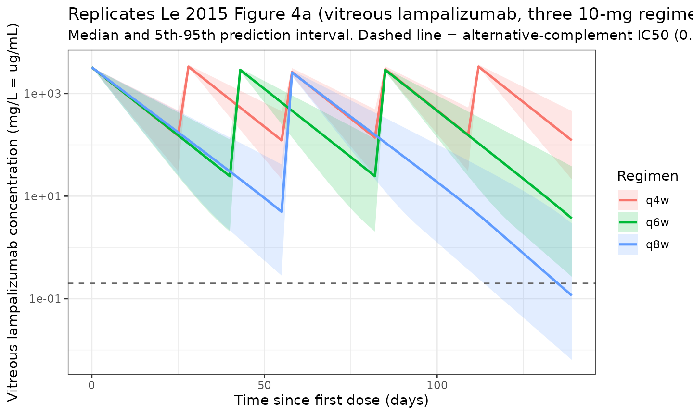
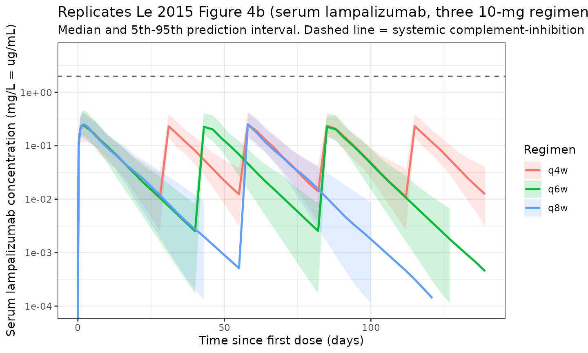
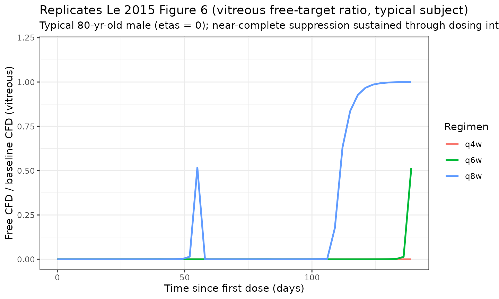

# Lampalizumab (Le 2015)

## Model and source

- Citation: Le KN, Gibiansky L, van Lookeren Campagne M, Good J,
  Davancaze T, Loyet KM, Morimoto A, Strauss EC, Jin JY. Population
  Pharmacokinetics and Pharmacodynamics of Lampalizumab Administered
  Intravitreally to Patients With Geographic Atrophy. *CPT
  Pharmacometrics Syst Pharmacol.* 2015;4(10):595-604.
  <doi:%5B10.1002/psp4.12031>\](<https://doi.org/10.1002/psp4.12031>).
- Description: Combined ocular-serum target-mediated drug-disposition
  (TMDD) model with quasi-steady-state binding approximation for
  intravitreally administered lampalizumab (anti-complement factor D
  Fab) and total complement factor D (CFD) in adults with geographic
  atrophy (GA) secondary to age-related macular degeneration (AMD).
- Modality: Humanized antibody-binding fragment (Fab) of an anti-CFD
  monoclonal antibody (Fab ~ 48 kDa); administered intravitreally (ITV);
  developed by Genentech / Roche.
- Article (open access): <https://doi.org/10.1002/psp4.12031>

## Population

The model was developed from the integrated PK / PD dataset of two
Genentech-sponsored clinical studies in patients with geographic atrophy
(Le 2015 Methods - Study design, Table 1 paragraph 1):

- **CFD4711g** (NCT00973011, phase Ia single-ascending-dose): 18
  patients (3 per dose level) received a single ITV administration of
  lampalizumab at 0.1, 0.5, 1, 2, 5, or 10 mg in the study eye. Serum
  lampalizumab was sampled at screening, day 1, 7, 14, and 30 post-dose.
- **CFD4870g** MAHALO (NCT01229215, phase Ib/II): an open-label safety
  run-in (n=14) of \>=3 monthly ITV doses of 10 mg followed by an
  18-month randomized phase II in which 129 patients received either 10
  mg q4w, 10 mg q8w, or sham. Serum trough was sampled at screening,
  monthly months 1-3, and at months 1, 2, 3, 6, 9, 12, 15, and 18.
  Aqueous humor lampalizumab and total CFD were sampled at screening,
  month 6 pre-dose, and month 12 pre-dose (n=12 ocular).

The combined model dataset comprises **117 patients** with **697
quantifiable serum lampalizumab concentrations**, **24 quantifiable
aqueous humor lampalizumab concentrations**, and **62 quantifiable
aqueous humor total CFD concentrations** from a 21-patient ocular subset
(Le 2015 Results - Serum pharmacokinetics / Ocular pharmacokinetics).
The lower limits of quantitation were 350 pg/mL (serum), 30 ng/mL
(aqueous lampalizumab), and 5 ng/mL (aqueous CFD). The Table 1 reference
patient is an 80-year-old male; per-subject weight, race, and exact age
distributions reside in the source paper’s Supplemental Table 1, which
was not bundled with the main PDF and is therefore not reproduced in
`population` metadata.

The packaged `population` metadata is available programmatically via
`readModelDb("Le_2015_lampalizumab")$population`.

## Source trace

Every parameter is annotated in the model file
(`inst/modeldb/specificDrugs/Le_2015_lampalizumab.R`) with an in-file
comment pointing to Le 2015 Table 1 row by row. The table below collects
the equations and parameters in one place for reviewers.

| Equation / parameter | Value (typical, 80-yr-old male) | Source location |
|----|----|----|
| `d/dt(depot)` (lampalizumab in vitreous, mg) | n/a | Le 2015 Eq. 1, p.596 |
| `d/dt(total_target)` (total CFD in vitreous, mg/L = ug/mL) | n/a | Le 2015 Eq. 2, p.596 |
| `d/dt(central)` (lampalizumab in serum, mg) | n/a | Le 2015 Eq. 3, p.596 |
| `Cunbound` (QSS algebra) | n/a | Le 2015 Eq. 4, p.596 |
| `CAQ = CVITR / kAQ` (aqueous humor lampalizumab, mg/L) | n/a | Le 2015 Eq. 5, p.596 |
| `RAQ = total_target / kTAQ` (aqueous humor total CFD, mg/L) | n/a | Le 2015 Eq. 6, p.596 |
| `kTAQ = kAQ * kA` | 29.0 | Le 2015 Eq. 7, p.596; Results p.598 |
| `kout` (ocular drug elimination rate, 1/day) | 0.117 | Le 2015 Table 1, row 1 |
| `koutC` (ocular complex elimination rate, 1/day) | 0.135 | Le 2015 Table 1, row 2 |
| `kinT` (ocular target influx/synthesis, ug/mL/day) | 0.364 | Le 2015 Table 1, row 3 (text Discussion cites 0.32 ug/mL/day) |
| `kA` (drug:target MW/assay correction factor, unitless) | 2.23 | Le 2015 Table 1, row 4 |
| `VVITR` (vitreous volume, L) | 0.00309 (3.09 mL) | Le 2015 Table 1, row 5 |
| `koutT` (ocular target degradation rate, 1/day) | 0.27 | Le 2015 Table 1, row 6 |
| `kAQ` (vitreous-to-aqueous partition of drug, unitless) | 13.0 | Le 2015 Table 1, row 7 |
| `Vc` (serum volume, L) | 2.41 (2410 mL) | Le 2015 Table 1, row 8 |
| `k` (systemic elimination rate, 1/day) | 1.89 | Le 2015 Table 1, row 9 |
| `Kss` (QSS binding constant, mg/L) – FIXED | 0.00096 (~20 pM) | Le 2015 Table 1, row 10 (footnote d: fixed) |
| `e_age_kout` (power exponent for AGE/80 on kout) | -0.770 | Le 2015 Table 1, Covariates block |
| `e_age_k` (power exponent for AGE/80 on k) | -1.63 | Le 2015 Table 1, Covariates block |
| `e_sexf_k` (multiplier for female sex on k; ref = male) | 0.739 | Le 2015 Table 1, Covariates block |
| IIV CV% on `kout` / `kA` / `k` | 27.3 / 59.1 / 27.5 | Le 2015 Table 1, Variability block |
| Proportional residual SD: serum / aqueous | 0.329 / 0.258 | Le 2015 Table 1, Variability block |

The pre-dose initial condition `total_target(0) = kinT / koutT` = 0.364
/ 0.27 = 1.35 mg/L (~1.35 ug/mL) is the analytical steady state of Eq. 2
in the absence of drug (`d/dt(total_target) = 0` when `Cunbound = 0`).

## Errata note

A PubMed search (May 2026) for `10.1002/psp4.12031 AND erratum` returned
no records. No errata or corrigenda were identified at the time of
extraction.

## Virtual cohort

The model’s structural parameters are calibrated to a typical
80-year-old male (Le 2015 Table 1 footnote a). The virtual cohort below
samples ages spanning a plausible GA population (60-90 years) and a
roughly balanced sex distribution so the covariate effects are
exercised. Original observed data are not publicly available.

``` r

set.seed(20260512)

n_subj <- 60
cohort <- tibble::tibble(
  id   = seq_len(n_subj),
  AGE  = pmin(pmax(round(rnorm(n_subj, mean = 80, sd = 7)), 60), 95),
  SEXF = rbinom(n_subj, size = 1, prob = 0.55)
)
```

Three dosing regimens are simulated for the figure-replication panel: 10
mg ITV every 4 weeks (q4w), every 6 weeks (q6w), and every 8 weeks
(q8w), each for 16 weeks of dosing followed by a 4-week tail. Each
regimen is given its own disjoint `id` block (per
`vignette-template.md`’s multi-cohort guidance) so `rxSolve` does not
silently merge subjects across regimens. The observation grid is dense
in the first week (where vitreous-to-serum egress dominates) and coarse
afterward to keep the simulation under the pkgdown vignette time budget.

``` r

horizon_days <- 16 * 7 + 28          # 16 wk dosing + 4 wk tail
obs_times    <- sort(unique(c(
  0, seq(0.25, 7, by = 0.5),         # dense first week
  seq(10, horizon_days, by = 3)      # every 3 days thereafter
)))

dose_times <- list(
  "q4w" = seq(0, by = 28, length.out = 5),
  "q6w" = seq(0, by = 42, length.out = 3),
  "q8w" = seq(0, by = 56, length.out = 2)
)

build_regimen <- function(pop, regimen_label, dose_days, id_offset) {
  pop_off <- pop |>
    dplyr::mutate(id = id + id_offset, regimen = regimen_label)

  d_dose <- pop_off |>
    tidyr::crossing(time = dose_days) |>
    dplyr::mutate(amt = 10, evid = 1L, cmt = "depot")

  d_obs_cc <- pop_off |>
    tidyr::crossing(time = obs_times) |>
    dplyr::mutate(amt = 0, evid = 0L, cmt = "Cc")

  d_obs_caq <- pop_off |>
    tidyr::crossing(time = obs_times) |>
    dplyr::mutate(amt = 0, evid = 0L, cmt = "CAQ")

  d_obs_raq <- pop_off |>
    tidyr::crossing(time = obs_times) |>
    dplyr::mutate(amt = 0, evid = 0L, cmt = "RAQ")

  dplyr::bind_rows(d_dose, d_obs_cc, d_obs_caq, d_obs_raq) |>
    dplyr::arrange(id, time, dplyr::desc(evid)) |>
    as.data.frame()
}

events <- dplyr::bind_rows(
  build_regimen(cohort, "q4w", dose_times[["q4w"]], id_offset =     0L),
  build_regimen(cohort, "q6w", dose_times[["q6w"]], id_offset = 1000L),
  build_regimen(cohort, "q8w", dose_times[["q8w"]], id_offset = 2000L)
)

stopifnot(!anyDuplicated(unique(events[, c("id", "time", "evid", "cmt")])))
```

## Simulation

Two model objects are used:

- `mod` – the packaged model with between-subject variability, for
  prediction intervals.
- `mod_typ` – the same model with random effects zeroed
  ([`rxode2::zeroRe`](https://nlmixr2.github.io/rxode2/reference/zeroRe.html))
  for typical-value curves.

``` r

mod     <- rxode2::rxode2(readModelDb("Le_2015_lampalizumab"))
#> ℹ parameter labels from comments will be replaced by 'label()'
mod_typ <- mod |> rxode2::zeroRe()

sim <- rxode2::rxSolve(mod, events = events,
                       keep = c("regimen", "AGE", "SEXF"),
                       returnType = "data.frame")

# Endpoint compartment numbering: depot=1, total_target=2, central=3,
# Cc=4, CAQ=5, RAQ=6.
sim_cc  <- sim |> dplyr::filter(CMT == 4)
sim_caq <- sim |> dplyr::filter(CMT == 5)
sim_raq <- sim |> dplyr::filter(CMT == 6)
```

## Replicate published figures

### Vitreous (aqueous proxy) lampalizumab concentration (replicates Figure 4a of Le 2015)

Le 2015 Figure 4a plots simulated vitreous lampalizumab concentration
over time for the three 10-mg regimens (q4w, q6w, q8w) with the 5th to
95th prediction band. We approximate the vitreous concentration as
`CAQ * kAQ` (paper’s Eq. 5 inverted; `kAQ = 13`), restoring vitreous
units from the aqueous-humor proxy. The relevant biology is the trough
relative to the alternative-pathway IC50 of 0.2 ug/mL = 0.2 mg/L (paper
text Discussion: “the 5th percentile of vitreous humor Cmin values for
10 mg per eye were above the median inhibitory concentration (IC50) (0.2
ug/mL or 4 nM)”), shown as a dashed reference line.

``` r

kAQ_nominal <- 13

sim_vitreous <- sim_caq |>
  dplyr::mutate(CVITR = CAQ * kAQ_nominal) |>
  dplyr::group_by(regimen, time) |>
  dplyr::summarise(
    Q05 = quantile(CVITR, 0.05, na.rm = TRUE),
    Q50 = quantile(CVITR, 0.50, na.rm = TRUE),
    Q95 = quantile(CVITR, 0.95, na.rm = TRUE),
    .groups = "drop"
  )

ggplot(sim_vitreous, aes(time, Q50, colour = regimen, fill = regimen)) +
  geom_ribbon(aes(ymin = Q05, ymax = Q95), alpha = 0.18, colour = NA) +
  geom_line(linewidth = 0.9) +
  geom_hline(yintercept = 0.2, linetype = "dashed", colour = "grey40") +
  scale_y_log10() +
  labs(
    x = "Time since first dose (days)",
    y = "Vitreous lampalizumab concentration (mg/L = ug/mL)",
    title = "Replicates Le 2015 Figure 4a (vitreous lampalizumab, three 10-mg regimens)",
    subtitle = "Median and 5th-95th prediction interval. Dashed line = alternative-complement IC50 (0.2 ug/mL).",
    colour = "Regimen", fill = "Regimen"
  ) +
  theme_bw()
```



### Serum lampalizumab concentration (replicates Figure 4b of Le 2015)

Le 2015 Figure 4b shows the corresponding serum profile. The paper
narrative emphasises that systemic Cmax stays well below the 2 ug/mL
threshold required to inhibit systemic alternative-complement activity
(reference line below).

``` r

sim_serum <- sim_cc |>
  dplyr::group_by(regimen, time) |>
  dplyr::summarise(
    Q05 = quantile(Cc, 0.05, na.rm = TRUE),
    Q50 = quantile(Cc, 0.50, na.rm = TRUE),
    Q95 = quantile(Cc, 0.95, na.rm = TRUE),
    .groups = "drop"
  )

ggplot(sim_serum, aes(time, Q50, colour = regimen, fill = regimen)) +
  geom_ribbon(aes(ymin = Q05, ymax = Q95), alpha = 0.18, colour = NA) +
  geom_line(linewidth = 0.9) +
  geom_hline(yintercept = 2, linetype = "dashed", colour = "grey40") +
  scale_y_log10(limits = c(1e-4, 5)) +
  labs(
    x = "Time since first dose (days)",
    y = "Serum lampalizumab concentration (mg/L = ug/mL)",
    title = "Replicates Le 2015 Figure 4b (serum lampalizumab, three 10-mg regimens)",
    subtitle = "Median and 5th-95th prediction interval. Dashed line = systemic complement-inhibition threshold (2 ug/mL).",
    colour = "Regimen", fill = "Regimen"
  ) +
  theme_bw()
#> Warning in scale_y_log10(limits = c(1e-04, 5)): log-10 transformation introduced infinite values.
#> log-10 transformation introduced infinite values.
#> log-10 transformation introduced infinite values.
#> log-10 transformation introduced infinite values.
#> Warning: Removed 19 rows containing missing values or values outside the scale range
#> (`geom_ribbon()`).
#> Warning: Removed 5 rows containing missing values or values outside the scale range
#> (`geom_line()`).
```



### Free target ratio in vitreous (replicates Figure 6 of Le 2015)

Le 2015 Figure 6 plots the simulated free CFD-to-baseline ratio (FTR) in
the vitreous over time for the three regimens, illustrating
near-complete target suppression at day 60 post-dose. With the QSS
algebra,

> free CFD concentration in vitreous = R_total \* Kss / (Kss + Cunbound)
> FTR = free CFD / baseline target = (R_total \* Kss / (Kss + Cunbound))
> / (kinT / koutT)

is derived directly from the model’s internal `total_target` and
`Cunbound` states (both available in `sim`).

``` r

ftr_typ_events <- events |>
  dplyr::filter(id %in% c(1L, 1001L, 2001L))   # one typical subject per regimen

sim_typ <- rxode2::rxSolve(mod_typ, events = ftr_typ_events,
                           keep = c("regimen"),
                           returnType = "data.frame")
#> ℹ omega/sigma items treated as zero: 'etalkout', 'etalkA', 'etalk'
#> Warning: multi-subject simulation without without 'omega'

kinT_val  <- 0.364
koutT_val <- 0.27
Kss_val   <- 0.96e-3
R_baseline <- kinT_val / koutT_val

sim_ftr <- sim_typ |>
  dplyr::filter(CMT == 5) |>                        # any output row is fine; pick CAQ rows
  dplyr::mutate(
    free_target = total_target * Kss_val / (Kss_val + Cunbound),
    FTR         = free_target / R_baseline
  )

ggplot(sim_ftr, aes(time, FTR, colour = regimen)) +
  geom_line(linewidth = 0.9) +
  scale_y_continuous(limits = c(0, 1.2)) +
  labs(
    x = "Time since first dose (days)",
    y = "Free CFD / baseline CFD (vitreous)",
    title = "Replicates Le 2015 Figure 6 (vitreous free-target ratio, typical subject)",
    subtitle = "Typical 80-yr-old male (etas = 0); near-complete suppression sustained through dosing interval.",
    colour = "Regimen"
  ) +
  theme_bw()
```



## Key quantitative checks against Le 2015 Results / Discussion

The Le 2015 supplement (Supplemental Table 3) reports per-regimen Cmax /
Cmin / AUC for vitreous and serum, but is not bundled with the main PDF;
the paper’s main-text quantitative claims below are reproducible from
the simulation above.

``` r

single_dose_events <- cohort |>
  dplyr::slice(1L) |>
  dplyr::mutate(time = 0, amt = 10, evid = 1L, cmt = "depot") |>
  dplyr::bind_rows(
    tidyr::crossing(cohort |> dplyr::slice(1L), time = obs_times) |>
      dplyr::mutate(amt = 0, evid = 0L, cmt = "Cc"),
    tidyr::crossing(cohort |> dplyr::slice(1L), time = obs_times) |>
      dplyr::mutate(amt = 0, evid = 0L, cmt = "CAQ"),
    tidyr::crossing(cohort |> dplyr::slice(1L), time = obs_times) |>
      dplyr::mutate(amt = 0, evid = 0L, cmt = "RAQ")
  ) |>
  dplyr::arrange(id, time, dplyr::desc(evid)) |>
  as.data.frame()

sim_typ_single <- rxode2::rxSolve(mod_typ, events = single_dose_events,
                                  returnType = "data.frame")
#> ℹ omega/sigma items treated as zero: 'etalkout', 'etalkA', 'etalk'

cc_single  <- sim_typ_single |> dplyr::filter(CMT == 4)
caq_single <- sim_typ_single |> dplyr::filter(CMT == 5)

vitreous_cmax <- max(caq_single$CAQ * kAQ_nominal, na.rm = TRUE)
serum_cmax    <- max(cc_single$Cc, na.rm = TRUE)
ratio_cmax    <- vitreous_cmax / serum_cmax

knitr::kable(
  data.frame(
    Metric = c(
      "Vitreous Cmax (mg/L)",
      "Serum Cmax (mg/L)",
      "Vitreous / Serum Cmax ratio",
      "Ocular elimination t1/2 (days)",
      "True serum elimination t1/2 (days)",
      "Apparent (flip-flop) serum t1/2 (days)"
    ),
    `Simulated value` = c(
      sprintf("%.0f", vitreous_cmax),
      sprintf("%.4f", serum_cmax),
      sprintf("%.0f-fold", ratio_cmax),
      sprintf("%.2f", log(2) / 0.117),
      sprintf("%.3f", log(2) / 1.89),
      "see PKNCA section below"
    ),
    `Le 2015 reported value` = c(
      "n/a (main text uses ratio only)",
      "n/a (main text uses ratio only)",
      "> 11,000-fold (Discussion p.601)",
      "5.9 days (Results p.599)",
      "0.367 days = 9 hours (Discussion p.600)",
      "5.9 days (apparent; flip-flop, Discussion p.601)"
    ),
    check.names = FALSE
  ),
  caption = "Quantitative checks of single 10 mg ITV dose simulation vs Le 2015."
)
```

| Metric | Simulated value | Le 2015 reported value |
|:---|:---|:---|
| Vitreous Cmax (mg/L) | 3236 | n/a (main text uses ratio only) |
| Serum Cmax (mg/L) | 0.2389 | n/a (main text uses ratio only) |
| Vitreous / Serum Cmax ratio | 13547-fold | \> 11,000-fold (Discussion p.601) |
| Ocular elimination t1/2 (days) | 5.92 | 5.9 days (Results p.599) |
| True serum elimination t1/2 (days) | 0.367 | 0.367 days = 9 hours (Discussion p.600) |
| Apparent (flip-flop) serum t1/2 (days) | see PKNCA section below | 5.9 days (apparent; flip-flop, Discussion p.601) |

Quantitative checks of single 10 mg ITV dose simulation vs Le 2015.
{.table}

## PKNCA validation – serum lampalizumab after a single 10 mg ITV dose

Single-dose NCA on serum lampalizumab is the most directly comparable
check: with flip-flop PK the apparent serum half-life equals the ocular
elimination half-life of 5.9 days (Le 2015 Discussion: “the flip-flop PK
phenomenon enabled the use of systemic half-life following ITV
administration as a surrogate for ocular half-life”). The cohort below
is the same virtual population as the dosing simulations above, given a
single 10-mg ITV dose; PKNCA computes Cmax, Tmax, AUC, and the apparent
terminal half-life per subject.

``` r

suppressPackageStartupMessages(library(PKNCA))

# Use a smaller PKNCA cohort to keep the vignette inside the pkgdown
# 5-minute time budget; 30 subjects is sufficient for the apparent
# terminal-half-life check that is the headline NCA result.
pknca_cohort <- cohort |>
  dplyr::slice(seq_len(30L)) |>
  dplyr::mutate(regimen = "single_10mg")

pknca_obs_times <- sort(unique(c(0, 0.5, 1, 2, 4, 7, 10, 14, 21, 28, 42, 56)))

d_dose_p <- pknca_cohort |>
  dplyr::mutate(time = 0, amt = 10, evid = 1L, cmt = "depot")

d_obs_p <- pknca_cohort |>
  tidyr::crossing(time = pknca_obs_times) |>
  dplyr::mutate(amt = 0, evid = 0L, cmt = "Cc")

ev_p <- dplyr::bind_rows(d_dose_p, d_obs_p) |>
  dplyr::arrange(id, time, dplyr::desc(evid)) |>
  as.data.frame()

sim_p <- rxode2::rxSolve(mod, events = ev_p,
                         keep = c("regimen"),
                         returnType = "data.frame") |>
  dplyr::filter(CMT == 4)

conc_df <- sim_p |>
  dplyr::filter(!is.na(Cc), Cc > 0) |>
  dplyr::select(id, regimen, time, Cc)

dose_df <- d_dose_p |>
  dplyr::select(id, regimen, time, amt)

conc_obj <- PKNCA::PKNCAconc(conc_df, Cc ~ time | regimen + id,
                             concu = "mg/L", timeu = "day")
dose_obj <- PKNCA::PKNCAdose(dose_df, amt ~ time | regimen + id,
                             doseu = "mg")

intervals <- data.frame(
  start      = 0,
  end        = Inf,
  cmax       = TRUE,
  tmax       = TRUE,
  auclast    = TRUE,
  aucinf.obs = TRUE,
  half.life  = TRUE
)

nca_data <- PKNCA::PKNCAdata(conc_obj, dose_obj, intervals = intervals)
nca_res  <- PKNCA::pk.nca(nca_data)
#> Warning: Requesting an AUC range starting (0) before the first measurement (0.5) is not allowed
#> Requesting an AUC range starting (0) before the first measurement (0.5) is not allowed
#> Requesting an AUC range starting (0) before the first measurement (0.5) is not allowed
#> Requesting an AUC range starting (0) before the first measurement (0.5) is not allowed
#> Requesting an AUC range starting (0) before the first measurement (0.5) is not allowed
#> Requesting an AUC range starting (0) before the first measurement (0.5) is not allowed
#> Requesting an AUC range starting (0) before the first measurement (0.5) is not allowed
#> Requesting an AUC range starting (0) before the first measurement (0.5) is not allowed
#> Requesting an AUC range starting (0) before the first measurement (0.5) is not allowed
#> Requesting an AUC range starting (0) before the first measurement (0.5) is not allowed
#> Requesting an AUC range starting (0) before the first measurement (0.5) is not allowed
#> Requesting an AUC range starting (0) before the first measurement (0.5) is not allowed
#> Requesting an AUC range starting (0) before the first measurement (0.5) is not allowed
#> Requesting an AUC range starting (0) before the first measurement (0.5) is not allowed
#> Requesting an AUC range starting (0) before the first measurement (0.5) is not allowed
#> Requesting an AUC range starting (0) before the first measurement (0.5) is not allowed
#> Requesting an AUC range starting (0) before the first measurement (0.5) is not allowed
#> Requesting an AUC range starting (0) before the first measurement (0.5) is not allowed
#> Requesting an AUC range starting (0) before the first measurement (0.5) is not allowed
#> Requesting an AUC range starting (0) before the first measurement (0.5) is not allowed
#> Requesting an AUC range starting (0) before the first measurement (0.5) is not allowed
#> Requesting an AUC range starting (0) before the first measurement (0.5) is not allowed
#> Requesting an AUC range starting (0) before the first measurement (0.5) is not allowed
#> Requesting an AUC range starting (0) before the first measurement (0.5) is not allowed
#> Requesting an AUC range starting (0) before the first measurement (0.5) is not allowed
#> Requesting an AUC range starting (0) before the first measurement (0.5) is not allowed
#> Requesting an AUC range starting (0) before the first measurement (0.5) is not allowed
#> Requesting an AUC range starting (0) before the first measurement (0.5) is not allowed
#> Requesting an AUC range starting (0) before the first measurement (0.5) is not allowed
#> Requesting an AUC range starting (0) before the first measurement (0.5) is not allowed
#> Requesting an AUC range starting (0) before the first measurement (0.5) is not allowed
#> Requesting an AUC range starting (0) before the first measurement (0.5) is not allowed
#> Requesting an AUC range starting (0) before the first measurement (0.5) is not allowed
#> Requesting an AUC range starting (0) before the first measurement (0.5) is not allowed
#> Requesting an AUC range starting (0) before the first measurement (0.5) is not allowed
#> Requesting an AUC range starting (0) before the first measurement (0.5) is not allowed
#> Requesting an AUC range starting (0) before the first measurement (0.5) is not allowed
#> Requesting an AUC range starting (0) before the first measurement (0.5) is not allowed
#> Requesting an AUC range starting (0) before the first measurement (0.5) is not allowed
#> Requesting an AUC range starting (0) before the first measurement (0.5) is not allowed
#> Requesting an AUC range starting (0) before the first measurement (0.5) is not allowed
#> Requesting an AUC range starting (0) before the first measurement (0.5) is not allowed
#> Requesting an AUC range starting (0) before the first measurement (0.5) is not allowed
#> Requesting an AUC range starting (0) before the first measurement (0.5) is not allowed
#> Requesting an AUC range starting (0) before the first measurement (0.5) is not allowed
#> Requesting an AUC range starting (0) before the first measurement (0.5) is not allowed
#> Requesting an AUC range starting (0) before the first measurement (0.5) is not allowed
#> Requesting an AUC range starting (0) before the first measurement (0.5) is not allowed
#> Requesting an AUC range starting (0) before the first measurement (0.5) is not allowed
#> Requesting an AUC range starting (0) before the first measurement (0.5) is not allowed
#> Requesting an AUC range starting (0) before the first measurement (0.5) is not allowed
#> Requesting an AUC range starting (0) before the first measurement (0.5) is not allowed
#> Requesting an AUC range starting (0) before the first measurement (0.5) is not allowed
#> Requesting an AUC range starting (0) before the first measurement (0.5) is not allowed
#> Requesting an AUC range starting (0) before the first measurement (0.5) is not allowed
#> Requesting an AUC range starting (0) before the first measurement (0.5) is not allowed
#> Requesting an AUC range starting (0) before the first measurement (0.5) is not allowed
#> Requesting an AUC range starting (0) before the first measurement (0.5) is not allowed
#> Requesting an AUC range starting (0) before the first measurement (0.5) is not allowed
#> Requesting an AUC range starting (0) before the first measurement (0.5) is not allowed

knitr::kable(summary(nca_res),
             caption = "Serum lampalizumab NCA after single 10 mg ITV dose (apparent terminal half-life is the flip-flop ocular t1/2 ~ 5.9 days).")
```

| Interval Start | Interval End | regimen | N | AUClast (day\*mg/L) | Cmax (mg/L) | Tmax (day) | Half-life (day) | AUCinf,obs (day\*mg/L) |
|---:|---:|:---|:---|:---|:---|:---|:---|:---|
| 0 | Inf | single_10mg | 30 | NC | 0.240 \[37.8\] | 2.00 \[1.00, 4.00\] | 6.25 \[1.76\] | NC |

Serum lampalizumab NCA after single 10 mg ITV dose (apparent terminal
half-life is the flip-flop ocular t1/2 ~ 5.9 days). {.table}

The apparent terminal half-life from PKNCA is the **flip-flop**
half-life dictated by the slower ocular elimination (kout = 0.117/day,
t1/2 ~ 5.9 days), not the true serum k = 1.89/day (t1/2 ~ 9 hours). This
is a load-bearing biological feature of intravitreally administered Fabs
(Le 2015 Discussion p.601) – not a model artefact.

## Assumptions and deviations

- **Compartment naming.** The vitreous (intravitreal injection site,
  drug-target binding site, and aqueous-humor observation source) is
  encoded as the model’s `depot` compartment, since ITV dosing is
  extravascular and the source-paper’s vitreous compartment maps cleanly
  to the canonical depot role. Aqueous humor concentrations are derived
  algebraically from `depot / VVITR` via the partition coefficient
  `kAQ`, not carried as a separate state. The serum sampling site is the
  canonical `central` compartment. The CFD compartment uses the
  canonical `total_target` name (total free + bound target in the QSS
  approximation; Gibiansky 2008). No compartment names outside the
  canonical register are introduced.
- **`target_total` carries CONCENTRATION units, not amount.** Paper Eq.
  2 is written directly in concentration units (mg/L), and `kinT` has
  units of mg/L/day. The model preserves the paper’s formulation rather
  than redundantly multiplying through by `VVITR`; observed aqueous CFD
  (`RAQ`) is derived as `total_target / kTAQ`. This is a faithful
  translation of the source equations and is flagged here because most
  popPK compartments carry amount units.
- **Shared aqueous residual encoded as two parameters.** Le 2015 Table 1
  reports a single proportional residual SD (25.8%) for aqueous-humor
  measurements (lampalizumab AND CFD combined). nlmixr2’s residual-error
  syntax requires one endpoint parameter per output, so the shared
  residual is encoded as two parameters (`propSd_CAQ`, `propSd_RAQ`)
  initialised to the same Table 1 value of 0.258. Re-estimation would
  treat them as independent; for prediction / simulation they remain
  numerically identical, so the packaged model reproduces the paper’s
  residual structure exactly.
- **IIV variance scale.** Le 2015 Table 1 reports inter-subject
  variability as a CV% for the three retained random effects (`kout`
  27.3%, `kA` 59.1%, `k` 27.5%). Per the source paper’s convention with
  log-normal etas at these CV magnitudes, the packaged variance of the
  log-eta is taken as `CV^2` directly (0.0745, 0.349, 0.0756). The
  alternative log-normal form `omega^2 = log(1 + CV^2)` differs by ~10%
  for the largest CV (0.349 vs 0.323) and is documented here for
  reviewer transparency. The other parameters were held at 1% CV during
  backward elimination (Le 2015 Methods p.596) and are not carried as
  etas in the packaged model.
- **`Kss` is fixed.** The QSS binding constant is held at the in-vitro
  KD value of ~20 pM (= 0.96e-3 mg/L for a 48 kDa Fab, Le 2015 Table 1
  footnote d). Wrapped in `fixed()` in `ini()`.
- **`kinT` table value used (0.364 ug/mL/day).** Le 2015 Table 1 reports
  `kinT = 0.364 mg/mL/day` while the paper’s Discussion (p.600) refers
  to “0.32 ug/mL/day”. The order-of-magnitude argument that follows
  (“0.91 ug/day, less than 1% of systemic production rate of 1.33
  mg/kg/day”) confirms the table’s unit is ug/mL/day, not mg/mL/day. The
  minor numerical discrepancy between 0.364 (table) and 0.32 (text) is
  treated as a paper-text approximation; the Table 1 point estimate is
  used in the model.
- **Reference age 80 yr, reference sex male.** Le 2015 Table 1 footnote
  a explicitly anchors the typical parameters to an “80-year-old male
  patient”; the model preserves this reference point in the
  covariate-effect equations.
- **Sparse / missing baseline demographics.** Per-subject weight, race,
  and exact age distributions reside in the paper’s Supplemental Table
  1, which was not bundled with the on-disk PDF.
  `population$weight_range`, `race_ethnicity`, and `sex_female_pct` are
  therefore `NULL` rather than guessed. Any reader needing the
  demographic distribution should consult the paper’s supplement
  directly.
- **Original concentration data not publicly available.** All validation
  in this vignette uses model-derived simulations compared back to the
  paper’s main-text quantitative claims (vitreous-to-serum ratio \>
  11,000-fold; ocular t1/2 ~ 5.9 days; flip-flop apparent serum t1/2 ~
  5.9 days; near-complete vitreous target suppression at day 60).
  Numerical NCA values from Supplemental Table 3 are not reproduced
  because the supplement was not on disk.
- **No errata identified.** A PubMed search for the DOI plus `erratum`
  (May 2026) returned no records. No errata or corrigenda were applied.
