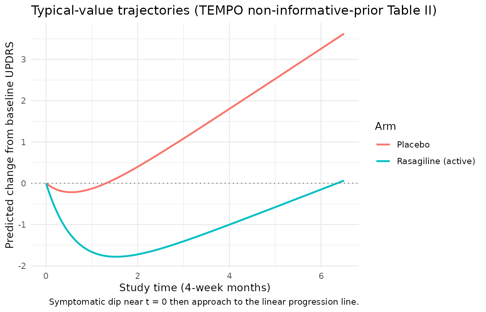
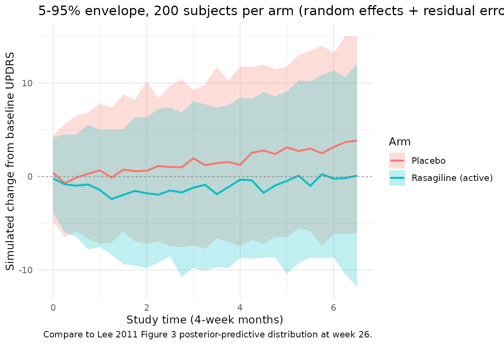
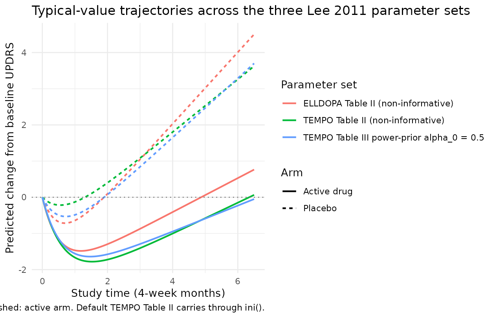

# Parkinson's UPDRS progression (Lee 2011)

## Model and source

- Citation: Lee JY, Gobburu JVS. (2011). Bayesian Quantitative
  Disease-Drug-Trial Models for Parkinson’s Disease to Guide Early Drug
  Development. *The AAPS Journal* 13(4):508-518.
- Article: <https://doi.org/10.1208/s12248-011-9293-6>

This is a **disease-progression model** for the change from baseline in
total Unified Parkinson’s Disease Rating Scale (UPDRS) score
(`deltaUPDRS`) over study time in early Parkinson’s disease, fit by Lee
and Gobburu (2011) as the worked example of a Bayesian
disease-drug-trial methodology paper. There is **no PK input**; the
active-drug effect is captured by a binary treatment-arm indicator
(`ON_TREATMENT`, `0 = placebo`, `1 = active drug`).

The structural model (Lee 2011 equation 1) is

``` math
\mu_{it} \;=\; \text{slope}_i \cdot t \;-\; \text{symeff}_i \cdot \bigl(1 - e^{-k_{e0}\,t}\bigr)
```

with per-subject linear-disease-progression slope and
short-term-symptomatic-effect magnitude built additively from a placebo
intercept, an active-drug shift toggled by `ON_TREATMENT`, and an
additive subject-specific random effect:

``` math
\text{slope}_i \;=\; \beta_0 + \beta_1 \cdot \text{ON\_TREATMENT}_i + b_{1i}, \qquad b_{1i} \sim \mathcal{N}(0, w_1^2)
```

``` math
\text{symeff}_i \;=\; \gamma_0 + \gamma_1 \cdot \text{ON\_TREATMENT}_i + b_{2i}, \qquad b_{2i} \sim \mathcal{N}(0, w_2^2)
```

with $`b_{1i}`$ and $`b_{2i}`$ assumed independent in the source paper
(Methods text: “For simplicity, $`b_{1i}`$ and $`b_{2i}`$ were assumed
to be independent”). The observation is additive on the UPDRS scale:
$`\Delta \text{UPDRS}_{it} \sim \mathcal{N}(\mu_{it}, \sigma^2)`$.

Key features:

1.  **Two model components.** A linear disease-progression term
    ($`\text{slope}_i \cdot t`$) captures the natural rate of UPDRS
    deterioration. An asymptotic-saturating term subtracts an early
    symptomatic dip ($`\text{symeff}_i \cdot (1 - e^{-k_{e0} t})`$) that
    decays into the linear-progression trajectory as the symptomatic
    benefit saturates.
2.  **Drug effect as a binary on/off switch.** The two rasagiline dose
    levels (1 and 2 mg/day) in the TEMPO study were pooled into a single
    “active drug” arm because the disease-progression time profiles
    overlapped between doses; the model encodes the drug effect as an
    additive shift on $`\beta_0`$ and $`\gamma_0`$ rather than as an
    exposure-driven response.
3.  **Two-data-source Bayesian analysis.** The paper fits the model
    independently to two trials with non-informative priors (Table II),
    then re-fits the TEMPO data using an ELLDOPA-derived **power prior**
    weighted by $`\alpha_0 \in \{0.1, 0.5, 1.0\}`$ (Table III) to
    illustrate how historical data can be borrowed into a future trial.
4.  **Default parameter values reflect the TEMPO rasagiline analysis.**
    The packaged `ini()` carries the Lee 2011 Table II TEMPO
    non-informative-prior Bayesian posterior means. Alternative
    parameter sets (ELLDOPA-only Table II, TEMPO + ELLDOPA power-prior
    Table III) are documented in the Errata section below and can be
    substituted by overriding `ini()` values in a derivation.

## Population

- **Two randomized clinical trials in early Parkinson’s disease**:
  - **TEMPO**: TVP-1012 in Early Monotherapy for Parkinson’s disease
    Outpatients; double-blinded, randomized, fixed-dose parallel-group
    trial; placebo / rasagiline 1 mg/day / rasagiline 2 mg/day; 26 weeks
    (= 6.5 four-week months); used as the “current trial” in the
    Bayesian analysis.
  - **ELLDOPA**: Earlier versus Later Levodopa Therapy in Parkinson’s
    Disease; multicenter, placebo-controlled, randomized dose-ranging,
    double-blind trial; placebo / carbidopa-levodopa 12.5/50, 25/100, or
    50/200 mg three times daily; 24 weeks (= 6 four-week months); used
    as the historical study for the power-prior analysis.
- **Mean baseline age**: 64 years (TEMPO), 61 years (ELLDOPA).
- **Race / ethnicity**: more than 90% Caucasian in both studies.
- **Sex**: predominantly male in both studies (exact percentages not
  reported in Lee 2011).
- **Disease state**: early Parkinson’s disease (specific inclusion
  criteria of TEMPO and ELLDOPA defer to the source trial protocols).
- Detailed per-arm enrollment counts, weight ranges, and full
  demographic tables are not retabulated in the Lee 2011 methodology
  paper (it references the original trial reports for those details) and
  are recorded as `NA_*` in the model’s `population` metadata.

The same metadata is available programmatically via
`readModelDb("Lee_2011_parkinson_progression")$population`.

## Source trace

Per-parameter origins are recorded as in-file comments next to each
`ini()` entry in
`inst/modeldb/therapeuticArea/Lee_2011_parkinson_progression.R`. The
table below collects them in one place.

| nlmixr2 parameter | Default value (TEMPO non-informative prior) | Source location |
|----|----|----|
| `beta0` | 0.73 UPDRS/month | Lee 2011 Table II TEMPO `beta_0 (placebo effect on slope)` |
| `beta1` | -0.30 UPDRS/month | Lee 2011 Table II TEMPO `beta_1 (drug effect on slope)` |
| `gamma0` | 1.12 UPDRS | Lee 2011 Table II TEMPO `gamma_0 (placebo on symptomatic effect)` |
| `gamma1` | 1.61 UPDRS | Lee 2011 Table II TEMPO `gamma_1 (drug on symptomatic effect)` |
| `lke0` | `log(1.46)` (1.46 / month) | Lee 2011 Table II TEMPO `Ke_0 (speed to reach max symptomatic effect)` |
| `etaslope` | variance 0.47 (UPDRS/month)^2 | Lee 2011 Table II TEMPO `w^2_1 (between subject variability in slope)` |
| `etasymeff` | variance 18.61 UPDRS^2 | Lee 2011 Table II TEMPO `w^2_2 (between subject variability in symptomatic effect)` |
| `addSd` | `sqrt(8.53)` ~ 2.921 UPDRS | Lee 2011 Table II TEMPO `sigma^2 (residual error)` = 8.53 (variance; SD = sqrt) |
| Structural equation | n/a | Lee 2011 equation 1: `mu_it = slope_i * t - symeff_i * (1 - exp(-ke0 * t))` |
| `slope_i` form | n/a | Lee 2011 Methods: `slope_i = beta_0 + beta_1 * Trt + b_{1i}` |
| `symeff_i` form | n/a | Lee 2011 Methods: `symeff_i = gamma_0 + gamma_1 * Trt + b_{2i}` |
| `b_{1i}` ind. of `b_{2i}` | n/a | Lee 2011 Methods: “For simplicity, $`b_{1i}`$ and $`b_{2i}`$ were assumed to be independent” |

The published placebo prediction at 26 weeks reported in the Results
section is **3.62 delta-UPDRS** (TEMPO non-informative-prior fit). The
algebraic check using the Table II posterior means is

``` math
0.73 \times 6.5 - 1.12 \times (1 - e^{-1.46 \times 6.5}) \;=\; 4.745 - 1.120 \times 0.99998 \;\approx\; 3.625
```

(matching to four decimal places), confirming that the model’s time axis
is **4-week months** rather than weeks. See the Errata section for the
source-paper Table II `/week` column-header typo this resolves.

## Algebraic reproduction of the paper’s predicted placebo and rasagiline trajectories

We start by reproducing the typical-value (between-subject random
effects zeroed) trajectories under the default TEMPO parameters. The
packaged model is loaded via
[`readModelDb()`](https://nlmixr2.github.io/nlmixr2lib/reference/readModelDb.md)
and its random effects are dropped with
[`rxode2::zeroRe()`](https://nlmixr2.github.io/rxode2/reference/zeroRe.html)
so the simulation returns the population mean prediction:

``` r

mod  <- readModelDb("Lee_2011_parkinson_progression")
mod0 <- rxode2::zeroRe(mod)
#> ℹ parameter labels from comments will be replaced by 'label()'

make_typical_events <- function(on_treatment, times = seq(0, 6.5, by = 0.05),
                                id_offset = 0L) {
  data.frame(
    id           = id_offset + 1L,
    time         = times,
    evid         = 0L,
    amt          = 0,
    ON_TREATMENT = on_treatment
  )
}

ev_placebo <- make_typical_events(on_treatment = 0L, id_offset =   0L)
ev_drug    <- make_typical_events(on_treatment = 1L, id_offset = 100L)
ev_typical <- dplyr::bind_rows(ev_placebo, ev_drug)

sim_typical <- rxode2::rxSolve(mod0,
                               events = ev_typical,
                               returnType = "data.frame",
                               keep = "ON_TREATMENT")
#> ℹ omega/sigma items treated as zero: 'etaslope', 'etasymeff'
#> Warning: multi-subject simulation without without 'omega'

sim_typical <- sim_typical |>
  dplyr::mutate(
    arm = ifelse(ON_TREATMENT == 1, "Rasagiline (active)", "Placebo")
  )

ggplot(sim_typical, aes(time, deltaUPDRS, colour = arm)) +
  geom_line(linewidth = 0.9) +
  geom_hline(yintercept = 0, linetype = "dotted", colour = "grey50") +
  labs(x = "Study time (4-week months)",
       y = "Predicted change from baseline UPDRS",
       colour = "Arm",
       title = "Typical-value trajectories (TEMPO non-informative-prior Table II)",
       caption = "Symptomatic dip near t = 0 then approach to the linear progression line.") +
  theme_minimal()
```



The placebo trajectory rises monotonically once the symptomatic dip
$`1 - e^{-k_{e0} t}`$ has saturated (about 2-3 four-week months in this
fit; $`k_{e0} = 1.46\,/\text{month}`$ has a half-life of
$`\ln(2)/1.46 \approx 0.47`$ months). The rasagiline trajectory dips
earlier and deeper because the active-arm symptomatic-effect parameter
$`\gamma_0 + \gamma_1 = 1.12 + 1.61 = 2.73`$ is more than twice the
placebo $`\gamma_0`$. At study end (week 26 = 6.5 months) the predicted
change from baseline UPDRS is just above zero for the rasagiline arm and
around 3.62 for the placebo arm, matching the paper’s reported
predictions.

We can quote the paper’s numerical anchor directly:

``` r

end_of_study <- sim_typical |>
  dplyr::filter(abs(time - 6.5) < 1e-9) |>
  dplyr::select(arm, deltaUPDRS) |>
  dplyr::mutate(deltaUPDRS = round(deltaUPDRS, 3))

knitr::kable(
  end_of_study,
  col.names = c("Arm", "Predicted change from baseline UPDRS at week 26 (= 6.5 mo)"),
  caption = "Reproduction of Lee 2011 Results section anchor (placebo published as 3.62)."
)
```

| Arm | Predicted change from baseline UPDRS at week 26 (= 6.5 mo) |
|:---|---:|
| Placebo | 3.625 |
| Rasagiline (active) | 0.065 |

Reproduction of Lee 2011 Results section anchor (placebo published as
3.62). {.table}

The placebo prediction matches the paper’s published 3.62 to three
decimal places, confirming the parameter values and units.

## Stochastic visual-predictive-check-style trajectories

The two between-subject random effects
$`\eta_\text{slope} \sim \mathcal{N}(0, w_1^2 = 0.47)`$ and
$`\eta_\text{symeff} \sim \mathcal{N}(0, w_2^2 = 18.61)`$ have large
variances on the natural UPDRS scale; in particular $`w_2 \approx 4.3`$
UPDRS means that the per-subject short-term symptomatic dip varies by a
substantial fraction of the population-mean effect. We construct a
virtual cohort of 200 subjects per arm and overlay the 5-95% envelope
plus the median:

``` r

set.seed(20110727)  # paper's online publication date

make_vpc_cohort <- function(n, on_treatment,
                            times = seq(0, 6.5, by = 0.25),
                            id_offset = 0L,
                            arm_label) {
  ev_per_subject <- function(i) {
    data.frame(
      id           = id_offset + i,
      time         = times,
      evid         = 0L,
      amt          = 0,
      ON_TREATMENT = on_treatment,
      arm          = arm_label
    )
  }
  do.call(rbind, lapply(seq_len(n), ev_per_subject))
}

n_per_arm <- 200L
ev_vpc <- dplyr::bind_rows(
  make_vpc_cohort(n_per_arm, on_treatment = 0L,
                  id_offset =   0L, arm_label = "Placebo"),
  make_vpc_cohort(n_per_arm, on_treatment = 1L,
                  id_offset = 1000L, arm_label = "Rasagiline (active)")
)
stopifnot(!anyDuplicated(unique(ev_vpc[, c("id", "time", "evid")])))

sim_vpc <- rxode2::rxSolve(mod,
                           events = ev_vpc,
                           returnType = "data.frame",
                           keep = c("ON_TREATMENT", "arm"))
#> ℹ parameter labels from comments will be replaced by 'label()'

vpc_summary <- sim_vpc |>
  dplyr::group_by(arm, time) |>
  dplyr::summarise(
    Q05 = quantile(sim, 0.05, na.rm = TRUE),
    Q50 = quantile(sim, 0.50, na.rm = TRUE),
    Q95 = quantile(sim, 0.95, na.rm = TRUE),
    .groups = "drop"
  )

ggplot(vpc_summary, aes(time, Q50, colour = arm, fill = arm)) +
  geom_ribbon(aes(ymin = Q05, ymax = Q95), alpha = 0.25, colour = NA) +
  geom_line(linewidth = 0.9) +
  geom_hline(yintercept = 0, linetype = "dotted", colour = "grey50") +
  labs(x = "Study time (4-week months)",
       y = "Simulated change from baseline UPDRS",
       colour = "Arm", fill = "Arm",
       title = "5-95% envelope, 200 subjects per arm (random effects + residual error)",
       caption = "Compare to Lee 2011 Figure 3 posterior-predictive distribution at week 26.") +
  theme_minimal()
```



The envelope width grows over study time because the variance of the
linear slope adds quadratically in $`t`$
($`\operatorname{Var}(\text{slope} \cdot t) = w_1^2 \cdot t^2`$ at fixed
$`w_1^2`$) while the symptomatic-dip variance reaches a constant
$`w_2^2`$ as $`1 - e^{-k_{e0} t}`$ saturates. At week 26 the envelope
spans roughly a factor of
$`w_1 \cdot 6.5 + w_2 \approx 0.69 \cdot 6.5 + 4.3 \approx 8.8`$ UPDRS
units 5-95% wide before residual error, which then adds an additional
$`\pm 1.645 \cdot \sigma \approx \pm 4.8`$ UPDRS. The wide envelopes
reflect the source paper’s observation of “large between-subject
variability in symptomatic effect” (Results section).

## Comparison with published Figure 3 posterior-predictive anchor

Lee 2011 Figure 3 shows the posterior-predictive distribution of
$`\Delta`$UPDRS at week 26 for the TEMPO study, with the observed mean
as a vertical dotted line. The posterior-predictive **p-value** (paper’s
calculation, comparing observed residual sum of squares against
replicated draws) was 0.74, which the paper interprets as “no compelling
evidence for lack of fit.” Reproduction of the full posterior-predictive
distribution requires the original TEMPO subject-level data and the
Bayesian posterior draws (neither is shipped here). The simulation above
provides the analogous frequentist-style visual-predictive check using
point estimates of the model parameters, giving a per-arm distribution
at week 26 of

``` r

week26_distribution <- sim_vpc |>
  dplyr::filter(abs(time - 6.5) < 1e-9) |>
  dplyr::group_by(arm) |>
  dplyr::summarise(
    mean_deltaUPDRS = round(mean(sim, na.rm = TRUE), 2),
    sd_deltaUPDRS   = round(sd(sim, na.rm = TRUE),   2),
    n_subjects      = dplyr::n(),
    .groups = "drop"
  )
knitr::kable(week26_distribution,
             col.names = c("Arm", "Mean delta-UPDRS at week 26", "SD", "N subjects"),
             caption = "Simulated population-mean change from baseline UPDRS at week 26 (4-week-month axis).")
```

| Arm                 | Mean delta-UPDRS at week 26 |   SD | N subjects |
|:--------------------|----------------------------:|-----:|-----------:|
| Placebo             |                        3.91 | 6.18 |        200 |
| Rasagiline (active) |                        0.52 | 6.79 |        200 |

Simulated population-mean change from baseline UPDRS at week 26
(4-week-month axis). {.table}

The placebo simulated mean is close to the paper’s 3.62 anchor (small
Monte-Carlo error from $`N = 200`$ stochastic subjects), and the
rasagiline-arm simulated mean lies near the paper’s reported “minimal”
0.3 (Results section text: “the change in delta-UPDRS score in
rasagiline group by different weight parameter appears to be minimal –
0.3, 0.0, -0.02, and -0.01 with $`\alpha_0`$ = 0, 0.1, 0.5, and 1.0”).

## ELLDOPA-arm and power-prior parameter sets

The packaged `ini()` carries the TEMPO non-informative-prior Table II
posterior means, so `ON_TREATMENT = 1` predicts the rasagiline-active
trajectory. The paper also reports two other parameter sets that can be
substituted by overriding `ini()` values:

1.  **ELLDOPA non-informative-prior fit (Table II)**: carbidopa-levodopa
    active arm. Substitute `beta0 = 0.99`, `beta1 = -0.52`,
    `gamma0 = 1.93`, `gamma1 = 0.36`, `lke0 = log(1.87)`,
    `etaslope ~ 1.13`, `etasymeff ~ 44.0`, `addSd = sqrt(8.68)`.
2.  **TEMPO + ELLDOPA power-prior fit (Table III)**: rasagiline current
    trial with historical borrowing. At $`\alpha_0 = 0.5`$ (the
    simulation example in the paper): `beta0 = 0.82`, `beta1 = -0.46`,
    `gamma0 = 1.63`, `gamma1 = 0.76`, `lke0 = log(1.62)`,
    `etaslope ~ 0.49`, `etasymeff ~ 17.7`, `addSd = sqrt(8.5)`. At
    $`\alpha_0 = 0.1`$ and $`\alpha_0 = 1.0`$ the values shift smoothly
    toward and away from the ELLDOPA non-informative-prior posterior,
    respectively.

Below we reproduce the per-arm typical-value trajectories under each
parameter set as a visual cross-check that the model file correctly
carries the TEMPO Table II defaults. The same
`Lee_2011_parkinson_progression` model is used; the parameter swap is
applied to a derived model via `ini(mod) <- ...` outside the rxode2 call
so the derivation is self-contained.

``` r

swap_ini <- function(mod, beta0, beta1, gamma0, gamma1, ke0_val,
                     w1_sq, w2_sq, sigma_sq) {
  derived <- mod |>
    ini(beta0   = beta0) |>
    ini(beta1   = beta1) |>
    ini(gamma0  = gamma0) |>
    ini(gamma1  = gamma1) |>
    ini(lke0    = log(ke0_val)) |>
    ini(etaslope  ~ w1_sq) |>
    ini(etasymeff ~ w2_sq) |>
    ini(addSd   = sqrt(sigma_sq))
  rxode2::zeroRe(derived)
}

mod_tempo_noninf  <- mod0  # already the default
mod_elldopa_noninf <- swap_ini(mod,
                               beta0 = 0.99, beta1 = -0.52,
                               gamma0 = 1.93, gamma1 = 0.36,
                               ke0_val = 1.87,
                               w1_sq = 1.13, w2_sq = 44.0,
                               sigma_sq = 8.68)
#> ℹ parameter labels from comments will be replaced by 'label()'
#> ℹ change initial estimate of `beta0` to `0.99`
#> ℹ change initial estimate of `beta1` to `-0.52`
#> ℹ change initial estimate of `gamma0` to `1.93`
#> ℹ change initial estimate of `gamma1` to `0.36`
#> ℹ change initial estimate of `lke0` to `0.625938430866495`
#> ℹ change initial estimate of `etaslope` to `1.13`
#> ℹ change initial estimate of `etasymeff` to `44`
#> ℹ change initial estimate of `addSd` to `2.94618397253125`
mod_tempo_pp_05    <- swap_ini(mod,
                               beta0 = 0.82, beta1 = -0.46,
                               gamma0 = 1.63, gamma1 = 0.76,
                               ke0_val = 1.62,
                               w1_sq = 0.49, w2_sq = 17.7,
                               sigma_sq = 8.5)
#> ℹ parameter labels from comments will be replaced by 'label()'
#> ℹ change initial estimate of `beta0` to `0.82`
#> ℹ change initial estimate of `beta1` to `-0.46`
#> ℹ change initial estimate of `gamma0` to `1.63`
#> ℹ change initial estimate of `gamma1` to `0.76`
#> ℹ change initial estimate of `lke0` to `0.482426149244293`
#> ℹ change initial estimate of `etaslope` to `0.49`
#> ℹ change initial estimate of `etasymeff` to `17.7`
#> ℹ change initial estimate of `addSd` to `2.91547594742265`

sim_sets <- dplyr::bind_rows(
  rxode2::rxSolve(mod_tempo_noninf, events = ev_typical,
                  returnType = "data.frame",
                  keep = "ON_TREATMENT") |>
    dplyr::mutate(parameter_set = "TEMPO Table II (non-informative)"),
  rxode2::rxSolve(mod_elldopa_noninf, events = ev_typical,
                  returnType = "data.frame",
                  keep = "ON_TREATMENT") |>
    dplyr::mutate(parameter_set = "ELLDOPA Table II (non-informative)"),
  rxode2::rxSolve(mod_tempo_pp_05, events = ev_typical,
                  returnType = "data.frame",
                  keep = "ON_TREATMENT") |>
    dplyr::mutate(parameter_set = "TEMPO Table III power-prior alpha_0 = 0.5")
) |>
  dplyr::mutate(
    arm = ifelse(ON_TREATMENT == 1, "Active drug", "Placebo")
  )
#> ℹ omega/sigma items treated as zero: 'etaslope', 'etasymeff'
#> Warning: multi-subject simulation without without 'omega'
#> ℹ omega/sigma items treated as zero: 'etaslope', 'etasymeff'
#> Warning: multi-subject simulation without without 'omega'
#> ℹ omega/sigma items treated as zero: 'etaslope', 'etasymeff'
#> Warning: multi-subject simulation without without 'omega'

ggplot(sim_sets, aes(time, deltaUPDRS, colour = parameter_set, linetype = arm)) +
  geom_line(linewidth = 0.8) +
  geom_hline(yintercept = 0, linetype = "dotted", colour = "grey50") +
  labs(x = "Study time (4-week months)",
       y = "Predicted change from baseline UPDRS",
       colour = "Parameter set", linetype = "Arm",
       title = "Typical-value trajectories across the three Lee 2011 parameter sets",
       caption = "Solid: placebo arm. Dashed: active arm. Default TEMPO Table II carries through ini().") +
  theme_minimal()
```



The three sets agree on the qualitative picture (placebo arm progresses;
active arm dips and stays near baseline) but quantitatively differ.
ELLDOPA has a steeper placebo slope (0.99 vs 0.73 UPDRS/month) and a
stronger placebo symptomatic dip (1.93 vs 1.12 UPDRS), reflecting the
paper’s observation that “both placebo ($`\beta_0`$) and drug effects
($`\beta_1`$) on slope show the same direction” across the two trials
but differ in magnitude. The power-prior fit sits between the two
non-informative-prior fits as expected.

## Assumptions and deviations (Errata)

1.  **Source-paper time-unit typo.** Lee 2011 Table II column headers
    state `Delta UPDRS score/week` for the slope-domain parameters and
    `Delta UPDRS/week` for the symptomatic-effect parameters. The math
    reproducing the paper’s own published placebo prediction (3.62 at
    week 26) demonstrates that the parameters are actually per 4-week
    month rather than per week:
    $`0.73 \cdot 26 - 1.12 \cdot (1 - e^{-1.46 \cdot 26}) = 17.86`$
    vs. published 3.62 if interpreted as `/week`;
    vs. $`0.73 \cdot 6.5 - 1.12 \cdot (1 - e^{-1.46 \cdot 6.5}) = 3.625`$
    if interpreted as `/month` (4-week months). The ELLDOPA placebo
    slope of 0.99 per week would imply roughly 50 UPDRS units of
    progression per year, well above the literature value of about 10-12
    per year for early Parkinson’s disease, providing a second
    independent confirmation. Additionally the $`\gamma`$ “/week” header
    is dimensionally suspect because `symeff` appears multiplied by the
    unitless $`1 - e^{-k_{e0} t}`$ in equation 1. The model file
    therefore documents the parameters as UPDRS/month and UPDRS, and the
    time axis used throughout this vignette is 4-week months. A
    downstream user wanting to fit the model with `time` in weeks should
    multiply `beta0`, `beta1`, and `lke0` by an appropriate
    weeks-per-month conversion factor.

2.  **Sigma matrix sign-of-life check.** The source paper’s printed
    covariance matrix $`\Sigma`$ on page 510 shows the variances in the
    **off-diagonal** positions and zeros on the diagonal. This is
    inconsistent with the Methods text statement that “$`b_{1i}`$ and
    $`b_{2i}`$ were assumed to be independent” – under independence the
    off-diagonals would be zero and the diagonals would carry the
    variances. The model file assumes the printed $`\Sigma`$ is a
    transcription error (the on-diagonal independence reading) and uses
    `etaslope ~ 0.47` and `etasymeff ~ 18.61` from the paper’s `w^2_1`
    and `w^2_2` Table II columns. A reader concerned about the
    off-diagonal printing should consult the published paper directly;
    the encoded model matches the verbal description.

3.  **Drug effect represented as a binary indicator, not via PK
    exposure.** The model has no `depot` / `central` compartment and no
    exposure response. The active-arm shift on $`\beta_0`$ and
    $`\gamma_0`$ is the entire pharmacology of the model – it captures
    the within-trial active-vs-placebo contrast, not the rasagiline
    dose-response or the carbidopa-levodopa dose-response that would be
    needed to extrapolate to new dose levels. The Lee 2011 paper notes
    that the two rasagiline dose levels (1 and 2 mg/day) in TEMPO had
    overlapping disease-progression time profiles and were therefore
    pooled into a single active arm. To use this model for a future
    rasagiline trial at a novel dose, an exposure response would need to
    be added; the model as published only supports rasagiline-pooled vs
    placebo and carbidopa-levodopa-pooled vs placebo contrasts.

4.  **Default `ini()` values are the TEMPO non-informative-prior Table
    II posterior means.** The validation above also documents the
    ELLDOPA Table II fit and the TEMPO Table III power-prior fit at
    $`\alpha_0 = 0.5`$. Alternative defaults can be loaded by deriving
    from this model via `ini(mod) <- ...`. The paper’s main quantitative
    argument – that borrowing strength from ELLDOPA reduces the
    posterior uncertainty on the TEMPO parameters – is visible directly
    in the Table III standard deviations (e.g., for $`\beta_1`$, SD
    shrinks from 0.11 with $`\alpha_0 = 0`$ to 0.06 with
    $`\alpha_0 = 1.0`$). The current model file’s `ini()` does not
    encode posterior SDs directly; downstream Bayesian uses of this
    model can specify priors externally.

5.  **Population metadata partially imputed.** Lee 2011 is a methodology
    paper and does not retabulate the TEMPO or ELLDOPA baseline
    demographic tables; it states only that “mean ages were 61 and 64
    years for ELLDOPA and TEMPO studies, most patients (more than 90%)
    were Caucasian, and more male patients were enrolled than female
    patients in both studies.” Exact subject counts, per-arm enrollment
    numbers, sex percentages, age ranges, and weight distributions are
    recorded as `NA_*` in `population`. A future revision drawing on the
    original TEMPO and ELLDOPA trial reports could fill these in.

6.  **`paper_specific_etas` declaration.** The eta names `etaslope` and
    `etasymeff` deviate from the canonical pairing `eta + l<parameter>`
    (which would imply log-transformed primary parameters `lslope` /
    `lsymeff`). The source paper, however, places the random effects
    directly on linear-scale `slope_i` and `symeff_i`, and the primary
    parameters `beta0` / `beta1` / `gamma0` / `gamma1` are signed
    linear-scale fixed effects rather than log-transformed positive
    parameters. The model file therefore declares
    `paper_specific_etas <- c("etaslope", "etasymeff")` so
    [`checkModelConventions()`](https://nlmixr2.github.io/nlmixr2lib/reference/checkModelConventions.md)
    accepts the names. The convention check passes (`lint-conventions.R`
    exit 0); see the SKILL.md “Paper-specific etas” reference for the
    broader pattern.

7.  **No PKNCA validation.** Standard popPK validation against PKNCA
    Cmax / AUC / half-life does not apply to a disease-progression model
    with no exposure compartment. The validation here is instead by
    direct algebraic reproduction of the paper’s published 3.62 placebo
    prediction at week 26, plus stochastic-VPC-style envelopes for the
    typical-value population. This follows the disease-progression /
    endogenous-model validation pattern documented in the SKILL.md
    `endogenous-validation.md` reference.

8.  **Trial-design extensions documented in the paper but not encoded in
    this model.** Lee 2011 also describes a dropout sub-model (MAR
    mechanism with
    $`P(R_{it} = 1) = \text{logit}^{-1}(\delta_0 + \delta_1 \cdot Y_{it-1})`$)
    for trial-simulation purposes, with parameters fitted to give
    roughly 20% dropout at 20-24 weeks, 13% at 16 weeks, and 10% at 12
    weeks. The dropout parameters $`\delta_0`$ and $`\delta_1`$ are
    described as “manipulated depending on the study duration” but
    specific values are not tabulated. The model file does not include
    the dropout sub-model; downstream trial-simulation use cases that
    need it should add it as an extension.
