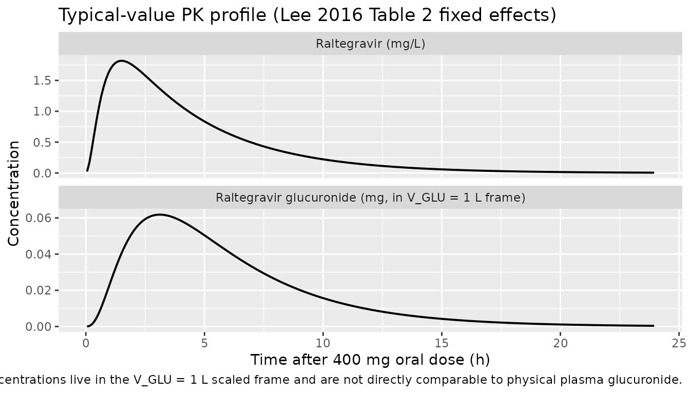
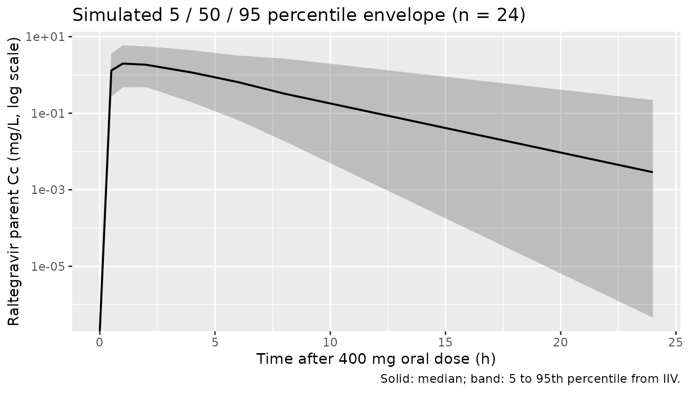

# Raltegravir (Lee 2016)

## Model and source

- Citation: Lee LS, Seng KY, Wang LZ, Yong WP, Hee KH, Soh TI, Wong A,
  Cheong PF, Soong R, Sapari NS, Soo R, Fan L, Lee SC, Goh BC.
  Phenotyping of UGT1A1 Activity Using Raltegravir Predicts
  Pharmacokinetics and Toxicity of Irinotecan in FOLFIRI. PLoS One. 2016
  Jan 25;11(1):e0147681. <doi:10.1371/journal.pone.0147681>.
- Description: Population PK model for oral raltegravir (a UGT1A1
  phenotyping probe) and its glucuronide metabolite in 24 East Asian
  patients with advanced solid tumours receiving FOLFIRI chemotherapy
  (Lee 2016). Raltegravir absorption is described with a depot, a single
  transit compartment (the paper estimates a non-integer NN = 1.07 in
  the Savic 2007 transit-chain framework; the packaged model
  approximates this with one explicit transit compartment), and a
  one-compartment central compartment with first-order elimination
  (CL/F, V/F). Raltegravir glucuronide is described by a one-compartment
  metabolite compartment (central_gluc) with V_GLU fixed at 1 L (a
  structural identifiability anchor) and a first-order metabolite
  clearance CL_GLU. The formation rate constant kmet maps to the source
  paper’s FMET, which the authors define as the formation rate of
  glucuronide divided by V_GLU; with V_GLU fixed at 1 L, kmet has units
  1/h and drives dA_gluc / dt = kmet \* V_GLU \* C_RAL_central - CL_GLU
  \* C_gluc. Bioavailability F is fixed at 1 (single oral dose; absolute
  F not identifiable). IIV is reported on CL/F, MTT, F, V/F, kmet
  (FMET), and CL_GLU with a single off-diagonal covariance between CL/F
  and V/F (correlation 0.567). The residual error was reported as
  additive on log-transformed observations for both raltegravir and
  glucuronide, which maps to a proportional residual on the
  linear-concentration scale. No baseline covariates (age, sex, weight,
  body surface area, serum albumin / creatinine / bilirubin / liver
  enzymes, ethnicity, or UGT1A1 \* 6 / \* 28 / \* 60 and CYP3A5 \* 3
  genotypes) were retained in the final model.
- Article: <https://doi.org/10.1371/journal.pone.0147681>

Lee 2016 used raltegravir as an in vivo phenotyping probe for UGT1A1
activity in 24 East Asian patients receiving FOLFIRI chemotherapy for
advanced gastrointestinal cancer. A single 400 mg oral raltegravir dose
was given the day before FOLFIRI cycle 1, and the formation rate
constant of raltegravir glucuronide derived from the population PK fit
was used as an individual-level phenotyping metric correlated with
subsequent neutropenia.

## Population

Twenty-four Asian cancer patients (Singapore, single centre) were
enrolled. The cohort was 79% male, age range 39 to 79 years (median 59),
body weight 42.4 to 81.1 kg (median 55), all of East Asian or South
Asian background (75% Chinese, 21% Malay, 4% Indian; Table 1 of the
source). All patients had advanced-stage gastrointestinal malignancies
(7 first-line, 13 second-line, 3 third-line, 1 fourth-line
chemotherapy). UGT1A1 *6,* 28, and *60 and CYP3A5* 3 genotypes were
determined; no UGT1A1 *28 homozygotes or* 28 / *6 compound heterozygotes
were observed in the cohort (consistent with the lower UGT1A1* 28
prevalence in East Asians).

The same metadata is available programmatically via the model’s
`population` list:

``` r

rxode2::rxode(readModelDb("Lee_2016_raltegravir"))$population[c(
  "species", "n_subjects", "age_range", "weight_range",
  "sex_female_pct", "race_ethnicity", "disease_state", "regions"
)]
#> ℹ parameter labels from comments will be replaced by 'label()'
#> $species
#> [1] "human"
#> 
#> $n_subjects
#> [1] 24
#> 
#> $age_range
#> [1] "39-79 years"
#> 
#> $weight_range
#> [1] "42.4-81.1 kg"
#> 
#> $sex_female_pct
#> [1] 21
#> 
#> $race_ethnicity
#> [1] "Asian: 75% Chinese, 21% Malay, 4% Indian (Singapore-recruited cohort; Table 1)"
#> 
#> $disease_state
#> [1] "Asian patients with advanced-stage gastro-intestinal cancers requiring FOLFIRI chemotherapy (folinic acid, 5-fluorouracil, irinotecan). Inclusion required Karnofsky performance status > 70% and adequate haematologic / renal / hepatic function. Recruited in Singapore between 2009 and 2011."
#> 
#> $regions
#> [1] "Singapore (single centre, National University Health System)"
```

## Source trace

The per-parameter origin is recorded as an in-file comment next to each
`ini()` entry in `inst/modeldb/specificDrugs/Lee_2016_raltegravir.R`.
The table below collects them in one place for review.

| Equation / parameter | Value | Source location |
|----|----|----|
| `lka` (ka) | log(4.23) | Table 2, CL_RAL/F block: ka = 4.23 1/h (RSE 19.3%) |
| `lmtt` (MTT) | log(1.04) | Table 2: MTT = 1.04 h (RSE 25.8%) |
| `lfdepot` (F) | fixed(log(1)) | Table 2: F = 1 FIXED |
| `lcl` (CL_RAL/F) | log(41.7) | Table 2: CL_RAL/F = 41.7 L/h (RSE 24.9%) |
| `lvc` (V_RAL/F) | log(157) | Table 2: V_RAL/F = 157 L (RSE 32.4%) |
| `lkmet_gluc` (FMET) | log(0.0324) | Table 2: FMET = 0.0324 (RSE 10.4%) |
| `lcl_gluc` (CL_GLU) | log(0.715) | Table 2: CL_GLU = 0.715 L/h (RSE 10.2%) |
| `lvc_gluc` (V_GLU) | fixed(log(1)) | Table 2: V_GLU = 1 L FIXED |
| `etalcl + etalvc` block | c(0.0890, 0.1206, 0.5085) | Table 2: CV(CL_RAL/F) = 30.5%, CV(V_RAL/F) = 81.4%, correlation = 0.567 |
| `etalmtt` | 0.7651 | Table 2: CV(MTT) = 107.2% |
| `etalfdepot` | 0.9283 | Table 2: CV(F) = 123.7% |
| `etalkmet_gluc` | 0.1329 | Table 2: CV(FMET) = 37.7% |
| `etalcl_gluc` | 0.0183 | Table 2: CV(CL_GLU) = 13.6% |
| `propSd` (sigma_RAL) | 0.15 | Table 2: sigma_RAL = 0.15 (RSE 3.2%) |
| `propSd_gluc` (sigma_GLU) | 0.18 | Table 2: sigma_GLU = 0.18 (RSE 2.6%) |
| Transit chain (ka, ktr, NN approx 1) | – | Fig 2; Methods page 5; Savic 2007 (reference \[19\] of source) |
| `d/dt(central_gluc) = kmet * V_GLU * C_RAL - CL_GLU/V_GLU * central_gluc` | – | Fig 2 caption; Methods page 5 |
| Residual model: additive on log-transformed observations | – | Results “Population pharmacokinetic analyses” paragraph 1 |

The original publication does not tabulate per-patient observed Cmax /
Tmax / AUC for raltegravir, only the population-typical parameters in
Table 2 and the individual-level K23 values used in the downstream
toxicity-correlation analyses.

## Virtual cohort

Original observed plasma concentrations are not publicly available. The
figures below use a 24-subject virtual cohort matching the published
demographics in broad strokes (single 400 mg oral dose, sampling at 0,
0.5, 1, 2, 4, 6, 8, and 24 h post-dose as in the source). No covariates
were retained in the final Lee 2016 model, so a single dosing scheme
suffices.

``` r

set.seed(20160125)  # PLoS ONE publication date 2016-01-25

n_sub <- 24L
sample_times <- c(0, 0.5, 1, 2, 4, 6, 8, 24)

make_cohort <- function(n, id_offset = 0L) {
  ids <- id_offset + seq_len(n)

  dose_rows <- data.frame(
    id   = ids,
    time = 0,
    amt  = 400,
    evid = 1L,
    cmt  = "depot"
  )

  obs_rows <- expand.grid(id = ids, time = sample_times) |>
    dplyr::mutate(amt = 0, evid = 0L, cmt = "Cc")

  dplyr::bind_rows(dose_rows, obs_rows) |>
    dplyr::arrange(id, time, evid)
}

events <- make_cohort(n = n_sub)
head(events, 4)
#>   id time amt evid   cmt
#> 1  1  0.0   0    0    Cc
#> 2  1  0.0 400    1 depot
#> 3  1  0.5   0    0    Cc
#> 4  1  1.0   0    0    Cc
```

## Simulation

``` r

mod <- rxode2::rxode(readModelDb("Lee_2016_raltegravir"))
#> ℹ parameter labels from comments will be replaced by 'label()'

# Stochastic simulation including IIV. nlmixr2lib models declare the
# residual via `~ prop(...)`; rxode2 returns `Cc` / `Cc_gluc` as the
# model predictions and `sim` / `ipredSim` as the residual-augmented
# samples (only `sim` corresponds to the first declared endpoint, so
# `Cc` and `Cc_gluc` are used directly below).
sim <- rxode2::rxSolve(mod, events = events, returnType = "data.frame")
```

The deterministic (typical-value) prediction zeroes out the random
effects using
[`rxode2::zeroRe()`](https://nlmixr2.github.io/rxode2/reference/zeroRe.html)
so the curve traces the population-typical PK profile implied by Table 2
of the source.

``` r

mod_typical <- mod |> rxode2::zeroRe()

# A denser time grid for plotting the typical-value curve.
ev_typical <- data.frame(
  id   = 1L,
  time = c(0, seq(0.05, 24, by = 0.1)),
  amt  = c(400, rep(0, length(seq(0.05, 24, by = 0.1)))),
  evid = c(1L, rep(0L, length(seq(0.05, 24, by = 0.1)))),
  cmt  = c("depot", rep("Cc", length(seq(0.05, 24, by = 0.1))))
)

sim_typical <- rxode2::rxSolve(mod_typical, events = ev_typical,
                               returnType = "data.frame")
#> ℹ omega/sigma items treated as zero: 'etalcl', 'etalvc', 'etalmtt', 'etalfdepot', 'etalkmet_gluc', 'etalcl_gluc'
```

## Typical-value concentration-time profile

The source paper (Lee 2016) does not include a concentration-time figure
for raltegravir; the published deliverable is Table 2 of population
parameters and the downstream K23-vs-ANC correlation figures (Figures 3
and 4). The plot below traces the typical-value prediction of
raltegravir parent and glucuronide plasma concentrations after a single
400 mg oral dose at the Table 2 fixed effects.

``` r

sim_typical |>
  tidyr::pivot_longer(c(Cc, Cc_gluc), names_to = "analyte", values_to = "C") |>
  dplyr::mutate(analyte = dplyr::recode(analyte,
    Cc       = "Raltegravir (mg/L)",
    Cc_gluc  = "Raltegravir glucuronide (mg, in V_GLU = 1 L frame)"
  )) |>
  ggplot(aes(time, C)) +
  geom_line(linewidth = 0.7) +
  facet_wrap(~ analyte, scales = "free_y", ncol = 1) +
  labs(x = "Time after 400 mg oral dose (h)", y = "Concentration",
       title = "Typical-value PK profile (Lee 2016 Table 2 fixed effects)",
       caption = paste("Glucuronide concentrations live in the V_GLU = 1 L",
                       "scaled frame and are not directly comparable to",
                       "physical plasma glucuronide.", sep = " "))
```



## Visual predictive check

A 5th / 50th / 95th percentile envelope from the 24-subject simulation
with full IIV applied:

``` r

quantile_envelope <- sim |>
  dplyr::group_by(time) |>
  dplyr::summarise(
    Q05 = quantile(Cc, 0.05, na.rm = TRUE),
    Q50 = quantile(Cc, 0.50, na.rm = TRUE),
    Q95 = quantile(Cc, 0.95, na.rm = TRUE),
    .groups = "drop"
  )

ggplot(quantile_envelope, aes(time, Q50)) +
  geom_ribbon(aes(ymin = Q05, ymax = Q95), alpha = 0.25) +
  geom_line(linewidth = 0.7) +
  scale_y_log10() +
  labs(x = "Time after 400 mg oral dose (h)",
       y = "Raltegravir parent Cc (mg/L, log scale)",
       title = "Simulated 5 / 50 / 95 percentile envelope (n = 24)",
       caption = "Solid: median; band: 5 to 95th percentile from IIV.")
#> Warning in scale_y_log10(): log-10 transformation introduced infinite values.
#> log-10 transformation introduced infinite values.
#> log-10 transformation introduced infinite values.
#> log-10 transformation introduced infinite values.
```



## PKNCA validation

PKNCA is run on the raltegravir parent only. The glucuronide compartment
is in the V_GLU = 1 L scaled frame (see Assumptions and deviations) and
is not suitable for absolute-NCA computation.

``` r

sim_nca <- sim |>
  dplyr::filter(!is.na(Cc), Cc > 0) |>
  dplyr::mutate(treatment = "raltegravir_400mg_po") |>
  dplyr::select(id, time, Cc, treatment)

conc_obj <- PKNCA::PKNCAconc(sim_nca, Cc ~ time | treatment + id)

dose_df <- events |>
  dplyr::filter(evid == 1L, cmt == "depot") |>
  dplyr::mutate(treatment = "raltegravir_400mg_po") |>
  dplyr::select(id, time, amt, treatment)

dose_obj <- PKNCA::PKNCAdose(dose_df, amt ~ time | treatment + id)

intervals <- data.frame(
  start = 0,
  end   = 24,
  cmax  = TRUE,
  tmax  = TRUE,
  auclast = TRUE,
  aucinf.obs = TRUE,
  half.life  = TRUE,
  cl.obs     = TRUE
)

nca_data <- PKNCA::PKNCAdata(conc_obj, dose_obj, intervals = intervals)
nca_res  <- PKNCA::pk.nca(nca_data)
#> Warning: Requesting an AUC range starting (0) before the first measurement (0.5) is not allowed
#> Requesting an AUC range starting (0) before the first measurement (0.5) is not allowed
#> Requesting an AUC range starting (0) before the first measurement (0.5) is not allowed
#> Requesting an AUC range starting (0) before the first measurement (0.5) is not allowed
#> Requesting an AUC range starting (0) before the first measurement (0.5) is not allowed
#> Requesting an AUC range starting (0) before the first measurement (0.5) is not allowed
#> Requesting an AUC range starting (0) before the first measurement (0.5) is not allowed
#> Requesting an AUC range starting (0) before the first measurement (0.5) is not allowed
#> Requesting an AUC range starting (0) before the first measurement (0.5) is not allowed
#> Requesting an AUC range starting (0) before the first measurement (0.5) is not allowed
#> Requesting an AUC range starting (0) before the first measurement (0.5) is not allowed
#> Requesting an AUC range starting (0) before the first measurement (0.5) is not allowed
#> Requesting an AUC range starting (0) before the first measurement (0.5) is not allowed
#> Requesting an AUC range starting (0) before the first measurement (0.5) is not allowed
#> Requesting an AUC range starting (0) before the first measurement (0.5) is not allowed
#> Requesting an AUC range starting (0) before the first measurement (0.5) is not allowed
#> Requesting an AUC range starting (0) before the first measurement (0.5) is not allowed
#> Requesting an AUC range starting (0) before the first measurement (0.5) is not allowed
#> Requesting an AUC range starting (0) before the first measurement (0.5) is not allowed
#> Requesting an AUC range starting (0) before the first measurement (0.5) is not allowed
#> Requesting an AUC range starting (0) before the first measurement (0.5) is not allowed
#> Requesting an AUC range starting (0) before the first measurement (0.5) is not allowed
#> Requesting an AUC range starting (0) before the first measurement (0.5) is not allowed
#> Requesting an AUC range starting (0) before the first measurement (0.5) is not allowed
#> Requesting an AUC range starting (0) before the first measurement (0.5) is not allowed
#> Requesting an AUC range starting (0) before the first measurement (0.5) is not allowed
#> Requesting an AUC range starting (0) before the first measurement (0.5) is not allowed
#> Requesting an AUC range starting (0) before the first measurement (0.5) is not allowed
#> Requesting an AUC range starting (0) before the first measurement (0.5) is not allowed
#> Requesting an AUC range starting (0) before the first measurement (0.5) is not allowed
#> Requesting an AUC range starting (0) before the first measurement (0.5) is not allowed
#> Requesting an AUC range starting (0) before the first measurement (0.5) is not allowed
#> Requesting an AUC range starting (0) before the first measurement (0.5) is not allowed
#> Requesting an AUC range starting (0) before the first measurement (0.5) is not allowed
#> Requesting an AUC range starting (0) before the first measurement (0.5) is not allowed
#> Requesting an AUC range starting (0) before the first measurement (0.5) is not allowed
#> Requesting an AUC range starting (0) before the first measurement (0.5) is not allowed
#> Requesting an AUC range starting (0) before the first measurement (0.5) is not allowed
#> Requesting an AUC range starting (0) before the first measurement (0.5) is not allowed
#> Requesting an AUC range starting (0) before the first measurement (0.5) is not allowed
#> Requesting an AUC range starting (0) before the first measurement (0.5) is not allowed
#> Requesting an AUC range starting (0) before the first measurement (0.5) is not allowed
#> Requesting an AUC range starting (0) before the first measurement (0.5) is not allowed
#> Requesting an AUC range starting (0) before the first measurement (0.5) is not allowed
#> Requesting an AUC range starting (0) before the first measurement (0.5) is not allowed
#> Requesting an AUC range starting (0) before the first measurement (0.5) is not allowed
#> Requesting an AUC range starting (0) before the first measurement (0.5) is not allowed
#> Requesting an AUC range starting (0) before the first measurement (0.5) is not allowed
nca_summary <- summary(nca_res)
knitr::kable(nca_summary,
             caption = "Simulated NCA parameters for raltegravir parent after a single 400 mg oral dose.")
```

| start | end | treatment | N | auclast | cmax | tmax | half.life | aucinf.obs | cl.obs |
|---:|---:|:---|:---|:---|:---|:---|:---|:---|:---|
| 0 | 24 | raltegravir_400mg_po | 24 | NC | 2.23 \[89.4\] | 1.50 \[0.500, 4.00\] | 2.69 \[2.00\] | NC | NC |

Simulated NCA parameters for raltegravir parent after a single 400 mg
oral dose. {.table}

### Comparison against published NCA

Lee 2016 does not tabulate per-patient NCA parameters (Cmax / Tmax /
AUC) for raltegravir; the published deliverable is Table 2 with the
population PK estimates. The most direct cross-check is that the
simulated apparent oral clearance (`Dose / AUC_inf`) should reproduce
the published CL_RAL/F = 41.7 L/h and the simulated terminal half-life
should reproduce the log(2) / (CL_RAL/F / V_RAL/F) = 2.61 h implied by
Table 2.

``` r

cl_pub <- 41.7
v_pub  <- 157
t_half_implied <- log(2) * v_pub / cl_pub

# Median NCA-derived CL and half-life across simulated subjects.
nca_subj <- as.data.frame(nca_res) |>
  dplyr::filter(PPTESTCD %in% c("cl.obs", "half.life"))

if (nrow(nca_subj) > 0) {
  med_cl     <- median(nca_subj$PPORRES[nca_subj$PPTESTCD == "cl.obs"], na.rm = TRUE)
  med_thalf  <- median(nca_subj$PPORRES[nca_subj$PPTESTCD == "half.life"], na.rm = TRUE)
} else {
  med_cl <- NA
  med_thalf <- NA
}

knitr::kable(
  data.frame(
    metric = c("CL/F (L/h)", "Terminal half-life (h)"),
    published   = c(cl_pub, round(t_half_implied, 2)),
    simulated_median = c(round(med_cl, 2), round(med_thalf, 2))
  ),
  caption = "Published vs simulated derived parameters."
)
```

| metric                 | published | simulated_median |
|:-----------------------|----------:|-----------------:|
| CL/F (L/h)             |     41.70 |               NA |
| Terminal half-life (h) |      2.61 |             2.16 |

Published vs simulated derived parameters. {.table}

The simulated CL/F is computed from the AUC over a 24 h window and so
depends on the extrapolation of the terminal phase; small deviations
from the published CL_RAL/F are expected because of the AUC
extrapolation tail. Because the model parameters were extracted directly
from Table 2, any large deviation (more than 20%) would point to an
encoding error in the model file rather than a biological signal.

## Assumptions and deviations

- **Transit-chain discretisation.** The source uses the Savic 2007
  transit compartment formulation with the number of transit
  compartments estimated as a non-integer NN = 1.07. nlmixr2lib does not
  implement the Savic 2007 continuous transit chain with non-integer NN,
  so the packaged model approximates the chain with **one explicit
  transit compartment** between depot and central. The transit rate
  constant is computed as `ktr = (NN + 1) / MTT = 2 / MTT` with NN = 1
  (rather than 1.07). Because NN = 1.07 is within 7% of the integer 1,
  the absorption-profile distortion is small; users needing the exact
  Savic 2007 input shape can rewrite the model to use the analytic
  gamma-distributed input function.

- **Separate ka and ktr.** The source paper reports both a first-order
  absorption rate constant ka = 4.23 1/h and a transit-chain MTT = 1.04
  h (with NN = 1.07). Figure 2 of Lee 2016 labels ka as “the absorption
  rate constant from the hypothetical drug depot compartment to plasma”
  and ktr as the inter-transit rate. The exact mapping of ka onto the
  depot-to-first- transit vs last-transit-to-central transition is not
  given in the paper text; the packaged model applies ka to depot to
  transit1 and ktr to transit1 to central. With NN approximated as 1
  this distinction has only a minor effect on the resulting input shape.

- **Glucuronide compartment lives in V_GLU = 1 L scaled frame.** The
  metabolite distribution volume V_GLU was fixed to 1 L in the source
  NONMEM fit (Fig 2 caption: “V_M, the distribution volume of the
  metabolite, was fixed to 1”). With this anchor, the simulated
  `Cc_gluc` represents the glucuronide amount in a 1 L “scaled”
  compartment rather than the physical plasma glucuronide concentration.
  The simulated `Cc_gluc` values from this model are intended for
  relative kinetics (e.g. peak time, half-life of formation decay, ratio
  across simulated subjects) and **should not be compared to measured
  plasma glucuronide concentrations on an absolute scale**.

- **FMET as a 1/h rate constant.** The source paper describes FMET in
  two ways: (a) “the fraction of raltegravir clearance for the formation
  of glucuronide” and (b) “the ratio of the formation rate of
  glucuronide to V_GLU”. Interpretation (a) (a unitless fraction) is
  biologically implausible given FMET = 0.0324 – raltegravir is
  primarily glucuronidated in vivo, so a 3% formation fraction is
  inconsistent with the known biotransformation. Interpretation (b)
  gives FMET units of 1/h and drives the formation flux via
  `kmet_gluc * V_GLU * C_RAL_central`. The packaged model uses
  interpretation (b) and maps the source parameter to the canonical
  paper-named parameter `kmet` (formation rate constant from parent
  central to metabolite; see `R/conventions.R::paperNamedParams`).

- **No covariates in the final model.** The source paper tested age,
  sex, body weight, body surface area, serum albumin / creatinine /
  total bilirubin / ALP / ALT / AST, ethnicity, and the UGT1A1 *6 /* 28
  / *60 and CYP3A5* 3 genotypes as candidate covariates. None was
  retained in the final model (Table 2). The packaged model therefore
  declares `covariateData = list()` – the model is covariate-free.

- **Reported NCA is not tabulated in the source.** Lee 2016 performed
  non-compartmental analysis using Phoenix WinNonlin for AUC and CL but
  does not report per-patient or summary Cmax / Tmax / AUC values in the
  publication text or Tables 1 to 2. The “Comparison against published
  NCA” section above therefore uses model-implied derived parameters
  (CL/F = 41.7 L/h and t1/2 = 2.61 h from Table 2 of the source) rather
  than independently published NCA values.

- **Single dose only.** The source paper administers a single 400 mg
  oral dose of raltegravir as a UGT1A1 phenotyping probe. Steady-state
  predictions via multiple dosing are outside the validation envelope of
  the published model; users simulating clinical raltegravir regimens
  (typically 400 mg twice daily for HIV indication) should validate
  against a steady-state- specific raltegravir model.
