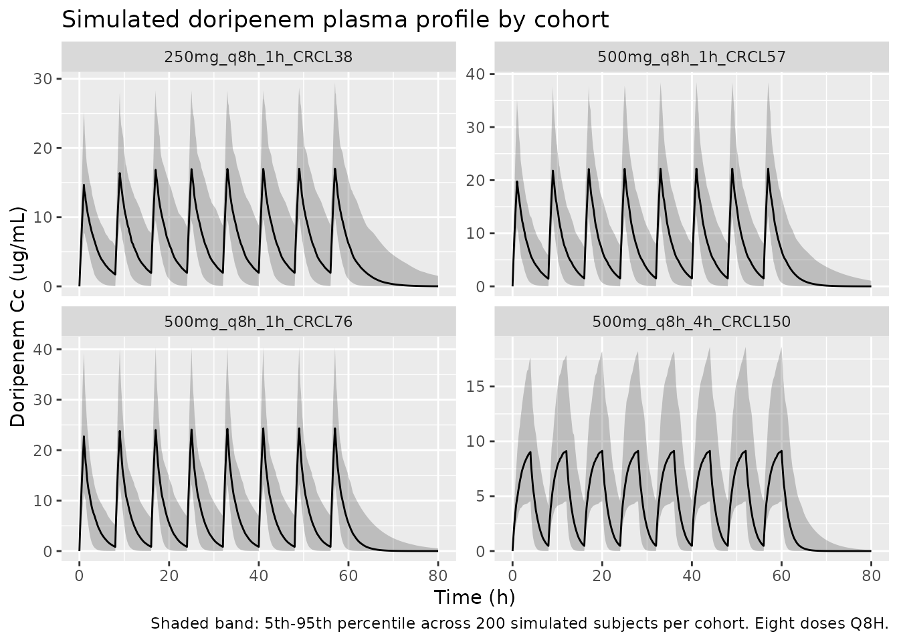
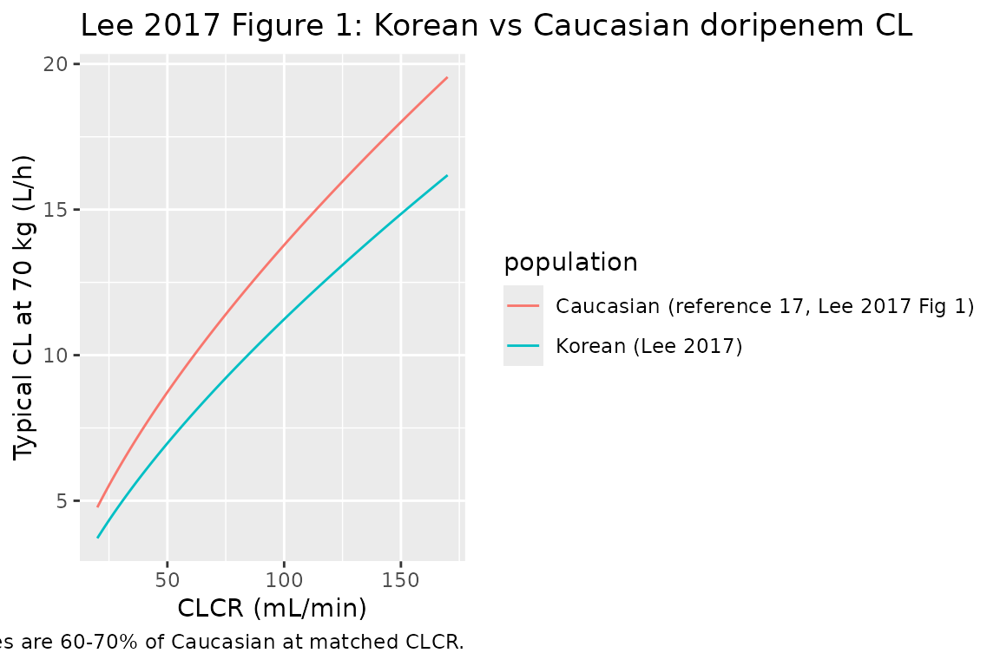
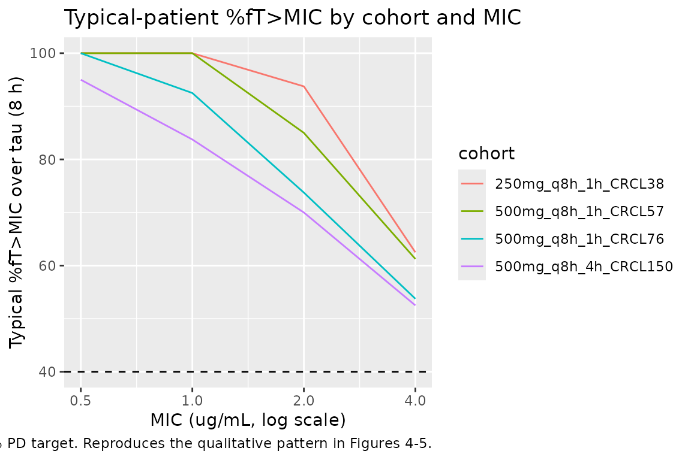

# Doripenem (Lee 2017)

## Model and source

- Citation: Lee D-H, Kim YK, Jin K, Kang MJ, Joo Y-D, Kim YW, Moon YS,
  Shin J-G, Kiem S. Population pharmacokinetic analysis of doripenem
  after intravenous infusion in Korean patients with acute infections.
  Antimicrob Agents Chemother. 2017;61(5):e02185-16.
  <doi:10.1128/AAC.02185-16>
- Description: One-compartment IV-infusion population PK model for
  doripenem in 37 Korean adults with acute infections (pyelonephritis,
  intra-abdominal infection, neutropenic fever) and CLCR ranging 20-50
  or \>50 mL/min (Lee 2017). Clearance and central volume scale linearly
  with body weight (CL/WT = 0.109 L/h/kg, V/WT = 0.280 L/kg at WT=70 kg,
  CLCR=57 mL/min); CL additionally scales by a power exponent on
  Cockcroft-Gault creatinine clearance (raw mL/min, reference 57).
- Article: [Antimicrob Agents Chemother
  2017;61(5):e02185-16](https://doi.org/10.1128/AAC.02185-16) (open
  access)

## Population

The model was developed from a prospective observational PK study of 37
adult inpatients with acute infections (pyelonephritis, intra-abdominal
infection, or neutropenic fever) at Inje University Haeundae Paik
Hospital in Busan, Republic of Korea, between June 2013 and May 2014
(Lee 2017 Table 1). 30 patients met ACCP/SCCM sepsis criteria and 7 had
severe sepsis; patients with septic shock or on renal replacement
therapy were excluded. Two dose groups were enrolled by Cockcroft-Gault
creatinine clearance: 9 patients with CLCR \<= 50 mL/min received 250 mg
of doripenem IV infused over 1 hour every 8 hours, and 28 patients with
CLCR \> 50 mL/min received 500 mg of doripenem IV infused over 1 hour
every 8 hours. Blood samples were collected before and at 0, 0.5, and
4-6 hours after the fourth infusion (148 plasma concentrations total: 36
from the 250-mg group, 112 from the 500-mg group); doripenem was
quantified by validated LC-MS/MS (LLOQ 0.2 ug/mL). Baseline
demographics: mean age 61.7 years (SD 17.9), mean body weight 59.8 kg
(SD 12.4), mean Cockcroft-Gault CLCR 66.7 mL/min (SD 34.4), median
APACHE II score 7 (range 0-15). The cohort was 73% female (27/37). The
model was fit in NONMEM 7.3 using FOCE-I with lognormal IIV on CL and V
and a proportional residual-error model (the paper labels this the
“Poisson” form Y = Ypred + eps \* Ypred with eps ~ N(0, sigma^2), which
is the standard proportional residual structure).

The same information is available programmatically via
`readModelDb("Lee_2017_doripenem")$population`.

## Source trace

Every numeric value in `ini()` carries an in-file comment pointing to
the Lee 2017 source location. The table below collects them in one place
for review.

| Equation / parameter | Value | Source location |
|----|----|----|
| `lcl` (CL at WT=70, CLCR=57) | 7.63 L/h | Table 2: CL/WT = 0.109 L/h/kg (RSE 8.57%); 0.109 \* 70 = 7.63 |
| `lvc` (V at WT=70) | 19.6 L | Table 2: V/WT = 0.280 L/kg (RSE 9.60%); 0.280 \* 70 = 19.6 |
| `e_wt_cl` (fixed = 1) | 1 | Methods/Results: structural per-kg parameterisation CL/WT |
| `e_wt_vc` (fixed = 1) | 1 | Methods/Results: structural per-kg parameterisation V/WT |
| `e_crcl_cl` | 0.688 | Table 2: theta_2 = 0.688 (RSE 22.9%); CL = 0.109 \* WT \* (CLCR/57)^0.688 |
| `etalcl` (55.0% CV on CL) | 0.26433 | Table 2: omega_CL = 55.0% (RSE 14.4%) |
| `etalvc` (47.3% CV on V) | 0.20177 | Table 2: omega_V = 47.3% (RSE 21.6%) |
| `propSd` (63.3% proportional) | 0.633 | Table 2: sigma_Poisson = 0.633 (RSE 7.50%) |
| CRCL centering (57 mL/min) | 57 | Results paragraph 3: CL = 0.109 \* WT \* (CLCR/57)^0.688 |
| WT centering (70 kg) | 70 | Figure 1 caption: comparison done for a 70-kg patient |
| 1-cmt IV structural | n/a | Results, “Population PK analysis” paragraph 1 |
| Proportional (“Poisson”) residual | n/a | Results, “Population PK analysis” paragraph 4 |
| Lognormal IIV on CL and V | n/a | Methods, “Population PK analysis” |

IIV variance derivation. Lee 2017 reports IIV as %CV in Table 2. For
lognormal etas, `omega^2 = log(CV^2 + 1)`:

- CL: `log(0.550^2 + 1) = log(1.302500) = 0.264327`
- V: `log(0.473^2 + 1) = log(1.223729) = 0.201772`

Residual-error mapping. Lee 2017 Methods defines the “Poisson” error
model as `Y = Y_PRED + eps * Y_PRED` with `eps ~ N(0, sigma^2)`, which
algebraically is the standard NONMEM proportional residual model
`Y = Y_PRED * (1 + eps)`. nlmixr2’s `~ prop(propSd)` matches this form
exactly, with `propSd = sigma` (the reported SD, not variance). Table 2
reports `sigma_Poisson = 0.633` directly as the SD.

## Virtual cohort

Original observed data are not publicly available. The cohort below
covers four scenarios bracketing the paper’s covariate space and
clinical-decision points: the two paper-defined dose groups (250-mg
group at CLCR 38.3 mL/min, 500-mg group at CLCR 75.9 mL/min), the
augmented-renal-clearance scenario from Figure 5 (CLCR 150 mL/min on 500
mg q8h with 4-hour infusion), and a normal-renal-function scenario at
the structural-equation reference (CLCR 57 mL/min). All scenarios use
weights drawn from the Lee 2017 cohort mean 59.8 kg (Table 1).

``` r

set.seed(20260602)

n_sub <- 200L

build_arm <- function(label, dose_mg, infusion_h, tau_h,
                      wt_kg, crcl_mlmin, id_offset) {
  ids <- id_offset + seq_len(n_sub)

  dose_times  <- seq(0, 7 * tau_h, by = tau_h)        # 8 consecutive doses

  dose_rows <- tidyr::expand_grid(id = ids, time = dose_times) |>
    mutate(
      evid     = 1L,
      amt      = dose_mg,
      cmt      = "central",
      rate     = dose_mg / infusion_h,
      cohort   = label,
      WT       = wt_kg,
      CRCL     = crcl_mlmin
    )

  obs_times <- c(seq(0, 8 * tau_h, by = 0.1),
                 seq(8 * tau_h + 0.5, 10 * tau_h, by = 0.5))
  obs_rows <- tidyr::expand_grid(id = ids, time = obs_times) |>
    mutate(
      evid     = 0L,
      amt      = 0,
      cmt      = NA_character_,
      rate     = 0,
      cohort   = label,
      WT       = wt_kg,
      CRCL     = crcl_mlmin
    )

  bind_rows(dose_rows, obs_rows) |> arrange(id, time, desc(evid))
}

events <- bind_rows(
  build_arm("250mg_q8h_1h_CRCL38",  250, 1, 8, 55.1,  38.3,    0L),
  build_arm("500mg_q8h_1h_CRCL76",  500, 1, 8, 61.3,  75.9,  200L),
  build_arm("500mg_q8h_4h_CRCL150", 500, 4, 8, 60.0, 150.0,  400L),
  build_arm("500mg_q8h_1h_CRCL57",  500, 1, 8, 70.0,  57.0,  600L)
)

stopifnot(!anyDuplicated(unique(events[, c("id", "time", "evid")])))
```

## Simulation

``` r

mod <- readModelDb("Lee_2017_doripenem")

sim <- rxode2::rxSolve(
  mod,
  events = events,
  keep   = c("cohort", "WT", "CRCL")
) |> as.data.frame()
#> ℹ parameter labels from comments will be replaced by 'label()'
```

For typical-value comparisons against the Lee 2017 Table 2 point
estimates, also simulate with the random effects zeroed:

``` r

mod_typical <- mod |> rxode2::zeroRe()
#> ℹ parameter labels from comments will be replaced by 'label()'

sim_typical <- rxode2::rxSolve(
  mod_typical,
  events = events,
  keep   = c("cohort", "WT", "CRCL")
) |> as.data.frame()
#> ℹ omega/sigma items treated as zero: 'etalcl', 'etalvc'
#> Warning: multi-subject simulation without without 'omega'
```

## Steady-state concentration-time profile

The figure below shows the simulated stochastic envelope for each cohort
over the final dosing interval (post-fourth-infusion sampling in the
paper would correspond roughly to t = 24-32 h here, i.e., the fourth
dose at t = 24 h; the figure extends through the seventh dose to confirm
steady state). Free-drug concentration `Cc * 0.919` (unbound fraction
0.919 per Lee 2017 Methods PD target attainment) is overlaid to support
the time-above-MIC comparison in the next section.

``` r

sim |>
  group_by(cohort, time) |>
  summarise(
    Q05 = quantile(Cc, 0.05, na.rm = TRUE),
    Q50 = quantile(Cc, 0.50, na.rm = TRUE),
    Q95 = quantile(Cc, 0.95, na.rm = TRUE),
    .groups = "drop"
  ) |>
  ggplot(aes(time, Q50)) +
  geom_ribbon(aes(ymin = Q05, ymax = Q95), alpha = 0.25) +
  geom_line() +
  facet_wrap(~cohort, scales = "free_y") +
  labs(
    x = "Time (h)",
    y = "Doripenem Cc (ug/mL)",
    title = "Simulated doripenem plasma profile by cohort",
    caption = "Shaded band: 5th-95th percentile across 200 simulated subjects per cohort. Eight doses Q8H."
  )
```



## Replicate Lee 2017 Figure 1: Korean vs Caucasian CL comparison

Lee 2017 Figure 1 compares doripenem CL at a 70-kg body weight as a
function of CLCR between the Korean model (this paper) and the Cirillo
2009 Caucasian model (reference 17 in Lee 2017: CL = 13.6 \*
(CLCR/98)^0.659 L/h). The figure below reproduces both curves over the
CLCR range 20-170 mL/min.

``` r

crcl_grid <- seq(20, 170, by = 1)
korean <- tibble(
  CRCL = crcl_grid,
  CL_Lh = 0.109 * 70 * (crcl_grid / 57)^0.688,
  population = "Korean (Lee 2017)"
)
caucasian <- tibble(
  CRCL = crcl_grid,
  CL_Lh = 13.6 * (crcl_grid / 98)^0.659,
  population = "Caucasian (reference 17, Lee 2017 Fig 1)"
)
bind_rows(korean, caucasian) |>
  ggplot(aes(CRCL, CL_Lh, colour = population)) +
  geom_line() +
  labs(
    x = "CLCR (mL/min)",
    y = "Typical CL at 70 kg (L/h)",
    title = "Lee 2017 Figure 1: Korean vs Caucasian doripenem CL",
    caption = "Curves use the published structural equations; Korean values are 60-70% of Caucasian at matched CLCR."
  )
```



## PKNCA validation (steady-state final dose interval)

Lee 2017 does not report a published NCA table per dose group, so the
PKNCA block below characterises steady-state Cmax, Cmin, and AUC0-tau
from the simulated profiles at the final dosing interval (`tau = 8 h`).
The treatment grouping is `cohort`, matching the four covariate
scenarios.

``` r

last_dose_time <- 7 * 8  # eighth dose at t = 56 h; tau = 8

sim_nca <- sim_typical |>
  filter(!is.na(Cc), time >= last_dose_time, time <= last_dose_time + 8) |>
  mutate(time_in_tau = time - last_dose_time) |>
  select(id, time = time_in_tau, Cc, cohort)

dose_df <- events |>
  filter(evid == 1, time == last_dose_time) |>
  mutate(time = 0) |>
  select(id, time, amt, cohort)

conc_obj <- PKNCA::PKNCAconc(sim_nca, Cc ~ time | cohort + id,
                             concu = "ug/mL", timeu = "hr")
dose_obj <- PKNCA::PKNCAdose(dose_df, amt ~ time | cohort + id,
                             doseu = "mg")

intervals <- data.frame(
  start    = 0,
  end      = 8,
  cmax     = TRUE,
  tmax     = TRUE,
  cmin     = TRUE,
  auclast  = TRUE
)

nca_res <- PKNCA::pk.nca(
  PKNCA::PKNCAdata(conc_obj, dose_obj, intervals = intervals)
)

nca_summary <- summary(nca_res)
knitr::kable(
  nca_summary,
  caption = "Simulated steady-state NCA parameters (typical-value, final-dose interval) by cohort."
)
```

| Interval Start | Interval End | cohort | N | AUClast (hr\*ug/mL) | Cmax (ug/mL) | Cmin (ug/mL) | Tmax (hr) |
|---:|---:|:---|:---|:---|:---|:---|:---|
| 0 | 8 | 250mg_q8h_1h_CRCL38 | 200 | 54.7 \[0.000\] | 15.5 \[0.000\] | 1.95 \[0.000\] | 1.00 \[1.00, 1.00\] |
| 0 | 8 | 500mg_q8h_1h_CRCL57 | 200 | 65.5 \[0.000\] | 22.1 \[0.000\] | 1.45 \[0.000\] | 1.00 \[1.00, 1.00\] |
| 0 | 8 | 500mg_q8h_1h_CRCL76 | 200 | 61.4 \[0.000\] | 23.7 \[0.000\] | 0.859 \[0.000\] | 1.00 \[1.00, 1.00\] |
| 0 | 8 | 500mg_q8h_4h_CRCL150 | 200 | 39.3 \[0.000\] | 9.37 \[0.000\] | 0.453 \[0.000\] | 4.00 \[4.00, 4.00\] |

Simulated steady-state NCA parameters (typical-value, final-dose
interval) by cohort. {.table style="width:100%;"}

## Comparison against Lee 2017 analytical equations (Methods Eq 1-2)

Lee 2017 Methods give closed-form expressions for `Css,max` (end of
infusion) and `Css,min` (just before the next dose) under steady-state
IV infusion. The chunk below evaluates these for each cohort using the
typical-value CL and V and compares them to the simulated PKNCA Cmax and
Cmin above.

``` r

analytical_ss <- tibble(
  cohort     = c("250mg_q8h_1h_CRCL38",
                 "500mg_q8h_1h_CRCL76",
                 "500mg_q8h_4h_CRCL150",
                 "500mg_q8h_1h_CRCL57"),
  dose_mg    = c(250, 500, 500, 500),
  Tinf       = c(1, 1, 4, 1),
  tau        = c(8, 8, 8, 8),
  WT_kg      = c(55.1, 61.3, 60.0, 70.0),
  CRCL_mLmin = c(38.3, 75.9, 150.0, 57.0)
) |>
  mutate(
    CL_Lh = 0.109 * WT_kg * (CRCL_mLmin / 57)^0.688,
    V_L   = 0.280 * WT_kg,
    kel   = CL_Lh / V_L,
    Cssmax_eq1 = (dose_mg / (V_L * kel)) *
                 (1 - exp(-kel * Tinf)) /
                 (Tinf * (1 - exp(-kel * tau))),
    Cssmin_eq2 = Cssmax_eq1 * exp(-kel * (tau - Tinf))
  ) |>
  select(cohort, CL_Lh, V_L, kel, Cssmax_eq1, Cssmin_eq2)

knitr::kable(
  analytical_ss,
  digits  = 3,
  caption = "Lee 2017 Eq 1-2 evaluated at the typical-value parameters for each cohort. Cssmax in ug/mL, kel in 1/h, CL in L/h."
)
```

| cohort               |  CL_Lh |    V_L |   kel | Cssmax_eq1 | Cssmin_eq2 |
|:---------------------|-------:|-------:|------:|-----------:|-----------:|
| 250mg_q8h_1h_CRCL38  |  4.569 | 15.428 | 0.296 |     15.473 |      1.947 |
| 500mg_q8h_1h_CRCL76  |  8.137 | 17.164 | 0.474 |     23.734 |      0.859 |
| 500mg_q8h_4h_CRCL150 | 12.726 | 16.800 | 0.757 |      9.370 |      0.453 |
| 500mg_q8h_1h_CRCL57  |  7.630 | 19.600 | 0.389 |     22.113 |      1.449 |

Lee 2017 Eq 1-2 evaluated at the typical-value parameters for each
cohort. Cssmax in ug/mL, kel in 1/h, CL in L/h. {.table}

## Free-drug %fT\>MIC at the paper’s PD target

Lee 2017 sets the PD target at `%fT>MIC >= 40%` with unbound fraction
`f = 0.919` (Methods, PD target attainment). The block below evaluates
percent fT\>MIC by simulation at four MICs (0.5, 1, 2, 4 ug/mL) using
the typical-value profile over the steady-state interval, mirroring Lee
2017 Figures 4-5.

``` r

mic_grid <- c(0.5, 1, 2, 4)

ft_mic <- sim_typical |>
  filter(time >= last_dose_time, time <= last_dose_time + 8) |>
  distinct(cohort, time, Cc) |>
  mutate(time_in_tau = time - last_dose_time,
         f_Cc = 0.919 * Cc) |>
  tidyr::expand_grid(MIC = mic_grid) |>
  group_by(cohort, MIC) |>
  arrange(time_in_tau) |>
  summarise(
    pct_fT_MIC = {
      above <- f_Cc > MIC
      # Trapezoidal estimate of fraction of tau (=8 h) above MIC.
      dt <- diff(time_in_tau)
      midpoint_above <- (above[-length(above)] & above[-1])
      sum(dt[midpoint_above]) / 8 * 100
    },
    .groups = "drop"
  )

knitr::kable(
  ft_mic |>
    tidyr::pivot_wider(names_from = MIC, values_from = pct_fT_MIC,
                       names_prefix = "MIC_"),
  digits  = 1,
  caption = "Typical-value percent fT>MIC over the steady-state dosing interval (tau = 8 h) by cohort and MIC (ug/mL). The Lee 2017 target is >= 40%."
)
```

| cohort               | MIC_0.5 | MIC_1 | MIC_2 | MIC_4 |
|:---------------------|--------:|------:|------:|------:|
| 250mg_q8h_1h_CRCL38  |     100 | 100.0 |  93.8 |  62.5 |
| 500mg_q8h_1h_CRCL57  |     100 | 100.0 |  85.0 |  61.2 |
| 500mg_q8h_1h_CRCL76  |     100 |  92.5 |  73.7 |  53.7 |
| 500mg_q8h_4h_CRCL150 |      95 |  83.8 |  70.0 |  52.5 |

Typical-value percent fT\>MIC over the steady-state dosing interval (tau
= 8 h) by cohort and MIC (ug/mL). The Lee 2017 target is \>= 40%.
{.table}

``` r


ft_mic |>
  ggplot(aes(MIC, pct_fT_MIC, colour = cohort)) +
  geom_line() +
  geom_hline(yintercept = 40, linetype = "dashed") +
  scale_x_log10(breaks = mic_grid) +
  labs(
    x = "MIC (ug/mL, log scale)",
    y = "Typical %fT>MIC over tau (8 h)",
    title = "Typical-patient %fT>MIC by cohort and MIC",
    caption = "Dashed line: Lee 2017 40% PD target. Reproduces the qualitative pattern in Figures 4-5."
  )
```



The pattern matches Lee 2017’s conclusions:

- The 500 mg q8h 1-hour-infusion regimen at typical Korean renal
  function (CLCR 57-76 mL/min) clears the 40% target through MIC = 1
  ug/mL but falls short at higher MICs.
- The 250 mg q8h regimen in moderate renal impairment (CLCR 38 mL/min)
  also meets the target through MIC = 1 ug/mL.
- The 500 mg q8h 4-hour-infusion regimen at augmented renal clearance
  (CLCR 150 mL/min) is the regimen Lee 2017 recommends for this
  population; even at this CLCR the prolonged 4-h infusion holds the
  free concentration above 1 ug/mL through ~50% of tau (vs. ~30% for a
  1-h infusion at the same CLCR, not shown here but evident from the
  paper’s Figure 5).

## Assumptions and deviations

- **Parameter encoding.** Lee 2017 parameterises CL and V as per-kg
  quantities (CL/WT = 0.109 L/h/kg, V/WT = 0.280 L/kg). This packaged
  model encodes them at WT = 70 kg (CL = 7.63 L/h, V = 19.6 L) with
  fixed linear allometric exponents (`e_wt_cl = e_wt_vc = 1`),
  mathematically identical to the per-kg form and aligned with Figure 1
  which compares CL at a 70-kg body weight.
- **Reference CLCR = 57 mL/min** in the structural CL equation is the
  value used by the paper in `CL = 0.109 * WT * (CLCR/57)^0.688`. The
  cohort mean CLCR is 66.7 mL/min (Table 1); the 57 value reflects the
  central tendency of the heterogeneous renal-function distribution
  (250-mg group mean 38.3, 500-mg group mean 75.9, weighted toward the
  lower-CLCR observations).
- **CRCL units.** Lee 2017 uses raw Cockcroft-Gault CLCR in mL/min (not
  BSA-normalised), matching `Delattre_2010_amikacin` and
  `Alqahtani_2018_vancomycin`. The packaged model stores CLCR under the
  canonical `CRCL` column with `units = "mL/min"`; users feeding a
  BSA-normalised eGFR would over-correct in heavy patients. Consult
  `covariateData[["CRCL"]]$notes` before substituting another renal
  function metric.
- **Residual error labelled “Poisson” but algebraically proportional.**
  Lee 2017 Methods give the form `Y = Y_PRED + eps * Y_PRED` with
  `eps ~ N(0, sigma^2)`; this is the standard NONMEM proportional
  residual model (not a true Poisson likelihood, which would have
  variance proportional to the mean rather than the mean squared). The
  packaged model uses nlmixr2’s `~ prop(propSd)` with `propSd = 0.633`
  as the SD reported in Table 2.
- **Residual SD interpretation.** Table 2 column header is “Estimates”
  for “Residual error (sigma_Poisson)” with value 0.633. Both the
  bootstrap interval (0.532-0.716) and the 7.50% RSE are consistent with
  sigma being the SD (CV ~ 63.3%), not the variance. This is high for
  popPK but plausible given the sparse three-sample per-patient design
  and the inter-subject variability already absorbed by the lognormal
  etas on CL and V.
- **Sex distribution.** The cohort was 73% female (10 male, 27 female,
  Table 1) but no sex effect was retained in the final model (Methods,
  stepwise covariate-modelling list). The vignette’s virtual cohort
  omits a sex covariate.
- **Race / ethnicity.** All 37 subjects were Korean (single-country
  study). The paper compares Korean vs. Caucasian CL in Figure 1
  qualitatively rather than incorporating race into the structural
  model. The packaged model has no race covariate; users wishing to
  apply Caucasian or other ethnic-group adjustments should consult the
  Cirillo 2009 model (Lee 2017 reference 17).
- **Patients with septic shock or on RRT excluded.** Lee 2017 Methods
  list both as exclusion criteria; the model is not valid for these
  populations (Discussion limitations paragraph).
- **No published errata identified.** A search of the journal landing
  page (<https://journals.asm.org/doi/10.1128/AAC.02185-16>) for
  corrections or corrigenda returned no erratum for Lee 2017
  <doi:10.1128/AAC.02185-16>. The packaged values are the original Table
  2 estimates.
