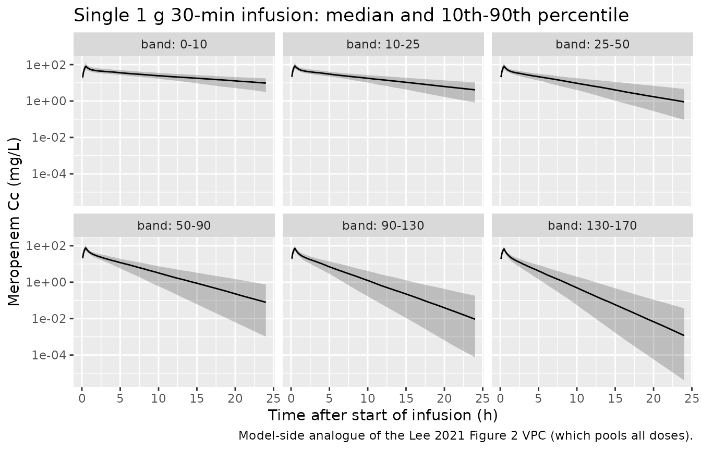
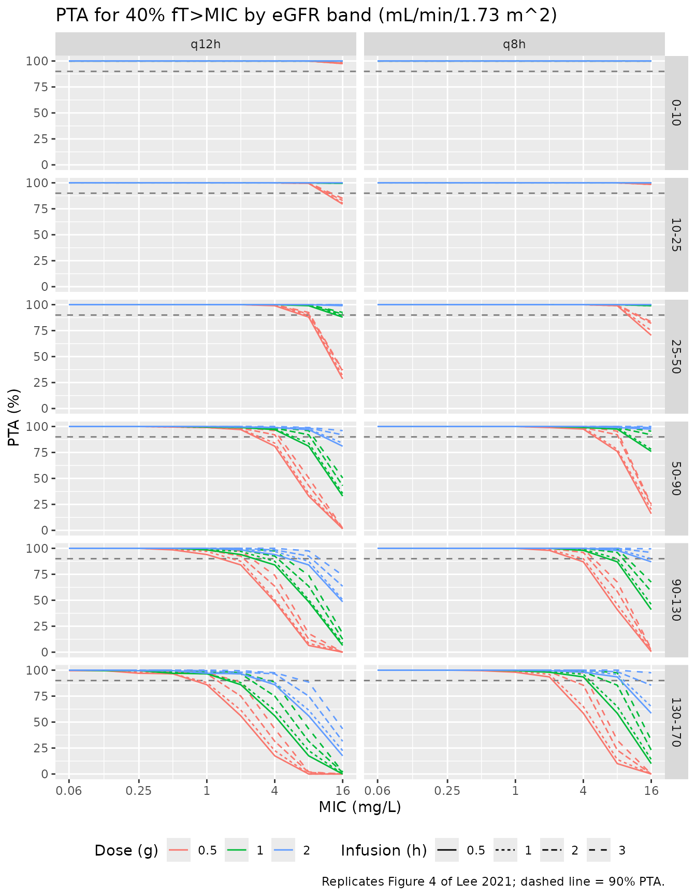
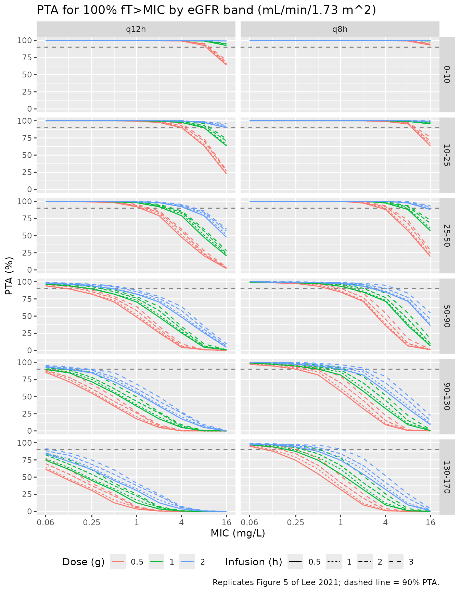
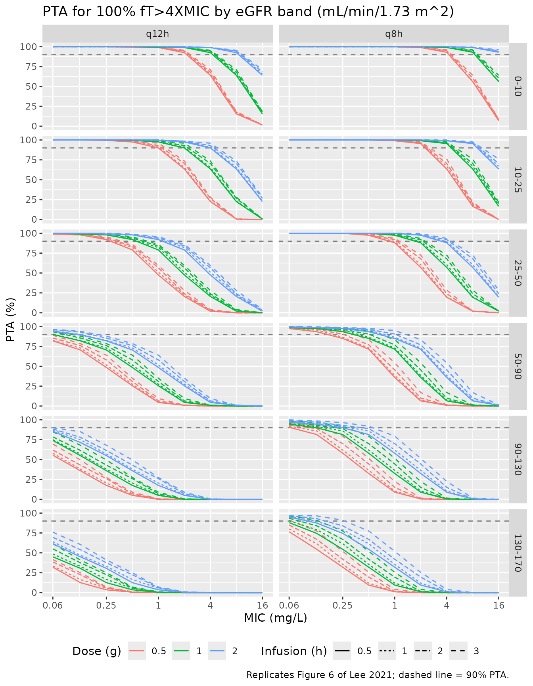

# Meropenem (Lee 2021)

## Model and source

- Citation: Lee DH, Kim HS, Park S, Kim HI, Lee SH, Kim YK. (2021).
  Population Pharmacokinetics of Meropenem in Critically Ill Korean
  Patients and Effects of Extracorporeal Membrane Oxygenation.
  Pharmaceutics 13(11):1861. <doi:10.3390/pharmaceutics13111861>.
- Description: Two-compartment intravenous population PK model for
  meropenem in critically ill Korean adults, including patients on
  extracorporeal membrane oxygenation (Lee 2021; n = 26, 8 on ECMO, 125
  plasma samples). Total clearance increases linearly with CKD-EPI
  estimated glomerular filtration rate centred at 91.57 mL/min/1.73 m^2:
  CL = 6.37 \* (1 + 0.00925 \* (CRCL - 91.57)) L/h. ECMO support was
  tested and did not affect any PK parameter. Log-normal IIV on CL, Vc
  and Vp (none on Q); residual error is a power model whose standard
  deviation is 0.246 \* Cc^0.865. The unbound concentration Cu = fu \*
  Cc (fu = 0.98) drives the fT\>MIC targets (40% fT\>MIC, 100% fT\>MIC,
  100% fT\>4MIC) of the paper’s Monte Carlo
  probability-of-target-attainment simulations.
- Article: [Pharmaceutics
  2021;13(11):1861](https://doi.org/10.3390/pharmaceutics13111861) (open
  access, PMC8625191)

Meropenem is a carbapenem beta-lactam whose efficacy is driven by the
fraction of the dosing interval during which the free concentration
exceeds the MIC (%*f*T\>MIC). Lee and colleagues fitted a population PK
model to critically ill Korean adults, eight of whom were on
extracorporeal membrane oxygenation (ECMO), asked whether ECMO changes
meropenem PK (it did not), and then used Monte Carlo simulation to find
dosing regimens that reach a 90% probability of target attainment (PTA)
across six bands of renal function.

## Population

Twenty-six ICU patients were enrolled at Hallym University Sacred Heart
Hospital, Anyang, South Korea, between September 2020 and April 2021
(Table 1). Eight received ECMO (seven veno-arterial, one veno-venous)
and 18 did not. The ECMO group was younger (median age 64.0 vs 72.0
years) and sicker (APACHE II 21.0 vs 16.0; SOFA 9.50 vs 5.00). Overall 8
of 26 patients were female (4 of 8 on ECMO, 4 of 18 without). Median
weight was 63.5 kg on ECMO and 54.4 kg without. Renal function spanned
impaired to supranormal: the CKD-EPI eGFR, the covariate retained in the
final model, had a median (IQR) of 87.7 (70.0-105) mL/min/1.73 m^2 on
ECMO and 91.6 (45.6-103) mL/min/1.73 m^2 without.

Patients received 500 or 1000 mg meropenem as a 30-min IV infusion every
8 or 12 h. Five samples were drawn after the first dose following
enrolment and two at steady state. The 125 samples used for estimation
were fitted in NONMEM 7.5 with FOCE-I, and 44 further trough and peak
samples were used for external validation.

The same information is available programmatically via the model’s
`population` metadata
(`readModelDb("Lee_2021_meropenem")()$population`).

## Source trace

The per-parameter origin is recorded as an in-file comment next to each
`ini()` entry in `inst/modeldb/specificDrugs/Lee_2021_meropenem.R`. The
table below collects them in one place for review.

| Equation / parameter | Value as published | Value in `ini()` | Source location |
|----|----|----|----|
| `lcl` | theta1 = 6.37 L/h (RSE 7.41%; bootstrap 6.32, 95% CI 5.42-7.23) | `log(6.37)` | Table 2, structural model |
| `e_crcl_cl` | theta2 = 0.00925 (RSE 10.3%; bootstrap 0.00932, 95% CI 0.00680-0.0110) | `0.00925` | Table 2, structural model |
| CL covariate form | `CL = theta1 * (1 + theta2 * (CE - 91.57))`, CE = CKD-EPI eGFR | `exp(lcl + etalcl) * (1 + e_crcl_cl * (CRCL - 91.57))` | Table 2, structural-model row |
| `lvc` | VC = 9.07 L (RSE 12.2%) | `log(9.07)` | Table 2 |
| `lq` | Q = 10.7 L/h (RSE 21.5%) | `log(10.7)` | Table 2 |
| `lvp` | VP = 7.91 L (RSE 13.6%) | `log(7.91)` | Table 2 |
| `etalcl` | IIV CL = 31.4% (RSE 15.8%, shrinkage 3.70%) | `0.0940330` = `log(1 + 0.314^2)` | Table 2 |
| `etalvc` | IIV VC = 43.6% (RSE 22.5%, shrinkage 14.7%) | `0.1740340` = `log(1 + 0.436^2)` | Table 2 |
| `etalvp` | IIV VP = 36.6% (RSE 21.0%, shrinkage 41.3%) | `0.1257124` = `log(1 + 0.366^2)` | Table 2 |
| `propSd` | proportional error 24.6% (RSE 29.3%, shrinkage 24.2%) | `0.246` | Table 2 |
| `powExp` | power parameter 0.865 (RSE 10.0%) | `0.865` | Table 2; Methods 2.5 |
| `fu` | “The parameter f was fixed at 98%” | `fixed(0.98)` | Methods 2.7 |
| `d/dt(central)`, `d/dt(peripheral1)` | two-compartment model with CL, VC, VP, Q | n/a | Results 3.2 |
| `Cc ~ pow(propSd, powExp)` | proportional error with a power parameter for heteroscedasticity | n/a | Methods 2.5; Results 3.2 |
| `Cu <- fu * Cc` | %*f*T\>MIC computed on free drug | n/a | Methods 2.7 |

Results 3.2 states that IIV was estimated for CL, V1 and V2 only, so `q`
carries no random effect, and no covariance between the random effects
is reported.

## Simulation setup

``` r

mod <- readModelDb("Lee_2021_meropenem")
ini_df <- rxode2::rxode(mod)$iniDf
#> ℹ parameter labels from comments will be replaced by 'label()'
theta <- setNames(ini_df$est, ini_df$name)
omega_sd <- sqrt(theta[c("etalcl", "etalvc", "etalvp")])
omega_sd
#>    etalcl    etalvc    etalvp 
#> 0.3066480 0.4171738 0.3545594
```

The random effects are drawn with base R
([`stats::rnorm`](https://rdrr.io/r/stats/Normal.html)) and passed to
`rxSolve()` as per-subject columns of the event data with `omega = NA`.
That fixes the virtual patients independently of the rxode2 build, and
it lets every regimen below be solved on the *same* patients, so regimen
comparisons are paired.

``` r

draw_cohort <- function(n, crcl, seed) {
  set.seed(seed)
  tibble::tibble(
    id     = seq_len(n),
    CRCL   = crcl,
    etalcl = stats::rnorm(n, 0, omega_sd[["etalcl"]]),
    etalvc = stats::rnorm(n, 0, omega_sd[["etalvc"]]),
    etalvp = stats::rnorm(n, 0, omega_sd[["etalvp"]])
  )
}

# Solve one event template for every subject in `cohort`. The etas travel as
# columns of the event data; with omega = NA the solve is deterministic. (Passing
# them through `params =` together with `omega = NA` silently zeroes them, which
# the clearance guard below would catch.)
solve_cohort <- function(cohort, ev_template) {
  ev <- cohort |>
    dplyr::select(id, CRCL, etalcl, etalvc, etalvp) |>
    tidyr::crossing(ev_template) |>
    dplyr::arrange(id, time, dplyr::desc(evid))
  s <- rxode2::rxSolve(mod, events = ev, omega = NA, sigma = NA, keep = "CRCL") |>
    as.data.frame()
  # rxSolve omits the id column for a single-subject solve.
  if (!"id" %in% names(s)) s$id <- cohort$id[1]
  if (dplyr::n_distinct(s$id) != nrow(cohort)) stop("rxSolve dropped subjects")
  # Every patient's clearance must equal the closed form built from its own eta.
  chk <- dplyr::distinct(s, id, cl) |> dplyr::left_join(cohort, by = "id")
  cl_expected <- 6.37 * exp(chk$etalcl) * (1 + 0.00925 * (chk$CRCL - 91.57))
  if (any(abs(chk$cl / cl_expected - 1) > 1e-8)) stop("random effects were not applied")
  if (!all(is.finite(s$Cc))) stop("non-finite concentrations")
  s
}
```

### Typical-value check of the covariate model

The Discussion gives the model-predicted typical values as CL = 6.37 L/h
and Vss = VC + VP = 17.0 L. At the centring eGFR of 91.57 mL/min/1.73
m^2 the covariate term is exactly 1. The linear eGFR term also fixes CL
at the edges of the simulated renal-function range.

``` r

typ_cl <- function(crcl) 6.37 * (1 + 0.00925 * (crcl - 91.57))

one_dose <- tibble::tibble(
  time = c(0, 1), amt = c(1000, NA), dur = c(0.5, NA),
  evid = c(1L, 0L), cmt = "central"
)
typ <- solve_cohort(
  tibble::tibble(id = 1:4, CRCL = c(5, 50, 91.57, 170),
                 etalcl = 0, etalvc = 0, etalvp = 0),
  one_dose
) |>
  dplyr::distinct(id, CRCL, cl, vc, vp, q)
#> ℹ parameter labels from comments will be replaced by 'label()'

typ |>
  dplyr::mutate(`CL expected (L/h)` = typ_cl(CRCL), `Vss (L)` = vc + vp) |>
  dplyr::rename(`eGFR (mL/min/1.73 m^2)` = CRCL, `CL model (L/h)` = cl) |>
  dplyr::select(-id, -vc, -vp, -q) |>
  knitr::kable(digits = 3, caption = "Typical-value clearance across renal function.")
```

| eGFR (mL/min/1.73 m^2) | CL model (L/h) | CL expected (L/h) | Vss (L) |
|-----------------------:|---------------:|------------------:|--------:|
|                   5.00 |          1.269 |             1.269 |   16.98 |
|                  50.00 |          3.921 |             3.921 |   16.98 |
|                  91.57 |          6.370 |             6.370 |   16.98 |
|                 170.00 |         10.991 |            10.991 |   16.98 |

Typical-value clearance across renal function. {.table}

``` r


stopifnot(
  all(abs(typ$cl - typ_cl(typ$CRCL)) < 1e-8),
  abs(typ$cl[typ$CRCL == 91.57] - 6.37) < 1e-8,
  abs(typ$vc[1] + typ$vp[1] - 17.0) < 0.05
)
```

## Concentration-time profiles

The first simulated dose, 1 g as a 30-min infusion, is shown for the six
renal function bands the paper used for its dose-finding simulations
(Methods 2.7). Each band has 200 patients with eGFR drawn uniformly
within the band, matching the paper’s uniform covariate distribution.
The plotted quantity is the individual prediction `Cc`, without residual
error.

``` r

renal_bands <- tibble::tibble(
  band = factor(c("0-10", "10-25", "25-50", "50-90", "90-130", "130-170"),
                levels = c("0-10", "10-25", "25-50", "50-90", "90-130", "130-170")),
  lo   = c(0, 10, 25, 50, 90, 130),
  hi   = c(10, 25, 50, 90, 130, 170)
)
n_per_band <- 200L

cohort <- do.call(dplyr::bind_rows, lapply(seq_len(nrow(renal_bands)), function(i) {
  set.seed(2021 + i)
  crcl <- stats::runif(n_per_band, renal_bands$lo[i], renal_bands$hi[i])
  draw_cohort(n_per_band, crcl, seed = 1861 + i) |>
    dplyr::mutate(band = renal_bands$band[i])
})) |>
  dplyr::mutate(id = dplyr::row_number())

cohort |>
  dplyr::group_by(band) |>
  dplyr::summarise(n = dplyr::n(), `median eGFR` = stats::median(CRCL),
                   `SD etalcl` = stats::sd(etalcl), .groups = "drop") |>
  knitr::kable(digits = 3, caption = "Virtual cohort by renal-function band (eGFR in mL/min/1.73 m^2).")
```

| band    |   n | median eGFR | SD etalcl |
|:--------|----:|------------:|----------:|
| 0-10    | 200 |       5.592 |     0.317 |
| 10-25   | 200 |      17.041 |     0.308 |
| 25-50   | 200 |      37.124 |     0.307 |
| 50-90   | 200 |      71.535 |     0.289 |
| 90-130  | 200 |     107.208 |     0.305 |
| 130-170 | 200 |     150.898 |     0.286 |

Virtual cohort by renal-function band (eGFR in mL/min/1.73 m^2).
{.table}

``` r

sd_times <- sort(unique(c(seq(0, 1, by = 0.1), seq(1.25, 24, by = 0.25))))
single_ev <- dplyr::bind_rows(
  tibble::tibble(time = 0, amt = 1000, dur = 0.5, evid = 1L, cmt = "central"),
  tibble::tibble(time = sd_times, amt = NA_real_, dur = NA_real_, evid = 0L, cmt = "central")
)
sim_sd <- solve_cohort(cohort, single_ev) |>
  dplyr::left_join(dplyr::select(cohort, id, band), by = "id")
```

``` r

sim_sd |>
  dplyr::filter(time > 0) |>
  dplyr::group_by(band, time) |>
  dplyr::summarise(Q10 = stats::quantile(Cc, 0.10), Q50 = stats::median(Cc),
                   Q90 = stats::quantile(Cc, 0.90), .groups = "drop") |>
  ggplot2::ggplot(ggplot2::aes(time, Q50)) +
  ggplot2::geom_ribbon(ggplot2::aes(ymin = Q10, ymax = Q90), alpha = 0.25) +
  ggplot2::geom_line() +
  ggplot2::facet_wrap(~band, labeller = ggplot2::label_both) +
  ggplot2::scale_y_log10() +
  ggplot2::labs(x = "Time after start of infusion (h)",
                y = "Meropenem Cc (mg/L)",
                title = "Single 1 g 30-min infusion: median and 10th-90th percentile",
                caption = "Model-side analogue of the Lee 2021 Figure 2 VPC (which pools all doses).")
```



## PKNCA validation

The paper reports no NCA table, so the NCA here checks the model against
its own exact identities. For a linear model with IV input,
`AUCinf = Dose / CL`, so the NCA clearance per subject must equal the
model clearance, and the NCA Vss must equal `vc + vp`.

``` r

# A sparse, clinically realistic grid keeps the NCA fast; the dense grid above
# is for the figure only.
nca_times <- c(0, 0.5, 1, 1.5, 2, 3, 4, 6, 8, 10, 12, 16, 20, 24)
sim_nca <- solve_cohort(cohort, dplyr::bind_rows(
  tibble::tibble(time = 0, amt = 1000, dur = 0.5, evid = 1L, cmt = "central"),
  tibble::tibble(time = nca_times, amt = NA_real_, dur = NA_real_, evid = 0L, cmt = "central")
)) |>
  dplyr::left_join(dplyr::select(cohort, id, band), by = "id")

nca_conc <- sim_nca |>
  dplyr::filter(!is.na(Cc)) |>
  dplyr::mutate(treatment = factor(paste("eGFR", band),
                                   levels = paste("eGFR", levels(band)))) |>
  dplyr::select(id, time, Cc, treatment)

# An IV pre-dose concentration is zero; guarantee a time-zero record.
nca_conc <- dplyr::bind_rows(
  nca_conc,
  nca_conc |> dplyr::distinct(id, treatment) |> dplyr::mutate(time = 0, Cc = 0)
) |>
  dplyr::distinct(id, treatment, time, .keep_all = TRUE) |>
  dplyr::arrange(id, treatment, time)

nca_dose <- nca_conc |>
  dplyr::distinct(id, treatment) |>
  dplyr::mutate(time = 0, amt = 1000, dur = 0.5)

intervals <- data.frame(
  start = 0, end = Inf,
  cmax = TRUE, tmax = TRUE, auclast = TRUE, aucinf.obs = TRUE,
  half.life = TRUE, cl.obs = TRUE, vss.iv.obs = TRUE
)
# One pk.nca() call per band: a single call over all 1,200 subjects is far
# slower than six calls of 200.
nca_res <- do.call(dplyr::bind_rows, lapply(unique(nca_conc$treatment), function(trt) {
  res <- PKNCA::pk.nca(PKNCA::PKNCAdata(
    PKNCA::PKNCAconc(dplyr::filter(nca_conc, treatment == trt), Cc ~ time | treatment + id,
                     concu = "mg/L", timeu = "h"),
    PKNCA::PKNCAdose(dplyr::filter(nca_dose, treatment == trt), amt ~ time | treatment + id,
                     doseu = "mg", route = "intravascular", duration = "dur"),
    intervals = intervals
  ))
  as.data.frame(res)
}))

nca_wide <- nca_res |>
  dplyr::filter(PPTESTCD %in% c("cmax", "aucinf.obs", "half.life", "cl.obs", "vss.iv.obs")) |>
  dplyr::select(id, treatment, PPTESTCD, PPORRES) |>
  tidyr::pivot_wider(names_from = PPTESTCD, values_from = PPORRES)

nca_wide |>
  dplyr::group_by(treatment) |>
  dplyr::summarise(dplyr::across(c(cmax, aucinf.obs, half.life, cl.obs, vss.iv.obs),
                                 stats::median), .groups = "drop") |>
  dplyr::rename(`Renal band` = treatment, `Cmax (mg/L)` = cmax,
                `AUC0-inf (mg*h/L)` = aucinf.obs, `t1/2 (h)` = half.life,
                `CL (L/h)` = cl.obs, `Vss (L)` = vss.iv.obs) |>
  knitr::kable(digits = 2, caption = "Median NCA parameters after a single 1 g 30-min infusion, by eGFR band.")
```

| Renal band   | Cmax (mg/L) | AUC0-inf (mg\*h/L) | t1/2 (h) | CL (L/h) | Vss (L) |
|:-------------|------------:|-------------------:|---------:|---------:|--------:|
| eGFR 0-10    |       81.56 |             758.94 |    10.06 |     1.32 |   18.22 |
| eGFR 10-25   |       85.12 |             512.31 |     6.47 |     1.95 |   17.78 |
| eGFR 25-50   |       81.39 |             321.63 |     4.23 |     3.11 |   18.14 |
| eGFR 50-90   |       76.80 |             184.25 |     2.60 |     5.43 |   17.74 |
| eGFR 90-130  |       72.99 |             135.90 |     1.97 |     7.36 |   18.30 |
| eGFR 130-170 |       67.83 |              97.97 |     1.58 |    10.21 |   19.48 |

Median NCA parameters after a single 1 g 30-min infusion, by eGFR band.
{.table}

``` r

ident <- nca_wide |>
  dplyr::left_join(dplyr::distinct(sim_nca, id, cl, vc, vp), by = "id") |>
  dplyr::mutate(cl_ratio = cl.obs / cl, vss_ratio = vss.iv.obs / (vc + vp))

ident |>
  dplyr::group_by(treatment) |>
  dplyr::summarise(`median NCA CL / model CL` = stats::median(cl_ratio),
                   `median NCA Vss / model Vss` = stats::median(vss_ratio),
                   .groups = "drop") |>
  dplyr::rename(`Renal band` = treatment) |>
  knitr::kable(digits = 4, caption = "NCA recovers the model clearance and steady-state volume.")
```

| Renal band   | median NCA CL / model CL | median NCA Vss / model Vss |
|:-------------|-------------------------:|---------------------------:|
| eGFR 0-10    |                   1.0010 |                     1.0008 |
| eGFR 10-25   |                   1.0013 |                     1.0026 |
| eGFR 25-50   |                   1.0022 |                     1.0065 |
| eGFR 50-90   |                   1.0058 |                     1.0191 |
| eGFR 90-130  |                   1.0087 |                     1.0307 |
| eGFR 130-170 |                   1.0141 |                     1.0504 |

NCA recovers the model clearance and steady-state volume. {.table}

``` r


# Both sides use the same drawn parameters; the residual is the trapezoid and
# the log-linear extrapolation beyond 24 h, which is largest in the lowest band.
stopifnot(
  abs(stats::median(ident$cl_ratio) - 1) < 0.02,
  abs(stats::median(ident$vss_ratio) - 1) < 0.05
)
```

### Comparison against the published typical values

The only cohort-level PK summaries in the paper are the Discussion’s
typical values (CL 6.37 L/h, Vss 17.0 L). They are compared below with
the PKNCA estimates for a single typical patient at the centring eGFR of
91.57 mL/min/1.73 m^2.

``` r

typ_ev <- tibble::tibble(
  time = c(0, sd_times[sd_times > 0], 36, 48), amt = c(1000, rep(NA, sum(sd_times > 0) + 2)),
  dur = c(0.5, rep(NA, sum(sd_times > 0) + 2)),
  evid = c(1L, rep(0L, sum(sd_times > 0) + 2)), cmt = "central"
)
typ_sim <- solve_cohort(
  tibble::tibble(id = 1L, CRCL = 91.57, etalcl = 0, etalvc = 0, etalvp = 0),
  typ_ev
) |>
  dplyr::mutate(treatment = "Typical patient, eGFR 91.57")

typ_conc <- dplyr::bind_rows(
  dplyr::select(typ_sim, id, time, Cc, treatment),
  tibble::tibble(id = 1L, time = 0, Cc = 0, treatment = "Typical patient, eGFR 91.57")
) |>
  dplyr::distinct(id, treatment, time, .keep_all = TRUE) |>
  dplyr::arrange(time)

typ_nca <- PKNCA::pk.nca(PKNCA::PKNCAdata(
  PKNCA::PKNCAconc(typ_conc, Cc ~ time | treatment + id, concu = "mg/L", timeu = "h"),
  PKNCA::PKNCAdose(
    tibble::tibble(id = 1L, time = 0, amt = 1000, dur = 0.5,
                   treatment = "Typical patient, eGFR 91.57"),
    amt ~ time | treatment + id, doseu = "mg", route = "intravascular", duration = "dur"
  ),
  intervals = data.frame(start = 0, end = Inf, aucinf.obs = TRUE, cl.obs = TRUE,
                         vss.iv.obs = TRUE)
))

published <- tibble::tibble(
  treatment = "Typical patient, eGFR 91.57",
  aucinf.obs = 1000 / 6.37, cl.obs = 6.37, vss.iv.obs = 17.0
)

cmp <- nlmixr2lib::ncaComparisonTable(
  simulated = typ_nca,
  reference = published,
  by = "treatment",
  units = c(aucinf.obs = "mg*h/L", cl.obs = "L/h", vss.iv.obs = "L"),
  tolerance_pct = 20
)
knitr::kable(cmp, caption = paste(
  "Simulated typical patient vs. the Lee 2021 Discussion typical values",
  "(AUC0-inf reference = 1000 mg / 6.37 L/h). * differs from reference by >20%."
))
```

| NCA parameter | treatment | Reference | Simulated | % diff |
|:---|:---|:---|:---|:---|
| AUC0-∞ (obs) (mg\*h/L) | Typical patient, eGFR 91.57 | 157 | 157 | +0.0% |
| CL/F (L/h) | Typical patient, eGFR 91.57 | 6.37 | 6.37 | -0.0% |
| Vss (IV) (L) | Typical patient, eGFR 91.57 | 17 | 17 | -0.1% |

Simulated typical patient vs. the Lee 2021 Discussion typical values
(AUC0-inf reference = 1000 mg / 6.37 L/h). \* differs from reference by
\>20%. {.table}

``` r


typ_wide <- as.data.frame(typ_nca) |>
  dplyr::select(PPTESTCD, PPORRES) |>
  tidyr::pivot_wider(names_from = PPTESTCD, values_from = PPORRES)
stopifnot(
  abs(typ_wide$cl.obs / 6.37 - 1) < 0.01,
  abs(typ_wide$vss.iv.obs / 17.0 - 1) < 0.02
)
```

Table 3 of the paper also gives the medians (IQR) of the individual
(empirical-Bayes) estimates by group: CL 6.34 L/h on ECMO and 5.05 L/h
without, and Vss 16.2 L and 17.2 L. The model’s typical CL at each
group’s median eGFR from Table 1 is 6.14 L/h (ECMO, 87.7) and 6.37 L/h
(non-ECMO, 91.6). The ECMO value agrees. The non-ECMO median of the
individual estimates is about 20% lower. The individual CL values are
not published, so this gap cannot be traced further; the typical value
is what the paper’s own simulations used.

## Probability of target attainment

Methods 2.7 describes the dose-finding simulations. Virtual patients
were given uniformly distributed eGFR between 0 and 170 mL/min/1.73 m^2
and split into six renal bands. Each received every combination of three
doses (0.5, 1 and 2 g), two dosing intervals (8 and 12 h) and four
infusion durations (0.5, 1, 2 and 3 h) at steady state. The PTA was
computed for three targets on the free concentration (`fu` = 0.98): 40%
*f*T\>MIC (Figure 4), 100% *f*T\>MIC (Figure 5) and 100% *f*T\>4XMIC
(Figure 6). A regimen is adequate when the PTA is at least 90%.

Steady state is solved directly with `ss = 1`. Because the model is
linear, a 0.5 g or 2 g profile is exactly 0.5 or 2 times the 1 g profile
of the same patient. So only the eight interval-by-infusion shapes need
solving, each at 1 g, over the cohort of 1,200 patients (200 per band).

``` r

shapes <- tidyr::expand_grid(tau = c(8, 12), dur = c(0.5, 1, 2, 3))
dt <- 0.05

ss_profiles <- do.call(dplyr::bind_rows, lapply(seq_len(nrow(shapes)), function(i) {
  tau <- shapes$tau[i]; dur <- shapes$dur[i]
  ev <- dplyr::bind_rows(
    tibble::tibble(time = 0, amt = 1000, dur = dur, ii = tau, ss = 1L,
                   evid = 1L, cmt = "central"),
    tibble::tibble(time = seq(0, tau - dt, by = dt), amt = NA_real_,
                   dur = NA_real_, ii = NA_real_, ss = NA_integer_,
                   evid = 0L, cmt = "central")
  )
  solve_cohort(cohort, ev) |>
    dplyr::select(id, time, Cu, cl) |>
    dplyr::mutate(tau = tau, dur = dur)
}))
```

Two structural gates come before any PTA is read. First, the
steady-state interval must satisfy `AUCtau = Dose / CL` for every
patient; both sides use the same drawn parameters, so the tolerance is
tight. Second, `ss = 1` must agree with an explicit 20-dose train at the
slowest clearance simulated, where steady state takes longest to reach.

``` r

auc_gate <- ss_profiles |>
  dplyr::group_by(id, tau, dur) |>
  dplyr::summarise(auc = sum(Cu) * dt / 0.98, cl = cl[1], .groups = "drop") |>
  dplyr::mutate(ratio = auc / (1000 / cl))
stopifnot(all(abs(auc_gate$ratio - 1) < 0.01))

slow <- tibble::tibble(id = 1L, CRCL = 0, etalcl = 0, etalvc = 0, etalvp = 0)
tr_ev <- dplyr::bind_rows(
  tibble::tibble(time = seq(0, 19 * 12, by = 12), amt = 1000, dur = 0.5, evid = 1L, cmt = "central"),
  tibble::tibble(time = 19 * 12 + c(0, 0.5, 6), amt = NA_real_, dur = NA_real_,
                 evid = 0L, cmt = "central")
)
tr <- solve_cohort(slow, tr_ev) |> dplyr::filter(time >= 19 * 12)
ss_ev <- dplyr::bind_rows(
  tibble::tibble(time = 0, amt = 1000, dur = 0.5, ii = 12, ss = 1L, evid = 1L, cmt = "central"),
  tibble::tibble(time = c(0, 0.5, 6), amt = NA_real_, dur = NA_real_, ii = NA_real_,
                 ss = NA_integer_, evid = 0L, cmt = "central")
)
ss1 <- solve_cohort(slow, ss_ev)
stopifnot(all(abs(tr$Cc / ss1$Cc - 1) < 1e-3))
```

``` r

mics <- c(0.06, 0.125, 0.25, 0.5, 1, 2, 4, 8, 16)
targets <- tibble::tibble(
  target = c("40% fT>MIC", "100% fT>MIC", "100% fT>4XMIC"),
  mult   = c(1, 1, 4),
  frac   = c(0.40, 1, 1)
)

# Every (dose, MIC, target) reduces to one threshold on the 1 g profile:
# dose_g * Cu > mult * MIC  <=>  Cu > mult * MIC / dose_g.
thr_grid <- tidyr::expand_grid(dose_g = c(0.5, 1, 2), MIC = mics, targets) |>
  dplyr::mutate(eff = mult * MIC / dose_g)

# Per patient and shape, %fT>threshold is 1 - ECDF(threshold) over the
# equally spaced steady-state grid; findInterval() gives all thresholds at once.
prof_keys <- dplyr::distinct(ss_profiles, id, tau, dur)
prof_split <- split(ss_profiles$Cu, list(ss_profiles$id, ss_profiles$tau, ss_profiles$dur),
                    drop = TRUE)
prof_split <- prof_split[paste(prof_keys$id, prof_keys$tau, prof_keys$dur, sep = ".")]
ft_mat <- vapply(prof_split, function(cu) {
  1 - findInterval(thr_grid$eff, sort(cu)) / length(cu)
}, numeric(nrow(thr_grid)))

ft <- prof_keys[rep(seq_len(nrow(prof_keys)), each = nrow(thr_grid)), ] |>
  dplyr::bind_cols(thr_grid[rep(seq_len(nrow(thr_grid)), times = nrow(prof_keys)), ]) |>
  dplyr::mutate(ft = as.vector(ft_mat))

pta <- ft |>
  dplyr::left_join(dplyr::select(cohort, id, band), by = "id") |>
  dplyr::group_by(band, tau, dur, dose_g, MIC, target) |>
  dplyr::summarise(PTA = 100 * mean(ft >= frac - 1e-9), .groups = "drop") |>
  dplyr::mutate(regimen = sprintf("%g g q%gh, %g-h", dose_g, tau, dur))
```

``` r

plot_pta <- function(tgt, fig) {
  pta |>
    dplyr::filter(target == tgt) |>
    dplyr::mutate(interval = paste0("q", tau, "h")) |>
    ggplot2::ggplot(ggplot2::aes(MIC, PTA, colour = factor(dose_g),
                                 linetype = factor(dur))) +
    ggplot2::geom_hline(yintercept = 90, colour = "grey50", linetype = "dashed") +
    ggplot2::geom_line() +
    ggplot2::facet_grid(band ~ interval) +
    ggplot2::scale_x_log10(breaks = c(0.06, 0.25, 1, 4, 16),
                           labels = c("0.06", "0.25", "1", "4", "16")) +
    ggplot2::labs(x = "MIC (mg/L)", y = "PTA (%)", colour = "Dose (g)",
                  linetype = "Infusion (h)",
                  title = paste("PTA for", tgt, "by eGFR band (mL/min/1.73 m^2)"),
                  caption = paste("Replicates Figure", fig, "of Lee 2021; dashed line = 90% PTA.")) +
    ggplot2::theme(legend.position = "bottom")
}
```

### Figure 4 – 40% *f*T\>MIC

``` r

plot_pta("40% fT>MIC", 4)
```



### Figure 5 – 100% *f*T\>MIC

``` r

plot_pta("100% fT>MIC", 5)
```



### Figure 6 – 100% *f*T\>4XMIC

``` r

plot_pta("100% fT>4XMIC", 6)
```



### The published dose-finding claims

Results 3.4 makes twelve specific statements about Figures 4-6. Each is
stated below as the highest MIC at which the regimen reaches 90% PTA
(the “PTA breakpoint”), compared with the simulated breakpoint on the
same two-fold MIC grid. The claim is reproduced when the simulated
breakpoint satisfies the published relation.

A PTA breakpoint is a tail quantity: it is set by the 10% of patients
with the fastest elimination. With 200 patients per band, a PTA near 90%
carries a Monte Carlo standard error of about 2 percentage points, so a
regimen that sits on the boundary can move one MIC dilution. The
assertion therefore requires every claim to hold within one dilution.
Exact agreement is reported per claim.

``` r

bp <- function(tgt, band_lbl, dose, tau, dur) {
  x <- pta[pta$target == tgt & pta$band == band_lbl & pta$dose_g == dose &
             pta$tau == tau & pta$dur == dur, ]
  ok <- x$MIC[x$PTA >= 90]
  if (length(ok) == 0) 0 else max(ok)
}

claims <- tibble::tribble(
  ~figure, ~target,         ~band,     ~dose, ~tau, ~dur, ~rel, ~mic, ~text,
  4, "40% fT>MIC",    "25-50",   1,     12,   0.5,  ">=", 4,    "1 g q12h 30-min attains 90% PTA at MIC 4",
  4, "40% fT>MIC",    "25-50",   0.5,   12,   0.5,  ">=", 4,    "0.5 g q12h also appropriate (MIC 4)",
  4, "40% fT>MIC",    "90-130",  1,     12,   2,    ">=", 4,    "1 g q12h 2-h infusion optimum at MIC 4",
  4, "40% fT>MIC",    "90-130",  1,     12,   0.5,  "<",  4,    "1 g q12h 30-min does not reach MIC 4",
  4, "40% fT>MIC",    "90-130",  1,     12,   1,    "<",  4,    "1 g q12h 1-h does not reach MIC 4",
  5, "100% fT>MIC",   "50-90",   1,     8,    0.5,  "==", 1,    "1 g q8h 30-min: 90% PTA at MIC 1",
  5, "100% fT>MIC",   "50-90",   1,     8,    3,    "==", 2,    "1 g q8h 3-h: 90% PTA at MIC 2",
  5, "100% fT>MIC",   "130-170", 1,     8,    3,    "==", 0.25, "1 g q8h 3-h: only MIC <= 0.25",
  5, "100% fT>MIC",   "130-170", 2,     8,    3,    "==", 0.5,  "2 g q8h 3-h: MIC < 1",
  6, "100% fT>4XMIC", "50-90",   1,     8,    0.5,  "==", 0.25, "1 g q8h 30-min: MIC <= 0.25",
  6, "100% fT>4XMIC", "50-90",   2,     8,    3,    "==", 1,    "2 g q8h 3-h: MIC <= 1",
  6, "100% fT>4XMIC", "130-170", 2,     8,    3,    "==", 0.125, "2 g q8h 3-h: MIC < 0.25"
)

claims$sim_bp <- vapply(seq_len(nrow(claims)), function(i) {
  with(claims[i, ], bp(target, band, dose, tau, dur))
}, numeric(1))

# log2 distance from the published relation (0 when it holds exactly).
claims <- claims |>
  dplyr::mutate(
    l2 = log2(pmax(sim_bp, 0.03) / mic),
    exact = dplyr::case_when(
      rel == ">=" ~ sim_bp >= mic,
      rel == "<"  ~ sim_bp < mic,
      TRUE        ~ sim_bp == mic
    ),
    miss_dil = dplyr::case_when(
      rel == ">=" ~ pmax(0, -l2),
      rel == "<"  ~ pmax(0, l2 + 1),
      TRUE        ~ abs(l2)
    )
  )

claims |>
  dplyr::transmute(Figure = figure, Target = target, `eGFR band` = band,
                   Claim = text,
                   `Published breakpoint` = paste(rel, mic),
                   `Simulated breakpoint (mg/L)` = sim_bp,
                   `Exact` = exact,
                   `Dilutions off` = round(miss_dil, 2)) |>
  knitr::kable(caption = "Lee 2021 Results 3.4 dose-finding claims vs. simulation.")
```

| Figure | Target | eGFR band | Claim | Published breakpoint | Simulated breakpoint (mg/L) | Exact | Dilutions off |
|---:|:---|:---|:---|:---|---:|:---|---:|
| 4 | 40% fT\>MIC | 25-50 | 1 g q12h 30-min attains 90% PTA at MIC 4 | \>= 4 | 8.00 | TRUE | 0 |
| 4 | 40% fT\>MIC | 25-50 | 0.5 g q12h also appropriate (MIC 4) | \>= 4 | 4.00 | TRUE | 0 |
| 4 | 40% fT\>MIC | 90-130 | 1 g q12h 2-h infusion optimum at MIC 4 | \>= 4 | 4.00 | TRUE | 0 |
| 4 | 40% fT\>MIC | 90-130 | 1 g q12h 30-min does not reach MIC 4 | \< 4 | 2.00 | TRUE | 0 |
| 4 | 40% fT\>MIC | 90-130 | 1 g q12h 1-h does not reach MIC 4 | \< 4 | 2.00 | TRUE | 0 |
| 5 | 100% fT\>MIC | 50-90 | 1 g q8h 30-min: 90% PTA at MIC 1 | == 1 | 1.00 | TRUE | 0 |
| 5 | 100% fT\>MIC | 50-90 | 1 g q8h 3-h: 90% PTA at MIC 2 | == 2 | 2.00 | TRUE | 0 |
| 5 | 100% fT\>MIC | 130-170 | 1 g q8h 3-h: only MIC \<= 0.25 | == 0.25 | 0.50 | FALSE | 1 |
| 5 | 100% fT\>MIC | 130-170 | 2 g q8h 3-h: MIC \< 1 | == 0.5 | 1.00 | FALSE | 1 |
| 6 | 100% fT\>4XMIC | 50-90 | 1 g q8h 30-min: MIC \<= 0.25 | == 0.25 | 0.25 | TRUE | 0 |
| 6 | 100% fT\>4XMIC | 50-90 | 2 g q8h 3-h: MIC \<= 1 | == 1 | 1.00 | TRUE | 0 |
| 6 | 100% fT\>4XMIC | 130-170 | 2 g q8h 3-h: MIC \< 0.25 | == 0.125 | 0.25 | FALSE | 1 |

Lee 2021 Results 3.4 dose-finding claims vs. simulation. {.table}

``` r


stopifnot(all(claims$miss_dil <= 1 + 1e-9))
```

9 of the 12 claims reproduce exactly, and all 12 hold within one MIC
dilution.

#### The augmented-renal-clearance claims are one knife-edge inequality

The claims that miss by a dilution are all in the 130-170 mL/min/1.73
m^2 band on the q8h 3-h infusion: 1 g for 100% *f*T\>MIC at MIC 0.5, 2 g
for 100% *f*T\>MIC at MIC 1, and 2 g for 100% *f*T\>4XMIC at MIC 0.25.
Because the model is linear, all three are the *same* inequality: the
steady-state free trough of the 1 g profile must exceed 0.5 mg/L. The
paper places all three just below 90% PTA. The simulation places them at
the value below, from the same 200 patients.

``` r

arc_pta <- ft |>
  dplyr::left_join(dplyr::select(cohort, id, band), by = "id") |>
  dplyr::filter(band == "130-170", tau == 8, dur == 3) |>
  dplyr::semi_join(
    tibble::tribble(
      ~dose_g, ~MIC, ~target,
      1,       0.5,  "100% fT>MIC",
      2,       1,    "100% fT>MIC",
      2,       0.25, "100% fT>4XMIC"
    ),
    by = c("dose_g", "MIC", "target")
  ) |>
  dplyr::group_by(dose_g, MIC, target) |>
  dplyr::summarise(PTA = 100 * mean(ft >= frac - 1e-9), .groups = "drop")

arc_pta |>
  dplyr::rename(`Dose (g)` = dose_g, `MIC (mg/L)` = MIC, Target = target,
                `Simulated PTA (%)` = PTA) |>
  knitr::kable(caption = "eGFR 130-170, q8h 3-h infusion: three claims, one threshold (0.5 mg/L per g).")
```

| Dose (g) | MIC (mg/L) | Target         | Simulated PTA (%) |
|---------:|-----------:|:---------------|------------------:|
|        1 |       0.50 | 100% fT\>MIC   |                91 |
|        2 |       0.25 | 100% fT\>4XMIC |                91 |
|        2 |       1.00 | 100% fT\>MIC   |                91 |

eGFR 130-170, q8h 3-h infusion: three claims, one threshold (0.5 mg/L
per g). {.table}

``` r


# All three rows are one inequality on the same patients, so they must agree.
stopifnot(nrow(arc_pta) == 3L, dplyr::n_distinct(arc_pta$PTA) == 1L)
```

A PTA this close to 90% is below the resolution of either simulation.
The binomial standard error at 90% is about 2.1 points with 200 patients
per band, and about 2.3 points for the paper’s roughly 170 patients per
band (1,000 patients over six bands). The disagreement is therefore
within Monte Carlo error. It does not point to a difference in the
model.

## Assumptions and deviations

- **Interindividual-variability scale.** Table 2 reports the IIV
  magnitudes as bare percentages (31.4%, 43.6%, 36.6%) under an
  exponential random-effect model (`theta_i = theta * exp(eta_i)`). It
  does not say whether each is `sqrt(omega^2) * 100` or the log-normal
  `sqrt(exp(omega^2) - 1) * 100`. The package convention
  `omega^2 = log(CV^2 + 1)` is used. The two readings differ by under 4%
  on the standard deviation (0.3067 vs 0.314 for the CL eta).
- **Power residual-error model.** Table 2 lists “Proportional error
  24.6%” and “Power parameter 0.865”. Methods 2.5 says the power
  parameter was added to “allow for nonlinear heteroscedastic
  variances”. This is encoded as `Cc ~ pow(propSd, powExp)`, i.e. SD =
  0.246 \* Cc^0.865. The paper prints no control stream, so the exact
  NONMEM `$ERROR` coding is not confirmed.
- **Which CKD-EPI eGFR.** The paper screened both the BSA-normalized
  CKD-EPI eGFR (mL/min/1.73 m^2) and a “modified” BSA-de-normalized form
  (mL/min). The covariate is taken to be the BSA-normalized form
  (`CRCL`). The 91.57 centring value lies between that form’s group
  medians (87.7 and 91.6; Table 1) but above both medians of the
  modified form (82.4 and 77.7), and the PTA figures label their eGFR
  bands in mL/min/1.73 m^2.
- **Renal-band edges.** Methods 2.7 defines the bands as 0-10, 10-25,
  25-50, 50-90, 90-130 and 130-170. Results 3.4 describes some of them
  as 26-50 and 50-90 mL/min/1.73 m^2. The Methods edges are used.
- **First simulation not reproduced.** Figure 3 (the empirical-therapy
  simulation with a CLCR-adjusted label regimen, the EUCAST *P.
  aeruginosa* MIC distribution and a log-normal eGFR “within the range
  of 0 to 130”) is not replicated. The mean and SD of that eGFR
  distribution and the MIC-distribution frequencies are not given in the
  paper.
- **Cohort size and PTA resolution.** 200 patients per renal band, the
  nlmixr2lib vignette cap, against the paper’s 1,000 overall. The claim
  check therefore allows one MIC dilution per claim (see above). No
  parameter was adjusted to match any claim.
- **Individual-estimate medians (Table 3).** The non-ECMO median of the
  individual CL estimates (5.05 L/h) is about 20% below the typical CL
  at that group’s median eGFR. The paper does not publish the individual
  estimates or the per-patient eGFR, so this cannot be traced. The model
  reproduces the Discussion’s typical CL (6.37 L/h) and Vss (17.0 L)
  exactly.
- **Typographical inconsistencies in the source.** Results 3.2 prints
  the two-compartment base-model OFV as 6540.693; it is evidently
  640.693, since the one- and three-compartment values are 689.840 and
  640.694. Results 3.1 says one of the eight ECMO patients received
  CRRT, but Table 1 lists 3 of 8. Results 3.1 gives ages in “days”;
  Table 1 gives years. Table 1 prints cystatin C in mg/dL at values
  (medians 1.34-1.48) typical of mg/L. None of these affects the model.
- **ECMO.** ECMO status, ECMO type and ECMO flow rate were screened and
  not retained, so the model has no ECMO covariate. It applies equally
  to patients with and without ECMO, as the paper concludes.
- **Residual error in simulations.** The PTA and NCA simulations use the
  individual predictions without residual error, matching the paper’s
  Monte Carlo design (individual PK parameters only).
