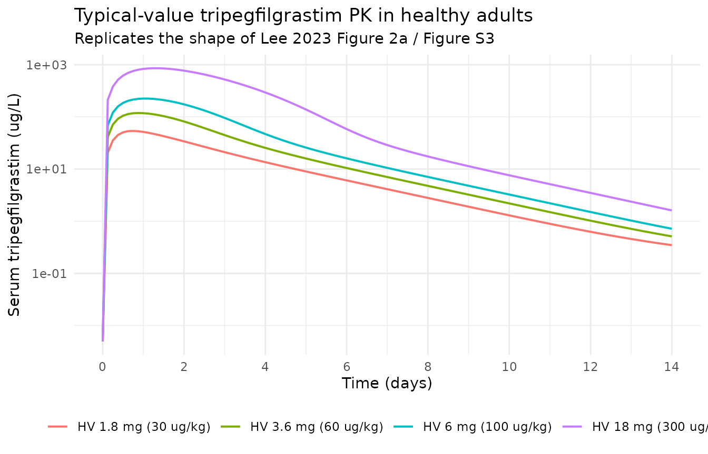
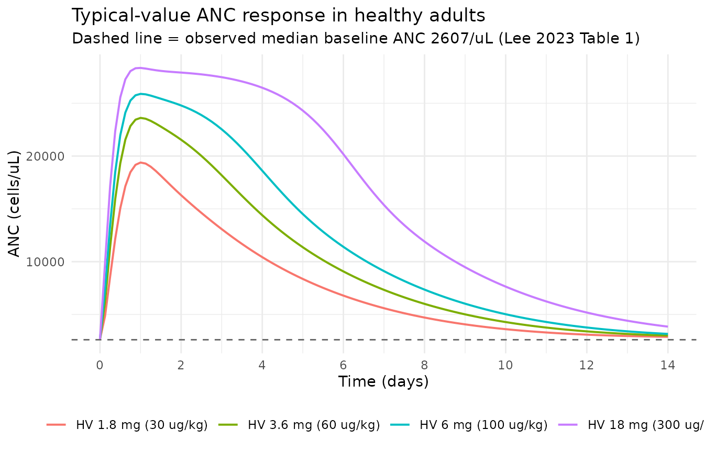
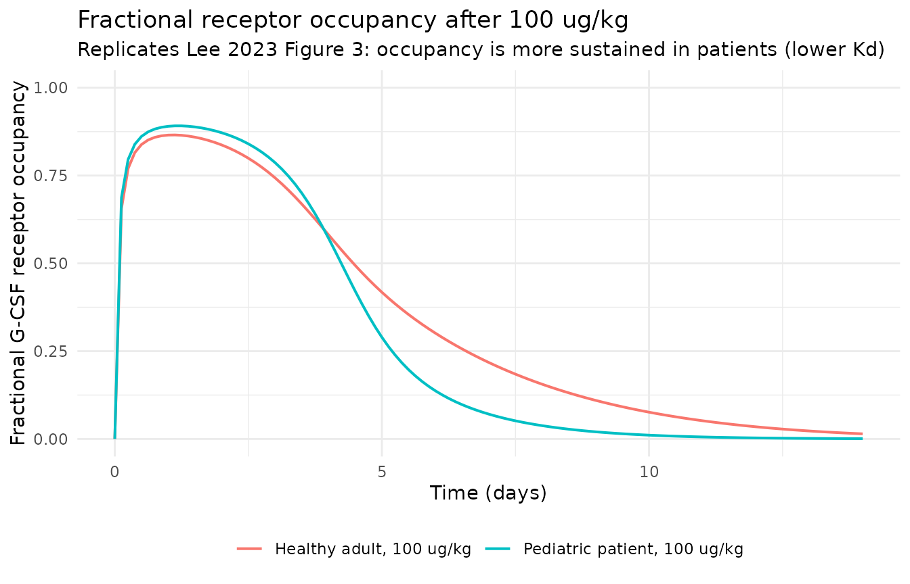
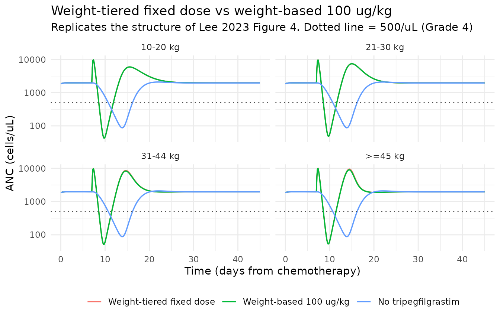
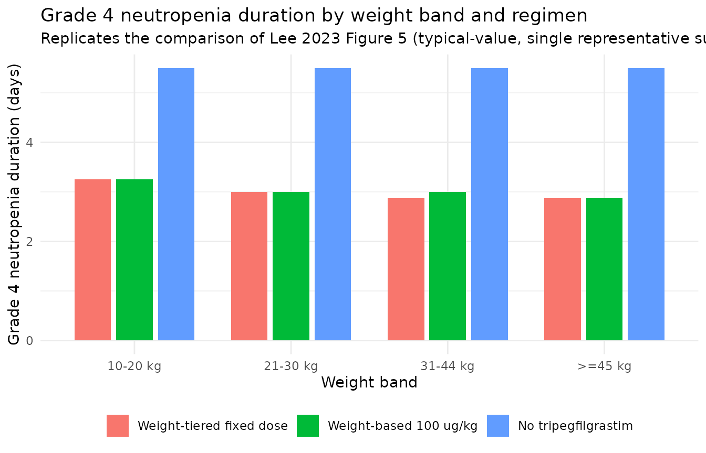

# Tripegfilgrastim (Lee 2023)

## Model and source

``` r

mod <- rxode2::rxode(readModelDb("Lee_2023_tripegfilgrastim"))
#> ℹ parameter labels from comments will be replaced by 'label()'
```

- Citation: Lee S, Hong KT, Jang I-J, Yu K-S, Kang HJ, Oh J. (2023).
  Semimechanistic pharmacokinetic-pharmacodynamic model of
  tripegfilgrastim for pediatric patients after chemotherapy. CPT
  Pharmacometrics Syst Pharmacol 12(9):1319-1334.
  <doi:10.1002/psp4.13012>.
- Article: <https://doi.org/10.1002/psp4.13012>
- Description: Semi-mechanistic population PK/PD model for
  tripegfilgrastim (a PEGylated long-acting recombinant human G-CSF) and
  absolute neutrophil count (ANC) in healthy Korean adults and Korean
  pediatric patients with solid tumors receiving chemotherapy.
  Subcutaneous drug enters a depot compartment and is absorbed at
  first-order rate KSC into a total-drug compartment.
  Pharmacodynamics-mediated drug disposition (PDMDD) uses a
  quasi-equilibrium quadratic between total drug and the circulating
  G-CSF-receptor pool, giving free drug (FDC) and bound complex (RDC).
  Free drug is cleared linearly (CLD/VD) and bound drug is internalised
  (KINT). Granulopoiesis is a five-state receptor chain (stem -\>
  mitotic -\> post-mitotic I -\> post-mitotic II -\> circulating blood
  receptors) with baselines KP/KTR and KP/KC; ANC = 1000 \* RB / SR.
  Drug binding stimulates receptor production (ST1 = 1 + STM1*driver)
  and bone-marrow transit (ST2 = 1 + STM2*driver), where the driver is
  the fraction of receptors bound by exogenous drug plus endogenous
  G-CSF. Endogenous G-CSF is carried as its own turnover compartment
  (fixed KIN, KEL, GCSF0 from Quartino 2014) and a negative-feedback
  term FB = (RB0/RB)^GAM modulates receptor production. Chemotherapy is
  a KPD virtual compartment with lag LAG; its output (KCHM\*CHM) scaled
  by CHMSL adds to the mitotic-cell elimination rate. Study population
  (DIS_HEALTHY) shifts VD and KD, age scales KSC (exponent -0.97,
  reference 18.5 y), body weight scales KINT (exponent 1.7, reference
  55.1 kg), and baseline ANC scales KP (exponential, reference 2106
  cells/uL).

Tripegfilgrastim is a PEGylated long-acting recombinant human G-CSF in
which a 23 kDa methoxy-polyethylene-glycol N-hydroxy-succinimide moiety
is conjugated at one of three positions (Lys35, Met N-terminal, Lys17).
Lee 2023 fits a single joint PK-PD model to pooled data from a healthy
adult study (NCT00959777) and a pediatric solid-tumor study
(NCT02963389). The structural framework – quasi-equilibrium
pharmacodynamics-mediated drug disposition (PDMDD) coupled to a
five-state granulopoiesis receptor chain, plus a kinetic-PD (KPD)
chemotherapy compartment – is inherited from Melhem 2018, which is also
in this library as `Melhem_2018_g_csf`.

## Population

``` r

str(mod$population, vec.len = 2)
#> List of 11
#>  $ species       : chr "human"
#>  $ n_subjects    : int 67
#>  $ n_studies     : int 2
#>  $ age_range     : chr "6-38 years overall; healthy adults 24 (20-38) years, pediatric patients 12 (6-17) years (median (min-max), Table 1)"
#>  $ weight_range  : chr "18-75 kg overall; healthy adults 69.7 (60-75) kg, pediatric patients 43 (18-67) kg (median (min-max), Table 1)"
#>  $ sex_female_pct: num 11.9
#>  $ race_ethnicity: chr "Korean"
#>  $ disease_state : chr "Two pooled populations: (i) 40 healthy Korean adult male volunteers receiving single subcutaneous tripegfilgras"| __truncated__
#>  $ dose_range    : chr "Healthy adults: single SC tripegfilgrastim 1.8, 3.6, 6 and 18 mg (equivalent to 30, 60, 100 and 300 ug/kg), plu"| __truncated__
#>  $ regions       : chr "Republic of Korea (Seoul National University Hospital)"
#>  $ notes         : chr "Trial registrations NCT00959777 (healthy adults, Ahn 2013) and NCT02963389 (pediatric patients, Lee 2022). 876 "| __truncated__
```

Lee 2023 Table 1 reports the demographics reproduced below. Note that
the two cohorts are completely separated on age and on chemotherapy
exposure: every healthy participant is an adult male aged 20-38, and
every patient is a pediatric solid-tumor patient aged 6-17 who received
chemotherapy. The `DIS_HEALTHY` covariate therefore carries a confounded
contrast (see Assumptions and deviations).

``` r

tibble::tibble(
  Characteristic = c("n", "Male, n (%)", "Age, y", "Weight, kg",
                     "Height, cm", "BMI, kg/m^2", "BSA, m^2",
                     "Baseline ANC, /uL"),
  `Healthy adults` = c("40", "40 (100)", "24 (20-38)", "69.7 (60-75)",
                       "176 (164-184)", "22.33 (19.37-25.05)",
                       "1.84 (1.67-1.94)", "2607 (1430-5602)"),
  `Pediatric patients` = c("27", "19 (70.4)", "12 (6-17)", "43 (18-67)",
                           "155 (113-178)", "17.94 (13.15-29.76)",
                           "1.39 (0.76-1.79)", "1274 (408-4611)"),
  `Total` = c("67", "59 (88.1)", "22 (6-38)", "64.4 (18-75)",
              "173 (113-184)", "21.12 (13.15-29.76)",
              "1.76 (0.76-1.94)", "2411 (408-5602)")
) |>
  knitr::kable(caption = "Lee 2023 Table 1. Median (min-max) unless noted.")
```

| Characteristic | Healthy adults | Pediatric patients | Total |
|:---|:---|:---|:---|
| n | 40 | 27 | 67 |
| Male, n (%) | 40 (100) | 19 (70.4) | 59 (88.1) |
| Age, y | 24 (20-38) | 12 (6-17) | 22 (6-38) |
| Weight, kg | 69.7 (60-75) | 43 (18-67) | 64.4 (18-75) |
| Height, cm | 176 (164-184) | 155 (113-178) | 173 (113-184) |
| BMI, kg/m^2 | 22.33 (19.37-25.05) | 17.94 (13.15-29.76) | 21.12 (13.15-29.76) |
| BSA, m^2 | 1.84 (1.67-1.94) | 1.39 (0.76-1.79) | 1.76 (0.76-1.94) |
| Baseline ANC, /uL | 2607 (1430-5602) | 1274 (408-4611) | 2411 (408-5602) |

Lee 2023 Table 1. Median (min-max) unless noted. {.table}

## Source trace

Per-parameter provenance is recorded as an in-file comment next to each
`ini()` entry in
`inst/modeldb/specificDrugs/Lee_2023_tripegfilgrastim.R`. The table
below gathers the key entries in one place for review. “Appendix S1”
refers to the Monolix (MLXTRAN) model code supplied as Supporting
Information Text S1.

| Equation / parameter | Value | Source location |
|----|----|----|
| `Fsc` (SC bioavailability) | 1 (Fixed) | Table 2; Results (“bioavailability … was fixed to 1”) |
| `Ksc` (SC absorption rate) | 0.027 /h | Table 2 (RSE 6.1%) |
| beta_Ksc (AGE / 18.5 y) | -0.97 | Table 2 (RSE 13.4%); Equation 7 |
| `Vd/F` healthy adults | 4.7 L | Table 2 (RSE 9.2%); Equation 4 |
| `Vd/F` pediatric patients | 12.7 L | Table 2 (RSE 9.2%); Equation 4 |
| `CL/F` (linear apparent clearance) | 0.18 L/h | Table 2 (RSE 10.8%) |
| `Kd` healthy adults | 42.2 ug/L | Table 2 (RSE 26.7%); Equation 5 |
| `Kd` pediatric patients | 16.2 ug/L | Table 2 (RSE 26.7%); Equation 5 |
| `Kint` (internalisation rate) | 0.41 /h | Table 2 (RSE 15%) |
| beta_Kint (WT / 55.1 kg) | 1.7 | Table 2 (RSE 20.5%); Equation 6 |
| `Kp` (receptor production rate) | 0.083 ug/L/h | Table 2 (RSE 14.4%) |
| beta_Kp (NEUT / 2106 cells/uL) | 0.56 | Table 2 (RSE 13.1%); Equation 8 |
| `Ktr` (bone-marrow transit rate) | 0.033 /h (Fixed) | Table 2; Methods (5-day maturation, refs 13, 28) |
| `Kc` (blood neutrophil elimination) | 0.1155 /h (Fixed) | Appendix S1 code comment; Methods reports 0.116; Table 2 rounds to 0.12 |
| `Scale` / SR (receptor-to-ANC scaling) | 0.54 g per 10^9 cells | Table 2 (RSE 8.5%) |
| `STM1` (receptor-production stimulation) | 14.4 | Table 2 (RSE 13.5%) |
| `STM2` (transit-rate stimulation) | 13.8 | Table 2 (RSE 7.4%) |
| `Gamma` (ANC feedback exponent) | 0.145 (Fixed) | Results (ref 32); Table 2 rounds to 0.15 |
| `GCSF0` (endogenous G-CSF baseline) | 0.0243 ug/L (Fixed) | Results (ref 27 Quartino 2014); Table 2 rounds to 0.024 |
| `Kel` (endogenous G-CSF elimination) | 0.592 /h (Fixed) | Results (ref 27); Table 2 rounds to 0.59 |
| `Kin` (endogenous G-CSF production) | 0.498 ug/L/h (Fixed) | Results (ref 27); Table 2 rounds to 0.5 |
| `Lag` (chemotherapy effect lag) | 171 h | Table 2 (RSE 12.4%) |
| `Kchemo` (chemotherapy KPD decay) | 0.072 /h (Fixed) | Table 2; fixed to Melhem 2018 (ref 23), which reports 0.0724 |
| `CHMslope` (chemo -\> mitotic loss slope) | 668 /mg (Fixed) | Table 2; fixed to Melhem 2018 (ref 23), which also reports 668 |
| Omega Ksc / Vd/F / CL/F / Kp | 0.39 / 0.39 / 0.5 / 0.17 | Table 2 Random effects (log-scale SDs) |
| Omega Kd / STM1 / STM2 / Kint | 1.3 / 0.67 / 0.11 / 0.56 | Table 2 Random effects |
| Omega Lag / Kchemo / CHMslope | 0.57 / 0.26 (Fixed) / 2.3 (Fixed) | Table 2 Random effects; Results (Kchemo, CHMslope IIV fixed) |
| `a1` (PK additive residual) | 0.005 ug/L | Table 2 (RSE 27%) |
| `b1` (PK proportional residual) | 0.37 | Table 2 (RSE 3.8%) |
| `a2` (ANC residual, log domain) | 0.48 | Table 2 (RSE 3.1%) |
| Free-drug quadratic FDC | `0.5*(q + sqrt(q^2 + 4 Kd TDC))` | Appendix S1 EQUATION block |
| Endogenous free G-CSF FEC | same quadratic applied to TEC | Appendix S1 EQUATION block |
| ST1 / ST2 stimulation | `1 + STM_i * ((RDC + REC) / TRC)` | Appendix S1 EQUATION block; Results (linear relationship) |
| Chemotherapy mitotic loss | `STM = CHMSL * KCHM * CHM` | Appendix S1 EQUATION block |
| ANC negative feedback | `FB = (RB0 / RB)^GAM` | Appendix S1 EQUATION block |
| Granulopoiesis ODE cascade | dSM, dMT, dPM1, dPM2, dRB | Appendix S1 EQUATION block; Figure 1 |
| Initial conditions | SM = MT = PM1 = PM2 = KP/KTR; RB = KP/KC | Appendix S1 EQUATION block |
| Serum concentration observation | `CONC = FDC + FEC` | Appendix S1 OUTPUT block |
| ANC observation | `ANC = 1000 * RB / SR` | Appendix S1 OUTPUT block |

## Covariate-effect verification

The strongest quantitative check available for this model is that the
encoded covariate relationships reproduce, to the digit, the numeric
covariate claims Lee 2023 makes in its Results and Discussion. Each row
below is computed from the model file’s own `ini()` values.

``` r

th <- mod$theta

ksc_rel <- function(age) (age / 18) ^ th[["e_age_ksc"]]
kp_at   <- function(neut) exp(th[["lkp"]]) * exp(th[["e_neut_kp"]] * neut / 2106)

covariate_check <- tibble::tibble(
  `Paper claim` = c(
    "Ksc ~9-fold higher at age 2 vs age 18",
    "Ksc ~3-fold higher at age 6 vs age 18",
    "Ksc ~40% lower at age 30 vs age 18",
    "Doubling body weight -> ~3-fold higher Kint",
    "Vd/F 4.7 L (healthy) vs 12.7 L (patients)",
    "Kd 62% lower in pediatric patients",
    "Kp = 0.095 ug/L/h at baseline ANC 500/uL",
    "Kp = 0.12 ug/L/h at baseline ANC 1500/uL",
    "Kp doubles from ANC 1500/uL to 4000/uL"
  ),
  `Model value` = c(
    sprintf("%.2f-fold", ksc_rel(2)),
    sprintf("%.2f-fold", ksc_rel(6)),
    sprintf("%.1f%% lower", 100 * (1 - ksc_rel(30))),
    sprintf("%.2f-fold", 2 ^ th[["e_wt_kint"]]),
    sprintf("%.1f L vs %.1f L",
            exp(th[["lvd"]] + th[["e_hv_vd"]]), exp(th[["lvd"]])),
    sprintf("%.0f%% lower",
            100 * (1 - exp(th[["lkd"]]) / exp(th[["lkd"]] + th[["e_hv_kd"]]))),
    sprintf("%.3f ug/L/h", kp_at(500)),
    sprintf("%.3f ug/L/h", kp_at(1500)),
    sprintf("%.2f-fold", kp_at(4000) / kp_at(1500))
  ),
  `Source` = c(
    "Results, 'Population PK-PD model'", "Results, 'Population PK-PD model'",
    "Results, 'Population PK-PD model'", "Discussion (Equation 6)",
    "Results / Table 2 (Equation 4)", "Abstract / Discussion (Equation 5)",
    "Results ('under severe neutropenia states')",
    "Discussion ('when the baseline ANC is 1500/uL')",
    "Discussion ('with a baseline ANC of 4000/uL, the Kp value doubled')"
  )
)
knitr::kable(covariate_check,
             caption = "Encoded covariate relationships vs the numeric claims in Lee 2023.")
```

| Paper claim | Model value | Source |
|:---|:---|:---|
| Ksc ~9-fold higher at age 2 vs age 18 | 8.43-fold | Results, ‘Population PK-PD model’ |
| Ksc ~3-fold higher at age 6 vs age 18 | 2.90-fold | Results, ‘Population PK-PD model’ |
| Ksc ~40% lower at age 30 vs age 18 | 39.1% lower | Results, ‘Population PK-PD model’ |
| Doubling body weight -\> ~3-fold higher Kint | 3.25-fold | Discussion (Equation 6) |
| Vd/F 4.7 L (healthy) vs 12.7 L (patients) | 4.7 L vs 12.7 L | Results / Table 2 (Equation 4) |
| Kd 62% lower in pediatric patients | 62% lower | Abstract / Discussion (Equation 5) |
| Kp = 0.095 ug/L/h at baseline ANC 500/uL | 0.095 ug/L/h | Results (‘under severe neutropenia states’) |
| Kp = 0.12 ug/L/h at baseline ANC 1500/uL | 0.124 ug/L/h | Discussion (‘when the baseline ANC is 1500/uL’) |
| Kp doubles from ANC 1500/uL to 4000/uL | 1.94-fold | Discussion (‘with a baseline ANC of 4000/uL, the Kp value doubled’) |

Encoded covariate relationships vs the numeric claims in Lee 2023.
{.table}

## Virtual cohort

Two families of scenarios are simulated.

**Healthy adults (no chemotherapy).** The four single subcutaneous dose
levels of the healthy adult study: 1.8, 3.6, 6 and 18 mg, which the
paper states are equivalent to 30, 60, 100 and 300 ug/kg. Covariates are
set to the healthy-adult medians of Table 1 (69.7 kg, 24 years, baseline
ANC 2607/uL, `DIS_HEALTHY = 1`).

**Pediatric patients on chemotherapy.** The weight-tiered fixed-dose
proposal of Figure 4 / Figure 5 – 1.5, 2.5, 4 and 6 mg for the 10-20,
21-30, 31-44 and \>=45 kg bands – each compared against weight-based 100
ug/kg dosing and against no tripegfilgrastim at all. Covariates use a
representative weight and age for each band with baseline ANC set to the
pediatric median of 1274/uL and `DIS_HEALTHY = 0`.

Cohorts are 100 subjects per arm for the stochastic PK cohort and
typical-value (zero-IIV) single profiles for the trajectory figures,
well inside the 200-per-arm cap.

``` r

set.seed(20260730)

# Chemotherapy KPD input. Lee 2023 does not report the mass entered into the
# virtual chemotherapy compartment (16 regimens were pooled), nor the timing of
# that record relative to the tripegfilgrastim dose. See Assumptions and
# deviations for the justification of these two choices.
CHEMO_MG        <- 500
CHEMO_TIME_H    <- 0
DRUG_TIME_CHEMO <- 168   # 24 h after the end of a ~6-day chemotherapy course

make_arm <- function(arm, WT, AGE, NEUT, DIS_HEALTHY,
                     drug_ug, drug_time_h, chemo_mg, obs_grid_h,
                     id_offset = 0L, n = 1L) {
  base_cov <- tibble::tibble(
    id          = id_offset + seq_len(n),
    WT          = WT,
    AGE         = AGE,
    NEUT        = NEUT,
    DIS_HEALTHY = DIS_HEALTHY,
    arm         = arm
  )

  rows <- list()

  if (drug_ug > 0) {
    rows$drug <- base_cov |>
      dplyr::mutate(time = drug_time_h, amt = drug_ug, cmt = "depot",
                    evid = 1L, dvid = NA_integer_)
  }
  if (chemo_mg > 0) {
    rows$chemo <- base_cov |>
      dplyr::mutate(time = CHEMO_TIME_H, amt = chemo_mg,
                    cmt = "depot_kpd_chemotherapy", evid = 1L,
                    dvid = NA_integer_)
  }

  # Observation rows reference the ODE STATE that each algebraic observable is
  # computed from -- Cc from `central` (via the binding quadratic) and ANC from
  # `circ` -- paired with an explicit dvid. Referencing the observables `Cc` /
  # `ANC` directly in `cmt` would inject extra compartment slots.
  obs_grid <- tidyr::expand_grid(base_cov, tibble::tibble(time = obs_grid_h))
  rows$obs_cc  <- obs_grid |>
    dplyr::mutate(amt = NA_real_, cmt = "central", evid = 0L, dvid = 1L)
  rows$obs_anc <- obs_grid |>
    dplyr::mutate(amt = NA_real_, cmt = "circ",    evid = 0L, dvid = 2L)

  dplyr::bind_rows(rows) |>
    dplyr::arrange(id, time, dplyr::desc(evid), dvid)
}
```

``` r

# Healthy adult dose levels (Lee 2023 Methods, 'Data': 1.8, 3.6, 6, 18 mg
# equivalent to 30, 60, 100, 300 ug/kg).
hv_doses <- tibble::tibble(
  arm      = c("HV 1.8 mg (30 ug/kg)", "HV 3.6 mg (60 ug/kg)",
               "HV 6 mg (100 ug/kg)",  "HV 18 mg (300 ug/kg)"),
  drug_ug  = c(1800, 3600, 6000, 18000)
)

obs_grid_hv <- sort(unique(c(seq(0, 336, by = 3), seq(336, 24 * 21, by = 12))))

events_hv <- dplyr::bind_rows(
  lapply(seq_len(nrow(hv_doses)), function(i) {
    make_arm(hv_doses$arm[i], WT = 69.7, AGE = 24, NEUT = 2607,
             DIS_HEALTHY = 1L,
             drug_ug = hv_doses$drug_ug[i], drug_time_h = 0, chemo_mg = 0,
             obs_grid_h = obs_grid_hv, id_offset = (i - 1L) * 10L)
  })
) |>
  dplyr::mutate(arm = factor(arm, levels = hv_doses$arm))
```

``` r

# Weight-tiered fixed doses proposed in Lee 2023 (Simulation / Figure 5) with
# a representative weight and age per band. Ages are chosen to be plausible
# for each weight band (see Assumptions and deviations).
ped_bands <- tibble::tibble(
  band      = c("10-20 kg", "21-30 kg", "31-44 kg", ">=45 kg"),
  WT        = c(15,  25,   37.5, 55),
  AGE       = c(4,   8,    11,   15),
  fixed_ug  = c(1500, 2500, 4000, 6000)
) |>
  dplyr::mutate(wtbased_ug = 100 * WT)

obs_grid_ped <- sort(unique(c(seq(0, 24 * 45, by = 3))))

events_ped <- dplyr::bind_rows(
  lapply(seq_len(nrow(ped_bands)), function(i) {
    b <- ped_bands[i, ]
    dplyr::bind_rows(
      make_arm(paste0(b$band, ": fixed ", b$fixed_ug / 1000, " mg"),
               b$WT, b$AGE, 1274, 0L, b$fixed_ug, DRUG_TIME_CHEMO,
               CHEMO_MG, obs_grid_ped, id_offset = (i - 1L) * 30L + 1L),
      make_arm(paste0(b$band, ": 100 ug/kg"),
               b$WT, b$AGE, 1274, 0L, b$wtbased_ug, DRUG_TIME_CHEMO,
               CHEMO_MG, obs_grid_ped, id_offset = (i - 1L) * 30L + 11L),
      make_arm(paste0(b$band, ": no treatment"),
               b$WT, b$AGE, 1274, 0L, 0, DRUG_TIME_CHEMO,
               CHEMO_MG, obs_grid_ped, id_offset = (i - 1L) * 30L + 21L)
    ) |>
      dplyr::mutate(band = b$band)
  })
) |>
  dplyr::mutate(
    band     = factor(band, levels = ped_bands$band),
    regimen  = dplyr::case_when(
      grepl("fixed", arm)        ~ "Weight-tiered fixed dose",
      grepl("100 ug/kg", arm)    ~ "Weight-based 100 ug/kg",
      TRUE                       ~ "No tripegfilgrastim"
    ),
    regimen  = factor(regimen, levels = c("Weight-tiered fixed dose",
                                          "Weight-based 100 ug/kg",
                                          "No tripegfilgrastim"))
  )
```

## Simulation

Typical-value (zero-IIV) solves pass `omega = NA` in addition to using
[`rxode2::zeroRe()`](https://nlmixr2.github.io/rxode2/reference/zeroRe.html).
`zeroRe()` on its own is not sufficient: once any stochastic `rxSolve()`
has run in the same R session, rxode2 retains that solve’s `omega` and
keeps re-sampling etas even though the model’s own omega matrix is all
zeros. The failure is silent and reproducible under a fixed seed, so a
mechanical guard is asserted below.

``` r

mod_typical <- rxode2::zeroRe(mod)

sim_hv <- rxode2::rxSolve(
  mod_typical, events = events_hv, omega = NA,
  keep = c("WT", "AGE", "NEUT", "DIS_HEALTHY", "arm"),
  returnType = "data.frame"
) |>
  dplyr::as_tibble()
#> Warning: multi-subject simulation without without 'omega'

sim_ped <- rxode2::rxSolve(
  mod_typical, events = events_ped, omega = NA,
  keep = c("WT", "AGE", "NEUT", "DIS_HEALTHY", "arm", "band", "regimen"),
  returnType = "data.frame"
) |>
  dplyr::as_tibble()
#> Warning: multi-subject simulation without without 'omega'

# Guard: every healthy-adult arm shares the same covariates, so each
# structural parameter must be identical across all of them. If etas were
# being re-sampled these would differ.
stopifnot(
  dplyr::n_distinct(round(sim_hv$vd, 8))   == 1L,
  dplyr::n_distinct(round(sim_hv$cld, 8))  == 1L,
  dplyr::n_distinct(round(sim_hv$kint, 8)) == 1L
)
```

## Baseline verification

With no drug and no chemotherapy the granulopoiesis chain starts at its
unstimulated steady state, so ANC(0) = 1000 \* (KP / KC) / SR. For a
healthy adult with baseline ANC 2607/uL the model’s own baseline should
land close to that observed median, and for the pediatric covariate set
close to 1274/uL.

``` r

baseline <- dplyr::bind_rows(
  sim_hv |> dplyr::filter(time == 0) |>
    dplyr::group_by(Cohort = "Healthy adult (WT 69.7, AGE 24, NEUT 2607)") |>
    dplyr::summarise(`ANC at t = 0 (/uL)` = dplyr::first(ANC),
                     `Free G-CSF at t = 0 (ug/L)` = dplyr::first(Cc),
                     .groups = "drop"),
  sim_ped |> dplyr::filter(time == 0, band == "31-44 kg") |>
    dplyr::group_by(Cohort = "Pediatric patient (WT 37.5, AGE 11, NEUT 1274)") |>
    dplyr::summarise(`ANC at t = 0 (/uL)` = dplyr::first(ANC),
                     `Free G-CSF at t = 0 (ug/L)` = dplyr::first(Cc),
                     .groups = "drop")
)
knitr::kable(baseline, digits = 4,
             caption = "Model baseline at t = 0 (paper observed medians: 2607/uL healthy, 1274/uL pediatric).")
```

| Cohort | ANC at t = 0 (/uL) | Free G-CSF at t = 0 (ug/L) |
|:---|---:|---:|
| Healthy adult (WT 69.7, AGE 24, NEUT 2607) | 2661.728 | 0.0050 |
| Pediatric patient (WT 37.5, AGE 11, NEUT 1274) | 1867.352 | 0.0018 |

Model baseline at t = 0 (paper observed medians: 2607/uL healthy,
1274/uL pediatric). {.table}

## Replicate published figures

### Figure 2a – tripegfilgrastim concentration-time profiles

Lee 2023 Figure 2a (and Figure S3) show prediction-corrected
concentration-time profiles across the healthy-adult dose levels.
Absorption is slow (Ksc = 0.027 /h) and the decline is dominated by
receptor-mediated internalisation, so the profile is markedly non-linear
in dose: at low doses the receptor pool absorbs most of the drug, while
at 300 ug/kg the receptor pathway saturates and exposure rises more than
proportionally.

``` r

sim_hv |>
  dplyr::filter(!is.na(Cc), Cc > 0) |>
  dplyr::group_by(arm, time) |>
  dplyr::summarise(Cc = dplyr::first(Cc), .groups = "drop") |>
  ggplot2::ggplot(ggplot2::aes(time / 24, Cc, colour = arm)) +
  ggplot2::geom_line(linewidth = 0.7) +
  ggplot2::scale_y_log10() +
  ggplot2::scale_x_continuous(breaks = seq(0, 14, by = 2), limits = c(0, 14)) +
  ggplot2::labs(x = "Time (days)", y = "Serum tripegfilgrastim (ug/L)",
                colour = NULL,
                title = "Typical-value tripegfilgrastim PK in healthy adults",
                subtitle = "Replicates the shape of Lee 2023 Figure 2a / Figure S3") +
  ggplot2::theme_minimal() +
  ggplot2::theme(legend.position = "bottom")
#> Warning: Removed 56 rows containing missing values or values outside the scale range
#> (`geom_line()`).
```



### Figure 2b – ANC response in healthy adults

Lee 2023 Figure 2b / Figure S4 show the ANC response. ANC rises sharply
within the first day, peaks around days 1-2, and returns toward baseline
by roughly day 7 in healthy subjects (Results, “The ANC level recovered
to baseline after 7 days in healthy subjects”).

``` r

sim_hv |>
  dplyr::filter(!is.na(ANC)) |>
  dplyr::group_by(arm, time) |>
  dplyr::summarise(ANC = dplyr::first(ANC), .groups = "drop") |>
  ggplot2::ggplot(ggplot2::aes(time / 24, ANC, colour = arm)) +
  ggplot2::geom_line(linewidth = 0.7) +
  ggplot2::geom_hline(yintercept = 2607, linetype = "dashed", colour = "grey40") +
  ggplot2::scale_x_continuous(breaks = seq(0, 14, by = 2), limits = c(0, 14)) +
  ggplot2::labs(x = "Time (days)", y = "ANC (cells/uL)", colour = NULL,
                title = "Typical-value ANC response in healthy adults",
                subtitle = "Dashed line = observed median baseline ANC 2607/uL (Lee 2023 Table 1)") +
  ggplot2::theme_minimal() +
  ggplot2::theme(legend.position = "bottom")
#> Warning: Removed 56 rows containing missing values or values outside the scale range
#> (`geom_line()`).
```



### Figure 3 – fractional G-CSF receptor occupancy

Lee 2023 computes fractional receptor occupancy as the free-drug
concentration divided by the sum of the free-drug concentration and Kd
(Methods, “Simulation”). Because pediatric patients have a 62% lower Kd
and a higher Vd/F, the paper reports that patients show a more sustained
fractional occupancy than healthy adults (Figure 3).

``` r

occ_events <- dplyr::bind_rows(
  make_arm("Healthy adult, 100 ug/kg", 69.7, 24, 2607, 1L,
           100 * 69.7, 0, 0, seq(0, 24 * 14, by = 3), id_offset = 0L),
  make_arm("Pediatric patient, 100 ug/kg", 43, 12, 1274, 0L,
           100 * 43, 0, 0, seq(0, 24 * 14, by = 3), id_offset = 10L)
)

sim_occ <- rxode2::rxSolve(
  mod_typical, events = occ_events, omega = NA,
  keep = c("WT", "AGE", "NEUT", "DIS_HEALTHY", "arm"),
  returnType = "data.frame"
) |>
  dplyr::as_tibble() |>
  dplyr::filter(!is.na(Cc)) |>
  dplyr::group_by(arm, time) |>
  dplyr::summarise(occupancy = dplyr::first(fdc / (fdc + kd)), .groups = "drop")
#> Warning: multi-subject simulation without without 'omega'

ggplot2::ggplot(sim_occ, ggplot2::aes(time / 24, occupancy, colour = arm)) +
  ggplot2::geom_line(linewidth = 0.7) +
  ggplot2::scale_y_continuous(limits = c(0, 1)) +
  ggplot2::labs(x = "Time (days)", y = "Fractional G-CSF receptor occupancy",
                colour = NULL,
                title = "Fractional receptor occupancy after 100 ug/kg",
                subtitle = "Replicates Lee 2023 Figure 3: occupancy is more sustained in patients (lower Kd)") +
  ggplot2::theme_minimal() +
  ggplot2::theme(legend.position = "bottom")
```



### Figure 4 – weight-tiered fixed dosing vs weight-based dosing

Lee 2023 Figure 4 compares ANC-time profiles for the proposed fixed
doses against weight-based 100 ug/kg dosing and against no
tripegfilgrastim, within each weight band. The paper’s conclusion is
that the fixed-dose and weight-based profiles are near-superimposable
and both are clearly better than no treatment.

``` r

sim_ped |>
  dplyr::filter(!is.na(ANC)) |>
  dplyr::group_by(band, regimen, time) |>
  dplyr::summarise(ANC = dplyr::first(ANC), .groups = "drop") |>
  ggplot2::ggplot(ggplot2::aes(time / 24, ANC, colour = regimen)) +
  ggplot2::geom_line(linewidth = 0.6) +
  ggplot2::geom_hline(yintercept = 500, linetype = "dotted", colour = "grey30") +
  ggplot2::facet_wrap(~band) +
  ggplot2::scale_y_log10() +
  ggplot2::labs(x = "Time (days from chemotherapy)", y = "ANC (cells/uL)",
                colour = NULL,
                title = "Weight-tiered fixed dose vs weight-based 100 ug/kg",
                subtitle = "Replicates the structure of Lee 2023 Figure 4. Dotted line = 500/uL (Grade 4)") +
  ggplot2::theme_minimal() +
  ggplot2::theme(legend.position = "bottom")
```



### Figure 5 – Grade 4 neutropenia duration

Lee 2023 Figure 5 compares the duration of Grade 4 neutropenia (ANC \<
500/uL) across the fixed-dose and weight-based regimens. The paper’s
reported medians are 7.0, 6.8, 6.5 and 6.3 days for the fixed doses and
7.2, 7.2, 6.6 and 6.5 days for 100 ug/kg, in the 10-20, 21-30, 31-44 and
\>=45 kg bands respectively; the untreated control is longer in every
band.

``` r

grid_h <- 3

g4 <- sim_ped |>
  dplyr::filter(!is.na(ANC)) |>
  dplyr::group_by(band, regimen, time) |>
  dplyr::summarise(ANC = dplyr::first(ANC), .groups = "drop") |>
  dplyr::group_by(band, regimen) |>
  dplyr::summarise(
    `Grade 4 duration (days)` = sum(ANC < 500) * grid_h / 24,
    `ANC nadir (cells/uL)`    = min(ANC),
    `Time to nadir (days)`    = time[which.min(ANC)] / 24,
    .groups = "drop"
  )

knitr::kable(g4, digits = 2,
             caption = "Simulated typical-value Grade 4 neutropenia metrics by weight band and regimen.")
```

| band | regimen | Grade 4 duration (days) | ANC nadir (cells/uL) | Time to nadir (days) |
|:---|:---|---:|---:|---:|
| 10-20 kg | Weight-tiered fixed dose | 3.25 | 42.95 | 9.75 |
| 10-20 kg | Weight-based 100 ug/kg | 3.25 | 42.95 | 9.75 |
| 10-20 kg | No tripegfilgrastim | 5.50 | 87.68 | 13.88 |
| 21-30 kg | Weight-tiered fixed dose | 3.00 | 48.43 | 9.75 |
| 21-30 kg | Weight-based 100 ug/kg | 3.00 | 48.43 | 9.75 |
| 21-30 kg | No tripegfilgrastim | 5.50 | 87.72 | 13.88 |
| 31-44 kg | Weight-tiered fixed dose | 2.88 | 51.69 | 9.75 |
| 31-44 kg | Weight-based 100 ug/kg | 3.00 | 51.29 | 9.75 |
| 31-44 kg | No tripegfilgrastim | 5.50 | 87.78 | 13.88 |
| \>=45 kg | Weight-tiered fixed dose | 2.88 | 53.58 | 9.75 |
| \>=45 kg | Weight-based 100 ug/kg | 2.88 | 53.15 | 9.75 |
| \>=45 kg | No tripegfilgrastim | 5.50 | 87.90 | 13.88 |

Simulated typical-value Grade 4 neutropenia metrics by weight band and
regimen. {.table style="width:100%;"}

``` r


ggplot2::ggplot(g4, ggplot2::aes(band, `Grade 4 duration (days)`, fill = regimen)) +
  ggplot2::geom_col(position = ggplot2::position_dodge(width = 0.8), width = 0.7) +
  ggplot2::labs(x = "Weight band", y = "Grade 4 neutropenia duration (days)",
                fill = NULL,
                title = "Grade 4 neutropenia duration by weight band and regimen",
                subtitle = "Replicates the comparison of Lee 2023 Figure 5 (typical-value, single representative subject per band)") +
  ggplot2::theme_minimal() +
  ggplot2::theme(legend.position = "bottom")
```



The fixed-dose and weight-based arms track each other closely within
every band and both shorten Grade 4 neutropenia relative to no
treatment, reproducing the paper’s qualitative conclusion. The absolute
durations are shorter than the paper’s medians because these are
typical-value (zero-IIV) single subjects, whereas Lee 2023 reports
medians over 500 virtual patients that carry the full random-effect
distribution – notably Omega_Lag = 0.57 and Omega_Kd = 1.3 – plus
parameter uncertainty from the variance-covariance matrix. See
Assumptions and deviations for the chemotherapy-input caveat.

## PKNCA validation

A stochastic cohort of 100 healthy adults per dose level is simulated
with full inter-individual variability and summarised with PKNCA. Lee
2023 does not tabulate NCA parameters, so this section establishes the
model’s exposure metrics and checks the dose-proportionality behaviour
that the PDMDD structure implies.

``` r

n_per_arm <- 100L

events_nca <- dplyr::bind_rows(
  lapply(seq_len(nrow(hv_doses)), function(i) {
    make_arm(hv_doses$arm[i], WT = 69.7, AGE = 24, NEUT = 2607,
             DIS_HEALTHY = 1L,
             drug_ug = hv_doses$drug_ug[i], drug_time_h = 0, chemo_mg = 0,
             obs_grid_h = obs_grid_hv,
             id_offset = (i - 1L) * n_per_arm, n = n_per_arm)
  })
) |>
  dplyr::mutate(arm = factor(arm, levels = hv_doses$arm))

sim_nca <- rxode2::rxSolve(
  mod, events = events_nca,
  keep = c("WT", "AGE", "NEUT", "DIS_HEALTHY", "arm"),
  returnType = "data.frame"
) |>
  dplyr::as_tibble()

# Assert the population simulation returned every requested subject.
stopifnot(dplyr::n_distinct(sim_nca$id) == n_per_arm * nrow(hv_doses))
```

``` r

conc_nca <- sim_nca |>
  dplyr::filter(!is.na(Cc)) |>
  dplyr::group_by(id, arm, time) |>
  dplyr::summarise(Cc = dplyr::first(Cc), .groups = "drop")

# Time-zero records must be present or PKNCA warns about the AUC start.
stopifnot(all(tapply(conc_nca$time, conc_nca$id, min) == 0))

dose_nca <- events_nca |>
  dplyr::filter(cmt == "depot", evid == 1L) |>
  dplyr::select(id, arm, time, amt)

conc_obj <- PKNCA::PKNCAconc(conc_nca, Cc ~ time | arm + id,
                             concu = "ug/L", timeu = "hour")
dose_obj <- PKNCA::PKNCAdose(dose_nca, amt ~ time | arm + id, doseu = "ug")

intervals_nca <- data.frame(
  start      = 0,
  end        = Inf,
  cmax       = TRUE,
  tmax       = TRUE,
  auclast    = TRUE,
  aucinf.obs = TRUE,
  half.life  = TRUE
)

res_nca <- PKNCA::pk.nca(
  PKNCA::PKNCAdata(conc_obj, dose_obj, intervals = intervals_nca)
)
summary(res_nca)
#>  Interval Start Interval End                  arm   N AUClast (hour*ug/L)
#>               0          Inf HV 1.8 mg (30 ug/kg) 100          3040 [122]
#>               0          Inf HV 3.6 mg (60 ug/kg) 100         7660 [93.8]
#>               0          Inf  HV 6 mg (100 ug/kg) 100        14300 [83.9]
#>               0          Inf HV 18 mg (300 ug/kg) 100        53500 [75.9]
#>  Cmax (ug/L)       Tmax (hour)     Half-life (hour) AUCinf,obs (hour*ug/L)
#>  44.9 [85.1] 18.0 [3.00, 60.0] 45000 [183000], n=96       5360 [178], n=96
#>   105 [72.8] 21.0 [3.00, 78.0]  17200 [56700], n=93       9830 [108], n=93
#>   227 [64.4] 21.0 [9.00, 51.0]  29300 [98800], n=96     17700 [97.7], n=96
#>   708 [58.6] 27.0 [9.00, 72.0]   6030 [28400], n=97     54500 [77.6], n=97
#> 
#> Caption: AUClast, Cmax, AUCinf,obs: geometric mean and geometric coefficient of variation; Tmax: median and range; Half-life: arithmetic mean and standard deviation; N: number of subjects; n: number of measurements included in summary
```

## Comparison against published values

Lee 2023 reports no NCA table, so the comparison below is against the
quantitative statements the paper does make about exposure and response.

``` r

nca_med <- as.data.frame(res_nca$result) |>
  dplyr::filter(PPTESTCD %in% c("cmax", "tmax", "aucinf.obs", "half.life")) |>
  dplyr::group_by(arm, PPTESTCD) |>
  dplyr::summarise(value = median(PPORRES, na.rm = TRUE), .groups = "drop")

dose_prop <- nca_med |>
  dplyr::filter(PPTESTCD %in% c("cmax", "aucinf.obs")) |>
  dplyr::left_join(hv_doses, by = "arm") |>
  dplyr::group_by(PPTESTCD) |>
  dplyr::mutate(
    `Dose ratio vs 1.8 mg`     = drug_ug / min(drug_ug),
    `Exposure ratio vs 1.8 mg` = value / value[which.min(drug_ug)]
  ) |>
  dplyr::ungroup() |>
  dplyr::select(arm, PPTESTCD, value,
                `Dose ratio vs 1.8 mg`, `Exposure ratio vs 1.8 mg`) |>
  dplyr::rename("Arm" = arm, "NCA parameter" = PPTESTCD,
                "Median simulated value" = value)

knitr::kable(dose_prop, digits = 2,
             caption = "Dose proportionality of simulated exposure in healthy adults. More-than-proportional increases reflect saturation of the receptor-mediated elimination pathway.")
```

| Arm | NCA parameter | Median simulated value | Dose ratio vs 1.8 mg | Exposure ratio vs 1.8 mg |
|:---|:---|---:|---:|---:|
| HV 1.8 mg (30 ug/kg) | aucinf.obs | 4827.16 | 1.00 | 1.00 |
| HV 1.8 mg (30 ug/kg) | cmax | 50.14 | 1.00 | 1.00 |
| HV 3.6 mg (60 ug/kg) | aucinf.obs | 10493.28 | 2.00 | 2.17 |
| HV 3.6 mg (60 ug/kg) | cmax | 117.02 | 2.00 | 2.33 |
| HV 6 mg (100 ug/kg) | aucinf.obs | 17653.45 | 3.33 | 3.66 |
| HV 6 mg (100 ug/kg) | cmax | 239.59 | 3.33 | 4.78 |
| HV 18 mg (300 ug/kg) | aucinf.obs | 55353.35 | 10.00 | 11.47 |
| HV 18 mg (300 ug/kg) | cmax | 746.94 | 10.00 | 14.90 |

Dose proportionality of simulated exposure in healthy adults.
More-than-proportional increases reflect saturation of the
receptor-mediated elimination pathway. {.table}

Lee 2023 Figure S5 contrasts healthy subjects against chemotherapy
patients **within the same age group**, so the comparison below holds
weight and age fixed and varies only `DIS_HEALTHY`. That isolates the
population effect, which is carried entirely by Vd/F (4.7 vs 12.7 L) and
Kd (42.2 vs 16.2 ug/L).

``` r

# These typical-value solves run AFTER the stochastic PKNCA cohort above, so
# omega = NA is load-bearing here (see the note in the Simulation section).
run_matched <- function(WT, AGE, healthy, tmax_h = 24 * 21) {
  ev <- make_arm(if (healthy) "Healthy" else "Patient",
                 WT, AGE, 1274, as.integer(healthy),
                 100 * WT, 0, 0, seq(0, tmax_h, by = 3))
  rxode2::rxSolve(mod_typical, events = ev, omega = NA,
                  keep = c("WT", "AGE", "NEUT", "DIS_HEALTHY", "arm"),
                  returnType = "data.frame")
}

matched <- lapply(list(c(4, 15), c(9, 28), c(15, 50)), function(ag) {
  hv <- run_matched(ag[2], ag[1], TRUE)
  pt <- run_matched(ag[2], ag[1], FALSE)
  tibble::tibble(
    `Age (y) / weight (kg)` = sprintf("%d / %d", ag[1], ag[2]),
    `Cmax healthy (ug/L)`   = max(hv$Cc),
    `Cmax patient (ug/L)`   = max(pt$Cc),
    `Ratio`                 = max(hv$Cc) / max(pt$Cc)
  )
}) |>
  dplyr::bind_rows()

knitr::kable(matched, digits = c(0, 0, 0, 2),
             caption = "Peak concentration after 100 ug/kg, healthy vs chemotherapy patient at matched age and weight. Lee 2023 Results describes this ratio as approximately three-fold.")
```

| Age (y) / weight (kg) | Cmax healthy (ug/L) | Cmax patient (ug/L) | Ratio |
|:----------------------|--------------------:|--------------------:|------:|
| 4 / 15                |                 178 |                  78 |  2.30 |
| 9 / 28                |                 242 |                 109 |  2.22 |
| 15 / 50               |                 316 |                 128 |  2.47 |

Peak concentration after 100 ug/kg, healthy vs chemotherapy patient at
matched age and weight. Lee 2023 Results describes this ratio as
approximately three-fold. {.table}

``` r

occ_matched <- dplyr::bind_rows(
  run_matched(43, 12, TRUE)  |> dplyr::mutate(pop = "Healthy"),
  run_matched(43, 12, FALSE) |> dplyr::mutate(pop = "Patient")
) |>
  dplyr::filter(time %in% (c(1, 2, 3, 5, 7, 10, 14) * 24)) |>
  dplyr::group_by(pop, time) |>
  dplyr::summarise(occupancy = dplyr::first(fdc / (fdc + kd)), .groups = "drop") |>
  tidyr::pivot_wider(names_from = pop, values_from = occupancy) |>
  dplyr::mutate(Day = time / 24) |>
  dplyr::select(Day, Healthy, Patient)

knitr::kable(occ_matched, digits = 3,
             caption = "Fractional G-CSF receptor occupancy at matched age (12 y) and weight (43 kg) after 100 ug/kg. Occupancy is higher in patients at every time point and the relative gap widens as drug is cleared, reproducing the more sustained occupancy Lee 2023 reports in Figure 3.")
```

| Day | Healthy | Patient |
|----:|--------:|--------:|
|   1 |   0.881 |   0.890 |
|   2 |   0.839 |   0.872 |
|   3 |   0.717 |   0.787 |
|   5 |   0.277 |   0.289 |
|   7 |   0.063 |   0.071 |
|  10 |   0.006 |   0.011 |
|  14 |   0.000 |   0.001 |

Fractional G-CSF receptor occupancy at matched age (12 y) and weight (43
kg) after 100 ug/kg. Occupancy is higher in patients at every time point
and the relative gap widens as drug is cleared, reproducing the more
sustained occupancy Lee 2023 reports in Figure 3. {.table}

``` r

hv_adult <- rxode2::rxSolve(
  mod_typical, omega = NA,
  events = make_arm("HV adult", 69.7, 24, 2607, 1L, 100 * 69.7, 0, 0,
                    seq(0, 24 * 21, by = 3)),
  keep = c("WT", "AGE", "NEUT", "DIS_HEALTHY", "arm"),
  returnType = "data.frame"
)

# Guard: the typical-value solve must reproduce the structural typical Vd/F.
stopifnot(isTRUE(all.equal(
  unique(round(hv_adult$vd, 6)),
  round(exp(th[["lvd"]] + th[["e_hv_vd"]]), 6)
)))

anc_bl <- hv_adult$ANC[1]
tibble::tibble(
  Day = c(1, 2, 3, 5, 7, 10, 14, 21),
  `ANC (cells/uL)` = vapply(Day, function(d)
    hv_adult$ANC[which.min(abs(hv_adult$time - d * 24))], numeric(1)),
) |>
  dplyr::mutate(`Fold over baseline` = `ANC (cells/uL)` / anc_bl) |>
  knitr::kable(digits = c(0, 0, 2),
               caption = sprintf("Typical-value ANC after 100 ug/kg in a healthy adult (baseline %.0f cells/uL). See Assumptions and deviations regarding the recovery time.", anc_bl))
```

| Day | ANC (cells/uL) | Fold over baseline |
|----:|---------------:|-------------------:|
|   1 |          26399 |               9.92 |
|   2 |          25494 |               9.58 |
|   3 |          23640 |               8.88 |
|   5 |          15671 |               5.89 |
|   7 |           9724 |               3.65 |
|  10 |           5289 |               1.99 |
|  14 |           3221 |               1.21 |
|  21 |           2798 |               1.05 |

Typical-value ANC after 100 ug/kg in a healthy adult (baseline 2662
cells/uL). See Assumptions and deviations regarding the recovery time.
{.table}

## Assumptions and deviations

- **The chemotherapy KPD input is not reported and is a user-supplied
  simulation input.** Lee 2023 pooled 16 different chemotherapy regimen
  combinations and never tabulates the mass entered into the virtual
  chemotherapy compartment, nor the time of that dose record relative to
  the tripegfilgrastim dose. Both are required to simulate the pediatric
  arms. This vignette uses `CHEMO_MG = 500` mg at time 0 and gives
  tripegfilgrastim at `DRUG_TIME_CHEMO = 168` h. The timing choice
  follows from the protocol and the model itself: the trial gave
  tripegfilgrastim 24 h after the *end* of a multi-day chemotherapy
  course, and the estimated lag between the chemotherapy dose record and
  its effect on mitotic cells is Lag = 171 h, so the drug dose and the
  onset of mitotic kill nearly coincide. If instead the chemotherapy
  record is placed only 24 h before the drug, the entire ANC-stimulating
  effect of tripegfilgrastim is spent about six days before the
  chemotherapy effect emerges, and the model then predicts a *longer*
  Grade 4 duration in treated than in untreated subjects – the opposite
  of the paper’s Figure 5. Users simulating this model must set both the
  chemotherapy mass and its timing deliberately; neither is recoverable
  from the publication. The model file itself is unaffected: every
  `ini()` parameter is reported by the paper.
- **Baseline ANC is model-determined, not forced.** The granulopoiesis
  chain starts at KP/KTR and KP/KC, so the baseline ANC follows from KP
  (which carries the `NEUT` covariate), KC and SR rather than being set
  to the observed baseline. At the healthy-adult covariate set the model
  baseline is close to the observed median of 2607/uL; at the pediatric
  covariate set it sits above the observed median of 1274/uL, because
  the pediatric median baseline is itself depressed by prior
  chemotherapy that the covariate model does not represent.
- **Endogenous G-CSF is not at steady state at time 0, as published.**
  Appendix S1 sets `EN_0 = GCSF0` (0.0243 ug/L) while the turnover
  parameters KIN = 0.498 ug/L/h and KEL = 0.592 /h – both fixed to
  Quartino 2014 – imply a different equilibrium. The endogenous
  compartment therefore drifts upward over the first few hours to
  roughly 0.06-0.07 ug/L before settling. The model file reproduces the
  published code verbatim rather than re-deriving a self-consistent
  baseline. The practical impact is small: endogenous free G-CSF
  contributes well under 1% of the observed concentration while drug is
  present, and adds roughly a 5% baseline offset to the ST1 / ST2
  stimulation terms.
- **Dimensional inconsistency in the published endogenous equation.** In
  Appendix S1, `ddt_EN = KIN - KEN*(FEC*VD) - KINT*(REC*VD)` mixes a
  concentration-rate production term (KIN, ug/L/h) with amount-rate loss
  terms (ug/h). The model file reproduces the equation exactly as
  printed. Downstream users who need a dimensionally consistent
  endogenous arm should scale KIN by VD.
- **`KEN` is a transcription typo for `KEL`.** The Appendix S1 input
  block declares `KEL` (“non-specific linear elimination rate constant
  of endogenous G-CSF … fixed to 0.592 h-1”) but the ODE line uses the
  undeclared symbol `KEN`. There is only one candidate, so the model
  file uses KEL = 0.592 /h.
- **Endogenous and exogenous binding are computed independently, as
  published.** Appendix S1 applies the same quasi-equilibrium quadratic
  separately to tripegfilgrastim and to endogenous G-CSF, each against
  the full receptor pool TRC. This is an approximation to competitive
  binding rather than a solution of it – the two species can jointly
  occupy more than 100% of the receptor pool in principle. Because
  endogenous concentrations are three to four orders of magnitude below
  the exogenous peak, the approximation is numerically inconsequential
  here. The model file reproduces the published formulation.
- **Fixed parameters are reported at their most precise published
  value.** Where Table 2 rounds a fixed parameter that the Methods,
  Results or Appendix S1 report more precisely, the model file uses the
  more precise value and records both: KC = 0.1155 /h (Appendix S1;
  Methods 0.116; Table 2 0.12), GAM = 0.145 (Results; Table 2 0.15),
  GCSF0 = 0.0243 ug/L (Results; Table 2 0.024), KEL = 0.592 /h (Results;
  Table 2 0.59), KIN = 0.498 ug/L/h (Results; Table 2 0.5). KCHM and
  CHMSL are kept at Lee 2023’s own printed 0.072 /h and 668 /mg; the
  upstream Melhem 2018 values they were fixed to are 0.0724 /h and 668
  /mg.
- **Omega values are log-scale SDs.** Lee 2023 Table 2’s “Random
  effects” rows are standard deviations, not variances. This is
  confirmed independently by the Results text, which reports the Lag IIV
  as 62.6% CV: sqrt(exp(0.57^2) - 1) = 0.626. The nlmixr2 `ini()` block
  stores variances, so each entry is squared.
- **IIV on Kchemo and CHMslope is fixed.** Lee 2023 Results states that
  “Random effects were all estimated except for Kchemo and CHMslope,
  which were fixed with the reported value”, and Table 2 reports those
  two rows without RSE or bootstrap columns. They are encoded with
  `fixed()`. Lee 2023 does not report a correlation between them, unlike
  Melhem 2018 (r = 0.731), so they are encoded as independent.
- **PK residual error is combined additive plus proportional.** The
  paper reports a1 = 0.005 ug/L and b1 = 0.37 but does not state whether
  Monolix’s `combined1` (a + b*f) or `combined2` (sqrt(a^2 + (b*f)^2))
  form was used. The model file uses nlmixr2’s standard
  `prop() + add()`, which is the `combined2` form. Because a1 is four
  orders of magnitude below typical simulated concentrations, the two
  forms are numerically indistinguishable here.
- **`DIS_HEALTHY` is a confounded contrast.** In this analysis the
  indicator separates healthy adult males aged 20-38 from pediatric
  solid-tumor patients aged 6-17 who received chemotherapy, so it
  conflates health status, age stratum and chemotherapy exposure. The
  paper acknowledges this as its principal limitation (“the PK-PD model
  was constructed using limited numbers of healthy subjects and
  pediatric patients without adult patients”). The reference category is
  the pediatric patient cohort, matching the orientation used by the
  upstream `Melhem_2018_g_csf` extraction.
- **Ages assigned to the weight bands are the vignette’s, not the
  paper’s.** Lee 2023 generated its virtual pediatric population by
  sampling joint age-weight distributions from the CDC NHANES survey for
  ages 1-19, which is not reproduced here. Because AGE enters KSC with a
  strong exponent (-0.97), a representative age must be chosen per
  weight band; this vignette uses 4, 8, 11 and 15 years for the 10-20,
  21-30, 31-44 and \>=45 kg bands. The paper’s own simulations
  extrapolate KSC down to age 2, below the observed data range of 6-38
  years.
- **Grade 4 duration is computed on a 3-hour observation grid** by
  counting grid points with ANC \< 500/uL, so it is quantised to 0.125
  days.
- **Typical-value ANC recovery is slower than the paper states.** Lee
  2023 Results reports that “the ANC level recovered to baseline after 7
  days in healthy subjects” (Figure S5). The typical-value model encoded
  here is still about 3.7-fold above baseline at day 7 after 100 ug/kg
  in a healthy adult, reaching 1.2-fold by day 14 and 1.05-fold by
  day 21. Two things bear on this. First, the paper’s own Figure 2 pcVPC
  notes that “a rebound effect of ANC was underpredicted in the healthy
  adult group”, so the published model is already acknowledged to fit
  the healthy ANC return imperfectly. Second, Figure S5’s “healthy
  subjects” are simulated at *pediatric* ages and weights (2-6, 6-12,
  12-19 years), not at the healthy-adult covariate set used here, and
  AGE enters KSC strongly. Every parameter has been traced to the source
  and no value was adjusted to shorten the recovery; the discrepancy is
  reported rather than tuned away.
- **The healthy-vs-patient Cmax ratio is about 2.2-2.5-fold, not
  3-fold.** Lee 2023 Results describes the peak concentration as
  “approximately three fold higher in the healthy subjects than in
  chemotherapy patients in each age group”. At matched age and weight
  the typical-value model gives 2.30, 2.22 and 2.47-fold for the 4 y /
  15 kg, 9 y / 28 kg and 15 y / 50 kg sets. The ratio is bounded below
  by the Vd/F contrast alone (12.7 / 4.7 = 2.70) and is pulled under it
  by the lower Kd in patients, which increases receptor-bound drug. The
  paper’s figure reports medians over 200 simulated subjects carrying
  full IIV, which will not coincide with a typical-value ratio.
- **No NCA comparison table is possible.** Lee 2023 reports no
  NCA-derived Cmax, Tmax, AUC or half-life for tripegfilgrastim; the
  model was validated in the paper by prediction-corrected VPCs (Figures
  2, S3, S4) and by Grade 4 neutropenia duration (Figure 5). The PKNCA
  section therefore reports simulated exposure metrics and a
  dose-proportionality assessment rather than a side-by-side contrast
  against published NCA values.
