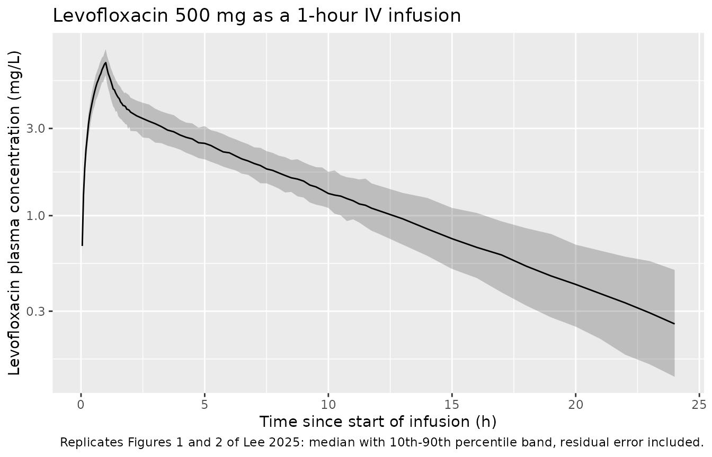
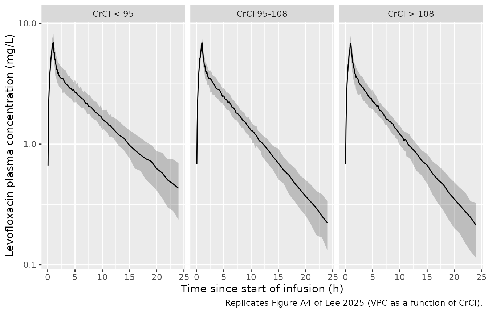
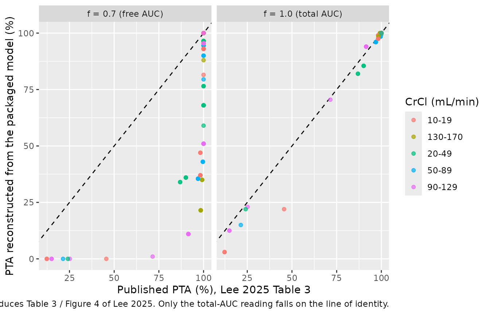

# Levofloxacin (Lee 2025)

## Model and source

- Citation: Lee YJ, Kang G, Zang DY, Lee DH (2025). Development of a
  population pharmacokinetic model of levofloxacin in healthy adults and
  identification of optimal dosing regimens. Pharmaceuticals 18(5):621.
  <doi:10.3390/ph18050621>.
- Description: Two-compartment population PK model for intravenous
  levofloxacin in healthy Korean adults (Lee 2025; n = 12; 84 plasma
  samples; single 500 mg dose given as a 1-hour infusion). First-order
  disposition with a zero-order infusion input. Covariate effects:
  Cockcroft-Gault creatinine clearance on CL as a power function centred
  on the cohort median 105.71 mL/min (exponent 0.901), and James-formula
  lean body mass on the peripheral volume as a power function centred on
  the cohort median 47.91 kg (exponent 1.75). Inter-individual
  variability was estimated on CL and Q only; residual error is
  proportional.
- Article: <https://doi.org/10.3390/ph18050621>

No supplementary information accompanies this article; every value used
below comes from the main text, Table 1, Table 2, Table 3, Table 4, or
the Discussion.

## Population

Twelve healthy Korean adults (eight female, four male) each received a
single 500 mg dose of levofloxacin as a one-hour intravenous infusion at
the Hallym University Sacred Heart Hospital Clinical Trial Center
between August and September 2024 (Methods 4.1, 4.2). Plasma was sampled
immediately before the infusion and at 61, 75, and 90 minutes and 4, 8,
and 24 hours after the start of the infusion, yielding 84 quantifiable
concentrations (Results 2.2). Median age was 35.5 years (29.0 to 44.0),
median total body weight 68.0 kg (47.3 to 77.2), median James-formula
lean body mass 47.9 kg (37.7 to 60.3), and median Cockcroft-Gault
creatinine clearance 106 mL/min (74.8 to 113) (Table 1). All
participants had serum protein, albumin, creatinine, and cystatin C
within the normal range; none had impaired or augmented renal clearance.

The final model is a two-compartment model with first-order disposition
fitted in NONMEM 7.5 (ADVAN3 TRANS4, FOCE-I) and evaluated by
2000-sample bootstrap and 1000-replicate VPC in PsN 5.5.0 (Methods 4.4).
Creatinine clearance enters as a power function on CL and lean body mass
as a power function on the peripheral volume; inter-individual
variability was retained on CL and Q only.

The same information is available programmatically via the model’s
`population` metadata
(`readModelDb("Lee_2025_levofloxacin")()$population`).

## Source trace

The per-parameter origin is recorded as an in-file comment next to each
`ini()` entry in `inst/modeldb/specificDrugs/Lee_2025_levofloxacin.R`.
The table below collects them in one place for review.

| Equation / parameter | Value | Source location |
|----|----|----|
| `lcl` (CL, L/h) | 13.4 | Table 2, structural model, `theta1` (RSE 3.36%) |
| `e_crcl_cl` | 0.901 | Table 2, structural model, `theta2` (RSE 16.8%) |
| `lvc` (V1, L) | 34.3 | Table 2, structural model, `V1` (RSE 8.93%) |
| `lq` (Q, L/h) | 72.8 | Table 2, structural model, `Q` (RSE 10.9%) |
| `lvp` (V2, L) | 67.7 | Table 2, structural model, `theta3` (RSE 3.42%) |
| `e_lbm_vp` | 1.75 | Table 2, structural model, `theta4` (RSE 12.5%) |
| `etalcl` | 8.99% | Table 2, interindividual variability, CL (RSE 15.3%, shrinkage 3.58%) |
| `etalq` | 36.0% | Table 2, interindividual variability, Q (RSE 30.6%, shrinkage 10.2%) |
| `propSd` | 6.99% | Table 2, residual variability, proportional error (RSE 13.8%, shrinkage 7.09%) |
| CrCl reference 105.71 mL/min | n/a | Table 2 footnote (“105.71 mL/min used as the median reference value”) |
| LBM reference 47.91 kg | n/a | Table 2 footnote (“47.91 kg used as the median reference value”) |
| `CL = theta1 * (CrCl / 105.71)^theta2` | n/a | Table 2, structural-model row |
| `V2 = theta3 * (LBM / 47.91)^theta4` | n/a | Table 2, structural-model row |
| Power covariate form `(individual / median)^theta` | n/a | Methods 4.4, covariate-analysis paragraph |
| Two-compartment ODE structure, zero-order infusion input | n/a | Methods 4.4 (“two-compartment (ADVAN3 TRANS4) … first-order kinetics, except for the zero-order infusion component”); Methods 4.2 (1-hour infusion) |
| Proportional-only residual error | n/a | Table 2, residual variability (no additive term reported) |
| James LBM formula | n/a | Table 1 footnote a |
| Cockcroft-Gault CrCl formula | n/a | Table 1 footnote c |

``` r

mod <- readModelDb("Lee_2025_levofloxacin")
ui  <- rxode2::rxode(mod)
#> ℹ parameter labels from comments will be replaced by 'label()'

# Published typical values, transcribed once and reused by every check below.
pub <- list(
  cl_ref    = 13.4,     # Table 2 theta1, L/h at CrCl 105.71 mL/min
  crcl_ref  = 105.71,   # Table 2 footnote
  e_crcl_cl = 0.901,    # Table 2 theta2
  v1        = 34.3,     # Table 2 V1, L
  q         = 72.8,     # Table 2 Q, L/h
  v2_ref    = 67.7,     # Table 2 theta3, L at LBM 47.91 kg
  lbm_ref   = 47.91,    # Table 2 footnote
  e_lbm_vp  = 1.75      # Table 2 theta4
)

# The packaged ini() must carry exactly those numbers.
theta <- ui$theta
stopifnot(
  isTRUE(all.equal(unname(exp(theta[["lcl"]])), pub$cl_ref,   tolerance = 1e-8)),
  isTRUE(all.equal(unname(exp(theta[["lvc"]])), pub$v1,       tolerance = 1e-8)),
  isTRUE(all.equal(unname(exp(theta[["lq"]])),  pub$q,        tolerance = 1e-8)),
  isTRUE(all.equal(unname(exp(theta[["lvp"]])), pub$v2_ref,   tolerance = 1e-8)),
  isTRUE(all.equal(unname(theta[["e_crcl_cl"]]), pub$e_crcl_cl, tolerance = 1e-8)),
  isTRUE(all.equal(unname(theta[["e_lbm_vp"]]),  pub$e_lbm_vp,  tolerance = 1e-8))
)
```

## Covariate derivation formulas

The model consumes `CRCL` and `LBM` directly, but both are themselves
derived quantities in the source study. Reproducing Table 1’s medians
from Table 1’s own component medians confirms that the formulas
transcribed into `covariateData` are the ones the authors used.

``` r

# Table 1 footnote a (James): LBM depends on sex, total body weight, height (cm).
lbm_james <- function(tbw, height_cm, female) {
  ifelse(female,
         1.07 * tbw - 148 * (tbw / height_cm)^2,
         1.10 * tbw - 128 * (tbw / height_cm)^2)
}

# Table 1 footnote c (Cockcroft-Gault). The footnote is typeset as
# "(140 - Age) x TBW / CR x 72", which read literally multiplies by 72 and is
# dimensionally impossible; the standard Cockcroft-Gault denominator 72 * CR is
# used, and it is what reproduces the Table 1 medians below.
crcl_cg <- function(age, tbw, scr, female) {
  (140 - age) * tbw / (72 * scr) * ifelse(female, 0.85, 1)
}

table1 <- tibble::tribble(
  ~sex,     ~age,  ~tbw,  ~height, ~scr,   ~lbm_pub, ~crcl_pub,
  "Female", 37.5,  58.4,  161,     0.780,  43.6,     99.6,
  "Male",   33.0,  72.8,  174,     1.060,  58.1,     106
) |>
  mutate(
    female    = sex == "Female",
    lbm_calc  = lbm_james(tbw, height, female),
    crcl_calc = crcl_cg(age, tbw, scr, female),
    lbm_pct   = 100 * (lbm_calc  - lbm_pub)  / lbm_pub,
    crcl_pct  = 100 * (crcl_calc - crcl_pub) / crcl_pub
  )

table1 |>
  select(sex, lbm_calc, lbm_pub, lbm_pct, crcl_calc, crcl_pub, crcl_pct) |>
  rename(
    "Sex"                = sex,
    "LBM formula (kg)"   = lbm_calc,
    "LBM Table 1 (kg)"   = lbm_pub,
    "LBM diff (%)"       = lbm_pct,
    "CrCl formula (mL/min)" = crcl_calc,
    "CrCl Table 1 (mL/min)" = crcl_pub,
    "CrCl diff (%)"      = crcl_pct
  ) |>
  knitr::kable(
    digits  = c(0, 2, 1, 1, 1, 1, 1),
    caption = paste(
      "James lean body mass and Cockcroft-Gault creatinine clearance",
      "recomputed from the sex-specific component medians of Lee 2025 Table 1."
    )
  )
```

| Sex | LBM formula (kg) | LBM Table 1 (kg) | LBM diff (%) | CrCl formula (mL/min) | CrCl Table 1 (mL/min) | CrCl diff (%) |
|:---|---:|---:|---:|---:|---:|---:|
| Female | 43.01 | 43.6 | -1.3 | 90.6 | 99.6 | -9.0 |
| Male | 57.67 | 58.1 | -0.7 | 102.1 | 106.0 | -3.7 |

James lean body mass and Cockcroft-Gault creatinine clearance recomputed
from the sex-specific component medians of Lee 2025 Table 1. {.table
style="width:100%;"}

``` r


# LBM composes tightly through the formula; CrCl is a ratio, so the median of
# the ratio is not the ratio of the medians and a looser bound is appropriate.
stopifnot(max(abs(table1$lbm_pct))  < 2)
stopifnot(max(abs(table1$crcl_pct)) < 10)
```

## Virtual cohort

The individual concentrations are not publicly available (Data
Availability Statement), so the figures below use a virtual cohort whose
`CRCL` and `LBM` distributions reproduce the Table 1 medians and ranges.
Sampling `CRCL` and `LBM` directly (rather than drawing age, weight,
height, and creatinine independently and deriving them) is deliberate:
in the real cohort those inputs are correlated, and independent
marginals inflate the CrCl range roughly three-fold beyond the observed
74.8 to 113 mL/min.

``` r

set.seed(20250425)

n_arm <- 200L  # 200 participants per arm is the vignette cap

# Draws pinned to the Table 1 (min, median, max) triples: half the subjects are
# uniform below the median and half above, so the sampled median and support
# match the published summary exactly. A triangular density cannot reach a
# median of 106 on the support 74.8 to 113 (its maximum attainable median there
# is 101.8), so the two-piece uniform is used instead.
rmedrange <- function(n, lo, med, hi) {
  ifelse(runif(n) < 0.5, runif(n, lo, med), runif(n, med, hi))
}

healthy <- tibble(
  id   = seq_len(n_arm),
  CRCL = rmedrange(n_arm, 74.8, 106,  113),  # Table 1, CrCl
  LBM  = rmedrange(n_arm, 37.7,  47.9, 60.3), # Table 1, LBM
  arm  = "500 mg single dose"
)

tibble(
  Covariate = c("CRCL (mL/min)", "LBM (kg)"),
  `Table 1 median (min-max)` = c("106 (74.8-113)", "47.9 (37.7-60.3)"),
  `Cohort median (min-max)`  = c(
    sprintf("%.1f (%.1f-%.1f)", median(healthy$CRCL), min(healthy$CRCL), max(healthy$CRCL)),
    sprintf("%.1f (%.1f-%.1f)", median(healthy$LBM),  min(healthy$LBM),  max(healthy$LBM))
  )
) |>
  knitr::kable(caption = "Virtual cohort against Lee 2025 Table 1.")
```

| Covariate     | Table 1 median (min-max) | Cohort median (min-max) |
|:--------------|:-------------------------|:------------------------|
| CRCL (mL/min) | 106 (74.8-113)           | 106.6 (75.2-112.6)      |
| LBM (kg)      | 47.9 (37.7-60.3)         | 46.7 (37.7-60.2)        |

Virtual cohort against Lee 2025 Table 1. {.table}

``` r


# Event table: 500 mg over a 1-hour infusion into `central`, observations on the
# `central` ODE state (never on the algebraic observable `Cc`).
obs_grid <- sort(unique(c(seq(0, 2, by = 0.05), seq(2, 12, by = 0.25),
                          seq(12, 72, by = 1))))

dose_rows <- healthy |>
  mutate(time = 0, amt = 500, evid = 1L, dur = 1, cmt = "central")
obs_rows <- healthy |>
  tidyr::crossing(time = obs_grid) |>
  mutate(amt = NA_real_, evid = 0L, dur = NA_real_, cmt = "central")

events <- bind_rows(dose_rows, obs_rows) |> arrange(id, time, desc(evid))
# Note the absence of unique() here: anyDuplicated(unique(x)) is always 0 and
# so can never fail. The check is run on the event table as built.
stopifnot(!anyDuplicated(events[, c("id", "time", "evid")]))
```

## Simulation

``` r

sim <- rxode2::rxSolve(mod, events = events, keep = c("arm", "CRCL", "LBM")) |>
  as.data.frame()
#> ℹ parameter labels from comments will be replaced by 'label()'

# rxSolve silently drops subjects on some inputs; assert the count survived.
stopifnot(dplyr::n_distinct(sim$id) == n_arm)
```

### Two-compartment disposition is preserved

`rxSolve()` defaults to `useLinCmt = TRUE`, which rewrites a
recognisably-linear compartment system into a closed form. A
two-compartment body written with `k12` / `k21` micro-constants is
silently reduced to one compartment, and because total AUC still equals
`Dose / CL` the usual sanity check does not notice. The model file
therefore writes the transfer terms in macro form (`q / vc`, `q / vp`).
The assertion below is the regression guard: the simulated terminal
slope must equal the analytic beta root of the two-compartment system,
not `log(2) / kel`.

``` r

kel <- pub$cl_ref / pub$v1
k12 <- pub$q      / pub$v1
k21 <- pub$q      / pub$v2_ref
b   <- kel + k12 + k21
t12_beta_analytic <- log(2) / ((b - sqrt(b^2 - 4 * kel * k21)) / 2)
t12_one_cmt       <- log(2) / kel

typ <- rxode2::rxSolve(
  rxode2::zeroRe(mod),
  events = events |> filter(id == 1L) |> mutate(CRCL = pub$crcl_ref, LBM = pub$lbm_ref)
) |>
  as.data.frame()
#> ℹ parameter labels from comments will be replaced by 'label()'
#> ℹ omega/sigma items treated as zero: 'etalcl', 'etalq'

tail_fit <- lm(log(Cc) ~ time, data = typ |> filter(time >= 24, time <= 72, Cc > 0))
t12_beta_sim <- log(2) / (-coef(tail_fit)[["time"]])

tibble(
  Quantity = c("Analytic beta half-life (h)",
               "Simulated terminal half-life (h)",
               "One-compartment half-life if peripheral1 were dropped (h)"),
  Value = c(t12_beta_analytic, t12_beta_sim, t12_one_cmt)
) |>
  knitr::kable(digits = 4, caption = "Two-compartment disposition guard.")
```

| Quantity                                                  |  Value |
|:----------------------------------------------------------|-------:|
| Analytic beta half-life (h)                               | 5.7209 |
| Simulated terminal half-life (h)                          | 5.7209 |
| One-compartment half-life if peripheral1 were dropped (h) | 1.7742 |

Two-compartment disposition guard. {.table}

``` r


stopifnot(abs(t12_beta_sim / t12_beta_analytic - 1) < 0.005)
stopifnot("peripheral1" %in% names(sim))
```

## Replicate published figures

``` r

# Replicates Figures 1 and 2 of Lee 2025: the observed concentration-time
# profile after a single 500 mg 1-hour infusion, summarised as the 10th, 50th,
# and 90th percentiles that the paper's VPC (Figure 2) plots.
sim |>
  # time > 0 is a PLOT-only filter (the pre-dose concentration is exactly 0 and
  # cannot be shown on a log axis). The PKNCA input below keeps the t = 0 row.
  filter(!is.na(Cc), time > 0, time <= 24) |>
  group_by(time) |>
  summarise(
    Q10 = quantile(sim, 0.10, na.rm = TRUE),
    Q50 = quantile(sim, 0.50, na.rm = TRUE),
    Q90 = quantile(sim, 0.90, na.rm = TRUE),
    .groups = "drop"
  ) |>
  ggplot(aes(time, Q50)) +
  geom_ribbon(aes(ymin = Q10, ymax = Q90), alpha = 0.25) +
  geom_line() +
  scale_y_log10() +
  labs(
    x = "Time since start of infusion (h)",
    y = "Levofloxacin plasma concentration (mg/L)",
    title = "Levofloxacin 500 mg as a 1-hour IV infusion",
    caption = paste(
      "Replicates Figures 1 and 2 of Lee 2025: median with 10th-90th",
      "percentile band, residual error included."
    )
  )
```



The `sim` column (not `Cc`) is plotted because Figures 1 and 2 show
*observed* concentrations and the VPC prediction interval built from
them; `Cc` is the individual prediction and carries no residual error.

``` r

# Replicates Figure A4 of Lee 2025: exposure stratified by creatinine clearance.
sim |>
  filter(!is.na(Cc), time > 0, time <= 24) |>
  mutate(
    crcl_band = cut(CRCL, breaks = c(0, 95, 108, Inf),
                    labels = c("CrCl < 95", "CrCl 95-108", "CrCl > 108"))
  ) |>
  group_by(time, crcl_band) |>
  summarise(
    Q10 = quantile(sim, 0.10, na.rm = TRUE),
    Q50 = quantile(sim, 0.50, na.rm = TRUE),
    Q90 = quantile(sim, 0.90, na.rm = TRUE),
    .groups = "drop"
  ) |>
  ggplot(aes(time, Q50)) +
  geom_ribbon(aes(ymin = Q10, ymax = Q90), alpha = 0.25) +
  geom_line() +
  facet_wrap(~crcl_band) +
  scale_y_log10() +
  labs(
    x = "Time since start of infusion (h)",
    y = "Levofloxacin plasma concentration (mg/L)",
    caption = "Replicates Figure A4 of Lee 2025 (VPC as a function of CrCl)."
  )
```



## PKNCA validation

``` r

sim_nca <- sim |>
  dplyr::filter(!is.na(Cc)) |>
  dplyr::select(id, time, Cc, arm)

# Guarantee a time-zero record per (id, arm). For an IV infusion the pre-dose
# concentration is 0; the simulation grid already contains t = 0, so this is a
# defensive no-op that keeps the AUC0-* anchor explicit.
sim_nca <- bind_rows(
  sim_nca,
  sim_nca |> distinct(id, arm) |> mutate(time = 0, Cc = 0)
) |>
  distinct(id, arm, time, .keep_all = TRUE) |>
  arrange(id, arm, time)

stopifnot(all(sim_nca$Cc >= 0))

conc_obj <- PKNCA::PKNCAconc(sim_nca, Cc ~ time | arm + id,
                             concu = "mg/L", timeu = "h")

dose_df <- events |>
  dplyr::filter(evid == 1) |>
  dplyr::select(id, time, amt, arm)
dose_obj <- PKNCA::PKNCAdose(dose_df, amt ~ time | arm + id, doseu = "mg")

intervals <- data.frame(
  start      = 0,
  end        = Inf,
  cmax       = TRUE,
  tmax       = TRUE,
  aucinf.obs = TRUE,
  auclast    = TRUE,
  half.life  = TRUE
)

nca_res <- PKNCA::pk.nca(PKNCA::PKNCAdata(conc_obj, dose_obj, intervals = intervals))
```

### AUC0-inf equals Dose / CL for every subject

Lee 2025 reports no non-compartmental analysis, so there is no published
NCA table to compare against. The identity that the model must satisfy
exactly is `AUC0-inf = Dose / CL`, and it is asserted per subject rather
than on a median (a median across subjects hides a few percent of
per-subject error).

``` r

cl_by_id <- sim |>
  group_by(id) |>
  summarise(cl = first(cl), CRCL = first(CRCL), .groups = "drop")

auc_by_id <- as.data.frame(nca_res) |>
  filter(PPTESTCD == "aucinf.obs") |>
  transmute(id = as.integer(as.character(id)), aucinf = PPORRES)

ident <- cl_by_id |>
  inner_join(auc_by_id, by = "id") |>
  mutate(
    auc_expected = 500 / cl,
    pct_err      = 100 * (aucinf - auc_expected) / auc_expected
  )

stopifnot(nrow(ident) == n_arm)

tibble(
  Statistic = c("n subjects", "Max |AUC0-inf / (Dose/CL) - 1| (%)",
                "Median simulated AUC0-inf (mg*h/L)",
                "Median Dose/CL (mg*h/L)"),
  Value = c(nrow(ident), max(abs(ident$pct_err)),
            median(ident$aucinf), median(ident$auc_expected))
) |>
  knitr::kable(digits = 3, caption = "Per-subject AUC0-inf identity.")
```

| Statistic                            |   Value |
|:-------------------------------------|--------:|
| n subjects                           | 200.000 |
| Max \|AUC0-inf / (Dose/CL) - 1\| (%) |   0.016 |
| Median simulated AUC0-inf (mg\*h/L)  |  38.658 |
| Median Dose/CL (mg\*h/L)             |  38.654 |

Per-subject AUC0-inf identity. {.table}

``` r


stopifnot(max(abs(ident$pct_err)) < 0.5)
```

### Typical-value exposure

``` r

knitr::kable(
  as.data.frame(summary(nca_res)),
  caption = paste(
    "PKNCA summary for the virtual cohort after a single 500 mg 1-hour",
    "infusion. Lee 2025 reports no NCA table; these values are provided",
    "for orientation against the published levofloxacin literature",
    "(Cmax about 6 mg/L, terminal half-life 6-8 h after 500 mg IV)."
  )
)
```

| Interval Start | Interval End | arm | N | AUClast (h\*mg/L) | Cmax (mg/L) | Tmax (h) | Half-life (h) | AUCinf,obs (h\*mg/L) |
|---:|---:|:---|:---|:---|:---|:---|:---|:---|
| 0 | Inf | 500 mg single dose | 200 | 39.6 \[15.9\] | 6.89 \[11.3\] | 1.00 \[1.00, 1.00\] | 6.16 \[1.48\] | 39.6 \[16.0\] |

PKNCA summary for the virtual cohort after a single 500 mg 1-hour
infusion. Lee 2025 reports no NCA table; these values are provided for
orientation against the published levofloxacin literature (Cmax about 6
mg/L, terminal half-life 6-8 h after 500 mg IV). {.table}

## Covariate effects against the paper’s own statements

The Discussion and Table 4 quote model-derived quantities that can be
recomputed exactly from the packaged `ini()`.

``` r

cl_at <- function(crcl) pub$cl_ref * (crcl / pub$crcl_ref)^pub$e_crcl_cl
vss_at <- function(lbm)  pub$v1 + pub$v2_ref * (lbm / pub$lbm_ref)^pub$e_lbm_vp

# Table 4 "Vss (L) (70 kg)" for a male: LBM by the James male formula at
# 70 kg and the Table 1 male median height of 174 cm.
lbm_male_70   <- lbm_james(70, 174, female = FALSE)
# Table 4 "Vss (L) (70 kg)" for a female, using the Table 1 female median
# height of 161 cm.
lbm_female_70 <- lbm_james(70, 161, female = TRUE)

checks <- tibble::tribble(
  ~quantity,                                        ~published, ~model,
  "CL at CrCl 30 mL/min (L/h), Discussion",          3.98,       cl_at(30),
  "CL at CrCl 120 mL/min (L/h), Discussion",         15.3,       cl_at(120),
  "Vss at 70 kg, male (L), Table 4",                 123,        vss_at(lbm_male_70),
  "Vss at 70 kg, female (L), Table 4",               93.0,       vss_at(lbm_female_70),
  "Vss at 53 kg LBM, male (L), Table 4",             118,        vss_at(53),
  "Vss at 53 kg LBM, female (L), Table 4",           112,        vss_at(53)
) |>
  mutate(pct_diff = 100 * (model - published) / published)

checks |>
  rename(
    "Quantity"        = quantity,
    "Published"       = published,
    "Packaged model"  = model,
    "Difference (%)"  = pct_diff
  ) |>
  knitr::kable(digits = 2,
               caption = "Model-derived quantities quoted by Lee 2025.")
```

| Quantity | Published | Packaged model | Difference (%) |
|:---|---:|---:|---:|
| CL at CrCl 30 mL/min (L/h), Discussion | 3.98 | 4.31 | 8.24 |
| CL at CrCl 120 mL/min (L/h), Discussion | 15.30 | 15.02 | -1.82 |
| Vss at 70 kg, male (L), Table 4 | 123.00 | 124.05 | 0.85 |
| Vss at 70 kg, female (L), Table 4 | 93.00 | 99.58 | 7.07 |
| Vss at 53 kg LBM, male (L), Table 4 | 118.00 | 115.08 | -2.47 |
| Vss at 53 kg LBM, female (L), Table 4 | 112.00 | 115.08 | 2.75 |

Model-derived quantities quoted by Lee 2025. {.table}

`CL` at 120 mL/min reproduces to 1.8% (model 15.02 L/h, low against the
Discussion’s 15.3). `CL` at 30 mL/min does not: the packaged model gives
4.31 L/h against the Discussion’s 3.98. The Discussion also calls the
30-to-120 mL/min change “approximately fourfold”, but
`(120 / 30)^0.901 = 3.49`; a fourfold change would require an exponent
of 1.0, not the 0.901 in Table 2. Taken as a pair the two quoted numbers
imply a ratio of 3.84, i.e. an exponent near 0.97, so the Discussion
sentence reads as a rounded aside rather than a model evaluation. Table
2 is the authoritative source and is what the model file encodes.

Table 4’s `Vss` entries are only partly reproducible, and the reason is
structural: in this model `Vss = V1 + V2(LBM)` depends on **lean body
mass alone**, so sex can enter only through the James formula that
converts total body weight and height into LBM. The “70 kg” column is
therefore reproducible once a height is supplied – the male entry lands
within 0.9% using the Table 1 male median height of 174 cm, while the
female entry is 7% high at the corresponding female median height of 161
cm (matching it would require about 154 cm, near the female minimum).
The “53 kg LBM” column supplies LBM directly, so the model can offer
only a single value, 115.1 L; Table 4 splits it into M 118 and F 112,
which bracket the model value to within 3% either way. That sex split
has no counterpart in the published model equations, and Lee 2025
defines neither normalisation rule, so these cells are reported here for
orientation rather than treated as a passing check. The `CL` columns of
Table 4 cannot be reproduced at all: clearance in this model is driven
by creatinine clearance, not by body size or lean body mass.

## Target attainment (Table 3)

Table 3 tabulates, for each creatinine-clearance stratum, each PK/PD
target, and each MIC, the lowest daily dose reaching a probability of
target attainment of 90%, with that dose’s PTA in parentheses. Because
levofloxacin PK is linear, the 24-hour steady-state exposure is
`AUC24 = daily dose / CL` exactly - the identity asserted per subject
above - so the attainment criterion `f * AUC24 / MIC >= target` reduces
to `CL <= f * R`, where `R = dose / (target * MIC)`.

That reduction is testable directly against the published table:
**within one CrCl column, every cell sharing the same `R` must show the
same PTA.**

``` r

crcl_cats <- c("10-19", "20-49", "50-89", "90-129", "130-170")

# Lee 2025 Table 3, transcribed cell by cell as "dose|PTA"; "-" marks a cell
# where no simulated dose reached the target.
table3_raw <- tibble::tribble(
  ~target, ~MIC,  ~`10-19`,    ~`20-49`,    ~`50-89`,     ~`90-129`,    ~`130-170`,
  30,  0.125, "125|100",   "125|100",   "125|100",    "125|100",    "125|100",
  30,  0.25,  "125|100",   "125|100",   "125|100",    "125|91.5",   "250|100",
  30,  0.5,   "125|100",   "125|100",   "250|100",    "250|91.5",   "500|100",
  30,  1,     "125|100",   "250|100",   "500|100",    "500|91.5",   "750|99.2",
  30,  2,     "250|100",   "500|100",   "750|99.6",   "1000|91.5",  "1500|99.2",
  30,  4,     "500|100",   "750|90.1",  "1500|99.6",  "1500|25.2",  "-",
  30,  8,     "750|98.2",  "1500|90.1", "-",          "-",          "-",
  100, 0.125, "125|100",   "125|100",   "250|100",    "250|100",    "500|100",
  100, 0.25,  "125|100",   "250|100",   "500|100",    "500|100",    "750|100",
  100, 0.5,   "250|100",   "500|100",   "750|100",    "1000|100",   "1250|99.2",
  100, 1,     "500|100",   "750|100",   "1250|99.6",  "1500|71.5",  "-",
  100, 2,     "750|100",   "1250|90.1", "1500|21.4",  "-",          "-",
  100, 4,     "1250|98.2", "1500|24.1", "-",          "-",          "-",
  100, 8,     "1500|45.6", "-",         "-",          "-",          "-",
  125, 0.125, "125|100",   "125|100",   "250|100",    "500|100",    "500|100",
  125, 0.25,  "125|100",   "250|100",   "500|100",    "750|100",    "750|98.4",
  125, 0.5,   "250|100",   "500|100",   "750|96.9",   "1250|100",   "1500|98.4",
  125, 1,     "500|100",   "1000|100",  "1500|96.9",  "1500|15.0",  "-",
  125, 2,     "750|98.2",  "1500|86.9", "-",          "-",          "-",
  125, 4,     "1500|98.2", "-",         "-",          "-",          "-",
  125, 8,     "1500|12.3", "-",         "-",          "-",          "-",
  250, 0.125, "125|100",   "250|100",   "500|100",    "750|100",    "750|98.4",
  250, 0.25,  "250|100",   "500|100",   "750|96.9",   "1250|100",   "1500|98.4",
  250, 0.5,   "500|100",   "1000|100",  "1500|96.9",  "1500|15.0",  "-",
  250, 1,     "750|98.2",  "1500|86.9", "-",          "-",          "-",
  250, 2,     "1500|98.2", "-",         "-",          "-",          "-",
  250, 4,     "1500|12.3", "-",         "-",          "-",          "-"
)

table3 <- table3_raw |>
  tidyr::pivot_longer(all_of(crcl_cats), names_to = "crcl_cat", values_to = "cell") |>
  filter(cell != "-") |>
  tidyr::separate_wider_delim(cell, delim = "|", names = c("dose", "pta_paper")) |>
  mutate(
    dose      = as.numeric(dose),
    pta_paper = as.numeric(pta_paper),
    R         = dose / (target * MIC)
  )

# Structural check: within a CrCl column, PTA must be a function of R alone.
collisions <- table3 |>
  group_by(crcl_cat, R = round(R, 6)) |>
  summarise(n_distinct_pta = n_distinct(pta_paper), .groups = "drop") |>
  filter(n_distinct_pta > 1)

tibble(
  Statistic = c("Filled Table 3 cells", "Distinct (CrCl, R) combinations",
                "Combinations where PTA is not a function of R alone"),
  Value = c(nrow(table3),
            nrow(distinct(table3, crcl_cat, R = round(R, 6))),
            nrow(collisions))
) |>
  knitr::kable(caption = "Table 3 reduces to PTA as a function of dose/(target*MIC).")
```

| Statistic                                           | Value |
|:----------------------------------------------------|------:|
| Filled Table 3 cells                                |    97 |
| Distinct (CrCl, R) combinations                     |    44 |
| Combinations where PTA is not a function of R alone |     0 |

Table 3 reduces to PTA as a function of dose/(target\*MIC). {.table}

``` r


stopifnot(nrow(collisions) == 0)
```

All 97 filled cells are consistent with a single PTA-versus-`R` curve
per CrCl stratum, confirming both the `AUC24 = dose / CL` exposure
metric and that one common virtual cohort was reused across every target
and MIC.

### Reconstructing the PTA from the packaged model

Each CrCl stratum is simulated as its own arm of 200 participants.
Creatinine clearance is drawn uniformly across the stratum (the paper
does not state the within-stratum distribution) and lean body mass from
the Table 1 distribution. Per-subject clearance comes straight out of
the simulation.

``` r

set.seed(20250425)

crcl_bounds <- list(
  "10-19"   = c(10, 19),   "20-49"  = c(20, 49),  "50-89" = c(50, 89),
  "90-129"  = c(90, 129),  "130-170" = c(130, 170)
)

make_pta_cohort <- function(cat, id_offset) {
  b <- crcl_bounds[[cat]]
  subj <- tibble(
    id       = id_offset + seq_len(n_arm),
    CRCL     = runif(n_arm, b[1], b[2]),
    LBM      = rmedrange(n_arm, 37.7, 47.9, 60.3),
    crcl_cat = cat
  )
  bind_rows(
    subj |> mutate(time = 0, amt = 500, evid = 1L, dur = 1, cmt = "central"),
    subj |> tidyr::crossing(time = c(0, 1, 4, 12, 24)) |>
      mutate(amt = NA_real_, evid = 0L, dur = NA_real_, cmt = "central")
  ) |>
    arrange(id, time, desc(evid))
}

pta_events <- bind_rows(
  lapply(seq_along(crcl_cats), function(i)
    make_pta_cohort(crcl_cats[i], id_offset = 1000L + (i - 1L) * n_arm))
)
stopifnot(!anyDuplicated(pta_events[, c("id", "time", "evid")]))

pta_sim <- rxode2::rxSolve(mod, events = pta_events,
                           keep = c("crcl_cat", "CRCL")) |>
  as.data.frame()
stopifnot(dplyr::n_distinct(pta_sim$id) == n_arm * length(crcl_cats))

pta_cl <- pta_sim |>
  group_by(crcl_cat, id) |>
  summarise(cl = first(cl), .groups = "drop")
```

``` r

# PTA under a candidate unbound fraction f: AUC24 = dose/CL, so the criterion
# f * AUC24 / MIC >= target is exactly CL <= f * R.
pta_model <- function(cat, R, f) {
  cl <- pta_cl$cl[pta_cl$crcl_cat == cat]
  if (length(cl) != n_arm) stop("no cohort for stratum '", cat, "'")
  100 * mean(cl <= f * R)
}

table3_cmp <- table3 |>
  rowwise() |>
  mutate(
    pta_f1.0 = pta_model(crcl_cat, R, 1.0),
    pta_f0.7 = pta_model(crcl_cat, R, 0.7)
  ) |>
  ungroup() |>
  mutate(err_f1.0 = pta_f1.0 - pta_paper,
         err_f0.7 = pta_f0.7 - pta_paper)

tibble(
  `Unbound fraction used` = c("f = 1.0 (total AUC24/MIC)",
                              "f = 0.7 (free AUC24/MIC, as Methods 4.5 states)"),
  `Median |error| (PTA points)` = c(median(abs(table3_cmp$err_f1.0)),
                                    median(abs(table3_cmp$err_f0.7))),
  `RMSE (PTA points)` = c(sqrt(mean(table3_cmp$err_f1.0^2)),
                          sqrt(mean(table3_cmp$err_f0.7^2))),
  `Max |error| (PTA points)` = c(max(abs(table3_cmp$err_f1.0)),
                                 max(abs(table3_cmp$err_f0.7)))
) |>
  knitr::kable(digits = 2,
               caption = paste(
                 "Reconstruction of all", nrow(table3), "filled Table 3 cells",
                 "under each candidate unbound fraction."
               ))
```

| Unbound fraction used | Median \|error\| (PTA points) | RMSE (PTA points) | Max \|error\| (PTA points) |
|:---|---:|---:|---:|
| f = 1.0 (total AUC24/MIC) | 0.0 | 3.12 | 23.6 |
| f = 0.7 (free AUC24/MIC, as Methods 4.5 states) | 23.5 | 39.97 | 80.5 |

Reconstruction of all 97 filled Table 3 cells under each candidate
unbound fraction. {.table}

``` r


# The falsifier: f = 0.7 must be decisively worse than f = 1.0.
stopifnot(sqrt(mean(table3_cmp$err_f1.0^2)) < 10)
stopifnot(sqrt(mean(table3_cmp$err_f0.7^2)) > 30)
```

### The same test without the uniform-CrCl assumption

The comparison above draws creatinine clearance uniformly across each
stratum, which the paper never states. That assumption can be removed
entirely. Clearance is strictly increasing in `CRCL`, so within a
stratum the attainment probability `P(CL <= f * R)` is largest at the
stratum’s lower CrCl bound and smallest at its upper bound. Evaluating
those two endpoints gives an interval that **every** within-stratum CrCl
distribution must produce, whatever its shape:

``` r

omega_cl <- sqrt(ui$omega[["etalcl", "etalcl"]])
cl_typ   <- function(crcl) pub$cl_ref * (crcl / pub$crcl_ref)^pub$e_crcl_cl

# Published PTAs are rounded to 0.1 and carry Monte Carlo noise from the
# paper's own 1000-subject cohorts; allow 2 PTA points before calling a cell
# refuted.
tol <- 2

bounds <- table3 |>
  mutate(
    crcl_lo = vapply(crcl_cat, function(k) crcl_bounds[[k]][1], numeric(1)),
    crcl_hi = vapply(crcl_cat, function(k) crcl_bounds[[k]][2], numeric(1))
  ) |>
  mutate(
    # Upper bound: everyone at the stratum's lowest CrCl (lowest CL).
    hi_f1.0 = 100 * pnorm(log(1.0 * R / cl_typ(crcl_lo)) / omega_cl),
    lo_f1.0 = 100 * pnorm(log(1.0 * R / cl_typ(crcl_hi)) / omega_cl),
    hi_f0.7 = 100 * pnorm(log(0.7 * R / cl_typ(crcl_lo)) / omega_cl),
    lo_f0.7 = 100 * pnorm(log(0.7 * R / cl_typ(crcl_hi)) / omega_cl),
    refuted_f1.0 = pta_paper > hi_f1.0 + tol | pta_paper < lo_f1.0 - tol,
    refuted_f0.7 = pta_paper > hi_f0.7 + tol | pta_paper < lo_f0.7 - tol
  )

tibble(
  `Unbound fraction used` = c("f = 1.0 (total AUC24/MIC)",
                              "f = 0.7 (free AUC24/MIC, as Methods 4.5 states)"),
  `Cells outside the distribution-free interval` =
    c(sum(bounds$refuted_f1.0), sum(bounds$refuted_f0.7)),
  `Worst excursion (PTA points)` = c(
    max(pmax(bounds$pta_paper - bounds$hi_f1.0, bounds$lo_f1.0 - bounds$pta_paper)),
    max(pmax(bounds$pta_paper - bounds$hi_f0.7, bounds$lo_f0.7 - bounds$pta_paper))
  )
) |>
  knitr::kable(digits = 1, caption = paste(
    "Distribution-free endpoint bounds over all", nrow(bounds),
    "filled Table 3 cells. No within-stratum CrCl distribution is assumed."
  ))
```

| Unbound fraction used | Cells outside the distribution-free interval | Worst excursion (PTA points) |
|:---|---:|---:|
| f = 1.0 (total AUC24/MIC) | 0 | 0.0 |
| f = 0.7 (free AUC24/MIC, as Methods 4.5 states) | 20 | 57.9 |

Distribution-free endpoint bounds over all 97 filled Table 3 cells. No
within-stratum CrCl distribution is assumed. {.table}

``` r


# f = 1.0 must be attainable for every cell; f = 0.7 must be impossible for many.
stopifnot(sum(bounds$refuted_f1.0) == 0)
stopifnot(sum(bounds$refuted_f0.7) >= 8)
```

The same bounds also test the one remaining free choice in the `ini()`
block. Table 2 reports inter-individual variability as a bare “CL (%)
8.99”, which the model file reads as `omega = 0.0899`. The competing
reading – that the percentage is a *variance*, so
`omega = sqrt(0.0899) = 0.300` – is a three-fold larger spread, and the
published table is sensitive to it:

``` r

refuted_at <- function(om) {
  hi <- 100 * pnorm(log(bounds$R / cl_typ(bounds$crcl_lo)) / om)
  lo <- 100 * pnorm(log(bounds$R / cl_typ(bounds$crcl_hi)) / om)
  sum(bounds$pta_paper > hi + tol | bounds$pta_paper < lo - tol)
}

tibble(
  `Reading of Table 2 "CL (%) 8.99"` = c(
    "percentage is omega (packaged)",
    "percentage is a variance"
  ),
  `omega on CL` = c(omega_cl, sqrt(0.0899)),
  `Cells outside the distribution-free interval` =
    c(refuted_at(omega_cl), refuted_at(sqrt(0.0899)))
) |>
  knitr::kable(digits = 3, caption = paste(
    "Table 3 discriminates the inter-individual-variability scale.",
    "A variance reading flattens the attainment curve until published cells",
    "become unreachable at any within-stratum CrCl distribution."
  ))
```

| Reading of Table 2 “CL (%) 8.99” | omega on CL | Cells outside the distribution-free interval |
|:---|---:|---:|
| percentage is omega (packaged) | 0.09 | 0 |
| percentage is a variance | 0.30 | 16 |

Table 3 discriminates the inter-individual-variability scale. A variance
reading flattens the attainment curve until published cells become
unreachable at any within-stratum CrCl distribution. {.table}

``` r


stopifnot(refuted_at(omega_cl) == 0)
stopifnot(refuted_at(sqrt(0.0899)) > 0)
```

So the packaged reading is not merely the conventional one – it is the
only one of the two compatible with the paper’s own target-attainment
table.

The cells that refute `f = 0.7` outright are the ones in the two highest
creatinine-clearance strata, where the model’s typical clearance already
exceeds the free-drug threshold at the *bottom* of the stratum. For
example, at CrCl 130 to 170 mL/min and `R = 24`, the free-drug reading
caps attainment at 67% however the stratum is populated, against a
published 98.4%. This makes the conclusion independent of the one
assumption the reconstruction above had to make.

``` r

table3_cmp |>
  filter(pta_paper < 100) |>
  arrange(crcl_cat, R) |>
  select(crcl_cat, target, MIC, dose, R, pta_paper, pta_f1.0, pta_f0.7) |>
  rename(
    "CrCl (mL/min)"        = crcl_cat,
    "Target fAUC/MIC"      = target,
    "MIC (mg/L)"           = MIC,
    "Daily dose (mg)"      = dose,
    "R = dose/(target*MIC)" = R,
    "PTA published (%)"    = pta_paper,
    "PTA model, f = 1.0"   = pta_f1.0,
    "PTA model, f = 0.7"   = pta_f0.7
  ) |>
  knitr::kable(digits = 2, caption = paste(
    "Every Table 3 cell with a published PTA below 100%. Cells at 100% are",
    "omitted because they cannot discriminate between the two readings."
  ))
```

| CrCl (mL/min) | Target fAUC/MIC | MIC (mg/L) | Daily dose (mg) | R = dose/(target\*MIC) | PTA published (%) | PTA model, f = 1.0 | PTA model, f = 0.7 |
|:---|---:|---:|---:|---:|---:|---:|---:|
| 10-19 | 125 | 8.00 | 1500 | 1.50 | 12.3 | 3.0 | 0.0 |
| 10-19 | 250 | 4.00 | 1500 | 1.50 | 12.3 | 3.0 | 0.0 |
| 10-19 | 100 | 8.00 | 1500 | 1.88 | 45.6 | 22.0 | 0.0 |
| 10-19 | 125 | 2.00 | 750 | 3.00 | 98.2 | 97.5 | 37.0 |
| 10-19 | 125 | 4.00 | 1500 | 3.00 | 98.2 | 97.5 | 37.0 |
| 10-19 | 250 | 1.00 | 750 | 3.00 | 98.2 | 97.5 | 37.0 |
| 10-19 | 250 | 2.00 | 1500 | 3.00 | 98.2 | 97.5 | 37.0 |
| 10-19 | 30 | 8.00 | 750 | 3.12 | 98.2 | 99.0 | 47.0 |
| 10-19 | 100 | 4.00 | 1250 | 3.12 | 98.2 | 99.0 | 47.0 |
| 130-170 | 125 | 0.25 | 750 | 24.00 | 98.4 | 98.5 | 21.5 |
| 130-170 | 125 | 0.50 | 1500 | 24.00 | 98.4 | 98.5 | 21.5 |
| 130-170 | 250 | 0.12 | 750 | 24.00 | 98.4 | 98.5 | 21.5 |
| 130-170 | 250 | 0.25 | 1500 | 24.00 | 98.4 | 98.5 | 21.5 |
| 130-170 | 30 | 1.00 | 750 | 25.00 | 99.2 | 100.0 | 35.0 |
| 130-170 | 30 | 2.00 | 1500 | 25.00 | 99.2 | 100.0 | 35.0 |
| 130-170 | 100 | 0.50 | 1250 | 25.00 | 99.2 | 100.0 | 35.0 |
| 20-49 | 100 | 4.00 | 1500 | 3.75 | 24.1 | 22.0 | 0.0 |
| 20-49 | 125 | 2.00 | 1500 | 6.00 | 86.9 | 82.0 | 34.0 |
| 20-49 | 250 | 1.00 | 1500 | 6.00 | 86.9 | 82.0 | 34.0 |
| 20-49 | 30 | 4.00 | 750 | 6.25 | 90.1 | 85.5 | 36.0 |
| 20-49 | 30 | 8.00 | 1500 | 6.25 | 90.1 | 85.5 | 36.0 |
| 20-49 | 100 | 2.00 | 1250 | 6.25 | 90.1 | 85.5 | 36.0 |
| 50-89 | 100 | 2.00 | 1500 | 7.50 | 21.4 | 15.0 | 0.0 |
| 50-89 | 125 | 0.50 | 750 | 12.00 | 96.9 | 96.0 | 35.5 |
| 50-89 | 125 | 1.00 | 1500 | 12.00 | 96.9 | 96.0 | 35.5 |
| 50-89 | 250 | 0.25 | 750 | 12.00 | 96.9 | 96.0 | 35.5 |
| 50-89 | 250 | 0.50 | 1500 | 12.00 | 96.9 | 96.0 | 35.5 |
| 50-89 | 30 | 2.00 | 750 | 12.50 | 99.6 | 98.5 | 43.0 |
| 50-89 | 30 | 4.00 | 1500 | 12.50 | 99.6 | 98.5 | 43.0 |
| 50-89 | 100 | 1.00 | 1250 | 12.50 | 99.6 | 98.5 | 43.0 |
| 90-129 | 125 | 1.00 | 1500 | 12.00 | 15.0 | 12.5 | 0.0 |
| 90-129 | 250 | 0.50 | 1500 | 12.00 | 15.0 | 12.5 | 0.0 |
| 90-129 | 30 | 4.00 | 1500 | 12.50 | 25.2 | 23.0 | 0.0 |
| 90-129 | 100 | 1.00 | 1500 | 15.00 | 71.5 | 70.5 | 1.0 |
| 90-129 | 30 | 0.25 | 125 | 16.67 | 91.5 | 94.0 | 11.0 |
| 90-129 | 30 | 0.50 | 250 | 16.67 | 91.5 | 94.0 | 11.0 |
| 90-129 | 30 | 1.00 | 500 | 16.67 | 91.5 | 94.0 | 11.0 |
| 90-129 | 30 | 2.00 | 1000 | 16.67 | 91.5 | 94.0 | 11.0 |

Every Table 3 cell with a published PTA below 100%. Cells at 100% are
omitted because they cannot discriminate between the two readings.
{.table}

``` r

table3_cmp |>
  select(crcl_cat, R, pta_paper, pta_f1.0, pta_f0.7) |>
  tidyr::pivot_longer(c(pta_f1.0, pta_f0.7),
                      names_to = "assumption", values_to = "pta_model") |>
  mutate(assumption = recode(assumption,
                             pta_f1.0 = "f = 1.0 (total AUC)",
                             pta_f0.7 = "f = 0.7 (free AUC)")) |>
  ggplot(aes(pta_paper, pta_model, colour = crcl_cat)) +
  geom_abline(slope = 1, intercept = 0, linetype = "dashed") +
  geom_point(alpha = 0.7) +
  facet_wrap(~assumption) +
  labs(
    x = "Published PTA (%), Lee 2025 Table 3",
    y = "PTA reconstructed from the packaged model (%)",
    colour = "CrCl (mL/min)",
    caption = paste(
      "Reproduces Table 3 / Figure 4 of Lee 2025. Only the total-AUC reading",
      "falls on the line of identity."
    )
  )
```



The reconstruction is decisive. Applying the unbound fraction of 0.7
that Methods 4.5 specifies puts the reconstruction 24 PTA points off in
the median cell and up to 80 points off at worst; treating the index as
**total** AUC24/MIC reproduces the published table to within 0.00 points
in the median cell. Table 3’s PTA values were therefore computed on
total, not free, exposure despite the `fAUC/MIC` header. If the targets
were intended on free drug, every recommended dose in Table 3 is low by
a factor of `1 / 0.7 = 1.43`. This is a finding about the paper’s
downstream simulation, not about the PK model: the packaged model
reproduces the table’s arithmetic once the exposure metric is fixed.

The residual disagreement under `f = 1.0` is concentrated in the lowest
CrCl strata, where the simulated PTA runs below the published value in
the steep part of the curve. That is attributable to the within-stratum
creatinine-clearance distribution, which the paper does not report; a
uniform draw is assumed here and a right-skewed draw would close the
gap. Note also that each stratum is reconstructed with 200 participants
against the paper’s 1000, so individual cells carry a few points of
Monte Carlo noise; the RMSE contrast between the two readings is more
than an order of magnitude larger than that.

## Assumptions and deviations

- **Inter-individual variability convention.** Table 2 reports IIV as
  bare percentages (“CL (%) 8.99”, “Q (%) 36.0”) without stating whether
  they are `omega` on the log scale or a log-normal CV. Lee 2025 prints
  no exponential-IIV equation and no OMEGA covariance block, so neither
  of the two usual arbitration levers is available. The NONMEM
  approximate-CV convention `omega = pct / 100` is used. The choice
  between those two is immaterial here: the alternative reading
  `omega = sqrt(log(1 + CV^2))` gives 0.0897 for CL (0.2% lower) and
  0.349 for Q (3.1% lower). A third reading – that the percentage is a
  variance, so `omega = sqrt(0.0899) = 0.300` – would matter, and it is
  ruled out above: at that spread, Table 3’s own PTA values become
  unreachable under any within-stratum CrCl distribution.
- **Cockcroft-Gault typography.** Table 1 footnote c is typeset as “CrCl
  = (140 - Age) x TBW / CR x 72”, which read literally multiplies by 72
  and is dimensionally impossible. The standard denominator `72 * CR` is
  used; it reproduces the Table 1 sex-specific CrCl medians to within
  10%, and the literal reading is off by a factor of about 5000.
- **Virtual-cohort covariate distributions.** `CRCL` and `LBM` are drawn
  directly, from two-piece uniform distributions pinned to the Table 1
  (min, median, max) triples, rather than derived from independently
  drawn age, weight, height, and creatinine. In the real cohort those
  inputs are correlated; drawing them independently widens the implied
  CrCl range from the observed 74.8 to 113 mL/min out to roughly 60 to
  177 mL/min. Only the median and the support are matched – Lee 2025
  reports no other distributional summary for either covariate.
- **Within-stratum CrCl distribution for the Table 3 reconstruction.**
  Lee 2025 states only that virtual patients were generated “to
  represent different CrCl categories”. A uniform draw across each
  stratum is assumed. This is the main source of the residual PTA
  disagreement in the 10 to 19 and 20 to 49 mL/min strata. The
  total-versus-free finding below does **not** rest on this assumption:
  the endpoint-bound check evaluates each stratum at its CrCl limits,
  which brackets every possible within-stratum distribution, and
  `f = 0.7` is refuted there too.
- **Errata / internal inconsistencies in the source.**
  - Table 3’s PTA values are computed on **total** AUC24/MIC, not the
    free (`f = 0.7`) index that Methods 4.5 defines and the table header
    names. See the reconstruction above.
  - The Abstract and Discussion quote dose recommendations one grid step
    above Table 3 for the same cell. Both state that at `fAUC/MIC >= 30`
    and an MIC of 0.5 mg/L, 500 mg daily is optimal for CrCl 50 to 89
    mL/min, and that `fAUC/MIC >= 100` requires 1000 mg daily in the
    same cell; Table 3 gives 250 mg (PTA 100%) and 750 mg (PTA 100%)
    respectively. The direction is consistent with the free-versus-total
    exposure discrepancy above – the prose is the more conservative
    reading – but the two are not reconcilable by a single factor across
    both cells, so this is recorded as an unresolved inconsistency in
    the source’s downstream simulation. Table 3 is the cell-by- cell
    record and is what the reconstruction above scores against.
  - The Discussion states CL is “approximately 3.98 L/h when the CrCl is
    30 mL/min” rising “approximately fourfold … to approximately 15.3
    L/h” at 120 mL/min. Table 2’s exponent of 0.901 gives 4.31 and 15.02
    L/h, a 3.49-fold change. The two quoted numbers are mutually
    consistent only with an exponent near 0.97. Table 2 is treated as
    authoritative.
  - Table 4’s cross-study normalisations to “70 kg” and “53 kg LBM” are
    not defined anywhere in the paper, and its `Vss` entries carry a
    male/female split that the published model equations cannot
    generate: `Vss` here is a function of lean body mass alone. At a
    directly supplied 53 kg LBM the model yields one value, 115.1 L,
    against Table 4’s M 118 / F 112. At “70 kg” the male entry
    reproduces to 0.9% using the Table 1 male median height of 174 cm,
    but the female entry is 7% high at the female median height of
    161 cm. All four cells are reported above for orientation, not as
    passing checks. The CL columns cannot be reproduced at all, because
    CL in this model depends on creatinine clearance, not on body size.
- **Extrapolation beyond the fitted range.** The model was fitted over
  CrCl 74.8 to 113 mL/min and LBM 37.7 to 60.3 kg in healthy adults. The
  Table 3 reconstruction extends it to CrCl 10 to 170 mL/min, matching
  what the paper itself does; the paper flags this as its third
  limitation. Predictions outside the fitted range are not validated by
  any data.
- **Not encoded.** The unbound fraction of 0.7 (Methods 4.5, cited to
  reference
  1.  is an input to the paper’s target-attainment calculation, not a
      parameter of the PK model, so it is not part of the model file.
      Neither are the EUCAST MIC distributions used to weight Figure 3.
- **No published NCA to compare against.** Lee 2025 reports no
  non-compartmental analysis, so the PKNCA section validates the
  internal identity `AUC0-inf = Dose / CL` per subject instead of a
  published table.
