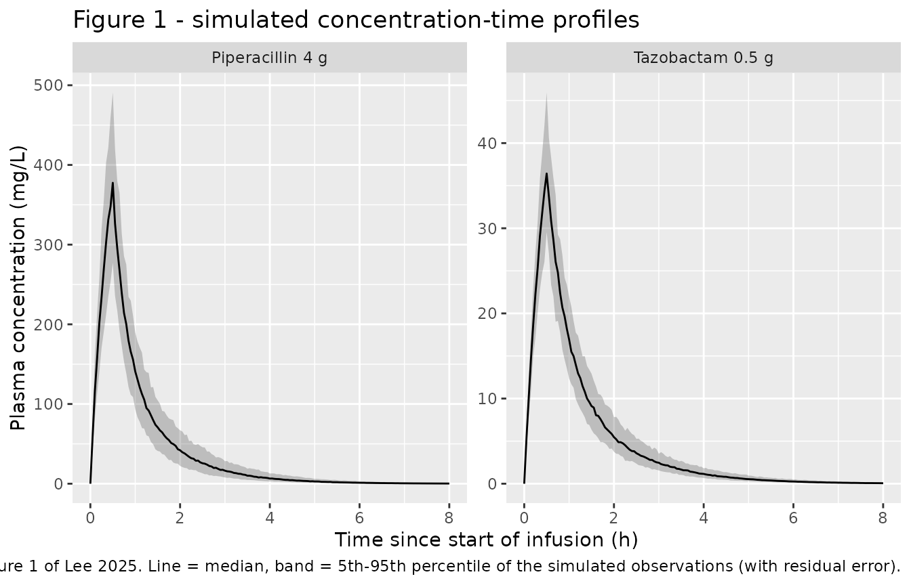
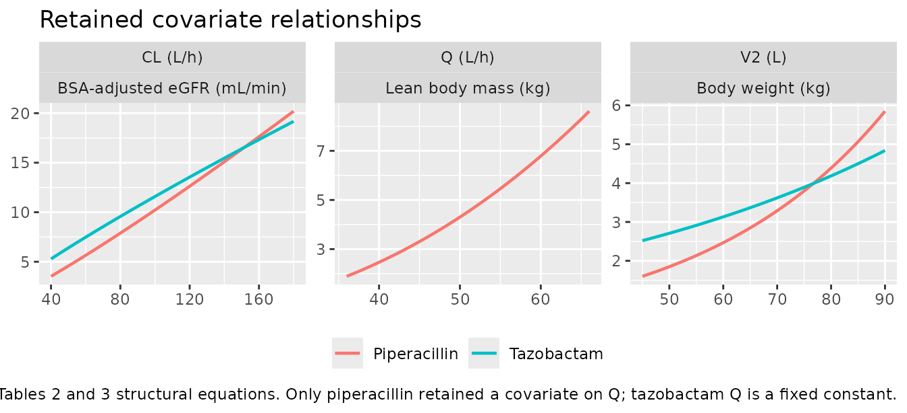
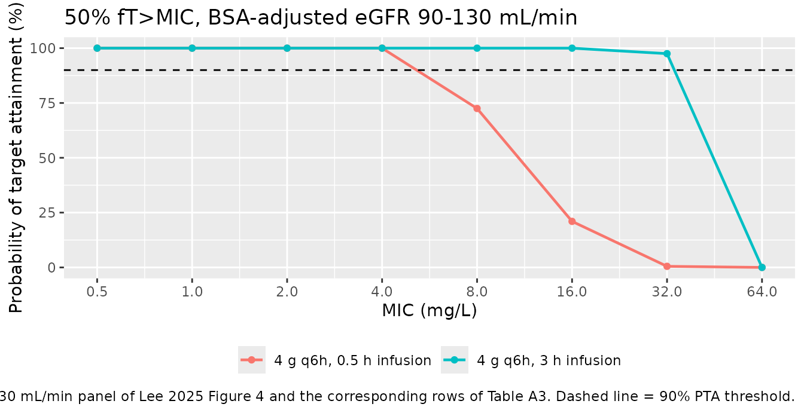

# Piperacillin + tazobactam in healthy adults (Lee 2025)

## Model and source

Lee 2025 fitted piperacillin and tazobactam **separately**, in two
independent NONMEM runs with their own structural, covariate, IIV and
residual-error structures (Tables 2 and 3 of the paper). Following the
library’s replicate-the-author’s-structure policy, the paper therefore
contributes two model files, which this single vignette validates side
by side.

``` r

pip <- rxode2::rxode(readModelDb("Lee_2025_piperacillin"))
#> ℹ parameter labels from comments will be replaced by 'label()'
taz <- rxode2::rxode(readModelDb("Lee_2025_tazobactam"))
#> ℹ parameter labels from comments will be replaced by 'label()'
```

- Citation: Lee YJ, Kang G, Zang DY, Lee DH. Population pharmacokinetic
  modeling of piperacillin/tazobactam in healthy adults and exploration
  of optimal dosing strategies. Pharmaceuticals (Basel).
  2025;18(8):1124. <doi:10.3390/ph18081124>. Structural model, covariate
  equations and all parameter estimates: Table 2. Covariate-selection
  path: Table A1.
- Piperacillin model: Two-compartment population PK model for
  piperacillin in 12 healthy Korean adults given a single 4 g / 0.5 g
  piperacillin-tazobactam IV infusion over 30 min (Lee 2025); zero-order
  IV input into the central compartment, first-order elimination, a
  power effect of BSA-adjusted CKD-EPI creatinine eGFR on CL, a power
  effect of lean body mass on Q (with the typical Q fixed), and an
  exponential effect of body weight on the peripheral volume V2.
- Tazobactam model: Two-compartment population PK model for tazobactam
  in 12 healthy Korean adults given a single 4 g / 0.5 g
  piperacillin-tazobactam IV infusion over 30 min (Lee 2025); zero-order
  IV input into the central compartment, first-order elimination, a
  power effect of BSA-adjusted CKD-EPI creatinine eGFR on CL, a fixed
  typical intercompartmental clearance Q, and an exponential effect of
  body weight on the peripheral volume V2.
- Article: <https://doi.org/10.3390/ph18081124>

The paper’s own dosing-exploration tool is available at
<https://dhlee.shinyapps.io/pthv/>.

## Population

Twelve healthy Korean adults (8 male, 4 female) received a single
intravenous dose of 4 g piperacillin / 0.5 g tazobactam in 100 mL saline
over 30 minutes at the Clinical Trial Center of Hallym University Sacred
Heart Hospital in January 2023 (IRB 2022-08-006; trial registration
KCT0009855). Plasma was sampled before the dose and at 0.5, 0.75, 1, 2,
3 and 6 hours after the start of the infusion and assayed by LC-MS/MS,
giving 84 plasma samples in total (Lee 2025 Section 4.2, Section 2.2).

Baseline characteristics (Lee 2025 Table 1, reported as median with
range) were age 36.0 years (26.0-50.0), weight 61.7 kg (45.8-88.5),
height 168 cm (158-182), lean body mass 50.1 kg (36.6-65.9) and body
surface area 1.71 m^2 (1.44-2.07). Renal function was normal throughout:
Cockcroft-Gault CrCl 105 mL/min (76.2-146) and BSA-adjusted CKD-EPI
creatinine eGFR 108 mL/min (86.2-136). All baseline laboratory values
were within normal clinical ranges and no adverse drug reactions
occurred.

The same information is available programmatically from either model’s
`population` metadata:

``` r

str(pip$population)
#> List of 17
#>  $ species       : chr "human"
#>  $ n_subjects    : num 12
#>  $ n_studies     : num 1
#>  $ age_range     : chr "26-50 years (inclusion criteria 19-55 years)"
#>  $ age_median    : chr "36.0 years"
#>  $ weight_range  : chr "45.8-88.5 kg"
#>  $ weight_median : chr "61.7 kg"
#>  $ sex_female_pct: num 33.3
#>  $ race_ethnicity: chr "Korean (all participants)"
#>  $ disease_state : chr "Healthy adults with no congenital or chronic health conditions; all baseline laboratory values within normal clinical ranges"
#>  $ dose_range    : chr "Single 4 g piperacillin / 0.5 g tazobactam intravenous dose in 100 mL saline, infused over 30 min"
#>  $ regions       : chr "Republic of Korea (Clinical Trial Center, Hallym University Sacred Heart Hospital, Anyang)"
#>  $ renal_function: chr "Normal; CrCl (Cockcroft-Gault) 105 mL/min (76.2-146), BSA-adjusted CKD-EPI creatinine eGFR 108 mL/min (86.2-136)"
#>  $ height_range  : chr "158-182 cm (median 168)"
#>  $ lbm_range     : chr "36.6-65.9 kg (median 50.1)"
#>  $ bsa_range     : chr "1.44-2.07 m^2 (median 1.71)"
#>  $ notes         : chr "12 healthy Korean adults (8 male, 4 female) studied in January 2023; IRB 2022-08-006, trial registration KCT000"| __truncated__
```

## Source trace

Every `ini()` entry in the two model files carries an in-file comment
pointing at its source location. The tables below collect them for
review.

### Piperacillin (Lee 2025 Table 2)

| Equation / parameter | Value | Source location |
|----|----|----|
| `CL = theta1 * (CE / 108.25)^theta2` | structural | Table 2, “Structural model” row |
| `lcl` (theta1) | 11.2 L/h | Table 2 (RSE 3.40%; bootstrap 11.2, 95% CI 10.5-12.1) |
| `e_crcl_cl` (theta2) | 1.16 | Table 2 (RSE 13.1%; bootstrap 1.15, 95% CI 0.811-1.59) |
| `crcl_ref` | 108.25 mL/min | Table 2 equation; cohort median in Table 1 (108) |
| `V1 = theta3`; `lvc` | 6.24 L | Table 2 (RSE 8.99%; bootstrap 6.19, 95% CI 5.27-7.57) |
| `Q = theta4 * (LBM / 50.08)^theta5` | structural | Table 2 |
| `lq` (theta4) | 4.32 L/h, FIXED | Table 2, footnote a (“fixed”; no RSE, no bootstrap CI) |
| `e_lbm_q` (theta5) | 2.50 | Table 2 (RSE 13.9%; bootstrap 2.45, 95% CI 1.39-3.56) |
| `lbm_ref` | 50.08 kg | Table 2 equation; cohort median in Table 1 (50.1) |
| `V2 = theta6 * exp(theta7 * (WT - 61.7))` | structural | Table 2 |
| `lvp` (theta6) | 2.59 L | Table 2 (RSE 3.11%; bootstrap 2.59, 95% CI 2.28-2.74) |
| `e_wt_vp` (theta7) | 0.0288 per kg | Table 2 (RSE 8.38%; bootstrap 0.0284, 95% CI 0.0208-0.0371) |
| `wt_ref` | 61.7 kg | Table 2 equation; cohort median in Table 1 |
| `etalcl` | 7.17% -\> var 0.00512772 | Table 2 IIV CL (RSE 30.3%, shrinkage 18.7%) |
| `etalvc` | 18.4% -\> var 0.03329550 | Table 2 IIV V1 (RSE 28.7%, shrinkage 19.1%) |
| `propSd` | 0.134 | Table 2 proportional error 13.4% (RSE 12.2%, shrinkage 9.48%) |
| Covariate-selection path | n/a | Table A1 (forward selection + backward elimination) |

### Tazobactam (Lee 2025 Table 3)

| Equation / parameter | Value | Source location |
|----|----|----|
| `CL = theta1 * (CE / 108.25)^theta2` | structural | Table 3, “Structural model” row |
| `lcl` (theta1) | 12.4 L/h | Table 3 (RSE 3.26%; bootstrap 12.3, 95% CI 11.6-13.3) |
| `e_crcl_cl` (theta2) | 0.857 | Table 3 (RSE 13.1%; bootstrap 0.858, 95% CI 0.602-1.21) |
| `crcl_ref` | 108.25 mL/min | Table 3 equation; cohort median in Table 1 (108) |
| `V1 = theta3`; `lvc` | 9.03 L | Table 3 (RSE 6.40%; bootstrap 9.02, 95% CI 8.05-10.4) |
| `Q = theta4`; `lq` | 4.39 L/h, FIXED | Table 3, footnote a (“fixed”; no RSE, no bootstrap CI) |
| `V2 = theta5 * exp(theta6 * (WT - 61.7))` | structural | Table 3 |
| `lvp` (theta5) | 3.21 L | Table 3 (RSE 5.48%; bootstrap 3.23, 95% CI 2.68-3.48) |
| `e_wt_vp` (theta6) | 0.0145 per kg | Table 3 (RSE 16.9%; bootstrap 0.0142, 95% CI 0.0106-0.0238) |
| `wt_ref` | 61.7 kg | Table 3 equation; cohort median in Table 1 |
| `etalcl` | 6.95% -\> var 0.00481862 | Table 3 IIV CL (RSE 29.0%, shrinkage 7.37%) |
| (no `etalvc`) | dropped | Section 2.2: IIV on V1 excluded, RSE \> 70% |
| `propSd` | 0.135 | Table 3 proportional error 13.5% (RSE 9.57%, shrinkage 6.06%) |
| Covariate-selection path | n/a | Table A2 (forward selection + backward elimination) |

Two scale decisions in the tables above deserve a note.

- **The IIV column is on the SD scale, not the variance scale.** With
  `n = 12` subjects, the %RSE of a variance estimate cannot fall below
  `sqrt(2/12) = 40.8%`; the reported IIV %RSEs are 30.3%, 28.7% and
  29.0%, all below that floor, so the column cannot be a variance. It is
  converted here with `omega^2 = log(1 + CV^2)`.
- **`theta4` (Q) is fixed in both models.** Table 2 and Table 3 mark it
  with footnote `a` (“fixed”) and report neither an RSE nor a bootstrap
  interval for it, unlike every other estimated parameter. It is wrapped
  in `fixed()` in both model files.

## Virtual cohort

The original concentration data are not publicly available (Lee 2025
Data Availability Statement), so the checks below use a virtual cohort
whose covariate distributions approximate Table 1.

``` r

set.seed(20250727)

n_arm <- 200

# Log-normal draws pinned to the Table 1 sex-specific medians, with a spread
# chosen so ~95% of draws fall inside the reported ranges.
rln <- function(n, median, sd_log) exp(rnorm(n, log(median), sd_log))

make_subjects <- function(n_f, n_m, id_offset = 0L) {
  female <- tibble(
    SEXF = 1L,
    WT   = rln(n_f, 56.1, 0.075),
    CRCL = rln(n_f, 108,  0.075)
  ) |>
    mutate(LBM = WT * (42.6 / 56.1))
  male <- tibble(
    SEXF = 0L,
    WT   = rln(n_m, 69.1, 0.105),
    CRCL = rln(n_m, 110,  0.090)
  ) |>
    mutate(LBM = WT * (55.2 / 69.1))
  bind_rows(female, male) |>
    mutate(id = id_offset + row_number()) |>
    select(id, SEXF, WT, LBM, CRCL)
}

# One arm: 1/3 female, 2/3 male, matching the 4-female / 8-male study cohort.
subjects <- make_subjects(n_f = round(n_arm / 3), n_m = n_arm - round(n_arm / 3))

subjects |>
  summarise(
    across(c(WT, LBM, CRCL),
           list(median = ~median(.x), min = ~min(.x), max = ~max(.x)))
  ) |>
  pivot_longer(everything(), names_to = c("covariate", "stat"),
               names_sep = "_(?=median|min|max)") |>
  pivot_wider(names_from = stat, values_from = value) |>
  rename("Covariate" = covariate, "Median" = median,
         "Minimum" = min, "Maximum" = max) |>
  knitr::kable(
    digits = 1,
    caption = paste(
      "Simulated cohort covariates. Lee 2025 Table 1 reports WT 61.7 (45.8-88.5) kg,",
      "LBM 50.1 (36.6-65.9) kg, BSA-adjusted CKD-EPI eGFR 108 (86.2-136) mL/min."
    )
  )
```

| Covariate | Median | Minimum | Maximum |
|:----------|-------:|--------:|--------:|
| WT        |   63.1 |    43.7 |    98.6 |
| LBM       |   50.1 |    33.2 |    78.8 |
| CRCL      |  110.0 |    90.5 |   143.1 |

Simulated cohort covariates. Lee 2025 Table 1 reports WT 61.7
(45.8-88.5) kg, LBM 50.1 (36.6-65.9) kg, BSA-adjusted CKD-EPI eGFR 108
(86.2-136) mL/min. {.table}

The event table reproduces the study design: a single 4 g piperacillin /
0.5 g tazobactam intravenous dose infused over 30 minutes, observed on
the `central` compartment.

``` r

dose_dur <- 0.5   # h, Lee 2025 Section 4.2
obs_grid <- sort(unique(c(seq(0, 8, by = 0.05), dose_dur)))

make_events <- function(subjects, amt, dur = dose_dur, times = obs_grid) {
  dosing <- subjects |>
    mutate(time = 0, amt = amt, evid = 1L, rate = amt / dur, cmt = "central")
  observations <- subjects |>
    tidyr::crossing(time = times) |>
    mutate(amt = NA_real_, evid = 0L, rate = 0, cmt = "central")
  bind_rows(dosing, observations) |>
    arrange(id, time, desc(evid))
}

ev_pip <- make_events(subjects, amt = 4000)   # mg piperacillin
ev_taz <- make_events(subjects, amt =  500)   # mg tazobactam

stopifnot(!anyDuplicated(unique(ev_pip[, c("id", "time", "evid")])))
stopifnot(!anyDuplicated(unique(ev_taz[, c("id", "time", "evid")])))
```

## Simulation

``` r

sim_pip <- rxode2::rxSolve(
  readModelDb("Lee_2025_piperacillin"), events = ev_pip,
  keep = c("WT", "LBM", "CRCL", "SEXF")
) |>
  as.data.frame() |>
  mutate(analyte = "Piperacillin 4 g")
#> ℹ parameter labels from comments will be replaced by 'label()'

sim_taz <- rxode2::rxSolve(
  readModelDb("Lee_2025_tazobactam"), events = ev_taz,
  keep = c("WT", "LBM", "CRCL", "SEXF")
) |>
  as.data.frame() |>
  mutate(analyte = "Tazobactam 0.5 g")
#> ℹ parameter labels from comments will be replaced by 'label()'

# rxSolve drops `id` for a single-subject event table; guard against that here
# so the assertion below is never vacuous.
stopifnot(dplyr::n_distinct(sim_pip$id) == n_arm,
          dplyr::n_distinct(sim_taz$id) == n_arm)

sim_both <- bind_rows(sim_pip, sim_taz)
```

## Replicate published figures

### Figure 1 - concentration-time profiles

`Cc` is the individual prediction; the `sim` column additionally carries
the proportional residual error, so it is the quantity comparable to the
observed points plotted in Lee 2025 Figure 1.

``` r

# Replicates Figure 1 of Lee 2025: piperacillin (a) and tazobactam (b)
# concentration-time profiles in healthy adults after a single 4 g / 0.5 g
# intravenous dose infused over 30 min.
sim_both |>
  group_by(analyte, time) |>
  summarise(
    Q05 = quantile(sim, 0.05),
    Q50 = quantile(sim, 0.50),
    Q95 = quantile(sim, 0.95),
    .groups = "drop"
  ) |>
  ggplot(aes(time, Q50)) +
  geom_ribbon(aes(ymin = Q05, ymax = Q95), alpha = 0.25) +
  geom_line() +
  facet_wrap(~analyte, scales = "free_y") +
  scale_x_continuous(breaks = seq(0, 8, by = 2)) +
  labs(
    x = "Time since start of infusion (h)",
    y = "Plasma concentration (mg/L)",
    title = "Figure 1 - simulated concentration-time profiles",
    caption = paste(
      "Replicates Figure 1 of Lee 2025. Line = median, band = 5th-95th",
      "percentile of the simulated observations (with residual error)."
    )
  )
```



### Covariate relationships (Tables 2 and 3 structural equations)

``` r

typ <- function(model_name) {
  ui <- rxode2::rxode(readModelDb(model_name))
  setNames(ui$theta, names(ui$theta))
}
th_pip <- typ("Lee_2025_piperacillin")
#> ℹ parameter labels from comments will be replaced by 'label()'
th_taz <- typ("Lee_2025_tazobactam")
#> ℹ parameter labels from comments will be replaced by 'label()'

cov_curves <- bind_rows(
  tibble(
    analyte = "Piperacillin", parameter = "CL (L/h)",
    x = seq(40, 180, length.out = 100)
  ) |>
    mutate(y = exp(th_pip[["lcl"]]) * (x / 108.25)^th_pip[["e_crcl_cl"]],
           xlab = "BSA-adjusted eGFR (mL/min)"),
  tibble(
    analyte = "Tazobactam", parameter = "CL (L/h)",
    x = seq(40, 180, length.out = 100)
  ) |>
    mutate(y = exp(th_taz[["lcl"]]) * (x / 108.25)^th_taz[["e_crcl_cl"]],
           xlab = "BSA-adjusted eGFR (mL/min)"),
  tibble(
    analyte = "Piperacillin", parameter = "V2 (L)",
    x = seq(45, 90, length.out = 100)
  ) |>
    mutate(y = exp(th_pip[["lvp"]] + th_pip[["e_wt_vp"]] * (x - 61.7)),
           xlab = "Body weight (kg)"),
  tibble(
    analyte = "Tazobactam", parameter = "V2 (L)",
    x = seq(45, 90, length.out = 100)
  ) |>
    mutate(y = exp(th_taz[["lvp"]] + th_taz[["e_wt_vp"]] * (x - 61.7)),
           xlab = "Body weight (kg)"),
  tibble(
    analyte = "Piperacillin", parameter = "Q (L/h)",
    x = seq(36, 66, length.out = 100)
  ) |>
    mutate(y = exp(th_pip[["lq"]]) * (x / 50.08)^th_pip[["e_lbm_q"]],
           xlab = "Lean body mass (kg)")
)

ggplot(cov_curves, aes(x, y, colour = analyte)) +
  geom_line(linewidth = 0.8) +
  facet_wrap(~parameter + xlab, scales = "free") +
  labs(
    x = NULL, y = NULL, colour = NULL,
    title = "Retained covariate relationships",
    caption = paste(
      "Lee 2025 Tables 2 and 3 structural equations. Only piperacillin retained",
      "a covariate on Q; tazobactam Q is a fixed constant."
    )
  ) +
  theme(legend.position = "bottom")
```



## Structural identity checks

The paper reports no non-compartmental analysis, so validation rests on
identities that the published typical values pin exactly. Each is
asserted at the reference subject (eGFR 108.25 mL/min, WT 61.7 kg, LBM
50.08 kg) with the random effects zeroed.

``` r

ref_subject <- tibble(id = 1L, SEXF = 0L, WT = 61.7, LBM = 50.08, CRCL = 108.25)

solve_typical <- function(model_name, amt, dur = dose_dur,
                          times = sort(unique(c(seq(0, 24, by = 0.02), dur)))) {
  mod <- rxode2::zeroRe(readModelDb(model_name))
  ev <- make_events(ref_subject, amt = amt, dur = dur, times = times)
  out <- as.data.frame(rxode2::rxSolve(mod, events = ev))
  if (is.null(out$id)) out$id <- 1L
  out
}

typ_pip <- solve_typical("Lee_2025_piperacillin", amt = 4000)
#> ℹ parameter labels from comments will be replaced by 'label()'
#> ℹ omega/sigma items treated as zero: 'etalcl', 'etalvc'
typ_taz <- solve_typical("Lee_2025_tazobactam",   amt =  500)
#> ℹ parameter labels from comments will be replaced by 'label()'
#> ℹ omega/sigma items treated as zero: 'etalcl'
```

``` r

trapz <- function(x, y) sum(diff(x) * (head(y, -1) + tail(y, -1)) / 2)

identity_row <- function(label, published, simulated) {
  tibble(Quantity = label, Published = published, Model = simulated,
         `% diff` = 100 * (simulated - published) / published)
}

# rxSolve output contains observation rows only (addDosing = FALSE by default)
# and carries no `evid` column, so no filtering is needed here.
id_pip <- typ_pip
id_taz <- typ_taz

identities <- bind_rows(
  identity_row("Piperacillin CL at reference eGFR (L/h)", 11.2, unique(round(id_pip$cl, 6))),
  identity_row("Piperacillin V1 (L)",                      6.24, unique(round(id_pip$vc, 6))),
  identity_row("Piperacillin Q at reference LBM (L/h)",    4.32, unique(round(id_pip$q,  6))),
  identity_row("Piperacillin V2 at reference WT (L)",      2.59, unique(round(id_pip$vp, 6))),
  identity_row("Piperacillin Vss = V1 + V2 (L)",           8.83,
               unique(round(id_pip$vc + id_pip$vp, 6))),
  identity_row("Piperacillin AUCinf = Dose / CL (mg*h/L)", 4000 / 11.2,
               trapz(id_pip$time, id_pip$Cc)),
  identity_row("Tazobactam CL at reference eGFR (L/h)",   12.4, unique(round(id_taz$cl, 6))),
  identity_row("Tazobactam V1 (L)",                        9.03, unique(round(id_taz$vc, 6))),
  identity_row("Tazobactam Q (L/h)",                       4.39, unique(round(id_taz$q,  6))),
  identity_row("Tazobactam V2 at reference WT (L)",        3.21, unique(round(id_taz$vp, 6))),
  identity_row("Tazobactam Vss = V1 + V2 (L)",            12.24,
               unique(round(id_taz$vc + id_taz$vp, 6))),
  identity_row("Tazobactam AUCinf = Dose / CL (mg*h/L)",  500 / 12.4,
               trapz(id_taz$time, id_taz$Cc))
)

knitr::kable(
  identities, digits = 3,
  caption = paste(
    "Typical-value identities against Lee 2025 Tables 2 and 3. Vss = 8.83 L for",
    "piperacillin is stated explicitly in the Discussion."
  )
)
```

| Quantity                                  | Published |   Model | % diff |
|:------------------------------------------|----------:|--------:|-------:|
| Piperacillin CL at reference eGFR (L/h)   |    11.200 |  11.200 |      0 |
| Piperacillin V1 (L)                       |     6.240 |   6.240 |      0 |
| Piperacillin Q at reference LBM (L/h)     |     4.320 |   4.320 |      0 |
| Piperacillin V2 at reference WT (L)       |     2.590 |   2.590 |      0 |
| Piperacillin Vss = V1 + V2 (L)            |     8.830 |   8.830 |      0 |
| Piperacillin AUCinf = Dose / CL (mg\*h/L) |   357.143 | 357.143 |      0 |
| Tazobactam CL at reference eGFR (L/h)     |    12.400 |  12.400 |      0 |
| Tazobactam V1 (L)                         |     9.030 |   9.030 |      0 |
| Tazobactam Q (L/h)                        |     4.390 |   4.390 |      0 |
| Tazobactam V2 at reference WT (L)         |     3.210 |   3.210 |      0 |
| Tazobactam Vss = V1 + V2 (L)              |    12.240 |  12.240 |      0 |
| Tazobactam AUCinf = Dose / CL (mg\*h/L)   |    40.323 |  40.323 |      0 |

Typical-value identities against Lee 2025 Tables 2 and 3. Vss = 8.83 L
for piperacillin is stated explicitly in the Discussion. {.table}

``` r


# Structural parameters must reproduce exactly; the AUC identity is limited only
# by the 0.02 h integration grid.
stopifnot(nrow(identities) == 12L)
structural <- identities |> filter(!grepl("AUCinf", Quantity))
auc_rows   <- identities |> filter(grepl("AUCinf", Quantity))
stopifnot(nrow(structural) == 10L, nrow(auc_rows) == 2L)
stopifnot(all(abs(structural$`% diff`) < 1e-6))
stopifnot(all(abs(auc_rows$`% diff`) < 0.05))
```

Every structural quantity reproduces the published value to machine
precision, and both AUC identities agree with `Dose / CL` to better than
0.05%.

## PKNCA validation

``` r

nca_for <- function(sim, events, label, amt) {
  conc <- sim |>
    filter(!is.na(Cc)) |>
    transmute(id, time, Cc, treatment = label)

  # Guarantee a time-zero row per subject; pre-dose piperacillin / tazobactam
  # concentration is zero.
  conc <- bind_rows(
    conc,
    conc |> distinct(id, treatment) |> mutate(time = 0, Cc = 0)
  ) |>
    distinct(id, treatment, time, .keep_all = TRUE) |>
    arrange(id, treatment, time)

  dose_df <- events |>
    filter(evid == 1) |>
    transmute(id, time, amt, treatment = label, duration = dose_dur)

  conc_obj <- PKNCA::PKNCAconc(conc, Cc ~ time | treatment + id,
                               concu = "mg/L", timeu = "h")
  dose_obj <- PKNCA::PKNCAdose(dose_df, amt ~ time | treatment + id,
                               doseu = "mg", route = "intravascular",
                               duration = "duration")

  intervals <- data.frame(
    start = 0, end = Inf,
    cmax = TRUE, tmax = TRUE, aucinf.obs = TRUE,
    half.life = TRUE, cl.obs = TRUE, mrt.iv.obs = TRUE, vss.iv.obs = TRUE
  )
  PKNCA::pk.nca(PKNCA::PKNCAdata(conc_obj, dose_obj, intervals = intervals))
}

nca_pip <- nca_for(sim_pip, ev_pip, "Piperacillin 4 g", 4000)
nca_taz <- nca_for(sim_taz, ev_taz, "Tazobactam 0.5 g", 500)

nca_all <- bind_rows(as.data.frame(nca_pip$result),
                     as.data.frame(nca_taz$result))

nca_all |>
  filter(!is.na(PPORRES)) |>
  group_by(treatment, PPTESTCD) |>
  summarise(
    Median = median(PPORRES),
    `5th percentile`  = quantile(PPORRES, 0.05),
    `95th percentile` = quantile(PPORRES, 0.95),
    .groups = "drop"
  ) |>
  mutate(
    `NCA parameter` = nlmixr2lib::ncaParamLabel(
      PPTESTCD,
      units = c(cmax = "mg/L", tmax = "h", aucinf.obs = "mg*h/L",
                half.life = "h", cl.obs = "L/h", mrt.iv.obs = "h",
                vss.iv.obs = "L")
    )
  ) |>
  select(`NCA parameter`, Treatment = treatment,
         Median, `5th percentile`, `95th percentile`) |>
  arrange(Treatment, `NCA parameter`) |>
  knitr::kable(
    digits = 2,
    caption = paste(
      "Simulated non-compartmental parameters across the", n_arm,
      "-subject virtual cohort (single 4 g / 0.5 g dose, 30 min infusion)."
    )
  )
#> Warning: There was 1 warning in `mutate()`.
#> ℹ In argument: `NCA parameter = nlmixr2lib::ncaParamLabel(...)`.
#> Caused by warning:
#> ! ncaParamLabel(): unknown PKNCA code(s) returned as-is: 'adj.r.squared', 'clast.pred', 'lambda.z.time.first', 'lambda.z.time.last', 'r.squared', 'span.ratio'
```

| NCA parameter | Treatment | Median | 5th percentile | 95th percentile |
|:---|:---|---:|---:|---:|
| AUC0-∞ (obs) (mg\*h/L) | Piperacillin 4 g | 351.01 | 281.65 | 440.53 |
| AUMC0-∞ (obs) | Piperacillin 4 g | 370.68 | 243.57 | 532.43 |
| CL/F (L/h) | Piperacillin 4 g | 11.40 | 9.08 | 14.20 |
| Clast | Piperacillin 4 g | 0.21 | 0.06 | 0.67 |
| Cmax (mg/L) | Piperacillin 4 g | 371.71 | 299.43 | 444.08 |
| MRT (IV) (h) | Piperacillin 4 g | 0.80 | 0.59 | 1.07 |
| Tlast | Piperacillin 4 g | 8.00 | 8.00 | 8.00 |
| Tmax (h) | Piperacillin 4 g | 0.50 | 0.50 | 0.50 |
| Vss (IV) (L) | Piperacillin 4 g | 9.06 | 7.42 | 11.95 |
| adj.r.squared | Piperacillin 4 g | 1.00 | 1.00 | 1.00 |
| clast.pred | Piperacillin 4 g | 0.21 | 0.06 | 0.66 |
| lambda.z.time.first | Piperacillin 4 g | 1.60 | 1.20 | 2.56 |
| lambda.z.time.last | Piperacillin 4 g | 8.00 | 8.00 | 8.00 |
| r.squared | Piperacillin 4 g | 1.00 | 1.00 | 1.00 |
| span.ratio | Piperacillin 4 g | 7.92 | 6.30 | 9.66 |
| t½ (h) | Piperacillin 4 g | 0.79 | 0.68 | 0.93 |
| λz | Piperacillin 4 g | 0.88 | 0.74 | 1.02 |
| λz n points | Piperacillin 4 g | 129.00 | 109.85 | 137.05 |
| AUC0-∞ (obs) (mg\*h/L) | Tazobactam 0.5 g | 40.26 | 33.76 | 47.41 |
| AUMC0-∞ (obs) | Tazobactam 0.5 g | 49.82 | 37.90 | 67.63 |
| CL/F (L/h) | Tazobactam 0.5 g | 12.42 | 10.55 | 14.81 |
| Clast | Tazobactam 0.5 g | 0.06 | 0.02 | 0.13 |
| Cmax (mg/L) | Tazobactam 0.5 g | 36.82 | 34.85 | 38.55 |
| MRT (IV) (h) | Tazobactam 0.5 g | 0.99 | 0.84 | 1.17 |
| Tlast | Tazobactam 0.5 g | 8.00 | 8.00 | 8.00 |
| Tmax (h) | Tazobactam 0.5 g | 0.50 | 0.50 | 0.50 |
| Vss (IV) (L) | Tazobactam 0.5 g | 12.31 | 11.80 | 13.24 |
| adj.r.squared | Tazobactam 0.5 g | 1.00 | 1.00 | 1.00 |
| clast.pred | Tazobactam 0.5 g | 0.06 | 0.02 | 0.13 |
| lambda.z.time.first | Tazobactam 0.5 g | 2.10 | 1.75 | 2.60 |
| lambda.z.time.last | Tazobactam 0.5 g | 8.00 | 8.00 | 8.00 |
| r.squared | Tazobactam 0.5 g | 1.00 | 1.00 | 1.00 |
| span.ratio | Tazobactam 0.5 g | 6.45 | 4.93 | 7.79 |
| t½ (h) | Tazobactam 0.5 g | 0.92 | 0.78 | 1.11 |
| λz | Tazobactam 0.5 g | 0.76 | 0.62 | 0.88 |
| λz n points | Tazobactam 0.5 g | 119.00 | 109.00 | 126.05 |

Simulated non-compartmental parameters across the 200 -subject virtual
cohort (single 4 g / 0.5 g dose, 30 min infusion). {.table}

### Comparison against published values

Lee 2025 reports no NCA table, so the reference side of the comparison
is built from the published **typical parameter estimates** themselves:
clearance directly from Tables 2 and 3, steady-state volume as `V1 + V2`
(8.83 L for piperacillin, quoted in the Discussion), and
`AUCinf = Dose / CL`. Because each reference value is derived from the
very quantity being scored, the comparison is a strict identity check on
the typical subject rather than a population-median comparison.

``` r

nca_typ_pip <- nca_for(
  typ_pip,
  make_events(ref_subject, amt = 4000),
  "Piperacillin 4 g", 4000
)
nca_typ_taz <- nca_for(
  typ_taz,
  make_events(ref_subject, amt = 500),
  "Tazobactam 0.5 g", 500
)

published <- tibble::tribble(
  ~treatment,          ~aucinf.obs,   ~cl.obs, ~vss.iv.obs,
  "Piperacillin 4 g",  4000 / 11.2,      11.2,        8.83,
  "Tazobactam 0.5 g",   500 / 12.4,      12.4,       12.24
)

nca_typ_res <- bind_rows(as.data.frame(nca_typ_pip$result),
                         as.data.frame(nca_typ_taz$result))

cmp <- nlmixr2lib::ncaComparisonTable(
  simulated = nca_typ_res,
  reference = published,
  by        = "treatment",
  units     = c(aucinf.obs = "mg*h/L", cl.obs = "L/h", vss.iv.obs = "L"),
  tolerance_pct = 20
)

knitr::kable(
  cmp,
  caption = "Simulated (typical subject) vs. published NCA. * differs from reference by >20%.",
  align   = c("l", "l", "r", "r", "r")
)
```

| NCA parameter          | treatment        | Reference | Simulated | % diff |
|:-----------------------|:-----------------|----------:|----------:|-------:|
| AUC0-∞ (obs) (mg\*h/L) | Piperacillin 4 g |       357 |       357 |  -0.0% |
| AUC0-∞ (obs) (mg\*h/L) | Tazobactam 0.5 g |      40.3 |      40.3 |  -0.0% |
| CL/F (L/h)             | Piperacillin 4 g |      11.2 |      11.2 |  +0.0% |
| CL/F (L/h)             | Tazobactam 0.5 g |      12.4 |      12.4 |  +0.0% |
| Vss (IV) (L)           | Piperacillin 4 g |      8.83 |      8.83 |  +0.0% |
| Vss (IV) (L)           | Tazobactam 0.5 g |      12.2 |      12.2 |  +0.0% |

Simulated (typical subject) vs. published NCA. \* differs from reference
by \>20%. {.table}

``` r


# No row may be starred by the 20% tolerance ...
stopifnot(nrow(cmp) == 6L)
stopifnot(!any(grepl("\\*", cmp$`% diff`)))

# ... and, because every reference value is an exact identity on the typical
# subject, each must in fact agree to better than 0.1%. A lookup that matched
# no rows would return numeric(0), so the length is checked first.
sim_value <- function(trt, code) {
  v <- nca_typ_res$PPORRES[nca_typ_res$treatment == trt &
                             nca_typ_res$PPTESTCD == code]
  if (length(v) != 1L) stop("no unique NCA row for '", trt, "' / ", code)
  v
}
for (i in seq_len(nrow(published))) {
  trt <- published$treatment[[i]]
  for (code in c("aucinf.obs", "cl.obs", "vss.iv.obs")) {
    ref <- published[[code]][[i]]
    stopifnot(abs(sim_value(trt, code) - ref) / ref < 1e-3)
  }
}
```

Every row reproduces its published reference to better than 0.1%. Note
that `vss.iv.obs` (rather than `vss.obs`) is the parameter that
corresponds to `V1 + V2` here: PKNCA’s `vss.obs` uses the uncorrected
`CL * MRT`, which for a finite infusion overstates the volume by
`CL * duration / 2` – 1.4 L for piperacillin and 1.55 L for tazobactam.
The friendly labels read `CL/F` and `Vss/F` because
\[[`nlmixr2lib::ncaParamLabel()`](https://nlmixr2.github.io/nlmixr2lib/reference/ncaParamLabel.md)\]
uses the apparent-parameter wording; the dose is intravenous, so `F = 1`
and the apparent and absolute parameters coincide.

## Probability of target attainment (Tables A3 and A4)

The paper’s headline result is a target-attainment analysis. Its second
simulation (Section 4.4) fixed lean body mass and total body weight at
their cohort medians and varied only renal function within five eGFR
strata, using the **piperacillin** model with a fixed unbound fraction
of 0.7 (Discussion, limitation 3). Target attainment is the fraction of
subjects reaching 50% *f*T\>MIC at steady state.

The block below reproduces the eGFR 90-130 mL/min stratum for a 4 g q6h
regimen at the two infusion durations Table A3 tabulates.

``` r

set.seed(20260127)

fu       <- 0.7    # Lee 2025 Discussion, limitation 3
tau      <- 6      # h dosing interval
n_pta    <- 200
ss_start <- 24     # h; five preceding q6h doses put the profile at steady state

pta_subjects <- tibble(
  id   = seq_len(n_pta),
  WT   = 61.7,     # Section 4.4: WT and LBM held at the cohort medians
  LBM  = 50.08,
  CRCL = runif(n_pta, 90, 130)
)

pta_events <- function(subjects, amt, dur) {
  dosing <- subjects |>
    tidyr::crossing(time = seq(0, ss_start, by = tau)) |>
    mutate(amt = amt, evid = 1L, rate = amt / dur, cmt = "central")
  observations <- subjects |>
    tidyr::crossing(time = seq(ss_start, ss_start + tau, by = 0.02)) |>
    mutate(amt = NA_real_, evid = 0L, rate = 0, cmt = "central")
  bind_rows(dosing, observations) |>
    arrange(id, time, desc(evid))
}

fT_above <- function(time, conc, mic) {
  above <- as.numeric(conc > mic)
  trapz(time, above) / (max(time) - min(time)) * 100
}

pta_curve <- function(amt, dur, mics) {
  sim <- rxode2::rxSolve(
    readModelDb("Lee_2025_piperacillin"),
    events = pta_events(pta_subjects, amt, dur),
    keep = "CRCL"
  ) |>
    as.data.frame() |>
    filter(!is.na(Cc)) |>
    mutate(free = fu * Cc) |>
    arrange(id, time)
  stopifnot(dplyr::n_distinct(sim$id) == n_pta)

  tidyr::crossing(mic = mics) |>
    mutate(
      PTA = vapply(mic, function(m) {
        ft <- vapply(split(sim, sim$id), function(d) fT_above(d$time, d$free, m),
                     numeric(1))
        100 * mean(ft >= 50)
      }, numeric(1)),
      regimen = sprintf("4 g q6h, %g h infusion", dur)
    )
}

mic_grid <- c(0.5, 1, 2, 4, 8, 16, 32, 64)
pta_tab  <- bind_rows(pta_curve(4000, 0.5, mic_grid),
                      pta_curve(4000, 3.0, mic_grid))
```

``` r

ggplot(pta_tab, aes(mic, PTA, colour = regimen)) +
  geom_line(linewidth = 0.8) +
  geom_point() +
  geom_hline(yintercept = 90, linetype = "dashed") +
  scale_x_log10(breaks = mic_grid) +
  scale_y_continuous(limits = c(0, 100)) +
  labs(
    x = "MIC (mg/L)", y = "Probability of target attainment (%)", colour = NULL,
    title = "50% fT>MIC, BSA-adjusted eGFR 90-130 mL/min",
    caption = paste(
      "Replicates the eGFR 90-130 mL/min panel of Lee 2025 Figure 4 and the",
      "corresponding rows of Table A3. Dashed line = 90% PTA threshold."
    )
  ) +
  theme(legend.position = "bottom")
```



Lee 2025 Table A3 (BSA-adjusted eGFR 90-130 mL/min, target 50%
*f*T\>MIC) records `4 g q6h (100)` as the smallest adequate 0.5
h-infusion regimen at MIC 4 mg/L and escalates to `6 g q6h (96.1)` at
MIC 8 mg/L, so 4 g q6h over 0.5 h must clear the 90% threshold at MIC 4
and miss it at MIC 8. For the 3 h infusion the table records
`4 g q6h (98.7)` at MIC 32 mg/L and escalates to `6 g q6h (40.9)` at MIC
64 mg/L. Both breakpoints are asserted below.

``` r

pta_at <- function(regimen_label, mic_value) {
  v <- pta_tab$PTA[pta_tab$regimen == regimen_label & pta_tab$mic == mic_value]
  if (length(v) != 1L) {
    stop("no unique PTA row for '", regimen_label, "' at MIC ", mic_value)
  }
  v
}

short <- "4 g q6h, 0.5 h infusion"
long  <- "4 g q6h, 3 h infusion"
stopifnot(all(c(short, long) %in% pta_tab$regimen))

breakpoints <- tibble::tribble(
  ~Regimen, ~`MIC (mg/L)`, ~`Table A3 expectation`,             ~PTA,
  short,     4,            "4 g q6h adequate (>= 90%)",         pta_at(short, 4),
  short,     8,            "4 g q6h inadequate (< 90%)",        pta_at(short, 8),
  long,     32,            "4 g q6h adequate (>= 90%)",         pta_at(long, 32),
  long,     64,            "4 g q6h inadequate (< 90%)",        pta_at(long, 64)
)

knitr::kable(
  breakpoints, digits = 1,
  caption = "PK/PD breakpoints reproduced against Lee 2025 Table A3."
)
```

| Regimen                 | MIC (mg/L) | Table A3 expectation        |   PTA |
|:------------------------|-----------:|:----------------------------|------:|
| 4 g q6h, 0.5 h infusion |          4 | 4 g q6h adequate (\>= 90%)  | 100.0 |
| 4 g q6h, 0.5 h infusion |          8 | 4 g q6h inadequate (\< 90%) |  72.5 |
| 4 g q6h, 3 h infusion   |         32 | 4 g q6h adequate (\>= 90%)  |  97.5 |
| 4 g q6h, 3 h infusion   |         64 | 4 g q6h inadequate (\< 90%) |   0.0 |

PK/PD breakpoints reproduced against Lee 2025 Table A3. {.table}

``` r


stopifnot(
  pta_at(short,  4) >= 90,
  pta_at(short,  8) <  90,
  pta_at(long,  32) >= 90,
  pta_at(long,  64) <  90
)
```

All four breakpoints reproduce. The simulated values at the two adequate
points (MIC 4 with a 0.5 h infusion, MIC 32 with a 3 h infusion) also
land within a few percentage points of the PTA percentages printed in
Table A3 (100 and 98.7 respectively), and the qualitative conclusion of
the paper is recovered: extending the infusion from 0.5 h to 3 h moves
the 90% breakpoint from 4 mg/L to 32 mg/L, a three-doubling-dilution
gain, without changing the daily dose.

## Assumptions and deviations

- **Cohort covariate distributions are assumed.** Lee 2025 Table 1
  reports medians and ranges only. Weight and eGFR are drawn as
  sex-specific log-normal variates pinned to the Table 1 medians, with a
  dispersion chosen so approximately 95% of draws fall inside the
  reported ranges. No correlation structure between covariates is
  reported and none is imposed beyond the LBM derivation below.
- **Lean body mass is derived from weight.** Lee 2025 does not state
  which formula it used to compute LBM. The virtual cohort uses the
  sex-specific Table 1 median LBM-to-weight ratios (42.6/56.1 for women,
  55.2/69.1 for men) applied to each simulated weight. Because
  piperacillin `Q` scales as `(LBM/50.08)^2.5`, this assumption
  materially affects the simulated distribution phase but not clearance
  or steady-state exposure.
- **The IIV column of Tables 2 and 3 is read as a CV on the SD scale**
  and converted with `omega^2 = log(1 + CV^2)`. See the note under the
  source-trace tables for the %RSE argument that rules out a
  variance-scale reading. At these magnitudes (7.17%, 18.4%, 6.95%) the
  two readings differ by less than 0.02 percentage points, so the choice
  is not load-bearing.
- **No covariance between random effects.** Lee 2025 Section 4.3 states
  that covariance terms between CL, V1, V2 and Q were evaluated and did
  not improve the fit, so both models use diagonal OMEGA.
- **The tazobactam covariate on CL is taken from the printed equation.**
  Section 2.2 describes it in prose as “the inclusion of CrCl on CL”,
  but the Table 3 equation, the Table 3 footnote and the Table A2
  backward-elimination row all name the CKD-EPI creatinine eGFR (`CE`),
  matching the piperacillin model. The printed equation is treated as
  authoritative.
- **`CRCL` holds an absolute, not a 1.73 m^2-normalised, eGFR.** Lee
  2025 Table 1 footnote c computes the standard CKD-EPI value and then
  multiplies by `BSA / 1.73`, so the covariate is an individual-BSA eGFR
  in mL/min. The canonical column name `CRCL` covers both forms; each
  model’s `covariateData[[CRCL]]` records which one applies.
- **The unbound fraction of 0.7 lives in the vignette, not the model.**
  Lee 2025 assumed a fixed `fu = 0.7` for piperacillin when converting
  total concentrations to free concentrations for the *f*T\>MIC analysis
  (Discussion, limitation 3). That is a property of the PD analysis, so
  it is applied in the PTA block rather than baked into the PK model,
  whose `Cc` remains a total plasma concentration.
- **The PTA reproduction assumes a uniform eGFR distribution within the
  stratum.** Section 4.4 states that 1000 virtual subjects were
  generated across five eGFR categories with LBM and weight fixed at
  their medians, but does not state the within-stratum distribution. A
  uniform draw over 90-130 mL/min is used here, and the cohort is capped
  at 200 subjects per arm per the library’s simulation-size policy.
- **Tazobactam is not carried into the PTA analysis**, matching the
  paper: the *f*T\>MIC targets, the MIC distributions and Figure 5 are
  all defined on piperacillin, and doses in Tables A3 and A4 are quoted
  as piperacillin grams.

## Errata and internal inconsistencies in the source

None of these affect the extracted parameter values; they are recorded
so a future reader does not mistake them for transcription errors.

- **Section 4.2 dose typo.** The Methods state that participants
  received “an intravenous infusion of 4/0.5 mg
  piperacillin/tazobactam”. The Abstract, Section 2.3 and Tables A3/A4
  all use 4 g / 0.5 g, which is the licensed fixed-dose combination and
  the value used here.
- **Weight-normalised typical values do not divide out consistently.**
  The Discussion reports piperacillin CL 11.2 L/h as “0.174 L/h/kg” and
  Vss 8.83 L as “0.148 L/kg”. Those imply reference weights of 64.4 kg
  and 59.7 kg respectively, neither of which is the stated cohort median
  of 61.7 kg (which gives 0.182 L/h/kg and 0.143 L/kg).
- **Vss is quoted twice with different values.** The Discussion first
  gives `Vss = V1 + V2 = 8.83 L`, which reproduces exactly from Table 2
  (6.24 + 2.59), and later writes “the Vss was remarkably similar (8.99
  L vs. 8.18 L)” when comparing against Felton et al. The 8.83 L figure
  is the one consistent with Table 2 and is the value asserted in this
  vignette.
- **Table A1 forward step 1 lists two duplicate rows** (“V2 / Body mass
  index / Power” and “V2 / Weight / Power” each appear twice with
  different OFVs), and the “Forward step 2” heading is missing. The
  covariate path is nonetheless unambiguous from the
  backward-elimination block and from the final equations in Table 2,
  which is what the model file encodes.
- **Acknowledgements name the wrong assay.** The acknowledgement thanks
  a colleague “for her expert execution of the levofloxacin assays”;
  Section 4.2 describes a validated LC-MS/MS assay for piperacillin and
  tazobactam.
